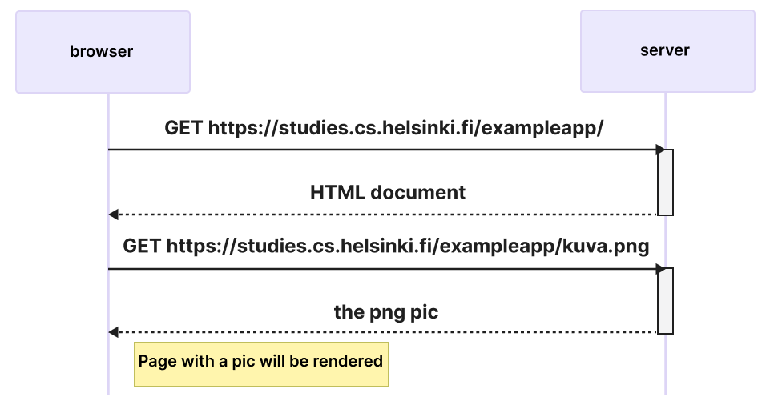
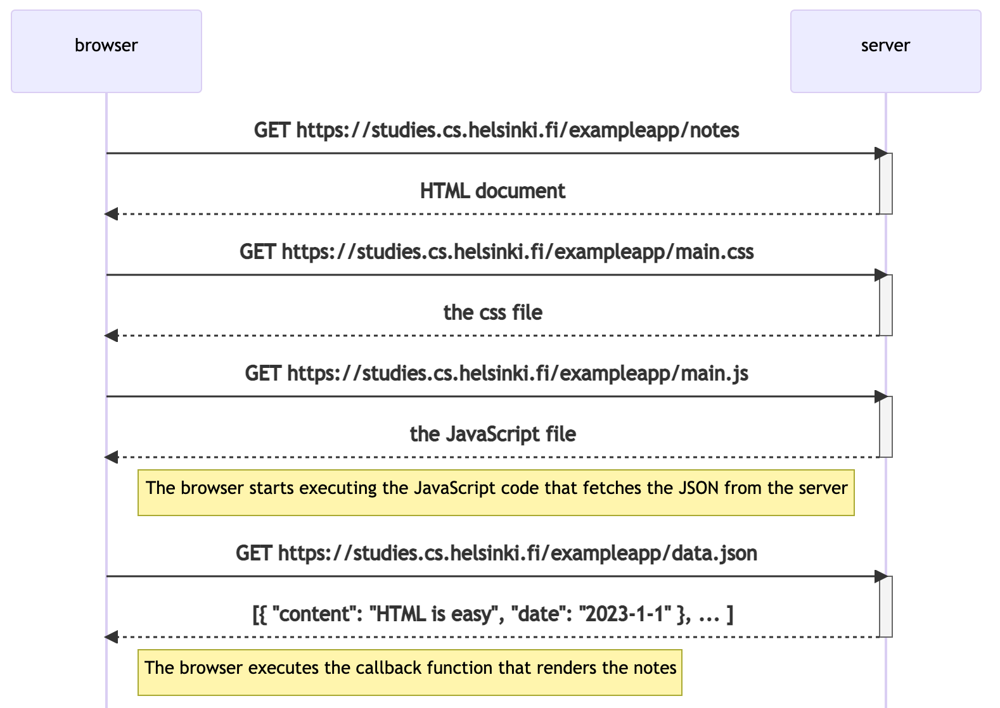

<div class="content">

قبل البدء بالبرمجة، سنتعرف على بعض مبادئ تطوير الويب من خلال العمل على تطبيق تعليمي على <https://studies.cs.helsinki.fi/exampleapp>.

سنركز على هذا التطبيق فقط لشرح المفاهيم الأساسية لهذه الدورة. التطبيق لا يعكس على الأطلاق *كيفية* بناء تطبيقات الويب الحديثة. بل على العكس، يوضح بعض التقنيات القديمة التي الآن قد يعتبرها البعض *ممارسات سيئة* في تطوير الويب.

اعتبارا من [الجزء 1](/en/part1)، سيتوافق الكود مع الممارسات الحديثة.

افتح [التطبيق التعليمي](https://studies.cs.helsinki.fi/exampleapp) في المتصفح. أحيانا قد يستغرق تحميله فترة ما.

تم إعداد محتوى الدورة باستخدام متصفح كروم وملائما له.

**أول قاعدة في تطوير الويب:** احرص دائما على إبقاء وحدة تحكم المطور داخل المتصفح (Developer Console) مفتوحة.  
في macOS يمكنك فتحها عبر fn-F12 أو option-cmd-i، وفي Windows/Linux عبر Fn-F12 أو ctrl-shift-i.  
يمكنك أيضا فتحها من خلال [القائمة المنبثقة](https://ar.wikipedia.org/wiki/قائمة_منبثقة).

تذكر أن تبقي وحدة تحكم المطور مفتوحة دائما أثناء تطوير تطبيقات الويب.

تبدو وحدة تحكم المطور هكذا:


تأكد من فتح تبويب **Network** وتفعيل خيار **Disable cache**. قد يكون خيار **Preserve log** مفيدا أيضا لأنه يحفظ السجلات حتى بعد إعادة تحميل الصفحة. ويمكنك أيضا تفعيل خيار "Hide extension URLs" لإخفاء أي طلب HTTP تقوم بها إضافات المتصفح (ليس ظاهرا في الصورة).

**ملاحظة:** تبويب **Console** هو الأكثر أهمية، لكننا سنستخدم تبويب **Network** بشكل كبير في هذه المقدمة.

### HTTP GET

يتواصل المتصفح والخادوم معا عبر بروتوكول [HTTP](https://developer.mozilla.org/en-US/docs/Web/HTTP)؛ بينما يُظهر تبويب <i>Network</i> كيفية التواصل.

عندما تقوم بإعادة تحميل الصفحة (يتم هذا عبر ضغط  على الزرين _Fn_-_F5_ في Windows. اضغط على _command_-_R_ إن كنت تستخدم macOS. يمكنك أيضا الضغط على علامة &#8635 في متصفحك). ستُظهر وحدة تحكم المطور الحدثين التاليين:

<!-- - The browser has fetched the contents of the page <i>studies.cs.helsinki.fi/exampleapp</i> from the server
- And has downloaded the image <i>kuva.png</i> -->

- قد تم إحضار محتويات صفحة <i>studies.cs.helsinki.fi/exampleapp</i> من الخادوم، 
- وتحميل صورة <i>kuva.png</i> من قبل المتصفح 


قد تحتاج إلى تكبير نافذة وحدة التحكم لرؤية هذه العناصر إذا كنت على شاشة صغيرة.
عند ضغطك على الحدث الأول ستظهر المزيد من المعلومات عما يحدث:


يظهر القسم علوي <i>General</i> أن المتصفح قد قام بعمل طلب على العنوان <i><https://studies.cs.helsinki.fi/exampleapp></i> (هناك اختلاف بسيط في العنوان منذ التقاط  هذه الصورة) بطريقة [GET](https://developer.mozilla.org/en-US/docs/Web/HTTP/Methods/GET) وأن الطلب كان ناجحا لأن الخادوم قد قام بالاستجابة بـ[رمز الحالة (status code)](https://ar.wikipedia.org/wiki/قائمة_رموز_حالة_بروتوكول_نقل_النص_الفائق) 200.
يحتوي الطلب واستجابة الخادوم على عدد من [الترويسات (headers)](https://ar.wikipedia.org/wiki/قائمة_حقول_ترويسة_بروتوكول_نقل_النص_الفائق):


تخبرنا <i>ترويسات الاستاجبة</i> (Response headers)، على سبيل المثال، عن حجم الاستجابة بالبايت وزمن الاستجابة. إحدى الترويسات المهمة هي [Content-Type](https://developer.mozilla.org/en-US/docs/Web/HTTP/Headers/Content-Type) إذ تخبرنا أن الاستجابة عبارة عن ملف نصيّ بتنسيق [utf-8](https://en.wikipedia.org/wiki/UTF-8) وأن محتواها تم تنسيقه بلغة HTML. هكذا سيدرك المتصفح أن الاستجابة هي مجرد صفحة [HTML](https://en.wikipedia.org/wiki/HTML) عادية وسيقوم بعرضها "كصفحة ويب".

يُظهر تبويب <i>Response</i> "بيانات" الاستاجبة وهي عبارة عن صفحة HTML عادية. يحدد قسم <i>body</i> هيكل الصفحة المعروضة على الصفحة:


تحتوي الصفحة على عنصر [div](https://developer.mozilla.org/en-US/docs/Web/HTML/Element/div) حيث بدوره يحتوي على تروسية ورابط إلى صفحة <i>notes</i> وأيضا على وسمة  [img](https://developer.mozilla.org/en-US/docs/Web/HTML/Element/img) و كما أنه يظهر عدد الملاحظات (notes) التي تم إنشاؤها.


بسبب وجود وسمة img يقوم المتصفح بأداء طلب HTTP جديد لإحضار (أداء عملية fetching) صورة <i>kuva.png</i> من الخادوم. تكون تفاصيل الطلب كالتالي:


قد تم إرسال الطلب إلى العنوان <https://studies.cs.helsinki.fi/exampleapp/kuva.png> حيث إن الطريقة المستعملة هي HTTP GET. تخبرنا ترويسات الاستجابة أن حجم الاستجابة 89350 بايت و نوع محتوى الاستجابة (ظاهر في تروسية [Content-type](https://developer.mozilla.org/en-US/docs/Web/HTTP/Headers/Content-Type)) هو <i>image/png</i>؛ أي أنه صورة png. یستخدم المتصفح هذه المعلومات لعرض الصورة على الشاشة بشكل صحيح.

يمكن رؤية مسار الأحداث بعد فتح صفحة <https://studies.cs.helsinki.fi/exampleapp> على المتصفح في المخطط التتبعي (sequence diagram) التالي:



يصوّر المخطط التتبعي كيفية تواصل المتصفح والخادوم مع بعضهم البعض خلال فترة معينة. ينحدر الزمان من الأعلى إلى الأسفل؛ لهذا السبب يبدأ البرنامج بعد إرسال أول طلب من المتصفح إلى الخادوم، تليها الاستجابة.

أولا، يقوم المتصفح بعمل طلب HTTP بطريقة GET لإحضار كود HTML الخاص بالصفحة. وسمة <i>img</i> تدفع المتصفح إلى إحضار صورة <i>kuva.png</i>. يقوم المتصفح بعرض صفحة HTML وأيضا الصورة على الشاشة.

رغم أنه من الصعب الملاحظة، ستبدأ صفحة HTML بالعرض قبل إحضار الصورة من الخادوم.

### تطبيقات الويب التقليدية

تعمل الصفحة الرئيسية في التطبيق التعليمي <i>كتطبيق ويب تقليدي</i>. عند دخول الصفحة، يقوم المتصفح بعملية إحضار مستند HTML حيث يفصّل بدوره بنية ونص محتوى الصفحة القادمة من الخادوم.

<!-- The server has formed this document somehow. The document can be a <i>static</i> text file saved into the server's directory. The server can also form the HTML documents <i>dynamically</i> according to the application's code, using, for example, data from a database.
The HTML code of the example application has been formed dynamically because it contains information on the number of created notes. -->

قد أنشأ الخادوم هذا المستند بطريقة أو بأخرى. من الممكن أن يكون المستند ملفا نصيّا <i>"إستاتيكيا" (static file)</i>. من الممكن أيضا للخادوم أن ينشئ المستندات بشكل "ديناميكي" حسب كود التطبيق، باستخدام بيانات من قاعدة البيانات على سبيل المثال.
تم إنشاء كود HTML الخاص بالتطبيق التعليمي بشكل نشط لأنه يحتوي على معلومات حول عدد الملاحظات التي تم إنشاؤها.

قد تم إنشاء كود HTML الخاص بالصفحة الرئيسية بشكل ديناميكي على الخادوم، كما يظهر في التالي:


```js
const getFrontPageHtml = noteCount => {
  return `
    <!DOCTYPE html>
    <html>
      <head>
      </head>
      <body>
        <div class='container'>
          <h1>Full stack example app</h1>
          <p>number of notes created ${noteCount}</p>
          <a href='/notes'>notes</a>
          
        </div>
      </body>
    </html>
`
}

app.get('/', (req, res) => {
  const page = getFrontPageHtml(notes.length)
  res.send(page)
})
```

ليس من المفترض منك أن تفهم الكود بعد.

قد تم حفظ محتوى صفحة HTML كـ"قالب نصي" (template string) أي بمعنى أن سلسلة نصية تسمح بمعالجة المتغيرات، على سبيل المثال، كـ <em>noteCount</em>
 في داخلها. في داخل القالب النصي، يتم استبدال الجزء الديناميكي لدى الصفحة، أي هو عدد الملاحظات (<em>noteCount</em> في الكود) بعدد الملاحظات الحالي (<em>notes.length</em> في الكود).

كتابة HTML في منتصف الكود ليس خيارا ذكيا، لكن لمبرمجي PHP القدماء كان هذا أمرا عاديا.

في تطبيقات الويب التقليدية، يكون المتصفح "غبيّا"، حيث إنه یکتفي بإحضار بيانات HTML من الخادوم، في حين تكون كل آلية عمل التطبيق في الخادوم. يمكن إنشاء خادوم باستخدام [Java Spring](https://spring.io/projects/spring-framework) ،[Python Flask](https://flask.palletsprojects.com/en/2.2.x/)، أو [Ruby on Rails](http://rubyonrails.org/) على سبيل المثال لا الحصر

يستخدم هذا التطبيق التعليمي مكتبة [Express](https://expressjs.com/) إلى جانب Node.js. في هذه الدورة، سنستخدم Node.js وExpress.js لإنشاء خوادم ويب.
### نقل آلية التطبيق إلى المتصفح

<!-- Keep the Developer Console open. Empty the console by clicking the 🚫 symbol, or by typing clear() in the console.
Now when you go to the [notes](https://studies.cs.helsinki.fi/exampleapp/notes) page, the browser does 4 HTTP requests: -->

أبقِ وحدة تحكم المتصفح مفتوحة. أخلِ وحدة التحكم بالضغط على علامة 🚫 أو كتابة <span dir="ltr">clear()</span> في الوحدة التحكم.
الآن، عندما تذهب إلى صفحة [notes](https://studies.cs.helsinki.fi/exampleapp/notes)، ستجد أن المتصفح قد قام بإرسال 4 طلبات:


لكل طلب نوع <i>خاص به</i>. نوع الطلب الأول <i>document (مستند)</i> وهو عبارة عن كود HTML الخاص بالصفحة، حيث إنه يبدو كالتالي:


<!-- When we compare the page shown on the browser and the HTML code returned by the server, we notice that the code does not contain the list of notes.
The [head](https://developer.mozilla.org/en-US/docs/Web/HTML/Element/head) section of the HTML contains a [script](https://developer.mozilla.org/en-US/docs/Web/HTML/Element/script) tag, which causes the browser to fetch a JavaScript file called <i>main.js</i>. -->

عندما نقوم بمقارنة الصفحة الظاهرة على المتصفح وكود HTML من الخادوم، سنلاحظ أن الكود لا يحتوي على قائمة الملاحظات.
يحتوي قسم [head](https://developer.mozilla.org/en-US/docs/Web/HTML/Element/head) في كود HTML على وسمة [script](https://developer.mozilla.org/en-US/docs/Web/HTML/Element/script)، حيث إنها تجعل المتصفح يُحضر ملف JavaScript يُدعى <i>main.js</i>. 


يبدو كود JavaScript كالتالي:

```js
var xhttp = new XMLHttpRequest()

xhttp.onreadystatechange = function() {
  if (this.readyState == 4 && this.status == 200) {
    const data = JSON.parse(this.responseText)
    console.log(data)

    var ul = document.createElement('ul')
    ul.setAttribute('class', 'notes')

    data.forEach(function(note) {
      var li = document.createElement('li')

      ul.appendChild(li)
      li.appendChild(document.createTextNode(note.content))
    })

    document.getElementById('notes').appendChild(ul)
  }
}

xhttp.open('GET', '/data.json', true)
xhttp.send()
```

لا تهمنا تفاصيل الكود حاليا، لكننا أشملناه لإضافة لمسة حيوية للصور والنص. سنقوم بالبدء بالبرمجة كما ينبغي في [الجزء 1](/en/part1). بالحقيقة، الكود النموذجي ليس بذي صلة على الإطلاق بالتقنيات البرمجية في هذه الدورة. 
>  قد يتساءل البعض لماذا استخدمنا xhttp-object بدلا عن fetch الحديث. السبب هو أنه لا نريد أن تعمق في إمكانية "الوعود" (promises) المتاحة في لغة JavaScript بعد، وأن الكود في هذا الجزء يكون يعمل دورا ثانويا. سنلجأ إلى طرق حديثة لعمل الطلبات إلى الخادوم في [الجزء 2](/en/part2).
بعد إحضار وسمة <i>script</i> مباشرةً، يبدأ المتصفح بتنفيذ الكود.

يقوم السطران الأخيران بإرشاد المتصفح لعمل طلب HTTP بطريقة GET إلى عنوان <span dir="ltr"><i>/data.json</i></span> على الخادوم:

```js
xhttp.open('GET', '/data.json', true)
xhttp.send()
```

هذا هو آخر طلب يظهر في تبويب Network في الأسفل.

يمكننا الذهاب إلى عنوان <https://studies.cs.helsinki.fi/exampleapp/data.json> مباشرةً من المتصفح:


هناك، نرى الملاحظات (notes) كـ"بيانات خام" بتنسيق [JSON](https://en.wikipedia.org/wiki/JSON). في الحالة الاعتيادية، المتصفحات المبنية على Chromium ليست جيدة في عرض بيانات JSON. يمكن تحميل مكونات إضافية للتنسيق. قم بتنزيل [JSONView](https://chromewebstore.google.com/detail/gmegofmjomhknnokphhckolhcffdaihd) على متصفح كروم، على سبيل المثال، ومن ثم قم بإعادة تحميل الصفحة. ستبدو البيانات منسّقة بشكل جميل:


إذاً، يقوم كود JavaScript الخاص بصفحة الملاحظات في الأعلى بتنزيل بيانات JSON والتي تحتوي على الملاحظات، ومن ثم إنشاء قائمة نقطية للملاحظات:

يتم تنفيذ هذا باستخدام الكود التالي:


```js
const data = JSON.parse(this.responseText)
console.log(data)

var ul = document.createElement('ul')
ul.setAttribute('class', 'notes')

data.forEach(function(note) {
  var li = document.createElement('li')

  ul.appendChild(li)
  li.appendChild(document.createTextNode(note.content))
})

document.getElementById('notes').appendChild(ul)
```

سيقوم الكود في البداية بإنشاء قائمة غير مرتبة باستخدام وسمة [ul](https://developer.mozilla.org/en-US/docs/Web/HTML/Element/ul)...

```js
var ul = document.createElement('ul')
ul.setAttribute('class', 'notes')
```

ومن ثم تُضاف وسمة [li](https://developer.mozilla.org/en-US/docs/Web/HTML/Element/li) لكل ملاحظة (note). في كل ملاحظة (note)، حقل "<i>content</i>" هو الوحيد الذي سيكون المحتوى لوسمة li. الطوابع الزمنية الموجودة في البيانات الخام غير مستخدمة هنا لأي شيء كان.

```js
data.forEach(function(note) {
  var li = document.createElement('li')

  ul.appendChild(li)
  li.appendChild(document.createTextNode(note.content))
})
```

الآن، افتح تبويب <i>Console</i> على وحدة تحكم المطور:


عند ضغطك على المثلث الصغير في بدية كل سطر، سيمكنك توسيع النص على الوحدة.


يظهر هذا الإخراج على وحدة التحكم بسبب أمر <em>console.log</em> في الكود:

```js
const data = JSON.parse(this.responseText)
console.log(data)
```

إذاً، بعد استلام البيانات من الخادوم، يقوم الكود بطبعها في وحدة التحكم.

ستعتاد على تبويب <i>Console</i> وأمر <em>console.log</em> جدا خلال هذه الدورة.
### معالجو الحدث ودوال رد النداء
بنية هذا الكود غريبة بعض الشيء:

```js
var xhttp = new XMLHttpRequest()

xhttp.onreadystatechange = function() {
  // code that takes care of the server response
}

xhttp.open('GET', '/data.json', true)
xhttp.send()
```

نرى أن الطلب إلى الخادوم يتم إرساله في السطر الأخير، لكن يمكننا العثور على الكود الخاص بمعالجة الاستجابة في الأعلى. ماذا يجري؟

```js
xhttp.onreadystatechange = function () {
```

في هذا السطر، تم تعريف معالج حدث (event handler) للحدث <i>onreadystatechange</i> للعنصر <em>xhttp</em> الذي يقوم بهذا الطلب. عندما تتغير حالة (state) العنصر، يقوم المتصفح بنداء معالج الحدث. من ثم يتحقق الكود في الدالة أن [readyState](https://developer.mozilla.org/en-US/docs/Web/API/XMLHttpRequest/readyState) يساوي 4 (أي بمعنى أن <i>العملية تمت بنجاح</i>) وأن رمز حالة HTTP هو 200. 

```js
xhttp.onreadystatechange = function() {
  if (this.readyState == 4 && this.status == 200) {
    // code that takes care of the server response
  }
}
```

آلية نداء معالجي الحدث شائعة جدا في JavaScript. يُسمى معالجو الحدث بـ["دوال رد النداء (callback functions)"](https://developer.mozilla.org/en-US/docs/Glossary/Callback_function). لا يقوم كود التطبيق بنداء الدوال بنفسه، بل بيئة وقت التشغيل (runtime environment) أي المتصفح تقوم بهذا الأمر في الوقت المناسب، عندما <i>الحدث</i> يحدث.
### نموذج عناصر المستند
يمكننا أن ننظر إلى صفحات HTML كهياكل شجرية ضمنية.

```
html
  head
    link
    script
  body
    div
      h1
      div
        ul
          li
          li
          li
      form
        input
        input
```
يمكن رؤية نفس الهيكل الشجري الشكل على تبويب <i>Elements</i> في وحدة التحكم.


يعتمد عمل المتصفح على فكرة تمثيل عناصر HTML على هيئة شجرة.
نموذج عناصر المستند (Document Object Model أو [DOM](https://en.wikipedia.org/wiki/Document_Object_Model)، كما أنه يُعرف بنموذج "كائن" المستند في بعض الترجمات) هو عبارة عن واجهة برمجة تطبيقات (Application Programming Interface أو <i>API</i>) تتيح إجراء تعديلات برمجية على <i>أشجار العنصار</i> المتعلقة بصفحات الويب.
قام كود JavaScript في الفصل السابق باستخدام واجهة DOM لإضافة قائمة من الملاحظات إلى الصفحة.
يقوم الكود التالي بإنشاء عقدة (node) جديدة وتخصيصها بالمتغير  <em>ul</em>، ومن ثم إضافة بعض العقد التابعة إليها:

```js
var ul = document.createElement('ul')

data.forEach(function(note) {
  var li = document.createElement('li')

  ul.appendChild(li)
  li.appendChild(document.createTextNode(note.content))
})
```

Finally, the tree branch of the <em>ul</em> variable is connected to its proper place in the HTML tree of the whole page:

أخيرا، يلتحق فرع الشجرة التابع للمتغير <em>ul</em> بشجرة HTML الخاصة بالصفحة بأكملها:

```js
document.getElementById('notes').appendChild(ul)
```
### التحكم بعنصر المستند من وحدة التحكم

تُسمى العقدة الأعلى في شجرة DOM الخاصة بمستند HTML، عنصر <em>المستند</em> (document object). يمكننا تنفيذ عمليات عديدة على صفحة ويب ما، باستخدام واجهة DOM. يمكنك الوصول إلى عنصر <em>المستند</em> من خلال كتابة <em>document</em> في تبويب Console:


دعنا نضف ملاحظة جديدة إلى الصفحة من خلال وحدة التحكم:

أولا، سنحصل على قائمة الملاحظات من الصفحة. القائمة في أول عنصر ul في الصفحة:

```js
list = document.getElementsByTagName('ul')[0]
```
ومن ثم ننشئ عنصر li جديدا ونضيف نصا إليه:

```js
newElement = document.createElement('li')
newElement.textContent = 'Page manipulation from console is easy'
```
ونضيف عنصر li الجديد إلى القائمة:

```js
list.appendChild(newElement)
```


حتى لو أن الصفحة تتحدث على متصفحك، فإن التغييرات ليست دائمة. إذا تم إعادة تحميل الصفحة، ستختفي الملاحظة الجديدة، لأن التغييرات لم تُرسل إلى الخادم. سيقوم كود JavaScript، الذي يُحضره المتصفح، دائما بإنشاء قائمة الملاحظات بناءا على بيانات JSON من العنوان <https://studies.cs.helsinki.fi/exampleapp/data.json>. 

### CSS

يحتوي عنصر <i>head</i> في كود HTML الخاص بصفحة الملاحظات (Notes) على وسمة [link](https://developer.mozilla.org/en-US/docs/Web/HTML/Element/link) حيث إنها تحدد أن على المتصفح إحضار ملف [CSS](https://developer.mozilla.org/en-US/docs/Web/CSS) من الموقع [main.css](https://studies.cs.helsinki.fi/exampleapp/main.css).

"أوراق الأنماط المتتالية" (Cascading Style Sheets أو CSS) هي لغة تنسيق تُستخدم لتحديد مظهر صفحات الويب.
يبدو ملف CSS المُحضر من الخادوم كالتالي:

```css
.container {
  padding: 10px;
  border: 1px solid;
}

.notes {
  color: blue;
}
```

يقوم الملف بتعريف "محدد فئات" ([class selectors](https://developer.mozilla.org/en-US/docs/Web/CSS/Class_selectors)). تُستخدم محددات الفئات لتحديد أجزاء ما من الصفحة وأيضا لتعريف قواعد تنسيق لتنسيقها.
يبدأ تعريف محدد الفئة دائما بنقطة ومن ثم يليه اسم الفئة (class).

الفئات هي عبارة عن سمات ([attributes](https://developer.mozilla.org/en-US/docs/Web/HTML/Global_attributes/class))، يمكن إضافتها إلى عناصر HTML.
يمكن فحص سمات CSS على تبويب <i>Elements</i> في وحدة التحكم:


يحتوي عنصر <i>div</i> الأعلى مستوى على فئة <i>container</i>. العنصر <i>ul</i> الذي يحتوي على قائمة الملاحظات يحتوي على فئة <i>notes</i>.

تحدد قاعدة CSS [حدودا (border)](https://developer.mozilla.org/en-US/docs/Web/CSS/border) بعرض بكسل واحد لأي عنصر ذي فئة <i>container</i>. تقوم القاعدة أيضا بتحديد [هامش داخلي (padding)](https://developer.mozilla.org/en-US/docs/Web/CSS/padding) للعنصر، أي مساحة فارغة ما بين محتوى العنصر وحدوده.

تقوم قاعدة CSS الثانية بتحديد اللون الأزرق لنص كل عنصر ذي فئة <i>notes</i>.
من الممكن لعناصر HTML أن تحتوي على سمات أخرى غير الفئات. لدى عنصر <i>div</i> والذي يحتوي على الملاحظات، سمة [المعرف (id)](https://developer.mozilla.org/en-US/docs/Web/HTML/Global_attributes/id). يستخدم كود JavaScript المعرف للعثور على العنصر.

من الممكن استخدام تبويب <i>Elements</i> لتنسيق العناصر.


لن تكون التعديلات من داخل وحدة التحكم دائمة. إذا أردت أن تقوم بتعديلات دائمة، يجب على التنسيقات أن تكون محفوظة في ملف تنسيق على الخادوم.

### تحميل صفحة تحتوي على JavaScript - مراجعة

دعنا نراجع ماذا يحدث عندما تُفتح صفحة <https://studies.cs.helsinki.fi/exampleapp/notes> على المتصفح.



- يقوم المتصفح بإحضار كود HTML والذي يحدد محتوى وهيكل الصفحة، من الخادوم باستخدام طلب HTTP بطريقة GET.
- الروابط في كود HTML تجعل المتصفح يُحضر تنسيقات CSS في داخل ملف <i>main.css</i>...
- ...وكود JavaScript في داخل ملف <i>main.js</i>.
- يقوم المتصفح بتنفيذ كود JavaScript. الكود يقوم بعمل طلب HTTP بطريقة GET على عنوان <https://studies.cs.helsinki.fi/exampleapp/data.json>، حيث يقوم بإرجاع الملاحظات كبيانات JSON.
- عندما تكون البيانات قد تم إحضارها، يقوم المتصفح بتنفيذ <i>معالج حدث</i>، حيث يقوم بعرض الملاحظات على الصفحة باستخدام واجهة DOM.

### النماذج وHTTP POST

في هذه المرحلة، دعنا نتفحص كيفية إضافة ملاحظة جديدة.

تتحوي صفحة الملاحظات (Notes) على [عنصر form](https://developer.mozilla.org/en-US/docs/Learn/HTML/Forms/Your_first_HTML_form) الخاصة بإنشاء نماذج.


عندما يتم الضغط على الزر داخل النموذج، يقوم المتصفح بإرسال إدخال المستخدم إلى الخادوم. دعنا نفتح تبويب <i>Network</i> لكي نرى كيف يبدو إرسال النماذج:


<!-- Surprisingly, submitting the form causes no fewer than <i>five</i> HTTP requests.
The first one is the form submit event. Let's zoom into it: -->

من المدهش أن إرسال النموذج قد تطلّب ما لا يقل عن <i>خمس</i> طلبات HTTP.
 أولها هو حدث إرسال النموذج. لنلقِ نظرة عن قرب:


إنه طلب [HTTP POST](https://developer.mozilla.org/en-US/docs/Web/HTTP/Methods/POST) إلى العنوان <i>new\_note</i> على الخادوم. بعد ذلك يقوم الخادوم بالاستجابة برمز حالة HTTP 302. حيث تكون الاستجابة عبارة عن [إعادة توجيه عنوان URL](https://en.wikipedia.org/wiki/URL\_redirection)، باستخدامها يطلب الخادوم المتصفح بتنفيذ طلب HTTP GET جديد إلى العنوان المعرَّف في تروسية <i>Location</i> وهو العنوان <i>notes</i>.


الحاصل أن متصفح يقوم بإعادة تحميل صفحة Notes. تتتبع إعادة التحميل ثلاث طلبات HTTP أخرى: إحضار ورقة الأنماط (main.css)، كود JavaScript (main.js)، وأيضا بيانات  الملاحظات الخام (data.json).


يستعرض تبويب Network أيضا البيانات المرسلة مع النموذج. يمكنك رؤية البيانات من خلال تحديد اسم الطلب ومن ثم التحقق من تبويب Payload.


لوسمة form سمتان <i>action</i> و<i>method</i> حيث يحددان أن الطلب سيكون HTTP POST على العنوان <i>new\_note</i>.


الكود على الخادوم لتولّي طلب POST بسيط جدا (ملاحظة: هذا الكود على الخادوم وليس جزءا من كود JavaScript  الذي تم إحضاره من قبل المتصفح):

```js
app.post('/new_note', (req, res) => {
  notes.push({
    content: req.body.note,
    date: new Date(),
  })

  return res.redirect('/notes')
})
```

يتم إرسال البيانات كـ["جسم" (body)](https://developer.mozilla.org/en-US/docs/Web/HTTP/Methods/POST) طلب POST.

من الممكن للخادوم أن يصل إلى البيانات عبر الوصول إلى حقل <em>req.body</em> في الكائن <em>req</em> المتعلق بالطلب.

يقوم الخادوم بإنشاء كائن جديد يدعى note من ثم إضافته إلى مصفوفة تدعى <em>notes</em>.

```js
notes.push({
  content: req.body.note,
  date: new Date(),
})
```

لكل كائن note حقلان: <i>content</i> "المحتوى" والذي يحتوي على المحتوى الأساسي لدى الملاحظة، و <i>date</i> "التاريخ" والذي يحتوي على التاريخ والوقت الذي قم تم إنشاء الملاحظة فيه.

لا يقوم الخادوم بحفظ الملاحظات الجديدة في قاعدة بيانات، بما يعني أن الملاحظات ستختفي بمجرد إعادة تشغيل الخادوم.

### AJAX

تتبع صفحة Notes في التطبيق منهجا في تطوير الويب كان شائعا في التسعينات؛ كما هي أيضا تستخدم تقنية "Ajax". بذلك تُعد جزءا من قمة نجاح تكنولوجيا الويب في مطلع الألفينات آنذاك.

[AJAX](<https://ar.wikipedia.org/wiki/أجاكس>) (Asynchronous JavaScript and XML بمعنى JavaScript وXML غير المتزامن)، كما يُنقل حرفيا "أجاكس" أو "أجكس" بالعربية، هو مصطلح ظهر في فبراير/شباط عام 2005 في ظل التقدمات التي شهدتها تقنية المتصفحات. يشير إلى نهج ثوري جديد مكّن من إمكانية إحضار المتحوى إلى صفحة ويب ما باستخدام كود JavaScript المعبّى داخل كود HTML، وذلك بدون إعادة تحميل الصفحة.

قبل ظهور AJAX، كانت جميع صفحات الويب تعمل كأي [تطبيق ويب تقليدي](/ar/part0/أساسيات_تطوير_الويب#تطبيقات-الويب-التقليدية)، كما شاهدنا في بداية هذا الفصل؛ حيث كانت كافّة البيانات المعروضة على الصفحة تُحْضَر بمرافقة كود HTML والذي كان قد أنشأه الخادوم من قبل.

تقوم صفحة Notes بإحضار البيانات المتعلقة بالملاحظات باستخدام AJAX. رغم ذلك فإن النموذج يستخدم التقنية التقليدية الخاصة بإرسال نماذج الويب.

تعكس لنا روابط URL الظاهرة على التطبيق تلك الأيام الخالية من الهموم؛ حيث كانت بيانات JSON تُحْضَر من رابط URL مثل <https://studies.cs.helsinki.fi/exampleapp/data.json> وتُرْسَل الملاحظات الجديدة إلى رابط URL مثل <https://studies.cs.helsinki.fi/exampleapp/new_note>. في الوقت الحاضر، عادة ما تكون روابط URL كهذه غير مقبولة لأنها لا تتبع قواعد [RESTful](https://en.wikipedia.org/wiki/Representational_state_transfer#Applied_to_web_services) APIs المعترف بها عموما والتي سنتحراها في [الجزء 3](/en/part3).

ما يُدعى AJAX أصبح الآن متعارفا عليه بشدة حتى صار من المُسلَّمات؛ بل قد طوى النسيان هذا المصطلح لدرجة أن الجيل الجديد ما بات يسمع عنه على الإطلاق.

### تطبيق الصفحة الواحدة

في تطبيقنا التعليمي، تعمل الصفحة الرئيسية كصفحة ويب تقليدية: تتركز الآلية على الخادوم بشكل كامل والمتصفح يقوم بعرض كود HTML كما طلب منه.

تمنح صفحة Notes بعض المسؤولية للمتصفح، وهو عملية إنشاء كود HTML للملاحظات الموجودة مسبقا. يتولى المتصفح هذه المهمة عبر تنفيذ كود JavaScript الذي أحضره من خادوم؛ حيث يقوم هذا الكود بإحضار الملاحظات من الخادوم كبيانات JSON، ثم يضيف بعضا من عناصر HTML لعرضها داخل الصفحة باستخدام واجهة [DOM-API](/ar/part0/أساسيات_تطوير_الويب#تطبيق-الصفحة-الواحدة).

في السنين الأخيرة، ظهر أسلوب لإنشاء تطبيقات الويب يعرف بأسلوب [تطبيق الصفحة الواحدة](https://ar.wikipedia.org/wiki/تطبيق_الصفحة_الواحدة_(ويب)) (Single-page application أو SPA). تتميز المواقع المبنية على أسلوب SPA بأنها لا تقوم بإحضار كل صفحاتها من الخادوم واحدة تلو الآخر كما يفعل تطبيقنا التعليمي، بل تشكل صفحة HTML واحدة مُحْضَرة من الخادوم ومن ثم تقوم بالتلاعب بمحتوى هذه الصفحة باستخدام JavaScript والذي يتم تنفيذه داخل المتصفح.

صفحة Notes في تطبيقنا تشبه التطبيقات المبنية على أسلوب SPA نوعا ما، لكن ليس تماما. رغم أن آلية عرض الملاحظات تتركز على المتصفح، فإن الصفحة تتبع الطريقة التقليدية لإضافة الملاحظات الجديدة. يتم إرسال البيانات إلى الخادوم عبر إرسال النموذج ومن ثم يطلب الخادوم المتصفح بإعادة تحميل صفحة Notes باستخدام <i>إعادة توجيه</i>.

يمكنك العثور على نسخة تطبيق الصفحة الواحدة لدى تطبيقنا التعليمي على <https://studies.cs.helsinki.fi/exampleapp/spa>.
للوهلة الأولى، يبدو هذا التطبيق كالسابق تماما.
كود HTML يبدو متطابقا تقريبا، لكن ملف JavaScript يختلف (<i>spa.js</i>) وثمة تغيير بسيط بشأن كيفية تعريف وسمة form.


لا يحتوي النموذج على سمتي <i>action</i> أو <i>method</i> لتحديد كيفية ووجهة إرسال بيانات الإدخال.

افتح تبويب <i>Network</i> ومن ثم أفرغه. عندما تقوم بإنشاء ملاحظة جديدة، ستلاحظ أن المتصفح قد قام بعمل طلب واحد فقط إلى خادوم.


يحتوي طلب POST إلى العنوان <i>new\_note\_spa</i> على ملاحظة جديدة كبيانات JSON والتي بدورها تحتوي على محتوى الملاحظة (<i>content</i>) وأيضا على الطباع الزمني (<i>date</i>):

```js
{
  content: "single page app does not reload the whole page",
  date: "2019-05-25T15:15:59.905Z"
}
```

تخبر تروسية <i>Content-Type</i> الخاصة بالطلب الخادوم أن البيانات المشمولة منسقة بتنسيق JSON.


بدون هذه التروسية، لن يكون الخادوم قادرا على معرفة كيفية تحليل (parsing) البيانات بطريقة صحيحة.

يقوم الخادوم بالاستجابة برمز الحالة [201 created](https://httpstatuses.com/201). في هذه المرة، لا يطلب الخادوم من المتصفح طلب إعادة توجيه، بدلا عن ذلك يبقى المتفصح في نفس الصفحة ولا يرسل أي طلبات HTTP إضافية.

بالحالة الاعتيادية، لا تقوم نسخة SPA لدى التطبيق بإرسال بيانات النموذج، بل تقوم باستخدام كود JavaScript الذي تم إحضاره من الخادوم.
سنلقي نظرة سريعة على هذا الكود مع العلم أن فهم كافة التفاصيل ليس من الضرورة حاليا.

```js
var form = document.getElementById('notes_form')
form.onsubmit = function(e) {
  e.preventDefault()

  var note = {
    content: e.target.elements[0].value,
    date: new Date(),
  }

  notes.push(note)
  e.target.elements[0].value = ''
  redrawNotes()
  sendToServer(note)
}
```

يطلب أمر <em>document.getElementById('notes\_form')</em> من الكود إحضار المرجع (reference)، لعنصر form، الذي يحمل على معرف (id) "notes\_form" وأيضا بالقيام بتسجيل معالج حدث لمعالجة حدث إرسال النموذج. يقوم المعاج بعد ذلك مباشرة بنداء دالة <em><span dir="ltr">e.preventDefault()</span></em> لمنع العملية الافتراضية لمعالجة إرسال النموذج. في الحالة الاعتيادية، تقوم دالة بإرسال البيانات إلى الخادوم وإنشاء طلب GET جديد، أي أمر لا نريد أن يحدث.

بعد ذلك يقوم معالج الحدث بإنشاء ملاحظة جديدة، ويُضيفها إلى قائمة الملاحظات باستخدام أمر <em>notes.push(note)</em>، ويعيد عرض قائمة الملاحظات على الصفحة، وبالنهاية يُرسل الملاحظة المُنشأة للتو إلى الخادوم

الكود لإرسال الملاحظات يكون كالتالي:

```js
var sendToServer = function(note) {
  var xhttpForPost = new XMLHttpRequest()
  // ...

  xhttpForPost.open('POST', '/new_note_spa', true)
  xhttpForPost.setRequestHeader('Content-type', 'application/json')
  xhttpForPost.send(JSON.stringify(note))
}
```

يحدد الكود في الأعلى أن البيانات سترسل من خلال طلب HTTP POST وأن نوع البيانات سيكون JSON. يُحدَّد نوع البيانات باستخدام تروسية <i>Content-type</i>.  تُرسل البيانات كسلسلة نصية بتنسيق JSON.

The application code is available at <https://github.com/mluukkai/example_app>.
It's worth remembering that the application is only meant to demonstrate the concepts of the course. The code follows a poor style of development in some measures, and should not be used as an example when creating your applications. The same is true for the URLs used. The URL <i>new\_note\_spa</i> that new notes are sent to, does not adhere to current best practices.

كود التطبيق متاح على <https://github.com/mluukkai/example_app>. من الجدير أن نتذكر أن التطبيق يهدف لتوضيح مفاهيم الدورة فقط. يتبع الكود أساليب تطوير رديئة حسب عدة مقاييس، بما يعني أنك لا يجب عليك أن تستعين به عندما تقوم ببناء تطبيقاتك الخاصة بك. ينطبق هذا على استخدامك لروابط URL المستعملة هنا أيضا. على سبيل المثال، رابط URL <i>new\_note\_spa</i> الذي استخدمناه لإرسال الملاحظات، لا يلتزم بالممارسات المعتمدة عليها في الوقت الراهن.


### مكتبات JavaScript

تم إنشاء التطبيق باستخدام ما يُدعى [JavaScript vanilla](https://www.freecodecamp.org/news/is-vanilla-javascript-worth-learning-absolutely-c2c67140ac34/) (JavaScript وانيلا أو JavaScript عادي)، باستخدام واجهة DOM وJavaScript للتحكم بهيكل الصفحات.

بدلا من استخدام JavaScript وواجهة DOM فقط، عادة ما يتم الاستعانة بعدة مكتبات للتحكم بالصفحات، والتي تحتوي على أدوات يسهل استخدامها مقارنة بواجهة DOM. إحدى هذه المكتبات هي مكتبة [jQuery](https://jquery.com/) الشهرية.

طُوّرت jQuery في فترة كانت تطبيقات الويب تعتمد بشكل رئيسي على الأسلوب التقليدي لتوّلي الخادوم إنشاءَ صفحات HTML، ومن ثم تعزيز وظائف هذه الصفحات من جهة المتصفح باستخدام JavaScript المكتوب بواسطة jQuery. أحد أسباب نجاح jQuery كان توافقه مع جميع المتصفحات. كانت المكتبة تعمل بغض النظر عن المتصفح أو الشركة المصنِّعة له، ولذلك لم تكن هناك حاجة إلى حلول خاصة بكل متصفح. في يومنا هذا، استخدام jQuary لم يعد أمرا مناسبا كالماضي نظرا إلى التقدم التي شهدته JavaScript وأن معظم المتصفحات الرائجة تدعم الوظائف الأساسية بشكل جيد.

أدى انتشار تطبيقات الصفحة الواحدة إلى بروز عدة طرق لتطوير الويب "أكثر حداثة" من jQuary. كان [BackboneJS](http://backbonejs.org/) الخيار المفضل عند أول موجة المطورين. بعد [إطلاقه](https://github.com/angular/angular.js/blob/master/CHANGELOG.md#100rc1-moir%C3%A9-vision-2012-03-13) عام 2012، سرعان ما أصبح [AngularJS](https://angularjs.org/) شبه معيار، بحكم الأمر الواقع، لتطوير الويب الحديث

رغم ذلك، تراجعت شعبية Angular في أكتوبر/تشرين الأول 2014 بعد ما [أعلن فريق تطوير Angular أن الدعم للنسخة 1 سينتهي](https://web.archive.org/web/20151208002550/https://jaxenter.com/angular-2-0-announcement-backfires-112127.html) وأن Angular 2 لن يتوافق مع النسخة الأولى. لم يحظَ Angular 2 والنسخ الأحدث بترحيب بحرارة بالغة.

حاليا، الأداة الأكثر شيوعا لتنفيذ برمجة تطبيقات الويب من جهة المتصفح هي مكتبة [React](https://react.dev/) من فيسبوك.
خلال هذه الدورة، سنتعرف على React وأيضا على مكتبة [Redux](https://github.com/reactjs/redux) التان تُستخدمان معا في غالب الأحيان.

رغم أن React يبدو كأنه يحتل مكان الصدارة، فإن عالم JavaScript يتغير دائما. مثلا، قد جذب قادم جديد يدعى [VueJS](https://vuejs.org/) بعض الاهتمام.

### تطوير الويب المتكامل

ماذا يعني اسم هذه الدورة، <i>تطوير الويب المتكامل</i> أو تطوير "فول ستاك" للويب (Full stack web development)؟ "فول ستاك (full stack)" هي كلمة رنانة يتحدث عنها الكثيرون، لكن لا عرف أحد معناها. أو على الأقل، لا يوجد تعريف مُتّفق عليه لهذا المصطلح. 

عمليا، لكل تطبيق ويب، على الأقل، "طبقتان": المتصفح حيث يكون أقرب للمستخدم هو الطبقة العليا، بينما الخادوم هو السفلى. هنالك أيضا طبقة قاعدة البيانات أسفل طبقة الخادوم. إذًا يمكننا أن نعتبر <i>معمارية</i> تطبيقات الويب كأنها <i>مكدّسة (stack)</i> من عدة طبقات.

غالبا من نتحدث عن [الواجهة الأمامية والخلفية](https://ar.wikipedia.org/wiki/جهة_البرنامج) (كما يعرف بـ"فرونت إند" و"باك إند" (frontend and backend)). المتصفح هو الواجهة الأمامية وكود JavaScript التي يتم تنفيذه من جهة المتصفح هو الكود الأمامي. الخادوم، من الناحية الأخرى، هو الواجهة الخلفية.

في سياق هذه الدورة، تطوير الويب المتكامل يعني أننا سنركز على كافة جوانب التطبيق: الواجهة الأمامية، الواجهة الخلفية، والقواعد البيانات. قد يرى البعض أن البرمجيات على الخادوم ونظام التشغيل الخاص به هما جزء من المكدس، لكن لن ندخل في مواضيع كهذه.

سنقوم ببرمجة الواجهة الخلفية بلغة JavaScript، باستخدام بيئة وقت التشغيل (runtime environment) [Node.js](https://nodejs.org/en/). استخدام نفس لغة البرمجة عبر طبقات متعددة من المكدس يمنح تطوير الويب المتكامل بعدا جديدا تماما. رغم ذلك فإنه ليس أمرا ضروريا أن نستخدم نفس لغة البرمجة (أي JavaScript) في جميع طبقات المكدس.

كان من الشائع سابقا أن يتخصص المطورون في طبقة واحدة فقط من المكدس، مثلا على الواجهة الخلفية. وكانت التقنيات المستخدمة في الواجهة الخلفية تختلف جدا عن تلك في الواجهة الأمامية. مع انتشار ترند التطوير المتكامل (Full-Stack)، أصبح شائعا جدا للمطور أن يكون متمكنا من جميع طبقات التطبيق، بما في ذلك قاعدة البيانات. عادة ما يحتاج مطورو الويب المتكامل إلى امتلاك قدر كافية من مهارات الإعداد والإدارة لتشغيل تطبيقاتهم، مثلا في بيئات الحوسبة السحابية.

### إرهاق JavaScript

 تطوير الويب المتكامل مُجهد من جوانب عديدة. تحدث أمور في أماكن متعددة في آن واحد، كما أن تتبع الأخطاء وتصحيحها أصعب بكثير مقارنة بتطبيقات سطح المكتب المعتادة. JavaScript لا يعمل دوما كالمتوقع (مقارنة بعدد كبير من اللغات الأخرى) كما أن الطبيعة غير المتزامنة  لبيئة وقت التشغيل الخاصة به تسبب صعوبات شتى. التواصل عبر الويب يتطلب المعرفة ببروتوكول HTTP. إضافة إلى ذلك، يجب على الشخص التعامل مع قواعد البيانات وإدارة الخادوم والإعدادات. من الجيد أيضا أن تكون للشخص معرفة كافية بـCSS لجعل التطبيقات جديرة بالعرض على الأقل.

عالم JavaScript في تطور دائم، أمر يشكل صعوبة بحد ذاته. الأدوات، مكتبات واللغة نفسها تتطور بشكل مستمر. قام البعض يشعر بإرهاق نتيجة هذا التطور المستمر حيث قاموا بصيغة مصطلح <em>JavaScript fatigue</em> (إرهاق JavaScript).
انظر [كيف يمكنك التعامل مع إرهاق JavaScript على auth0](https://auth0.com/blog/how-to-manage-javascript-fatigue/) أو [إرهاق JavaScript على Medium](https://medium.com/@ericclemmons/javascript-fatigue-48d4011b6fc4)

ستعاني من إرهاق JavaScript بنفسك في هذه الدورة. لحسن الحظ، توجد عدة طرق لتسليس منحنى التعلم بما في ذلك أننا سنقوم بالبرمجة أولا بدلا من عمل أي إعدادات (configuration). لا يمكن لنا أن نتخلى عن الإعدادات بشكل كامل، لكن يمكننا المضي بلا مبالاة في الأسبايع القليلة المقبلة ونحن نتجاهل كابوس الإعدادات.

</div>

<div class="tasks">
  <h3>تمارين <span dir="ltr">0.1-0.6</span></h3>

يتم تسليم التمارين عبر منصة GitHub والتصديق بإنجازها من خلال تبويب "my submissions" في [نظام تسليم التمارين](https://studies.cs.helsinki.fi/stats/courses/fullstackopen).

يمكنك تسليم جميع التمارين في نفس المستمودع أو عدة مستمودعات مختلفة. إذا قررت أن تقوم بتسليم تمارين أجزاء مختلفة في نفس المستمودع، سمِّ ملفاتك جيدا. إذا كان إذا كان مستودعك لإرسال التمارين شخصيا (private repository)، أضف _mluukkai_ كمساهم (collaborator).

أحد الطرق الجيدة لتسمية الملفات في مستودع تسليم تمارينك كما يلي:

```text
part0
part1
  courseinfo
  unicafe
  anecdotes
part2
  courseinfo
  phonebook
  countries
```

في هذه الحالة، لكل جزء ملفه الخاص به والذي يتحوي على ملف لكل مجموعة من التمارين (مثل تمرين unicafe في الجزء 1).

يتم إرسال التمارين **جزءا تلو الآخر**. عندما تقوم بإرسال تمارين جزء ما، لن تكون قادرا بعدها على إرسال تمارين قد فاتتك من ذلك جزء.

  <h4>0.1: HTML</h4>

راجع أساسيات HTML بقرائتك هذه الدرس من Mozilla: [HTML tutorial](https://developer.mozilla.org/en-US/docs/Learn/Getting_started_with_the_web/HTML_basics).

<i>لا يتم بإرسال هذا التمرين على Github، تكفي قراءته.</i>

  <h4>0.2: CSS</h4>

راجع أساسيات CSS بقراءتك هذا الدرس [CSS tutorial](https://developer.mozilla.org/en-US/docs/Learn/Getting_started_with_the_web/CSS_basics) من Mozilla.

<i>لا يتم بإرسال هذا التمرين على Github، تكفي قراءته.</i>

  <h4>0.3: نماذج HTML</h4>

تعلم أساسيات نماذج HTML بقراءتك درس [Your first form](https://developer.mozilla.org/en-US/docs/Learn/HTML/Forms/Your_first_HTML_form) من Mozilla.

<i>لا يتم بإرسال هذا التمرين على Github، تكفي قراءته.</i>

  <h4>0.4: مخطط لملاحظة جديدة</h4>

في قسم [تحميل صفحة تحتوي على JavaScript - مراجعة
](/ar/part0/أساسيات_تطوير_الويب#تحميل-صفحة-تحتوي-على-java-script-مراجعة)، يتم تصوير تسلسل الأحداث عند فتح صفحة <https://studies.cs.helsinki.fi/exampleapp/notes> كـ[مخطط تسلسلي (sequence diagram)](https://www.geeksforgeeks.org/unified-modeling-language-uml-sequence-diagrams/).

تم إنشاء المخطط كملف GitHub Markdown باستخدام صيغة [Mermaid](https://docs.github.com/en/get-started/writing-on-github/working-with-advanced-formatting/creating-diagrams)، كما يظهر في التالي:

```text
sequenceDiagram
    participant browser
    participant server

    browser->>server: GET https://studies.cs.helsinki.fi/exampleapp/notes
    activate server
    server-->>browser: HTML document
    deactivate server

    browser->>server: GET https://studies.cs.helsinki.fi/exampleapp/main.css
    activate server
    server-->>browser: the css file
    deactivate server

    browser->>server: GET https://studies.cs.helsinki.fi/exampleapp/main.js
    activate server
    server-->>browser: the JavaScript file
    deactivate server

    Note right of browser: The browser starts executing the JavaScript code that fetches the JSON from the server

    browser->>server: GET https://studies.cs.helsinki.fi/exampleapp/data.json
    activate server
    server-->>browser: [{ "content": "HTML is easy", "date": "2023-1-1" }, ... ]
    deactivate server

    Note right of browser: The browser executes the callback function that renders the notes
```

**أنشئ مخططا مشابها** يصف إنشاء المستخدم ملاحظة جديدة على صفحة <https://studies.cs.helsinki.fi/exampleapp/notes> عند كتابته شيء ما في حقل النص والنقر على زر <i>Save</i>.

إذا لزم الأمر، قم بعرض العمليات على المتصفح أو على الخادوم كملاحظات على المخطط.

ليس من الضرروة أن يكون المخطط تسلسليا. أي طريقة معقولة لتوضيح الأحداث مقبولة.

يمكن العثور على المعلومات الضرورية للقيام بهذا التمرين وأيضا التمرينين اللاحقين على [هذا الجزء](/ar/part0/أساسيات_تطوير_الويب#النماذج-وhttp-post).
فكرة هذه التمارين هي قراءة هذا النص مرة أخرى والتأمل بما يجري. قراءة [كود](https://github.com/mluukkai/example_app) التطبيق ليست  ضرورية، لكنها بالتأكيد ممكنة.

يمكنك إنشاء المخططات بأي برنامج، لكن أسهل طريقة قد تكون إنشاء المخططات باستخدام صيغة [Mermaid](https://github.com/mermaid-js/mermaid#sequence-diagram-docs---live-editor) والتي الآن قابلة للتنفيذ على صفحات Markdown على [GitHub](https://github.blog/2022-02-14-include-diagrams-markdown-files-mermaid/)!

  <h4>0.5: مخطط تطبيق الصفحة الواحدة</h4>

أنشئ مخططا يصف ذهاب المستخدم إلى نسخة [الصفحة الواحدة](/en/part0/fundamentals_of_web_apps#single-page-app) لتطبيق الملاحظات على <https://studies.cs.helsinki.fi/exampleapp/spa>.

  <h4>0.6: الملاحظات الجديدة في مخطط تطبيق الصفحة الواحدة</h4>

أنشئ مخططا يصف إنشاء المستخدم ملاحظة جديدة باستخدام نسخة الصفحة الواحدة للتطبيق.

كان هذا التمرين الأخير. حان الآن الوقت رفع إجاباتك على GitHub والتصديق بإنجازها في [نظام تسليم التمارين](https://studies.cs.helsinki.fi/stats/courses/fullstackopen).

</div>
