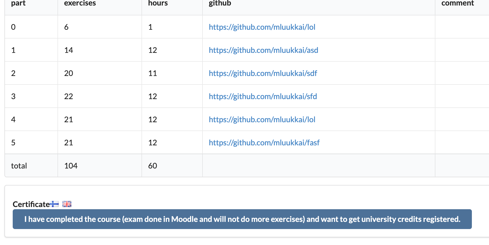

This course is an introduction to modern web development with JavaScript. The main focus is on single page applications implemented with React and supporting them with RESTful and GraphQL web services implemented with Node.js. The course also has parts on TypeScript,  React Native and Continuous integration.

Other topics include debugging applications, configuration, managing runtime environments and NoSQL databases.

### Prerequisites

Participants are expected to have good programming skills, basic knowledge of web programming and databases, and have mastery of the Git version management system. You are also expected to have perseverance and a capacity for solving problems and seeking information independently.

Previous knowledge of JavaScript or other course topics is not required.

### Course material

The course material is meant to be read one part at a time and in order.

The material contains exercises, which are placed so that the preceding material provides enough information for solving each exercise. You can do the exercises as you encounter them in the material, but it can also be beneficial to read all of the material in the part before starting with the exercises.

In many parts of the course, the exercises build one larger application one small piece at a time. Some of the exercise applications are developed through multiple parts.

The course material is based on incrementally expanding example applications, which change from part to part. It's best to follow the code along while making small modifications independently. The code of the example applications for each step of each part can be found on GitHub.

### Taking the course

The course contains twelve parts, the first of which is numbered 0 for consistency with past iterations. One part corresponds loosely to one week (averaging 15-20 hours) of studying, but the speed of completing the course is flexible.

Proceeding from part <i>n</i> to part <i>n+1</i> is not sensible before enough know-how of the topics in part <i>n</i>  has been achieved. In pedagogic terms, the course uses [Mastery Learning](https://en.wikipedia.org/wiki/Mastery_learning), and you are only intended to proceed to the next part after doing enough of the exercises of the previous part.

You are expected to do <i>at least</i> all of the exercises that are not marked with an asterisk(*). Exercises marked with an asterisk count towards your final grade, but skipping them does not prevent you from doing the compulsory exercises in the next part.

The speed of completing the course is flexible, and exercises can be submitted until 23:59 [EET](https://en.wikipedia.org/wiki/Eastern_European_Time) on 1 March 2022. 

However, note that the deadline for taking exam for University of Helsinki credits is 10.1.2022. 

Exercise completion time statistics can be found via the [submission system](https://studies.cs.helsinki.fi/stats/courses/fullstackopen).

### Parts and completion

Full Stack studies consist of the core course and multiple extensions. You can complete the studies in the extent of 5 to 14 credits. 

#### Parts 0-5 (core course) - Full Stack Web Development (5 cr, CSM141081)
The number of credits and the grade for the course are based on the total number of submitted exercises for parts 0-7 (including exercises marked with an asterisk).

Credits and grades are calculated as follows:

| exercises    | credits        | grade    |
| ------------ | :------------: | :------: |
| 138          |       7        | 5        |
| 127          |       6        | 5        |
| 116          |       5        | 5        |
| 105          |       5        | 4        |
| 94           |       5        | 3        |
| 83           |       5        | 2        |
| 72           |       5        | 1        |

If you wish to receive university credits, you must complete an exam. The exam does not count towards your final grade, but you must pass it. You do the exam in the Moodle learning environment, which can be accessed via the [Open University course page](https://studies.helsinki.fi/courses/cur/hy-CUR-143228359/Open_uni_Full_Stack_Web_Development_2021) once you have [signed up](https://fullstackopen.com/en/part0/general_info#sign-up-for-the-exam) for the exam. A Finnish social security number is required. 

Once you have completed enough exercises for a passing grade, you can download the course certificate from the [submission system](https://studies.cs.helsinki.fi/stats/courses/fullstackopen). A Finnish social security number is not required.

The last possible date for taking the exam is 10 January 2022. **Note that you must sign up for the exam by 9 January 2022, at the latest.**

You can only take the exam after submitting enough exercises for five credits. It is not wise in practice to take the exam immediately after submitting the critical number of exercises. The exam is the same for 5-14 credits and does not count towards your grade.

<i>You do not need to attend the course exam or register to the Open University course in order to obtain the course certificate.</i>

#### Part 6 - Full Stack Web Development, extension 1 (1 cr, CSM141082)
By submitting at least 127 of the exercises for parts 0-7 while working on the core course, you can receive an additional credit through this extension. 
- Submit at least 127 exercises for parts 0-7. 
- [Enroll in part 6 through the Open University](https://www.avoin.helsinki.fi/palvelut/esittely.aspx?s=otm-2c09d93d-4f75-4359-85a3-5f8e2c2c5ce6). 
- [Request credits for part 6](https://fullstackopen.com/en/part0/general_info/#how-to-get-your-credits).

#### Part 7 - Full Stack Web Development, extension 2 (1 cr, CSM141083)
By submitting at least 138 of the exercises for parts 0-7 while working on the core course, you can receive an additional credit through this extension. 
- Submit at least 138 exercises for parts 0-7. 
- [Enroll in part 7 through the Open University](https://www.avoin.helsinki.fi/palvelut/esittely.aspx?s=otm-51f0edb4-c137-4871-a1e0-d93ca9b47bdf). 
- [Request credits for part 7](https://fullstackopen.com/en/part0/general_info/#how-to-get-your-credits).

#### Part 8 - Full Stack Web Development: GraphQL (1 cr, CSM14113)
By submitting at least 22/26 of the exercises for part 8 of the course, GraphQL, you can get one additional credit. Part 8 can be done any time after part 5, because its contents are independent from parts 6 and 7.
- Submit at least 22/26 exercises for part 8.
- [Enroll in part 8 through the Open University](https://www.avoin.helsinki.fi/palvelut/esittely.aspx?s=otm-5f475a66-7d83-4b0e-9413-65e83be3dd7e). 
- [Request credits for part 8](https://fullstackopen.com/en/part0/general_info/#how-to-get-your-credits).

#### Part 9 - Full Stack Web Development: TypeScript (1 cr, CSM14110)
By submitting at least 24/27 of the exercises for part 9 of the course, TypeScript, you can get one additional credit. It is recommended that you complete parts 0-7 before taking part 9.
- Submit at least 24/27 exercises for part 9.
- [Enroll in part 9 through the Open University](https://www.avoin.helsinki.fi/palvelut/esittely.aspx?s=otm-f62d31aa-e737-4060-b930-373b5236fa08). 
- [Request credits for part 9](https://fullstackopen.com/en/part0/general_info/#how-to-get-your-credits).

#### Part 10 - Full Stack Web Development: React Native (2 cr, CSM14111)
By submitting 25 exercises for part 10 of the course on React Native, you can earn two additional credits. More information about this part's prerequisites, exercise submission, and credits can be found in[part 10](/en/part10/introduction_to_react_native).
- Submit at least 25 exercises for part 10. 
- [Enroll in part 10 through the Open University](https://www.avoin.helsinki.fi/palvelut/esittely.aspx?s=otm-b2475f8c-e911-4a07-9993-549955381936). 
- [Request credits for part 10](https://fullstackopen.com/en/part0/general_info/#how-to-get-your-credits).

#### Part 11 - Full Stack Web Development: Continuous Integration / Continuous Delivery (1 cr, CSM14112)

By submitting all exercises for part 11 of the course on Continuous Integration/Delivery, you can earn one additional credit. 
More information about this part's prerequisites and exercise submission can be found in [part 11](/en/part11).
- Submit all exercises for part 11. 
- [Enroll in part 11 through the Open University](https://www.avoin.helsinki.fi/palvelut/esittely.aspx?s=otm-499399bc-1897-460a-ba9e-3b73af4e9d33). 
- [Request credits for part 11](https://fullstackopen.com/en/part0/general_info/#how-to-get-your-credits).

#### Part 12 - Full Stack Web Development: Containers (1 cr, CSM141084)

By submitting all exercises for part 12 of the course on Container technology, you can earn one additional credit. 
More information about this part's prerequisites and exercise submission can be found in [part 12](/en/part12).
- Submit all exercises for part 12. 
- [Enroll in part 12 through the Open University](https://www.avoin.helsinki.fi/palvelut/esittely.aspx?s=otm-30c40872-9c07-4bbf-859a-b206fb598b60
). 
- [Request credits for part 12](https://fullstackopen.com/en/part0/general_info/#how-to-get-your-credits).

#### Part 13 - Full Stack Web Development: relational databases (1 cr, CSM14114)

By submitting all exercises for part 13 of the course on Relational databases, you can earn one additional credit. 
More information about this part's prerequisites and exercise submission can be found in [part 13](/en/part13).
- Submit all exercises for part 13. 
- [Enroll in part 13 through the Open University](https://www.avoin.helsinki.fi/palvelut/esittely.aspx?s=otm-136d0c67-5348-468f-aa94-7e0b72197d91
). 
- [Request credits for part 13](https://fullstackopen.com/en/part0/general_info/#how-to-get-your-credits).

### How to get your credits

Note that in order to receive university credits, you need a Finnish social security number.

If you want to receive credits, save your <b>University of Helsinki</b> student number to
[the exercise submission system](https://studies.cs.helsinki.fi/stats/courses/fullstackopen)

If you are not a student at the University of Helsinki, you can get a student number by registering for the course through [Open University](/en/part0/general_info#sign-up-for-the-exam).

You will receive your credits after you have submitted enough exercises for a passing grade, passed the exam and let us know through the exercise submission system that you have completed the course:

You can view your grade in Weboodi approximately four weeks after notifying us.

**Please note** that in order to get university credits you need a registration for each completed part, please see [more info about registration](/en/part0/general_info#parts-and-completion).

### Course certificate

Even if you do not register to Open University for the exam, you can still download the course certificate from the [submission system](https://studies.cs.helsinki.fi/stats/courses/fullstackopen) once you have completed enough exercises for a passing grade. <i>For getting the certificate, a Finnish social security number is not needed.</i>

### Expanding on a previously completed course

If you have already taken the course either as a MOOC or as a university course, you can now expand on your course.

#### Expanding on Full stack open 2019 or 2020

You can just pick up where you left off! If you wish to resubmit a whole part, please contact the course personnel via [email](mailto:matti.luukkainen@helsinki.fi) or Telegram [@mluukkai](https://t.me/mluukkai), with your GitHub username and which parts you would like to have deleted from your submissions.

The same will apply for the 2022, you can continue seamlesly if you have started the course 2019-2021

#### Expanding on other instances of this course

You can substitute <i>parts</i> of this course with parts you have previously submitted.  For example, if you have previously completed the three credit course, you can substitute parts 0-3 of this course with the parts you have previously completed.  You can only substitute parts in sequence, so you cannot substitute, for example, parts 0 and 2 but not complete part 1.

You can only substitute whole parts. For example, if you have previously submitted 50% of exercises in a part, you cannot substitute those exercises - you would need to start over on that part of the course.

"Credit transfer" of previously completed parts happens in the <i>my submissions</i> tab of the [submission system](https://studies.cs.helsinki.fi/stats/courses/fullstackopen).

If you have previously passed the course exam (excluding the exam for the three credit course), and are now expanding your course, you do not have to do the exam again.

### Submitting exercises

The exercises are submitted through GitHub and marking them as done on the [submission system](https://studies.cs.helsinki.fi/stats/courses/fullstackopen).

If you are submitting exercises from different parts to the same repository, use an appropriate system for naming your directories. You can of course create a new repository for each part. If you are using a private repository, add <i>mluukkai</i> as a collaborator.

Exercises are submitted **one part at a time**. Once you have submitted exercises for a part, you can no longer submit any more exercises for that part.

A system for detecting plagiarism is used to check exercises submitted to GitHub. If code is found from model answers or multiple students hand in the same code, the situation is handled according to the [policy on plagiarism](https://guide.student.helsinki.fi/en/article/what-cheating-and-plagiarism) of the University of Helsinki.

Many of the exercises build a larger application bit by bit. In these cases, submitting only the completed application is enough. You can make a commit after each exercise, but that is not compulsory.

### Sign up for the exam

For official university credits you need to pass the course exam that is done in Open University Moodle. Note that it is only possible to register for the exam if you have a Finnish social security number or you are able to register for the course in Helsinki in person!

Follow the instructions below to gain access to the course Moodle space:

- [Enroll in the course](https://www.avoin.helsinki.fi/palvelut/esittely.aspx?s=otm-eeffe055-8b94-42d0-9167-50476ad32133) through Open University by 9 Jan 2022
- You will receive the Moodle-link and the course key through email within 24 hours after course registration.
- User ID. Do you study at University of Helsinki or other [HAKA member institution](https://wiki.eduuni.fi/display/CSCHAKA/Members+and+partners)?
    - If yes, use your username and password to log in to Moodle.
    - If no, please activate your University of Helsinki user ID to access Moodle. You will receive more information on the user ID after registration through email.
- Sign into the Moodle space with your University of Helsinki / HAKA user ID and the enrollment key.
- After course enrollment, save your University of Helsinki student ID number to the [my submissions tab](https://studies.cs.helsinki.fi/stats/myinfo) in the submission system.
- If you used your institution’s HAKA identification to log in to Moodle, please send a message to avoin-student@helsinki.fi and ask for your University of Helsinki student ID.
  - Send the message from the same email address you used for course enrollment.
  - Include your full name, date of birth, name of the course in the email.

Please note!

- You only need the Moodle access for the exam, not for accessing the course certificate.
- Credits for the course are only available to students who have successfully registered for the course through the Open University and completed the course according to the instructions.

Electronic enrollment is available if you meet one of the following criteria:

- You have a Finnish personal identity number (format: xxxxxxxx-xxxx) or an online banking ID.
- You are a student at the University of Helsinki.
- You are a student at another [HAKA member institution](https://wiki.eduuni.fi/display/CSCHAKA/Members+and+partners).

After course enrollment: Note that you also have to save your student ID number to the <i>my submissions</i> tab in the [submission system](https://studies.cs.helsinki.fi/stats/myinfo). If you used your institution’s HAKA identification to log in to Moodle, please send a message to avoin-student@helsinki.fi and ask for your University of Helsinki student ID.

Include your full name, email address used for enrollment, date of birth, and the name of the course in the email.

### Full stack project

A full stack project worth 5, 7 or 10 credits will be available through Open University.

For the project, an application is implemented in React and/or Node, though implementing a mobile application in React Native is also possible.

The number of credits is based on hours of work done. One credit is approximately 17.5 hours of work. The work is graded pass/fail.

It is possible to complete the project as a pair or a group.

See [more information on the project](https://github.com/FullStack-HY/misc/blob/main/project.md).

### Interview promise

Our collaborators, [Houston Inc.](https://houston-inc.com/), [Terveystalo](https://www.terveystalo.com/en/) and [Smartly.io](https://www.smartly.io/), have given the <i>promise of a job interview</i> for everyone who completes the course and the project work with maximum credits (12 + 10). The parts 12 and 13 that where released during 2021 are not required if you finnish the project by 15.3.2022.

This means that the student can, if they so choose, sign up for a job interview with a collaborator who has given the promise. The teacher of the course, Matti Luukkainen, will send instructions to the student after the courses have been completed with maximum credits.

You need to be a resident of Finland in order to participate in these interviews.

### Before you start

Using the [Chrome browser](https://www.google.com/chrome/) is recommended for this course, because it provides the best tools for web development. Another alternative is the [Developer Edition of Firefox](https://www.mozilla.org/en-US/firefox/developer/), which provides the same range of features.

The course exercises are submitted to GitHub, so Git must be installed and you should know how to use it. For instructions, see [Git and GitHub tutorial for beginners](https://product.hubspot.com/blog/git-and-github-tutorial-for-beginners).

Install some sensible text editor that supports web development. [Visual Studio Code](https://code.visualstudio.com/) is highly recommended.

Don't code with nano, Notepad or Gedit. NetBeans isn't very good for web development either. It is also rather heavy in comparison to Visual Studio Code.

Also install [Node.js](https://nodejs.org/en/). The material has been done with version 14.8.0, so don't install anything older than that. See [Node.js installation instructions](https://nodejs.org/en/download/package-manager/).

Node package manager [npm](https://www.npmjs.com/get-npm) will be automatically installed with Node.js. We will be actively using npm throughout the course. Node also comes with [npx](https://www.npmjs.com/package/npx), which we'll need a few times.

### Typos in the material

If you find a typo in the material, or something has been expressed unclearly, or is simply bad grammar, submit a <i>pull request</i> to the course material in the [repository](https://github.com/fullstack-hy2020/fullstack-hy2020.github.io). For example, the markdown source code of this page can be found in the repository at <https://github.com/fullstack-hy2020/fullstack-hy2020.github.io/edit/source/src/content/0/en/part0a.md>

At the bottom of each part of the material is a link to <em>propose changes to material</em>. You can edit the source code of the page by clicking on the link.

