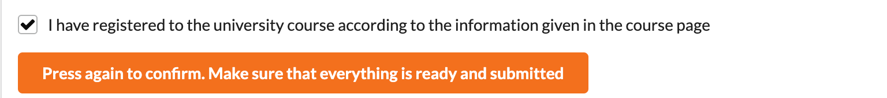

<div class="content">

Este curso es una introducción al desarrollo web moderno con JavaScript. El enfoque principal está en las aplicaciones de una sola página implementadas con React y su soporte con servicios web RESTful y GraphQL implementados con Node.js. El curso también tiene partes sobre TypeScript, React Native e Integración continua.

Otros temas incluyen depuración de aplicaciones, tecnología de contenedores, configuración, administración de entornos de ejecución y bases de datos.

El curso es totalmente libre de cargo. Puedes obtener un certificado e incluso los créditos ECTS (Sistema Europeo de Transferencia y Acumulación de Créditos) de la Universidad de Helsinki gratuitamente.

### Requisitos previos

Se espera que los participantes tengan buenas habilidades de programación, conocimientos básicos de programación web y bases de datos, y conocimientos básicos del sistema de gestión de versiones Git. También se espera que tengan perseverancia y capacidad para resolver problemas y buscar información de forma independiente.

No se requieren conocimientos previos de JavaScript u otros temas del curso.

¿Cuanta experiencia en programación es necesaria? Es difícil de decir, pero deberías ser bastante fluido con *tu* lenguaje. Este nivel de fluidez usualmente necesita de al menos 100-200 horas de practica para desarrollarlo.

### Material del curso

El material del curso está diseñado para leerse una parte a la vez, leyendo cada parte hasta el final antes de pasar a la siguiente.

El material contiene ejercicios, que se colocan de manera que el material anterior proporcione información suficiente para resolver cada ejercicio. Puedes hacer los ejercicios a medida que los encuentres en el material, pero también puede ser beneficioso leer todo el material de la parte antes de comenzar con los ejercicios.

En muchas partes del curso, los ejercicios construyen una aplicación más grande, una pieza pequeña a la vez. Algunas de las aplicaciones de los ejercicios se desarrollan a través de múltiples partes.

El material del curso se basa en expandir gradualmente las aplicaciones de ejemplo, que cambian de una parte a otra. Probablemente sea mejor seguir el código mientras realizas pequeñas modificaciones de forma independiente. El código de las aplicaciones de ejemplo para cada paso de cada parte se puede encontrar en GitHub.

### Tomando el curso

El curso consta de catorce partes, la primera de las cuales tiene el número 0 por razones históricas. Una parte corresponde en términos generales a una semana (con un promedio de 15 a 20 horas) de estudio, pero la velocidad para completar el curso es flexible.

Pasar de la parte *n* a la parte *n + 1* no es sensato antes de que se haya alcanzado un conocimiento suficientemente bueno de los temas de la parte *n*. En términos pedagógicos, el curso utiliza [Aprendizaje para el dominio](https://es.wikipedia.org/wiki/Aprendizaje_para_el_dominio), y se espera que solo continues con la siguiente parte después de hacer suficientes ejercicios de la parte anterior.

En las partes 1-4 se espera que hagas **todos** los ejercicios que están marcados con un asterisco(*). Los ejercicios marcados con un asterisco cuentan para tu calificación final, pero omitirlos no te impide realizar los ejercicios obligatorios de la siguiente parte. Las partes 5-13 no tienen ejercicios marcados con asteriscos ya que no existe una dependencia similar a la de las partes anteriores.

La velocidad para completar el curso es flexible.

Las estadísticas del tiempo de finalización de los ejercicios se pueden encontrar en el [sistema de envío de ejercicios](https://studies.cs.helsinki.fi/stats/courses/fullstackopen).

### Canal de Discord y Telegram para el curso

Puedes hablar sobre el curso y temas relacionados en nuestro grupo dedicado en Discord https://study.cs.helsinki.fi/discord/join/fullstack y en Telegram: https://t.me/fullstackcourse. Discord tiene canales fullstack_general y especifico para cada parte (nombres de canal con prefijo fullstack) para discusiones relacionadas con el curso. Ten en cuenta que *el canal "chat" de Discord no es adecuado para la discusión relacionada con el curso*. ¡Únete a la conversación!

### Como obtener ayuda en Discord/Telegram

Cuando pides ayuda relacionada a un problema en el grupo de Discord/Telegram tu pregunta debe ser tan informativa y precisa como sea posible. Si tu pregunta se ve asi

> *Agregar una nueva persona no funciona, ¿podrías ayudarme con esto?*

es muy probable que nadie responda. El bug puede estar *en cualquier lado*.

Una mejor pregunta sería

> * En el ejercicio 2.15 cuando intento agregar una nueva persona a la aplicación, el servidor responde con 403, aunque la solicitud parece estar bien.
>
> El código se ve así
>
> ```js
>   // la parte relevante del código se pega aquí
>   // el código debe contener varias declaraciones de console.log para ayudar con la depuración
> ```
>
> Lo siguiente se imprime en la consola
>
> ```bash
>   // datos impresos en la consola
> ```
>
> La pestaña de network se ve de la siguiente manera*
>
> [screen shot de la pestaña network]
>
> Todo el código se puede encontrar aquí (un link a GitHub)

### Partes y finalización

Los estudios de Full Stack consisten en el curso base y multiples extensiones. Puedes completar los estudios en un rango de 5 a 14 créditos.

#### Partes 0-5 (curso base) - Desarrollo Web Full Stack (5 cr, CSM141081)

El número de créditos y la calificación se basan en el número total de ejercicios enviados para las partes 0-7 (incluidos los ejercicios marcados con un asterisco).

Los créditos y la calificación se calculan de la siguiente manera:

| ejercicios | créditos | calificación |
| ---------- | :------: | :---: |
| 138        |    7     |   5   |
| 127        |    6     |   5   |
| 116        |    5     |   5   |
| 105        |    5     |   4   |
| 94         |    5     |   3   |
| 83         |    5     |   2   |
| 72         |    5     |   1   |

Una vez que hayas completado suficientes ejercicios para pasar un grado, puedes descargar el certificado del curso desde el [sistema de envío de ejercicios](https://studies.cs.helsinki.fi/stats/courses/fullstackopen).

Si deseas recibir créditos universitarios, debes completar el examen del curso. El examen no cuenta para tu calificación final, pero debes pasarlo. Más información [aquí](/es/part0/informacion_general#el-examen-del-curso).

Solo puedes realizar el examen después de enviar suficientes ejercicios para cinco créditos. En la práctica, no es aconsejable realizar el examen inmediatamente después de presentar el número crítico de ejercicios. El examen es el mismo para 5-14 créditos y no cuenta para tu calificación.

*No necesitas hacer el examen o registrarte para el curso de Open University para obtener el certificado del curso.*

#### Parte 6 - Desarrollo Web Full Stack, extensión 1 (1 crédito, CSM141082)

Al enviar al menos 127 ejercicios de las partes 0 a 7 mientras trabajas en el curso base, puedes recibir un crédito adicional a través de esta extensión.

- Envía al menos 127 ejercicios para las partes 0-7.
- [Inscríbete en la parte 6 a través de la Open University](https://www.avoin.helsinki.fi/palvelut/esittely.aspx?s=otm-de83e85f-a06e-4258-ad8c-30326d76228e).
- [Solicita los créditos para la parte 6](/es/part0/informacion_general#como-obtener-tus-creditos).

#### Part 7 - Desarrollo Web Full Stack, extension 2 (1 crédito, CSM141083)

Al enviar al menos 138 ejercicios para las partes 0-7 mientras trabajas en el curso base, puedes recibir un crédito adicional a través de esta extensión.

- Envía al menos 138 ejercicios para las partes 0-7.
- [Inscríbete en la parte 7 a través de la Open University](https://www.avoin.helsinki.fi/palvelut/esittely.aspx?s=otm-53ccca2f-8e77-47e3-931a-63f9d5c8cc2e).
- [Solicita los créditos para la parte 7](/es/part0/informacion_general#como-obtener-tus-creditos).

#### Part 8 - Desarrollo Web Full Stack: GraphQL (1 crédito, CSM14113)

Al enviar al menos 22 de 26 ejercicios para la parte 8 del curso de, GraphQL, puedes obtener un crédito adicional. La parte 8 puede realizarse en cualquier momento después de la parte 5, porque su contenido es independiente de las partes 6 y 7.

- Envía al menos 22 de 26 ejercicios para la parte 8.
- [Inscríbete en la parte 8 a través de la Open University](https://www.avoin.helsinki.fi/palvelut/esittely.aspx?s=otm-b7f5ef26-b780-45f2-962d-f8d3432cae78).
- [Solicita los créditos para la parte 8](/es/part0/informacion_general#como-obtener-tus-creditos).

#### Part 9 - Desarrollo Web Full Stack: TypeScript (1 crédito, CSM14110)

Al enviar al menos 24 de 29 ejercicios de la parte 9 del curso, TypeScript, puedes obtener un crédito adicional. Se recomienda que completes las partes 0-7 antes de hacer la parte 9.

- Envía al menos 24 de 29 ejercicios para la parte 9.
- [Inscríbete en la parte 9 a través de la Open University](https://www.avoin.helsinki.fi/palvelut/esittely.aspx?s=otm-e45a36b7-24d7-424b-9dc5-1c9b59a52a23).
- [Solicita los créditos para la parte 9](/es/part0/informacion_general#como-obtener-tus-creditos).

#### Part 10 - Desarrollo Web Full Stack: React Native (2 crédito, CSM14111)

Al enviar 25 ejercicios para la parte 10 del curso, React Native, puedes obtener dos créditos adicionales. Puedes encontrar más información sobre los requisitos previos de esta parte, el envío de ejercicios y los créditos en la [parte 10](/es/part10/introduccion_a_react_native).

- Envía al menos 25 ejercicios para la parte 10.
- [Inscríbete en la parte 10 a través de la Open University](https://www.avoin.helsinki.fi/palvelut/esittely.aspx?s=otm-ec172afe-bc01-46ab-af23-694311f1950a).
- [Solicita los créditos para la parte 10](/es/part0/informacion_general#como-obtener-tus-creditos).

#### Part 11 - Desarrollo Web Full Stack: Integración Continua / Entrega Continua (1 crédito, CSM14112)

Al enviar todos los ejercicios para la parte 11 del curso, CI/CD (Integración Continua/Entrega Continua), puedes obtener un crédito adicional. Más información sobre los requisitos previos de esta parte y el envío de ejercicios en la [parte 11](/en/part11).

- Envía todos los ejercicios para la parte 11.
- [Inscríbete en la parte 11 a través de la Open University](https://www.avoin.helsinki.fi/palvelut/esittely.aspx?s=otm-23e79dc2-64e4-4f7e-86a4-8923a411443c).
- [Solicita los créditos para la parte 11](/es/part0/informacion_general#como-obtener-tus-creditos).

#### Part 12 - Desarrollo Web Full Stack: Contenedores (1 crédito, CSM141084)

Al enviar todos los ejercicios para la parte 12 del curso, tecnología de contenedores, puedes obtener un crédito adicional. Más información sobre los requisitos previos de esta parte y el envío de ejercicios en la [parte 12](/es/part12).

- Envía todos los ejercicios para la parte 12.
- [Inscríbete en la parte 12 a través de la Open University](https://www.avoin.helsinki.fi/palvelut/esittely.aspx?s=otm-bb07e139-3de0-4cb3-843d-414b1bb992cc).
- [Solicita los créditos para la parte 12](/es/part0/informacion_general#como-obtener-tus-creditos).

#### Part 13 - Desarrollo Web Full Stack: Bases de datos relacionales (1 crédito, CSM14114)

Al enviar todos los ejercicios para la parte 13 del curso, bases de datos relacionales, puedes obtener un crédito adicional. Más información sobre los requisitos previos de esta parte y el envío de ejercicios en la [parte 13](/es/part13).

- Envía todos los ejercicios para la parte 13.
- [Inscríbete en la parte 13 a través de la Open University](https://www.avoin.helsinki.fi/palvelut/esittely.aspx?s=otm-a9204ed8-1346-4174-b27c-9e02c6136088).
- [Solicita los créditos para la parte 13](/es/part0/informacion_general#como-obtener-tus-creditos).

### Estudiando el curso en pocas palabras

Cómo estudiar el curso - instrucciones resumidas para el curso base de 5 créditos CSM141081

- Realiza los ejercicios. Los ejercicios se envían a través de GitHub y se califican en el [sistema de envío de ejercicios](https://studies.cs.helsinki.fi/stats/courses/fullstackopen).
    - El [certificado del curso](/es/part0/informacion_general#certificado-del-curso) estará disponible en el sistema de envío de ejercicios.
- Si deseas obtener créditos de la Universidad de Helsinki
    - Inscríbete en el curso. Recibirás el enlace de inscripción a través del sistema de envío una vez que hayas completado suficientes ejercicios. Lee más [aquí](/es/part0/informacion_general#envio-de-ejercicios).
    - Guarda tu número de estudiante. Después de inscribirte en el curso, guarda tu número de identificación de estudiante de la Universidad de Helsinki en el sistema de envío.
    - Realiza el examen en línea en el sistema de envío. Lee más [aquí](/es/part0/informacion_general#el-examen-del-curso).
    - Marca el curso como completado en el sistema de envío. Lee más [aquí](/es/part0/informacion_general#como-obtener-tus-creditos)

Ten en cuenta que si completas el "curso base" con 6 o 7 créditos, necesitas inscripciones separadas para los créditos adicionales. Consulta [Partes y finalización](/es/part0/informacion_general#partes-y-finalizacion) para obtener más información.

Cómo estudiar el curso: instrucciones resumidas para otras partes del curso

- Realiza los ejercicios. Los ejercicios se envían a través de GitHub y se califican en el sistema de envío de ejercicios. Ten en cuenta que las partes 8-13 tienen una instancia separada en el sistema de envío de ejercicios.
    - El [certificado del curso](/es/part0/informacion_general#certificado-del-curso) estará disponible en el sistema de envío de ejercicios.
- Si deseas obtener créditos de la Universidad de Helsinki
    - Inscríbete en el curso. Puedes inscribirte en cada parte a través del enlace en el material del curso ([Partes y finalización](/es/part0/informacion_general#partes-y-finalizacion)). Inscríbete en cada parte por separado.
- Marca la parte como completada en el sistema de envío. Lee más [aquí](/es/part0/informacion_general#como-obtener-tus-creditos).

### Envío de ejercicios

Los ejercicios se envían a través de GitHub y se marcan como completados en la pestaña "mis envíos" de la [aplicación de envío de ejercicios](https://studies.cs.helsinki.fi/stats/courses/fullstackopen).

Si envías ejercicios de diferentes partes al mismo repositorio, utiliza un sistema adecuado para nombrar tus directorios. Por supuesto, puedes crear un nuevo repositorio para cada parte. Si utilizas un repositorio privado, agrega a *mluukkai* como colaborador.

Los ejercicios se envían **una parte a la vez**. Marcarás la cantidad de ejercicios que has completado de ese módulo. Una vez que hayas enviado ejercicios para una parte, ya no podrás enviar más ejercicios para esa parte.

Se utiliza un sistema para detectar el plagio en los ejercicios enviados a GitHub. Si se encuentra código en las respuestas modelo o si varios estudiantes entregan el mismo código, la situación se maneja de acuerdo con la [política sobre el plagio](https://guide.student.helsinki.fi/en/article/what-cheating-and-plagiarism) de la Universidad de Helsinki.

Muchos de los ejercicios construyen una aplicación más grande poco a poco. En estos casos, es suficiente enviar solo la aplicación completa. Puedes hacer un commit después de cada ejercicio, pero no es obligatorio.

### El examen del curso

Para obtener créditos oficiales de la universidad, debes aprobar el examen del curso que cubre las partes 1-5 del curso.

- Si suspendes el examen, puedes repetirlo una semana después.
- Puedes continuar con los envíos de ejercicios después del examen.

El examen se realiza en el sistema de envío de ejercicios. Sigue las instrucciones a continuación para completar el examen.

- Inscríbete en el curso a través de Open University.
- Recibirás el enlace de inscripción a través del [sistema de envío de ejercicios](https://studies.cs.helsinki.fi/stats/courses/fullstackopen/submissions) una vez que hayas completado suficientes ejercicios.


Después de inscribirte en el curso, guarda tu número de estudiante de la Universidad de Helsinki en el [sistema de envío de ejercicios](https://studies.cs.helsinki.fi/stats/myinfo):


Consulta [esto](/es/part0/informacion_general#donde-obtengo-mi-numero-de-estudiante-de-la-universidad-de-helsinki) para obtener información sobre cómo encontrar tu número de estudiante.

Después de estos pasos, puedes realizar el examen del curso en el sistema de envío:


Tendrás 120 minutos para completar el examen. Si todo va bien, deberías ver la siguiente confirmación:


Si suspendes, debes esperar una semana para intentar el examen nuevamente.

Si apruebas el examen y no vas a completar más ejercicios, puedes regresar a la pestaña "mis envíos" y solicitar los créditos:


Recuerda presionar el gran botón azul para solicitar que los créditos se registren.

Nota que debes presionar el botón dos veces:



Cuando lo presiones dos veces, deberías ver el siguiente texto:

> *University credit registration in progress...*

Nota: Si ya has realizado el examen del curso en Moodle, comunícate con matti.luukkainen@helsinki.fi o @mluukkai en Discord.

### Cómo obtener tus créditos

Si deseas recibir créditos de la Universidad de Helsinki, guarda tu número de estudiante de la <b>Universidad de Helsinki</b> en [el sistema de envío de ejercicios](https://studies.cs.helsinki.fi/stats/courses/fullstackopen)


Si no eres estudiante de la Universidad de Helsinki, puedes obtener un número de estudiante registrándote en el curso a través de [Open University](/es/part0/informacion_general#el-examen-del-curso). Consulta [aquí](en/part0/general_info#where-do-i-get-my-university-of-helsinki-student-number) para obtener más información.

Recibirás tus créditos después de haber enviado suficientes ejercicios para aprobar, haber aprobado el examen y luego informarnos a través del sistema de envío de ejercicios que has completado el curso:


Recuerda presionar el gran botón azul para solicitar que los créditos se registren.

Nota que debes presionar el botón dos veces:


Cuando lo presiones dos veces, deberías ver el siguiente texto

> *University credit registration in progress...*

**Ten en cuenta** que para obtener créditos universitarios necesitas registrarte en cada parte completada. Consulta [más información sobre el registro](/es/part0/informacion_general#partes-y-finalizacion).

Puedes ver tu calificación en Sisu de la Universidad de Helsinki y en [Opintopolku](https://opintopolku.fi/oma-opintopolku/) aproximadamente cuatro semanas después de habernos notificado.

Cuando se complete el registro, aparecerá el siguiente texto en el sistema de envío

> *University credits registered, see the course page how to get a transcript if you need one*

### ¿Dónde obtengo mi número de estudiante de la Universidad de Helsinki?

Cuando y si te inscribes en un curso por primera vez a través de Open University, se generará automáticamente un número de estudiante de la Universidad de Helsinki. ***Asegúrate de haberte inscrito en el curso antes de intentar averiguar cuál es tu número de estudiante.***

Ten en cuenta también que **no necesitas inscribirte** en la Open University para obtener el certificado del curso.

Puedes averiguar cuál es tu número de estudiante mediante una de las siguientes opciones:

#### A) Sisu

Si tienes una cuenta de usuario de la Universidad de Helsinki, puedes encontrar tu número de estudiante en tu perfil en el sistema de información de estudios de la Universidad de Helsinki, Sisu:

- Inicia sesión en Sisu con tu nombre de usuario y contraseña de la Universidad de Helsinki.
- Selecciona: Mi perfil
- Selecciona: Información personal

#### B) Correo de confirmación de inscripción

Después de inscribirte en el curso, recibirás un correo de confirmación en la dirección de correo electrónico que has proporcionado en el formulario de inscripción. Este mensaje contiene directamente tu número de estudiante o incluye un enlace que te lleva a una página donde se muestra tu número de estudiante de la Universidad de Helsinki.

#### C) Contacta con los Servicios Estudiantiles

Si tienes problemas para encontrar tu número de estudiante a través de los medios mencionados anteriormente, puedes enviar un correo electrónico a los Servicios Estudiantiles de la Universidad de Helsinki. ***Asegúrate de haberte inscrito en el curso a través de la Universidad Abierta antes de enviar el correo electrónico.***

En tu correo electrónico, incluye la siguiente información:

- nombre del curso en el que te has inscrito,
- tu nombre
- tu fecha de nacimiento.

Dirección de correo electrónico de los Servicios Estudiantiles: avoin-student@helsinki.fi

 **Un recordatorio más:** *asegúrate de haberte inscrito en el curso a través de la Open University antes de enviar el correo electrónico*

### Certificado del curso

Incluso si no te registras en Open University para el examen y los créditos, aún puedes descargar el certificado del curso desde el [sistema de envío de ejercicios](https://studies.cs.helsinki.fi/stats/courses/fullstackopen) una vez que hayas completado suficientes ejercicios para aprobar.

Hay un certificado para las partes del curso base (0-7) y luego de eso un certificado separado para cada parte del curso.

### Solicitar una transcripción de estudios

Puedes solicitar una transcripción verificada *después de que se hayan registrado tus créditos universitarios*. Para solicitar una transcripción oficial, comunícate con avoin-student@helsinki.fi.

- Al solicitar una transcripción oficial, recuerda mencionar
    - el nombre del curso,
    - tu nombre completo,
    - tu fecha de nacimiento
    - el idioma de la transcripción.

La transcripción te será entregada electrónicamente por correo electrónico. Presenta este documento en tu institución para que los créditos se incluyan en tu título. La decisión de incluir los créditos la tomará tu institución de origen.

### No hay más versiones anuales

No hay más "versiones anuales" del curso, el curso está abierto todo el tiempo. Cada parte se actualiza una o dos veces al año. Las actualizaciones son en su mayoría menores: se actualizan las versiones de las librerías y se mejora la claridad del texto. Sin embargo, también puede haber algunos cambios más significativos.

A pesar de los cambios *todos los ejercicios enviados siguen siendo válidos*, y puedes continuar el curso sin preocuparte por las actualizaciones. Además, la política para obtener certificados, créditos universitarios, etc., seguirá siendo la misma, sin importar lo que suceda.

Cambios importantes recientes

- Partes 1-9 (11 de septiembre - 5 de octubre): La aplicación Create React fue reemplazada por Vite

### Ampliación de un curso completado anteriormente

Si ya has realizado el curso como MOOC o como curso universitario, ahora puedes ampliar tu curso.

#### Ampliación de Full stack open

¡Puedes continuar donde lo dejaste! Si deseas volver a enviar una parte completa, comunícate con el personal del curso a través de [correo electrónico](mailto:matti.luukkainen@helsinki.fi) o Telegram [@mluukkai](https://t.me/mluukkai), con tu nombre de usuario de Github y las partes que te gustaría eliminar de tus envíos.

#### Ampliando sobre la instancia de la Universidad de Helsinki de este curso

Eso también es posible, simplemente ponte en contacto con el personal del curso a través de [correo electrónico](mailto:matti.luukkainen@helsinki.fi) o Discord *mluukkai*.

### Proyecto full stack

Un proyecto full stack por valor de 5, 7 o 10 créditos estará disponible a través de Open University.

Para el proyecto, se implementa una aplicación en React y/o Node, aunque también es posible implementar una aplicación móvil en React Native.

El número de créditos se basa en las horas de trabajo realizadas. Un crédito equivale aproximadamente a 17,5 horas de trabajo. El trabajo se califica como aprobado/reprobado.

Es posible completar el proyecto en pareja o en grupo.

Consulta [más información sobre el proyecto](https://github.com/fullstack-hy2020/misc/blob/master/project.md).

### Promesa de entrevista

Nuestros colaboradores, [Houston Inc](https://houston-inc.com/), [Terveystalo](https://www.terveystalo.com/en/) y [Smartly.io](https://www.smartly.io/), han dado la *promesa de una entrevista de trabajo* para todos los que completen el curso y el proyecto de trabajo con créditos máximos (14 + 10).

Esto significa que el alumno puede, si así lo desea, apuntarse a una entrevista de trabajo con un colaborador que haya hecho la promesa. El profesor del curso, Matti Luukkainen, enviará instrucciones al alumno una vez que los cursos se hayan completado con los créditos máximos.

Debes ser residente de Finlandia para poder participar en estas entrevistas.

### Antes de empezar

Se recomienda utilizar el [navegador Chrome](https://www.google.com/chrome/) para este curso, ya que proporciona las mejores herramientas para el desarrollo web. Otra alternativa es [Firefox Developer Edition](https://www.mozilla.org/en-US/firefox/developer/), que ofrece la misma gama de funciones.

Los ejercicios del curso se envían a GitHub, por lo que Git debe estar instalado y debes saber cómo usarlo. Las instrucciones para Git se pueden encontrar [en este tutorial para principiantes](https://product.hubspot.com/blog/git-and-github-tutorial-for-beginners).

Instala un editor de texto adecuado que admita desarrollo web. [Visual Studio Code](https://code.visualstudio.com/) es muy recomendable.

No codifique con nano, Notepad o Gedit. NetBeans tampoco es muy bueno para el desarrollo web. También es bastante pesado en comparación con [Visual Studio Code](https://code.visualstudio.com/).

También instala [Node.js](https://nodejs.org/en/). El material se ha realizado con la versión 18.13.0, así que no instales nada más antiguo que eso. Las instrucciones de instalación están [aquí](https://nodejs.org/en/download/package-manager/).

El administrador de paquetes de Node [npm](https://www.npmjs.com/get-npm) se instalará automáticamente con Node.js. Usaremos activamente npm durante todo el curso. Node también viene con [npx](https://www.npmjs.com/package/npx), que necesitaremos algunas veces.

### Errores tipográficos en el material

Si encuentras un error tipográfico en el material, o algo no se ha expresado con claridad, o simplemente es mala gramática, haz un *pull request* al material del curso en el [repositorio](https://github.com/fullstack-hy2020/fullstack-hy2020.github.io). Por ejemplo, el código fuente de markdown de esta página se puede encontrar en el repositorio en <https://github.com/fullstack-hy2020/fullstack-hy2020.github.io/edit/source/src/content/0/es/part0a.md>

En la parte inferior de cada parte del material hay un enlace para <em>proponer cambios en el material</em>. Puedes editar el código fuente de la página haciendo clic en el enlace.

También hay muchos enlaces en el material a diversos recursos que complementan el material. Si notas que un enlace está roto (lo cual ocurre con frecuencia...), propón un cambio o contáctanos en Discord si no encuentras un reemplazo para el enlace roto.

</div>
