<div class="content">

Antes de comenzar a programar, repasaremos algunos principios del desarrollo web al examinar una aplicación de ejemplo en <https://studies.cs.helsinki.fi/exampleapp>.

Las aplicaciones existen solo para demostrar algunos conceptos básicos del curso, y de ninguna manera son ejemplos de <i>cómo</i> se deben hacer las aplicaciones web.
Por el contrario, demuestran algunas técnicas antiguas de desarrollo web, que incluso pueden verse como <i>malas prácticas</i> en la actualidad.

La codificación en el estilo recomendado comienza en la [parte 1](/es/part1).

Utilice el navegador Chrome <i>ahora y durante el resto del curso</i>

Abra la [aplicación de ejemplo](https://studies.cs.helsinki.fi/exampleapp) en su navegador. A veces, esto lleva un tiempo.

**La primera regla del desarrollo web**: Mantenga siempre abierta la Consola para desarrolladores en su navegador web. En macOS, abra la consola presionando `F12` u `option-cmd-i` simultáneamente.
En Windows o Linux, abra la consola presionando `F12` o `ctrl-shift-i` simultáneamente.

Antes de continuar, averigüe cómo abrir Developer Console en su computadora (busque en Google si es necesario) y recuerde <i>siempre</i> mantenerla abierta cuando desarrolle aplicaciones web.

La consola se ve así:

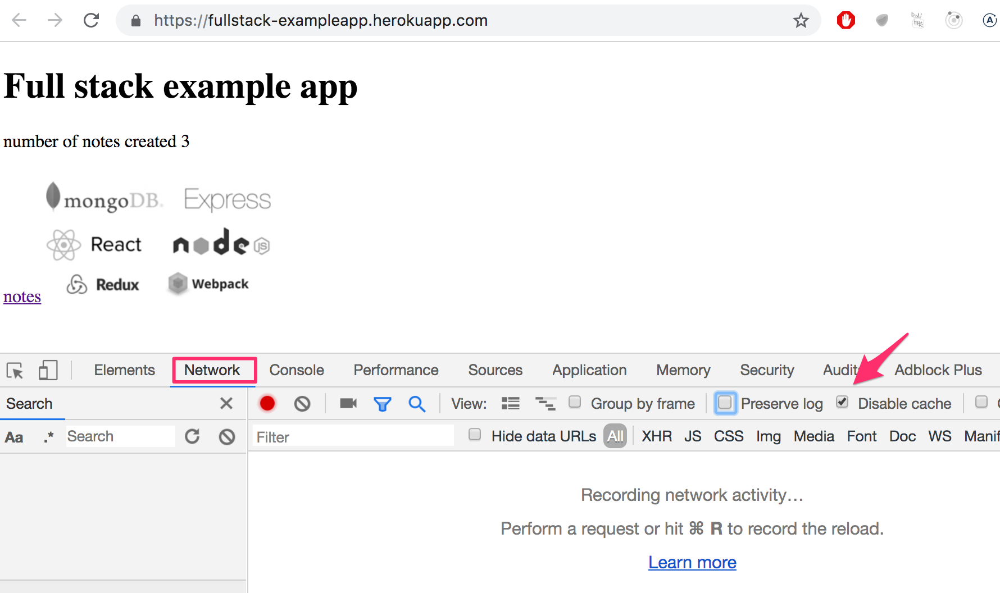

Asegúrese de que la pestaña <i>Network</i> esté abierta y marque la opción <i>Disable caché</i> como se muestra. <i>Preserve log</i> también puede ser útil: guarda los registros impresos por la aplicación cuando se recarga la página.

**NB:** La pestaña más importante es la <i>Console</i>. Sin embargo, en la introducción usaremos bastante la pestaña <i>Network</i>.

### HTTP GET

El servidor y el navegador web se comunican entre sí mediante el protocolo [HTTP](https://developer.mozilla.org/en-US/docs/Web/HTTP). La pestaña Network muestra cómo se comunican el navegador y el servidor.

Cuando recargas la página (presiona la tecla F5 o el símbolo &#8634; en tu navegador), la consola muestra que han ocurrido dos eventos:

- El navegador recupera el contenido de la página <i>studies.cs.helsinki.fi/exampleapp</i> del servidor
- Y descarga la imagen <i>kuva.png</i>

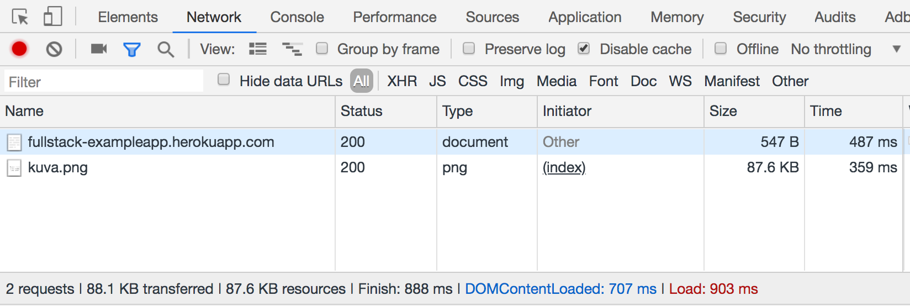

En una pantalla pequeña, es posible que deba ampliar la ventana de la consola para verlos.

Al hacer clic en el primer evento, se muestra más información sobre lo que está sucediendo:

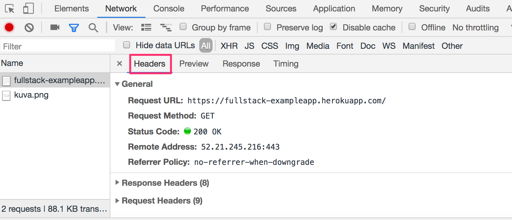

La parte superior, <i>General</i>, muestra que el navegador hizo una solicitud a la dirección <i>https://studies.cs.helsinki.fi/exampleapp</i> (aunque la dirección ha cambiado ligeramente desde que se tomó esta imagen) usando el método [GET](https://developer.mozilla.org/en-US/docs/Web/HTTP/Methods/GET), y que la solicitud fue exitosa, porque la respuesta del servidor tenía el [Código de estado](https://en.wikipedia.org/wiki/List_of_HTTP_status_codes) 200.

La solicitud y la respuesta del servidor tienen varios [encabezados](https://en.wikipedia.org/wiki/List_of_HTTP_header_fields):

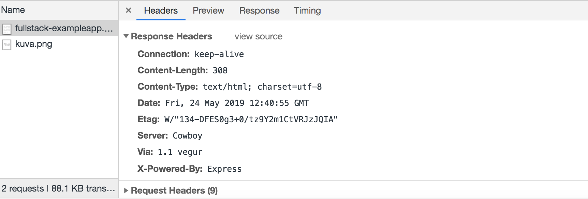

Los <i>Encabezados de Respuesta (Response Headers)</i> en la parte superior nos dicen, por ejemplo, el tamaño de la respuesta en bytes y la hora exacta de la respuesta. Un encabezado importante [Content-Type](https://developer.mozilla.org/en-US/docs/Web/HTTP/Headers/Content-Type) nos dice que la respuesta es un archivo de texto en formato [utf-8](https://en.wikipedia.org/wiki/UTF-8), cuyo contenido se ha formateado con HTML. De esta manera, el navegador sabe que la respuesta es una página [HTML](https://en.wikipedia.org/wiki/HTML) normal y la representa en el navegador "como una página web".

La pestaña <i>Response</i> muestra los datos de la respuesta, una página HTML normal. La sección <i>body</i> determina la estructura de la página renderizada en la pantalla:

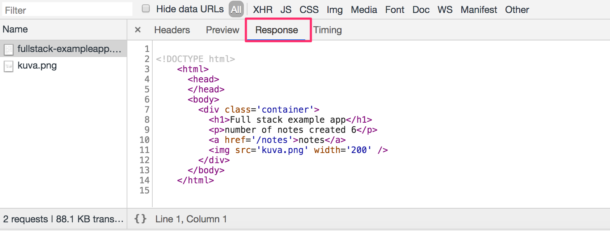

La página contiene un elemento [div](https://developer.mozilla.org/en-US/docs/Web/HTML/Element/div), que a su vez contiene un encabezado, un enlace a la página <i>notes</i> y una etiqueta [img](https://developer.mozilla.org/en-US/docs/Web/HTML/Element/img), y muestra el número de notas creadas.

Debido a la etiqueta img, el navegador realiza una segunda <i>solicitud HTTP</i> para recuperar la imagen <i>kuva.png</i> del servidor. Los detalles de la solicitud son los siguientes:

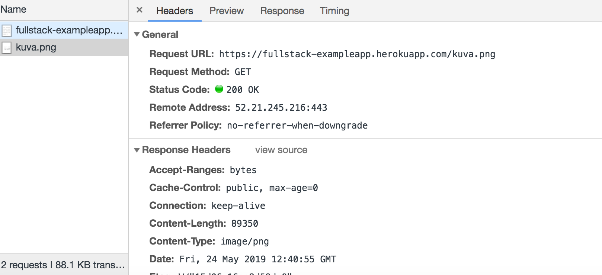

La solicitud se realizó a la dirección <https://studies.cs.helsinki.fi/exampleapp/kuva.png> y su tipo es HTTP GET. Los Encabezados de Respuesta nos dicen que el tamaño de la respuesta es 89350 bytes y su [Content-Type](https://developer.mozilla.org/en-US/docs/Web/HTTP/Headers/Content-Type) es <i>image/png</i>, por lo que es una imagen png. El navegador utiliza esta información para mostrar la imagen correctamente en la pantalla.

La cadena de eventos causada por abrir la página https://studies.cs.helsinki.fi/exampleapp en un navegador forma el siguiente [diagrama de secuencia](https://www.geeksforgeeks.org/unified-modeling-language-uml-sequence-diagrams/):

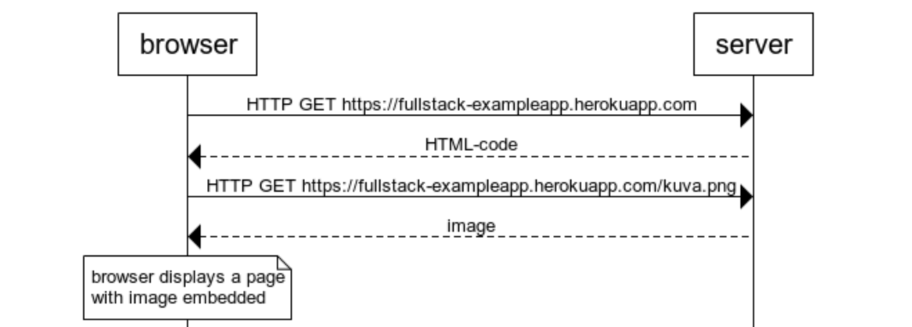

Primero, el navegador realiza una solicitud HTTP GET al servidor para obtener el código HTML de la página. La etiqueta <i>img</i> en el HTML solicita al navegador que busque la imagen <i>kuva.png</i>. El navegador muestra la página HTML y la imagen en la pantalla.

Aunque es difícil de notar, la página HTML comienza a renderizarse antes de que la imagen se haya obtenido del servidor.

### Aplicaciones web tradicionales

La página de inicio de la aplicación de ejemplo funciona como una <i>aplicación web tradicional</i>. Al ingresar a la página, el navegador obtiene el documento HTML que detalla la estructura y el contenido textual de la página desde el servidor.

El servidor ha formado este documento de alguna manera. El documento puede ser un archivo de texto <i>estático</i> guardado en el directorio del servidor. El servidor también puede formar los documentos HTML <i>dinámicamente</i> de acuerdo con el código de la aplicación, utilizando, por ejemplo, datos de una base de datos.
El código HTML de la aplicación de ejemplo se ha formado de forma dinámica, porque contiene información sobre el número de notas creadas.

El código HTML de la página de inicio es el siguiente:

```js
const getFrontPageHtml = noteCount => {
  return(`
    <! DOCTYPE html>
    <html>
      <head>
      </head>
      <body>
        <div class='container'>
          <h1>
          <p>number of notes created ${noteCount}</p>
          <a href='/notes'>notes</a>
          
        </div>
      </body>
    </html>
`)
}

app.get('/', (req, res) => {
  const page = getFrontPageHtml(notes.length)
  res.send(page);
});
```
No tiene que entender el código todavía.

El contenido de la página HTML se ha guardado como una template string, o una string que permite evaluar, por ejemplo, variables en medio de ella. La parte que cambia dinámicamente de la página de inicio, el número de notas guardadas (en el código <em>noteCount</em>), se reemplaza por el número actual de notas (en el código <em>notes.length</em>) en la template string.

Escribir HTML en medio del código, por supuesto, no es inteligente, pero para los programadores PHP de la vieja escuela era una práctica normal.

En las aplicaciones web tradicionales, el navegador es "tonto". Solo obtiene datos HTML del servidor y toda la lógica de la aplicación está en el servidor. Se puede crear un servidor, por ejemplo, usando Java Spring como en el curso de la Universidad de Helsinki [Web-palvelinohjelmointi](https://courses.helsinki.fi/fi/tkt21007/119558639), Python Flask (como en el curso [tietokantasovellus](https://materiaalit.github.io/tsoha-18/)) o con [Ruby on Rails](http://rubyonrails.org/).

El ejemplo usa [Express](https://expressjs.com/) de Node.js.
Este curso utilizará Node.js y Express para crear servidores web.

### Ejecución de la lógica de la aplicación en el navegador

Mantenga abierta la Consola para desarrolladores. Vacíe la consola haciendo clic en el símbolo 🚫.
Ahora, cuando vaya a la página [notes](https://studies.cs.helsinki.fi/exampleapp/notes), el navegador realiza 4 solicitudes HTTP:

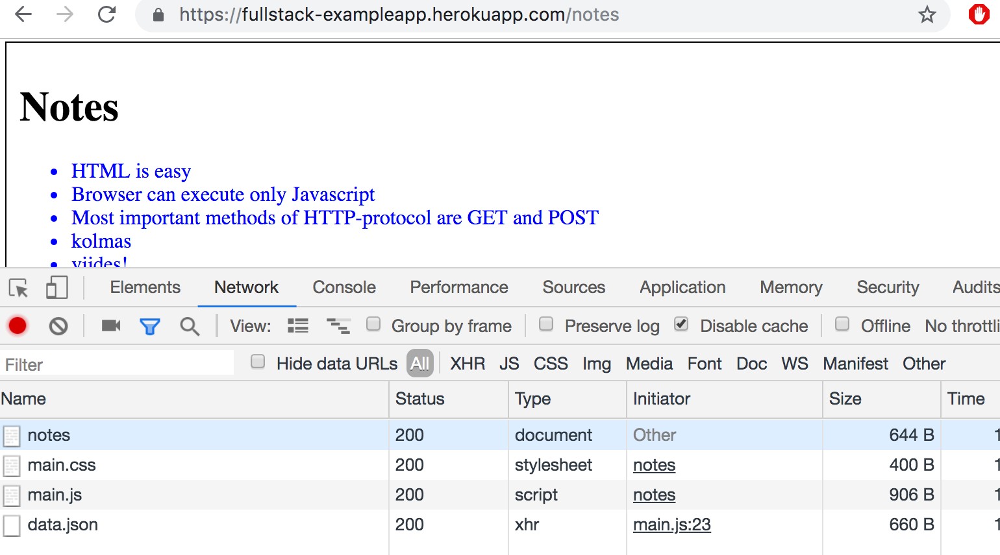

Todas las solicitudes tienen tipos <i>diferentes</i>. El tipo de la primera solicitud es <i>document</i>. Es el código HTML de la página y tiene el siguiente aspecto:

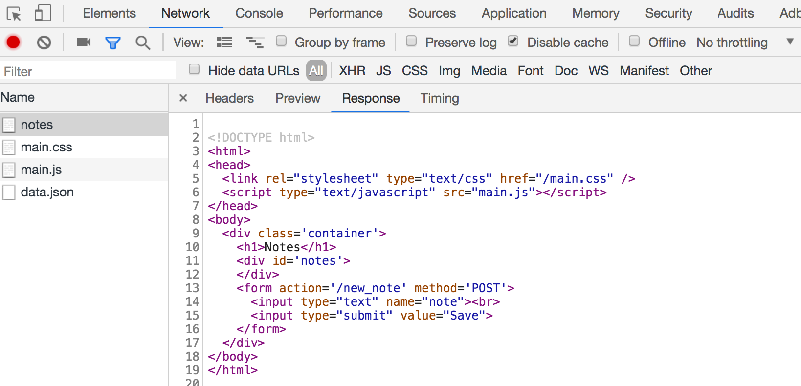

Cuando comparamos la página que se muestra en el navegador y el código HTML devuelto por el servidor , notamos que el código no contiene la lista de notas.
La sección [head](https://developer.mozilla.org/en-US/docs/Web/HTML/Element/head) del HTML contiene una etiqueta [script](https://developer.mozilla.org/en-US/docs/Web/HTML/Element/script), que hace que el navegador obtenga un archivo JavaScript llamado <i>main.js</i>.

El código JavaScript tiene el siguiente aspecto:

```js
var xhttp = new XMLHttpRequest()

xhttp.onreadystatechange = function() {
  if (this.readyState == 4 && this.status == 200) {
    const data = JSON.parse(this.responseText)
    console.log(data)

    var ul = document.createElement('ul')
    ul.setAttribute('class', 'notes')

    data.forEach(function(note) {
      var li = document.createElement('li')

      ul.appendChild(li)
      li.appendChild(document.createTextNode(note.content))
    })

    document.getElementById('notes').appendChild(ul)
  }
}

xhttp.open('GET','/data.json', true)
xhttp.send ()
```

Los detalles del código no son importantes en este momento, pero se ha incluido algún código para darle vida a las imágenes y el texto. Comenzaremos a codificar correctamente en la [parte 1](/es/part1). El código de muestra en esta parte en realidad no es relevante en absoluto para las técnicas de codificación de este curso.

> Algunos podrían preguntarse por qué se usa xhttp-object en lugar de la moderna fetch. Esto se debe a que todavía no queremos entrar en promesas (promises), y el código tiene un papel secundario en esta parte. Volveremos a las formas modernas de realizar solicitudes al servidor en la parte 2.

Inmediatamente después de obtener la etiqueta <i>script</i>, el navegador comienza a ejecutar el código.

Las dos últimas líneas definen que el navegador realiza una solicitud HTTP GET a la dirección del servidor <i>/data.json</i>:

```js 
xhttp.open('GET', '/data.json', true)
xhttp.send()
```

Esta es la solicitud que se muestra más abajo en la pestaña Network.

Podemos intentar ir a la dirección <https://studies.cs.helsinki.fi/exampleapp/data.json> directamente desde el navegador:

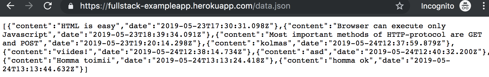

Allí encontramos las notas como "datos sin procesar" en [JSON](https://en.wikipedia.org/wiki/JSON) 
De forma predeterminada, el navegador no es demasiado bueno para mostrar datos JSON. Se pueden usar complementos para manejar el formato. Instale, por ejemplo, [JSONView](https://chrome.google.com/webstore/detail/jsonview/chklaanhfefbnpoihckbnefhakgolnmc) en Chrome y vuelva a cargar la página. Los datos ahora están bien formateados:

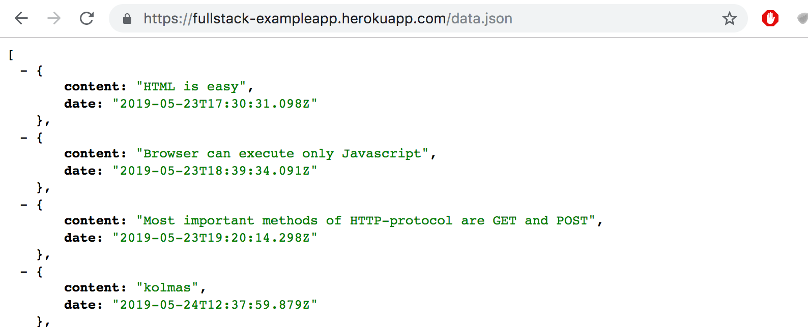

Entonces, el código JavaScript de la página de notas anterior descarga los datos JSON que contienen las notas y forma una lista de viñetas a partir del contenido de la nota:

Esto se hace mediante el siguiente código:

```js
const data = JSON.parse(this.responseText)
console.log(data)

var ul = document.createElement('ul')
ul.setAttribute('class', 'notes')

data.forEach(function(note) {
  var li = document.createElement('li')

  ul.appendChild(li)
  li.appendChild(document.createTextNode(note.content))
})

document.getElementById('notes').appendChild(ul)
```

El código primero crea una lista desordenada con una etiqueta [ul](https://developer.mozilla.org/en-US/docs/Web/HTML/Element/ul)...

```js
var ul = document.createElement('ul') 
ul.setAttribute('class', 'notes') 
```

... y luego agrega una etiqueta [li](https://developer.mozilla.org/es-US/docs/Web/HTML/Element/li) para cada nota. Solo el campo <i>content</i> de cada nota se convierte en el contenido de la etiqueta li. Las marcas de tiempo que se encuentran en los datos sin procesar no se utilizan para nada aquí.

```js
data.forEach(function(note) {
  var li = document.createElement('li')

  ul.appendChild(li)
  li.appendChild(document.createTextNode(note.content))
})
```

Ahora abra la pestaña <i>Console</i> en su Consola de desarrollador:

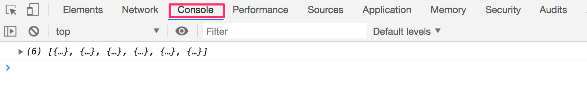

Al hacer clic en el pequeño triángulo al principio de la línea, puede expandir el texto en la consola.

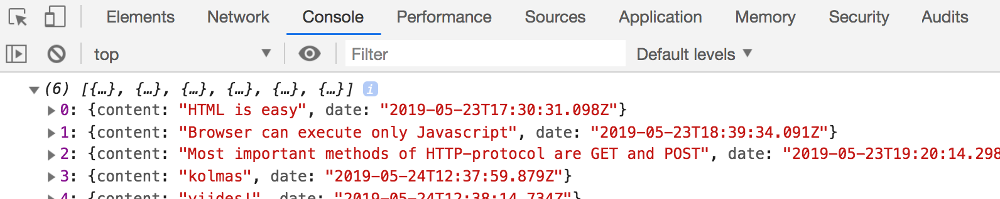

Esta salida en la consola es causada por el comando <em>console.log</em> en el código:

```js
const data = JSON.parse(this.responseText)
console.log(data)
```

Entonces, después de recibir datos del servidor, el código los imprime en la consola.

La pestaña <i>Console</i> y el comando <em>console.log</em> le resultarán muy familiares durante el curso.

### Controladores de eventos y funciones de devolución de llamada

La estructura de este código es un poco extraña:

```js
var xhttp = new XMLHttpRequest()

xhttp.onreadystatechange = function() {
// código que se encarga de la respuesta del servidor
}

xhttp.open('GET', '/data.json', true)
xhttp.send()
```

La solicitud al servidor se envía en la última línea, pero el código para manejar la respuesta se puede encontrar más arriba. ¿Que esta pasando?

En esta línea,

```js
xhttp.onreadystatechange = function() { 
```

se define un <i>controlador de eventos</i> para el evento <i>onreadystatechange</i> para el objeto <em>xhttp</em> que realiza la solicitud. Cuando cambia el estado del objeto, el navegador llama a la función del controlador de eventos. El código de función verifica que [readyState](https://developer.mozilla.org/en-US/docs/Web/API/XMLHttpRequest/readyState) sea igual a 4 (que describe la situación <i>La operación está completa</i>) y que el código de estado HTTP de la respuesta es 200.

```js
xhttp.onreadystatechange = function() { 
  if (this.readyState == 4 && this.status == 200) {
    // código que se encarga de la respuesta del servidor
  }
} 
```

El mecanismo de invocación de controladores de eventos es muy común en JavaScript. Las funciones del controlador de eventos se denominan funciones [callback](https://developer.mozilla.org/en-US/docs/Glossary/Callback_function). El código de la aplicación no invoca las funciones en sí, sino el entorno de ejecución -el navegador-, invoca la función en el momento adecuado, cuando se ha producido el <i>evento</i>.

### Modelo de Objeto de Documento o DOM

Podemos pensar en las páginas HTML como estructuras de árbol implícitas.

<pre>
html
  head
    link
    script
  body
    div
      h1
      div
        ul
          li
          li
          li
      form
        input
        input
</pre>

La misma estructura arbórea se puede ver en la pestaña de la consola <i>Elements</i>.

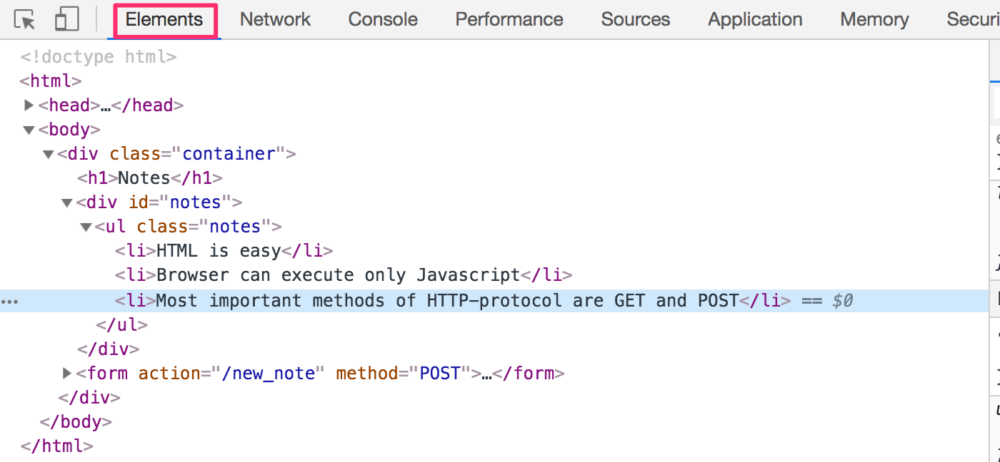

El funcionamiento del navegador se basa en la idea de representar los elementos HTML como un árbol.

Document Object Model, o [DOM](https://en.wikipedia.org/wiki/Document_Object_Model) es una interfaz de programación de aplicaciones, (una <i>API</i>), que permite la modificación programática de <i>árboles de elementos</i> correspondientes a páginas web.

El código JavaScript introducido en el capítulo anterior utilizó DOM-API para agregar una lista de notas a la página.

El siguiente código crea un nuevo nodo a la variable <em>ul</em> y le agrega algunos nodos secundarios:

```js
var ul = document.createElement('ul')

data.forEach(function(note) {
  var li = document.createElement('li')

  ul.appendChild(li)
  li.appendChild(document.createTextNode(note.content))
})
```

Finalmente, la rama de árbol de la variable <em>ul</em> está conectada a su lugar adecuado en el árbol HTML de toda la página:

```js 
document.getElementById('notes').appendChild(ul)
```

### Manipulando el objeto document desde la consola

El nodo superior del árbol DOM de un documento HTML se denomina objeto <em>document</em>. Podemos realizar varias operaciones en una página web utilizando DOM-API. Puede acceder al objeto <em>document</em> escribiendo <em>document</em> en la pestaña Console:

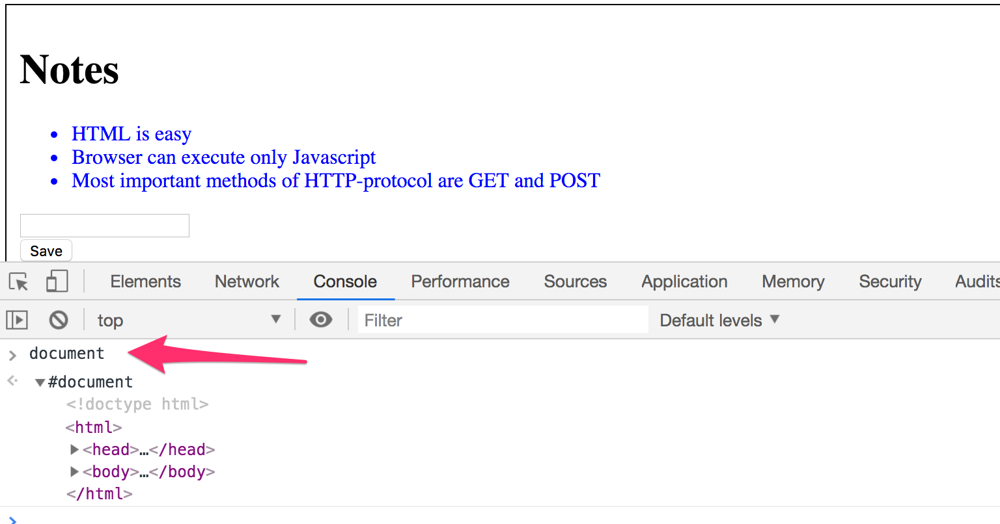

Agreguemos una nueva nota a la página desde la consola.

Primero, obtendremos la lista de notas de la página. La lista está en el primer elemento ul de la página:

```js 
list = document.getElementsByTagName('ul')[0]
```

Luego crea un nuevo elemento li y agrégale contenido de texto:

```js 
newElement = document.createElement('li')
newElement.textContent = 'Page manipulation from console is easy'
```

Y agregue el nuevo elemento li a la lista:

```js
list.appendChild(newElement)
```

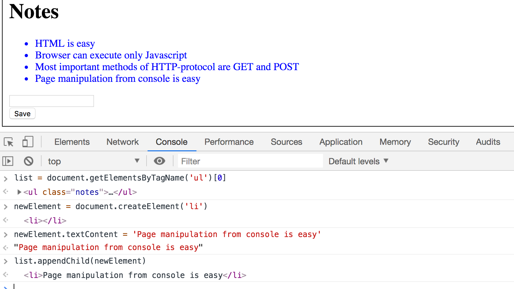

Aunque la página se actualiza en su navegador, los cambios no son permanentes. Si se vuelve a cargar la página, la nueva nota desaparecerá porque los cambios no se enviaron al servidor. El código JavaScript que obtiene el navegador siempre creará la lista de notas basada en datos JSON de la dirección <https://studies.cs.helsinki.fi/exampleapp/data.json>.

### CSS

El elemento <i>head</i> del código HTML de la página de Notes contiene un [enlace](https://developer.mozilla.org/en-US/docs/Web/HTML/Element/link), que determina que el navegador debe obtener una hoja de estilo [CSS](https://developer.mozilla.org/en-US/docs/Web/CSS) de la dirección [main.css](https://studies.cs.helsinki.fi/exampleapp/main.css).

Las hojas de estilo en cascada, o CSS, es un lenguaje de marcado que se utiliza para determinar la apariencia de las páginas web.

El archivo CSS obtenido tiene el siguiente aspecto:

```css
.container {
  padding: 10px;
  border: 1px solid;
}

.notes {
  color: blue;
}
```

El archivo define dos [selectores de clase](https://developer.mozilla.org/en-US/docs/Web/CSS/Class_selectors). Se utilizan para seleccionar ciertas partes de la página y definir reglas de estilo para aplicarles estilo.

Una definición de selector de clase siempre comienza con un punto y contiene el nombre de la clase.

Las clases son [atributos](https://developer.mozilla.org/en-US/docs/Web/HTML/Global_attributes/class), que se pueden agregar a elementos HTML.

Los atributos CSS se pueden examinar en la pestaña <i>Elements</i> de la consola:

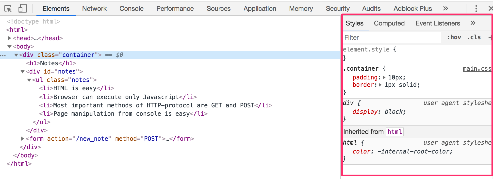

El elemento <i>div</i> más externo tiene la clase <i>container</i>. El elemento <i>ul</i> que contiene la lista de notas tiene la clase <i>notes</i>.

La regla CSS define que los elementos con la clase <i>container</i> se delinearán con un [border](https://developer.mozilla.org/en-US/docs/Web/CSS/border) de un píxel de ancho. También establece un [padding](https://developer.mozilla.org/en-US/docs/Web/CSS/padding) de 10 píxeles en el elemento. Esto agrega un espacio vacío entre el contenido del elemento y el borde.

La segunda regla CSS establece el color del texto de las notas en azul.

Los elementos HTML también pueden tener otros atributos además de clases. El elemento <i>div</i> que contiene las notas tiene un atributo [id](https://developer.mozilla.org/en-US/docs/Web/HTML/Global_attributes/id). El código JavaScript usa el id para encontrar el elemento.

La pestaña <i>Elements</i> de la consola se puede utilizar para cambiar los estilos de los elementos.

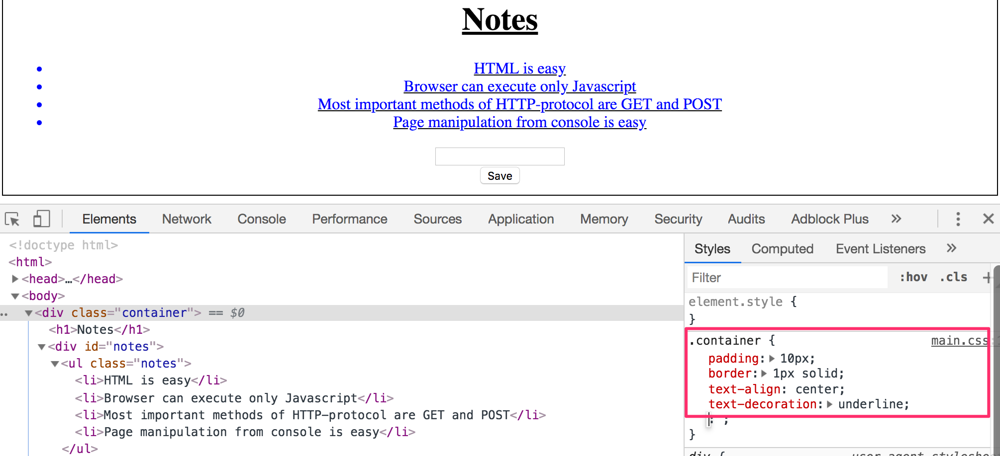

Los cambios realizados en la consola no serán permanentes. Si desea realizar cambios duraderos, debe guardarlos en la hoja de estilo CSS del servidor.

### Cargando una página que contiene JavaScript - revisada

Revisemos lo que sucede cuando la página https://studies.cs.helsinki.fi/exampleapp/notes se abre en el navegador.

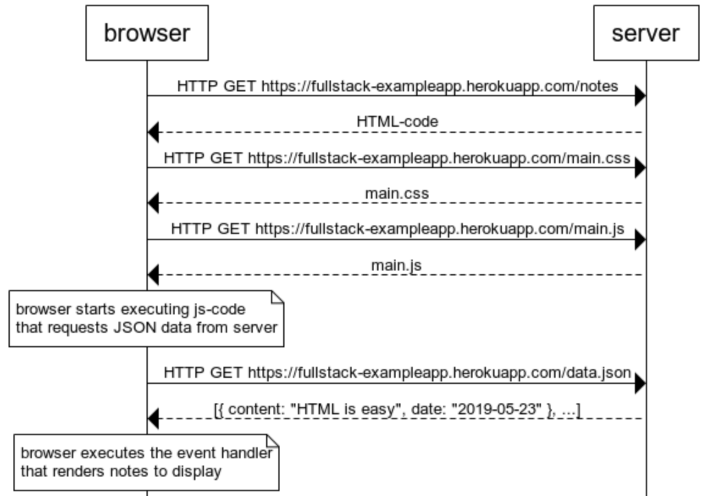

- El navegador obtiene el código HTML que define el contenido y la estructura de la página del servidor mediante una solicitud HTTP GET.
- Los enlaces en el código HTML hacen que el navegador también busque la hoja de estilo CSS <i>main.cs</i>...
- ... y un archivo de código JavaScript <i>main.js</i>
- El navegador ejecuta el código JavaScript. El código realiza una solicitud HTTP GET a la dirección https://studies.cs.helsinki.fi/exampleapp/data.json, que devuelve las notas como datos JSON.
- Cuando se han obtenido los datos, el navegador ejecuta un <i>controlador de eventos</i>, que muestra las notas en la página utilizando DOM-API.

### Formularios y HTTP POST

A continuación, examinemos cómo se realiza la adición de una nueva nota.

La página de notas contiene un [elemento de formulario](https://developer.mozilla.org/en-US/docs/Learn/HTML/Forms/Your_first_HTML_form)

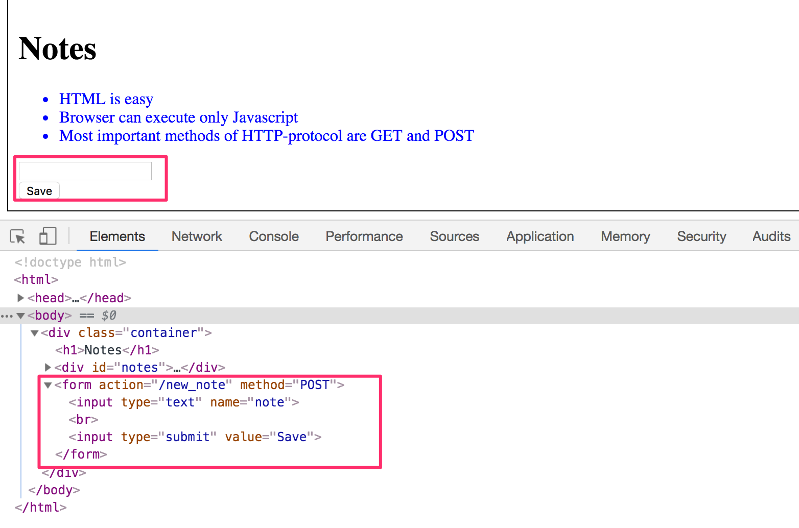

Cuando se hace clic en el botón del formulario, el navegador enviará la entrada del usuario al servidor.

Abramos la pestaña <i>Network</i> y veamos cómo se ve enviar el formulario:

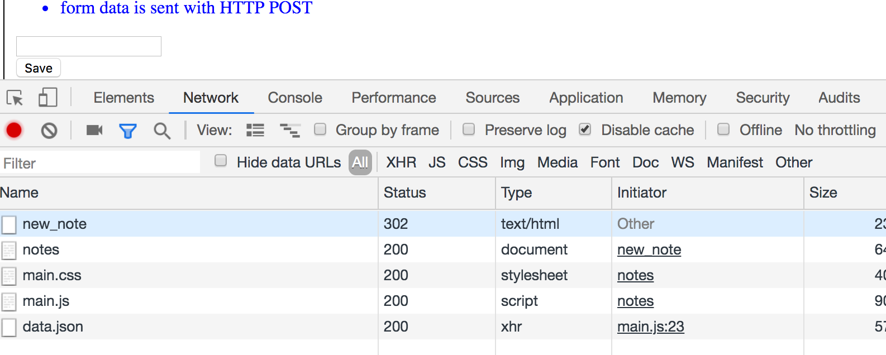

Sorprendentemente, enviar el formulario causa en total <i>cinco</i> solicitudes HTTP.
El primero es el evento de envío de formulario. Acerquémonos:

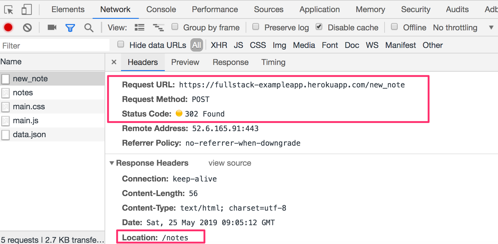

Es una solicitud [HTTP POST](https://developer.mozilla.org/en-US/docs/Web/HTTP/Methods/POST) a la dirección del servidor <i>new_note</i>. El servidor responde con el código de estado HTTP 302. Se trata de una [redirección de URL](https://en.wikipedia.org/wiki/URL_redirection), con la que el servidor solicita al navegador que realice una nueva solicitud HTTP GET a la dirección definida en la <i>Ubicación (Location)</i> del encabezado: la dirección <i>notes</i>.

Entonces, el navegador vuelve a cargar la página de Notas. La recarga provoca tres solicitudes HTTP más: obtener la hoja de estilo (main.css), el código JavaScript (main.js) y los datos sin procesar de las notas (data.json).

La pestaña network también muestra los datos enviados con el formulario:

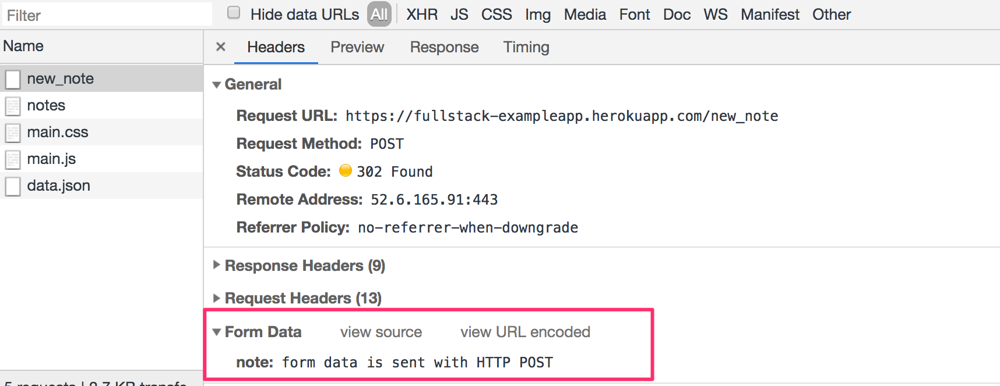

La etiqueta Form tiene atributos <i>action</i> y <i>method</i>, que definen que el envío del formulario se realiza como una solicitud HTTP POST a la dirección <i>new_note</i>.

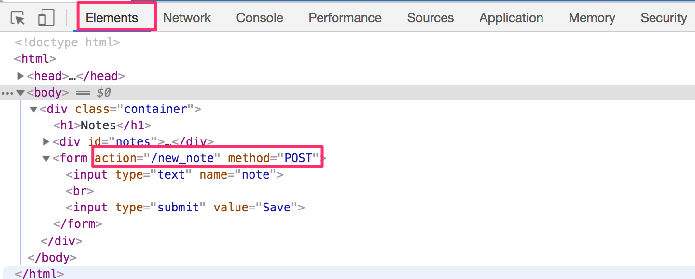

El código en el servidor responsable de la solicitud POST es bastante simple (NB: este código está en el servidor, y no en el código JavaScript obtenido por el browser):

```js
app.post('/new_note', (req, res) => {
  notes.push({
    content: req.body.note,
    date: new Date(),
  })

  return res.redirect('/notes')
})
```

Los datos se envían como el [cuerpo](https://developer.mozilla.org/en-US/docs/Web/HTTP/Methods/POST) de la solicitud POST.

El servidor puede acceder a los datos accediendo al campo <em>req.body</em> del objeto de solicitud <em>req</em>.

El servidor crea un nuevo objeto de nota y lo agrega a una matriz llamada <em>notes</em>.

```js
notes.push({ 
  content: req.body.note,
  date: new Date(),
})
```

Los objetos Note tienen dos campos: <i>content</i> que contiene el contenido real de la nota y <i>date</i> que contiene la fecha y hora en que se creó la nota.

El servidor no guarda nuevas notas en una base de datos, por lo que las nuevas notas desaparecen cuando se reinicia el servidor.

### AJAX

La página de Notas de la aplicación sigue un estilo de desarrollo web de principios de los noventa y "utiliza Ajax". Como tal, está en la cresta de la ola de tecnología web de principios de la década de 2000.

[AJAX](https://en.wikipedia.org/wiki/Ajax_(programming)) (JavaScript Asincrónico y XML) es un término introducido en febrero de 2005 sobre la base de los avances en la tecnología de los navegadores para describir un nuevo enfoque revolucionario que permitió la obtención de contenido en páginas web utilizando JavaScript incluido dentro del HTML, sin la necesidad de volver a renderizar la página.

Antes de la era AJAX, todas las páginas web funcionaban como la [aplicación web tradicional](/es/part0/fundamentos_de_las_aplicaciones_web#aplicaciones_web_tradicionales) que vimos anteriormente en este capítulo.
Todos los datos que se muestran en la página se obtuvieron con el código HTML generado por el servidor.

La página Notes utiliza AJAX para obtener los datos de las notas. El envío del formulario todavía utiliza el mecanismo tradicional de envío de formularios web.

Las URLs de la aplicación reflejan los viejos tiempos sin preocupaciones. Los datos JSON se obtienen de la URL <https://studies.cs.helsinki.fi/exampleapp/data.json> y se envían nuevas notas a la URL <https://studies.cs.helsinki.fi/exampleapp/new_note>.  
Hoy en día, URL como estas no se considerarían aceptables, ya que no siguen las convenciones generalmente reconocidas de las API [RESTful](https://en.wikipedia.org/wiki/Representational_state_transfer#Applied_to_Web_services), que analizaremos más en la [parte 3](/es/part3)

La cosa denominada AJAX es ahora tan común que se da por sentado. El término se ha desvanecido en el olvido, y la nueva generación ni siquiera ha oído hablar de él.

### Aplicación de una sola página

En nuestra aplicación de ejemplo, la página de inicio funciona como una página web tradicional: toda la lógica está en el servidor y el navegador solo muestra el HTML como se indica.

La página Notes da parte de la responsabilidad al navegador, la generación del código HTML para las notas existentes. El navegador aborda esta tarea ejecutando el código JavaScript que obtuvo del servidor. El código obtiene las notas del servidor como datos JSON y agrega elementos HTML para mostrar las notas en la página usando la [DOM-API](/es/part0/fundamentos_de_las_aplicaciones_web#modelo-de-objeto-de-documento-o-dom).

En los últimos años, ha surgido el estilo de [Aplicación de una sola página](https://en.wikipedia.org/wiki/Single-page_application) (SPA) para crear aplicaciones web. Los sitios web de estilo SPA no obtienen todas sus páginas por separado del servidor como lo hace nuestra aplicación de muestra, sino que comprenden solo una página HTML obtenida del servidor, cuyo contenido se manipula con JavaScript que se ejecuta en el navegador.

La página Notes de nuestra aplicación tiene cierto parecido con las aplicaciones de estilo SPA, pero aún no está del todo lista. Aunque la lógica para representar las notas se ejecuta en el navegador, la página sigue utilizando la forma tradicional de agregar nuevas notas. Los datos se envían al servidor con el envío del formulario, y el servidor indica al navegador que vuelva a cargar la página Notes con un <i>redireccionamiento</i>.

Puede encontrar una versión de la aplicación de una sola página de nuestra aplicación de ejemplo en <https://studies.cs.helsinki.fi/exampleapp/spa>.
A primera vista, la aplicación se ve exactamente igual que la anterior.
El código HTML es casi idéntico, pero el archivo JavaScript es diferente (<i>spa.js</i>) y hay un pequeño cambio en cómo se define la etiqueta de formulario:

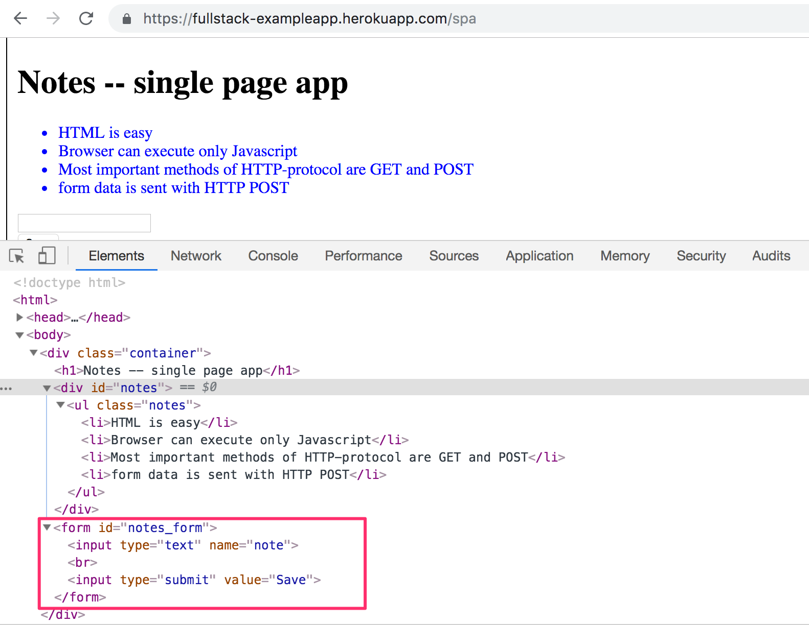

El formulario no tiene atributos de <i>action</i> o <i>method</i> para definir cómo y dónde enviar los datos de entrada.

Abra la pestaña <i>Network</i> y vacíela haciendo clic en el símbolo 🚫. Cuando ahora cree una nueva nota, notará que el navegador envía solo una solicitud al servidor.

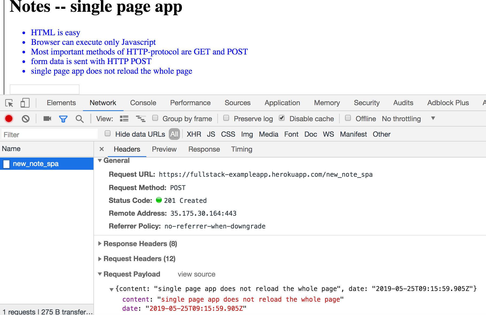

La solicitud POST a la dirección <i>new_note_spa</i> contiene la nueva nota como datos JSON que contienen tanto el contenido de la nota (<i>content</i>) como la marca de tiempo (<i>date</i>):

```js
{
  content: "single page app does not reload the whole page",
  date:" 2019-05-25T15: 15: 59.905Z "
}
```

El encabezado <i>Content-Type</i> de la solicitud le dice al servidor que los datos incluidos están representados en formato JSON.

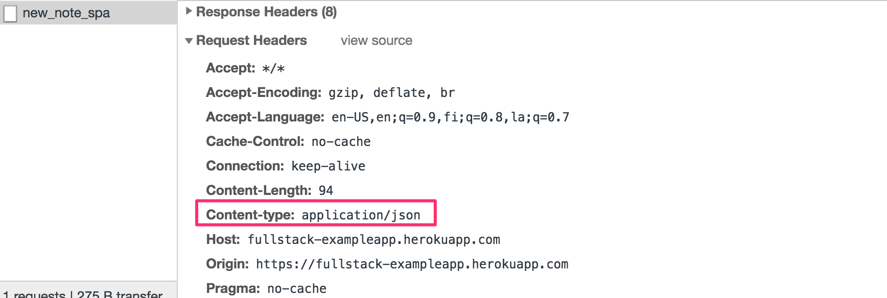

Sin este encabezado, el servidor no sabría cómo analizar correctamente los datos.

El servidor responde con el código de estado [201 Created](https://httpstatuses.com/201). Esta vez, el servidor no solicita una redirección, el navegador permanece en la misma página y no envía más solicitudes HTTP.

La versión SPA de la aplicación no envía los datos del formulario de la forma tradicional, sino que utiliza el código JavaScript que obtuvo del servidor.
Analizaremos un poco este código, aunque comprender todos los detalles aún no es importante.

```js
var form = document.getElementById('notes_form')
form.onsubmit = function(e) {
  e.preventDefault()

  var note = {
    content: e.target.elements[0].value,
    date: new Date(),
  }

  notes.push(note)
  e.target.elements[0].value = ''
  redrawNotes()
  sendToServer(note)
}
```

El comando <em>document.getElementById('notes_form')</em> le indica al código que busque el elemento form de la página, y para registrar un <i>controlador de eventos</i> para manejar el evento de envío del formulario. El controlador de eventos llama inmediatamente al método <em>e.preventDefault()</em> para evitar el manejo predeterminado del envío de formularios. El método predeterminado enviaría los datos al servidor y provocaría una nueva solicitud GET, lo que no queremos que suceda.

Luego, el controlador de eventos crea una nueva nota, la agrega a la lista de notas con el comando <em>notes.push(note)</em>, vuelve a representar la lista de notas en la página y envía la nueva nota al servidor.

El código para enviar la nota al servidor es el siguiente:

```js
var sendToServer = function(note) {
  var xhttpForPost = new XMLHttpRequest()
  // ...

  xhttpForPost.open('POST', '/new_note_spa', true)
  xhttpForPost.setRequestHeader(
    'Content-type', 'application/json'
  )
  xhttpForPost.send(JSON.stringify(note))
}
```

El código determina que los datos se enviarán con una solicitud HTTP POST y el tipo de datos será JSON. El tipo de datos se determina con un encabezado <i>Content-type</i>. Luego, los datos se envían como JSON-string.

El código de la aplicación está disponible en <https://github.com/mluukkai/example_app>.
Vale la pena recordar que la aplicación solo está destinada a demostrar los conceptos del curso. El código sigue un estilo de desarrollo deficiente en cierta medida y no debe usarse como ejemplo al crear sus propias aplicaciones. Lo mismo ocurre con las URL utilizadas. La URL <i>new_note_spa</i>, a la que se envían las nuevas notas, no cumple con las mejores prácticas actuales.

### Librerías JavaScript

La aplicación de muestra se realiza con el llamado [vanilla JavaScript](https://medium.freecodecamp.org/is-vanilla-javascript-worth-learning-absolutely-c2c67140ac34), utilizando solo la DOM-API y JavaScript para manipular la estructura de las páginas.

En lugar de utilizar JavaScript y DOM-API únicamente, a menudo se utilizan diferentes librerías que contienen herramientas con las que es más fácil trabajar en comparación con DOM-API para manipular páginas. Una de estas librerías es la popular [jQuery](https://jquery.com/).

jQuery se desarrolló cuando las aplicaciones web seguían principalmente el estilo tradicional del servidor que genera páginas HTML, cuya funcionalidad se mejoró en el lado del navegador usando JavaScript escrito con jQuery. Una de las razones del éxito de jQuery fue la llamada compatibilidad entre navegadores. La librería funcionó independientemente del navegador o de la empresa que la hizo, por lo que no hubo necesidad de soluciones específicas para el navegador. Hoy en día, el uso de jQuery no está tan justificado dado el avance de VanillaJS, y los navegadores más populares generalmente soportan bien las funcionalidades básicas.

El auge de la aplicación de una sola página trajo varias formas más "modernas" de desarrollo web que jQuery. El favorito de la primera ola de desarrolladores fue [BackboneJS](http://backbonejs.org/). Después de su [lanzamiento](https://github.com/angular/angular.js/blob/master/CHANGELOG.md#100-temporal-domination-2012-06-13) en 2012, [AngularJS](https://angularjs.org/) de Google rápidamente se convirtió casi en el estándar de facto del desarrollo web moderno.

Sin embargo, la popularidad de Angular se desplomó después de que el equipo de Angular [anunció](https://jaxenter.com/angular-2-0-announcement-backfires-112127.html) en octubre de 2014 que el soporte para la versión 1 terminará, y Angular 2 no será retrocompatible con la primera versión. Angular 2 y las versiones más nuevas no han recibido una bienvenida muy cálida.

Actualmente, la herramienta más popular para implementar la lógica del lado del navegador de las aplicaciones web es la librería [React](https://reactjs.org/) de Facebook.
Durante este curso, nos familiarizaremos con React y la librería [Redux](https://github.com/reactjs/redux), que se usan juntos con frecuencia.

El estado de React parece sólido, pero el mundo de JavaScript cambia constantemente. Por ejemplo, recientemente un recién llegado -[VueJS](https://vuejs.org/)- ha estado captando cierto interés.

### Desarrollo web full stack

¿Qué significa el nombre del curso, <i>Desarrollo web full stack</i>? Full stack es una palabra de moda de la que todo el mundo habla, aunque nadie sabe realmente lo que significa. O al menos, no existe una definición acordada para el término.

Prácticamente todas las aplicaciones web tienen (al menos) dos "capas": el navegador, al estar más cerca del usuario final, es la capa superior y el servidor, la inferior. A menudo también hay una capa de base de datos debajo del servidor. Por lo tanto, podemos pensar en la <i>arquitectura</i> de una aplicación web como una especie de <i>stack (pila)</i> de capas.

A menudo, también hablamos sobre el [frontend](https://en.wikipedia.org/wiki/Front_and_back_ends) y el [backend](https://en.wikipedia.org/wiki/Front_and_back_ends). El navegador es la interfaz y JavaScript que se ejecuta en el navegador es el código de la interfaz. El servidor, por otro lado, es el backend.

En el contexto de este curso, el desarrollo web full stack significa que nos enfocamos en todas las partes de la aplicación: el frontend, el backend y la base de datos. A veces, el software del servidor y su sistema operativo se ven como parte del stack, pero no vamos a entrar en ellos.

Codificaremos el backend con JavaScript, utilizando el entorno de ejecución [Node.js](https://nodejs.org/en/). El uso del mismo lenguaje de programación en múltiples capas de la pila le da al desarrollo web full stack una dimensión completamente nueva. Sin embargo, no es un requisito del desarrollo web full stack utilizar el mismo lenguaje de programación (JavaScript) para todas las capas del stack.

Solía ​​ser más común que los desarrolladores se especializaran en una capa del stack, por ejemplo, el backend. Las tecnologías en el backend y el frontend eran bastante diferentes. Con la tendencia full stack, se ha vuelto común que los desarrolladores dominen todas las capas de la aplicación y la base de datos. A menudo, los desarrolladores full stack también deben tener suficientes habilidades de configuración y administración para operar su aplicación, por ejemplo, en la nube.

### Fatiga de JavaScript

El desarrollo web full stack es un desafío de muchas maneras. Suceden cosas en muchos lugares a la vez y la depuración es un poco más difícil que con las aplicaciones de escritorio normales. JavaScript no siempre funciona como cabría esperar (en comparación con muchos otros lenguajes), y la forma asincrónica en que funcionan sus entornos de ejecución genera todo tipo de desafíos. Comunicarse en la web requiere conocimientos del protocolo HTTP. También se deben manejar las bases de datos y la administración y configuración del servidor. También sería bueno saber suficiente CSS para hacer las aplicaciones al menos algo presentables.

El mundo de JavaScript se desarrolla rápidamente, lo que conlleva sus propios desafíos. Las herramientas, las librerías y el propio lenguaje están en constante desarrollo. Algunos están empezando a cansarse del cambio constante y han acuñado un término para ello: [fatiga](https://auth0.com/blog/how-to-manage-javascript-fatiga/) de [JavaScript](https://medium.com/@ericclemmons/javascript-fatigue-48d4011b6fc4).

Usted mismo sufrirá fatiga de JavaScript durante este curso. Afortunadamente para nosotros, hay algunas formas de suavizar la curva de aprendizaje y podemos comenzar con la codificación en lugar de la configuración. No podemos evitar la configuración por completo, pero podemos seguir adelante alegremente en las próximas semanas mientras evitamos los peores infiernos de configuración.

</div>

<div class="tasks"> 
  <h3> Ejercicios 0.1.-0.6.</h3>

Los ejercicios se envían a través de GitHub y marcando los ejercicios como realizados en el [sistema de envío](https://studies.cs.helsinki.fi/stats/courses/fullstackopen).

Puede enviar todos los ejercicios al mismo repositorio o utilizar varios repositorios diferentes. Si envía ejercicios de diferentes partes al mismo repositorio, nombre bien sus directorios. Si utiliza un repositorio privado para enviar los ejercicios, agregue a _mluukkai_ como colaborador.

Una buena manera de nombrar los directorios en su repositorio de presentación es el siguiente:

```
part0
part1 
  CourseInfo
  unicafe
  anecdotes
part2
  phonebook
  countries
```

Entonces, cada parte tiene su propio directorio, que contiene un directorio para cada conjunto de ejercicios (como los ejercicios unicafe en la parte 1).

Los ejercicios se envían **una parte a la vez**. Cuando haya enviado los ejercicios de una parte, ya no podrá enviar los ejercicios perdidos de esa parte.

<h4> 0.1: HTML</h4>

Revise los conceptos básicos de HTML leyendo este tutorial de Mozilla: [tutorial HTML](https://developer.mozilla.org/en-US/docs/Learn/Getting_started_with_the_web/HTML_basics).

<i>Este ejercicio no se envía a GitHub, basta con leer el tutorial</i>

<h4>0.2: CSS</h4>

Revise los conceptos básicos de CSS leyendo este tutorial de Mozilla: [tutorial CSS](https://developer.mozilla.org/en-US/docs/Learn/Getting_started_with_the_web/CSS_basics).

<i>Este ejercicio no se envía a GitHub, basta con leer el tutorial</i>

<h4>0.3: Formularios HTML</h4>

Aprende sobre los conceptos básicos de los formularios HTML leyendo el tutorial de Mozilla [Tu primer formulario](https://developer.mozilla.org/en-US/docs/Learn/HTML/Forms/Your_first_HTML_form).

<i>Este ejercicio no se envía a GitHub, basta con leer el tutorial</i>

<h4>0.4: nueva nota</h4>

En el capítulo [Cargando una página que contiene JavaScript - revisada](/es/part0/fundamentos-de-las-aplicaciones-web#cargando-una-página-que-contiene-java-script-revisado) la cadena de eventos causada al abrir la página <https://studies.cs.helsinki.fi/exampleapp/notes> se representa como un [diagrama de secuencia](https://www.geeksforgeeks.org/unified-modeling-language-uml-sequence-diagrams/)

El diagrama se hizo usando el servicio [websequencediagrams](https://www.websequencediagrams.com) de la siguiente manera:

```
browser->server: HTTP GET https://studies.cs.helsinki.fi/exampleapp/notes
server-->browser: HTML-code
browser->server: HTTP GET https://studies.cs.helsinki.fi/exampleapp/main.css
server-->browser: main.css
browser->server: HTTP GET https://studies.cs.helsinki.fi/exampleapp/main.js
server-->browser: main.js

note over browser:
browser starts executing js-code
that requests JSON data from server 
end note

browser->server: HTTP GET https://studies.cs.helsinki.fi/exampleapp/data.json
server-->browser: [{ content: "HTML is easy", date: "2019-05-23" }, ...]

note over browser:
browser executes the event handler
that renders notes to display
end note
```

**Crear un diagrama similar** que describa la situación en la que el usuario crea una nueva nota en la página <https://studies.cs.helsinki.fi/exampleapp/notes> escribiendo algo en el campo de texto y haciendo clic en el botón <i>submit</i>.

Si es necesario, muestre las operaciones en el navegador o en el servidor como comentarios en el diagrama.

El diagrama no tiene por qué ser un diagrama de secuencia. Cualquier forma sensata de presentar los eventos está bien.

Toda la información necesaria para hacer esto, y los dos ejercicios siguientes, se pueden encontrar en el texto de [esta parte](/es/part0/fundamentos-de-las-aplicaciones-web#formularios-y-http-post).
La idea de estos ejercicios es leer el texto una vez más y pensar en lo que está sucediendo allí. No es necesario leer el [código](https://github.com/mluukkai/example_app) de la aplicación pero, por supuesto, es posible.

<h4>0.5: Aplicación de una sola página</h4>

Cree un diagrama que describa la situación en la que el usuario accede a la versión de [aplicación de una sola página](/es/part0/fundamentos-de-las-aplicaciones-web#aplicacion-de-una-sola-pagina) de la aplicación de notas en <https://studies.cs.helsinki.fi/exampleapp/spa>.

  <h4>0.6: Nueva nota</h4>

Cree un diagrama que represente la situación en la que el usuario crea una nueva nota utilizando la versión de una sola página de la aplicación.

Este fue el último ejercicio, y es hora de enviar sus respuestas a GitHub y marcar los ejercicios como hechos en la [solicitud de envío](https://studies.cs.helsinki.fi/stats/courses/fullstackopen).

</div>
