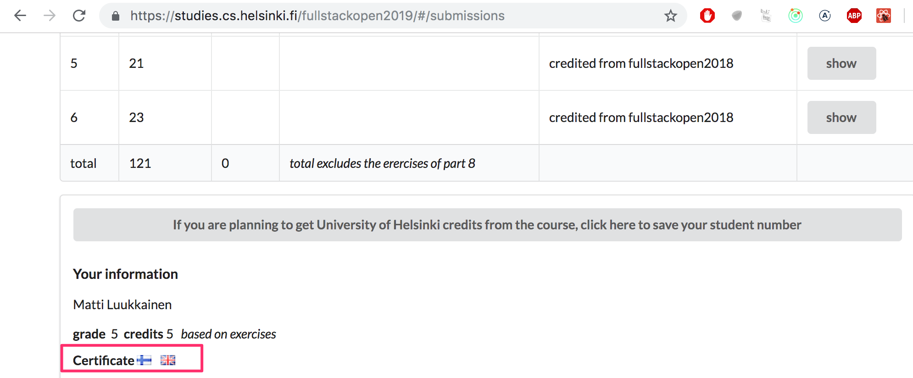

Kurssilla tutustutaan JavaScriptilla tapahtuvaan moderniin web-sovelluskehitykseen. Pääpaino on React-kirjaston avulla toteutettavissa single page -sovelluksissa, ja niitä tukevissa Node.js:llä toteutetuissa REST- ja GraphQL-rajapinnoissa. Kurssi sisältää myös osat, joissa tutustutaan TypeScriptiin, React Nativeen ja jatkuvaan integraatioon.

Kurssilla käsitellään myös sovellusten testaamista, konfigurointia ja suoritusympäristöjen hallintaa sekä NoSQL-tietokantoja.

### Oletetut esitiedot

Osallistujilta edellytetään vahvaa ohjelmointirutiinia, web-ohjelmoinnin ja tietokantojen perustuntemusta, Git-versionhallintajärjestelmän peruskäytön hallintaa, kykyä pitkäjänteiseen työskentelyyn sekä valmiutta omatoimiseen tiedonhakuun ja ongelmanratkaisuun.

Osallistuminen ei kuitenkaan edellytä kurssilla käsiteltävien tekniikoiden tai JavaScript-kielen hallintaa.

### Kurssimateriaali

Kurssimateriaali on tarkoitettu luettavaksi osa kerrallaan "alusta loppuun". Materiaalin seassa on tehtäviä, jotka on sijoiteltu siten, että kunkin tehtävän tekemiseen pitäisi olla riittävät tekniset valmiudet sitä edeltävässä materiaalissa. Voit siis tehdä tehtäviä sitä mukaan kun niitä tulee materiaalissa vastaan. Voi myös olla, että koko osan tehtävät kannattaa tehdä vasta sen jälkeen, kun olet ensin lukenut osan alusta loppuun kertaalleen. Useissa osissa tehtävät ovat samaa ohjelmaa laajentavia pienistä osista koostuvia kokonaisuuksia. Muutamia tehtävien ohjelmia kehitetään eteenpäin useamman osan aikana.

Materiaali perustuu muutamien osasta osaan vaihtuvien esimerkkiohjelmien asteittaiseen laajentamiseen. Materiaali toiminee parhaiten, jos kirjoitat samalla koodin myös itse ja teet koodiin myös pieniä modifikaatioita. Materiaalin käyttämien ohjelmien koodin eri vaiheiden tilanteita on tallennettu GitHubiin.

### Suoritustapa

Kurssi koostuu kahdestatoista osasta, joista ensimmäinen on historiallisista syistä numero nolla. Osat voi tulkita löyhästi ajatellen viikoiksi. Osia kuitenkin ilmestyy nopeampaa tahtia, ja suoritusnopeuskin on melko vapaa.

Materiaalissa osasta <i>n</i> osaan <i>n+1</i> eteneminen ei ole mielekästä ennen kuin riittävä osaaminen osan <i>n</i> asioista on saavutettu. Kurssilla sovelletaankin pedagogisin termein <i>tavoiteoppimista</i>, [engl. mastery learning](https://en.wikipedia.org/wiki/Mastery_learning) ja on tarkoitus, että etenet seuraavaan osaan vasta, kun riittävä määrä edellisen osan tehtävistä on tehty.

Oletuksena on, että teet kunkin osan tehtävistä <i>ainakin ne</i> jotka eivät ole merkattu tähdellä. Myös tähdellä merkatut tehtävät vaikuttavat arvosteluun, mutta niiden tekemättä jättäminen ei aiheuta liian suuria esteitä seuraavan osan (tähdellä merkkaamattomien) tehtävien tekemiseen. 

Etenemisnopeus kurssilla on vapaa, tehtäviä voi palauttaa 1.3.2022. klo 23:59 asti. Jos haluat kurssista Avoimen yliopiston kautta opintopisteet, tulee kurssin koe suorittaa viimeistään 10.1.2022.

Tämän kurssin eri osiin jo tehtyjen palautusten ajankäyttöstatistiikan näet [tehtävien palautussovelluksesta](https://studies.cs.helsinki.fi/stats/courses/fullstackopen).

### Osat ja suorittaminen

Full Stack –opinnot koostuvat ydinkurssista, sekä useista lisäosista.  Voit suorittaa opinnot 5-14 opintopisteen laajuisena. 

#### Osat 0-5 (ydinkurssi) - Full Stack -websovelluskehitys (5 op, CSM141081)

Suorituksen opintopistemäärä ja arvosana määräytyvät kurssin osien 0-7 kaikkien tehtyjen tehtävien (myös tähdellä merkittyjen) perusteella.

Arvosana/opintopisterajat:

| tehtäviä     | opintopisteitä | arvosana | 
| ------------ | :------------: | :------: |
| 138          |       7        | 5        |
| 127          |       6        | 5        |
| 116          |       5        | 5        |
| 105          |       5        | 4        |
| 94           |       5        | 3        |
| 83           |       5        | 2        |
| 72           |       5        | 1        |

Jos haluat kurssista virallisen suoritusmerkinnän, kuuluu kurssiin myös koe. Hyväksytty suoritus edellyttää kokeen läpäisemistä, koe ei kuitenkaan vaikuta arvosanaan. Koe suoritetaan Avoimen yliopiston [Moodle-järjestelmässä](https://courses.helsinki.fi/fi/aytkt21009/129171256), ohje kokeeseen ilmoittautumiseen [täällä](/osa0/yleista/#kokeeseen-ilmoittautuminen).

Kokeen viimeinen suorituspäivä on 10.1.2022. **Huomaa, että viimeinen päivä kokeeseen ilmoittautumiselle on 9.1.2022.**

Voit osallistua kokeeseen vasta siinä vaiheessa kun olet tehnyt riittävästi tehtäviä 5 opintopisteen suoritukseen. Käytännössä kokeeseen ei kuitenkaan kannata osallistua heti kun riittävä tehtäväpistemäärä on suoritettu. Koe on sisällöltään sama riippumatta siitä, onko suorituksesi laajuus 5-14 opintopistettä. Koe ei vaikuta kurssilta saamaasi arvosanaan. Kokeen läpipääsyyn riittää 50% kokeen tarjolla olevista pisteistä, eli 12,5 pistettä.

#### Osa 6 - Full Stack -websovelluskehitys, lisäosa 1 (1 op, CSM141082)
Suorittamalla vähintään 127 tehtävää kurssin osista 0-7 ydinkurssin suorittamisen yhteydessä, voit laajentaa suoritustasi yhdellä opintopisteellä. 
-	Tee vähintään 127 tehtävää osista 0-7. 
-	[Ilmoittaudu tähän osaan Avoimen yliopiston kautta.](https://www.avoin.helsinki.fi/palvelut/esittely.aspx?s=otm-2c09d93d-4f75-4359-85a3-5f8e2c2c5ce6)
-	[Pyydä suoritusmerkintää](https://fullstackopen.com/osa0/yleista#suoritusmerkinnan-pyytaminen) tästä osasta. 

#### Osa 7 - Full Stack -websovelluskehitys, lisäosa 2 (1 op, CSM141083)
Suorittamalla vähintään 138 tehtävää kurssin osista 0-7 ydinkurssin suorittamisen yhteydessä, voit laajentaa suoritustasi yhdellä opintopisteellä. 
-	Tee vähintään 138 tehtävää osista 0-7. 
-	[Ilmoittaudu tähän osaan Avoimen yliopiston kautta.](https://www.avoin.helsinki.fi/palvelut/esittely.aspx?s=otm-51f0edb4-c137-4871-a1e0-d93ca9b47bdf)
-	[Pyydä suoritusmerkintää](https://fullstackopen.com/osa0/yleista#suoritusmerkinnan-pyytaminen) tästä osasta. 

#### Osa 8 - Full Stack -websovelluskehitys: GraphQL (1 op, CSM14113)
Suorittamalla vähintään 22/26 tehtävää kurssin kahdeksannesta, GraphQL:ää käsittelevästä osasta, voit laajentaa suoritustasi yhdellä opintopisteellä. Voit tehdä GraphQL:ää käsittelevän osuuden periaatteessa jo osan 5 jälkeen sillä sen sisältö ei riipu osista 6 ja 7.
-	Tee vähintään 22/26 tehtävää osasta 8. 
-	[Ilmoittaudu tähän osaan Avoimen yliopiston kautta.](https://www.avoin.helsinki.fi/palvelut/esittely.aspx?s=otm-5f475a66-7d83-4b0e-9413-65e83be3dd7e)
-	[Pyydä suoritusmerkintää](https://fullstackopen.com/osa0/yleista#suoritusmerkinnan-pyytaminen) tästä osasta. 

#### Osa 9 - Full Stack -websovelluskehitys: TypeScript (1 op, CSM14110, englanniksi)
Suorittamalla vähintään 24/27 tehtävää kurssin yhdeksännestä, TypeScriptiä käsittelevästä osasta, voit laajentaa suoritustasi yhdellä opintopisteellä. Osa kannattaa suorittaa vasta sen jälkeen kun olet tehnyt osat 0-7.

-	Tee vähintään 24/27 tehtävää osasta 9.
-	[Ilmoittaudu tähän osaan Avoimen yliopiston kautta.](https://www.avoin.helsinki.fi/palvelut/esittely.aspx?s=otm-f62d31aa-e737-4060-b930-373b5236fa08)
-	[Pyydä suoritusmerkintää](https://fullstackopen.com/osa0/yleista#suoritusmerkinnan-pyytaminen) tästä osasta. 

#### Osa 10 - Full Stack -websovelluskehitys: React Native (2 op, CSM14111, englanniksi)
Suorittamalla 25 tehtävää kurssin kymmenennestä, React Nativea käsittelevästä osasta, voit laajentaa suoritustasi kahdella opintopisteella. Lisätietoja osan esitietovaatimuksista, tehtävien palauttamisesta ja opintopisteistä löydät [osasta 10](/en/part10/introduction_to_react_native)).

-	Tee vähintään 25 tehtävää osasta 10. 
-	[Ilmoittaudu tähän osaan Avoimen yliopiston kautta.](https://www.avoin.helsinki.fi/palvelut/esittely.aspx?s=otm-b2475f8c-e911-4a07-9993-549955381936)
-	[Pyydä suoritusmerkintää](https://fullstackopen.com/osa0/yleista#suoritusmerkinnan-pyytaminen) tästä osasta. 

#### Osa 11 - Full Stack -websovelluskehitys: jatkuva integraatio (1 op, CSM14112, englanniksi)

Suorittamalla kaikki kurssin yhdennentoista, jatkuvaa integraatiota käsittelevän osan tehtävät, voit laajentaa suoritustasi yhdellä opintopisteella.
Lisätietoja osan esitietovaatimuksista ja tehtävien palauttamisesta löydät [osasta 11](/en/part11).
-	Tee kaikki tehtävät osasta 11.
-	[Ilmoittaudu tähän osaan Avoimen yliopiston kautta.](https://www.avoin.helsinki.fi/palvelut/esittely.aspx?s=otm-499399bc-1897-460a-ba9e-3b73af4e9d33)
-	[Pyydä suoritusmerkintää](https://fullstackopen.com/osa0/yleista#suoritusmerkinnan-pyytaminen) tästä osasta. 

#### Osa 12 - Full Stack  -websovelluskehitys: konttiteknologia (1 op, CSM141084, englanniksi)

Suorittamalla kaikki kurssin kahdennentoista, konttiteknologiaa käsittelevän osan tehtävät, voit laajentaa suoritustasi yhdellä opintopisteella.
Lisätietoja osan esitietovaatimuksista ja tehtävien palauttamisesta löydät [osasta 12](/en/part12).
-	Tee kaikki tehtävät osasta 12.
-	[Ilmoittaudu tähän osaan Avoimen yliopiston kautta.](https://www.avoin.helsinki.fi/palvelut/esittely.aspx?s=otm-30c40872-9c07-4bbf-859a-b206fb598b60)
-	[Pyydä suoritusmerkintää](https://fullstackopen.com/osa0/yleista#suoritusmerkinnan-pyytaminen) tästä osasta. 

#### Osa 13 - Full Stack  -websovelluskehitys: relaatiotietokannat (1 op, CSM14114)

Suorittamalla kaikki kurssin kolmannentoista, relaatiotietokantojen käyttöä käsittelevän osan tehtävät, voit laajentaa suoritustasi yhdellä opintopisteella.
Lisätietoja osan esitietovaatimuksista ja tehtävien palauttamisesta löydät [osasta 13](/osa13).
-	Tee kaikki tehtävät osasta 13.
-	[Ilmoittaudu tähän osaan Avoimen yliopiston kautta.](https://www.avoin.helsinki.fi/palvelut/esittely.aspx?s=otm-136d0c67-5348-468f-aa94-7e0b72197d91)
-	[Pyydä suoritusmerkintää](https://fullstackopen.com/osa0/yleista#suoritusmerkinnan-pyytaminen) tästä osasta. 

### Suoritusmerkinnän pyytäminen

Jos haluat kurssilta virallisen suorituksen, tallenna <b>Helsingin yliopiston</b> opiskelijanumerosi [palautussovellukseen](https://studies.cs.helsinki.fi/stats/courses/fullstackopen): 

Jos et ole Helsingin yliopiston opiskelija, saat opiskelijanumeron ilmoittautumalla kurssille [Avoimen yliopiston](/osa0/yleista/#kokeeseen-ilmoittautuminen) kautta.

Saat suoritusmerkinnän sen jälkeen kun olet tehnyt hyväksyttävään suoritukseen oikeuttavan määrän tehtäviä, suorittanut kokeen hyväksytysti ja *ilmoittanut palautussovelluksessa* olevasi valmis kurssin suorituksen kanssa:

Paina siis sinistä nappia "I have completed the course ..."!

Arvosana siirtyy Weboodiin neljän viikon sisällä suoritusmerkintäpyynnön jälkeen. Heinäkuu saattaa aiheuttaa viiveen suorituksen kirjaamiseen.

**Huomaa**, että suoritusmerkintää ei voida kirjata jos et ole ilmoittanutunut kaikkiin suorittamiisi osiin, katso [täältä](/osa0/yleista#osat-ja-suorittaminen) ohjeet ilmoittautumiseen.

### Kurssitodistus

Riippumatta siitä, ilmoittaudutko Avoimen yliopiston kurssille ja teetkö kurssikokeen, saat ladattua kurssitodistuksen palautussovelluksesta siinä vaiheessa kun tekemiesi tehtävien lukumäärä oikeuttaisi kurssisuoritukseen.

### Aiemmin suoritetun kurssin täydentäminen

Jos olet jo suorittanut kurssin joko MOOC:ina tai yliopiston kurssina, voit täydentää suoritustasi.

#### Full stack open 2019 tai 2020-suorituksen täydentäminen

Voit jatkaa siitä mihin jäit! Jos haluat tehdä kokonaan uudelleen jonkin osan tehtävät, ota yhteyttä 
email matti.luukkainen@helsinki.fi tai Telegram @mluukkai. Kerro GitHub-tunnuksesi sekä mitkä osat palautuksista haluat poistettavan.

Sama tulee koskemaan vuoden 2021-version täydentämistä vuoden 2022 kurssilla.

#### Kurssin jonkin muun version täydentäminen

Täydentäminen tapahtuu siten, että voit korvata tämän kurssin <i>osia</i> aiemmin suorittamasi kurssin aikana palauttamillasi osilla. Eli jos olet suorittanut kurssin esim. avoimen yliopiston kautta kolmen opintopisteen laajuisena, voit korvata vanhan suorituksesi osilla 0-3 tämän kurssin osat 0-3. Ainoastaan peräkkäisten osien korvaaminen onnistuu, eli et voi korvata esim. osia 0 ja 2 mutta tehdä nyt osaa 1.

Voit korvata ainoastaan kokonaisia osia, eli jos teit aiemmalla kurssilla esim. 50% jonkin osan tehtävistä, et voi tällä kurssilla jatkaa samaa osaa.

Edellisten kurssien osien "hyväksiluku" tapahtuu tehtävien [palautussovelluksen](https://studies.cs.helsinki.fi/stats/courses/fullstackopen) välilehdellä <i>my submissions</i>.

Jos olet tehnyt jo aiemmin kurssin kokeen (poislukien avoimen yliopiston 3 opintopisteen laajuuden koe) ja laajennat suoritustasi nyt, ei uusi kokeeseen osallistuminen enää ole tarpeen.

### Tehtävien palauttaminen

Tehtävät palautetaan GitHubin kautta ja merkitsemällä tehdyt tehtävät [palautussovellukseen](https://studies.cs.helsinki.fi/stats/courses/fullstackopen).

Jos palautat eri osien tehtäviä samaan repositorioon, käytä järkevää hakemistojen nimentää. Voit toki tehdä jokaisen osan omaankin repositorioon, kaikki käy. Jos käytät privaattirepositoriota tehtävien palautukseen, liitä repositoriolle collaboratoriksi <i>mluukkai</i>

Tehtävät palautetaan **yksi osa kerrallaan**. Kun olet palauttanut osan tehtävät, et voi enää palauttaa saman osan tekemättä jättämiäsi tehtäviä.

GitHubiin palautettuja tehtäviä tarkastetaan plagiaattitunnistusjärjestelmän avulla. Jos GitHubista löytyy kurssin mallivastausten koodia tai useammalta opiskelijalta löytyy samaa koodia, käsitellään tilanne yliopiston [vilppikäytäntöjen](https://guide.student.helsinki.fi/fi/artikkeli/mita-ovat-vilppi-ja-plagiointi) mukaan.

Suurin osa tehtävistä on moniosaisia, samaa ohjelmaa pala palalta rakentavia kokonaisuuksia. Tällaisissa tehtäväsarjoissa ohjelman lopullisen version palauttaminen riittää, voit toki halutessasi tehdä commitin jokaisen tehtävän jälkeisestä tilanteesta, mutta se ei ole välttämätöntä.

### Kokeeseen ilmoittautuminen

Virallinen kurssisuoritus edellyttää että teet hyväksyttävästi kurssikokeen Avoimen yliopiston Moodle-järjestelmässä. Pääset Moodleen seuraavia ohjeita seuraamalla: 

- Tee Avoimen yliopiston kurssi-ilmoittautuminen 9.1.2022 mennessä [täällä](https://www.avoin.helsinki.fi/palvelut/esittely.aspx?s=otm-eeffe055-8b94-42d0-9167-50476ad32133).
- Linkin ja kurssiavaimen opintojakson Moodleen saat sähköpostitse 24 tunnin sisään kurssi-ilmoittautumisesi jälkeen.
- Käyttäjätunnus. Opiskeletko Helsingin yliopistossa tai jossain muussa [HAKA-verkoston](https://wiki.eduuni.fi/display/CSCHAKA/Members+and+partners) jäseninstituutiossa? 
  - Kyllä: Käytä omaa käyttäjätunnustasi Moodleen kirjautumiseen. 
  - En: Aktivoi Helsingin yliopiston käyttäjätunnuksesi ja käytä sitä Moodleen kirjautumiseen. Saat käyttäjätunnusta koskevaa lisätietoa sähköpostiisi ilmoittautumisesi jälkeen. 

HUOM! 

- Vain niiden opiskelijoiden opintosuoritukset voidaan kirjata Helsingin yliopiston opintorekisteriin, jotka ovat tehneet kurssi-ilmoittautumisen Avoimeen yliopistoon ja suorittaneet kurssin loppuun ohjeiden mukaisesti. 

Kurssi-ilmoittautumisen jälkeen: Muista tallettaa opiskelijanumerosi [palautussovelluksen](https://studies.cs.helsinki.fi/stats/myinfo) välilehdellä "my submissions". Mikäli käytit HAKA-tunnuksia kirjautumiseen, pyydä Helsingin yliopiston opiskelijanumerosi osoitteesta avoin-student@helsinki.fi. Ilmoita sähköpostissa nimesi, kurssi-ilmoittautumisessa käyttämäsi sähköpostiosoite, syntymäaikasi sekä kurssin nimi. Lähetä viesti samasta osoitteesta, jota käytit kurssi-ilmoittautumiseen.

### Full stack -harjoitustyö

Avoimen yliopiston tarjonnassa on 5, 7 tai 10 opintopisteen laajuinen Full Stack -harjoitustyö, johon voit halutessasi osallistua suoritettuasi tämän kurssin vähintään 5 opintopisteen laajuisena.

Harjoitustyössä toteutetaan vapaavalintainen sovellus Reactilla ja/tai Nodella. Myös React Nativella toteutettu mobiilisovellus on mahdollinen.

Harjoitustyön opintopistemäärä määrittyy käytettyjen työtuntien mukaan, yksi opintopiste vastaa 17,5 tuntia. Työ arvostellaan skaalalla hyväksytty/hylätty.

Harjoitustyö on mahdollista tehdä myös pari- tai ryhmätyönä.

Harjoitustyöstä on lisää tietoa [täällä](https://github.com/FullStack-HY/misc/blob/main/harjoitustyo.md).

### Haastattelulupaus

Kurssin yhteistyökumppaneista[Houston Inc](https://houston-inc.com/), [Terveystalo](https://www.terveystalo.com/en/) ja [Smartly.io](https://www.smartly.io/) ovat antaneet <i>haastattelulupauksen</i> kaikille kurssin sekä projektin täydessä laajuudessa (12+10 op) suorittaville. Vuoden 2021 aikana ilmestyneiden osien 12 ja 13 suorittamista ei edellytetä 15.3.2022 mennessä harjoitustyön suorittavilta.

Haastattelulupaus tarkoittaa, että opiskelija voi niin halutessaan ilmoittautua työhaastatteluun haastattelulupauksen antaneelle yritykselle. Kurssin vastuuhenkilö toimittaa ohjeet opiskelijalle henkilökohtaisesti kurssisuorituksen jälkeen.

### Alkutoimet

Tällä kurssilla suositellaan Chrome-selaimen käyttöä, sillä se tarjoaa parhaan välineistön web-sovelluskehitystä ajatellen.

Kurssin tehtävät palautetaan GitHubiin, joten Git tulee olla asennettuna ja sitä on syytä osata käyttää. Ohjeita Gitin käyttämiseen löytyy muun muassa [täältä](https://github.com/mluukkai/ohjelmistotekniikka-kevat2019/blob/master/tehtavat/viikko1.md#gitin-alkeet).

Asenna myös joku järkevä web-devausta tukeva tekstieditori, enemmän kuin suositeltava valinta on [Visual Studio Code](https://code.visualstudio.com/).

Älä koodaa nanolla, Notepadilla tai Geditillä. Myöskään NetBeans ei ole omimmillaan web-devauksessa ja se on myös turhan raskas verrattuna esim. Visual Studio Codeen.

Asenna koneeseesi heti myös [Node.js](https://nodejs.org/en/). Materiaali on tehty versiolla 14.8.0, älä asenna sitä vanhempaa versiota. Asennusohjeita on [Node.js:n sivuilla](https://nodejs.org/en/download/package-manager/).

Noden myötä koneelle asentuu myös [npm](https://www.npmjs.com/get-npm) (alunperin lyhennelmä <i>Node Package Manager</i> -nimelle), jota tulemme tarvitsemaan kurssin aikana aktiivisesti. Tuoreen Noden kera asentuu myös [npx](https://www.npmjs.com/package/npx), jota tarvitaan myös muutaman kerran.

### Typoja materiaalissa

Jos löydät kirjoitusvirheen tai jokin asia on ilmaistu epäselvästi tai kielioppisääntöjen vastaisesti, tee <i>pull request</i> repositoriossa <https://github.com/fullstack-hy2020/fullstack-hy2020.github.io> olevaan kurssimateriaaliin. Esim. tämän sivun Markdown-muotoinen lähdekoodi on osoitteessa <https://github.com/fullstack-hy2020/fullstack-hy2020.github.io/blob/source/src/content/0/fi/osa0a.md>

Materiaalin jokaisen osan alalaidassa on linkki <em>Ehdota muutosta materiaalin sisältöön</em>, jota klikkaamalla pääset suoraan editoimaan sivun lähdekoodia.

