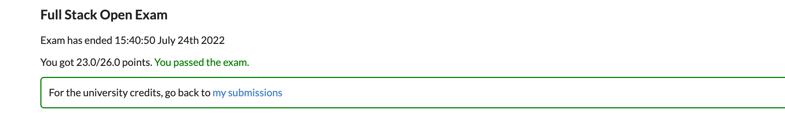
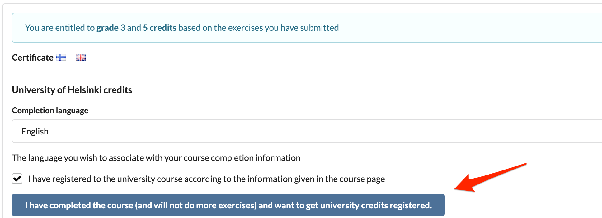

Ce cours est une introduction au développement Web moderne avec JavaScript. L'accent est mis sur les applications à page unique implémentées avec React et leur prise en charge avec les services Web RESTful et GraphQL implémentés avec Node.js. Le cours comporte également des parties sur TypeScript, React Native et l'intégration continue.

Les autres sujets incluent le débogage des applications, la technologie des conteneurs, la configuration, la gestion des environnements d'exécution et les bases de données.

### Prérequis

Les participants doivent avoir de bonnes compétences en programmation, des connaissances de base en programmation Web et en bases de données, et maîtriser le système de gestion de versions Git. On attend également de vous que vous ayez de la persévérance et une capacité à résoudre des problèmes et à rechercher des informations de manière autonome.

Une connaissance préalable de JavaScript ou d'autres sujets de cours n'est pas requise.

### Matériel de cours

Le matériel de cours est destiné à être lu une partie à la fois et dans l'ordre.

Le matériel contient des exercices, qui sont placés de manière à ce que le matériel précédent fournisse suffisamment d'informations pour résoudre chaque exercice. Vous pouvez faire les exercices au fur et à mesure que vous les rencontrez dans le matériel, mais il peut également être avantageux de lire tout le matériel de la partie avant de commencer les exercices.

Dans de nombreuses parties du cours, les exercices construisent une application plus grande, un petit morceau à la fois. Certaines des applications d'exercice sont développées en plusieurs parties.

Le matériel de cours est basé sur des exemples d'applications en expansion progressive, qui changent d'une partie à l'autre. Il est préférable de suivre le code tout en faisant de petites modifications indépendamment. Le code des exemples d'applications pour chaque étape de chaque partie peut être trouvé sur GitHub.

### Suivre le cours

Le cours contient quatorze parties, dont la première est numérotée 0 par souci de cohérence avec les itérations passées. Une partie correspond à peu près à une semaine (15 à 20 heures en moyenne) d'études, mais la vitesse de réalisation du cours est flexible.

Passer de la partie <i>n</i> à la partie <i>n+1</i> n'est pas judicieux avant d'avoir acquis une connaissance suffisante des sujets de la partie <i>n</i>. En termes pédagogiques, le cours utilise [Mastery Learning](https://en.wikipedia.org/wiki/Mastery_learning), et vous n'êtes censé passer à la partie suivante qu'après avoir fait suffisamment d'exercices de la partie précédente.

Dans les parties 1 à 4, vous devez faire <i>au moins</i> tous les exercices qui ne sont pas marqués d'un astérisque (*). Les exercices marqués d'un astérisque comptent pour votre note finale, mais les sauter ne vous empêche pas de faire les exercices obligatoires des parties suivantes. Les parties 5 - n'ont pas d'exercices marqués d'un astérisque car il n'y a pas de dépendance similaire sur les parties précédentes.

La vitesse de réalisation du cours est flexible et les exercices peuvent être soumis jusqu'à 23h59 [EET](https://en.wikipedia.org/wiki/Eastern_European_Time) le 1er mars 2023.

Cependant, notez que la date limite pour passer l'examen pour les crédits de l'Université d'Helsinki est le 10.1.2023.

Les statistiques de temps d'exécution des exercices peuvent être trouvées via le [système de soumission](https://studies.cs.helsinki.fi/stats/courses/fullstackopen).

### Chaîne de cours dans Discord et Telegram

Vous pouvez discuter du cours et des sujets connexes dans notre groupe dédié sur <a target='_blank' href='https://study.cs.helsinki.fi/discord/join/fullstack'>Discord</a> et sur <a target='_blank' href='https://t.me/fullstackcourse'>Telegram</a>. Rejoignez la conversation !

### Parties et complétion

Les études Full Stack se composent du cours de base et de plusieurs extensions. Vous pouvez compléter les études dans la mesure de 5 à 14 crédits.

#### Parties 0-5 (cours de base) - Développement Web Full Stack (5 cr, CSM141081)
Le nombre de crédits et la note du cours sont basés sur le nombre total d'exercices soumis pour les parties 0 à 7 (y compris les exercices marqués d'un astérisque).

Les crédits et les notes sont calculés comme suit :

| exercices    | crédits        | notes    |
| ------------ | :------------: | :------: |
| 138          |       7        | 5        |
| 127          |       6        | 5        |
| 116          |       5        | 5        |
| 105          |       5        | 4        |
| 94           |       5        | 3        |
| 83           |       5        | 2        |
| 72           |       5        | 1        |

Une fois que vous avez terminé suffisamment d'exercices pour obtenir une note de passage, vous pouvez télécharger le certificat de cours à partir du [système de soumission](https://studies.cs.helsinki.fi/stats/courses/fullstackopen).

Si vous souhaitez recevoir des crédits universitaires, vous devez réussir l'examen du cours. L'examen ne compte pas dans votre note finale, mais vous devez le réussir. Plus d'infos sur l'examen [ici](/fr/part0/informations_generales#lexamen-du-cours).

La dernière date possible pour passer l'examen est le 10 janvier 2023. **Notez que vous devez vous inscrire à l'examen au plus tard le 9 janvier 2023.**

Vous ne pouvez passer l'examen qu'après avoir soumis suffisamment d'exercices pour cinq crédits. En pratique, il n'est pas judicieux de passer l'examen immédiatement après avoir soumis le nombre critique d'exercices. L'examen est le même pour 5 à 14 crédits et ne compte pas dans votre note.

<i>Vous n'avez pas besoin d'assister à l'examen du cours ou de vous inscrire au cours Open University pour obtenir le certificat du cours.</i>

#### Partie 6 - Développement Web Full Stack, extension 1 (1 cr, CSM141082)
En soumettant au moins 127 des exercices pour les parties 0 à 7 tout en travaillant sur le cours de base, vous pouvez recevoir un crédit supplémentaire grâce à cette extension.
- Soumettez au moins 127 exercices pour les parties 0-7.
- [Inscrivez-vous à la partie 6 via l'Open University](https://www.avoin.helsinki.fi/palvelut/esittely.aspx?s=otm-c67dc747-1d6a-43cb-b40b-9eacf425dcc0).
- [Demander des crédits pour la partie 6](/fr/part0/informations_generales#comment-obtenir-vos-credits).

#### Partie 7 - Développement Web Full Stack, extension 2 (1 cr, CSM141083)
En soumettant au moins 138 des exercices pour les parties 0 à 7 tout en travaillant sur le cours de base, vous pouvez recevoir un crédit supplémentaire grâce à cette extension.
- Soumettez au moins 138 exercices pour les parties 0-7.
- [Inscrivez-vous à la partie 7 via l'Open University](https://www.avoin.helsinki.fi/palvelut/esittely.aspx?s=otm-3016e9c9-0fdc-4ee3-9e9b-38176359f9f3).
- [Demander des crédits pour la partie 7](/fr/part0/informations_generales#comment-obtenir-vos-credits).

#### Partie 8 - Développement Web Full Stack : GraphQL (1 cr, CSM14113)
En soumettant au moins 22/26 des exercices de la partie 8 du cours, GraphQL, vous pouvez obtenir un crédit supplémentaire. La partie 8 peut être effectuée à tout moment après la partie 5, car son contenu est indépendant des parties 6 et 7.
- Soumettez au moins 22/26 exercices pour la partie 8.
- [Inscrivez-vous à la partie 8 via l'Open University](https://www.avoin.helsinki.fi/palvelut/esittely.aspx?s=otm-067b1506-0307-4118-9e2b-292e0b81e491).
- [Demander des crédits pour la partie 8](/fr/part0/informations_generales#comment-obtenir-vos-credits).

#### Partie 9 - Développement Web Full Stack : TypeScript (1 cr, CSM14110)
En soumettant au moins 24/27 des exercices de la partie 9 du cours, TypeScript, vous pouvez obtenir un crédit supplémentaire. Il est recommandé de terminer les parties 0 à 7 avant de participer à la partie 9.
- Soumettre au moins 24/27 exercices pour la partie 9.
- [Inscrivez-vous à la partie 9 via l'Open University](https://www.avoin.helsinki.fi/palvelut/esittely.aspx?s=otm-d9125f89-a440-48e1-898a-ee4e16b06cdb).
- [Demander des crédits pour la partie 9](/fr/part0/informations_generales#comment-obtenir-vos-credits).

#### Partie 10 - Développement Web Full Stack : React Native (2 cr, CSM14111)
En soumettant 25 exercices pour la partie 10 du cours sur React Native, vous pouvez gagner deux crédits supplémentaires. Vous trouverez plus d'informations sur les conditions préalables, la soumission d'exercices et les crédits de cette partie dans[partie 10](/en/part10/introduction_to_react_native).
- Soumettez au moins 25 exercices pour la partie 10.
- [Inscrivez-vous à la partie 10 via l'Open University](https://www.avoin.helsinki.fi/palvelut/esittely.aspx?s=otm-aa395a19-4625-44a9-8301-5fbb946c6ed6).
- [Demander des crédits pour la partie 10](/fr/part0/informations_generales#comment-obtenir-vos-credits).

#### Partie 11 - Développement Web Full Stack : Intégration continue / Livraison continue (1 cr, CSM14112)

En soumettant tous les exercices de la partie 11 du cours sur l'intégration/livraison continue, vous pouvez gagner un crédit supplémentaire. Vous trouverez plus d'informations sur les prérequis de cette partie et la soumission des exercices dans [partie 11](/en/part11).
- Soumettez tous les exercices de la partie 11.
- [Inscrivez-vous à la partie 11 via l'Open University](https://www.avoin.helsinki.fi/palvelut/esittely.aspx?s=otm-4cb66c68-da12-422e-a34d-c8e8e7c8db01).
- [Demander des crédits pour la partie 11](/fr/part0/informations_generales#comment-obtenir-vos-credits).

#### Partie 12 - Développement Web Full Stack : Conteneurs (1 cr, CSM141084)

En soumettant tous les exercices de la partie 12 du cours sur la technologie des conteneurs, vous pouvez gagner un crédit supplémentaire. Vous trouverez plus d'informations sur les prérequis de cette partie et la soumission des exercices dans [partie 12](/en/part12).
- Soumettez tous les exercices de la partie 12.
- [Inscrivez-vous à la partie 12 via l'Open University](https://www.avoin.helsinki.fi/palvelut/esittely.aspx?s=otm-51a6f590-607c-4e34-bd6f-2d87e2203d9a).
- [Demander des crédits pour la partie 12](/fr/part0/informations_generales#comment-obtenir-vos-credits).

#### Partie 13 - Développement Web Full Stack : bases de données relationnelles (1 cr, CSM14114)

En soumettant tous les exercices de la partie 13 du cours sur les bases de données relationnelles, vous pouvez gagner un crédit supplémentaire. Vous trouverez plus d'informations sur les prérequis de cette partie et la soumission des exercices dans [partie 13](/en/part13).
- Soumettez tous les exercices de la partie 13.
- [Inscrivez-vous à la partie 13 via l'Open University](https://www.avoin.helsinki.fi/palvelut/esittely.aspx?s=otm-6e548d4e-75bf-483b-8426-c65d8c4e161c).
- [Demander des crédits pour la partie 13](/fr/part0/informations_generales#comment-obtenir-vos-credits).

### Étudier le cours en quelques mots

Comment étudier le cours - instructions en bref: cours de base de 5 cr CSM141081

- Faire les excerises. Les exercices sont soumis via GitHub et marqués comme effectués sur le [système de soumission](https://studies.cs.helsinki.fi/stats/courses/fullstackopen).
  - [Le ​​certificat de cours](/fr/part0/informations_generales#certificat-de-cours) sera disponible dans le système de soumission
- Si vous souhaitez obtenir des crédits de l'Université d'Helsinki
  - Inscrivez-vous au cours. Vous obtiendrez le lien d'inscription via le système de soumission une fois que vous aurez terminé suffisamment d'exercices. En savoir plus [ici](/fr/part0/informations_generales#lexamen-du-cours)
  - Enregistrez votre numéro d'étudiant. Après l'inscription au cours, enregistrez votre numéro d'identification d'étudiant de l'Université d'Helsinki dans le système de soumission.
  - Faites l'examen en ligne dans le système de soumission. En savoir plus [ici](/fr/part0/informations_generales#lexamen-du-cours)
  - Marquez le cours comme terminé dans le système de soumission, lisez plus [ici](/fr/part0/informations_generales#comment-obtenir-vos-credits)

Veuillez noter que si vous faites le "cours de base" avec 6 ou 7 crédits, vous avez besoin d'inscriptions séparées pour les crédits supplémentaires, voir [Parties et complétion](/fr/part0/informations_generales#parties-et-completion) pour plus d'informations.

Comment étudier le cours – instructions en bref : autres parties du cours

- Faire les excerises. Les exercices sont soumis via GitHub et marqués comme terminés sur le système de soumission. Notez que chacune des parties 8- a une instance distincte dans le système de soumission
  - [Le ​​certificat de cours](/fr/part0/informations_generales#certificat-de-cours) sera disponible dans le système de soumission
- Si vous souhaitez obtenir des crédits de l'Université d'Helsinki
  - Inscrivez-vous au cours. Vous pouvez vous inscrire à chaque partie via le lien dans le matériel de cours ([Parties et complétion](/fr/part0/informations_generales#parties-et-completion)). Inscrivez-vous à chaque partie séparément.
 - Marquez la partie terminée dans le système de soumission, lisez plus [ici](/fr/part0/informations_generales#comment-obtenir-vos-credits)

### Envoi d'exercices

Les exercices sont soumis via GitHub et marqués comme effectués sur le [système de soumission](https://studies.cs.helsinki.fi/stats/courses/fullstackopen).

Si vous soumettez des exercices de différentes parties au même référentiel, utilisez un système approprié pour nommer vos répertoires. Vous pouvez bien sûr créer un nouveau référentiel pour chaque pièce. Si vous utilisez un référentiel privé, ajoutez <i>mluukkai</i> en tant que collaborateur.

Les exercices sont soumis **une partie à la fois**. Une fois que vous avez soumis des exercices pour une partie, vous ne pouvez plus soumettre d'autres exercices pour cette partie.

Un système de détection de plagiat est utilisé pour vérifier les exercices soumis à GitHub. Si le code est trouvé à partir de réponses modèles ou si plusieurs étudiants remettent le même code, la situation est gérée conformément à la [politique sur le plagiat](https://guide.student.helsinki.fi/en/article/what-cheating-and-plagiat) de l'Université d'Helsinki.

De nombreux exercices construisent petit à petit une application plus large. Dans ces cas, il suffit de soumettre uniquement la demande dûment remplie. Vous pouvez faire un commit après chaque exercice, mais ce n'est pas obligatoire.

### L'examen du cours

Pour les crédits universitaires officiels, vous devez réussir l'examen du cours qui couvre les parties 1 à 5 du cours.

L'examen se fait dans le système de soumission. Suivez les instructions ci-dessous pour passer l'examen.
- Inscrivez-vous au cours via l'Open University avant le 9 janvier 2023.
- Vous obtiendrez le lien d'inscription via [système de soumission](https://studies.cs.helsinki.fi/stats/courses/fullstackopen/submissions) une fois que vous aurez terminé suffisamment d'exercices.

Après l'inscription au cours, enregistrez votre numéro d'étudiant de l'Université d'Helsinki dans le [système de soumission](https://studies.cs.helsinki.fi/stats/myinfo):

Voir [this](/fr/part0/informations_generales#ou-puis-je-obtenir-mon-numero-detudiant-de-l-universite-d-helsinki) pour savoir comment trouver votre numéro d'étudiant.

Après ces étapes, vous pouvez passer l'examen du cours dans le système de soumission :

Il y a 120 minutes de temps pour terminer l'examen. Si tout se passe bien, vous devriez voir la confirmation suivante :

Si vous échouez, vous devez attendre une semaine avant de retenter l'examen.

Si vous avez réussi l'examen et que vous n'allez pas faire plus d'exercices, vous pouvez revenir à mon onglet de soumission et demander les crédits :

N'oubliez pas d'appuyer sur le gros bouton bleu pour demander l'enregistrement des crédits.

Remarque : si vous avez déjà passé l'examen du cours dans Moodle, contactez matti.luukkainen@helsinki.fi ou @mluukkai dans Discord.

### Comment obtenir vos crédits

Si vous souhaitez recevoir des crédits de l'Université d'Helsinki, enregistrez votre numéro d'étudiant de l'<b>Université d'Helsinki</b> dans [le système de soumission](https://studies.cs.helsinki.fi/stats/courses/fullstackopen)

Si vous n'êtes pas étudiant à l'Université d'Helsinki, vous pouvez obtenir un numéro d'étudiant en vous inscrivant au cours via [Open University](/fr/part0/informations_generales#lexamen-du-cours), voir [ici](/fr/part0/informations_generales#ou-puis-je-obtenir-mon-numero-detudiant-de-l-universite-d-helsinki) pour plus d'informations.

Vous recevrez vos crédits après avoir soumis suffisamment d'exercices pour obtenir une note de passage, avoir réussi l'examen et nous avoir fait savoir via le système de soumission que vous avez terminé le cours :

N'oubliez pas d'appuyer sur le gros bouton bleu pour demander l'enregistrement des crédits !

**Veuillez noter** que pour obtenir des crédits universitaires, vous devez vous inscrire pour chaque partie terminée, veuillez consulter [plus d'informations sur l'inscription](/fr/part0/informations_generales#parties-et-completion).

Vous pouvez consulter votre note à l'Université d'Helsinki Sisu et [Opintopolku](https://opintopolku.fi/oma-opintopolku/) environ quatre semaines après nous en avoir informé.

### Où puis-je obtenir mon numéro d'étudiant de l'Université d'Helsinki

Lorsque et si vous vous inscrivez pour la première fois à un cours via l'Open University, un numéro d'étudiant de l'Université d'Helsinki sera automatiquement généré. Assurez-vous d'être inscrit au cours avant d'essayer de connaître votre numéro d'étudiant.

Notez également que <strong>vous n'avez pas besoin de vous inscrire</strong> à l'Open University pour obtenir le certificat de cours !

Vous pouvez connaître votre numéro d'étudiant grâce à l'une des options ci-dessous :

#### A) Sisu

Si vous avez un compte utilisateur de l'université d'Helsinki, vous pouvez trouver votre numéro d'étudiant à partir de votre profil dans le système d'information sur les études de l'université d'Helsinki Sisu :
 - Connectez-vous à Sisu avec votre nom d'utilisateur et votre mot de passe de l'Université d'Helsinki.
 - Sélectionnez : Mon profil
 - Sélectionnez : Informations personnelles

#### B) E-mail de confirmation d'inscription

Après l'inscription au cours, vous recevrez un e-mail de confirmation à une adresse e-mail que vous avez indiquée sur le formulaire d'inscription. Ce message contient directement votre numéro d'étudiant ou inclut un lien qui vous amène à une page affichant votre numéro d'étudiant de l'Université d'Helsinki.

#### C) Contacter les Services aux étudiants

Si vous avez des difficultés à trouver votre numéro d'étudiant par les moyens énumérés ci-dessus, vous pouvez envoyer un e-mail aux services aux étudiants de l'Université d'Helsinki.

Dans votre e-mail, incluez les informations suivantes

- le nom du cours auquel vous vous êtes inscrit,
- votre nom, et
- votre date de naissance.

Adresse e-mail des services aux étudiants : avoin-student@helsinki.fi

### Certificat de cours

Même si vous ne vous inscrivez pas à l'Open University pour l'examen, vous pouvez toujours télécharger le certificat de cours à partir du [système de soumission](https://studies.cs.helsinki.fi/stats/courses/fullstackopen) une fois que vous en avez terminé suffisamment exercices pour une note de passage.

### Demander un relevé de notes

Vous pouvez demander un relevé de notes vérifié <i>après l'enregistrement de vos crédits universitaires</i>. Pour demander un relevé de notes officiel, veuillez contacter avoin-student@helsinki.fi.

- Lorsque vous demandez un relevé de notes officiel, n'oubliez pas de mentionner
  - le nom du cours,
  - ton nom complet,
  - votre date de naissance, et
  - la langue de la transcription.

La transcription vous sera livrée par voie électronique par courrier électronique. Présentez ce document à votre établissement pour que les crédits soient inclus dans votre diplôme. La décision d'inclure les crédits sera prise par votre établissement d'origine.

### Approfondir un cours déjà suivi

Si vous avez déjà suivi le cursus en MOOC ou en cursus universitaire, vous pouvez désormais approfondir votre cursus.

#### S'approfondir sur Full Stack open

Vous pouvez simplement reprendre là où vous vous étiez arrêté ! Si vous souhaitez soumettre à nouveau une partie entière, veuillez contacter le personnel du cours via [email](mailto:matti.luukkainen@helsinki.fi) ou Discord <i>mluukkai</i>, avec votre nom d'utilisateur GitHub et les parties que vous souhaitez avoir supprimé de vos soumissions.

#### S'approfondir sur l'instance de ce cours à l'Université d'Helsinki

C'est également possible, il suffit de contacter le personnel du cours via [email](mailto:matti.luukkainen@helsinki.fi) ou Discord <i>mluukkai</i>.

### Projet Full Stack

Un projet full stack d'une valeur de 5, 7 ou 10 crédits sera disponible via l'Open University.

Pour le projet, une application est implémentée en React et/ou Node, bien que l'implémentation d'une application mobile en React Native soit également possible.

Le nombre de crédits est basé sur les heures de travail effectuées. Un crédit correspond à environ 17,5 heures de travail. Le travail est noté réussite/échec.

Il est possible de réaliser le projet en duo ou en groupe.

Voir [plus d'informations sur le projet](https://github.com/fullstack-hy2020/misc/blob/master/project.md).

### Promesse d'entretien

Nos collaborateurs, [Houston Inc.](https://houston-inc.com/), [Terveystalo](https://www.terveystalo.com/en/) et [Smartly.io](https://www.smartly.io/), ont fait la <i>promesse d'un entretien d'embauche</i> pour tous ceux qui terminent le cours et le projet avec un maximum de crédits (14 + 10).

Cela signifie que l'étudiant peut, s'il le souhaite, s'inscrire à un entretien d'embauche avec un collaborateur qui en a fait la promesse. L'enseignant du cours, Matti Luukkainen, enverra des instructions à l'étudiant une fois les cours terminés avec un maximum de crédits.

Vous devez être résident finlandais pour participer à ces entretiens.

### Avant de commencer

L'utilisation du [navigateur Chrome](https://www.google.com/chrome/) est recommandée pour ce cours, car il fournit les meilleurs outils de développement Web. Une autre alternative est [Developer Edition of Firefox](https://www.mozilla.org/en-US/firefox/developer/), qui fournit la même gamme de fonctionnalités.

Les exercices du cours sont soumis à GitHub, donc Git doit être installé et vous devez savoir comment l'utiliser. Pour obtenir des instructions, consultez [tutoriel Git et GitHub pour les débutants](https://product.hubspot.com/blog/git-and-github-tutorial-for-beginners).

Installez un éditeur de texte sensible prenant en charge le développement Web. [Visual Studio Code](https://code.visualstudio.com/) est fortement recommandé.

Ne codez pas avec nano, Notepad ou Gedit. NetBeans n'est pas non plus très bon pour le développement Web. Il est également assez lourd par rapport à Visual Studio Code.

Installez également [Node.js](https://nodejs.org/en/). Le matériel a été réalisé avec la version 16.13.2, n'installez donc aucune version antérieure à celle-ci. Voir [Instructions d'installation de Node.js](https://nodejs.org/en/download/package-manager/).

Le gestionnaire de packages de nœuds [npm](https://www.npmjs.com/get-npm) sera automatiquement installé avec Node.js. Nous utiliserons activement npm tout au long du cours. Node est également fourni avec [npx](https://www.npmjs.com/package/npx), dont nous aurons besoin plusieurs fois.

### Fautes de frappe dans le matériel

Si vous trouvez une faute de frappe dans le matériel, ou si quelque chose n'a pas été clairement exprimé, ou est simplement une mauvaise grammaire, soumettez une <i>demande d'extraction</i> au matériel de cours dans le [référentiel](https://github.com/fullstack-hy2020/fullstack-hy2020.github.io). Par exemple, le code source de démarque de cette page peut être trouvé dans le référentiel à <https://github.com/fullstack-hy2020/fullstack-hy2020.github.io/edit/source/src/content/0/en/ part0a.md>

Au bas de chaque partie du matériel se trouve un lien pour <em>proposer des modifications au matériel</em>. Vous pourrez modifier le code source de la page en cliquant sur le lien.

