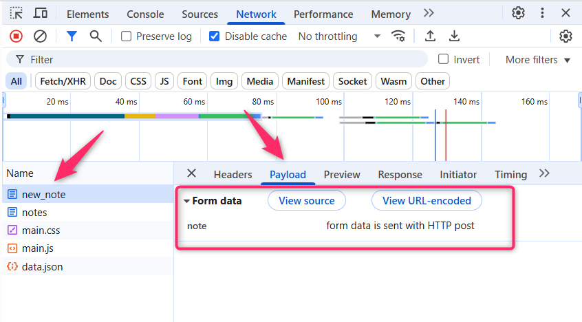

<div class="content">

Avant de commencer la programmation, nous passerons en revue certains principes du développement Web en examinant un exemple d'application sur <https://studies.cs.helsinki.fi/exampleapp>.

L'application n'existe que pour introduire certains concepts de base du cours et n'est en aucun cas un exemple de <i>comment</i> une application Web moderne doit être créée.
Au contraire, elle illustre certaines anciennes techniques du développement Web, qui pourraient même être considérées comme de <i>mauvaises pratiques</i> de nos jours.

Le code sera conforme aux bonnes pratiques actuelles à partir de la [partie 1](/fr/part1).

Ouvrez l'[exemple d'application](https://studies.cs.helsinki.fi/exampleapp) dans votre navigateur. Cela peut prendre un certain temps.

**La 1ère règle du développement Web** : gardez toujours la console de développement du navigateur ouverte sur votre navigateur Web. Sur macOS, ouvrez la console en appuyant simultanément sur _F12_ ou _option-cmd-i_. Sous Windows ou Linux, ouvrez la console en appuyant simultanément sur _F12_ ou _ctrl-shift-i_. La console peut également être ouverte via le [menu contextuel](https://fr.wikipedia.org/wiki/Menu_contextuel).

N'oubliez pas de <i>toujours</i> garder la console ouverte quand vous développez des applications Web.

La console ressemble à ceci :


Assurez-vous que l'onglet <i>Réseau</i> est ouvert et cochez l'option <i>Désactiver le cache</i> comme indiqué. <i>Conserver le journal</i> peut également être utile (il enregistre les journaux imprimés par l'application lorsque la page est rechargée) ainsi que "Masquer les URL des extensions" (cache les requêtes issues d'extensions installées dans le navigateur, non visibles sur l'image ci-dessus)

**NB :** L'onglet le plus important est l'onglet <i>Console</i>. Cependant, dans cette introduction, nous utiliserons beaucoup l'onglet <i>Réseau</i>.

### HTTP GET

Le serveur et le navigateur Web communiquent entre eux à l'aide du protocole [HTTP](https://developer.mozilla.org/fr/docs/Web/HTTP). L'onglet <i>Réseau</i> montre comment le navigateur et le serveur communiquent.

Lorsque vous rechargez la page (appuyez sur les touches _Fn_-_F5_ sur PC, _cmd_-_R_ sur macOS, ou cliquez sur le symbole &#8635; de votre navigateur), la console indique que deux événements se sont produits :

- Le navigateur a récupéré le contenu de la page <i>studies.cs.helsinki.fi/exampleapp</i> du serveur
- Et a téléchargé l'image <i>kuva.png</i>


Sur un petit écran, vous devrez peut-être élargir la fenêtre de la console pour le voir.

Cliquer sur le premier événement révèle plus d'informations sur ce qui se passe :


La partie supérieure, <i>Général</i>, montre que le navigateur a fait une requête à l'adresse <i><https://studies.cs.helsinki.fi/exampleapp></i> (bien que l'adresse ait légèrement changé depuis que cette photo a été prise) en utilisant la méthode [GET](https://developer.mozilla.org/fr/docs/Web/HTTP/Methods/GET), et que la requête a réussi, car la réponse du serveur avait le [code de statut](https://fr.wikipedia.org/wiki/Liste_des_codes_HTTP) 200.

La requête et la réponse du serveur ont plusieurs [en-têtes](https://en.wikipedia.org/wiki/List_of_HTTP_header_fields) :


Les <i>en-têtes de réponse</i> en haut nous indiquent par ex. la taille de la réponse en octets et l'heure exacte de la réponse. Un en-tête important [Content-Type](https://developer.mozilla.org/fr/docs/Web/HTTP/Headers/Content-Type) nous indique que la réponse est un fichier texte codé en [utf-8](https://fr.wikipedia.org/wiki/UTF-8), dont le contenu a été formaté en HTML. De cette façon, le navigateur sait que la réponse est une page [HTML](https://fr.wikipedia.org/wiki/HTML) normale et qu'il doit donc la restituer à l'écran "comme une page Web".

L'onglet <i>Réponse</i> affiche les données de réponse, une page HTML normale. La section <i>body</i> détermine la structure de la page rendue à l'écran :


La page contient un élément [div](https://developer.mozilla.org/fr/docs/Web/HTML/Element/div), qui à son tour contient un titre, un lien vers la page <i>notes </i> et une balise [img](https://developer.mozilla.org/fr/docs/Web/HTML/Element/img) et affiche le nombre de notes créées.

En raison de la balise img, le navigateur effectue une seconde <i>requête HTTP</i> pour récupérer l'image <i>kuva.png</i> du serveur. Les détails de la demande sont les suivants :


La requête a été faite à l'adresse <https://studies.cs.helsinki.fi/exampleapp/kuva.png> et son type est HTTP GET. Les en-têtes de réponse nous indiquent que la taille de la réponse est de 89350 octets et que son [Content-type](https://developer.mozilla.org/en-US/docs/Web/HTTP/Headers/Content-Type) est <i >image/png</i>, c'est donc une image png. Le navigateur utilise ces informations pour restituer correctement l'image à l'écran.

La chaîne d'événements provoquée par l'ouverture de la page https://studies.cs.helsinki.fi/exampleapp sur un navigateur se présente comme suit [diagramme de séquence](https://www.geeksforgeeks.org/unified-modeling-language-uml-séquence-diagrammes/):


Tout d'abord, le navigateur envoie une requête HTTP GET au serveur pour récupérer le code HTML de la page. La balise <i>img</i> dans le code HTML invite le navigateur à récupérer l'image <i>kuva.png</i>. Le navigateur affiche la page HTML et l'image à l'écran.

Même s'il est difficile de s'en apercevoir, la page HTML commence à s'afficher avant que l'image n'ait été récupérée sur le serveur.

### Applications Web traditionnelles

La page d'accueil de d'application d'exemple fonctionne comme une <i>application Web traditionnelle</i>. En entrant dans la page, le navigateur va chercher sur le serveur le document HTML détaillant la structure et le contenu textuel de la page.

Le serveur a formé ce document d'une manière ou d'une autre. Le document peut être un fichier texte <i>statique</i> enregistré dans le répertoire du serveur. Le serveur peut également former les documents HTML de manière <i>dynamique</i> selon le code de l'application, en utilisant par exemple les données d'une base de données.
En l'occurence, le code HTML de l'application a été formé dynamiquement, car il contient des informations sur le nombre de notes créées.

Le code HTML de la page d'accueil est le suivant :

```js
const getFrontPageHtml = (noteCount) => {
  return(`
    <!DOCTYPE html>
    <html>
      <head>
      </head>
      <body>
        <div class='container'>
          <h1>Full stack example app</h1>
          <p>number of notes created ${noteCount}</p>
          <a href='/notes'>notes</a>
          
        </div>
      </body>
    </html>
`)
} 

app.get('/', (req, res) => {
  const page = getFrontPageHtml(notes.length)
  res.send(page)
})
```
Vous n'avez pas besoin de comprendre ce code, pour le moment.

Le contenu de la page HTML a été enregistré en tant que "littéral de gabarit" (en anglais, "template string"), c'est à dire une chaîne de caractères qui permet d'évaluer, par exemple, des variables au milieu de celle-ci. La partie dynamique de la page d'accueil, le nombre de notes enregistrées (dans le code <em>noteCount</em>), est remplacée par le nombre actuel de notes (dans le code <em>notes.length</em>) dans le gabarit.

Écrire du HTML au milieu du code n'est bien sûr pas très malin, mais pour les programmeurs PHP de la vieille école, c'était une pratique normale.

Dans les applications Web traditionnelles, le navigateur est "stupide". Il récupère uniquement les données HTML du serveur et toute la logique d'application se trouve sur le serveur. Un serveur peut être créé en utilisant Java Spring (comme dans le cours de l'Université d'Helsinki [Web-palvelinohjelmointi](https://courses.helsinki.fi/fi/tkt21007/119558639)), Python Flask (comme dans le cours [tietokantasovellus](https://materiaalit.github.io/tsoha-18/)) ou avec [Ruby on Rails](http://rubyonrails.org/) pour ne citer que quelques exemples.

L'exemple utilise [Express](https://expressjs.com/), sur Node.js.
Ce cours utilisera Node.js et Express pour créer des serveurs Web.

### Exécution de la logique d'application dans le navigateur

Gardez la Developer Console ouverte. Videz la console en cliquant sur le symbole 🚫 ou en tapant clear() dans la console.
Désormais, lorsque vous accédez à la page [notes](https://studies.cs.helsinki.fi/exampleapp/notes), le navigateur effectue 4 requêtes HTTP :


Toutes les demandes ont des types <i>différents</i>. Le type de la première requête est <i>document</i>. C'est le code HTML de la page, et il se présente comme suit :


Lorsque l'on compare la page affichée sur le navigateur et le code HTML renvoyé par le serveur, on remarque que le code ne contient pas la liste des notes.
La section [head](https://developer.mozilla.org/en-US/docs/Web/HTML/Element/head) du code HTML contient un [script](https://developer.mozilla.org/en-US/docs/Web/HTML/Element/script)-tag, qui amène le navigateur à récupérer un fichier JavaScript appelé <i>main.js</i>.

Le code JavaScript ressemble à ceci :

```js
var xhttp = new XMLHttpRequest()

xhttp.onreadystatechange = function() {
  if (this.readyState == 4 && this.status == 200) {
    const data = JSON.parse(this.responseText)
    console.log(data)

    var ul = document.createElement('ul')
    ul.setAttribute('class', 'notes')

    data.forEach(function(note) {
      var li = document.createElement('li')

      ul.appendChild(li)
      li.appendChild(document.createTextNode(note.content))
    })

    document.getElementById('notes').appendChild(ul)
  }
}

xhttp.open('GET', '/data.json', true)
xhttp.send()
```
Les détails du code ne sont pas importants pour le moment, mais du code a été inclus pour pimenter les images et le texte. Nous commencerons correctement à coder dans la [partie 1](/fr/part1). L'exemple de code de cette partie n'est en fait pas du tout pertinent pour les techniques de codage de ce cours.

> Certains pourraient se demander pourquoi xhttp-object est utilisé à la place du fetch moderne. Cela est dû au fait de ne pas encore du tout vouloir entrer dans les promesses, et le code ayant un rôle secondaire dans cette partie. Nous reviendrons sur les moyens modernes de faire des requêtes au serveur dans la partie 2.

Immédiatement après avoir récupéré la balise <i>script</i>, le navigateur commence à exécuter le code.

Les deux dernières lignes indiquent au navigateur d'effectuer une requête HTTP GET à l'adresse du serveur <i>/data.json</i> :

```js
xhttp.open('GET', '/data.json', true)
xhttp.send()
```
Il s'agit de la dernière requête affichée dans l'onglet Réseau.

Nous pouvons essayer d'aller à l'adresse <https://studies.cs.helsinki.fi/exampleapp/data.json> directement depuis le navigateur :


On y retrouve les notes en [JSON](https://en.wikipedia.org/wiki/JSON) "raw data". Par défaut, les navigateurs basés sur Chromium ne sont pas très bons pour afficher les données JSON. Des plugins peuvent être utilisés pour gérer le formatage. Installez, par exemple, [JSONVue](https://chrome.google.com/webstore/detail/jsonview/chklaanhfefbnpoihckbnefhakgolnmc) sur Chrome, et rechargez la page. Les données sont maintenant bien formatées :


Ainsi, le code JavaScript de la page de notes ci-dessus télécharge les données JSON contenant les notes et forme une liste à puces à partir du contenu de la note :

Cela se fait grâce au code suivant :

```js
const data = JSON.parse(this.responseText)
console.log(data)

var ul = document.createElement('ul')
ul.setAttribute('class', 'notes')

data.forEach(function(note) {
  var li = document.createElement('li')

  ul.appendChild(li)
  li.appendChild(document.createTextNode(note.content))
})

document.getElementById('notes').appendChild(ul)
```
Le code crée d'abord une liste non ordonnée avec une balise [ul](https://developer.mozilla.org/fr/docs/Web/HTML/Element/ul)-tag...

```js
var ul = document.createElement('ul')
ul.setAttribute('class', 'notes')
```
... puis ajoute une balise [li](https://developer.mozilla.org/fr/docs/Web/HTML/Element/li) pour chaque note. Seul le champ <i>content</i> (contenu) de chaque note devient le contenu de la balise li. Les horodatages que l'on trouve dans les données brutes ne sont pas utilisés.

```js
data.forEach(function(note) {
  var li = document.createElement('li')

  ul.appendChild(li)
  li.appendChild(document.createTextNode(note.content))
})
```
Ouvrez maintenant l'onglet <i>Console</i> des outils de développement :


En cliquant sur le petit triangle au début de la ligne, vous pouvez développer le texte sur la console.


Cette sortie sur la console est causée par la commande <em>console.log</em> dans le code :

```js
const data = JSON.parse(this.responseText)
console.log(data)
```

Ainsi, après avoir reçu les données du serveur, le code les imprime sur la console.

L'onglet <i>Console</i> et la commande <em>console.log</em> vous deviendront très familiers pendant le cours. 


### Gestionnaires d'événements et fonctions de rappel (ou "callback")

La structure de ce code est un peu étrange :


```js
var xhttp = new XMLHttpRequest()

xhttp.onreadystatechange = function() {
  // code that takes care of the server response
}

xhttp.open('GET', '/data.json', true)
xhttp.send()
```
La requête au serveur est envoyée sur la dernière ligne, mais le code pour gérer la réponse se trouve en fait plus haut. Que se passe-t-il?

```js
xhttp.onreadystatechange = function () {
```

Sur cette ligne, un <i>gestionnaire d'événements</i> pour l'événement <i>onreadystatechange</i> est défini pour l'objet <em>xhttp</em> effectuant la requête. Lorsque l'état de l'objet change, le navigateur appelle la fonction du gestionnaire d'événements. Le code de la fonction vérifie que [readyState](https://developer.mozilla.org/en-US/docs/Web/API/XMLHttpRequest/readyState) est égal à 4 (ce qui décrit la situation <i>L'opération est terminée</i>) et que le code d'état HTTP de la réponse est 200.


```js
xhttp.onreadystatechange = function() {
  if (this.readyState == 4 && this.status == 200) {
    // code that takes care of the server response
  }
}
```
Ce mécanisme consistant à appeler des gestionnaires d'événements est très courant en JavaScript. Les fonctions de gestionnaire d'événements sont appelées fonctions [callback](https://developer.mozilla.org/fr/docs/Glossary/Callback_function). Le code d'application n'appelle pas lui-même les fonctions, mais l'environnement d'exécution - le navigateur - , appelle la fonction à un moment approprié, lorsque l'<i>événement</i> s'est produit.

### Document Object Model ou DOM

Nous pouvons considérer les pages HTML comme des arborescences implicites.

```
html
  head
    link
    script
  body
    div
      h1
      div
        ul
          li
          li
          li
      form
        input
        input
```

La même structure arborescente peut être vue sur l'onglet <i>Éléments</i> de la console.


Le fonctionnement du navigateur est basé sur l'idée de représenter les éléments HTML sous forme d'arborescence.

Le Document Object Model, ou [DOM](https://fr.wikipedia.org/wiki/Document_Object_Model), est une interface de programmation d'application (<i>API</i>) qui permet la modification par programmation des <i>arborescences d'éléments </i> correspondant aux pages Web.

Le code JavaScript introduit dans le chapitre précédent utilisait l'API DOM pour ajouter une liste de notes à la page.

Le code suivant crée un nouveau noeud pour la variable <em>ul</em> et y ajoute des noeuds enfants :

```js
var ul = document.createElement('ul')

data.forEach(function(note) {
  var li = document.createElement('li')

  ul.appendChild(li)
  li.appendChild(document.createTextNode(note.content))
})
```
Enfin, la branche d'arborescence de la variable <em>ul</em> est connectée à sa place dans l'arborescence HTML de toute la page :

```js
document.getElementById('notes').appendChild(ul)
```

### Manipulation du l'objet document depuis la console

Le noeud le plus haut de l'arborescence DOM d'un document HTML est appelé l'objet <em>document</em>. Nous pouvons effectuer diverses opérations sur une page Web à l'aide de l'API DOM. Vous pouvez accéder à l'objet <em>document</em> en tapant <em>document</em> dans l'onglet Console :


Ajoutons une nouvelle note à la page depuis la console.

Tout d'abord, nous allons obtenir la liste des notes de la page. La liste se trouve dans le premier élément ul de la page :

```js
list = document.getElementsByTagName('ul')[0]
```

Créez ensuite un nouvel élément li et ajoutez-y du contenu textuel :

```js
newElement = document.createElement('li')
newElement.textContent = 'Page manipulation from console is easy'
```

Et ajoutez le nouvel élément li à la liste :

```js
list.appendChild(newElement)
```


Même si la page est mise à jour sur votre navigateur, les modifications ne sont pas permanentes. Si la page est rechargée, la nouvelle note disparaîtra, car les modifications n'ont pas été transmises au serveur. Le code JavaScript que le navigateur récupère créera toujours la liste des notes basées sur les données JSON à partir de l'adresse <https://studies.cs.helsinki.fi/exampleapp/data.json>.

### CSS

L'élément <i>head</i> du code HTML de la page Notes contient une balise [link](https://developer.mozilla.org/en-US/docs/Web/HTML/Element/link), qui détermine que le navigateur doit récupérer une feuille de style [CSS](https://developer.mozilla.org/en-US/docs/Web/CSS) à partir de l'adresse [main.css](https://studies.cs.helsinki.fi/exampleapp/main.css).

Les feuilles de style en cascade, ou CSS, sont un langage de feuille de style utilisé pour déterminer l'apparence des pages Web.

Le fichier CSS récupéré ressemble à ceci : 

```css
.container {
  padding: 10px;
  border: 1px solid; 
}

.notes {
  color: blue;
}
```
Le fichier définit deux [sélecteurs de classe](https://developer.mozilla.org/fr/docs/Web/CSS/Class_selectors). Ceux-ci sont utilisés pour sélectionner certaines parties de la page et pour définir des règles de style pour les mettre en forme.

Une définition de sélecteur de classe commence toujours par un point et contient le nom de la classe.

Les classes sont des [attributs](https://developer.mozilla.org/fr/docs/Web/HTML/Global_attributes/class), qui peuvent être ajoutés aux éléments HTML.

Les attributs CSS peuvent être examinés dans l'onglet <i>éléments</i> de la console :


L'élément <i>div</i> le plus externe possède la classe <i>container</i>. L'élément <i>ul</i> contenant la liste des notes possède la classe <i>notes</i>.

La règle CSS définit que les éléments avec la classe <i>container</i> seront délimités par une [bordure](https://developer.mozilla.org/fr/docs/Web/CSS/border) large d'un pixel. Il définit également 10 pixels de [padding](https://developer.mozilla.org/fr/docs/Web/CSS/padding) sur l'élément. Cela ajoute un espace vide entre le contenu de l'élément et la bordure.

La deuxième règle CSS définit la couleur du texte des notes en bleu.

Les éléments HTML peuvent également avoir d'autres attributs en dehors des classes. L'élément <i>div</i> contenant les notes a un attribut [id](https://developer.mozilla.org/fr/docs/Web/HTML/Global_attributes/id). Le code JavaScript utilise l'identifiant pour trouver l'élément.

L'onglet <i>Éléments</i> de la console peut être utilisé pour changer les styles des éléments.


Les modifications apportées sur la console ne seront pas permanentes. Si vous souhaitez apporter des modifications durables, elles doivent être enregistrées dans la feuille de style CSS sur le serveur. 

### Chargement d'une page contenant JavaScript - révision

Passons en revue ce qui se passe lorsque la page https://studies.cs.helsinki.fi/exampleapp/notes est ouverte sur le navigateur.


- Le navigateur va chercher le code HTML définissant le contenu et la structure de la page sur le serveur à l'aide d'une requête HTTP GET.
- Les liens dans le code HTML amènent le navigateur à récupérer également la feuille de style CSS <i>main.css</i>...
- ...et un fichier de code JavaScript <i>main.js</i>
- Le navigateur exécute le code JavaScript. Le code fait une requête HTTP GET à l'adresse https://studies.cs.helsinki.fi/exampleapp/data.json, qui renvoie les notes sous forme de données JSON.
- Lorsque les données ont été récupérées, le navigateur exécute un <i>gestionnaire d'événements</i>, qui affiche les notes sur la page à l'aide de l'API DOM. 

### Formulaires et HTTP POST

Examinons maintenant comment l'ajout d'une nouvelle note est effectué.

La page Notes contient un formulaire défini par un [élément <form>](https://developer.mozilla.org/fr/docs/Learn/HTML/Forms/Your_first_HTML_form).


Lorsque le bouton du formulaire est cliqué, le navigateur enverra l'entrée de l'utilisateur au serveur. Ouvrons l'onglet <i>Réseau</i> et voyons à quoi ressemble l'envoi du formulaire :


Étonnamment, la soumission du formulaire déclenche pas moins de <i>cinq</i> requêtes HTTP.
Le premier est l'événement de soumission de formulaire. Zoomons dessus :


Il s'agit d'une requête [HTTP POST](https://developer.mozilla.org/fr/docs/Web/HTTP/Methods/POST) à l'adresse du serveur <i>new\_note</i>. Le serveur répond avec le code d'état HTTP 302. Il s'agit d'une [redirection d'URL](https://fr.wikipedia.org/wiki/Redirection_d%27URL), par laquelle le serveur demande au navigateur de faire une nouvelle requête HTTP GET à l'adresse définie dans l'en-tête de requête <i>Location</i> - c'est-à-dire l'adresse <i>notes</i>.

Ainsi, le navigateur recharge la page Notes. Le rechargement provoque trois requêtes HTTP supplémentaires : la récupération de la feuille de style (main.css), du code JavaScript (main.js) et des données brutes des notes (data.json).

L'onglet réseau affiche également les données soumises avec le formulaire :

NB: Dans les dernières versions de Chrome, les informations sur les données de formulaire se trouvent dans le nouvel onglet "Charge utile" (ou "Payload"), situé à droite de l'onglet En-têtes



La balise Form a les attributs <i>action</i> et <i>method</i>, qui définissent que la soumission du formulaire se fait sous la forme d'une requête HTTP POST à ​​l'adresse <i>new\_note</i>.


Le code sur le serveur responsable de la requête POST est assez simple (NB : ce code est sur le serveur, et non sur le code JavaScript récupéré par le navigateur) :

```js
app.post('/new_note', (req, res) => {
  notes.push({
    content: req.body.note,
    date: new Date(),
  })

  return res.redirect('/notes')
})
```

Les données sont envoyées dans le [corps](https://developer.mozilla.org/fr/docs/Web/HTTP/Methods/POST) de la requête POST.


Le serveur peut accéder aux données en accédant au champ <em>req.body</em> de l'objet de requête <em>req</em>.

Le serveur crée un nouvel objet note et l'ajoute à un tableau appelé <em>notes</em>.

```js
notes.push({
  content: req.body.note,
  date: new Date(),
})
```

Les objets Note ont deux champs : <i>content</i> contenant le contenu proprement dit de la note et <i>date</i> contenant la date et l'heure de création de la note.

Le serveur n'enregistre pas les nouvelles notes dans une base de données, de sorte que les nouvelles notes disparaissent lorsque le serveur est redémarré.

### AJAX

La page Notes de l'application suit un style de développement Web du début des années 90 et utilise "Ajax". Cela fait qu'il est représentatif des sites du début des années 2000 utilisant des technologies web alors au sommet de leur popularité.

[AJAX](<https://fr.wikipedia.org/wiki/Ajax_(informatique)>) (JavaScript et XML asynchrones) est un terme introduit en février 2005 suite aux progrès de la technologie des navigateurs pour décrire une nouvelle approche révolutionnaire qui permettait de récupérer du contenu sur des pages Web à l'aide de JavaScript inclus dans le code HTML, sans qu'il soit nécessaire de recharger l'affichage de l'ensemble de la page.

Avant l'ère AJAX, toutes les pages Web fonctionnaient comme les [applications Web traditionnelles](/fr/part0/introduction_aux_applications_web#applications-web-traditionnelles) que nous avons vues précédemment dans ce chapitre.
Toutes les données affichées sur la page étaient issues du code HTML généré par le serveur.

La page Notes utilise AJAX pour récupérer les données des notes. La soumission du formulaire utilise toujours le mécanisme traditionnel de soumission de formulaires Web.

Les URL de notre exemple d'application reflètent les pratiques d'un temps ancien et insouciant. Les données JSON sont extraites de l'URL <https://studies.cs.helsinki.fi/exampleapp/data.json> et les nouvelles notes sont envoyées à l'URL <https://studies.cs.helsinki.fi/exampleapp/new_note>.
De nos jours, de telles URL ne seraient pas considérées comme acceptables, car elles ne respectent pas les conventions généralement reconnues des API [REST](https://fr.wikipedia.org/wiki/Representational_state_transfer), que nous étudierons plus en détail dans la [partie 3](/fr/part3)

L'approche appelée AJAX est maintenant si banale qu'elle est tenue pour acquise. Le terme est tombé dans l'oubli, et la nouvelle génération n'en a même pas entendu parler.

### Application à page unique

Dans notre exemple d'application, la page d'accueil fonctionne comme une page Web traditionnelle : toute la logique se trouve sur le serveur et le navigateur affiche uniquement le code HTML conformément aux instructions.

La page Notes délègue au navigateur une partie de la responsabilité de générer le code HTML pour les notes existantes. Le navigateur remplit cette tâche en exécutant le code JavaScript qu'il a récupéré sur le serveur. Le code récupère les notes sur le serveur sous forme de données JSON et ajoute des éléments HTML pour afficher les notes sur la page à l'aide de [DOM-API](/fr/part0/introduction_aux_applications_web#document-object-model-ou-dom).

Ces dernières années, le style [application web monopage](https://fr.wikipedia.org/wiki/Application_web_monopage) en anglais SPA (single page application) de création d'applications Web a émergé. Les sites Web de style SPA ne récupèrent pas différentes pages sur le serveur comme le fait notre exemple d'application, mais ne sont constituées que d'une seule page HTML extraite du serveur, dont le contenu est manipulé avec du code JavaScript qui s'exécute dans le navigateur.

La page Notes de notre application ressemble un peu aux applications de style SPA, mais n'en est pas tout à fait une. Même si la logique de rendu des notes est exécutée sur le navigateur, la page utilise toujours la méthode traditionnelle d'ajout de nouvelles notes. Les données sont envoyées au serveur avec la soumission du formulaire, et le serveur demande au navigateur de recharger la page Notes avec une <i>redirection</i>.

Une version SPA de notre exemple d'application peut être trouvée sur <https://studies.cs.helsinki.fi/exampleapp/spa>.
À première vue, l'application ressemble exactement à la précédente.
Le code HTML est presque identique, mais le fichier JavaScript est différent (<i>spa.js</i>) et il y a un petit changement dans la façon dont la balise <form> est définie :


Le formulaire n'a pas d'attributs <i>action</i> ou <i>method</i> pour définir comment et où envoyer les données d'entrée.

Ouvrez l'onglet <i>Réseau</i> et videz-le. Lorsque vous créez maintenant une nouvelle note, vous remarquerez que le navigateur n'envoie qu'une seule requête au serveur.


La requête POST à ​​l'adresse <i>new\_note\_spa</i> contient la nouvelle note sous forme de données JSON contenant à la fois le contenu de la note (<i>content</i>) et l'horodatage (<i> date</i>) :

```js
{
  content: "single page app does not reload the whole page",
  date: "2019-05-25T15:15:59.905Z"
}
```

L'en-tête <i>Content-Type</i> de la requête indique au serveur que les données incluses sont représentées au format JSON.


Sans cet en-tête, le serveur ne saurait pas lire correctement les données.

Le serveur répond avec le code d'état [201 créé](https://httpstatuses.com/201). Cette fois, le serveur ne demande pas de redirection, le navigateur reste sur la même page et n'envoie pas d'autres requêtes HTTP.

La version SPA de l'application n'envoie pas les données de formulaire de manière traditionnelle, mais utilise à la place le code JavaScript qu'elle a récupéré sur le serveur.
Nous allons étudier un peu ce code, même si en comprendre tous les détails n'est pas encore important.

```js
var form = document.getElementById('notes_form')
form.onsubmit = function(e) {
  e.preventDefault()

  var note = {
    content: e.target.elements[0].value,
    date: new Date(),
  }

  notes.push(note)
  e.target.elements[0].value = ''
  redrawNotes()
  sendToServer(note)
}
```

La commande <em>document.getElementById('notes\_form')</em> indique au code de récupérer l'élément de formulaire de la page et d'enregistrer un <i>gestionnaire d'événements</i> pour gérer l'évènement de soumission du formulaire. Le gestionnaire d'événements appelle immédiatement la méthode <em>e.preventDefault()</em> pour empêcher le comportement par défaut de la soumission de formulaire. La méthode par défaut enverrait les données au serveur et provoquerait une nouvelle requête GET, ce que nous ne voulons pas.

Ensuite, le gestionnaire d'événements crée une nouvelle note, l'ajoute à la liste des notes avec la commande <em>notes.push(note)</em>, rafraîchit la liste des notes sur la page et envoie la nouvelle note au serveur.

Le code qui permet d'envoyer la note au serveur est le suivant :

```js
var sendToServer = function(note) {
  var xhttpForPost = new XMLHttpRequest()
  // ...

  xhttpForPost.open('POST', '/new_note_spa', true)
  xhttpForPost.setRequestHeader(
    'Content-type', 'application/json'
  )
  xhttpForPost.send(JSON.stringify(note))
}
```

Le code détermine que les données doivent être envoyées avec une requête HTTP POST et que le type de données doit être JSON. Le type de données est déterminé avec un en-tête <i>Content-type</i>. Ensuite, les données sont envoyées sous forme de chaîne JSON.

Le code d'application est disponible sur <https://github.com/mluukkai/example_app>.
Il convient de rappeler que l'application est uniquement destinée à démontrer les concepts du cours. Son code suit un style de développement médiocre par bien des aspects et ne doit pas être utilisé comme exemple lors de la création de vos propres applications. Il en va de même pour les URL utilisées. L'URL <i>new\_note\_spa</i>, à laquelle les nouvelles notes sont envoyées, ne respecte pas les meilleures pratiques actuelles.

### Bibliothèques JavaScript

L'exemple d'application est réalisé avec ce qu'on appelle [vanilla JavaScript](https://www.freecodecamp.org/news/is-vanilla-javascript-worth-learning-absolutely-c2c67140ac34/), en utilisant uniquement l'API DOM et des fonctions standard de JavaScript pour manipuler la structure des pages.

Au lieu d'utiliser uniquement JavaScript et l'API DOM, différentes bibliothèques contenant des outils plus faciles à utiliser que l'API DOM sont souvent utilisées pour manipuler les pages. L'une de ces bibliothèques est la très populaire [jQuery](https://jquery.com/).

jQuery a été développé à l'époque où les applications Web suivaient principalement le style traditionnel du serveur générant des pages HTML, dont la fonctionnalité était améliorée du côté du navigateur à l'aide de JavaScript écrit avec jQuery. L'une des raisons du succès de jQuery était sa compatibilité revendiquée entre navigateurs. La bibliothèque fonctionnait quel que soit le navigateur ou la société qui l'avait créée, il n'y avait donc pas besoin de solutions spécifiques par navigateur. De nos jours, l'utilisation de jQuery n'est plus aussi justifiée compte tenu de l'avancement de JavaScript, et les navigateurs les plus populaires supportent généralement bien les fonctionnalités de base.

L'essor des applications à page unique a engendré des méthodes de développement Web plus "modernes" que jQuery. Le favori d'une première vague de développeurs était [BackboneJS](http://'backbonejs.org/). Après son [lancement](https://github.com/angular/angular.js/blob/master/CHANGELOG.md#100-temporal-domination-2012-06-13) en 2012, Google [AngularJS](https: //angularjs.org/) est rapidement devenu une quasi norme de facto du développement Web moderne.

Cependant, la popularité d'Angular a chuté en octobre 2014 après que [l'équipe d'Angular a annoncé que le support de la version 1 prendrait fin](https://jaxenter.com/angular-2-0-announcement-backfires-112127.html), et qu'Angular 2 ne serait pas rétrocompatible avec la première version. Angular 2 et les versions plus récentes n'ont pas été accueillies très chaleureusement.

Actuellement, l'outil le plus populaire pour implémenter la logique côté navigateur des applications Web est la bibliothèque [React](https://reactjs.org/) de Facebook.
Au cours de ce cours, nous nous familiariserons avec React et la bibliothèque [Redux](https://github.com/reactjs/redux), qui sont fréquemment utilisées ensemble.

La position de React semble aujourd'hui dominante, mais le monde de JavaScript est en constante évolution. Par exemple, récemment, un nouveau venu - [VueJS](https://vuejs.org/) - a suscité un intérêt certain.

### Développement Web Full Stack

Que signifie le nom du cours, <i>Développement Web Full Stack</i> ? Le full stack est un mot à la mode dont tout le monde parle, alors que personne ne sait vraiment ce que cela signifie. Ou du moins, il n'y a pas de définition convenue pour le terme.

Preque toutes les applications Web ont (au moins) deux "couches": le navigateur, étant plus proche de l'utilisateur final, est la couche supérieure et le serveur contitue la couche inférieure. Il y a souvent aussi une couche de base de données sous le serveur. On peut donc penser à l'<i>architecture</i> d'une application web comme une sorte de <i>pile (stack)</i> de couches.

Souvent, on parle aussi du [frontend et du backend](https://en.wikipedia.org/wiki/Front_and_back_ends). Le navigateur est le frontend, la partie client, et le code JavaScript qui s'exécute sur le navigateur est le code de la partie client. Le serveur, quant à lui, est le backend.

Dans le cadre de ce cours, le développement web full stack signifie que nous nous concentrons sur toutes les parties de l'application : le frontend, le backend et la base de données. Parfois, le logiciel sur le serveur et son système d'exploitation sont considérés comme une partie distincte de l'application, mais nous ne les aborderons pas dans ici.

Nous allons coder le backend avec JavaScript, en utilisant l'environnement d'exécution [Node.js](https://nodejs.org/en/). L'utilisation du même langage de programmation pour le backend et le frontend confère au développement d'une application web complète une toute nouvelle dimension. Cependant, il n'est pas obligatoire pour le développement Web "full-stack" d'utiliser le même langage de programmation (JavaScript) pour toutes les parties de  l'application.

Auparavant, il était plus courant pour les développeurs de se spécialiser dans une de ses parties, par exemple le backend. Les technologies sur le backend et le frontend étaient assez différentes. Avec la tendance Full stack, il est devenu courant pour les développeurs de maîtriser toutes les couches de l'application et de la base de données. Souvent, les développeurs full stack doivent également avoir suffisamment de compétences en configuration et en administration pour faire fonctionner leur application, par exemple dans le cloud.

### Fatigue JavaScript

Le développement Web est difficile à bien des égards. Les choses se passent dans plusieurs endroits à la fois, et le débogage est un peu plus difficile qu'avec les applications de bureau classiques. JavaScript ne fonctionne pas toujours comme prévu (par rapport à de nombreux autres langages), et le fonctionnement asynchrone de ses environnements d'exécution entraîne toutes sortes de défis. Communiquer sur le web nécessite la connaissance du protocole HTTP. Il faut également gérer les bases de données et l'administration et la configuration des serveurs. Il serait également bon de connaître suffisamment de CSS pour rendre les applications au moins quelque peu présentables.

Le monde de JavaScript se développe rapidement, ce qui apporte son lot de défis. Les outils, les bibliothèques et le langage lui-même sont en constante évolution. Certains commencent à en avoir assez du changement constant et ont inventé un terme pour cela : <em>fatigue JavaScript</em>. Voir [How to Manage JavaScript Fatigue on auth0](https://auth0.com/blog/how-to-manage-javascript-fatigue/) ou [JavaScript fatigue on Medium](https://medium.com/@ericclemmons/javascript-fatigue-48d4011b6fc4).

Vous souffrirez vous-même de JavaScript fatigue pendant ce cours. Heureusement pour nous, il existe plusieurs façons de lisser la courbe d'apprentissage, et nous pouvons commencer par le codage au lieu de la configuration. Nous ne pouvons pas complètement éviter la configuration, mais nous pouvons joyeusement aller de l'avant dans les prochaines semaines tout en évitant pourl'instant l'exploration des enfers de la configuration. 

</div>

<div class="tasks"> 
  <h3>Exercices 0.1.-0.6.</h3>

Les exercices doivent être soumis via GitHub, et en marquant les exercices comme effectués dans le [système de soumission](https://studies.cs.helsinki.fi/stats/courses/fullstackopen).

Vous pouvez soumettre tous les exercices dans le même dépôt ou utiliser plusieurs dépôts différents. Si vous soumettez des exercices de différentes parties dans le même dépôt, nommez bien vos répertoires. Si vous utilisez un dépôt privé pour soumettre les exercices, ajoutez-y _mluukkai_ en tant que collaborateur.

Une bonne façon de nommer les répertoires de votre dépôt de soumission est la suivante :

```
part0
part1
  courseinfo
  unicafe
  anecdotes
part2
  courseinfo
  phonebook
  countries
```

Ainsi, chaque partie a son propre répertoire, qui contient un répertoire pour chaque ensemble d'exercices (comme les exercices unicafé de la partie 1).

Les exercices sont soumis **une partie à la fois**. Lorsque vous avez soumis les exercices d'une partie, vous ne pouvez plus soumettre d'exercices manqués pour cette partie.

  <h4>0.1: HTML</h4>

Passez en revue les bases du HTML en lisant ce didacticiel de Mozilla : [tutoriel HTML](https://developer.mozilla.org/en-US/docs/Learn/Getting_started_with_the_web/HTML_basics).

<i>Cet exercice n'est pas soumis à GitHub, il suffit de lire le tutoriel</i>

  <h4>0.2: CSS</h4>

Passez en revue les bases de CSS en lisant ce tutoriel de Mozilla : [tutoriel CSS](https://developer.mozilla.org/en-US/docs/Learn/Getting_started_with_the_web/CSS_basics).

<i>Cet exercice n'est pas soumis à GitHub, il suffit de lire le tutoriel</i>

   <h4>0.3 : Formulaires HTML</h4>

Découvrez les bases des formulaires HTML en lisant le didacticiel de Mozilla [Votre premier formulaire](https://developer.mozilla.org/en-US/docs/Learn/HTML/Forms/Your_first_HTML_form).

<i>Cet exercice n'est pas soumis à GitHub, il suffit de lire le tutoriel</i>

  <h4>0.4 : Nouvelle note</h4>

Dans le chapitre [Chargement d'une page contenant JavaScript - révision](/fr/part0/introduction_aux_applications_web#chargement-dune-page-contenant-java-script-revision) la chaîne d'événements causés par l'ouverture de la page https://studies.cs.helsinki.fi/exampleapp/notes est représentée comme un [diagramme de séquence](https://www.geeksforgeeks.org/unified-modeling-language-uml-sequence-diagrams/)

Le diagramme est en réalité un fichier Markdown de gitHub qui a été créé à l'aide de la syntaxe [Mermaid](https://docs.github.com/en/get-started/writing-on-github/working-with-advanced-formatting/creating-diagrams) comme suit :

```text
sequenceDiagram
    participant browser
    participant server

    browser->>server: GET https://studies.cs.helsinki.fi/exampleapp/notes
    activate server
    server-->>browser: HTML document
    deactivate server

    browser->>server: GET https://studies.cs.helsinki.fi/exampleapp/main.css
    activate server
    server-->>browser: the css file
    deactivate server

    browser->>server: GET https://studies.cs.helsinki.fi/exampleapp/main.js
    activate server
    server-->>browser: the JavaScript file
    deactivate server

    Note right of browser: The browser starts executing the JavaScript code that fetches the JSON from the server

    browser->>server: GET https://studies.cs.helsinki.fi/exampleapp/data.json
    activate server
    server-->>browser: [{ "content": "HTML is easy", "date": "2023-1-1" }, ... ]
    deactivate server

    Note right of browser: The browser executes the callback function that renders the notes
```

**Créez un diagramme similaire** illustrant ce qu'il se passe quand l'utilisateur crée une nouvelle note sur la page <https://studies.cs.helsinki.fi/exampleapp/notes> en écrivant quelque chose dans le champ de texte et en cliquant sur le <i> bouton envoyer</i>.

Si nécessaire, affichez les opérations sur le navigateur ou sur le serveur sous forme de commentaires sur le diagramme.

Le diagramme ne doit pas nécessairement être un diagramme de séquence. Toute manière sensée de présenter les événements est acceptable.

Toutes les informations nécessaires pour ce faire, ainsi que les deux exercices suivants, se trouvent dans le texte de [cette partie](/fr/part0/introduction_aux_applications_web#formulaires-et-http-post).
L'idée de ces exercices est de lire le texte une fois de plus et de réfléchir à ce qui s'y passe. La lecture de l'application [code](https://github.com/mluukkai/example_app) n'est pas nécessaire, mais est bien sûr possible.

Vous pouvez réaliser le diagramme à l'aide de n'importe quel programme, mais le moyen le plus simple est peut-être la syntaxe  [Mermaid](https://github.com/mermaid-js/mermaid#sequence-diagram-docs---live-editor) qui est maintenant implémentée dans les pages Markdown de [GitHub](https://github.blog/2022-02-14-include-diagrams-markdown-files-mermaid/) !

  <h4>0.5 : Application à page unique</h4>

Créez un diagramme illustrant la situation dans laquelle l'utilisateur accède à la version [application à page unique](/fr/part0/introduction_aux_applications_web#application-a-page-unique) de l'application de notes sur <https://studies.cs.helsinki.fi/exampleapp/spa>.

  <h4>0.6 : Nouvelle note</h4>

Créez un diagramme illustrant la situation dans laquelle l'utilisateur crée une nouvelle note à l'aide de la version à page unique de l'application.

C'était le dernier exercice, et il est temps de transmettre vos réponses à GitHub et de marquer les exercices comme effectués dans le [système de soumission](https://studies.cs.helsinki.fi/stats/courses/fullstackopen).
</div>
