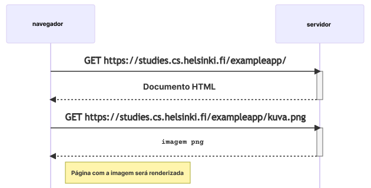
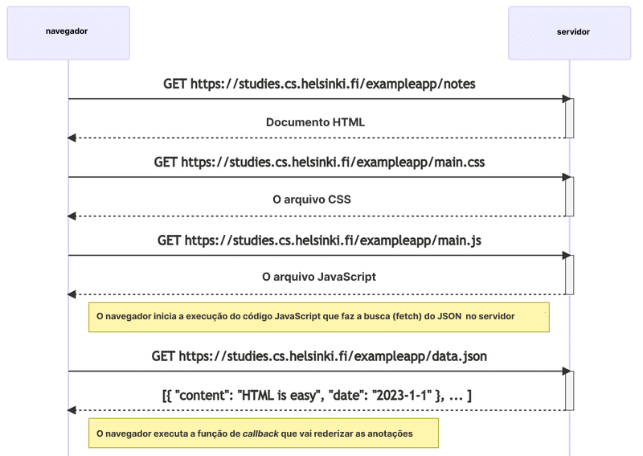

<div class="content">

Antes de começarmos a programar, passaremos por alguns princípios de desenvolvimento web examinando uma aplicação de exemplo em <https://studies.cs.helsinki.fi/exampleapp>.

A aplicação serve apenas para demonstrar alguns conceitos básicos do curso e, de maneira alguma, é um exemplo de <i>como</i> uma aplicação web moderna deve ser feita. Pelo contrário, ela demonstra algumas técnicas antigas de desenvolvimento web, que até poderiam ser consideradas como <i>práticas ruins</i> hoje em dia.

O código seguirá as melhores práticas contemporâneas a partir da [parte 1](/ptbr/part1) em diante.

Abra a [aplicação de exemplo](https://studies.cs.helsinki.fi/exampleapp) em seu navegador. Às vezes demora um pouco.

O conteúdo do curso é feito utilizando o navegador Chrome.

**A 1ª regra de desenvolvimento web**: Mantenha sempre o "Console do Desenvolvedor" aberto em seu navegador web. No macOS, abra o console pressionando _F12_ ou _option-cmd-i_ simultaneamente. No Windows ou Linux, abra o console pressionando _F12_ ou _ctrl-shift-i_ simultaneamente. O console também pode ser aberto via [tecla Menu](https://help.gnome.org/users/gnome-help/stable/keyboard-key-menu.html.pt_BR).

Lembre-se de <i>sempre</i> manter o console do desenvolvedor aberto ao desenvolver aplicações web.

O console do desenvolvedor é mais ou menos assim:


Certifique-se de que a guia <i>Rede (Network)</i> do navegador esteja aberta e marque a opção <i>Desativar cache (Disable cache)</i> conforme mostrado. <i>Preservar registro (Preserve log)</i> também pode ser útil: ele salva os logs impressos pela aplicação quando a página é recarregada.

**Obs.:** A guia mais importante é a <i>Console</i>. No entanto, nesta introdução, usaremos mais a guia <i>Rede (Network)</i>.

### HTTP GET

O servidor e o navegador web se comunicam usando o protocolo [HTTP](https://developer.mozilla.org/en-US/docs/Web/HTTP). A guia <i>Rede</i> mostra como o navegador e o servidor se comunicam.

Quando você recarrega a página (pressione a tecla F5 ou o símbolo &#8635; em seu navegador), o console mostrará que dois eventos aconteceram:

- O navegador baixou o conteúdo da página <i>studies.cs.helsinki.fi/exampleapp</i> do servidor; e
- E baixou a imagem <i>kuva.png</i>.


Se estiver utilizando um monitor pequeno, terá que ampliar a janela do console para conseguir ver claramente.

Ao clicar no primeiro evento, mais informações sobre o que está acontecendo são reveladas:


Na parte superior, <i>Geral (General)</i>, mostra que o navegador requisitou o endereço <i>https://studies.cs.helsinki.fi/exampleapp</i>  usando o método [GET](https://developer.mozilla.org/en-US/docs/Web/HTTP/Methods/GET) (embora o endereço tenha mudado ligeiramente desde que esta imagem foi feita) e que a requisição foi bem-sucedida, pois o servidor respondeu com o código de status [200](https://en.wikipedia.org/wiki/List_of_HTTP_status_codes).

A requisição e a resposta do servidor possuem vários [cabeçalhos (headers)](https://en.wikipedia.org/wiki/List_of_HTTP_header_fields):


Os cabeçalhos de resposta no topo nos dizem, por exemplo, o tamanho da resposta em bytes e o momento exato da resposta. Um cabeçalho importante, [Content-Type](https://developer.mozilla.org/en-US/docs/Web/HTTP/Headers/Content-Type), nos diz que a resposta é um arquivo de texto no formato [utf-8](https://en.wikipedia.org/wiki/UTF-8) e que os conteúdos foram formatados em HTML. Dessa forma, o navegador sabe que a resposta é uma página HTML comum e a renderiza para o navegador "como uma página web".

A guia <i>Resposta (Response)</i> mostra os dados de resposta, uma página HTML comum. A seção <i>body</i> determina a estrutura da página renderizada na tela:


A página contém um elemento [div](https://developer.mozilla.org/en-US/docs/Web/HTML/Element/div), que por sua vez contém um título, um link para a página <i>notes</i> e uma tag [img](https://developer.mozilla.org/en-US/docs/Web/HTML/Element/img), e exibe o número de notas criadas.

Devido à tag "img", o navegador faz uma segunda requisição <i>HTTP</i> para buscar a imagem <i>kuva.png</i> do servidor. Os detalhes da requisição são os seguintes:


A requisição foi feita para o endereço <https://studies.cs.helsinki.fi/exampleapp/kuva.png> e o seu tipo é HTTP GET. Os cabeçalhos de resposta (response headers) nos dizem que o tamanho da resposta é 89350 bytes e seu [Content-type](https://developer.mozilla.org/en-US/docs/Web/HTTP/Headers/Content-Type) é <i>image/png</i>, então é uma imagem png. O navegador usa essa informação para renderizar a imagem corretamente na tela.

O encadeamento de eventos causado pela abertura da página https://studies.cs.helsinki.fi/exampleapp no navegador forma o seguinte [diagrama de sequência](https://www.geeksforgeeks.org/unified-modeling-language-uml-sequence-diagrams/):



O diagrama de sequência demonstra como o navegador e o servidor estão se comunicando ao longo do tempo. O tempo flui no diagrama de cima para baixo, então se inicia com a primeira requisição que o navegador envia ao servidor, seguido pela resposta.

Primeiro, o navegador envia uma requisição HTTP GET ao servidor para buscar o código HTML da página. A tag <i>img</i> no HTML requisita que o navegador busque a imagem <i>kuva.png</i>. O navegador renderiza a página HTML e a imagem na tela.

Embora seja difícil notar, a página HTML começa a ser renderizada antes que a imagem tenha sido buscada do servidor.

### Aplicações web tradicionais

A página inicial da aplicação de exemplo funciona como uma <i>aplicação web tradicional</i>. Ao entrar na página, o navegador busca o documento HTML que detalha a estrutura e o conteúdo textual da página no servidor.

O servidor formou esse documento de alguma forma. O documento pode ser um arquivo de texto <i>estático</i> salvo no diretório do servidor. O servidor também pode formar os documentos HTML <i>dinamicamente</i> de acordo com o código da aplicação, utilizando, por exemplo, dados de um banco de dados.
O código HTML da aplicação de exemplo foi formado dinamicamente porque contém informações sobre o número de notas criadas.

O código HTML da página inicial é o seguinte:

```js
const getFrontPageHtml = noteCount => {
  return `
    <!DOCTYPE html>
    <html>
      <head>
      </head>
      <body>
        <div class='container'>
          <h1>Exemplo de aplicação Full Stack</h1>
          <p>Número de notas criadas: ${noteCount}</p>
          <a href='/notes'>notes</a>
          
        </div>
      </body>
    </html>
`
}

app.get('/', (req, res) => {
  const page = getFrontPageHtml(notes.length)
  res.send(page)
})
```

Você não precisa entender o código agora.

O conteúdo da página HTML foi salvo como uma string-modelo ou uma string que permite avaliar, por exemplo, variáveis dentro dela. A parte da página inicial que muda dinamicamente, o número de notas salvas (no código <em>noteCount</em>), é substituída pelo número atual de notas (no código <em>notes.length</em>) na string de modelo.

Escrever HTML no meio do código não é algo interessante de se fazer, mas para os programadores PHP antigos, isso era uma prática normal.

Em aplicações web tradicionais, o navegador é "burro". Ele só busca dados HTML do servidor e toda a lógica da aplicação está no servidor. Um servidor pode ser criado usando [Java Spring](https://spring.io/projects/spring-framework), [Python Flask](https://flask.palletsprojects.com/en/2.2.x/) ou [Ruby on Rails](http://rubyonrails.org/), para citar apenas alguns exemplos.

O exemplo usa a biblioteca [Express](https://expressjs.com/) com Node.js. Este curso usará Node.js e Express para criar servidores web.

### Executando a lógica da aplicação no navegador

Mantenha o Console do Desenvolvedor aberto. Esvazie o console clicando no símbolo 🚫 ou digitando _clear()_ no console.
Agora, quando você for para a página [notes](https://studies.cs.helsinki.fi/exampleapp/notes), o navegador fará 4 (quatro) requisições HTTP:


Todas as requisições têm <i>tipos diferentes</i>. O tipo da primeira requisição é <i>document</i>. É o código HTML da página, e ele é assim:


Quando comparamos a página mostrada no navegador e o código HTML retornado pelo servidor, notamos que o código não contém a lista de notas.
A seção [head](https://developer.mozilla.org/en-US/docs/Web/HTML/Element/head) do HTML contém uma tag [script](https://developer.mozilla.org/en-US/docs/Web/HTML/Element/script), que faz com que o navegador busque um arquivo JavaScript chamado <i>main.js</i>.

O código JavaScript fica assim:

```js
var xhttp = new XMLHttpRequest()

xhttp.onreadystatechange = function() {
  if (this.readyState == 4 && this.status == 200) {
    const data = JSON.parse(this.responseText)
    console.log(data)

    var ul = document.createElement('ul')
    ul.setAttribute('class', 'notes')

    data.forEach(function(note) {
      var li = document.createElement('li')

      ul.appendChild(li)
      li.appendChild(document.createTextNode(note.content))
    })

    document.getElementsByClassName('notes').appendChild(ul)
  }
}

xhttp.open('GET', '/data.json', true)
xhttp.send()
```

Os detalhes do código não são importantes agora, mas algum código foi incluído para dar vida às imagens e ao texto. Começaremos a programar de verdade na [parte 1](/ptbr/part1). O código-exemplo nesta parte, na realidade, não tem relação alguma com as técnicas de programação deste curso.

> Alguns podem se perguntar o porquê do objeto "xhttp" ser usado aqui em vez do moderno "fetch" ("buscar" ou "ir buscar"). Isso se deve ao fato de não querermos entrar no assunto das "Promises" (promessas) ainda, e o código ter um papel secundário nesta parte. Voltaremos às formas modernas de fazer requisições ao servidor na Parte 2.

Imediatamente após baixar a tag <i>script</i>, o navegador começa a executar o código.

As últimas duas linhas instruem o navegador a fazer uma requisição HTTP GET ao endereço do servidor <i>/data.json</i>:

```js
xhttp.open('GET', '/data.json', true)
xhttp.send()
```

Esta é a requisição mais "profunda" exibida na guia de Rede.

Podemos tentar ir ao endereço <https://studies.cs.helsinki.fi/exampleapp/data.json> diretamente do navegador:


Lá encontramos as notas em formato de "dados brutos" [JSON](https://en.wikipedia.org/wiki/JSON). Por padrão, os navegadores baseados em Chromium não são muito bons em exibir dados JSON. É possível usar plugins para lidar com a formatação. Instale, por exemplo, a extensão [JSONVue](https://chrome.google.com/webstore/detail/jsonview/chklaanhfefbnpoihckbnefhakgolnmc) no Chrome e recarregue a página. Os dados agora estão formatados corretamente:


Então, o código JavaScript da página de notas ilustrada acima baixa os dados JSON contendo as notas e forma uma lista de itens de notas a partir do seu conteúdo:

Isso é feito pelo seguinte código:

```js
const data = JSON.parse(this.responseText)
console.log(data)

var ul = document.createElement('ul')
ul.setAttribute('class', 'notes')

data.forEach(function(note) {
  var li = document.createElement('li')

  ul.appendChild(li)
  li.appendChild(document.createTextNode(note.content))
})

document.getElementById('notes').appendChild(ul)
```

O código cria primeiro uma lista não ordenada com a tag [ul](https://developer.mozilla.org/en-US/docs/Web/HTML/Element/ul)...

```js
var ul = document.createElement('ul')
ul.setAttribute('class', 'notes')
```

...e em seguida, adiciona uma tag [li](https://developer.mozilla.org/en-US/docs/Web/HTML/Element/li) para cada nota. Somente o campo <i>content</i> de cada nota se torna o conteúdo da tag li. Os "timestamps" (registros de data/hora) encontrados nos dados JSON não são utilizados para nada neste caso.

```js
data.forEach(function(note) {
  var li = document.createElement('li')

  ul.appendChild(li)
  li.appendChild(document.createTextNode(note.content))
})
```

Abra a guia <i>Console</i> no seu Console do Desenvolvedor:


Ao clicar no pequeno triângulo no início da linha, você expande o texto na guia Console.


Esse "output" (saída) no console é fruto do comando <em>console.log</em> no código:

```js
const data = JSON.parse(this.responseText)
console.log(data)
```

Então, após receber os dados do servidor, o código os imprime no console.

Você se familiarizará com a guia <i>Console</i> e o comando <em>console.log</em> no decorrer do curso.

### Gerenciadores de Evento (Event handlers) e Funções Callback

A estrutura desse código é um pouco estranha:

```js
var xhttp = new XMLHttpRequest()

xhttp.onreadystatechange = function() {
  // código que lida com a resposta do servidor
}

xhttp.open('GET', '/data.json', true)
xhttp.send()
```

A requisição ao servidor é feita na última linha, mas o código que lida com a resposta é encontrado mais acima. O que está acontecendo?

```js
xhttp.onreadystatechange = function () {
```

Nessa linha, um <i>event handler</i> ("gerenciador de evento" ou "manipulador de evento") para o evento <i>onreadystatechange</i> é definido para o objeto <em>xhttp</em> que faz a requisição. Quando o estado do objeto muda, o navegador chama a função gerenciadora de evento. O código da função verifica que o [readyState](https://developer.mozilla.org/en-US/docs/Web/API/XMLHttpRequest/readyState) é igual a 4 (o que representa o estado "DONE" que exibe a descrição <i>A operação está completa</i>) e que o código de status HTTP da resposta é 200.

```js
xhttp.onreadystatechange = function() {
  if (this.readyState == 4 && this.status == 200) {
    // código que gerencia a resposta do servidor
  }
}
```

O mecanismo de chamada de gerenciadores de eventos é muito comum em JavaScript. As funções de gerência de eventos são chamadas de [funções callback](https://developer.mozilla.org/en-US/docs/Glossary/Callback_function) (funções de retorno de chamada). O código da aplicação não chama as funções em si, mas o "runtime environment" (ambiente de tempo de execução) — isto é, o navegador, que chama a função no tempo correto quando o <i>evento</i> acontece.

### Modelo de Documento por Objetos (DOM [Document Object Model])

Podemos pensar em páginas HTML como estruturas implícitas de uma árvore.

<pre>
html
  head
    link
    script
  body
    div
      h1
      div
        ul
          li
          li
          li
      form
        input
        input
</pre>

A mesma estrutura de árvore pode ser vista na guia <i>Elementos</i> do console.


O funcionamento do navegador baseia-se na ideia de representar os elementos HTML como uma árvore.

O Modelo de Documento por Objetos, ou [DOM](https://en.wikipedia.org/wiki/Document_Object_Model), é uma API (<i>Application Programming Interface</i>), isto é uma Interface de Programação de Aplicação, que possibilita a modificação programática das <i>árvores de elementos</i> correspondentes às páginas web.

O código JavaScript introduzido no capítulo anterior usou a API DOM para adicionar uma lista de notas na página.

O código a seguir cria um novo nó (node) na variável <em>ul</em> e adiciona alguns nós-filho a ele:

```js
var ul = document.createElement('ul')

data.forEach(function(note) {
  var li = document.createElement('li')

  ul.appendChild(li)
  li.appendChild(document.createTextNode(note.content))
})
```

Por fim, a ramificação da árvore da variável <em>ul</em> é conectada ao seu lugar previsto na árvore HTML da página:

```js
document.getElementsByClassName('notes').appendChild(ul)
```

### Gerenciando o objeto "Document" por meio do console

O nó de nível mais alto da árvore DOM de um documento HTML é o objeto <em>document</em>. Podemos realizar várias operações em uma página web usando a API DOM. Você consegue acessar o objeto <em>document</em> digitando <em>document</em> na guia Console:


Vamos adicionar uma nova nota à página a partir do console.

Primeiro, vamos pegar a lista de notas da página. A lista está no primeiro elemento "ul" da página:

```js
list = document.getElementsByTagName('ul')[0]
```

Em seguida, criamos um novo elemento "li" e adicionamos algum conteúdo de texto a ele:

```js
newElement = document.createElement('li')
newElement.textContent = 'Page manipulation from console is easy'
```

E adicionamos o novo elemento "li" à lista:

```js
list.appendChild(newElement)
```


Mesmo que a página seja atualizada no seu navegador, as mudanças não são permanentes. Se a página for recarregada, a nova nota desaparecerá, pois as mudanças não foram enviadas ao servidor. O código JavaScript que o navegador busca sempre criará a lista de notas com base nos dados JSON do endereço <https://studies.cs.helsinki.fi/exampleapp/data.json>.

### CSS

O elemento <i>head</i> (cabeçalho) do código HTML da página Notes contém uma tag [link](https://developer.mozilla.org/en-US/docs/Web/HTML/Element/link), que determina que o navegador deve buscar uma folha de estilo [CSS](https://developer.mozilla.org/en-US/docs/Web/CSS) a partir do endereço [main.css](https://studies.cs.helsinki.fi/exampleapp/main.css).

CSS (<i>Cascading Style Sheets</i> - folhas de estilo em cascata), é uma linguagem de estilo usada para determinar a aparência de páginas web.

O arquivo CSS baixado é o seguinte:

```css
.container {
  padding: 10px;
  border: 1px solid;
}

.notes {
  color: blue;
}
```

O arquivo define dois [seletores de classe](https://developer.mozilla.org/en-US/docs/Web/CSS/Class_selectors). Eles são utilizados para selecionar certas partes da página e para definir regras de estilo para estilizá-las.

Uma definição de seletor de classe sempre começa com um ponto e contém o nome da classe.

As classes são [atributos](https://developer.mozilla.org/en-US/docs/Web/HTML/Global_attributes/class), que podem ser adicionados à elementos HTML.

Atributos CSS podem ser examinados na guia <i>Elementos (Elements)</i>:


O elemento <i>div</i> mais externo tem a classe <i>container</i>. O elemento <i>ul</i> que contém a lista de notas tem a classe <i>notes</i>.

A primeira regra CSS define que elementos com a classe <i>container</i> terão a [borda](https://developer.mozilla.org/en-US/docs/Web/CSS/border) da largura de um pixel. Ele também define um [padding](https://developer.mozilla.org/en-US/docs/Web/CSS/padding) de 10 pixels no elemento. Essa propriedade adiciona um espaço vazio entre o conteúdo do elemento e a borda.

A segunda regra CSS define a cor do texto das notas como azul.

Os elementos HTML também podem ter outros atributos além de classes. O elemento <i>div</i>, que contém as notas, tem um atributo [id](https://developer.mozilla.org/en-US/docs/Web/HTML/Global_attributes/id) (identificador[exclusivo]). O código JavaScript usa o "id" para encontrar o elemento.

A guia <i>Elementos (Elements)</i> do console pode ser usada para alterar os estilos dos elementos.


As alterações feitas no console não serão permanentes. Se deseja fazer alterações duradouras, elas devem ser salvas na folha de estilo CSS no servidor.

### Carregando uma página contendo JavaScript — revisão

Vamos revisar o que acontece quando a página https://studies.cs.helsinki.fi/exampleapp/notes é aberta no navegador.



- O navegador busca o código HTML que define o conteúdo e a estrutura da página do servidor usando uma requisição HTTP GET;
- Os links no código HTML fazem com que o navegador também busque a folha de estilo CSS <i>main.css</i>...
- ...e um arquivo de código JavaScript <i>main.js</i>;
- O navegador executa o código JavaScript. O código faz uma requisição HTTP GET para o endereço https://studies.cs.helsinki.fi/exampleapp/data.json, que
  retorna as notas como dados JSON; e
- Quando é finalizada a busca pelos dados, o navegador executa um <i>event handler</i>, que renderiza as notas na página usando a API DOM.

### Formulários (Forms) e HTTP POST

Agora, vamos examinar como se adiciona uma nova nota.

A página de notas contém um [elemento formulário](https://developer.mozilla.org/en-US/docs/Learn/HTML/Forms/Your_first_HTML_form) (form).


Quando o botão no formulário é clicado, o navegador envia a entrada (input) do usuário para o servidor. Vamos abrir a guia <i>Rede (Network)</i> e ver como se envia o formulário:


Surpreendentemente, o envio do formulário gera não menos que <i>cinco</i> requisições HTTP.
A primeira é o evento de envio do formulário. Vamos focar nessa parte:


Trata-se de uma requisição [HTTP POST](https://developer.mozilla.org/en-US/docs/Web/HTTP/Methods/POST) para o endereço do servidor <i>new_note</i>. O servidor responde com o código de status HTTP 302. Isso é um [redirecionamento de URL](https://en.wikipedia.org/wiki/URL_redirection), no qual o servidor pede ao navegador para fazer uma nova requisição HTTP GET para o endereço definido no cabeçalho <i>Localização (Location)</i> — o endereço <i>notes</i>.

Então, o navegador recarrega a página de Notas (Notes). O recarregamento faz mais três requisições HTTP: busca o arquivo CSS (main.css), o arquivo de JavaScript (main.js) e os dados das notas (data.json).

A guia de Rede também mostra os dados enviados com o formulário:

Obs.: Na versão mais recente do Chrome, o menu drop-down (lista suspensa) "Form Data" está dentro da nova guia "Payload", localizada à direita da guia "Cabeçalhos".


A tag Form tem os atributos <i>action</i> e <i>method</i>, que definem que o envio do formulário é feito como uma requisição HTTP POST para o endereço <i>new_note</i>.


O código no servidor responsável pela requisição POST é bastante simples (Obs.: este código está no servidor, e não no código JavaScript baixado pelo navegador):

```js
app.post('/new_note', (req, res) => {
  notes.push({
    content: req.body.note,
    date: new Date(),
  })

  return res.redirect('/notes')
})
```

Os dados são enviados como o [body](https://developer.mozilla.org/en-US/docs/Web/HTTP/Methods/POST) da requisição POST.

O servidor consegue acessar os dados acessando o campo <em>req.body</em> do objeto de requisição <em>req</em>.

O servidor cria um novo objeto nota e adiciona-o a um array chamado <em>notes</em>.

```js
notes.push({
  content: req.body.note,
  date: new Date(),
})
```

Os objetos de "Notes" têm dois campos: <i>content</i>, contendo o conteúdo real da nota; e <i>date</i>, contendo a data e hora em que a nota foi criada.

O servidor não salva as novas notas em um banco de dados, então elas desaparecem quando o servidor é reiniciado.

### AJAX

A página "Notes", da nossa aplicação, segue um estilo de desenvolvimento web dos anos 90 e usa "Ajax". Como tal, ela está na crista da onda da tecnologia web dos anos 2000.

[AJAX](<https://en.wikipedia.org/wiki/Ajax_(programming)>) (Asynchronous JavaScript and XML, ou seja, JavaScript Assíncrono e XML) é um termo que foi introduzido em fevereiro de 2005 com base em avanços na tecnologia do navegador para descrever uma nova abordagem revolucionária que permitia o carregamento de conteúdo em páginas web usando JavaScript embutido dentro do HTML, sem a necessidade de re-renderizar a página.

Antes da Era AJAX, todas as páginas web funcionavam como a [aplicação web tradicional](/ptbr/part0/fundamentos_de_aplicacoes_web#aplicacoes-web-tradicionais) que vimos anteriormente neste capítulo. Todos os dados mostrados na página eram buscados com o código HTML gerado pelo servidor.

A página "Notes" usa AJAX para buscar os dados das notas. O envio do formulário ainda usa o mecanismo tradicional de envio de formulários web.

As URLs da aplicação refletem os tempos antigos e despreocupados. Os dados JSON são buscados na URL <https://studies.cs.helsinki.fi/exampleapp/data.json> e novas notas são enviadas para a URL <https://studies.cs.helsinki.fi/exampleapp/new_note>. Hoje em dia, URLs como essas não seriam consideradas aceitáveis, pois não seguem as convenções geralmente reconhecidas de [APIs RESTful](https://en.wikipedia.org/wiki/Representational_state_transfer#Applied_to_web_services) (Representational State Transfer (REST) [Transferência de Estado Representacional]), que veremos com mais detalhes na [parte 3](/ptbr/part3).

O conceito por detrás do termo AJAX agora é tão cotidiano e básico que não se verifica nele nenhuma novidade para os dias atuais. O termo caiu no esquecimento e a nova geração nem sequer ouviu falar dele.

### Single Page Application (SPA)

Em nossa aplicação de exemplo, a página inicial funciona como uma página web tradicional: toda a lógica está no servidor e o navegador só renderiza o HTML conforme instruído.

A página "Notes" transfere algumas dessas responsabilidades para o navegador, gerando o código HTML para notas que já existem. O navegador realiza essa tarefa executando o código JavaScript que ele baixou do servidor. O código baixa as notas do servidor como dados JSON e adiciona elementos HTML para exibir as notas na página usando a [API DOM](/ptbr/part0/fundamentos_de_aplicacoes_web#modelo-de-documento-por-objetos-dom-document-object-model).

Nos últimos anos, o estilo [SPA](https://en.wikipedia.org/wiki/Single-page_application) (<i>Single Page Aplication</i>) de criação de aplicações web surgiu. Os sites de estilo SPA não baixam todas as suas páginas separadamente do servidor como o nosso exemplo de aplicação faz, mas incluem apenas uma página HTML baixada do servidor, cujo conteúdo é manipulado com o código JavaScript que é executado no navegador.

A página "Notes" da nossa aplicação tem alguma semelhança com as aplicações de estilo SPA, mas ainda não está bem lá. Mesmo que a lógica para renderizar as notas seja executada no navegador, a página ainda usa o mecanismo tradicional de adição de novas notas. Os dados são enviados para o servidor através do envio do formulário e o servidor instrui o navegador a recarregar a página "Notes" com um <i>redirect</i>.

Uma versão SPA da aplicação que estamos utilizando de exemplo pode ser encontrada em <https://studies.cs.helsinki.fi/exampleapp/spa>.
À primeira vista, a aplicação parece igual à anterior.
O código HTML é quase idêntico, mas o arquivo JavaScript é diferente (<i>spa.js</i>), e há uma pequena mudança na maneira como a tag "form" é definida:


O formulário não possui atributos <i>action</i> ou <i>method</i> para definir como e onde enviar os dados de entrada.

Abra a guia <i>Rede (Network)</i> e esvazie-a. Quando você criar uma nova nota, verá que o navegador envia apenas uma requisição para o servidor.


A requisição POST para o endereço <i>new_note_spa</i> contém a nova nota como dados JSON, contendo tanto o conteúdo da nota (<i>content</i>) quanto o timestamp (<i>date</i>):

```js
{
  content: "Uma aplicação de página única (SPA) não recarrega toda a página",
  date: "2019-05-25T15:15:59.905Z"
}
```

O cabeçalho <i>Content-Type</i> da requisição informa ao servidor que os dados incluídos estão representados no formato JSON.


Sem esse cabeçalho, o servidor não saberia como analisar corretamente os dados.

O servidor responde com o código de status [201](https://httpstatuses.com/201). Dessa vez, o servidor não requisita um redirecionamento, o navegador fica na mesma página e não envia mais requisições HTTP.

A versão SPA da nossa aplicação não envia de forma tradicional os dados do formulário, mas usa o código JavaScript que recuperou do servidor. Vamos analisar um pouco esse código, embora entender todos os detalhes dele não seja importante ainda nesta etapa.

```js
var form = document.getElementById('notes_form')
form.onsubmit = function(e) {
  e.preventDefault()

  var note = {
    content: e.target.elements[0].value,
    date: new Date(),
  }

  notes.push(note)
  e.target.elements[0].value = ''
  redrawNotes()
  sendToServer(note)
}
```

O comando <em>document.getElementById('notes_form')</em> instrui o código a buscar o elemento de formulário da página e a registrar um <i>gerenciador de evento</i> para lidar com o evento de envio do formulário. O gerenciador de evento chama imediatamente o método <em>e.preventDefault()</em> para evitar o tratamento padrão do envio do formulário. O método padrão enviaria os dados para o servidor e causaria uma nova requisição GET, o que não queremos que aconteça.

Em seguida, o gerenciador de evento cria uma nova nota, adiciona-a à lista de notas com o comando <em>notes.push(note)</em>, redesenha a lista de notas na página e envia a nova nota ao servidor.

O código para enviar a nota ao servidor é o seguinte:

```js
var sendToServer = function(note) {
  var xhttpForPost = new XMLHttpRequest()
  // ...

  xhttpForPost.open('POST', '/new_note_spa', true)
  xhttpForPost.setRequestHeader('Content-type', 'application/json')
  xhttpForPost.send(JSON.stringify(note))
}
```

O código determina que os dados devem ser enviados com uma requisição HTTP POST e o tipo de dados deve ser JSON. O tipo de dados é determinado com um cabeçalho <i>Content-type</i>. Em seguida, os dados são enviados como uma string JSON.

O código da aplicação está disponível em <https://github.com/mluukkai/example_app>.
Vale ressaltar que a aplicação serve apenas para demonstrar os conceitos do curso. O código segue um estilo ruim de desenvolvimento em algumas partes e não deve ser usado como exemplo ao criar suas próprias aplicações. O mesmo se aplica às URLs usadas. A URL <i>new_note_spa</i> para a qual as novas notas são enviadas, não segue as melhores práticas usadas atualmente.

### Bibliotecas JavaScript

A aplicação de exemplo é feita com o chamado [JavaScript "vanilla" (ou JavaScript "puro")](https://www.freecodecamp.org/news/is-vanilla-javascript-worth-learning-absolutely-c2c67140ac34/), usando somente a API DOM e JavaScript para manipular a estrutura das páginas.

Em vez de usar somente JavaScript e a API DOM, é comum usar diferentes bibliotecas que contêm ferramentas mais fáceis de trabalhar em comparação com a API DOM para manipular páginas. Uma dessas bibliotecas é a popular [jQuery](https://jquery.com/).

A biblioteca jQuery foi desenvolvida quando as aplicações web seguiam principalmente o estilo tradicional do servidor gerando páginas HTML, cuja funcionalidade era aprimorada no lado do navegador usando JavaScript escrito com jQuery. Uma das razões para o sucesso de jQuery foi a sua compatibilidade cross-browser (compatibilidade entre navegadores). A biblioteca funcionava independentemente do navegador ou da empresa que a fez, então não havia necessidade de soluções específicas para cada navegador. Hoje em dia, usar jQuery não é tão justificável dada a evolução do JavaScript e dos navegadores mais populares, que de modo geral dão um bom suporte às funcionalidades básicas.

A ascensão das SPA trouxe várias formas mais "modernas" de desenvolvimento web do que jQuery. A favorita da primeira onda de desenvolvedores foi [BackboneJS](http://backbonejs.org/). Após o seu [lançamento](https://github.com/angular/angular.js/blob/master/CHANGELOG.md#100-temporal-domination-2012-06-13) em 2012, [AngularJS](https://angularjs.org/) rapidamente se tornou quase o padrão de desenvolvimento web moderno da Google.

No entanto, a popularidade do Angular caiu em outubro de 2014 após a equipe do Angular anunciar que o [suporte à versão 1 encerraria-se](https://web.archive.org/web/20151208002550/https://jaxenter.com/angular-2-0-announcement-backfires-112127.html), e o Angular 2 não seria compatível com a primeira versão. Angular 2 e as versões mais recentes não foram muito bem recebidas.

Atualmente, a ferramenta mais popular para implementar a lógica do lado do cliente (navegador) de aplicações web é a biblioteca [React](https://reactjs.org/) do Facebook.
Durante este curso, vamos nos familiarizar com o React e com a biblioteca [Redux](https://github.com/reactjs/redux), que são frequentemente usadas juntas.

O status do React parece forte, mas o mundo de JavaScript está sempre mudando. Por exemplo, recentemente, um novato — [VueJS](https://vuejs.org/) — tem chamado a atenção.

### Desenvolvimento Web Ful Stack

O que significa o nome do curso, <i>Desenvolvimento Web Full Stack</i>? A palavra "Full Stack" é um jargão de que todo mundo fala, mas ninguém sabe o que significa. Ou pelo menos, não há uma definição padrão para o termo.

Praticamente, todas as aplicações web têm, pelo menos, duas "camadas" (<i>layers</i>): o navegador, sendo mais próximo do usuário final (cliente), é a camada superior; enquanto que o servidor é a camada inferior. Há também, no geral, uma camada de banco de dados abaixo da do servidor. Podemos, portanto, pensar na <i>arquitetura</i> de uma aplicação web como uma espécie de <i>pilha</i> (stack) de camadas.

No geral, também falamos sobre o [front-end e o back-end](https://en.wikipedia.org/wiki/Front_and_back_ends). O navegador é o front-end, e o JavaScript que roda no navegador é o código front-end. O servidor, por outro lado, é o back-end.

No contexto deste curso, desenvolvimento web full stack significa que nos concentramos em todas as partes da aplicação: front-end, back-end e banco de dados. Às vezes, o software no servidor e o sistema operacional dele são vistos como partes da pilha, mas não entraremos nesses detalhes.

Programaremos o back-end em JavaScript, usando o ambiente de execução [Node.js](https://nodejs.org/en/). Usar a mesma linguagem de programação em múltiplas camadas da pilha dá ao desenvolvimento web Full Stack uma nova dimensão. No entanto, não é uma exigência do desenvolvimento web Full Stack usar a mesma linguagem de programação (JavaScript) para todas as camadas da pilha.

Era mais comum que os desenvolvedores se especializassem em uma dessas camadas, por exemplo, no back-end. As tecnologias no back-end e no front-end eram bastante diferentes. Com a tendência Full Stack, tornou-se comum que os desenvolvedores tenham a habilidade de programar em todas as camadas da aplicação e no banco de dados. Muitas vezes, os desenvolvedores full stack também precisam ter habilidades suficientes de configuração e administração para operar suas aplicações, como na nuvem, por exemplo.

### Fadiga JavaScript

O desenvolvimento de aplicações web Full Stack é de muitas maneiras desafiador. Várias coisas estão acontecendo em vários lugares ao mesmo tempo, e a depuração (debug) é um pouco mais difícil se comparada com a depuração de [softwares de desktop comuns](https://en.wikipedia.org/wiki/Application_software). JavaScript nem sempre funciona da maneira que você espera que funcione (em comparação com muitas outras linguagens), e a forma assíncrona que seus ambientes de tempo de execução (<i>runtime environments</i>) funcionam cria todos os tipos de desafios. Comunicação na web exige conhecimento do protocolo HTTP. Também é preciso lidar com bancos de dados e administração e configuração de servidores. Também seria bom saber o suficiente de CSS para tornar as aplicações pelo menos apresentáveis.

O mundo JavaScript se desenvolve rápido, o que traz seus próprios desafios. Ferramentas, bibliotecas e a própria linguagem estão em constante desenvolvimento. Algumas pessoas começam a ficar cansadas das constantes mudanças e deram um nome para isso: <em> fadiga JavaScript</em>. Veja [Como gerenciar a fadiga JavaScript no auth0](https://auth0.com/blog/how-to-manage-javascript-fatigue/) ou [Fadiga JavaScript no site Medium](https://medium.com/@ericclemmons/javascript-fatigue-48d4011b6fc4).

Você sofrerá de fadiga JavaScript durante este curso. Felizmente para nós, existem algumas maneiras de suavizar a curva de aprendizado para que possamos começar com programação em vez de configuração. Não podemos evitar completamente a configuração, mas podemos avançar animadamente nas próximas semanas evitando as piores dores de cabeça da configuração.

</div>

<div class="tasks"> 
  <h3>Exercícios 0.1 a 0.6</h3>

Os exercícios são enviados via GitHub, marcando os exercícios como concluídos na guia "my submissions" do [sistema de envio de exercícios](https://studies.cs.helsinki.fi/stats/courses/fullstackopen).

Você pode colocar todos os exercícios em um mesmo repositório ou usar múltiplos repositórios diferentes. Se você enviar exercícios de diferentes partes para o mesmo repositório, dê nomes apropriados às suas pastas. Se você usar um repositório privado para enviar os exercícios, adicione _mluukkai_ como colaborador dele.

Uma boa maneira de nomear as pastas no seu repositório de envio é a seguinte:

```
part0
part1
  courseinfo
  unicafe
  anecdotes
part2
  courseinfo
  phonebook
  countries
```

Então, cada parte tem sua própria pasta, que contém uma pasta para cada conjunto de exercícios (como os exercícios "unicafe" na parte 1).

Os exercícios são enviados **uma parte de cada vez**. Quando você tiver enviado os exercícios para uma parte, não poderá mais enviar nenhum exercício não feito para essa parte.

  <h4>0.1: HTML</h4>

Revise os conceitos básicos de HTML lendo esse tutorial do Mozilla: [HTML tutorial](https://developer.mozilla.org/en-US/docs/Learn/Getting_started_with_the_web/HTML_basics).

<i>Este exercício não é enviado ao GitHub. Ler o tutorial já é suficiente.</i>

  <h4>0.2: CSS</h4>

Revise os conceitos básicos de CSS lendo esse tutorial do Mozilla: [CSS tutorial](https://developer.mozilla.org/en-US/docs/Learn/Getting_started_with_the_web/CSS_basics).

<i>Este exercício não é enviado ao GitHub. Ler o tutorial já é suficiente.</i>

  <h4>0.3: Formulários HTML</h4>

Aprenda sobre os conceitos básicos de formulários HTML lendo o tutorial do Mozilla [Your first form](https://developer.mozilla.org/en-US/docs/Learn/HTML/Forms/Your_first_HTML_form).

<i>Este exercício não é enviado ao GitHub. Ler o tutorial já é suficiente.</i>

  <h4>0.4: Novo diagrama das notas</h4>

Na seção [Carregando uma página contendo JavaScript — revisão](/ptbr/part0/fundamentos_de_aplicacoes_web#carregando-uma-pagina-contendo-java-script-revisao), a cadeia de eventos causada pela abertura da página <https://studies.cs.helsinki.fi/exampleapp/notes> é retratada como um [diagrama de sequência](https://www.geeksforgeeks.org/unified-modeling-language-uml-sequence-diagrams/).

O diagrama foi feito como um arquivo GitHub Markdown usando a sintaxe [Mermaid](https://docs.github.com/en/get-started/writing-on-github/working-with-advanced-formatting/creating-diagrams), como o exemplo a seguir:

```
sequenceDiagram
    participant browser
    participant server

    browser->>server: GET https://studies.cs.helsinki.fi/exampleapp/notes
    activate server
    server-->>browser: HTML document
    deactivate server

    browser->>server: GET https://studies.cs.helsinki.fi/exampleapp/main.css
    activate server
    server-->>browser: the css file
    deactivate server

    browser->>server: GET https://studies.cs.helsinki.fi/exampleapp/main.js
    activate server
    server-->>browser: the JavaScript file
    deactivate server

    Note right of browser: O navegador começa a executar o código JavaScript que busca o JSON do servidor

    browser->>server: GET https://studies.cs.helsinki.fi/exampleapp/data.json
    activate server
    server-->>browser: [{ "content": "HTML é fácil", "date": "2023-1-1" }, ... ]
    deactivate server

    Note right of browser: O navegador executa a função callback (função de retorno de chamada) que renderiza as notas
```

**Crie um diagrama semelhante** que retrate a situação em que o usuário cria uma nova nota na página <https://studies.cs.helsinki.fi/exampleapp/notes> escrevendo algo no campo de texto e clicando no botão <i>submit</i>.

Se necessário, mostre operações no navegador ou no servidor como comentários no diagrama.

O diagrama não precisa ser um diagrama de sequência. Qualquer maneira sensata de representar os eventos já estará de bom tamanho.

Todas as informações necessárias para fazer este e os próximos dois exercícios podem ser encontradas no texto [desta parte](/ptbr/part0/fundamentos_de_aplicacoes_web#formularios-forms-e-http-post).
A ideia desses exercícios é fazer você reler o texto e pensar no que está acontecendo. Não é necessário ler o [código](https://github.com/mluukkai/example_app) da aplicação, mas não deixa de ser algo possível.

Você pode fazer os diagramas com qualquer programa, mas talvez a maneira mais fácil e melhor de se fazer diagramas seja utilizando a sintaxe [Mermaid](https://github.com/mermaid-js/mermaid#sequence-diagram-docs---live-editor), agora implementada em páginas Markdown do [GitHub](https://github.blog/2022-02-14-include-diagrams-markdown-files-mermaid/)!

<h4>0.5: Diagrama de SPA</h4>

Crie um diagrama que retrate o contexto em que o usuário utilize a versão de aplicação de página única das notas em <https://studies.cs.helsinki.fi/exampleapp/spa>.

<h4>0.6: Nova nota no diagrama de SPA</h4>

Crie um diagrama que retrate o contexto em que o usuário cria uma nova nota utilizando a versão de aplicação de página única.

Este foi o último exercício, e é hora de enviar suas respostas para o GitHub e marcar os exercícios como concluídos no [sistema de envio de exercícios](https://studies.cs.helsinki.fi/stats/courses/fullstackopen).

</div>
