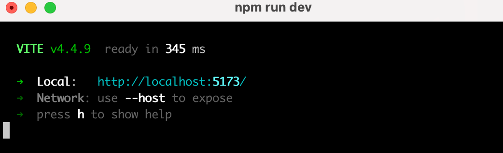
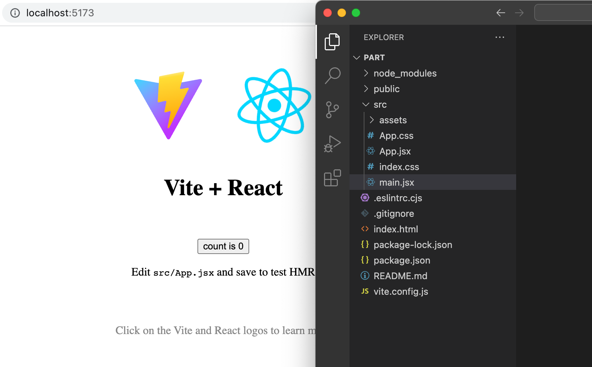
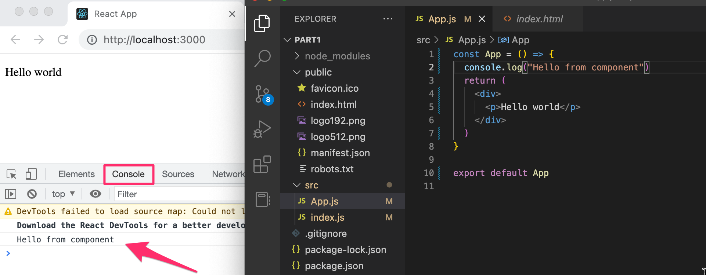
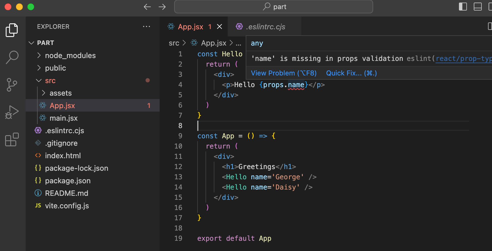
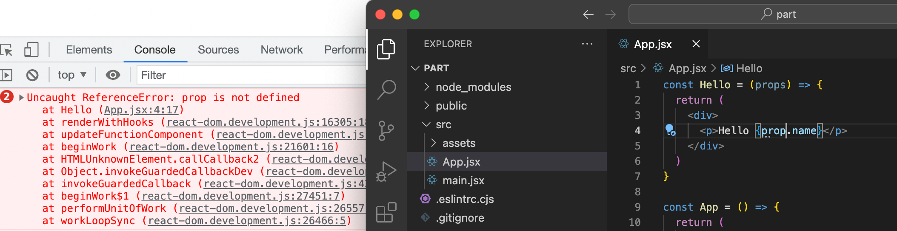
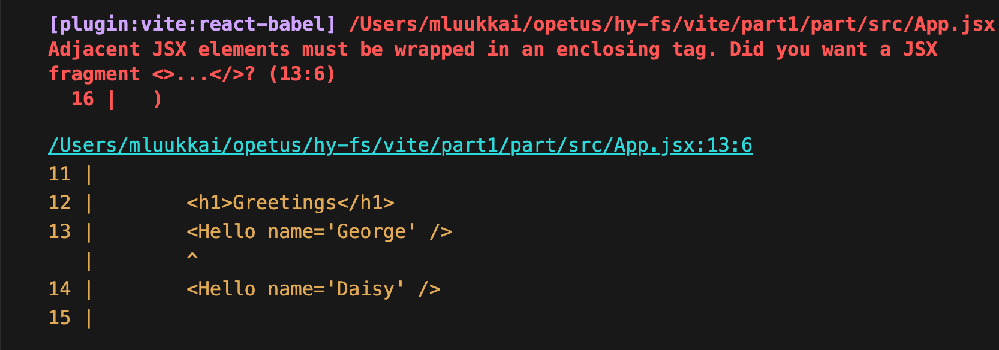
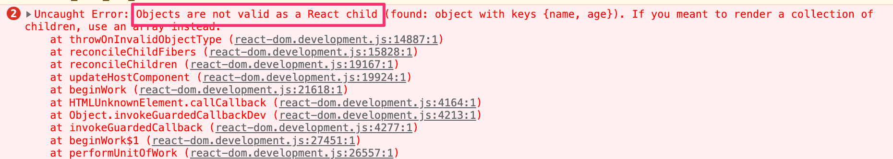

<div class="content">

We will now start getting familiar with probably the most important topic of this course, namely the [React](https://react.dev/) library. Let's start by making a simple React application as well as getting to know the core concepts of React.

The easiest way to get started by far is by using a tool called 
[Vite](https://vitejs.dev/).

Let's create an application called <i>part1</i>, navigate to its directory and install the libraries:

```bash
npm create vite@latest part1 -- --template react
cd part1
npm install
```

The application is started as follows

```bash
npm run dev
```

The console says that the application has started on localhost port 5173, i.e. the address <http://localhost:5173/>:



Vite starts the application [by default](https://vitejs.dev/config/server-options.html#server-port) on port 5173. If it is not free, Vite uses the next free port number.

Open the browser and a text editor so that you can view the code as well as the webpage at the same time on the screen:



The code of the application resides in the <i>src</i> folder. Let's simplify the default code such that the contents of the file main.jsx looks like this:

```js
import ReactDOM from 'react-dom/client'

import App from './App'

ReactDOM.createRoot(document.getElementById('root')).render(<App />)
```

and file <i>App.jsx</i> looks like this

```js
const App = () => {
  return (
    <div>
      <p>Hello world</p>
    </div>
  )
}

export default App
```

The files <i>App.css</i> and <i>index.css</i>, and the directory <i>assets</i> may be deleted as they are not needed in our application right now.

### create-react-app

Instead of Vite you can also use the older generation tool [create-react-app](https://github.com/facebookincubator/create-react-app) in the course to set up the applications. The most visible difference to Vite is the name of the application startup file, which is <i>index.js</i>.

The way to start the application is also different in CRA, it is started with a command

```
npm start
```

in contrast to Vite's

```
npm run dev 
```


The course is currently (11 August 2023) being updated to use Vite. Some brands may still use the application base created with create-react-app.

### Component

The file <i>App.jsx</i> now defines a [React component](https://react.dev/learn/your-first-component) with the name <i>App</i>. The command on the final line of file <i>main.jsx</i>

```js
ReactDOM.createRoot(document.getElementById('root')).render(<App />)
```

renders its contents into the <i>div</i>-element, defined in the file <i>index.html</i>, having the <i>id</i> value 'root'.

By default, the file <i>index.html</i> doesn't contain any HTML markup that is visible to us in the browser:

```html
<!doctype html>
<html lang="en">
  <head>
    <meta charset="UTF-8" />
    <link rel="icon" type="image/svg+xml" href="/vite.svg" />
    <meta name="viewport" content="width=device-width, initial-scale=1.0" />
    <title>Vite + React</title>
  </head>
  <body>
    <div id="root"></div>
    <script type="module" src="/src/main.jsx"></script>
  </body>
</html>

```

You can try adding there some HTML to the file. However, when using React, all content that needs to be rendered is usually defined as React components.

Let's take a closer look at the code defining the component:

```js
const App = () => (
  <div>
    <p>Hello world</p>
  </div>
)
```

As you probably guessed, the component will be rendered as a <i>div</i>-tag, which wraps a <i>p</i>-tag containing the text <i>Hello world</i>.

Technically the component is defined as a JavaScript function. The following is a function (which does not receive any parameters):

```js
() => (
  <div>
    <p>Hello world</p>
  </div>
)
```

The function is then assigned to a constant variable <i>App</i>:

```js
const App = ...
```

There are a few ways to define functions in JavaScript. Here we will use [arrow functions](https://developer.mozilla.org/en-US/docs/Web/JavaScript/Reference/Functions/Arrow_functions), which are described in a newer version of JavaScript known as [ECMAScript 6](http://es6-features.org/#Constants), also called ES6.

Because the function consists of only a single expression we have used a shorthand, which represents this piece of code:

```js
const App = () => {
  return (
    <div>
      <p>Hello world</p>
    </div>
  )
}
```

In other words, the function returns the value of the expression.

The function defining the component may contain any kind of JavaScript code. Modify your component to be as follows:

```js
const App = () => {
  console.log('Hello from component')
  return (
    <div>
      <p>Hello world</p>
    </div>
  )
}

export default App
```

and observe what happens in the browser console



The first rule of frontend web development:

> <i>keep the console open all the time</i>

Let us repeat this together: <i>I promise to keep the console open all the time</i> during this course, and for the rest of my life when I'm doing web development.

It is also possible to render dynamic content inside of a component.

Modify the component as follows:

```js
const App = () => {
  const now = new Date()
  const a = 10
  const b = 20
  console.log(now, a+b)

  return (
    <div>
      <p>Hello world, it is {now.toString()}</p>
      <p>
        {a} plus {b} is {a + b}
      </p>
    </div>
  )
}
```

Any JavaScript code within the curly braces is evaluated and the result of this evaluation is embedded into the defined place in the HTML produced by the component.

Note that you should not remove the line at the bottom of the component

```js
export default App
```

The export is not shown in most of the examples of the course material. Without the export the component and the whole app breaks down.

Did you remember your promise to keep the console open? What was printed out there?

### JSX

It seems like React components are returning HTML markup. However, this is not the case. The layout of React components is mostly written using [JSX](https://react.dev/learn/writing-markup-with-jsx). Although JSX looks like HTML, we are dealing with a way to write JavaScript. Under the hood, JSX returned by React components is compiled into JavaScript.

After compiling, our application looks like this:

```js
const App = () => {
  const now = new Date()
  const a = 10
  const b = 20
  return React.createElement(
    'div',
    null,
    React.createElement(
      'p', null, 'Hello world, it is ', now.toString()
    ),
    React.createElement(
      'p', null, a, ' plus ', b, ' is ', a + b
    )
  )
}
```

The compilation is handled by [Babel](https://babeljs.io/repl/). Projects created with *create-react-app* are configured to compile automatically. We will learn more about this topic in [part 7](/en/part7) of this course.

It is also possible to write React as "pure JavaScript" without using JSX. Although, nobody with a sound mind would do so.

In practice, JSX is much like HTML with the distinction that with JSX you can easily embed dynamic content by writing appropriate JavaScript within curly braces. The idea of JSX is quite similar to many templating languages, such as Thymeleaf used along with Java Spring, which are used on servers.

JSX is "[XML](https://developer.mozilla.org/en-US/docs/Web/XML/XML_introduction)-like", which means that every tag needs to be closed. For example, a newline is an empty element, which in HTML can be written as follows:

```html
<br>
```

but when writing JSX, the tag needs to be closed:

```html
<br />
```

### Multiple components

Let's modify the file <i>App.jsx</i> as follows:


```js
// highlight-start
const Hello = () => {
  return (
    <div>
      <p>Hello world</p>
    </div>
  )
}
// highlight-end

const App = () => {
  return (
    <div>
      <h1>Greetings</h1>
      <Hello /> // highlight-line
    </div>
  )
}
```

We have defined a new component <i>Hello</i> and used it inside the component <i>App</i>. Naturally, a component can be used multiple times:

```js
const App = () => {
  return (
    <div>
      <h1>Greetings</h1>
      <Hello />
      // highlight-start
      <Hello />
      <Hello />
      // highlight-end
    </div>
  )
}
```

**NB**: <em>export</em> at the bottom is left out in these <i>examples</i>, now and in the future. It is still needed for the code to work


Writing components with React is easy, and by combining components, even a more complex application can be kept fairly maintainable. Indeed, a core philosophy of React is composing applications from many specialized reusable components.

Another strong convention is the idea of a <i>root component</i> called <i>App</i> at the top of the component tree of the application. Nevertheless, as we will learn in [part 6](/en/part6), there are situations where the component <i>App</i> is not exactly the root, but is wrapped within an appropriate utility component.

### props: passing data to components

It is possible to pass data to components using so-called [props](https://react.dev/learn/passing-props-to-a-component).

Let's modify the component <i>Hello</i> as follows:

```js
const Hello = (props) => { // highlight-line
  return (
    <div>
      <p>Hello {props.name}</p> // highlight-line
    </div>
  )
}
```

Now the function defining the component has a parameter props. As an argument, the parameter receives an object, which has fields corresponding to all the "props" the user of the component defines.

The props are defined as follows:

```js
const App = () => {
  return (
    <div>
      <h1>Greetings</h1>
      <Hello name='George' /> // highlight-line
      <Hello name='Daisy' /> // highlight-line
    </div>
  )
}
```

There can be an arbitrary number of props and their values can be "hard-coded" strings or the results of JavaScript expressions. If the value of the prop is achieved using JavaScript it must be wrapped with curly braces.

Let's modify the code so that the component <i>Hello</i> uses two props:

```js
const Hello = (props) => {
  console.log(props) // highlight-line
  return (
    <div>
      <p>
        Hello {props.name}, you are {props.age} years old // highlight-line
      </p>
    </div>
  )
}

const App = () => {
  const name = 'Peter' // highlight-line
  const age = 10       // highlight-line

  return (
    <div>
      <h1>Greetings</h1>
      <Hello name='Maya' age={26 + 10} /> // highlight-line
      <Hello name={name} age={age} />     // highlight-line
    </div>
  )
}
```

The props sent by the component <i>App</i> are the values of the variables, the result of the evaluation of the sum expression and a regular string.

Component <i>Hello</i> also logs the value of the object props to the console.

I really hope your console was open. If it was not, remember what you promised:

> <i>I promise to keep the console open all the time during this course, and for the rest of my life when I'm doing web development</i>

Software development is hard. It gets even harder if one is not using all the possible available tools such as the web-console and debug printing with _console.log_. Professionals use both <i>all the time</i> and there is no single reason why a beginner should not adopt the use of these wonderful helper methods that will make life so much easier.

### Possible error message

Depending on the editor you are using, you may receive the following error message at this point:



It's not an actual error, but a warning caused by the [ESLint](https://eslint.org/) tool. You can silence the warning [react/prop-types](https://github.com/jsx-eslint/eslint-plugin-react/blob/master/docs/rules/prop-types.md) by adding to the file <i>.eslintrc .cjs</i> the next line

```js
module.exports = {
   root: true,
   env: { browser: true, es2020: true },
   extends: [
     'eslint:recommended',
     'plugin:react/recommended',
     'plugin:react/jsx-runtime',
     'plugin:react-hooks/recommended',
   ],
   ignorePatterns: ['dist', '.eslintrc.cjs'],
   parserOptions: { ecmaVersion: 'latest', sourceType: 'module' },
   settings: { react: { version: '18.2' } },
   plugins: ['react-refresh'],
   rules: {
     'react-refresh/only-export-components': [
       'warn',
       { allowConstantExport: true },
     ],
     'react/prop-types': false // highlight-line
   },
}
```

We will get to know ESLint in more detail [in part 3](/osa3/validointi_ja_es_lint#lint).

### Some notes

React has been configured to generate quite clear error messages. Despite this, you should, at least in the beginning, advance in **very small steps** and make sure that every change works as desired.

**The console should always be open**. If the browser reports errors, it is not advisable to continue writing more code, hoping for miracles. You should instead try to understand the cause of the error and, for example, go back to the previous working state:



As we already mentioned, when programming with React, it is possible and worthwhile to write <em>console.log()</em> commands (which print to the console) within your code.

Also, keep in mind that **First letter of React component names must be capitalized**. If you try defining a component as follows:

```js
const footer = () => {
  return (
    <div>
      greeting app created by <a href='https://github.com/mluukkai'>mluukkai</a>
    </div>
  )
}
```

and use it like this

```js
const App = () => {
  return (
    <div>
      <h1>Greetings</h1>
      <Hello name='Maya' age={26 + 10} />
      <footer /> // highlight-line
    </div>
  )
}
```

the page is not going to display the content defined within the Footer component, and instead React only creates an empty [footer](https://developer.mozilla.org/en-US/docs/Web/HTML/Element/footer) element, i.e. the built-in HTML element instead of the custom React element of the same name. If you change the first letter of the component name to a capital letter, then React creates a <i>div</i>-element defined in the Footer component, which is rendered on the page.

Note that the content of a React component (usually) needs to contain **one root element**. If we, for example, try to define the component <i>App</i> without the outermost <i>div</i>-element:

```js
const App = () => {
  return (
    <h1>Greetings</h1>
    <Hello name='Maya' age={26 + 10} />
    <Footer />
  )
}
```

the result is an error message.



Using a root element is not the only working option. An <i>array</i> of components is also a valid solution:

```js
const App = () => {
  return [
    <h1>Greetings</h1>,
    <Hello name='Maya' age={26 + 10} />,
    <Footer />
  ]
}
```

However, when defining the root component of the application this is not a particularly wise thing to do, and it makes the code look a bit ugly.

Because the root element is stipulated, we have "extra" div elements in the DOM tree. This can be avoided by using [fragments](https://react.dev/reference/react/Fragment), i.e. by wrapping the elements to be returned by the component with an empty element:

```js
const App = () => {
  const name = 'Peter'
  const age = 10

  return (
    <>
      <h1>Greetings</h1>
      <Hello name='Maya' age={26 + 10} />
      <Hello name={name} age={age} />
      <Footer />
    </>
  )
}
```

It now compiles successfully, and the DOM generated by React no longer contains the extra div element.

### Do not render objects

Consider an application that prints the names and ages of our friends on the screen:

```js
const App = () => {
  const friends = [
    { name: 'Peter', age: 4 },
    { name: 'Maya', age: 10 },
  ]

  return (
    <div>
      <p>{friends[0]}</p>
      <p>{friends[1]}</p>
    </div>
  )
}

export default App
```

However, nothing appears on the screen. I've been trying to find a problem in the code for 15 minutes, but I can't figure out where the problem could be.

I finally remember the promise we made

> <i>I promise to keep the console open all the time during this course, and for the rest of my life when I'm doing web development</i>

The console screams in red:



The core of the problem is <i>Objects are not valid as a React child</i>, i.e. the application tries to render <i>objects</i> and it fails again.

The code tries to render the information of one friend as follows

```js
<p>{friends[0]}</p>
```

and this causes a problem because the item to be rendered in the braces is an object.

```js
{ name: 'Peter', age: 4 }
```

In React, the individual things rendered in braces must be primitive values, such as numbers or strings.

The fix is ​​as follows

```js
const App = () => {
  const friends = [
    { name: 'Peter', age: 4 },
    { name: 'Maya', age: 10 },
  ]

  return (
    <div>
      <p>{friends[0].name} {friends[0].age}</p>
      <p>{friends[1].name} {friends[1].age}</p>
    </div>
  )
}

export default App
```

So now the friend's name is rendered separately inside the curly braces

```js
{friends[0].name}
```

and age

```js
{friends[0].age}
```

After correcting the error, you should clear the console error messages by pressing 🚫 and then reload the page content and make sure that no error messages are displayed.

A small additional note to the previous one. React also allows arrays to be rendered <i>if</i> the array contains values ​​that are eligible for rendering (such as numbers or strings). So the following program would work, although the result might not be what we want:

```js
const App = () => {
  const friends = [ 'Peter', 'Maya']

  return (
    <div>
      <p>{friends}</p>
    </div>
  )
}
```

In this part, it is not even worth trying to use the direct rendering of the tables, we will come back to it in the next part.

</div>

<div class="tasks">
  <h3>Exercises 1.1.-1.2.</h3>

The exercises are submitted via GitHub, and by marking the exercises as done in the "my submissions" tab of the [submission application](https://studies.cs.helsinki.fi/stats/courses/fullstackopen).

The exercises are submitted **one part at a time**. When you have submitted the exercises for a part of the course you can no longer submit undone exercises for the same part.

Note that in this part, there are [more exercises](/en/part1/a_more_complex_state_debugging_react_apps#exercises-1-6-1-14) besides those found below. <i>Do not submit your work</i> until you have completed all of the exercises you want to submit for the part.

You may submit all the exercises of this course into the same repository, or use multiple repositories. If you submit exercises of different parts into the same repository, please use a sensible naming scheme for the directories.

One very functional file  structure for the submission repository is as follows:

```text
part0
part1
  courseinfo
  unicafe
  anecdotes
part2
  phonebook
  countries
```

See this [example submission repository](https://github.com/fullstack-hy2020/example-submission-repository)!

For each part of the course, there is a directory, which further branches into directories containing a series of exercises, like "unicafe" for part 1.

Most of the exercises of the course build a larger application, eg. courseinfo, unicafe and anecdotes in this part, bit by bit. It is enough to submit the completed application. You can make a commit after each exercise, but that is not compulsory. For example the course info app is built in exercises 1.1.-1.5. It is just the end result after 1.5 that you need to submit!

For each web application for a series of exercises, it is recommended to submit all files relating to that application, except for the directory <i>node\_modules</i>.

  <h4>1.1: course information, step1</h4>

<i>The application that we will start working on in this exercise will be further developed in a few of the following exercises. In this and other upcoming exercise sets in this course, it is enough to only submit the final state of the application. If desired, you may also create a commit for each exercise of the series, but this is entirely optional.</i>

Use vite to initialize a new application. Modify <i>main.jsx</i> to match the following

```js
import ReactDOM from 'react-dom/client'

import App from './App'

ReactDOM.createRoot(document.getElementById('root')).render(<App />)
```

and <i>App.jsx</i> to match the following

```js
const App = () => {
  const course = 'Half Stack application development'
  const part1 = 'Fundamentals of React'
  const exercises1 = 10
  const part2 = 'Using props to pass data'
  const exercises2 = 7
  const part3 = 'State of a component'
  const exercises3 = 14

  return (
    <div>
      <h1>{course}</h1>
      <p>
        {part1} {exercises1}
      </p>
      <p>
        {part2} {exercises2}
      </p>
      <p>
        {part3} {exercises3}
      </p>
      <p>Number of exercises {exercises1 + exercises2 + exercises3}</p>
    </div>
  )
}

export default App
```

and remove extra files App.css and index.css, and the directory assets.

Unfortunately, the entire application is in the same component. Refactor the code so that it consists of three new components: <i>Header</i>, <i>Content</i>, and <i>Total</i>. All data still resides in the <i>App</i> component, which passes the necessary data to each component using <i>props</i>. <i>Header</i> takes care of rendering the name of the course, <i>Content</i> renders the parts and their number of exercises and <i>Total</i> renders the total number of exercises.

Define the new components in the file <i>App.jsx</i>.

The <i>App</i> component's body will approximately be as follows:

```js
const App = () => {
  // const-definitions

  return (
    <div>
      <Header course={course} />
      <Content ... />
      <Total ... />
    </div>
  )
}
```

**WARNING** Don't try to program all the components concurrently, because that will almost certainly break down the whole app. Proceed in small steps, first make e.g. the component <i>Header</i> and only when it works for sure, you could proceed to the next component.

Careful, small-step progress may seem slow, but it is actually <i> by far the fastest</i> way to progress. Famous software developer Robert "Uncle Bob" Martin has stated

> <i>"The only way to go fast, is to go well"</i>

that is, according to Martin, careful progress with small steps is even the only way to be fast.

<h4>1.2: course information, step2</h4>

Refactor the <i>Content</i> component so that it does not render any names of parts or their number of exercises by itself. Instead, it only renders three <i>Part</i> components of which each renders the name and number of exercises of one part.

```js
const Content = ... {
  return (
    <div>
      <Part .../>
      <Part .../>
      <Part .../>
    </div>
  )
}
```

Our application passes on information in quite a primitive way at the moment, since it is based on individual variables. We shall fix that in [part 2](/en/part2), but before that, let's go to part1b to learn about JavaScript.

</div>
