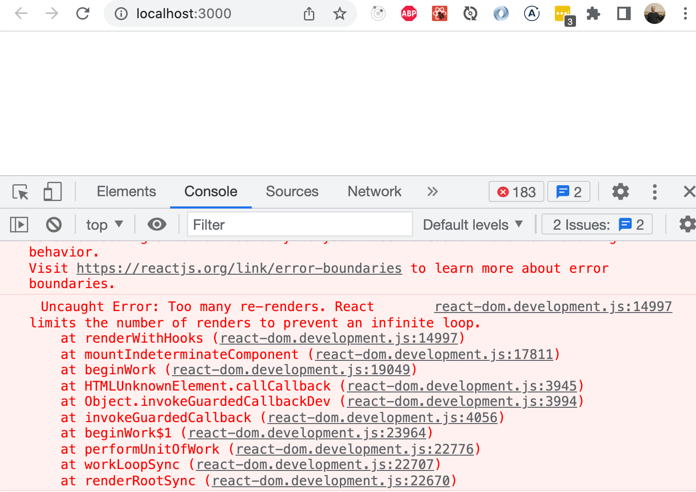
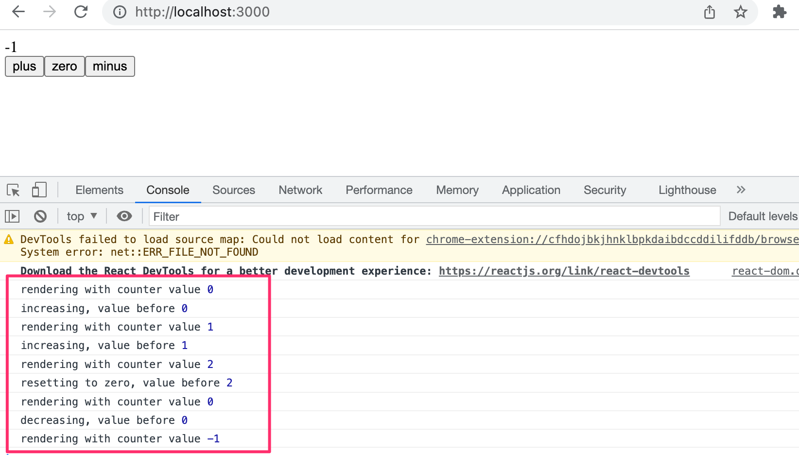

<div class="content">

Let's go back to working with React.

We start with a new example:

```js
const Hello = (props) => {
  return (
    <div>
      <p>
        Hello {props.name}, you are {props.age} years old
      </p>
    </div>
  )
}

const App = () => {
  const name = 'Peter'
  const age = 10

  return (
    <div>
      <h1>Greetings</h1>
      <Hello name="Maya" age={26 + 10} />
      <Hello name={name} age={age} />
    </div>
  )
}
```

### Component helper functions

Let's expand our <i>Hello</i> component so that it guesses the year of birth of the person being greeted:

```js
const Hello = (props) => {
  // highlight-start
  const bornYear = () => {
    const yearNow = new Date().getFullYear()
    return yearNow - props.age
  }
  // highlight-end

  return (
    <div>
      <p>
        Hello {props.name}, you are {props.age} years old
      </p>
      <p>So you were probably born in {bornYear()}</p> // highlight-line
    </div>
  )
}
```

The logic for guessing the year of birth is encapsulated within a function of its own, which is invoked when the component is rendered.

The person's age does not need to be explicitly passed as a parameter to this function because the function can directly access all the props provided to the component.

If we examine the current code, we notice that the helper function is defined within another function that determines the component's behavior. In Java programming, defining a function within another function can be complex and is uncommon. However, in JavaScript, defining functions within functions is a common and efficient practice.

### Destructuring

Before we move forward, we will take a look at a small but useful feature of the JavaScript language that was added in the ES6 specification, that allows us to [destructure](https://developer.mozilla.org/en-US/docs/Web/JavaScript/Reference/Operators/Destructuring_assignment) values from objects and arrays upon assignment.

In our previous code, we had to reference the data passed to our component as _props.name_ and _props.age_. Of these two expressions, we had to repeat _props.age_ twice in our code.

Since <i>props</i> is an object

```js
props = {
  name: 'Arto Hellas',
  age: 35,
}
```

we can streamline our component by assigning the values of the properties directly into two variables _name_ and _age_ which we can then use in our code:

```js
const Hello = (props) => {
  // highlight-start
  const name = props.name
  const age = props.age
  // highlight-end

  const bornYear = () => new Date().getFullYear() - age // highlight-line

  return (
    <div>
      <p>Hello {name}, you are {age} years old</p> // highlight-line
      <p>So you were probably born in {bornYear()}</p>
    </div>
  )
}
```

Note that we've also utilized the more compact syntax for arrow functions when defining the _bornYear_ function. As mentioned earlier, if an arrow function consists of a single expression, then the function body does not need to be written inside of curly braces. In this more compact form, the function simply returns the result of the single expression.

To recap, the two function definitions shown below are equivalent:

```js
const bornYear = () => new Date().getFullYear() - age

const bornYear = () => {
  return new Date().getFullYear() - age
}
```

Destructuring makes the assignment of variables even easier since we can use it to extract and gather the values of an object's properties into separate variables:

```js
const Hello = (props) => {
    // highlight-start
  const { name, age } = props
    // highlight-end
  const bornYear = () => new Date().getFullYear() - age

  return (
    <div>
      <p>Hello {name}, you are {age} years old</p>
      <p>So you were probably born in {bornYear()}</p>
    </div>
  )
}
```

When the object that we are destructuring has the values

```js
props = {
  name: 'Arto Hellas',
  age: 35,
}
```

the expression <em>const { name, age } = props</em> assigns the values 'Arto Hellas' to _name_ and 35 to _age_.

We can take destructuring a step further:

```js
const Hello = ({ name, age }) => { // highlight-line
  const bornYear = () => new Date().getFullYear() - age

  return (
    <div>
      <p>
        Hello {name}, you are {age} years old
      </p>
      <p>So you were probably born in {bornYear()}</p>
    </div>
  )
}
```

The props that are passed to the component are now directly destructured into the variables, _name_ and _age_.

This means that instead of assigning the entire props object into a variable called <i>props</i> and then assigning its properties to the variables _name_ and _age_

```js
const Hello = (props) => {
  const { name, age } = props
```

we assign the values of the properties directly to variables by destructuring the props object that is passed to the component function as a parameter:

```js
const Hello = ({ name, age }) => {
```

### Page re-rendering

Up to this point, our applications have been static — their appearance remains unchanged after the initial rendering. But what if we wanted to create a counter that increases in value, either over time or when a button is clicked?

Let's start with the following. File <i>App.jsx</i> becomes:

```js
const App = (props) => {
  const {counter} = props
  return (
    <div>{counter}</div>
  )
}

export default App
```

And file <i>main.jsx</i> becomes:

```js
import ReactDOM from 'react-dom/client'

import App from './App'

let counter = 1

ReactDOM.createRoot(document.getElementById('root')).render(
  <App counter={counter} />
)
```

The App component is given the value of the counter via the _counter_ prop. This component renders the value to the screen. What happens when the value of _counter_ changes? Even if we were to add the following

```js
counter += 1
```

the component won't re-render. We can get the component to re-render by calling the _render_ method a second time, e.g. in the following way:

```js
let counter = 1

const root = ReactDOM.createRoot(document.getElementById('root'))

const refresh = () => {
  root.render(
    <App counter={counter} />
  )
}

refresh()
counter += 1
refresh()
counter += 1
refresh()
```

The re-rendering command has been wrapped inside of the _refresh_ function to cut down on the amount of copy-pasted code.

Now the component <i>renders three times</i>, first with the value 1, then 2, and finally 3. However, values 1 and 2 are displayed on the screen for such a short amount of time that they can't be noticed.

We can implement slightly more interesting functionality by re-rendering and incrementing the counter every second by using [setInterval](https://developer.mozilla.org/en-US/docs/Web/API/WindowOrWorkerGlobalScope/setInterval):

```js
setInterval(() => {
  refresh()
  counter += 1
}, 1000)
```

Making repeated calls to the _render_ method is not the recommended way to re-render components. Next, we'll introduce a better way of accomplishing this effect.

### Stateful component

All of our components up till now have been simple in the sense that they have not contained any state that could change during the lifecycle of the component.

Next, let's add state to our application's <i>App</i> component with the help of React's [state hook](https://react.dev/learn/state-a-components-memory).

We will change the application as follows. <i>main.jsx</i> goes back to:

```js
import ReactDOM from 'react-dom/client'

import App from './App'

ReactDOM.createRoot(document.getElementById('root')).render(<App />)
```

and <i>App.jsx</i> changes to the following:

```js
import { useState } from 'react' // highlight-line

const App = () => {
  const [ counter, setCounter ] = useState(0) // highlight-line

// highlight-start
  setTimeout(
    () => setCounter(counter + 1),
    1000
  )
  // highlight-end

  return (
    <div>{counter}</div>
  )
}

export default App
```

In the first row, the file imports the _useState_ function:

```js
import { useState } from 'react'
```

The function body that defines the component begins with the function call:

```js
const [ counter, setCounter ] = useState(0)
```

The function call adds <i>state</i> to the component and renders it initialized with the value zero. The function returns an array that contains two items. We assign the items to the variables _counter_ and _setCounter_ by using the destructuring assignment syntax shown earlier.

The _counter_ variable is assigned the initial value of <i>state</i>, which is zero. The variable _setCounter_ is assigned a function that will be used to <i>modify the state</i>.

The application calls the [setTimeout](https://developer.mozilla.org/en-US/docs/Web/API/WindowOrWorkerGlobalScope/setTimeout) function and passes it two parameters: a function to increment the counter state and a timeout of one second:

```js
setTimeout(
  () => setCounter(counter + 1),
  1000
)
```

The function passed as the first parameter to the _setTimeout_ function is invoked one second after calling the _setTimeout_ function

```js
() => setCounter(counter + 1)
```

When the state modifying function _setCounter_ is called, <i>React re-renders the component</i> which means that the function body of the component function gets re-executed:

```js
() => {
  const [ counter, setCounter ] = useState(0)

  setTimeout(
    () => setCounter(counter + 1),
    1000
  )

  return (
    <div>{counter}</div>
  )
}
```

The second time the component function is executed it calls the _useState_ function and returns the new value of the state: 1. Executing the function body again also makes a new function call to _setTimeout_, which executes the one-second timeout and increments the _counter_ state again. Because the value of the _counter_ variable is 1, incrementing the value by 1 is essentially the same as an expression setting the value of _counter_ to 2.

```js
() => setCounter(2)
```

Meanwhile, the old value of _counter_ - "1" - is rendered to the screen.

Every time the _setCounter_ modifies the state it causes the component to re-render. The value of the state will be incremented again after one second, and this will continue to repeat for as long as the application is running.

If the component doesn't render when you think it should, or if it renders at the "wrong time", you can debug the application by logging the values of the component's variables to the console. If we make the following additions to our code:

```js
const App = () => {
  const [ counter, setCounter ] = useState(0)

  setTimeout(
    () => setCounter(counter + 1),
    1000
  )

  console.log('rendering...', counter) // highlight-line

  return (
    <div>{counter}</div>
  )
}
```

It's easy to follow and track the calls made to the <i>App</i> component's render function:


Was your browser console open? If it wasn't, then promise that this was the last time you need to be reminded about it.

### Event handling

We have already mentioned the <i>event handlers</i> that are registered to be called when specific events occur a few times in [part 0](/en/part0). A user's interaction with the different elements of a web page can cause a collection of various kinds of events to be triggered.

Let's change the application so that increasing the counter happens when a user clicks a button, which is implemented with the [button](https://developer.mozilla.org/en-US/docs/Web/HTML/Element/button) element.

Button elements support so-called [mouse events](https://developer.mozilla.org/en-US/docs/Web/API/MouseEvent), of which [click](https://developer.mozilla.org/en-US/docs/Web/Events/click) is the most common event. The click event on a button can also be triggered with the keyboard or a touch screen despite the name <i>mouse event</i>.

In React, [registering an event handler function](https://react.dev/learn/responding-to-events) to the <i>click</i> event happens like this:

```js
const App = () => {
  const [ counter, setCounter ] = useState(0)

  // highlight-start
  const handleClick = () => {
    console.log('clicked')
  }
  // highlight-end

  return (
    <div>
      <div>{counter}</div>
      // highlight-start
      <button onClick={handleClick}>
        plus
      </button>
      // highlight-end
    </div>
  )
}
```

We set the value of the button's <i>onClick</i> attribute to be a reference to the _handleClick_ function defined in the code.

Now every click of the <i>plus</i> button causes the _handleClick_ function to be called, meaning that every click event will log a <i>clicked</i> message to the browser console.

The event handler function can also be defined directly in the value assignment of the onClick-attribute:

```js
const App = () => {
  const [ counter, setCounter ] = useState(0)

  return (
    <div>
      <div>{counter}</div>
      <button onClick={() => console.log('clicked')}> // highlight-line
        plus
      </button>
    </div>
  )
}
```

By changing the event handler to the following form

```js
<button onClick={() => setCounter(counter + 1)}>
  plus
</button>
```

we achieve the desired behavior, meaning that the value of _counter_ is increased by one <i>and</i> the component gets re-rendered.

Let's also add a button for resetting the counter:

```js
const App = () => {
  const [ counter, setCounter ] = useState(0)

  return (
    <div>
      <div>{counter}</div>
      <button onClick={() => setCounter(counter + 1)}>
        plus
      </button>
      // highlight-start
      <button onClick={() => setCounter(0)}> 
        zero
      </button>
      // highlight-end
    </div>
  )
}
```

Our application is now ready!

### An event handler is a function

We define the event handlers for our buttons where we declare their <i>onClick</i> attributes:

```js
<button onClick={() => setCounter(counter + 1)}> 
  plus
</button>
```

What if we tried to define the event handlers in a simpler form?

```js
<button onClick={setCounter(counter + 1)}> 
  plus
</button>
```

This would completely break our application:



What's going on? An event handler is supposed to be either a <i>function</i> or a <i>function reference</i>, and when we write:

```js
<button onClick={setCounter(counter + 1)}>
```

the event handler is actually a <i>function call</i>. In many situations this is ok, but not in this particular situation. In the beginning, the value of the <i>counter</i> variable is 0. When React renders the component for the first time, it executes the function call <em>setCounter(0+1)</em>, and changes the value of the component's state to 1.
This will cause the component to be re-rendered, React will execute the setCounter function call again, and the state will change leading to another re-render...

Let's define the event handlers like we did before:

```js
<button onClick={() => setCounter(counter + 1)}> 
  plus
</button>
```

Now the button's attribute which defines what happens when the button is clicked - <i>onClick</i> - has the value _() => setCounter(counter + 1)_.
The setCounter function is called only when a user clicks the button.

Usually defining event handlers within JSX-templates is not a good idea.
Here it's ok, because our event handlers are so simple.

Let's separate the event handlers into separate functions anyway:

```js
const App = () => {
  const [ counter, setCounter ] = useState(0)

// highlight-start
  const increaseByOne = () => setCounter(counter + 1)
  
  const setToZero = () => setCounter(0)
  // highlight-end

  return (
    <div>
      <div>{counter}</div>
      <button onClick={increaseByOne}> // highlight-line
        plus
      </button>
      <button onClick={setToZero}> // highlight-line
        zero
      </button>
    </div>
  )
}
```

Here, the event handlers have been defined correctly. The value of the <i>onClick</i> attribute is a variable containing a reference to a function:

```js
<button onClick={increaseByOne}> 
  plus
</button>
```

### Passing state - to child components

It's recommended to write React components that are small and reusable across the application and even across projects. Let's refactor our application so that it's composed of three smaller components, one component for displaying the counter and two components for buttons.

Let's first implement a <i>Display</i> component that's responsible for displaying the value of the counter.

One best practice in React is to [lift the state up](https://react.dev/learn/sharing-state-between-components) in the component hierarchy. The documentation says:

> <i>Often, several components need to reflect the same changing data. We recommend lifting the shared state up to their closest common ancestor.</i>

So let's place the application's state in the <i>App</i> component and pass it down to the <i>Display</i> component through <i>props</i>:

```js
const Display = (props) => {
  return (
    <div>{props.counter}</div>
  )
}
```

Using the component is straightforward, as we only need to pass the state of the _counter_ to it:

```js
const App = () => {
  const [ counter, setCounter ] = useState(0)

  const increaseByOne = () => setCounter(counter + 1)
  const setToZero = () => setCounter(0)

  return (
    <div>
      <Display counter={counter}/> // highlight-line
      <button onClick={increaseByOne}>
        plus
      </button>
      <button onClick={setToZero}> 
        zero
      </button>
    </div>
  )
}
```

Everything still works. When the buttons are clicked and the <i>App</i> gets re-rendered, all of its children including the <i>Display</i> component are also re-rendered.

Next, let's make a <i>Button</i> component for the buttons of our application. We have to pass the event handler as well as the title of the button through the component's props:

```js
const Button = (props) => {
  return (
    <button onClick={props.onClick}>
      {props.text}
    </button>
  )
}
```

Our <i>App</i> component now looks like this:

```js
const App = () => {
  const [ counter, setCounter ] = useState(0)

  const increaseByOne = () => setCounter(counter + 1)
  //highlight-start
  const decreaseByOne = () => setCounter(counter - 1)
  //highlight-end
  const setToZero = () => setCounter(0)

  return (
    <div>
      <Display counter={counter}/>
      // highlight-start
      <Button
        onClick={increaseByOne}
        text='plus'
      />
      <Button
        onClick={setToZero}
        text='zero'
      />     
      <Button
        onClick={decreaseByOne}
        text='minus'
      />           
      // highlight-end
    </div>
  )
}
```

Since we now have an easily reusable <i>Button</i> component, we've also implemented new functionality into our application by adding a button that can be used to decrement the counter.

The event handler is passed to the <i>Button</i> component through the _onClick_ prop. When creating your own components, you can theoretically choose the prop name freely. However, our naming choice for the event handler was not entirely arbitrary.

React's own official [tutorial](https://react.dev/learn/tutorial-tic-tac-toe) suggests:
"In React, it’s conventional to use _onSomething_ names for props which take functions which handle events and handleSomething for the actual function definitions which handle those events."

### Changes in state cause re-rendering

Let's go over the main principles of how an application works once more.

When the application starts, the code in _App_ is executed. This code uses a [useState](https://react.dev/reference/react/useState) hook to create the application state, setting an initial value of the variable _counter_.
This component contains the _Display_ component - which displays the counter's value, 0 - and three _Button_ components. The buttons all have event handlers, which are used to change the state of the counter.

When one of the buttons is clicked, the event handler is executed. The event handler changes the state of the _App_ component with the _setCounter_ function.
**Calling a function that changes the state causes the component to re-render.**

So, if a user clicks the <i>plus</i> button, the button's event handler changes the value of _counter_ to 1, and the _App_ component is re-rendered.
This causes its subcomponents _Display_ and _Button_ to also be re-rendered.
_Display_ receives the new value of the counter, 1, as props. The _Button_ components receive event handlers which can be used to change the state of the counter.

To be sure to understand how the program works, let us add some _console.log_ statements to it

```js
const App = () => {
  const [counter, setCounter] = useState(0)
  console.log('rendering with counter value', counter) // highlight-line

  const increaseByOne = () => {
    console.log('increasing, value before', counter) // highlight-line
    setCounter(counter + 1)
  }

  const decreaseByOne = () => { 
    console.log('decreasing, value before', counter) // highlight-line
    setCounter(counter - 1)
  }

  const setToZero = () => {
    console.log('resetting to zero, value before', counter) // highlight-line
    setCounter(0)
  }

  return (
    <div>
      <Display counter={counter} />
      <Button onClick={increaseByOne} text="plus" />
      <Button onClick={setToZero} text="zero" />
      <Button onClick={decreaseByOne} text="minus" />
    </div>
  )
} 
```

Let us now see what gets rendered to the console when the buttons plus, zero and minus are pressed:



Do not ever try to guess what your code does. It is just better to use _console.log_ and <i>see with your own eyes</i> what it does.

### Refactoring the components

The component displaying the value of the counter is as follows:

```js
const Display = (props) => {
  return (
    <div>{props.counter}</div>
  )
}
```

The component only uses the _counter_ field of its <i>props</i>.
This means we can simplify the component by using [destructuring](/en/part1/component_state_event_handlers#destructuring), like so:

```js
const Display = ({ counter }) => {
  return (
    <div>{counter}</div>
  )
}
```

The function defining the component contains only the return statement, so we can define the function using the more compact form of arrow functions:

```js
const Display = ({ counter }) => <div>{counter}</div>
```

We can simplify the Button component as well.

```js
const Button = (props) => {
  return (
    <button onClick={props.onClick}>
      {props.text}
    </button>
  )
}
```

We can use destructuring to get only the required fields from <i>props</i>, and use the more compact form of arrow functions:

```js
const Button = ({ onClick, text }) => <button onClick={onClick}>{text}</button>
```

This approach works because the component contains only a single return statement, making it possible to use the concise arrow function syntax.

</div>
