<div class="content">

### Complex state

In our previous example the application state was simple as it was comprised of a single integer. What if our application requires a more complex state?

In most cases the easiest and best way to accomplish this is by using the _useState_ function multiple times to create separate "pieces" of state.

In the following code we create two pieces of state for the application named _left_ and _right_ that both get the initial value of 0:

```js
const App = () => {
  const [left, setLeft] = useState(0)
  const [right, setRight] = useState(0)

  return (
    <div>
      {left}
      <button onClick={() => setLeft(left + 1)}>
        left
      </button>
      <button onClick={() => setRight(right + 1)}>
        right
      </button>
      {right}
    </div>
  )
}
```

The component gets access to the functions _setLeft_ and _setRight_ that it can use to update the two pieces of state.

The component's state or a piece of its state can be of any type. We could implement the same functionality by saving the click count of both the <i>left</i> and <i>right</i> buttons into a single object:
```js
{
  left: 0,
  right: 0
}
```

In this case the application would look like this:

```js
const App = () => {
  const [clicks, setClicks] = useState({
    left: 0, right: 0
  })

  const handleLeftClick = () => {
    const newClicks = { 
      left: clicks.left + 1, 
      right: clicks.right 
    }
    setClicks(newClicks)
  }

  const handleRightClick = () => {
    const newClicks = { 
      left: clicks.left, 
      right: clicks.right + 1 
    }
    setClicks(newClicks)
  }

  return (
    <div>
      {clicks.left}
      <button onClick={handleLeftClick}>left</button>
      <button onClick={handleRightClick}>right</button>
      {clicks.right}
    </div>
  )
}
```

Now the component only has a single piece of state and the event handlers have to take care of changing the <i>entire application state</i>.

The event handler looks a bit messy. When the left button is clicked, the following function is called:
```js
const handleLeftClick = () => {
  const newClicks = { 
    left: clicks.left + 1, 
    right: clicks.right 
  }
  setClicks(newClicks)
}
```

The following object is set as the new state of the application:
```js
{
  left: clicks.left + 1,
  right: clicks.right
}
```

The new value of the <i>left</i> property is now the same as the value of <i>left + 1</i> from the previous state, and the value of the <i>right</i> property is the same as value of the <i>right</i> property from the previous state.

We can define the new state object a bit more neatly by using the [object spread](https://developer.mozilla.org/en-US/docs/Web/JavaScript/Reference/Operators/Spread_syntax)
syntax that was added to the language specification in the summer of 2018:

```js
const handleLeftClick = () => {
  const newClicks = { 
    ...clicks, 
    left: clicks.left + 1 
  }
  setClicks(newClicks)
}

const handleRightClick = () => {
  const newClicks = { 
    ...clicks, 
    right: clicks.right + 1 
  }
  setClicks(newClicks)
}
```

The syntax may seem a bit strange at first. In practice <em>{ ...clicks }</em> creates a new object that has copies of all of the properties of the _clicks_ object. When we specify a particular property - e.g. <i>right</i> in <em>{ ...clicks, right: 1 }</em>, the value of the _right_ property in the new object will be 1.

In the example above, this:

```js
{ ...clicks, right: clicks.right + 1 }
```

creates a copy of the _clicks_ object where the value of the _right_ property is increased by one.

Assigning the object to a variable in the event handlers is not necessary and we can simplify the functions to the following form:

```js
const handleLeftClick = () =>
  setClicks({ ...clicks, left: clicks.left + 1 })

const handleRightClick = () =>
  setClicks({ ...clicks, right: clicks.right + 1 })
```

Some readers might be wondering why we didn't just update the state directly, like this:

```js
const handleLeftClick = () => {
  clicks.left++
  setClicks(clicks)
}
```

The application appears to work. However, <i>it is forbidden in React to mutate state directly</i>, since it can result in unexpected side effects. Changing state has to always be done by setting the state to a new object. If properties from the previous state object are not changed, they need to simply be copied, which is done by copying those properties into a new object, and setting that as the new state.

Storing all of the state in a single state object is a bad choice for this particular application; there's no apparent benefit and the resulting application is a lot more complex. In this case storing the click counters into separate pieces of state is a far more suitable choice.

There are situations where it can be beneficial to store a piece of application state in a more complex data structure. [The official React documentation](https://reactjs.org/docs/hooks-faq.html#should-i-use-one-or-many-state-variables) contains some helpful guidance on the topic.

### Handling arrays

Let's add a piece of state to our application containing an array _allClicks_ that remembers every click that has occurred in the application.

```js
const App = () => {
  const [left, setLeft] = useState(0)
  const [right, setRight] = useState(0)
  const [allClicks, setAll] = useState([]) // highlight-line

// highlight-start
  const handleLeftClick = () => {
    setAll(allClicks.concat('L'))
    setLeft(left + 1)
  }
// highlight-end  

// highlight-start
  const handleRightClick = () => {
    setAll(allClicks.concat('R'))
    setRight(right + 1)
  }
// highlight-end  

  return (
    <div>
      {left}
      <button onClick={handleLeftClick}>left</button>
      <button onClick={handleRightClick}>right</button>
      {right}
      <p>{allClicks.join(' ')}</p> // highlight-line
    </div>
  )
}
```

Every click is stored into a separate piece of state called _allClicks_ that is initialized as an empty array:

```js
const [allClicks, setAll] = useState([])
```

When the <i>left</i> button is clicked, we add the letter <i>L</i> to the _allClicks_ array:

```js
const handleLeftClick = () => {
  setAll(allClicks.concat('L'))
  setLeft(left + 1)
}
```

The piece of state stored in _allClicks_ is now set to be an array that contains all of the items of the previous state array plus the letter <i>L</i>. Adding the new item to the array is accomplished with the [concat](https://developer.mozilla.org/en-US/docs/Web/JavaScript/Reference/Global_Objects/Array/concat) method, that does not mutate the existing array but rather returns a <i>new copy of the array</i> with the item added to it.

As mentioned previously, it's also possible in JavaScript to add items to an array with the [push](https://developer.mozilla.org/en-US/docs/Web/JavaScript/Reference/Global_Objects/Array/push) method. If we add the item by pushing it to the _allClicks_ array and then updating the state, the application would still appear to work:

```js
const handleLeftClick = () => {
  allClicks.push('L')
  setAll(allClicks)
  setLeft(left + 1)
}
```

However, __don't__ do this. As mentioned previously, the state of React components like _allClicks_ must not be mutated directly. Even if mutating state appears to work in some cases, it can lead to problems that are very hard to debug.

Let's take a closer look at how the clicking history is rendered to the page:

```js
const App = () => {
  // ...

  return (
    <div>
      {left}
      <button onClick={handleLeftClick}>left</button>
      <button onClick={handleRightClick}>right</button>
      {right}
      <p>{allClicks.join(' ')}</p> // highlight-line
    </div>
  )
}
```

We call the [join](https://developer.mozilla.org/en-US/docs/Web/JavaScript/Reference/Global_Objects/Array/join) method on the _allClicks_ array that joins all the items into a single string, separated by the string passed as the function parameter, which in our case is an empty space.

### Conditional rendering

Let's modify our application so that the rendering of the clicking history is handled by a new <i>History</i> component:

```js
const History = (props) => {
  if (props.allClicks.length === 0) {
    return (
      <div>
        the app is used by pressing the buttons
      </div>
    )
  }

  return (
    <div>
      button press history: {props.allClicks.join(' ')}
    </div>
  )
}

const App = () => {
  // ...

  return (
    <div>
      {left}
      <button onClick={handleLeftClick}>left</button>
      <button onClick={handleRightClick}>right</button>
      {right}
      <History allClicks={allClicks} /> // highlight-line
    </div>
  )
}
```

Now the behavior of the component depends on whether or not any buttons have been clicked. If not, meaning that the <em>allClicks</em> array is empty, the component renders a div element with some instructions instead:

```js
<div>the app is used by pressing the buttons</div>
```

And in all other cases, the component renders the clicking history:

```js
<div>
  button press history: {props.allClicks.join(' ')}
</div>
```

The <i>History</i> component renders completely different React elements depending on the state of the application. This is called <i>conditional rendering</i>.

React also offers many other ways of doing [conditional rendering](https://reactjs.org/docs/conditional-rendering.html). We will take a closer look at this in [part 2](/en/part2).

Let's make one last modification to our application by refactoring it to use the _Button_ component that we defined earlier on:

```js
const History = (props) => {
  if (props.allClicks.length === 0) {
    return (
      <div>
        the app is used by pressing the buttons
      </div>
    )
  }

  return (
    <div>
      button press history: {props.allClicks.join(' ')}
    </div>
  )
}

// highlight-start
const Button = ({ onClick, text }) => (
  <button onClick={onClick}>
    {text}
  </button>
)
// highlight-end

const App = () => {
  const [left, setLeft] = useState(0)
  const [right, setRight] = useState(0)
  const [allClicks, setAll] = useState([])

  const handleLeftClick = () => {
    setAll(allClicks.concat('L'))
    setLeft(left + 1)
  }

  const handleRightClick = () => {
    setAll(allClicks.concat('R'))
    setRight(right + 1)
  }

  return (
    <div>
      {left}
      // highlight-start
      <Button onClick={handleLeftClick} text='left' />
      <Button onClick={handleRightClick} text='right' />
      // highlight-end
      {right}
      <History allClicks={allClicks} />
    </div>
  )
}
```

### Old React

In this course we use the [state hook](https://reactjs.org/docs/hooks-state.html) to add state to our React components, which is part of the newer versions of React and is available from version [16.8.0](https://www.npmjs.com/package/react/v/16.8.0) onwards. Before the addition of hooks, there was no way to add state to functional components. Components that required state had to be defined as [class](https://reactjs.org/docs/react-component.html) components, using the JavaScript class syntax.

In this course we have made the slightly radical decision to use hooks exclusively from day one, to ensure that we are learning the future style of React. Even though functional components are the future of React, it is still important to learn the class syntax, as there are billions of lines of old React code that you might end up maintaining someday. The same applies to documentation and examples of React that you may stumble across on the internet.

We will learn more about React class components later on in the course.

### Debugging React applications

A large part of a typical developer's time is spent on debugging and reading existing code. Every now and then we do get to write a line or two of new code, but a large part of our time is spent on trying to figure out why something is broken or how something works. Good practices and tools for debugging are extremely important for this reason.

Lucky for us, React is an extremely developer-friendly library when it comes to debugging.

Before we move on, let us remind ourselves of one of the most important rules of web development.

<h4>The first rule of web development</h4>

>  **Keep the browser's developer console open at all times.**
>
> The <i>Console</i> tab in particular should always be open, unless there is a specific reason to view another tab.

Keep both your code and the web page open together **at the same time, all the time**.

If and when your code fails to compile and your browser lights up like a Christmas tree:

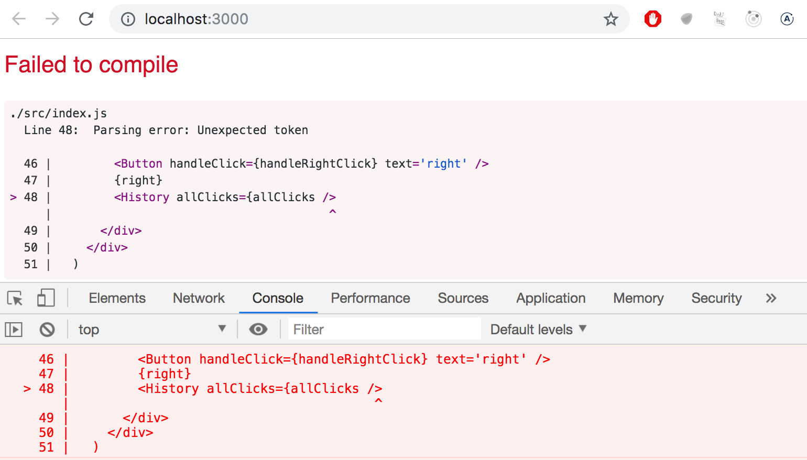

don't write more code but rather find and fix the problem **immediately**. There has yet to be a moment in the history of coding where code that fails to compile would miraculously start working after writing large amounts of additional code. I highly doubt that such an event will transpire during this course either.

Old school, print-based debugging is always a good idea. If the component

```js
const Button = ({ onClick, text }) => (
  <button onClick={onClick}>
    {text}
  </button>
)
```

is not working as intended, it's useful to start printing its variables out to the console. In order to do this effectively, we must transform our function into the less compact form and receive the entire props object without destructuring it immediately:

```js
const Button = (props) => { 
  console.log(props) // highlight-line
  const { onClick, text } = props
  return (
    <button onClick={onClick}>
      {text}
    </button>
  )
}
```

This will immediately reveal if, for instance, one of the attributes has been misspelled when using the component.

**NB** When you use _console.log_ for debugging, don't combine _objects_ in a Java-like fashion by using the plus operator. Instead of writing:

```js
console.log('props value is ' + props)
```

Separate the things you want to log to the console with a comma:

```js
console.log('props value is', props)
```

If you use the Java-like way of concatenating a string with an object, you will end up with a rather uninformative log message:

```js
props value is [Object object]
```

Whereas the items separated by a comma will all be available in the browser console for further inspection.

Logging to the console is by no means the only way of debugging our applications. You can pause the execution of your application code in the Chrome developer console's <i>debugger</i>, by writing the command [debugger](https://developer.mozilla.org/en-US/docs/Web/JavaScript/Reference/Statements/debugger) anywhere in your code.

The execution will pause once it arrives at a point where the _debugger_ command gets executed:

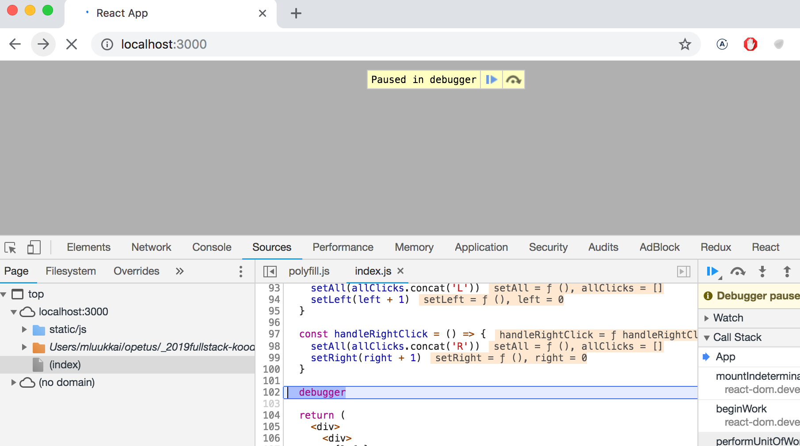

By going to the <i>Console</i> tab, it is easy to inspect the current state of variables:

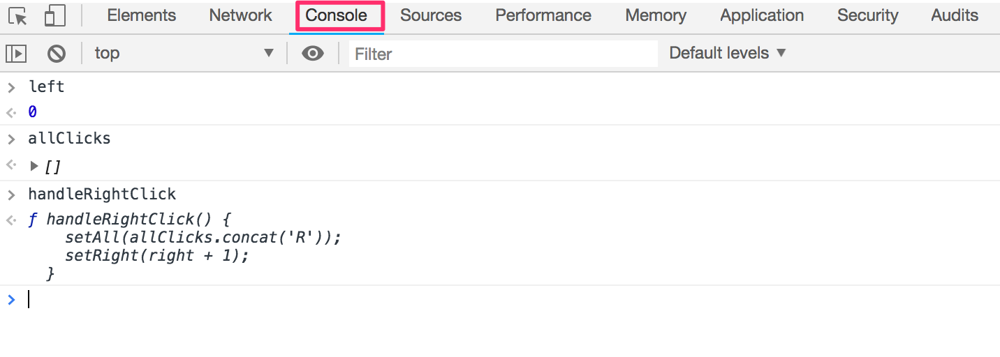

Once the cause of the bug is discovered you can remove the _debugger_ command and refresh the page.

The debugger also enables us to execute our code line by line with the controls found on the right-hand side of the <i>Sources</i> tab.

You can also access the debugger without the _debugger_ command by adding breakpoints in the <i>Sources</i> tab. Inspecting the values of the component's variables can be done in the _Scope_-section:

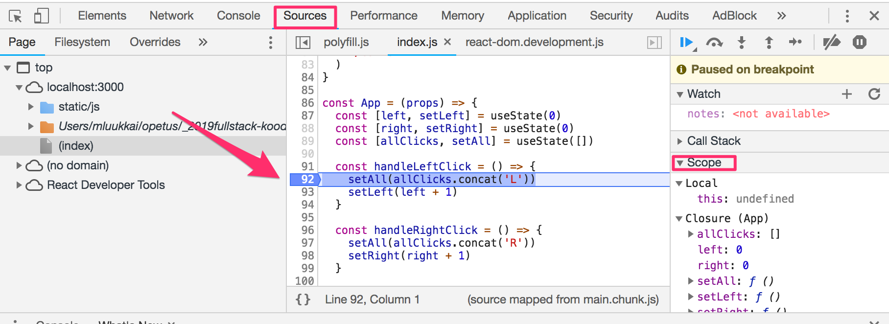

It is highly recommended to add the [React developer tools](https://chrome.google.com/webstore/detail/react-developer-tools/fmkadmapgofadopljbjfkapdkoienihi) extension to Chrome. It adds a new _Components_ tab to the developer tools. The new developer tools tab can be used to inspect the different React elements in the application, along with their state and props:

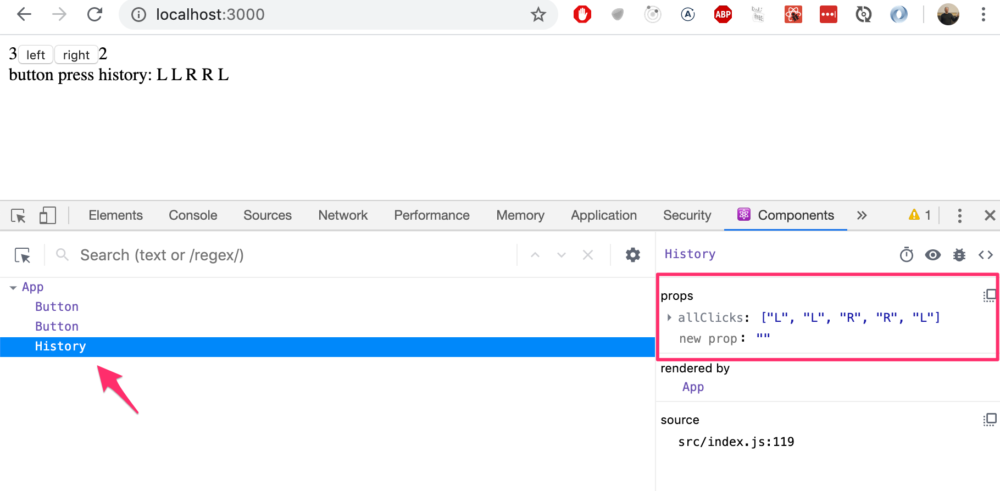


The _App_ component's state is defined like so:

```js
const [left, setLeft] = useState(0)
const [right, setRight] = useState(0)
const [allClicks, setAll] = useState([])
```

Dev tools shows the state of hooks in the order of their definition:

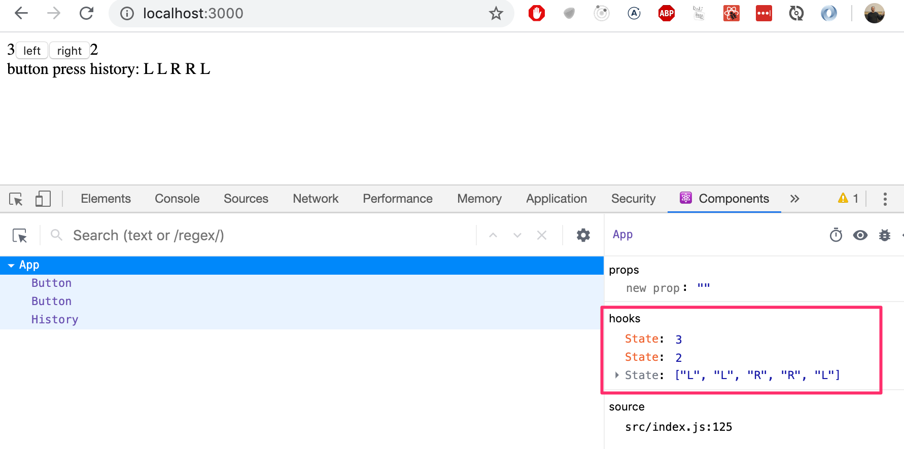

The first <i>State</i> contains the value of the <i>left</i> state, the next contains the value of the <i>right</i> state and the last contains the value of the <i>allClicks</i> state.

### Rules of Hooks

There are a few limitations and rules we have to follow to ensure that our application uses hooks-based state functions correctly.

The _useState_ function (as well as the _useEffect_ function introduced later on in the course) <i>must not be called</i> from inside of a loop, a conditional expression, or any place that is not a function defining a component. This must be done to ensure that the hooks are always called in the same order, and if this isn't the case the application will behave erratically.

To recap, hooks may only be called from the inside of a function body that defines a React component:

```js
const App = () => {
  // these are ok
  const [age, setAge] = useState(0)
  const [name, setName] = useState('Juha Tauriainen')

  if ( age > 10 ) {
    // this does not work!
    const [foobar, setFoobar] = useState(null)
  }

  for ( let i = 0; i < age; i++ ) {
    // also this is not good
    const [rightWay, setRightWay] = useState(false)
  }

  const notGood = () => {
    // and this is also illegal
    const [x, setX] = useState(-1000)
  }

  return (
    //...
  )
}
```

### Event Handling Revisited

Event handling has proven to be a difficult topic in previous iterations of this course.

For this reason we will revisit the topic.

Let's assume that we're developing this simple application:
```js
const App = () => {
  const [value, setValue] = useState(10)

  return (
    <div>
      {value}
      <button>reset to zero</button>
    </div>
  )
}

ReactDOM.render(
  <App />, 
  document.getElementById('root')
)
```

We want the clicking of the button to reset the state stored in the _value_ variable.

In order to make the button react to a click event, we have to add an <i>event handler</i> to it.

Event handlers must always be a function or a reference to a function. The button will not work if the event handler is set to a variable of any other type.

If we were to define the event handler as a string:

```js
<button onClick="crap...">button</button>
```

React would warn us about this in the console:

```js
index.js:2178 Warning: Expected `onClick` listener to be a function, instead got a value of `string` type.
    in button (at index.js:20)
    in div (at index.js:18)
    in App (at index.js:27)
```

The following attempt would also not work:

```js
<button onClick={value + 1}>button</button>
```

We have attempted to set the event handler to _value + 1_ which simply returns the result of the operation. React will kindly warn us about this in the console:

```js
index.js:2178 Warning: Expected `onClick` listener to be a function, instead got a value of `number` type.
```

This attempt would not work either:
```js
<button onClick={value = 0}>button</button>
```

The event handler is not a function but a variable assignment, and React will once again issue a warning to the console. This attempt is also flawed in the sense that we must never mutate state directly in React.

What about the following:

```js
<button onClick={console.log('clicked the button')}>
  button
</button>
```

The message gets printed to the console once when the component is rendered but nothing happens when we click the button. Why does this not work even when our event handler contains a function _console.log_?

The issue here is that our event handler is defined as a <i>function call</i> which means that the event handler is actually assigned the returned value from the function, which in the case of _console.log_ is <i>undefined</i>.

The _console.log_ function call gets executed when the component is rendered and for this reason it gets printed once to the console.

The following attempt is flawed as well:
```js
<button onClick={setValue(0)}>button</button>
```

We have once again tried to set a function call as the event handler. This does not work. This particular attempt also causes another problem. When the component is rendered the function _setValue(0)_ gets executed which in turn causes the component to be re-rendered. Re-rendering in turn calls _setValue(0)_ again, resulting in an infinite recursion.

Executing a particular function call when the button is clicked can be accomplished like this:

```js
<button onClick={() => console.log('clicked the button')}>
  button
</button>
```

Now the event handler is a function defined with the arrow function syntax _() => console.log('clicked the button')_. When the component gets rendered, no function gets called and only the reference to the arrow function is set to the event handler. Calling the function happens only once the button is clicked.

We can implement resetting the state in our application with this same technique:

```js
<button onClick={() => setValue(0)}>button</button>
```

The event handler is now the function _() => setValue(0)_.

Defining event handlers directly in the attribute of the button is not necessarily the best possible idea.

You will often see event handlers defined in a separate place. In the following version of our application we define a function that then gets assigned to the _handleClick_ variable in the body of the component function:

```js
const App = () => {
  const [value, setValue] = useState(10)

  const handleClick = () =>
    console.log('clicked the button')

  return (
    <div>
      {value}
      <button onClick={handleClick}>button</button>
    </div>
  )
}
```

The _handleClick_ variable is now assigned to a reference to the function. The reference is passed to the button as the <i>onClick</i> attribute:

```js
<button onClick={handleClick}>button</button>
```

Naturally, our event handler function can be composed of multiple commands. In these cases we use the longer curly brace syntax for arrow functions:

```js
const App = () => {
  const [value, setValue] = useState(10)

  // highlight-start
  const handleClick = () => {
    console.log('clicked the button')
    setValue(0)
  }
   // highlight-end

  return (
    <div>
      {value}
      <button onClick={handleClick}>button</button>
    </div>
  )
}
```

### Function that returns a function

Another way to define an event handler is to use <i>function that returns a function</i>.

You probably won't need to use functions that return functions in any of the exercises in this course.  If the topic seems particularly confusing, you may skip over this section for now and return to it later.

Let's make the following changes to our code:

```js
const App = () => {
  const [value, setValue] = useState(10)

  // highlight-start
  const hello = () => {
    const handler = () => console.log('hello world')

    return handler
  }
  // highlight-end

  return (
    <div>
      {value}
      <button onClick={hello()}>button</button>
    </div>
  )
}
```

The code functions correctly even though it looks complicated. 

The event handler is now set to a function call:

```js
<button onClick={hello()}>button</button>
```

Earlier on we stated that an event handler may not be a call to a function, and that it has to be a function or a reference to a function. Why then does a function call work in this case?

When the component is rendered, the following function gets executed:

```js
const hello = () => {
  const handler = () => console.log('hello world')

  return handler
}
```

The <i>return value</i> of the function is another function that is assigned to the _handler_ variable.

When React renders the line:

```js
<button onClick={hello()}>button</button>
```

It assigns the return value of _hello()_ to the onClick attribute. Essentially the line gets transformed into:

```js
<button onClick={() => console.log('hello world')}>
  button
</button>
```

Since the _hello_ function returns a function, the event handler is now a function.

What's the point of this concept?

Let's change the code a tiny bit:

```js
const App = () => {
  const [value, setValue] = useState(10)

  // highlight-start
  const hello = (who) => {
    const handler = () => {
      console.log('hello', who)
    }

    return handler
  }
  // highlight-end  

  return (
    <div>
      {value}
  // highlight-start      
      <button onClick={hello('world')}>button</button>
      <button onClick={hello('react')}>button</button>
      <button onClick={hello('function')}>button</button>
  // highlight-end      
    </div>
  )
}
```

Now the application has three buttons with event handlers defined by the _hello_ function that accepts a parameter.

The first button is defined as

```js
<button onClick={hello('world')}>button</button>
```

The event handler is created by <i>executing</i> the function call _hello('world')_. The function call returns the function:

```js
() => {
  console.log('hello', 'world')
}
```

The second button is defined as:

```js
<button onClick={hello('react')}>button</button>
```

The function call _hello('react')_ that creates the event handler returns:

```js
() => {
  console.log('hello', 'react')
}
```

Both buttons get their own individualized event handlers.

Functions returning functions can be utilized in defining generic functionality that can be customized with parameters. The _hello_ function that creates the event handlers can be thought of as a factory that produces customized event handlers meant for greeting users.

Our current definition is slightly verbose:

```js
const hello = (who) => {
  const handler = () => {
    console.log('hello', who)
  }

  return handler
}
```

Let's eliminate the helper variables and directly return the created function:

```js
const hello = (who) => {
  return () => {
    console.log('hello', who)
  }
}
```

Since our _hello_ function is composed of a single return command, we can omit the curly braces and use the more compact syntax for arrow functions:

```js
const hello = (who) =>
  () => {
    console.log('hello', who)
  }
```

Lastly, let's write all of the arrows on the same line:

```js
const hello = (who) => () => {
  console.log('hello', who)
}
```

We can use the same trick to define event handlers that set the state of the component to a given value. Let's make the following changes to our code:

```js
const App = () => {
  const [value, setValue] = useState(10)
  
  // highlight-start
  const setToValue = (newValue) => () => {
    setValue(newValue)
  }
  // highlight-end
  
  return (
    <div>
      {value}
      // highlight-start
      <button onClick={setToValue(1000)}>thousand</button>
      <button onClick={setToValue(0)}>reset</button>
      <button onClick={setToValue(value + 1)}>increment</button>
      // highlight-end
    </div>
  )
}
```

When the component is rendered, the <i>thousand</i> button is created:

```js
<button onClick={setToValue(1000)}>thousand</button>
```

The event handler is set to the return value of _setToValue(1000)_ which is the following function:

```js
() => {
  setValue(1000)
}
```

The increase button is declared as follows:

```js
<button onClick={setToValue(value + 1)}>increment</button>
```

The event handler is created by the function call _setToValue(value + 1)_ which receives as its parameter the current value of the state variable _value_ increased by one. If the value of _value_ was 10, then the created event handler would be the function:

```js
() => {
  setValue(11)
}
```

Using functions that return functions is not required to achieve this functionality. Let's return the _setToValue_ function that is responsible for updating state, into a normal function:

```js
const App = () => {
  const [value, setValue] = useState(10)

  const setToValue = (newValue) => {
    setValue(newValue)
  }

  return (
    <div>
      {value}
      <button onClick={() => setToValue(1000)}>
        thousand
      </button>
      <button onClick={() => setToValue(0)}>
        reset
      </button>
      <button onClick={() => setToValue(value + 1)}>
        increment
      </button>
    </div>
  )
}
```

We can now define the event handler as a function that calls the _setToValue_ function with an appropriate parameter. The event handler for resetting the application state would be:

```js
<button onClick={() => setToValue(0)}>reset</button>
```

Choosing between the two presented ways of defining your event handlers is mostly a matter of taste.

### Passing Event Handlers to Child Components

Let's extract the button into its own component:

```js
const Button = (props) => (
  <button onClick={props.handleClick}>
    {props.text}
  </button>
)
```

The component gets the event handler function from the _handleClick_ prop, and the text of the button from the _text_ prop.

Using the <i>Button</i> component is simple, although we have to make sure that we use the correct attribute names when passing props to the component.

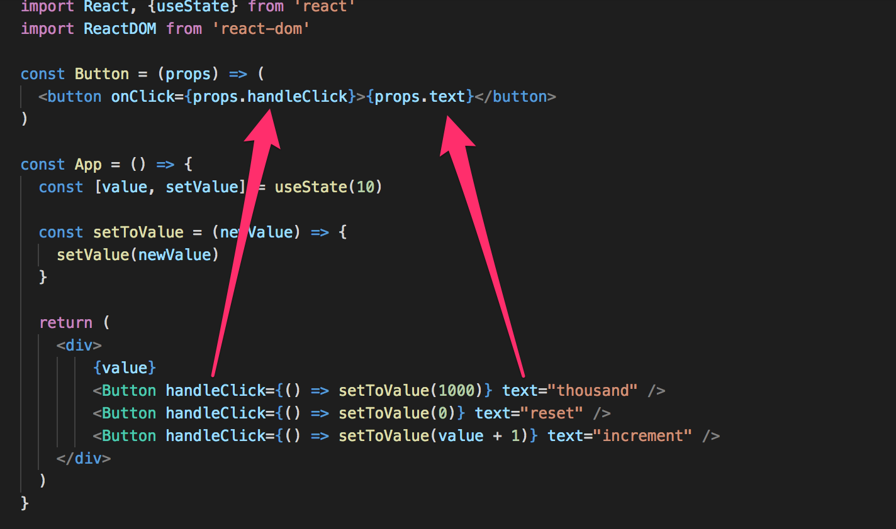

### Do Not Define Components Within Components

Let's start displaying the value of the application into its own <i>Display</i> component.

We will change the application by defining a new component inside of the <i>App</i>-component.

```js
// This is the right place to define a component
const Button = (props) => (
  <button onClick={props.handleClick}>
    {props.text}
  </button>
)

const App = () => {
  const [value, setValue] = useState(10)

  const setToValue = newValue => {
    setValue(newValue)
  }

  // Do not define components inside another component
  const Display = props => <div>{props.value}</div> // highlight-line

  return (
    <div>
      <Display value={value} />
      <Button handleClick={() => setToValue(1000)} text="thousand" />
      <Button handleClick={() => setToValue(0)} text="reset" />
      <Button handleClick={() => setToValue(value + 1)} text="increment" />
    </div>
  )
}
```

The application still appears to work, but **don't implement components like this!** Never define components inside of other components. The method provides no benefits and leads to many unpleasant problems. The biggest problems are due to the fact that React treats a component defined inside of another component as a new component in every render. This makes it impossible for React to optimize the component.

Let's instead move the <i>Display</i> component function to its correct place, which is outside of the <i>App</i> component function:

```js
const Display = props => <div>{props.value}</div>

const Button = (props) => (
  <button onClick={props.handleClick}>
    {props.text}
  </button>
)

const App = () => {
  const [value, setValue] = useState(10)

  const setToValue = newValue => {
    setValue(newValue)
  }

  return (
    <div>
      <Display value={value} />
      <Button handleClick={() => setToValue(1000)} text="thousand" />
      <Button handleClick={() => setToValue(0)} text="reset" />
      <Button handleClick={() => setToValue(value + 1)} text="increment" />
    </div>
  )
}
```

### Useful Reading

The internet is full of React-related material. However, we use such a new style of React that a large majority of the material found online is outdated for our purposes.

You may find the following links useful:

- The React [official documentation](https://reactjs.org/docs/hello-world.html) is worth checking out at some point, although most of it will become relevant only later on in the course. Also, everything related to class-based components is irrelevant to us;
- Some courses on [Egghead.io](https://egghead.io) like [Start learning React](https://egghead.io/courses/start-learning-react) are of high quality, and recently updated [The Beginner's Guide to React](https://egghead.io/courses/the-beginner-s-guide-to-reactjs) is also relatively good; both courses introduce concepts that will also be introduced later on in this course. **NB** The first one uses class components but the latter uses the new functional ones.

</div>

<div class="tasks">
  <h3>Exercises  1.6.-1.14.</h3>

Submit your solutions to the exercises by first pushing your code to GitHub and then marking the completed exercises into the [exercise submission system](https://studies.cs.helsinki.fi/stats/courses/fullstackopen).

Remember, submit **all** the exercises of one part **in a single submission**. Once you have submitted your solutions for one part, **you cannot submit more exercises to that part any more**.

<i>Some of the exercises work on the same application. In these cases, it is sufficient to submit just the final version of the application. If you wish, you can make a commit after every finished exercise, but it is not mandatory.</i>

**WARNING** create-react-app will automatically turn your project into a git-repository unless you create your application inside of an existing git repository. **Most likely you do not want each of your projects to be a separate repository**, so simply run the _rm -rf .git_ command at the root of your application.

In some situations you may also have to run the command below from the root of the project:

``` 
rm -rf node_modules/ && npm i
```

  <h4> 1.6: unicafe step1</h4>

Like most companies, [Unicafe](https://www.unicafe.fi/#/9/4) collects feedback from its customers. Your task is to implement a web application for collecting customer feedback. There are only three options for feedback: <i>good</i>, <i>neutral</i>, and <i>bad</i>.

The application must display the total number of collected feedback for each category. Your final application could look like this:

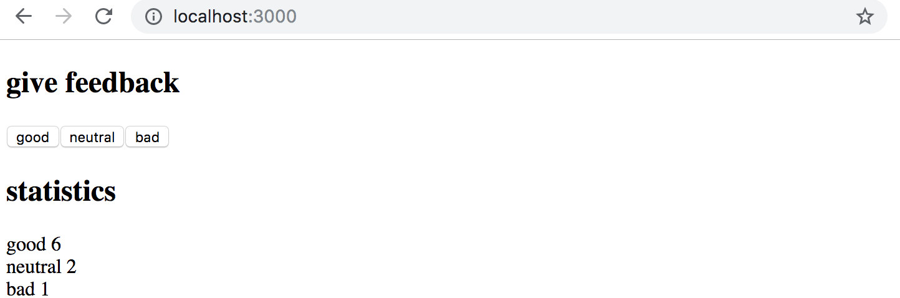

Note that your application needs to work only during a single browser session. Once you refresh the page, the collected feedback is allowed to disappear.

You can implement the application in a single <i>index.js</i> file. You can use the code below as a starting point for your application.

```js
import React, { useState } from 'react'
import ReactDOM from 'react-dom'

const App = () => {
  // save clicks of each button to its own state
  const [good, setGood] = useState(0)
  const [neutral, setNeutral] = useState(0)
  const [bad, setBad] = useState(0)

  return (
    <div>
      code here
    </div>
  )
}

ReactDOM.render(<App />, 
  document.getElementById('root')
)
```

<h4>1.7: unicafe step2</h4>

Expand your application so that it shows more statistics about the gathered feedback: the total number of collected feedback, the average score (good: 1, neutral: 0, bad: -1) and the percentage of positive feedback.

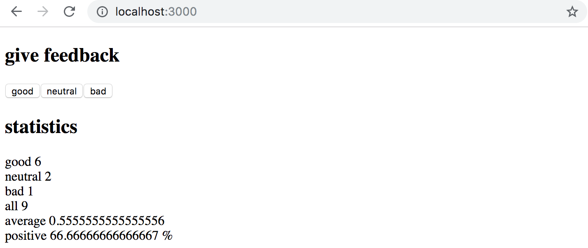

<h4>1.8: unicafe step3</h4>

Refactor your application so that displaying the statistics is extracted into its own <i>Statistics</i> component. The state of the application should remain in the <i>App</i> root component.

Remember that components should not be defined inside other components:

```js
// a proper place to define a component
const Statistics = (props) => {
  // ...
}

const App = () => {
  const [good, setGood] = useState(0)
  const [neutral, setNeutral] = useState(0)
  const [bad, setBad] = useState(0)

  // do not define a component within another component
  const Statistics = (props) => {
    // ...
  }

  return (
    // ...
  )
}
```

<h4>1.9: unicafe step4</h4>

Change your application to display statistics only once feedback has been gathered.

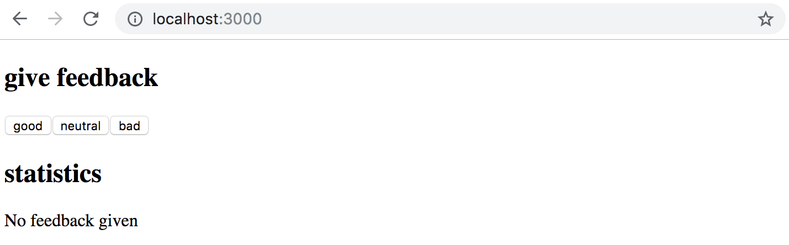

<h4>1.10: unicafe step5</h4>

Let's continue refactoring the application. Extract the following two components:

- <i>Button</i> for defining the buttons used for submitting feedback
- <i>Statistic</i> for displaying a single statistic, e.g. the average score.

To be clear: the <i>Statistic</i> component always displays a single statistic, meaning that the application uses multiple components for rendering all of the statistics:

```js
const Statistics = (props) => {
  /// ...
  return(
    <div>
      <Statistic text="good" value ={...} />
      <Statistic text="neutral" value ={...} />
      <Statistic text="bad" value ={...} />
      // ...
    </div>
  )
}

```

The application's state should still be kept in the root <i>App</i> component.

<h4>1.11*: unicafe step6</h4>

Display the statistics in an HTML [table](https://developer.mozilla.org/en-US/docs/Learn/HTML/Tables/Basics), so that your application looks roughly like this:


Remember to keep your console open at all times. If you see this warning in your console:

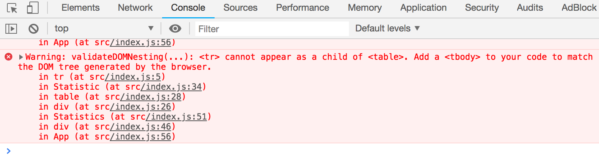

Then perform the necessary actions to make the warning disappear. Try Googling the error message if you get stuck.

<i>Typical source of an error `Unchecked runtime.lastError: Could not establish connection. Receiving end does not exist.` is Chrome extension. Try going to `chrome://extensions/` and try disabling them one by one and refreshing React app page; the error should eventually disappear.</i>

**Make sure that from now on you don't see any warnings in your console!**

<h4>1.12*: anecdotes step1</h4>

The world of software engineering is filled with [anecdotes](http://www.comp.nus.edu.sg/~damithch/pages/SE-quotes.htm) that distill timeless truths from our field into short one-liners.

Expand the following application by adding a button that can be clicked to display a <i>random</i> anecdote from the field of software engineering: 

```js
import React, { useState } from 'react'
import ReactDOM from 'react-dom'

const App = (props) => {
  const [selected, setSelected] = useState(0)

  return (
    <div>
      {props.anecdotes[selected]}
    </div>
  )
}

const anecdotes = [
  'If it hurts, do it more often',
  'Adding manpower to a late software project makes it later!',
  'The first 90 percent of the code accounts for the first 90 percent of the development time...The remaining 10 percent of the code accounts for the other 90 percent of the development time.',
  'Any fool can write code that a computer can understand. Good programmers write code that humans can understand.',
  'Premature optimization is the root of all evil.',
  'Debugging is twice as hard as writing the code in the first place. Therefore, if you write the code as cleverly as possible, you are, by definition, not smart enough to debug it.'
]

ReactDOM.render(
  <App anecdotes={anecdotes} />,
  document.getElementById('root')
)
```

Google will tell you how to generate random numbers in JavaScript. Remember that you can test generating random numbers e.g. straight in the console of your browser.

Your finished application could look something like this:

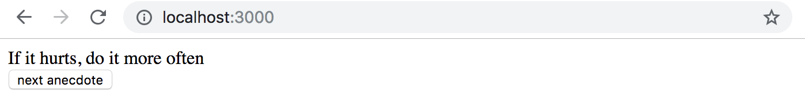

**WARNING** create-react-app will automatically turn your project into a git-repository unless you create your application inside of an existing git repository. **Most likely you do not want each of your projects to be a separate repository**, so simply run the _rm -rf .git_ command at the root of your application.

<h4>1.13*: anecdotes step2</h4>

Expand your application so that you can vote for the displayed anecdote.

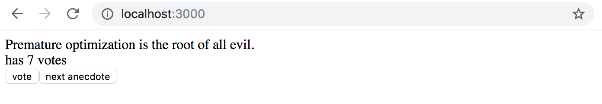

**NB** store the votes of each anecdote into an array or object in the component's state. Remember that the correct way of updating state stored in complex data structures like objects and arrays is to make a copy of the state.

You can create a copy of an object like this:

```js
const points = { 0: 1, 1: 3, 2: 4, 3: 2 }

const copy = { ...points }
// increment the property 2 value by one
copy[2] += 1     
```

OR a copy of an array like this:

```js
const points = [1, 4, 6, 3]

const copy = [...points]
// increment the value in position 2 by one
copy[2] += 1     
```

Using an array might be the simpler choice in this case. Googling will provide you with lots of hints on how to create a zero-filled array of a desired length, like [this](https://stackoverflow.com/questions/20222501/how-to-create-a-zero-filled-javascript-array-of-arbitrary-length/22209781).

<h4>1.14*: anecdotes step3</h4>

Now implement the final version of the application that displays the anecdote with the largest number of votes:

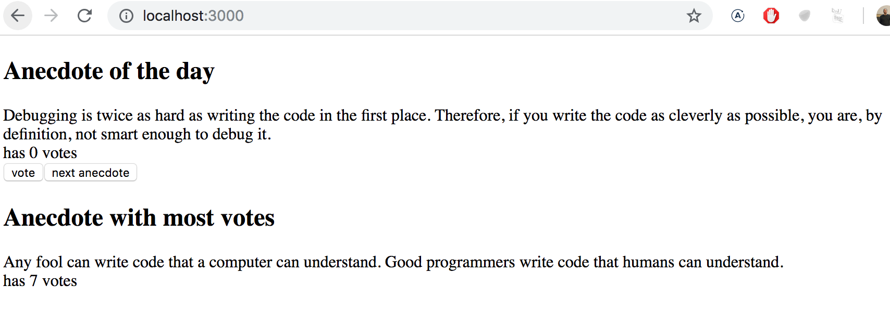

If multiple anecdotes are tied for first place it is sufficient to just show one of them.

This was the last exercise for this part of the course and it's time to push your code to GitHub and mark all of your finished exercises to the [exercise submission system](https://studies.cs.helsinki.fi/stats/courses/fullstackopen).

</div>
