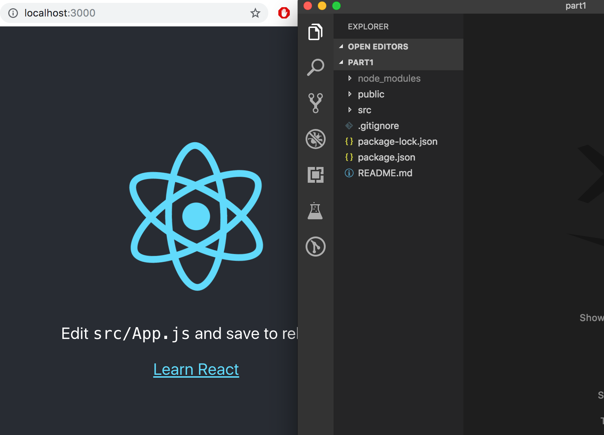
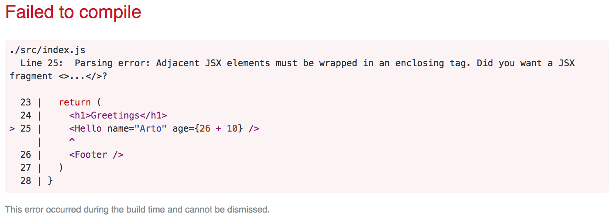

<div class="content">

Alamme nyt tutustua kurssin ehkä tärkeimpään teemaan, [React](https://reactjs.org/)-kirjastoon. Tehdään heti yksinkertainen React-sovellus ja tutustutaan samalla Reactin peruskäsitteistöön.

Ehdottomasti helpoin tapa päästä alkuun on [create-react-app](https://github.com/facebookincubator/create-react-app)-nimisen työkalun käyttö. <i>create-react-app</i> on mahdollista asentaa omalle koneelle, mutta asennukseen ei ole tarvetta jos Noden mukana asentunut <i>npm</i>-työkalu on versioltaan vähintään <i>5.3</i>. Tällöin npm:n mukana asentuu komento </i>npx</i>, joka mahdollistaa create-react-app:in käytön asentamatta sitä erikseen. Npm:n version saa selville komennolla <em>npm -v</em>.

Luodaan sovellus nimeltään <i>part1</i> ja mennään sovelluksen sisältämään hakemistoon:

```bash
$ npx create-react-app part1
$ cd part1
```

Kaikki tässä (ja jatkossa) annettavat merkillä <em>$</em> alkavat komennot on kirjoitettu terminaaliin eli komentoriville. Merkkiä <em>$</em> ei tule kirjoittaa, sillä se edustaa komentokehotetta.

Sovellus käynnistetään seuraavasti

```bash
$ npm start
```

Sovellus käynnistyy oletusarvoisesti localhostin porttiin 3000, eli osoitteeseen <http://localhost:3000>

Chromen pitäisi aueta automaattisesti. Avaa konsoli **välittömästi**. Avaa myös tekstieditori siten, että näet koodin ja web-sivun samaan aikaan ruudulla:



Sovelluksen koodi on hakemistossa <i>src</i>. Yksinkertaistetaan valmiina olevaa koodia siten, että tiedoston <i>index.js</i> sisällöksi tulee:

```js
import React from 'react'
import ReactDOM from 'react-dom'

const App = () => (
  <div>
    <p>Hello world</p>
  </div>
)

ReactDOM.render(<App />, document.getElementById('root'))
```

Tiedostot <i>App.js</i>, <i>App.css</i>, <i>App.test.js</i>, <i>logo.svg</i> ja <i>reportWebVitals.js</i> voi poistaa sillä niitä emme sovelluksessamme nyt tarvitse.

### Komponentti

Tiedosto <i>index.js</i> määrittelee nyt React-[komponentin](https://reactjs.org/docs/components-and-props.html) nimeltään <i>App</i> ja viimeisen rivin komento

```js
ReactDOM.render(<App />, document.getElementById('root'))
```

renderöi komponentin sisällön tiedoston <i>public/index.html</i> määrittelemään <i>div</i>-elementtiin, jonka <i>id:n</i> arvona on 'root'.

Tiedosto <i>public/index.html</i> on oleellisesti ottaen tyhjä, voit kokeilla lisätä sinne HTML:ää. Reactilla ohjelmoitaessa yleensä kuitenkin kaikki renderöitävä sisältö määritellään Reactin komponenttien avulla.

Tarkastellaan vielä tarkemmin komponentin määrittelevää koodia:

```js
const App = () => (
  <div>
    <p>Hello world</p>
  </div>
)
```

Kuten arvata saattaa, komponentti renderöityy <i>div</i>-tagina, jonka sisällä on <i>p</i>-tagin sisällä oleva teksti <i>Hello world</i>.

Teknisesti ottaen komponentti on määritelty Javascript-funktiona. Seuraava siis on funktio (joka ei saa yhtään parametria):

```js
() => (
  <div>
    <p>Hello world</p>
  </div>
)
```

joka sijoitetaan vakioarvoiseen muuttujaan <i>App</i>

```js
const App = ...
```

Javascriptissa on muutama tapa määritellä funktioita. Käytämme nyt Javascriptin hieman uudemman version [EcmaScript 6:n](http://es6-features.org/#Constants) eli ES6:n [nuolifunktiota](https://developer.mozilla.org/en-US/docs/Web/JavaScript/Reference/Functions/Arrow_functions) (arrow functions).

Koska funktio koostuu vain yhdestä lausekkeesta, on käytössämme lyhennysmerkintä, joka vastaa oikeasti seuraavaa koodia:

```js
const App = () => {
  return (
    <div>
      <p>Hello world</p>
    </div>
  )
}
```

eli funktio palauttaa sisältämänsä lausekkeen arvon.

Komponentin määrittelevä funktio voi sisältää mitä tahansa Javascript-koodia. Muuta komponenttisi seuraavaan muotoon ja katso mitä konsolissa tapahtuu:

```js
const App = () => {
  console.log('Hello from komponentti')
  return (
    <div>
      <p>Hello world</p>
    </div>
  )
}
```

Komponenttien sisällä on mahdollista renderöidä myös dynaamista sisältöä.

Muuta komponentti muotoon:

```js
const App = () => {
  const now = new Date()
  const a = 10
  const b = 20

  return (
    <div>
      <p>Hello world, it is {now.toString()}</p>
      <p>
        {a} plus {b} is {a + b}
      </p>
    </div>
  )
}
```

Aaltosulkeiden sisällä oleva Javascript-koodi evaluoidaan ja evaluoinnin tulos upotetaan määriteltyyn kohtaan komponentin tuottamaa HTML-koodia.

### JSX

Näyttää siltä, että React-komponentti palauttaa HTML-koodia. Näin ei kuitenkaan ole. React-komponenttien ulkoasu kirjoitetaan yleensä [JSX](https://reactjs.org/docs/introducing-jsx.html):ää käyttäen. Vaikka JSX näyttää HTML:ltä, kyseessä on kuitenkin tapa kirjoittaa Javascriptiä. React komponenttien palauttama JSX käännetään konepellin alla Javascriptiksi.

Käännösvaiheen jälkeen ohjelmamme näyttää seuraavalta:

```js
import React from 'react'
import ReactDOM from 'react-dom'

const App = () => {
  const now = new Date()
  const a = 10
  const b = 20
  return React.createElement(
    'div',
    null,
    React.createElement(
      'p', null, 'Hello world, it is ', now.toString()
    ),
    React.createElement(
      'p', null, a, ' plus ', b, ' is ', a + b
    )
  )
}

ReactDOM.render(
  React.createElement(App, null),
  document.getElementById('root')
)
```

Käännöksen hoitaa [Babel](https://babeljs.io/repl/). Create-react-app:illa luoduissa projekteissa käännös on konfiguroitu tapahtumaan automaattisesti. Tulemme tutustumaan aiheeseen tarkemmin kurssin [osassa 7](/osa7).

Reactia olisi myös mahdollista kirjoittaa "suoraan Javascriptinä" käyttämättä JSX:ää. Kukaan täysijärkinen ei kuitenkaan niin tee.

Käytännössä JSX on melkein kuin HTML:ää sillä erotuksella, että mukaan voi upottaa helposti dynaamista sisältöä kirjoittamalla sopivaa Javascriptiä aaltosulkeiden sisälle. Idealtaan JSX on melko lähellä monia palvelimella käytettäviä templating-kieliä kuten Java Springin yhteydessä käytettävää thymeleafia.

JSX on "XML:n kaltainen", eli jokainen tagi tulee sulkea. Esimerkiksi rivinvaihto on tyhjä elementti, joka voidaan kirjoittaa HTML:ssä seuraavasti

```html
<br>
```

mutta JSX:ää kirjoittaessa tagi on pakko sulkea:

```html
<br />
```

### Monta komponenttia

Muutetaan sovellusta seuraavasti (yläreunan importit jätetään <i>esimerkeistä</i> nyt ja jatkossa pois, niiden on kuitenkin oltava koodissa jotta ohjelma toimisi):

```js
// highlight-start
const Hello = () => {
  return (
    <div>
      <p>Hello world</p>
    </div>
  )
}
// highlight-end

const App = () => {
  return (
    <div>
      <h1>Greetings</h1>
      <Hello /> // highlight-line
    </div>
  )
}

ReactDOM.render(<App />, document.getElementById('root'))
```

Olemme määritelleet uuden komponentin <i>Hello</i>, jota käytetään komponentista <i>App</i>. Komponenttia voidaan luonnollisesti käyttää monta kertaa:

```js
const App = () => {
  return (
    <div>
      <h1>Greetings</h1>
      <Hello />
      // highlight-start
      <Hello />
      <Hello />
      // highlight-end
    </div>
  )
}
```

Komponenttien tekeminen Reactissa on helppoa ja komponentteja yhdistelemällä monimutkaisempikin sovellus on mahdollista pitää kohtuullisesti ylläpidettävänä. Reactissa filosofiana onkin koostaa sovellus useista, pieneen asiaan keskittyvistä uudelleenkäytettävistä komponenteista.

Vahva konventio on myös se, että sovelluksen ylimpänä oleva <i>juurikomponentti</i> on nimeltään <i>App</i>. Tosin kuten [osassa 6](/osa6) tulemme näkemään on tilanteita, joissa komponentti <i>App</i> ei ole suoraan juuressa, vaan se kääritään sopivan apukomponentin sisään.  

### props: tiedonvälitys komponenttien välillä

Komponenteille on mahdollista välittää dataa [propsien](https://reactjs.org/docs/components-and-props.html) avulla.

Muutetaan komponenttia <i>Hello</i> seuraavasti

```js
const Hello = (props) => { // highlight-line
  return (
    <div>
      <p>Hello {props.name}</p> // highlight-line
    </div>
  )
}
```

komponentin määrittelevällä funktiolla on nyt parametri <i>props</i>. Parametri saa arvokseen olion, jonka kenttinä ovat kaikki eri "propsit", jotka komponentin käyttäjä määrittelee.

Propsit määritellään seuraavasti:

```js
const App = () => {
  return (
    <div>
      <h1>Greetings</h1>
      <Hello name="Maya" /> // highlight-line
      <Hello name="Pekka" /> // highlight-line
    </div>
  )
}
```

Propseja voi olla mielivaltainen määrä ja niiden arvot voivat olla "kovakoodattuja" merkkijonoja tai Javascript-lausekkeiden tuloksia. Jos propsin arvo muodostetaan Javascriptillä, tulee se olla aaltosulkeissa.

Muutetaan koodia siten, että komponentti <i>Hello</i> käyttää kahta propsia:

```js
const Hello = (props) => {
  return (
    <div>
      <p>
        Hello {props.name}, you are {props.age} years old // highlight-line
      </p>
    </div>
  )
}

const App = () => {
  const nimi = 'Pekka' // highlight-line
  const ika = 10       // highlight-line

  return (
    <div>
      <h1>Greetings</h1>
      <Hello name="Maya" age={26 + 10} /> // highlight-line
      <Hello name={nimi} age={ika} />     // highlight-line
    </div>
  )
}
```

Komponentti <i>App</i> lähettää propseina muuttujan arvoja, summalausekkeen evaluoinnin tuloksen ja normaalin merkkijonon.

### Muutamia huomioita

React on konfiguroitu antamaan varsin hyviä virheilmoituksia. Kannattaa kuitenkin edetä ainakin alussa **todella pienin askelin** ja varmistaa, että jokainen muutos toimii halutulla tavalla.

**Konsolin tulee olla koko ajan auki**. Jos selain ilmoittaa virheestä, ei kannata kirjoittaa sokeasti lisää koodia ja toivoa ihmettä tapahtuvaksi, vaan tulee yrittää ymmärtää virheen syy ja esim. palata edelliseen toimivaan tilaan:


Kannattaa myös muistaa, että React-koodissakin on mahdollista ja kannattavaa lisätä koodin sekaan sopivia konsoliin tulostavia <em>console.log()</em>-komentoja. Tulemme hieman [myöhemmin](#react-sovellusten-debuggaus) tutustumaan muutamiin muihinkin tapoihin debugata Reactia.

Kannattaa pitää mielessä, että **React-komponenttien nimien tulee alkaa isolla kirjaimella**. Jos yrität määritellä komponentin seuraavasti:

```js
const footer = () => {
  return (
    <div>
      greeting app created by 
      <a href="https://github.com/mluukkai">mluukkai</a>
    </div>
  )
}
```

ja ottaa se käyttöön

```js
const App = () => {
  return (
    <div>
      <h1>Greetings</h1>
      <Hello name="Maya" age={26 + 10} />
      <footer /> // highlight-line
    </div>
  )
}
```

sivulle ei kuitenkaan ilmesty näkyviin Footer-komponentissa määriteltyä sisältöä, vaan React luo sivulle ainoastaan tyhjän <i>footer</i>-elementin. Jos muutat komponentin nimen alkamaan isolla kirjaimella, React luo sivulle <i>div</i>-elementin, joka määriteltiin Footer-komponentissa.

Kannattaa myös pitää mielessä, että React-komponentin sisällön tulee (yleensä) sisältää **yksi juurielementti**. Eli jos yrittäisimme määritellä komponentin <i>App</i> ilman uloimmaista <i>div</i>-elementtiä:

```js
const App = () => {
  return (
    <h1>Greetings</h1>
    <Hello name="Maya" age={26 + 10} />
    <Footer />
  )
}
```

seurauksena on virheilmoitus:



Juurielementin käyttö ei ole ainoa toimiva vaihtoehto, myös <i>taulukollinen</i> komponentteja on validi tapa:

```js
const App = () => {
  return [
    <h1>Greetings</h1>,
    <Hello name="Maya" age={26 + 10} />,
    <Footer />
  ]
}
```

Määritellessä sovelluksen juurikomponenttia, tämä ei kuitenkaan ole järkevää ja näyttää koodissakin pahalta.

Juurielementin pakollisesta käytöstä on se seuraus, että sovelluksen DOM-puuhun tulee "ylimääräisiä" div-elementtejä. Tämä on mahdollista välttää käyttämällä [fragmentteja](https://reactjs.org/docs/fragments.html#short-syntax), eli ympäröimällä komponentin palauttamat elementit tyhjällä elementillä:

```js
const App = () => {
  const name = 'Pekka'
  const age = 10

  return (
    <>
      <h1>Greetings</h1>
      <Hello name="Maya" age={26 + 10} />
      <Hello name={name} age={age} />
      <Footer />
    </>
  )
}
```

Nyt käännös menee läpi ja Reactin generoimaan DOM:iin ei tule ylimääräistä div-elementtiä.

</div>

<div class="tasks">
  <h3>Tehtävät 1.1-1.2</h3>

Tehtävät palautetaan GitHubin kautta ja merkitsemällä tehdyt tehtävät [palautussovellukseen](https://studies.cs.helsinki.fi/stats/courses/fullstackopen).

Voit palauttaa kurssin kaikki tehtävät samaan repositorioon, tai käyttää useita repositorioita. Jos palautat eri osien tehtäviä samaan repositorioon, käytä järkevää hakemistojen nimentää.  Jos käytät privaattirepositorioa tehtävien palautukseen liitä repositoriolle collaboratoriksi <i>mluukkai</i>

Eräs varsin toimiva hakemistorakenne palautusrepositoriolle on [tässä esimerkkirepositoriossa käytetty tapa](https://github.com/fullstack-hy2020/palauitusrepositorio), jossa kutakin osaa kohti on oma hakemistonsa, joka vielä jakautuu tehtäväsarjat (esim. osan 1 <i>kurssitiedot</i>) sisältäviin hakemistoihin:

```
osa0
osa1
  kurssitiedot
  unicafe
  anekdootit
osa2
  puhelinluettelo
  maiden_tiedot
```

Kunkin tehtäväsarjan ohjelmasta kannattaa palauttaa kaikki sovelluksen sisältämät tiedostot (paitsi hakemisto <i>node\_modules</i>).

Tehtävät palautetaan **yksi osa kerrallaan**. Kun olet palauttanut osan tehtävät, et voi enää palauttaa saman osan tekemättä jättämiäsi tehtäviä.

Huomaa, että tässä osassa on muitakin tehtäviä kuin allaolevat, eli <i>älä tee palautusta</i> ennen kun olet tehnyt osan tehtävistä kaikki mitkä haluat palauttaa.

**Vinkki:** Kun olet avaamassa tehtävääsi Visual Studio Codella, huomaathan avata koko projektin kansion editoriin. Tämä mahdollistaa editorissa helpomman tiedostojen välillä siirtymisen ja paremmat automaattiset täydennykset. Saat tämän tehtyä siirtymällä terminaalissa projektin kansioon ja suorittamalla komennon:

```bash
$ code .
```

  <h4>1.1: kurssitiedot, step1</h4>

<i>Tässä tehtävässä aloitettavaa ohjelmaa kehitellään eteenpäin muutamassa seuraavassa tehtävässä. Tässä ja kurssin aikana muissakin vastaantulevissa tehtäväsarjoissa ohjelman lopullisen version palauttaminen riittää, voit toki halutessasi tehdä commitin jokaisen tehtävän jälkeisestä tilanteesta, mutta se ei ole välttämätöntä.</i>

Luo create-react-app:illa uusi sovellus. Muuta <i>index.js</i> muotoon

```js
import React from 'react'
import ReactDOM from 'react-dom'

const App = () => {
  const course = 'Half Stack application development'
  const part1 = 'Fundamentals of React'
  const exercises1 = 10
  const part2 = 'Using props to pass data'
  const exercises2 = 7
  const part3 = 'State of a component'
  const exercises3 = 14

  return (
    <div>
      <h1>{course}</h1>
      <p>
        {part1} {exercises1}
      </p>
      <p>
        {part2} {exercises2}
      </p>
      <p>
        {part3} {exercises3}
      </p>
      <p>Number of exercises {exercises1 + exercises2 + exercises3}</p>
    </div>
  )
}

ReactDOM.render(<App />, document.getElementById('root'))
```

ja poista ylimääräiset tiedostot (App.js, App.css, App.test.js, logo.svg, reportWebVitals.js).

Koko sovellus on nyt ikävästi yhdessä komponentissa. Refaktoroi sovelluksen koodi siten, että se koostuu kolmesta uudesta komponentista: <i>Header</i>, <i>Content</i> ja <i>Total</i>. Kaikki data pidetään edelleen komponentissa <i>App</i>, joka välittää tarpeelliset tiedot kullekin komponentille <i>props:ien</i> avulla. <i>Header</i> huolehtii kurssin nimen renderöimisestä, <i>Content</i> osista ja niiden tehtävämääristä ja <i>Total</i> tehtävien yhteismäärästä.

Komponentin <i>App</i> runko tulee olemaan suunnilleen seuraavanlainen:

```js
const App = () => {
  // const-määrittelyt

  return (
    <div>
      <Header course={course} />
      <Content ... />
      <Total ... />
    </div>
  )
}
```

**VAROITUS** create-react-app tekee projektista automaattisesti git-repositorion, ellei sovellusta luoda jo olemassaolevan repositorion sisälle. Todennäköisesti **et halua** että projektista tulee repositorio, joten suorita projektin juuressa komento _rm -rf .git_.

<h4>1.2: kurssitiedot, step2</h4>

Refaktoroi vielä komponentti <i>Content</i> siten, että se ei itse renderöi yhdenkään osan nimeä eikä sen tehtävälukumäärää vaan ainoastaan kolme <i>Part</i>-nimistä komponenttia, joista kukin siis renderöi yhden osan nimen ja tehtävämäärän.

```js
const Content = ... {
  return (
    <div>
      <Part .../>
      <Part .../>
      <Part .../>
    </div>
  )
}
```

Sovelluksemme tiedonvälitys on tällä hetkellä todella alkukantaista, sillä se perustuu yksittäisiin muuttujiin. Tilanne paranee pian.

</div>
