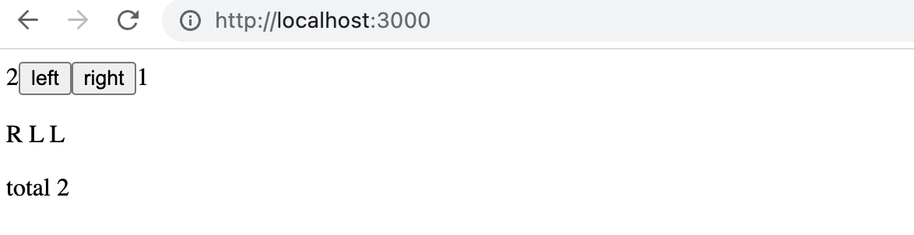
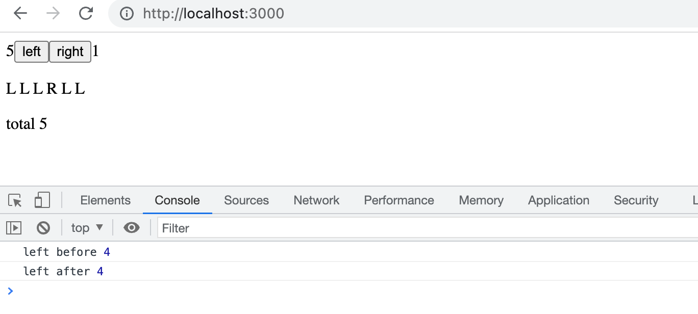

<div class="content">

### Monimutkaisempi tila

Edellisessä esimerkissä sovelluksen tila oli yksinkertainen, sillä se koostui ainoastaan yhdestä kokonaisluvusta. Entä jos sovellus tarvitsee monimutkaisemman tilan?

Helpoin ja useimmiten paras tapa on luoda sovellukselle useita erillisiä tiloja tai tilan "osia" kutsumalla funktiota _useState_ useampaan kertaan.

Seuraavassa sovellukselle luodaan kaksi alkuarvon 0 saavaa tilaa _left_ ja _right_:

```js
const App = () => {
  const [left, setLeft] = useState(0)
  const [right, setRight] = useState(0)

  return (
    <div>
      <div>
        {left}
        <button onClick={() => setLeft(left + 1)}>
          left
        </button>
        <button onClick={() => setRight(right + 1)}>
          right
        </button>
        {right}
      </div>
    </div>
  )
}
```

Komponentti saa käyttöönsä tilan alustuksen yhteydessä funktiot _setLeft_ ja _setRight_, joiden avulla se voi päivittää tilan osia.

Komponentin tila tai yksittäinen tilan pala voi olla minkä tahansa tyyppinen. Voisimme toteuttaa saman toiminnallisuuden tallentamalla nappien <i>left</i> ja <i>right</i> painallukset yhteen olioon

```js
{
  left: 0,
  right: 0
}
```

jolloin sovellus muuttuisi seuraavasti:

```js
const App = () => {
  const [clicks, setClicks] = useState({
    left: 0, right: 0
  })

  const handleLeftClick = () => {
    const newClicks = { 
      left: clicks.left + 1, 
      right: clicks.right 
    }
    setClicks(newClicks)
  }

  const handleRightClick = () => {
    const newClicks = { 
      left: clicks.left, 
      right: clicks.right + 1 
    }
    setClicks(newClicks)
  }

  return (
    <div>
      <div>
        {clicks.left}
        <button onClick={handleLeftClick}>left</button>
        <button onClick={handleRightClick}>right</button>
        {clicks.right}
      </div>
    </div>
  )
}
```

Nyt komponentilla on siis ainoastaan yksi tila. Näppäinten painallusten yhteydessä on nyt huolehdittava <i>koko tilan</i> muutoksesta.

Tapahtumankäsittelijä vaikuttaa hieman sotkuiselta. Kun nappia <i>left</i> painetaan, suoritetaan seuraava funktio

```js
const handleLeftClick = () => {
  const newClicks = { 
    left: clicks.left + 1, 
    right: clicks.right 
  }
  setClicks(newClicks)
}
```

ja uudeksi tilaksi asetetaan siis seuraava olio

```js
{
  left: clicks.left + 1,
  right: clicks.right
}
```

jolloin kentän <i>left</i> arvo on sama kuin alkuperäisen tilan kentän <i>left + 1</i> ja kentän <i>right</i> arvo on sama kuin alkuperäisen tilan kentän <i>right</i>.

Uuden tilan määrittelevän olion muodostaminen onnistuu hieman tyylikkäämmin hyödyntämällä kesällä 2018 kieleen tuotua [object spread](https://developer.mozilla.org/en-US/docs/Web/JavaScript/Reference/Operators/Spread_syntax) ‑syntaksia:

```js
const handleLeftClick = () => {
  const newClicks = { 
    ...clicks, 
    left: clicks.left + 1 
  }
  setClicks(newClicks)
}

const handleRightClick = () => {
  const newClicks = { 
    ...clicks, 
    right: clicks.right + 1 
  }
  setClicks(newClicks)
}
```

Merkintä vaikuttaa hieman erikoiselta. Käytännössä <em>{ ...clicks }</em> luo olion, jolla on kenttinään kopiot olion _clicks_ kenttien arvoista. Kun aaltosulkeisiin lisätään asioita, esim. <em>{ ...clicks, right: 1 }</em>, tulee uuden olion kenttä _right_ saamaan arvon 1.

Esimerkissä siis

```js
{ ...clicks, right: clicks.right + 1 }
```

luo oliosta _clicks_ kopion, jossa kentän _right_ arvoa kasvatetaan yhdellä.

Apumuuttujat ovat oikeastaan turhat, ja tapahtumankäsittelijät voidaan määritellä seuraavasti:

```js
const handleLeftClick = () =>
  setClicks({ ...clicks, left: clicks.left + 1 })

const handleRightClick = () =>
  setClicks({ ...clicks, right: clicks.right + 1 })
```

Miksi emme hoitaneet tilan päivitystä seuraavasti?

```js
const handleLeftClick = () => {
  clicks.left++
  setClicks(clicks)
}
```

Sovellus näyttää toimivan. Reactissa <i>ei kuitenkaan ole sallittua muuttaa tilaa suoraan</i> (kuten komento _clicks.left_ nyt tekee), koska sillä voi olla arvaamattomat seuraukset. Tilan muutos tulee aina tehdä asettamalla uudeksi tilaksi vanhan perusteella tehty kopio!

Kaiken tilan pitäminen yhdessä oliossa on tämän sovelluksen kannalta huono ratkaisu; etuja siinä ei juuri ole, mutta sovellus monimutkaistuu merkittävästi. Onkin ehdottomasti parempi ratkaisu tallettaa nappien klikkaukset erillisiin tilan paloihin.

On kuitenkin tilanteita, joissa jokin osa tilaa kannattaa pitää monimutkaisemman tietorakenteen sisällä. [Reactin dokumentaatiossa](https://react.dev/learn/choosing-the-state-structure) on hieman ohjeistusta aiheeseen liittyen.

### Taulukon käsittelyä

Tehdään sovellukseen laajennus lisäämällä sovelluksen tilaan taulukko _allClicks_, joka muistaa kaikki näppäimenpainallukset:

```js
const App = () => {
  const [left, setLeft] = useState(0)
  const [right, setRight] = useState(0)
  const [allClicks, setAll] = useState([]) // highlight-line

// highlight-start
  const handleLeftClick = () => {
    setAll(allClicks.concat('L'))
    setLeft(left + 1)
  }
// highlight-end  

// highlight-start
  const handleRightClick = () => {
    setAll(allClicks.concat('R'))
    setRight(right + 1)
  }
// highlight-end  

  return (
    <div>
      <div>
        {left}
        <button onClick={handleLeftClick}>left</button>
        <button onClick={handleRightClick}>right</button>
        {right}
        <p>{allClicks.join(' ')}</p> // highlight-line
      </div>
    </div>
  )
}
```

Kaikki painallukset siis talletetaan omaan tilaan _allClicks_, joka alustetaan tyhjäksi taulukoksi:

```js
const [allClicks, setAll] = useState([])
```

Kun esim. nappia <i>left</i> painetaan, tilan taulukkoon _allClicks_ lisätään kirjain <i>L</i>:

```js
const handleLeftClick = () => {
  setAll(allClicks.concat('L'))
  setLeft(left + 1)
}
```

Tila _allClicks_ saa nyt arvokseen taulukon, jossa ovat entisen taulukon alkiot ja <i>L</i>. Uuden alkion liittäminen on tehty metodilla [concat](https://developer.mozilla.org/en-US/docs/Web/JavaScript/Reference/Global_Objects/Array/concat), joka toimii siten, että se ei muuta olemassa olevaa taulukkoa vaan luo <i>uuden taulukon</i>, johon uusi alkio on lisätty.

Kuten jo aiemmin mainittiin, JavaScriptissa on mahdollista lisätä taulukkoon myös metodilla [push](https://developer.mozilla.org/en-US/docs/Web/JavaScript/Reference/Global_Objects/Array/push). Sovelluksemme näyttäisikin toimivan myös silloin, kun lisäys hoidetaan muuttamalla _allClicks_-tilaa pushaamalla siihen alkio ja päivittämällä sitten tila:

```js
const handleLeftClick = () => {
  allClicks.push('L')
  setAll(allClicks)
  setLeft(left + 1)
}
```

Älä kuitenkaan tee näin. Kuten jo mainitsimme, React-komponentin tilaa, eli esimerkiksi muuttujaa _allClicks_, ei saa muuttaa. Vaikka tilan muuttaminen näyttääkin toimivan joissakin tilanteissa, voi seurauksena olla hankalasti havaittavia ongelmia.

Katsotaan vielä tarkemmin, miten kaikkien painallusten historia renderöidään ruudulle:

```js
const App = () => {
  // ...

  return (
    <div>
      <div>
        {left}
        <button onClick={handleLeftClick}>left</button>
        <button onClick={handleRightClick}>right</button>
        {right}
        <p>{allClicks.join(' ')}</p> // highlight-line
      </div>
    </div>
  )
}
```

Taulukolle _allClicks_ kutsutaan metodia [join](https://developer.mozilla.org/en-US/docs/Web/JavaScript/Reference/Global_Objects/Array/join), joka muodostaa taulukosta merkkijonon, joka sisältää taulukon alkiot erotettuina parametrina olevalla merkillä eli välilyönnillä.


### Tilan päivitys tapahtuu asynkronisesti

Laajennetaan sovellusta siten, että se pitää kirjaa nappien painallusten yhteenlasketusta määrästä tilassa _total_, jonka arvoa päivitetään aina nappien painalluksen yhteydessä:

```js
const App = () => {
  const [left, setLeft] = useState(0)
  const [right, setRight] = useState(0)
  const [allClicks, setAll] = useState([])
  const [total, setTotal] = useState(0) // highlight-line

  const handleLeftClick = () => {
    setAll(allClicks.concat('L'))
    setLeft(left + 1)
    setTotal(left + right)  // highlight-line
  }

  const handleRightClick = () => {
    setAll(allClicks.concat('R'))
    setRight(right + 1)
    setTotal(left + right)  // highlight-line
  }

  return (
    <div>
      {left}
      <button onClick={handleLeftClick}>left</button>
      <button onClick={handleRightClick}>right</button>
      {right}
      <p>{allClicks.join(' ')}</p>
      <p>total {total}</p>  // highlight-line
    </div>
  )
}
```

Ratkaisu toimii melkein:



Jostain syystä napien painellusten yhteenlaskettu määrä näyttää koko ajan yhtä liian vähän.

Lisätään tapahtumankäsittelijään muutama console.log:

```js
const App = () => {
  // ...
  const handleLeftClick = () => {
    setAll(allClicks.concat('L'))
    console.log('left before', left)  // highlight-line
    setLeft(left + 1)
    console.log('left after', left)  // highlight-line
    setTotal(left + right) 
  }

  // ...
}
```

Konsoli paljastaa ongelman



Vaikka tilalle _left_ asetettiin uusi arvo kutsumalla _setLeft(left + 1)_ on tilalla siis tapahtumankäsittelijän sisällä edelleen vanha arvo päivityksestä huolimatta! Tämän takia seuraava nappien painallusten laskuyritys tuottaa aina yhtä liian pienen tuloksen:

```js
setTotal(left + right) 
```

Syynä ilmiöön on se, että tilan päivitys tapahtuu Reactissa [asynkronisesti](https://react.dev/learn/queueing-a-series-of-state-updates#react-batches-state-updates), eli "jossain vaiheessa" ennen kuin komponentti renderöidään uudelleen, ei kuitenkaan välittömästi.

Saamme korjattua sovelluksen seuraavasti:

```js
const App = () => {
  // ...
  const handleLeftClick = () => {
    setAll(allClicks.concat('L'))
    const updatedLeft = left + 1
    setLeft(updatedLeft)
    setTotal(updatedLeft + right) 
  }

  // ...
}
```

Eli nyt nappien määrän summa perustuu varmasti oikeaan määrään vasemman napin painalluksia.

### Ehdollinen renderöinti

Muutetaan sovellusta siten, että painallushistorian renderöinnistä vastaa komponentti _History_:

```js
// highlight-start
const History = (props) => {
  if (props.allClicks.length === 0) {
    return (
      <div>
        the app is used by pressing the buttons
      </div>
    )
  }

  return (
    <div>
      button press history: {props.allClicks.join(' ')}
    </div>
  )
}
// highlight-end

const App = () => {
  // ...

  return (
    <div>
      <div>
        {left}
        <button onClick={handleLeftClick}>left</button>
        <button onClick={handleRightClick}>right</button>
        {right}
        <History allClicks={allClicks} /> // highlight-line
      </div>
    </div>
  )
}
```

Nyt komponentin toiminta riippuu siitä, onko näppäimiä jo painettu. Jos ei, eli taulukko <em>allClicks</em> on tyhjä, komponentti renderöi "käyttöohjeen" sisältävän divin.

```js
<div>the app is used by pressing the buttons</div>
```

ja muussa tapauksessa näppäilyhistorian:

```js
<div>
  button press history: {props.allClicks.join(' ')}
</div>
```

Komponentti _History_ renderöi siis eri React-elementit riippuen sovelluksen tilasta, eli komponentissa on <i>ehdollista renderöintiä</i>.

Reactissa on monia muitakin tapoja [ehdolliseen renderöintiin](https://react.dev/learn/conditional-rendering). Katsotaan niitä tarkemmin [seuraavassa osassa](/osa2).

Muutetaan vielä sovellusta siten, että se käyttää aiemmin määrittelemäämme komponenttia _Button_ painikkeiden muodostamiseen:

```js
const History = (props) => {
  if (props.allClicks.length === 0) {
    return (
      <div>
        the app is used by pressing the buttons
      </div>
    )
  }

  return (
    <div>
      button press history: {props.allClicks.join(' ')}
    </div>
  )
}

// highlight-start
const Button = ({ handleClick, text }) => (
  <button onClick={handleClick}>
    {text}
  </button>
)
// highlight-end

const App = () => {
  const [left, setLeft] = useState(0)
  const [right, setRight] = useState(0)
  const [allClicks, setAll] = useState([])

  const handleLeftClick = () => {
    setAll(allClicks.concat('L'))
    setLeft(left + 1)
  }

  const handleRightClick = () => {
    setAll(allClicks.concat('R'))
    setRight(right + 1)
  }

  return (
    <div>
      <div>
        {left}
        // highlight-start
        <Button handleClick={handleLeftClick} text='left' />
        <Button handleClick={handleRightClick} text='right' />
        // highlight-end
        {right}
        <History allClicks={allClicks} />
      </div>
    </div>
  )
}
```

### Vanha React

Tällä kurssilla käyttämämme tapa React-komponenttien tilan määrittelyyn, eli [state hook](https://react.dev/learn/state-a-components-memory), on siis "uutta" Reactia ja käytettävissä alkuvuodesta 2019 ilmestyneestä versiosta [16.8.0](https://www.npmjs.com/package/react/v/16.8.0) lähtien. Ennen hookeja JavaScript-funktioina määriteltyihin React-komponentteihin ei ollut mahdollista saada tilaa ollenkaan, ja tilaa edellyttävät komponentit oli pakko määritellä [class](https://react.dev/reference/react/Component)-komponentteina JavaScriptin luokkasyntaksia hyödyntäen.

Olemme tällä kurssilla tehneet hieman radikaalinkin ratkaisun käyttää pelkästään hookeja ja näin ollen opetella heti alusta asti ohjelmoimaan modernia Reactia. Luokkasyntaksin hallitseminen on kuitenkin sikäli tärkeää, että vaikka funktiona määriteltävät komponentit ovat modernia Reactia, maailmassa on miljardeja rivejä vanhaa Reactia, jota kenties sinäkin joudut jonain päivänä ylläpitämään. Dokumentaation ja Internetistä löytyvien esimerkkien suhteen tilanne on sama; tulet törmäämään myös class-komponentteihin.

Tutustummekin riittävällä tasolla class-komponentteihin kurssin [seitsemännessä](/osa7) osassa.

### React-sovellusten debuggaus

Ohjelmistokehittäjän työ sisältää monesti debuggaamista ja olemassa olevan koodin lukemista. Silloin tällöin syntyy toki muutama rivi uuttakin koodia, mutta suuri osa ajasta ihmetellään, miksi joku on rikki tai miksi joku asia ylipäätään toimii. Hyvät debuggauskäytännöt ja ‑työkalut ovatkin todella tärkeitä.

Onneksi React on debuggauksen suhteen jopa harvinaisen kehittäjäystävällinen kirjasto.

Muistutetaan vielä tärkeimmästä web-sovelluskehitykseen liittyvästä asiasta:

<h4>Web-sovelluskehityksen sääntö numero yksi</h4>

>  **Pidä selaimen developer-konsoli koko ajan auki.**
>
> Välilehdistä tulee olla auki nimenomaan <i>Console</i>, jollei ole erityistä syytä käyttää jotain muuta välilehteä.

Pidä myös koodi ja web-sivu **koko ajan** yhtä aikaa näkyvillä.

Jos ja kun koodi ei käänny eli selaimessa alkaa näkyä punaista


älä kirjoita lisää koodia, vaan selvitä ongelma. Koodauksen historia ei tunne tilannetta, jossa kääntymätön koodi alkaa ihmeen voimalla toimimaan kirjoittamalla suuri määrää lisää koodia, emmekä usko tällaista ihmettä nähtävän tälläkään kurssilla.

Vanha kunnon printtaukseen perustuva debuggaus on monesti toimiva tapa. Eli jos esim. komponentissa

```js
const Button = ({ handleClick, text }) => (
  <button onClick={handleClick}>
    {text}
  </button>
)
```

olisi ongelma, kannattaa komponentista alkaa printtailla konsoliin. Pystyäksemme printtaamaan tulee funktio muuttaa pitempään muotoon ja propsit kannattaa kenties vastaanottaa ilman destrukturointia:

```js
const Button = (props) => { 
  console.log(props) // highlight-line
  const { handleClick, text } = props
  return (
    <button onClick={handleClick}>
      {text}
    </button>
  )
}
```

näin selviää heti, onko esim. joku propsia vastaava attribuutti nimetty väärin komponenttia käytettäessä.

**HUOM** kun käytät komentoa _console.log_ debuggaukseen, älä yhdistele asioita "javamaisesti" plussalla, eli sen sijaan että kirjoittaisit

```js
console.log('props value is' + props)
```

erottele tulostettavat asiat pilkulla:

```js
console.log('props value is', props)
```

Jos yhdistät plussaa käyttäen merkkijonoon olion, tuloksena on suhteellisen hyödytön tulostusmuoto

```js
props value is [Object object]
```

kun taas erotellessasi tulostettavat asiat pilkulla saat developer-konsoliin olion, jonka sisältöä on mahdollista tarkastella.

Konsoliin tulostus ei ole suinkaan ainoa keino debuggaamiseen. Voit pysäyttää koodin suorituksen Chromen developer-konsolin <i>debuggeriin</i> kirjoittamalla omassa tekstieditorissasi olevaan lähdekoodiin mihin tahansa kohtaan koodia komennon [debugger](https://developer.mozilla.org/en-US/docs/Web/JavaScript/Reference/Statements/debugger).

Koodi pysähtyy, kun suoritus etenee sellaiseen pisteeseen, jossa komento _debugger_ suoritetaan:


Muuttujien tilaa voi tutkia <i>Console</i>-välilehdellä:


Kun bugi selviää, _debugger_-komennon voi poistaa ja ladata sivun uudelleen.

Debuggerissa on mahdollista suorittaa koodia tarvittaessa rivi riviltä <i>Sources</i>-välilehden oikealta laidalta.

Debuggeriin pääsee myös ilman komentoa _debugger_ lisäämällä <i>Sources</i>-välilehdellä sopiviin kohtiin koodia <i>breakpointeja</i>. Komponentin muuttujien arvojen tarkkailu on mahdollista _Scope_-osassa:


Chromeen kannattaa ehdottomasti asentaa [React Developer Tools](https://chrome.google.com/webstore/detail/react-developer-tools/fmkadmapgofadopljbjfkapdkoienihi) ‑lisäosa, joka tuo konsoliin uuden välilehden _Components_. Uuden välilehden avulla voidaan tarkkailla sovelluksen React-komponentteja ja niiden tilaa ja propseja:


Komponentin _App_ tila on määritelty seuraavasti:

```js
const [left, setLeft] = useState(0)
const [right, setRight] = useState(0)
const [allClicks, setAll] = useState([])
```

React Developer Tools näyttää hookeilla luodut tilan osat siinä järjestyksessä kuin ne on määritelty koodissa: 


Ylimpänä oleva <i>State</i> vastaa siis tilan <i>left</i> arvoa, seuraava tilan <i>right</i> arvoa ja alimpana on taulukko <i>allClicks</i>.

Chromella tapahtuvaan JavaScriptin debuggaukseen voi tutustua myös esim. [tämän sivun videolla](https://developer.chrome.com/docs/devtools/overview/) alkaen kohdasta 16:50.

### Hookien säännöt

Jotta hookeilla muodostettu sovelluksen tila toimisi oikein, on hookeja käytettävä tiettyjä [rajoituksia](https://react.dev/learn/state-a-components-memory#meet-your-first-hook) noudattaen.

Funktiota _useState_ <i>ei saa kutsua</i> silmukassa (sama koskee  seuraavassa osassa esiteltävää funktiota _useEffect_), ehtolausekkeiden sisältä tai muista kuin komponentin määrittelevästä funktiosta. Tämä takaa sen, että hookeja kutsutaan aina samassa järjestyksessä. Jos näin ei ole, sovellus saattaa toimia miten sattuu.

Hookeja siis kuuluu kutsua ainoastaan React-komponentin määrittelevän funktion rungosta:

```js
const App = (props) => {
  // nämä ovat ok
  const [age, setAge] = useState(0)
  const [name, setName] = useState('Juha Tauriainen')

  if ( age > 10 ) {
    // ei ehtolauseessa
    const [foobar, setFoobar] = useState(null)
  }

  for ( let i = 0; i < age; i++ ) {
    // eikä myöskään loopissa
    const [rightWay, setRightWay] = useState(false)
  }

  const notGood = () => {
    // ei muiden kuin komponentin määrittelevän funktion sisällä
    const [x, setX] = useState(-1000)
  }

  return (
    //...
  )
}
```

### Tapahtumankäsittely revisited

Tapahtumankäsittely on osoittautunut aiempien vuosien kursseilla haastavaksi aiheeksi.

Tarkastellaan asiaa vielä uudelleen.

Oletetaan, että käytössä on yksinkertainen sovellus, jonka komponentti <i>App</i> on määritelty seuraavasti:

```js
const App = (props) => {
  const [value, setValue] = useState(10)

  return (
    <div>
      {value}
      <button>reset to zero</button>
    </div>
  )
}
```

Haluamme, että napin avulla saadaan nollattua tilan tallettava muuttuja _value_.

Jotta saamme napin reagoimaan, on napille lisättävä <i>tapahtumankäsittelijä</i>.

Tapahtumankäsittelijän tulee aina olla <i>funktio</i> tai viite funktioon. Jos tapahtumankäsittelijän paikalle yritetään laittaa jotain muuta, nappi ei toimi.

Jos annamme tapahtumankäsittelijäksi esimerkiksi merkkijonon

```js
<button onClick={'crap...'}>button</button>
```

React varoittaa asiasta konsolissa:

```js
index.js:2178 Warning: Expected `onClick` listener to be a function, instead got a value of `string` type.
    in button (at index.js:20)
    in div (at index.js:18)
    in App (at index.js:27)
```

Myös seuraavanlainen yritys olisi tuhoon tuomittu:

```js
<button onClick={value + 1}>button</button>
```

Nyt tapahtumankäsittelijäksi on yritetty laittaa _value + 1_, joka tarkoittaa laskuoperaation tulosta. React varoittaa tästäkin konsolissa:

```js
index.js:2178 Warning: Expected `onClick` listener to be a function, instead got a value of `number` type.
```

Myöskään seuraava ei toimi

```js
<button onClick={value = 0}>button</button>
```

sillä taaskaan tapahtumankäsittelijänä ei ole funktio vaan sijoitusoperaatio. Konsoliin tulee valitus. Tämä tapa on myös toisella tavalla väärin: tilan muuttaminen ei onnistu suoraan tilan arvon tallentavaa muuttujaa muuttamalla.

Entä seuraava:

```js
<button onClick={console.log('clicked the button')}>
  button
</button>
```

Konsoliin tulostuu kertaalleen <i>clicked the button</i>, mutta nappia painellessa ei tapahdu mitään. Miksi tämä ei toimi vaikka tapahtumankäsittelijänä on nyt funktio _console.log_?

Ongelma on siinä, että tapahtumankäsittelijänä on <i>funktion kutsu</i>, eli varsinaiseksi tapahtumankäsittelijäksi tulee funktion kutsun paluuarvo, joka on tässä tapauksessa määrittelemätön arvo <i>undefined</i>.

Funktiokutsu _console.log('clicked the button')_ suoritetaan siinä vaiheessa kun komponentti renderöidään, minkä takia konsoliin tulee kuitenkin yksi tulostus.

Myös seuraava yritys on virheellinen:

```js
<button onClick={setValue(0)}>button</button>
```

Jälleen olemme yrittäneet laittaa tapahtumankäsittelijäksi funktiokutsun. Ei toimi. Tämä yritys aiheuttaa myös toisen ongelman: kun komponenttia renderöidään, suoritetaan tapahtumankäsittelijänä oleva funktiokutsu _setValue(0)_ mikä taas saa aikaan komponentin uudelleenrenderöinnin. Ja uudelleenrenderöinnin yhteydessä funktiota kutsutaan uudelleen, mikä käynnistää jälleen uuden uudelleenrenderöinnin, ja näin joudutaan päättymättömään rekursioon.

Jos haluamme suorittaa tietyn funktiokutsun nappia painettaessa, seuraava toimii:

```js
<button onClick={() => console.log('clicked the button')}>
  button
</button>
```

Nyt tapahtumankäsittelijä on nuolisyntaksilla määritelty funktio _() => console.log('clicked the button')_. Kun komponentti renderöidään, ei suoriteta mitään, ainoastaan talletetaan funktioviite tapahtumankäsittelijäksi. Itse funktion suoritus tapahtuu vasta napin painalluksen yhteydessä.

Saamme myös nollauksen toimimaan samalla tekniikalla

```js
<button onClick={() => setValue(0)}>button</button>
```

eli nyt tapahtumankäsittelijä on funktio _() => setValue(0)_.

Tapahtumankäsittelijäfunktioiden määrittely suoraan napin määrittelyn yhteydessä ei ole välttämättä paras mahdollinen tapa.

Usein tapahtumankäsittelijä määritelläänkin jossain muualla. Seuraavassa määritellään funktio ja sijoitetaan se muuttujaan _handleClick_ komponentin rungossa:

```js
const App = (props) => {
  const [value, setValue] = useState(10)

  const handleClick = () =>
    console.log('clicked the button')

  return (
    <div>
      {value}
      <button onClick={handleClick}>button</button>
    </div>
  )
}
```

Muuttujassa _handleClick_ on nyt talletettuna viite itse funktioon. Viite annetaan napin määrittelyn yhteydessä attribuuttiin <i>onClick</i>:

```js
<button onClick={handleClick}>button</button>
```

Tapahtumankäsittelijäfunktio voi luonnollisesti koostua useista komennoista, jolloin käytetään nuolifunktion aaltosulullista muotoa:

```js
const App = (props) => {
  const [value, setValue] = useState(10)

  // highlight-start
  const handleClick = () => {
    console.log('clicked the button')
    setValue(0)
  }
   // highlight-end

  return (
    <div>
      {value}
      <button onClick={handleClick}>button</button>
    </div>
  )
}
```

###  Funktion palauttava funktio

Näytetään vielä eräs tapa määritellä tapahtumankäsittelijöitä: <i>funktion palauttava funktio</i>.
Tällä kurssilla ei tätä tyyliä tulla käyttämään, joten **voit huoletta hypätä seuraavan ohi** jos asia tuntuu nyt hankalalta. Funktioita palauttavat funktiot ovat kuitenkin melko yleisiä funktionaalista ohjelmointityyliä käytettäessä, joten tarkastellaan tekniikkaa hieman vaikka selviämmekin kurssilla ilman sitä.

Muutetaan koodia seuraavasti:

```js
const App = (props) => {
  const [value, setValue] = useState(10)

  // highlight-start
  const hello = () => {
    const handler = () => console.log('hello world')

    return handler
  }
  // highlight-end

  return (
    <div>
      {value}
      <button onClick={hello()}>button</button>
    </div>
  )
}
```

Koodi näyttää hankalalta, mutta se toimii.

Tapahtumankäsittelijäksi on nyt asetettu funktiokutsu:

```js
<button onClick={hello()}>button</button>
```

Aiemmin varoiteltiin, että tapahtumankäsittelijä ei saa olla funktiokutsu vaan sen on oltava funktio tai viite funktioon. Miksi funktiokutsu kuitenkin toimii nyt?

Kun komponenttia renderöidään suoritetaan seuraava funktio:

```js
const hello = () => {
  const handler = () => console.log('hello world')

  return handler
}
```

Funktion <i>paluuarvona</i> on nyt toinen, muuttujaan _handler_ määritelty funktio.

Eli kun React renderöi rivin

```js
<button onClick={hello()}>button</button>
```

se sijoittaa onClick-käsittelijäksi funktiokutsun _hello()_ paluuarvon. Eli oleellisesti ottaen rivi "muuttuu" seuraavaksi:

```js
<button onClick={() => console.log('hello world')}>
  button
</button>
```

Koska funktio _hello_ palautti funktion, tapahtumankäsittelijäkin on nyt funktio.

Mitä hyötyä tällaisesta on?

Muutetaan koodia hiukan:

```js
const App = (props) => {
  const [value, setValue] = useState(10)

  // highlight-start
  const hello = (who) => {
    const handler = () => {
      console.log('hello', who)
    }

    return handler
  }
  // highlight-end  

  return (
    <div>
      {value}
  // highlight-start      
      <button onClick={hello('world')}>button</button>
      <button onClick={hello('react')}>button</button>
      <button onClick={hello('function')}>button</button>
  // highlight-end      
    </div>
  )
}
```

Nyt meillä on kolme nappia, joiden tapahtumankäsittelijät määritellään parametrin saavan funktion _hello_ avulla.

Ensimmäinen nappi määritellään seuraavasti:

```js
<button onClick={hello('world')}>button</button>
```

Tapahtumankäsittelijä siis saadaan <i>suorittamalla</i> funktiokutsu _hello('world')_. Funktiokutsu palauttaa funktion:

```js
() => {
  console.log('hello', 'world')
}
```

Toinen nappi määritellään seuraavasti:

```js
<button onClick={hello('react')}>button</button>
```

Tapahtumankäsittelijän määrittelevä funktiokutsu _hello('react')_ palauttaa

```js
() => {
  console.log('hello', 'react')
}
```

eli molemmat napit saavat omat, yksilölliset tapahtumankäsittelijänsä.

Funktioita palauttavia funktioita voikin hyödyntää määrittelemään geneeristä toiminnallisuutta, jota voi tarkentaa parametrien avulla. Tapahtumankäsittelijöitä luovan funktion _hello_ voikin ajatella olevan eräänlainen tehdas, jota voi pyytää valmistamaan sopivia tervehtimiseen käytettäviä tapahtumankäsittelijäfunktioita.

Käyttämämme määrittelytapa

```js
const hello = (who) => {
  const handler = () => {
    console.log('hello', who)
  }

  return handler
}
```

on hieman verboosi. Eliminoidaan apumuuttuja ja määritellään palautettava funktio suoraan returnin yhteydessä:

```js
const hello = (who) => {
  return () => {
    console.log('hello', who)
  }
}
```

Koska funktio _hello_ sisältää ainoastaan yhden komennon, returnin, voimme käyttää aaltosulutonta muotoa

```js
const hello = (who) =>
  () => {
    console.log('hello', who)
  }
```

ja tuoda vielä "kaikki nuolet" samalle riville:

```js
const hello = (who) => () => {
  console.log('hello', who)
}
```

Voimme käyttää samaa kikkaa myös muodostamaan tapahtumankäsittelijöitä, jotka asettavat komponentin tilan halutuksi. Muutetaan koodi muotoon:

```js
const App = (props) => {
  const [value, setValue] = useState(10)

  const setToValue = (newValue) => () => {
    console.log('value now', newValue) // tulostetaan uusi arvo konsoliin
    setValue(newValue)
  }

  return (
    <div>
      {value}
      <button onClick={setToValue(1000)}>thousand</button>
      <button onClick={setToValue(0)}>reset</button>
      <button onClick={setToValue(value + 1)}>increment</button>
    </div>
  )
}
```

Kun komponentti renderöidään, ja tehdään nappia <i>thousand</i>

```js
<button onClick={setToValue(1000)}>thousand</button>
```

tulee tapahtumankäsittelijäksi funktiokutsun _setToValue(1000)_ paluuarvo eli seuraava funktio:

```js
() => {
  console.log('value now', 1000)
  setValue(1000)
}
```

Kasvatusnapin generoima rivi on seuraava:

```js
<button onClick={setToValue(value + 1)}>increment</button>
```

Tapahtumankäsittelijän muodostaa funktiokutsu _setToValue(value + 1)_, joka saa parametrikseen tilan tallettavan muuttujan _value_ nykyisen arvon kasvatettuna yhdellä. Jos _value_ olisi 10, tulisi tapahtumankäsittelijäksi funktio:
```js
() => {
  console.log('value now', 11)
  setValue(11)
}
```

Funktioita palauttavia funktioita ei tässäkään tapauksessa olisi ollut pakko käyttää. Muutetaan tilan päivittämisestä huolehtiva funktio _setToValue_ normaaliksi funktioksi:

```js
const App = (props) => {
  const [value, setValue] = useState(10)

  const setToValue = (newValue) => {
    console.log('value now', newValue)
    setValue(newValue)
  }

  return (
    <div>
      {value}
      <button onClick={() => setToValue(1000)}>
        thousand
      </button>
      <button onClick={() => setToValue(0)}>
        reset
      </button>
      <button onClick={() => setToValue(value + 1)}>
        increment
      </button>
    </div>
  )
}
```

Voimme nyt määritellä tapahtumankäsittelijän funktioksi, joka kutsuu funktiota _setToValue_ sopivalla parametrilla. Esim. nollaamisen tapahtumankäsittelijä voidaan kirjoittaa muotoon:

```js
<button onClick={() => setToValue(0)}>reset</button>
```

On makuasia käyttääkö tapahtumankäsittelijöinä funktioita palauttavia funktioita vai nuolifunktioita. Tällä kurssilla emme kuitenkaan selvyyden vuoksi käytä funktioita palauttavia funktioita.

### Tapahtumankäsittelijän vieminen alikomponenttiin

Eriytetään vielä painike omaksi komponentikseen:

```js
const Button = (props) => (
  <button onClick={props.handleClick}>
    {props.text}
  </button>
)
```

Komponentti saa siis propsina _handleClick_ tapahtumankäsittelijän ja propsina _text_ merkkijonon, jonka se renderöi painikkeen tekstiksi. Komponenttia käytetään seuraavasti:

```js
const App = (props) => {
  // ...
  return (
    <div>
      {value}
      <Button handleClick={setToValue(1000)} text="thousand" /> // highlight-line
      <Button handleClick={setToValue(0)} text="reset" /> // highlight-line
      <Button handleClick={setToValue(value + 1)} text="increment" /> // highlight-line
    </div>
  )
}
```

Komponentin <i>Button</i> käyttö on helppoa, mutta on toki pidettävä huolta siitä, että komponentille annettavat propsit on nimetty niin kuin komponentti olettaa:


### Älä määrittele komponenttia komponentin sisällä

Eriytetään vielä sovelluksestamme luvun näyttäminen omaan komponenttiinsa <i>Display</i>.

Määritellään uusi komponentti <i>App</i>-komponentin sisällä:

```js
// tämä on oikea paikka määritellä komponentti!
const Button = (props) => (
  <button onClick={props.handleClick}>
    {props.text}
  </button>
)

const App = (props) => {
  const [value, setValue] = useState(10)

  const setToValue = newValue => {
    console.log('value now', newValue)
    setValue(newValue)
  }

  // älä määrittele komponenttia täällä!
  const Display = props => <div>{props.value}</div> // highlight-line

  return (
    <div>
      <Display value={value} />
      <Button handleClick={() => setToValue(1000)} text="thousand" />
      <Button handleClick={() => setToValue(0)} text="reset" />
      <Button handleClick={() => setToValue(value + 1)} text="increment" />
    </div>
  )
}
```

Kaikki näyttää toimivan, mutta **älä koskaan määrittele komponenttia toisen komponentin sisällä**. Tapa on hyödytön ja johtaa usein ongelmiin. Suurimmat ongelmat johtuvat siitä, että toisen komponentin sisällä määritelty komponentti on Reactin näkökulmasta jokaisen renderöinnin yhteydessä aina uusi komponentti. Tämä tekee komponentin optimoinnista Reactille mahdotonta.

Siirretäänkin komponentin <i>Display</i> määrittely oikeaan paikkaan eli komponentin <i>App</i> määrittelevän funktion ulkopuolelle:

```js
const Display = props => <div>{props.value}</div>

const Button = (props) => (
  <button onClick={props.handleClick}>
    {props.text}
  </button>
)

const App = () => {
  const [value, setValue] = useState(10)

  const setToValue = newValue => {
    console.log('value now', newValue)
    setValue(newValue)
  }

  return (
    <div>
      <Display value={value} />
      <Button handleClick={() => setToValue(1000)} text="thousand" />
      <Button handleClick={() => setToValue(0)} text="reset" />
      <Button handleClick={() => setToValue(value + 1)} text="increment" />
    </div>
  )
}
```

### Hyödyllistä materiaalia

Internetissä on todella paljon Reactiin liittyvää materiaalia. Välillä ongelman muodostaa kuitenkin se, että käytämme kurssilla uutta Reactia, ja edelleen aika suuri osa Internetistä löytyvästä materiaalista on meidän kannaltamme vanhentunutta ja käyttää <i>Class</i>-syntaksia komponenttien määrittelyyn.

Linkkejä:

- Reactin [dokumentaatio](https://react.dev/learn) kannattaa ehdottomasti käydä jossain vaiheessa läpi, ei välttämättä kaikkea nyt, osa on ajankohtaista vasta kurssin myöhemmissä osissa ja kaikki Class-komponentteihin liittyvä on kurssin kannalta epärelevanttia.
- Reactin sivuilla oleva [tutoriaali](https://react.dev/learn/tutorial-tic-tac-toe) sen sijaan on aika huono.
- [Egghead.io](https://egghead.io):n kursseista [Start learning React](https://egghead.io/courses/start-learning-react) on laadukas, ja hieman uudempi [The Beginner's guide to React](https://egghead.io/courses/the-beginner-s-guide-to-reactjs) on myös kohtuullisen hyvä; molemmat sisältävät myös asioita, jotka tulevat tällä kurssilla vasta myöhemmissä osissa. Molemmissa on toki se ongelma, että ne käyttävät Class-komponentteja.

### Webohjelmoijan vala

Ohjelmointi on hankalaa, ja sen takia lupaan hyödyntää kaikkia ohjelmointia helpottavia keinoja:

- pidän selaimeni konsolin koko ajan auki
- etenen pienin askelin
- käytän koodissani runsaasti _console.log_-komentoja sekä varmistamaan sen, että varmasti ymmärrän jokaisen kirjoittamani koodirivin, että etsiessäni koodistani mahdollisia bugin aiheuttajia
- jos koodini ei toimi, en kirjoita enää yhtään lisää koodia, vaan alan poistaa toiminnan rikkoneita rivejä tai palaan suosiolla tilanteeseen, missä koodini vielä toimi
- kun kysyn apua kurssin Discord- tai Telegram-kanavalla, tai muualla internetissä, muotoilen kysymyksen järkevästi, esim. [täällä](/en/part0/general_info#how-to-get-help-in-discord-telegram) esiteltyyn tapaan


</div>

<div class="tasks">
  <h3>Tehtävät 1.6.-1.14.</h3>

Tehtävät palautetaan GitHubin kautta ja merkitsemällä tehdyt tehtävät [palautussovellukseen](https://studies.cs.helsinki.fi/stats/courses/fullstackopen).

Tehtävät palautetaan **yksi osa kerrallaan**. Kun olet palauttanut osan tehtävät, et voi enää palauttaa saman osan tekemättä jättämiäsi tehtäviä.

<i>Samaa ohjelmaa kehittelevissä tehtäväsarjoissa ohjelman lopullisen version palauttaminen riittää, voit toki halutessasi tehdä commitin jokaisen tehtävän jälkeisestä tilanteesta, mutta se ei ole välttämätöntä.</i>

Jos, ja kun törmäät virheilmoitukseen

> <i>Objects are not valid as a React child</i>

pidä mielessä [täällä](/osa1/reactin_alkeet#ala-renderoi-olioita) kerrotut asiat.

<h4> 1.6: unicafe step1</h4>

Monien firmojen tapaan nykyään myös Helsingin yliopiston opiskelijaruokala [Unicafe](https://www.unicafe.fi) kerää asiakaspalautetta. Tee Unicafelle verkossa toimiva palautesovellus. Vastausvaihtoehtoja olkoon vain kolme: <i>hyvä</i>, <i>neutraali</i> ja <i>huono</i>.

Sovelluksen tulee näyttää jokaisen palautteen lukumäärä. Sovellus voi näyttää esim. seuraavalta:


Huomaa, että sovelluksen tarvitsee toimia vain yhden selaimen käyttökerran ajan. Esim. kun sivu refreshataan, tilastot saavat hävitä.

Kannattaa noudattaa samaa rakennetta kuin materiaalissa ja edellisessä tehtävässä, eli tiedoston <i>main.jsx</i> sisältö on seuraava:

```js
import ReactDOM from 'react-dom/client'
import App from './App'

ReactDOM.createRoot(document.getElementById('root')).render(<App />)
```

Muun sovelluksen voi tehdä tiedostoon <i>App.jsx</i>. Tiedoston sisältö voi olla aluksi seuraava:

```js
import { useState } from 'react'

const App = () => {
  // tallenna napit omaan tilaansa
  const [good, setGood] = useState(0)
  const [neutral, setNeutral] = useState(0)
  const [bad, setBad] = useState(0)

  return (
    <div>
      code here
    </div>
  )
}

export default App
```

<h4>1.7: unicafe step2</h4>

Laajenna sovellusta siten, että se näyttää palautteista enemmän statistiikkaa: yhteenlasketun määrän, keskiarvon (hyvän arvo 1, neutraalin 0, huonon -1) ja sen kuinka monta prosenttia palautteista on ollut positiivisia:


<h4>1.8: unicafe step3</h4>

Refaktoroi sovelluksesi siten, että tilastojen näyttäminen on eriytetty oman komponentin <i>Statistics</i> vastuulle. Sovelluksen tila säilyy edelleen juurikomponentissa <i>App</i>.

Muista, että komponentteja ei saa määritellä toisen komponentin sisällä:

```js
// oikea paikka komponentin määrittelyyn
const Statistics = (props) => {
  // ...
}

const App = () => {
  const [good, setGood] = useState(0)
  const [neutral, setNeutral] = useState(0)
  const [bad, setBad] = useState(0)

  // EI NÄIN!!! eli älä määrittele komponenttia 
  // toisen komponentin sisällä!
  const Statistics = (props) => {
    // ...
  }

  return (
    // ...
  )
}
```

<h4>1.9: unicafe step4</h4>

Muuta sovellusta siten, että numeeriset tilastot näytetään ainoastaan, jos palautteita on jo annettu:


<h4>1.10: unicafe step5</h4>

Jatketaan sovelluksen refaktorointia. Eriytä seuraavat <i>kaksi</i> komponenttia

- <i>Button</i> vastaa yksittäistä palautteenantonappia
- <i>StatisticLine</i> huolehtii tilastorivien, esim. keskiarvon näyttämisestä

Tarkennuksena: komponentti <i>StatisticLine</i> näyttää aina yhden tilastorivin, joten sovellus käyttää komponenttia useaan kertaan renderöidäkseen kaikki tilastorivit 

```js
const Statistics = (props) => {
  /// ...
  return(
    <div>
      <StatisticLine text="good" value ={...} />
      <StatisticLine text="neutral" value ={...} />
      <StatisticLine text="bad" value ={...} />
      // ...
    </div>
  )
}
```

Sovelluksen tila säilytetään edelleen juurikomponentissa <i>App</i>.

<h4>1.11*: unicafe step6</h4>

Toteuta tilastojen näyttäminen HTML:n [taulukkona](https://developer.mozilla.org/en-US/docs/Learn/HTML/Tables/Basics) siten, että saat sovelluksesi näyttämään suunnilleen seuraavanlaiselta:


Muista pitää konsoli koko ajan auki. Jos saat konsoliin seuraavan warningin:


tee tarvittavat toimenpiteet, jotta saat warningin katoamaan. Googlaa tarvittaessa virheilmoituksella.

**Huolehdi nyt ja jatkossa, että konsolissa ei näy mitään warningeja!**

<h4>1.12*: anekdootit step1</h4>

Ohjelmistotuotannossa tunnetaan lukematon määrä [anekdootteja](http://www.comp.nus.edu.sg/~damithch/pages/SE-quotes.htm) eli pieniä "onelinereita", jotka kiteyttävät alan ikuisia totuuksia.

Laajenna seuraavaa sovellusta siten, että siihen tulee nappi, jota painamalla sovellus näyttää <i>satunnaisen</i> ohjelmistotuotantoon liittyvän anekdootin:

```js
import { useState } from 'react'

const App = () => {
  const anecdotes = [
    'If it hurts, do it more often.',
    'Adding manpower to a late software project makes it later!',
    'The first 90 percent of the code accounts for the first 90 percent of the development time...The remaining 10 percent of the code accounts for the other 90 percent of the development time.',
    'Any fool can write code that a computer can understand. Good programmers write code that humans can understand.',
    'Premature optimization is the root of all evil.',
    'Debugging is twice as hard as writing the code in the first place. Therefore, if you write the code as cleverly as possible, you are, by definition, not smart enough to debug it.',
    'Programming without an extremely heavy use of console.log is same as if a doctor would refuse to use x-rays or blood tests when dianosing patients.',
    'The only way to go fast, is to go well.'
  ]
   
  const [selected, setSelected] = useState(0)

  return (
    <div>
      {anecdotes[selected]}
    </div>
  )
}

export default App
```

Tiedoston <i>main.jsx</i> sisältö on sama kuin edellisissä tehtävissä.

Google kertoo, miten voit generoida JavaScriptilla sopivia satunnaisia lukuja. Muista, että voit testata esim. satunnaislukujen generointia konsolissa.

Sovellus voi näyttää esim. seuraavalta:


<h4>1.13*: anekdootit step2</h4>

Laajenna sovellusta siten, että näytettävää anekdoottia on mahdollista äänestää:


**Huom:** kunkin anekdootin äänet kannattanee tallettaa komponentin tilassa olevan olion kenttiin tai taulukkoon. Muista, että tilan oikeaoppinen päivittäminen edellyttää olion tai taulukon <i>kopioimista</i>.

Olio voidaan kopioida esim. seuraavasti

```js
const points = { 0: 1, 1: 3, 2: 4, 3: 2 }

const copy = { ...points }
// kasvatetaan olion kentän 2 arvoa yhdellä
copy[2] += 1     
```

ja taulukko esim. seuraavasti:

```js
const points = [1, 4, 6, 3]

const copy = [...points]
// kasvatetaan taulukon paikan 2 arvoa yhdellä
copy[2] += 1     
```

Yksinkertaisempi ratkaisu lienee nyt taulukon käyttö. Googlaamalla löydät paljon vihjeitä sille, miten kannattaa luoda halutun mittainen taulukko, joka on täytetty nollilla, esim. [tämän](https://stackoverflow.com/questions/20222501/how-to-create-a-zero-filled-javascript-array-of-arbitrary-length/22209781).

<h4>1.14*: anekdootit step3</h4>

Ja sitten vielä lopullinen versio, joka näyttää eniten ääniä saaneen anekdootin:


Jos suurimman äänimäärän saaneita anekdootteja on useita, riittää että niistä näytetään yksi.

Tämä oli osan viimeinen tehtävä, ja on aika pushata koodi GitHubiin ja merkata tehdyt tehtävät [palautussovellukseen](https://studies.cs.helsinki.fi/stats/courses/fullstackopen).

</div>
