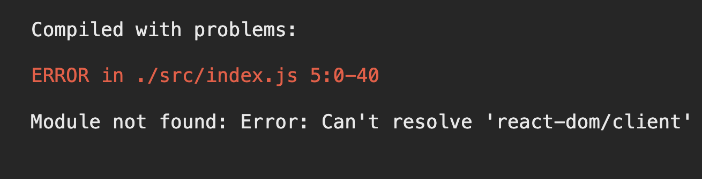
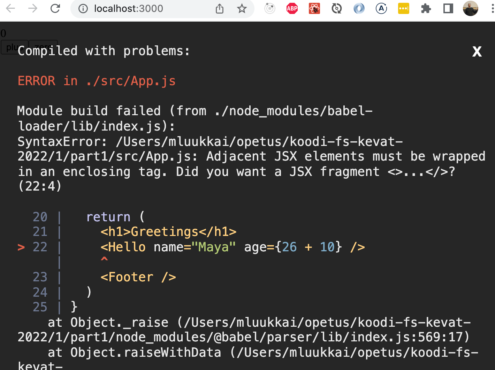

<div class="content">
<!-- We will now start getting familiar with probably the most important topic of this course, namely the [React](https://reactjs.org/)-library. Let's start off with making a simple React application as well as getting to know the core concepts of React.-->

 我们现在将开始入门的可能是本课程最重要的主题，即[React](https://reactjs.org/)-库。让我们从制作一个简单的React应用开始，同时了解React的核心概念。

<!-- The easiest way to get started by far is by using a tool called [create-react-app](https://github.com/facebook/create-react-app). It is possible (but not necessary) to install <i>create-react-app</i> on your machine if the <i>npm</i> tool that was installed along with Node has a version number of at least <i>5.3</i>.-->
 到目前为止，最简单的方法是使用一个叫做[create-react-app](https://github.com/facebook/create-react-app)的工具来开始。如果随Node一起安装的<i>npm</i>工具的版本号是<i>5.3</i>以上，那么在你的机器上安装<i>create-react-app</i>是可行的（但不是必须的）。

<!-- Let's create an application called <i>part1</i> and navigate to its directory.-->
 让我们创建一个名为<i>part1</i>的应用，并进入其目录。

```bash
npx create-react-app part1
cd part1
```

<!-- The application is run as follows-->
该应用的运行方式如下

```bash
npm start
```

<!-- By default, the application runs in localhost port 3000 with the address <http://localhost:3000>-->
 默认情况下，该应用在本地主机的3000端口运行，地址为<http://localhost:3000>。

<!-- Your default browser should launch automatically. Open the browser console **immediately**. Also open a text editor so that you can view the code as well as the web-page at the same time on the screen:-->
默认浏览器应该自动启动。**立即**打开浏览器的控制台。同时打开一个文本编辑器，这样你就可以在屏幕上同时查看代码和网页。


<!-- The code of the application resides in the <i>src</i> folder. Let's simplify the default code such that the contents of the file <i>index.js</i> look like:-->
 应用的代码位于<i>src</i>文件夹中。让我们简化默认代码，使文件<i>index.js</i>的内容如下所示：

```js
import React from 'react'
import ReactDOM from 'react-dom/client'

import App from './App'

ReactDOM.createRoot(document.getElementById('root')).render(<App />)
```

<!-- and file <i>App.js</i> looks like this-->
 而文件<i>App.js</i>看起来是这样的：

```js
const App = () => (
  <div>
    <p>Hello world</p>
  </div>
)

export default App
```

<!-- The files <i>App.css</i>, <i>App.test.js</i>, <i>index.css</i>, <i>logo.svg</i>, <i>setupTests.js</i> and <i>reportWebVitals.js</i> may be deleted as they are not needed in our application right now.-->
 文件<i>App.css</i>, <i>App.test.js</i>, <i>index.css</i>, <i>logo.svg</i>, <i>setupTests.js</i> 和 <i>reportWebVitals.js</i> 可以删除，因为它们现在在我们的应用中并不需要。

<!-- If you end up with the following error-->
 如果你最后出现了以下错误



<!-- you for some reason are using a React version older than the current version 18.-->
可能由于某种原因使用了比当前18版本更早的React版本。

<!-- The fix is to change <i>index.js</i> as follows-->
修复方法是修改<i>index.js</i>，如下所示

```js
import ReactDOM from "react-dom"
import App from "./App"

ReactDOM.render(<App />, document.getElementById("root"))
```

<!-- You quite likely need to do the same for your other projects.-->
 你很可能需要为你的其他项目做相同的事情。

<!-- See [this](/en/part1/a_more_complex_state_debugging_react_apps/#a-note-on-react-version) for more about the version differences.-->
 关于版本差异的更多信息，请参见[这里](/en/part1/a_more_complex_state_debugging_react_apps/#a-note-on-react-version)。

### Component

<!-- The file <i>App.js</i> now defines a [React component](https://reactjs.org/docs/components-and-props.html) with the name <i>App</i>. The command on the final line of file <i>index.js</i>-->
 文件<i>App.js</i>现在定义了一个名为<i>App</i>的[React组件](https://reactjs.org/docs/components-and-props.html)。在文件<i>index.js</i>的最后一行的命令：

```js
ReactDOM.createRoot(document.getElementById('root')).render(<App />)
```

<!-- renders its contents into the <i>div</i>-element, defined in the file <i>public/index.html</i>, having the <i>id</i> value 'root'.-->
 将其内容渲染到<i>div</i>-元素中，该元素在文件<i>public/index.html</i>中定义，其<i>id</i>值为'root'。

<!-- By default, the file <i>public/index.html</i> doesn't contain any HTML markup that is visible to us in the browser. You can try adding some HTML into the file. However, when using React, all content that needs to be rendered is usually defined as React components.-->
 默认情况下，文件<i>public/index.html</i>不包含任何我们在浏览器中可见的HTML标记。你可以尝试在该文件中添加一些HTML。当使用React时，所有需要渲染的内容通常被定义为React组件。

<!-- Let's take a closer look at the code defining the component:-->
 让我们仔细看一下定义组件的代码。

```js
const App = () => (
  <div>
    <p>Hello world</p>
  </div>
)
```

<!-- As you probably guessed, the component will be rendered as a <i>div</i>-tag, which wraps a <i>p</i>-tag containing the text <i>Hello world</i>.-->
 正如你可能猜到的，这个组件将被渲染成一个<i>div</i>-标签，它包裹着一个<i>p</i>-标签，其中包含了文本<i>Hello world</i>。

<!-- Technically the component is defined as a JavaScript function. The following is a function (which does not receive any parameters):-->
从技术角度来说，该组件被定义为一个JavaScript函数。下面是一个函数（它不接收任何参数）：

```js
() => (
  <div>
    <p>Hello world</p>
  </div>
)
```

<!-- The function is then assigned to a constant variable <i>App</i>:-->
 然后这个函数被分配给一个常量变量<i>App</i>。

```js
const App = ...
```

<!-- There are a few ways to define functions in JavaScript. Here we will use [arrow functions](https://developer.mozilla.org/en-US/docs/Web/JavaScript/Reference/Functions/Arrow_functions), which are described in a newer version of JavaScript known as [ECMAScript 6](http://es6-features.org/#Constants), also called ES6.-->
 有几种方法可以在JavaScript中定义函数。这里我们将使用[箭头函数](https://developer.mozilla.org/en-US/docs/Web/JavaScript/Reference/Functions/Arrow_functions)，它在较新的JavaScript版本中被描述为[ECMAScript 6](http://es6-features.org/#Constants)，也称为ES6。

<!-- Because the function consists of only a single expression we have used a shorthand, which represents this piece of code:-->
因为函数只由一个表达式组成，所以我们使用了一个简写，表示这一段代码。

```js
const App = () => {
  return (
    <div>
      <p>Hello world</p>
    </div>
  )
}
```

<!-- In other words, the function returns the value of the expression.-->
换句话说，该函数返回表达式的值。

<!-- The function defining the component may contain any kind of JavaScript code. Modify your component to be as follows and observe what happens in the console:-->
 定义该组件的函数可以包含任何种类的JavaScript代码。把你的组件修改成如下样子，观察控制台中发生了什么。

```js
const App = () => {
  console.log('Hello from component')
  return (
    <div>
      <p>Hello world</p>
    </div>
  )
}
```

<!-- It is also possible to render dynamic content inside of a component.-->
也可以在一个组件内渲染动态内容。

<!-- Modify the component as follows:-->
 修改组件如下。

```js
const App = () => {
  const now = new Date()
  const a = 10
  const b = 20

  return (
    <div>
      <p>Hello world, it is {now.toString()}</p>
      <p>
        {a} plus {b} is {a + b}
      </p>
    </div>
  )
}
```

<!-- Any JavaScript code within the curly braces is evaluated and the result of this evaluation is embedded into the defined place in the HTML produced by the component.-->
大括号内的任何JavaScript代码都会被计算，计算的结果会被嵌入到组件产生的HTML中的定义位置。

### JSX

<!-- It seems like React components are returning HTML markup. However, this is not the case. The layout of React components is mostly written using [JSX](https://reactjs.org/docs/introducing-jsx.html). Although JSX looks like HTML, we are actually dealing with a way to write JavaScript. Under the hood, JSX returned by React components is compiled into JavaScript.-->
 看起来React组件返回的是HTML标记。然而，事实并非如此。React组件的布局大多是用[JSX](https://reactjs.org/docs/introducing-jsx.html)编写的。虽然JSX如下所示：HTML，但我们实际上是在处理一种写JavaScript的方式。底层上，由React组件返回的JSX被编译成JavaScript。

<!-- After compiling, our application looks like this:-->
 编译后，我们的应用如下所示：

```js
const App = () => {
  const now = new Date()
  const a = 10
  const b = 20
  return React.createElement(
    'div',
    null,
    React.createElement(
      'p', null, 'Hello world, it is ', now.toString()
    ),
    React.createElement(
      'p', null, a, ' plus ', b, ' is ', a + b
    )
  )
}
```

<!-- The compiling is handled by [Babel](https://babeljs.io/repl/). Projects created with *create-react-app* are configured to compile automatically. We will learn more about this topic in [part 7](/en/part7) of this course.-->
 编译是由[Babel](https://babeljs.io/repl/)处理的。用*create-react-app*创建的项目被配置为自动编译。我们将在本课程的[第7章节](/en/part7)中学习更多关于这个主题的内容。

<!-- It is also possible to write React as "pure JavaScript" without using JSX. Although, nobody with a sound mind would actually do so.-->
 也可以把React写成 "纯JavaScript "而不使用JSX。不过，理智的人不会这么做的。

<!-- In practice, JSX is much like HTML with the distinction that with JSX you can easily embed dynamic content by writing appropriate JavaScript within curly braces. The idea of JSX is quite similar to many templating languages, such as Thymeleaf used along with Java Spring, which are used on servers.-->
实际上，JSX很像HTML，区别在于使用JSX，你可以通过在大括号内编写适当的JavaScript来轻松嵌入动态内容。JSX的理念与许多模板语言非常相似，例如与Java Spring一起使用的Thymeleaf，它被用在服务器上。

<!-- JSX is "[XML](https://developer.mozilla.org/en-US/docs/Web/XML/XML_introduction)-like", which means that every tag needs to be closed. For example, a newline is an empty element, which in HTML can be written as follows:-->
 JSX是"[XML](https://developer.mozilla.org/en-US/docs/Web/XML/XML_introduction)-like"语言，这意味着每个标签都需要被关闭。例如，换行是一个空元素，在HTML中可以写成如下。

```html
<br>
```

<!-- but when writing JSX, the tag needs to be closed:-->
 但在编写JSX时，标签需要被关闭。

```html
<br />
```

### Multiple components

<!-- Let's modify the file <i>App.js</i> as follows (NB: export at the bottom is left out in these <i>examples</i>, now and in the future. It is still needed for the code to work):-->
 让我们修改文件<i>App.js</i>如下（注：在这些<i>示例</i>中，底部的export 部分被省略，现在和将来都是如此。但它仍然是代码正常工作所必须的）。

```js
// highlight-start
const Hello = () => {
  return (
    <div>
      <p>Hello world</p>
    </div>
  )
}
// highlight-end

const App = () => {
  return (
    <div>
      <h1>Greetings</h1>
      <Hello /> // highlight-line
    </div>
  )
}
```

<!-- We have defined a new component <i>Hello</i> and used it inside the component <i>App</i>. Naturally, a component can be used multiple times:-->
 我们定义了一个新的组件<i>Hello</i>，并在组件<i>App</i>中使用它。当然，一个组件可以被多次使用。

```js
const App = () => {
  return (
    <div>
      <h1>Greetings</h1>
      <Hello />
      // highlight-start
      <Hello />
      <Hello />
      // highlight-end
    </div>
  )
}
```

<!-- Writing components with React is easy, and by combining components, even a more complex application can be kept fairly maintainable. Indeed, a core philosophy of React is composing applications from many specialized reusable components.-->
 用React编写组件是很容易的，通过组合组件，即使是比较复杂的应用也可以保持相当的可维护性。事实上，React的一个核心理念是由许多专门的可重复使用的组件组成应用。

<!-- Another strong convention is the idea of a <i>root component</i> called <i>App</i> at the top of the component tree of the application. Nevertheless, as we will learn in [part 6](/en/part6), there are situations where the component <i>App</i> is not exactly the root, but is wrapped within an appropriate utility component.-->
 另一个强制的惯例是在应用的组件树的顶端有一个叫做<i>App</i>的<i>根组件</i>。然而，正如我们将在[第6章](/en/part6)中了解到的，有些情况下，组件<i>App</i>并不完全是根，而是被包裹在一个适当的实用组件中。

### props: passing data to components

<!-- It is possible to pass data to components using so called [props](https://reactjs.org/docs/components-and-props.html).-->
可以使用所谓的[props](https://reactjs.org/docs/components-and-props.html)向组件传递数据。

<!-- Let's modify the component <i>Hello</i> as follows-->
 让我们对组件<i>Hello</i>做如下修改

```js
const Hello = (props) => { // highlight-line
  return (
    <div>
      <p>Hello {props.name}</p> // highlight-line
    </div>
  )
}
```

<!-- Now the function defining the component has a parameter <i>props</i>. As an argument, the parameter receives an object, which has fields corresponding to all the "props" the user of the component defines.-->
 现在定义组件的函数有一个参数<i>props</i>。作为一个参数，该参数接收一个对象，该对象有对应于组件用户定义的所有 "props "的字段。

<!-- The props are defined as follows:-->
 这些prop的定义如下。

```js
const App = () => {
  return (
    <div>
      <h1>Greetings</h1>
      <Hello name="George" /> // highlight-line
      <Hello name="Daisy" /> // highlight-line
    </div>
  )
}
```

<!-- There can be an arbitrary number of props and their values can be "hard coded" strings or results of JavaScript expressions. If the value of the prop is achieved using JavaScript it must be wrapped with curly braces.-->
 可以有任意数量的prop，它们的值可以是 "硬编码 "的字符串或JavaScript表达式的结果。如果prop的值是用JavaScript实现的，它必须用大括号来包裹。

<!-- Let's modify the code so that the component <i>Hello</i> uses two props:-->
 让我们修改代码，让组件<i>Hello</i>使用两个props。

```js
const Hello = (props) => {
  return (
    <div>
      <p>
        Hello {props.name}, you are {props.age} years old // highlight-line
      </p>
    </div>
  )
}

const App = () => {
  const name = 'Peter' // highlight-line
  const age = 10       // highlight-line

  return (
    <div>
      <h1>Greetings</h1>
      <Hello name="Maya" age={26 + 10} /> // highlight-line
      <Hello name={name} age={age} />     // highlight-line
    </div>
  )
}
```

<!-- The props sent by the component <i>App</i> are the values of the variables, the result of the evaluation of the sum expression and a regular string.-->
 组件<i>App</i>发送的props是变量的值、表达式的计算结果和一个常规字符串。

### Some notes

<!-- React has been configured to generate quite clear error messages. Despite this, you should, at least in the beginning, advance in **very small steps** and make sure that every change works as desired.-->
React已经能生成相当清晰的错误信息。尽管如此，至少在开始的时候，你应该以**非常小的步骤**前进，并确保每一个改变都能如愿以偿。

<!-- **The console should always be open**. If the browser reports errors, it is not advisable to continue writing more code, hoping for miracles. You should instead try to understand the cause of the error and, for example, go back to the previous working state:-->
 **控制台应始终打开**。如果浏览器报告错误，不建议继续写更多的代码，寄希望有奇迹出现。相反，你应该试着理解错误的原因，比如说，回到之前的工作状态。


<!-- It is good to remember that in React it is possible and worthwhile to write <em>console.log()</em> commands (which print to the console) within your code.-->
 请记住，在React中，在你的代码中写<em>console.log()</em>命令（打印到控制台）是可行的，也是值得的。

<!-- Also keep in mind that **React component names must be capitalized**. If you try defining a component as follows-->
 还要记住，**React组件名称必须大写**。如果你尝试用以下方式定义一个组件

```js
const footer = () => {
  return (
    <div>
      greeting app created by <a href="https://github.com/mluukkai">mluukkai</a>
    </div>
  )
}
```

<!-- and use it like this-->
并像这样使用它

```js
const App = () => {
  return (
    <div>
      <h1>Greetings</h1>
      <Hello name="Maya" age={26 + 10} />
      <footer /> // highlight-line
    </div>
  )
}
```

<!-- the page is not going to display the content defined within the Footer component, and instead React only creates an empty [footer](https://developer.mozilla.org/en-US/docs/Web/HTML/Element/footer) element, i.e. the built-in HTML element instead of the custom React element of the same name. If you change the first letter of the component name to a capital letter, then React creates a <i>div</i>-element defined in the Footer component, which is rendered on the page.-->
 页面不会显示在Footer组件中定义的内容，相反React只会创建一个空的[footer](https://developer.mozilla.org/en-US/docs/Web/HTML/Element/footer)元素，即内置的HTML元素，而不是同名的自定义React元素。如果你把组件名称的第一个字母改为大写字母，那么React就会创建一个定义在Footer组件中的<i>div</i>元素，并在页面上渲染。

<!-- Note that the content of a React component (usually) needs to contain **one root element**. If we, for example, try to define the component <i>App</i> without the outermost <i>div</i>-element:-->
 注意，React组件的内容（通常）需要包含**一个根元素**。例如，如果我们试图定义组件<i>App</i>而不使用最外层的<i>div</i>元素。

```js
const App = () => {
  return (
    <h1>Greetings</h1>
    <Hello name="Maya" age={26 + 10} />
    <Footer />
  )
}
```

<!-- the result is an error message.-->
结果是返回一个错误信息。



<!-- Using a root element is not the only working option. An <i>array</i> of components is also a valid solution:-->
使用根元素并不是唯一可行的选择。一个组件的<i>array</i>也是一个有效的解决方案。

```js
const App = () => {
  return [
    <h1>Greetings</h1>,
    <Hello name="Maya" age={26 + 10} />,
    <Footer />
  ]
}
```

<!-- However, when defining the root component of the application this is not a particularly wise thing to do, and it makes the code look a bit ugly.-->
 然而，定义应用的根元素时，不是一个特别明智的做法，它使代码看起来有点难看。

<!-- Because the root element is stipulated, we have "extra" div-elements in the DOM-tree. This can be avoided by using [fragments](https://reactjs.org/docs/fragments.html#short-syntax), i.e. by wrapping the elements to be returned by the component with an empty element:-->
 由于根元素被强制规定了，我们在DOM树中有 "额外的 "div-elements。这可以通过使用[fragments](https://reactjs.org/docs/fragments.html#short-syntax)来避免，即用一个空元素来包装组件要返回的元素。

```js
const App = () => {
  const name = 'Peter'
  const age = 10

  return (
    <>
      <h1>Greetings</h1>
      <Hello name="Maya" age={26 + 10} />
      <Hello name={name} age={age} />
      <Footer />
    </>
  )
}
```

<!-- It now compiles successfully, and the DOM generated by React no longer contains the extra div-element.-->
 现在编译成功了，由React生成的DOM也不再包含额外的div元素。

</div>

<div class="tasks">
<!--   <h3>Exercises 1.1.-1.2.</h3>-->
 <h3>练习1.1.-1.2.</h3>

<!-- Exercises are submitted through GitHub and by marking completed exercises in the [submission application](https://studies.cs.helsinki.fi/stats/courses/fullstackopen).-->
 练习通过GitHub和在[提交应用](https://studies.cs.helsinki.fi/stats/courses/fullstackopen)中标记完成的练习来提交。

<!-- You may submit all the exercises of this course into the same repository, or use multiple repositories. If you submit exercises of different parts into the same repository, please use a sensible naming scheme for the directories.-->
 你可以将本课程的所有练习提交到同一个仓库，或者使用多个仓库。如果你提交不同章节的练习到同一个仓库，请使用合理的目录命名方案。

<!-- One very functional file  structure for the submission repository is as follows:-->
一个非常实用的提交仓库的文件结构如下。

```
part0
part1
  courseinfo
  unicafe
  anecdotes
part2
  phonebook
  countries
```

<!-- See this [example submission repository](https://github.com/fullstack-hy2020/example-submission-repository)!-->
请看这个[实例提交库](https://github.com/fullstack-hy2020/example-submission-repository)!

<!-- For each part of the course there is a directory, which further branches into directories containing a series of exercises, like "unicafe" for part 1.-->
对于课程的每一章节都有一个目录，它进一步分支为包含一系列练习的目录，如第一章节的 "unicafe"。

<!-- For each web application for a series of exercises, it is recommended to submit all files relating to that application, except for the directory <i>node\_modules</i>.-->
对于每个 Web 应用的系列练习，建议提交所有与该应用有关的文件，除了目录<i>node/modules</i>。

<!-- The exercises are submitted **one part at a time**. When you have submitted the exercises for a part of the course you can no longer submit undone exercises for the same part.-->
 练习是一次提交一个章节的。当你提交了课程中某一章节的练习，你就不能再提交同一章节的未完成的练习。

<!-- Note that in this part, there are more exercises besides those found below. <i>Do not submit your work</i> until you have completed all of the exercises you want to submit for the part.-->
请注意，在这一章节，除了下面的练习，还有更多的练习。<i>在你完成该章节的所有练习之前，请不要提交你的作品</i>。

<!--   <h4>1.1: course information, step1</h4>-->

 <h4>1.1：课程信息，第1步</h4>

<!-- <i>The application that we will start working on in this exercise will be further developed in a few of the following exercises. In this and other upcoming exercise sets in this course, it is enough to only submit the final state of the application. If desired, you may also create a commit for each exercise of the series, but this is entirely optional.</i> -->
 
 <i>我们将在本练习中开始处理的应用程序将在以下几个练习中得到进一步开发。 在本课程的这个和其他即将到来的练习集中，仅提交应用程序的最终状态就足够了。 如果你想，你也可以为本系列的每个练习创建一个提交，但这不是必要的。</i>

<!-- Use create-react-app to initialize a new application. Modify <i>index.js</i> to match the following-->
 使用create-react-app来初始化一个新的应用。修改<i>index.js</i>如下：

```js
import React from 'react'
import ReactDOM from 'react-dom/client'

import App from './App'

ReactDOM.createRoot(document.getElementById('root')).render(<App />)
```

<!-- and <i>App.js</i> to match the following-->
和<i>App.js</i>，如下所示

```js
const App = () => {
  const course = 'Half Stack application development'
  const part1 = 'Fundamentals of React'
  const exercises1 = 10
  const part2 = 'Using props to pass data'
  const exercises2 = 7
  const part3 = 'State of a component'
  const exercises3 = 14

  return (
    <div>
      <h1>{course}</h1>
      <p>
        {part1} {exercises1}
      </p>
      <p>
        {part2} {exercises2}
      </p>
      <p>
        {part3} {exercises3}
      </p>
      <p>Number of exercises {exercises1 + exercises2 + exercises3}</p>
    </div>
  )
}

export default App
```

<!-- and remove extra files (App.css, App.test.js, index.css, logo.svg, setupTests.js, reportWebVitals.js)).-->
 并删除多余的文件（App.css, App.test.js, index.css, logo.svg, setupTests.js, reportWebVitals.js）。

<!-- Unfortunately, the entire application is in the same component. Refactor the code so that it consists of three new components: <i>Header</i>, <i>Content</i>, and <i>Total</i>. All data still resides in the <i>App</i> component, which passes the necessary data to each component using <i>props</i>. <i>Header</i> takes care of rendering the name of the course, <i>Content</i> renders the parts and their number of exercises and <i>Total</i> renders the total number of exercises.-->
整个应用都在同一个组件中。重构代码，使其由三个新的组件组成。<i>Header</i>、<i>Content</i>和<i>Total</i>。所有数据仍驻留在<i>App</i>组件中，它使用<i>props</i>将必要的数据传递给每个组件。<i>Header</i>负责显示课程的名称，<i>Content</i>显示各部分及其练习的数量，<i>Total</i>显示练习的总数量。

<!-- Define the new components in file <i>App.js</i>.-->
 在文件<i>App.js</i>中定义新组件。

<!-- The <i>App</i> component's body will approximately be as follows:-->
 <i>App</i>组件的主体将大致如下：

```js
const App = () => {
  // const-definitions

  return (
    <div>
      <Header course={course} />
      <Content ... />
      <Total ... />
    </div>
  )
}
```

<!-- **WARNING** create-react-app automatically makes the project a git repository unless the application is created within an already existing repository. Most likely you **do not want** the project to become a repository, so run the command _rm -rf .git_ in the root of the project.-->
 **警告** create-react-app会自动使项目成为git仓库，除非应用是在一个已经存在的仓库中创建的。很可能你**不希望**项目成为一个仓库，所以在项目根部运行_rm -rf .git_命令。

<h4>1.2: course information, step2</h4>

<!-- Refactor the <i>Content</i> component so that it does not render any names of parts or their number of exercises by itself. Instead it only renders three <i>Part</i> components of which each renders the name and number of exercises of one part.-->
 重构<i>Content</i>组件，使其本身不渲染任何部件的名称或其练习次数。相反，它只渲染三个<i>Part</i>组件，每个组件渲染一个部分的名称和练习的次数。

```js
const Content = ... {
  return (
    <div>
      <Part .../>
      <Part .../>
      <Part .../>
    </div>
  )
}
```

<!-- Our application passes on information in quite a primitive way at the moment, since it is based on individual variables. This situation will improve soon.-->
我们的应用目前以相当原始的方式传递信息，因为它是基于独立变量的。这种情况将很快得到改善。

</div>
