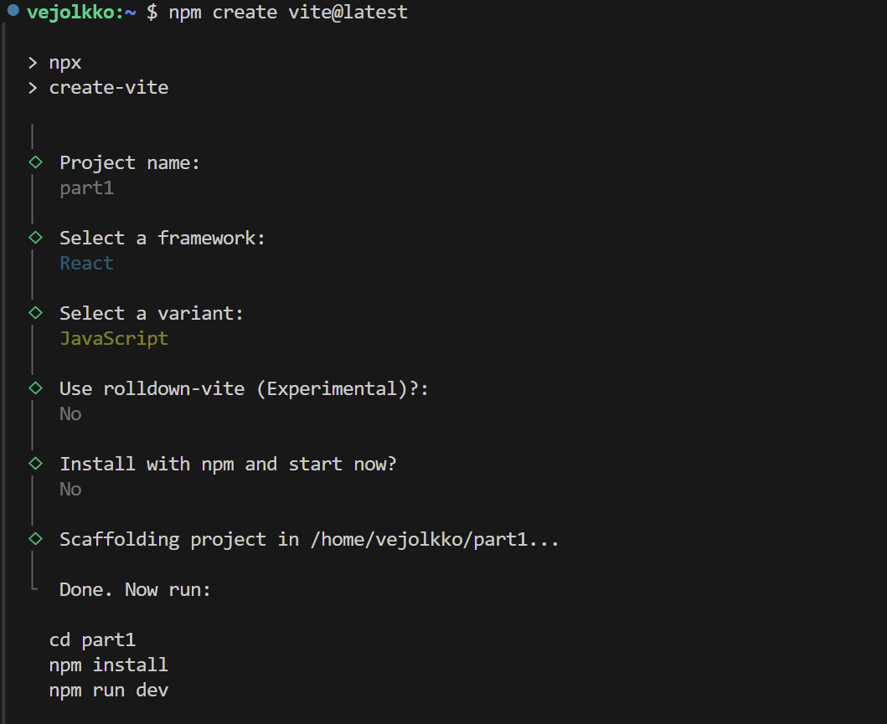

<div class="content">
<!-- We will now start getting familiar with probably the most important topic of this course, namely the [React](https://react.dev/) library. Let's start by making a simple React application as well as getting to know the core concepts of React.-->

我们现在将开始入门的可能是本课程最重要的主题，即[React](https://react.dev/)库。让我们从制作一个简单的React应用开始，同时了解React的核心概念。

<!-- The easiest way to get started by far is by using a tool called [Vite](https://vitejs.dev/).-->
到目前为止，最简单的方法是使用一个叫做[Vite](https://vitejs.dev/)的工具来开始。
 
<!-- Let's create a new application using the <i>create-vite</i> tool:
-->
让我们用<i>create-vite</i>创建一个新的应用：

```bash
npm create vite@latest
```

<!-- Let's answer the questions presented by the tool as follows: -->
让我们按照下列方式回答<i>create-vite</i>提出的问题：



<!-- We have now created an application named <i>part1</i>. The tool could have also installed the required dependencies and started the application automatically if we had answered "Yes" to the question "Install with npm and start now?" However, we will perform these steps manually so we can see how they are done. -->
我们现在创建了一个名为<i>part1</i>的应用。如果我们在回答问题“Install with npm and start now?”时选“Yes”的话，<i>create-vite</i>还会自动安装需要的依赖并启动应用。但是我们打算手动执行这些步骤，这样我们可以看看他们是怎么做的。

<!-- Next, let's move into the application's directory and install the required libraries: -->
接下来，让我们进入应用的目录并安装需要的库：

```bash
cd part1
npm install
```

<!-- The application is started as follows-->
该应用的打开方式如下

```bash
npm run dev
```

<!-- The console says that the application has started on localhost port 5173, i.e. the address <http://localhost:5173/>:-->
控制台显示该应用已在本地主机的5173端口运行，地址为<http://localhost:5173/>：


<!-- Vite starts the application [by default](https://vitejs.dev/config/server-options.html#server-port) on port 5173. If it is not free, Vite uses the next free port number.-->
Vite[默认](https://vitejs.dev/config/server-options.html#server-port)在端口5173启动应用。如果这个端口被占用，Vite使用下一个空闲端口号。

<!-- Open the browser and a text editor so that you can view the code as well as the webpage at the same time on the screen:-->
打开浏览器和文本编辑器，这样你就能在屏幕上同时看到代码和网页。


<!-- The code of the application resides in the <i>src</i> folder. Let's simplify the default code such that the contents of the file main.jsx looks like this:-->
应用的代码位于<i>src</i>文件夹中。让我们简化默认代码，使文件main.jsx的内容如下所示：

```js
import ReactDOM from 'react-dom/client'

import App from './App'

ReactDOM.createRoot(document.getElementById('root')).render(<App />)
```

<!-- and file <i>App.jsx</i> looks like this-->
而文件<i>App.jsx</i>看起来是这样的：

```js
const App = () => {
  return (
    <div>
      <p>Hello world</p>
    </div>
  )
}

export default App
```

<!-- The files <i>App.css</i> and <i>index.css</i>, and the directory <i>assets</i> may be deleted as they are not needed in our application right now.-->
文件<i>App.css</i>、<i>index.css</i>和目录<i>assets</i>可以删除，因为我们现在的应用并不需要它们。

<!-- ### Component -->
### 组件

<!-- The file <i>App.jsx</i> now defines a [React component](https://react.dev/learn/your-first-component) with the name <i>App</i>. The command on the final line of file <i>main.jsx</i>-->
文件<i>App.jsx</i>现在定义了一个名为<i>App</i>的[React组件](https://react.dev/learn/your-first-component)。文件<i>main.jsx</i>的最后一行命令

```js
ReactDOM.createRoot(document.getElementById('root')).render(<App />)
```

<!-- renders its contents into the <i>div</i>-element, defined in the file <i>public/index.html</i>, having the <i>id</i> value 'root'.-->
将其内容渲染到<i>div</i>-元素中，该元素在文件<i>public/index.html</i>中定义，其<i>id</i>值为'root'。

<!-- By default, the file <i>index.html</i> doesn't contain any HTML markup that is visible to us in the browser: -->
默认情况下，文件<i>index.html</i>不包含任何我们在浏览器中可见的HTML标记：

```html
<!doctype html>
<html lang="en">
  <head>
    <meta charset="UTF-8" />
    <link rel="icon" type="image/svg+xml" href="/vite.svg" />
    <meta name="viewport" content="width=device-width, initial-scale=1.0" />
    <title>part1</title>
  </head>
  <body>
    <div id="root"></div>
    <script type="module" src="/src/main.jsx"></script>
  </body>
</html>
```

<!-- You can try adding there some HTML to the file. However, when using React, all content that needs to be rendered is usually defined as React components. -->
你可以试着在该文件中添加一些HTML。但当使用React时，所有需要渲染的内容通常被定义为React组件。

<!-- Let's take a closer look at the code defining the component:-->
让我们仔细看一下定义组件的代码：

```js
const App = () => (
  <div>
    <p>Hello world</p>
  </div>
)
```

<!-- As you probably guessed, the component will be rendered as a <i>div</i>-tag, which wraps a <i>p</i>-tag containing the text <i>Hello world</i>.-->
正如你可能猜到的，这个组件将被渲染成一个包裹着<i>p</i>-标签的<i>div</i>-标签，而<i>p</i>-标签包含文本<i>Hello world</i>。

<!-- Technically the component is defined as a JavaScript function. The following is a function (which does not receive any parameters):-->
从技术角度来说，该组件被定义为一个JavaScript函数。下面是一个函数（它不接收任何参数）：

```js
() => (
  <div>
    <p>Hello world</p>
  </div>
)
```

<!-- The function is then assigned to a constant variable <i>App</i>:-->
然后这个函数被赋值给一个常量<i>App</i>。

```js
const App = ...
```

<!-- There are a few ways to define functions in JavaScript. Here we will use [arrow functions](https://developer.mozilla.org/en-US/docs/Web/JavaScript/Reference/Functions/Arrow_functions), which are described in a newer version of JavaScript known as [ECMAScript 6](http://es6-features.org/#Constants), also called ES6.-->
在JavaScript中定义函数有多种方法。这里我们将使用[箭头函数](https://developer.mozilla.org/en-US/docs/Web/JavaScript/Reference/Functions/Arrow_functions)，它是在较新的JavaScript版本[ECMAScript 6](http://es6-features.org/#Constants)，又称ES6中引入的。

<!-- Because the function consists of only a single expression we have used a shorthand, which represents this piece of code:-->
因为函数只由一个表达式组成，所以我们使用了简写来表示这一段代码：

```js
const App = () => {
  return (
    <div>
      <p>Hello world</p>
    </div>
  )
}
```

<!-- In other words, the function returns the value of the expression.-->
换句话说，该函数返回表达式的值。

<!-- The function defining the component may contain any kind of JavaScript code. Modify your component to be as follows: -->
定义该组件的函数可以包含任何种类的JavaScript代码。把你的组件修改成：

```js
const App = () => {
  console.log('Hello from component')
  return (
    <div>
      <p>Hello world</p>
    </div>
  )
}

export default App
```

<!-- and observe what happens in the browser console -->
然后观察控制台中发生了什么


<!-- The first rule of frontend web development: -->
前端开发的第一规矩：

<!-- > <i>keep the console open all the time</i> -->
> <i>始终打开控制台</i>

<!-- Let us repeat this together: <i>I promise to keep the console open all the time</i> during this course, and for the rest of my life when I'm doing web development. -->
让我们一起重复一遍：我保证在课程中，以及在我接下来的人生中，在开发网页时<i>始终打开控制台</i>。

<!-- It is also possible to render dynamic content inside of a component.-->
也可以在一个组件内渲染动态内容。

<!-- Modify the component as follows:-->
将组件修改成：

```js
const App = () => {
  const now = new Date()
  const a = 10
  const b = 20

  return (
    <div>
      <p>Hello world, it is {now.toString()}</p>
      <p>
        {a} plus {b} is {a + b}
      </p>
    </div>
  )
}
```

<!-- Any JavaScript code within the curly braces is evaluated and the result of this evaluation is embedded into the defined place in the HTML produced by the component.-->
大括号内的任何JavaScript代码都会被计算，计算的结果会被嵌入到组件产生的HTML中的定义位置。

<!-- Note that you should not remove the line at the bottom of the component -->
注意不要丢掉组件底下的这行代码

```js
export default App
```

<!-- The export is not shown in most of the examples of the course material. Without the export the component and the whole app breaks down. -->
export语句在教材的大多数示例中都被省略了。但如果没有export语句，组件和整个应用都会无法运行。

<!-- Did you remember your promise to keep the console open? What was printed out there? -->
还记得之前保证过始终打开控制台吗？去掉这一行后，控制台打印出了什么？

### JSX

<!-- It seems like React components are returning HTML markup. However, this is not the case. The layout of React components is mostly written using [JSX](https://react.dev/learn/writing-markup-with-jsx). Although JSX looks like HTML, we are dealing with a way to write JavaScript. Under the hood, JSX returned by React components is compiled into JavaScript.-->
看起来React组件返回的是HTML标记。然而，事实并非如此。React组件的布局大多是用[JSX](https://react.dev/learn/writing-markup-with-jsx)编写的。虽然JSX看起来像HTML，但我们实际上是在写JavaScript。在底层，由React组件返回的JSX会被编译成JavaScript。

<!-- After compiling, our application looks like this:-->
编译后，我们的应用如下所示：

```js
const App = () => {
  const now = new Date()
  const a = 10
  const b = 20
  return React.createElement(
    'div',
    null,
    React.createElement(
      'p', null, 'Hello world, it is ', now.toString()
    ),
    React.createElement(
      'p', null, a, ' plus ', b, ' is ', a + b
    )
  )
}
```

<!-- The compilation is handled by [Babel](https://babeljs.io/repl/). Projects created with *Vite* are configured to compile automatically. We will learn more about this topic in [part 7](/en/part7) of this course.-->
编译是由[Babel](https://babeljs.io/repl/)处理的。用*Vite*创建的项目会自动编译。我们将在本课程的[第7章节](/zh/part7)中学习更多关于这个主题的内容。

<!-- It is also possible to write React as "pure JavaScript" without using JSX. Although, nobody with a sound mind would actually do so.-->
也可以把React写成“纯JavaScript”而不使用JSX。虽然没有正常人会这样做的。

<!-- In practice, JSX is much like HTML with the distinction that with JSX you can easily embed dynamic content by writing appropriate JavaScript within curly braces. The idea of JSX is quite similar to many templating languages, such as Thymeleaf used along with Java Spring, which are used on servers.-->
实际上，JSX很像HTML，区别在于通过JSX，你可以在大括号内编写适当的JavaScript来轻松嵌入动态内容。JSX的理念与许多模板语言非常相似，例如和Java Spring一起在服务端使用的Thymeleaf。

<!-- JSX is "[XML](https://developer.mozilla.org/en-US/docs/Web/XML/XML_introduction)-like", which means that every tag needs to be closed. For example, a newline is an empty element, which in HTML can be written as follows:-->
JSX是“类[XML](https://developer.mozilla.org/en-US/docs/Web/XML/XML_introduction)”语言，这意味着每个标签都需要关闭。例如，换行是一个空元素，在HTML中可以这样写：

```html
<br>
```

<!-- but when writing JSX, the tag needs to be closed:-->
但在编写JSX时，标签需要关闭：

```html
<br />
```

<!-- ### Multiple components -->
### 多个组件

<!-- Let's modify the file <i>App.jsx</i> as follows: -->
让我们修改<i>App.jsx</i>文件如下：

```js
// highlight-start
const Hello = () => {
  return (
    <div>
      <p>Hello world</p>
    </div>
  )
}
// highlight-end

const App = () => {
  return (
    <div>
      <h1>Greetings</h1>
      <Hello /> // highlight-line
    </div>
  )
}
```

<!-- We have defined a new component <i>Hello</i> and used it inside the component <i>App</i>. Naturally, a component can be used multiple times:-->
我们定义了一个新的组件<i>Hello</i>，并把它用在了<i>App</i>组件里。当然，一个组件可以多次使用：

```js
const App = () => {
  return (
    <div>
      <h1>Greetings</h1>
      <Hello />
      // highlight-start
      <Hello />
      <Hello />
      // highlight-end
    </div>
  )
}
```

<!-- **NB**: <em>export</em> at the bottom is left out in these <i>examples</i>, now and in the future. It is still needed for the code to work -->
**注意**：在这些<i>示例</i>以及将来的<i>示例</i>中，底部的<em>export</em>部分被省略。但它仍然是代码正常运行所必须的

<!-- Writing components with React is easy, and by combining components, even a more complex application can be kept fairly maintainable. Indeed, a core philosophy of React is composing applications from many specialized reusable components.-->
用React编写组件是很容易的，通过组合组件，即使是比较复杂的应用也可以保持相当的可维护性。事实上，React的一大核心理念就是将应用由许多专门的可重复使用的组件组成。

<!-- Another strong convention is the idea of a <i>root component</i> called <i>App</i> at the top of the component tree of the application. Nevertheless, as we will learn in [part 6](/en/part6), there are situations where the component <i>App</i> is not exactly the root, but is wrapped within an appropriate utility component.-->
另一个强制的惯例是在应用的组件树的顶端有一个叫做<i>App</i>的<i>根组件</i>。然而，我们将在[第6章节](/zh/part6)中讲到，有些情况下，<i>App</i>实际上并不是根组件，而是被包裹在一个适当的实用组件中。

<!-- ### props: passing data to components -->
### props：向组件传递数据

<!-- It is possible to pass data to components using so called [props](https://react.dev/learn/passing-props-to-a-component).-->
可以使用所谓的[props](https://react.dev/learn/passing-props-to-a-component)向组件传递数据。

<!-- Let's modify the component <i>Hello</i> as follows: -->
让我们将<i>Hello</i>组件修改如下：

```js
const Hello = (props) => { // highlight-line
  return (
    <div>
      <p>Hello {props.name}</p> // highlight-line
    </div>
  )
}
```

<!-- Now the function defining the component has a parameter props. As an argument, the parameter receives an object, which has fields corresponding to all the "props" the user of the component defines. -->
现在定义组件的函数有一个参数props。作为一个参数，该参数接收一个对象，其字段对应于组件使用者定义的所有“props”。

<!-- The props are defined as follows:-->
props的定义如下：

```js
const App = () => {
  return (
    <div>
      <h1>Greetings</h1>
      <Hello name="George" /> // highlight-line
      <Hello name="Daisy" /> // highlight-line
    </div>
  )
}
```

<!-- There can be an arbitrary number of props and their values can be "hard-coded" strings or the results of JavaScript expressions. If the value of the prop is achieved using JavaScript it must be wrapped with curly braces. -->
props的数量可以是任意的，它们的值可以是“硬编码”的字符串或JavaScript表达式的结果。如果props的值是通过JavaScript得到的，props必须包裹在大括号中。

<!-- Let's modify the code so that the component <i>Hello</i> uses two props:-->
让我们修改代码，让<i>Hello</i>组件使用两个props：

```js
const Hello = (props) => {
  console.log(props) // highlight-line
  return (
    <div>
      <p>
        Hello {props.name}, you are {props.age} years old // highlight-line
      </p>
    </div>
  )
}

const App = () => {
  const name = 'Peter' // highlight-line
  const age = 10       // highlight-line

  return (
    <div>
      <h1>Greetings</h1>
      <Hello name="Maya" age={26 + 10} /> // highlight-line
      <Hello name={name} age={age} />     // highlight-line
    </div>
  )
}
```

<!-- The props sent by the component <i>App</i> are the values of the variables, the result of the evaluation of the sum expression and a regular string.-->
<i>App</i>组件发送的props有变量的值、表达式的计算结果和普通的字符串。

<!-- Component <i>Hello</i> also logs the value of the object props to the console. -->
<i>Hello</i>组件还会将对象props的值打印到控制台上。

<!-- I really hope your console was open. If it was not, remember what you promised: -->
我真心希望你的控制台是开着的。否则，记住之前保证过的：

<!-- > <i>I promise to keep the console open all the time during this course, and for the rest of my life when I'm doing web development</i> -->
> <i>我保证在课程中，以及在我接下来的人生中，在开发网页时始终打开控制台</i>

<!-- Software development is hard. It gets even harder if one is not using all the possible available tools such as the web-console and debug printing with _console.log_. Professionals use both <i>all the time</i> and there is no single reason why a beginner should not adopt the use of these wonderful helper methods that will make their life so much easier. -->
软件开发并非易事。如果不利用所有可用的工具，比如网页控制台和_console.log_打印的调试信息，那就更难了。专业人士<i>始终</i>都用这两样工具。对初学者来说，没有任何理由不用这些美妙的工具来让生活更轻松。

<!-- ### Possible error message -->
### 可能遇见的错误信息

<!-- If your project has React version 18 or earlier installed, you may receive the following error message at this point: -->
如果你的项目装的React版本是18或更早的，你可能会在此时遇到这样的报错信息：


<!-- It's not an actual error, but a warning caused by the [ESLint](https://eslint.org/) tool. You can silence the warning [react/prop-types](https://github.com/jsx-eslint/eslint-plugin-react/blob/master/docs/rules/prop-types.md) by adding to the file <i>eslint.config.js</i> the next line -->
这实际上并不是个错误，只是工具[ESLint](https://eslint.org/)产生的警告。你可以在文件<i>eslint.config.js</i>中添加下面这一行来关闭[react/prop-types](https://github.com/jsx-eslint/eslint-plugin-react/blob/master/docs/rules/prop-types.md)警告

```js
export default [
  { ignores: ['dist'] },
  {
    files: ['**/*.{js,jsx}'],
    languageOptions: {
      ecmaVersion: 2020,
      globals: globals.browser,
      parserOptions: {
        ecmaVersion: 'latest',
        ecmaFeatures: { jsx: true },
        sourceType: 'module',
      },
    },
    settings: { react: { version: '18.3' } },
    plugins: {
      react,
      'react-hooks': reactHooks,
      'react-refresh': reactRefresh,
    },
    rules: {
      ...js.configs.recommended.rules,
      ...react.configs.recommended.rules,
      ...react.configs['jsx-runtime'].rules,
      ...reactHooks.configs.recommended.rules,
      'react/jsx-no-target-blank': 'off',
      'react-refresh/only-export-components': [
        'warn',
        { allowConstantExport: true },
      ],
      'react/prop-types': 0, // highlight-line
    },
  },
]
```

<!-- We will get to know ESLint in more detail [in part 3](/en/part3/validation_and_es_lint#lint). -->
我们将在[第3章节](/zh/part3/es_lint与代码检查#lint)详细介绍ESLint。

<!-- ### Some notes -->
### 一些注意事项

<!-- React has been configured to generate quite clear error messages. Despite this, you should, at least in the beginning, advance in **very small steps** and make sure that every change works as desired.-->
React已经能生成相当清晰的错误信息。尽管如此，你仍应该以**非常小的步骤**前进，来确保每一个改变都能如愿以偿，至少在初学的时候如此。

<!-- **The console should always be open**. If the browser reports errors, it is not advisable to continue writing more code, hoping for miracles. You should instead try to understand the cause of the error and, for example, go back to the previous working state:-->
**控制台应始终打开**。如果浏览器报告错误，不建议继续写更多的代码，寄希望有奇迹出现。相反，你应该试着理解错误的原因，然后比如说回到之前的工作状态。


<!-- As we already mentioned, when programming with React, it is possible and worthwhile to write <em>console.log()</em> commands (which print to the console) within your code. -->
我们之前提到过，在编写React时，在代码中写<em>console.log()</em>命令（打印到控制台）是可行的，也是值得的。

<!-- Also, keep in mind that **First letter of React component names must be capitalized**. If you try defining a component as follows: -->
还要记住，**React组件名称的首字母必须大写**。如果你尝试这样定义一个组件：

```js
const footer = () => {
  return (
    <div>
      greeting app created by <a href="https://github.com/mluukkai">mluukkai</a>
    </div>
  )
}
```

<!-- and use it like this-->
然后这样使用它

```js
const App = () => {
  return (
    <div>
      <h1>Greetings</h1>
      <Hello name="Maya" age={26 + 10} />
      <footer /> // highlight-line
    </div>
  )
}
```

<!-- the page is not going to display the content defined within the Footer component, and instead React only creates an empty [footer](https://developer.mozilla.org/en-US/docs/Web/HTML/Element/footer) element, i.e. the built-in HTML element instead of the custom React element of the same name. If you change the first letter of the component name to a capital letter, then React creates a <i>div</i>-element defined in the Footer component, which is rendered on the page.-->
页面不会显示在Footer组件中定义的内容，相反，React只会创建一个空的[footer](https://developer.mozilla.org/en-US/docs/Web/HTML/Element/footer)元素，即HTML内置的元素，而不是同名的自定义React元素。如果你把组件名称的第一个字母改为大写字母，那么React就会创建一个定义在Footer组件中的<i>div</i>-元素，并在页面上渲染。

<!-- Note that the content of a React component (usually) needs to contain **one root element**. If we, for example, try to define the component <i>App</i> without the outermost <i>div</i>-element:-->
注意，React组件的内容（通常）需要包含**一个根元素**。比如如果我们试图定义没有最外层的<i>div</i>元素的<i>App</i>组件：

```js
const App = () => {
  return (
    <h1>Greetings</h1>
    <Hello name="Maya" age={26 + 10} />
    <Footer />
  )
}
```

<!-- the result is an error message.-->
结果一条错误信息。


<!-- Using a root element is not the only working option. An <i>array</i> of components is also a valid solution:-->
使用根元素并不是唯一可行的选择。一个组件的<i>数组</i>也是一个有效的解决方案：

```js
const App = () => {
  return [
    <h1>Greetings</h1>,
    <Hello name="Maya" age={26 + 10} />,
    <Footer />
  ]
}
```

<!-- However, when defining the root component of the application this is not a particularly wise thing to do, and it makes the code look a bit ugly.-->
然而，在定义应用的根元素时，这种做法并不特别明智，并且这样做使代码看起来有点难看。

<!-- Because the root element is stipulated, we have "extra" div elements in the DOM tree. This can be avoided by using [fragments](https://react.dev/reference/react/Fragment), i.e. by wrapping the elements to be returned by the component with an empty element: -->
由于根元素是强制规定的，我们在DOM树中有“额外的”div元素。我们可以通过使用[Fragment](https://react.dev/reference/react/Fragment)来避免“额外的”div元素，即用一个空元素来包装组件要返回的元素：

```js
const App = () => {
  const name = 'Peter'
  const age = 10

  return (
    <>
      <h1>Greetings</h1>
      <Hello name="Maya" age={26 + 10} />
      <Hello name={name} age={age} />
      <Footer />
    </>
  )
}
```

<!-- It now compiles successfully, and the DOM generated by React no longer contains the extra div element. -->
现在编译成功了，由React生成的DOM也不再包含额外的div元素。

<!-- ### Do not render objects -->
### 不要渲染对象

<!-- Consider an application that prints the names and ages of our friends on the screen: -->
考虑一个将我们朋友的姓名和年龄打印到屏幕上的应用：

```js
const App = () => {
  const friends = [
    { name: 'Peter', age: 4 },
    { name: 'Maya', age: 10 },
  ]

  return (
    <div>
      <p>{friends[0]}</p>
      <p>{friends[1]}</p>
    </div>
  )
}

export default App
```

<!-- However, nothing appears on the screen. I've been trying to find a problem in the code for 15 minutes, but I can't figure out where the problem could be. -->
可是，屏幕上什么都没有。我在代码里找问题找了15分钟，但是我还是不知道哪里出了问题。

<!-- I finally remember the promise we made -->
我终于想起来我们之前保证过的

<!-- > <i>I promise to keep the console open all the time during this course, and for the rest of my life when I'm doing web development</i> -->
> <i>我保证在课程中，以及在我接下来的人生中，在开发网页时始终打开控制台</i>

<!-- The console screams in red: -->
控制台飘着红色的文字：


<!-- The core of the problem is <i>Objects are not valid as a React child</i>, i.e. the application tries to render <i>objects</i> and it fails again. -->
问题的核心在于<i>对象不是有效的React子组件</i>，也就是说应用尝试渲染<i>对象</i>但失败了。

<!-- The code tries to render the information of one friend as follows -->
代码尝试这样渲染一个朋友的信息

```js
<p>{friends[0]}</p>
```

<!-- and this causes a problem because the item to be rendered in the braces is an object. -->
但出了问题，因为大括号中要渲染的东西是一个对象。

```js
{ name: 'Peter', age: 4 }
```

<!-- In React, the individual things rendered in braces must be primitive values, such as numbers or strings. -->
在React里，在大括号中渲染的每个东西都必须是原始值，比如数字或字符串。

<!-- The fix is ​​as follows -->
修好的代码如下：

```js
const App = () => {
  const friends = [
    { name: 'Peter', age: 4 },
    { name: 'Maya', age: 10 },
  ]

  return (
    <div>
      <p>{friends[0].name} {friends[0].age}</p>
      <p>{friends[1].name} {friends[1].age}</p>
    </div>
  )
}

export default App
```

<!-- So now the friend's name is rendered separately inside the curly braces -->
现在朋友的名字分别在大括号中渲染

```js
{friends[0].name}
```

<!-- and age -->
年龄亦然

```js
{friends[0].age}
```

<!-- After correcting the error, you should clear the console error messages by pressing 🚫 and then reload the page content and make sure that no error messages are displayed. -->
在改正错误后，你应该按🚫来清除控制台的错误，然后刷新页面并确保没有显示新的错误信息。

<!-- A small additional note to the previous one. React also allows arrays to be rendered <i>if</i> the array contains values ​​that are eligible for rendering (such as numbers or strings). So the following program would work, although the result might not be what we want: -->
还有一个小小的注意事项。React是支持渲染数组的，<i>只要</i>数组中的每个元素都能渲染（比如数字或字符串）。所以下面这个程序是能运行的，虽然结果可能不是我们想要的：

```js
const App = () => {
  const friends = [ 'Peter', 'Maya']

  return (
    <div>
      <p>{friends}</p>
    </div>
  )
}
```

<!-- In this part, it is not even worth trying to use the direct rendering of the tables, we will come back to it in the next part. -->
在这一章节中，还不需要用到表格的直接渲染，我们会在下一章节中提起。

</div>

<div class="tasks">
<!--   <h3>Exercises 1.1.-1.2.</h3>-->
  <h3>练习1.1.~1.2.</h3>

<!-- The exercises are submitted via GitHub, and by marking the exercises as done in the "my submissions" tab of the [submission application](https://studies.cs.helsinki.fi/stats/courses/fullstackopen). -->
练习通过GitHub上交，并在[上交应用](https://studies.cs.helsinki.fi/stats/courses/fullstackopen)的“my submissions”标签页中标记所有已完成的练习。

<!-- The exercises are submitted **one part at a time**. When you have submitted the exercises for a part of the course you can no longer submit undone exercises for the same part.-->
练习是**一次上交一个章节**的。当你上交了课程中某一章节的练习，你就不能再上交同一章节的未完成的练习。

<!-- Note that in this part, there are [more exercises](/en/part1/a_more_complex_state_debugging_react_apps#exercises-1-6-1-14) besides those found below. <i>Do not submit your work</i> until you have completed all of the exercises you want to submit for the part. -->
请注意，在这一章节，除了下面的练习，还有[更多的练习](/zh/part1/复杂状态，调试_react应用#练习-1-6-1-14)。在你完成该章节的所有练习之前，<i>请不要上交你的作品</i>。

<!-- You may submit all the exercises of this course into the same repository, or use multiple repositories. If you submit exercises of different parts into the same repository, please use a sensible naming scheme for the directories.-->
你可以将本课程的所有练习上交到同一个仓库，也可以使用多个仓库。如果你将不同章节的练习上交到同一个仓库，请使用合理的目录命名方案。

<!-- One very functional file  structure for the submission repository is as follows:-->
下面是一个非常实用的上交仓库的文件结构：

```text
part0
part1
  courseinfo
  unicafe
  anecdotes
part2
  phonebook
  countries
```

<!-- See this [example submission repository](https://github.com/fullstack-hy2020/example-submission-repository)!-->
请看这个[示例上交库](https://github.com/fullstack-hy2020/example-submission-repository)！

<!-- For each part of the course there is a directory, which further branches into directories containing a series of exercises, like "unicafe" for part 1.-->
课程的每一章节都有一个目录，每个目录下面还有一系列练习的目录，如第1章节的“unicafe”。

<!-- Most of the exercises of the course build a larger application, eg. courseinfo, unicafe and anecdotes in this part, bit by bit. It is enough to submit the completed application. You can make a commit after each exercise, but that is not compulsory. For example the course info app is built in exercises 1.1.-1.5. It is just the end result after 1.5 that you need to submit! -->
课程中的大多数联系都会一点一点地构成更大的应用，比如这一章节的courseinfo、unicafe和anecdotes。只要上交最终完成的应用就可以了。你可以每完成一道练习就在git中做一次提交，但这不是必须的。比如练习1.1.~1.5会构建一个课程信息的应用，只需要上交完成1.5后的成果就可以了！

<!-- For each web application for a series of exercises, it is recommended to submit all files relating to that application, except for the directory <i>node\_modules</i>.-->
对于每道Web应用的系列练习，建议上交所有与该应用有关的文件，除了目录<i>node\_modules</i>。

  <!-- <h4>1.1: Course Information, step 1</h4> -->
  <h4>1.1：课程信息，第1步</h4>

<!-- <i>The application that we will start working on in this exercise will be further developed in a few of the following exercises. In this and other upcoming exercise sets in this course, it is enough to only submit the final state of the application. If desired, you may also create a commit for each exercise of the series, but this is entirely optional.</i> -->
<i>我们在这道练习中将要开始处理的应用程序将在以下几道练习中得到进一步开发。在本课程的这个和接下来的练习集中，只要上交应用程序的最终状态就足够了。如果你想，你也可以为系列的每道练习创建一个git提交，但这不是必要的。</i>

<!-- Use Vite to initialize a new application. Modify <i>main.jsx</i> to match the following-->
使用Vite来初始化一个新的应用。修改<i>main.jsx</i>为

```js
import ReactDOM from 'react-dom/client'

import App from './App'

ReactDOM.createRoot(document.getElementById('root')).render(<App />)
```

<!-- and <i>App.jsx</i> to match the following-->
修改<i>App.jsx</i>为

```js
const App = () => {
  const course = 'Half Stack application development'
  const part1 = 'Fundamentals of React'
  const exercises1 = 10
  const part2 = 'Using props to pass data'
  const exercises2 = 7
  const part3 = 'State of a component'
  const exercises3 = 14

  return (
    <div>
      <h1>{course}</h1>
      <p>
        {part1} {exercises1}
      </p>
      <p>
        {part2} {exercises2}
      </p>
      <p>
        {part3} {exercises3}
      </p>
      <p>Number of exercises {exercises1 + exercises2 + exercises3}</p>
    </div>
  )
}

export default App
```

<!-- and remove the extra files <i>App.css</i> and <i>index.css</i>, also remove the directory <i>assets</i>. -->
然后删除多余的文件<i>App.css</i>和<i>index.css</i>，以及目录<i>assets</i>。

<!-- Unfortunately, the entire application is in the same component. Refactor the code so that it consists of three new components: <i>Header</i>, <i>Content</i>, and <i>Total</i>. All data still resides in the <i>App</i> component, which passes the necessary data to each component using <i>props</i>. <i>Header</i> takes care of rendering the name of the course, <i>Content</i> renders the parts and their number of exercises and <i>Total</i> renders the total number of exercises.-->
整个应用都在同一个组件中。重构代码，使其由三个新组件组成：<i>Header</i>、<i>Content</i>和<i>Total</i>。所有数据仍驻留在<i>App</i>组件中，使用<i>props</i>将必要的数据传递给每个组件。<i>Header</i>负责显示课程的名称，<i>Content</i>显示各部分及其练习的数量，<i>Total</i>显示练习的总数量。

<!-- Define the new components in file <i>App.jsx</i>.-->
在文件<i>App.jsx</i>中定义新组件。

<!-- The <i>App</i> component's body will approximately be as follows:-->
<i>App</i>组件的主体将大致如下：

```js
const App = () => {
  // const-definitions

  return (
    <div>
      <Header course={course} />
      <Content ... />
      <Total ... />
    </div>
  )
}
```

<!-- **WARNING** Don't try to program all the components concurrently, because that will almost certainly break down the whole app. Proceed in small steps, first make e.g. the component <i>Header</i> and only when it works for sure, you could proceed to the next component. -->
**警告** 不要想着同时做好所有组件，这基本上肯定会让整个应用无法运行。一小步一小步地前进，比如首先做<i>Header</i>组件，等到确定<i>Header</i>能运行了，再做下一个组件。

<!-- Careful, small-step progress may seem slow, but it is actually <i> by far the fastest</i> way to progress. Famous software developer Robert "Uncle Bob" Martin has stated -->
当心，小步前进也许看起来很慢，但这实际上是<i>至今为止最快的</i>前进方法。知名软件开发者Robert "Uncle Bob" Martin曾说过

> <i>"The only way to go fast, is to go well"</i>

> <i>“快速前进的唯一办法，是稳步前进”</i>

<!-- that is, according to Martin, careful progress with small steps is even the only way to be fast. -->
也就是说，按Martin所说的，小心谨慎地小步前进甚至是快速前进的唯一的方法。

<!-- <h4>1.2: Course Information, step 2</h4> -->
<h4>1.2：课程信息，第2步</h4>

<!-- Refactor the <i>Content</i> component so that it does not render any names of parts or their number of exercises by itself. Instead, it only renders three <i>Part</i> components of which each renders the name and number of exercises of one part. -->
重构<i>Content</i>组件，使其本身不渲染任何部件的名称或其练习次数。相反，它只渲染三个<i>Part</i>组件，每个组件渲染一个部分的名称和练习的次数。

```js
const Content = ... {
  return (
    <div>
      <Part .../>
      <Part .../>
      <Part .../>
    </div>
  )
}
```

<!-- Our application passes on information in quite a primitive way at the moment, since it is based on individual variables. We shall fix that in [part 2](/en/part2), but before that, let's go to part1b to learn about JavaScript. -->
我们的应用目前以相当原始的方式传递信息，因为它是基于独立变量的。我们将在[第2章节](/zh/part2)改善，但在此之前，让我们先去第1b章学习一下JavaScript。

</div>
