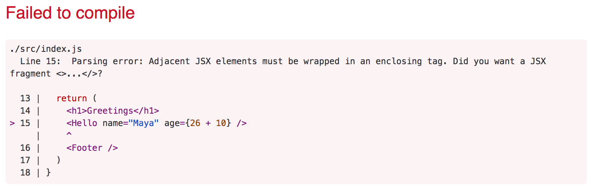

<div class="content">
<!-- We will now start getting familiar with probably the most important topic of this course, namely the [React](https://reactjs.org/)-library. Let's start off with making a simple React application as well as getting to know the core concepts of React. -->

我们即将开始学习大概是本门课程中最重要的议题—— [React](https://reactjs.org/)。 让我们从制作一个简单的 React 应用开始，同时了解一下 React 的核心概念。

<!-- The easiest way to get started by far is using a tool called [create-react-app](https://github.com/facebookincubator/create-react-app). It is possible (but not necessary) to install <i>create-react-app</i> on your machine if the <i>npm</i> tool that was installed along with Node has a version number of at least <i>5.3</i>. -->

目前来说，创建一个React应用最简单的方式是使用一个叫做[create-react-app](https://github.com/facebook/create-react-app) 的工具。 如果你随着node安装的npm工具版本号不小于5.3，你就可以（也不是必须的）在机器上安装 <i>create-react-app</i> 了。

<!-- Let's create an application called <i>part1</i> and navigate to its directory. -->
让我们创建一个名为 <i>part1</i> 的应用，并进入到它的目录。

```bash
$ npx create-react-app part1
$ cd part1
```

<!-- Every command, here and in the future, starting with the character <em>$</em> is typed into a terminal prompt, aka the command-line. The character <em>$</em> is not to be typed out because it represents the prompt. -->
从现在开始，所有以<em>$</em> 开头的命令都表示是输入到终端的，也就是命令行。 但不要把 <em>$</em> 本身敲到终端，它只是一个输入终端的提示符。

<!-- The application is run as follows -->
用如下命令就可以让应用运行起来了

```bash
$ npm start
```

<!-- By default, the application runs in localhost port 3000 with the address <http://localhost:3000> -->
默认情况下，应用在本地localhost，3000端口运行，地址为 http://localhost:3000

<!-- Chrome should launch automatically. Open the browser console **immediately**. Also open a text editor so that you can view the code as well as the web-page at the same time on the screen: -->

Chrome这时应该会自动启动。 别忘了，**立即**打开浏览器控制台。 还可以打开一个文本编辑器，这样你就可以同时在屏幕上查看代码和网页了： 


<!-- The code of the application resides in the <i>src</i> folder. Let's simplify the default code such that the contents of the file <i>index.js</i> look like: -->

应用的代码位于<i>src</i> 文件夹中。 让我们简化一下默认代码，将文件<i>index.js</i> 的内容改成:

```js
import ReactDOM from 'react-dom'
import App from './App'

ReactDOM.render(
  <App />,
  document.getElementById('root')
)
```

<i>App.js</i> 看起来像这样

```js
import React from 'react'
const App = () => (
  <div>
    <p>Hello world lo23</p>
  </div>
)

export default App
```
<!-- The files <i>App.js</i>, <i>App.css</i>, <i>App.test.js</i>, <i>logo.svg</i> and <i>reportWebVitals.js</i> may be deleted as they are not needed in our application right now. -->
文件 <i>App.css</i>、<i>App.test.js</i>、<i>logo.svg</i>、, <i>setupTests.js</i>  和<i>reportWebVitals.js</i> 可以删除，因为它们目前在我们的应用中不并需要。

### Component
【组件】
<!-- The file <i>index.js</i> now defines a React-[component](https://reactjs.org/docs/components-and-props.html) with the name <i>App</i> and the command on the final line -->
文件<i>App.js</i> 定义了一个 React-[组件component](https://reactjs.org/docs/components-and-props.html) ，命名为<i>App</i>， <i>index.js</i> 的最后一行代码为：

```js
ReactDOM.render(<App />, document.getElementById('root'))
```

<!-- renders its contents into the <i>div</i>-element, defined in the file <i>public/index.html</i>, having the <i>id</i> value 'root'. -->
这是将其内容渲染到<i>div</i> 元素中，其 <i>id</i> 值为 'root'，该元素在文件<i>public/index.html</i>中定义。


<!-- By default, the file <i>public/index.html</i> doesn't contain any HTML markup that is visible to us in the browser. You can try adding some HTML into the file. However, when using React, all content that needs to be rendered is usually defined as React components. -->
默认情况下，文件 <i>public/index.html</i> 并没有什么能够展示在浏览器的HTML标签内容。 您可以尝试在文件中添加一些 HTML。 但是，在用 React 开发时，需要渲染的内容通常需要定义为 React 组件。

<!-- Let's take a closer look at the code defining the component: -->
让我们仔细看看定义组件的代码:

```js
const App = () => (
  <div>
    <p>Hello world</p>
  </div>
)
```

<!-- As you probably guessed, the component will be rendered as a <i>div</i>-tag, which wraps a <i>p</i>-tag containing the text <i>Hello world</i>. -->
您可能已经猜到，该组件将被渲染为<i>div</i>-标签，div中又包含一个<i>p</i>-标签，p标签包含的文本为<i>Hello world</i> 。

<!-- Technically the component is defined as a JavaScript function. The following is a function (which does not receive any parameters): -->
严格来说，这个组件被定义成了一个 JavaScript 函数。如下所示，这是一个不接收任何参数的函数 :

```js
() => (
  <div>
    <p>Hello world</p>
  </div>
)
```

<!-- The function is then assigned to a constant variable <i>App</i>: -->
然后该函数被赋给一个 const 修饰的变量 <i>App</i>:

```js
const App = ...
```

<!-- There are a few ways to define functions in JavaScript. Here we will use [arrow functions](https://developer.mozilla.org/en-US/docs/Web/JavaScript/Reference/Functions/Arrow_functions), which are described in a newer version of JavaScript known as [ECMAScript 6](http://es6-features.org/#Constants), also called ES6. -->

在 JavaScript 中定义函数有几种方法。 在这里，我们会一直使用[箭头函数](https://developer.mozilla.org/en-us/docs/web/JavaScript/reference/functions/arrow_functions) ，箭头函数定义在新版本的 JavaScript 标准中，即[ECMAScript 6](http://ES6-features.org/#constants) ，也叫做 ES6。

<!-- Because the function consists of only a single expression we have used a shorthand, which represents this piece of code: -->
由于这个函数只包含一个表达式，所以我们使用了简写，不简写的话是如下这段代码:

```js
const App = () => {
  return (
    <div>
      <p>Hello world</p>
    </div>
  )
}
```

<!-- In other words, the function returns the value of the expression. -->
换句话说，这个函数返回了表达式的值。

<!-- The function defining the component may contain any kind of JavaScript code. Modify your component to be as follows and observe what happens in the console: -->
定义组件的函数中可以包含任何类型的 JavaScript 代码。按如下修改你的组件，观察控制台中的内容:

```js
const App = () => {
  console.log('Hello from component')
  return (
    <div>
      <p>Hello world</p>
    </div>
  )
}
```

<!-- It is also possible to render dynamic content inside of a component. -->

你还可以在组件内部渲染动态内容。

<!-- Modify the component as follows: -->
对组件修改如下：

```js
const App = () => {
  const now = new Date()
  const a = 10
  const b = 20

  return (
    <div>
      <p>Hello world, it is {now.toString()}</p>
      <p>
        {a} plus {b} is {a + b}
      </p>
    </div>
  )
}
```

<!-- Any JavaScript code within the curly braces is evaluated and the result of this evaluation is embedded into the defined place in the HTML produced by the component. -->

大括号中的任何代码都会被计算，并且计算的结果将嵌入到HTML中，嵌入的位置就是 HTML 中定义的位置。

### JSX
<!-- It seems like React components are returning HTML markup. However, this is not the case. The layout of React components is mostly written using [JSX](https://reactjs.org/docs/introducing-jsx.html). Although JSX looks like HTML, we are actually dealing with a way to write JavaScript. Under the hood, JSX returned by React components is compiled into JavaScript. -->

看起来 React 组件返回的是 HTML 标签，但实际并不是这样。 React 组件的布局大部分是使用[JSX](https://reactjs.org/docs/introducing-JSX.html)编写的。 尽管 JSX 看起来像 HTML，但我们其实是在用一种特殊的方法写 JavaScript 。 在底层，React 组件实际上返回的 JSX 会被编译成 JavaScript。

<!-- After compiling, our application looks like this: -->
编译后，我们的应用如下所示:

```js

const App = () => {
  const now = new Date()
  const a = 10
  const b = 20
  return React.createElement(
    'div',
    null,
    React.createElement(
      'p', null, 'Hello world, it is ', now.toString()
    ),
    React.createElement(
      'p', null, a, ' plus ', b, ' is ', a + b
    )
  )
}

```

<!-- The compiling is handled by [Babel](https://babeljs.io/repl/). Projects created with *create-react-app* are configured to compile automatically. We will learn more about this topic in [第7章](/zh/part7) of this course. -->
编译是由[Babel](https://babeljs.io/repl/)处理的。 使用 *create-react-app* 创建的项目会配置为自动编译。 我们将在本课程的[第7章节](/zh/part7)中学习更多关于这个议题的知识。

<!-- It is also possible to write React as "pure JavaScript" without using JSX. Although, nobody with a sound mind would actually do so. -->
也可以将 React 写成“纯 JavaScript”，而不用 JSX。 但没有一个精神正常的人会这样做的。

<!-- In practice, JSX is much like HTML with the distinction that with JSX you can easily embed dynamic content by writing appropriate JavaScript within curly braces. The idea of JSX is quite similar to many templating languages, such as Thymeleaf used along Java Spring, which are used on servers. -->

实际上，JSX 与 HTML 非常相似，其区别在于，通过在大括号中编写一些 JavaScript，可以轻松地嵌入一些动态内容。 JSX 的思想与许多模板语言非常相似，就如在 Java Spring 中使用的 Thymeleaf（是一种服务器模板语言）。

<!-- JSX is "[XML](https://developer.mozilla.org/en-US/docs/Web/XML/XML_introduction)-like", which means that every tag needs to be closed. For example, a newline is an empty element, which in HTML can be written as follows: -->
JSX 是一种“类[XML](https://developer.mozilla.org/en-us/docs/web/XML/xml_introduction)”语言，这意味着每个标签都需要关闭。 例如，换行符是一个空元素，在 HTML 中可以这样写: 

```html
<br>
```

<!-- but when writing JSX, the tag needs to be closed: -->

但是在写 JSX 时，标签需要如下关闭:

```html
<br />
```
### Multiple components
【多组件】
<!-- Let's modify the application as follows (NB: imports at the top of the file are left out in these <i>examples</i>, now and in the future. They are still needed for the code to work): -->

让我们按照如下方式修改应用(注意: 文件顶部的imports在这些示例中被省略了，以后也会这么处理。 但它们是代码正常运行必需的) :

<!-- Let's modify the file <i>App.js</i> as follows (NB: import at the top of the file and export at the bottom are left out in these <i>examples</i>, now and in the future. They are still needed for the code to work): -->
让我们按照如下方式修改 <i>App.js</i> (注意: 文件顶部的import 在这些示例中被省略了，以后也会这么处理。 但它们是代码正常运行必需的) :

```js
// highlight-start
const Hello = () => {
  return (
    <div>
      <p>Hello world</p>
    </div>
  )
}
// highlight-end

const App = () => {
  return (
    <div>
      <h1>Greetings</h1>
      <Hello /> // highlight-line
    </div>
  )
}

```

<!-- We have defined a new component <i>Hello</i> and used it inside the component <i>App</i>. Naturally, a component can be used multiple times: -->

这里我们定义了一个新的组件<i>Hello</i>，并在组件<i>App</i> 中引用了它。 当然，一个组件可以重用:

```js
const App = () => {
  return (
    <div>
      <h1>Greetings</h1>
      <Hello />
      // highlight-start
      <Hello />
      <Hello />
      // highlight-end
    </div>
  )
}
```

<!-- Writing components with React is easy, and by combining components, even a more complex application can be kept fairly maintainable. Indeed, a core philosophy of React is composing applications from many specialized reusable components. -->

使用 React 编写组件很容易，通过组合组件，甚至可以使相当复杂的应用保持很好的可维护性。 实际上，React 的核心理念，就是将许多定制化的、可重用的组件组合成应用。

<!-- Another strong convention is the idea of a <i>root component</i> called <i>App</i> at the top of the component tree of the application. Nevertheless, as we will learn in [第6章](/zh/part6), there are situations where the component <i>App</i> is not exactly the root, but is wrapped within an appropriate utility component. -->

还有一个约定，就是应用的组件树顶部都要有一个<i>root 组件</i> 叫做<i>App</i>。 然而，正如我们将在[第6章](/zh/ part6)将要讲到的，在某些情况下，组件的根并不一定是<i>App</i> ，而是包装在了一些工具组件中。

### props: passing data to components 
【props：向组件传递数据】


<!-- It is possible to pass data to components using so called [props](https://reactjs.org/docs/components-and-props.html). -->
使用所谓的[props](https://reactjs.org/docs/components-and-props.html)，可以将数据传递给组件。

<!-- Let's modify the component <i>Hello</i> as follows -->
让我们按照如下方式修改组件<i>Hello</i>

```js
const Hello = (props) => { // highlight-line
  return (
    <div>
      <p>Hello {props.name}</p> // highlight-line
    </div>
  )
}
```

<!-- Now the function defining the component has a parameter <i>props</i>. As an argument, the parameter receives an object, which has fields corresponding to all the "props" the user of the component defines. -->

现在定义组件的函数有一个参数<i>props</i>。 作为参数，它接收了一个对象，该对象具有组件中所定义的、用于定义user的所有“属性”所对应的字段。

<!-- The props are defined as follows: -->
props 按如下定义: 

```js
const App = () => {
  return (
    <div>
      <h1>Greetings</h1>
      <Hello name="George" /> // highlight-line
      <Hello name="Daisy" /> // highlight-line
    </div>
  )
}
```

<!-- There can be an arbitrary number of props and their values can be "hard coded" strings or results of JavaScript expressions. If the value of the prop is achieved using JavaScript it must be wrapped with curly braces. -->

可以有任意数量的props ，它们的值可以是“硬编码的”字符串，也可以是 JavaScript 表达式的结果。 如果props的值是通过 JavaScript 表达式实现的，那么它必须用花括号括起来。

<!-- Let's modify the code so that the component <i>Hello</i> uses two props: -->
让我们修改一下代码，使组件<i>Hello</i> 使用两个props:

```js
const Hello = (props) => {
  return (
    <div>
      <p>
        Hello {props.name}, you are {props.age} years old // highlight-line
      </p>
    </div>
  )
}

const App = () => {
  const name = 'Peter' // highlight-line
  const age = 10       // highlight-line

  return (
    <div>
      <h1>Greetings</h1>
      <Hello name="Maya" age={26 + 10} /> // highlight-line
      <Hello name={name} age={age} />     // highlight-line
    </div>
  )
}
```

<!-- The props sent by the component <i>App</i> are the values of the variables, the result of the evaluation of the sum expression and a regular string. -->
上面<i>App</i> 组件传递的props有变量的值、求和表达式的计算结果和一个常规字符串。

### Some note
【一些注意事项】
<!-- React has been configured to generate quite clear error messages. Despite this, you should, at least in the beginning, advance in **very small steps** and make sure that every change works as desired. -->

 尽管React 可以生成非常清晰的错误消息，你也应该，至少在一开始的时候，每次前进一小步，并确保每一个修改都能按照预期的方式工作。

<!-- **The console should always be open**. If the browser reports errors, it is not advisable to continue writing more code, hoping for miracles. You should instead try to understand the cause of the error and, for example, go back to the previous working state: -->

控制台应该始终开着 。 如果浏览器报错，那么本着大力出奇迹，继续往下编写代码就很不明智了。 相反，你应该试着理解错误的原因，例如，回退到之前的工作状态:


<!-- It is good to remember that in React it is possible and worthwhile to write <em>console.log()</em> commands (which print to the console) within your code. -->
最好记住，在 React 的代码中编写 <em>console.log()</em>  命令(打印到控制台)是可行的，而且是提倡的。

<!-- Also keep in mind that **React component names must be capitalized**. If you try defining a component as follows -->
还要记住 **React 组件名称首字母必须大写**。 如果你像如下这么定义：

```js
const footer = () => {
  return (
    <div>
      <a href="https://github.com/mluukkai">mluukkai</a>
      greeting app created by <a href="https://github.com/mluukkai">mluukkai</a>
    </div>
  )
}
```

<!-- and use it like this -->
然后像如下这样使用它

```js
const App = () => {
  return (
    <div>
      <h1>Greetings</h1>
      <Hello name="Maya" age={26 + 10} />
      <footer /> // highlight-line
    </div>
  )
}
```

<!-- the page is not going to display the content defined within the Footer component, and instead React only creates an empty <i>footer</i> element. If you change the first letter of the component name to a capital letter, then React creates a <i>div</i>-element defined in the Footer component, which is rendered on the page. -->

页面是不会显示 Footer 组件中定义的内容，React 只会创建一个空的<i>Footer</i> 元素。 只有您将组件名称的第一个字母更改为大写字母， React 才会创建在 Footer 组件中定义的<i>div</i>-元素，并将该元素渲染在页面上。

<!-- Note that the content of a React component (usually) needs to contain **one root element**. If we, for example, try to define the component <i>App</i> without the outermost <i>div</i>-element: -->
注意 React 组件的内容(通常)需要包含 **一个根元素** 。 例如，如果我们尝试定义<i>App</i>组件而不使用最外面的<i>div</i>-元素:

```js
const App = () => {
  return (
    <h1>Greetings</h1>
    <Hello name="Maya" age={26 + 10} />
    <Footer />
  )
}
```

<!-- the result is an error message. -->
结果会得到一个错误信息。



<!-- Using a root element is not the only working option. An <i>array</i> of components is also a valid solution: -->
但使用根元素并也不是唯一可行的选择，通过创建组件<i>数组</i> 也是一个有效的解决方案:

```js
const App = () => {
  return [
    <h1>Greetings</h1>,
    <Hello name="Maya" age={26 + 10} />,
    <Footer />
  ]
}
```

<!-- However, when defining the root component of the application this is not a particularly wise thing to do, and it makes the code look a bit ugly. -->
但是，在定义应用的根组件时，数组这种方案并不明智，而且会使代码看起来有点难看。

<!-- Because the root element is stipulated, we have "extra" div-elements in the DOM-tree. This can be avoided by using [fragments](https://reactjs.org/docs/fragments.html#short-syntax), i.e. by wrapping the elements to be returned by the component with an empty element: -->
由于根元素是必须的，所以在 Dom 树中会有“额外的” div 元素。 这可以通过使用[fragments](https://reactjs.org/docs/fragments.html#short-syntax)来避免，即用一个空元素来包装组件的返回内容:

```js
const App = () => {
  const name = 'Peter'
  const age = 10

  return (
    <>
      <h1>Greetings</h1>
      <Hello name="Maya" age={26 + 10} />
      <Hello name={name} age={age} />
      <Footer />
    </>
  )
}
```

<!-- It now compiles successfully, and the DOM generated by React no longer contains the extra div-element. -->
现在它已经成功地编译了，React 生成的 DOM 不再包含额外的 div-元素了。

</div>

<div class="tasks">
<h3>Exercises 1.1.-1.2.</h3>

<!-- Exercises are submitted through GitHub and by marking completed exercises in the [submission application](https://study.cs.helsinki.fi/stats/courses/fullstack2021). -->
练习通过 GitHub 提交，并在[提交应用](https://study.cs.helsinki.fi/stats/courses/fullstack2021) 中标记练习为已完成。

<!-- You may submit all the exercises of this course into the same repository, or use multiple repositories. If you submit exercises of different parts into the same repository, please use a sensible naming scheme for the directories. -->
您可以将本课程的所有练习提交到同一个仓库，或者使用多个不同的仓库。 如果您将来自不同章节的练习提交到同一个仓库中，请使用一个合理的目录命名方案。 

<!-- One very functional file  structure for the submission repository is as follows: -->
用于提交仓库的一个非常实用的文件结构如下:

```
part0
part1
  courseinfo
  unicafe
  anecdotes
part2
  phonebook
  countries
```

<!-- See [this](https://github.com/fullstack-hy2020/example-submission-repository)! -->
参考 [这里](https://github.com/fullstack-hy2020/example-submission-repository)!

<!-- For each part of the course there is a directory, which further branches into directories containing a series of exercises, like "unicafe" for part 1. -->
为课程的每一章节都创建一个目录，它进一步分支成一系列练习的目录，如第1章节的“ unicafe”。

<!-- For each web application for a series of exercises, it is recommended to submit all files relating to that application, except for the directory <i>node\_modules</i>. -->
针对一个 web 应用的一系列练习，建议提交与该应用相关的所有文件，但不要提交<i>node\_modules</i> 目录。

<!-- The exercises are submitted **one part at a time**. When you have submitted the exercises for a part of the course you can no longer submit undone exercises for the same part. -->
提交一章节练习只有一次机会。 当你已经提交了某个章节课程的练习，你就不能再提交该章节的其他未完成的练习了。

<!-- Note that in this part, there are more exercises besides those found below. <i>Do not submit your work</i> until you have completed all of the exercises you want to submit for the part. -->

请注意，在这一章节，除了下面的练习，还有更多的练习。 直到完成了这章的所有练习，再提交你的 工作。

  <h4>1.1: 课程信息 步骤1</h4>

<!--<i>The application that we will start working on in this exercise will be further developed in a few of the following exercises. In this and other upcoming exercise sets in this course, it is enough to only submit the final state of the application. If desired, you may also create a commit for each exercise of the series, but this is entirely optional.</i>-->

我们将在接下来的几个练习中，进一步开发基于这次练习的应用。 在本课程的这个练习和其他即将进行的练习中，只需提交应用的最终状态即可。 如果需要，还可以为该系列的每个练习创建一个commit，但这是完全是可选项。 

<!-- Use create-react-app to initialize a new application. Modify <i>index.js</i> to match the following -->
使用 create-react-app 来初始化一个新的应用，将<i>index.js</i> 的内容修改如下：

```js
import ReactDOM from 'react-dom'
import App from './App'

ReactDOM.render(
  <App />, 
  document.getElementById('root')
)
```

<i>App.js</i> 内容如下

```js
import React from 'react'

const App = () => {
  const course = 'Half Stack application development'
  const part1 = 'Fundamentals of React'
  const exercises1 = 10
  const part2 = 'Using props to pass data'
  const exercises2 = 7
  const part3 = 'State of a component'
  const exercises3 = 14

  return (
    <div>
      <h1>{course}</h1>
      <p>
        {part1} {exercises1}
      </p>
      <p>
        {part2} {exercises2}
      </p>
      <p>
        {part3} {exercises3}
      </p>
      <p>Number of exercises {exercises1 + exercises2 + exercises3}</p>
    </div>
  )
}

export default App
```

<!-- and remove extra files (App.js, App.css, App.test.js, logo.svg, reportWebVitals.js). -->
并删除额外的文件(App.css, App.test.js, logo.svg, setupTests.js, reportWebVitals.js)。

<!-- Unfortunately, the entire application is in the same component. Refactor the code so that it consists of three new components: <i>Header</i>, <i>Content</i>, and <i>Total</i>. All data still resides in the <i>App</i> component, which passes the necessary data to each component using <i>props</i>. <i>Header</i> takes care of rendering the name of the course, <i>Content</i> renders the parts and their number of exercises and <i>Total</i> renders the total number of exercises. -->

不幸的是，目前整个应用都在同一个组件中。 重构代码，使其由三个新组件组成:<i>Header</i>、<i>Content</i> 和<i>Total</i>。 所有数据仍然耦合在<i>App</i> 组件中，让该组件使用<i>props</i> 将必要的数据传递给每个组件。<i>Header</i> 负责显示课程的名称，<i>Content</i>显示课程的章节及其练习的数量， <i>Total</i> 显示练习的总数。

<!-- Define the new components in file <i>App.js</i>. -->
在 <i>App.js</i> 中定义新的组件。

<!-- The <i>App</i> component's body will approximately be as follows: -->
<i>App</i> 组件的body大致如下:

```js
const App = () => {
  // const-definitions

  return (
    <div>
      <Header course={course} />
      <Content ... />
      <Total ... />
    </div>
  )
}
```

<!-- **WARNING** create-react-app automatically makes the project a git repository unless the application is created within an already existing repository. Most likely you **do not want** the project becoming a repository, so run the command _rm -rf .git_ in the root of the project. -->

**警告**： create-react-app 会自动使项目成为一个 git 仓库，除非应用是在已有仓库中创建的。 而您很可能不希望项目成为一个存储库，因此可以在项目的根目录中运行命令  _rm -rf .git_ 。 

<h4>1.2: 课程信息 步骤2</h4>

<!-- Refactor the <i>Content</i> component so that it does not render any names of parts or their number of exercises by itself. Instead it only renders three <i>Part</i> components of which each renders the name and number of exercises of one part. -->
重构<i>Content</i> 组件，使它本身不渲染任何章节的名称或练习的数量。 而是让它只渲染三个<i>Part</i> 组件，每个组件渲染一个章节的名称和练习次数。

```js
const Content = ... {
  return (
    <div>
      <Part .../>
      <Part .../>
      <Part .../>
    </div>
  )
}
```

<!-- Our application passes on information in quite a primitive way at the moment, since it is based on individual variables. This situation will improve soon. -->
我们的应用目前是在以相当原始的方式传递信息，因为它是基于单个变量的。但这种情况很快就会好转。

</div>

