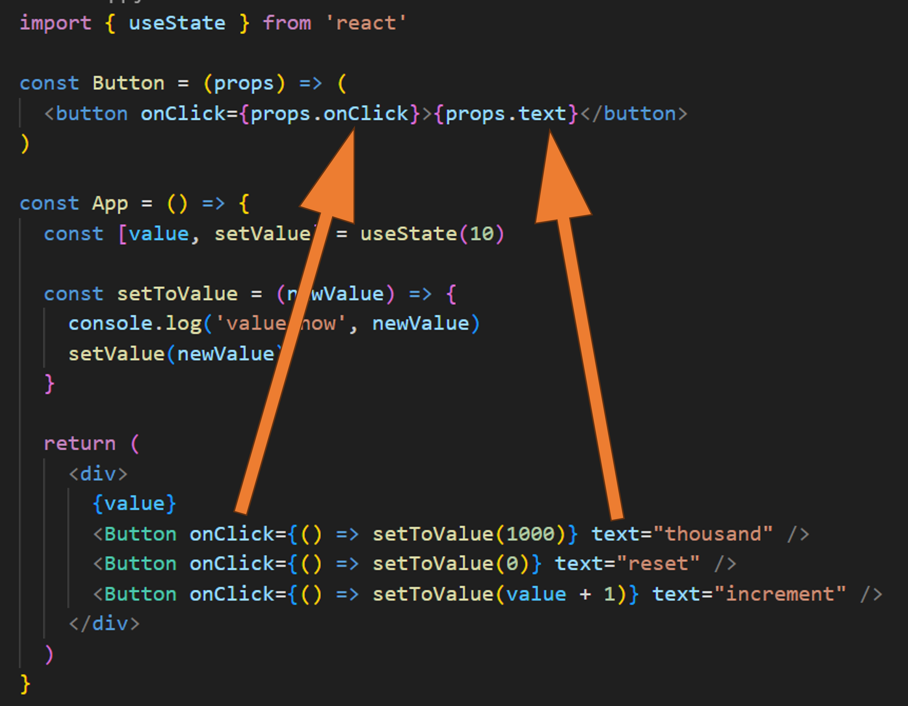
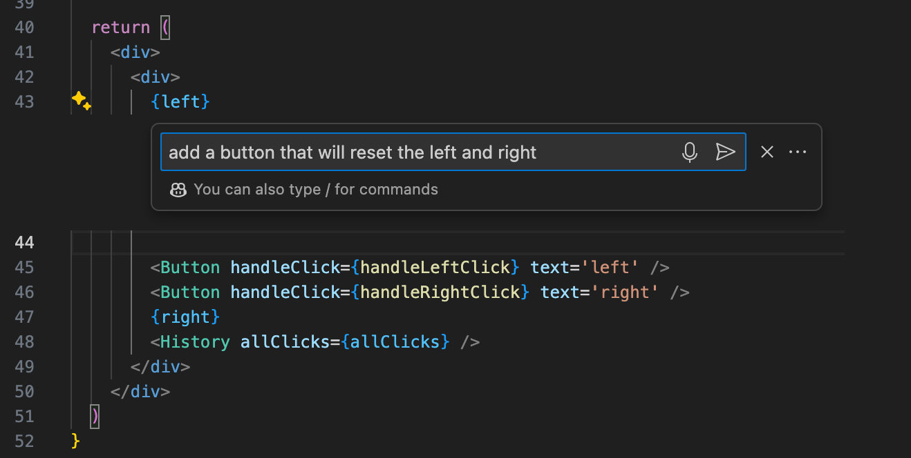
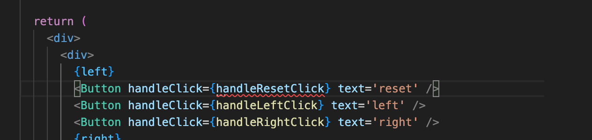
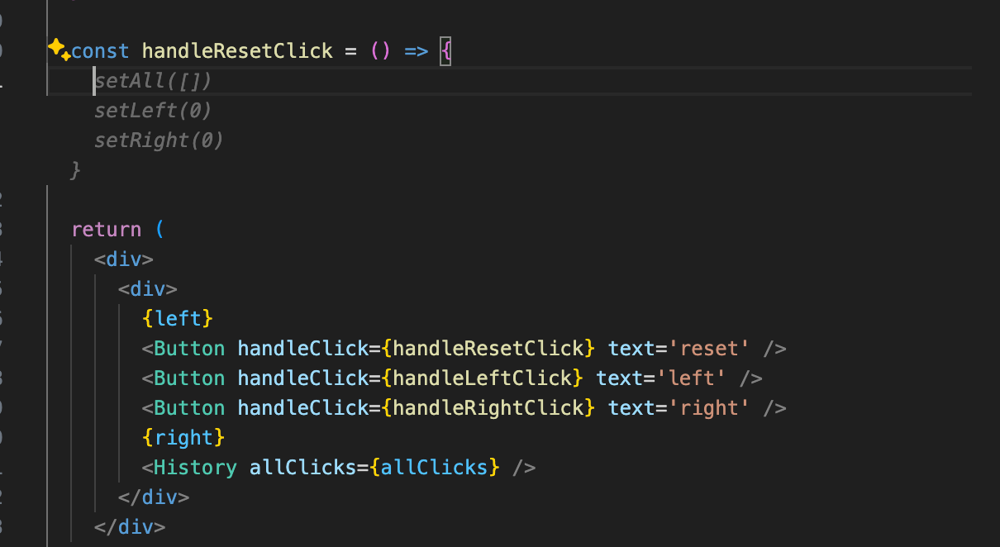
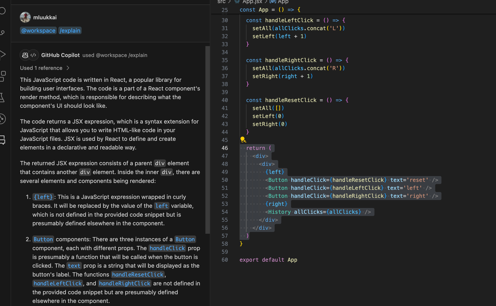
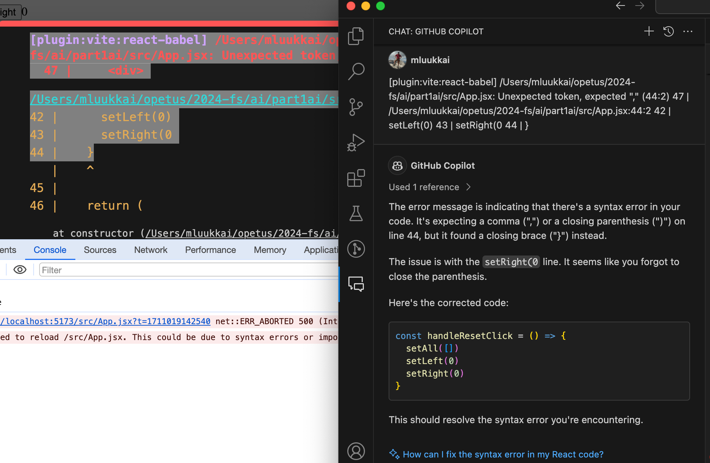
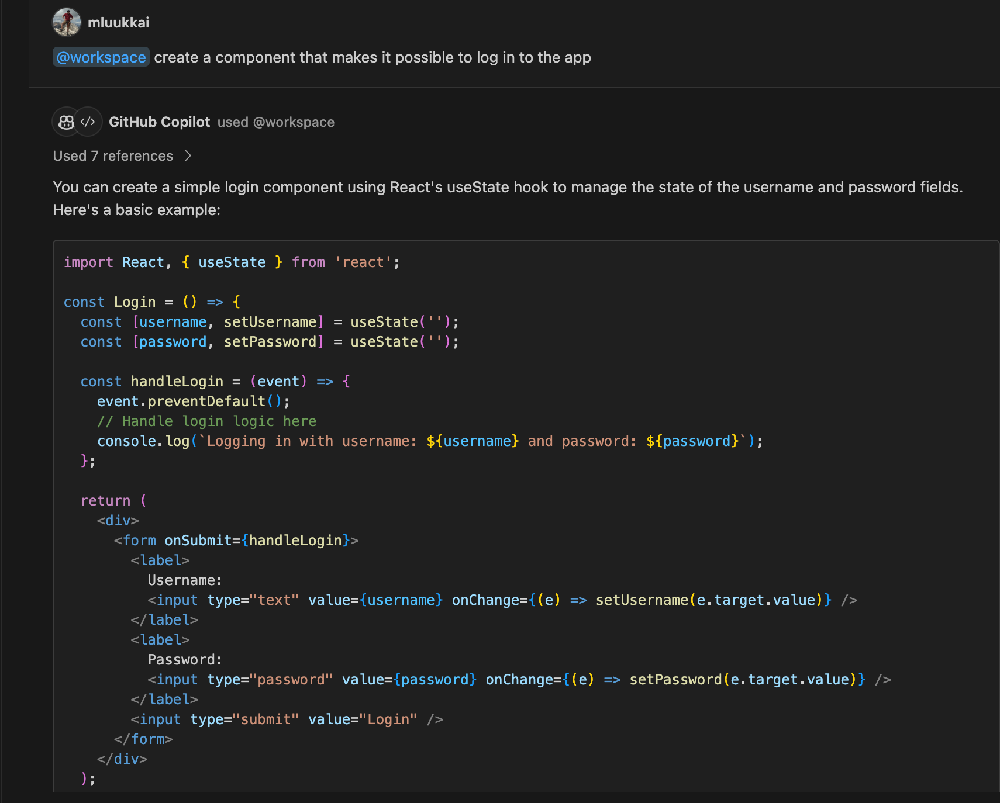
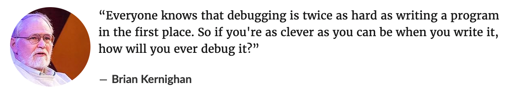

<div class="content">

<!-- ### Complex state -->
### 复杂状态

<!-- In our previous example the application state was simple as it was comprised of a single integer. What if our application requires a more complex state?-->
在我们之前的例子中，应用的状态比较简单，只包括一个整数。如果我们的应用需要更复杂的状态呢？

<!-- In most cases the easiest and best way to accomplish this is by using the _useState_ function multiple times to create separate "pieces" of state.-->
在大多数情况下，最简单但也是最好的方法是通过多次使用_useState_函数来创建专门的状态“片段”。

<!-- In the following code we create two pieces of state for the application named _left_ and _right_ that both get the initial value of 0:-->
在下面的代码中，我们为应用创建了两个名为_left_和_right_的状态片段，它们的初始值都是0：

```js
const App = () => {
  const [left, setLeft] = useState(0)
  const [right, setRight] = useState(0)

  return (
    <div>
      {left}
      <button onClick={() => setLeft(left + 1)}>
        left
      </button>
      <button onClick={() => setRight(right + 1)}>
        right
      </button>
      {right}
    </div>
  )
}
```

<!-- The component gets access to the functions _setLeft_ and _setRight_ that it can use to update the two pieces of state.-->
该组件可以通过调用函数_setLeft_和_setRight_来更新这两个状态片段。

<!-- The component's state or a piece of its state can be of any type. We could implement the same functionality by saving the click count of both the <i>left</i> and <i>right</i> buttons into a single object:-->
组件的状态或状态的一部分可以是任何类型。我们可以通过将<i>left</i>和<i>right</i>按钮的点击次数保存在单个对象中来实现同样的功能：

```js
{
  left: 0,
  right: 0
}
```

<!-- In this case the application would look like this:-->
在这种情况下，应用将如下所示：

```js
const App = () => {
  const [clicks, setClicks] = useState({
    left: 0, right: 0
  })

  const handleLeftClick = () => {
    const newClicks = {
      left: clicks.left + 1,
      right: clicks.right
    }
    setClicks(newClicks)
  }

  const handleRightClick = () => {
    const newClicks = {
      left: clicks.left,
      right: clicks.right + 1
    }
    setClicks(newClicks)
  }

  return (
    <div>
      {clicks.left}
      <button onClick={handleLeftClick}>left</button>
      <button onClick={handleRightClick}>right</button>
      {clicks.right}
    </div>
  )
}
```

<!-- Now the component only has a single piece of state and the event handlers have to take care of changing the <i>entire application state</i>.-->
现在这个组件只有一个状态，事件处理函数必须处理<i>整个应用的状态</i>。

<!-- The event handler looks a bit messy. When the left button is clicked, the following function is called:-->
事件处理函数看起来有点乱。当左键被点击时，以下函数被调用：

```js
const handleLeftClick = () => {
  const newClicks = {
    left: clicks.left + 1,
    right: clicks.right
  }
  setClicks(newClicks)
}
```

<!-- The following object is set as the new state of the application:-->
应用的新状态被设为：

```js
{
  left: clicks.left + 1,
  right: clicks.right
}
```

<!-- The new value of the <i>left</i> property is now the same as the value of <i>left + 1</i> from the previous state, and the value of the <i>right</i> property is the same as value of the <i>right</i> property from the previous state.-->
现在<i>left</i>属性的新值等同于之前状态的<i>left</i>的值<i>+ 1</i>，而<i>right</i>属性的新值等同于之前状态<i>right</i>属性的值。

<!-- We can define the new state object a bit more neatly by using the [object spread](https://developer.mozilla.org/en-US/docs/Web/JavaScript/Reference/Operators/Spread_syntax) syntax that was added to the language specification in the summer of 2018: -->
我们可以通过使用2018年夏添加到语言规范中的[对象传播](https://developer.mozilla.org/en-US/docs/Web/JavaScript/Reference/Operators/Spread_syntax)语法来更整齐地定义新的状态对象：

```js
const handleLeftClick = () => {
  const newClicks = {
    ...clicks,
    left: clicks.left + 1
  }
  setClicks(newClicks)
}

const handleRightClick = () => {
  const newClicks = {
    ...clicks,
    right: clicks.right + 1
  }
  setClicks(newClicks)
}
```

<!-- The syntax may seem a bit strange at first. In practice <em>{ ...clicks }</em> creates a new object that has copies of all of the properties of the _clicks_ object. When we specify a particular property - e.g. <i>right</i> in <em>{ ...clicks, right: 1 }</em>, the value of the _right_ property in the new object will be 1.-->
这种语法第一眼看去可能有点奇怪。实际上<em>{ ...clicks }</em>创建了一个_clicks_对象的所有属性副本的新对象。当我们指定一个特定的属性——如<em>{ ...clicks, right: 1 }</em>中的<i>right</i>，新对象中的_right_属性值将是1。

<!-- In the example above, this:-->
在上面的例子中：

```js
{ ...clicks, right: clicks.right + 1 }
```

<!-- creates a copy of the _clicks_ object where the value of the _right_ property is increased by one.-->
创建一个_clicks_对象的副本，其中_right_属性的值增加了1。

<!-- Assigning the object to a variable in the event handlers is not necessary and we can simplify the functions to the following form:-->
没有必要在事件处理函数中把对象赋值给一个变量，我们可以把函数简化为以下形式：

```js
const handleLeftClick = () =>
  setClicks({ ...clicks, left: clicks.left + 1 })

const handleRightClick = () =>
  setClicks({ ...clicks, right: clicks.right + 1 })
```

<!-- Some readers might be wondering why we didn't just update the state directly, like this:-->
有些读者可能想，为什么我们不像这样直接更新状态：

```js
const handleLeftClick = () => {
  clicks.left++
  setClicks(clicks)
}
```

<!-- The application appears to work. However, <i>it is forbidden in React to mutate state directly</i>, since [it can result in unexpected side effects](https://stackoverflow.com/a/40309023). Changing state has to always be done by setting the state to a new object. If properties from the previous state object are not changed, they need to simply be copied, which is done by copying those properties into a new object and setting that as the new state. -->
该应用似乎可以运行。然而，<i>在React中是禁止直接改变状态的</i>，因为[这可能导致意想不到的副作用](https://stackoverflow.com/a/40309023)。改变状态必须始终通过将状态设置为一个新的对象来完成。如果前一个状态对象的属性没有改变，那么只需要复制它们。这可以通过将这些属性复制到一个新的对象中，并将其设置为新的状态来完成。

<!-- Storing all of the state in a single state object is a bad choice for this particular application; there's no apparent benefit and the resulting application is a lot more complex. In this case storing the click counters into separate pieces of state is a far more suitable choice.-->
对这个应用来说，将所有的状态存储在单个状态对象中是一个糟糕的选择；没有明显的好处，还会使应用变得更复杂。在这种情况下，将点击计数器存储在专门的状态片段中是一个更合适的选择。

<!-- There are situations where it can be beneficial to store a piece of application state in a more complex data structure. [The official React documentation](https://react.dev/learn/choosing-the-state-structure) contains some helpful guidance on the topic. -->
有些情况下，将一段应用的状态存储在一个更复杂的数据结构中会有好处。[React的官方文档](https://react.dev/learn/choosing-the-state-structure)包含了一些关于这个主题的有用指导。

<!-- ### Handling arrays -->
### 处理数组

<!-- Let's add a piece of state to our application containing an array _allClicks_ that remembers every click that has occurred in the application.-->
让我们为我们的应用添加一个数组_allClicks_的状态片段来记录应用中发生的每一次点击。

```js
const App = () => {
  const [left, setLeft] = useState(0)
  const [right, setRight] = useState(0)
  const [allClicks, setAll] = useState([]) // highlight-line

// highlight-start
  const handleLeftClick = () => {
    setAll(allClicks.concat('L'))
    setLeft(left + 1)
  }
// highlight-end

// highlight-start
  const handleRightClick = () => {
    setAll(allClicks.concat('R'))
    setRight(right + 1)
  }
// highlight-end

  return (
    <div>
      {left}
      <button onClick={handleLeftClick}>left</button>
      <button onClick={handleRightClick}>right</button>
      {right}
      <p>{allClicks.join(' ')}</p> // highlight-line
    </div>
  )
}
```

<!-- Every click is stored into a separate piece of state called _allClicks_ that is initialized as an empty array:-->
每一次点击都被存储在一个专门的状态片段_allClicks_中。_allClicks_一开始是一个空数组：

```js
const [allClicks, setAll] = useState([])
```

<!-- When the <i>left</i> button is clicked, we add the letter <i>L</i> to the _allClicks_ array:-->
当<i>left</i>按钮被点击时，我们将字母<i>L</i>添加到_allClicks_数组中：

```js
const handleLeftClick = () => {
  setAll(allClicks.concat('L'))
  setLeft(left + 1)
}
```

<!-- The piece of state stored in _allClicks_ is now set to be an array that contains all of the items of the previous state array plus the letter <i>L</i>. Adding the new item to the array is accomplished with the [concat](https://developer.mozilla.org/en-US/docs/Web/JavaScript/Reference/Global_Objects/Array/concat) method, which does not mutate the existing array but rather returns a <i>new copy of the array</i> with the item added to it. -->
存储在_allClicks_中的状态片段现在被设为了一个包含之前状态数组的所有项目加上字母<i>L</i>的新数组。将新项添加到数组中是通过[concat](https://developer.mozilla.org/en-US/docs/Web/JavaScript/Reference/Global_Objects/Array/concat)方法完成的，该方法并不改变当前的数组，而是返回一个添加了新项的<i>数组的新副本</i>。

<!-- As mentioned previously, it's also possible in JavaScript to add items to an array with the [push](https://developer.mozilla.org/en-US/docs/Web/JavaScript/Reference/Global_Objects/Array/push) method. If we add the item by pushing it to the _allClicks_ array and then updating the state, the application would still appear to work:-->
之前提到过，在JavaScript中也可以用[push](https://developer.mozilla.org/en-US/docs/Web/JavaScript/Reference/Global_Objects/Array/push)方法向数组中添加项。如果我们通过把新项“push”到_allClicks_数组中，然后更新状态来添加项，这个应用看起来仍然可以运行。

```js
const handleLeftClick = () => {
  allClicks.push('L')
  setAll(allClicks)
  setLeft(left + 1)
}
```

<!-- However, __don't__ do this. As mentioned previously, the state of React components like _allClicks_ must not be mutated directly. Even if mutating state appears to work in some cases, it can lead to problems that are very hard to debug.-->
然而，__不要__这样做。之前提到过，像_allClicks_这样的React组件的状态是不能直接更改的。即使改变状态在某些情况下看起来是有效的，它也会导致一些很难调试的问题。

<!-- Let's take a closer look at how the clicking is rendered to the page: -->
让我们仔细看一下点击的情况是如何被渲染到页面上的：

```js
const App = () => {
  // ...

  return (
    <div>
      {left}
      <button onClick={handleLeftClick}>left</button>
      <button onClick={handleRightClick}>right</button>
      {right}
      <p>{allClicks.join(' ')}</p> // highlight-line
    </div>
  )
}
```

<!-- We call the [join](https://developer.mozilla.org/en-US/docs/Web/JavaScript/Reference/Global_Objects/Array/join) method on the _allClicks_ array that joins all the items into a single string, separated by the string passed as the function parameter, which in our case is an empty space.-->
我们在_allClicks_数组上调用[join](https://developer.mozilla.org/en-US/docs/Web/JavaScript/Reference/Global_Objects/Array/join)方法，将所有项连接成单个字符串，并用函数参数传递的字符串（在这个的例子中是一个空格）分开。

<!-- ### Update of the state is asynchronous -->
### 状态的更新是异步的

<!-- Let's expand the application so that it keeps track of the total number of button presses in the state _total_, whose value is always updated when the buttons are pressed: -->
让我们给我们的应用添加一个记录按钮点击总次数的状态_total_。每次点击按钮的时候，都更新_total_的值。

```js
const App = () => {
  const [left, setLeft] = useState(0)
  const [right, setRight] = useState(0)
  const [allClicks, setAll] = useState([])
  const [total, setTotal] = useState(0) // highlight-line

  const handleLeftClick = () => {
    setAll(allClicks.concat('L'))
    setLeft(left + 1)
    setTotal(left + right)  // highlight-line
  }

  const handleRightClick = () => {
    setAll(allClicks.concat('R'))
    setRight(right + 1)
    setTotal(left + right)  // highlight-line
  }

  return (
    <div>
      {left}
      <button onClick={handleLeftClick}>left</button>
      <button onClick={handleRightClick}>right</button>
      {right}
      <p>{allClicks.join(' ')}</p>
      <p>total {total}</p>  // highlight-line
    </div>
  )
}
```

<!-- The solution does not quite work: -->
这样写不大对：


<!-- The total number of button presses is consistently one less than the actual amount of presses, for some reason. -->
出于什么原因，按钮点击次数的总数总是比实际点击的次数少一次。

<!-- Let us add couple of console.log statements to the event handler: -->
让我们向事件处理函数里添加一些console.log语句。

```js
const App = () => {
  // ...
  const handleLeftClick = () => {
    setAll(allClicks.concat('L'))
    console.log('left before', left)  // highlight-line
    setLeft(left + 1)
    console.log('left after', left)  // highlight-line
    setTotal(left + right) 
  }

  // ...
}
```

<!-- The console reveals the problem -->
控制台揭示了问题


<!-- Even though a new value was set for _left_ by calling _setLeft(left + 1)_, the old value persists despite the update. As a result, the attempt to count button presses produces a result that is too small: -->
即使已经调用_setLeft(left + 1)_来更新_left_的值，_left_的值还是旧的，并没有更新。结果，尝试计算按钮点击总次数的结果总是比实际值要小：

```js
setTotal(left + right) 
```

<!-- The reason for this is that a state update in React happens [asynchronously](https://react.dev/learn/queueing-a-series-of-state-updates), i.e. not immediately but "at some point" before the component is rendered again. -->
原因在于在React中，状态的更新是[异步](https://react.dev/learn/queueing-a-series-of-state-updates)进行的，也就是说，状态的更新并非立即生效，而是在组件再次渲染前的“某一刻”进行的。

<!-- We can fix the app as follows: -->
我们可以这样修代码：

```js
const App = () => {
  // ...
  const handleLeftClick = () => {
    setAll(allClicks.concat('L'))
    const updatedLeft = left + 1
    setLeft(updatedLeft)
    setTotal(updatedLeft + right) 
  }

  // ...
}
```

<!-- So now the number of button presses is definitely based on the correct number of left button presses. -->
现在点击按钮的次数和实际按左侧按钮的次数一样了。

<!-- We can also handle asynchronous updates for the right button: -->
我们对右侧按钮也用同样的方式处理异步更新：

```js
const App = () => {
  // ...
  const handleRightClick = () => {
    setAll(allClicks.concat('R'));
    const updatedRight = right + 1;
    setRight(updatedRight);
    setTotal(left + updatedRight);
  };

  // ...
}
```

<!-- ### Conditional rendering -->
### 条件渲染

<!-- Let's modify our application so that the rendering of the clicking history is handled by a new <i>History</i> component:-->
让我们修改我们的应用，让点击历史的渲染由一个新的<i>History</i>组件来处理。

```js
// highlight-start
const History = (props) => {
  if (props.allClicks.length === 0) {
    return (
      <div>
        the app is used by pressing the buttons
      </div>
    )
  }

  return (
    <div>
      button press history: {props.allClicks.join(' ')}
    </div>
  )
}
// highlight-end

const App = () => {
  // ...

  return (
    <div>
      {left}
      <button onClick={handleLeftClick}>left</button>
      <button onClick={handleRightClick}>right</button>
      {right}
      <History allClicks={allClicks} /> // highlight-line
    </div>
  )
}
```

<!-- Now the behavior of the component depends on whether or not any buttons have been clicked. If not, meaning that the <em>allClicks</em> array is empty, the component renders a div element with some instructions instead:-->
现在，该组件的行为取决于是否有任何按钮被点击过。如果没有，意味着<em>allClicks</em>数组是空的，那么组件会渲染一个带有使用说明的div元素：

```js
<div>the app is used by pressing the buttons</div>
```

<!-- And in all other cases, the component renders the clicking history:-->
而在其他所有情况下，该组件会渲染点击历史：

```js
<div>
  button press history: {props.allClicks.join(' ')}
</div>
```

<!-- The <i>History</i> component renders completely different React elements depending on the state of the application. This is called <i>conditional rendering</i>.-->
<i>History</i>组件根据应用的状态渲染完全不同的React元素。这被称为<i>条件渲染</i>。

<!-- React also offers many other ways of doing [conditional rendering](https://react.dev/learn/conditional-rendering). We will take a closer look at this in [part 2](/en/part2). -->
React还提供了许多其他的方法来进行[条件渲染](https://react.dev/learn/conditional-rendering)。我们将在[第2章节](/zh/part2)中仔细研究。

<!-- Let's make one last modification to our application by refactoring it to use the _Button_ component that we defined earlier on:-->
让我们对我们的应用做最后一次修改，使用我们先前定义的_Button_组件重构它：

```js
const History = (props) => {
  if (props.allClicks.length === 0) {
    return (
      <div>
        the app is used by pressing the buttons
      </div>
    )
  }

  return (
    <div>
      button press history: {props.allClicks.join(' ')}
    </div>
  )
}

const Button = ({ onClick, text }) => <button onClick={onClick}>{text}</button> // highlight-line

const App = () => {
  const [left, setLeft] = useState(0)
  const [right, setRight] = useState(0)
  const [allClicks, setAll] = useState([])

  const handleLeftClick = () => {
    setAll(allClicks.concat('L'))
    setLeft(left + 1)
  }

  const handleRightClick = () => {
    setAll(allClicks.concat('R'))
    setRight(right + 1)
  }

  return (
    <div>
      {left}
      // highlight-start
      <Button onClick={handleLeftClick} text='left' />
      <Button onClick={handleRightClick} text='right' />
      // highlight-end
      {right}
      <History allClicks={allClicks} />
    </div>
  )
}
```

<!-- ### Old React -->
### 旧React

<!-- In this course, we use the [state hook](https://react.dev/learn/state-a-components-memory) to add state to our React components, which is part of the newer versions of React and is available from version [16.8.0](https://www.npmjs.com/package/react/v/16.8.0) onwards. Before the addition of hooks, there was no way to add state to functional components. Components that required state had to be defined as [class](https://react.dev/reference/react/Component) components, using the JavaScript class syntax. -->
在本课程中，我们使用[状态Hook](https://react.dev/learn/state-a-components-memory)来向我们的React组件添加状态，这是较新版本React的一部分，从[16.8.0](https://www.npmjs.com/package/react/v/16.8.0)起才可以使用。在增加Hook之前，无法向函数式组件添加状态。需要状态的组件必须被定义为[类式](https://react.dev/reference/react/Component)组件，使用JavaScript类的语法。

<!-- In this course, we have made the slightly radical decision to use hooks exclusively from day one, to ensure that we are learning the current and future variations of React. Even though functional components are the future of React, it is still important to learn the class syntax, as there are billions of lines of legacy React code that you might end up maintaining someday. The same applies to documentation and examples of React that you may stumble across on the internet. -->
在这个课程中，我们做了一个略显激进的决定，从第一天开始就只使用Hook，以确保我们学习React的当前和未来形式。即使函数式组件是React的未来，学习类的语法仍然很重要，因为有数十亿行的React遗留代码，你有一天可能会维护它们。这同样适用于你在互联网上意外发现的React的文档和例子。

<!-- We will learn more about React class components later on in the course.-->
我们将在后面的课程进一步学习关于React的类式组件。

<!-- ### Debugging React applications -->
### 调试React应用

<!-- A large part of a typical developer's time is spent on debugging and reading existing code. Every now and then we do get to write a line or two of new code, but a large part of our time is spent on trying to figure out why something is broken or how something works. Good practices and tools for debugging are extremely important for this reason.-->
典型开发者的大部分时间都花在调试和阅读现有的代码上。我们确实时不时会写一两行新代码，但我们的大部分时间都花在试图弄清楚为什么某段代码运行不了，或者某段代码是如何运行的。因此，良好的调试实践和工具是非常重要的。

<!-- Lucky for us, React is an extremely developer-friendly library when it comes to debugging.-->
幸运的是，在调试方面，React是一个对开发者极其友好的库。

<!-- Before we move on, let us remind ourselves of one of the most important rules of web development.-->
在我们继续之前，让我们提醒自己网络开发中最重要的规矩之一。

<!-- <h4>The first rule of web development</h4> -->
<h4>web开发的第一规矩</h4>

<!-- >  **Keep the browser's developer console open at all times.**-->
> **始终保持浏览器的开发者控制台是打开的**。
<!-- >-->
>
<!-- > The <i>Console</i> tab in particular should always be open, unless there is a specific reason to view another tab.-->
> 特别是<i>控制台</i>标签页应该一直打开，除非有特别的原因要查看其他标签页。

<!-- Keep both your code and the web page open together **at the same time, all the time**.-->
**始终、同时**打开你的代码和网页。

<!-- If and when your code fails to compile and your browser lights up like a Christmas tree:-->
如果当你的代码无法编译，你的浏览器像圣诞树一样亮起来的时候：


<!-- don't write more code but rather find and fix the problem **immediately**. There has yet to be a moment in the history of coding where code that fails to compile would miraculously start working after writing large amounts of additional code. I highly doubt that such an event will transpire during this course either.-->
不要写更多的代码，而是要**立即**找到并解决这个问题。在编程的历史上，还没有出现过在编写了大量的额外代码之后，无法编译的代码会奇迹般地开始运行的事情。我非常怀疑在这个课程中是否会发生这样的事情。

<!-- Old school, print-based debugging is always a good idea. If the component-->
传统的、基于打印的调试总是一个好主意。如果组件

```js
const Button = ({ onClick, text }) => <button onClick={onClick}>{text}</button>
```

<!-- is not working as intended, it's useful to start printing its variables out to the console. In order to do this effectively, we must transform our function into the less compact form and receive the entire props object without destructuring it immediately:-->
不能按预期运行，开始将其变量打印到控制台是很有用的。为了有效地做到这一点，我们必须将我们的函数转化为不太紧凑的形式，并接收整个props对象，而不是立即解构：

```js
const Button = (props) => {
  console.log(props) // highlight-line
  const { onClick, text } = props
  return (
    <button onClick={onClick}>
      {text}
    </button>
  )
}
```

<!-- This will immediately reveal if, for instance, one of the attributes has been misspelled when using the component.-->
这将立即显示出，例如，在使用该组件时，其中一个属性被拼错了。

<!-- **NB** When you use _console.log_ for debugging, don't combine _objects_ in a Java-like fashion by using the plus operator. Instead of writing:-->
**注意** 当你使用_console.log_进行调试时，不要像Java那样用加号运算符组合_objects_：

```js
console.log('props value is ' + props)
```

<!-- If you do that, you will end up with a rather uninformative log message: -->
如果这样做的话，你最终会得到一个信息量很小日志信息：

```js
props value is [Object object]
```

<!-- Instead, separate the things you want to log to the console with a comma: -->
而是用逗号把你想记录到控制台的东西分开：

```js
console.log('props value is', props)
```

<!-- In this way, the separated items will all be available in the browser console for further inspection. -->
这样，用逗号分隔的项目将在浏览器控制台中全部可用，以供进一步检查。

<!-- Logging output to the console is by no means the only way of debugging our applications. You can pause the execution of your application code in the Chrome developer console's <i>debugger</i>, by writing the command [debugger](https://developer.mozilla.org/en-US/docs/Web/JavaScript/Reference/Statements/debugger) anywhere in your code. -->
将输出记录到控制台决不是调试我们应用的唯一方法。你可以在Chrome开发者控制台的<i>调试器</i>中暂停执行应用代码，方法是在代码的任何地方写下[debugger](https://developer.mozilla.org/en-US/docs/Web/JavaScript/Reference/Statements/debugger)命令。

<!-- The execution will pause once it arrives at a point where the _debugger_ command gets executed:-->
一旦执行到_debugger_命令，就会暂停执行。


<!-- By going to the <i>Console</i> tab, it is easy to inspect the current state of variables:-->
通过进入<i>Console</i>标签页，很容易检查变量当前的状态。


<!-- Once the cause of the bug is discovered you can remove the _debugger_ command and refresh the page.-->
一旦发现问题的原因，你就可以删除_debugger_命令并刷新页面。

<!-- The debugger also enables us to execute our code line by line with the controls found on the right-hand side of the <i>Sources</i> tab.-->
调试器也使我们能够通过<i>Sources</i>标签页右侧的控件来逐行执行我们的代码。

<!-- You can also access the debugger without the _debugger_ command by adding breakpoints in the <i>Sources</i> tab. Inspecting the values of the component's variables can be done in the _Scope_-section:-->
你也可以不用_debugger_命令，而通过在<i>Sources</i>标签页中添加断点来访问调试器。检查组件的变量值可以在_Scope_部分完成：


<!-- It is highly recommended to add the [React developer tools](https://chrome.google.com/webstore/detail/react-developer-tools/fmkadmapgofadopljbjfkapdkoienihi) extension to Chrome. It adds a new _Components_ tab to the developer tools. The new developer tools tab can be used to inspect the different React elements in the application, along with their state and props:-->
强烈建议在Chrome浏览器中添加[React开发者工具](https://chrome.google.com/webstore/detail/react-developer-tools/fmkadmapgofadopljbjfkapdkoienihi)扩展。它在开发者工具中增加了一个新的_Components_标签页，可以用来检查应用中不同的React元素，以及它们的状态和props。


<!-- The _App_ component's state is defined like so:-->
_App_组件的状态是这样定义的：

```js
const [left, setLeft] = useState(0)
const [right, setRight] = useState(0)
const [allClicks, setAll] = useState([])
```

<!-- Dev tools shows the state of hooks in the order of their definition:-->
Dev tools按照定义的顺序显示Hook的状态。


<!-- The first <i>State</i> contains the value of the <i>left</i> state, the next contains the value of the <i>right</i> state and the last contains the value of the <i>allClicks</i> state.-->
第一个<i>State</i>包含<i>left</i>状态的值，第二个包含<i>right</i>状态的值，最后一个包含<i>allClicks</i>状态的值。

<!-- You can also learn about debugging JavaScript in Chrome, for example, with the [Chrome DevTools guide video](https://developer.chrome.com/docs/devtools/javascript). -->
你还可以在Chrome中学习调试JavaScript，比如通过[Chrome开发者工具指导视频](https://developer.chrome.com/docs/devtools/javascript)。

<!-- ### Rules of Hooks -->
### Hook的规则

<!-- There are a few limitations and [rules](https://react.dev/warnings/invalid-hook-call-warning#breaking-rules-of-hooks) that we have to follow to ensure that our application uses hooks-based state functions correctly. -->
为了确保我们的应用正确使用基于Hook的状态函数，必须遵循一些限制和[规则](https://react.dev/warnings/invalid-hook-call-warning#breaking-rules-of-hooks)。

<!-- The _useState_ function (as well as the _useEffect_ function introduced later on in the course) <i>must not be called</i> from inside of a loop, a conditional expression, or any place that is not a function defining a component. This must be done to ensure that the hooks are always called in the same order, and if this isn't the case the application will behave erratically.-->
<i>不能</i>在循环、条件表达式或任何不是定义组件的函数的地方<i>调用</i>_useState_函数（以及课程后面介绍的_useEffect_函数）。这样做是为了确保Hook总是以相同的顺序被调用，如果不这样做的话，应用将表现得不稳定。

<!-- To recap, hooks may only be called from the inside of a function body that defines a React component:-->
简而言之，只能在定义React组件的函数体内调用Hook：

```js
const App = () => {
  // these are ok
  const [age, setAge] = useState(0)
  const [name, setName] = useState('Juha Tauriainen')

  if ( age > 10 ) {
    // this does not work!
    const [foobar, setFoobar] = useState(null)
  }

  for ( let i = 0; i < age; i++ ) {
    // also this is not good
    const [rightWay, setRightWay] = useState(false)
  }

  const notGood = () => {
    // and this is also illegal
    const [x, setX] = useState(-1000)
  }

  return (
    //...
  )
}
```

<!-- ### Event Handling Revisited -->
### 重提事件处理函数

<!-- Event handling has proven to be a difficult topic in previous iterations of this course.-->
前几期的课程显示事件处理是一个难点。

<!-- For this reason we will revisit the topic.-->
因此，我们将重提这个话题。

<!-- Let's assume that we're developing this simple application with the following component <i>App</i>:-->
让我们假设我们在使用如下组件<i>App</i>开发这个简单的应用：

```js
const App = () => {
  const [value, setValue] = useState(10)

  return (
    <div>
      {value}
      <button>reset to zero</button>
    </div>
  )
}
```

<!-- We want the clicking of the button to reset the state stored in the _value_ variable.-->
我们希望点击按钮能重置存储在_value_变量中的状态。

<!-- In order to make the button react to a click event, we have to add an <i>event handler</i> to it.-->
为了使按钮对点击事件作出反应，我们必须给它添加一个<i>事件处理函数</i>。

<!-- Event handlers must always be a function or a reference to a function. The button will not work if the event handler is set to a variable of any other type.-->
事件处理函数必须始终是一个函数或对一个函数的引用。如果事件处理函数被设置为任何其他类型的变量，按钮将无法运行。

<!-- If we were to define the event handler as a string:-->
如果我们将事件处理函数定义为一个字符串：

```js
<button onClick="crap...">button</button>
```

<!-- React would warn us about this in the console:-->
React会在控制台警告我们：

```js
index.js:2178 Warning: Expected `onClick` listener to be a function, instead got a value of `string` type.
    in button (at index.js:20)
    in div (at index.js:18)
    in App (at index.js:27)
```

<!-- The following attempt would also not work:-->
下面的尝试也不会成功：

```js
<button onClick={value + 1}>button</button>
```

<!-- We have attempted to set the event handler to _value + 1_ which simply returns the result of the operation. React will kindly warn us about this in the console:-->
我们试图将事件处理函数设置为_value + 1_，也就是返回操作的结果。React会在控制台中善意地警告我们：

```js
index.js:2178 Warning: Expected `onClick` listener to be a function, instead got a value of `number` type.
```

<!-- This attempt would not work either:-->
这种尝试也不会成功：

```js
<button onClick={value = 0}>button</button>
```

<!-- The event handler is not a function but a variable assignment, and React will once again issue a warning to the console. This attempt is also flawed in the sense that we must never mutate state directly in React.-->
事件处理函数不是一个函数，而是一个变量赋值语句，React将再次向控制台发出警告。这种尝试也是错的，因为我们决不能在React中直接改变状态。

<!-- What about the following:-->
那这样呢：

```js
<button onClick={console.log('clicked the button')}>
  button
</button>
```

<!-- The message gets printed to the console once when the component is rendered but nothing happens when we click the button. Why does this not work even when our event handler contains a function _console.log_?-->
当组件被渲染时，信息被打印到控制台一次，但当我们点击按钮时，什么也没有发生。为什么即使当我们的事件处理函数包含一个函数_console.log_时，也不能运行呢？

<!-- The issue here is that our event handler is defined as a <i>function call</i> which means that the event handler is actually assigned the returned value from the function, which in the case of _console.log_ is <i>undefined</i>.-->
这里的问题是我们的事件处理函数被定义为一个<i>函数调用</i>，这意味着事件处理函数实际上是函数的返回值，_console.log_的返回值是<i>undefined</i>。

<!-- The _console.log_ function call gets executed when the component is rendered and for this reason it gets printed once to the console.-->
当组件被渲染时，_console.log_函数调用被执行，也因此会打印一次信息到控制台。

<!-- The following attempt is flawed as well:-->
下面的尝试也是错的:

```js
<button onClick={setValue(0)}>button</button>
```

<!-- We have once again tried to set a function call as the event handler. This does not work. This particular attempt also causes another problem. When the component is rendered the function _setValue(0)_ gets executed which in turn causes the component to be re-rendered. Re-rendering in turn calls _setValue(0)_ again, resulting in an infinite recursion.-->
我们再次尝试将一个函数调用设置为事件处理函数。这并不奏效。这个尝试也导致了另一个问题。当组件被渲染时，函数_setValue(0)_被执行，这反过来导致组件被重新渲染。重新渲染又会再次调用_setValue(0)_，从而导致无限的递归。

<!-- Executing a particular function call when the button is clicked can be accomplished like this:-->
当按钮被点击时，执行一个特定的函数调用可以这样完成：

```js
<button onClick={() => console.log('clicked the button')}>
  button
</button>
```

<!-- Now the event handler is a function defined with the arrow function syntax _() => console.log('clicked the button')_. When the component gets rendered, no function gets called and only the reference to the arrow function is set to the event handler. Calling the function happens only once the button is clicked.-->
现在事件处理函数是一个用箭头函数语法_() => console.log('clicked the button')_定义的函数。当组件被渲染时，没有函数被调用，只有箭头函数的引用被设为事件处理函数。只有当按钮被点击时才会调用该函数。

<!-- We can implement resetting the state in our application with this same technique:-->
我们可以用同样的方法在我们的应用中实现重置状态：

```js
<button onClick={() => setValue(0)}>button</button>
```

<!-- The event handler is now the function _() => setValue(0)_.-->
现在事件处理函数是_() => setValue(0)_。

<!-- Defining event handlers directly in the attribute of the button is not necessarily the best possible idea.-->
直接在按钮的属性中定义事件处理函数，并不是最好的做法。

<!-- You will often see event handlers defined in a separate place. In the following version of our application we define a function that then gets assigned to the _handleClick_ variable in the body of the component function:-->
你经常会看到事件处理函数被定义在一个单独的地方。在我们应用的以下版本中，我们定义了一个函数，然后将其赋值给组件函数主体中的_handleClick_变量：

```js
const App = () => {
  const [value, setValue] = useState(10)

  const handleClick = () =>
    console.log('clicked the button')

  return (
    <div>
      {value}
      <button onClick={handleClick}>button</button>
    </div>
  )
}
```

<!-- The _handleClick_ variable, which references the function definition, is passed to the button as the <i>onClick</i> attribute: -->
_handleClick_变量现在是一个函数定义的引用。我们将这个引用传递给按钮的<i>onClick</i>属性：

```js
<button onClick={handleClick}>button</button>
```

<!-- Naturally, our event handler function can be composed of multiple commands. In these cases we use the longer curly brace syntax for arrow functions:-->
当然，我们的事件处理函数可以由多个命令组成。在这种情况下，我们对箭头函数使用较长的大括号语法：

```js
const App = () => {
  const [value, setValue] = useState(10)

  // highlight-start
  const handleClick = () => {
    console.log('clicked the button')
    setValue(0)
  }
   // highlight-end

  return (
    <div>
      {value}
      <button onClick={handleClick}>button</button>
    </div>
  )
}
```

<!-- ### A function that returns a function -->
### 返回函数的函数

<!-- Another way to define an event handler is to use <i>function that returns a function</i>.-->
另一种定义事件处理函数的方法是使用<i>返回函数的函数</i>。

<!-- You probably won't need to use functions that return functions in any of the exercises in this course.  If the topic seems particularly confusing, you may skip over this section for now and return to it later.-->
在本课程的任何练习中，你可能都不需要使用返回函数的函数。  如果这个话题看起来特别令人困惑，你可以暂时跳过这一节，以后再来讨论。

<!-- Let's make the following changes to our code:-->
让我们将我们的代码修改如下：

```js
const App = () => {
  const [value, setValue] = useState(10)

  // highlight-start
  const hello = () => {
    const handler = () => console.log('hello world')

    return handler
  }
  // highlight-end

  return (
    <div>
      {value}
      <button onClick={hello()}>button</button>
    </div>
  )
}
```

<!-- The code functions correctly even though it looks complicated.-->
尽管代码看起来很复杂，但它能正确运行。

<!-- The event handler is now set to a function call:-->
事件处理函数现在被设置为一个函数调用：

```js
<button onClick={hello()}>button</button>
```

<!-- Earlier on we stated that an event handler may not be a call to a function, and that it has to be a function or a reference to a function. Why then does a function call work in this case?-->
先前我们说过，一个事件处理函数不能是对一个函数的调用，它必须是一个函数或对一个函数的引用。那为什么在这种情况下，函数调用就能正确运行了呢？

<!-- When the component is rendered, the following function gets executed:-->
当组件被渲染时，下面的函数被执行：

```js
const hello = () => {
  const handler = () => console.log('hello world')

  return handler
}
```

<!-- The <i>return value</i> of the function is another function that is assigned to the _handler_ variable.-->
该函数的<i>返回值</i>是另一个函数，这另一个函数被赋值给_handler_变量。

<!-- When React renders the line:-->
当React渲染这一行时：

```js
<button onClick={hello()}>button</button>
```

<!-- It assigns the return value of _hello()_ to the onClick attribute. Essentially the line gets transformed into:-->
它把_hello()_的返回值赋值给onClick属性。本质上，这一行被转化为：

```js
<button onClick={() => console.log('hello world')}>
  button
</button>
```

<!-- Since the _hello_ function returns a function, the event handler is now a function.-->
由于_hello_函数返回一个函数，事件处理函数现在是一个函数。

<!-- What's the point of this concept?-->
这个概念的意义在哪儿？

<!-- Let's change the code a tiny bit:-->
让我们稍微改变一下代码：

```js
const App = () => {
  const [value, setValue] = useState(10)

  // highlight-start
  const hello = (who) => {
    const handler = () => {
      console.log('hello', who)
    }

    return handler
  }
  // highlight-end

  return (
    <div>
      {value}
  // highlight-start
      <button onClick={hello('world')}>button</button>
      <button onClick={hello('react')}>button</button>
      <button onClick={hello('function')}>button</button>
  // highlight-end
    </div>
  )
}
```

<!-- Now the application has three buttons with event handlers defined by the _hello_ function that accepts a parameter.-->
现在这个应用有三个按钮，其事件处理函数由接受一个参数的_hello_函数定义。

<!-- The first button is defined as-->
第一个按钮的定义是

```js
<button onClick={hello('world')}>button</button>
```

<!-- The event handler is created by <i>executing</i> the function call _hello('world')_. The function call returns the function:-->
事件处理函数是通过<i>执行</i>函数调用_hello('world')_创建的。该函数调用返回函数：

```js
() => {
  console.log('hello', 'world')
}
```

<!-- The second button is defined as:-->
第二个按钮的定义是：

```js
<button onClick={hello('react')}>button</button>
```

<!-- The function call _hello('react')_ that creates the event handler returns:-->
创建事件处理函数的函数调用_hello('react')_返回：

```js
() => {
  console.log('hello', 'react')
}
```

<!-- Both buttons get their own individualized event handlers.-->
两个按钮都得到了自己的个性化的事件处理函数。

<!-- Functions returning functions can be utilized in defining generic functionality that can be customized with parameters. The _hello_ function that creates the event handlers can be thought of as a factory that produces customized event handlers meant for greeting users.-->
返回的函数的函数可以用在定义通过参数个性化的通用功能。创建事件处理函数的_hello_函数可以被想象成一个产生向用户问好的个性化的事件处理函数的工厂。

<!-- Our current definition is slightly verbose:-->
我们目前的定义略显冗长：

```js
const hello = (who) => {
  const handler = () => {
    console.log('hello', who)
  }

  return handler
}
```

<!-- Let's eliminate the helper variables and directly return the created function:-->
让我们去掉辅助变量，直接返回创建的函数：

```js
const hello = (who) => {
  return () => {
    console.log('hello', who)
  }
}
```

<!-- Since our _hello_ function is composed of a single return command, we can omit the curly braces and use the more compact syntax for arrow functions:-->
由于我们的_hello_函数由单个返回命令组成，我们可以省略大括号，并使用箭头函数的更紧凑的语法：

```js
const hello = (who) =>
  () => {
    console.log('hello', who)
  }
```

<!-- Lastly, let's write all of the arrows on the same line:-->
最后，让我们把所有的箭头写在同一行：

```js
const hello = (who) => () => {
  console.log('hello', who)
}
```

<!-- We can use the same trick to define event handlers that set the state of the component to a given value. Let's make the following changes to our code:-->
我们可以使用同样的技巧来定义事件处理函数，将组件的状态设置为一个给定的值。让我们对我们的代码做如下修改：

```js
const App = () => {
  const [value, setValue] = useState(10)

  // highlight-start
  const setToValue = (newValue) => () => {
    console.log('value now', newValue)  // print the new value to console
    setValue(newValue)
  }
  // highlight-end

  return (
    <div>
      {value}
      // highlight-start
      <button onClick={setToValue(1000)}>thousand</button>
      <button onClick={setToValue(0)}>reset</button>
      <button onClick={setToValue(value + 1)}>increment</button>
      // highlight-end
    </div>
  )
}
```

<!-- When the component is rendered, the <i>thousand</i> button is created:-->
当组件被渲染时，<i>thousand</i>按钮被创建：

```js
<button onClick={setToValue(1000)}>thousand</button>
```

<!-- The event handler is set to the return value of _setToValue(1000)_ which is the following function:-->
事件处理函数被设置为_setToValue(1000)_的返回值，也就是这个函数：

```js
() => {
  console.log('value now', 1000)
  setValue(1000)
}
```

<!-- The increase button is declared as follows:-->
“加1”按钮的声明如下：

```js
<button onClick={setToValue(value + 1)}>increment</button>
```

<!-- The event handler is created by the function call _setToValue(value + 1)_ which receives as its parameter the current value of the state variable _value_ increased by one. If the value of _value_ was 10, then the created event handler would be the function:-->
事件处理函数由函数调用_setToValue(value + 1)_创建，该函数接收状态变量_value_的当前值加一作为其参数。如果_value_的值是10，那么创建的事件处理函数将是这个函数：

```js
() => {
  console.log('value now', 11)
  setValue(11)
}
```

<!-- Using functions that return functions is not required to achieve this functionality. Let's return the _setToValue_ function that is responsible for updating state, into a normal function:-->
实现这个功能不需要使用返回函数的函数。让我们把负责更新状态的_setToValue_函数，改回普通的函数：

```js
const App = () => {
  const [value, setValue] = useState(10)

  const setToValue = (newValue) => {
    console.log('value now', newValue)
    setValue(newValue)
  }

  return (
    <div>
      {value}
      <button onClick={() => setToValue(1000)}>
        thousand
      </button>
      <button onClick={() => setToValue(0)}>
        reset
      </button>
      <button onClick={() => setToValue(value + 1)}>
        increment
      </button>
    </div>
  )
}
```

<!-- We can now define the event handler as a function that calls the _setToValue_ function with an appropriate parameter. The event handler for resetting the application state would be:-->
我们现在可以把事件处理函数定义为一个函数，该函数用一个适当的参数调用_setToValue_函数。重置应用状态的事件处理函数将是：

```js
<button onClick={() => setToValue(0)}>reset</button>
```

<!-- Choosing between the two presented ways of defining your event handlers is mostly a matter of taste.-->
在所介绍的两种定义事件处理函数的方式中，选择哪一种主要取决于自己的品味。

<!-- ### Passing Event Handlers to Child Components -->
### 向子组件传递事件处理函数

<!-- Let's extract the button into its own component:-->
让我们把按钮提取到它自己的组件中：

```js
const Button = (props) => (
  <button onClick={props.onClick}>
    {props.text}
  </button>
)
```

<!-- The component gets the event handler function from the _onClick_ prop, and the text of the button from the _text_ prop. Lets use the new component: -->
这个组件从_onClick_ prop中获得事件处理函数，从_text_ prop中获得按钮的文本。让我们使用这个新组件：

```js
const App = (props) => {
  // ...
  return (
    <div>
      {value}
      <Button onClick={() => setToValue(1000)} text="thousand" /> // highlight-line
      <Button onClick={() => setToValue(0)} text="reset" /> // highlight-line
      <Button onClick={() => setToValue(value + 1)} text="increment" /> // highlight-line
    </div>
  )
}
```

<!-- Using the <i>Button</i> component is simple, although we have to make sure that we use the correct attribute names when passing props to the component.-->
使用<i>Button</i>组件很简单，尽管我们必须确保在向组件传递prop时使用正确的属性名称。



<!-- ### Do Not Define Components Within Components -->
### 不要在组件中定义组件

<!-- Let's start displaying the value of the application into its own <i>Display</i> component.-->
让我们开始把显示应用值的功能放到它自己的<i>Display</i>组件中。

<!-- We will change the application by defining a new component inside of the <i>App</i> component. -->
我们将通过在<i>App</i>组件内定义一个新的组件来改变应用。

```js
// This is the right place to define a component
const Button = (props) => (
  <button onClick={props.onClick}>
    {props.text}
  </button>
)

const App = () => {
  const [value, setValue] = useState(10)

  const setToValue = newValue => {
    console.log('value now', newValue)
    setValue(newValue)
  }

  // Do not define components inside another component
  const Display = props => <div>{props.value}</div> // highlight-line

  return (
    <div>
      <Display value={value} /> // highlight-line
      <Button onClick={() => setToValue(1000)} text="thousand" />
      <Button onClick={() => setToValue(0)} text="reset" />
      <Button onClick={() => setToValue(value + 1)} text="increment" />
    </div>
  )
}
```

<!-- The application still appears to work, but **don't implement components like this!** Never define components inside of other components. The method provides no benefits and leads to many unpleasant problems. The biggest problems are because React treats a component defined inside of another component as a new component in every render. This makes it impossible for React to optimize the component. -->
应用似乎仍在运行，但**不要这样实现组件！**永远不要在其他组件中定义组件。这种方法没有任何好处，而且会导致许多不愉快的问题。最大的问题是由于React在每次渲染时都将定义在另一个组件内的组件视为一个新的组件。这使得React无法优化该组件。

<!-- Let's instead move the <i>Display</i> component function to its correct place, which is outside of the <i>App</i> component function:-->
让我们把<i>Display</i>组件函数移到它的正确位置，也就是<i>App</i>组件函数之外：

```js
const Display = props => <div>{props.value}</div>

const Button = (props) => (
  <button onClick={props.onClick}>
    {props.text}
  </button>
)

const App = () => {
  const [value, setValue] = useState(10)

  const setToValue = newValue => {
    console.log('value now', newValue)
    setValue(newValue)
  }

  return (
    <div>
      <Display value={value} />
      <Button onClick={() => setToValue(1000)} text="thousand" />
      <Button onClick={() => setToValue(0)} text="reset" />
      <Button onClick={() => setToValue(value + 1)} text="increment" />
    </div>
  )
}
```

<!-- ### Useful Reading -->
### 阅读资料

<!-- The internet is full of React-related material. However, we use the new style of React that still a large majority of the material found online is outdated for our purposes.-->
互联网上有很多React相关的资料。然而，因为我们使用的是React的新风格，所以对于我们来说，网上发现的大部分材料已经过时。

<!-- You may find the following links useful:-->
你可能会发现下面的链接很有用：

<!-- - The [official React documentation](https://react.dev/learn) is worth checking out at some point, although most of it will become relevant only later on in the course. Also, everything related to class-based components is irrelevant to us;-->
- [React官方文档](https://react.dev/learn)值得在某些时候查看，尽管它的大部分内容在课程的后期才会变得相关。另外，基于类的组件有关的一切都与我们无关；
<!-- - Some courses on [Egghead.io](https://egghead.io) like [Start learning React](https://egghead.io/courses/start-learning-react) are of high quality, and the recently updated [Beginner's Guide to React](https://egghead.io/courses/the-beginner-s-guide-to-reactjs) is also relatively good; both courses introduce concepts that will also be introduced later on in this course. **NB** The first one uses class components but the latter uses the new functional ones. -->
- [Egghead.io](https://egghead.io)上的一些课程，比如[Start learning React](https://egghead.io/courses/start-learning-react)的质量很高，最近更新的[Beginner's Guide to React](https://egghead.io/courses/the-beginner-s-guide-to-reactjs)也比较好；两个课程介绍的概念也将在本课程的后面介绍。**注意**前者使用类式组件，后者使用新的函数式组件。

<!-- ### Web programmers oath -->
### web开发者誓言

<!-- Programming is hard, that is why I will use all the possible means to make it easier -->
编程不易，因此我们要通过一切方法让它变得容易

<!-- - I will have my browser developer console open all the time -->
- 我会始终打开我的浏览器开发者控制台
<!-- - I progress with small steps -->
- 我小步前进
<!-- - I will write lots of _console.log_ statements to make sure I understand how the code behaves and to help pinpointing problems -->
- 我会写大量的_console.log_语句来确保我理解代码是怎么运行的，并借此准确找到问题
<!-- - If my code does not work, I will not write more code. Instead I will start deleting the code until it works or just return to a state when everything was still working -->
- 如果我的代码出问题了，我不会写更多的代码。而是删除代码直到它能运行，或者直接回到之前代码能运行的状态
<!-- - When I ask for help in the course Discord channel or elsewhere I formulate my questions properly, see [here](http://fullstackopen.com/en/part0/general_info#how-to-get-help-in-discord) how to ask for help -->
- 当我在课程的Discord群或者其他地方寻求帮助时，我会准确表达我的问题，点[此](http://fullstackopen.com/en/part0/general_info#how-to-get-help-in-discord)了解如何寻求帮助。

<!-- ### Utilization of Large language models -->
### 利用大语言模型

<!-- Large language models such as [ChatGPT](https://chat.openai.com/auth/login), [Claude](https://claude.ai/) and [GitHub Copilot](https://github.com/features/copilot) have proven to be very useful in software development. -->
大语言模型，比如[ChatGPT](https://chat.openai.com/auth/login)、[Claude](https://claude.ai/)和[GitHub Copilot](https://github.com/features/copilot)非常有助于软件开发。

<!-- Personally, I mainly use GitHub Copilot, which is now [natively integrated into Visual Studio Code](https://code.visualstudio.com/docs/copilot/overview) -->
我个人常用的是GitHub Copilot，它现在[原生集成进Visual Studio Code中](https://code.visualstudio.com/docs/copilot/overview)
<!-- As a reminder, if you're a university student, you can access Copilot pro for free through the [GitHub Student Developer Pack](https://education.github.com/pack). -->
提醒一下，如果你是在校大学生的话，你可以通过[GitHub Student Developer Pack](https://education.github.com/pack)来免费试用Copilot pro。

<!-- Copilot is useful in a wide variety of scenarios. Copilot can be asked to generate code for an open file by describing the desired functionality in text: -->
Copilot在许多场合下都有用。你可以在打开的文件里用文本描述你想要的功能，然后让Copilot编写代码：



<!-- If the code looks good, Copilot adds it to the file: -->
如果代码看起来是对的，Copilot会将它加到文件里：



<!-- In the case of our example, Copilot only created a button, the event handler _handleResetClick_ is undefined. -->
在我们的例子中，Copilot只是创建了一个按钮，事件处理函数_handleResetClick_没有定义。

<!-- An event handler may also be generated. By writing the first line of the function, Copilot offers the functionality to be generated: -->
事件处理函数也可以由Copilot生成。写完函数的第一行后，Copilot会提供生成的功能：



<!-- In Copilot's chat window, it is possible to ask for an explanation of the function of the painted code area: -->
在Copilot的聊天窗口，还可以让Copilot解释选中的代码区域。



<!-- Copilot is also useful in error situations, by copying the error message into Copilot's chat, you will get an explanation of the problem and a suggested fix: -->
Copilot在处理错误上也很有用，将错误信息复制到Copilot的聊天窗口，你就能得到对问题的解释还有建议的修复方式：



<!-- Copilot's chat also enables the creation of larger set of functionality -->
Copilot的聊天窗口还能为我们创建更多功能



<!-- The degree of usefulness of the hints provided by Copilot and other language models varies. Perhaps the biggest problem with language models is [hallucination](https://en.wikipedia.org/wiki/Hallucination_(artificial_intelligence)), they sometimes generate completely convincing-looking answers, which, however, are completely wrong. When programming, of course, the hallucinated code is often caught quickly if the code does not work. More problematic situations are those where the code generated by the language model seems to work, but it contains more difficult to detect bugs or e.g. security vulnerabilities. -->
Copilot以及其他大语言模型提供的提示的有用程度各不相同。但也许大语言模型最大的问题是[幻觉](https://en.wikipedia.org/wiki/Hallucination_(artificial_intelligence))，它们有时会生成看起来完全有说服力的答案，但这些答案完全是错的。当然在编程中，幻觉代码只要运行不了就能查出来。更麻烦的是大语言模型生成的代码有时看起来能运行，但是隐藏了更难以发现的问题，或者诸如缺乏安全性的问题。

<!-- Another problem in applying language models to software development is that it is difficult for language models to "understand" larger projects, and e.g. to generate functionality that would require changes to several files. Language models are also currently unable to generalize code, i.e. if the code has, for example, existing functions or components that the language model could use with minor changes for the requested functionality, the language model will not bend to this. The result of this can be that the code base deteriorates, as the language models generate a lot of repetition in the code, see more e.g. [here](https://visualstudiomagazine.com/articles/2024/01/25/copilot-research.aspx). -->

在软件开发中使用大语言模型还有另一个问题，语言模型很难“理解”大型项目，也难以生成比如需要修改多个文件的功能。目前大语言模型也无法很好地泛化代码，比如如果要实现的新功能只需要稍微修改项目中已有的函数或组件，语言模型不会利用这些已有的内容。这可能导致代码库变得越来越冗余，因为语言模型会生成大量重复代码，详见[这里](https://visualstudiomagazine.com/articles/2024/01/25/copilot-research.aspx)。

<!-- When using language models, the responsibility always stays with the programmer. -->
使用语言模型时，责任始终在程序员自己。

<!-- The rapid development of language models puts the student of programming in a challenging position: is it worth and is it even necessary to learn programming in a detailed level, when you can get almost everything ready-made from language models? -->
语言模型的快速发展让编程学习者面临挑战：既然几乎所有内容都能从语言模型中获得现成的，是否还值得，以及是否还有必要深入学习编程呢？

此时，值得回忆一下[Brian Kernighan](https://en.wikipedia.org/wiki/Brian_Kernighan)，《C程序设计语言》作者之一的古老智慧：


> 每个人都知道，调试代码比从头写代码难两倍。所以如果你在编写时就足够聪明，那你将来又怎么调试呢？

换句话说，既然调试比编程难两倍，就不应该写那些自己都勉强能看懂的代码。如果编程都外包给了大语言模型，要调试的代码开发者自己都不理解，那又怎么可能调试呢？

目前为止，大语言模型和AI的发展还没有达到自给自足的阶段，最难的问题还是要靠人类来解决。因此，即使是初学者，也必须学好编程，以备不时之需。也许语言模型的发展，反而需要我们学得更深。人工智能可以处理简单的事情，但AI造成的最复杂的烂摊子还是要人类来收拾。GitHub Copilot这个名字非常贴切，它是副驾驶，只是在飞机上帮助主驾驶的驾驶员。程序员仍然是主驾驶，是机长，是扛起最终责任的人。

也许，在这门课程中默认关闭Copilot，只有在真正紧急情况时才依赖它，会对你更有利。

</div>

<div class="tasks">

<!-- <h3>Exercises  1.6.-1.14.</h3> -->
<h3>练习1.6.~1.14.</h3>

<!-- Submit your solutions to the exercises by first pushing your code to GitHub and then marking the completed exercises into the "my submissions" tab of the [submission application](https://studies.cs.helsinki.fi/stats/courses/fullstackopen). -->
要上交练习的解答，先将你的代码推送到GitHub，然后在[上交应用](https://studies.cs.helsinki.fi/stats/courses/fullstackopen)的“my submissions”标签页将练习标记为已完成。

<!-- Remember, submit **all** the exercises of one part **in a single submission**. Once you have submitted your solutions for one part, **you cannot submit more exercises to that part any more**.-->
记住，**一次性上交**一个章节的**所有**练习。一旦你上交了一个章节的解答，**你就不能再上交该章节的练习了**。

<!-- <i>Some of the exercises work on the same application. In these cases, it is sufficient to submit just the final version of the application. If you wish, you can make a commit after every finished exercise, but it is not mandatory.</i> -->
<i>有些练习开发的是同一个应用。对于这些练习，只要上交应用的最终版本就够了。你也可以每完成一道练习就在git中提交一次，但并不强制。</i>

<!-- In some situations you may also have to run the command below from the root of the project:-->
在某些情况下，你可能还得从项目的根目录运行以下命令：

```bash
rm -rf node_modules/ && npm i
```

<!-- If and <i>when</i> you encounter an error message -->
如果你遇到了以下报错信息

> <i>Objects are not valid as a React child</i>

<!-- keep in mind the things told [here](/en/part1/introduction_to_react#do-not-render-objects). -->
记住[这里](/zh/part1/react简介#不要渲染对象)讲过的内容。

<!-- <h4> 1.6: unicafe step 1</h4> -->
<h4> 1.6：unicafe 第1步</h4>

<!-- Like most companies, the student restaurant of the University of Helsinki [Unicafe](https://www.unicafe.fi) collects feedback from its customers. Your task is to implement a web application for collecting customer feedback. There are only three options for feedback: <i>good</i>, <i>neutral</i>, and <i>bad</i>. -->
和大多数公司一样，赫尔辛基大学的学生餐厅[Unicafe](https://www.unicafe.fi)从客户那里收集反馈。你的任务是实现一个收集客户反馈的web应用。反馈只有三个选项：<i>好</i>、<i>中</i>，和<i>差</i>。

<!-- The application must display the total number of collected feedback for each category. Your final application could look like this:-->
应用必须显示每个类别收集到的反馈的总数。你的最终应用可以是这样的：


<!-- Note that your application needs to work only during a single browser session. Once you refresh the page, the collected feedback is allowed to disappear.-->
注意你的应用只需要在一个浏览器会话中运行。一旦你刷新页面，所收集的反馈消失也不要紧。

<!-- It is advisable to use the same structure that is used in the material and previous exercise. File <i>main.jsx</i> is as follows: -->
建议使用和教材与之前练习中相同的结构。文件<i>main.jsx</i>如下：

```js
import ReactDOM from 'react-dom/client'

import App from './App'

ReactDOM.createRoot(document.getElementById('root')).render(<App />)
```

<!-- You can use the code below as a starting point for the <i>App.jsx</i> file: -->
你可以用下面的代码作为<i>App.jsx</i>文件的起点：

```js
import { useState } from 'react'

const App = () => {
  // save clicks of each button to its own state
  const [good, setGood] = useState(0)
  const [neutral, setNeutral] = useState(0)
  const [bad, setBad] = useState(0)

  return (
    <div>
      code here
    </div>
  )
}

export default App
```

<!-- <h4>1.7: unicafe step 2</h4> -->
<h4>1.7：unicafe 第2步</h4>

<!-- Expand your application so that it shows more statistics about the gathered feedback: the total number of collected feedback, the average score (good: 1, neutral: 0, bad: -1) and the percentage of positive feedback.-->
扩展你的应用，使其显示更多关于收集到的反馈的统计数据：收集到的反馈总数、平均分（“好”1分，“中”0分，“差”-1分）和反馈“好”的百分比。


<!-- <h4>1.8: unicafe step 3</h4> -->
<h4>1.8：unicafe 第3步</h4>

<!-- Refactor your application so that displaying the statistics is extracted into its own <i>Statistics</i> component. The state of the application should remain in the <i>App</i> root component.-->
重构你的应用，将显示统计数据的功能提取到它自己的<i>Statistics</i>组件。应用的状态应该保留在<i>App</i>根组件中。

<!-- Remember that components should not be defined inside other components:-->
记住组件不应该被定义在其他组件里面：

```js
// a proper place to define a component
const Statistics = (props) => {
  // ...
}

const App = () => {
  const [good, setGood] = useState(0)
  const [neutral, setNeutral] = useState(0)
  const [bad, setBad] = useState(0)

  // do not define a component within another component
  const Statistics = (props) => {
    // ...
  }

  return (
    // ...
  )
}
```

<!-- <h4>1.9: unicafe step 4</h4> -->
<h4>1.9：unicafe 第4步</h4>

<!-- Change your application to display statistics only once feedback has been gathered.-->
改变你的应用，只有在收集到反馈后才显示统计信息。


<!-- <h4>1.10: unicafe step 5</h4> -->
<h4>1.10：unicafe 第5步</h4>

<!-- Let's continue refactoring the application. Extract the following two components:-->
让我们继续重构应用。提取以下两个组件：

<!-- - <i>Button</i> handles the functionality of each feedback submission button. -->
- <i>Button</i>处理提交每个反馈按钮的功能。

<!-- - <i>StatisticLine</i> for displaying a single statistic, e.g. the average score.-->
- <i>StatisticLine</i>用于显示单个统计数据，例如平均分。

<!-- To be clear: the <i>StatisticLine</i> component always displays a single statistic, meaning that the application uses multiple components for rendering all of the statistics:-->
明确一下：<i>StatisticLine</i>组件总是显示单个统计数字，这意味着应用使用多个组件来渲染所有的统计数字：

```js
const Statistics = (props) => {
  /// ...
  return(
    <div>
      <StatisticLine text="good" value={...} />
      <StatisticLine text="neutral" value={...} />
      <StatisticLine text="bad" value={...} />
      // ...
    </div>
  )
}

```

<!-- The application's state should still be kept in the root <i>App</i> component.-->
应用的状态仍应保存在根<i>App</i>组件中。

<!-- <h4>1.11*: unicafe step 6</h4> -->
<h4>1.11*：unicafe 第6步</h4>

<!-- Display the statistics in an HTML [table](https://developer.mozilla.org/en-US/docs/Learn/HTML/Tables/Basics), so that your application looks roughly like this:-->
在一个HTML[表格](https://developer.mozilla.org/en-US/docs/Learn/HTML/Tables/Basics)中显示统计数据，这样你的应用看起来大致是这样的：


<!-- Remember to keep your console open at all times. If you see this warning in your console:-->
记住要一直保持你的控制台开启。如果你在你的控制台看到这个警告：


<!-- Then perform the necessary actions to make the warning disappear. Try pasting the error message into a search engine if you get stuck.-->
然后执行必要的操作以使警告消失。如果你被卡住了，试着把错误信息粘贴到搜索引擎上。

<!-- <i>Typical source of an error _Unchecked runtime.lastError: Could not establish connection. Receiving end does not exist._ is from a Chrome extension. Try going to _chrome://extensions/_ and try disabling them one by one and refreshing React app page; the error should eventually disappear.</i> -->
<i>错误_Unchecked runtime.lastError: Could not establish connection. Receiving end does not exist._的源头一般是某个Chrome扩展。尝试去_chrome://extensions/_试着一个一个关掉它们，然后刷新React应用页面；错误最终应该会消失的。</i>

<!-- **Make sure that from now on you don't see any warnings in your console!**-->
**确保从现在开始，你在控制台中不会看到任何警告！**

<!-- <h4>1.12*: anecdotes step 1</h4> -->
<h4>1.12*：名言警句 第1步</h4>

<!-- The world of software engineering is filled with [anecdotes](http://www.comp.nus.edu.sg/~damithch/pages/SE-quotes.htm) that distill timeless truths from our field into short one-liners.-->
软件工程的世界充满了将我们领域中永恒的真理提炼成短短一句话的[名言警句](http://www.comp.nus.edu.sg/~damithch/pages/SE-quotes.htm)。

<!-- Expand the following application by adding a button that can be clicked to display a <i>random</i> anecdote from the field of software engineering:-->
扩展下面的应用，添加一个可以点击来<i>随机</i>显示一条软件工程领域的名言警句的按钮：

```js
import { useState } from 'react'

const App = () => {
  const anecdotes = [
    'If it hurts, do it more often.',
    'Adding manpower to a late software project makes it later!',
    'The first 90 percent of the code accounts for the first 90 percent of the development time...The remaining 10 percent of the code accounts for the other 90 percent of the development time.',
    'Any fool can write code that a computer can understand. Good programmers write code that humans can understand.',
    'Premature optimization is the root of all evil.',
    'Debugging is twice as hard as writing the code in the first place. Therefore, if you write the code as cleverly as possible, you are, by definition, not smart enough to debug it.',
    'Programming without an extremely heavy use of console.log is same as if a doctor would refuse to use x-rays or blood tests when diagnosing patients.',
    'The only way to go fast, is to go well.'
  ]

  const [selected, setSelected] = useState(0)

  return (
    <div>
      {anecdotes[selected]}
    </div>
  )
}

export default App
```

<!-- Content of the file <i>main.jsx</i> is the same as in previous exercises. -->
文件<i>main.jsx</i>的内容与之前的练习相同。

<!-- Find out how to generate random numbers in JavaScript, eg. via search engine or on [Mozilla Developer Network](https://developer.mozilla.org). Remember that you can test generating random numbers e.g. straight in the console of your browser.-->
查找如何在JavaScript中生成随机数，例如通过搜索引擎或去[Mozilla Developer Network](https://developer.mozilla.org)。记住，你可以直接在浏览器的控制台测试生成随机数等。

<!-- Your finished application could look something like this:-->
你完成的应用可能如下所示：


<!-- <h4>1.13*: anecdotes step 2</h4> -->
<h4>1.13*: 名言警句 第2步</h4>

<!-- Expand your application so that you can vote for the displayed anecdote.-->
扩展你的应用，让你可以为显示的名言警句投票。


<!-- **NB** store the votes of each anecdote into an array or object in the component's state. Remember that the correct way of updating state stored in complex data structures like objects and arrays is to make a copy of the state.-->
**注意**将每个名言警句的投票存入组件状态中的一个数组或对象。记住，更新存储在对象和数组等复杂数据结构中的状态的正确方法是制作状态的副本。

<!-- You can create a copy of an object like this:-->
你可以像这样复制一个对象：

```js
const votes = { 0: 1, 1: 3, 2: 4, 3: 2 }

const copy = { ...votes }
// increment the property 2 value by one
copy[2] += 1
```

<!-- OR a copy of an array like this:-->
或者像这样复制一个数组：

```js
const votes = [1, 4, 6, 3]

const copy = [...votes]
// increment the value in position 2 by one
copy[2] += 1
```

<!-- Using an array might be the simpler choice in this case. Searching the Internet will provide you with lots of hints on how to [create a zero-filled array of a desired length](https://stackoverflow.com/questions/20222501/how-to-create-a-zero-filled-javascript-array-of-arbitrary-length/22209781).-->
在这种情况下，使用一个数组可能是更简单的选择。互联网上可以搜索到很多关于如何[创建一个所需长度的零填充数组](https://stackoverflow.com/questions/20222501/how-to-create-a-zero-filled-javascript-array-of-arbitrary-length/22209781)的提示。

<!-- <h4>1.14*: anecdotes step 3</h4> -->
<h4>1.14*: 名言警句 第3步</h4>

<!-- Now implement the final version of the application that displays the anecdote with the largest number of votes:-->
现在实现应用的最终版本，显示拥有最多票的名言警句：


<!-- If multiple anecdotes are tied for first place it is sufficient to just show one of them.-->
如果多个名言警句并列第一，只显示其中一个就足够了。

<!-- This was the last exercise for this part of the course and it's time to push your code to GitHub and mark all of your finished exercises to the "my submissions" tab of the [submission application](https://studies.cs.helsinki.fi/stats/courses/fullstackopen). -->
这是本章节课程的最后一道练习，是时候将你的代码推送到GitHub，然后在[上交应用](https://studies.cs.helsinki.fi/stats/courses/fullstackopen)的“my submissions”标签页中标记所有完成的练习了。

</div>
