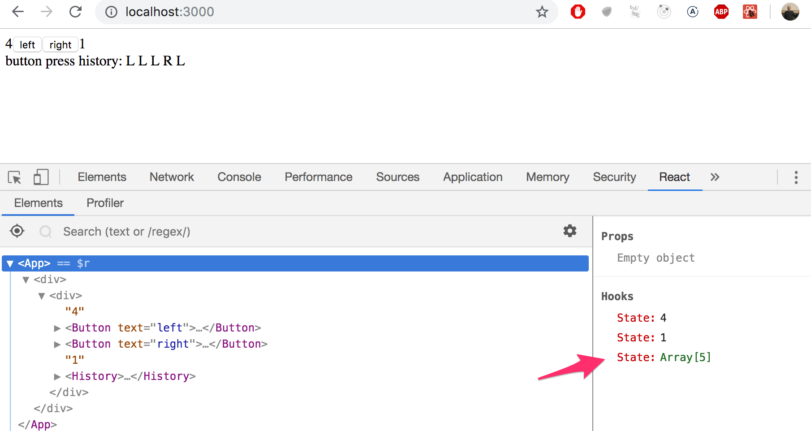

<div class="content">

### Complex state
【复杂状态】
<!-- In our previous example the application state was simple as it was comprised of a single integer. What if our application requires a more complex state? -->

在之前的示例中，应用状态很简单，因为它仅由单个整数组成。 如果我们的应用需要一个更复杂的状态怎么办？

<!-- In most cases the easiest and best way to accomplish this is by using the _useState_ function multiple times to create separate "pieces" of state. -->

在大多数情况下，实现这一点的最简单和最好的方法是多次使用 useState 函数来创建单独的状态“片段”。

<!-- In the following code we create two pieces of state for the application named _left_ and _right_ that both get the initial value of 0: -->

在下面的代码中，我们为应用创建了两个名为 left 和 right 的初始值为0的状态:

```js
const App = () => {
  const [left, setLeft] = useState(0)
  const [right, setRight] = useState(0)

  return (
    <div>
      {left}
      <button onClick={() => setLeft(left + 1)}>
        left
      </button>
      <button onClick={() => setRight(right + 1)}>
        right
      </button>
      {right}
    </div>
  )
}
```

<!-- The component gets access to the functions _setLeft_ and _setRight_ that it can use to update the two pieces of state. -->
组件获得对 setLeft 和 setRight 函数的访问权，可以使用这两个函数更新这两个状态。

<!-- The component's state or a piece of its state can be of any type. We could implement the same functionality by saving the click count of both the <i>left</i> and <i>right</i> buttons into a single object: -->

组件的状态或其状态的一部分可以是任何类型。 我们可以通过将<i>left</i> 和<i>right</i> 按钮的单击次数保存到一个对象中来实现相同的功能:

```js
{
  left: 0,
  right: 0
}
```

<!-- In this case the application would look like this: -->
在这种情况下，应用应该是这样的:

```js
const App = () => {
  const [clicks, setClicks] = useState({
    left: 0, right: 0
  })

  const handleLeftClick = () => {
    const newClicks = { 
      left: clicks.left + 1, 
      right: clicks.right 
    }
    setClicks(newClicks)
  }

  const handleRightClick = () => {
    const newClicks = { 
      left: clicks.left, 
      right: clicks.right + 1 
    }
    setClicks(newClicks)
  }

  return (
    <div>
      {clicks.left}
      <button handleClick={handleLeftClick}>left</button>
      <button handleClick={handleRightClick}>right</button>
      {clicks.right}
    </div>
  )
}
```

<!-- Now the component only has a single piece of state and the event handlers have to take care of changing the <i>entire application state</i>. -->

现在组件只有一个状态片段，事件处理程序必须负责更改<i>整个应用的状态</i>。

<!-- The event handler looks a bit messy. When the left button is clicked, the following function is called: -->
事件处理程序看起来有点凌乱。当单击左键时，会调用下面的函数:

```js
const handleLeftClick = () => {
  const newClicks = { 
    left: clicks.left + 1, 
    right: clicks.right 
  }
  setClicks(newClicks)
}
```

<!-- The following object is set as the new state of the application: -->
下面的对象被设置为应用的新状态:

```js
{
  left: clicks.left + 1,
  right: clicks.right
}
```

<!-- The new value of the <i>left</i> property is now the same as the value of <i>left + 1</i> from the previous state, and the value of the <i>right</i> property is the same as value of the <i>right</i> property from the previous state. -->
 <i>left</i> 属性的新值现在与前一状态的<i>left + 1</i> 的值相同，而<i>right</i> 属性的值与前一状态的<i>right</i> 属性的值相同。

<!-- We can define the new state object a bit more neatly by using the [object spread](https://developer.mozilla.org/en-US/docs/Web/JavaScript/Reference/Operators/Spread_syntax) -->
我们可以通过使用对象的[展开语法](https://developer.mozilla.org/en-us/docs/web/javascript/reference/operators/spread_syntax)更加整洁地定义新的状态对象
<!-- syntax that was added to the language specification in the summer of 2018: -->
该语法在2018年夏天添加到了语言规范中的:

```js
const handleLeftClick = () => {
  const newClicks = { 
    ...clicks, 
    left: clicks.left + 1 
  }
  setClicks(newClicks)
}

const handleRightClick = () => {
  const newClicks = { 
    ...clicks, 
    right: clicks.right + 1 
  }
  setClicks(newClicks)
}
```

<!-- The syntax may seem a bit strange at first. In practice <em>{ ...clicks }</em> creates a new object that has copies of all of the properties of the _clicks_ object. When we add new properties to the object, e.g. <em>{ ...clicks, right: 1 }</em>, the value of the _right_ property in the new object will be 1. -->
语法一开始可能看起来有点奇怪。 实际上， <em>{ ...clicks }</em>  创建了一个新对象，该对象是具有 _clicks_ 对象的所有属性的副本。 当我们向对象添加新属性时，例如 <em>{ ...clicks, right: 1 }</em>，新对象中right属性的值将为1。

<!-- In the example above, this: -->
在上面的例子中，下面代码:

```js
{ ...clicks, right: clicks.right + 1 }
```

<!-- creates a copy of the _clicks_ object where the value of the _right_ property is increased by one. -->
创建了 _clicks_ 对象的副本，其中 _right_ 属性的值增加了1。

<!-- Assigning the object to a variable in the event handlers is not necessary and we can simplify the functions to the following form: -->
将对象分配给事件处理中的变量是没有必要的，我们可以将函数简化为如下形式:

```js
const handleLeftClick = () =>
  setClicks({ ...clicks, left: clicks.left + 1 })

const handleRightClick = () =>
  setClicks({ ...clicks, right: clicks.right + 1 })
```

<!-- Some readers might be wondering why we didn't just update the state directly, like this: -->
一些读者可能想知道为什么我们不直接更新状态，像这样:

```js
const handleLeftClick = () => {
  clicks.left++
  setClicks(clicks)
}
```

<!-- The application appears to work. However, <i>it is forbidden in React to mutate state directly</i>, since it can result in unexpected side effects. Changing state has to always be done by setting the state to a new object. If properties from the previous state object are not changed, they need to simply be copied, which is done by copying those properties into a new object, and setting that as the new state. -->
这个应用似乎可以工作。 但是，这违反了React 中状态不可直接修改的原则，因为它会导致意想不到的副作用。 必须始终通过将状态设置为新对象来更改状态。 如果之前的状态没有变化，属性仅仅需要简单地复制，就是通过将这些属性复制到新的对象中，并将其设置为新状态。

<!-- Storing all of the state in a single state object is a bad choice for this particular application; there's no apparent benefit and the resulting application is a lot more complex. In this case storing the click counters into separate pieces of state is a far more suitable choice. -->
对于这个特定的应用来说，将所有状态存储在单个状态对象中是一个糟糕的选择;  没有明显的好处，还会导致产生的应用要复杂得多。 在这种情况下，将点击计数器存储到单独的状态块中是一个更合适的选择。

<!-- There are situations where it can be beneficial to store a piece of application state in a more complex data structure.[The official React documentation](https://reactjs.org/docs/hooks-faq.html#should-i-use-one-or-many-state-variables) contains some helpful guidance on the topic. -->

在某些情况下，将一段应用状态存储在更复杂的数据结构中是有益的。 官方的React[文档](https://reactjs.org/docs/hooks-faq.html#should-i-use-one-or-many-state-variables)包含了一些关于这个话题的有用的指导。

### Handling arrays
【处理数组】
<!-- Let's add a piece of state to our application containing an array _allClicks_ that remembers every click that has occurred in the application. -->
让我们向应用添加一个状态，该状态包含一个数组 _allClicks_ ，该数组记录应用中发生的每次单击记录。

```js
const App = () => {
  const [left, setLeft] = useState(0)
  const [right, setRight] = useState(0)
  const [allClicks, setAll] = useState([]) // highlight-line

// highlight-start
  const handleLeftClick = () => {
    setAll(allClicks.concat('L'))
    setLeft(left + 1)
  }
// highlight-end  

// highlight-start
  const handleRightClick = () => {
    setAll(allClicks.concat('R'))
    setRight(right + 1)
  }
// highlight-end  

  return (
    <div>
      {left}
      <button onClick={handleLeftClick}>left</button>
      <button onClick={handleRightClick}>right</button>
      {right}
      <p>{allClicks.join(' ')}</p> // highlight-line
    </div>
  )
}
```

<!-- Every click is stored into a separate piece of state called _allClicks_ that is initialized as an empty array: -->
每次单击都会被存储到一个叫 _allClicks_ 的单独的状态单元中，这个状态单元被初始化为一个空数组:

```js
const [allClicks, setAll] = useState([])
```

<!-- When the <i>left</i> button is clicked, we add the letter <i>L</i> to the _allClicks_ array: -->
当单击<i>left</i> 按钮时，我们将字母 <i>L</i> 添加到 allClicks 数组中:

```js
const handleLeftClick = () => {
  setAll(allClicks.concat('L'))
  setLeft(left + 1)
}
```

<!-- The piece of state stored in _allClicks_ is now set to be an array that contains all of the items of the previous state array plus the letter <i>L</i>. Adding the new item to the array is accomplished with the [concat](https://developer.mozilla.org/en-US/docs/Web/JavaScript/Reference/Global_Objects/Array/concat) method, that does not mutate the existing array but rather returns a <i>new copy of the array</i> with the item added to it. -->

存储在 allClicks 中的状态块现在被设置为一个数组，该数组包含前一个状态数组的所有项以及字母 <i>L</i>。 向数组中添加新元素是通过[concat](https://developer.mozilla.org/en-US/docs/Web/JavaScript/Reference/Global_Objects/Array/concat)方法完成的，该方法不改变现有数组，而是返回数组 <i>新副本</i>，并将元素添加到该数组中。

<!-- As mentioned previously, it's also possible in JavaScript to add items to an array with the [push](https://developer.mozilla.org/en-US/docs/Web/JavaScript/Reference/Global_Objects/Array/push) method. If we add the item by pushing it to the _allClicks_ array and then updating the state, the application would still appear to work: -->
正如前面提到的，在 JavaScript 中也可以使用[push](https://developer.mozilla.org/en-us/docs/web/JavaScript/reference/global_objects/array/push)方法将元素添加到数组中。 如果我们通过将元素push到 allClicks 数组，然后更新状态这种方法来添加元素，应用看起来仍然可以工作:

```js
const handleLeftClick = () => {
  allClicks.push('L')
  setAll(allClicks)
  setLeft(left + 1)
}
```

<!-- However, __don't__ do this. As mentioned previously, the state of React components like _allClicks_ must not be mutated directly. Even if mutating state appears to work in some cases, it can lead to problems that are very hard to notice. -->
但是，不要这样做。 如前所述，React 组件(如 _allClicks_ )的状态不能直接更改。 即使改变状态在某些情况下可以工作，也可能导致很难调试的问题。

<!-- Let's take a closer look at how the clicking history is rendered to the page: -->
让我们仔细看看点击历史是如何渲染在页面上的:

```js
const App = () => {
  // ...

  return (
    <div>
      {left}
      <button onClick={handleLeftClick}>left</button>
      <button onClick={handleRightClick}>right</button>
      {right}
      <p>{allClicks.join(' ')}</p> // highlight-line
    </div>
  )
}
```

<!-- We call the [join](https://developer.mozilla.org/en-US/docs/Web/JavaScript/Reference/Global_Objects/Array/join) method for the _allClicks_ array that joins all the items into a single string, separated by the string passed as the function parameter, which in our case is an empty space. -->
我们为 allClicks 数组调用[join](https://developer.mozilla.org/en-us/docs/web/javascript/reference/global_objects/array/join)方法，该数组将所有项目连接到一个字符串中，由作为函数参数传递的字符串分隔，在我们的例子中，该字符串是一个空格。

### Conditional rendering
【条件渲染】
<!-- Let's modify our application so that the rendering of the clicking history is handled by a new <i>History</i> component: -->
让我们修改我们的应用，使得单击历史的渲染由一个新的 <i>History</i>  组件处理:

```js
// highlight-start
const History = (props) => {
  if (props.allClicks.length === 0) {
    return (
      <div>
        the app is used by pressing the buttons
      </div>
    )
  }

  return (
    <div>
      button press history: {props.allClicks.join(' ')}
    </div>
  )
}
// highlight-end

const App = () => {
  // ...

  return (
    <div>
      {left}
      <button onClick={handleLeftClick}>left</button>
      <button onClick={handleRightClick}>right</button>
      {right}
      <History allClicks={allClicks} /> // highlight-line
    </div>
  )
}
```

<!-- Now the behavior of the component depends on whether or not any buttons have been clicked. If not, meaning that the <em>allClicks</em> array is empty, the component renders a div component with some instructions: -->

现在，组件的行为取决于是否单击了任何按钮。 如果没有，这意味着 <em>allClicks</em> 数组是空的，那么该组件将渲染一个带有如下说明的 div 组件:

```js
<div>the app is used by pressing the buttons</div>
```

<!-- And in all other cases, the component renders the clicking history: -->
在其他情况下，该组件渲染单击历史记录:

```js
<div>
  button press history: {props.allClicks.join(' ')}
</div>
```

<!-- The <i>History</i> component renders completely different React-elements depending on the state of the application. This is called <i>conditional rendering</i>. -->
 <i>History</i> 组件根据应用的状态渲染完全不同的 React-元素。

<!-- React also offers many other ways of doing [conditional rendering](https://reactjs.org/docs/conditional-rendering.html). We will take a closer look at this in [第2章](/zh/part2). -->
React 还提供了许多其他的方法来实现[条件渲染](https://reactjs.org/docs/conditional-rendering.html)。 我们将在[第2章节](/zh/part2)中进一步研究这个问题。 

<!-- Let's make one last modification to our application by refactoring it to use the _Button_ component that we defined earlier on: -->
让我们对我们的应用进行最后一次修改，重构它，用上我们前面定义的 Button 组件:

```js
const History = (props) => {
  if (props.allClicks.length === 0) {
    return (
      <div>
        the app is used by pressing the buttons
      </div>
    )
  }

  return (
    <div>
      button press history: {props.allClicks.join(' ')}
    </div>
  )
}

// highlight-start
const Button = ({ handleClick, text }) => (
  <button onClick={handleClick}>
    {text}
  </button>
)
// highlight-end

const App = () => {
  const [left, setLeft] = useState(0)
  const [right, setRight] = useState(0)
  const [allClicks, setAll] = useState([])

  const handleLeftClick = () => {
    setAll(allClicks.concat('L'))
    setLeft(left + 1)
  }

  const handleRightClick = () => {
    setAll(allClicks.concat('R'))
    setRight(right + 1)
  }

  return (
    <div>
      {left}
      // highlight-start
      <Button handleClick={handleLeftClick} text='left' />
      <Button handleClick={handleRightClick} text='right' />
      // highlight-end
      {right}
      <History allClicks={allClicks} />
    </div>
  )
}
```

### Old React
【老版本的React】

<!-- In this course we use the [state hook](https://reactjs.org/docs/hooks-state.html) to add state to our React components, which is part of the newer versions of React and is available from version [16.8.0](https://www.npmjs.com/package/react/v/16.8.0) onwards. Before the addition of hooks, there was no way to add state to React functional components. Components that required state had to be defined as React [class](https://reactjs.org/docs/react-component.html) components using the JavaScript class syntax. -->

在这个过程中，我们使用了状态Hook [state hook](https://reactjs.org/docs/hooks-state.html) 来添加状态到我们的 React 组件，这是 React 的新版本的一部分，可以从版本[16.8.0](https://www.npmjs.com/package/React/v/16.8.0)开始使用。 在添加Hook之前，没有办法将状态添加到函数组件。 需要状态的组件必须使用 JavaScript 类语法定义为 [class](https://reactjs.org/docs/react-component.html) 组件。

<!-- In this course we have made the slightly radical decision to use hooks exclusively from day one, to ensure that we are learning the future style of React. Even though functional components are the future of React, it is still important to learn the class syntax, as there are billions of lines of old React code that you might end up maintaining some day. The same applies to documentation and examples of React that you may stumble across on the internet. -->

在这个课程中，我们做了一个稍微激进的决定，从第一天开始就完全使用Hook，以确保我们当前和未来的React风格。 尽管函数式组件是 React 的未来，但学习类语法仍然很重要，因为有数十亿行旧的 React 代码可能会在某一天需要维护。 同样的道理，你可能在互联网上偶然发现React的文档和例子也使用了这些旧代码。

<!-- We will learn more about React class components later on in the course. -->
我们将在稍后的课程中学习更多关于 React 类组件的知识。

### Debugging React applications
【调试React应用】
<!-- A large part of a typical developer's time is spent on debugging and reading existing code. Every now and then we do get to write a line or two of new code, but a large part of our time is spent on trying to figure out why something is broken or how something works. Good practices and tools for debugging are extremely important for this reason. -->

典型的开发人员的大部分时间都花在调试和读取现有代码上。 我们时不时地会写一两行新代码，但是我们的大部分时间都花在试图弄明白为什么有些东西坏了，或者某些东西是如何工作的上面。 出于这个原因，良好的调试实践和工具非常重要。

<!-- Lucky for us, React is an extremely developer friendly library when it comes to debugging. -->
幸运的是，在调试方面来说，React 对开发者是非常友好的。

<!-- Before we move on, let us remind ourselves of one of the most important rules of web development. -->
在我们继续之前，让我们重新提醒自己 web 开发最重要的规则之一。

<h4>The first rule of web development web开发第一原则</h4>

>  **Keep the browser's developer console open at all times.**
>
>  始终打开浏览器的开发控制台


>The <i>Console</i> tab in particular should always be open, unless there is a specific reason to view another tab.
>尤其是<i>Console</i> 选项卡应该始终处于打开状态，除非有特定的原因需要查看另一个选项卡。

<!-- Keep both your code and the web page open together **at the same time, all the time**. -->
保持你的代码和网页同时打开，一直同时打开。

<!-- If and when your code fails to compile and your browser lights up like a Christmas tree: -->
如果你的代码编译失败，你的浏览器就会像圣诞树一样亮起来:


<!-- don't write more code but rather find and fix the problem **immediately**. There has yet to be a moment in the history of coding where code that fails to compile would miraculously start working after writing large amounts of additional code. I highly doubt that such an event will transpire during this course either. -->

不要继续编写更多的代码，而是立即找到并修复问题。 在编码的历史上，还没有哪一次编译失败的代码在编写了大量额外的代码之后奇迹般地开始工作。这样的事情在这个课程中也不会发生。

<!-- Old school, print based debugging is always a good idea. If the component -->
老派的，基于打印的调试总是一个好主意。如果组件如下所示

```js
const Button = ({ handleClick, text }) => (
  <button onClick={handleClick}>
    {text}
  </button>
)
```

<!-- is not working as intended, it's useful to start printing its variables out to the console. In order to do this effectively, we must transform our function into the less compact form and receive the entire props object without destructuring it immediately: -->

不能正常工作时，开始将其变量输出到控制台是很有用的。 为了有效地做到这一点，我们必须将我们的函数转换成不那么紧凑的形式，接收整个props对象而不是解构它:

```js
const Button = (props) => { 
  console.log(props) // highlight-line
  const { onClick, text } = props
  return (
    <button onClick={onClick}>
      {text}
    </button>
  )
}
```

<!-- This will immediately reveal if, for instance, one of the attributes has been misspelled when using the component. -->
这将立即揭示，例如，是否有一个属性在使用组件时拼写错误。

<!-- **NB** when you use _console.log_ for debugging, don't combine objects in a Java-like fashion by  using a plus. Instead of writing: -->

**注意**：当您使用 _console.log_ 进行调试时，不要使用“加号”，像类似于 java 的方式组合对象。 即不要写:

```js
console.log('props value is' + props)
```

<!-- Separate the things you want to log to the console with a comma: -->
而应用逗号分隔需要打印到控制台的内容:

```js
console.log('props value is', props)
```

<!-- If you use the Java-like way to combine a string with an object, you will end up with a rather uninformative log message: -->
如果你使用类似于 java 的方式将一个字符串与一个对象结合起来，你最终会得到一个相当无用的日志消息:

```js
props value is [Object object]
```

<!-- Whereas the items separated by a comma will all be available in the browser console for further inspection. -->
而用逗号分隔的项目都可以在浏览器控制台中进行进一步检查。

<!-- Logging to the console is by no means the only way of debugging our applications. You can pause the execution of your application code in the Chrome developer console's <i>debugger</i>, by writing the command [debugger](https://developer.mozilla.org/en-US/docs/Web/JavaScript/Reference/Statements/debugger) anywhere in your code. -->

将日志记录到控制台绝不是调试应用的唯一方法。 你可以在 Chrome 开发者控制台的<i>debugger</i> 中暂停应用代码的执行，只需在代码中的任何地方写入命令[debugger](https://developer.mozilla.org/en-us/docs/web/javascript/reference/statements/debugger)即可。

<!-- The execution will pause once it arrives at a point where the _debugger_ command gets executed: -->
一旦到达调试器命令执行的地方，执行就会暂停:


<!-- By going to the <i>Console</i> tab, it is easy to inspect the current state of variables: -->
通过访问<i>Console</i> 选项卡，可以很容易地检查变量的当前状态:


<!-- Once the cause of the bug is discovered you can remove the _debugger_ command and refresh the page. -->
一旦发现 bug 的原因，您可以删除 _debugger_ 命令并刷新页面。

<!-- The debugger also enables us to execute our code line by line with the controls found in the right-hand side of the <i>Sources</i> tab. -->
 _debugger_ 还允许我们使用在<i>Sources</i> 选项卡右侧找到控件一行一行地执行代码。

<!-- You can also access the debugger without the _debugger_ command by adding break points in the <i>Sources</i> tab. Inspecting the values of the component's variables can be done in the _Scope_-section: -->
通过在<i>Sources</i> 选项卡中添加断点，您还可以在不使用 _debugger_ 命令的情况下访问调试器。 检查组件变量的值可以在 Scope-部分 中完成:


<!-- It is highly recommended to add the [React developer tools](https://chrome.google.com/webstore/detail/react-developer-tools/fmkadmapgofadopljbjfkapdkoienihi) extension to Chrome. It adds a new _React_ tab to the developer tools. The new developer tools tab can be used to inspect the different React elements in the application, along with their state and props: -->
强烈建议在 Chrome 中添加 [React developer tools](https://chrome.google.com/webstore/detail/react-developer-tools/fmkadmapgofadopljbjfkapdkoienihi)扩展。 它为开发工具增加了一个新的 _Components_ 选项卡。新的开发者工具页可以用来检查不同的React 元素，以及它的属性和状态：


<!-- The new _React_ developer tools tab can be used to inspect the different React elements in the application, along with their state and props. -->
<!-- 新的 React developer tools 选项卡可用于检查应用中的不同 React 元素，以及它们的状态和属性。 -->

<!-- Unfortunately the current version of React developer tools leaves something to be desired when displaying component state created with hooks: -->
<!-- 不幸的是，当前版本的 React developer 工具在用 hooks 时显示创建的组件状态，有一些不足之处: -->


<!-- The _App_ component's state is defined like so: -->
_App_ 组件的状态定义如下：


<!-- The component state was defined like so: -->
<!-- 组件状态的定义如下: -->

```js
const [left, setLeft] = useState(0)
const [right, setRight] = useState(0)
const [allClicks, setAll] = useState([])
```

<!-- Dev tools shows the state of hooks in the order of their definition: -->
开发工具按照定义顺序显示hook的状态:


<!-- The first <i>State</i> contains the value of the <i>left</i> state, the next contains the value of the <i>right</i> state and the last contains the value of the <i>allClicks</i> state. -->

第一个<i>State</i>包含<i>left</i>状态的值，下一个包含<i>right</i> 状态的值，最后一个包含<i>allClicks</i> 状态的值。

### Rules of Hooks
【Hook的规则】
<!-- There are a few limitations and rules we have to follow to ensure that our application uses hooks-based state functions correctly. -->
为了确保应用正确地使用基于Hook的状态函数，我们必须遵循一些限制和规则。

<!-- The _useState_ function (as well as the _useEffect_ function introduced later on in the course) <i>must not be called</i> from inside of a loop, a conditional expression, or any place that is not a function defining a component. This must be done to ensure that the hooks are always called in the same order, and if this isn't the case the application will behave erratically. -->
不能从循环、条件表达式或任何不是定义组件的函数的地方调用 _useState_ （同样的还有 _useEffect_ 函数，将在后面的课程中介绍）。 这样做是为了确保Hook总是以相同的顺序调用，如果不是这样，应用的行为就会不规则。

<!-- To recap, hooks may only be called from the inside of a function body that defines a React component: -->
回顾一下，hook 只能从定义 React component 的函数体内部调用:

```js
const App = () => {
  // these are ok
  const [age, setAge] = useState(0)
  const [name, setName] = useState('Juha Tauriainen')

  if ( age > 10 ) {
    // this does not work!
    const [foobar, setFoobar] = useState(null)
  }

  for ( let i = 0; i < age; i++ ) {
    // also this is not good
    const [rightWay, setRightWay] = useState(false)
  }

  const notGood = () => {
    // and this is also illegal
    const [x, setX] = useState(-1000)
  }

  return (
    //...
  )
}
```

### Event Handling Revisited
【复习事件处理】
<!-- Event handling has proven to be a difficult topic in previous iterations of this course. -->
事件处理已被证明是本课程前面的迭代中比较难的一块。

<!-- For this reason we will revisit the topic. -->
出于这个原因，我们将再次讨论这个话题。

<!-- Let's assume that we're developing this simple application: -->
假设我们正在开发这个简单的应用， <i>App</i> 如下所示:
```js
const App = () => {
  const [value, setValue] = useState(10)

  return (
    <div>
      {value}
      <button>reset to zero</button>
    </div>
  )
}

```

<!-- We want the clicking of the button to reset the state stored in the _value_ variable. -->
我们希望单击按钮来重置存储在 value 变量中的状态。

<!-- In order to make the button react to a click event, we have to add an <i>event handler</i> to it. -->
为了使按钮对单击事件作出反应，我们必须向其添加一个<i>事件处理程序</i>。

<!-- Event handlers must always be a function or a reference to a function. The button will not work if the event handler is set to a variable of any other type. -->
事件处理程序必须始终是函数或对函数的引用。 如果将事件处理程序设置为任何其他类型的变量，则按钮将不起作用。

<!-- If we were to define the event handler as a string: -->
如果我们将事件处理程序定义为一个字符串:

```js
<button onClick="crap...">button</button>
```

<!-- React would warn us about this in the console: -->
React会在控制台中警告我们: 

```js
index.js:2178 Warning: Expected `onClick` listener to be a function, instead got a value of `string` type.
    in button (at index.js:20)
    in div (at index.js:18)
    in App (at index.js:27)
```

<!-- The following attempt would also not work: -->
下列尝试也不会奏效:

```js
<button onClick={value + 1}>button</button>
```

<!-- We have attempted to set the event handler to _value + 1_ which simply returns the result of the operation. React will kindly warn us about this in the console: -->
我们尝试将事件处理程序设置为 value + 1，它只返回操作的结果。 在控制台中会友好地警告我们:

```js
index.js:2178 Warning: Expected `onClick` listener to be a function, instead got a value of `number` type.
```

<!-- This attempt would not work either: -->
以下这种尝试也不会奏效:

```js
<button onClick={value = 0}>button</button>
```

<!-- The event handler is not a function but a variable assignment, and React will once again issue a warning to the console. This attempt is also flawed in the sense that we must never mutate state directly in React. -->
事件处理程序不是一个函数，而是一个变量赋值，React 将再次向控制台发出警告。 这种尝试也是有缺陷的，因为我们绝不能在React中直接改变状态。

<!-- What about the following: -->
下面的内容会发生什么:

```js
<button onClick={console.log('clicked the button')}>
  button
</button>
```

<!-- The message gets printed to the console once when the component is rendered but nothing happens when we click the button. Why does this not work even when our event handler contains a function _console.log_? -->
当组件渲染出来时，消息会被打印到控制台一次，但是当我们点击按钮时什么也没有发生。 为什么即使我们的事件处理程序包含 console.log 函数依然不能工作呢？

<!-- The issue here is that our event handler is defined as a <i>function call</i> which means that the event handler is actually assigned the returned value from the function, which in the case of _console.log_ is <i>undefined</i>. -->
这里的问题是，我们的事件处理被定义为<i>function call</i>，这意味着事件处理程序实际上被分配了函数返回的值，而 console.log 的返回值是<i>undefined</i>。

<!-- The _console.log_ function call gets executed when the component is rendered and for this reason it gets printed once to the console. -->
 _console.log_ 函数调用在渲染组件时执行，因此它只在控制台中打印一次。

<!-- The following attempt is flawed as well: -->
下面的尝试也是有缺陷的:
```js
<button onClick={setValue(0)}>button</button>
```

<!-- We have once again tried to set a function call as the event handler. This does not work. This particular attempt also causes another problem. When the component is rendered the function _setValue(0)_ gets executed which in turn causes the component to be re-rendered. Re-rendering in turn calls _setValue(0)_ again, resulting in an infinite recursion. -->
我们再次尝试将函数调用设置为事件处理程序。 这行不通。 这种特殊的尝试也引起了另一个问题。 在渲染组件时，执行函数 setValue (0) ，从而导致重新渲染组件。 依次重新渲染将再次调用 setValue (0) ，从而导致无限递归。

<!-- Executing a particular function call when the button is clicked can be accomplished like this: -->
当按钮被点击时，执行一个特定的函数调用可以这样完成:

```js
<button onClick={() => console.log('clicked the button')}>
  button
</button>
```

<!-- Now the event handler is a function defined with the arrow function syntax _() => console.log('clicked the button')_. When the component gets rendered, no function gets called and only the reference to the arrow function is set to the event handler. Calling the function happens only once the button is clicked. -->
现在，事件处理程序是一个使用箭头函数 _() => console.log('clicked the button')_.定义的函数。 在渲染组件时，不调用任何函数，只将对箭头函数的引用设置为事件处理程序。 只有单击按钮时才调用该函数。

<!-- We can implement resetting the state in our application with this same technique: -->
我们可以使用相同的技术在应用中实现重置状态:

```js
<button onClick={() => setValue(0)}>button</button>
```

<!-- The event handler is now the function _() => setValue(0)_. -->
事件处理程序现在是函数 _() => setValue(0)_。

<!-- Defining event handlers directly in the attribute of the button is not necessarily the best possible idea. -->
在按钮的属性中直接定义事件处理程序不一定是最好的方法。

<!-- You will often see event handlers defined in a separate place. In the following version of our application we define a function that then gets assigned to the _handleClick_ variable in the body of the component function: -->
您经常会看到事件处理程序定义在一个单独的位置。 在下面的应用中，我们定义了一个函数，然后将其赋值给组件函数体中的 _handleClick_ 变量:

```js
const App = () => {
  const [value, setValue] = useState(10)

  const handleClick = () =>
    console.log('clicked the button')

  return (
    <div>
      {value}
      <button onClick={handleClick}>button</button>
    </div>
  )
}
```

<!-- The _handleClick_ variable is now assigned to a reference to the function. The reference is passed to the button as the <i>onClick</i> attribute: -->
现在， _handleClick_ 变量被分配成对函数的引用。 引用作为<i>onClick</i> 属性传递给按钮:

```js
<button onClick={handleClick}>button</button>
```

<!-- Naturally, our event handler function can be composed of multiple commands. In these cases we use the longer curly brace syntax for arrow functions: -->
当然，我们的事件处理可以由多个命令组成。 在这种情况下，我们对箭头函数，使用较长的大括号语法:

```js
const App = () => {
  const [value, setValue] = useState(10)

  // highlight-start
  const handleClick = () => {
    console.log('clicked the button')
    setValue(0)
  }
   // highlight-end

  return (
    <div>
      {value}
      <button onClick={handleClick}>button</button>
    </div>
  )
}
```

### Function that returns a function
【返回函数的函数】
<!-- Another way to define a event handler is to use <i>function that returns a function</i>. -->
定义事件处理程序的另一种方法是使用返回函数的函数。

<!-- You probably won't need to use functions that return functions in any of the exercises in this course.  If the topic seems particularly confusing, you may skip over this section for now and return to it later. -->
在本课程的任何练习中，您可能不需要使用返回函数的函数。 如果这个议题看起来特别令人困惑，您可以跳过这一章节，稍后再回过头看它。

<!-- Let's make the following changes to our code: -->
让我们对我们的代码进行如下修改:

```js
const App = () => {
  const [value, setValue] = useState(10)

  // highlight-start
  const hello = () => {
    const handler = () => console.log('hello world')

    return handler
  }
  // highlight-end

  return (
    <div>
      {value}
      <button onClick={hello()}>button</button>
    </div>
  )
}
```

<!-- The code functions correctly even though it looks complicated.  -->
尽管代码看起来很复杂，但它能正常工作。

<!-- The event handler is now set to a function call: -->
事件处理程序现在设置为函数调用:

```js
<button onClick={hello()}>button</button>
```

<!-- Earlier on we stated that an event handler may not be a call to a function, and that it has to be a function or a reference to a function. Why then does a function call work in this case? -->
前面我们说过，事件处理程序不能是对函数的调用，它必须是函数或对函数的引用。 那么为什么函数调用在这种情况下会起作用呢？

<!-- When the component is rendered, the following function gets executed: -->
在渲染组件时，执行如下函数:

```js
const hello = () => {
  const handler = () => console.log('hello world')

  return handler
}
```

<!-- The <i>return value</i> of the function is another function that is assigned to the _handler_ variable. -->
函数的<i>返回值</i> 是分配给处理程序变量的另一个函数。

<!-- When React renders the line: -->
当 React 渲染行时:

```js
<button onClick={hello()}>button</button>
```

<!-- It assigns the return value of _hello()_ to the onClick-attribute. Essentially the line gets transformed into: -->
它将 hello ()的返回值赋给 onClick-属性，本质上该行被转换成:

```js
<button onClick={() => console.log('hello world')}>
  button
</button>
```

<!-- Since the _hello_ function returns a function, the event handler is now a function. -->
因为 hello 函数返回一个函数，所以事件处理程序现在是一个函数。

<!-- What's the point of this concept? -->
这个概念的意义是什么？

<!-- Let's change the code a tiny bit: -->
让我们稍微修改一下代码:

```js
const App = () => {
  const [value, setValue] = useState(10)

  // highlight-start
  const hello = (who) => {
    const handler = () => {
      console.log('hello', who)
    }

    return handler
  }
  // highlight-end  

  return (
    <div>
      {value}
  // highlight-start      
      <button onClick={hello('world')}>button</button>
      <button onClick={hello('react')}>button</button>
      <button onClick={hello('function')}>button</button>
  // highlight-end      
    </div>
  )
}
```

<!-- Now the application has three buttons with event handlers defined by the _hello_ function that accepts a parameter. -->
现在，应用有三个按钮，事件处理程序由接受参数的 hello 函数定义。

<!-- The first button is defined as -->
第一个按钮定义为

```js
<button onClick={hello('world')}>button</button>
```

<!-- The event handler is created by <i>executing</i> the function call _hello('world')_. The function call returns the function: -->
事件处理程序由<i>执行</i> 函数调用 _hello('world')_创建，函数 call 返回函数:

```js
() => {
  console.log('hello', 'world')
}
```

<!-- The second button is defined as: -->
第二个按钮定义为:

```js
<button onClick={hello('react')}>button</button>
```

<!-- The function call _hello('react')_ that creates the event handler returns: -->
创建事件处理程序的函数 _hello('react')_返回:

```js
() => {
  console.log('hello', 'react')
}
```

<!-- Both buttons get their own individualized event handlers. -->
两个按钮都有自己的单独事件处理程序。

<!-- Functions returning functions can be utilized in defining generic functionality that can be customized with parameters. The _hello_ function that creates the event handlers can be thought of as a factory that produces customized event handlers meant for greeting users. -->
返回函数的函数可用于定义可以使用参数自定义的通用函数。 可以将创建事件处理程序的 hello 函数视为一个生成用户的定制事件处理的工厂。

<!-- Our current definition is slightly verbose: -->
我们目前的定义有点冗长:

```js
const hello = (who) => {
  const handler = () => {
    console.log('hello', who)
  }

  return handler
}
```

<!-- Let's eliminate the helper variables and directly return the created function: -->
让我们消除辅助变量，直接返回创建的函数:

```js
const hello = (who) => {
  return () => {
    console.log('hello', who)
  }
}
```

<!-- Since our _hello_ function is composed of a single return command, we can omit the curly braces and use the more compact syntax for arrow functions: -->
因为 hello 函数是由一个单独的返回命令组成的，所以我们可以省略大括号，对箭头函数使用更紧凑的语法:

```js
const hello = (who) =>
  () => {
    console.log('hello', who)
  }
```

<!-- Lastly, let's write all of the arrows on the same line: -->
最后，让我们把所有的箭头写在同一行上:

```js
const hello = (who) => () => {
  console.log('hello', who)
}
```

<!-- We can use the same trick to define event handlers that set the state of the component to a given value. Let's make the following changes to our code: -->
我们可以使用相同的技巧来定义将组件状态，设置为给定值的事件处理程序。 让我们对我们的代码进行如下修改:

```js
const App = () => {
  const [value, setValue] = useState(10)
  
  // highlight-start
  const setToValue = (newValue) => () => {
    setValue(newValue)
  }
  // highlight-end
  
  return (
    <div>
      {value}
      // highlight-start
      <button onClick={setToValue(1000)}>thousand</button>
      <button onClick={setToValue(0)}>reset</button>
      <button onClick={setToValue(value + 1)}>increment</button>
      // highlight-end
    </div>
  )
}
```

<!-- When the component is rendered, the <i>thousand</i> button is created: -->
在渲染组件时，创建<i>thousand</i> 按钮:

```js
<button onClick={setToValue(1000)}>thousand</button>
```

<!-- The event handler is set to the return value of _setToValue(1000)_ which is the following function: -->
事件处理程序设置为 setToValue (1000)的返回值，该返回值是如下函数:

```js
() => {
  setValue(1000)
}
```

<!-- The increase button is declared as following: -->
为 increase 按钮的代码行如下:

```js
<button onClick={setToValue(value + 1)}>increment</button>
```

<!-- The event handler is created by the function call _setToValue(value + 1)_ which receives as its parameter the current value of the state variable _value_ increased by one. If the value of _value_ was 10, then the created event handler would be the function: -->
事件处理程序由函数调用_setToValue(value + 1)_ 创建，该函数接收状态变量值的当前值，并将变量值增加1作为参数。 如果值为10，那么创建的事件处理程序就是函数:

```js
() => {
  setValue(11)
}
```

<!-- Using functions that return functions is not required to achieve this functionality. Let's return the _setToValue_ function that is responsible for updating state, into a normal function: -->
使用返回函数的函数不是实现此功能所必需的。 让我们将负责更新状态的 _setToValue_ 函数返回到一个普通函数:

```js
const App = () => {
  const [value, setValue] = useState(10)

  const setToValue = (newValue) => {
    setValue(newValue)
  }

  return (
    <div>
      {value}
      <button onClick={() => setToValue(1000)}>
        thousand
      </button>
      <button onClick={() => setToValue(0)}>
        reset
      </button>
      <button onClick={() => setToValue(value + 1)}>
        increment
      </button>
    </div>
  )
}
```

<!-- We can now define the event handler as a function that calls the _setToValue_ function with an appropriate parameter. The event handler for resetting the application state would be: -->
现在，我们可以将事件处理程序定义为一个函数，该函数使用适当的参数调用 setToValue 函数。 用于重置应用状态的事件处理程序如下:

```js
<button onClick={() => setToValue(0)}>reset</button>
```

<!-- Choosing between the two presented ways of defining your event handlers is mostly a matter of taste. -->
可以在这两种定义事件处理程序的方式中进行选择，这主要取决于个人喜好。

### Passing Event Handlers to Child Components
【将事件处理传递给子组件】
<!-- Let's extract the button into its own component: -->
让我们将按钮提取到它自己的组件中:

```js
const Button = (props) => (
  <button onClick={props.handleClick}>
    {props.text}
  </button>
)
```

<!-- The component gets the event handler function from the _handleClick_ prop, and the text of the button from the _text_ prop. -->
该组件从 _handleClick_  属性获取事件处理函数，从text 属性获取按钮的文本。

<!-- Using the <i>Button</i> component is simple, although we have to make sure that we use the correct attribute names when passing props to the component. -->
使用<i>Button</i> 组件很简单，尽管我们必须确保在向组件传递props时使用正确的属性名。


### Do Not Define Components Within Components
【不要在组件中定义组件】

<!-- Let's start displaying the value of the application into its own <i>Display</i> component. -->
让我们开始将应用的值显示到它自己的<i>Display</i> 组件中。

<!-- We will change the application by defining a new component inside of the <i>App</i>-component. -->
我们将通过在<i>App</i>-组件中定义一个新组件来更改应用。

```js
// This is the right place to define a component
const Button = (props) => (
  <button onClick={props.handleClick}>
    {props.text}
  </button>
)

const App = () => {
  const [value, setValue] = useState(10)

  const setToValue = newValue => {
    setValue(newValue)
  }

  // Do not define components inside another component
  const Display = props => <div>{props.value}</div> // highlight-line

  return (
    <div>
      <Display value={value} />
      <Button handleClick={() => setToValue(1000)} text="thousand" />
      <Button handleClick={() => setToValue(0)} text="reset" />
      <Button handleClick={() => setToValue(value + 1)} text="increment" />
    </div>
  )
}
```

<!-- The application still appears to work, but **don't implement components like this!** Never define components inside of other components. The method provides no benefits and leads to many unpleasant problems. The biggest problems are due to the fact that React treats a component defined inside of another component as a new component in every render. This makes it impossible to React to optimize the component. -->

应用看起来仍然可以工作，但是 **不要像这样实现组件！**不要在其他组件内部定义组件。 这种方法没有任何好处，而且会导致许多不愉快的问题。最大的问题是React 在每次渲染时，会将内部的组件当作一个新的组件。这回导致React 无法去优化组件。

<!-- Let's instead move th e <i>Display</i> component function to its correct place, which is outside of the <i>App</i> component function: -->
让我们把<i>Display</i> 组件函数移动到正确的位置，这个位置在<i>App</i> 组件函数之外:


```js
const Display = props => <div>{props.value}</div>

const Button = (props) => (
  <button onClick={props.handleClick}>
    {props.text}
  </button>
)

const App = () => {
  const [value, setValue] = useState(10)

  const setToValue = newValue => {
    setValue(newValue)
  }

  return (
    <div>
      <Display value={value} />
      <Button handleClick={() => setToValue(1000)} text="thousand" />
      <Button handleClick={() => setToValue(0)} text="reset" />
      <Button handleClick={() => setToValue(value + 1)} text="increment" />
    </div>
  )
}
```
### Useful Reading
【有用的阅读材料】
<!-- The internet is full of React-related material. However, we use such a new style of React that a large majority of the material found online is outdated for our purposes. -->
互联网上充满了React相关的材料。 然而，我们使用了新的React方式，以至于网上发现的绝大多数材料对我们的目的来说都已经过时了。

<!-- You may find the following links useful: -->
你可在如下链接中找到有用的资料:

<!-- - The React [official documentation](https://reactjs.org/docs/hello-world.html) is worth checking out at some point, although most of it will become relevant only later on in the course. Also, everything related to Class-components is irrelevant to us.-->

- React[官方文档](https://reactjs.org/docs/hello-world.html)在某种程度上值得一读，尽管其中大部分只有在课程后期才会变得有意义。 此外，所有与类组件相关的内容都与我们无关。

<!-- - Some courses on [Egghead.io](https://egghead.io) like [Start learning React](https://egghead.io/courses/start-learning-react) are of high quality, and the slightly newer [The Beginner's guide to React](https://egghead.io/courses/the-beginner-s-guide-to-reactjs) is also relatively good; both courses introduce concepts that will also be introduced later on in this course. However, both courses use Class components instead of the new functional ones used in this course.-->
- 一些关于[Egghead.io](https://Egghead.io)的课程，如[开始学习React](https://Egghead.io/courses/Start-learning-React) ，质量很高，稍新一点的[初学者React指南](https://Egghead.io/courses/The-Beginner-s-guide-to-reactjs)也相对不错; 这两门课程都介绍了一些概念，这些概念也将在本课程后面介绍。 然而，这两门课程都使用了 Class 组件，而不是本课程中使用的新的函数式组件。

</div>

<div class="tasks">
  <h3>Exercises  1.6.-1.14.</h3>


<!-- Submit your solutions to the exercises by first pushing your code to GitHub and then marking the completed exercises into the [exercise submission system](https://study.cs.helsinki.fi/stats/courses/fullstack2021). -->
提交你的解决方案，首先把你的代码推送到 GitHub，然后把[练习提交系统](https://study.cs.helsinki.fi/stats/courses/fullstack2021)完成的练习标记为已完成。

<!-- Remember, submit **all** the exercises of one part **in a single submission**. Once you have submitted your solutions for one part, **you cannot submit more exercises to that part any more**. -->
记住，在一次提交中提交一章节的所有练习。 一旦你提交了一章节的解决方案，你就不能再向这个章节提交更多的练习了。

<i>Some of the exercises work on the same application. In these cases, it is sufficient to submit just the final version of the application. If you wish, you can make a commit after every finished exercise, but it is not mandatory.</i>
有些练习是针对同一个应用的。 在这些情况下，只提交应用的最终版本就足够了。 如果您愿意，您可以在每次完成练习后进行commit，但这不是强制性的。 

<!-- **WARNING** create-react-app will automatically turn your project into a git-repository unless you create your application inside of an existing git repository. **Most likely you do not want each of your projects to be a separate repository**, so simply run the _rm -rf .git_ command at the root of your application. -->

警告： create-react-app 会自动使项目成为一个 git 仓库，除非应用是在已有仓库中创建的。 而您很可能不希望项目成为一个存储库，因此可以在项目的根目录中运行命令  *_rm -rf .git_*

<!-- In some situations you may also have to run the command below from the root of the project: -->
在某些情况下，您可能还必须从项目的根目录运行如下命令:

``` 
rm -rf node_modules/ && npm i
```

  <h4> 1.6: unicafe 步骤1</h4>

<!-- H41.6: unicafe 步骤1 / h4 -->

<!-- Like most companies, [Unicafe](https://www.unicafe.fi/#/9/4) collects feedback from its customers. Your task is to implement a web application for collecting customer feedback. There are only three options for feedback: <i>good</i>, <i>neutral</i>, and <i>bad</i>. -->
像大多数公司一样， [Unicafe](https://www.unicafe.fi/#/9/4)收集来自客户的反馈。 您的任务是实现一个收集客户反馈的 web 应用。 反馈只有三种选择:<i>good</i>、<i>neutral</i> 和<i>bad</i>。

<!-- The application must display the total number of collected feedback for each category. Your final application could look like this: -->
应用必须显示每个类别收集的反馈总数。最终的应用可以是这样的:


<!-- Note that your application needs to work only during a single browser session. Once you refresh the page, the collected feedback is allowed to disappear. -->
请注意，您的应用只需要在单个浏览器会话期间工作。 一旦刷新页面，收集到的反馈信息就会消失。

<!-- It is advisable to use the same structure that is used in mateerial and previous exercise. File <i>index.js</i> is as follows: -->
建议使用与之前课程材料相同的结构，<i>index.js</i> 文件内容如下：

```js
import ReactDOM from 'react-dom'
import App from './App'

ReactDOM.render(
  <App />, 
  document.getElementById('root')
)
```

<!-- You can implement the application in a single <i>index.js</i> file. You can use the code below as a starting point for your application. -->
<!-- You can use the code below as a starting point for the <i>App.js</i> file: -->
您可以使用下面的代码作为<i>App.js</i>的起点。

```js
import React, { useState } from 'react'

const App = () => {
  // save clicks of each button to own state
  const [good, setGood] = useState(0)
  const [neutral, setNeutral] = useState(0)
  const [bad, setBad] = useState(0)

  return (
    <div>
      code here
    </div>
  )
}

export default App
```

<h4>1.7: unicafe 步骤2</h4>


<!-- Expand your application so that it shows more statistics about the gathered feedback: the total number of collected feedback, the average score (good: 1, neutral: 0, bad: -1) and the percentage of positive feedback. -->
扩展您的应用，以便它显示更多关于收集到的反馈的统计数据: 收集到的反馈总数、平均分数(好: 1，中性: 0，坏:-1)和正反馈的百分比。


<h4>1.8: unicafe 步骤3</h4>

<!-- Refactor your application so that displaying the statistics is extracted into its own <i>Statistics</i> component. The state of the application should remain in the <i>App</i> root component. -->
重构应用，以便将显示统计信息提取到它自己的<i>Statistics</i> 组件中。 应用的状态应该保留在<i>App</i> 根组件中。

<!-- Remember that components should not be defined inside other components: -->
记住组件不应该在其他组件中定义:

```js
// a proper place to define a component
const Statistics = (props) => {
  // ...
}

const App = () => {
  const [good, setGood] = useState(0)
  const [neutral, setNeutral] = useState(0)
  const [bad, setBad] = useState(0)

  // do not define a component within another component
  const Statistics = (props) => {
    // ...
  }

  return (
    // ...
  )
}
```

<h4>1.9: unicafe 步骤4</h4>
<!-- Change your application to display statistics only once feedback has been gathered. -->
只有在收集到反馈之后，才能将应用更改为显示统计信息。


<h4>1.10: unicafe 步骤5</h4>


<!-- Let's continue refactoring the application. Extract the following two components: -->
让我们继续重构这个应用，提取如下两个组件:

- <!--<i>Button</i> for defining the buttons used for submitting feedback--><i>按钮</i> 用于定义用于提交反馈的按钮
- <!--<i>Statistic</i> for displaying a single statistic, e.g. the average score.--><i>显示单一统计数字的 statistics</i>，例如平均分数。

<!-- To be clear: the <i>Statistic</i> component always displays a single statistic, meaning that the application uses multiple components for rendering all of the statistics: -->
需要明确的是:<i>statistics</i> 组件总是显示一个统计信息，这意味着应用需要使用多个组件来渲染所有的统计信息:

```js
const Statistics = (props) => {
  /// ...
  return(
    <div>
      <Statistic text="good" value ={...} />
      <Statistic text="neutral" value ={...} />
      <Statistic text="bad" value ={...} />
      // ...
    </div>
  )
}

```

<!-- The application's state should still be kept in the root <i>App</i> component. -->
应用的状态仍然应该保存在<i>App</i> 根组件中。

<h4>1.11*: unicafe 步骤6</h4>
<!-- Display the statistics in an HTML [table](https://developer.mozilla.org/en-US/docs/Learn/HTML/Tables/Basics), so that your application looks roughly like this: -->
在 HTML [表格](https://developer.mozilla.org/en-us/docs/learn/HTML/tables/basics)中显示统计信息 ，这样你的应用看起来大致如下:


<!-- Remember to keep your console open at all times. If you see this warning in your console: -->
请记住始终打开控制台。如果在控制台中看到如下警告:


<!-- Then perform the necessary actions to make the warning disappear. Try Googling the error message if you get stuck. -->
执行必要的操作使警告消失。如果卡住了，尝试用谷歌搜索错误消息。

<!--<i>Typical source of an error `Unchecked runtime.lastError: Could not establish connection. Receiving end does not exist.` is Chrome extension. Try going to `chrome://extensions/` and try disabling them one by one and refreshing React app page; the error should eventually disappear.</i>-->
典型的错误来用来源: `Unchecked runtime.lastError: Could not establish connection. Receiving end does not exist.`  是 Chrome 扩展导致的。 尝试在 `chrome://extensions/`中  ，逐个禁用它们并刷新 React app 页面; 错误最终应该会消失。 

<!-- **Make sure that from now on you don't see any warnings in your console!** -->

确保从现在开始，你在控制台上看不到任何警告!

<h4>1.12*: anecdotes 步骤1</h4>

<!-- The world of software engineering is filled with [anecdotes](http://www.comp.nus.edu.sg/~damithch/pages/SE-quotes.htm) that distill timeless truths from our field into short one-liners. -->
在软件工程的世界里，充满了从我们这个领域提炼出永恒真理 [箴言anecdotes](http://www.comp.nus.edu.sg/~damithch/pages/SE-quotes.htm) 。

<!-- Expand the following application by adding a button that can be clicked to display a <i>random</i> anecdote from the field of software engineering:  -->

通过添加一个点击按钮来显示软件工程领域的随机箴言，扩展如下应用:

```js
import React, { useState } from 'react'

const App = () => {
  const anecdotes = [
    'If it hurts, do it more often',
    'Adding manpower to a late software project makes it later!',
    'The first 90 percent of the code accounts for the first 90 percent of the development time...The remaining 10 percent of the code accounts for the other 90 percent of the development time.',
    'Any fool can write code that a computer can understand. Good programmers write code that humans can understand.',
    'Premature optimization is the root of all evil.',
    'Debugging is twice as hard as writing the code in the first place. Therefore, if you write the code as cleverly as possible, you are, by definition, not smart enough to debug it.'
  ]
   
  const [selected, setSelected] = useState(0)

  return (
    <div>
      {anecdotes[selected]}
    </div>
  )
}

export default App
```

<!-- Google will tell you how to generate random numbers in JavaScript. Remember that you can test generating random numbers e.g. straight in the console of your browser. -->
谷歌会告诉你如何在 JavaScript 中生成随机数。 记住，你可以在浏览器的控制台中测试随机数的生成。

<!-- Your finished application could look something like this: -->
你完成的应用可以是这样的:


<!-- **WARNING** create-react-app will automatically turn your project into a git-repository unless you create your application inside of an existing git repository. **Most likely you do not want each of your project to be a separate repository**, so simply run the _rm -rf .git_ command at the root of your application. -->

**警告**： create-react-app 会自动使项目成为一个 git 仓库，除非应用是在已有仓库中创建的。 而您很可能不希望项目成为一个存储库，因此可以在项目的根目录中运行命令  *_rm -rf .git_* 。 

<h4>1.13*: anecdotes 步骤2</h4>
<!-- Expand your application so that you can vote for the displayed anecdote. -->
扩展您的应用，以便您可以为显示箴言的投票。


<!-- **NB** store the votes of each anecdote into an array or object in the component's state. Remember that the correct way of updating state stored in complex data structures like objects and arrays is to make a copy of the state. -->

注意， 将对每个箴言的投票存储到组件状态的数组或对象中。 记住，更新存储在对象和数组等复杂数据结构中的状态，正确方法是复制状态。

<!-- You can create a copy of an object like this: -->
你可以像这样创建一个对象的副本:

```js
const points = { 0: 1, 1: 3, 2: 4, 3: 2 }

const copy = { ...points }
// increment the property 2 value by one
copy[2] += 1     
```

<!-- OR a copy of an array like this: -->
或者一个数组的副本:

```js
const points = [1, 4, 6, 3]

const copy = [...points]
// increment the value in position 2 by one
copy[2] += 1     
```

<!-- Using an array might be the simpler choice in this case. Googling will provide you with lots of hints on how to create a zero-filled array of a desired length, like [this](https://stackoverflow.com/questions/20222501/how-to-create-a-zero-filled-javascript-array-of-arbitrary-length/22209781). -->
在这种情况下，使用数组可能是更简单的选择。 在 google 上搜索会给你提供很多关于如何创建一个具有期望长度的、零填充的数组，比如[这一篇](https://stackoverflow.com/questions/20222501/how-to-create-a-zero-filled-javascript-array-of-arbitrary-length/22209781)。

<h4>1.14*: anecdotes 步骤3</h4>

<!-- H41.14 * : 八卦 / 步骤3 / h4 -->

<!-- Now implement the final version of the application that displays the anecdote with the largest number of votes: -->
现在实现这个应用的最终版本，显示得票最多的警句:


<!-- If multiple anecdotes are tied for first place it is sufficient to just show one of them. -->
如果有多个箴言并列第一，那么只要展示其中一个就足够了。

<!-- This was the last exercise for this part of the course and it's time to push your code to GitHub and mark all of your finished exercises to the [exercise submission system](https://study.cs.helsinki.fi/stats/courses/fullstack2021). -->
这是本课程这一章节的最后一个练习，现在是时候把你的代码推送到 GitHub，并将所有完成的练习标记到[练习提交系统](https://study.cs.helsinki.fi/stats/courses/fullstack2021)。

</div>

