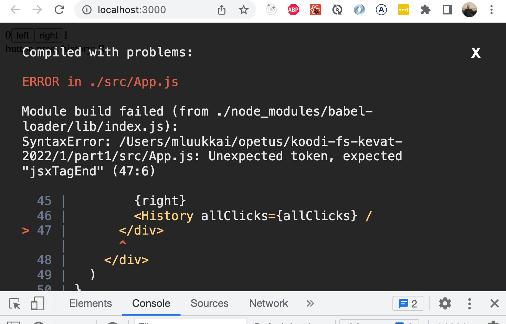

<div class="content">

### A note on React version

<!-- Version 18 of React was released late March 2022. The code in material should work as it is with the new React version. However, some libraries might not yet be compatible with React 18. At the moment of writing (4th April) at least the Apollo client used in [part 8](/en/part8) does not yet work with most recent React.-->
 React的第18版在2022年3月底发布。材料中的代码应该可以在新的React版本中正常工作。然而，一些库可能还不兼容React 18。在写这篇文章的时候（4月4日），至少在[第8章节](/en/part8)中使用的Apollo客户端还不能与最新的React兼容。

<!-- In case you end up in a situation where your application breaks because of library compatibility problems, <i>downgrade</i> to the older React by changing the file <i>package.json</i> as follows:-->
 如果你最终因为库的兼容性问题而导致你的应用崩溃，<i>降级</i>到旧版React，方法是改变文件<i>package.json</i>。

```js
{
  "dependencies": {
    "react": "^17.0.2", // highlight-line
    "react-dom": "^17.0.2", // highlight-line
    "react-scripts": "5.0.0",
    "web-vitals": "^2.1.4"
  },
  // ...
}
```

<!-- After the change is made, reinstall dependencies by running-->
 更改后，通过运行以下程序重新安装依赖关系

```js
npm install
```

<!-- Note that also the file <i>index.js</i> needs to be changed a bit. For React 17 it looks like-->
 注意，文件<i>index.js</i>也需要做一些改变。对于React 17，它如下所示：

```js
import ReactDOM from 'react-dom'
import App from './App'

ReactDOM.render(<App />, document.getElementById('root'))
```

<!-- but for React 18 the correct form is-->
 但对于React 18，正确的形式是

```js
import React from 'react'
import ReactDOM from 'react-dom/client'

import App from './App'

ReactDOM.createRoot(document.getElementById('root')).render(<App />)
```

### Complex state

<!-- In our previous example the application state was simple as it was comprised of a single integer. What if our application requires a more complex state?-->
 在我们之前的例子中，应用的状态很简单，因为它是由一个整数组成的。如果我们的应用需要一个更复杂的状态呢？

<!-- In most cases the easiest and best way to accomplish this is by using the _useState_ function multiple times to create separate "pieces" of state.-->
 在大多数情况下，最简单和最好的方法是通过多次使用_useState_函数来创建独立的状态 "片段"。

<!-- In the following code we create two pieces of state for the application named _left_ and _right_ that both get the initial value of 0:-->
 在下面的代码中，我们为应用创建了两个名为_left_和_right_的状态片段，它们的初始值都为0。

```js
const App = () => {
  const [left, setLeft] = useState(0)
  const [right, setRight] = useState(0)

  return (
    <div>
      {left}
      <button onClick={() => setLeft(left + 1)}>
        left
      </button>
      <button onClick={() => setRight(right + 1)}>
        right
      </button>
      {right}
    </div>
  )
}
```

<!-- The component gets access to the functions _setLeft_ and _setRight_ that it can use to update the two pieces of state.-->
 该组件可以访问函数_setLeft_和_setRight_，它可以用来更新这两个状态片断。

<!-- The component's state or a piece of its state can be of any type. We could implement the same functionality by saving the click count of both the <i>left</i> and <i>right</i> buttons into a single object:-->
 组件的状态或其状态的一部分可以是任何类型。我们可以通过将<i>left</i>和<i>right</i>按钮的点击次数保存在一个对象中来实现同样的功能。
```js
{
  left: 0,
  right: 0
}
```

<!-- In this case the application would look like this:-->
 在这种情况下，应用将如下所示：

```js
const App = () => {
  const [clicks, setClicks] = useState({
    left: 0, right: 0
  })

  const handleLeftClick = () => {
    const newClicks = {
      left: clicks.left + 1,
      right: clicks.right
    }
    setClicks(newClicks)
  }

  const handleRightClick = () => {
    const newClicks = {
      left: clicks.left,
      right: clicks.right + 1
    }
    setClicks(newClicks)
  }

  return (
    <div>
      {clicks.left}
      <button onClick={handleLeftClick}>left</button>
      <button onClick={handleRightClick}>right</button>
      {clicks.right}
    </div>
  )
}
```

<!-- Now the component only has a single piece of state and the event handlers have to take care of changing the <i>entire application state</i>.-->
 现在这个组件只有单一的状态，事件处理程序必须负责改变整个应用的状态。

<!-- The event handler looks a bit messy. When the left button is clicked, the following function is called:-->
事件处理程序看起来有点乱。当左键被点击时，下面的函数被调用。
```js
const handleLeftClick = () => {
  const newClicks = {
    left: clicks.left + 1,
    right: clicks.right
  }
  setClicks(newClicks)
}
```

<!-- The following object is set as the new state of the application:-->
 以下对象被设置为应用的新状态。
```js
{
  left: clicks.left + 1,
  right: clicks.right
}
```

<!-- The new value of the <i>left</i> property is now the same as the value of <i>left + 1</i> from the previous state, and the value of the <i>right</i> property is the same as value of the <i>right</i> property from the previous state.-->
 现在<i>left</i>属性的新值与前一个状态的<i>left + 1</i>的值相同，而<i>right</i>属性的值与前一个状态的<i>right</i>的值相同。

<!-- We can define the new state object a bit more neatly by using the [object spread](https://developer.mozilla.org/en-US/docs/Web/JavaScript/Reference/Operators/Spread_syntax)-->
我们可以通过使用[对象传播](https://developer.mozilla.org/en-US/docs/Web/JavaScript/Reference/Operators/Spread_syntax)来更整齐地定义新的状态对象。
<!-- syntax that was added to the language specification in the summer of 2018:-->
该语法于2018年夏天被添加到语言规范中。

```js
const handleLeftClick = () => {
  const newClicks = {
    ...clicks,
    left: clicks.left + 1
  }
  setClicks(newClicks)
}

const handleRightClick = () => {
  const newClicks = {
    ...clicks,
    right: clicks.right + 1
  }
  setClicks(newClicks)
}
```

<!-- The syntax may seem a bit strange at first. In practice <em>{ ...clicks }</em> creates a new object that has copies of all of the properties of the _clicks_ object. When we specify a particular property - e.g. <i>right</i> in <em>{ ...clicks, right: 1 }</em>, the value of the _right_ property in the new object will be 1.-->
 这种语法一开始可能有点奇怪。实际上<em>{ ...clicks }</em>创建了一个新的对象，它拥有_clicks_对象的所有属性的副本。当我们指定一个特定的属性--例如<em>{ ...clicks, right: 1 }</em>中的<i>right</i>，新对象中的_right_属性值将是1。

<!-- In the example above, this:-->
 在上面的例子中

```js
{ ...clicks, right: clicks.right + 1 }
```

<!-- creates a copy of the _clicks_ object where the value of the _right_ property is increased by one.-->
 创建一个_clicks_对象的副本，其中_right_属性的值增加了1。

<!-- Assigning the object to a variable in the event handlers is not necessary and we can simplify the functions to the following form:-->
在事件处理程序中把对象分配给一个变量是没有必要的，我们可以把函数简化为以下形式。

```js
const handleLeftClick = () =>
  setClicks({ ...clicks, left: clicks.left + 1 })

const handleRightClick = () =>
  setClicks({ ...clicks, right: clicks.right + 1 })
```

<!-- Some readers might be wondering why we didn't just update the state directly, like this:-->
 有些读者可能想知道为什么我们不直接更新状态，就像这样。

```js
const handleLeftClick = () => {
  clicks.left++
  setClicks(clicks)
}
```

<!-- The application appears to work. However, <i>it is forbidden in React to mutate state directly</i>, since [it can result in unexpected side effects](https://stackoverflow.com/a/66799937/10012446). Changing state has to always be done by setting the state to a new object. If properties from the previous state object are not changed, they need to simply be copied, which is done by copying those properties into a new object, and setting that as the new state.-->
 该应用似乎可以工作。然而，<i>在React中是禁止直接改变状态的</i>，因为[它可能导致意想不到的副作用](https://stackoverflow.com/a/66799937/10012446)。改变状态必须始终通过将状态设置为一个新的对象来完成。如果前一个状态对象的属性没有改变，它们需要简单地复制，这可以通过将这些属性复制到一个新的对象中，并将其设置为新的状态来完成。

<!-- Storing all of the state in a single state object is a bad choice for this particular application; there's no apparent benefit and the resulting application is a lot more complex. In this case storing the click counters into separate pieces of state is a far more suitable choice.-->
 将所有的状态存储在一个单一的状态对象中，对于这个特殊的应用来说是一个糟糕的选择；没有明显的好处，而且由此产生的应用也更加复杂。在这种情况下，将点击计数器存储在不同的状态中是一个更合适的选择。

<!-- There are situations where it can be beneficial to store a piece of application state in a more complex data structure. [The official React documentation](https://reactjs.org/docs/hooks-faq.html#should-i-use-one-or-many-state-variables) contains some helpful guidance on the topic.-->
 在有些情况下，将一段应用的状态存储在一个更复杂的数据结构中会有好处。[官方React文档](https://reactjs.org/docs/hooks-faq.html#should-i-use-one-or-many-state-variables)包含了一些关于这个主题的有用指导。

### Handling arrays

<!-- Let's add a piece of state to our application containing an array _allClicks_ that remembers every click that has occurred in the application.-->
 让我们为我们的应用添加一块状态，其中包含一个数组_allClicks_，它可以记住应用中发生的每一次点击。

```js
const App = () => {
  const [left, setLeft] = useState(0)
  const [right, setRight] = useState(0)
  const [allClicks, setAll] = useState([]) // highlight-line

// highlight-start
  const handleLeftClick = () => {
    setAll(allClicks.concat('L'))
    setLeft(left + 1)
  }
// highlight-end

// highlight-start
  const handleRightClick = () => {
    setAll(allClicks.concat('R'))
    setRight(right + 1)
  }
// highlight-end

  return (
    <div>
      {left}
      <button onClick={handleLeftClick}>left</button>
      <button onClick={handleRightClick}>right</button>
      {right}
      <p>{allClicks.join(' ')}</p> // highlight-line
    </div>
  )
}
```

<!-- Every click is stored into a separate piece of state called _allClicks_ that is initialized as an empty array:-->
每一次点击都被存储在一个单独的状态中，名为_allClicks_，初始化为一个空数组。

```js
const [allClicks, setAll] = useState([])
```

<!-- When the <i>left</i> button is clicked, we add the letter <i>L</i> to the _allClicks_ array:-->
当<i>left</i>按钮被点击时，我们将字母<i>L</i>添加到_allClicks_数组中。

```js
const handleLeftClick = () => {
  setAll(allClicks.concat('L'))
  setLeft(left + 1)
}
```

<!-- The piece of state stored in _allClicks_ is now set to be an array that contains all of the items of the previous state array plus the letter <i>L</i>. Adding the new item to the array is accomplished with the [concat](https://developer.mozilla.org/en-US/docs/Web/JavaScript/Reference/Global_Objects/Array/concat) method, that does not mutate the existing array but rather returns a <i>new copy of the array</i> with the item added to it.-->
 存储在_allClicks_中的那块状态现在被设置为一个数组，它包含了之前状态数组的所有项目和字母<i>L</i>。将新的项目添加到数组中是通过[concat](https://developer.mozilla.org/en-US/docs/Web/JavaScript/Reference/Global_Objects/Array/concat)方法完成的，该方法并不改变现有的数组，而是返回一个<i>数组的新副本</i>，并将项目添加到其中。

<!-- As mentioned previously, it's also possible in JavaScript to add items to an array with the [push](https://developer.mozilla.org/en-US/docs/Web/JavaScript/Reference/Global_Objects/Array/push) method. If we add the item by pushing it to the _allClicks_ array and then updating the state, the application would still appear to work:-->
 如前所述，在JavaScript中也可以用[push](https://developer.mozilla.org/en-US/docs/Web/JavaScript/Reference/Global_Objects/Array/push)方法向数组中添加项。如果我们通过把项目推送到_allClicks_数组中，然后更新状态来添加项目，这个应用看起来仍然可以工作。

```js
const handleLeftClick = () => {
  allClicks.push('L')
  setAll(allClicks)
  setLeft(left + 1)
}
```

<!-- However, __don't__ do this. As mentioned previously, the state of React components like _allClicks_ must not be mutated directly. Even if mutating state appears to work in some cases, it can lead to problems that are very hard to debug.-->
 然而，_不要_样做。如前所述，像_allClicks_这样的React组件的状态是不能直接改变的。即使改变状态在某些情况下看起来是有效的，它也会导致很难调试的问题。

<!-- Let's take a closer look at how the clicking-->
 让我们仔细看一下点击的情况
<!-- is rendered to the page:-->
是如何被渲染到页面上的。

```js
const App = () => {
  // ...

  return (
    <div>
      {left}
      <button onClick={handleLeftClick}>left</button>
      <button onClick={handleRightClick}>right</button>
      {right}
      <p>{allClicks.join(' ')}</p> // highlight-line
    </div>
  )
}
```

<!-- We call the [join](https://developer.mozilla.org/en-US/docs/Web/JavaScript/Reference/Global_Objects/Array/join) method on the _allClicks_ array that joins all the items into a single string, separated by the string passed as the function parameter, which in our case is an empty space.-->
 我们在_allClicks_数组上调用[join](https://developer.mozilla.org/en-US/docs/Web/JavaScript/Reference/Global_Objects/Array/join)方法，将所有项目连接成一个字符串，用作为函数参数传递的字符串分开，在我们的例子中是一个空格。

### Conditional rendering

<!-- Let's modify our application so that the rendering of the clicking history is handled by a new <i>History</i> component:-->
 让我们修改我们的应用，使点击历史的渲染由一个新的<i>History</i>组件来处理。

```js
// highlight-start
const History = (props) => {
  if (props.allClicks.length === 0) {
    return (
      <div>
        the app is used by pressing the buttons
      </div>
    )
  }

  return (
    <div>
      button press history: {props.allClicks.join(' ')}
    </div>
  )
}
// highlight-end

const App = () => {
  // ...

  return (
    <div>
      {left}
      <button onClick={handleLeftClick}>left</button>
      <button onClick={handleRightClick}>right</button>
      {right}
      <History allClicks={allClicks} /> // highlight-line
    </div>
  )
}
```

<!-- Now the behavior of the component depends on whether or not any buttons have been clicked. If not, meaning that the <em>allClicks</em> array is empty, the component renders a div element with some instructions instead:-->
 现在，该组件的行为取决于是否有任何按钮被点击过。如果没有，也就是说，<em>allClicks</em>数组是空的，该组件会渲染一个带有一些说明的div元素。

```js
<div>the app is used by pressing the buttons</div>
```

<!-- And in all other cases, the component renders the clicking history:-->
 而在所有其他情况下，该组件会渲染点击历史。

```js
<div>
  button press history: {props.allClicks.join(' ')}
</div>
```

<!-- The <i>History</i> component renders completely different React elements depending on the state of the application. This is called <i>conditional rendering</i>.-->
 <i>History</i>组件根据应用的状态渲染完全不同的React元素。这被称为<i>条件渲染</i>。

<!-- React also offers many other ways of doing [conditional rendering](https://reactjs.org/docs/conditional-rendering.html). We will take a closer look at this in [part 2](/en/part2).-->
 React还提供了许多其他的方法来进行[条件渲染](https://reactjs.org/docs/conditional-rendering.html)。我们将在[第二章节](/en/part2)中仔细研究。

<!-- Let's make one last modification to our application by refactoring it to use the _Button_ component that we defined earlier on:-->
 让我们对我们的应用做最后一次修改，使用我们先前定义的_Button_组件重构它。

```js
const History = (props) => {
  if (props.allClicks.length === 0) {
    return (
      <div>
        the app is used by pressing the buttons
      </div>
    )
  }

  return (
    <div>
      button press history: {props.allClicks.join(' ')}
    </div>
  )
}

// highlight-start
const Button = ({ handleClick, text }) => (
  <button onClick={handleClick}>
    {text}
  </button>
)
// highlight-end

const App = () => {
  const [left, setLeft] = useState(0)
  const [right, setRight] = useState(0)
  const [allClicks, setAll] = useState([])

  const handleLeftClick = () => {
    setAll(allClicks.concat('L'))
    setLeft(left + 1)
  }

  const handleRightClick = () => {
    setAll(allClicks.concat('R'))
    setRight(right + 1)
  }

  return (
    <div>
      {left}
      // highlight-start
      <Button handleClick={handleLeftClick} text='left' />
      <Button handleClick={handleRightClick} text='right' />
      // highlight-end
      {right}
      <History allClicks={allClicks} />
    </div>
  )
}
```

### Old React

<!-- In this course we use the [state hook](https://reactjs.org/docs/hooks-state.html) to add state to our React components, which is part of the newer versions of React and is available from version [16.8.0](https://www.npmjs.com/package/react/v/16.8.0) onwards. Before the addition of hooks, there was no way to add state to functional components. Components that required state had to be defined as [class](https://reactjs.org/docs/react-component.html) components, using the JavaScript class syntax.-->
 在本课程中，我们使用[state hook](https://reactjs.org/docs/hooks-state.html)来为我们的React组件添加状态，这是React较新版本的一部分，从[16.8.0](https://www.npmjs.com/package/react/v/16.8.0)起就可以使用。在增加钩子之前，没有办法向功能组件添加状态。需要状态的组件必须被定义为[class](https://reactjs.org/docs/react-component.html)组件，使用JavaScript的类语法。

<!-- In this course we have made the slightly radical decision to use hooks exclusively from day one, to ensure that we are learning the current and future style of React. Even though functional components are the future of React, it is still important to learn the class syntax, as there are billions of lines of legacy React code that you might end up maintaining someday. The same applies to documentation and examples of React that you may stumble across on the internet.-->
 在这个课程中，我们做了一个略显激进的决定，从第一天开始就完全使用钩子，以确保我们学习React的当前和未来风格。即使功能组件是React的未来，学习类的语法仍然很重要，因为有数十亿行的React遗留代码，你有一天可能会维护它们。这同样适用于你在互联网上偶然发现的React的文档和例子。

<!-- We will learn more about React class components later on in the course.-->
 我们将在课程的后面学习更多关于React类的组件。

### Debugging React applications

<!-- A large part of a typical developer's time is spent on debugging and reading existing code. Every now and then we do get to write a line or two of new code, but a large part of our time is spent on trying to figure out why something is broken or how something works. Good practices and tools for debugging are extremely important for this reason.-->
 一个典型的开发者的大部分时间都花在调试和阅读现有的代码上。偶尔我们也会写一两行新的代码，但我们的大部分时间都花在试图弄清楚为什么某个东西坏了或某个东西是如何工作的。因此，良好的调试实践和工具是非常重要的。

<!-- Lucky for us, React is an extremely developer-friendly library when it comes to debugging.-->
 我们很幸运，在调试方面，React是一个对开发者极其友好的库。

<!-- Before we move on, let us remind ourselves of one of the most important rules of web development.-->
 在我们继续之前，让我们提醒自己网络开发中最重要的规则之一。

<h4>The first rule of web development</h4>

<!-- >  **Keep the browser's developer console open at all times.**-->
 > **始终保持浏览器的开发者控制台是打开的**。
<!-- >-->
 >
<!-- > The <i>Console</i> tab in particular should always be open, unless there is a specific reason to view another tab.-->
 > 特别是<i>控制台</i>标签应该一直打开，除非有特别的原因要查看其他标签。

<!-- Keep both your code and the web page open together **at the same time, all the time**.-->
 保持你的代码和网页一起打开，**同时打开，一直打开**。

<!-- If and when your code fails to compile and your browser lights up like a Christmas tree:-->
如果当你的代码无法编译，你的浏览器像圣诞树一样亮起来的时候。



<!-- don't write more code but rather find and fix the problem **immediately**. There has yet to be a moment in the history of coding where code that fails to compile would miraculously start working after writing large amounts of additional code. I highly doubt that such an event will transpire during this course either.-->
不要写更多的代码，而是要**立即**找到并解决这个问题。在编码的历史上，还没有出现过这样的时刻：在编写了大量的额外代码之后，无法编译的代码会奇迹般地开始工作。我非常怀疑在这个课程中是否会发生这样的事情。

<!-- Old school, print-based debugging is always a good idea. If the component-->
 老式的、基于打印的调试总是一个好主意。如果该组件

```js
const Button = ({ onClick, text }) => (
  <button onClick={onClick}>
    {text}
  </button>
)
```

<!-- is not working as intended, it's useful to start printing its variables out to the console. In order to do this effectively, we must transform our function into the less compact form and receive the entire props object without destructuring it immediately:-->
不能按预期工作，开始将其变量打印到控制台是很有用的。为了有效地做到这一点，我们必须将我们的函数转化为不太紧凑的形式，并接收整个props对象，而不是立即对其进行解构处理。

```js
const Button = (props) => {
  console.log(props) // highlight-line
  const { onClick, text } = props
  return (
    <button onClick={onClick}>
      {text}
    </button>
  )
}
```

<!-- This will immediately reveal if, for instance, one of the attributes has been misspelled when using the component.-->
 这将立即显示出，例如，在使用该组件时，其中一个属性被拼错了。

<!-- **NB** When you use _console.log_ for debugging, don't combine _objects_ in a Java-like fashion by using the plus operator. Instead of writing:-->
 **NB** 当你使用_console.log_进行调试时，不要用加号运算符以类似Java的方式组合_objects_。不是写：

```js
console.log('props value is ' + props)
```

<!-- Separate the things you want to log to the console with a comma:-->
而是用逗号把你想记录到控制台的东西分开。

```js
console.log('props value is', props)
```

<!-- If you use the Java-like way of concatenating a string with an object, you will end up with a rather uninformative log message:-->
 如果你使用类似Java的方式将一个字符串与一个对象连接起来，你最终会得到一个相当不可靠的日志信息。

```js
props value is [Object object]
```

<!-- Whereas the items separated by a comma will all be available in the browser console for further inspection.-->
 而用逗号分隔的项目将在浏览器控制台中全部可用，以供进一步检查。

<!-- Logging to the console is by no means the only way of debugging our applications. You can pause the execution of your application code in the Chrome developer console's <i>debugger</i>, by writing the command [debugger](https://developer.mozilla.org/en-US/docs/Web/JavaScript/Reference/Statements/debugger) anywhere in your code.-->
 记录到控制台决不是调试我们的应用的唯一方法。您可以在Chrome开发者控制台的<i>调试器</i>中暂停应用代码的执行，方法是在代码的任何地方写下[debugger](https://developer.mozilla.org/en-US/docs/Web/JavaScript/Reference/Statements/debugger)命令。

<!-- The execution will pause once it arrives at a point where the _debugger_ command gets executed:-->
一旦执行到_debugger_命令被执行的地方，执行将暂停。


<!-- By going to the <i>Console</i> tab, it is easy to inspect the current state of variables:-->
通过进入<i>Console</i>标签，很容易检查变量的当前状态。


<!-- Once the cause of the bug is discovered you can remove the _debugger_ command and refresh the page.-->
 一旦发现错误的原因，你就可以删除_调试器_命令并刷新页面。

<!-- The debugger also enables us to execute our code line by line with the controls found on the right-hand side of the <i>Sources</i> tab.-->
 调试器也使我们能够通过<i>Sources</i>标签右侧的控件来逐行执行我们的代码。

<!-- You can also access the debugger without the _debugger_ command by adding breakpoints in the <i>Sources</i> tab. Inspecting the values of the component's variables can be done in the _Scope_-section:-->
你也可以通过在<i>Sources</i>标签中添加断点来访问调试器，而不用_debugger_命令。检查组件的变量值可以在_Scope_部分完成。


<!-- It is highly recommended to add the [React developer tools](https://chrome.google.com/webstore/detail/react-developer-tools/fmkadmapgofadopljbjfkapdkoienihi) extension to Chrome. It adds a new _Components_ tab to the developer tools. The new developer tools tab can be used to inspect the different React elements in the application, along with their state and props:-->
强烈建议在Chrome浏览器中添加[React开发者工具](https://chrome.google.com/webstore/detail/react-developer-tools/fmkadmapgofadopljbjfkapdkoienihi)扩展。它在开发者工具中增加了一个新的_Components_标签。这个新的开发者工具标签可以用来检查应用中不同的React元素，以及它们的状态和prop。


<!-- The _App_ component's state is defined like so:-->
 _App_组件的状态是这样定义的。

```js
const [left, setLeft] = useState(0)
const [right, setRight] = useState(0)
const [allClicks, setAll] = useState([])
```

<!-- Dev tools shows the state of hooks in the order of their definition:-->
 Dev tools按照定义的顺序显示钩子的状态。


<!-- The first <i>State</i> contains the value of the <i>left</i> state, the next contains the value of the <i>right</i> state and the last contains the value of the <i>allClicks</i> state.-->
 第一个<i>State</i>包含<i>left</i>状态的值，接下来包含<i>right</i>状态的值，最后包含<i>allClicks</i>状态的值。

### Rules of Hooks

<!-- There are a few limitations and rules we have to follow to ensure that our application uses hooks-based state functions correctly.-->
 为了确保我们的应用正确使用基于钩子的状态函数，有一些限制和规则是我们必须遵循的。

<!-- The _useState_ function (as well as the _useEffect_ function introduced later on in the course) <i>must not be called</i> from inside of a loop, a conditional expression, or any place that is not a function defining a component. This must be done to ensure that the hooks are always called in the same order, and if this isn't the case the application will behave erratically.-->
 _useState_函数（以及课程后面介绍的_useEffect_函数）<i>不能从循环、条件表达式或任何不是定义组件的函数的地方调用</i>。这样做是为了确保钩子总是以相同的顺序被调用，如果不是这样的话，应用将表现得不正常。

<!-- To recap, hooks may only be called from the inside of a function body that defines a React component:-->
 简而言之，钩子只能从定义了React组件的函数体内部调用。

```js
const App = () => {
  // these are ok
  const [age, setAge] = useState(0)
  const [name, setName] = useState('Juha Tauriainen')

  if ( age > 10 ) {
    // this does not work!
    const [foobar, setFoobar] = useState(null)
  }

  for ( let i = 0; i < age; i++ ) {
    // also this is not good
    const [rightWay, setRightWay] = useState(false)
  }

  const notGood = () => {
    // and this is also illegal
    const [x, setX] = useState(-1000)
  }

  return (
    //...
  )
}
```

### Event Handling Revisited

<!-- Event handling has proven to be a difficult topic in previous iterations of this course.-->
 在本课程的前几期中，事件处理已被证明是一个困难的话题。

<!-- For this reason we will revisit the topic.-->
由于这个原因，我们将重新审视这个话题。

<!-- Let's assume that we're developing this simple application with the following component <i>App</i>:-->
 让我们假设我们在开发这个简单的应用时使用以下组件<i>App</i>。
```js
const App = () => {
  const [value, setValue] = useState(10)

  return (
    <div>
      {value}
      <button>reset to zero</button>
    </div>
  )
}
```

<!-- We want the clicking of the button to reset the state stored in the _value_ variable.-->
 我们希望通过点击按钮来重置存储在_value_变量中的状态。

<!-- In order to make the button react to a click event, we have to add an <i>event handler</i> to it.-->
 为了使按钮对点击事件作出反应，我们必须给它添加一个<i>事件处理程序</i>。

<!-- Event handlers must always be a function or a reference to a function. The button will not work if the event handler is set to a variable of any other type.-->
 事件处理程序必须始终是一个函数或对一个函数的引用。如果事件处理程序被设置为任何其他类型的变量，按钮将无法工作。

<!-- If we were to define the event handler as a string:-->
 如果我们将事件处理程序定义为一个字符串。

```js
<button onClick="crap...">button</button>
```

<!-- React would warn us about this in the console:-->
 React会在控制台警告我们这一点。

```js
index.js:2178 Warning: Expected `onClick` listener to be a function, instead got a value of `string` type.
    in button (at index.js:20)
    in div (at index.js:18)
    in App (at index.js:27)
```

<!-- The following attempt would also not work:-->
 下面的尝试也不会成功。

```js
<button onClick={value + 1}>button</button>
```

<!-- We have attempted to set the event handler to _value + 1_ which simply returns the result of the operation. React will kindly warn us about this in the console:-->
 我们试图将事件处理程序设置为_value + 1_，这只是返回操作的结果。React会在控制台中善意地警告我们。

```js
index.js:2178 Warning: Expected `onClick` listener to be a function, instead got a value of `number` type.
```

<!-- This attempt would not work either:-->
 这种尝试也不会成功。
```js
<button onClick={value = 0}>button</button>
```

<!-- The event handler is not a function but a variable assignment, and React will once again issue a warning to the console. This attempt is also flawed in the sense that we must never mutate state directly in React.-->
 事件处理程序不是一个函数，而是一个变量赋值，React将再次向控制台发出警告。这种尝试也是有缺陷的，因为我们决不能在React中直接改变状态。

<!-- What about the following:-->
 那下面的情况呢。

```js
<button onClick={console.log('clicked the button')}>
  button
</button>
```

<!-- The message gets printed to the console once when the component is rendered but nothing happens when we click the button. Why does this not work even when our event handler contains a function _console.log_?-->
 当组件被渲染时，信息被打印到控制台一次，但当我们点击按钮时，什么也没有发生。为什么当我们的事件处理程序包含一个函数_console.log_时，这也不能工作？

<!-- The issue here is that our event handler is defined as a <i>function call</i> which means that the event handler is actually assigned the returned value from the function, which in the case of _console.log_ is <i>undefined</i>.-->
 这里的问题是我们的事件处理程序被定义为一个<i>函数调用</i>，这意味着事件处理程序实际上被分配了函数的返回值，在_console.log_的情况下是<i>未定义</i>。

<!-- The _console.log_ function call gets executed when the component is rendered and for this reason it gets printed once to the console.-->
 当组件被渲染时，_console.log_函数调用被执行，由于这个原因，它被打印一次到控制台。

<!-- The following attempt is flawed as well:-->
 下面的尝试也是有缺陷的。
```js
<button onClick={setValue(0)}>button</button>
```

<!-- We have once again tried to set a function call as the event handler. This does not work. This particular attempt also causes another problem. When the component is rendered the function _setValue(0)_ gets executed which in turn causes the component to be re-rendered. Re-rendering in turn calls _setValue(0)_ again, resulting in an infinite recursion.-->
 我们再次尝试将一个函数调用设置为事件处理程序。这并不奏效。这个特别的尝试也导致了另一个问题。当组件被渲染时，函数_setValue(0)_被执行，这反过来导致组件被重新渲染。重新渲染又会再次调用_setValue(0)_，从而导致无限的递归。

<!-- Executing a particular function call when the button is clicked can be accomplished like this:-->
当按钮被点击时，执行一个特定的函数调用可以这样完成。

```js
<button onClick={() => console.log('clicked the button')}>
  button
</button>
```

<!-- Now the event handler is a function defined with the arrow function syntax _() => console.log('clicked the button')_. When the component gets rendered, no function gets called and only the reference to the arrow function is set to the event handler. Calling the function happens only once the button is clicked.-->
 现在事件处理程序是一个用箭头函数语法_() => console.log('clicked the button')_定义的函数。当组件被渲染时，没有函数被调用，只有箭头函数的引用被设置为事件处理程序。只有当按钮被点击时才会调用该函数。

<!-- We can implement resetting the state in our application with this same technique:-->
 我们可以用同样的技术在我们的应用中实现重置状态。

```js
<button onClick={() => setValue(0)}>button</button>
```

<!-- The event handler is now the function _() => setValue(0)_.-->
 事件处理程序现在是函数_() => setValue(0)_。

<!-- Defining event handlers directly in the attribute of the button is not necessarily the best possible idea.-->
 直接在按钮的属性中定义事件处理函数，不是个好主意。

<!-- You will often see event handlers defined in a separate place. In the following version of our application we define a function that then gets assigned to the _handleClick_ variable in the body of the component function:-->
 你经常会看到事件处理程序被定义在一个单独的地方。在我们应用的以下版本中，我们定义了一个函数，然后被分配到组件函数主体中的_handleClick_变量。

```js
const App = () => {
  const [value, setValue] = useState(10)

  const handleClick = () =>
    console.log('clicked the button')

  return (
    <div>
      {value}
      <button onClick={handleClick}>button</button>
    </div>
  )
}
```

<!-- The _handleClick_ variable is now assigned to a reference to the function. The reference is passed to the button as the <i>onClick</i> attribute:-->
 _handleClick_变量现在被分配给一个函数的引用。这个引用被作为<i>onClick</i>属性传递给按钮。

```js
<button onClick={handleClick}>button</button>
```

<!-- Naturally, our event handler function can be composed of multiple commands. In these cases we use the longer curly brace syntax for arrow functions:-->
 自然地，我们的事件处理函数可以由多个命令组成。在这种情况下，我们对箭头函数使用较长的大括号语法。

```js
const App = () => {
  const [value, setValue] = useState(10)

  // highlight-start
  const handleClick = () => {
    console.log('clicked the button')
    setValue(0)
  }
   // highlight-end

  return (
    <div>
      {value}
      <button onClick={handleClick}>button</button>
    </div>
  )
}
```

### Function that returns a function

<!-- Another way to define an event handler is to use <i>function that returns a function</i>.-->
 另一种定义事件处理程序的方法是使用<i>返回函数的函数</i>。

<!-- You probably won't need to use functions that return functions in any of the exercises in this course.  If the topic seems particularly confusing, you may skip over this section for now and return to it later.-->
 在本课程的任何练习中，你可能都不需要使用返回函数的函数。  如果这个话题看起来特别令人困惑，你可以暂时跳过这一节，以后再来讨论。

<!-- Let's make the following changes to our code:-->
 让我们对我们的代码做如下修改。

```js
const App = () => {
  const [value, setValue] = useState(10)

  // highlight-start
  const hello = () => {
    const handler = () => console.log('hello world')

    return handler
  }
  // highlight-end

  return (
    <div>
      {value}
      <button onClick={hello()}>button</button>
    </div>
  )
}
```

<!-- The code functions correctly even though it looks complicated.-->
 尽管代码看起来很复杂，但它的功能是正确的。

<!-- The event handler is now set to a function call:-->
事件处理程序现在被设置为一个函数调用。

```js
<button onClick={hello()}>button</button>
```

<!-- Earlier on we stated that an event handler may not be a call to a function, and that it has to be a function or a reference to a function. Why then does a function call work in this case?-->
 先前我们说过，一个事件处理程序不能是对一个函数的调用，它必须是一个函数或对一个函数的引用。那为什么在这种情况下，函数调用也能发挥作用呢？

<!-- When the component is rendered, the following function gets executed:-->
 当组件被渲染时，下面的函数被执行。

```js
const hello = () => {
  const handler = () => console.log('hello world')

  return handler
}
```

<!-- The <i>return value</i> of the function is another function that is assigned to the _handler_ variable.-->
 该函数的<i>返回值</i>是另一个函数，被分配给_handler_变量。

<!-- When React renders the line:-->
 当React渲染这一行时。

```js
<button onClick={hello()}>button</button>
```

<!-- It assigns the return value of _hello()_ to the onClick attribute. Essentially the line gets transformed into:-->
 它把_hello()_的返回值分配给onClick属性。本质上，这一行被转化为。

```js
<button onClick={() => console.log('hello world')}>
  button
</button>
```

<!-- Since the _hello_ function returns a function, the event handler is now a function.-->
 由于_hello_函数返回一个函数，事件处理程序现在是一个函数。

<!-- What's the point of this concept?-->
 这个概念的重点是什么？

<!-- Let's change the code a tiny bit:-->
 让我们稍微改变一下代码。

```js
const App = () => {
  const [value, setValue] = useState(10)

  // highlight-start
  const hello = (who) => {
    const handler = () => {
      console.log('hello', who)
    }

    return handler
  }
  // highlight-end

  return (
    <div>
      {value}
  // highlight-start
      <button onClick={hello('world')}>button</button>
      <button onClick={hello('react')}>button</button>
      <button onClick={hello('function')}>button</button>
  // highlight-end
    </div>
  )
}
```

<!-- Now the application has three buttons with event handlers defined by the _hello_ function that accepts a parameter.-->
 现在这个应用有三个按钮，其事件处理程序由接受一个参数的_hello_函数定义。

<!-- The first button is defined as-->
 第一个按钮被定义为

```js
<button onClick={hello('world')}>button</button>
```

<!-- The event handler is created by <i>executing</i> the function call _hello('world')_. The function call returns the function:-->
 事件处理程序是通过<i>执行</i>函数调用_hello("world")_创建的。该函数调用返回函数。

```js
() => {
  console.log('hello', 'world')
}
```

<!-- The second button is defined as:-->
 第二个按钮被定义为。

```js
<button onClick={hello('react')}>button</button>
```

<!-- The function call _hello('react')_ that creates the event handler returns:-->
 创建事件处理程序的函数调用_hello('react')_返回。

```js
() => {
  console.log('hello', 'react')
}
```

<!-- Both buttons get their own individualized event handlers.-->
 两个按钮都得到了自己的个性化的事件处理程序。

<!-- Functions returning functions can be utilized in defining generic functionality that can be customized with parameters. The _hello_ function that creates the event handlers can be thought of as a factory that produces customized event handlers meant for greeting users.-->
 返回的函数可以被利用来定义可以用参数定制的通用功能。创建事件处理程序的_hello_函数可以被认为是一个工厂，它产生了定制的事件处理程序，旨在向用户问好。

<!-- Our current definition is slightly verbose:-->
 我们目前的定义略显冗长。

```js
const hello = (who) => {
  const handler = () => {
    console.log('hello', who)
  }

  return handler
}
```

<!-- Let's eliminate the helper variables and directly return the created function:-->
 让我们去掉辅助变量，直接返回创建的函数。

```js
const hello = (who) => {
  return () => {
    console.log('hello', who)
  }
}
```

<!-- Since our _hello_ function is composed of a single return command, we can omit the curly braces and use the more compact syntax for arrow functions:-->
 由于我们的_hello_函数是由一个返回命令组成的，我们可以省略大括号，并使用箭头函数的更紧凑的语法。

```js
const hello = (who) =>
  () => {
    console.log('hello', who)
  }
```

<!-- Lastly, let's write all of the arrows on the same line:-->
 最后，让我们把所有的箭头写在同一行。

```js
const hello = (who) => () => {
  console.log('hello', who)
}
```

<!-- We can use the same trick to define event handlers that set the state of the component to a given value. Let's make the following changes to our code:-->
 我们可以使用同样的技巧来定义事件处理程序，将组件的状态设置为一个给定的值。让我们对我们的代码做如下修改。

```js
const App = () => {
  const [value, setValue] = useState(10)

  // highlight-start
  const setToValue = (newValue) => () => {
    console.log('value now', newValue)  // print the new value to console
    setValue(newValue)
  }
  // highlight-end

  return (
    <div>
      {value}
      // highlight-start
      <button onClick={setToValue(1000)}>thousand</button>
      <button onClick={setToValue(0)}>reset</button>
      <button onClick={setToValue(value + 1)}>increment</button>
      // highlight-end
    </div>
  )
}
```

<!-- When the component is rendered, the <i>thousand</i> button is created:-->
 当组件被渲染时，<i>thousand</i> 按钮被创建。

```js
<button onClick={setToValue(1000)}>thousand</button>
```

<!-- The event handler is set to the return value of _setToValue(1000)_ which is the following function:-->
事件处理程序被设置为_setToValue(1000)_的返回值，它是以下函数。

```js
() => {
  console.log('value now', 1000)
  setValue(1000)
}
```

<!-- The increase button is declared as follows:-->
 增加按钮被声明如下。

```js
<button onClick={setToValue(value + 1)}>increment</button>
```

<!-- The event handler is created by the function call _setToValue(value + 1)_ which receives as its parameter the current value of the state variable _value_ increased by one. If the value of _value_ was 10, then the created event handler would be the function:-->
 事件处理程序由函数调用_setToValue(value + 1)_创建，该函数接收状态变量_value_的当前值作为其参数，增加了一个。如果_value_的值是10，那么创建的事件处理程序将是这个函数。

```js
() => {
  console.log('value now', 11)
  setValue(11)
}
```

<!-- Using functions that return functions is not required to achieve this functionality. Let's return the _setToValue_ function that is responsible for updating state, into a normal function:-->
 使用返回函数的函数不需要实现这个功能。让我们把负责更新状态的_setToValue_函数，返回成一个普通的函数。

```js
const App = () => {
  const [value, setValue] = useState(10)

  const setToValue = (newValue) => {
    console.log('value now', newValue)
    setValue(newValue)
  }

  return (
    <div>
      {value}
      <button onClick={() => setToValue(1000)}>
        thousand
      </button>
      <button onClick={() => setToValue(0)}>
        reset
      </button>
      <button onClick={() => setToValue(value + 1)}>
        increment
      </button>
    </div>
  )
}
```

<!-- We can now define the event handler as a function that calls the _setToValue_ function with an appropriate parameter. The event handler for resetting the application state would be:-->
 我们现在可以把事件处理程序定义为一个函数，用一个适当的参数调用_setToValue_函数。重置应用状态的事件处理程序将是。

```js
<button onClick={() => setToValue(0)}>reset</button>
```

<!-- Choosing between the two presented ways of defining your event handlers is mostly a matter of taste.-->
 在所介绍的两种定义事件处理程序的方式中，选择哪一种主要是口味问题。

### Passing Event Handlers to Child Components

<!-- Let's extract the button into its own component:-->
 让我们把按钮提取到它自己的组件中。

```js
const Button = (props) => (
  <button onClick={props.handleClick}>
    {props.text}
  </button>
)
```

<!-- The component gets the event handler function from the _handleClick_ prop, and the text of the button from the _text_ prop.-->
 这个组件从_handleClick_prop中获得事件处理函数，从_text_ prop中获得按钮的文本。

<!-- Using the <i>Button</i> component is simple, although we have to make sure that we use the correct attribute names when passing props to the component.-->
 使用<i>Button</i>组件很简单，尽管我们必须确保在向组件传递prop时使用正确的属性名称。


### Do Not Define Components Within Components

<!-- Let's start displaying the value of the application into its own <i>Display</i> component.-->
 让我们开始把应用的值显示到它自己的<i>Display</i>组件中。

<!-- We will change the application by defining a new component inside of the <i>App</i>-component.-->
 我们将通过在<i>App</i>-组件内定义一个新的组件来改变应用。

```js
// This is the right place to define a component
const Button = (props) => (
  <button onClick={props.handleClick}>
    {props.text}
  </button>
)

const App = () => {
  const [value, setValue] = useState(10)

  const setToValue = newValue => {
    console.log('value now', newValue)
    setValue(newValue)
  }

  // Do not define components inside another component
  const Display = props => <div>{props.value}</div> // highlight-line

  return (
    <div>
      <Display value={value} />
      <Button handleClick={() => setToValue(1000)} text="thousand" />
      <Button handleClick={() => setToValue(0)} text="reset" />
      <Button handleClick={() => setToValue(value + 1)} text="increment" />
    </div>
  )
}
```

<!-- The application still appears to work, but **don't implement components like this!** Never define components inside of other components. The method provides no benefits and leads to many unpleasant problems. The biggest problems are due to the fact that React treats a component defined inside of another component as a new component in every render. This makes it impossible for React to optimize the component.-->
 应用似乎仍在工作，但**不要这样实现组件！**不要在其他组件中定义组件。这种方法没有任何好处，而且会导致许多不愉快的问题。最大的问题是由于React在每次渲染时都将定义在另一个组件内的组件视为一个新的组件。这使得React无法优化该组件。

<!-- Let's instead move the <i>Display</i> component function to its correct place, which is outside of the <i>App</i> component function:-->
 让我们把<i>Display</i>组件函数移到它的正确位置，也就是<i>App</i>组件函数之外。

```js
const Display = props => <div>{props.value}</div>

const Button = (props) => (
  <button onClick={props.handleClick}>
    {props.text}
  </button>
)

const App = () => {
  const [value, setValue] = useState(10)

  const setToValue = newValue => {
    console.log('value now', newValue)
    setValue(newValue)
  }

  return (
    <div>
      <Display value={value} />
      <Button handleClick={() => setToValue(1000)} text="thousand" />
      <Button handleClick={() => setToValue(0)} text="reset" />
      <Button handleClick={() => setToValue(value + 1)} text="increment" />
    </div>
  )
}
```

### Useful Reading

<!-- The internet is full of React-related material. However, we use the new style of React that still a large majority of the material found online is outdated for our purposes.-->
 互联网上有很多React相关的资料。然而，我们使用的是React的新风格，对于我们的目的来说，网上发现的大部分材料仍然是过时的。

<!-- You may find the following links useful:-->
 你可能会发现下面的链接很有用。

<!-- - The [official React documentation](https://reactjs.org/docs/hello-world.html) is worth checking out at some point, although most of it will become relevant only later on in the course. Also, everything related to class-based components is irrelevant to us;-->
  - [官方React文档](https://reactjs.org/docs/hello-world.html)值得在某些时候查看，尽管它的大部分内容在课程的后期才会变得相关。另外，与基于类的组件有关的一切都与我们无关。
<!-- - Some courses on [Egghead.io](https://egghead.io) like [Start learning React](https://egghead.io/courses/start-learning-react) are of high quality, and recently updated [The Beginner's Guide to React](https://egghead.io/courses/the-beginner-s-guide-to-reactjs) is also relatively good; both courses introduce concepts that will also be introduced later on in this course. **NB** The first one uses class components but the latter uses the new functional ones.-->
  - [Egghead.io](https://egghead.io)上的一些课程，如[开始学习React](https://egghead.io/courses/start-learning-react)质量很高，最近更新的[The Beginner's Guide to React](https://egghead.io/courses/the-beginner-s-guide-to-reactjs)也比较好；这两个课程介绍的概念也将在本课程的后面介绍。**NB**前者使用类组件，但后者使用新的功能组件。

</div>

<div class="tasks">

<h3>Exercises  1.6.-1.14.</h3>

<!-- Submit your solutions to the exercises by first pushing your code to GitHub and then marking the completed exercises into the [exercise submission system](https://studies.cs.helsinki.fi/stats/courses/fullstackopen).-->
提交你的习题解决方案，首先将你的代码推送到GitHub，然后将完成的习题标记到[习题提交系统](https://studies.cs.helsinki.fi/stats/courses/fullstackopen)。

<!-- Remember, submit **all** the exercises of one part **in a single submission**. Once you have submitted your solutions for one part, **you cannot submit more exercises to that part any more**.-->
 记住，在一次提交中提交一个章节的**所有**练习。一旦你提交了一个章节的解决方案，**你就不能再提交该章节的练习了**。

<i>Some of the exercises work on the same application. In these cases, it is sufficient to submit just the final version of the application. If you wish, you can make a commit after every finished exercise, but it is not mandatory.</i>

<!-- **WARNING** create-react-app will automatically turn your project into a git-repository unless you create your application inside of an existing git repository. **Most likely you do not want each of your projects to be a separate repository**, so simply run the _rm -rf .git_ command at the root of your application.-->
 **警告** create-react-app将自动把你的项目变成一个git-repository，除非你在一个现有的git repository中创建你的应用。**你很可能不希望你的每个项目都是一个单独的仓库**，所以只需在你的应用的根部运行_rm -rf .git_命令。

<!-- In some situations you may also have to run the command below from the root of the project:-->
在某些情况下，你可能还得从项目的根部运行下面的命令。

```
rm -rf node_modules/ && npm i
```

<h4> 1.6: unicafe step1</h4>

<!-- Like most companies, [Unicafe](https://www.unicafe.fi/#/9/4) collects feedback from its customers. Your task is to implement a web application for collecting customer feedback. There are only three options for feedback: <i>good</i>, <i>neutral</i>, and <i>bad</i>.-->
 像大多数公司一样，[Unicafe](https://www.unicafe.fi/#/9/4)从其客户那里收集反馈。你的任务是实现一个收集客户反馈的网络应用。反馈只有三个选项。<i>好</i>，<i>中立</i>，和<i>坏</i>。

<!-- The application must display the total number of collected feedback for each category. Your final application could look like this:-->
 应用必须显示每个类别收集到的反馈的总数。你的最终应用可以是这样的。


<!-- Note that your application needs to work only during a single browser session. Once you refresh the page, the collected feedback is allowed to disappear.-->
 注意你的应用只需要在一个浏览器会话中工作。一旦你刷新页面，所收集的反馈就会被允许消失。

<!-- It is advisable to use the same structure that is used in material and previous exercise. File <i>index.js</i> is as follows:-->
 建议使用教材和之前练习中使用的相同结构。文件<i>index.js</i>如下。

```js
import React from 'react'
import ReactDOM from 'react-dom/client'

import App from './App'

ReactDOM.createRoot(document.getElementById('root')).render(<App />)
```

<!-- You can use the code below as a starting point for the <i>App.js</i> file:-->
 你可以用下面的代码作为<i>App.js</i>文件的起点。

```js
import { useState } from 'react'

const App = () => {
  // save clicks of each button to its own state
  const [good, setGood] = useState(0)
  const [neutral, setNeutral] = useState(0)
  const [bad, setBad] = useState(0)

  return (
    <div>
      code here
    </div>
  )
}

export default App
```

<h4>1.7: unicafe step2</h4>

<!-- Expand your application so that it shows more statistics about the gathered feedback: the total number of collected feedback, the average score (good: 1, neutral: 0, bad: -1) and the percentage of positive feedback.-->
 扩展你的应用，使其显示更多关于收集到的反馈的统计数据：收集到的反馈总数、平均分数（好：1，中性：0，坏：-1）和积极反馈的百分比。


<h4>1.8: unicafe step3</h4>

<!-- Refactor your application so that displaying the statistics is extracted into its own <i>Statistics</i> component. The state of the application should remain in the <i>App</i> root component.-->
 重构你的应用，使显示统计数据被提取到它自己的<i>Statistics</i>组件。应用的状态应该保留在<i>App</i>根组件中。

<!-- Remember that components should not be defined inside other components:-->
 记住，组件不应该被定义在其他组件里面。

```js
// a proper place to define a component
const Statistics = (props) => {
  // ...
}

const App = () => {
  const [good, setGood] = useState(0)
  const [neutral, setNeutral] = useState(0)
  const [bad, setBad] = useState(0)

  // do not define a component within another component
  const Statistics = (props) => {
    // ...
  }

  return (
    // ...
  )
}
```

<h4>1.9: unicafe step4</h4>

<!-- Change your application to display statistics only once feedback has been gathered.-->
改变你的应用，只有在收集到反馈后才显示统计信息。


<h4>1.10: unicafe step5</h4>

<!-- Let's continue refactoring the application. Extract the following two components:-->
 让我们继续重构应用。提取以下两个组件。

<!-- - <i>Button</i> for defining the buttons used for submitting feedback-->

 - <i>Button</i>用于定义用于提交反馈的按钮
<!-- - <i>StatisticLine</i> for displaying a single statistic, e.g. the average score.-->
 - <i>StatisticLine</i>用于显示单一的统计数据，例如平均分。

<!-- To be clear: the <i>StatisticLine</i> component always displays a single statistic, meaning that the application uses multiple components for rendering all of the statistics:-->
 要明确的是：<i>StatisticLine</i>组件总是显示一个统计数字，这意味着应用使用多个组件来渲染所有的统计数字。

```js
const Statistics = (props) => {
  /// ...
  return(
    <div>
      <StatisticLine text="good" value ={...} />
      <StatisticLine text="neutral" value ={...} />
      <StatisticLine text="bad" value ={...} />
      // ...
    </div>
  )
}

```

<!-- The application's state should still be kept in the root <i>App</i> component.-->
 应用的状态仍应保存在根<i>App</i>组件中。

<h4>1.11*: unicafe step6</h4>

<!-- Display the statistics in an HTML [table](https://developer.mozilla.org/en-US/docs/Learn/HTML/Tables/Basics), so that your application looks roughly like this:-->
 在一个HTML[表格](https://developer.mozilla.org/en-US/docs/Learn/HTML/Tables/Basics)中显示统计数据，这样你的应用看起来大致是这样的。


<!-- Remember to keep your console open at all times. If you see this warning in your console:-->
 记住要一直保持你的控制台开放。如果你在你的控制台看到这个警告。


<!-- Then perform the necessary actions to make the warning disappear. Try pasting the error message into a search engine if you get stuck.-->
 然后执行必要的操作以使警告消失。如果你被卡住了，试着把错误信息粘贴到搜索引擎上。

<i>Typical source of an error `Unchecked runtime.lastError: Could not establish connection. Receiving end does not exist.` is Chrome extension. Try going to `chrome://extensions/` and try disabling them one by one and refreshing React app page; the error should eventually disappear.</i>

<!-- **Make sure that from now on you don't see any warnings in your console!**-->
 **确保从现在开始，你在控制台中不会看到任何警告！**

<h4>1.12*: anecdotes step1</h4>

<!-- The world of software engineering is filled with [anecdotes](http://www.comp.nus.edu.sg/~damithch/pages/SE-quotes.htm) that distill timeless truths from our field into short one-liners.-->
 软件工程的世界充满了[名言警句](http://www.comp.nus.edu.sg/~damithch/pages/SE-quotes.htm)，这些名言警句将我们领域中永恒的真理提炼成简短的单行语。

<!-- Expand the following application by adding a button that can be clicked to display a <i>random</i> anecdote from the field of software engineering:-->
 通过添加一个按钮来扩展下面的应用，该按钮可以被点击来显示一个<i>随机</i>软件工程领域的名言警句。

```js
import { useState } from 'react'

const App = () => {
  const anecdotes = [
    'If it hurts, do it more often',
    'Adding manpower to a late software project makes it later!',
    'The first 90 percent of the code accounts for the first 10 percent of the development time...The remaining 10 percent of the code accounts for the other 90 percent of the development time.',
    'Any fool can write code that a computer can understand. Good programmers write code that humans can understand.',
    'Premature optimization is the root of all evil.',
    'Debugging is twice as hard as writing the code in the first place. Therefore, if you write the code as cleverly as possible, you are, by definition, not smart enough to debug it.',
    'Programming without an extremely heavy use of console.log is same as if a doctor would refuse to use x-rays or blood tests when diagnosing patients'
  ]

  const [selected, setSelected] = useState(0)

  return (
    <div>
      {anecdotes[selected]}
    </div>
  )
}

export default App
```

<!-- Content of the file <i>index.js</i> is same as in previous exercises.-->
文件<i>index.js</i>的内容与之前的练习相同。

<!-- Find out how to generate random numbers in JavaScript, eg. via search engine or on [Mozilla Developer Network](https://developer.mozilla.org). Remember that you can test generating random numbers e.g. straight in the console of your browser.-->
找出如何在JavaScript中生成随机数，例如通过搜索引擎或在[Mozilla开发者网络](https://developer.mozilla.org)。记住，你可以直接在浏览器的控制台测试生成随机数。

<!-- Your finished application could look something like this:-->
 你完成的应用可能如下所示：


<!-- **WARNING** create-react-app will automatically turn your project into a git-repository unless you create your application inside of an existing git repository. **Most likely you do not want each of your projects to be a separate repository**, so simply run the _rm -rf .git_ command at the root of your application.-->
 **警告** create-react-app会自动将你的项目变成一个git-repository，除非你在一个现有的git repository中创建你的应用。**最可能的是，你不希望你的每个项目都是一个单独的仓库**，所以只需在你的应用的根部运行_rm -rf .git_命令。

<h4>1.13*: anecdotes step2</h4>

<!-- Expand your application so that you can vote for the displayed anecdote.-->
 扩展你的应用，这样你就可以为显示的名言警句投票。


<!-- **NB** store the votes of each anecdote into an array or object in the component's state. Remember that the correct way of updating state stored in complex data structures like objects and arrays is to make a copy of the state.-->
 **NB**将每个名言警句的投票存入组件状态中的一个数组或对象。记住，更新存储在复杂数据结构（如对象和数组）中的状态的正确方法是制作一个状态的副本。

<!-- You can create a copy of an object like this:-->
 你可以像这样创建一个对象的副本。

```js
const points = { 0: 1, 1: 3, 2: 4, 3: 2 }

const copy = { ...points }
// increment the property 2 value by one
copy[2] += 1
```

<!-- OR a copy of an array like this:-->
 或者像这样创建一个数组的副本。

```js
const points = [1, 4, 6, 3]

const copy = [...points]
// increment the value in position 2 by one
copy[2] += 1
```

<!-- Using an array might be the simpler choice in this case. Searching the Internet will provide you with lots of hints on how to [create a zero-filled array of a desired length](https://stackoverflow.com/questions/20222501/how-to-create-a-zero-filled-javascript-array-of-arbitrary-length/22209781).-->
在这种情况下，使用一个数组可能是更简单的选择。在互联网上搜索会给你提供很多关于如何[创建一个所需长度的零填充数组](https://stackoverflow.com/questions/20222501/how-to-create-a-zero-filled-javascript-array-of-arbitrary-length/22209781)的提示。

<h4>1.14*: anecdotes step3</h4>

<!-- Now implement the final version of the application that displays the anecdote with the largest number of votes:-->
 现在实现应用的最终版本，显示拥有最大票数的名言警句。


<!-- If multiple anecdotes are tied for first place it is sufficient to just show one of them.-->
 如果多个名言警句并列第一，只显示其中一个就足够了。

<!-- This was the last exercise for this part of the course and it's time to push your code to GitHub and mark all of your finished exercises to the [exercise submission system](https://studies.cs.helsinki.fi/stats/courses/fullstackopen).-->
这是本章节课程的最后一个练习，是时候将你的代码推送到GitHub，并将你所有完成的练习标记到[练习提交系统](https://studies.cs.helsinki.fi/stats/courses/fullstackopen)。

</div>
