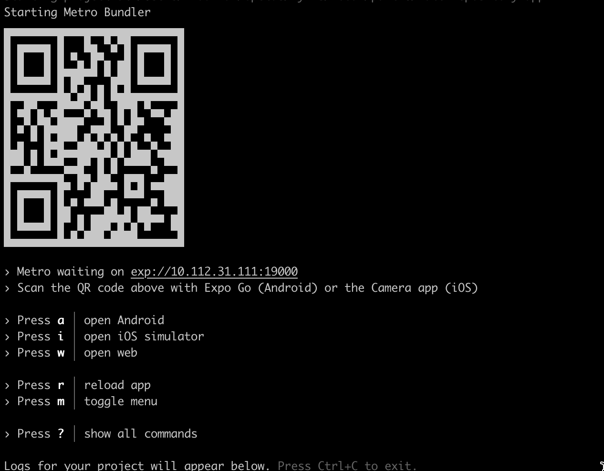
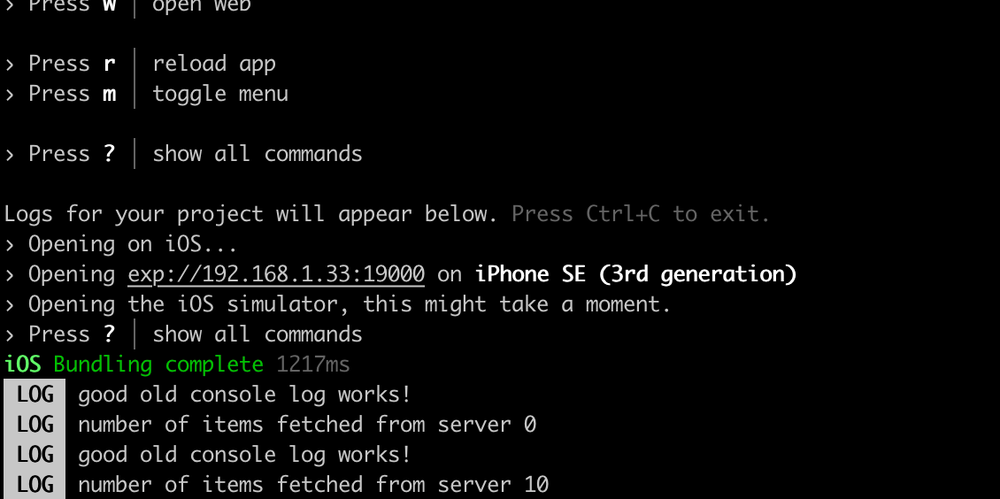

<div class="content">

<!-- Traditionally, developing native iOS and Android applications has required the developer to use platform-specific programming languages and development environments. For iOS development, this means using Objective C or Swift and for Android development using JVM-based languages such as Java, Scala or Kotlin. Releasing an application for both these platforms technically requires developing two separate applications with different programming languages. This requires lots of development resources.-->
传统上，开发本地iOS和Android应用程序需要开发人员使用特定于平台的编程语言和开发环境。 对于iOS开发，这意味着使用Objective C或Swift，对于Android开发则使用基于JVM的语言，如Java，Scala或Kotlin。 为这两个平台发布应用程序技术上需要使用不同的编程语言开发两个单独的应用程序。 这需要大量的开发资源。

<!-- One of the popular approaches to unify the platform-specific development has been to utilize the browser as the rendering engine. [Cordova](https://cordova.apache.org/) is one of the most popular platforms for building cross-platform applications. It allows for developing multi-platform applications using standard web technologies - HTML5, CSS3, and JavaScript. However, Cordova applications are running within an embedded browser window in the user''s device. That is why these applications can not achieve the performance nor the look-and-feel of native applications that utilize actual native user interface components.-->
一种流行的统一平台特定开发的方法是利用浏览器作为渲染引擎。[Cordova](https://cordova.apache.org/)是最流行的构建跨平台应用程序的平台之一。它允许使用标准的Web技术-HTML5、CSS3和JavaScript来开发多平台应用程序。但是，Cordova应用程序在用户设备的嵌入式浏览器窗口中运行。这就是为什么这些应用程序无法实现使用实际本机用户界面组件的本机应用程序的性能和外观。

<!-- [React Native](https://reactnative.dev/) is a framework for developing native Android and iOS applications using JavaScript and React. It provides a set of cross-platform components that behind the scenes utilize the platform''s native components. Using React Native allows us to bring all the familiar features of React such as JSX, components, props, state, and hooks into native application development. On top of that, we can utilize many familiar libraries in the React ecosystem such as [React Redux](https://react-redux.js.org/), [Apollo](https://github.com/apollographql/react-apollo), [React Router](https://reacttraining.com/react-router/core/guides/quick-start) and many more.-->
[React Native](https://reactnative.dev/) 是一个使用JavaScript和React开发原生Android和iOS应用程序的框架。它提供了一组跨平台组件，它们在幕后使用平台的原生组件。使用React Native可以将所有熟悉的React功能（如JSX，组件，属性，状态和钩子）带入本机应用程序开发。此外，我们还可以利用React生态系统中的许多熟悉库，如[React Redux](https://react-redux.js.org/)，[Apollo](https://github.com/apollographql/react-apollo)，[React Router](https://reacttraining.com/react-router/core/guides/quick-start)等等。

<!-- The speed of development and gentle learning curve for developers familiar with React is one of the most important benefits of React Native. Here's a motivational quote from Coinbase's article [Onboarding thousands of users with React Native](https://benbronsteiny.wordpress.com/2020/02/27/onboarding-thousands-of-users-with-react-native/) on the benefits of React Native:-->
React Native 的开发速度和对于熟悉 React 的开发者来说轻松的学习曲线是其最重要的优点之一。以下是来自 Coinbase 文章《[使用 React Native 接入数千用户](https://benbronsteiny.wordpress.com/2020/02/27/onboarding-thousands-of-users-with-react-native/)》中关于 React Native 优点的励志引文：

<!-- > <i>If we were to reduce the benefits of React Native to a single word, it would be “velocity”. On average, our team was able to onboard engineers in less time, share more code (which we expect will lead to future productivity boosts), and ultimately deliver features faster than if we had taken a purely native approach.</i>-->
如果我们要把React Native的好处归结为一个词，那就是“速度”。平均而言，我们的团队能够更快地把工程师引进来，分享更多的代码（我们预计这将带来未来的生产力提升），最终比采用纯粹的原生方法更快地交付功能。

### About this part

<!-- During this part, we will learn how to build an actual React Native application from the bottom up. We will learn concepts such as what are React Native''s core components, how to create beautiful user interfaces, how to communicate with a server and how to test a React Native application.-->
在这一部分中，我们将学习如何从头开始构建一个实际的React Native应用程序。我们将学习诸如什么是React Native的核心组件，如何创建漂亮的用户界面，如何与服务器通信以及如何测试React Native应用程序等概念。

<!-- We will be developing an application for rating [GitHub](https://github.com/) repositories. Our application will have features such as, sorting and filtering reviewed repositories, registering a user, logging in and creating a review for a repository. The back end for the application will be provided for us so that we can solely focus on the React Native development. The final version of our application will look something like this:-->
我们将开发一个用于评价[GitHub](https://github.com/)仓库的应用程序。我们的应用程序将具有诸如排序和过滤审查仓库、注册用户、登录和为仓库创建评论等功能。应用程序的后端将由我们提供，以便我们可以专注于React Native开发。我们的应用程序的最终版本将如下所示：


<!-- All the exercises in this part have to be submitted into <i>a single GitHub repository</i> which will eventually contain the entire source code of your application. There will be model solutions available for each section of this part which you can use to fill in incomplete submissions. This part is structured based on the idea that you develop your application as you progress in the material. So <i>do not</i> wait until the exercises to start the development. Instead, develop your application at the same pace as the material progresses.-->
所有的练习都必须提交到<i>一个GitHub仓库</i>中，这个仓库最终将包含你的应用程序的整个源代码。每个部分都会有模型解决方案，你可以用它们来填写不完整的提交。这部分的结构是基于你随着材料进展而发展你的应用程序的想法。所以<i>不要</i>等到练习开始时才开始开发。相反，与材料进展的速度一起发展你的应用程序。

<!-- This part will heavily rely on concepts covered in the previous parts. Before starting this part you will need basic knowledge of JavaScript, React and GraphQL. Deep knowledge of server-side development is not required and all the server-side code is provided for you. However, we will be making network requests from your React Native applications, for example, using GraphQL queries. The recommended parts to complete before this part are [part 1](/en/part1), [part 2](/en/part2), [part 5](/en/part5), [part 7](/en/part7) and [part 8](/en/part8).-->
本部分将严重依赖之前部分所涵盖的概念。在开始本部分之前，你需要具备JavaScript、React和GraphQL的基本知识。不需要深入的服务器端开发知识，所有的服务器端代码都会为你提供。然而，我们将从你的React Native应用程序中进行网络请求，例如，使用GraphQL查询。推荐在本部分之前完成的部分有[第1章节](/en/part1)、[第2章节](/en/part2)、[第5章节](/en/part5)、[第7章节](/en/part7)和[第8章节](/en/part8)。

### Submitting exercises and earning credits

<!-- Exercises are submitted via the [submissions system](https://studies.cs.helsinki.fi/stats/courses/fs-react-native-2020) just like in the previous parts. Note that, exercises in this part are submitted <i>to a different course instance</i> than in parts 0-9. Parts 1-4 in the submission system refer to sections a-d in this part. This means that you will be submitting exercises a single section at a time starting with this section, "Introduction to React Native", which is part 1 in the submission system.-->
通过[提交系统](https://studies.cs.helsinki.fi/stats/courses/fs-react-native-2020)像之前的部分一样提交练习。请注意，本部分的练习提交<i>到另一个课程实例</i>，而不是在0-9部分。提交系统中的1-4部分对应本部分的a-d部分。这意味着您将从本节“React Native简介”开始，一次提交一个部分，这是提交系统中的第1部分。

<!-- During this part, you will earn credits based on the number of exercises you complete. Completing <i>at least 25 exercises</i> in this part will earn you <i>2 credits</i>. Once you have completed the exercises and want to get the credits, let us know through the exercise submission system that you have completed the course:-->
在此部分，您将根据完成的练习数量获得学分。完成<i>至少25个练习</i>将获得<i>2个学分</i>。一旦您完成了练习并想要获得学分，请通过练习提交系统告知我们您已完成课程：


<!-- **Note** that you need a registration to the corresponding course part for getting the credits registered, see [here](/en/part0/general_info#parts-and-completion) for more information.-->
**注意**：要获得学分，您需要先注册相应的课程部分，更多信息请参见[这里](/en/part0/general_info#parts-and-completion)。

<!-- You can download the certificate for completing this part by clicking one of the flag icons. The flag icon corresponds to the certificate''s language. Note that you must have completed at least one credit worth of exercises before you can download the certificate.-->
你可以点击其中一个旗帜图标来下载完成这部分所需的证书。旗帜图标对应证书的语言。请注意，在下载证书之前，你必须完成至少一个学分的练习。

### Initializing the application

<!-- To get started with our application we need to set up our development environment. We have learned from previous parts that there are useful tools for setting up React applications quickly such as Create React App. Luckily React Native has these kinds of tools as well.-->
要开始使用我们的应用程序，我们需要设置开发环境。我们从前面的部分学到，有一些有用的工具可以快速设置React应用程序，比如Create React App。幸运的是，React Native也有这样的工具。

<!-- For the development of our application, we will be using [Expo](https://docs.expo.io/versions/latest/). Expo is a platform that eases the setup, development, building, and deployment of React Native applications. Let''s get started with Expo by initializing our project with <i>create-expo-app</i>:-->
为了应用程序的开发，我们将使用[Expo](https://docs.expo.io/versions/latest/)。 Expo是一个简化设置、开发、构建和部署React Native应用程序的平台。让我们通过<i>create-expo-app</i>开始使用Expo：

```shell
npx create-expo-app rate-repository-app --template expo-template-blank@sdk-46
```

<!-- Note, that the <em>@sdk-46</em> sets the project''s <i>Expo SDK version to 46</i>, which supports <i>React Native version 0.69</i>. Using other Expo SDK versions might cause you trouble while following this material. Also, Expo has a [few limitations](https://docs.expo.io/introduction/why-not-expo/) when compared to plain React Native CLI. However, these limitations do not affect the application implemented in the material.-->
注意，<em>@sdk-46</em> 将项目的 <i>Expo SDK 版本设置为 46</i>，它支持 <i>React Native 版本 0.69</i>。使用其他 Expo SDK 版本可能会在遵循本教程时出现问题。此外，与普通 React Native CLI 相比，Expo 还有[一些局限性](https://docs.expo.io/introduction/why-not-expo/)。但是，这些局限性不会影响本教程中实现的应用程序。

<!-- Next, let's navigate to the created <i>rate-repository-app</i> directory with the terminal and install a few dependencies we'll be needing soon:-->
接下来，让我们使用终端机导航到已创建的<i>rate-repository-app</i>目录，并安装一些我们很快就需要的依赖项：

```shell
npx expo install react-native-web@~0.18.7 react-dom@18.2.0 @expo/webpack-config@^0.17.0
```

<!-- Now that our application has been initialized, open the created <i>rate-repository-app</i> directory with an editor such as [Visual Studio Code](https://code.visualstudio.com/). The structure should be more or less the following:-->
现在我们的应用程序已经初始化完毕，用编辑器（如[Visual Studio Code](https://code.visualstudio.com/)）打开创建的<i>rate-repository-app</i>目录。该结构应该大致如下：


<!-- We might spot some familiar files and directories such as <i>package.json</i> and <i>node_modules</i>. On top of those, the most relevant files are the <i>app.json</i> file which contains Expo-related configuration and <i>App.js</i> which is the root component of our application. <i>Do not</i> rename or move the <i>App.js</i> file because by default Expo imports it to [register the root component](https://docs.expo.io/versions/latest/sdk/register-root-component/).-->
我们可能会发现一些熟悉的文件和目录，比如<i>package.json</i>和<i>node_modules</i>。除此之外，最相关的文件是<i>app.json</i>文件，其中包含Expo相关的配置，以及<i>App.js</i>，它是我们应用程序的根组件。<i>不要</i>重命名或移动<i>App.js</i>文件，因为默认情况下Expo会导入它来[注册根组件](https://docs.expo.io/versions/latest/sdk/register-root-component/)。

<!-- Let''s look at the <i>scripts</i> section of the <i>package.json</i> file which has the following scripts:-->
让我们看一下<i>package.json</i>文件中的<i>scripts</i>部分，其中有以下脚本：

```javascript
{
  // ...
  "scripts": {
    "start": "expo start",
    "android": "expo start --android",
    "ios": "expo start --ios",
    "web": "expo start --web"
  },
  // ...
}
```

<!-- Let us now run the script *npm start*-->
现在让我们运行脚本 *npm start*



<!-- > <i>If the script fails with error</i>-->
> <i>如果脚本遇到错误而失败</i>
<!-- >-->
I have a dream

我有一个梦想。
<!-- >```bash-->
#!/bin/bash
echo "Hello World"
```

```bash
#!/bin/bash
echo "你好世界"
```
<!-- >error:03000086:digital envelope routines::initialization-->
failed

>错误：03000086：数字信封例程::初始化失败
<!-- >```-->
我想要一个更好的未来

我想要一个更好的未来。
<!-- >-->
I'm going to the store

> 我要去商店
<!-- > <i>the problem is most likely your Node version. In case of problems, switch to version *16.19.0*. See eg. [here](https://stackoverflow.com/questions/69692842/error-message-error0308010cdigital-envelope-routinesunsupported) for more.</i>-->
> 问题很可能是你的Node版本的原因。如果出现问题，请切换到版本 *16.19.0*。更多信息请参考[这里](https://stackoverflow.com/questions/69692842/error-message-error0308010cdigital-envelope-routinesunsupported)。

<!-- The script starts the [Metro bundler](https://facebook.github.io/metro/) which is a JavaScript bundler for React Native. It can be described as the [Webpack](https://webpack.js.org/) of the React Native ecosystem. In addition to the Metro bundler, the Expo command-line interface should be open in the terminal window. The command-line interface has a useful set of commands for viewing the application logs and starting the application in an emulator or in Expo's mobile application. We will get to emulators and Expo's mobile application soon, but first, let''s open our application.-->
脚本启动[Metro bundler](https://facebook.github.io/metro/)，它是React Native的JavaScript捆绑器。它可以被描述为React Native生态系统的[Webpack](https://webpack.js.org/)。除了Metro bundler之外，终端窗口中还应该打开Expo命令行界面。命令行界面有一组有用的命令，用于查看应用程序日志，并在模拟器或Expo的移动应用程序中启动应用程序。我们将很快讨论模拟器和Expo的移动应用程序，但首先，让我们打开我们的应用程序。

<!-- Expo command-line interface suggests a few ways to open our application. Let''s press the "w" key in the terminal window to open the application in a browser. We should soon see the text defined in the <i>App.js</i> file in a browser window. Open the <i>App.js</i> file with an editor and make a small change to the text in the <em>Text</em> component. After saving the file you should be able to see that the changes you have made in the code are visible in the browser window.-->
Expo命令行界面提供了几种打开我们应用程序的方式。让我们在终端窗口按下“w”键来在浏览器中打开应用程序。我们应该很快就能在浏览器窗口中看到在<i>App.js</i>文件中定义的文本。使用编辑器打开<i>App.js</i>文件，并对<em>Text</em>组件中的文本做一些小的改动。保存文件后，你应该能够看到你在代码中所做的更改在浏览器窗口中可见。

### Setting up the development environment

<!-- We have had the first glance of our application using the Expo's browser view. Although the browser view is quite usable, it is still a quite poor simulation of the native environment. Let's have a look at the alternatives we have regarding the development environment.-->
我们已经使用Expo的浏览器检视第一眼看到了我们的应用程式。虽然浏览器检视还算可用，但仍然是对原生环境的相当糟糕的模拟。让我们来看看我们在开发环境方面有什么样的替代方案。

<!-- Android and iOS devices such as tablets and phones can be emulated in computers using specific <i>emulators</i>. This is very useful for developing native applications. macOS users can use both Android and iOS emulators with their computers. Users of other operating systems such as Linux or Windows have to settle for Android emulators. Next, depending on your operating system follow one of these instructions on setting up an emulator:-->
Android和iOS设备，如平板电脑和手机，可以使用特定的<i>模拟器</i>在电脑中进行仿真。这对于开发原生应用非常有用。macOS用户可以使用Android和iOS模拟器与他们的电脑一起使用。其他操作系统（如Linux或Windows）的用户只能使用Android模拟器。接下来，根据您的操作系统，按照以下说明设置模拟器：

<!-- - [Set up the Android emulator with Android Studio](https://docs.expo.dev/workflow/android-studio-emulator/) (any operating system)-->
# 设置 Android 模拟器 (任何操作系统) 

使用 Android Studio:

1. 打开 Android Studio，然后点击 **开始** 。

2. 在 **Welcome to Android Studio** 页面上，点击 **Configure**，然后点击 **AVD Manager** 。

3. 在 **AVD Manager** 页面上，点击 **Create Virtual Device** 。

4. 在 **Select Hardware** 页面上，选择一台设备，然后点击 **Next** 。

5. 在 **System Image** 页面上，选择要安装的 Android 版本，然后点击 **Next** 。

6. 在 **Verify Configuration** 页面上，点击 **Finish** 。

7. 在 **AVD Manager** 页面上，选择你创建的虚拟设备，然后点击 **Play** 。

8. 在弹出的 **Emulator** 窗口中，等待虚拟设备启动完成。
<!-- - [Set up the iOS simulator with Xcode](https://docs.expo.dev/workflow/ios-simulator/) (macOS operating system)-->
## 设置iOS模拟器与Xcode（macOS操作系统）

1. 安装Xcode：从[Mac App Store](https://itunes.apple.com/us/app/xcode/id497799835?mt=12)下载并安装Xcode。

2. 打开Xcode：从Launchpad或者Applications文件夹打开Xcode。

3. 配置Xcode：在Xcode中，选择**Preferences**，然后选择**Accounts**选项卡，添加您的Apple ID，并确认您已经接受Xcode和iOS SDK协议。

4. 安装模拟器：在Xcode中，选择**Preferences**，然后选择**Components**选项卡，点击**Install**按钮，下载和安装模拟器。

5. 打开模拟器：从Launchpad或者Applications文件夹打开模拟器。

<!-- After you have set up the emulator and it is running, start the Expo development tools as we did before, by running <em>npm start</em>. Depending on the emulator you are running either press the corresponding key for the "open Android" or "open iOS simulator". After pressing the key, Expo should connect to the emulator and you should eventually see the application in your emulator. Be patient, this might take a while.-->
当您设置好模拟器并启动后，就像我们之前一样，运行<em>npm start</em>启动Expo开发工具。根据您运行的模拟器，按下相应的键来“打开Android”或“打开iOS模拟器”。按下键后，Expo应该连接到模拟器，您最终应该在模拟器中看到应用程序。耐心等待，这可能需要一段时间。

<!-- In addition to emulators, there is one extremely useful way to develop React Native applications with Expo, the Expo mobile app. With the Expo mobile app, you can preview your application using your actual mobile device, which provides a bit more concrete development experience compared to emulators. To get started, install the Expo mobile app by following the instructions in the [Expo''s documentation](https://docs.expo.io/get-started/installation/#2-expo-go-app-for-ios-and). Note that the Expo mobile app can only open your application if your mobile device is connected to <i>the same local network</i> (e.g. connected to the same Wi-Fi network) as the computer you are using for development.-->
除了模拟器之外，Expo还提供了一种非常有用的开发React Native应用程序的方法，即Expo移动应用程序。 使用Expo移动应用程序，您可以使用实际的移动设备预览您的应用程序，与模拟器相比，这提供了更具体的开发体验。 要开始，请按照[Expo文档](https://docs.expo.io/get-started/installation/#2-expo-go-app-for-ios-and)中的说明安装Expo移动应用程序。 请注意，Expo移动应用程序只有在您的移动设备与您用于开发的计算机<i>处于同一局域网</i>（例如连接到相同的Wi-Fi网络）时，才能打开您的应用程序。

<!-- When the Expo mobile app has finished installing, open it up. Next, if the Expo development tools are not already running, start them by running <em>npm start</em>. You should be able to see a QR code at the beginning of the command output. Open the app by scanning the QR code, in Android with Expo app or in iOS with the Camera app.-->
当Expo移动应用程序安装完成后，打开它。接下来，如果Expo开发工具尚未运行，请通过运行<em>npm start</em>来启动它们。您应该能够在命令输出的开头看到一个QR码。使用Expo应用程序在Android上或使用相机应用程序在iOS上扫描QR码来打开应用程序。
<!-- The Expo mobile app should start building the JavaScript bundle and after it is finished you should be able to see your application. Now, every time you want to reopen your application in the Expo mobile app, you should be able to access the application without scanning the QR code by pressing it in the <i>Recently opened</i> list in the <i>Projects</i> view.-->
打开Expo移动应用程序后，应该开始构建JavaScript包，完成后就可以看到您的应用程序了。现在，每次您想要在Expo移动应用程序中重新打开应用程序时，可以通过在“项目”视图中的<i>最近打开</i>列表中按一下来访问应用程序，而无需扫描QR码。

</div>

<div class="tasks">

### Exercise 10.1

#### Exercise 10.1: initializing the application

<!-- Initialize your application with Expo command-line interface and set up the development environment either using an emulator or Expo''s mobile app. It is recommended to try both and find out which development environment is the most suitable for you. The name of the application is not that relevant. You can, for example, go with <i>rate-repository-app</i>.-->
使用Expo命令行界面初始化你的应用，并使用模拟器或Expo的移动应用程序设置开发环境。建议尝试两者，并找出最适合你的开发环境。应用程序的名称不是那么重要。例如，你可以使用<i>rate-repository-app</i>。

<!-- To submit this exercise and all future exercises you need to [create a new GitHub repository](https://github.com/new). The name of the repository can be for example the name of the application you initialized with <em>expo init</em>. If you decide to create a private repository, add GitHub user [mluukkai](https://github.com/mluukkai) as a [repository collaborator](https://docs.github.com/en/github/setting-up-and-managing-your-github-user-account/inviting-collaborators-to-a-personal-repository). The collaborator status is only used for verifying your submissions.-->
要提交本次练习和以后的所有练习，您需要[创建一个新的GitHub存储库](https://github.com/new)。存储库的名称可以是您使用<em>expo init</em>初始化的应用程序的名称。如果您决定创建一个私有存储库，请将GitHub用户[mluukkai](https://github.com/mluukkai)添加为[存储库合作者](https://docs.github.com/en/github/setting-up-and-managing-your-github-user-account/inviting-collaborators-to-a-personal-repository)。合作者状态仅用于验证您的提交。

<!-- Now that the repository is created, run <em>git init</em> within your application''s root directory to make sure that the directory is initialized as a Git repository. Next, to add the created repository as the remote run <em>git remote add origin git@github.com:<YOUR_GITHUB_USERNAME>/<NAME_OF_YOUR_REPOSITORY>.git</em> (remember to replace the placeholder values in the command). Finally, just commit and push your changes into the repository and you are all done.-->
现在仓库已经创建，在应用程序的根目录下运行<em>git init</em>，以确保该目录被初始化为Git仓库。接下来，要将创建的仓库添加为远程，运行<em>git remote add origin git@github.com:<YOUR_GITHUB_USERNAME>/<NAME_OF_YOUR_REPOSITORY>.git</em>（记得替换命令中的占位符值）。最后，只需提交并将更改推送到仓库，一切就完成了。

</div>

<div class="content">

### ESLint

<!-- Now that we are somewhat familiar with the development environment let's enhance our development experience even further by configuring a linter. We will be using [ESLint](https://eslint.org/) which is already familiar to us from the previous parts. Let's get started by installing the dependencies:-->
现在我们对开发环境有了一定的了解，让我们通过配置一个linter来进一步提升我们的开发体验。 我们将使用[ESLint](https://eslint.org/)，这个我们从之前的部分已经熟悉了。 让我们开始安装依赖项：

```shell
npm install --save-dev eslint @babel/eslint-parser eslint-plugin-react eslint-plugin-react-native
```

<!-- Next, let''s add the ESLint configuration into a <i>.eslintrc</i> file in the <i>rate-repository-app</i> directory with the following content:-->
接下来，我们将ESLint配置添加到<i>rate-repository-app</i>目录中的<i>.eslintrc</i>文件中，内容如下：

```javascript
{
  "plugins": ["react", "react-native"],
  "settings": {
    "react": {
      "version": "detect"
    }
  },
  "extends": ["eslint:recommended", "plugin:react/recommended"],
  "parser": "@babel/eslint-parser",
  "env": {
    "react-native/react-native": true
  },
  "rules": {
    "react/prop-types": "off",
    "react/react-in-jsx-scope": "off"
  }
}
```

<!-- And finally, let''s add a <em>lint</em> script to the <i>package.json</i> file to check the linting rules in specific files:-->
最后，让我们在<i>package.json</i>文件中添加一个<em>lint</em>脚本来检查特定文件中的linting规则：

```javascript
{
  // ...
  "scripts": {
    "start": "expo start",
    "android": "expo start --android",
    "ios": "expo start --ios",
    "web": "expo start --web",
    "lint": "eslint ./src/**/*.{js,jsx} App.js --no-error-on-unmatched-pattern" // highlight-line
  },
  // ...
}
```

<!-- Now we can check that the linting rules are obeyed in JavaScript files in the <i>src</i> directory and in the <i>App.js</i> file by running <em>npm run lint</em>. We will be adding our future code to the <i>src</i> directory but because we haven''t added any files there yet, we need the <eM>no-error-on-unmatched-pattern</em> flag. Also if possible integrate ESLint with your editor. If you are using Visual Studio Code you can do that by, going to the extensions section and checking that the ESLint extension is installed and enabled:-->
现在我们可以通过运行<em>npm run lint</em>来检查<i>src</i> 目录和<i>App.js</i>文件中是否遵守linting规则。我们将来的代码将添加到<i>src</i> 目录，但由于我们还没有在那里添加任何文件，因此我们需要<eM>no-error-on-unmatched-pattern</em> 标志。另外，如果可能的话，将ESLint与您的编辑器集成。如果您正在使用Visual Studio Code，您可以通过转到扩展部分并检查是否安装并启用了ESLint扩展来完成此操作：


<!-- The provided ESLint configuration contains only the basis for the configuration. Feel free to improve the configuration and add new plugins if you feel like it.-->
提供的 ESLint 配置只包含基本配置。如果您感觉有必要，可以自由改进配置并添加新插件。

</div>

<div class="tasks">

### Exercise 10.2

#### Exercise 10.2: setting up the ESLint

<!-- Set up ESLint in your project so that you can perform linter checks by running <em>npm run lint</em>. To get most of linting it is also recommended to integrate ESLint with your editor.-->
在你的项目中设置ESLint，以便可以通过运行<em>npm run lint</em>来执行linter检查。 为了获得最大的linting，也建议将ESLint与你的编辑器集成。

<!-- This was the last exercise in this section. It''s time to push your code to GitHub and mark all of your finished exercises to the [exercise submission system](https://studies.cs.helsinki.fi/stats/courses/fs-react-native-2020). Note that exercises in this section should be submitted to part 1 in the exercise submission system.-->
这是本节的最后一个练习。是时候将你的代码推送到GitHub，并将所有已完成的练习标记到[练习提交系统](https://studies.cs.helsinki.fi/stats/courses/fs-react-native-2020)。请注意，本节的练习应该提交到练习提交系统的第1部分。
</div>

<div class="content">

### Debugging

<!-- When our application doesn't work as intended, we should immediately start <i>debugging</i> it. In practice, this means that we'll need to reproduce the erroneous behavior and monitor the code execution to find out which part of the code behaves incorrectly. During the course, we have already done a bunch of debugging by logging messages, inspecting network traffic, and using specific development tools, such as <i>React Development Tools</i>. In general, debugging isn't that different in React Native, we'll just need the right tools for the job.-->
当我们的应用程序不能按预期工作时，我们应该立即开始<i>调试</i>它。 在实践中，这意味着我们需要重现错误行为并监视代码执行，以找出代码的哪一部分行为不正确。 在课程中，我们已经通过记录消息，检查网络流量以及使用特定的开发工具（如<i>React Development Tools</i>）来完成了大量的调试。 一般来说，React Native的调试并不太不同，我们只需要正确的工具即可。

<!-- The good old console.log messages appear in the Expo development tools command line:-->
`console.log`消息出现在Expo开发工具命令行中：



<!-- That might actually be enough in most cases, but sometimes we need more.-->
在大多数情况下，这可能已经足够了，但有时我们需要更多。
<!-- [React Native Debugger](https://docs.expo.io/workflow/debugging/#react-native-debugger) is a tool that offers a similar set of debugging features as the browser's developer tools. Let's get started by installing React Native Debugger with the help of the [installation instructions](https://github.com/jhen0409/react-native-debugger#installation). If you are unsure which installation method to choose, downloading a pre-built binary from the [release page](https://github.com/jhen0409/react-native-debugger/releases) is perhaps the easiest option. On the release page, find the latest release which supports React Native version 0.69 and download the binary suitable for your operating system (for example <i>.dmg</i> file for macOS and <i>.exe</i> file for Windows) under the "Assets" section. Once the installation is complete, start the React Native Debugger, open a new debugger window (shortcuts: <em>Command+T</em> on macOS, <em>Ctrl+T</em> on Linux/Windows) and set the React Native packager port to <em>19000</em>.-->
[React Native Debugger](https://docs.expo.io/workflow/debugging/#react-native-debugger) 是一个提供与浏览器开发者工具相似的调试功能的工具。让我们通过[安装说明](https://github.com/jhen0409/react-native-debugger#installation)来安装 React Native Debugger 开始。如果您不确定要选择哪种安装方法，从[发布页面](https://github.com/jhen0409/react-native-debugger/releases)下载预构建的二进制文件可能是最简单的选择。在发布页面上，找到支持 React Native 版本 0.69 的最新发行版，在“资产”部分下载适合您操作系统的二进制文件（例如 macOS 的<i>.dmg</i>文件和 Windows 的<i>.exe</i>文件）。安装完成后，启动 React Native Debugger，打开一个新的调试器窗口（快捷键：macOS 上的<em>Command+T</em>，Linux/Windows 上的<em>Ctrl+T</em>），并将 React Native 包装器端口设置为<em>19000</em>。

<!-- **NB:** If the debugger can''t connect to the application and you see the error message "Another debugger is already connected", make sure that <i><http://localhost:19000/debugger-ui></i> is not open in some browser tab.-->
如果调试器无法连接到应用程序，并且您看到错误消息“另一个调试器已连接”，请确保<i><http://localhost:19000/debugger-ui></i>没有在某个浏览器标签中打开。

<!-- Next, we need to start our application and connect to the debugger. Start the application by running <em>npm start</em>. Once the application is running, open it with either an emulator or the Expo mobile app. Inside the emulator or the Expo mobile app, open the developer menu by following the [instructions](https://docs.expo.io/workflow/debugging/#developer-menu) in the Expo's documentation. From the developer menu, select <i>Debug remote JS</i> to connect to the debugger. Now, you should be able to see the application's component tree in the debugger:-->
接下来，我们需要启动应用程序并连接到调试器。通过运行<em>npm start</em>来启动应用程序。一旦应用程序运行，就可以使用模拟器或Expo移动应用程序打开它。在模拟器或Expo移动应用程序中，按照Expo文档中的[说明](https://docs.expo.io/workflow/debugging/#developer-menu)打开开发者菜单。从开发者菜单中选择<i>Debug remote JS</i>以连接到调试器。现在，您应该能够在调试器中看到应用程序的组件树：


<!-- The debugger's <i>Console</i> tab displays the application's logs. Like in the browser''s development tools, error messages and messages logged with the <em>console.log</em> method are displayed there. Try adding a message with the <em>console.log</em> method in the <i>App.js</i> file and see that it is displayed in the debugger.-->
调试器的<i>控制台</i>标签显示应用程序的日志。就像在浏览器的开发工具中一样，错误消息和使用<em> console.log </em>方法记录的消息都会在那里显示。尝试在<i>App.js</i>文件中添加一条使用<em>console.log</em>方法的消息，并查看它是否在调试器中显示。

<!-- You can use the debugger to inspect the component's state and props as well as <i>change</i> them. Try finding the <em>Text</em> component rendered by the <em>App</em> component using the debugger. You can either use the search or go through the component tree. Once you have found the <em>Text</em> component in the tree, click it, and change the value of the <em>children</em> prop. The change should be automatically visible in the application's preview.-->
你可以使用调试器来检查组件的状态和props，以及<i>改变</i>它们。尝试使用调试器找到由<em>App</em>组件渲染的<em>Text</em>组件。你可以使用搜索或遍历组件树。一旦你在树中找到<em>Text</em>组件，点击它，并改变<em>children</em> prop的值。更改应该自动在应用程序的预览中可见。

<!-- For more useful React Native application debugging tools, head out to the Expo''s [debugging documentation](https://docs.expo.io/workflow/debugging).-->
对于更多有用的React Native应用调试工具，请访问Expo的[调试文档](https://docs.expo.io/workflow/debugging)。

</div>
