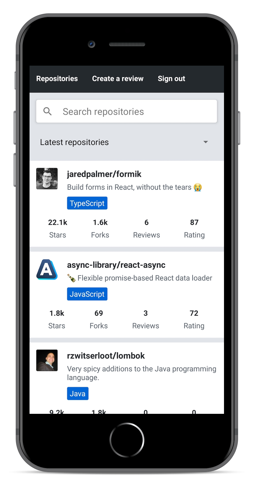
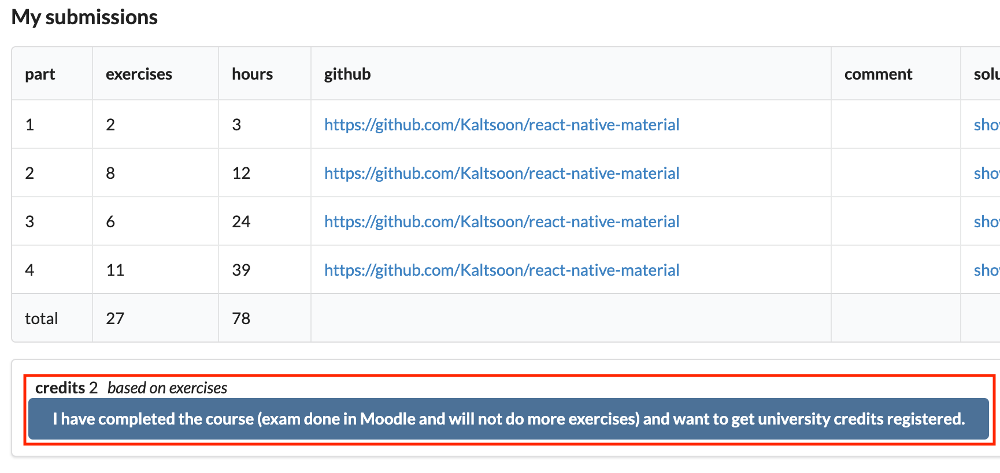
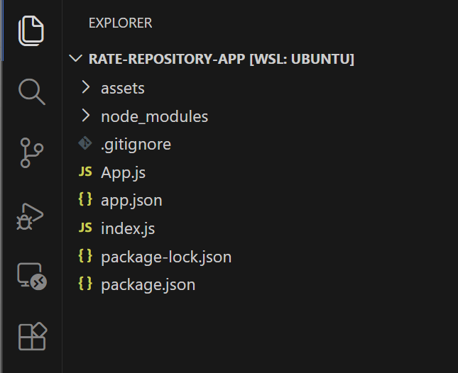
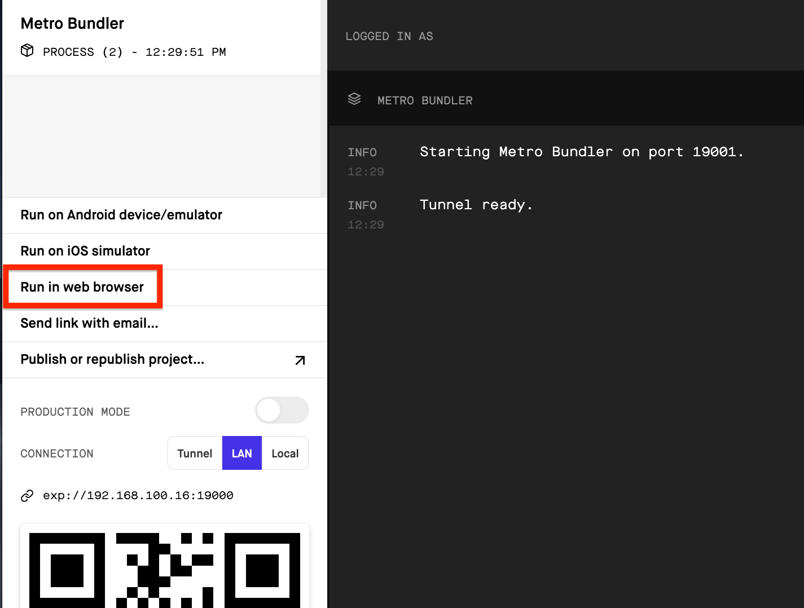
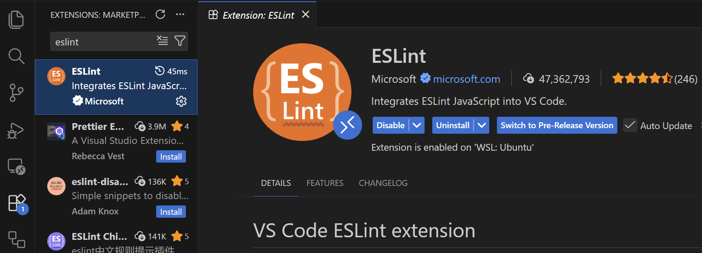
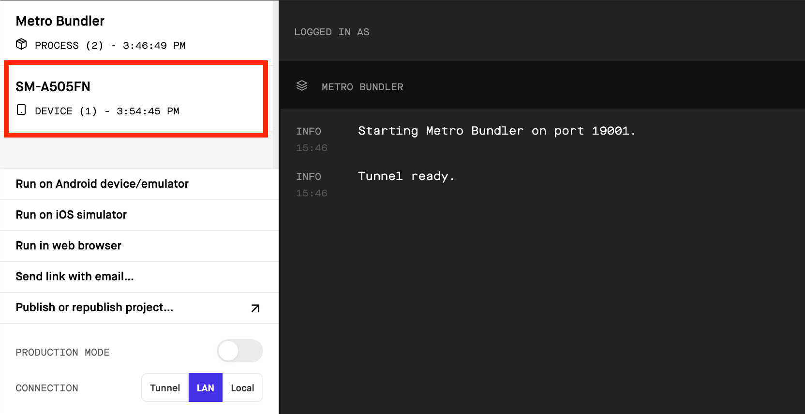
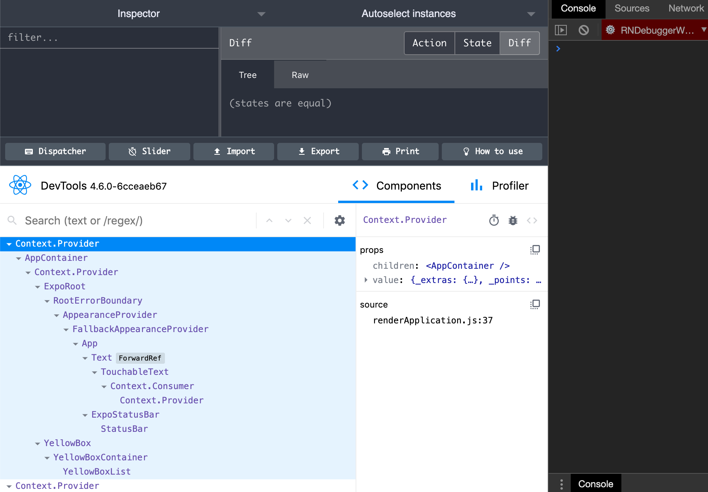

<div class="content">

<!-- Traditionally, developing native iOS and Android applications has required the developer to use platform-specific programming languages and development environments. For iOS development, this means using Objective C or Swift and for Android development using JVM based languages such as Java, Scala or Kotlin. Releasing an application for both these platforms technically requires to develop two separate applications with different programming languages. This requires lots of development resources.-->
 传统上，开发原生的iOS和Android应用需要开发人员使用特定平台的编程语言和开发环境。对于iOS开发，这意味着使用Objective C或Swift，对于Android开发，使用基于JVM的语言，如Java、Scala或Kotlin。为这两个平台发布一个应用，在技术上需要用不同的编程语言开发两个独立的应用。这需要大量的开发资源。

<!-- One of the popular approaches to unify the platform-specific development has been to utilize the browser as the rendering engine. [Cordova](https://cordova.apache.org/) is one of the most popular platforms for building cross-platform applications. It allows developing multi-platform applications using standard web technologies - HTML5, CSS3, and JavaScript. However, Cordova applications are running within a embedded browser window in the user's device. That is why these applications can not achieve the performance nor the look-and-feel of native applications that utilize actual native user interface components.-->
 统一特定平台开发的流行方法之一，是利用浏览器作为渲染引擎。[Cordova](https://cordova.apache.org/)是构建跨平台应用的最流行的平台之一。它允许使用标准的网络技术--HTML5、CSS3和JavaScript来开发多平台应用。然而，Cordova应用是在用户设备的嵌入式浏览器窗口中运行。这就是为什么这些应用不能达到使用实际本地用户界面组件的本地应用的性能或外观和感觉的原因。

<!-- [React Native](https://reactnative.dev/) is a framework for developing native Android and iOS applications using JavaScript and React. It provides a set of cross-platform components that behind the scenes utilize the platform's native components. Using React Native allows us to bring all the familiar features of React such as JSX, components, props, state, and hooks into native application development. On top of that we are able to utilize many familiar libraries in React ecosystem such as [react-redux](https://react-redux.js.org/), [react-apollo](https://github.com/apollographql/react-apollo), [react-router](https://reacttraining.com/react-router/core/guides/quick-start) and many more.-->
 [React Native](https://reactnative.dev/)是一个使用JavaScript和React开发本地Android和iOS应用的框架。它提供了一套跨平台的组件，在幕后利用平台的本地组件。使用React Native使我们能够将React所有熟悉的功能，如JSX、组件、prop、状态和钩子带入本地应用开发。除此之外，我们还能利用React生态系统中许多熟悉的库，如[react-redux](https://react-redux.js.org/)、[react-apollo](https://github.com/apollographql/react-apollo)、[react-router](https://reacttraining.com/react-router/core/guides/quick-start)等等。

<!-- The speed of development and gentle learning curve for developers familiar with React is one of the most important benefits of React Native. Here's a motivational quote from Coinbase's article [Onboarding thousands of users with React Native](https://blog.coinbase.com/onboarding-thousands-of-users-with-react-native-361219066df4) on the benefits of React Native:-->
 对于熟悉React的开发者来说，开发速度和温和的学习曲线是React Native最重要的好处之一。以下是Coinbase的文章[Onboarding thousands of users with React Native](https://blog.coinbase.com/onboarding-thousands-of-users-with-react-native-361219066df4)中关于React Native的好处的激励性引用。

<!-- > If we were to reduce the benefits of React Native to a single word, it would be “velocity”. On average, our team was able to onboard engineers in less time, share more code (which we expect will lead to future productivity boosts), and ultimately deliver features faster than if we had taken a purely native approach.-->
 > 如果我们要把React Native的好处简化为一个词，那就是 "速度"。平均来说，我们的团队能够在更短的时间内加入工程师，分享更多的代码（我们希望这将导致未来生产力的提升），并最终比我们采取纯粹的原生方法更快地交付功能。

### About this part

<!-- During this part, we will learn how to build an actual React Native application from bottom up. We will learn concepts such as what are React Native's core components, how to create beautiful user interfaces, how to communicate with a server and how to test a React Native application.-->
 在这一部分，我们将学习如何自下而上地构建一个实际的React Native应用。我们将学习一些概念，如什么是React Native的核心组件，如何创建漂亮的用户界面，如何与服务器通信以及如何测试React Native应用。

<!-- We will be developing an application for rating [GitHub](https://github.com/) repositories. Our application will have features such as, sorting and filtering reviewed repositories, registering a user, logging in and creating a review for a repository. The back end for the application will be provided for us so that we can solely focus on the React Native development. The final version of our application will look something like this:-->
 我们将开发一个用于评定[GitHub](https://github.com/)存储库的应用。我们的应用将有一些功能，如分类和过滤已审查的存储库，注册用户，登录和创建存储库的评论。应用的后端将被提供给我们，这样我们就可以完全专注于React Native的开发。我们的应用的最终版本将如下所示：



<!-- All the exercises in this part have to be submitted into <i>a single GitHub repository</i> which will eventually contain the entire source code of your application. There will be model solutions available for each section of this part which you can use to fill in incomplete submissions. This part is structured based on the idea that you develop your application as you progress in the material. So <i>do not</i> wait until the exercises to start the development. Instead, develop your application in the same pace as the material progresses.-->
 本章节的所有练习都必须提交到<i>一个GitHub仓库</i>，该仓库最终将包含你的应用的全部源代码。本章节的每一节都会有模型解决方案，你可以用它来填补不完整的提交。这一部分的结构是基于这样的想法，即随着你在材料中的进展，你会开发你的应用。所以<i>不要</i>等到练习时才开始开发。相反，随着教材的进展，以同样的速度开发你的应用。

<!-- This part will heavily rely on concepts covered in the previous parts. Before starting this part you will need basic knowledge of JavaScript, React and GraphQL. Deep knowledge of server-side development is not required and all the server-side code is provided for you. However, we will be making network requests from your React Native applications, for example, using GraphQL queries. The recommended parts to complete before this part are [part 1](/en/part1), [part 2](/en/part2), [part 5](/en/part5), [part 7](/en/part7) and [part 8](/en/part8).-->
 本章节将严重依赖前几部分所涉及的概念。在开始这部分之前，你需要有JavaScript、React和GraphQL的基本知识。不需要深层次的服务器端开发知识，所有的服务器端代码都为你提供。然而，我们将从你的React Native应用中提出网络请求，例如，使用GraphQL查询。在这部分之前推荐完成的部分是[第1章节](/en/part1)、[第2章节](/en/part2)、[第5章节](/en/part5)、[第7章节](/en/part7)和[第8章节](/en/part8) 。

### Submitting exercises and earning credits

<!-- Exercises are submitted via the [submissions system](https://studies.cs.helsinki.fi/stats/courses/fs-react-native-2020) just like in the previous parts. Note that, exercises in this part are submitted <i>to a different course instance</i> than in parts 0-9. The parts 1-4 in the submission system refer to the sections a-d in this part. This means that you will be submitting exercises a single section at a time starting with this section, "Introduction to React Native", which is part 1 in the submission system.-->
 练习是通过[提交系统](https://studies.cs.helsinki.fi/stats/courses/fs-react-native-2020)提交的，就像前面的部分。请注意，这一部分的习题与第0-9部分相比，是提交给不同的课程实例</i>。提交系统中的1-4部分是指本章节的a-d部分。这意味着，你将从这部分 "React Native简介 "开始，每次提交一个部分的练习，这部分是提交系统中的第1章节。

<!-- During this part you will earn credits based on the number of exercises you complete. Completing <i>at least 25 exercises</i> in this part will earn you <i>2 credits</i>. Once you have completed the exercises and want to get the credits, let us know through the exercise submission system that you have completed the course:-->
 在这部分中，你将根据你完成的练习的数量获得学分。在这部分完成<i>至少25个练习</i>将获得<i>2学分</i>。一旦你完成了练习并想获得学分，请通过练习提交系统告诉我们你已经完成了该课程。



<!-- Note that the "exam done in Moodle" note refers to the [Full Stack Open course's exam](https://fullstackopen.com/en/part0/general_info#sign-up-for-the-exam), which <i>has to be completed</i> before you can earn credits from this part.-->
 注意，"在Moodle中完成的考试 "说明是指[全栈开放课程''的考试](https://fullstackopen.com/en/part0/general_info#sign-up-for-the-exam)，在你从这部分获得学分之前，必须完成<i></i>。

<!-- **Note** that you need a registration to the corresponding course part for getting the credits registered, see [here](/en/part0/general_info#parts-and-completion) for more information.-->
 **注意**你需要注册相应的课程部分来获得学分，更多信息请看[这里](/en/part0/general_info#parts-and-completion)。

<!-- You can download the certificate for completing this part by clicking one of the flag icons. The flag icon corresponds to the certificate's language. Note that you must have completed at least one credit worth of exercises before you can download the certificate.-->
 你可以通过点击其中一个旗帜图标下载完成这部分的证书。旗帜图标与证书的语言相对应。注意，你必须至少完成一个学分的练习才能下载证书。

### Initializing the application

<!-- To get started with our application we need to set up our development environment. We have learned from previous parts that there are useful tools for setting up React applications quickly such as Create React App. Luckily React Native has these kinds of tools as well.-->
 为了开始使用我们的应用，我们需要设置我们的开发环境。我们从前面的部分了解到，有一些有用的工具可以快速设置React应用，如Create React App。幸运的是React Native也有这类工具。

<!-- For the development of our application, we will be using [Expo](https://docs.expo.io/versions/latest/). Expo is a platform that eases the setup, development, building, and deployment of React Native applications. Let's get started with Expo by installing the <i>expo-cli</i> command-line interface:-->
对于我们的应用的开发，我们将使用[Expo](https://docs.expo.io/versions/latest/)。Expo是一个平台，可以简化React Native应用的设置、开发、构建和部署。让我们通过安装<i>expo-cli</i>命令行界面来开始使用Expo。

```shell
npm install --global expo-cli
```

<!-- Next, we can initialize our project in a <i>rate-repository-app</i> directory by running the following command:-->
 接下来，我们可以通过运行以下命令在<i>rate-repository-app</i>目录下初始化我们的项目。

```shell
expo init rate-repository-app --template expo-template-blank@sdk-44 --npm
```

<!-- Note, that the <em>@sdk-44</em> sets the project's <i>Expo SDK version to 44</i>, which supports <i>React Native version 0.64</i>. Using other Expo SDK version might cause you trouble while following this material. Also, Expo has few limitations when compared to plain React Native CLI, more on them [here](https://docs.expo.io/introduction/why-not-expo/). However, these limitations have no effect on the application implemented in the material.-->
 注意，<em>@sdk-44</em>设置项目的<i>Expo SDK版本为44</i>，它支持<i>React Native版本0.64</i>。使用其他Expo SDK版本可能会给你带来麻烦，因为你要遵循本材料。另外，与普通的React Native CLI相比，Expo有一些限制，更多关于这些限制[这里](https://docs.expo.io/introduction/why-not-expo/)。然而，这些限制对材料中实现的应用没有影响。

<!-- Now that our application has been initialized, open the created <i>rate-repository-app</i> directory with an editor such as [Visual Studio Code](https://code.visualstudio.com/). The structure should be more or less the following:-->
 现在我们的应用已经被初始化了，用一个编辑器如[Visual Studio Code](https://code.visualstudio.com/)打开创建的<i>rate-repository-app</i>目录。其结构应该大致如下。



<!-- We might spot some familiar files and directories such as <i>package.json</i> and <i>node_modules</i>. On top of those, the most relevant files are <i>app.json</i> file which contains Expo related configuration and <i>App.js</i> which is the root component of our application. <i>Do not</i> rename or move the <i>App.js</i> file because by default Expo imports it to [register the root component](https://docs.expo.io/versions/latest/sdk/register-root-component/).-->
 我们可能会发现一些熟悉的文件和目录，如<i>package.json</i>和<i>node_modules</i>。在这些文件之上，最相关的文件是<i>app.json</i>文件，它包含了Expo相关的配置和<i>App.js</i>，它是我们应用的根组件。<i>不要</i>重命名或移动<i>App.js</i>文件，因为默认情况下，Expo将其导入到[注册根组件](https://docs.expo.io/versions/latest/sdk/register-root-component/)。

<!-- Let's have look at <i>scripts</i> section of the <i>package.json</i> file which has the following scripts:-->
 让我们看看<i>package.json</i>文件的<i>scripts</i>部分，其中有以下脚本。

```javascript
{
  // ...
  "scripts": {
    "start": "expo start",
    "android": "expo start --android",
    "ios": "expo start --ios",
    "web": "expo start --web",
    "eject": "expo eject"
  },
  // ...
}
```

<!-- Running the script <em>npm start</em> starts the [Metro bundler](https://facebook.github.io/metro/) which is a JavaScript bundler for React Native. It can be described as the [Webpack](https://webpack.js.org/) of the React Native ecosystem. In addition to the Metro bundler, <i>Expo development tools</i> should be open in a browser window at [http://localhost:19002](http://localhost:19002). Expo development tools are a useful set of tools for viewing the application logs and starting the application in an emulator or in Expo's mobile application. We will get to emulators and Expo's mobile application soon, but first, let's start our application in a web browser by clicking the <i>Run in web browser</i> link:-->
 运行脚本<em>npm start</em>可以启动[Metro bundler](https://facebook.github.io/metro/)，这是一个用于React Native的JavaScript捆绑器。它可以被描述为React Native生态系统的[Webpack](https://webpack.js.org/)。除了Metro捆绑器，<i>Expo开发工具</i>应该在浏览器窗口中打开[http://localhost:19002](http://localhost:19002)。Expo开发工具是一套有用的工具，用于查看应用的日志，以及在模拟器或Expo's移动应用中启动应用。我们将很快讨论模拟器和Expo的移动应用，但首先，让我们通过点击<i>在网络浏览器中运行</i>链接在网络浏览器中启动我们的应用。



<!-- After clicking the link we should soon see the text defined in the <i>App.js</i> file in a browser window. Open the <i>App.js</i> file with an editor and make a small change to the text in the <em>Text</em> component. After saving the file you should be able to see that the changes you have made into the code are visible in the browser window.-->
 点击该链接后，我们应该很快在浏览器窗口中看到<i>App.js</i>文件中定义的文本。用编辑器打开<i>App.js</i>文件，对<em>Text</em>组件中的文本做一个小改动。保存文件后，你应该能看到你对代码所做的修改在浏览器窗口中是可见的。

### Setting up the development environment

<!-- We have had the first glance of our application using the Expo's browser view. Although the browser view is quite usable, it is still a quite poor simulation of the native environment. Let's have a look at the alternatives we have regarding the development environment.-->
 我们已经用Expo's的浏览器视图对我们的应用进行了初步的观察。尽管浏览器视图非常可用，但它仍然是对本地环境的一个相当差的模拟。让我们来看看我们在开发环境方面有哪些选择。

<!-- Android and iOS devices such as tablets and phones can be emulated in computers using specific <i>emulators</i>. This is very useful for developing native applications. macOS users can use both Android and iOS emulators with their computers. Users of other operating systems such as Linux or Windows have to settle for Android emulators. Next, depending on your operating system follow one of these instructions on setting up an emulator:-->
 安卓和iOS设备，如平板电脑和手机，可以在电脑中使用特定的<i>模拟器</i>进行模拟。这对开发本地应用非常有用。macOS用户可以在电脑上使用Android和iOS模拟器。其他操作系统的用户，如Linux或Windows，必须解决Android模拟器的问题。接下来，根据你的操作系统，按照这些说明中的一个来设置仿真器。

<!-- - [Set up Android emulator with Android Studio](https://docs.expo.dev/workflow/android-studio-emulator/) (any operating system)-->
 - [用Android Studio设置安卓模拟器](https://docs.expo.dev/workflow/android-studio-emulator/) (任何操作系统)
<!-- - [Set up iOS simulator with Xcode](https://docs.expo.dev/workflow/ios-simulator/) (macOS operating system)-->
 - [用Xcode设置iOS模拟器](https://docs.expo.dev/workflow/ios-simulator/) (macOS操作系统)

<!-- After you have set up the emulator and it is running, start the Expo development tools as we did before, by running <em>npm start</em>. Depending on the emulator you are running either click the <i>Run on Android device/emulator</i> or <i>Run on iOS simulator</i> link. After clicking the link, Expo should connect to the emulator and you should eventually see the application in your emulator. Be patient, this might take a while.-->
 在你设置好模拟器并运行后，像我们之前做的那样，通过运行<em>npm start</em>来启动Expo开发工具。根据你正在运行的模拟器，点击<i>在Android设备/模拟器上运行</i>或<i>在iOS模拟器上运行</i>链接。点击该链接后，Expo应该连接到模拟器，你最终应该在模拟器中看到该应用。请耐心等待，这可能需要一些时间。

<!-- In addition to emulators, there is one extremely useful way to develop React Native applications with Expo, the Expo mobile app. With the Expo mobile app you can preview your application using your actual mobile device, which provides a bit more concrete development experience compared to emulators. To get started, install the Expo mobile app by following the instructions in the [Expo's documentation](https://docs.expo.io/get-started/installation/#2-expo-go-app-for-ios-and). Note that the Expo mobile app can only open your application if your mobile device is connected to <i>the same local network</i> (e.g. connected to the same Wi-Fi network) as the computer you are using for development.-->
 除了模拟器，还有一个非常有用的方法可以用Expo开发React Native应用，即Expo移动应用。通过Expo移动应用，你可以使用你的实际移动设备预览你的应用，与模拟器相比，它提供了更具体的开发体验。要开始使用，请按照[Expo's documentation](https://docs.expo.io/get-started/installation/#2-expo-go-app-for-ios-and)中的说明来安装Expo移动应用。请注意，只有当你的移动设备与你用于开发的计算机连接到<i>同一个本地网络</i>（如连接到同一个Wi-Fi网络）时，Expo移动应用才能打开你的应用。

<!-- When the Expo mobile app has finished installing, open it up. Next, if the Expo development tools is not already running, start it by running <em>npm start</em>. In the bottom left corner of the development tools, you should be able to see a QR code. Within the Expo mobile app, press <i>Scan QR Code</i> and scan the QR code displayed in the development tools. The Expo mobile app should start building the JavaScript bundle and after it is finished you should be able to see your application. Now, every time you want to reopen your application in the Expo mobile app, you should be able to access the application without scanning the QR code by pressing it in the <i>Recently opened</i> list in the <i>Projects</i> view.-->
 当世博移动应用完成安装后，打开它。接下来，如果Expo开发工具还没有运行，通过运行<em>npm start</em>来启动它。在开发工具的左下角，你应该能看到一个QR码。在Expo移动应用中，按<i>扫描QR码</i>并扫描开发工具中显示的QR码。世博移动应用应该开始构建JavaScript包，完成后你应该能够看到你的应用。现在，每次你想在Expo移动应用中重新打开你的应用，你应该能够在<i>Projects</i>视图中的<i>Recently opened</i>列表中访问该应用，而无需扫描QR码。

</div>

<div class="tasks">

### Exercise 10.1

#### Exercise 10.1: initializing the application

<!-- Initialize your application with Expo command-line interface and set up the development environment either using an emulator or Expo's mobile app. It is recommended to try both and find out which development environment is the most suitable for you. The name of the application is not that relevant. You can, for example, go with <i>rate-repository-app</i>.-->
 用Expo命令行界面初始化你的应用，并使用模拟器或Expo's移动应用设置开发环境。建议同时尝试一下，找出最适合你的开发环境。应用的名称并不那么重要。例如，你可以用<i>rate-repository-app</i>。

<!-- To submit this exercise and all the future exercises you need to [create a new GitHub repository](https://github.com/new). The name of the repository can be for example the name of the application you initialized with <em>expo init</em>. If you decide to create a private repository, add GitHub user [mluukkai](https://github.com/mluukkai) as a [repository collaborator](https://docs.github.com/en/github/setting-up-and-managing-your-github-user-account/inviting-collaborators-to-a-personal-repository). The collaborator status is only used for verifying your submissions.-->
 要提交这个练习和所有未来的练习，你需要[创建一个新的 GitHub 仓库](https://github.com/new)。仓库的名字可以是你用<em>expo init</em>初始化的应用的名字。如果你决定创建一个私有仓库，请将 GitHub 用户 [mluukkai](https://github.com/mluukkai) 添加为 [仓库合作者](https://docs.github.com/en/github/setting-up-and-managing-your-github-user-account/inviting-collaborators-to-a-personal-repository) 。合作者的身份只用于验证你的提交。

<!-- Now that the repository is created, run <em>git init</em> within your application's root directory to make sure that the directory is initialized as a Git repository. Next, to add the created repository as the remote run <em>git remote add origin git@github.com:<YOUR_GITHUB_USERNAME>/<NAME_OF_YOUR_REPOSITORY>.git</em> (remember to replace the placeholder values in the command). Finally, just commit and push your changes into the repository and you are all done.-->
 现在仓库已经创建，在你的应用的根目录下运行<em>git init</em>，以确保该目录被初始化为一个 Git 仓库。接下来，为了将创建的仓库添加为远程仓库，运行<em>git remote add origin git@github.com:<YOUR_GITHUB_USERNAME>/<NAME_OF_YOUR_REPOSITORY>.git</em>（记住要替换命令中的占位符值）。最后，提交并将你的修改推送到版本库中，你就完成了。

</div>

<div class="content">

### ESLint

<!-- Now that we are somewhat familiar with the development environment let's enhance our development experience even further by configuring a linter. We will be using [ESLint](https://eslint.org/) which is already familiar to us from the previous parts. Let's get started by installing the dependencies:-->
 现在我们已经对开发环境有了一定的了解，让我们通过配置linter来进一步增强我们的开发经验。我们将使用[ESLint](https://eslint.org/)，它在前面的部分中已经被我们所熟悉。让我们从安装依赖项开始。

```shell
npm install --save-dev eslint @babel/eslint-parser eslint-plugin-react eslint-plugin-react-native
```

<!-- Next, let's add the ESLint configuration into a <i>.eslintrc</i> file into the <i>rate-repository-app</i> directory with the following content:-->
 接下来，让我们把ESLint的配置添加到<i>.eslintrc</i>文件中，放入<i>rate-repository-app</i>目录，内容如下。

```javascript
{
  "plugins": ["react", "react-native"],
  "settings": {
    "react": {
      "version": "detect"
    }
  },
  "extends": ["eslint:recommended", "plugin:react/recommended"],
  "parser": "@babel/eslint-parser",
  "env": {
    "react-native/react-native": true
  },
  "rules": {
    "react/prop-types": "off",
    "react/react-in-jsx-scope": "off"
  }
}
```

<!-- And finally, let's add a <em>lint</em> script to the <i>package.json</i> file to check the linting rules in specific files:-->
 最后，让我们在<i>package.json</i>文件中添加一个<em>lint</em>脚本，以检查特定文件中的linting规则。

```javascript
{
  // ...
  "scripts": {
    "start": "expo start",
    "android": "expo start --android",
    "ios": "expo start --ios",
    "web": "expo start --web",
    "eject": "expo eject",
    "lint": "eslint ./src/**/*.{js,jsx} App.js --no-error-on-unmatched-pattern" // highlight-line
  },
  // ...
}
```

<!-- Now we can check that the linting rules are obeyed in JavaScript files in the <i>src</i> directory and in the <i>App.js</i> file by running <em>npm run lint</em>. We will be adding our future code to the <i>src</i> directory but because we haven't added any files there yet, we need the <eM>no-error-on-unmatched-pattern</em> flag. Also if possible integrate ESLint with your editor. If you are using Visual Studio Code you can do that by, going to the extensions section and checking that the ESLint extension is installed and enabled:-->
 现在我们可以通过运行<em>npm run lint</em>来检查<i>src</i>目录和<i>App.js</i>文件中的JavaScript文件是否遵守了linting规则。我们将把我们未来的代码添加到<i>src</i>目录中，但由于我们还没有在那里添加任何文件，我们需要<eM>no-error-on unmatched-pattern</em>标志。此外，如果可能的话，将ESLint与你的编辑器集成。如果你使用的是Visual Studio Code，你可以这样做，进入扩展部分，检查ESLint扩展是否已经安装并启用。



<!-- The provided ESLint configuration contains only the basis for the configuration. Feel free to improve the configuration and add new plugins if you feel like it.-->
 提供的ESLint配置只包含配置的基础。如果你愿意，可以自由地改进配置和添加新的插件。

</div>

<div class="tasks">

### Exercise 10.2

#### Exercise 10.2: setting up the ESLint

<!-- Set up ESLint in your project so that you can perform linter checks by running <em>npm run lint</em>. To get most of linting it is also recommended to integrate ESLint with your editor.-->
 在你的项目中设置ESLint，这样你就可以通过运行<em>npm run lint</em>来进行linter检查。为了获得大部分的linting，我们还建议将ESLint与你的编辑器集成。

<!-- This was the last exercise in this section. It's time to push your code to GitHub and mark all of your finished exercises to the [exercise submission system](https://studies.cs.helsinki.fi/stats/courses/fs-react-native-2020). Note that exercises in this section should be submitted to the part 1 in the exercise submission system.-->
 这是本节的最后一个练习。现在是时候把你的代码推送到GitHub，并把你所有完成的练习标记到[练习提交系统](https://studies.cs.helsinki.fi/stats/courses/fs-react-native-2020)。注意，本节的练习应该提交给练习提交系统中的第1章节。
</div>

<div class="content">

### Viewing logs

<!-- Expo development tools can be used to display the log messages of the running application. Error and warning level messages are also visible in the emulator and the mobile app interface. Error messages will pop out as a red overlay whereas warning messages can be expanded by pressing the yellow alert dialog at the bottom of the screen. For debugging purposes, we can use the familiar <em>console.log</em> method to write debugging messages to the log.-->
世博开发工具可以用来显示运行中的应用的日志信息。错误和警告级别的信息也可以在模拟器和移动应用界面中看到。错误信息会以红色叠加的形式跳出，而警告信息可以通过按屏幕底部的黄色警报对话框展开。为了调试的目的，我们可以使用熟悉的<em>console.log</em>方法，将调试信息写入日志。

<!-- Let's try this in practice. Start the Expo development tools by running <em>npm start</em> and open the application with either emulator or the mobile app. When the application is running you should be able to see your connected devices under the "Metro Bundler" in the top left corner of the developments tools:-->
 让我们在实践中试试。通过运行<em>npm start</em>启动Expo开发工具，用模拟器或移动应用打开应用。当应用运行时，你应该能够在开发工具左上角的 "Metro Bundler "下看到你的连接设备。



<!-- Click on the device to open its logs. Next, open the <i>App.js</i> file and add a <em>console.log</em> message to the <em>App</em> component. After saving the file, you should be able to see your message in the logs.-->
 点击设备，打开其日志。接下来，打开<i>App.js</i>文件，在<em>App</em>组件中添加<em>console.log</em>消息。保存文件后，你应该能在日志中看到你的消息。

### Using the debugger

<!-- **NB:** You might face the following error while trying to use React Native Debugger: <i>Uncaught Error: Cannot add node "1" because a node with that id is already in the Store</i>. There's an [issue](https://github.com/jhen0409/react-native-debugger/issues/668) related to this problem in the React Native Debugger's repository which might contain ways to fix it. Nevertheless, don't get stuck trying to fix this problem if it turns out to be difficult. Instead, move on with the material.-->
 **NB:**你在尝试使用React Native Debugger时可能会面临以下错误。<i>未捕获的错误。不能添加节点 "1"，因为该ID的节点已经在商店里了</i>。在React Native Debugger's repository中，有一个与这个问题相关的[issue](https://github.com/jhen0409/react-native-debugger/issues/668)，其中可能包含了修复它的方法。尽管如此，如果这个问题很难解决，也不要拘泥于此。相反，继续学习材料。

<!-- Inspecting messages logged from the code with the <em>console.log</em> method can be handy, but sometimes finding bugs or understanding how the application works require us to see the bigger picture. We might, for example, be interested in what is the state and the props of a certain component, or what is the response of a certain network request. In the previous parts, we have used the browser's developer tools for this kind of debugging. [React Native Debugger](https://docs.expo.io/workflow/debugging/#react-native-debugger) is a tool that offers a similar set of debugging features for React Native applications.-->
 用<em>console.log</em>方法检查从代码中记录的信息可能很方便，但有时发现bug或理解应用如何工作需要我们看到更大的画面。例如，我们可能对某个组件的状态和prop感兴趣，或者对某个网络请求的响应感兴趣。在前面的部分中，我们使用了浏览器的开发工具来进行这种调试。[React Native Debugger](https://docs.expo.io/workflow/debugging/#react-native-debugger)是一个为React Native应用提供类似调试功能的工具。

<!-- Let's get started by installing React Native Debugger with the help of the [installation instructions](https://github.com/jhen0409/react-native-debugger#installation). If you are unsure which installation method to choose, downloading a pre-built binary from the [release page](https://github.com/jhen0409/react-native-debugger/releases) is perhaps the easiest option. In the release page, find the latest release which supports React Native version 0.64 and download the binary suitable for your operating system (for example <i>.dmg</i> file for macOS and <i>.exe</i> file for Windows) under the "Assets" section. Once the installation is complete, start the React Native Debugger, open a new debugger window (shortcuts: <em>Command+T</em> on macOS, <em>Ctrl+T</em> on Linux/Windows) and set the React Native packager port to <em>19000</em>.-->
 让我们在[安装说明](https://github.com/jhen0409/react-native-debugger#installation)的帮助下，开始安装React Native Debugger。如果你不确定选择哪种安装方法，从[release page](https://github.com/jhen0409/react-native-debugger/releases)下载一个预构建的二进制文件可能是最简单的选择。在发布页面，找到支持React Native 0.64版本的最新版本，并在 "Assets "部分下载适合你的操作系统的二进制文件（例如MacOS的<i>.dmg</i>文件和Windows的<i>.exe</i>文件）。一旦安装完成，启动React Native调试器，打开一个新的调试器窗口（快捷键：<em>Command+T</em>在macOS，<em>Ctrl+T</em>在Linux/Windows）并设置React Native打包器端口为<em>19000</em>。

<!-- Next, we need to start our application and connect to the debugger. Start the application by running <em>npm start</em>. Once the application is running, open it with either an emulator or the Expo mobile app. Inside the emulator or the Expo mobile app, open the developer menu by following the [instructions](https://docs.expo.io/workflow/debugging/#developer-menu) in the Expo's documentation. From the developer menu, select <i>Debug remote JS</i> to connect to the debugger. Now, you should be able to see the application's component tree in the debugger:-->
 接下来，我们需要启动我们的应用并连接到调试器。通过运行<em>npm start</em>来启动应用。一旦应用运行，用模拟器或Expo移动应用打开它。在模拟器或Expo移动应用中，按照Expo文档中的[说明](https://docs.expo.io/workflow/debugging/#developer-menu)，打开开发者菜单。从开发者菜单中，选择<i>调试远程JS</i>，连接到调试器。现在，你应该能够在调试器中看到应用的组件树。



<!-- You can use the debugger to inspect the component's state and props as well as <i>change</i> them. Try finding the <em>Text</em> component rendered by the <em>App</em> component using the debugger. You can either use the search or go through the component tree. Once you have found the <em>Text</em> component in the tree, click it, and change the value of the <em>children</em> prop. The change should be automatically visible in the application's preview.-->
 你可以使用调试器来检查组件的状态和prop，以及<i>改变</i>它们。尝试用调试器找到由<em>App</em>组件渲染的<em>Text</em>组件。你可以使用搜索或通过组件树。一旦你在树中找到<em>Text</em>组件，点击它，并改变<em>children</em>prop的值。这个改变应该在应用的预览中自动可见。

<!-- For more useful React Native application debugging tools, head out to the Expo's [debugging documentation](https://docs.expo.io/workflow/debugging).-->
 关于更多有用的React Native应用调试工具，请前往世博会的[调试文档](https://docs.expo.io/workflow/debugging)。

</div>
