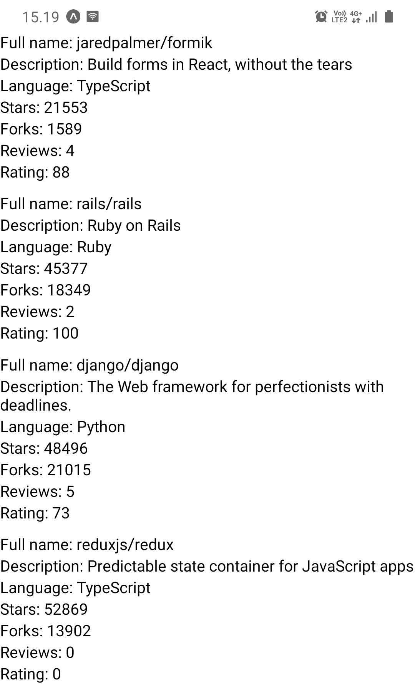
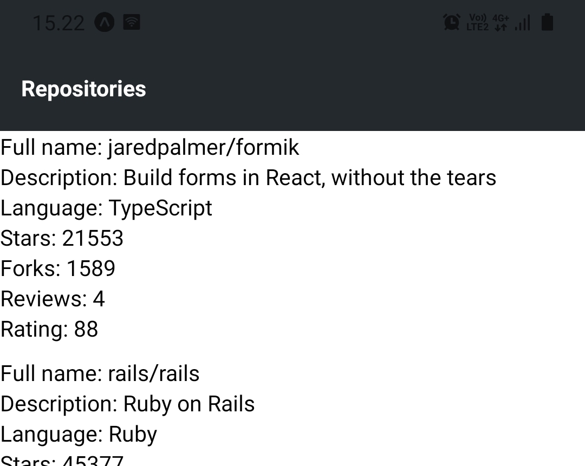
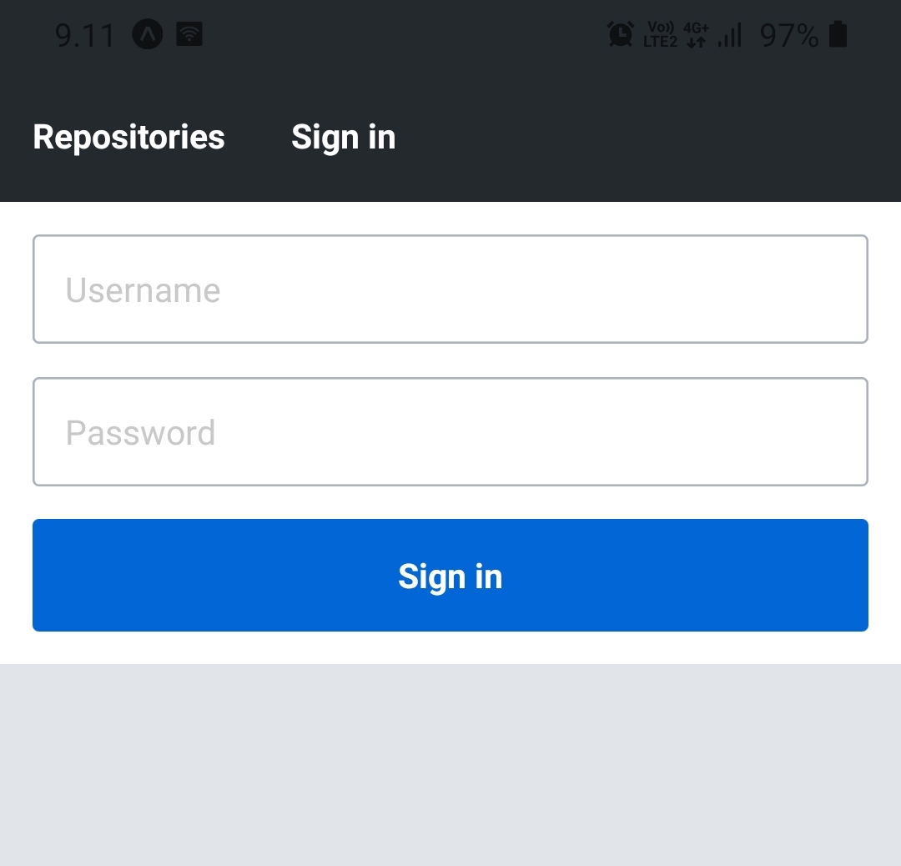
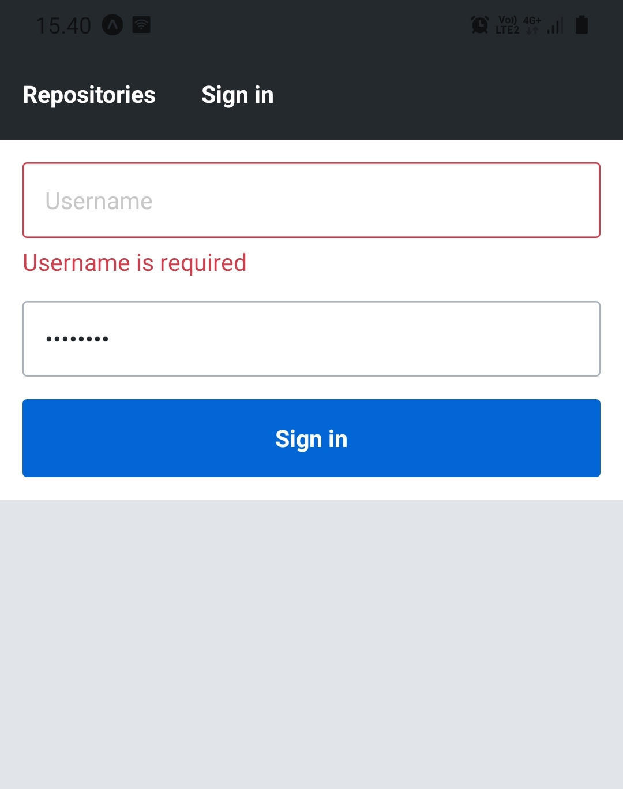

<div class="content">

<!-- Now that we have set up our development environment we can get into to React Native basics and get started with the development of our application. In this section, we will learn how to build user interfaces with React Native's core components, how to add style properties to these core components, how to transition between views, and how to manage form's state efficiently. -->

既然我们已经成功搭建了我们的开发环境，我们可以深入了解一下React Native 的基础知识，并开始开发我们的应用了。在这一节，我们会学习如何利用React Native的核心组件搭建用户界面，如何向这些核心组件添加样式，如何在不同的视图之间切换，以及如何有效地管理表单的状态。

### Core components
核心组件

<!-- In the previous parts, we have learned that we can use React to define components as functions which receive props as an argument and returns a tree of React elements. This tree is usually represented with JSX syntax. In the browser environment, we have used the [ReactDOM](https://reactjs.org/docs/react-dom.html) library to turn these components into a DOM tree that can be rendered by a browser. Here is a concrete example of a very simple component: -->

在之前的章节中，我们已经学到了我们可以使用React 来定义将组件定义为函数，也就是说可以接收作为参数的属性，并返回一个React 元素树。这棵树通常表现为JSX语法。在浏览器环境中，我们使用过 [ReactDOM](https://reactjs.org/docs/react-dom.html) 库来将这些组件转化为DOM树，这样浏览器就可以渲染它了。我们来用一个简单的组件举一个具体的例子：

```javascript
import React from 'react';

const HelloWorld = props => {
  return <div>Hello world!</div>;
};
```

<!-- The <em>HelloWorld</em> component returns a single <i>div</i> element which is created using the JSX syntax. We might remember that this JSX syntax is compiled into <em>React.createElement</em> method calls, such as this: -->

这个<em>HelloWorld</em>组件返回了一个 <i>div</i> 元素，它是由JSX语法创建的。我们应该记得，JSX语法会被编译为 <em>React.createElement</em> 方法来调用，类似：

```javascript
React.createElement('div', null, 'Hello world!');
```

<!-- This line of code creates a <i>div</i> element without any props and with a single child element which is a string <i>"Hello world"</i>. When we render this component into a root DOM element using the <em>ReactDOM.render</em> method the <i>div</i> element will be rendered as the corresponding DOM element. -->

这行代码创建了一个不带任何属性的 <i>div</i>元素，它只有一个子元素，也就是字符串<i>"Hello world"</i>。当我们使用<em>ReactDOM.render</em>方法将这个组件渲染到一个根DOM元素中， <i>div</i>元素会被渲染到相关联的DOM元素中。

<!-- As we can see, React is not bound to a certain environment, such as the browser environment. Instead, there are libraries such as ReactDOM that can render <i>a set of predefined components</i>, such as DOM elements, in a specific environment. In React Native these predefined components are called <i>core components</i>. -->

正如我们看到的，React 并不绑定到某个特定的环境，比如说浏览器环境。而是说，有许多类库，比如ReactDOM可以渲染 <i>一系列预定义的组件</i>，比如DOM元素，将它们渲染到特定的环境中。对React Native 来说，这些预定义的组件就是  <i>core components 核心组件</i>。

<!-- [Core components](https://reactnative.dev/docs/intro-react-native-components) are a set of components provided by React Native which behind the scenes utilize the platform's native components. Let's implement the previous example using React Native: -->

[Core components](https://reactnative.dev/docs/intro-react-native-components)  是一系列由React Native 提供的组件，底层是利用平台的原生组件。让我们利用React Native 将之前的例子实现一遍。

```javascript
import React from 'react';
import { Text } from 'react-native'; // highlight-line

const HelloWorld = props => {
  return <Text>Hello world!</Text>; // highlight-line
};
```

<!-- So we import the [Text](https://reactnative.dev/docs/text) component from React Native and replace the <i>div</i> element with a <i>Text</i> element. Many familiar DOM elements have their React Native "counterparts". Here are some examples picked from the React Native's [Core Components documentation](https://reactnative.dev/docs/components-and-apis): -->
我们从React Native 中引入了 [Text](https://reactnative.dev/docs/text)组件，并用<i>Text</i> 元素替换了 <i>div</i> 元素。许多我们熟悉的DOM元素都有自己的React Native 对应组件。我们从React Native'的 [核心组件文档 Core Components documentation](https://reactnative.dev/docs/components-and-apis) 中摘选了一些例子:

<!-- - [Text](https://reactnative.dev/docs/text) component is <i>the only</i> React Native component that can have textual children. It is similar to for example the <em>&lt;strong&gt;</em> and the <em>&lt;h1&gt;</em> elements.
- [View](https://reactnative.dev/docs/view) component is the basic user interface building block similar to the <em>&lt;div&gt;</em> element.
- [TextInput](https://reactnative.dev/docs/textinput) component is a text field component similar to the <em>&lt;input&gt;</em> element.
- [TouchableWithoutFeedback](https://reactnative.dev/docs/touchablewithoutfeedback) (and other <i>Touchable\*</i> components) component is for capturing different press events. It is similar to for example the <em>&lt;button&gt;</em> element. -->

- [Text](https://reactnative.dev/docs/text) 组件是 <i>唯一</i> 可以有文本子内容的React Native 组件. 类似 <em>&lt;strong&gt;</em> 以及 <em>&lt;h1&gt;</em> 元素.
- [View](https://reactnative.dev/docs/view) 组件是基础的用户界面的搭建元素，类似 <em>&lt;div&gt;</em>  元素。
- [TextInput](https://reactnative.dev/docs/textinput) 组件是类似<em>&lt;input&gt;</em> 元素的文本输入区组件.
- [Pressable](https://reactnative.dev/docs/pressable) 是用来捕捉不同的点击事件。类似于 <em>&lt;button&gt;</em> 组件。


<!-- There are a few notable differences between core components and DOM elements. The first difference is that the <em>Text</em> component is <i>the only</i> React Native component that can have textual children. This means that you can't, for example, replace the <em>Text</em> component with the <em>View</em> component in the previous example. -->

核心组件与DOM元素之间有一些显著的不同。第一个不同点就是 <em>Text</em> 组件是 <i>唯一</i> 能够拥有文本子内容的React Native 组件。也就是说，你不能在之前的例子中比如说用 <em>View</em> 元素替换 <em>Text</em> 元素。

<!-- The second notable difference is related to the event handlers. While working with the DOM elements we are used to adding event handlers such as <em>onClick</em> to basically any element such as <em>&lt;div&gt;</em> and <em>&lt;button&gt;</em>. In React Native we have to carefully read the [API documentation](https://reactnative.dev/docs/components-and-apis) to know what event handlers (as well as other props) a component accepts. For example, the [Pressable](https://reactnative.dev/docs/pressable) component provides props for listening to different kind of press events. We can for example use the component's [onPress](https://reactnative.dev/docs/pressable) prop for listening to press events: -->

第二个显著的区别就是相关的事件处理器。在DOM元素中我们会将类似<em>onClick</em> 这种事件处理器，添加到任一元素上，例如 <em>&lt;div&gt;</em> 或是 <em>&lt;button&gt;</em>。在React Native 中我们需要认真阅读 [API documentation](https://reactnative.dev/docs/components-and-apis) 来了解什么组件接收什么事件处理器（就像属性那样）。例如， [Pressable](https://reactnative.dev/docs/pressable) 组件提供了监听不同点击动作的能力，我们可以使用组件的[onPress](https://reactnative.dev/docs/pressable) 属性来监听点击事件：

```javascript
import React from 'react';
import { Text, Pressable, Alert } from 'react-native';

const PressableText = props => {
  return (
    <Pressable
      onPress={() => Alert.alert('You pressed the text!')}
    >
      <Text>You can press me</Text>
    </Pressable>
  );
};
```

<!-- Now that we have a basic understanding of the core components, let's start to give our project some structure. Create a <i>src</i> directory in the root directory of your project and in the <i>src</i> directory create a <i>components</i> directory. In the <i>components</i> directory create a file <i>Main.jsx</i> with the following content: -->
现在我们对核心组件有了基本的认识，让我们给我们的项目一些结构约束吧。创建一个 <i>src</i> 目录到项目的根目录，在 <i>src</i> 目录中创建 <i>components</i> 目录。 在 <i>components</i> 目录中创建 <i>Main.jsx</i> 文件，添加如下内容：

```javascript
import React from 'react';
import Constants from 'expo-constants';
import { Text, StyleSheet, View } from 'react-native';

const styles = StyleSheet.create({
  container: {
    marginTop: Constants.statusBarHeight,
    flexGrow: 1,
    flexShrink: 1,
  },
});

const Main = () => {
  return (
    <View style={styles.container}>
      <Text>Rate Repository Application</Text>
    </View>
  );
};

export default Main;
```

<!-- Next, let's use the <em>Main</em> component in the <em>App</em> component in the <i>App.js</i> file which is located in our project's root directory. Replace the current content of the file with this: -->
然后，在 <i>App.js</i>  文件中，让我们使用<em>Main</em> 组件，放到  <em>App</em> 组件中，<i>App.js</i>  文件位于我们项目的根目录。将现有的文件内容替换成如下内容：

```javascript
import React from 'react';

import Main from './src/components/Main';

const App = () => {
  return <Main />;
};

export default App;
```

### Manually reloading the application
手动重加载应用

<!-- As we have seen, Expo will automatically reload the application when we make changes to the code. However, there might be times when automatic reload isn't working and the application has to be reloaded manually. This can be achieved through the in-app developer menu. -->
如我们所见，Expo 在我们对代码做出改变后，会自动重加载应用。但有时候可能重加载并不起作用，我们需要手动加载应用。我们可以使用app 内的开发者目录中找到。

<!-- You can access the developer menu by shaking your device or by selecting "Shake Gesture" inside the Hardware menu in the iOS Simulator. You can also use the <em>⌘D</em> keyboard shortcut when your app is running in the iOS Simulator, or <em>⌘M</em> when running in an Android emulator on Mac OS and <em>Ctrl+M</em> on Windows and Linux. -->

你可以通过摇一摇你的设备来访问开发者目录，或者选择IOS模拟器中硬件目录的“摇一摇动作”。你也可以在运行中的iOS模拟器中通过键盘快捷键 <em>⌘D</em>，或者运行中的Android 模拟器中使用 <em>⌘M</em> 快捷键，当然这是Mac 系统， Windows 和Linux 系统使用 <em>Ctrl+M</em> 。

<!-- Once the developer menu is open, simply press "Reload" to reload the application. After the application has been reloaded, automatic reloads should work without the need for a manual reload.-->
当开发者目录打开后，只需要点击"Reload" 来重加载应用即可。在应用重加载后，自动重加载功能应该又开始生效了，而不需要手动重加载了。

</div>

<div class="tasks">

### Exercise 10.3.

#### Exercise 10.3: the reviewed repositories list

<!-- In this exercise, we will implement the first version of the reviewed repositories list. The list should contain the repository's full name, description, language, number of forks, number of stars, rating average and number of reviews. Luckily React Native provides a handy component for displaying a list of data, which is the [FlatList](https://reactnative.dev/docs/flatlist) component. -->
本练习中，我们会实现仓库查看列表的第一个版本。这个列表应当包含仓库的全名、描述、使用语言、fork数量、star数量、平均投票以及查看的次数。幸运的是React Native提供了现成的组件来展示数据列表，那就是 [FlatList](https://reactnative.dev/docs/flatlist) 组件。

<!-- Implement components <em>RepositoryList</em> and <em>RepositoryItem</em> in the <i>components</i> directory's files <i>RepositoryList.jsx</i> and <i>RepositoryItem.jsx</i>. The <em>RepositoryList</em> component should render the <em>FlatList</em> component and <em>RepositoryItem</em> a single item on the list (hint: use the <em>FlatList</em> component's [renderItem](https://reactnative.dev/docs/flatlist#renderitem) prop). Use this as the basis for the <i>RepositoryList.jsx</i> file: -->
在 <i>components</i> 文件夹中实现组件<em>RepositoryList</em> 和 <em>RepositoryItem</em> 并分别创建<i>RepositoryList.jsx</i> 和 <i>RepositoryItem.jsx</i> 文件。<em>RepositoryList</em> 组件应当渲染 <em>FlatList</em> 组件，并为每个列表项渲染一个<em>RepositoryItem</em> 组件。（提示：使用 <em>FlatList</em> 组件的[renderItem](https://reactnative.dev/docs/flatlist#renderitem) 属性）。把这些当作<i>RepositoryList.jsx</i> 文件的初始内容：

```javascript
import React from 'react';
import { FlatList, View, StyleSheet } from 'react-native';

const styles = StyleSheet.create({
  separator: {
    height: 10,
  },
});

const repositories = [
  {
    id: 'jaredpalmer.formik',
    fullName: 'jaredpalmer/formik',
    description: 'Build forms in React, without the tears',
    language: 'TypeScript',
    forksCount: 1589,
    stargazersCount: 21553,
    ratingAverage: 88,
    reviewCount: 4,
    ownerAvatarUrl: 'https://avatars2.githubusercontent.com/u/4060187?v=4',
  },
  {
    id: 'rails.rails',
    fullName: 'rails/rails',
    description: 'Ruby on Rails',
    language: 'Ruby',
    forksCount: 18349,
    stargazersCount: 45377,
    ratingAverage: 100,
    reviewCount: 2,
    ownerAvatarUrl: 'https://avatars1.githubusercontent.com/u/4223?v=4',
  },
  {
    id: 'django.django',
    fullName: 'django/django',
    description: 'The Web framework for perfectionists with deadlines.',
    language: 'Python',
    forksCount: 21015,
    stargazersCount: 48496,
    ratingAverage: 73,
    reviewCount: 5,
    ownerAvatarUrl: 'https://avatars2.githubusercontent.com/u/27804?v=4',
  },
  {
    id: 'reduxjs.redux',
    fullName: 'reduxjs/redux',
    description: 'Predictable state container for JavaScript apps',
    language: 'TypeScript',
    forksCount: 13902,
    stargazersCount: 52869,
    ratingAverage: 0,
    reviewCount: 0,
    ownerAvatarUrl: 'https://avatars3.githubusercontent.com/u/13142323?v=4',
  },
];

const ItemSeparator = () => <View style={styles.separator} />;

const RepositoryList = () => {
  return (
    <FlatList
      data={repositories}
      ItemSeparatorComponent={ItemSeparator}
      // other props
    />
  );
};

export default RepositoryList;
```

<!-- <i>Do not</i> alter the contents of the <em>repositories</em> variable, it should contain everything you need to complete this exercise. Render the <em>RepositoryList</em> component in the <em>Main</em> component which we previously added to the <i>Main.jsx</i> file. The reviewed repository list should roughly look something like this: -->
<i>不要</i> 改变 <em>repositories</em> 变量的内容，这些内容足以让你完成本次练习。将 <em>RepositoryList</em> 组件渲染到我们之前建立的<em>Main</em> 组件中（位于<i>Main.jsx</i> ）。仓库查看列表应当大体上看起来像这样：



</div>

<div class="content">

### Style

<!-- Now that we have a basic understanding of how core components work and we can use them to build a simple user interface it is time to add some style. In [part 2](/en/part2/adding_styles_to_react_app) we learned that in the browser environment we can define React component's style properties using CSS. We had an option to either define these styles inline using the <em>style</em> prop or in a CSS file with a suitable selector. -->

既然我们已经基本了解了核心组件的使用方法以及如何构建一个简单的用户界面，让我开始为它增加一些样式吧，在 [第二章](/zh/part2/给_react应用加点样式)我们学会了在浏览器环境中我们可以利用CSS 定义React组件的style 属性。我们既可以以行内形式使用<em>style</em> 属性，或者在CSS文件中利用合适的选择器。

<!-- There are many similarities in the way style properties are attached to React Native's core components and the way they are attached to DOM elements. In React Native most of the core components accept a prop called <em>style</em>. The <em>style</em> prop accepts an object with style properties and their values. These style properties are in most cases the same as in CSS, however, property names are in <i>camelCase</i>. This means that CSS properties such as <em>padding-top</em> and <em>font-size</em> are written as <em>paddingTop</em> and <em>fontSize</em>. Here is a simple example of how to use the <em>style</em> prop: -->

为React Native 的核心组件添加style 属性以及加到DOM元素上的方式也大体类似。在React Native 中，大部分核心组件都会接受一个叫<em>style</em>的属性。<em>style</em> 接受一个包含style 属性和值的对象。style 属性大多数情况下与在CSS中一致，但是属性名是<i>驼峰式camelCase</i>的。也就是说CSS属性类似<em>padding-top</em> 和<em>font-size</em> 会写成<em>paddingTop</em> 和 <em>fontSize</em>。这有一个使用<em>style</em> 属性的简单样例。

```javascript
import React from 'react';
import { Text, View } from 'react-native';

const BigBlueText = () => {
  return (
    <View style={{ padding: 20 }}>
      <Text style={{ color: 'blue', fontSize: 24, fontWeight: '700' }}>
        Big blue text
      </Text>
    </View>
  );
};
```

<!-- On top of the property names, you might have noticed another difference in the example. In CSS numerical property values commonly have a unit such as <i>px</i>, <i>%</i>, <i>em</i> or <i>rem</i>. In React Native all dimension related property values such as <em>width</em>, <em>height</em>, <em>padding</em>, and <em>margin</em> as well as font sizes are <i>unitless</i>. These unitless numeric values represent <i>density-independent pixels</i>. In case you are wondering what are the available style properties for certain core component, check the [React Native Styling Cheat Sheet](https://github.com/vhpoet/react-native-styling-cheat-sheet). -->

除了属性名称，你应该在例子中还发现了另一个不同点。那就是在CSS中， 数值型属性值一般会使用例如 <i>px</i>, <i>%</i>, <i>em</i> or <i>rem</i> 这种单位。而在React Native中，所有的与维度相关的属性类似<em>width</em>, <em>height</em>, <em>padding</em>, and <em>margin</em> 与文字大小一样都是<i>无单位</i>的。这些没有单位的数值表示的是<i>density-independent pixels</i>（密度独立像素，DIP）。如果你对特定核心组件所能使用的样式属性感兴趣，可以查看[React Native Styling Cheat Sheet](https://github.com/vhpoet/react-native-styling-cheat-sheet)。

<!-- In general, defining styles directly in the <em>style</em> prop is not considered such a great idea, because it makes components bloated and unclear. Instead, we should define styles outside the component's render function using the [StyleSheet.create](https://reactnative.dev/docs/stylesheet#create) method. The <em>StyleSheet.create</em> method accepts a single argument which is an object consisting of named style objects and it creates a StyleSheet style reference from the given object. Here is an example of how to refactor the previous example using the <em>StyleSheet.create</em> method: -->

一般来说，将样式直接定义在<em>style</em> 属性中并不是一个好主意，因为会导致组件膨胀且不易懂。相反，我们可以将样式定义在组件的render 函数之外，利用[StyleSheet.create](https://reactnative.dev/docs/stylesheet#create) 方法即可。 <em>StyleSheet.create</em>  方法接受一个单一的对象参数， 它包含了命名样式对象并针对该对象创建了样式引用。下面的例子中展示了如何利用<em>StyleSheet.create</em> 方法渲染样式，将之前的例子进行的重构。

```javascript
import React from 'react';
import { Text, View, StyleSheet } from 'react-native'; // highlight-line

// highlight-start
const styles = StyleSheet.create({
  container: {
    padding: 20,
  },
  text: {
    color: 'blue',
    fontSize: 24,
    fontWeight: '700',
  },
});
// highlight-end

const BigBlueText = () => {
  return (
    <View style={styles.container}> // highlight-line
      <Text style={styles.text}> // highlight-line
        Big blue text
      <Text>
    </View>
  );
};
```

<!-- We create two named style objects, <em>styles.container</em> and <em>styles.text</em>. Inside the component, we can access specific style object the same way we would access any key in a plain object. -->
我们创建了两个命名样式对象，<em>styles.container</em> 和 <em>styles.text</em>。在组件内部，我们可以访问特定的样式对象，正如我们访问其他普通对象的键那样。

<!-- In addition to an object, the <em>style</em> prop also accepts an array of objects. In the case of an array, the objects are merged from left to right so that latter style properties takes presence. This works recursively, so we can have for example an array containing an array of styles and so forth. If an array contains values that evaluate to false, such as <em>null</em> or <em>undefined</em>, these values are ignored. This makes it easy to define <i>conditional styles</i> for example, based on the value of a prop. Here is an example of conditional styles: -->

除了一个对象， <em>style</em> 属性也接受一个对象数组。在数组的中，对象是从左到右merge的，因此最右面的样式属性会生效。它是递归生效的，所以我们可以有一个包含着数组样式的数组。如果数组中包含的值中有false语义，例如<em>null</em> 或者 <em>undefined</em>，这些值会被忽略。这样很具属性值，定义 <i>条件样式</i>就很简单了。下面是一个条件样式的例子

```javascript
import React from 'react';
import { Text, View, StyleSheet } from 'react-native';

const styles = StyleSheet.create({
  text: {
    color: 'grey',
    fontSize: 14,
  },
  blueText: {
    color: 'blue',
  },
  bigText: {
    fontSize: 24,
    fontWeight: '700',
  },
});

const FancyText = ({ isBlue, isBig, children }) => {
  const textStyles = [
    styles.text,
    isBlue && styles.blueText,
    isBig && styles.bigText,
  ];

  return <Text style={textStyles}>{children}</Text>;
};

const Main = () => {
  return (
    <>
      <FancyText>Simple text</FancyText>
      <FancyText isBlue>Blue text</FancyText>
      <FancyText isBig>Big text</FancyText>
      <FancyText isBig isBlue>
        Big blue text
      </FancyText>
    </>
  );
};
```

<!-- In the example we use the <em>&&</em> operator with statement <em>condition && exprIfTrue</em>. This statement yields <em>exprIfTrue</em> if the <em>condition</em> evaluates to true, otherwise it will yield <em>condition</em>, which in that case is a value that evaluates to false. This is an extremely widely used and handy shorthand. Another option would be to use for example the [conditional operator](https://developer.mozilla.org/en-US/docs/Web/JavaScript/Reference/Operators/Conditional_Operator), <em>condition ? exprIfTrue : exprIfFalse</em>. -->

在这个例子中，我们使用<em>&&</em> 运算符，构成了语句 <em>condition && exprIfTrue</em>。这个语句如果 <em>条件</em> 结果为true，就调用<em>exprIfTrue</em> ，否则会调用<em>condition</em>, 在本例中结果为false。 这是一个使用广泛的简要写法。另一个选项就是使用类似 [conditional operator条件运算符](https://developer.mozilla.org/en-US/docs/Web/JavaScript/Reference/Operators/Conditional_Operator)<em>condition ? exprIfTrue : exprIfFalse</em>.

### Consistent user interface with theming
用户界面主题的一致性

<!-- Let's stick with the concept of styling but with a bit wider perspective. Most of us have used a multitude of different applications and might agree that one trait that makes a good user interface is <i>consistency</i>. This means that the appearance of user interface components such as their font size, font family and color follow a consistent pattern. To achieve this we have somehow <i>parametrize</i> the values of different style properties. This method is commonly known as <i>theming</i>. -->

让我们继续关注样式的话题，但是把视野拓宽一些。我们使用过很多不同的应用，并且可能会达成一个共识，那就是好的用户界面要保持一致性。也就是说用户界面的展示，比如说字体大小、字体家族以及颜色遵循一致的模式。为了达到这种目的我们需要 <i>参数化</i> 不同的样式属性。这种方法就是我们所说的 <i>主题</i>。

<!-- Users of popular user interface libraries such as [Bootstrap](https://getbootstrap.com/docs/4.4/getting-started/theming/) and [Material UI](https://material-ui.com/customization/theming/) might already be quite familiar with theming. Even though the theming implementations differ, the main idea is always to use variables such as <em>colors.primary</em> instead of ["magic numbers"](<https://en.wikipedia.org/wiki/Magic_number_(programming)>) such as <em>#0366d6</em> when defining styles. This leads to increased consistency and flexibility. -->

比较受欢迎的用户界面组件库，例如 [Bootstrap](https://getbootstrap.com/docs/4.4/getting-started/theming/) 和 [Material UI](https://material-ui.com/customization/theming/) 的用户应该对主题很熟悉了。虽然主题的具体实现不同，但大体思想都是用例如 <em>colors.primary</em> 的变量，而不是例如<em>#0366d6</em>的[魔法数字"magic numbers"](<https://en.wikipedia.org/wiki/Magic_number_(programming)>) 来定义样式。

<!-- Let's see how theming could work in practice in our application. We will be using a lot of text with different variations, such as different font sizes and colors. Because React Native does not support global styles we should create our own <em>Text</em> component to keep the textual content consistent. Let's get started by adding the following theme configuration object in a <i>theme.js</i> file in the <i>src</i> directory: -->
让我们看看主题是如何在我们的应用中实际使用的。我们会使用许多不同的文本变量，例如不同的文字大小和颜色。由于React Native 不支持全局样式，我们应当创建我们自己的<em>Text</em> 组件，来保持文字内容样式的一致性。让我们在 <i>src</i> 文件夹中创建<i>theme.js</i> 文件，并将如下的主题配置对象加到文件中。

```javascript
const theme = {
  colors: {
    textPrimary: '#24292e',
    textSecondary: '#586069',
    primary: '#0366d6',
  },
  fontSizes: {
    body: 14,
    subheading: 16,
  },
  fonts: {
    main: 'System',
  },
  fontWeights: {
    normal: '400',
    bold: '700',
  },
};

export default theme;
```

<!-- Next, we should create the actual <em>Text</em> component which uses this theme configuration. Create a <i>Text.jsx</i> file in the <i>components</i> directory where we already have our other components. Add the following content to the <i>Text.jsx</i> file: -->
接下来，我们会创建一个真实的<em>Text</em>组件来利用这个主题配置。创建一个<i>Text.jsx</i>文件到我们之前创建的<i>components</i> 文件夹中。将如下的内容加入到<i>Text.jsx</i> 文件中。

```javascript
import React from 'react';
import { Text as NativeText, StyleSheet } from 'react-native';

import theme from '../theme';

const styles = StyleSheet.create({
  text: {
    color: theme.colors.textPrimary,
    fontSize: theme.fontSizes.body,
    fontFamily: theme.fonts.main,
    fontWeight: theme.fontWeights.normal,
  },
  colorTextSecondary: {
    color: theme.colors.textSecondary,
  },
  colorPrimary: {
    color: theme.colors.primary,
  },
  fontSizeSubheading: {
    fontSize: theme.fontSizes.subheading,
  },
  fontWeightBold: {
    fontWeight: theme.fontWeights.bold,
  },
});

const Text = ({ color, fontSize, fontWeight, style, ...props }) => {
  const textStyle = [
    styles.text,
    color === 'textSecondary' && styles.colorTextSecondary,
    color === 'primary' && styles.colorPrimary,
    fontSize === 'subheading' && styles.fontSizeSubheading,
    fontWeight === 'bold' && styles.fontWeightBold,
    style,
  ];

  return <NativeText style={textStyle} {...props} />;
};

export default Text;
```

<!-- Now we have implemented our own text component with consistent color, font size and font weight variants which we can use anywhere in our application. We can get different text variations using different props like this: -->
现在我们已经实现了我们自己的text 组件，利用了统一的颜色，字体大小和粗体变量，我们可以在应用的任何地方使用。我们可以使用不同的属性获得不同的文本变化，比如：

```javascript
import React from 'react';

import Text from './Text';

const Main = () => {
  return (
    <>
      <Text>Simple text</Text>
      <Text style={{ paddingBottom: 10 }}>Text with custom style</Text>
      <Text fontWeight="bold" fontSize="subheading">
        Bold subheading
      </Text>
      <Text color="textSecondary">Text with secondary color</Text>
    </>
  );
};

export default Main;
```

<!-- Feel free to extend or modify this component if you feel like it. It might also be a good idea to create reusable text components such as <em>Subheading</em> which use the <em>Text</em> component. Also, keep on extending and modifying the theme configuration as your application progresses. -->
随你所愿地修改组件达到满意的程度。创建一个类似<em>Subheading</em> 的可复用的 <em>Text</em> 组件是一个不错的主意。同时，随着应用的开发进度，持续扩展和修改主题配置

### Using flexbox for layout
使用flexbox来控制布局

<!-- The last concept we will cover related to styling is implementing layouts with [flexbox](https://developer.mozilla.org/en-US/docs/Learn/CSS/CSS_layout/Flexbox). Those who are more familiar with CSS know that flexbox is not only related to React Native instead it has many use cases in web development as well. In fact, those who know how flexbox works in web development won't probably learn that much from this section. Nevertheless, let's learn or revise the basics of flexbox. -->

关于样式我们需要理清的最后一个概念是利用 [flexbox](https://developer.mozilla.org/en-US/docs/Learn/CSS/CSS_layout/Flexbox)实现布局。那些熟悉CSS 的开发者知道 flexbox 不仅是与 React Native 相关，它在Web 开发中也有许多使用场景。实际上，那些了解flexbox 如何在web开发中工作的可能在这一部分不会学到更多。不管怎样，让我们学习或复习一下flexbox的基本知识吧。

<!-- Flexbox is a layout entity consisting of two separate components: a <i>flex container</i> and inside it a set of <i>flex items</i>. Flex container has a set of properties that control the flow of its items. To make a component a flex container it must have the style property <em>display</em> set as <em>flex</em> which is the default value for the <em>display</em> property. Here is an example of a flex container: -->
Flexbox 是一个布局实体，它包含两个概念：<i>flex container</i> ，在其中包含了一组<i>flex items</i>。 Flex 容器有一组属性，控制着它的items。为了把一个组件创建成一个flex容器，它必须包含样式属性 <em>display</em>，设置成 <em>flex</em>， 它是 <em>display</em> 属性的默认值。下面是flex 容器的例子：

```javascript
import React from 'react';
import { View, StyleSheet } from 'react-native';

const styles = StyleSheet.create({
  flexContainer: {
    flexDirection: 'row',
  },
});

const FlexboxExample = () => {
  return <View style={styles.flexContainer}>{/* ... */}</View>;
};
```

<!-- Perhaps the most important properties of a flex container are the following: -->
flex容器最重要的属性如下：

<!-- - [flexDirection](https://css-tricks.com/almanac/properties/f/flex-direction/) property controls the direction in which the flex items are laid out within the container. Possible values for this property are <em>row</em>, <em>row-reverse</em>, <em>column</em> (default value) and <em>column-reverse</em>. Flex direction <em>row</em> will lay out the flex items from left to right, whereas <em>column</em> from top to bottom. <em>\*-reverse</em> directions will just reverse the order of the flex items. -->

<!-- - [justifyContent](https://css-tricks.com/almanac/properties/j/justify-content/) property controls the alignment of flex items along the main axis (defined by the <em>flexDirection</em> property). Possible values for this property are <em>flex-start</em> (default value), <em>flex-end</em>, <em>center</em>, <em>space-between</em>, <em>space-around</em> and <em>space-evenly</em>. -->
<!-- - [alignItems](https://css-tricks.com/almanac/properties/a/align-items/) property does the same as <em>justifyContent</em> but for the opposite axis. Possible values for this property are <em>flex-start</em>, <em>flex-end</em>, <em>center</em>, <em>baseline</em> and <em>stretch</em> (default value). -->

- [flexDirection](https://css-tricks.com/almanac/properties/f/flex-direction/) 属性控制着flex item在容器中的方向。该属性备选的值有 <em>row</em>, <em>row-reverse</em>, <em>column</em> (默认值) 和 <em>column-reverse</em>。Flex 方向  <em>row</em>  会将item 从左到右排列，而<em>column</em> 会从上向下排列。<em>\*-reverse</em> 方向会反向排列flex item。

- [justifyContent](https://css-tricks.com/almanac/properties/j/justify-content/) 会沿着主轴（在<em>flexDirection</em>定义）控制flex item 的对齐方式。该属性的备选值有<em>flex-start</em> (默认值) , <em>flex-end</em>, <em>center</em>, <em>space-between</em>, <em>space-around</em> 和 <em>space-evenly</em>.

- [alignItems](https://css-tricks.com/almanac/properties/a/align-items/) 属性与 <em>justifyContent</em>一样，但是是控制对立轴线，可能的值有 <em>flex-start</em>, <em>flex-end</em>, <em>center</em>, <em>baseline</em> 和 <em>stretch</em>  (默认值)。

<!-- Let's move on to flex items. As mentioned, a flex container can contain one or many flex items. Flex items have properties that control how they behave in respect of other flex items in the same flex container. To make a component a flex item all you have to do is to set it as an immediate child of a flex container: -->
让我们接着探讨flex item。如上所述，一个flex 容器包含一个或多个flex item。 flex item 的属性用来控制相同flex 容器中， item 相对于其他item 如何表现。在创建组件时，一个flex item 所需要做的就是将它作为一个flex 容器的直接子项。

```javascript
import React from 'react';
import { View, Text, StyleSheet } from 'react-native';

const styles = StyleSheet.create({
  flexContainer: {
    display: 'flex',
  },
  flexItemA: {
    flexGrow: 0,
    backgroundColor: 'green',
  },
  flexItemB: {
    flexGrow: 1,
    backgroundColor: 'blue',
  },
});

const FlexboxExample = () => {
  return (
    <View style={styles.flexContainer}>
      <View style={styles.flexItemA}>
        <Text>Flex item A</Text>
      </View>
      <View style={styles.flexItemB}>
        <Text>Flex item B</Text>
      </View>
    </View>
  );
};
```

<!-- One of the most commonly used properties of flex item is the [flexGrow](https://css-tricks.com/almanac/properties/f/flex-grow/) property. It accepts a unitless value which defines the ability for a flex item to grow if necessary. If every flex items have a <em>flexGrow</em> of <em>1</em>, they will share all the available space evenly. If a flex item have a <em>flexGrow</em> of <em>0</em> it will only use the space its content requires and leave rest of the space for other flex items. -->

flex item 中最常用的属性要数 [flexGrow](https://css-tricks.com/almanac/properties/f/flex-grow/) 了。它接受一个无单位的值来定义在flex item 需要增长的情况下的能力。如果所有的flexitem 的<em>flexGrow</em> 为1， 它们会平均共享所有剩余的空间。如果一个flexitem 的<em>flexGrow</em> 值为 <em>0</em> ，那它只能利用自己内容所需要的空间，并将余下的所有空间留给其他的flex item。

<!-- Here is a more interactive and concrete example of how to use flexbox to implement a simple card component with header, body and footer: [Flexbox example](https://snack.expo.io/@kalleilv/3d045d). -->

这有一个关于如何使用flexbox更加交互和具体的例子，来实现一个简单的card 组件，具有header、body 和footer： [Flexbox example](https://snack.expo.io/@kalleilv/3d045d).

<!-- Next, read the article [A Complete Guide to Flexbox](https://css-tricks.com/snippets/css/a-guide-to-flexbox/) which has comprehensive visual examples of flexbox. It is also a good idea to play around with the flexbox properties in the [Flexbox Playground](https://flexbox.tech/) to see how different flexbox properties affect the layout. Remember that in React Native the property names are the same as the ones in CSS except for the <i>camelCase</i> naming. However, the <i>property values</i> such as <em>flex-start</em> and <em>space-between</em> are exactly the same. -->
下面，阅读文章 [A Complete Guide to Flexbox](https://css-tricks.com/snippets/css/a-guide-to-flexbox/) ，是一个关于flexbox的更复杂的可视化例子。在[Flexbox Playground](https://flexbox.tech/) 中来尝试flexbox 属性也是一个不错的选择，你可以看到flexbox 属性是如何影响布局的。记住在React Native 中，属性名就是CSS对应属性名的驼峰形式。但是，属性值例如 <em>flex-start</em> 和 <em>space-between</em> 与CSS是完全一样的。

<!-- **NB:** React Native and CSS has some differences regarding the flexbox. The most important difference is that in React Native the default value for the <em>flexDirection</em> property is <em>column</em>. It is also worth noting that the <em>flex</em> shorthand doesn't accept multiple values in React Native. More on the React Native's flexbox implementation can be read in the [documentation](https://reactnative.dev/docs/flexbox). -->

**注意**： React Native 和 CSS在flexbox 的考虑上有所不同。 二者最大的区别在于React Native 的 <em>flexDirection</em> 属性默认值是 <em>column</em>。 值得注意的是<em> flex</em> 的短板是在React Native中并不接受多个值。 关于在React Native 的flexbox 实现，更多的材料可以参考 [文档](https://reactnative.dev/docs/flexbox)。


</div>

<div class="tasks">

### Exercises 10.4. - 10.5.

#### Exercise 10.4: the app bar

<!-- We will soon need to navigate between different views in our application. That is why need an [app bar](https://material.io/components/app-bars-top/) to display tabs for switching between different views. Create a file <i>AppBar.jsx</i> in the <i>components</i> folder with the following content: -->
我们很快就需要在我们的应用中，在不同的视图中导航了。这就是我们需要[app bar](https://material.io/components/app-bars-top/) 的原因，用来在不同的视图中切换tab页，在<i>components</i> 文件夹中创建一个<i>AppBar.jsx</i> 文件，内容如下：

```javascript
import React from 'react';
import { View, StyleSheet } from 'react-native';
import Constants from 'expo-constants';

const styles = StyleSheet.create({
  container: {
    paddingTop: Constants.statusBarHeight,
    // ...
  },
  // ...
});

const AppBar = () => {
  return <View style={styles.container}>{/* ... */}</View>;
};

export default AppBar;
```

<!-- Now that the <em>AppBar</em> component will prevent the status bar from overlapping the content, you can remove the <em>marginTop</em> style we added for the <em>Main</em> component earlier in the <i>Main.jsx</i> file. The <em>AppBar</em> component should currently contain a tab with text "Repositories". Make the tab touchable by using the [TouchableWithoutFeedback](https://reactnative.dev/docs/touchablewithoutfeedback) component but you don't have to handle the <em>onPress</em> event in any way. Add the <em>AppBar</em> component to the <em>Main</em> component so that it is the uppermost component in the screen. The <em>AppBar</em> component should look something like this: -->
既然<em>AppBar</em>组件会盖住内容挡住状态栏，你可以删除 <em>marginTop</em> 样式，这是我们之前添加到<i>Main.jsx</i> 文件的 <em>Main</em> 组件中。<em>AppBar</em> 组件应当包含一个叫做"Repositories"的tab 页。通过添加 [Pressable](https://reactnative.dev/docs/pressable) 组件将tab 变成touchable的，但你还不用处理 <em>onPress</em> 事件。将 <em>AppBar</em> 组件放到<em>Main</em>中，让其成为屏幕最顶部的组件。 <em>AppBar</em> 组件应当看起来像如下所示：



<!-- The background color of the app bar in the image is <em>#24292e</em> but you can use any other color as well. It might be a good idea to add the app bar's background color into the theme configuration so that it is easy to change it if needed. Another good idea might be to separate the app bar's tab into its own component such as <em>AppBarTab</em> so that it is easy to add new tabs in the future. -->
app bar 的背景色是 <em>#24292e</em> ，但你也可以使用其他的颜色。将app bar 的背景色添加到主题配置中也是不错的，这样就能在需要的时候修改了。另一个最佳实践就是将app bar 分离到单独的组件中了，比如<em>AppBarTab</em> ，这样将来添加新tab 就很方便了。

#### Exercise 10.5: polished reviewed repositories list

<!-- The current version of the reviewed repositories list looks quite grim. Modify the <i>RepositoryItem</i> component so that it also displays repository author's avatar image. You can implement this by using the [Image](https://reactnative.dev/docs/image) component. Counts, such as number of stars and forks, larger than or equal to 1000 should be displayed in thousands with precision of one decimal and with a "k" suffix. This means that for example fork count of 8439 should be displayed as "8.4k". Also polish the overall look of the component so that the reviewed repositories list looks something like this: -->
当前版本的仓库查看列表看起来十分死板。修改<i>RepositoryItem</i> 组件，让它展示仓库的作者头像图片。你可以利用 [Image](https://reactnative.dev/docs/image) 组件来实现。计数功能，例如star 的数量和fork 的数量，大于等于1000应当展示为以千作为计数精读的小数，并以 "k" 结尾。也就是说比如你的fork 总数为8349，那就应该展示为"8.4k"，用同样的方式修饰下组件的总体样式，因此仓库的查看列表应当如下所示：


<!-- In the image, the <em>Main</em> component's background color is set to <em>#e1e4e8</em> whereas <em>RepositoryItem</em> component's background color is set to <em>white</em>. The language tag's background color is <em>#0366d6</em> which is the value of the <em>colors.primary</em> variable in the theme configuration. Remember to exploit the <em>Text</em> component we implemented earlier. Also when needed, split the <em>RepositoryItem</em> component into smaller components. -->
在图片中，<em>Main</em> 组件的背景色设置为 <em>#e1e4e8</em> ，而<em>RepositoryItem</em> 组件的背景色设置为<em>white</em>。语言标签的背景色为<em>#0366d6</em> ， 也是同主题下<em>colors.primary</em> 变量的值。记住挖掘我们之前实现的<em>Text</em> 组件。如果需要，将<em>RepositoryItem</em> 分割成更小的组件。
</div>

<div class="content">

### Routing

<!-- When we start to expand our application we will need a way to transition between different views such as the repositories view and the sign in view. In [part 7](/en/part7/react_router) we got familiar with [React router](https://reacttraining.com/react-router/native/guides/quick-start) library and learned how use it to implement routing in a web application. -->
当我们准备扩展我们的应用时，我们需要一种在不同视图间切换的技术，比如说从仓库视图切换到登录视图。在[第七章](/zh/part7/react_router) 中我们了解到了 [React router](https://reacttraining.com/react-router/native/guides/quick-start) 库并学习了如何在Web 应用中使用来实现路由功能。

<!-- Routing in a React Native application is a bit different to routing in a web application. The main difference is that we can't reference pages with URLs which we type in to the browser's address bar and can't navigate back and forth through user's history using the browsers [history API](https://developer.mozilla.org/en-US/docs/Web/API/History_API). However, this is just the matter of the router interface we are using. -->
在React Native 应用中路由与在Web 应用中有些不同。主要区别是我们不能像在浏览器中键入URL地址的方式来引用页面，也不能利用浏览器的 [history API](https://developer.mozilla.org/en-US/docs/Web/API/History_API) 来通过用户的浏览历史实现前进后退功能。但是这是我们使用的路由接口中十分重要的。

<!-- With React Native we can use the entire React router's core, including the hooks and components. The only difference to the browser environment is that we must replace the <em>BrowserRouter</em> with React Native compatible [NativeRouter](https://reacttraining.com/react-router/native/api/NativeRouter) provided by the [react-router-native](https://reacttraining.com/react-router/native/guides/quick-start) library. Let's get started by installing the <i>react-router-native</i> library: -->
通过React Native 我们可以使用React router 的核心，包括hooks 钩子和components 组件。相比浏览器环境，主要区别是我们要将<em>BrowserRouter</em>替换为React Native 适配的 [NativeRouter](https://reacttraining.com/react-router/native/api/NativeRouter)， 这是由[react-router-native](https://reacttraining.com/react-router/native/guides/quick-start) 这个类库提供的。让我们从安装这个 <i>react-router-native</i> 类库开始吧：

```shell
npm install react-router-native@5.2.1
```
  
<!-- **NB:** This material has instructions on how to use React router version 5, which is a bit different than version 6. -->
注意：教材里教授的是如何使用React Router 5， 与 6 版本有些不同。

<!-- Using the react-router-native library will break Expo's web browser preview. However, other previews will work just like before. We can fix the issue by extending the Expo's Webpack configuration so that it transpiles the react-router-native library's sources with Babel. To extend the Webpack configuration we need to install the <i>@expo/webpack-config</i> library: -->
使用react-router-native 类库会破坏Expo的web 浏览器预览功能。但是其他的预览还是像之前那样工作。我们可以通过扩展Expo的Webpack 配置来修复这个问题，这样就可以使用Babel 来转译react-router-native 类库的源码了。为了扩展Webpack 配置我们需要安装<i>@expo/webpack-config</i> 类库：

```shell
npm install @expo/webpack-config --save-dev
```

<!-- Next, create a <i>webpack.config.js</i> file in the root directory of your project with the following content: -->
接下来，在项目的根目录创建<i>webpack.config.js</i> 文件，并添加如下内容：

```javascript
const path = require('path');
const createExpoWebpackConfigAsync = require('@expo/webpack-config');

module.exports = async function(env, argv) {
  const config = await createExpoWebpackConfigAsync(env, argv);

  config.module.rules.push({
    test: /\.js$/,
    loader: 'babel-loader',
    include: [path.join(__dirname, 'node_modules/react-router-native')],
  });

  return config;
};
```

<!-- Finally, restart Expo's development tools so that our new Webpack configuration will be applied. -->
最后，重启Expo 开发工具，这样我们新建的Webpack 配置就生效了。

<!-- Now that the Expo's web browser preview is fixed, open the <i>App.js</i> file and add the <em>NativeRouter</em> component to the <em>App</em> component: -->
既然Expo 的Web 浏览器预览已经修复了，打开 <i>App.js</i> 文件，并添加<em>NativeRouter</em> 组件到<em>App</em> 组件中：

```javascript
import React from 'react';
import { NativeRouter } from 'react-router-native'; // highlight-line

import Main from './src/components/Main';

const App = () => {
  return (
    <NativeRouter> // highlight-line      
      <Main />
    </NativeRouter> // highlight-line
  );
};

export default App;
```

<!-- Once the router is in place, let's add our first route to the <me>Main</em> component in the <i>Main.jsx</i> file: -->
一旦路由就位了，让我们向 <i>Main.jsx</i> 文件的 <me>Main</em>组件添加我们的第一个路由。

```javascript
import React from 'react';
import { StyleSheet, View } from 'react-native';
import { Route, Switch, Redirect } from 'react-router-native'; // highlight-line

import RepositoryList from './RepositoryList';
import AppBar from './AppBar';
import theme from '../theme';

const styles = StyleSheet.create({
  container: {
    backgroundColor: theme.colors.mainBackground,
    flexGrow: 1,
    flexShrink: 1,
  },
});

const Main = () => {
  return (
    <View style={styles.container}>
      <AppBar />
      // highlight-start
      <Switch>
        <Route path="/" exact>
          <RepositoryList />
        </Route>
        <Redirect to="/" />
      </Switch>
      // highlight-end
    </View>
  );
};

export default Main;
```

</div>

<div class="tasks">

### Exercises 10.6. - 10.7.

#### Exercise 10.6: the sign in view
登录视图

<!-- We will soon implement a form, which a user can use to <i>sign in</i> to our application. Before that, we must implement a view that can be accessed from the app bar. Create a file <i>SignIn.jsx</i> in the <i>components</i> directory with the following content: -->
我们很快会实现一个表单，用户可以来 <i>登录</i> 我们的应用。在这之前，我们必须实现一个视图，让我们能通过app 工具栏访问到。在 <i>components</i>文件夹中创建一个 <i>SignIn.jsx</i>，并添加如下内容：

```javascript
import React from 'react';

import Text from './Text';

const SignIn = () => {
  return <Text>The sign in view</Text>;
};

export default SignIn;
```

<!-- Set up a route for this <em>SignIn</em> component in the <em>Main</em> component. Also add a tab with text "Sign in" in to the app bar next to the "Repositories" tab. User should be able to navigate between the two views by pressing the tabs (hint: you can use the React router's [Link](https://reacttraining.com/react-router/native/api/Link) component).. -->
为这个<em>SignIn</em>组件在<em>Main</em>组件中创建一个路由。同时在app工具栏的"Repositories" tab 旁增加一个"Sign in" tab。用户能够通过点击导航中的tab在不同的视图中切换。（提示：你可以使用React router 的[Link](https://reacttraining.com/react-router/native/api/Link) 组件）

#### Exercise 10.7: scrollable app bar

<!-- As we are adding more tabs to our app bar, it is a good idea to allow horizontal scrolling once the tabs won't fit the screen. The [ScrollView](https://reactnative.dev/docs/scrollview) component is just the right component for the job. -->
随着我们添加了越来越多的tab到我们的应用中，当屏幕无法满足tab页的大小时，一个好的做法是允许屏幕的垂直滚动。[ScrollView](https://reactnative.dev/docs/scrollview) 组件正是为这种需求服务的。

<!-- Wrap the tabs in the <em>AppBar</em> component's tabs with a <em>ScrollView</em> component: -->
将<em>AppBar</em> 组件中的tab 包装到<em>ScrollView</em>组件中：

```javascript
const AppBar = () => {
  return (
    <View style={styles.container}>
      <ScrollView horizontal>{/* ... */}</ScrollView> // highlight-line
    </View>
  );
};
```

<!-- Setting the [horizontal](https://reactnative.dev/docs/scrollview#horizontal) prop <em>true</em> will cause the <em>ScrollView</em> component to scroll horizontally once the content won't fit the screen. Note that, you will need to add suitable style properties to the <em>ScrollView</em> component so that the tabs will be laid in a <i>row</i> inside the flex container. You can make sure that the app bar can be scrolled horizontally by adding tabs until the last tab won't fit the screen. Just remember to remove the extra tabs once the app bar is working as intended. -->
设置 [horizontal](https://reactnative.dev/docs/scrollview#horizontal) 属性为<em>true</em> 会在屏幕不满足内容时 <em>ScrollView</em> 组件会垂直滚动。注意，你需要添加合适的样式属性到 <em>ScrollView</em> 组件，这样tab会在flex容器中按<i>行</i>排列。你可以确保app工具栏能随着tab的增加垂直滚动，知道最后一个tab页也无法与屏幕匹配。一旦app工具栏按预期工作，记得移除多余的tab页。

</div>

<div class="content">

### Form state management
表单状态管理

<!-- Now that we have a placeholder for the sign in view the next step would be to implement the sign in form. Before we get to that let's talk about forms in a more wider perspective. -->
现在我们已经有了登录视图的占位符，那么下一步就是实现登录表单了。在我们开始之前，让我们以一个更宏观的视角来讨论一下表单。

<!-- Implementation of forms relies heavily on the state management. Using the React's <em>useState</em> hook for the state management might get the job done for smaller forms. However, it will quickly make the state management quite tedious with more complex forms. Luckily there are many good libraries in the React ecosystem that eases the state management of forms. One of these libraries is [Formik](https://jaredpalmer.com/formik/). -->
form 表单的实现重度依赖状态管理。使用React 的<em>useState</em> hook 来做状态管理，能够管理一些小一点规模的表单。但是，对于复杂一点的表单就很快让状态管理变得乏味。幸运的是，React 生态中有许多不错的类库可以简化表单的状态管理。其中一个类库便是 [Formik](https://jaredpalmer.com/formik/)。

<!-- The main concepts of Formik are the <i>context</i> and a <i>field</i>. The Formik's context is provided by the [Formik](https://jaredpalmer.com/formik/docs/api/formik) component that contains the form's state. The state consists of information of form's fields. This information includes for example the value and validation errors of each field. State's fields can be referenced by their name using the [useField](https://jaredpalmer.com/formik/docs/api/useField) hook or the [Field](https://jaredpalmer.com/formik/docs/api/field) component. -->
Formik 的主要概念就是<i>context上下文</i> 和 <i>field字段</i>。Formik的上下文是由 [Formik](https://jaredpalmer.com/formik/docs/api/formik)组件提供的，它包含了表单的状态。状态包含了form 字段的一系列信息。这里的信息包括例如每个字段的值、验证错误信息等。状态的字段可以通过参考他们的名字，使用[useField](https://jaredpalmer.com/formik/docs/api/useField) hook 或者[Field](https://jaredpalmer.com/formik/docs/api/field) 组件。

<!-- Let's see how this actually works by creating a form for calculating the [body mass index](https://en.wikipedia.org/wiki/Body_mass_index): -->
让我们看看这是如何通过创建表单，运算 [body mass index](https://en.wikipedia.org/wiki/Body_mass_index) 来运转的。

```javascript
import React from 'react';
import { Text, TextInput, Pressable, View } from 'react-native';
import { Formik, useField } from 'formik';

const initialValues = {
  mass: '',
  height: '',
};

const getBodyMassIndex = (mass, height) => {
  return Math.round(mass / Math.pow(height, 2));
};

const BodyMassIndexForm = ({ onSubmit }) => {
  const [massField, massMeta, massHelpers] = useField('mass');
  const [heightField, heightMeta, heightHelpers] = useField('height');

  return (
    <View>
      <TextInput
        placeholder="Weight (kg)"
        value={massField.value}
        onChangeText={text => massHelpers.setValue(text)}
      />
      <TextInput
        placeholder="Height (m)"
        value={heightField.value}
        onChangeText={text => heightHelpers.setValue(text)}
      />
      <Pressable onPress={onSubmit}>
        <Text>Calculate</Text>
      </Pressable>
    </View>
  );
};

const BodyMassIndexCalculator = () => {
  const onSubmit = values => {
    const mass = parseFloat(values.mass);
    const height = parseFloat(values.height);

    if (!isNaN(mass) && !isNaN(height) && height !== 0) {
      console.log(`Your body mass index is: ${getBodyMassIndex(mass, height)}`);
    }
  };

  return (
    <Formik initialValues={initialValues} onSubmit={onSubmit}>
      {({ handleSubmit }) => <BodyMassIndexForm onSubmit={handleSubmit} />}
    </Formik>
  );
};
```

<!-- This example is not part of our application, so you don't need to actually add this code to the application. You can however try it out for example in [Expo Snack](https://snack.expo.io/). Expo Snack is an online editor for React Native, similar to [JSFiddle](https://jsfiddle.net/) and [CodePen](https://codepen.io/). It is a useful platform for quickly trying out code. You can share Expo Snacks with others using a link or embedding them as a <i>Snack Player</i> in a web site. You might have bumped into Snack Players for example in this material and React Native documentation. -->
这个例子并不是我们应用的一部分，因此你不必真的将这些代码放到应用中。但你可以在 [Expo Snack](https://snack.expo.io/) 中尝试它。Expo Snack 是一个React Native 的在线编辑器，类似 [JSFiddle](https://jsfiddle.net/) 和 [CodePen](https://codepen.io/)，是一个能快速尝试代码的平台。你可以使用一个链接或内置一个 <i>Snack Player</i>到网页中，与其他人共享你的代码。你可能在这个教材中或者React Native 的文档中碰到过Snack Players了。

<!-- In the example, we define the <em>Formik</em> context in the <em>BodyMassIndexCalculator</em> component and provided it with initial values and a submit callback. Initial values are provided through the [initialValues](https://jaredpalmer.com/formik/docs/api/formik#initialvalues-values) prop as an object with field names as keys and the corresponding initial values as values. The submit callback is provided through the [onSubmit](https://jaredpalmer.com/formik/docs/api/formik#onsubmit-values-values-formikbag-formikbag--void--promiseany) prop and it is called when the <em>handleSubmit</em> function is called with the condition that there isn't any validation errors. Children of the <em>Formik</em> component is a function which is called with [props](https://jaredpalmer.com/formik/docs/api/formik#formik-render-methods-and-props) including state related information and actions such as the <em>handleSubmit</em> function. -->
在例子中，我们在<em>BodyMassIndexCalculator</em>组件中定义了一个<em>Formik</em>上下文，并给它提供了初始值和提交回调函数。初始值是通过[initialValues](https://jaredpalmer.com/formik/docs/api/formik#initialvalues-values) 属性，给一个包含字段名和初始值的对象设置的。提交的回调函数是通过 [onSubmit](https://jaredpalmer.com/formik/docs/api/formik#onsubmit-values-values-formikbag-formikbag--void--promiseany)属性，当 <em>handleSubmit</em> 函数被调用时，且没有任何验证错误的情况下调用。<em>Formik</em> 组件的子元素是一个通过[props](https://jaredpalmer.com/formik/docs/api/formik#formik-render-methods-and-props)调用的函数，包含状态相关的信息，以及例如 <em>handleSubmit</em> 函数的动作。

<!-- The <em>BodyMassIndexForm</em> component contains the state bindings between the context and text inputs. We use the [useField](https://jaredpalmer.com/formik/docs/api/useField) hook to get the value of a field and to change it. _useField_ hooks has one argument which is the name of the field and it returns an array with three values, <em>[field, meta, helpers]</em>. The [field object](https://jaredpalmer.com/formik/docs/api/useField#fieldinputpropsvalue) contains the value of the field, the [meta object](https://jaredpalmer.com/formik/docs/api/useField#fieldmetapropsvalue) contains field meta information such as a possible error message and the [helpers object](https://jaredpalmer.com/formik/docs/api/useField#fieldhelperprops) contains different actions for changing the state of field such as the <em>setValue</em> function. Note that the component that uses the <em>useField</em> hook has to be _within the Formik's context_. This means that the component has to be a descendant of the <em>Formik</em> component. -->

<em>BodyMassIndexForm</em> 组件包含了绑定context 和文本输入框的状态。我们使用[useField](https://jaredpalmer.com/formik/docs/api/useField) hook 来获得filed 的值并修改它。 _useField_ hook 带有一个参数，就是field 的名称，并且返回一个包含三个值的数组<em>[field, meta, helpers]</em>。  [field object](https://jaredpalmer.com/formik/docs/api/useField#fieldinputpropsvalue)  包含field 的值，[meta object](https://jaredpalmer.com/formik/docs/api/useField#fieldmetapropsvalue) 包含field 的元信息，比如可能的错误信息，[helpers object](https://jaredpalmer.com/formik/docs/api/useField#fieldhelperprops) 包含改变字段状态的不同操作，比如说<em>setValue</em> 函数。注意使用 <em>useField</em> hook 的组件，需要 _包含在 Formik's context中_ 。 也就是说组件必须是<em>Formik</em> 的后代。

<!-- Here is an interactive version of our previous example: [Formik example](https://snack.expo.io/@kalleilv/9e9e0d). -->
这里有一个之前例子的交互版本：[Formik example](https://snack.expo.io/@kalleilv/9e9e0d)

<!-- In the previous example using the <em>useField</em> hook with the <em>TextInput</em> component causes repetitive code. Let's extract this repetitive code into a <em>FormikTextInput</em> component and create a custom <em>TextInput</em> component to make text inputs a bit more visually pleasing. First, let's install Formik: -->
在之前的例子中，通过<em>TextInput</em> 组件使用<em>useField</em> hook 产生了重复代码。让我们抽取出这些重复代码，形成一个<em>FormikTextInput</em> 组件，并创建一个自定义的<em>TextInput</em> 组件来让文本输入框看起来优雅一些。首先，让我们安装Formik：

```shell
npm install formik
```

<!-- Next, create a file <i>TextInput.jsx</i> in the <i>components</i> directory with the following content: -->
接下来，在 <i>components</i> 文件夹中创建一个<i>TextInput.jsx</i>文件，并添加如下内容：

```javascript
import React from 'react';
import { TextInput as NativeTextInput, StyleSheet } from 'react-native';

const styles = StyleSheet.create({});

const TextInput = ({ style, error, ...props }) => {
  const textInputStyle = [style];

  return <NativeTextInput style={textInputStyle} {...props} />;
};

export default TextInput;
```

<!-- Let's move on to the <em>FormikTextInput</em> component that adds the Formik's state bindings to the <em>TextInput</em> component. Create a file <i>FormikTextInput.jsx</i> in the <i>components</i> directory with the following content: -->
让我们继续处理 <em>FormikTextInput</em> 组件，添加Formik 的状态，绑定到<em>TextInput</em> 组件。在<i>components</i> 文件夹中创建一个<i>FormikTextInput.jsx</i> 文件，添加如下内容：

```javascript
import React from 'react';
import { StyleSheet } from 'react-native';
import { useField } from 'formik';

import TextInput from './TextInput';
import Text from './Text';

const styles = StyleSheet.create({
  errorText: {
    marginTop: 5,
  },
});

const FormikTextInput = ({ name, ...props }) => {
  const [field, meta, helpers] = useField(name);
  const showError = meta.touched && meta.error;

  return (
    <>
      <TextInput
        onChangeText={value => helpers.setValue(value)}
        onBlur={() => helpers.setTouched(true)}
        value={field.value}
        error={showError}
        {...props}
      />
      {showError && <Text style={styles.errorText}>{meta.error}</Text>}
    </>
  );
};

export default FormikTextInput;
```

<!-- By using the <em>FormikTextInput</em> component we could refactor the <em>BodyMassIndexForm</em> component in the previous example like this: -->
通过使用<em>FormikTextInput</em> 组件，我们可以重构<em>BodyMassIndexForm</em> 组件，之前的例子就像这样：

```javascript
const BodyMassIndexForm = ({ onSubmit }) => {
  return (
    <View>
      <FormikTextInput name="mass" placeholder="Weight (kg)" /> // highlight-line
      <FormikTextInput name="height" placeholder="Height (m)" /> //highlight-line
      <Pressable onPress={onSubmit}>
        <Text>Calculate</Text>
      </Pressable>
    </View>
  );
};
```

<!-- As we can see, implementing the <em>FormikTextInput</em> component that handles the <em>TextInput</em> component's Formik bindings saves a lot of code. If your Formik forms use other input components, it is a good idea to implement similar abstractions for them as well. -->
正如我们看到的，实现<em>FormikTextInput</em> 组件处理了<em>TextInput</em>  组件的Formik 绑定，从而节省了许多代码量。如果你的Formik 表单使用了其他的input 组件，也将它们按照这种类似的抽象实现是个不错的选择。

</div>

<div class="tasks">


### Exercise 10.8.

#### Exercise 10.8: the sign in form
登录表单

<!-- Implement a sign in form to the <em>SignIn</em> component we added earlier in the <i>SignIn.jsx</i> file. The sign in form should include two text fields, one for the username and one for the password. There should also be a button for submitting the form. You don't need to implement a <em>onSubmit</em> callback function, it is enough that the form values are logged using <em>console.log</em> when the form is submitted: -->
在我们之前添加的<i>SignIn.jsx</i> 文件中的<em>SignIn</em> 组件实现一个登录表单。登录表单应当包含两个文本字段，用户名和密码。同时需要一个提交表单的按钮。你不必去实现<em>onSubmit</em> 回调函数，只需要利用 <em>console.log</em> 当表单提交时，将表单的值打印出来即可。

```javascript
const onSubmit = (values) => {
  console.log(values);
};
```

<!-- Remember to utilize the <em>FormikTextInput</em> component we implemented earlier. You can use the [secureTextEntry](https://reactnative.dev/docs/textinput#securetextentry) prop in the <em>TextInput</em> component to obscure the password input. -->
记得使用我们之前实现的 <em>FormikTextInput</em> 组件。你可以使用在  <em>TextInput</em> 组件中使用[secureTextEntry](https://reactnative.dev/docs/textinput#securetextentry) 属性来遮挡密码的输入。

<!-- The sign in form should look something like this: -->
登录框看起来像这样：



</div>

<div class="content">

### Form validation
表单验证

<!-- Formik offers two approaches to the form validation: a validation function or a validation schema. Validation function is a function provided for the <em>Formik</em> component as the value of the [validate](https://jaredpalmer.com/formik/docs/guides/validation#validate) prop. It receives the from's values as an argument and returns an object containing possible field specific error messages. -->
Formik 提供两种方法来进行表单验证：验证函数或者验证schema。验证函数是一个为<em>Formik</em> 组件提供[validate](https://jaredpalmer.com/formik/docs/guides/validation#validate) 属性值的函数。它接收表单的值作为入参，并返回一个包含field 对应错误信息的对象。

<!-- The second approach is the validation schema which is provided for the <em>Formik</em> component as the value of the [validationSchema](https://jaredpalmer.com/formik/docs/guides/validation#validationschema) prop. This validation schema can be created with a validation library called [Yup](https://github.com/jquense/yup). Let's get started by installing Yup: -->
第二种方法是为<em>Formik</em> 组件提供验证schema，作为[validationSchema](https://jaredpalmer.com/formik/docs/guides/validation#validationschema) 属性的值。这个验证schema 可以通过验证类库[Yup](https://github.com/jquense/yup) 进行创建，让我们从安装Yup 开始把：

```shell
npm install yup
```

<!-- Next, as an example, let's create validation schema for the body mass index form we implemented earlier. We want to validate that both <i>mass</i> and <i>height</i> fields are present and they are numeric. Also the value of <i>mass</i> should be greater or equal to 1 and the value of <i>height</i> should be greater or equal to 0.5. Here is how we define the schema: -->
然后，作为一个例子，我们为我们之前实现的主页表单创建一个验证schema ，我们希望 <i>mass</i> 和 <i>height</i> 两个字段都存在，且为数值型。 <i>mass</i> 的值应当大于等于1，  <i>height</i> 应当大于等于0.5。我们像如下这样定义schema：

```javascript
import React from 'react';
import * as yup from 'yup'; // highlight-line

// ...

// highlight-start
const validationSchema = yup.object().shape({
  mass: yup
    .number()
    .min(1, 'Weight must be greater or equal to 1')
    .required('Weight is required'),
  height: yup
    .number()
    .min(0.5, 'Height must be greater or equal to 0.5')
    .required('Height is required'),
});
// highlight-end

const BodyMassIndexCalculator = () => {
  // ...

  return (
    <Formik
      initialValues={initialValues}
      onSubmit={onSubmit}
      validationSchema={validationSchema} // highlight-line
    >
      {({ handleSubmit }) => <BodyMassIndexForm onSubmit={handleSubmit} />}
    </Formik>
  );
};
```

<!-- The validation is performed by default every time a field's value changes and when the <em>handleSubmit</em> function is called. If the validation fails, the function provided for the <em>onSubmit</em> prop of the <em>Formik</em> component is not called. -->
验证默认会在表单的内容发生改变或者当 <em>handleSubmit</em> 函数调用时生效。如果验证失败，<em>Formik</em> 的 <em>onSubmit</em>属性定义的函数就不会调用。

<!-- The <em>FormikTextInput</em> component we previously implemented displays field's error message if it is present and the field is "touched", meaning that the field has received and lost focus: -->
如果产生错误，并且字段被“触碰”（或者说字段获得后又失去了焦点），我们之前实现的 <em>FormikTextInput</em> 组件会显示字段错误信息。

```javascript
const FormikTextInput = ({ name, ...props }) => {
  const [field, meta, helpers] = useField(name);

  // Check if the field is touched and the error message is present
  const showError = meta.touched && meta.error;

  return (
    <>
      <TextInput
        onChangeText={(value) => helpers.setValue(value)}
        onBlur={() => helpers.setTouched(true)}
        value={field.value}
        error={showError}
        {...props}
      />
      {/* Show the error message if the value of showError variable is true  */}
      {showError && <Text style={styles.errorText}>{meta.error}</Text>}
    </>
  );
};
```

</div>

<div class="tasks">

### Exercise 10.9.

#### Exercise 10.9: validating the sign in form
验证登录表单

<!-- Validate the sign in form so that both username and password fields are required. Note that the <em>onSubmit</em> callback implemented in the previous exercise, <i>should not be called</i> if the form validation fails. -->
验证登录表单，让用户名和密码都是必须的。注意在之前练习中的<em>onSubmit</em> 回调，如果表单验证没有通过，就不应该执行。

<!-- The current implementation of the <em>FormikTextInput</em> component should display an error message if a touched field has an error. Emphasize this error message by giving it a red color. -->
当前 <em>FormikTextInput</em> 组件的实现应当在表单touched 之后产生错误信息。将这个错误信息强调一下，设置成红色。

<!-- On top of the red error message, give an invalid field a visual indication of an error by giving it a red border color. Remember that if a field has an error, the <em>FormikTextInput</em> component sets the <em>TextInput</em> component's <em>error</em> prop as <em>true</em>. You can use the value of the <em>error</em> prop to attach conditional styles to the <em>TextInput</em> component. -->
除了给出红色的错误信息，对表单验证没通过的输入框给一个视觉上的提示，即一个红色的边框。记住如果发表单字段有一个错误，那么<em>FormikTextInput</em> 组件将 <em>TextInput</em>组件的<em>error</em>属性设置为<em>true</em>。 你可以使用<em>error</em> 属性的值，作为条件样式附着到 <em>TextInput</em> 组件。

<!-- Here's what the sign in form should roughly look like with an invalid field: -->
以下是表单不合法的情况，登录框大概的样子



<!-- The red color used in this implementation is <em>#d73a4a</em>. -->
这里的实现红色使用的是<em>#d73a4a</em>

</div>

<div class="content">

### Platform specific code
平台特定的代码

<!-- A big benefit of React Native is that we don't need to worry about whether the application is run on a Android or iOS device. However, there might be cases where we need to execute <i>platform specific code</i>. Such case could be for example using a different implementation of a component on a different platform. -->
React Native 的一大优势是我们不必关心应用跑在了Android 或者iOS 设备上。但是，有些情况下我们需要执行一些 <i>平台特定的代码</i>。 这种情况多见于在不同的平台上使用组件的不同实现方式。

<!-- We can access the user's platform through the <em>Platform.OS</em> constant: -->
我们可以通过<em>Platform.OS</em> 常量访问用户使用的平台。

```javascript
import { React } from 'react';
import { Platform, Text, StyleSheet } from 'react-native';

const styles = StyleSheet.create({
  text: {
    color: Platform.OS === 'android' ? 'green' : 'blue',
  },
});

const WhatIsMyPlatform = () => {
  return <Text style={styles.text}>Your platform is: {Platform.OS}</Text>;
};
```

<!-- Possible values for the <em>Platform.OS</em> constant are <em>android</em> and <em>ios</em>. Another useful way to define platform specific code branches is to use the <em>Platform.select</em> method. Given an object where keys are one of <em>ios</em>, <em>android</em>, <em>native</em> and <em>default</em>, the <em>Platform.select</em> method returns the most fitting value for the platform the user is currently running on. We can rewrite the <em>styles</em> variable in the previous example using the <em>Platform.select</em> method like this: -->
<em>Platform.OS</em> 可能的值为  <em>android</em> 和 <em>ios</em>。 另一种定义平台特定代码的方式是使用 <em>Platform.select</em> 方法。 传递一个包含key 的对象，key可以为<em>ios</em>, <em>android</em>, <em>native</em> 和 <em>default</em>， <em>Platform.select</em>  方法返回当前用户所使用的平台最合适的值。我们可以重写之前例子中的<em>styles</em>，让它使用 <em>Platform.select</em>， 例如：

```javascript
const styles = StyleSheet.create({
  text: {
    color: Platform.select({
      android: 'green',
      ios: 'blue',
      default: 'black',
    }),
  },
});
```

We can even use the <em>Platform.select</em> method to require a platform specific component:
我们甚至可以使用 <em>Platform.select</em>  方法来请求一个平台特定的组件。

```javascript
const MyComponent = Platform.select({
  ios: () => require('./MyIOSComponent'),
  android: () => require('./MyAndroidComponent'),
})();

<MyComponent />;
```

<!-- However, a more sophisticated method for implementing and importing platform specific components (or any other piece of code) is to use the <i>.io.jsx</i> and <i>.android.jsx</i> file extensions. Note that the <i>.jsx</i> extension can as well be any extensions recognized by the bundler, such as <i>.js</i>. We can for example have files <i>Button.ios.jsx</i> and <i>Button.android.jsx</i> which we can import like this: -->
然而，一个更具古老的方法是使用并引入平台特定的组件（或其他什么代码片段），使用<i>.ios.jsx</i> 和 <i>.android.jsx</i>文件扩展。注意 <i>.jsx</i> 扩展也可以被bundler 识别到。我们可以使用 <i>Button.ios.jsx</i> 和 <i>Button.android.jsx</i> 按如下方式引入：

```javascript
import React from 'react';

import Button from './Button';

const PlatformSpecificButton = () => {
  return <Button />;
};
```

<!-- Now, the Android bundle of the application will have the component defined in the <i>Button.android.jsx</i> whereas the iOS bundle the one defined in the <i>Button.ios.jsx</i> file. -->
现在，应用的Android bundle 会有一个名为<i>Button.android.jsx</i> 的组件，而iOS bundle 拥有一个名为 <i>Button.ios.jsx</i> 的文件。

</div>

<div class="tasks">

### Exercise 10.10.

#### Exercise 10.10: a platform specific font
平台特定的字体

<!-- Currently the font family of our application is set to <i>System</i> in the theme configuration located in the <i>theme.js</i> file. Instead of the <i>System</i> font, use a platform specific [Sans-serif](https://en.wikipedia.org/wiki/Sans-serif) font. In the Android platform use the <i>Ubuntu</i> font and in the iOS platform use the <i>Arial</i> font. The default font can be <i>System</i>. -->

当前我们应用的字体是设置在 <i>theme.js</i> 文件主题配置中，为<i>System</i> 。不要使用 <i>System</i> ， 使用平台特定的[Sans-serif](https://en.wikipedia.org/wiki/Sans-serif) 字体，在Android 平台使用<i>Roboto</i> 字体，在iOS平台中使用 <i>Arial</i> 字体，默认字体可以为 <i>System</i>

<!-- This was the last exercise in this section. It's time to push your code to GitHub and mark all of your finished exercises to the [exercise submission system](https://studies.cs.helsinki.fi/stats/courses/fs-react-native-2020). Note that exercises in this section should be submitted to the part 2 in the exercise submission system. -->

这是该节的最后一个练习。是时候将自己的代码提交到Github 并在[exercise submission system](https://studies.cs.helsinki.fi/stats/courses/fs-react-native-2020) 中，将完成的练习标注为已完成。注意本节的练习应当提交到练习提交系统的第二节中。

</div>
