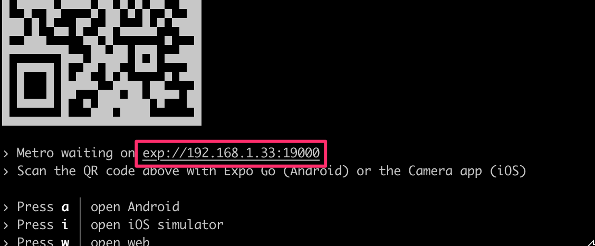

<div class="content">

<!-- So far we have implemented features to our application without any actual server communication. For example, the reviewed repositories list we have implemented uses mock data and the sign in form doesn't send the user's credentials to any authentication endpoint. In this section, we will learn how to communicate with a server using HTTP requests, how to use Apollo Client in a React Native application, and how to store data in the user''s device.-->
到目前为止，我们已经在没有任何实际服务器通信的情况下为我们的应用程序实现了功能。例如，我们实现的已审核的存储库列表使用模拟数据，而登录表单不会将用户凭据发送到任何身份验证端点。在本节中，我们将学习如何使用HTTP请求与服务器通信，如何在React Native应用程序中使用Apollo客户端以及如何在用户设备中存储数据。

<!-- Soon we will learn how to communicate with a server in our application. Before we get to that, we need a server to communicate with. For this purpose, we have a completed server implementation in the [rate-repository-api](https://github.com/fullstack-hy2020/rate-repository-api) repository. The rate-repository-api server fulfills all our application's API needs during this part. It uses [SQLite](https://www.sqlite.org/index.html) database which doesn't need any setup and provides an Apollo GraphQL API along with a few REST API endpoints.-->
很快我们就会学习如何在我们的应用程序中与服务器进行通信。在此之前，我们需要一个服务器来进行通信。为此，我们在[rate-repository-api]（https://github.com/fullstack-hy2020/rate-repository-api）存储库中有一个完整的服务器实现。 rate-repository-api服务器在此部分满足我们应用程序的所有API需求。它使用[SQLite]（https://www.sqlite.org/index.html）数据库，不需要任何设置，并提供Apollo GraphQL API以及几个REST API端点。

<!-- Before heading further into the material, set up the rate-repository-api server by following the setup instructions in the repository''s [README](https://github.com/fullstack-hy2020/rate-repository-api/blob/master/README.md). Note that if you are using an emulator for development it is recommended to run the server and the emulator <i>on the same computer</i>. This eases network requests considerably.-->
在进一步深入材料之前，请按照存储库的[README](https://github.com/fullstack-hy2020/rate-repository-api/blob/master/README.md)中的设置说明设置rate-repository-api服务器。请注意，如果您正在使用模拟器进行开发，则建议将服务器和模拟器<i>放在同一台计算机上</i>。这将大大简化网络请求。

### HTTP requests

<!-- React Native provides [Fetch API](https://developer.mozilla.org/en-US/docs/Web/API/Fetch_API) for making HTTP requests in our applications. React Native also supports the good old [XMLHttpRequest API](https://developer.mozilla.org/en-US/docs/Web/API/XMLHttpRequest) which makes it possible to use third-party libraries such as [Axios](https://github.com/axios/axios). These APIs are the same as the ones in the browser environment and they are globally available without the need for an import.-->
React Native 提供[Fetch API](https://developer.mozilla.org/en-US/docs/Web/API/Fetch_API) 用来在我们的应用中进行HTTP请求。React Native也支持传统的[XMLHttpRequest API](https://developer.mozilla.org/en-US/docs/Web/API/XMLHttpRequest)，这让我们可以使用第三方库，如[Axios](https://github.com/axios/axios)。这些API与浏览器环境中的API是相同的，而且可以在不需要导入的情况下全局使用。

<!-- People who have used both Fetch API and XMLHttpRequest API most likely agree that the Fetch API is easier to use and more modern. However, this doesn't mean that XMLHttpRequest API doesn't have its uses. For the sake of simplicity, we will be only using the Fetch API in our examples.-->
人们使用过Fetch API和XMLHttpRequest API的人很可能都认为Fetch API更容易使用，也更现代化。然而，这并不意味着XMLHttpRequest API没有用处。为了简单起见，我们将只在示例中使用Fetch API。

<!-- Sending HTTP requests using the Fetch API can be done using the <em>fetch</em> function. The first argument of the function is the URL of the resource:-->
使用Fetch API发送HTTP请求可以使用<em>fetch</em>函数完成。函数的第一个参数是资源的URL：

```javascript
fetch('https://my-api.com/get-end-point');
```

<!-- The default request method is <i>GET</i>. The second argument of the <em>fetch</em> function is an options object, which you can use to for example to specify a different request method, request headers, or request body:-->
默认的请求方法是<i>GET</i>。<em>fetch</em>函数的第二个参数是一个选项对象，您可以使用它来指定不同的请求方法、请求头或请求正文：

```javascript
fetch('https://my-api.com/post-end-point', {
  method: 'POST',
  headers: {
    Accept: 'application/json',
    'Content-Type': 'application/json',
  },
  body: JSON.stringify({
    firstParam: 'firstValue',
    secondParam: 'secondValue',
  }),
});
```

<!-- Note that these URLs are made up and won't (most likely) send a response to your requests. In comparison to Axios, the Fetch API operates on a bit lower level. For example, there isn't any request or response body serialization and parsing. This means that you have to for example set the <i>Content-Type</i> header by yourself and use <em>JSON.stringify</em> method to serialize the request body.-->
注意，这些URL是假的，很可能不会对您的请求做出响应。与Axios相比，Fetch API处于较低的水平。例如，没有任何请求或响应体序列化和解析。这意味着您必须自己设置<i>Content-Type</i>头，并使用<em>JSON.stringify</em>方法来序列化请求体。

<!-- The <em>fetch</em> function returns a promise which resolves a [Response](https://developer.mozilla.org/en-US/docs/Web/API/Response) object. Note that error status codes such as 400 and 500 <i>are not rejected</i> like for example in Axios. In case of a JSON formatted response we can parse the response body using the <em>Response.json</em> method:-->
<em>fetch</em> 函数返回一个承诺，它解析一个[Response](https://developer.mozilla.org/en-US/docs/Web/API/Response) 对象。请注意，像Axios这样的400和500错误状态码<i>不会被拒绝</i>。如果是JSON格式的响应，我们可以使用<em>Response.json</em>方法解析响应体：

```javascript
const fetchMovies = async () => {
  const response = await fetch('https://reactnative.dev/movies.json');
  const json = await response.json();

  return json;
};
```

<!-- For a more detailed introduction to the Fetch API, read the [Using Fetch](https://developer.mozilla.org/en-US/docs/Web/API/Fetch_API/Using_Fetch) article in the MDN web docs.-->
为了更详细地了解Fetch API，请阅读MDN网络文档中的[使用Fetch](https://developer.mozilla.org/en-US/docs/Web/API/Fetch_API/Using_Fetch)文章。

<!-- Next, let''s try the Fetch API in practice. The rate-repository-api server provides an endpoint for returning a paginated list of reviewed repositories. Once the server is running, you should be able to access the endpoint at [http://localhost:5000/api/repositories](http://localhost:5000/api/repositories) (unless you have changed the port). The data is paginated in a common [cursor based pagination format](https://graphql.org/learn/pagination/). The actual repository data is behind the <i>node</i> key in the <i>edges</i> array.-->
接下来，让我们实践一下Fetch API。rate-repository-api服务器提供了一个端点，用于返回分页的审查仓库列表。一旦服务器启动，您应该可以访问[http://localhost:5000/api/repositories](http://localhost:5000/api/repositories)端点（除非您更改了端口）。数据以[游标分页格式](https://graphql.org/learn/pagination/)分页。实际的仓库数据在<i>节点</i>键下的<i>边缘</i>数组中。

<!-- Unfortunately, we can''t access the server directly in our application by using the <i>http://localhost:5000/api/repositories</i> URL. To make a request to this endpoint in our application we need to access the server using its IP address in its local network. To find out what it is, open the Expo development tools by running <em>npm start</em>. In the console you should be able to see an URL starting with <i>exp://</i> below the QR code, after the "Metro waiting on" text:-->
不幸的是，我们不能通过使用<i>http：// localhost：5000/api/repositories</i> URL 直接在我们的应用程序中访问服务器。为了在我们的应用程序中向此端点发出请求，我们需要使用其局域网中的IP地址来访问服务器。要查找它是什么，请通过运行<em>npm start</em>打开Expo开发工具。在控制台中，您应该能够在QR码下方的“Metro等待”文本之后看到以<i>exp：//</i>开头的URL：



<!-- Copy the IP address between the <i>exp://</i> and <i>:</i>, which is in this example <i>192.168.1.33</i>. Construct an URL in format <i><http://><IP_ADDRESS>:5000/api/repositories</i> and open it in the browser. You should see the same response as you did with the <i>localhost</i> URL.-->
复制<i>exp://</i>和<i>:</i>之间的IP地址，即本例中的<i>192.168.1.33</i>。构建一个格式为<i><http://><IP_ADDRESS>:5000/api/repositories</i>的URL，并在浏览器中打开它。您应该看到与使用<i>localhost</i> URL相同的响应。

<!-- Now that we know the end point's URL let's use the actual server-provided data in our reviewed repositories list. We are currently using mock data stored in the <em>repositories</em> variable. Remove the <em>repositories</em> variable and replace the usage of the mock data with this piece of code in the <i>RepositoryList.jsx</i> file in the <i>components</i> directory:-->
现在我们知道了终点URL，让我们在审查后的存储库列表中使用实际的服务器提供的数据。我们目前使用存储在<em>repositories</em>变量中的模拟数据。在<i>components</i>目录中的<i>RepositoryList.jsx</i>文件中删除<em>repositories</em>变量，并用此片代码替换模拟数据的使用：

```javascript
import { useState, useEffect } from 'react';
// ...

const RepositoryList = () => {
  const [repositories, setRepositories] = useState();

  const fetchRepositories = async () => {
    // Replace the IP address part with your own IP address!
    const response = await fetch('http://192.168.1.33:5000/api/repositories');
    const json = await response.json();

    console.log(json);

    setRepositories(json);
  };

  useEffect(() => {
    fetchRepositories();
  }, []);

  // Get the nodes from the edges array
  const repositoryNodes = repositories
    ? repositories.edges.map(edge => edge.node)
    : [];

  return (
    <FlatList
      data={repositoryNodes}
      // Other props
    />
  );
};

export default RepositoryList;
```

<!-- We are using the React's <em>useState</em> hook to maintain the repository list state and the <em>useEffect</em> hook to call the <em>fetchRepositories</em> function when the <em>RepositoryList</em> component is mounted. We extract the actual repositories into the <em>repositoryNodes</em> variable and replace the previously used <em>repositories</em> variable in the <em>FlatList</em> component's <em>data</em> prop with it. Now you should be able to see actual server-provided data in the reviewed repositories list.-->
我们正在使用React的<em>useState</em>钩子来维护存储库列表状态，以及<em>useEffect</em>钩子来在<em>RepositoryList</em>组件挂载时调用<em>fetchRepositories</em>函数。我们将实际存储库提取到<em>repositoryNodes</em>变量中，并用它替换<em>FlatList</em>组件的<em>data</em>属性中先前使用的<em>repositories</em>变量。现在，您应该能够在审查的存储库列表中看到实际的服务器提供的数据。

<!-- It is usually a good idea to log the server's response to be able to inspect it as we did in the <em>fetchRepositories</em> function. You should be able to see this log message in the Expo development tools if you navigate to your device's logs as we learned in the [Debugging](/en/part10/introduction_to_react_native#debugging) section. If you are using the Expo's mobile app for development and the network request is failing, make sure that the computer you are using to run the server and your phone are <i>connected to the same Wi-Fi network</i>. If that's not possible either use an emulator in the same computer as the server is running in or set up a tunnel to the localhost, for example, using [Ngrok](https://ngrok.com/).-->
通常最好记录服务器的响应，以便像我们在<em>fetchRepositories</em>函数中所做的那样检查它。如果您按照我们在[调试](/en/part10/introduction_to_react_native#debugging)部分学到的内容导航到设备的日志，您应该能够看到此日志消息。如果您使用Expo的移动应用程序进行开发，并且网络请求失败，请确保用于运行服务器的计算机和您的手机<i>连接到同一个Wi-Fi网络</i>。如果不可能，要么在与服务器运行的同一计算机上使用模拟器，要么使用[Ngrok](https://ngrok.com/)等设置对本地主机的隧道。

<!-- The current data fetching code in the </em>RepositoryList</em> component could do with some refactoring. For instance, the component is aware of the network request's details such as the end point's URL. In addition, the data fetching code has lots of reuse potential. Let's refactor the component's code by extract the data fetching code into its own hook. Create a directory <i>hooks</i> in the <i>src</i> directory and in that <i>hooks</i> directory create a file <i>useRepositories.js</i> with the following content:-->
当前在<em>RepositoryList</em>组件中的数据获取代码需要重构。例如，该组件知道网络请求的详细信息，如端点URL。此外，数据获取代码具有很多可重用性。让我们通过将数据获取代码提取到自己的钩子中来重构组件的代码。在<i>src</i>目录中创建一个<i>hooks</i>目录，并在该<i>hooks</i>目录中创建一个名为<i>useRepositories.js</i>的文件，其内容如下：

```javascript
import { useState, useEffect } from 'react';

const useRepositories = () => {
  const [repositories, setRepositories] = useState();
  const [loading, setLoading] = useState(false);

  const fetchRepositories = async () => {
    setLoading(true);

    // Replace the IP address part with your own IP address!
    const response = await fetch('http://192.168.1.33:5000/api/repositories');
    const json = await response.json();

    setLoading(false);
    setRepositories(json);
  };

  useEffect(() => {
    fetchRepositories();
  }, []);

  return { repositories, loading, refetch: fetchRepositories };
};

export default useRepositories;
```

<!-- Now that we have a clean abstraction for fetching the reviewed repositories, let''s use the <em>useRepositories</em> hook in the <em>RepositoryList</em> component:-->
现在我们有了一个用于获取审查过的存储库的清晰抽象，让我们在<em>RepositoryList</em>组件中使用<em>useRepositories</em>钩子：

```javascript
// ...
import useRepositories from '../hooks/useRepositories'; // highlight-line

const RepositoryList = () => {
  const { repositories } = useRepositories(); // highlight-line

  const repositoryNodes = repositories
    ? repositories.edges.map(edge => edge.node)
    : [];

  return (
    <FlatList
      data={repositoryNodes}
      // Other props
    />
  );
};

export default RepositoryList;
```

<!-- That''s it, now the <em>RepositoryList</em> component is no longer aware of the way the repositories are acquired. Maybe in the future, we will acquire them through a GraphQL API instead of a REST API. We will see what happens.-->
那就是了，现在<em>RepositoryList</em> 组件不再知道如何获取存储库了。也许将来，我们会使用GraphQL API而不是REST API来获取它们。我们将会看到会发生什么事情。

### GraphQL and Apollo client

<!-- In [part 8](https://fullstackopen.com/en/part8) we learned about GraphQL and how to send GraphQL queries to an Apollo Server using the [Apollo Client](https://www.apollographql.com/docs/react/) in React applications. The good news is that we can use the Apollo Client in a React Native application exactly as we would with a React web application.-->
在[第八部分](https://fullstackopen.com/en/part8)中，我们学习了GraphQL以及如何使用[Apollo Client](https://www.apollographql.com/docs/react/)在React应用中发送GraphQL查询到Apollo Server。好消息是，我们可以在React Native应用中像在React Web应用中一样使用Apollo Client。

<!-- As mentioned earlier, the rate-repository-api server provides a GraphQL API which is implemented with Apollo Server. Once the server is running, you can access the [Apollo Sandbox](https://www.apollographql.com/docs/studio/explorer/) at [http://localhost:4000](http://localhost:4000). Apollo Sandbox is a tool for making GraphQL queries and inspecting the GraphQL APIs schema and documentation. If you need to send a query in your application <i>always</i> test it with the Apollo Sandbox first before implementing it in the code. It is much easier to debug possible problems in the query in the Apollo Sandbox than in the application. If you are uncertain what the available queries are or how to use them, you can see the documentation next to the operations editor:-->
正如前面提到的，rate-repository-api 服务器提供了一个使用 Apollo Server 实现的 GraphQL API。一旦服务器运行，您可以访问[Apollo Sandbox](https://www.apollographql.com/docs/studio/explorer/)，地址是[http://localhost:4000](http://localhost:4000)。Apollo Sandbox 是一个用于制作 GraphQL 查询和检查 GraphQL API 模式和文档的工具。如果您需要在应用程序中发送查询，<i>一定要</i>先在 Apollo Sandbox 中测试，然后再在代码中实现它。在 Apollo Sandbox 中调试查询可能存在的问题比在应用程序中调试要容易得多。如果您不确定可用的查询是什么或如何使用它们，您可以在操作编辑器旁边查看文档：


<!-- In our React Native application, we will be using the same [@apollo/client](https://www.npmjs.com/package/@apollo/client) library as in part 8. Let''s get started by installing the library along with the [graphql](https://www.npmjs.com/package/graphql) library which is required as a peer dependency:-->
在我们的React Native应用程序中，我们将使用与第8部分相同的[@apollo/client](https://www.npmjs.com/package/@apollo/client)库。 让我们开始安装该库以及作为同行依赖项所需的[graphql](https://www.npmjs.com/package/graphql)库：

```shell
npm install @apollo/client graphql
```

<!-- Before we can start using Apollo Client, we will need to slightly configure the Metro bundler so that it handles the <i>.cjs</i> file extensions used by the Apollo Client. First, let''s install the <i>@expo/metro-config</i> package which has the default Metro configuration:-->
在我们开始使用Apollo Client之前，我们需要轻微地配置Metro bundler，以便它处理Apollo Client使用的<i>.cjs</i>文件扩展名。首先，让我们安装具有默认Metro配置的<i>@expo/metro-config</i>软件包：

```shell
npm install @expo/metro-config
```

<!-- Then, we can add the following configuration to a <i>metro.config.js</i> in the root directory of our project:-->
然后，我们可以在项目的根目录下的<i>metro.config.js</i>中添加以下配置：

```javascript
const { getDefaultConfig } = require('@expo/metro-config');

const defaultConfig = getDefaultConfig(__dirname);

defaultConfig.resolver.sourceExts.push('cjs');

module.exports = defaultConfig;
```

<!-- Restart the Expo development tools so that changes in the configuration are applied.-->
重新启动Expo开发工具，以便将配置更改应用。

<!-- Now that the Metro configuration is in order, let''s create a utility function for creating the Apollo Client with the required configuration. Create a <i>utils</i> directory in the <i>src</i> directory and in that <i>utils</i> directory create a file <i>apolloClient.js</i>. In that file configure the Apollo Client to connect to the Apollo Server:-->
现在Metro配置已经安排好了，让我们创建一个用于创建所需配置的Apollo Client的实用函数。在<i>src</i>目录下创建一个<i>utils</i>目录，在<i>utils</i>目录下创建一个<i>apolloClient.js</i>文件。在该文件中配置Apollo Client以连接Apollo Server：

```javascript
import { ApolloClient, InMemoryCache, createHttpLink } from '@apollo/client';

const httpLink = createHttpLink({
  // Replace the IP address part with your own IP address!
  uri: 'http://192.168.1.33:4000/graphql',
});

const createApolloClient = () => {
  return new ApolloClient({
    link: httpLink,
    cache: new InMemoryCache(),
  });
};

export default createApolloClient;
```

<!-- The URL used to connect to the Apollo Server is otherwise the same as the one you used with the Fetch API expect the port is <i>4000</i> and the path is <i>/graphql</i>. Lastly, we need to provide the Apollo Client using the [ApolloProvider](https://www.apollographql.com/docs/react/api/react/hooks/#the-apolloprovider-component) context. We will add it to the <em>App</em> component in the <i>App.js</i> file:-->
URL 用于连接 Apollo 服务器与使用 Fetch API 的情况相同，只是端口为 <i>4000</i>，路径为 <i>/graphql</i>。最后，我们需要使用 [ApolloProvider](https://www.apollographql.com/docs/react/api/react/hooks/#the-apolloprovider-component) 上下文提供 Apollo 客户端。我们将在 <i>App.js</i> 文件中的 <em>App</em> 组件中添加它：

```javascript
import { NativeRouter } from 'react-router-native';
import { ApolloProvider } from '@apollo/client'; // highlight-line

import Main from './src/components/Main';
import createApolloClient from './src/utils/apolloClient'; // highlight-line

const apolloClient = createApolloClient(); // highlight-line

const App = () => {
  return (
    <NativeRouter>
      <ApolloProvider client={apolloClient}> // highlight-line
        <Main />
      </ApolloProvider> // highlight-line
    </NativeRouter>
  );
};

export default App;
```

### Organizing GraphQL related code

<!-- It is up to you how to organize the GraphQL related code in your application. However, for the sake of a reference structure, let''s have a look at one quite simple and efficient way to organize the GraphQL related code. In this structure, we define queries, mutations, fragments, and possibly other entities in their own files. These files are located in the same directory. Here is an example of the structure you can use to get started:-->
# 由你自己决定如何组织应用程序中的GraphQL相关代码。但是，为了参考结构，让我们看一下一种相当简单和有效的组织GraphQL相关代码的方式。在这种结构中，我们在同一个目录中定义查询、变异、片段以及可能的其他实体。以下是你可以用来开始的结构的示例：


<!-- You can import the <em>gql</em> template literal tag used to define GraphQL queries from <i>@apollo/client</i> library. If we follow the structure suggested above, we could have a <i>queries.js</i> file in the <i>graphql</i> directory for our application''s GraphQL queries. Each of the queries can be stored in a variable and exported like this:-->
你可以从 <i>@apollo/client</i> 库中导入用于定义 GraphQL 查询的<em>gql</em> 模板文字标记。如果我们遵循上面提到的结构，我们可以在应用程序的 <i>graphql</i> 目录中拥有一个 <i>queries.js</i> 文件来存储 GraphQL 查询。每个查询可以存储在一个变量中，并像这样导出：

```javascript
import { gql } from '@apollo/client';

export const GET_REPOSITORIES = gql`
  query {
    repositories {
      ${/* ... */}
    }
  }
`;

// other queries...
```

<!-- We can import these variables and use them with the <em>useQuery</em> hook like this:-->
我们可以导入这些变量，并像这样使用<em>useQuery</em>钩子：

```javascript
import { useQuery } from '@apollo/client';

import { GET_REPOSITORIES } from '../graphql/queries';

const Component = () => {
  const { data, error, loading } = useQuery(GET_REPOSITORIES);
  // ...
};
```

<!-- The same goes for organizing mutations. The only difference is that we define them in a different file, <i>mutations.js</i>. It is recommended to use [fragments](https://www.apollographql.com/docs/react/data/fragments/) in queries to avoid retyping the same fields over and over again.-->
同样适用于组织变异。唯一的区别是我们在不同的文件<i>mutations.js</i>中定义它们。建议在查询中使用[片段](https://www.apollographql.com/docs/react/data/fragments/)来避免一遍又一遍地重新键入相同的字段。

### Evolving the structure

<!-- Once our application grows larger there might be times when certain files grow too large to manage. For example, we have component <em>A</em> which renders the components <em>B</em> and <em>C</em>. All these components are defined in a file <i>A.jsx</i> in a <i>components</i> directory. We would like to extract components <em>B</em> and <em>C</em> into their own files <i>B.jsx</i> and <i>C.jsx</i> without major refactors. We have two options:-->
一旦我们的应用程序变得越来越大，有时候某些文件会变得太大而无法管理。例如，我们有组件<em>A</em>，它渲染组件<em>B</em>和<em>C</em>。所有这些组件都定义在<i>components</i>目录中的文件<i>A.jsx</i>中。我们希望将组件<em>B</em>和<em>C</em>提取到自己的文件<i>B.jsx</i>和<i>C.jsx</i>中，而不需要大的重构。我们有两个选择：

<!-- - Create files <i>B.jsx</i> and <i>C.jsx</i> in the <i>components</i> directory. This results in the following structure:-->
- 在 `components` 目录中创建文件 <i>B.jsx</i> 和 <i>C.jsx</i>，这将产生以下结构：

```bash
components/
  A.jsx
  B.jsx
  C.jsx
  ...
```

<!-- - Create a directory <i>A</i> in the <i>components</i> directory and create files <i>B.jsx</i> and <i>C.jsx</i> there. To avoid breaking components that import the <i>A.jsx</i> file, move the <i>A.jsx</i> file to the <i>A</i> directory and rename it to <i>index.jsx</i>. This results in the following structure:-->
在`components`目录下创建一个目录<i>A</i>，并在其中创建文件<i>B.jsx</i>和<i>C.jsx</i>。为了避免破坏导入<i>A.jsx</i>文件的组件，将<i>A.jsx</i>文件移动到<i>A</i>目录，并将其重命名为<i>index.jsx</i>。这样结构如下：

```bash
components/
  A/
    B.jsx
    C.jsx
    index.jsx
  ...
```

<!-- The first option is fairly decent, however, if components <em>B</em> and <em>C</em> are not reusable outside the component <em>A</em>, it is useless to bloat the <i>components</i> directory by adding them as separate files. The second option is quite modular and doesn''t break any imports because importing a path such as <i>./A</i> will match both <i>A.jsx</i> and <i>A/index.jsx</i>.-->
第一个选项相当不错，但是，如果组件<em>B</em>和<em>C</em>不可以在组件<em>A</em>之外重用，那么将它们作为单独的文件添加到<i>components</i>目录中就毫无意义了。第二个选项非常模块化，而且不会破坏任何导入，因为导入一个路径，比如<i>./A</i>，将同时匹配<i>A.jsx</i>和<i>A/index.jsx</i>。

</div>

<div class="tasks">

### Exercise 10.11

#### Exercise 10.11: fetching repositories with Apollo Client

<!-- We want to replace the Fetch API implementation in the <em>useRepositories</em> hook with a GraphQL query. Open the Apollo Sandbox at [http://localhost:4000](http://localhost:4000) and take a look at the documentation next to the operations editor. Look up the <em>repositories</em> query. The query has some arguments, however, all of these are optional so you don''t need to specify them. In the Apollo Sandbox form a query for fetching the repositories with the fields you are currently displaying in the application. The result will be paginated and it contains the up to first 30 results by default. For now, you can ignore the pagination entirely.-->
我们想要用一个GraphQL查询替换<em>useRepositories</em>钩子中的Fetch API实现。打开Apollo沙箱[http://localhost:4000](http://localhost:4000)，查看操作编辑器旁边的文档。查找<em>repositories</em>查询。该查询有一些参数，但是所有这些都是可选的，所以你不需要指定它们。在Apollo沙箱中，构建一个查询来获取当前应用程序中显示的字段的存储库。结果将被分页，默认情况下它包含最多30个结果。现在，你可以完全忽略分页。

<!-- Once the query is working in the Apollo Sandbox, use it to replace the Fetch API implementation in the <em>useRepositories</em> hook. This can be achieved using the [useQuery](https://www.apollographql.com/docs/react/api/react/hooks/#usequery) hook. The <em>gql</em> template literal tag can be imported from the <i>@apollo/client</i> library as instructed earlier. Consider using the structure recommended earlier for the GraphQL related code. To avoid future caching issues, use the *cache-and-network* [fetch policy](https://www.apollographql.com/docs/react/data/queries/#setting-a-fetch-policy) in the query. It can be used with the <em>useQuery</em> hook like this:-->
一旦查询在Apollo Sandbox中正常工作，就可以用它来替换<em>useRepositories</em>钩子中的Fetch API实现。可以使用[useQuery](https://www.apollographql.com/docs/react/api/react/hooks/#usequery)钩子来实现。<em>gql</em>模板文字标签可以按照先前指示从<i>@apollo/client</i>库中导入。考虑使用先前推荐的结构来编写与GraphQL相关的代码。为了避免将来的缓存问题，在查询中使用*cache-and-network* [fetch policy](https://www.apollographql.com/docs/react/data/queries/#setting-a-fetch-policy)。它可以像这样与<em>useQuery</em>钩子一起使用：

```javascript
useQuery(MY_QUERY, {
  fetchPolicy: 'cache-and-network',
  // Other options
});
```

<!-- The changes in the <em>useRepositories</em> hook should not affect the <em>RepositoryList</em> component in any way.-->
<em>useRepositories</em> 钩子的更改不应该以任何方式影响 <em>RepositoryList</em> 组件。

</div>

<div class="content">

### Environment variables

<!-- Every application will most likely run in more than one environment. Two obvious candidates for these environments are the development environment and the production environment. Out of these two, the development environment is the one we are running the application right now. Different environments usually have different dependencies, for example, the server we are developing locally might use a local database whereas the server that is deployed to the production environment uses the production database. To make the code environment independent we need to parametrize these dependencies. At the moment we are using one very environment dependant hardcoded value in our application: the URL of the server.-->
每个应用程式很可能会在不止一个环境中运行。两个明显的环境候选者是开发环境和产品环境。其中，开发环境就是我们现在运行应用程式的环境。不同的环境通常有不同的依赖，例如，我们在本地开发的伺服器可能使用本地资料库，而部署到产品环境的伺服器则使用产品资料库。为了使代码环境独立，我们需要对这些依赖进行参数化。目前我们在应用程式中使用了一个非常环境依赖的硬编码值：伺服器的URL。

<!-- We have previously learned that we can provide running programs with environment variables. These variables can be defined in the command line or using environment configuration files such as <i>.env</i> files and third-party libraries such as <i>Dotenv</i>. Unfortunately, React Native doesn''t have direct support for environment variables. However, we can access the Expo configuration defined in the <i>app.json</i> file at runtime from our JavaScript code. This configuration can be used to define and access environment dependant variables.-->
我们之前学习过，我们可以为运行程序提供环境变量。这些变量可以在命令行中定义，也可以使用环境配置文件（如<i>.env</i>文件）和第三方库（如<i>Dotenv</i>）定义。不幸的是，React Native没有直接支持环境变量。然而，我们可以从JavaScript代码中运行时访问<i>app.json</i>文件中定义的Expo配置。此配置可用于定义和访问与环境相关的变量。

<!-- The configuration can be accessed by importing the <em>Constants</em> constant from the <i>expo-constants</i> module as we have done a few times before. Once imported, the <em>Constants.manifest</em> property will contain the configuration. Let''s try this by logging <em>Constants.manifest</em> in the <em>App</em> component:-->
可以通过从<i>expo-constants</i>模块导入<em>Constants</em>常量来访问配置，这是我们之前已经做过几次了。一旦导入，<em>Constants.manifest</em>属性将包含配置。让我们在<em>App</em>组件中尝试一下，打印<em>Constants.manifest</em>：

```javascript
import { NativeRouter } from 'react-router-native';
import { ApolloProvider } from '@apollo/client';
import Constants from 'expo-constants'; // highlight-line

import Main from './src/components/Main';
import createApolloClient from './src/utils/apolloClient';

const apolloClient = createApolloClient();

const App = () => {
  console.log(Constants.manifest); // highlight-line

  return (
    <NativeRouter>
      <ApolloProvider client={apolloClient}>
        <Main />
      </ApolloProvider>
    </NativeRouter>
  );
};

export default App;
```

<!-- You should now see the configuration in the logs.-->
你现在应该在日志中看到配置了。

<!-- The next step is to use the configuration to define environment dependant variables in our application. Let''s get started by renaming the <i>app.json</i> file to <i>app.config.js</i>. Once the file is renamed, we can use JavaScript inside the configuration file. Change the file contents so that the previous object:-->
下一步是使用配置来定义我们应用程序中的环境相关变量。让我们先将<i>app.json</i>文件重命名为<i>app.config.js</i>。文件重命名后，我们可以在配置文件中使用JavaScript。更改文件内容，使先前的对象：

```javascript
{
  "expo": {
    "name": "rate-repository-app",
    // rest of the configuration...
  }
}
```

<!-- Is turned into an export, which contains the contents of the <em>expo</em> property:-->
被转换成一个导出，其中包含 <em>expo</em> 属性的内容：

```javascript
export default {
   name: 'rate-repository-app',
   // rest of the configuration...
};
```

<!-- Expo has reserved an [extra](https://docs.expo.dev/guides/environment-variables/#using-app-manifest--extra) property in the configuration for any application-specific configuration. To see how this works, let's add an <em>env</em> variable into our application's configuration:-->
Expo预留了一个[额外的](https://docs.expo.dev/guides/environment-variables/#using-app-manifest--extra)属性用于应用程序特定的配置。 为了查看这种方式的工作原理，让我们在应用程序的配置中添加一个<em>env</em>变量：

```javascript
export default {
   name: 'rate-repository-app',
   // rest of the configuration...
   // highlight-start
   extra: {
     env: 'development'
   },
   // highlight-end
};
```

<!-- Restart Expo development tools to apply the changes and you should see that the value of <em>Constants.manifest</em> property has changed and now includes the <em>extra</em> property containing our application-specific configuration. Now the value of the <em>env</em> variable is accessible through the <em>Constants.manifest.extra.env</em> property.-->
重新启动Expo开发工具以应用更改，您应该会看到<em>Constants.manifest</em>属性的值已更改，并且现在包含包含我们的应用特定配置的<em>extra</em>属性。现在，<em>env</em>变量的值可通过<em>Constants.manifest.extra.env</em>属性访问。

<!-- Because using hard coded configuration is a bit silly, let''s use an environment variable instead:-->
因为使用硬编码配置有点傻，让我们改用环境变量：

```javascript
export default {
   name: 'rate-repository-app',
   // rest of the configuration...
   // highlight-start
   extra: {
     env: process.env.ENV,
   },
   // highlight-end
};
```

<!-- As we have learned, we can set the value of an environment variable through the command line by defining the variable''s name and value before the actual command. As an example, start Expo development tools and set the environment variable <em>ENV</em> as <em>test</em> like this:-->
我们已经学习到，我们可以通过命令行设置环境变量的值，在实际命令之前定义变量的名称和值。 例如，启动Expo开发工具，将环境变量<em> ENV </em>设置为<em> test </em>，如下所示：

```shell
ENV=test npm start
```

<!-- If you take a look at the logs, you should see that the <em>Constants.manifest.extra.env</em> property has changed.-->
如果你看一下日志，你应该会看到<em>Constants.manifest.extra.env</em>属性已经改变了。

<!-- We can also load environment variables from an <em>.env</em> file as we have learned in the previous parts. First, we need to install the [Dotenv](https://www.npmjs.com/package/dotenv) library:-->
我们也可以从<em>.env</em>文件中加载环境变量，就像我们在之前的部分所学到的一样。首先，我们需要安装[Dotenv](https://www.npmjs.com/package/dotenv)库：

```shell
npm install dotenv
```

<!-- Next, add a <em>.env</em> file in the root directory of our project with the following content:-->
下一步，在我们项目的根目录下添加一个<em>.env</em>文件，内容如下：

```text
ENV=development
```

<!-- Finally, import the library in the <i>app.config.js</i> file:-->
最后，在<i>app.config.js</i>文件中导入该库：

```javascript
import 'dotenv/config'; // highlight-line

export default {
   name: 'rate-repository-app',
   // rest of the configuration...
   extra: {
     env: process.env.ENV,
   },
};
```

<!-- You need to restart Expo development tools to apply the changes you have made to the <i>.env</i> file.-->
你需要重新启动Expo开发工具来应用你对<i>.env</i>文件所做的更改。

<!-- Note that it is <i>never</i> a good idea to put sensitive data into the application''s configuration. The reason for this is that once a user has downloaded your application, they can, at least in theory, reverse engineer your application and figure out the sensitive data you have stored into the code.-->
<i>永远</i>不要把敏感数据放入应用程序的配置中是一个不好的主意。原因是一旦用户下载了你的应用程序，他们至少在理论上可以逆向工程你的应用程序，并找出你存储在代码中的敏感数据。

</div>

<div class="tasks">

### Exercise 10.12

#### Exercise 10.12: environment variables

<!-- Instead of the hardcoded Apollo Server''s URL, use an environment variable defined in the <i>.env</i> file when initializing the Apollo Client. You can name the environment variable for example <em>APOLLO_URI</em>.-->
代替在<i>.env</i>文件中定义的硬编码的Apollo Server的URL，在初始化Apollo Client时使用环境变量。你可以把环境变量命名为<em>APOLLO_URI</em>。

<i>Do not</i> try to access environment variables like <em>process.env.APOLLO_URI</em> outside the <i>app.config.js</i> file. Instead use the <em>Constants.manifest.extra</em> object like in the previous example. In addition, do not import the dotenv library outside the <i>app.config.js</i> file or you will most likely face errors.

</div>

<div class="content">

### Storing data in the user''s device

<!-- There are times when we need to store some persisted pieces of data in the user's device. One such common scenario is storing the user's authentication token so that we can retrieve it even if the user closes and reopens our application. In web development, we have used the browser''s <em>localStorage</em> object to achieve such functionality. React Native provides similar persistent storage, the [AsyncStorage](https://react-native-async-storage.github.io/async-storage/docs/usage/).-->
有时候我们需要在用户设备中存储一些持久化的数据。一个常见的场景是存储用户的身份验证令牌，这样即使用户关闭并重新打开我们的应用程序，我们也可以检索它。在Web开发中，我们已经使用浏览器的<em>localStorage</em>对象来实现此功能。React Native提供类似的持久存储，[AsyncStorage](https://react-native-async-storage.github.io/async-storage/docs/usage/)。

<!-- We can use the <em>npx expo install</em> command to install the version of the <i>@react-native-async-storage/async-storage</i> package that is suitable for our Expo SDK version:-->
我们可以使用<em>npx expo install</em> 命令来安装适合我们Expo SDK 版本的<i>@react-native-async-storage/async-storage</i> 包：

```shell
npx expo install @react-native-async-storage/async-storage
```

<!-- The API of the <em>AsyncStorage</em> is in many ways same as the <em>localStorage</em> API. They are both key-value storages with similar methods. The biggest difference between the two is that, as the name implies, the operations of <em>AsyncStorage</em> are <i>asynchronous</i>.-->
<em>AsyncStorage</em> 的 API 在很多方面都与 <em>localStorage</em> API 相似。它们都是键值存储，有着相似的方法。两者最大的不同之处在于，正如其名称所暗示的，<em>AsyncStorage</em> 的操作是<i>异步的</i>。

<!-- Because <em>AsyncStorage</em> operates with string keys in a global namespace it is a good idea to create a simple abstraction for its operations. This abstraction can be implemented for example using a [class](https://developer.mozilla.org/en-US/docs/Web/JavaScript/Reference/Classes). As an example, we could implement a shopping cart storage for storing the products user wants to buy:-->
因为<em>AsyncStorage</em> 在全局命名空间中使用字符串键，所以最好为其操作创建一个简单的抽象。 例如，可以使用[类](https://developer.mozilla.org/en-US/docs/Web/JavaScript/Reference/Classes)来实现此抽象。 例如，我们可以实现一个购物车存储，用于存储用户要购买的产品：

```javascript
import AsyncStorage from '@react-native-async-storage/async-storage';

class ShoppingCartStorage {
  constructor(namespace = 'shoppingCart') {
    this.namespace = namespace;
  }

  async getProducts() {
    const rawProducts = await AsyncStorage.getItem(
      `${this.namespace}:products`,
    );

    return rawProducts ? JSON.parse(rawProducts) : [];
  }

  async addProduct(productId) {
    const currentProducts = await this.getProducts();
    const newProducts = [...currentProducts, productId];

    await AsyncStorage.setItem(
      `${this.namespace}:products`,
      JSON.stringify(newProducts),
    );
  }

  async clearProducts() {
    await AsyncStorage.removeItem(`${this.namespace}:products`);
  }
}

const doShopping = async () => {
  const shoppingCartA = new ShoppingCartStorage('shoppingCartA');
  const shoppingCartB = new ShoppingCartStorage('shoppingCartB');

  await shoppingCartA.addProduct('chips');
  await shoppingCartA.addProduct('soda');

  await shoppingCartB.addProduct('milk');

  const productsA = await shoppingCartA.getProducts();
  const productsB = await shoppingCartB.getProducts();

  console.log(productsA, productsB);

  await shoppingCartA.clearProducts();
  await shoppingCartB.clearProducts();
};

doShopping();
```

<!-- Because <em>AsyncStorage</em> keys are global, it is usually a good idea to add a <i>namespace</i> for the keys. In this context, the namespace is just a prefix we provide for the storage abstraction's keys. Using the namespace prevents the storage's keys from colliding with other <em>AsyncStorage</em> keys. In this example, the namespace is defined as the constructor''s argument and we are using the <em>namespace:key</em> format for the keys.-->
因为AsyncStorage的键是全局的，所以为键添加一个命名空间通常是一个好主意。在这种情况下，命名空间只是我们为存储抽象提供的前缀。使用命名空间可以防止存储的键与其他AsyncStorage键发生冲突。在本例中，命名空间定义为构造函数的参数，我们使用namespace:key格式的键。

<!-- We can add an item to the storage using the [AsyncStorage.setItem](https://react-native-async-storage.github.io/async-storage/docs/api#setitem) method. The first argument of the method is the item's key and the second argument its value. The value <i>must be a string</i>, so we need to serialize non-string values as we did with the <em>JSON.stringify</em> method. The [AsyncStorage.getItem](https://react-native-async-storage.github.io/async-storage/docs/api/#getitem) method can be used to get an item from the storage. The argument of the method is the item's key, of which value will be resolved. The [AsyncStorage.removeItem](https://react-native-async-storage.github.io/async-storage/docs/api/#removeitem) method can be used to remove the item with the provided key from the storage.-->
我们可以使用 [AsyncStorage.setItem](https://react-native-async-storage.github.io/async-storage/docs/api#setitem) 方法向存储添加一个项目。该方法的第一个参数是项目的键，第二个参数是其值。<i>值必须是字符串</i>，因此我们需要像使用 <em>JSON.stringify</em> 方法一样对非字符串值进行序列化。可以使用 [AsyncStorage.getItem](https://react-native-async-storage.github.io/async-storage/docs/api/#getitem) 方法从存储中获取项目。该方法的参数是项目的键，其值将被解析。可以使用 [AsyncStorage.removeItem](https://react-native-async-storage.github.io/async-storage/docs/api/#removeitem) 方法从存储中使用提供的键删除项目。

<!-- **NB:** [SecureStore](https://docs.expo.dev/versions/latest/sdk/securestore/) is similar persisted storage as the <em>AsyncStorage</em> but it encrypts the stored data. This makes it more suitable for storing more sensitive data such as the user''s credit card number.-->
**SecureStore** 与<em>AsyncStorage</em>类似，但它对存储的数据进行了加密。这使得它更适合存储更敏感的数据，比如用户的信用卡号。

</div>

<div class="tasks">

### Exercises 10.13. - 10.14

#### Exercise 10.13: the sign in form mutation

<!-- The current implementation of the sign in form doesn't do much with the submitted user's credentials. Let's do something about that in this exercise. First, read the rate-repository-api server's [authentication documentation](https://github.com/fullstack-hy2020/rate-repository-api#-authentication) and test the provided queries and mutations in the Apollo Sandbox. If the database doesn''t have any users, you can populate the database with some seed data. Instructions for this can be found in the [getting started](https://github.com/fullstack-hy2020/rate-repository-api#-getting-started) section of the README.-->
当前的登录表单对提交的用户凭据几乎没有做什么。让我们在这个练习中做点什么吧。首先，阅读[认证文档](https://github.com/fullstack-hy2020/rate-repository-api#-authentication)并在Apollo Sandbox中测试提供的查询和变更。如果数据库没有任何用户，您可以使用一些种子数据填充数据库。有关此操作的说明可在[开始](https://github.com/fullstack-hy2020/rate-repository-api#-getting-started)部分中找到README。

<!-- Once you have figured out how the authentication works, create a file *useSignIn.js* file in the <i>hooks</i> directory. In that file implement a <em>useSignIn</em> hook that sends the <em>authenticate</em> mutation using the [useMutation](https://www.apollographql.com/docs/react/api/react/hooks/#usemutation) hook. Note that the <em>authenticate</em> mutation has a <i>single</i> argument called <em>credentials</em>, which is of type <em>AuthenticateInput</em>. This [input type](https://graphql.org/graphql-js/mutations-and-input-types) contains <em>username</em> and <em>password</em> fields.-->
一旦您弄清楚认证如何工作，请在<i>hooks</i>目录中创建一个文件*useSignIn.js*。 在该文件中实现<em>useSignIn</em>钩子，使用[useMutation](https://www.apollographql.com/docs/react/api/react/hooks/#usemutation)钩子发送<em>authenticate</em>变异。 请注意，<em>authenticate</em>变异有一个称为<em>credentials</em>的<i>single</i>参数，其类型为<em>AuthenticateInput</em>。 该[输入类型](https://graphql.org/graphql-js/mutations-and-input-types)包含<em>username</em>和<em>password</em>字段。

<!-- The return value of the hook should be a tuple <em>[signIn, result]</em> where <em>result</em> is the mutations result as it is returned by the <em>useMutation</em> hook and <em>signIn</em> a function that runs the mutation with a <em>{ username, password }</em> object argument. Hint: don''t pass the mutation function to the return value directly. Instead, return a function that calls the mutation function like this:-->
返回值应该是一个元组<em>[signIn, result]</em>，其中<em>result</em>是<em>useMutation</em>钩子返回的突变结果，而<em>signIn</em>是一个以<em>{ username, password }</em>对象参数运行突变的函数。提示：不要直接将突变函数传递给返回值。而是返回一个调用突变函数的函数，如下所示：

```javascript
const useSignIn = () => {
  const [mutate, result] = useMutation(/* mutation arguments */);

  const signIn = async ({ username, password }) => {
    // call the mutate function here with the right arguments
  };

  return [signIn, result];
};
```

<!-- Once the hook is implemented, use it in the <em>SignIn</em> component''s <em>onSubmit</em> callback for example like this:-->
一旦钩子实现，就可以在<em>SignIn</em>组件的<em>onSubmit</em>回调中使用它，例如：

```javascript
const SignIn = () => {
  const [signIn] = useSignIn();

  const onSubmit = async (values) => {
    const { username, password } = values;

    try {
      const { data } = await signIn({ username, password });
      console.log(data);
    } catch (e) {
      console.log(e);
    }
  };

  // ...
};
```

<!-- This exercise is completed once you can log the user's <i>authenticate</i> mutations result after the sign in form has been submitted. The mutation result should contain the user's access token.-->
这个练习完成后，您应该能够记录提交登录表单后用户的<i>认证</i>变更结果，变更结果应包含用户的访问令牌。

#### Exercise 10.14: storing the access token step1

<!-- Now that we can obtain the access token we need to store it. Create a file <i>authStorage.js</i> in the <i>utils</i> directory with the following content:-->
现在我们可以获得访问令牌，我们需要存储它。在<i>utils</i>目录下创建一个文件<i>authStorage.js</i>，内容如下：

```javascript
import AsyncStorage from '@react-native-async-storage/async-storage';

class AuthStorage {
  constructor(namespace = 'auth') {
    this.namespace = namespace;
  }

  getAccessToken() {
    // Get the access token for the storage
  }

  setAccessToken(accessToken) {
    // Add the access token to the storage
  }

  removeAccessToken() {
    // Remove the access token from the storage
  }
}

export default AuthStorage;
```

<!-- Next, implement the methods <em>AuthStorage.getAccessToken</em>, <em>AuthStorage.setAccessToken</em> and <em>AuthStorage.removeAccessToken</em>. Use the <em>namespace</em> variable to give your keys a namespace like we did in the previous example.-->
接下来，实现方法<em>AuthStorage.getAccessToken</em>、<em>AuthStorage.setAccessToken</em>和<em>AuthStorage.removeAccessToken</em>。像前面的例子一样，使用<em>命名空间</em>变量为你的键提供命名空间。

</div>

<div class="content">

### Enhancing Apollo Client''s requests

<!-- Now that we have implemented storage for storing the user''s access token, it is time to start using it. Initialize the storage in the <em>App</em> component:-->
现在我们已经实现了存储用于存储用户的访问令牌，是时候开始使用它了。在<em>App</em>组件中初始化存储：

```javascript
import { NativeRouter } from 'react-router-native';
import { ApolloProvider } from '@apollo/client';

import Main from './src/components/Main';
import createApolloClient from './src/utils/apolloClient';
import AuthStorage from './src/utils/authStorage'; // highlight-line

const authStorage = new AuthStorage(); // highlight-line
const apolloClient = createApolloClient(authStorage); // highlight-line

const App = () => {
  return (
    <NativeRouter>
      <ApolloProvider client={apolloClient}>
        <Main />
      </ApolloProvider>
    </NativeRouter>
  );
};

export default App;
```

<!-- We also provided the storage instance for the <em>createApolloClient</em> function as an argument. This is because next, we will send the access token to Apollo Server in each request. The Apollo Server will expect that the access token is present in the <i>Authorization</i> header in the format <i>Bearer <ACCESS_TOKEN></i>. We can enhance the Apollo Client's request by using the [setContext](https://www.apollographql.com/docs/react/api/link/apollo-link-context) function. Let's send the access token to the Apollo Server by modifying the <em>createApolloClient</em> function in the <i>apolloClient.js</i> file:-->
我们还将存储实例作为参数提供给<em>createApolloClient</em>函数。这是因为接下来，我们将在每个请求中将访问令牌发送到Apollo Server。Apollo Server将期望<i>Authorization</i>标头以<i>Bearer <ACCESS_TOKEN></i>格式提供访问令牌。我们可以通过使用[setContext](https://www.apollographql.com/docs/react/api/link/apollo-link-context)函数来增强Apollo Client的请求。让我们通过修改<i>apolloClient.js</i>文件中的<em>createApolloClient</em>函数将访问令牌发送到Apollo Server：

```javascript
import { ApolloClient, InMemoryCache, createHttpLink } from '@apollo/client';
import Constants from 'expo-constants';
import { setContext } from '@apollo/client/link/context'; // highlight-line

// You might need to change this depending on how you have configured the Apollo Server''s URI
const { apolloUri } = Constants.manifest.extra;

const httpLink = createHttpLink({
  uri: apolloUri,
});

// highlight-start
const createApolloClient = (authStorage) => {
  const authLink = setContext(async (_, { headers }) => {
    try {
      const accessToken = await authStorage.getAccessToken();

      return {
        headers: {
          ...headers,
          authorization: accessToken ? `Bearer ${accessToken}` : '',
        },
      };
    } catch (e) {
      console.log(e);

      return {
        headers,
      };
    }
  });

  return new ApolloClient({
    link: authLink.concat(httpLink),
    cache: new InMemoryCache(),
  });
};
// highlight-end

export default createApolloClient;
```

### Using React Context for dependency injection

<!-- The last piece of the sign-in puzzle is to integrate the storage to the <em>useSignIn</em> hook. To achieve this the hook must be able to access token storage instance we have initialized in the <em>App</em> component. React [Context](https://reactjs.org/docs/context.html) is just the tool we need for the job. Create a directory <i>contexts</i> in the <i>src</i> directory. In that directory create a file <i>AuthStorageContext.js</i> with the following content:-->
最后一部分登录拼图是将存储集成到<em>useSignIn</em>钩子中。为了实现这一点，钩子必须能够访问我们在<em>App</em>组件中初始化的令牌存储实例。React [Context](https://reactjs.org/docs/context.html)就是我们需要的工具。在<i>src</i>目录中创建一个目录<i>contexts</i>。在该目录中创建一个名为<i>AuthStorageContext.js</i>的文件，其内容如下：

```javascript
import { createContext } from 'react';

const AuthStorageContext = createContext();

export default AuthStorageContext;
```

<!-- Now we can use the <em>AuthStorageContext.Provider</em> to provide the storage instance to the descendants of the context. Let''s add it to the <em>App</em> component:-->
现在我们可以使用<em>AuthStorageContext.Provider</em>来为上下文的后代提供存储实例。让我们将其添加到<em>App</em>组件中：

```javascript
import { NativeRouter } from 'react-router-native';
import { ApolloProvider } from '@apollo/client';

import Main from './src/components/Main';
import createApolloClient from './src/utils/apolloClient';
import AuthStorage from './src/utils/authStorage';
import AuthStorageContext from './src/contexts/AuthStorageContext'; // highlight-line

const authStorage = new AuthStorage();
const apolloClient = createApolloClient(authStorage);

const App = () => {
  return (
    <NativeRouter>
      <ApolloProvider client={apolloClient}>
        <AuthStorageContext.Provider value={authStorage}> // highlight-line
          <Main />
        </AuthStorageContext.Provider> // highlight-line
      </ApolloProvider>
    </NativeRouter>
  );
};

export default App;
```

<!-- Accessing the storage instance in the <em>useSignIn</em> hook is now possible using the React''s [useContext](https://reactjs.org/docs/hooks-reference.html#usecontext) hook like this:-->
使用React的[useContext](https://reactjs.org/docs/hooks-reference.html#usecontext) hook，现在可以在<em>useSignIn</em> hook中访问存储实例，就像这样：

```javascript
// ...
import { useContext } from 'react'; // highlight-line

import AuthStorageContext from '../contexts/AuthStorageContext'; //highlight-line

const useSignIn = () => {
  const authStorage = useContext(AuthStorageContext); //highlight-line
  // ...
};
```

<!-- Note that accessing a context''s value using the <em>useContext</em> hook only works if the <em>useContext</em> hook is used in a component that is a <i>descendant</i> of the [Context.Provider](https://reactjs.org/docs/context.html#contextprovider) component.-->
注意，如果使用<em>useContext</em>钩子访问上下文的值，则只有在[Context.Provider](https://reactjs.org/docs/context.html#contextprovider)组件的<i>后代</i>组件中使用<em>useContext</em>钩子时才有效。

<!-- Accessing the <em>AuthStorage</em> instance with <em>useContext(AuthStorageContext)</em> is quite verbose and reveals the details of the implementation. Let''s improve this by implementing a <em>useAuthStorage</em> hook in a <i>useAuthStorage.js</i> file in the <i>hooks</i> directory:-->
访问<em>AuthStorage</em>实例使用<em>useContext(AuthStorageContext)</em>比较冗长，暴露了实现的细节。让我们来改进一下，在<i>hooks</i>目录下的<i>useAuthStorage.js</i>文件中实现一个<em>useAuthStorage</em> hook：

```javascript
import { createContext } from 'react';
import { useContext } from 'react';

const AuthStorageContext = createContext();

export const useAuthStorage = () => {
  return useContext(AuthStorageContext);
};

export default AuthStorageContext;
```

<!-- The hook''s implementation is quite simple but it improves the readability and maintainability of the hooks and components using it. We can use the hook to refactor the <em>useSignIn</em> hook like this:-->
hook 的实现非常简单，但它提高了 hooks 和使用它的组件的可读性和可维护性。我们可以使用该 hook 来重构 <em>useSignIn</em> hook，如下所示：

```javascript
// ...
import { useAuthStorage } from '../hooks/useAuthStorage'; // highlight-line

const useSignIn = () => {
  const authStorage = useAuthStorage(); //highlight-line
  // ...
};
```

<!-- The ability to provide data to component''s descendants opens tons of use cases for React Context, as we already saw in the [last chapter](/en/part6/react_query_use_reducer_and_the_context) of part 6.-->
能够向组件的后代提供数据，为 React Context 带来了大量的使用场景，正如我们在第 6 部分的[上一章](/en/part6/react_query_use_reducer_and_the_context)中所看到的。

<!-- To learn more about these use cases, read Kent C. Dodds'' enlightening article [How to use React Context effectively](https://kentcdodds.com/blog/how-to-use-react-context-effectively) to find out how to combine the [useReducer](https://reactjs.org/docs/hooks-reference.html#usereducer) hook with the context to implement state management. You might find a way to use this knowledge in the upcoming exercises.-->
要了解更多关于这些用例，请阅读 Kent C. Dodds 的精彩文章[如何有效地使用 React Context](https://kentcdodds.com/blog/how-to-use-react-context-effectively)，以找出如何将[useReducer](https://reactjs.org/docs/hooks-reference.html#usereducer)钩与上下文结合以实现状态管理。您可能会在即将到来的练习中找到一种使用这些知识的方法。

</div>

<div class="tasks">

### Exercises 10.15. - 10.16

#### Exercise 10.15: storing the access token step2

<!-- Improve the <em>useSignIn</em> hook so that it stores the user''s access token retrieved from the <i>authenticate</i> mutation. The return value of the hook should not change. The only change you should make to the <em>SignIn</em> component is that you should redirect the user to the reviewed repositories list view after a successful sign in. You can achieve this by using the [useNavigate](https://reactrouter.com/docs/en/v6/api#usenavigate) hook.-->
改进<em>useSignIn</em>钩子，使其存储用户从<i>authenticate</i>变体中检索到的访问令牌。钩子的返回值不应改变。您唯一要对<em>SignIn</em>组件做的改变是，成功登录后，应将用户重定向到已审查存储库列表视图。您可以通过使用[useNavigate](https://reactrouter.com/docs/en/v6/api#usenavigate)钩子来实现这一点。

<!-- After the <i>authenticate</i> mutation has been executed and you have stored the user's access token to the storage, you should reset the Apollo Client's store. This will clear the Apollo Client's cache and re-execute all active queries. You can do this by using the Apollo Client's [resetStore](https://www.apollographql.com/docs/react/api/core/ApolloClient/#ApolloClient.resetStore) method. You can access the Apollo Client in the <em>useSignIn</em> hook using the [useApolloClient](https://www.apollographql.com/docs/react/api/react/hooks/#useapolloclient) hook. Note that the order of the execution is crucial and should be the following:-->
在执行<i>authenticate</i>变更并将用户的访问令牌存储到存储中后，您应该重置Apollo Client的存储。这将清除Apollo Client的缓存并重新执行所有活动查询。您可以使用Apollo Client的[resetStore](https://www.apollographql.com/docs/react/api/core/ApolloClient/#ApolloClient.resetStore)方法来执行此操作。您可以使用[useApolloClient](https://www.apollographql.com/docs/react/api/react/hooks/#useapolloclient) hook在<em>useSignIn</em> hook中访问Apollo Client。请注意，执行顺序至关重要，应如下：

```javascript
const { data } = await mutate(/* options */);
await authStorage.setAccessToken(/* access token from the data */);
apolloClient.resetStore();
```

#### Exercise 10.16: sign out

<!-- The final step in completing the sign in feature is to implement a sign out feature. The <em>me</em> query can be used to check the authenticated user's information. If the query's result is <em>null</em>, that means that the user is not authenticated. Open the Apollo Sandbox and run the following query:-->
最后一步完成登录功能是实现注销功能。可以使用<em>me</em>查询来检查认证用户的信息。如果查询的结果是<em>null</em>，那就意味着用户没有认证。打开 Apollo Sandbox 并运行以下查询：

```javascript
{
  me {
    id
    username
  }
}
```

<!-- You will probably end up with the <em>null</em> result. This is because the Apollo Sandbox is not authenticated, meaning that it doesn't send a valid access token with the request. Revise the [authentication documentation](https://github.com/fullstack-hy2020/rate-repository-api#-authentication) and retrieve an access token using the <em>authenticate</em> mutation. Use this access token in the *Authorization* header as instructed in the documentation. Now, run the <em>me</em> query again and you should be able to see the authenticated user's information.-->
你可能最终会得到<em>null</em>结果。这是因为Apollo Sandbox没有认证，意味着它不会随请求发送有效的访问令牌。请修改[认证文档](https://github.com/fullstack-hy2020/rate-repository-api#-authentication)，并使用<em>authenticate</em> mutation检索访问令牌。请按照文档中的说明在*Authorization*标头中使用此访问令牌。现在，再次运行<em>me</em>查询，您应该能够看到已认证用户的信息。

<!-- Open the <em>AppBar</em> component in the <i>AppBar.jsx</i> file where you currently have the tabs "Repositories" and "Sign in". Change the tabs so that if the user is signed in the tab "Sign out" is displayed, otherwise show the "Sign in" tab. You can achieve this by using the <em>me</em> query with the [useQuery](https://www.apollographql.com/docs/react/api/react/hooks/#usequery) hook.-->
在当前拥有“仓库”和“登录”标签的<i>AppBar.jsx</i>文件中打开<em>AppBar</em>组件。通过使用[useQuery](https://www.apollographql.com/docs/react/api/react/hooks/#usequery)钩子，更改标签以使用户登录时显示“注销”标签，否则显示“登录”标签。

<!-- Pressing the "Sign out" tab should remove the user's access token from the storage and reset the Apollo Client's store with the [resetStore](https://www.apollographql.com/docs/react/api/core/ApolloClient/#ApolloClient.resetStore) method. Calling the <em>resetStore</em> method should automatically re-execute all active queries which means that the <em>me</em> query should be re-executed. Note that the order of execution is crucial: access token must be removed from the storage <i>before</i> the Apollo Client''s store is reset.-->
按下“登出”标签应该从存储中移除用户的访问令牌，并使用[resetStore](https://www.apollographql.com/docs/react/api/core/ApolloClient/#ApolloClient.resetStore)方法重置Apollo Client的存储。调用<em>resetStore</em>方法应该自动重新执行所有活动查询，这意味着<em>me</em>查询应该重新执行。请注意，执行顺序至关重要：必须<i>先</i>从存储中删除访问令牌，然后才能重置Apollo Client的存储。

<!-- This was the last exercise in this section. It''s time to push your code to GitHub and mark all of your finished exercises to the [exercise submission system](https://studies.cs.helsinki.fi/stats/courses/fs-react-native-2020). Note that exercises in this section should be submitted to the part 3 in the exercise submission system.-->
这是本节的最后一个练习。是时候将你的代码推送到GitHub，并将所有已完成的练习标记到[练习提交系统](https://studies.cs.helsinki.fi/stats/courses/fs-react-native-2020)。请注意，本节的练习应提交到练习提交系统的第3部分。
</div>
