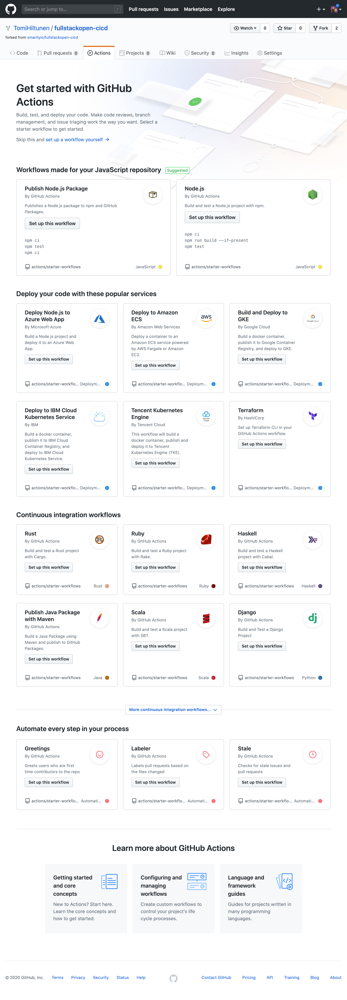
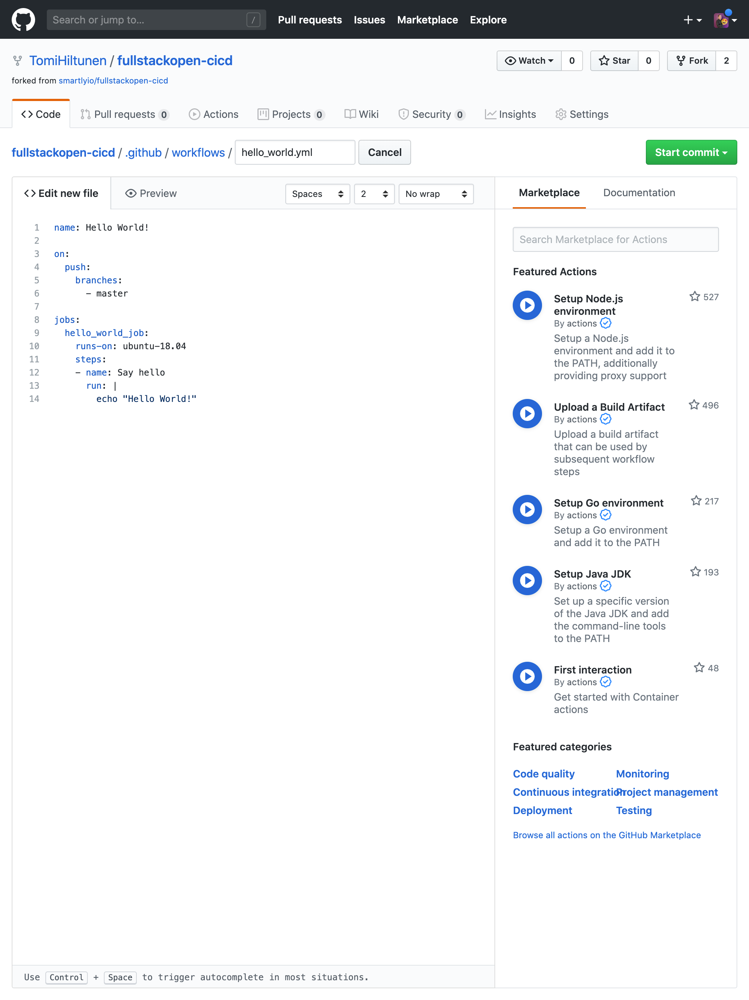
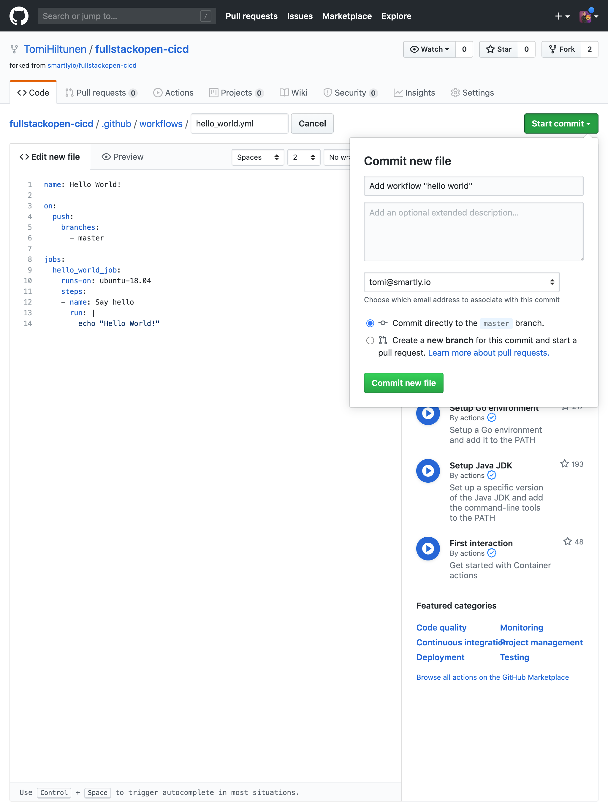
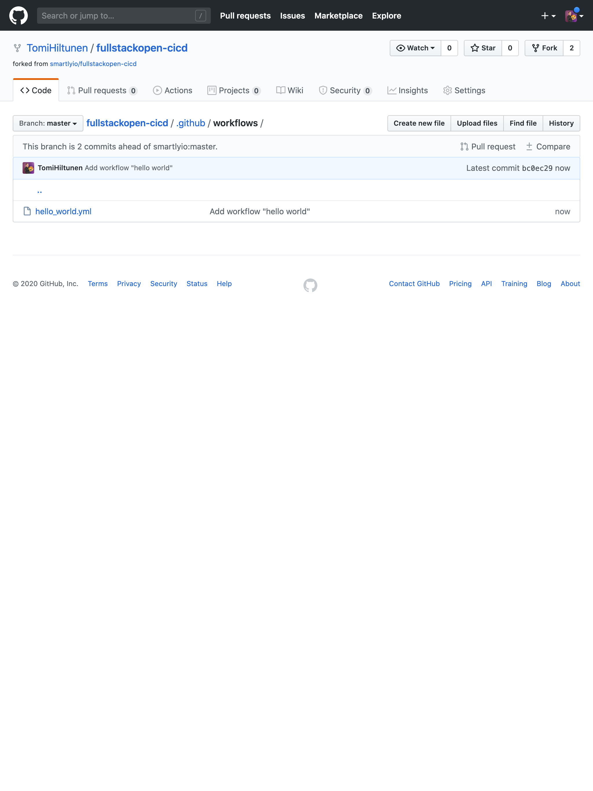
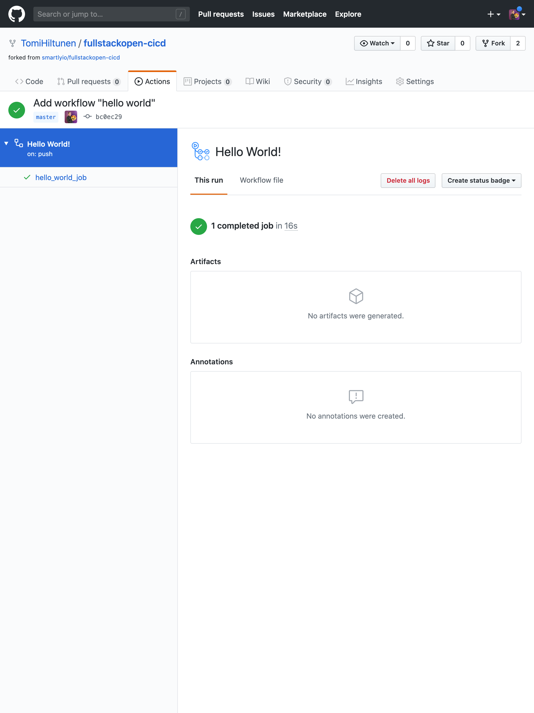
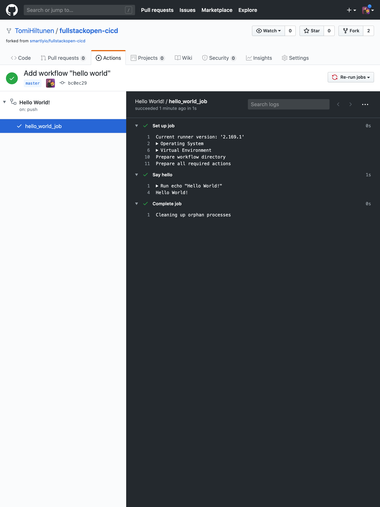

<div class="content">

Before we start playing with GitHub Actions, let's have a look at what they are and how they work.

GitHub Actions work on a basis of workflows. **A workflow is a series of jobs that are run when a certain triggering event happens.** The jobs that are run then themselves contain instructions for what GitHub Actions should do.

### Step By Step

A typical execution of a workflow looks like this:

- Triggering event happens (for example, there is a push to master branch).
- The workflow that has that trigger is executed.
- Cleanup

### Basic needs

In general, in order to have CI operate on a repo, we need a few things:

- A repo (obviously)
- Some definition of what the CI needs to do:
  This can be in the form of a specific file inside the repo or it can be defined in the CI system
- The CI needs to be aware that the repo (and the file within it) exist
- The CI needs to be able to access the repo.
- The CI needs permissions to perform the actions it is supposed to be able to do:
  For example, if the CI needs to be able to deploy to a production environment, it needs credentials for that environment.

That's the traditional model at least, we'll see in a minute how GitHub Actions short-circuit some of these steps (or rather make it such that you don't have to worry about them) but first, let's have a quick look at what Jenkins would need to meet all of these conditions.

### Jenkins as a checklist of needs

Jenkins workflows are defined by a file called `Jenkinsfile` in the root of the repository (very creative I know, but at least it's logical). This file defines what the requirements for running a job are (for example, if the job needs a specific server to run on, this can be defined). It also defines what specific actions need to be carried out under which circumstances and what order they should be carried out in.

In a simple setup, Jenkins would have to be told to pull the repo and look for a Jenkins file. In order for this to work, the Jenkins server needs to have credentials in its credentials store to be able to putt from git. This same credentials store would likely also store any credentials for deployment.

We can see that Jenkins does indeed meet all of the requirements we listed above, so, what about GitHub Actions?

### How GitHub Actions meet their basic needs

GitHub Actions have a great advantage over Jenkins (or other self hosted solutions), because the repo is hosted with the CI provider. In other words, Github provides both the repo and the CI platform. This means that if we've enabled actions for a repo, GitHub is already aware of the fact that we have workflows defined and what those definitions look like.

### Fork the code

First thing you'll want to do is to fork the example repository under your name. What it essentially does is it creates a copy of the repository under your GitHub user profile for your own use. In this module, all of the exercises will be using [this example project repository](https://github.com/smartlyio/fullstackopen-cicd). To fork the repository, you can click on the Fork button in the top-right area of the repository view next to the Star button.

> Insert screenshot of Fork button here

Once you've clicked on the Fork button, GitHub will start the creation of a new repository called `{github_username}/fullstackopen-cicd`.

Once the process has been finished, you should be redirected to your brand new repository!

You might notice that the test project contains some broken tests and linting errors. Just leave them as they are for now. We will get around those later in the exercises.

### Getting started with workflows

The core component of creating CI/CD pipelines with GitHub actions is something called a Workflow. Workflows are process flows that you can set up in your repository to run automated tasks such as building, testing, linting, releasing and deploying to name a few! The hierarchy of a workflow is presented chart X.

Workflow

- Job
  - Step
  - Step
- Job
  - Step

Each workflow must specify at least one Job, which contains a set of Steps to perform individual tasks. The jobs will be run in parallel and the steps in each job will be executed sequentially. Steps can vary from running a custom command to using pre-defined actions, thus the name GitHub Actions. You can create customised actions or use any actions published by the community, which are plenty, but let's get back to that later!

In order for GitHub to recognise your workflows, they must be specifed in `.github/workflows` folder in your repository. Each Workflow is its own separate file which needs to be configured using the `YAML` data-serialization language.

YAML is a recursive acronym for "YAML Ain't Markup Language". As the name might hint it's goal is to be human-readable and it is commonly used for configuration files. You will notice below that it is indeed very easy to understand!

Notice that indentations are important in YAML. You can learn more about the syntax [here](https://docs.ansible.com/ansible/latest/reference_appendices/YAMLSyntax.html).

A basic workflow contains three elements in a YAML document. These three elements are:

- name: Yep, you guessed it, the name of the workflow
- (on) triggers: The events that trigger the workflow to be executed
- jobs: The separate jobs that the workflow will execute (a basic workflow might contain only one job).

```yml
name: Hello World!

on:
  push:
    branches:
      - master

jobs:
  hello_world_job:
    runs-on: ubuntu-18.04
    steps:
      - name: Say hello
        run: |
          echo "Hello World!"
```

In this example the trigger is push to the master branch. There is one job named "hello_world_job", it will be run in a virtual environment with Ubuntu 18.04. The job has just one step named "Say hello", which will run the `echo "Hello World!"` command in the shell.

So you may ask, when does GitHub trigger a workflow to be started? There are plenty of options to choose from, but generally speaking you can configure a workflow to start once:

- An event on GitHub occurs such as when someone pushes a commit to a repository or when an issue or pull request is created.
- A scheduled event begins which you can specify using `cron`.
- An external event occurs, for example a command is performed in `Slack`.

To learn more about which events can be used to trigger workflows, please refer to GitHub's documentation.

To tie this all together, we have set up an example to the repository you've forked so have a look to see a fully configured workflow!

</div>

<div class="tasks">

### Exercise 11.1

#### 11.1: Hello world!

Before this exercise, you should have forked the [example repository](https://github.com/smartlyio/full-stack-open-pokedex) for your own use. In this exercise your goal is to create a super simple workflow to get the feel of how to start building workflows with GitHub Actions.

Create a new Workflow which outputs "Hello World!" to the user.

In this exercise you will set up the very first GitHub Action workflow for your newly forked repository. If you navigate to the "Actions" tab on your repository's navigation you will find the view that contains just suggestions for what to do with GitHub Actions. You want to click on the "Set up a workflow yourself" link.

> TODO: Clean up the screenshot for public use.



The workflow editor opens up with some example content. Replace the content with code for "Hello world" workflow. Remember to also rename the workflow into something recognisable, like `hello_world.yml`.

> TODO: Clean up the screenshot for public use.



The next thing to do is to save the workflow. GitHub Actions uses files saved in your repository at `.github/workflows/<your_workflow>.yml` as instructions. Effectively, saving the workflow from the GitHub web UI you are actually committing the workflow as a file in your repository.

> TODO: Clean up the screenshot for public use.



So, you have now created a workflow that should echo "Hello World!" in the console when triggered by a push to the master branch. Let's take a look at how it works by entering the "Actions" tab in your repository again. This time you should see a very different kind of view.

> TODO: Clean up the screenshot for public use.



You should see your workflow named "Hello World!" on the left side navigation. On the right you should see the commit that triggered your workflow. Now click on the commit to see what happened during the execution of your workflow.

> TODO: Clean up the screenshot for public use.



You should see the jobs associated to this workflow and their statuses on the left side. With this workflow you only have one job called "hello_world_job". The green checkmark next to the name indicates that the job has been run successfully. Click on the job to see the output.

> TODO: Clean up the screenshot for public use.



You should see the "Hello World!" message echoed in the console. If that's the case then you have successfully gone through all the necessary steps. You have your first GitHub Actions workflow active! 👏

</div>

<div class="content">

### Adding more beef around the workflow: set up lint, build, test.

After completing the first exercise, you should have a simple but useless workflow set up. To make it useful, a bit more stuffings will be added to make it valuable. Let's make our workflow do something useful.

Let's implement a Github Action that will lint the code, build it and run the tests automatically when you create a pull request. If the checks don't pass, Github Actions will show a red status and will not allow merging the pull request. We will continue working with the same project from the previous exercise, which has linting, building and testing tasks set up (see `package.json` if you're interested to know more).

Before we can run a command to lint the code, we have to perform a couple of actions to set up the environment of the job.

#### Setting up the environment

Setting up the environment is an important task while configuring a pipeline. We're going to use an `ubuntu-18.04` virtual environment, because this is the version of Ubuntu we're going to be running in production. 18.04 is an LTS (long term support) version. It is important to replicate the same environment in CI as in production as closely as possible, to avoid situations where the same code works differently in CI and production, which would effectively defeat the purpose of using CI.

Next we list the steps in the "build" job that the CI would need to perform. First it must checkout the code from git. `uses` keyword tells the workflow to run a specific action. An action is a reusable piece of code, like a function. Actions can be defined in your repository in a separate file or you can use the ones available in public repositories. Here we're using a public action `checkout` and we specify a version (`@v2`) to avoid potential breaking changes if a public action gets updated. The `checkout` action does what the name implies: it checkouts the project source code from git.

Secondly, as the application is written in Javascript, Node.js must be set up in order to be able to utilise the commands that are specified in `package.json`. To set up Node.js, `actions/setup-node` action can be used. Version `12.x` is selected because it is the version the application is using.

Lastly, the dependencies of the application must be installed. Just like on your own machine we execute `npm install`. The steps in the job should now look something like

```yml
jobs:
  super_simple_job:
    runs-on: ubuntu-18.04
    steps:
      - uses: actions/checkout@v2
      - uses: actions/setup-node@v1
        with:
          node-version: "12.x"
      - name: npm install
        run: npm install
```

Now the environment should be completely ready for the job to run actual important tasks in!

#### Lint, build and test

After the environment has been set up we can run all the scripts from `package.json` like we would on our own machine. To lint the code all you have to do is add a step to run the `npm run eslint` command.

```yml
    - name: lint
      run: npm run eslint
```

Similarly add commands for build and test (in this order as running the tests requires the code to be built).

```yml
    - name: build
      run: npm run build
    - name: test
      run: npm test
```

</div>

<div class="tasks">

### Exercise 11.2

Implement the "Lint, build and test" workflow and commit it to the repository. Navigate to "Actions" tab and click on your newly created workflow on the left. You should see that the workflow run has failed. Open up the logs and investigate.

> TODO: cleanup these screenshots


There are a couple of issues in the Pokedex repository that you will need to fix. Find them based on the workflow run output and commit the changes, which will cause the workflow to run again. Once you have fixed all the issues and the Pokedex is bug-free, the workflow run will succeed and show green!


> TODO: What do we make them submit as the answer? Screenshot of passing checks? Should be consistent for all exercises.

</div>
