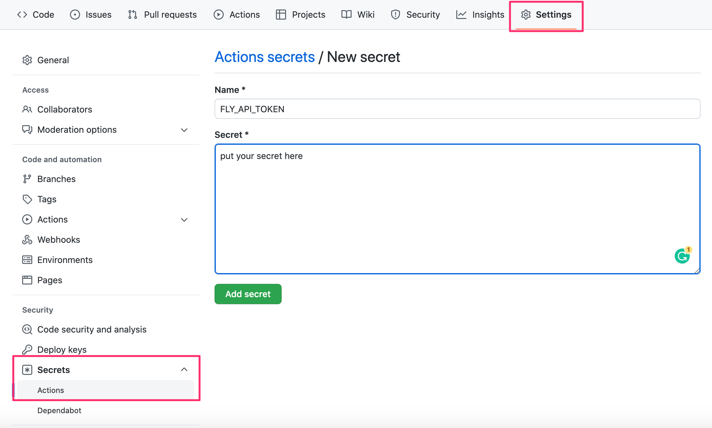
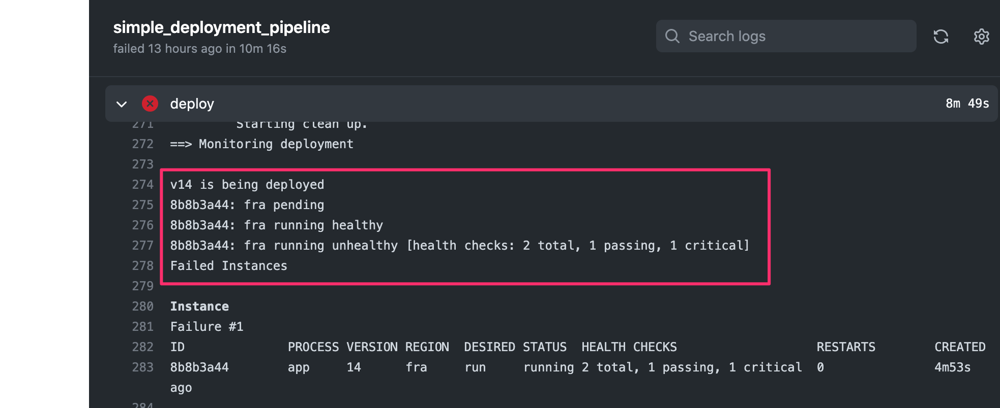
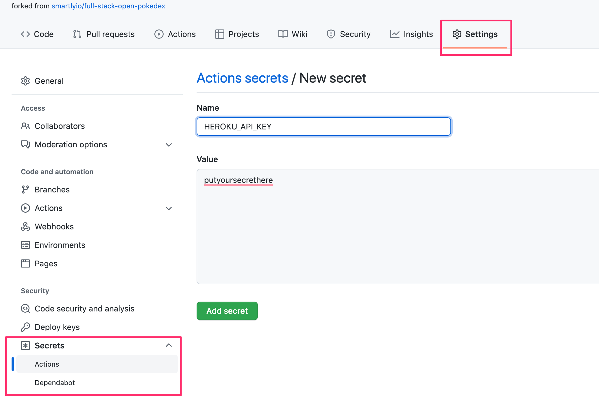
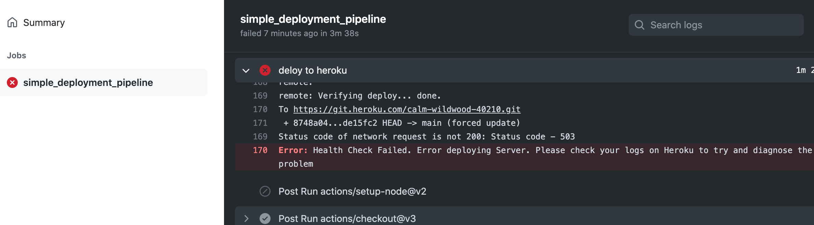
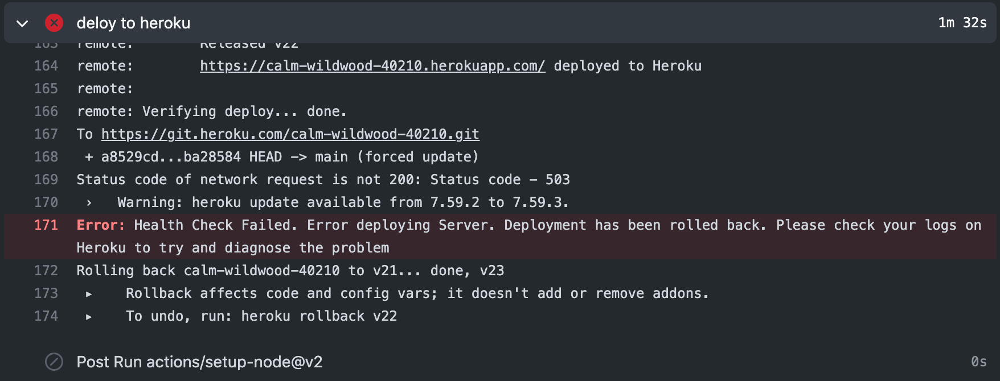

<div class="content">

Having written a nice application it's time to think about how we're going to deploy it to the use of real users. 

In [part 3](/en/part3/deploying_app_to_internet) of this course, we did this by simply by running a single command from terminal to get the code up and running the servers of the cloud provider [Fly.io](https://fly.io/) or [Heroku](https://www.heroku.com/home).

It is pretty simple to release software in Fly.io and Heroku at least compared to many other types of hosting setups but it still contains risks: nothing prevents us from accidentally pushing broken code to production.

Next, we're going to look at the principles of making a deployment safely and some of the principles of deploying software on both a small and large scale. 

### Anything that can go wrong...

We'd like to define some rules about how our deployment process should work but before that, we have to look at some constraints of reality.

One on the phrasing of Murphy's Law holds that:
  "Anything that can go wrong will go wrong."

It's important to remember this when we plan out our deployment system. Some of the things we'll need to consider could include:
 - What if my PC crashes or hangs during deployment?
 - I'm connected to the server and deploying over the internet, what happens if my internet connection dies?
 - What happens if any specific instruction in my deployment script/system fails?
 - What happens if, for whatever reason, my software doesn't work as expected on the server I'm deploying to? Can I roll back to a previous version?
 - What happens if a user does an HTTP request to our software just before we do deployment (we didn't have time to send a response to the user)?

These are just a small selection of what can go wrong during a deployment, or rather, things that we should plan for. Regardless of what happens, our deployment system should **never** leave our software in a broken state. We should also always know (or be easily able to find out) what state a deployment is in.

Another important rule to remember when it comes to deployments (and CI in general) is:
  "Silent failures are **very** bad!"

This doesn't mean that failures need to be shown to the users of the software, it means we need to be aware if anything goes wrong. If we are aware of a problem, we can fix it, if the deployment system doesn't give any errors but fails, we may end up in a state where we believe we have fixed a critical bug but the deployment failed, leaving the bug in our production environment and us unaware of the situation.

### What does a good deployment system do?

Defining definitive rules or requirements for a deployment system is difficult, let's try anyway:
 - Our deployment system should be able to fail gracefully at **any** step of the deployment.
 - Our deployment system should **never** leave our software in a broken state.
 - Our deployment system should let us know when a failure has happened. It's more important to notify about failure than about success.
 - Our deployment system should allow us to roll back to a previous deployment
   - Preferably this rollback should be easier to do and less prone to failure than a full deployment
   - Of course, the best option would be an automatic rollback in case of deployment failures
 - Our deployment system should handle the situation where a user makes an HTTP request just before/during a deployment.
 - Our deployment system should make sure that the software we are deploying meets the requirements we have set for this (e.g. don't deploy if tests haven't been run).

Let's define some things we **want** in this hypothetical deployment system too:
 - We would like it to be fast
 - We'd like to have no downtime during the deployment (this is distinct from the requirement we have for handling user requests just before/during the deployment).

Next we will have two sets of exercises for automazing the deployment with GitHub Actions, one for those who want to use [Fly.io](https://fly.io/) and one for those who want to use [Heroku](https://heroku.com) for the deployment.  The process of deployment is always specific to the particular cloud provider, so you can also do the both the exercise sets if you want to see the differences how these services work with respect to deployments.

</div>

<div class="tasks">

### Exercises 11.10-11.12. (Fly.io)

Before going to the below exercises, you should setup your application in [Fly.io](https://fly.io/) hosting service like the one we did in [part 3](/en/part3/deploying_app_to_internet#application-to-the-internet).

If you rather want to use Heroku, there is an [alternative set of exercises](/en/part11/deployment/#exercises-11-10-11-12-heroku) for that.

In contrast to part 3 now we <i>do not deploy the code</i> to Fly.io ourselves (with the command <i>flyctl deploy</i>), we let the GitHub Actions workflow do that for us!

Create a new app in Fly.io and after that generate a Fly.io API token with command

```bash
flyctl auth token
```

You'll need the token soon for your deployment workflow!

Before setting up the deployment pipeline let us ensure that a manual deployment with the command <i>flyctl deploy</i> works.

You most likely need to do at least two changes. Firstly, define the Node version to use in the file <i>package.json</i> to match one used in your machine. For me it is 16.13.2:

```json
{
  // highlight-start
  "engines" : { 
    "node" : "16.13.2" 
  },
  // highlight-end
  "name": "fullstackopen-cicd",
  "version": "1.0.0",
  "description": "Full Stack Open",
  // ...
}
```

The configuration file <i>fly.toml</i> should also be modified to include the following:

```yml
[deploy]
  release_command = "npm run build"

[processes]
  app = "node app.js"
```


The <i>release\_command</i> under [deploy](https://fly.io/docs/reference/configuration/) now ensures that the production built will be done before starting up the app. In [processes](https://fly.io/docs/reference/configuration/#the-processes-section) we define the command that starts the application. Without these changes Fly.io just starts the React dev server and that causes it to shut down since the app itself does not start up.

Here the <i>app</i> refers to the application process that is started up in the [services](https://fly.io/docs/reference/configuration/#the-services-sections) section:

```yml
[[services]]
  http_checks = []
  internal_port = 8080
  processes = ["app"]  // highlight-line
```

#### 11.10 Deploying your application to Fly.io

Before starting this exercise, make sure that the manual deployment with the command <i>flyctl deploy</i> works!

Extend the workflow with a step to deploy your application to Fly.io by following the advice given [here](https://fly.io/docs/app-guides/continuous-deployment-with-github-actions/).

You need the authorization token that you just created for the deployment. The proper way to pass it's value to GitHub Actions is to use repository secrets:



Now the workflow can access the token value as follows:

```
${{secrets.FLY_API_TOKEN}}
```

If all goes well, your workflow log should look a bit like this:


You can then try the app with a browser, but most likely you run into a problem. If we read carefully [the section 'Application to the Internet' in part 3](/en/part3/deploying_app_to_internet#application-to-the-internet)

**Remember** that it is always essential to keep an eye on what is happening in server logs when playing around with product deployments, so use <code>flyctl logs</code> early and use it often. No, use it all the time!

#### 11.11 Health check and rollback

Each deployment in Fly.io creates a [release](https://fly.io/docs/flyctl/releases/). Releases can be checked from the command line:

```bash
$ flyctl releases
VERSION	STABLE	TYPE    	STATUS   	DESCRIPTION            	USER           	DATE
v13    	true  	release 	succeeded	Deploy image           	mluukkai@iki.fi	30m6s ago
v12    	true  	release 	succeeded	Deploy image           	mluukkai@iki.fi	51m30s ago
v11    	true  	release 	succeeded	Deploy image           	mluukkai@iki.fi	59m25s ago
v10    	true  	release 	succeeded	Deploy image           	mluukkai@iki.fi	1h6m ago
```

It is essential to ensure that a deployment ends up to a <i>succeeding</i> release, where the app is in healthy functional state. Fortunately Fly.io has several configuration options that take care of the application health check.

The default fly.toml has already a section [
services.tcp_checks](https://fly.io/docs/reference/configuration/#services-tcp_checks) 

```yml
  [[services.tcp_checks]]
    grace_period = "1s"
    interval = "15s"
    restart_limit = 0
    timeout = "2s"
```

This section defines a basic health check of the deployment. The tcp check ensures that the virtual machine where the app resides is up and running and reachable from outside, by opening a [TCP](https://en.wikipedia.org/wiki/Transmission_Control_Protocol) connection to the virtual machine. 

This check notices if something is fundamentally broken in the configurations. E.g. in my case for the app of this part, it took several trials until I got the app up and running:

```bash
$ fly releases
VERSION	STABLE	TYPE    	STATUS   	DESCRIPTION            	USER           	DATE
v4     	true  	release 	succeeded	Deploy image           	mluukkai@iki.fi	5h39m ago
v3     	false 	release 	failed   	Deploy image           	mluukkai@iki.fi	5h50m ago
v2     	false 	release 	failed   	Deploy image           	mluukkai@iki.fi	5h57m ago
v1     	false 	release 	failed   	Deploy image           	mluukkai@iki.fi	6h12m ago
v0     	false 	release 	failed   	Deploy image           	mluukkai@iki.fi	6h19m ago
```

So finally in the 5th deployment (version v4) I got the configuration right and that ended in a succeeding release.

Besides the rudimentary TCP health check, it is extremely beneficial to have also some "application level" health checks that ensure that the app for real is in functional state. One possibility for this is a HTTP-level check defined in section [
services.http_checks](https://fly.io/docs/reference/configuration/#services-tcp_checks) that can be used to ensure that the app is responding to the HTTP requests.

Add a simple endpoint for doing an application health check to the backend. You may e.g. copy this code:

```js
app.get('/health', (req, res) => {
  res.send('ok')
})
```

Configure then a [HTTP-check](https://fly.io/docs/reference/configuration/#services-tcp_checks)  that ensures the health of the depyments based on the HTTP request to the defined health check endpoint.

Note that the default fly.toml has defined that <i>http\_checks</i> is an empty array. You need to remove this line when you are adding a manually defined HTTP-check:

```yml
[[services]]
  http_checks = [] # highlight-line
```

It might also be a good idea to have a dummy endpoint in the app that makes it possible to do some code changes and to ensure that the deployed version has really changed:

```js
app.get('/version', (req, res) => {
  res.send('1') // change this string to ensure a new version deployed
})
```

Ensure that Actions notices if a deployment breaks your application:



You may simulate this e.g. as follows:

```js
app.get('/health', (req, res) => {
  throw 'error...'
  // eslint-disable-next-line no-unreachable
  res.send('ok')
})
```

As can be seen in the command line, when a deployment fails, Fly.io rolls back to the previous working release:

```bash
$ fly releases
VERSION	STABLE	TYPE    	STATUS   	DESCRIPTION            	USER           	DATE
v15    	true  	rollback	succeeded	Reverting to version 13	               	16m48s ago
v14    	false 	release 	failed   	Deploy image           	mluukkai@iki.fi	21m53s ago
v13    	true  	release 	succeeded	Deploy image           	mluukkai@iki.fi	30m6s ago
v12    	true  	release 	succeeded	Deploy image           	mluukkai@iki.fi	51m30s ago
v11    	true  	release 	succeeded	Deploy image           	mluukkai@iki.fi	59m25s ago
v10    	true  	release 	succeeded	Deploy image           	mluukkai@iki.fi	1h6m ago
```

So despite the problems in the relese, the app stays functional!

Before moving to next exercise, fix your deployment and ensure that the application works again as intended.

#### 11.12. Custom health check

Besides TCP and HTTP based health checks, Fly.io allows to use very flexible shell script based health checks. The feature is still undocumented but e.g. [this](https://community.fly.io/t/verifying-services-script-checks-is-supported/1464) shows you how to use it.

Create a file <i>health\_check.sh</i> with the following content:

```bash
#!/bin/bash

echo "Hello from shell script"

exit 1 # exit status 1 means that the script "fails"
```

Give it execution permissions (Google or see e.g. [this](https://www.guru99.com/file-permissions.html) to find out how) and ensure that you can run it from the command line:

```bash
$ ./health_check.sh
Hello from shell script
```

Define a health check to your app that runs the script in the file <i>health\_check.sh</i>. Ensure that this health check and deployment fails. After that, change the script as follows:

```bash
#!/bin/bash

echo "Hello from shell script"

exit 0  # exit status 0 means that the script "succeeds"
```

Ensure now that the deployment works. Note that to get the path to the script file right, it may be beneficial to log in to your virtual machine console to see where the files reside. Logging in is done with the command

```bash
flyctl ssh console -t YOUR_AUTH_TOKEN
```

Now when you know that the script based health check works, it is time to define the real health check.

<i>Write a script ensuring the health check endpoint (that is, the GET request to '/health') not only works, but also returns the correct string 'ok'.</i>

You propably should use [curl](https://curl.se/) in the script to do the HTTP request. You most likely need to Google how to get hold to the returned string and compare it with the expected value 'ok'.

It is <strong>storngly advisable</strong> to check first locally that the script works since so many things can go wrong in it, and when run in GitHub Action, you can not do any debug printing. If and <i> when</i> things do not work as indended, it is also a very good idea to log in to the virtual machine (with <i>flyctl ssh console</i>) and check that the script works when runned manually there.

*Note* that in order to test the script in the virtual machine, you should have the script in your local directory when you make a successful deployment. So if your deployment fails, the script will not be uploaded to the Fly.io server. So in case of problems, comment out the script based health check from fly.toml and do a deployment to get your script to the virtual machine.

Our script based healt check is hardly meaningful in real life since it does essentially the same that is achievable with the simple HTTP check. The example here is just to show that the mechanism exists. Unlike with HTTP checks, with script based health checks you can in principle write an anrbitrarily compled and many sided health check to your app, should you need one.

</div>

<div class="tasks">

### Exercises 11.10-11.12. (Heroku)

Before going to the below exercises, you should setup your application in [Heroku](heroku.com) hosting service like the one we did in [part 3](/en/part3/deploying_app_to_internet#application-to-the-internet).

If you rather want to use Fly.io for hosting, there is an [alternative set of exercises](/en/part11/deployment/#exercises-11-10-11-12-fly-io) for that.

In contrast to part 3 now we <i>do not push the code</i> to Heroku ourselves, we let the Github Actions workflow do that for us!

Ensure now that you have [Heroku CLI](https://devcenter.heroku.com/articles/heroku-cli#download-and-install) installed and login to Heroku using the CLI with <code>heroku login</code>.

Create a new app in Heroku using the  CLI: <code>heroku create --region eu {your-app-name}</code>, pick a [region](https://devcenter.heroku.com/articles/regions) close to your own location! (You can also leave the app blank and Heroku will create an app name for you.)

Generate an API token for your Heroku profile using command <code>heroku authorizations:create</code>, and save the credentials to a local file but <i>**do not push those to GitHub**</i>!

You'll need the token soon for your deployment workflow. See more information at about Heroku tokens [here](https://devcenter.heroku.com/articles/platform-api-quickstart).

#### 11.10 Deploying your application to Heroku

Extend the workflow with a step to deploy your application to Heroku.

The below assumes that you use the ready-made Heroku deploy action [AkhileshNS/heroku-deploy](https://github.com/AkhileshNS/heroku-deploy) that has been developed by the community.

You need the authorization token that you just created for the deployment. The proper way to pass it's value to GitHub Actions is to use repository secrets:



Now the workflow can access the token value as follows:

```
${{secrets.HEROKU_API_KEY}}
```

If all goes well, your workflow log should look a bit like this:


You can then try the app with a browser, but most likely you run into a problem. If we read carefully [the section 'Application to the Internet' in part 3](/en/part3/deploying_app_to_internet#application-to-the-internet) we notice that Heroku assumes that the repository has a file called <i>Procfile</i> that tells Heroku how to start the application. 

So, add a proper Procfile and ensure that the application starts properly. 

**Remember** that it is always essential to keep an eye on what is happening in server logs when playing around with product deployments, so use <code>heroku logs</code> early and use it often. No, use it all the time!

#### 11.11 Health check

Before moving on let us expand the workflow with one more step, a check that ensures that the application is up and running after the deployment. 

Actually a separate workflow step is not needed, since the action
[deploy-to-heroku](https://github.com/marketplace/actions/deploy-to-heroku) contains an option that takes care of it.

Add a simple endpoint for doing an application health check to the backend. You may e.g. copy this code:

```js
app.get('/health', (req, res) => {
  res.send('ok')
})
```

It might also be a good idea to have a dummy endpoint in the app that makes it possible to do some code changes and to ensure that the deployed version has really changed:

```js
app.get('/version', (req, res) => {
  res.send('1') // change this string to ensure a new version deployed
})
```

Look now from the [documentation](https://github.com/marketplace/actions/deploy-to-heroku) how to include the health check in the deployment step. Use the created endpoint for the health check url. You most likely need also the <i>checkstring</i> option to get the check working.

Ensure that Actions notices if a deployment breaks your application. You may simulate this e.g. by writing a wrong startup command to Procfile:



Before moving to next exercise, fix your deployment and ensure that the application works again as intended.

#### 11.12. Rollback

If the deployment results in a broken application, the best thing to do is to <i>roll back</i> to the previous release. Luckily Heroku makes this pretty easy. Every deployment to Heroku results in a [release](https://blog.heroku.com/releases-and-rollbacks#releases). You can see your application's releases with the command <code>heroku releases</code>:

```js
$ heroku releases
=== calm-wildwood-40210 Releases - Current: v8
v8  Deploy de15fc2b  mluukkai@iki.fi  2022/03/02 19:14:22 +0200 (~ 8m ago)
v7  Deploy 8748a04e  mluukkai@iki.fi  2022/03/02 19:06:28 +0200 (~ 16m ago)
v6  Deploy a617a93d  mluukkai@iki.fi  2022/03/02 19:00:02 +0200 (~ 23m ago)
v5  Deploy 70f9b219  mluukkai@iki.fi  2022/03/02 18:48:47 +0200 (~ 34m ago)
v4  Deploy 0b2db00d  mluukkai@iki.fi  2022/03/02 17:53:24 +0200 (~ 1h ago)
v3  Deploy f1cd250b  mluukkai@iki.fi  2022/03/02 17:44:32 +0200 (~ 1h ago)
v2  Enable Logplex   mluukkai@iki.fi  2022/03/02 17:00:26 +0200 (~ 2h ago)
v1  Initial release  mluukkai@iki.fi  2022/03/02 17:00:25 +0200 (~ 2h ago)
```

One can quickly do a [rollback](https://blog.heroku.com/releases-and-rollbacks#rollbacks) to a release with just a single command from commandline. 

What is even better, is that the action [deploy-to-heroku](https://github.com/marketplace/actions/deploy-to-heroku) can take care of the rollback for us!

So read again the [documentation](https://github.com/marketplace/actions/deploy-to-heroku) and modify the workflow to prevent a broken deployment altogether. You can again simulate a broken deployment with breaking the Procfile:



Ensure that the application stays still operational despite a broken deployment. 

Note that despite the automatic rollback operation, the build fails and when this happens in real life it is <i> essential</i> to find what caused the problem and fix it quickly. As usual, the best place to start finding out the cause of the problem is to study Heroku logs:


</div>
