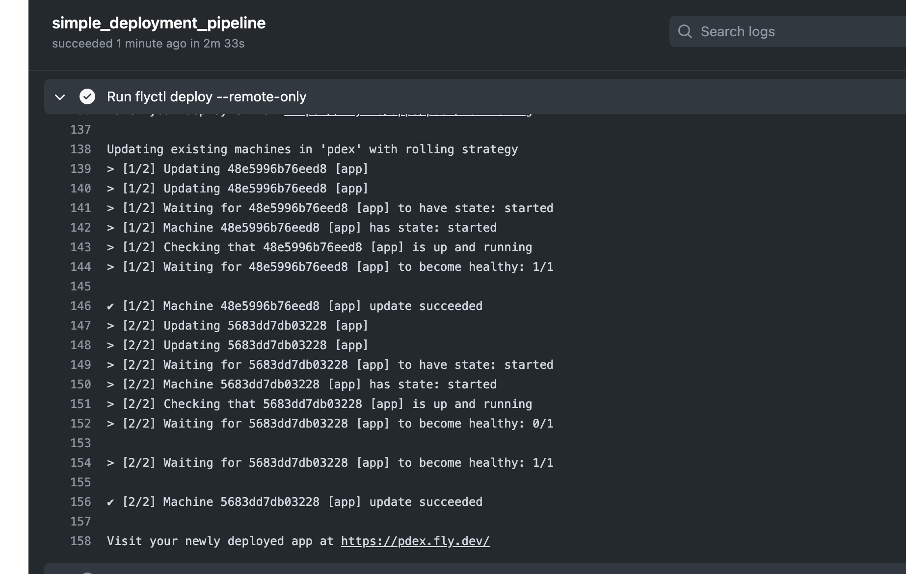
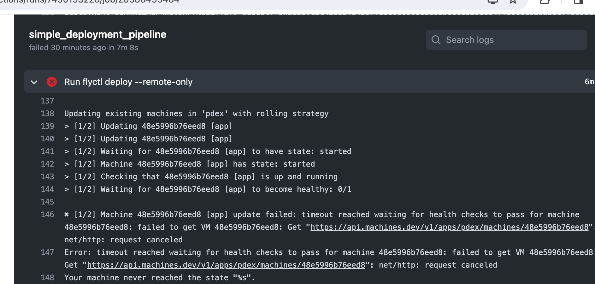
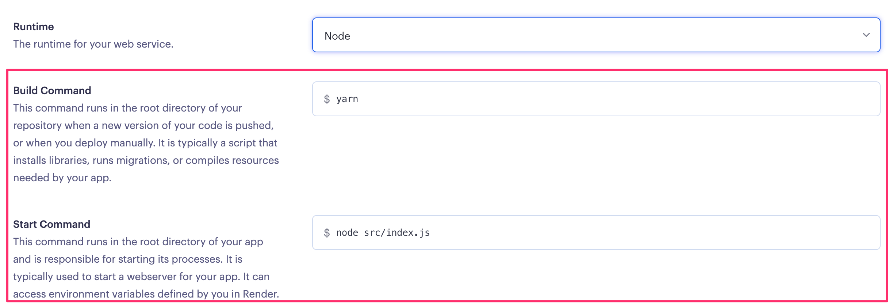
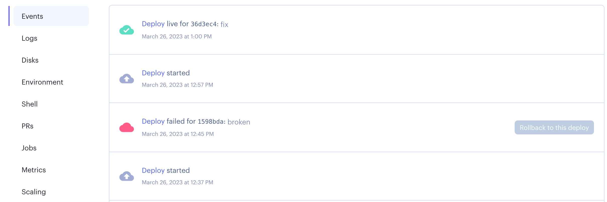

<div class="content">

Having written a nice application it's time to think about how we're going to deploy it to the use of real users. 

In [part 3](/en/part3/deploying_app_to_internet) of this course, we did this by simply running a single command from terminal to get the code up and running the servers of the cloud provider [Fly.io](https://fly.io/) or [Render](https://render.com/).

It is pretty simple to release software in Fly.io and Render at least compared to many other types of hosting setups but it still contains risks: nothing prevents us from accidentally releasing broken code to production.

Next, we're going to look at the principles of making a deployment safely and some of the principles of deploying software on both a small and large scale. 

### Anything that can go wrong...

We'd like to define some rules about how our deployment process should work but before that, we have to look at some constraints of reality.

One on the phrasing of Murphy's Law holds that:
  "Anything that can go wrong will go wrong."

It's important to remember this when we plan out our deployment system. Some of the things we'll need to consider could include:
 - What if my computer crashes or hangs during deployment?
 - I'm connected to the server and deploying over the internet, what happens if my internet connection dies?
 - What happens if any specific instruction in my deployment script/system fails?
 - What happens if, for whatever reason, my software doesn't work as expected on the server I'm deploying to? Can I roll back to a previous version?
 - What happens if a user does an HTTP request to our software just before we do deployment (we didn't have time to send a response to the user)?

These are just a small selection of what can go wrong during a deployment, or rather, things that we should plan for. Regardless of what happens, our deployment system should **never** leave our software in a broken state. We should also always know (or be easily able to find out) what state a deployment is in.

Another important rule to remember when it comes to deployments (and CI in general) is:
  "Silent failures are **very** bad!"

This doesn't mean that failures need to be shown to the users of the software, it means we need to be aware if anything goes wrong. If we are aware of a problem, we can fix it. If the deployment system doesn't give any errors but fails, we may end up in a state where we believe we have fixed a critical bug but the deployment failed, leaving the bug in our production environment and us unaware of the situation.

### What does a good deployment system do?

Defining definitive rules or requirements for a deployment system is difficult, let's try anyway:
 - Our deployment system should be able to fail gracefully at **any** step of the deployment.
 - Our deployment system should **never** leave our software in a broken state.
 - Our deployment system should let us know when a failure has happened. It's more important to notify about failure than about success.
 - Our deployment system should allow us to roll back to a previous deployment
   - Preferably this rollback should be easier to do and less prone to failure than a full deployment
   - Of course, the best option would be an automatic rollback in case of deployment failures
 - Our deployment system should handle the situation where a user makes an HTTP request just before/during a deployment.
 - Our deployment system should make sure that the software we are deploying meets the requirements we have set for this (e.g. don't deploy if tests haven't been run).

Let's define some things we **want** in this hypothetical deployment system too:
 - We would like it to be fast
 - We'd like to have no downtime during the deployment (this is distinct from the requirement we have for handling user requests just before/during the deployment).

Next we will have three sets of exercises for automazing the deployment with GitHub Actions, one for [Fly.io](https://fly.io/), another one for [Render](https://render.com/). The process of deployment is always specific to the particular cloud provider, so you can also do both the exercise sets if you want to see the differences how these services work with respect to deployments.

### Has the app been deployed?

Since we are not making any real changes to the app, it might be a bit hard to see if the app deployment really works.
Let us create a dummy endpoint in the app that makes it possible to do some code changes and to ensure that the deployed version has really changed:

```js
app.get('/version', (req, res) => {
  res.send('1') // change this string to ensure a new version deployed
})
```

</div>

<div class="tasks">

### Exercises 11.10-11.12. (Fly.io)

If you rather want to use other hosting options, there is an alternative set of exercises for [Render](/en/part11/deployment#exercises-11-10-11-12-render).

#### 11.10 Deploying your application to Fly.io

Setup your application in [Fly.io](https://fly.io/) hosting service like the one we did in [part 3](/en/part3/deploying_app_to_internet#application-to-the-internet).

In contrast to part 3, in this part we <i>do not deploy the code</i> to Fly.io ourselves (with the command <i>flyctl deploy</i>), we let the GitHub Actions workflow do that for us. 

Before going to the automated deployment, we shall ensure in this exercise that the app can be deployed manually.

So, create a new app in Fly.io. After that generate a Fly.io API token with the command

```bash
flyctl auth token
```

You'll need the token soon for your deployment workflow so save it somewhere (but do not commit that to GitHub)!

As said, before setting up the deployment pipeline in the next exercise we will now ensure that a manual deployment with the command <i>flyctl deploy</i> works.

A couple of changes are needed.

The configuration file <i>fly.toml</i> should be modified to include the following:

```yml
[env]
  PORT = "3000" # add this where PORT matches the internal_port below

[processes]
  app = "node app.js" # add this

[http_service]
  internal_port = 3000
  force_https = true
  auto_stop_machines = true
  auto_start_machines = true
  min_machines_running = 0
  processes = ["app"]
```

In [processes](https://fly.io/docs/reference/configuration/#the-processes-section) we define the command that starts the application. Without this change Fly.io just starts the React dev server and that causes it to shut down since the app itself does not start up. We will also set up the PORT to be passed to the app as an environment variable.

We also need to alter the file _.dockerignore_ a bit, the next line should be removed:

```
dist
```

If the line is not removed, the product build of the frontend does not get downloaded to the Fly.io server.

Deployment should now work _if_ the production build exists in the local machine, that is, the command _npm build_ is run.

Before moving to the next exercise, make sure that the manual deployment with the command <i>flyctl deploy</i> works!

#### 11.11 Automatic deployments

Extend the workflow with a step to deploy your application to Fly.io by following the advice given [here](https://fly.io/docs/app-guides/continuous-deployment-with-github-actions/).

Note that the GitHub Action should create the production build (with _npm run build_) before the deployment step!

You need the authorization token that you just created for the deployment. The proper way to pass it's value to GitHub Actions is to use _Repository secrets_:


Now the workflow can access the token value as follows:

```
${{secrets.FLY_API_TOKEN}}
```

If all goes well, your workflow log should look a bit like this:



**Remember** that it is always essential to keep an eye on what is happening in server logs when playing around with product deployments, so use <code>flyctl logs</code> early and use it often. No, use it all the time!

#### 11.12 Health check

Each deployment in Fly.io creates a [release](https://fly.io/docs/flyctl/releases/). Releases can be checked from the command line:

```bash
$ flyctl releases
VERSION	STATUS  	DESCRIPTION	USER           	DATE
v18    	complete	Release    	mluukkai@iki.fi	16h56m ago
v17    	complete	Release    	mluukkai@iki.fi	17h3m ago
v16    	complete	Release    	mluukkai@iki.fi	21h22m ago
v15    	complete	Release    	mluukkai@iki.fi	21h25m ago
v14    	complete	Release    	mluukkai@iki.fi	21h34m ago
```

It is essential to ensure that a deployment ends up in a <i>succeeding</i> release, where the app is in healthy functional state. Fortunately, Fly.io has several configuration options that take care of the application health check.

If we change the app as follows, it fails to start:

```js
app.listen(PORT, () => {
  this_causes_error
  // eslint-disable-next-line no-console
  console.log(`server started on port ${PORT}`)
})
```

In this case, the deployment fails:

```bash
$ flyctl releases
VERSION	STATUS  	DESCRIPTION	USER           	DATE
v19    	failed  	Release    	mluukkai@iki.fi	3m52s ago
v18    	complete	Release    	mluukkai@iki.fi	16h56m ago
v17    	complete	Release    	mluukkai@iki.fi	17h3m ago
v16    	complete	Release    	mluukkai@iki.fi	21h22m ago
v15    	complete	Release    	mluukkai@iki.fi	21h25m ago
v14    	complete	Release    	mluukkai@iki.fi	21h34m ago
```

The app however stays up and running, Fly.io does not replace the functioning version  (v18) with the broken one (v19).

Let us consider the following change

```js
// start app in a wrong port
app.listen(PORT + 1, () => {
  // eslint-disable-next-line no-console
  console.log(`server started on port ${PORT}`)
})
```

Now the app starts but it is connected to the wrong port, so the service will not be functional. Fly.io thinks this is a successful deployment, so it deploys the app in a broken state.

One possibility to prevent broken deployments is to use an HTTP-level check defined in section [http\_service.http_checks](https://fly.io/docs/reference/configuration/#http_service-checks). This type of check can be used to ensure that the app for real is in a functional state. 

Add a simple endpoint for doing an application health check to the backend. You may e.g. copy this code:

```js
app.get('/health', (req, res) => {
  res.send('ok')
})
```

Configure then an [HTTP check](https://fly.io/docs/reference/configuration/#http_service-checks) that ensures the health of the deployments based on the HTTP request to the defined health check endpoint.

You also need to set the [deployment strategy](https://fly.io/docs/reference/configuration/#picking-a-deployment-strategy) (in the file _fly.toml_) of the app to be either <i>canary</i> or <i>bluegreen</i>. These strategies ensure that only an app with a healthy state gets deployed.

Ensure that GitHub Actions notices if a deployment breaks your application:



You may simulate this e.g. as follows:

```js
app.get('/health', (req, res) => {
  // eslint-disable-next-line no-constant-condition
  if (true) throw('error...  ')
  res.send('ok')
})
```

</div>

<div class="tasks">

### Exercises 11.10-11.12. (Render)

If you rather want to use other hosting options, there is an alternative set of exercises for [Fly.io](/en/part11/deployment/#exercises-11-10-11-12-fly-io).

#### 11.10 Deploying your application to Render

Set up your application in [Render](https://render.com/). The setup is now not quite as straightforward as in [part 3](/en/part3/deploying_app_to_internet#application-to-the-internet). You have to carefully think about what should go to these settings:



If you need to run several commands in the build or start command, you may use a simple shell script for that.

Create eg. a file <i>build_step.sh</i> with the following content:

```bash
#!/bin/bash

echo "Build script"

# add the commands here
```

Give it execution permissions (Google or see e.g. [this](https://www.guru99.com/file-permissions.html) to find out how) and ensure that you can run it from the command line:

```bash
$ ./build_step.sh
Build script
```

Other option is to use a [Pre deploy command](https://docs.render.com/deploys#deploy-steps), with that you may run one additional command before the deployment starts.

You also need to open the <i>Advanced settings</i> and turn the auto-deploy off since we want to control the deployment in the GitHub Actions:


Ensure now that you get the app up and running. Use the <i>Manual deploy</i>.

Most likely things will fail at the start, so remember to keep the <i>Logs</i> open all the time.

#### 11.11 Automatic deployments

Next step is to automate the deployment. There are two options, a ready-made custom action or the use of the Render deploy hook.

<strong>Deployment with custom action</strong>

Go to GitHub Actions [marketplace](https://github.com/marketplace) and search for action for our purposes. You might search with <i>render deploy</i>. There are several actions to choose from. You can pick any. Quite often the best choice is the one with the most stars. It is also a good idea to look if the action is actively maintained (time of the last release) and does it has many open issues or pull requests. 

**Warning**: for some reason, the most starred option [render-action](https://github.com/Bounceapp/render-action) was very unreliable when the part was updated (16th Jan 2024), so better avoid that. If you end up with too much problems, the deploy hook might be a better option!

Set up the action to your workflow and ensure that every commit that passes all the checks results in a new deployment. Note that you need Render API key and the app service id for the deployment. See [here](https://render.com/docs/api) how the API key is generated. You can get the service id from the URL of the Render dashboard of your app. The end of the URL (starting with _srv-_) is the id:

```bash
https://dashboard.render.com/web/srv-randomcharachtershere
```

<strong>Deployment with deploy hook</strong>

Alternative, and perhaps a more reliable option is to use [Render Deploy Hook](https://render.com/docs/deploy-hooks) which is a private URL to trigger the deployment. You can get it from your app settings:


DON'T USE the plain URL in your pipeline. Instead create GitHub secrets for your key and service id: 
Then you can use them like this: 
``` bash
- name: Trigger deployment
  run: curl https://api.render.com/deploy/srv-${{ secrets.RENDER_SERVICE_ID }}?key=${{ secrets.RENDER_API_KEY }}
```

The deployment takes some time. See the events tab of the Render dashboard to see when the new deployment is ready:



#### 11.12 Health check

All tests pass and the new version of the app gets automatically deployed to Render so everything seems to be in order. But does the app really work? Besides the checks done in the deployment pipeline, it is extremely beneficial to have also some "application level" health checks ensuring that the app for real is in a functional state.

The [zero downtime deploys](https://docs.render.com/deploys#zero-downtime-deploys) in Render should ensure that your app stays functional all the time! For some reason, this property did not always work as promised when this part was updated (16th Jan 2024). The reason might be the use of a free account.

Add a simple endpoint for doing an application health check to the backend. You may e.g. copy this code:

```js
app.get('/health', (req, res) => {
  res.send('ok')
})
```

Commit the code and push it to GitHub. Ensure that you can access the health check endpoint of your app.

Configure now a <i>Health Check Path</i> to your app. The configuration is done in the settings tab of the Render dashboard.

Make a change in your code, push it to GitHub, and ensure that the deployment succeeds.

Note that you can see the log of deployment by clicking the most recent deployment in the events tab.

When you are set up with the health check, simulate a broken deployment by changing the code as follows:

```js
app.get('/health', (req, res) => {
  // eslint-disable-next-line no-constant-condition
  if (true) throw('error...  ')
  res.send('ok')
})
```

Push the code to GitHub and ensure that a broken version does not get deployed and the previous version of the app keeps running.

Before moving on, fix your deployment and ensure that the application works again as intended.

</div>
