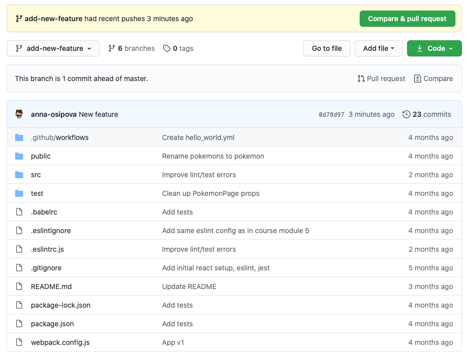
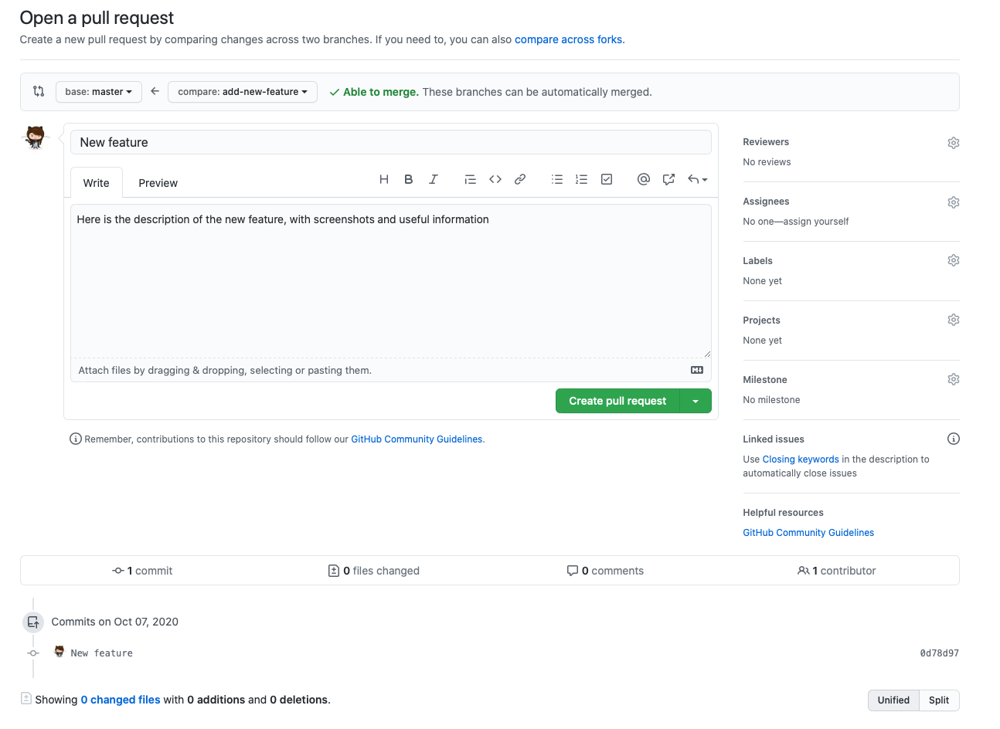
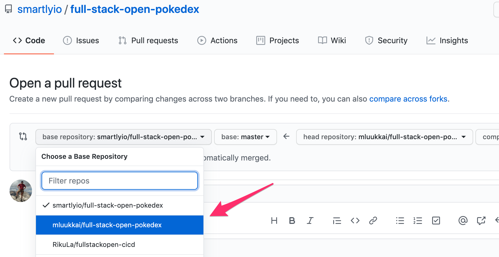
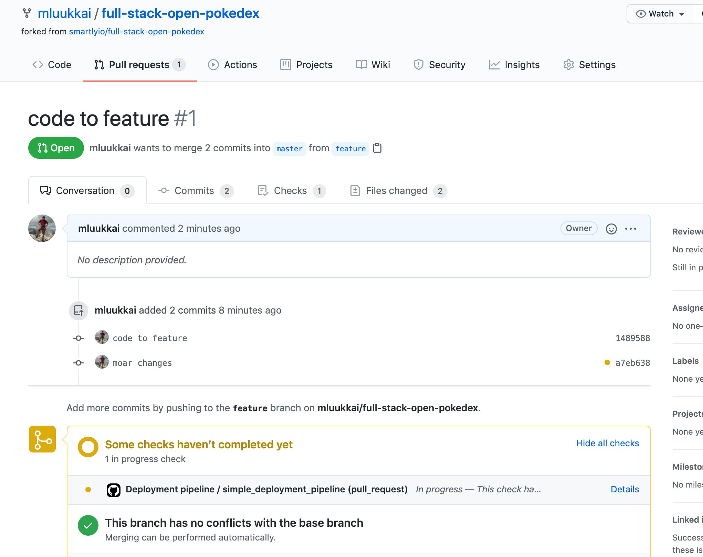
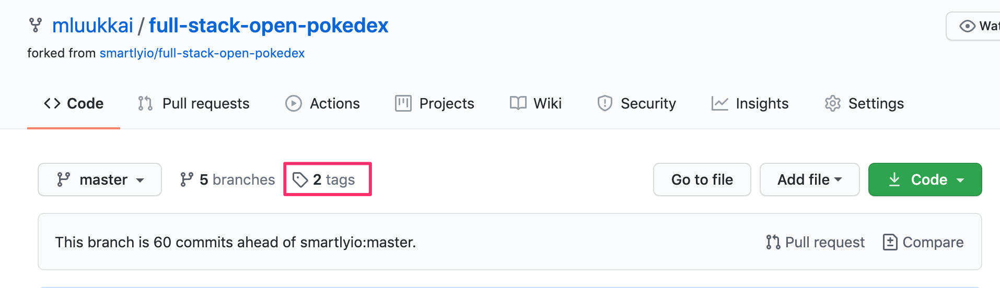
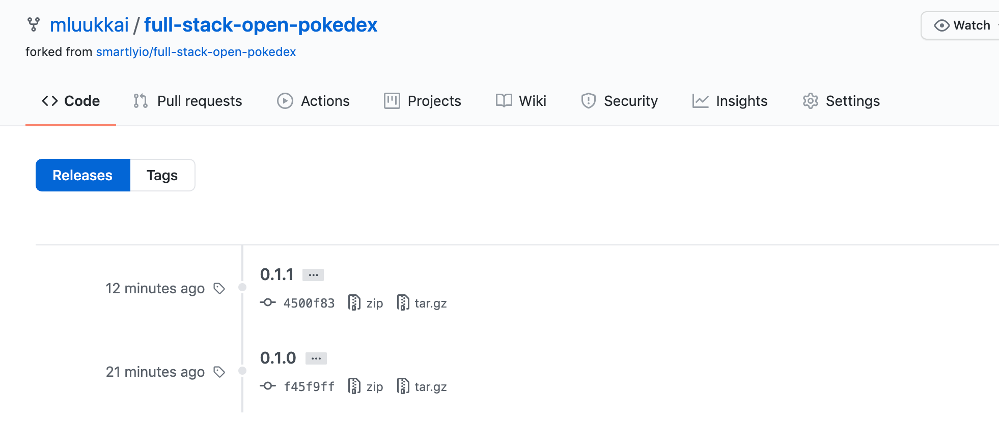
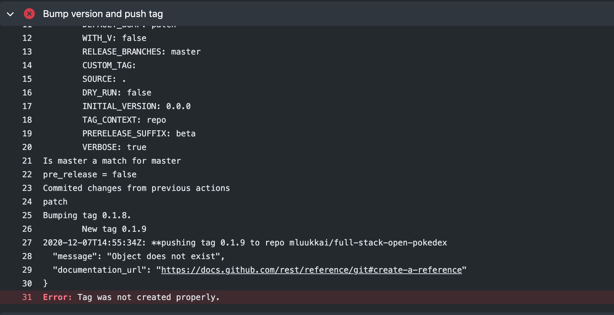
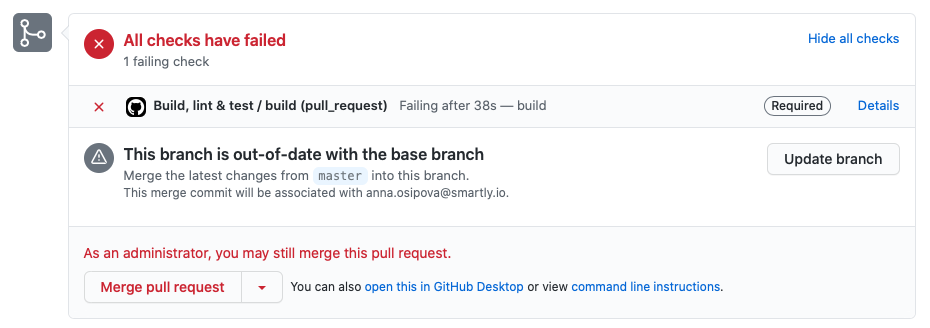
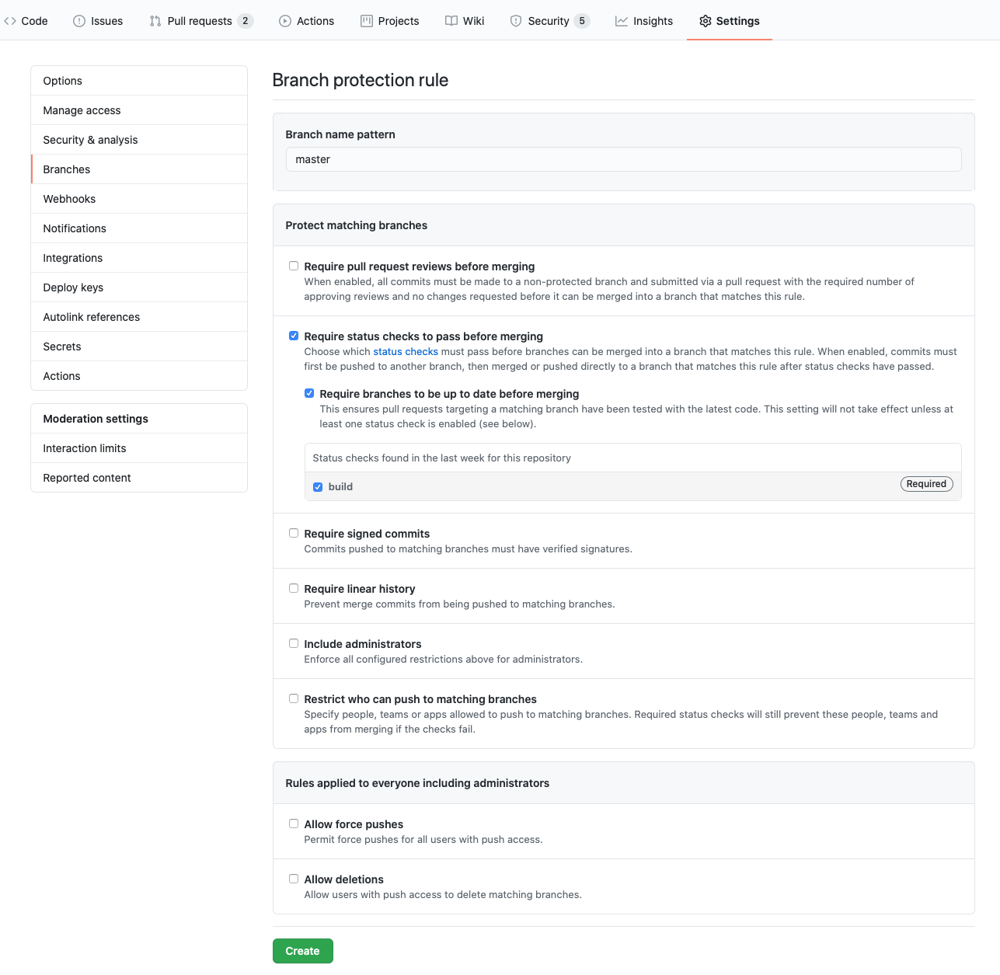

<div class="content">

Your main branch of the code should always remain <i>green</i>. Being green means that all the steps of your build pipeline should complete successfully: the project should build successfully, tests should run without errors, and the linter shouldn't have anything to complain about, etc.

Why is this important? You will likely deploy your code to production specifically from your main branch. Any failures in the main branch would mean that new features cannot be deployed to production until the issue is sorted out. Sometimes you will discover a nasty bug in production that was not caught by the CI/CD pipeline. In these cases, you want to be able to roll the production environment back to a previous commit in a safe manner.

How do you keep your main branch green then? Avoid committing any changes directly to the main branch. Instead, commit your code on a branch based on the freshest possible version of the main branch. Once you think the branch is ready to be merged into the main you create a GitHub Pull Request (also referred to as <abbr title="Pull Request">PR</abbr>).

### Working with Pull Requests

Pull requests are a core part of the collaboration process when working on any software project with at least two contributors. When making changes to a project you checkout a new branch locally, make and commit your changes, push the branch to the remote repository (in our case to GitHub) and create a pull request for someone to review your changes before those can be merged into the main branch.

There are several reasons why using pull requests and getting your code reviewed by at least one other person is always a good idea.
- Even a seasoned developer can often overlook some issues in their code: we all know of the tunnel vision effect.
- A reviewer can have a different perspective and offer a different point of view.
- After reading through your changes, at least one other developer will be familiar with the changes you've made.
- Using PRs allows you to automatically run all tasks in your CI pipeline before the code gets to the main branch. GitHub Actions provides a trigger for pull requests.

You can configure your GitHub repository in such a way that pull requests cannot be merged until they are approved.



To open a new pull request, open your branch in GitHub and click on the green "Compare & pull request" button at the top. You will be presented with a form where you can fill in the pull request description.



GitHub's pull request interface presents a description and the discussion interface. At the bottom, it displays all the CI checks (in our case each of our Github Actions) that are configured to run for each PR and the statuses of these checks. A green board is what you aim for! You can click on Details of each check to view details and run logs.

All the workflows we looked at so far were triggered by commits to the main branch. To make the workflow run for each pull request we would have to update the trigger part of the workflow. We use the "pull_request" trigger for branch "master" (our main branch) and limit the trigger to events "opened" and "synchronize". Basically, this means, that the workflow will run when a PR into the main branch is opened or updated.

So let us change events that [trigger](https://docs.github.com/en/free-pro-team@latest/actions/reference/events-that-trigger-workflows) of the workflow as follows:

```js
on:
  push:
    branches:
      - master
  pull_request: // highlight-line
    branches: [master] // highlight-line
    types: [opened, synchronize] // highlight-line
```

We shall soon make it impossible to push the code directly to the main branch, but in the meantime, let us still run the workflow also for all the possible direct pushes to the main branch.

</div>

<div class="tasks">

### Exercises 11.14-11.15.

Our workflow is doing a nice job of ensuring good code quality, but since it is run on commits to the main branch, it's catching the problems too late!

#### 11.14 Pull request

Update the trigger of the existing workflow as suggested above to run on new pull requests to your main branch.

Create a new branch, commit your changes, and open a pull request to your main branch.

If you have not worked with branches before, check [e.g. this tutorial](https://www.atlassian.com/git/tutorials/using-branches) to get started.

Note that when you open the pull request, make sure that you select here your <i>own</i> repository as the destination <i>base repository</i>. By default, the selection is the original repository by smartly and you **do not want** to do that:



In the "Conversation" tab of the pull request you should see your latest commit(s) and the yellow status for checks in progress:



Once the checks have been run, the status should turn to green. Make sure all the checks pass. Do not merge your branch yet, there's still one more thing we need to improve on our pipeline.

#### 11.15 Run deployment step only for the main branch

All looks good, but there is actually a pretty serious problem with the current workflow. All the steps, including the deployment, are run also for pull requests. This is surely something we do not want!

Fortunately, there is an easy solution for the problem! We can add an [if](https://docs.github.com/en/free-pro-team@latest/actions/reference/workflow-syntax-for-github-actions#jobsjob_idif) condition to the deployment step, which ensures that the step is executed only when the code is being merged or pushed to the main branch.

The workflow [context](https://docs.github.com/en/free-pro-team@latest/actions/reference/context-and-expression-syntax-for-github-actions#contexts) gives various kinds of information about the code the workflow is run.

The relevant information is found in [github context](https://docs.github.com/en/free-pro-team@latest/actions/reference/context-and-expression-syntax-for-github-actions#github-context), the field <i>event_name</i> tells what is the "name" of the event that triggered the workflow. When a pull request is merged, the name of the event is somehow paradoxically <i>push</i>, the same event that happens when pushing the code to the repository. Thus, we get the desired behavior by adding the following condition to the step that deploys the code:

```js
if: ${{ github.event_name == 'push' }}
```

Push some more code to your branch, and ensure that the deployment step <i>is not executed</i> anymore. Then merge the branch to the main branch and make sure that the deployment happens.

</div>

<div class="content">

### Versioning

The most important purpose of versioning is to uniquely identify the software we're running and the code associated with it. 

The ordering of versions is also an important piece of information. For example, if the current release has broken critical functionality and we need to identify the <i>previous version</i> of the software so that we can roll back the release back to a stable state.

#### Semantic Versioning and Hash Versioning

How an application is versioned is sometimes called a versioning strategy. We'll look at and compare two such strategies.

The first one is [semantic versioning](https://semver.org/), where a version is in the form <code>{major}.{minor}.{patch}</code>. For example, if the version is <code>1.2.3</code>, it has <code>1</code> as the major version, <code>2</code> is the minor version, and <code>3</code> is the patch version.

In general, changes that fix the functionality without changing how the application works from the outside are <code>patch</code> changes, changes that make small changes to functionality (as viewed from the outside) are <code>minor</code> changes and changes that completely change the application (or major functionality changes) are <code>major</code> changes. The definitions of each of these terms can vary from project to project. 

For example, npm-libraries are following the semantic versioning. At the time of writing this text (7th December 2020) the most recent version of React is [17.0.1](https://reactjs.org/versions/), so the major version is 17 which is quite recent and it has just been bumped up one patch step, the minor version is still 0.

<i>Hash versioning</i> (also sometimes known as SHA versioning) is quite different. The version "number" in hash versioning is a hash (that looks like a random string) derived from the contents of the repository and the changes introduced in this commit. In git, this is already done for you as the commit hash that is unique for any change set.

Hash versioning is almost always used in conjunction with automation. It's a pain (and error-prone) to copy 32 character long version numbers around to make sure that everything is correctly deployed.

#### But what does the version point to?

Determining what code is in a given version is important and the way this is achieved is again quite different between semantic and hash versioning. In hash versioning (at least in git) it's as simple as looking up the commit based on the hash. This will let us know exactly what code is deployed with which version.

It's a little more complicated when using semantic versioning and there are several ways to approach the problem. These boil down to three possible approaches: something in the code itself, something in the repo or repo metadata, something completely outside the repo.

While we won't cover the last option on the list (since that's a rabbit hole all on its own), it's worth mentioning that this can be as simple as a spreadsheet that lists the Semantic Version and the commit it points to.

For the two repo based approaches, the approach with something in the code usually boils down to a version number in a file and the repo/metadata approach usually relies on [tags](https://www.atlassian.com/git/tutorials/inspecting-a-repository/git-tag) or (in the case of GitHub) releases. In the case of tags or releases, this is relatively simple, the tag or release points to a commit, the code in that commit is the code in the release.

#### Version order

In semantic versioning, even if we have version bumps of different types (major, minor, or patch) it's still quite easy to put the releases in order: 1.3.7 comes before 2.0.0 which itself comes before 2.1.5 which comes before 2.2.0. A list of releases (conveniently provided by a package manager or GitHub) is still needed to know what the last version is but it's easier to look at that list and discuss it: It's easier to say "We need to roll back to 3.2.4" than to try communicate a hash in person.

That's not to say that hashes are inconvenient: if you know which commit caused the particular problem, it's easy enough to look back through a git history and get the hash of the previous commit. But if you have two hashes, say <code>d052aa41edfb4a7671c974c5901f4abe1c2db071</code> and <code>12c6f6738a18154cb1cef7cf0607a681f72eaff3</code>, you really can not say which become earlier in history, you need something more, such as the git log that reveals the ordering.

#### Comparing the Two

We've already touched on some of the advantages and disadvantages of the two versioning methods discussed above but it's perhaps useful to address where they'd each likely be used.

Semantic Versioning works well when deploying services where the version number could be of significance or might actually be looked at. As an example, think of the Javascript libraries that you're using. If you're using version 3.4.6 of a particular library, and there's an update available to 3.4.8, if the library uses semantic versioning, you could (hopefully) safely assume that you're ok to upgrade without breaking anything. If the version jumps to 4.0.1 then maybe it's not such a safe upgrade.

Hash versioning is very useful where most commits are being built into artifacts (e.g. runnable binaries or Docker images) that are themselves uploaded or stored. As an example, if your testing requires building your package into an artifact, uploading it to a server, and running tests against it, it would be convenient to have hash versioning as it would prevent accidents. 

As an example think that you're working on version 3.2.2 and you have a failing test, you fix the failure and push the commit but as you're working in your branch, you're not going to update the version number. Without hash versioning, the artifact name may not change. If there's an error in uploading the artifact, maybe the tests run again with the older artifact (since it's still there and has the same name) and you get the wrong test results. If the artifact is versioned with the hash, then the version number *must* change on every commit and this means that if the upload fails, there will be an error since the artifact you told the tests to run again does not exist.

Having an error happen when something goes wrong is almost always preferable to having a problem silently ignored in CI.

#### Best of Both Worlds

From the comparison above, it would seem that the semantic versioning makes sense for releasing software while hash-based versioning (or artifact naming) makes more sense during development. This doesn't necessarily cause a conflict.

Think of it this way: versioning boils down to a technique that points to a specific commit and says "We'll give this point a name, it's name will be 3.5.5". Nothing is preventing us from also referring to the same commit by its hash.

There is a catch. We discussed at the beginning of this part that we always have to know exactly what is happening with our code, for example, we need to be sure that we have tested the code we want to deploy. Having two parallel versioning (or naming) conventions can make this a little more difficult.

For example, when we have a project that uses hash-based artifact builds for testing, it's always possible to track the result of every build, lint, and test to a specific commit and developers know the state their code is in. This is all automated and transparent to the developers. They never need to be aware of the fact that the CI system is using the commit hash underneath to name build and test artifacts. When the developers merge their code to the main branch, again the CI takes over. This time, it will build and test all the code and give it a semantic version number all in one go. It attaches the version number to the relevant commit with a git tag.

In the case above, the software we release is tested because the CI system makes sure that tests are run on the code it is about to tag. It would not be incorrect to say that the project uses semantic versioning and simply ignore that the CI system tests individual developer branches/PRs with a hash-based naming system. We do this because the version we care about (the one that is released) is given a semantic version.

</div>

<div class="tasks">

### Exercises 11.16-11.17.

Let's extend our workflow so that it will automatically increase (bump) the version when a pull request is merged into the main branch and [tag](https://www.atlassian.com/git/tutorials/inspecting-a-repository/git-tag) the release with the version number. We will use an open source action developed by a third-party: [anothrNick/github-tag-action](https://github.com/anothrNick/github-tag-action). 

#### 11.16 Adding versioning

We will extend our workflow with one step:

```js
- name: Bump version and push tag
  uses: anothrNick/github-tag-action@1.33.0
  env:
    GITHUB_TOKEN: ${{ secrets.GITHUB_TOKEN }}
```

We're passing an environmental variable <code>secrets.GITHUB\_TOKEN</code> to the action. As it is third-party action, it needs the token for authentication in your repository. You can read more [here](https://docs.github.com/en/actions/configuring-and-managing-workflows/authenticating-with-the-github_token) about authentication in GitHub Actions.

The [anothrNick/github-tag-action](https://github.com/anothrNick/github-tag-action) action can accept multiple environmental variables. These variables modify the way the action tags your releases. You can look at these in the [README](https://github.com/anothrNick/github-tag-action) and see what suits your needs. 

As you can see from the documentation by default your releases will receive a *minor* bump, meaning that the middle number will be incremented.

Modify the configuration above so that each new version is by default a _patch_ bump in the version number, so that by default, the last number is increased. 

Remember that we want only to bump the version when the change happens to the main branch! So add a similar <code>if</code> condition to prevent version bumps on pull request as was done in [Exercise 11.15](/en/part11/keeping_green#exercises-11-14-11-15) to prevent deployment on pull request releated events.

Complete the workflow and try it out! 

If you're uncertain of the configuration, you can set  <code>DRY_RUN</code> to <code>true</code>, which will make the action output the next version number without creating or tagging the release!

Once the workflow runs successfully, the repository mentions that there are some <i>tags</i>:



And by clicking it, you can see all the tags (that is the git mechanism to mark a release) listed:




**Note:** I ended up having this error in the tagging action:



A quick (but perhaps a bit dirty) way to solve the problem was to checkout the repository once again just before the tagging step:

```js
  - uses: actions/checkout@v2 // highlight-line
  - name: Bump version and push tag
    uses: anothrNick/github-tag-action@1.33.0
    env:
      GITHUB_TOKEN: ${{ secrets.GITHUB_TOKEN }}
```
A better option would perhaps be another job that takes care of tagging.

There's another error you may encounter when using tags action:
```
  Bumping tag 0.0.0. 
	New tag 0.0.1-beta.1
fatal: tag '0.0.1-beta.1' already exists
```
A quick way to solve this is to add `0.0.0` tag manually using command line like so `git tag 0.0.0`. Then, push the tag to remote using `git push origin --tags`.

#### 11.17 Skipping a commit for tagging and deployment

In general the more often you deploy the main branch to production, the better. However, there might be some valid reasons sometimes to skip a particular commit or a merged pull request to becoming tagged and released to production.

Modify your setup so that if a commit message in a pull request contains _#skip_, the merge will not be deployed to production and it is not tagged with a version number.

**Hints:**  

The easiest way to implement this is to alter the [if](https://docs.github.com/en/free-pro-team@latest/actions/reference/workflow-syntax-for-github-actions#jobsjob_idstepsif) conditions of the relevant steps. Similarly to [exercise 11-15](/en/part11/keeping_green#exercises-11-14-15) you can get the relevant information from the [github context](https://docs.github.com/en/free-pro-team@latest/actions/reference/context-and-expression-syntax-for-github-actions#github-context) of the workflow.

You might take this as a starting point:

```js
name: Testing stuff

on:
  push:
    branches:
      - master

jobs:
  a_test_job:
    runs-on: ubuntu-18.04
    steps:
      - uses: actions/checkout@v2
      - name: gihub context
        env:
          GITHUB_CONTEXT: ${{ toJson(github) }}
        run: echo "$GITHUB_CONTEXT"
      - name: commits
        env:
          COMMITS: ${{ toJson(github.event.commits) }}
        run: echo "$COMMITS"
      - name: commit messages
        env:
          COMMIT_MESSAGES: ${{ toJson(github.event.commits.*.message) }}
        run: echo "$COMMIT_MESSAGES"
```

See what gets printed in the workflow log!

Note that you can access the commits and commit messages <i>only when pushing or merging to the main branch</i>, so for pull requests the <code>github.event.commits</code> is empty. It is anyway not needed, since we want to skip the step altogether for pull requests. 

You most likely need functions [contains](https://docs.github.com/en/actions/learn-github-actions/expressions#contains) and [join](https://docs.github.com/en/actions/learn-github-actions/expressions#join) for your if condition.

Developing workflows is not easy, and quite often the only option is trial and error. It might actually be advisable to have a separate repository for getting the configuration right, and when it is done, to copy the right configurations to the actual repository.

It would also be possible to install a tool such as [act](https://github.com/nektos/act) that makes it possible to run your workflows locally. In case you end up to more involved use cases, e.g. by creating your [own custom actions](https://docs.github.com/en/free-pro-team@latest/actions/creating-actions) going through the burden of setting up a tool such as act is most likely worth the trouble. 


</div>

<div class="content">

### A note about using third party actions

When using a third party action such that <i>github-tag-action</i> it might be a good idea to specify the used version with hash instead of using a version number. The reason for this is that the version number, that is implemented with a git tag can in principle be <i>moved</i>. So today's version 1.33.0 might be a different code that is at the next week the version 1.33.0! 

However, the code in commit with a particular hash does not change in any circumstances, so if we want to be 100% sure about the code we use, it is safest to use the hash. 

The version [1.33.0](https://github.com/anothrNick/github-tag-action/releases) of the action corresponds to commit with hash <code>eca2b69f9e2c24be7decccd0f15fdb1ea5906598</code>, so we might want to change our configuration as follows:

```js
    - name: Bump version and push tag
      uses: anothrNick/github-tag-action@eca2b69f9e2c24be7decccd0f15fdb1ea5906598  // highlight-line
      env:
        GITHUB_TOKEN: ${{ secrets.GITHUB_TOKEN }}
```


When we use actions provided by GitHub we trust them not to mess with version tags and to thoroughly test their code.

In the case of third-party actions, the code might end up being buggy or even malicious. Even when the author of the open-source code does not have the intention of doing something bad, they might end up leaving their credentials on a post-it note in a cafe, and then who knows what might happen.

By pointing to the hash of a specific commit we can be sure that the code we use when running the workflow will not change because changing the underlying commit and its contents would also change the hash.

### Keep the main branch protected

GitHub allows you to set up protected branches. It is important to protect your most important branch that should never be broken: <i>master</i>/<i>main</i>. In repository settings, you can choose between several levels of protection. We will not go over all of the protection options, you can learn more about them in GitHub documentation. Requiring pull request approval when merging into the main branch is one of the options we mentioned earlier.

From CI point of view, the most important protection is requiring status checks to pass before a PR can be merged into the main branch. This means that if you have set up GitHub actions to run e.g. linting and testing tasks, then until all the lint errors are fixed and all the tests pass the PR cannot be merged. Because you are the administrator for your repository, you will see an option to override the restriction. However, non-administrators will not have this option.



To set up protection for your main branch, navigate to repository "Settings" from the top menu inside the repository. In the left-side menu select "Branches". Click "Add rule" button next to "Branch protection rules". Type a branch name pattern ("master" or "main" will do nicely) and select the protection you would want to set up. At least "Require status checks to pass before merging" is necessary for you to fully utilize the power of GitHub Actions. Under it, you should also check "Require branches to be up to date before merging" and select all of the status checks that should pass before a PR can be merged. 





</div>

<div class="tasks">

### Exercise 11.18

#### 11.18 Adding protection to your main branch

Add protection to your <i>master</i> (or <i>main</i>) branch.

You should protect it to:
- Require all pull request to be approved before merging
- Require all status checks to pass before merging

Do not yet check <i>Include administrators</i>. If you do that, you need somebody else to review your pull requests to get the code released!

</div>
