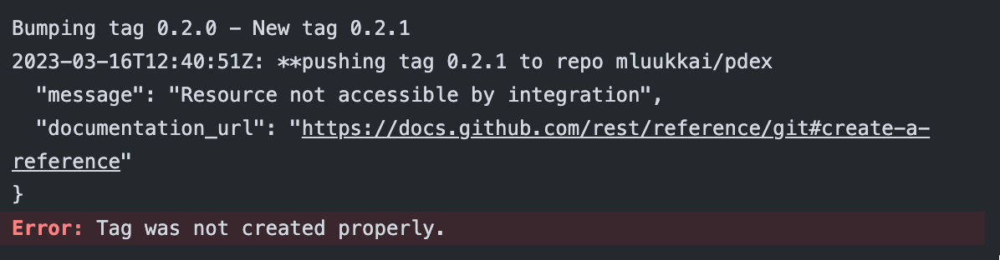
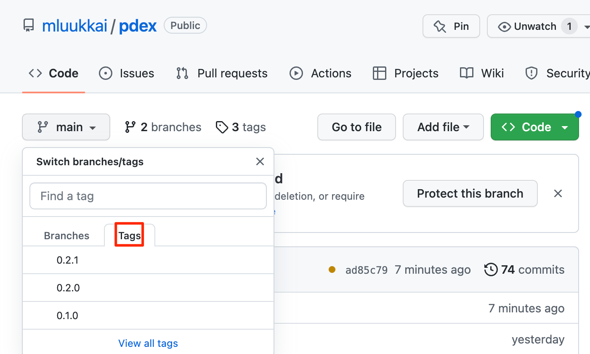
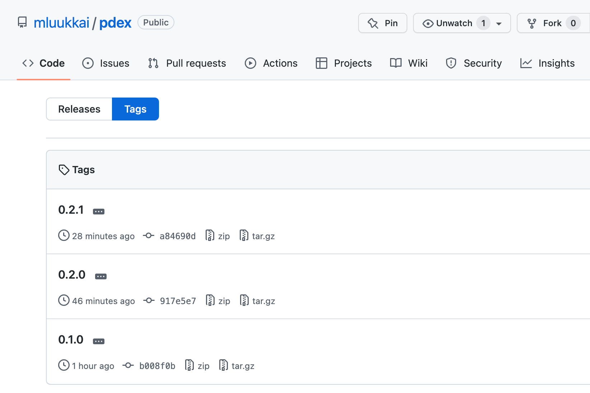

<div class="content">

<!-- Your main branch of the code should always remain <i>green</i>. Being green means that all the steps of your build pipeline should complete successfully: the project should build successfully, tests should run without errors, and the linter shouldn''t have anything to complain about, etc.-->
你的主分支代码应该始终保持<i>绿色</i>。绿色意味着你的构建管道的所有步骤都应该成功完成：项目应该成功构建，测试应该没有错误地运行，而lint不应该有任何抱怨等等。

<!-- Why is this important? You will likely deploy your code to production specifically from your main branch. Any failures in the main branch would mean that new features cannot be deployed to production until the issue is sorted out. Sometimes you will discover a nasty bug in production that was not caught by the CI/CD pipeline. In these cases, you want to be able to roll the production environment back to a previous commit in a safe manner.-->
为什么这很重要？你可能会特别从你的主分支部署你的代码到生产环境。任何在主分支上的失败都意味着新的功能无法被部署到生产环境，直到问题被解决。有时你会发现在生产环境中有一个恶劣的 bug，而 CI/CD 管道没有捕获到它。在这种情况下，你希望能够以安全的方式将生产环境回滚到以前的提交。

<!-- How do you keep your main branch green then? Avoid committing any changes directly to the main branch. Instead, commit your code on a branch based on the freshest possible version of the main branch. Once you think the branch is ready to be merged into the main you create a GitHub Pull Request (also referred to as <abbr title="Pull Request">PR</abbr>).-->
那么，你如何保持你的主分支保持绿色？不要直接提交任何更改到主分支。相反，在基于主分支最新可能版本的分支上提交你的代码。一旦你认为分支已准备好合并到主分支中，你就创建一个GitHub拉取请求（也称为<abbr title="Pull Request">PR</abbr>）。

### Working with Pull Requests

<!-- Pull requests are a core part of the collaboration process when working on any software project with at least two contributors. When making changes to a project you checkout a new branch locally, make and commit your changes, push the branch to the remote repository (in our case to GitHub) and create a pull request for someone to review your changes before those can be merged into the main branch.-->
当至少有两个贡献者在任何软件项目上工作时，拉取请求是协作过程的核心部分。当对项目进行更改时，您会在本地检出新分支，进行并提交更改，将分支推送到远程存储库（在我们的情况下是GitHub），并为某人创建拉取请求以便在将其合并到主分支之前对其进行审阅。

<!-- There are several reasons why using pull requests and getting your code reviewed by at least one other person is always a good idea.-->
有几个原因表明，使用 pull requests 并让至少一个其他人审阅你的代码总是一个好主意。
<!-- - Even a seasoned developer can often overlook some issues in their code: we all know of the tunnel vision effect.-->
即使是一位经验丰富的开发者也经常会忽略代码中的一些问题：我们都知道这是隧道视角效应。
<!-- - A reviewer can have a different perspective and offer a different point of view.-->
一位评论者可以有不同的视角，并提供不同的观点。
<!-- - After reading through your changes, at least one other developer will be familiar with the changes you''ve made.-->
阅读完你的修改后，至少有另一位开发者将熟悉你所做的更改。
<!-- - Using PRs allows you to automatically run all tasks in your CI pipeline before the code gets to the main branch. GitHub Actions provides a trigger for pull requests.-->
使用PRs可以让您在代码进入主分支之前自动运行CI管道中的所有任务。GitHub Actions提供了拉取请求的触发器。

<!-- You can configure your GitHub repository in such a way that pull requests cannot be merged until they are approved.-->
你可以配置你的GitHub存储库，以便在没有批准的情况下不能合并拉取请求。


<!-- To open a new pull request, open your branch in GitHub and click on the green "Compare & pull request" button at the top. You will be presented with a form where you can fill in the pull request description.-->
打开一个新的拉取请求，在GitHub中打开你的分支，然后点击顶部的绿色“比较&拉取请求”按钮。你将看到一个表单，可以在其中填写拉取请求描述。


<!-- GitHub''s pull request interface presents a description and the discussion interface. At the bottom, it displays all the CI checks (in our case each of our Github Actions) that are configured to run for each PR and the statuses of these checks. A green board is what you aim for! You can click on Details of each check to view details and run logs.-->
GitHub 的拉取请求界面提供了描述和讨论界面。在底部，它显示了所有配置为每个 PR 运行的 CI 检查（在我们的情况下，每个 Github Actions）及其状态。你的目标是绿色的！您可以单击每个检查的详细信息以查看详细信息和运行日志。

<!-- All the workflows we looked at so far were triggered by commits to the main branch. To make the workflow run for each pull request we would have to update the trigger part of the workflow. We use the "pull_request" trigger for branch "master" (our main branch) and limit the trigger to events "opened" and "synchronize". Basically, this means, that the workflow will run when a PR into the main branch is opened or updated.-->
所有我们到目前为止查看的工作流程都是由主分支的提交触发的。 为了让工作流程针对每个拉取请求运行，我们必须更新工作流程的触发部分。 我们为主分支（我们的主分支）使用“pull_request”触发器，并将触发器限制为事件“opened”和“synchronize”。 基本上，这意味着，当拉取主分支时打开或更新时，工作流程将运行。

<!-- So let us change events that [trigger](https://docs.github.com/en/free-pro-team@latest/actions/reference/events-that-trigger-workflows) of the workflow as follows:-->
让我们改变工作流程的[触发事件](https://docs.github.com/en/free-pro-team@latest/actions/reference/events-that-trigger-workflows)如下：

```yml
on:
  push:
    branches:
      - master
  pull_request: // highlight-line
    branches: [master] // highlight-line
    types: [opened, synchronize] // highlight-line

# note that your "main" branch might be called main instead of master
```

<!-- We shall soon make it impossible to push the code directly to the main branch, but in the meantime, let us still run the workflow also for all the possible direct pushes to the main branch.-->
我们很快就会让直接将代码推送到主分支变得不可能，但在此期间，让我们仍然为所有可能的直接推送到主分支运行工作流程。

</div>

<div class="tasks">

### Exercises 11.13-11.14.

<!-- Our workflow is doing a nice job of ensuring good code quality, but since it is run on commits to the main branch, it''s catching the problems too late!-->
我们的工作流程很好地确保了良好的代码质量，但由于它是在主分支上运行的，所以它抓住问题的时间太晚了！

#### 11.13 Pull request

<!-- Update the trigger of the existing workflow as suggested above to run on new pull requests to your main branch.-->
按照上述建議更新現有工作流程的觸發器，以在您的主分支上執行新的拉取請求。

<!-- Create a new branch, commit your changes, and open a pull request to your main branch.-->
创建一个新的分支，提交您的更改，并向主分支发起拉取请求。

<!-- If you have not worked with branches before, check [e.g. this tutorial](https://www.atlassian.com/git/tutorials/using-branches) to get started.-->
如果你以前没有使用过分支，可以查看[例如这个教程](https://www.atlassian.com/git/tutorials/using-branches)来入门。

<!-- Note that when you open the pull request, make sure that you select here your <i>own</i> repository as the destination <i>base repository</i>. By default, the selection is the original repository by smartly and you **do not want** to do that:-->
当你打开拉取请求时，请确保你选择自己的<i>仓库</i>作为目标<i>基础仓库</i>。默认情况下，选择的是smartly的原始仓库，你**不想**这样做:


<!-- In the "Conversation" tab of the pull request you should see your latest commit(s) and the yellow status for checks in progress:-->
在拉取请求的"对话"选项卡中，您应该看到您最新的提交和正在进行检查的黄色状态：


<!-- Once the checks have been run, the status should turn to green. Make sure all the checks pass. Do not merge your branch yet, there''s still one more thing we need to improve on our pipeline.-->
一旦检查完成，状态应该变成绿色。确保所有检查都通过。不要立即合并分支，我们仍然需要改进我们的流水线上的一件事情。

#### 11.14 Run deployment step only for the main branch

<!-- All looks good, but there is actually a pretty serious problem with the current workflow. All the steps, including the deployment, are run also for pull requests. This is surely something we do not want!-->
看起来都很好，但是当前的工作流程实际上有一个相当严重的问题。包括部署在内的所有步骤，也会被用于拉取请求。这肯定是我们不想要的！

<!-- Fortunately, there is an easy solution for the problem! We can add an [if](https://docs.github.com/en/actions/using-workflows/workflow-syntax-for-github-actions#jobsjob_idstepsif) condition to the deployment step, which ensures that the step is executed only when the code is being merged or pushed to the main branch.-->
幸运的是，这个问题有一个简单的解决方案！我们可以在部署步骤中添加一个[if](https://docs.github.com/en/actions/using-workflows/workflow-syntax-for-github-actions#jobsjob_idstepsif)条件，以确保该步骤仅在代码被合并或推送到主分支时才执行。

<!-- The workflow [context](https://docs.github.com/en/free-pro-team@latest/actions/reference/context-and-expression-syntax-for-github-actions#contexts) gives various kinds of information about the code the workflow is run.-->
# 工作流[上下文](https://docs.github.com/en/free-pro-team@latest/actions/reference/context-and-expression-syntax-for-github-actions#contexts)提供有关工作流运行的代码的各种信息。

<!-- The relevant information is found in [GitHub context](https://docs.github.com/en/actions/learn-github-actions/contexts#github-context), the field <i>event_name</i> tells us what is the "name" of the event that triggered the workflow. When a pull request is merged, the name of the event is somehow paradoxically <i>push</i>, the same event that happens when pushing the code to the repository. Thus, we get the desired behavior by adding the following condition to the step that deploys the code:-->
相关信息可以在[GitHub上下文](https://docs.github.com/en/actions/learn-github-actions/contexts#github-context)中找到，字段<i>event_name</i>告诉我们触发工作流程的事件的“名称”是什么。当拉取请求被合并时，事件的名称令人费解地是<i>push</i>，这个事件也发生在将代码推送到存储库时。因此，我们可以通过在部署代码的步骤中添加以下条件来获得所需的行为：

```js
if: ${{ github.event_name == 'push' }}
```

<!-- Push some more code to your branch, and ensure that the deployment step <i>is not executed</i> anymore. Then merge the branch to the main branch and make sure that the deployment happens.-->
推送更多的代码到你的分支，并确保 <i>不再执行</i> 部署步骤。然后将分支合并到主分支，并确保部署发生。

</div>

<div class="content">

### Versioning

<!-- The most important purpose of versioning is to uniquely identify the software we''re running and the code associated with it.-->
最重要的版本目的是唯一确定我们正在运行的软件及其相关代码。

<!-- The ordering of versions is also an important piece of information. For example, if the current release has broken critical functionality and we need to identify the <i>previous version</i> of the software so that we can roll back the release back to a stable state.-->
版本的排序也是一项重要的信息。例如，如果当前发布的版本破坏了关键功能，我们需要确定软件的<i>前一个版本</i>，以便我们可以将发布回滚到稳定状态。

#### Semantic Versioning and Hash Versioning

<!-- How an application is versioned is sometimes called a versioning strategy. We''ll look at and compare two such strategies.-->
如何版本化一個應用程式有時被稱為版本策略。我們將比較兩種此類策略。

<!-- The first one is [semantic versioning](https://semver.org/), where a version is in the form <code>{major}.{minor}.{patch}</code>. For example, if the version is <code>1.2.3</code>, it has <code>1</code> as the major version, <code>2</code> is the minor version, and <code>3</code> is the patch version.-->
[语义版本控制](https://semver.org/)，版本格式为<code>{major}.{minor}.{patch}</code>。例如，版本号为<code>1.2.3</code>，其中<code>1</code>为主要版本号，<code>2</code>为次要版本号，<code>3</code>为补丁版本号。

<!-- In general, changes that fix the functionality without changing how the application works from the outside are <code>patch</code> changes, changes that make small changes to functionality (as viewed from the outside) are <code>minor</code> changes and changes that completely change the application (or major functionality changes) are <code>major</code> changes. The definitions of each of these terms can vary from project to project.-->
一般来说，修复功能而不改变应用程序从外部的工作方式的变化被称为<code>patch</code>变化，对功能做出小的改变（从外部看）的变化被称为<code>minor</code>变化，以及彻底改变应用程序（或重大功能变化）的变化被称为<code>major</code>变化。每个术语的定义可能因项目而异。

<!-- For example, npm-libraries are following the semantic versioning. At the time of writing this text (16th March 2023) the most recent version of React is [18.2.0](https://reactjs.org/versions/), so the major version is 18 and the minor version is 2.-->
例如，npm 库遵循语义版本控制。截至本文撰写时(2023 年 3 月 16 日)，React 的最新版本是 [18.2.0](https://reactjs.org/versions/)，因此主版本是 18，次版本是 2。

<i>Hash versioning</i> (also sometimes known as SHA versioning) is quite different. The version "number" in hash versioning is a hash (that looks like a random string) derived from the contents of the repository and the changes introduced in the commit that created the version. In Git, this is already done for you as the commit hash that is unique for any change set.

<!-- Hash versioning is almost always used in conjunction with automation. It''s a pain (and error-prone) to copy 32 character long version numbers around to make sure that everything is correctly deployed.-->
哈希版本控制几乎总是与自动化结合使用。把32个字符长的版本号复制到各处，以确保正确部署，是一件痛苦（且容易出错）的事情。

#### But what does the version point to?

<!-- Determining what code belongs to a given version is important and the way this is achieved is again quite different between semantic and hash versioning. In hash versioning (at least in Git) it''s as simple as looking up the commit based on the hash. This will let us know exactly what code is deployed with a specific version.-->
确定哪些代码属于给定的版本是重要的，而实现这一点的方式又在语义版本和哈希版本之间大相径庭。在哈希版本（至少在Git中），它很简单，只需要查找基于哈希的提交。这将让我们知道特定版本部署了哪些代码。

<!-- It''s a little more complicated when using semantic versioning and there are several ways to approach the problem. These boil down to three possible approaches: something in the code itself, something in the repo or repo metadata, something completely outside the repo.-->
使用语义版本控制时会稍微复杂一些，有几种方法可以解决这个问题。这些可以归结为三种可能的方法：代码本身的东西，存储库或存储库元数据中的东西，完全在存储库之外的东西。

<!-- While we won't cover the last option on the list (since that's a rabbit hole all on its own), it''s worth mentioning that this can be as simple as a spreadsheet that lists the Semantic Version and the commit it points to.-->
虽然我们不会涵盖列表中的最后一个选项（因为这是一个独立的兔子洞），但值得一提的是，这可以像一个列出语义版本和它指向的提交的电子表格一样简单。

<!-- For the two repository based approaches, the approach with something in the code usually boils down to a version number in a file and the repo/metadata approach usually relies on [tags](https://www.atlassian.com/git/tutorials/inspecting-a-repository/git-tag) or (in the case of GitHub) releases. In the case of tags or releases, this is relatively simple, the tag or release points to a commit, the code in that commit is the code in the release.-->
对于两种基于仓库的方法，通常以代码中的版本号为基础的方法，而仓库/元数据方法通常依赖于[标签](https://www.atlassian.com/git/tutorials/inspecting-a-repository/git-tag)或（在GitHub的情况下）发布。在标签或发布的情况下，这是相对简单的，标签或发布指向提交，提交中的代码就是发布中的代码。

#### Version order

<!-- In semantic versioning, even if we have version bumps of different types (major, minor, or patch) it's still quite easy to put the releases in order: 1.3.7 comes before 2.0.0 which itself comes before 2.1.5 which comes before 2.2.0. A list of releases (conveniently provided by a package manager or GitHub) is still needed to know what the last version is but it's easier to look at that list and discuss it: It''s easier to say "We need to roll back to 3.2.4" than to try communicate a hash in person.-->
在语义版本控制中，即使我们有不同类型（主要，次要或补丁）的版本更新，我们仍然很容易将发布排序：1.3.7在2.0.0之前，2.1.5在2.2.0之前。仍然需要一个发布列表（由包管理器或GitHub方便提供）来知道最新版本是什么，但是看这个列表和讨论它会更容易：比起试图亲自传达一个哈希值，说“我们需要回滚到3.2.4”更容易。

<!-- That's not to say that hashes are inconvenient: if you know which commit caused the particular problem, it's easy enough to look back through a Git history and get the hash of the previous commit. But if you have two hashes, say <code>d052aa41edfb4a7671c974c5901f4abe1c2db071</code> and <code>12c6f6738a18154cb1cef7cf0607a681f72eaff3</code>, you really can not say which came earlier in history, you need something more, such as the Git log that reveals the ordering.-->
那并不是说哈希很不方便：如果你知道哪个提交引起了特定问题，只需要通过Git历史记录就可以轻松地获取上一个提交的哈希值。但是如果你有两个哈希，比如<code>d052aa41edfb4a7671c974c5901f4abe1c2db071</code>和<code>12c6f6738a18154cb1cef7cf0607a681f72eaff3</code>，你就无法说出哪个在历史上更早，你需要更多的东西，比如Git日志来揭示排序。

#### Comparing the Two

<!-- We've already touched on some of the advantages and disadvantages of the two versioning methods discussed above but it's perhaps useful to address where they''d each likely be used.-->
我们已经讨论了上述两种版本控制方法的一些优点和缺点，但也许有用的是讨论一下它们可能在哪里被使用。

<!-- Semantic Versioning works well when deploying services where the version number could be of significance or might actually be looked at. As an example, think of the JavaScript libraries that you're using. If you're using version 3.4.6 of a particular library, and there's an update available to 3.4.8, if the library uses semantic versioning, you could (hopefully) safely assume that you're ok to upgrade without breaking anything. If the version jumps to 4.0.1 then maybe it''s not such a safe upgrade.-->
语义版本控制在部署服务时非常有用，因为版本号可能具有重要意义，甚至可能会被关注。例如，想想你正在使用的JavaScript库。如果你正在使用特定库的3.4.6版本，并且有一个更新可用到3.4.8，如果该库使用语义版本控制，你可以（希望）安全地假设你可以不会破坏任何东西而升级。如果版本跳转到4.0.1，也许不是一个安全的升级。

<!-- Hash versioning is very useful where most commits are being built into artifacts (e.g. runnable binaries or Docker images) that are themselves uploaded or stored. As an example, if your testing requires building your package into an artifact, uploading it to a server, and running tests against it, it would be convenient to have hash versioning as it would prevent accidents.-->
哈希版本控制非常有用，因为大多数提交都被构建成可执行的二进制文件或Docker镜像，并上传或存储。例如，如果您的测试需要将您的包构建成一个工件，将其上传到服务器并对其进行测试，那么使用哈希版本控制将非常方便，因为它可以防止意外发生。

<!-- As an example think that you're working on version 3.2.2 and you have a failing test, you fix the failure and push the commit but as you're working in your branch, you're not going to update the version number. Without hash versioning, the artifact name may not change. If there's an error in uploading the artifact, maybe the tests run again with the older artifact (since it''s still there and has the same name) and you get the wrong test results. If the artifact is versioned with the hash, then the version number *must* change on every commit and this means that if the upload fails, there will be an error since the artifact you told the tests to run against does not exist.-->
例如，如果你正在处理3.2.2版本，有一个失败的测试，你修复了失败的测试并提交了提交，但是由于你在自己的分支上工作，你不会更新版本号。如果没有哈希版本，则工件名称可能不会更改。如果上传工件出错，也许会使用旧工件（因为它仍然存在并具有相同的名称）再次运行测试，从而得到错误的测试结果。如果工件是用哈希版本的，那么每次提交的版本号*必须*更改，这意味着如果上传失败，将会出现错误，因为你告诉测试运行的工件不存在。

<!-- Having an error happen when something goes wrong is almost always preferable to having a problem silently ignored in CI.-->
出现错误时比在CI中默默忽略问题几乎总是更可取的。

#### Best of Both Worlds

<!-- From the comparison above, it would seem that the semantic versioning makes sense for releasing software while hash-based versioning (or artifact naming) makes more sense during development. This doesn''t necessarily cause a conflict.-->
从上面的比较来看，语义版本控制似乎更适合用于发布软件，而基于哈希的版本控制（或者叫做artifact naming）则更适合用于软件开发。这并不一定会导致冲突。

<!-- Think of it this way: versioning boils down to a technique that points to a specific commit and says "We'll give this point a name, it's name will be 3.5.5". Nothing is preventing us from also referring to the same commit by its hash.-->
想想这样：版本控制归根结底就是一种技术，它指向一个特定的提交，并说“我们将给这个点一个名字，它的名字将是3.5.5”。没有任何东西阻止我们也用哈希值来引用同一次提交。

<!-- There is a catch. We discussed at the beginning of this part that we always have to know exactly what is happening with our code, for example, we need to be sure that we have tested the code we want to deploy. Having two parallel versioning (or naming) conventions can make this a little more difficult.-->
有一个把柄。我们在本节开头讨论过，我们总是需要精确地知道我们的代码在发生什么，例如，我们需要确保我们已经测试了我们要部署的代码。拥有两个并行的版本（或命名）约定可能会使这变得更加困难。

<!-- For example, when we have a project that uses hash-based artifact builds for testing, it''s always possible to track the result of every build, lint, and test to a specific commit and developers know the state their code is in. This is all automated and transparent to the developers. They never need to be aware of the fact that the CI system is using the commit hash underneath to name build and test artifacts. When the developers merge their code to the main branch, again the CI takes over. This time, it will build and test all the code and give it a semantic version number all in one go. It attaches the version number to the relevant commit with a Git tag.-->
例如，當我們有一個使用基於哈希的工件建構來測試的專案時，可以隨時跟蹤每個建構，lint和測試的結果與特定的提交相關聯，開發人員知道他們的代碼处於什麼狀態。這一切都是自動化的，對開發人員透明。他們永遠不需要意識到CI系統正在使用提交哈希來命名建構和測試工件。當開發人員將他們的代碼合併到主分支時，CI再次接管。這次，它將構建和測試所有代碼，並以一個步驟將該版本號附加到相應的提交上，並使用Git標籤標記。

<!-- In the case above, the software we release is tested because the CI system makes sure that tests are run on the code it is about to tag. It would not be incorrect to say that the project uses semantic versioning and simply ignore that the CI system tests individual developer branches/PRs with a hash-based naming system. We do this because the version we care about (the one that is released) is given a semantic version.-->
在上述情况下，我们发布的软件是经过测试的，因为CI系统确保在要标记的代码上运行测试。不能说该项目使用语义版本并忽略CI系统使用基于哈希的命名系统对单个开发者分支/PR进行测试是不正确的。我们这样做是因为我们关心的版本（发布的版本）被赋予语义版本。

</div>

<div class="tasks">

### Exercises 11.15-11.16.

<!-- Let''s extend our workflow so that it will automatically increase (bump) the version when a pull request is merged into the main branch and [tag](https://www.atlassian.com/git/tutorials/inspecting-a-repository/git-tag) the release with the version number. We will use an open source action developed by a third-party: [anothrNick/github-tag-action](https://github.com/anothrNick/github-tag-action).-->
让我们扩展我们的工作流，以便在将拉取请求合并到主分支时自动增加（提升）版本，并使用版本号[标记](https://www.atlassian.com/git/tutorials/inspecting-a-repository/git-tag)发布。 我们将使用第三方开发的开源操作：[anothrNick/github-tag-action](https://github.com/anothrNick/github-tag-action)。

#### 11.15 Adding versioning

<!-- We will extend our workflow with one more step:-->
我们将增加一个步骤来扩展我们的工作流程：

```js
- name: Bump version and push tag
  uses: anothrNick/github-tag-action@1.55.0
  env:
    GITHUB_TOKEN: ${{ secrets.GITHUB_TOKEN }}
```

<!-- Note: you should use the most recent version of the action, see [here](https://github.com/anothrNick/github-tag-action) if a more recent version is available.-->
**注意：您应该使用最新版本的操作，如果有更新版本可用，请参见[此处](https://github.com/anothrNick/github-tag-action)。**

<!-- We''re passing an environmental variable <code>secrets.GITHUB\_TOKEN</code> to the action. As it is third-party action, it needs the token for authentication in your repository. You can read more [here](https://docs.github.com/en/actions/configuring-and-managing-workflows/authenticating-with-the-github_token) about authentication in GitHub Actions.-->
我们正在向动作传递环境变量<code>secrets.GITHUB\_TOKEN</code>。由于它是第三方动作，它需要令牌来认证您的存储库。您可以在[此处](https://docs.github.com/en/actions/configuring-and-managing-workflows/authenticating-with-the-github_token)了解有关GitHub动作认证的更多信息。

<!-- You may end up having this error message-->
你可能會遇到這個錯誤訊息



<!-- The most likely cause for this is that your token has no write access to your repo. Go to your repository settings, and select actions/general, and ensure that your token has <i>read and write permissions</i>:-->
最可能的原因是您的令牌没有对您的存储库进行写入访问权限。转到您的存储库设置，选择“操作/常规”，确保您的令牌具有<i>读取和写入权限</i>：


<!-- The [anothrNick/github-tag-action](https://github.com/anothrNick/github-tag-action) action accepts some environment variables that modify the way the action tags your releases. You can look at these in the [README](https://github.com/anothrNick/github-tag-action) and see what suits your needs.-->
[anothrNick/github-tag-action](https://github.com/anothrNick/github-tag-action) 这个动作接受一些环境变量来修改动作标记你的发布的方式。你可以在[README](https://github.com/anothrNick/github-tag-action)中查看这些变量，并找到适合你需求的配置。

<!-- As you can see from the documentation by default your releases will receive a *minor* bump, meaning that the middle number will be incremented.-->
如您所见，根据文档，默认情况下您的发行版将会获得一个*次要*更新，这意味着中间数字会被递增。

<!-- Modify the configuration above so that each new version is by default a _patch_ bump in the version number, so that by default, the last number is increased.-->
修改上述配置，使每个新版本默认为版本号的_补丁_提升，以便默认情况下，最后一个数字会增加。

<!-- Remember that we want only to bump the version when the change happens to the main branch! So add a similar <code>if</code> condition to prevent version bumps on pull request as was done in [Exercise 11.14](/en/part11/keeping_green#exercises-11-13-11-14) to prevent deployment on pull request related events.-->
记住，我们只有在主分支发生变更时才想要提升版本！因此，添加一个类似的<code>if</code>条件，以防止在拉取请求相关事件上进行部署，就像[练习 11.14](/en/part11/keeping_green#exercises-11-13-11-14)中所做的那样。

<!-- Complete now the workflow. Do not just add it as another step, but configure it as a separate job that [depends](https://docs.github.com/en/actions/using-workflows/advanced-workflow-features#creating-dependent-jobs) on the job that takes care of linting, testing and deployment. So change your workflow definition as follows:-->
完成现在的工作流程。不要把它当作另一个步骤添加，而是将它配置为一个单独的作业，该作业[取决于](https://docs.github.com/en/actions/using-workflows/advanced-workflow-features#creating-dependent-jobs)负责linting、testing和部署的作业。因此，请更改工作流程定义如下：

```yml
name: Deployment pipeline

on:
  push:
    branches:
      - master
  pull_request:
    branches: [master]
    types: [opened, synchronize]

jobs:
  simple_deployment_pipeline:
    runs-on: ubuntu-20.04
    steps:
      // steps here
  tag_release:
    needs: [simple_deployment_pipeline]
    runs-on: ubuntu-20.04
    steps:
      // steps here
```

<!-- As was mentioned [earlier](/en/part11/getting_started_with_git_hub_actions#getting-started-with-workflows) jobs of a workflow are executed in parallel but since we want the linting, testing and deployment to be done first, we set a dependency that the <i>tag\_release</i> waits the another job to execute first since we do not want to tag the release unless it passes tests and is deployed.-->
正如之前提到的[早些时候](/en/part11/getting_started_with_git_hub_actions#getting-started-with-workflows)，工作流程的作业可以并行执行，但是由于我们希望先执行linting、测试和部署，我们设置了一个依赖，即<i>tag\_release</i>等待另一个作业先执行，因为我们不希望在测试通过并部署后才打标签发布。

<!-- If you''re uncertain of the configuration, you can set  <code>DRY_RUN</code> to <code>true</code>, which will make the action output the next version number without creating or tagging the release!-->
如果你不确定配置，你可以将<code>DRY_RUN</code>设置为<code>true</code>，这将使动作输出下一个版本号而不创建或标记发布！

<!-- Once the workflow runs successfully, the repository mentions that there are some <i>tags</i>:-->
一旦工作流程运行成功，存储库提及有一些<i>标签</i>：



<!-- By clicking <i>view all tags</i>, you can see all the tags listed:-->
点击<i>查看所有标签</i>，您可以看到所有列出的标签。



<!-- And if needed, you can navigate to the view of a single tag that shows eg. what is the GitHub commit corresponding to the tag.-->
如果需要，您可以导航到单个标签的视图，例如，什么是GitHub提交对应于该标签。

#### 11.16 Skipping a commit for tagging and deployment

<!-- In general the more often you deploy the main branch to production, the better. However, there might be some valid reasons sometimes to skip a particular commit or a merged pull request to becoming tagged and released to production.-->
一般来说，你越经常把主分支部署到生产环境，越好。但是，有时候有一些有效的理由可能会让某个特定的提交或合并的拉取请求跳过标记和发布到生产环境。

<!-- Modify your setup so that if a commit message in a pull request contains _#skip_, the merge will not be deployed to production and it is not tagged with a version number.-->
修改你的设置，以便如果拉取请求中的提交消息包含_#skip_，则不会将其部署到生产环境，并且不会用版本号进行标记。

<!-- **Hints:**-->
**I'm so excited!**

我太兴奋了！

<!-- The easiest way to implement this is to alter the [if](https://docs.github.com/en/free-pro-team@latest/actions/reference/workflow-syntax-for-github-actions#jobsjob_idstepsif) conditions of the relevant steps. Similarly to [exercise 11-14](/en/part11/keeping_green#exercises-11-13-11-14) you can get the relevant information from the [GitHub context](https://docs.github.com/en/free-pro-team@latest/actions/reference/context-and-expression-syntax-for-github-actions#github-context) of the workflow.-->
最简单的实现方式是更改[if](https://docs.github.com/en/free-pro-team@latest/actions/reference/workflow-syntax-for-github-actions#jobsjob_idstepsif)条件相关的步骤。类似于[练习11-14](/en/part11/keeping_green#exercises-11-13-11-14)，您可以从[GitHub上下文](https://docs.github.com/en/free-pro-team@latest/actions/reference/context-and-expression-syntax-for-github-actions#github-context)获取相关信息。

<!-- You might take this as a starting point:-->
你可以把这作为一个起点：

```js
name: Testing stuff

on:
  push:
    branches:
      - main

jobs:
  a_test_job:
    runs-on: ubuntu-20.04
    steps:
      - uses: actions/checkout@v2
      - name: github context
        env:
          GITHUB_CONTEXT: ${{ toJson(github) }}
        run: echo "$GITHUB_CONTEXT"
      - name: commits
        env:
          COMMITS: ${{ toJson(github.event.commits) }}
        run: echo "$COMMITS"
      - name: commit messages
        env:
          COMMIT_MESSAGES: ${{ toJson(github.event.commits.*.message) }}
        run: echo "$COMMIT_MESSAGES"
```

<!-- See what gets printed in the workflow log!-->
查看工作流日志中会打印出什么！

<!-- Note that you can access the commits and commit messages <i>only when pushing or merging to the main branch</i>, so for pull requests the <code>github.event.commits</code> is empty. It is anyway not needed, since we want to skip the step altogether for pull requests.-->
注意，您只有在推送或合并到主分支时才能访问提交和提交消息，因此对于拉取请求，<code>github.event.commits</code>是空的。无论如何，我们都不需要它，因为我们希望为拉取请求跳过此步骤。

<!-- You most likely need functions [contains](https://docs.github.com/en/actions/learn-github-actions/expressions#contains) and [join](https://docs.github.com/en/actions/learn-github-actions/expressions#join) for your if condition.-->
你可能需要在if条件中使用[contains](https://docs.github.com/en/actions/learn-github-actions/expressions#contains)和[join](https://docs.github.com/en/actions/learn-github-actions/expressions#join)函数。

<!-- Developing workflows is not easy, and quite often the only option is trial and error. It might actually be advisable to have a separate repository for getting the configuration right, and when it is done, to copy the right configurations to the actual repository.-->
开发工作流并不容易，而且往往唯一的选择就是试错法。实际上，最好建立一个单独的仓库来确定配置是否正确，一旦确定，就将正确的配置复制到实际仓库中。

<!-- It would also be possible to install a tool such as [act](https://github.com/nektos/act) that makes it possible to run your workflows locally. Unless you end using more involved use cases like creating your [own custom actions](https://docs.github.com/en/free-pro-team@latest/actions/creating-actions), going through the burden of setting up a tool such as act is most likely not worth the trouble.-->
也可以安装一个像[act](https://github.com/nektos/act)这样的工具，可以让您在本地运行工作流程。 除非您最终使用更复杂的用例，比如[创建自己的自定义动作](https://docs.github.com/en/free-pro-team@latest/actions/creating-actions)，否则设置act等工具的麻烦可能不值得。

</div>

<div class="content">

### A note about using third party actions

<!-- When using a third party action such that <i>github-tag-action</i> it might be a good idea to specify the used version with hash instead of using a version number. The reason for this is that the version number, that is implemented with a Git tag can in principle be <i>moved</i>. So today''s version 1.61.0 might be a different code that is at the next week the version 1.61.0!-->
当使用第三方操作，如<i>github-tag-action</i>时，最好使用哈希而不是使用版本号来指定所使用的版本。原因是用Git标签实现的版本号理论上可以<i>移动</i>。因此今天的1.61.0版可能是下周1.61.0版的不同代码！

<!-- However, the code in commit with a particular hash does not change in any circumstances, so if we want to be 100% sure about the code we use, it is safest to use the hash.-->
然而，具有特定哈希值的提交中的代码在任何情况下都不会改变，因此，如果我们想确保使用的代码，最安全的方法是使用哈希值。

<!-- The version [1.61.0](https://github.com/anothrNick/github-tag-action/releases/tag/1.61.0) of the action corresponds to commit with hash <code>8c8163ef62cf9c4677c8e800f36270af27930f42</code>, so we might want to change our configuration as follows:-->
版本[1.61.0](https://github.com/anothrNick/github-tag-action/releases/tag/1.61.0)的动作对应于提交的hash <code>8c8163ef62cf9c4677c8e800f36270af27930f42</code>，因此我们可能需要更改我们的配置如下：

```js
    - name: Bump version and push tag
      uses: anothrNick/github-tag-action@8c8163ef62cf9c4677c8e800f36270af27930f42  // highlight-line
      env:
        GITHUB_TOKEN: ${{ secrets.GITHUB_TOKEN }}
```

<!-- When we use actions provided by GitHub we trust them not to mess with version tags and to thoroughly test their code.-->
当我们使用GitHub提供的操作时，我们信任它们不会混淆版本标签，并且彻底测试它们的代码。

<!-- In the case of third-party actions, the code might end up being buggy or even malicious. Even when the author of the open-source code does not have the intention of doing something bad, they might end up leaving their credentials on a post-it note in a cafe, and then who knows what might happen.-->
在第三方行为的情况下，代码可能最终会出现bug或者恶意行为。即使开源代码的作者没有恶意，他们也可能会把凭据留在咖啡馆的便利贴上，然后谁知道会发生什么。

<!-- By pointing to the hash of a specific commit we can be sure that the code we use when running the workflow will not change because changing the underlying commit and its contents would also change the hash.-->
通过指向特定提交的哈希值，我们可以确保在运行工作流时使用的代码不会改变，因为更改底层提交及其内容也会更改哈希值。

### Keep the main branch protected

<!-- GitHub allows you to set up protected branches. It is important to protect your most important branch that should never be broken: <i>master</i>/<i>main</i>. In repository settings, you can choose between several levels of protection. We will not go over all of the protection options, you can learn more about them in GitHub documentation. Requiring pull request approval when merging into the main branch is one of the options we mentioned earlier.-->
GitHub允许您设置受保护的分支。保护最重要的分支以免被破坏至关重要：<i>master</i>/<i>main</i>。在仓库设置中，您可以选择多种保护级别。我们不会详细介绍所有保护选项，您可以在GitHub文档中了解更多信息。在合并到主分支时要求提交拉取请求是我们之前提到的选项之一。

<!-- From CI point of view, the most important protection is requiring status checks to pass before a PR can be merged into the main branch. This means that if you have set up GitHub Actions to run e.g. linting and testing tasks, then until all the lint errors are fixed and all the tests pass the PR cannot be merged. Because you are the administrator for your repository, you will see an option to override the restriction. However, non-administrators will not have this option.-->
从CI的角度来看，最重要的保护是要求在PR可以合并到主分支之前必须通过状态检查。这意味着如果你已经设置了GitHub Actions来运行例如linting和testing任务，那么在所有lint错误都被修复并且所有测试都通过之前，PR不能被合并。由于你是你仓库的管理员，你会看到一个覆盖限制的选项。但是，非管理员将没有这个选项。


<!-- To set up protection for your main branch, navigate to repository "Settings" from the top menu inside the repository. In the left-side menu select "Branches". Click "Add rule" button next to "Branch protection rules". Type a branch name pattern ("master" or "main" will do nicely) and select the protection you would want to set up. At least "Require status checks to pass before merging" is necessary for you to fully utilize the power of GitHub Actions. Under it, you should also check "Require branches to be up to date before merging" and select all of the status checks that should pass before a PR can be merged.-->
要为主分支设置保护，请从存储库内的顶部菜单中导航到“设置”存储库。 在左侧菜单中选择“分支”。 单击“添加规则”按钮旁边的“分支保护规则”。 输入分支名称模式（“master”或“main”很好）并选择要设置的保护。 至少“在合并前需要状态检查通过”才能充分利用GitHub Actions的功能。 在此之下，您还应检查“在合并前需要分支保持最新”并选择所有在PR可以合并之前应通过的状态检查。


</div>

<div class="tasks">

### Exercise 11.17

#### 11.17 Adding protection to your main branch

<!-- Add protection to your <i>master</i> (or <i>main</i>) branch.-->
在您的主分支上添加保护。

<!-- You should protect it to:-->
你应该保护它：
<!-- - Require all pull request to be approved before merging-->
要求所有拉取请求在合并之前都必须得到批准
<!-- - Require all status checks to pass before merging-->
要求在合并之前所有状态检查都必须通过

</div>
