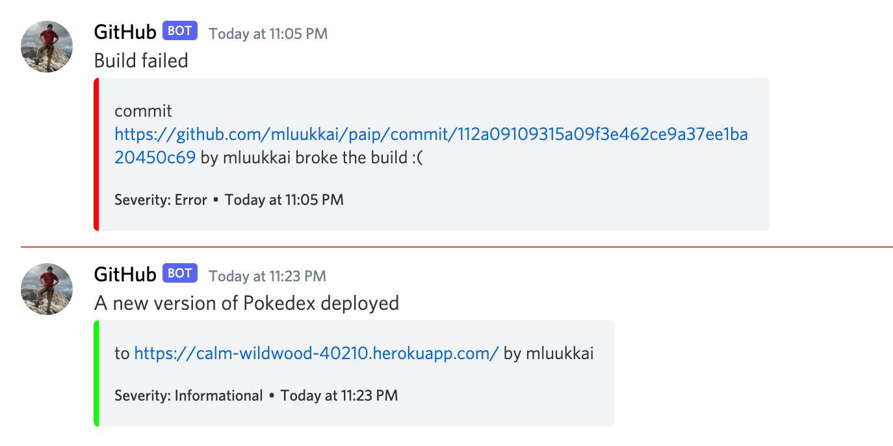

<!-- This part has focus on building a simple, effective, and robust CI system that helps developers to work together, maintain code quality, and deploy safely. What more could one possibly want? In the real world, there are more fingers in the pie than just developers and users. Even if that weren't true, even for developers, there's a lot more value to be gained from CI systems than just the things above.-->
这一部分重点关注构建一个简单、有效和健壮的持续集成系统，以帮助开发人员共同协作、维护代码质量和安全部署。还能有什么更多的要求呢？在现实世界中，参与者不仅仅是开发人员和用户，即使不是这样，即使只是针对开发人员，也可以从持续集成系统中获得更多的价值，而不仅仅是上述内容。

### Visibility and Understanding

<!-- In all but the smallest companies, decisions on what to develop are not made exclusively by developers. The term 'stakeholder' is often used to refer to people, both inside and outside the development team, who may have some interest in keeping an eye on the progress of the development. To this end, there are often integrations between Git and whatever project management/bug tracking software the team is using.-->
在除了最小的公司之外，开发什么内容的决定不是由开发人员独立做出的。「利益相关者」这个术语经常被用来指代开发团队内外的人，他们可能有兴趣关注开发的进展。为此，通常会在Git和团队正在使用的项目管理/错误跟踪软件之间做出集成。

<!-- A common use of this is to have some reference to the tracking system in Git pull requests or commits. This way, for example, when you''re working on issue number 123, you might name your pull request <code>BUG-123: Fix user copy issue</code> and the bug tracking system would notice the first part of the PR name and automatically move the issue to <code>Done</code> when the PR is merged.-->
常见的用法是在Git拉取请求或提交中引用跟踪系统。例如，当您处理编号为123的问题时，您可能会将拉取请求命名为<code>BUG-123：修复用户复制问题</code>，当合并拉取请求时，缺陷跟踪系统会注意PR名称的第一部分，并自动将问题移动到<code>Done</code>。

### Notifications

<!-- When the CI process finishes quickly, it can be convenient to just watch it execute and wait for the result. As projects become more complex, so too does the process of building and testing the code. This can quickly lead to a situation where it takes long enough to generate the build result that a developer may want to begin working on another task. This in turn leads to a forgotten build.-->
当CI流程迅速完成时，只看它执行并等待结果是很方便的。随着项目变得越来越复杂，构建和测试代码的过程也变得越来越复杂。这很快就会导致一种情况，即生成构建结果需要花费足够长的时间，以至于开发人员可能想要开始另一项任务。这反过来又导致一个被遗忘的构建。

<!-- This is especially problematic if we're talking about merging PRs that may affect another developer's work, either causing problems or delays for them. This can also lead to a situation where you think you've deployed something but haven't actually finished a deployment, this can lead to miscommunication with teammates and customers (e.g. "Go ahead and try that again, the bug should be fixed").-->
这尤其会是一个问题，如果我们谈论合并PR可能会影响另一个开发者的工作，要么造成他们的问题或延迟。这也可能导致一种情况，即您认为已经部署了某些内容，但实际上还没有完成部署，这可能会导致与团队成员和客户之间的沟通不畅（例如：“继续尝试一下，应该可以修复错误了”）。

<!-- There are several solutions to this problem ranging from simple notifications to more complicated processes that simply merge passing code if certain conditions are met. We're going to discuss notifications as a simple solution since it's the one that interferes with the team workflow the least.-->
有几种解决方案，从简单的通知到更复杂的过程，只要满足某些条件，就可以合并通过的代码。我们将讨论通知作为一种简单的解决方案，因为它对团队工作流程的干扰最小。

<!-- By default, GitHub Actions sends an email on a build failure. This can be changed to send notifications regardless of build status and can also be configured to alert you on the GitHub web interface. Great. But what if we want more. What if for whatever reason this doesn''t work for our use case.-->
默认情况下，GitHub Actions在构建失败时会发送一封电子邮件。这可以更改为无论构建状态如何都发送通知，并且还可以配置为在GitHub网页界面上向您发出警报。太棒了。但是如果我们想要更多呢？如果出于某种原因，它不适合我们的用例怎么办？

<!-- There are integrations for example to various messaging applications such as [Slack](https://slack.com/intl/en-fi/) or [Discord](https://discord.com/), to send notifications. These integrations still decide what to send and when to send it based on logic from GitHub.-->
有集成到各种消息应用程序，例如[Slack](https://slack.com/intl/en-fi/)或[Discord](https://discord.com/)，发送通知。这些集成仍然根据GitHub的逻辑决定发送什么以及何时发送。

### Exercise 11.18

<!-- We have set up a channel <i>fullstack\_webhook</i> to the course Discord group at [https://study.cs.helsinki.fi/discord/join/fullstack](https://study.cs.helsinki.fi/discord/join/fullstack) for testing a messaging integration.-->
我们已经在[https://study.cs.helsinki.fi/discord/join/fullstack](https://study.cs.helsinki.fi/discord/join/fullstack)为课程Discord群组设置了一个名为<i>fullstack\_webhook</i>的频道，用于测试消息集成。

<!-- Register now to Discord if you have not already done that. You will also need a <i>Discord webhook</i> in this exercise. You find the webhook in the pinned message of the channel <i>fullstack\_webhook</i>. Please do not commit the webhook to GitHub!-->
现在如果你还没有注册Discord，请立即注册。在这个练习中你还需要一个<i>Discord webhook</i>。你可以在频道<i>fullstack\_webhook</i>的置顶消息中找到webhook。请不要把webhook提交到GitHub！

#### 11.18 Build success/failure notification action

<!-- You can find quite a few of third party actions from [GitHub Action Marketplace](https://github.com/marketplace?type=actions) by using the search phrase [discord](https://github.com/marketplace?type=actions&query=discord). Pick one for this exercise. My choice was [discord-webhook-notify](https://github.com/marketplace/actions/discord-webhook-notify) since it has quite many stars and a decent documentation.-->
你可以在[GitHub Action Marketplace](https://github.com/marketplace?type=actions)上使用搜索词[discord](https://github.com/marketplace?type=actions&query=discord)找到相当多的第三方行动。 为此练习选择一个。 我的选择是[discord-webhook-notify](https://github.com/marketplace/actions/discord-webhook-notify)，因为它有相当多的星星和不错的文档。

<!-- Setup the action so that it gives two types of notifications:-->
设置动作，使其可以提供两种类型的通知：
<!-- - A success indication if a new version gets deployed-->
如果新版本部署成功，就是一个成功的指标。
<!-- - An error indication if a build fails-->
如果构建失败，则会出现错误提示。

<!-- In the case of an error, the notification should be a bit more verbose to help developers finding quickly which is the commit that caused it.-->
在出现错误的情况下，通知应该更加详细一些，以帮助开发人员快速找到导致错误的提交。

<!-- See [here](https://docs.github.com/en/actions/learn-github-actions/expressions#status-check-functions) how to check the job status!-->
看[这里](https://docs.github.com/en/actions/learn-github-actions/expressions#status-check-functions)如何检查作业状态！

<!-- Your notifications may look like the following:-->
你的通知可能如下所示：

### Metrics

<!-- In the previous section, we mentioned that as projects get more complicated, so too, do their builds, and the duration of the builds increases. That's obviously not ideal: The longer the feedback loop, the slower the development.-->
在前一部分，我们提到随着项目变得更加复杂，构建也变得更加复杂，构建持续时间也会增加。显然这不是理想的：反馈回路越长，开发就越慢。

<!-- While there are things that can be done about this increase in build times, it's useful to have a better view of the overall picture. It's useful to know how long a build took a few months ago versus how long it takes now. Was the progression linear or did it suddenly jump? Knowing what caused the increase in build time can be very useful in helping to solve it. If the build time increased linearly from 5 minutes to 10 minutes over the last year, maybe we can expect it to take another few months to get to 15 minutes and we have an idea of how much value there is in spending time speeding up the CI process.-->
虽然可以采取一些措施来减少构建时间的增加，但了解整体情况也很有用。知道几个月前的构建时间与现在的构建时间有多大差异很有用。这种增长是线性的还是突然跳跃？了解导致构建时间增加的原因可以非常有用，有助于解决问题。如果构建时间在过去一年里从5分钟线性增长到10分钟，也许我们可以预期它再过几个月就能到15分钟，我们就可以知道花时间加快CI流程有多大价值。

<!-- Metrics can either be self-reported (also called 'push' metrics, where each build reports how long it took) or the data can be fetched from the API afterward (sometimes called 'pull' metrics). The risk with self-reporting is that the self-reporting itself takes time and may have a significant impact on "total time taken for all builds".-->
指标可以是自我报告（也称为“推”指标，每个构建都会报告花费的时间），也可以从API之后获取数据（有时也称为“拉”指标）。自我报告的风险是自我报告本身需要花费时间，并可能对“所有构建的总时间”产生重大影响。

<!-- This data can be sent to a time-series database or to an archive of another type. There are plenty of cloud services where you can easily aggregate the metrics, one good option is [Datadog](https://www.datadoghq.com/).-->
这些数据可以发送到时间序列数据库或其他类型的存档中。有很多云服务可以轻松聚合指标，一个很好的选择是[Datadog](https://www.datadoghq.com/)。

### Periodic tasks

<!-- There are often periodic tasks that need to be done in a software development team. Some of these can be automated with commonly available tools and some you will need to automate yourself.-->
在软件开发团队中，经常有需要定期完成的任务。有些可以使用常见的工具自动完成，有些则需要自己自动化。

<!-- The former category includes things like checking packages for security vulnerabilities. Several tools can already do this for you. Some of these tools would even be free for certain types (e.g. open source) projects. GitHub provides one such tool, [Dependabot](https://dependabot.com/).-->
前一类包括检查包的安全漏洞等事情。有几种工具可以为您做到这一点。其中一些工具甚至对某些类型（例如开源）项目免费。GitHub提供了一种工具[Dependabot]（https://dependabot.com/）。

<!-- Words of advice to consider: If your budget allows it, it's almost always better to use a tool that already does the job than to roll your own solution. If security isn't the industry you''re aiming for, for example, use Dependabot to check for security vulnerabilities instead of making your own tool.-->
如果预算允许，几乎总是更好地使用一个已经完成工作的工具，而不是自己滚动解决方案。例如，如果不是要瞄准安全行业，请使用 Dependabot 检查安全漏洞，而不是制作自己的工具。

<!-- What about the tasks that don''t have a tool? You can automate these yourself with GitHub Actions too. GitHub Actions provides a scheduled trigger that can be used to execute a task at a particular time.-->
**你怎么处理没有工具的任务呢？你也可以用GitHub Actions来自动化这些任务。GitHub Actions提供了一个定时触发器，可以用来在特定时间执行任务。**

### Exercises 11.19-11.21

#### 11.19 Periodic health check

<!-- We are pretty confident now that our pipeline prevents bad code from being deployed. However, there are many sources of errors. If our application would e.g. depend on a database that would for some reason become unavailable, our application would most likely crash. That's why it would be a good idea to set up <i>a periodic health check</i> that would regularly do an HTTP GET request to our server. We quite often refer to this kind of request as a <i>ping</i>.-->
我们现在很有信心，我们的管道可以防止坏代码被部署。但是，有许多来源的错误。如果我们的应用程序依赖于一个数据库，由于某种原因不可用，我们的应用程序很可能会崩溃。这就是为什么建立<i>定期健康检查</i>来定期发出HTTP GET请求到我们的服务器是一个好主意。我们经常把这种请求称为<i>ping</i>。

<!-- It is possible to [schedule](https://docs.github.com/en/actions/using-workflows/events-that-trigger-workflows#schedule) GitHub actions to happen regularly.-->
可以定期[计划](https://docs.github.com/en/actions/using-workflows/events-that-trigger-workflows#schedule) GitHub actions发生。

<!-- Use now the action [url-health-check](https://github.com/marketplace/actions/url-health-check) or any other alternative and schedule a periodic health check ping to your deployed software. Try to simulate a situation where your application breaks down and ensure that the check detects the problem. Write this periodic workflow to an own file.-->
使用现在的动作[url-health-check](https://github.com/marketplace/actions/url-health-check)或任何其他替代方案，并安排定期的健康检查ping到您部署的软件。尝试模拟应用程序出现故障的情况，并确保检查检测到问题。将这个定期的工作流写入到一个自己的文件中。

<!-- **Note** that unfortunately it takes quite long until GitHub Actions starts the scheduled workflow for the first time. For me, it took nearly one hour. So it might be a good idea to get the check working firstly by triggering the workflow with Git push. When you are sure that the check is properly working, then switch to a scheduled trigger.-->
**注意** 不幸的是，GitHub Actions 要开始定时工作流程第一次运行需要花费相当长的时间。对我来说，花费了近一个小时。因此，最好首先通过Git push触发工作流程来确保检查正常工作。当你确保检查工作正常时，再切换到定时触发器。

<!-- **Note also** that once you get this working, it is best to drop the ping frequency (to max once in 24 hours) or disable the rule altogether since otherwise your health check may consume all your monthly free hours.-->
**注意**，一旦你成功实现了这个，最好将ping频率（降低到每24小时一次）或者完全禁用该规则，否则你的健康检查可能会消耗掉你每月的免费时间。

#### 11.20 Your own pipeline

<!-- Build a similar CI/CD-pipeline for some of your own applications. Some of the good candidates are the phonebook app that was built in parts 2 and 3 of the course, or the blogapp built in parts 4 and 5, or the Redux anecdotes built in part 6. You may also use some app of your own for this exercise.-->
建立一个类似的CI/CD流水线来部署你自己的应用程序。一些较好的候选应用程序是在本课程的第2和第3章节构建的电话簿应用程序，或者在第4和第5章节构建的博客应用程序，或者在第6章节构建的Redux轶事。你也可以使用自己的应用程序来进行此练习。

<!-- You most likely need to do some restructuring to get all the pieces together. A logical first step is to store both the frontend and backend code in the same repository. This is not a requirement but it is recommended since it makes things much more simple.-->
你很可能需要做一些重组来把所有的部分放在一起。一个合理的第一步是把前端和后端代码都存储在同一个仓库中。这不是一个要求，但是建议这样做，因为这样可以让事情变得更简单。

<!-- One possible repository structure would be to have the backend at the root of the repository and the frontend as a subdirectory. You can also "copy paste" the structure of the example app of this part or try out the [example app](https://github.com/fullstack-hy2020/create-app) mentioned in [part 7](/en/part7/class_components_miscellaneous#frontend-and-backend-in-the-same-repository).-->
一种可能的存储库结构是将后端放在存储库的根目录下，前端作为子目录。您还可以"复制粘贴"本部分示例应用程序的结构，或尝试[示例应用程序](https://github.com/fullstack-hy2020/create-app)，详见[第7章节](/en/part7/class_components_miscellaneous#frontend-and-backend-in-the-same-repository)。

<!-- It is perhaps best to create a new repository for this exercise and simply copy and paste the old code there. In real life, you most likely would do this all in the old repository but now "a fresh start" makes things easier.-->
也许最好为这个练习创建一个新的存储库，并将旧代码复制并粘贴到那里。在现实生活中，你很可能会在旧存储库中做所有这些，但是现在“重新开始”使事情变得更容易。

<!-- This is a long and perhaps quite a tough exercise, but this kind of situation where you have a "legacy code" and you need to build   proper deployment pipeline is quite common in real life!-->
这是一个很长也可能相当困难的练习，但是在现实生活中，有“遗留代码”并且需要构建正确的部署管道的情况是很常见的！

<!-- Obviously, this exercise is not done in the same repository as the previous exercises. Since you can return only one repository to the submission system, put a link of the <i>other</i> repository to the one you fill into the submission form.-->
显然，这个练习不是在与之前的练习相同的仓库中完成的。由于您只能将一个仓库返回到提交系统，请将<i>其他</i>仓库的链接放入提交表单中。

#### 11.21 Protect your main branch and ask for pull request

<!-- Protect the main branch of the repository where you did the previous exercise. This time prevent also the administrators from merging the code without a review.-->
保护上次练习中使用的主分支库。这次还要防止管理员在没有审查的情况下合并代码。

<!-- Do a pull request and ask GitHub user [mluukkai](https://github.com/mluukkai) to review your code. Once the review is done, merge your code to the main branch. Note that the reviewer needs to be a collaborator in the repository. Ping us in Discord to get the review,  and to include the collaboration invite link to the message.-->
发起一个拉取请求，请GitHub用户[mluukkai](https://github.com/mluukkai)审阅你的代码。一旦审阅完成，将你的代码合并到主分支。注意，审阅者需要是该仓库的合作者。在Discord中提醒我们审阅，并将合作邀请链接包含在消息中。

<!-- **Please note** what was written above, include the link to _the collaboration invite_ in the ping, not the link to the pull request.-->
**请注意**以上所写，在ping中包括_协作邀请_的链接，而不是拉取请求的链接。

<!-- Then you are done!-->
然后你就完成了！

### Submitting exercises and getting the credits

<!-- Exercises of this part are submitted via [the submissions system](https://studies.cs.helsinki.fi/stats/courses/fs-cicd) just like in the previous parts, but unlike parts 0 to 7, the submission goes to different "course instance". Remember that you have to finish <i>all the exercises</i> to pass this part!-->
本部分的练习也是通过[提交系统](https://studies.cs.helsinki.fi/stats/courses/fs-cicd)提交的，就像之前的部分一样，但是不像0到7部分，提交的内容会发送到不同的“课程实例”。记住，你必须完成<i>所有的练习</i>才能通过本部分！

<!-- Your solutions are in two repositories (pokedex and your own project), and since you can return only one repository to the submission system, put a link of the <i>other</i> repository to the one you fill into the submission form!-->
你的解决方案分布在两个仓库(Pokedex和你自己的项目)，由于你只能将一个仓库提交到提交系统，请在填写提交表格的仓库中放置一个<i>其他</i>仓库的链接！

<!-- Once you have completed the exercises and want to get the credits, let us know through the exercise submission system that you have completed the course:-->
一旦您完成了练习并想要获得学分，请通过习题提交系统告知我们您已经完成了课程：

<!-- **Note** that you need a registration to the corresponding course part for getting the credits registered, see [here](/en/part0/general_info#parts-and-completion) for more information.-->
**注意**：你需要注册对应的课程部分才能获得学分登记，更多信息请参见[这里](/en/part0/general_info#parts-and-completion)。

<!-- You can download the certificate for completing this part by clicking one of the flag icons. The flag icon corresponds to the certificate's language.-->
你可以点击其中一个旗帜图标来下载完成这部分的证书。旗帜图标对应证书的语言。

