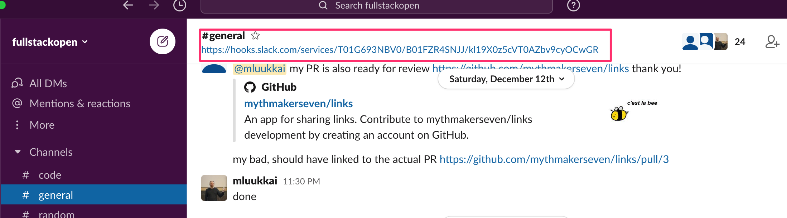
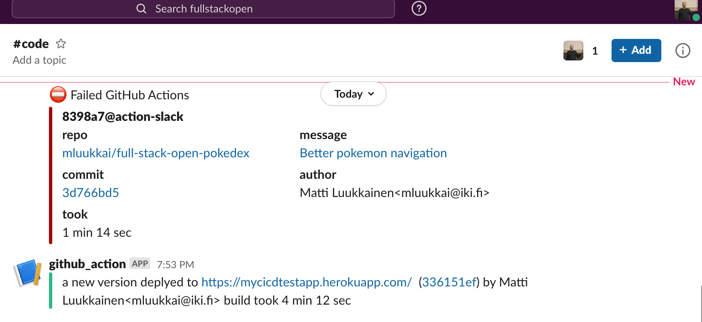

<!-- This part has focus on building a simple, effective, and robust CI system that helps developers to work together, maintain code quality, and deploy safely. What more could one possibly want? In the real world, there are more fingers in the pie than just developers and users. Even if that weren't true, even for developers, there's a lot more value to be gained from CI systems than just the things above. -->
这一章节的重点是构建一个简单、有效和健壮的 ci 系统，帮助开发人员协同工作，保持代码质量，安全部署。在现实世界中，除了开发人员和用户，还有更多的人参与其中。即使这不是这样，即便对于开发者来说，CI 系统也比上面提到的有更多的价值。

### Visibility and Understanding
可见性和理解力

<!-- In all but the smallest companies, decisions on what to develop are not made exclusively by developers. The term 'stakeholder' is often used to refer to people, both inside and outside the development team, who may have some interest in keeping an eye on the progress of the development. To this end, there are often integrations between git and whatever project management/bug tracking software the team is using. -->
除了最小的公司之外，所有公司的开发决策都不是完全由开发人员决定的。术语“涉众”通常用来指开发团队内外的人员，他们可能有兴趣关注开发的进展。为此，git 和团队正在使用的任何项目管理/bug 跟踪软件之间通常是集成的。

<!-- A common use of this is to have some reference to the tracking system in git pull requests or commits. This way, for example, when you're working on issue number 123, you might name your pull request <code>BUG-123: Fix user copy issue</code> and the bug tracking system would notice the first part of the PR name and automatically move the issue to <code>Done</code> when the PR is merged. -->
这种方法的一个常见用途是在 git pull 请求或提交中对跟踪系统有一些参考。例如，当你正在处理第123号问题时，你可以将你的请求命名为 <code>BUG-123: Fix user copy issue</code>，bug反馈页面会注意到 PR 名称的第一部分，并在 PR 合并时自动将问题移动到 <code>Done</code> 。

### Notifications
提示

<!-- When the CI process finishes quickly, it can be convenient to just watch it execute and wait for the result. As projects become more complex, so too does the process of building and testing the code. This can quickly lead to a situation where it takes long enough to generate the build result that a developer may want to begin working on another task. This in turn leads to a forgotten build.  -->
当持续集成过程快速结束时，可以方便地观察它的执行并等待结果。随着项目变得越来越复杂，构建和测试代码的过程也变得越来越复杂。这可能很快导致这样一种情况，即生成构建结果所需的时间足够长，以至于开发人员可能希望开始处理另一个任务。这反过来又导致了一个被遗忘的构建。

<!-- This is especially problematic if we're talking about merging PRs that may affect another developer's work, either causing problems or delays for them. This can also lead to a situation where you think you've deployed something but haven't actually finished a deployment, this can lead to mis-communication with teammates and customers (e.g. "Go ahead and try that again, the bug should be fixed"). -->
如果我们讨论的是可能会影响其他开发人员工作的合并，或者会给他们带来问题或延迟，那么这种情况尤其成问题。这也可能导致您认为已经部署了某些东西，但实际上还没有完成部署的情况，这可能导致与队友和客户的错误沟通(例如“继续尝试，bug 应该被修复”)。

<!-- There are several solutions to this problem ranging from simple notifications to more complicated processes that simply merge passing code if certain conditions are met. We're going to discuss notifications as a simple solution since it's the one that interferes with the team workflow the least. -->
这个问题有几种解决方案，从简单的通知到更复杂的进程，这些进程在满足某些条件的情况下简单地合并传递代码。我们将把通知作为一个简单的解决方案来讨论，因为它对团队工作流的干扰最小。

<!-- By default, GitHub Actions sends an email on a build failure. This can be changed to send notifications regardless of build status and can also be configured to alert you on the GitHub web interface. Great. But what if we want more. What if for whatever reason this doesn't work for our use case. -->
默认情况下，GitHub Actions 会在构建失败时发送电子邮件。不管构建状态如何，这都可以改为发送通知，也可以配置为在 GitHub web 界面上提醒你。太好了。但如果我们想要更多。如果不管出于什么原因，这对我们的用例不起作用怎么办。

<!-- There are integrations for example to various messaging applications such as [Slack](https://slack.com/intl/en-fi/), to send notifications. These integrations still decide what to send and when to send it based on logic from GitHub. -->
例如，可以对各种消息传递应用程序(如  [Slack](https://slack.com/intl/en-fi/))进行集成，以发送通知。这些集成仍然基于 GitHub 的逻辑来决定发送什么和什么时候发送。

### Exercise 11.19

<!-- We have set up a Slack <i>fullstackopengroup.slack.com</i> for testing a messaging integration. Join the channel by clicking [here](https://join.slack.com/t/fullstackopengroup/shared_invite/zt-jy0669dd-41WHtYNO6WwBujp4djgJTA). Unfortunately, you need an email address for registration. If you are not willing to use your own, you can very well use a temporal email for the purposes. There are lots of options such as <https://tempmail.ninja/>. -->
我们已经建立了一个 Slack 频道<i>fullstackopengroup.slack.com</i>，用于测试信息整合。点击[这里](https://join.slack.com/t/fullstackopengroup/shared_invite/zt-kjic53k3-KvDSsrV26swkF10WO6bZ0A)加入这个频道。不幸的是，你需要一个电子邮件地址来注册。如果你不愿意使用你自己的，你可以使用一个临时电子邮件。有很多选择，比如<https://tempmail.ninja/>。

<!-- Note that you need the Slack webhook URL for doing this exercise. You find the webhook in the topic of the channel #general in <i>fullstackopengroup.slack.com</i>
 -->
请注意，您需要 Slack webhook URL 来完成这个练习。你可以在<i>fullstackopengroup.slack.com</i> 的 #general频道找到网站链接。

<!-- <i>You can also use some other Slack channel in this exercise but then you are on your own with the setup.</i> -->
<i>你也可以在这个练习中使用其他的 Slack 通道，但是你可以自己设置。</i>

#### 11.19 Build success/failure notification action
构建成功/失败通知行动

<!-- You can find dozens of third party actions from [GitHub Action Marketplace](https://github.com/marketplace?type=actions) by using the search phrase [slack](https://github.com/marketplace?type=actions&query=slack). Pick one for this exercise. My choice was [action-slack](https://github.com/marketplace/actions/action-slack) since it has quite many stars and a decent documentation. -->
通过使用搜索词 [slack](https://github.com/marketplace?type=actions&query=slack)，你可以在 [GitHub Action Marketplace](https://github.com/marketplace?type=actions) 上找到几十个第三方操作。选一个做这个练习。我的选择是[action-slack](https://github.com/marketplace/actions/action-slack)，因为它有相当多的星和一个体面的文件。

<!-- Setup the action so that it gives two types of notifications: -->
设置操作，这样它会给出两种类型的通知:
<!-- 
- A success indication if a new version gets deployed
- An error indication if a build fails -->
- 如果部署了新版本，则提供成功指示
- 生成失败时的错误指示

<!-- In the case of an error, the notification should be a bit more verbose to help developers finding quickly what was the error and which is the commit that caused it. -->
在出现错误的情况下，通知应该更详细一些，以帮助开发人员快速查找错误，以及导致错误的提交。

<!-- See [here](https://docs.github.com/en/free-pro-team@latest/actions/reference/context-and-expression-syntax-for-github-actions#job-status-check-functions) how to check the job status! -->
看看[这里](https://docs.github.com/en/free-pro-team@latest/actions/reference/context-and-expression-syntax-for-github-actions#job-status-check-functions)如何检查作业状态！

<!-- Your notifications may look like the following: -->
你的提示可能看起来如下:

### Metrics
度量

<!-- In the previous section, we mentioned that as projects get more complicated, so too, do their builds, and the duration of the builds increases. That's obviously not ideal: The longer the feedback loop, the slower the development. -->
在前面的部分中，我们提到，随着项目变得越来越复杂，他们的构建也会变得越来越复杂，构建的持续时间也会增加。这显然并不理想: 反馈回路越长，开发就越慢。

<!-- While there are things that can be done about this increase in build times, it's useful to have a better view of the overall picture. It's useful to know how long a build took a few months ago versus how long it takes now. Was the progression linear or did it suddenly jump? Knowing what caused the increase in build time can be very useful in helping to solve it. If the build time increased linearly from 5 minutes to 10 minutes over the last year, maybe we can expect it to take another few months to get to 15 minutes and we have an idea of how much value there is in spending time speeding up the CI process. -->
虽然对于构建时间的增加可以做一些事情，但是有一个更好的全局视图还是很有用的。知道一个构建在几个月前花了多长时间和现在花了多长时间是很有用的。进展是线性的还是突然跳跃的？知道是什么导致了构建时间的增加对于解决这个问题是非常有用的。如果构建时间比去年线性增长，从5分钟增加到10分钟，也许我们可以预期它还需要几个月才能达到15分钟，我们就知道花时间加速 CI 过程有多大价值了。

<!-- Metrics can either be self-reported (also called 'push' metrics, where each build reports how long it took) or the data can be fetched from the API afterward (sometimes called 'pull' metrics). The risk with self-reporting is that the self-reporting itself takes time and may have a significant impact on "total time taken for all builds". -->
度量可以是自我报告的(也称为“推送”度量，其中每个构建报告所花费的时间) ，或者之后可以从 API 中提取数据(有时也称为“pull”度量)。自我报告的风险在于，自我报告本身需要时间，并可能对“所有构建所需的总时间”产生重大影响。

<!-- This data can be sent to a time-series database or to an archive of another type. There are plenty of cloud services where you can easily aggregate the metrics, one good option is [Datadog](https://www.datadoghq.com/). -->
此数据可以发送到时间序列数据库或其他类型的存档。有许多云服务可以轻松地聚合度量，Datadog 是一个不错的选择。

### Periodic tasks
定期的任务

<!-- There are often periodic tasks that need to be done in a software development team. Some of these can be automated with commonly available tools and some you will need to automate yourself. -->
软件开发团队通常需要定期完成一些任务。其中一些可以通过常用工具实现自动化，另一些则需要自动化。

<!-- The former category includes things like checking packages for security vulnerabilities. Several tools can already do this for you. Some of these tools would even be free for certain types (e.g. open source) projects. GitHub provides one such tool, [Dependabot](https://dependabot.com/). -->
前一类包括检查包的安全漏洞。一些工具已经可以为你做到这一点。其中一些工具甚至对某些类型(例如开放源码)项目是免费的。提供了一个这样的工具，[Dependabot](https://dependabot.com/)。

<!-- Words of advice to consider: If your budget allows it, it's almost always better to use a tool that already does the job than to roll your own solution. If security isn't the industry you're aiming for, for example, use Dependabot to check for security vulnerabilities instead of making your own tool. -->
建议考虑一下: 如果你的预算允许的话，使用一个已经完成任务的工具总是比使用你自己的解决方案要好。如果安全性不是你的目标行业，例如，使用 Dependabot 检查安全漏洞，而不是制造自己的工具。

<!-- What about the tasks that don't have a tool? You can automate these yourself with GitHub Actions too. GitHub Actions provides a scheduled trigger that can be used to execute a task at a particular time. -->
那些没有工具的任务呢？你也可以使用 GitHub Actions 自动完成这些操作。提供了一个调度触发器，可以用来在特定的时间执行任务。

### Exercises 11.20-11.22

#### 11.20 Periodic health check
定期健康检查

<!-- We are pretty confident now that our pipeline prevents bad code from being deployed. However, there are many sources of errors. If our application would e.g. depend on a database that would for some reason become unavailable, our application would most likely crash. That's why it would be a good idea to set up <i>a periodic health check</i> that would regularly do an HTTP GET request to our server. We quite often refer to this kind of request as a <i>ping</i>. -->
我们现在非常有信心，我们的管道可以防止错误代码被部署。然而，错误的来源有很多。如果我们的应用程序依赖于一个数据库，而这个数据库由于某种原因变得不可用，那么我们的应用程序很可能会崩溃。这就是为什么建立一个<i>定期健康检查</i>是一个好主意，它可以定期向我们的服务器发出 HTTP GET 请求。我们经常将这种请求称为 <i>ping</i>。

<!-- It is possible to [schedule](https://docs.github.com/en/free-pro-team@latest/actions/reference/events-that-trigger-workflows#scheduled-events) GitHub actions to happen regularly.  -->
可以将 GitHub 的Action 安排成一个[日程表](https://docs.github.com/en/free-pro-team@latest/actions/reference/events-that-trigger-workflows#scheduled-events)。

<!-- Use now the action [url-health-check](https://github.com/marketplace/actions/url-health-check) or any other alternative and schedule a periodic health check ping to your deployed software. Try to simulate a situation where your application breaks down and ensure that the check detects the problem. Write this periodic workflow to an own file. -->
现在使用action [url-health-check](https://github.com/marketplace/actions/url-health-check)  或任何其他替代方法，并安排一个定期的 health check ping 到您部署的软件。尝试模拟应用程序崩溃的情况，并确保检查检测到问题。将此周期性工作流写入自己的文件。

<!-- **Note** that unfortunately it takes quite long until GitHub Actions starts the scheduled workflow for the first time. For me, it took nearly one hour. So it might be a good idea to get the check working firstly by triggering the workflow with git push. When you are sure that the check is properly working, then switch to a scheduled trigger. -->
**请注意**，不幸的是，GitHub Actions 要花很长时间才能首次启动计划工作流。对我来说，这花了将近一个小时。因此，通过使用 git push 触发工作流来让检查首先工作可能是一个好主意。当您确定检查正常工作时，然后切换到预定的触发器。

<!-- **Note also** that once you get this working, it is best to drop the ping frequency (to max once in 24 hours) or disable the rule altogether since otherways your health check may consume [all your](https://devcenter.heroku.com/articles/free-dyno-hours) monthly free hours. -->
**还要注意的是**，一旦你得到这个工作，最好是降低 ping 频率(最多24小时一次)或禁用规则，因为其他方式你的健康检查可能[消耗](https://devcenter.heroku.com/articles/free-dyno-hours) 你每月的空闲时间。

#### 11.21 Your own pipeline
你自己的管道

<!-- Build a similar CI/CD-pipeline for some of your own applications. Some of the good candidates are the phonebook app that was built in parts 2 and 3 of the course, or the blogapp built in parts 4 and 5, or the redux anecdotes built in part 6. You may also use some app of your own for this exercise. -->
为您自己的一些应用程序构建类似的 CI/CD-pipeline。一些优秀的候选者包括课程第2和第3部分中的电话簿应用程序，或者第4和第5部分中的博客应用程序，或者第6部分中的趣闻轶事。你也可以使用你自己的一些应用来做这个练习。

<!-- You most likely need to do some restructuring to get all the pieces together. A logical first step is to store both the frontend and backend code in the same repository. This is not a requirement but it is recommended since it makes things much more simple. -->
你很可能需要进行一些重组来把所有的部分组合在一起。合乎逻辑的第一步是将前端和后端代码存储在同一个代码库中。这不是一个要求，但是建议这样做，因为它使事情变得更简单。

<!-- One possible repository structure would be to have the backend at the root of the repository and the frontend as a subdirectory. You can also "copy paste" the structure of the example app of this part or try out the [example app](https://github.com/fullstack-hy2020/create-app) mentioned in [part 7](/en/part7/class_components_miscellaneous#frontend-and-backend-in-the-same-repository). -->
一种可能的代码库结构是将后端放在代码库的根目录，前端作为子目录。你也可以“复制粘贴”这一部分的[示例应用程序](https://github.com/fullstack-hy2020/create-app)的结构，或者尝试[第7章节](/zh/part7/class_components_miscellaneous#frontend-and-backend-in-the-same-repository)中提到的示例应用程序。

<!-- It is perhaps best to create a new repository for this exercise and simply copy and paste the old code there. In real life, you most likely would do this all in the old repository but now "a fresh start" makes things easier. -->
也许最好为这个练习创建一个新的代码库，并简单地复制和粘贴旧代码。在现实生活中，您很可能会在旧知识库中完成所有这些工作，但现在“一个全新的开始”使事情变得更容易。

<!-- This is a long and perhaps quite a tough exercise, but this kind of situation where you have a "legacy code" and you need to build   proper deployment pipeline is quite common in real life! -->
这是一个漫长而且可能相当艰难的过程，但是在现实生活中，您拥有一个“遗留代码”并且需要构建适当的部署管道的这种情况非常常见！

<!-- Obviously, this exercise is not done in the same repository as the previous exercises. Since you can return only one repository to the submission system, put a link of the <i>other</i> repository to the one you fill into the submission form. -->
显然，这个练习不是在与前面练习相同的代码库中完成的。由于您只能向提交系统返回一个代码库，因此将<i>另一个</i>代码库的链接与您在提交表单中填写的代码库链接起来。

#### 11.22 Protect master and ask for pull request
保护主分支并请求PR

<!-- Protect the master branch of the repository where you did the previous exercise. This time prevent also the administrators from merging the code without a review. -->
保护代码库的主分支，前面的练习就是在这个分支中进行的。这一次也防止了管理员在没有检查的情况下合并代码。

<!-- Do a pull request and ask any of GitHub users [mluukkai](https://github.com/mluukkai), [kaltsoon](https://github.com/kaltsoon) or [jakousa](https://github.com/jakousa) to review your code. Once the review is done, merge your code to master.  -->
执行一个 pull 请求，并要求任何 GitHub 用户[mluukkai](https://github.com/mluukkai), [kaltsoon](https://github.com/kaltsoon) 或 [jakousa](https://github.com/jakousa) 检查您的代码。一旦评审完成，将你的代码合并到主分支中。

<!-- Then you are done! -->
完事儿！

### Submitting exercises and getting the credits
提交练习并获得学分

<!-- Exercises of this part are submitted via [the submissions system](https://studies.cs.helsinki.fi/stats/courses/fs-cicd) just like in the previous parts, but unike parts 0 to 9, the submission goes to different "course instance". Remember that you have to finish <i>all the exercises</i> to pass this part! -->
这一部分的练习和前面的部分一样是通过[提交系统](https://studies.cs.helsinki.fi/stats/courses/fs-cicd)提交的，但是结合0到9部分，提交的是不同的“课程实例”。记住，你必须完成所有的练习才能通过这一部分！

<!-- Your solutions are in two repositories (pokedex and your own project), and since you can return only one repository to the submission system, put a link of the <i>other</i> repository to the one you fill into the submission form! -->
您的解决方案位于两个代码库(pokedex 和您自己的项目)中，由于您只能向提交系统返回一个代码库，因此将另一个代码库与您填写的代码库的链接放到提交表单中！

<!-- Once you have completed the exercises and want to get the credits, let us know through the exercise submission system that you have completed the course: -->
一旦你完成了练习并且想获得学分，通过练习提交系统让我们知道你已经完成了课程:

<!-- Note that the "exam done in Moodle" note refers to the [Full Stack Open course's exam](/en/part0/general_info#sign-up-for-the-exam), which has to be completed before you can earn credits from this part. -->
请注意，“在 Moodle 完成的考试”指的是全堆栈公开课程的考试 [Full Stack Open course's exam](/zh/part0/general_info#sign-up-for-the-exam)，必须完成后，你才能从这一部分获得学分。

<!-- You can download the certificate for completing this part by clicking one of the flag icons. The flag icon corresponds to the certificate's language.  -->
您可以通过单击其中一个标志图标来下载完成此部分的证书。标志图标对应于证书的语言。

