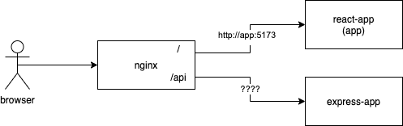
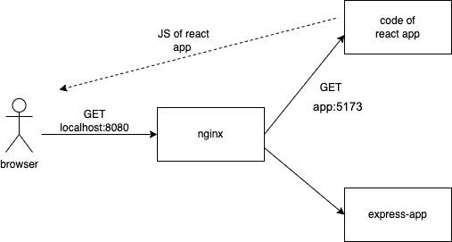
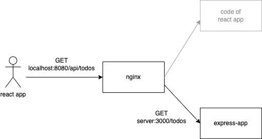
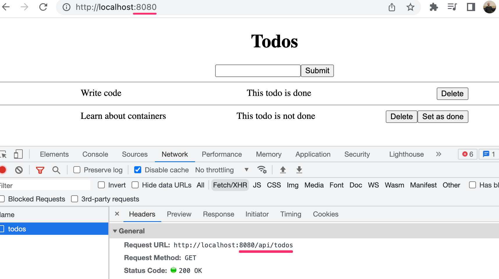

<div class="content">
</div>

<div class="tasks">

The part was updated 21th Mar 2024: Create react app was replaced with Vite in the todo-frontend.

If you started the part before the update, you can see [here](https://github.com/fullstack-hy2020/fullstack-hy2020.github.io/tree/4015af9dddb61cb01f013456d8728e8f553be347/src/content/12) the old material. There are some changes in the frontend configurations.
</div>

<div class="content">

We have now a basic understanding of Docker and can use it to easily set up eg. a database for our app. Let us now move our focus to the frontend. 

### React in container

Let's create and containerize a React application next. We start with the usual steps

```bash
$ npm create vite@latest hello-front -- --template react
$ cd hello-front
$ npm install
```


The next step is to turn the JavaScript code and CSS, into production-ready static files. Vite already has _build_ as an npm script so let's use that:

```bash
$ npm run build
  ...

  Creating an optimized production build...
  ...
  The build folder is ready to be deployed.
  ...
```

Great! The final step is figuring out a way to use a server to serve the static files. As you may know, we could use our [express.static](https://expressjs.com/en/starter/static-files.html) with the Express server to serve the static files. I'll leave that as an exercise for you to do at home. Instead, we are going to go ahead and start writing our Dockerfile:

```Dockerfile
FROM node:20

WORKDIR /usr/src/app

COPY . .

RUN npm ci

RUN npm run build
```

That looks about right. Let's build it and see if we are on the right track. Our goal is to have the build succeed without errors. Then we will use bash to check inside of the container to see if the files are there.

```bash
$ docker build . -t hello-front
 => [4/5] RUN npm ci                  
 => [5/5] RUN npm run 
 ...             
 => => naming to docker.io/library/hello-front

$ docker run -it hello-front bash

root@98fa9483ee85:/usr/src/app# ls
  Dockerfile  README.md  dist  index.html  node_modules  package-lock.json  package.json	public	src  vite.config.js

root@98fa9483ee85:/usr/src/app# ls dist
  assets	index.html  vite.svg
```

A valid option for serving static files now that we already have Node in the container is [serve](https://www.npmjs.com/package/serve). Let's try installing serve and serving the static files while we are inside the container.

```bash
root@98fa9483ee85:/usr/src/app# npm install -g serve

  added 89 packages in 2s

root@98fa9483ee85:/usr/src/app# serve dist

   ┌────────────────────────────────────────┐
   │                                        │
   │   Serving!                             │
   │                                        │
   │   - Local:    http://localhost:3000    │
   │   - Network:  http://172.17.0.2:3000   │
   │                                        │
   └────────────────────────────────────────┘

```

Great! Let's ctrl+c and exit out and then add those to our Dockerfile.

The installation of serve turns into a RUN in the Dockerfile. This way the dependency is installed during the build process. The command to serve the <i>dist</i> directory will become the command to start the container:

```Dockerfile
FROM node:20

WORKDIR /usr/src/app

COPY . .

RUN npm ci

RUN npm run build

RUN npm install -g serve # highlight-line

CMD ["serve", "dist"] # highlight-line
```

Our CMD now includes square brackets and as a result, we now use the so-called <i>exec form</i> of CMD. There are actually **three** different forms for the CMD out of which the exec form is preferred. Read the [documentation](https://docs.docker.com/engine/reference/builder/#cmd) for more info.

When we now build the image with _docker build . -t hello-front_ and run it with _docker run -p 5001:3000 hello-front_, the app will be available in http://localhost:5001.

### Using multiple stages

While serve is a <i>valid</i> option we can do better. A good goal is to create Docker images so that they do not contain anything irrelevant. With a minimal number of dependencies, images are less likely to break or become vulnerable over time. 

[Multi-stage builds](https://docs.docker.com/develop/develop-images/multistage-build/) are designed to split the build process into many separate stages, where it is possible to limit what parts of the image files are moved between the stages. That opens possibilities for limiting the size of the image since not all by-products of the build are necessary for the resulting image. Smaller images are faster to upload and download and they help reduce the number of vulnerabilities your software may have.

With multi-stage builds, a tried and true solution like [Nginx](https://en.wikipedia.org/wiki/Nginx) can be used to serve static files without a lot of headaches. The Docker Hub [page for Nginx](https://hub.docker.com/_/nginx) tells us the required info to open the ports and "Hosting some simple static content".

Let's use the previous Dockerfile but change the FROM to include the name of the stage:

```Dockerfile
# The first FROM is now a stage called build-stage
FROM node:20 AS build-stage # highlight-line

WORKDIR /usr/src/app

COPY . .

RUN npm ci

RUN npm run build

# This is a new stage, everything before this is gone, except the files we want to COPY
FROM nginx:1.25-alpine # highlight-line

# COPY the directory build from build-stage to /usr/share/nginx/html
# The target location here was found from the Docker hub page
COPY --from=build-stage /usr/src/app/dist /usr/share/nginx/html # highlight-line
```

We have declared also <i>another stage</i> where only the relevant files of the first stage (the <i>dist</i> directory, that contains the static content) are copied.

After we build it again, the image is ready to serve the static content. The default port will be 80 for Nginx, so something like _-p 8000:80_ will work, so the parameters of the run command need to be changed a bit.

Multi-stage builds also include some internal optimizations that may affect your builds. As an example, multi-stage builds skip stages that are not used. If we wish to use a stage to replace a part of a build pipeline, like testing or notifications, we must pass **some** data to the following stages. In some cases this is justified: copy the code from the testing stage to the build stage. This ensures that you are building the tested code.

</div>

<div class="tasks">

### Exercises 12.13 - 12.14.

#### Exercise 12.13: Todo application frontend

Finally, we get to the todo-frontend. View the todo-app/todo-frontend and read through the README.

Start by running the frontend outside the container and ensure that it works with the backend.

Containerize the application by creating <i>todo-app/todo-frontend/Dockerfile</i> and use [ENV](https://docs.docker.com/engine/reference/builder/#env) instruction to pass *VITE\_BACKEND\_URL* to the application and run it with the backend. The backend should still be running outside a container. 

**Note** that you need to set *VITE\_BACKEND\_URL* before building the frontend, otherwise, it does not get defined in the code!

#### Exercise 12.14: Testing during the build process

One interesting possibility to utilize multi-stage builds is to use a separate build stage for [testing](https://docs.docker.com/language/nodejs/run-tests/). If the testing stage fails, the whole build process will also fail. Note that it may not be the best idea to move <i>all testing</i> to be done during the building of an image, but there may be <i>some</i> containerization-related tests where it might be worth considering. 

Extract a component <i>Todo</i> that represents a single todo. Write a test for the new component and add running tests into the build process.

You can add a new build stage for the test if you wish to do so. If you do so, remember to read the last paragraph before exercise 12.13 again!

</div>

<div class="content">

### Development in containers

Let's move the whole todo application development to a container. There are a few reasons why you would want to do that:

- To keep the environment similar between development and production to avoid bugs that appear only in the production environment
- To avoid differences between developers and their personal environments that lead to difficulties in application development
- To help new team members hop in by having them install container runtime - and requiring nothing else.

These all are great reasons. The tradeoff is that we may encounter some unconventional behavior when we aren't running the applications like we are used to. We will need to do at least two things to move the application to a container:

- Start the application in development mode
- Access the files with VS Code

Let's start with the frontend. Since the Dockerfile will be significantly different from the production Dockerfile let's create a new one called <i>dev.Dockerfile</i>.

**Note** we shall use the name <i>dev.Dockerfile</i> for development configurations and <i>Dockerfile</i> othervise.

Starting the Vite in development mode should be easy. Let's start with the following:

```Dockerfile
FROM node:20

WORKDIR /usr/src/app

COPY . .

# Change npm ci to npm install since we are going to be in development mode
RUN npm install

# npm start is the command to start the application in development mode
CMD ["npm", "run", "dev", "--", "--host"]
```

> Note the extra parameters _-- --host_ in the _CMD_. Those are needed to expose the development server to be visible outside the Docker network. By default the development server is exposed only to localhost, and despite we access the frontend still using the localhost address, it is in reality attached to the Docker network.
 
During build the flag _-f_ will be used to tell which file to use, it would otherwise default to Dockerfile, so the following command will build the image:

```bash
docker build -f ./dev.Dockerfile -t hello-front-dev .
```

The Vite will be served in port 5173, so you can test that it works by running a container with that port published.

The second task, accessing the files with VSCode, is not yet taken care of. There are at least two ways of doing this: 

- [The Visual Studio Code Remote - Containers extension](https://code.visualstudio.com/docs/remote/containers) 
- Volumes, the same thing we used to preserve data with the database

Let's go over the latter since that will work with other editors as well. Let's do a trial run with the flag _-v_, and if that works, then we will move the configuration to a docker-compose file. To use the _-v_, we will need to tell it the current directory. The command _pwd_ should output the path to the current directory for you. Try this with _echo $(pwd)_ in your command line. We can use that as the left side for _-v_ to map the current directory to the inside of the container or you can use the full directory path.

```bash
$ docker run -p 5173:5173 -v "$(pwd):/usr/src/app/" hello-front-dev
> todo-vite@0.0.0 dev
> vite --host

  VITE v5.1.6  ready in 130 ms
```

Now we can edit the file <i>src/App.js</i>, and the changes should be hot-loaded to the browser!

If you have a Mac with M1/M2 processor, the above command fails. In the error message, we notice the following:

```
Error: Cannot find module @rollup/rollup-linux-arm64-gnu
```

The problem is the library [rollup](https://www.npmjs.com/package/rollup) that has its own version for all operating systems and processor architectures. Due to the volume mapping, the container is now using the *node_modules* from the host machine directory where the _@rollup/rollup-darwin-arm64_ (the version suitable Mac M1/M2) is installed, so the right version of the library for the container _@rollup/rollup-linux-arm64-gnu_ is not found.

There are several ways to fix the problem. Let's use the perhaps simplest one. Start the container with bash as the command, and run the _npm install_ inside the container:

```bash
$ docker run -it -v "$(pwd):/usr/src/app/" front-dev bash
root@b83e9040b91d:/usr/src/app# npm install
```

Now both versions of the library rollup are installed and the container works!  

Next, let's move the config to the file <i>docker-compose.dev.yml</i>. That file should be at the root of the project as well:

```yml
services:
  app:
    image: hello-front-dev
    build:
      context: . # The context will pick this directory as the "build context"
      dockerfile: dev.Dockerfile # This will simply tell which dockerfile to read
    volumes:
      - ./:/usr/src/app # The path can be relative, so ./ is enough to say "the same location as the docker-compose.yml"
    ports:
      - 5173:5173
    container_name: hello-front-dev # This will name the container hello-front-dev
```

With this configuration, _docker compose up_ can run the application in development mode. You don't even need Node installed to develop it!

**Note** we shall use the name <i>docker-compose.dev.yml</i> for development environment compose files, and the default name <i>docker-compose.yml</i> othervise.

Installing new dependencies is a headache for a development setup like this. One of the better options is to install the new dependency **inside** the container. So instead of doing e.g. _npm install axios_, you have to do it in the running container e.g. _docker exec hello-front-dev npm install axios_, or add it to the package.json and run _docker build_ again.

</div>
<div class="tasks">

### Exercise 12.15

#### Exercise 12.15: Set up a frontend development environment

Create <i>todo-frontend/docker-compose.dev.yml</i> and use volumes to enable the development of the todo-frontend while it is running <i>inside</i> a container.

</div>

<div class="content">

### Communication between containers in a Docker network

The Docker Compose tool sets up a network between the containers and includes a DNS to easily connect two containers. Let's add a new service to the Docker Compose and we shall see how the network and DNS work.

[Busybox](https://www.busybox.net/) is a small executable with multiple tools you may need. It is called "The Swiss Army Knife of Embedded Linux", and we definitely can use it to our advantage.

Busybox can help us to debug our configurations. So if you get lost in the later exercises of this section, you should use Busybox to find out what works and what doesn't. Let's use it to explore what was just said. That containers are inside a network and you can easily connect between them. Busybox can be added to the mix by changing <i>docker-compose.dev.yml</i> to:

```yml
services:
  app:
    image: hello-front-dev
    build:
      context: .
      dockerfile: dev.Dockerfile
    volumes:
      - ./:/usr/src/app
    ports:
      - 5173:5173
    container_name: hello-front-dev
  debug-helper: # highlight-line
    image: busybox # highlight-line
```

The Busybox container won't have any process running inside so we can not _exec_ in there. Because of that, the output of _docker compose up_ will also look like this:

```bash
$ docker compose -f docker-compose.dev.yml up                                                                                    0.0s
Attaching to front-dev, debug-helper-1
debug-helper-1 exited with code 0
front-dev       |
front-dev       | > todo-vite@0.0.0 dev
front-dev       | > vite --host
front-dev       |
front-dev       |
front-dev       |   VITE v5.2.2  ready in 153 ms
```

This is expected as it's just a toolbox. Let's use it to send a request to hello-front-dev and see how the DNS works. While the hello-front-dev is running, we can do the request with [wget](https://en.wikipedia.org/wiki/Wget) since it's a tool included in Busybox to send a request from the debug-helper to hello-front-dev.

With Docker Compose we can use _docker compose run SERVICE COMMAND_ to run a service with a specific command. Command wget requires the flag _-O_ with _-_ to output the response to the stdout:

```bash
$ docker compose -f docker-compose.dev.yml run debug-helper wget -O - http://app:5173

Connecting to app:5173 (192.168.240.3:5173)
writing to stdout
<!doctype html>
<html lang="en">
  <head>
    <script type="module">
      ...
```

The URL is the interesting part here. We simply said to connect to port 5173 of the service <i>app</i>. The <i>app</i> is the name of the service specified in the <i>docker-compose.dev.yml</i>:

```yml
services:
  app: # highlight-line
    image: hello-front-dev
    build:
      context: .
      dockerfile: dev.Dockerfile
    volumes:
      - ./:/usr/src/app
    ports:
      - 5173:5173 # highlight-line
    container_name: hello-front-dev
```

The port used is the port from which the application is available in that container, also specified in the <i>docker-compose.dev.yml</i>. The port does not need to be published for other services in the same network to be able to connect to it. The "ports" in the docker-compose file are only for external access.

Let's change the port configuration in the <i>docker-compose.dev.yml</i> to emphasize this:

```yml
services:
  app:
    image: hello-front-dev
    build:
      context: .
      dockerfile: dev.Dockerfile
    volumes:
      - ./:/usr/src/app
    ports:
      - 3210:5173 # highlight-line
    container_name: hello-front-dev
  debug-helper:
    image: busybox
```

With _docker compose up_ the application is available in <http://localhost:3210> at the <i>host machine</i>, but the command 

```bash
docker compose  -f docker-compose.dev.yml run debug-helper wget -O - http://app:5173
```

works still since the port is still 5173 within the docker network.

The below image illustrates what happens. The command _docker compose run_ asks debug-helper to send the request within the network. While the browser in the host machine sends the request from outside of the network.


Now that you know how easy it is to find other services in the <i>docker-compose.yml</i> and we have nothing to debug we can remove the debug-helper and revert the ports to 5173:5173 in our compose file.

</div>
<div class="tasks">

### Exercise 12.16

#### Exercise 12.16: Run todo-backend in a development container

Use volumes and Nodemon to enable the development of the todo app backend while it is running <i>inside</i> a container. Create a <i>todo-backend/dev.Dockerfile</i> and edit the <i>todo-backend/docker-compose.dev.yml</i>.

You will also need to rethink the connections between backend and MongoDB / Redis. Thankfully Docker Compose can include environment variables that will be passed to the application:

```yaml
services:
  server:
    image: ...
    volumes:
      - ...
    ports:
      - ...
    environment: 
      - REDIS_URL=redisurl_here
      - MONGO_URL=mongourl_here
```

The URLs  are purposefully wrong, you will need to set the correct values. Remember to <i>look all the time what happens in console</i>. If and when things blow up, the error messages hint at what might be broken.

Here is a possibly helpful image illustrating the connections within the docker network:


</div>

<div class="content">

### Communications between containers in a more ambitious environment

Next, we will configure a [reverse proxy](https://en.wikipedia.org/wiki/Reverse_proxy) to our docker-compose.dev.yml. According to wikipedia

> <i>A reverse proxy is a type of proxy server that retrieves resources on behalf of a client from one or more servers. These resources are then returned to the client, appearing as if they originated from the reverse proxy server itself.</i>

So in our case, the reverse proxy will be the single point of entry to our application, and the final goal will be to set both the React frontend and the Express backend behind the reverse proxy. 

There are multiple different options for a reverse proxy implementation, such as Traefik, Caddy, Nginx, and Apache (ordered by initial release from newer to older).

Our pick is [Nginx](https://hub.docker.com/_/nginx). 

Let us now put the <i>hello-frontend</i> behind the reverse proxy.

Create a file <i>nginx.dev.conf</i> in the project root and take the following template as a starting point. We will need to do minor edits to have our application running:

```bash
# events is required, but defaults are ok
events { }

# A http server, listening at port 80
http {
  server {
    listen 80;

    # Requests starting with root (/) are handled
    location / {
      # The following 3 lines are required for the hot loading to work (websocket).
      proxy_http_version 1.1;
      proxy_set_header Upgrade $http_upgrade;
      proxy_set_header Connection 'upgrade';
      
      # Requests are directed to http://localhost:5173
      proxy_pass http://localhost:5173;
    }
  }
}
```

**Note** we are using the familiar naming convention also for Nginx, <i>nginx.dev.conf</i> for development configurations, and the default name<i>nginx.conf</i> othervise.

Next, create an Nginx service in the <i>docker-compose.dev.yml</i> file. Add a volume as instructed in the Docker Hub page where the right side is _:/etc/nginx/nginx.conf:ro_, the final ro declares that the volume will be <i>read-only</i>:

```yml
services:
  app:
    # ...
  nginx:
    image: nginx:1.20.1
    volumes:
      - ./nginx.dev.conf:/etc/nginx/nginx.conf:ro
    ports:
      - 8080:80
    container_name: reverse-proxy
    depends_on:
      - app # wait for the frontend container to be started
```

with that added, we can run _docker compose -f docker-compose.dev.yml up_ and see what happens.

```bash
$ docker container ls
CONTAINER ID   IMAGE            COMMAND  PORTS                   NAMES
a02ae58f3e8d   nginx:1.20.1     ...      0.0.0.0:8080->80/tcp    reverse-proxy
5ee0284566b4   hello-front-dev  ...      0.0.0.0:5173->5173/tcp  hello-front-dev
```

Connecting to http://localhost:8080 will lead to a familiar-looking page with 502 status. 

This is because directing requests to http://localhost:5173 leads to nowhere as the Nginx container does not have an application running in port 5173. By definition, localhost refers to the current computer used to access it. Since the localhost is unique for each container, it always points to the container itself.

Let's test this by going inside the Nginx container and using curl to send a request to the application itself. In our usage curl is similar to wget, but won't need any flags.

```bash
$ docker exec -it reverse-proxy bash  

root@374f9e62bfa8:/# curl http://localhost:80
  <html>
  <head><title>502 Bad Gateway</title></head>
  ...
```

To help us, Docker Compose has set up a network when we ran _docker compose up_. It has also added all of the containers mentioned in the <i>docker-compose.dev.yml</i> to the network. A DNS makes sure we can find the other containers in the network. The containers are each given two names: the service name and the container name and both can be used to communicate with a container.

Since we are inside the container, we can also test the DNS! Let's curl the service name (app) in port 5173

```html
root@374f9e62bfa8:/# curl http://app:5173
<!doctype html>
<html lang="en">
  <head>
    <script type="module" src="/@vite/client"></script>
    <meta charset="UTF-8" />
    <link rel="icon" type="image/svg+xml" href="/vite.svg" />
    <meta name="viewport" content="width=device-width, initial-scale=1.0" />
    <title>Vite + React</title>
  </head>
  <body>
    <div id="root"></div>
    <script type="module" src="/src/main.jsx"></script>
  </body>
</html>
```

That is it! Let's replace the proxy_pass address in nginx.dev.conf with that one.

One more thing: we added an option [depends_on](https://docs.docker.com/compose/compose-file/compose-file-v3/#depends_on) to the configuration that ensures that the _nginx_ container is not started before the frontend container _app_ is started:

```bash
services:
  app:
    # ...
  nginx:
    image: nginx:1.20.1
    volumes:
      - ./nginx.conf:/etc/nginx/nginx.conf:ro
    ports:
      - 8080:80
    container_name: reverse-proxy
    depends_on: // highlight-line
      - app // highlight-line
```

If we do not enforce the starting order with <i>depends\_on</i> there a risk that Nginx fails on startup since it tries to resolve all DNS names that are referred in the config file:

```bash
http {
  server {
    listen 80;

    location / {
      proxy_http_version 1.1;
      proxy_set_header Upgrade $http_upgrade;
      proxy_set_header Connection 'upgrade';
      
      proxy_pass http://app:5173; // highlight-line
    }
  }
}
```


 Note that <i>depends\_on</i> does not guarantee that the service in the depended container is ready for action, it just ensures that the container has been started (and the corresponding entry is added to DNS). If a service needs to wait another service to become ready before the startup, [other solutions](https://docs.docker.com/compose/startup-order/) should be used.

</div>

<div class="tasks">

### Exercises 12.17. - 12.19.

#### Exercise 12.17: Set up an Nginx reverse proxy server in front of todo-frontend

We are going to put the Nginx server in front of both todo-frontend and todo-backend. Let's start by creating a new docker-compose file <i>todo-app/docker-compose.dev.yml</i> and <i>todo-app/nginx.dev.conf</i>.

```bash
todo-app
├── todo-frontend
├── todo-backend
├── nginx.dev.conf // highlight-line
└── docker-compose.dev.yml // highlight-line
```

Add the services Nginx and todo-frontend built with <i>todo-app/todo-frontend/dev.Dockerfile</i> into the <i>todo-app/docker-compose.dev.yml</i>.


In this and the following exercises you **do not** need to support the the build option, that is, the command

```bash
docker compose -f docker-compose.dev.yml up --build
```

It is enough to build the frontend and backend at their own repositories.

#### Exercise 12.18: Configure the Nginx server to be in front of todo-backend

Add the service todo-backend to the docker-compose file <i>todo-app/docker-compose.dev.yml</i> in development mode.

Add a new location to the <i>nginx.dev.conf</i> so that requests to _/api_ are proxied to the backend. Something like this should do the trick:

```conf
  server {
    listen 80;

    # Requests starting with root (/) are handled
    location / {
      proxy_http_version 1.1;
      proxy_set_header Upgrade $http_upgrade;
      proxy_set_header Connection 'upgrade';
      
      proxy_pass ...
    }

    # Requests starting with /api/ are handled
    location /api/ {
      proxy_pass ...
    }
  }
```

The *proxy\_pass* directive has an interesting feature with a trailing slash. As we are using the path _/api_ for location but the backend application only answers in paths _/_ or _/todos_ we will want the _/api_ to be removed from the request. In other words, even though the browser will send a GET request to _/api/todos/1_ we want the Nginx to proxy the request to _/todos/1_. Do this by adding a trailing slash _/_ to the URL at the end of *proxy\_pass*.

This is a [common issue](https://serverfault.com/questions/562756/how-to-remove-the-path-with-an-nginx-proxy-pass)


This illustrates what we are looking for and may be helpful if you are having trouble:



#### Exercise 12.19: Connect the services, todo-frontend with todo-backend

> In this exercise, submit the entire development environment, including both Express and React applications, dev.Dockerfiles and docker-compose.dev.yml.

Finally, it is time to put all the pieces together. Before starting, it is essential to understand <i>where</i> the React app is actually run. The above figure might give the impression that React app is run in the container but it is totally wrong. 

It is just the <i>React app source code</i> that is in the container. When the browser hits the address http://localhost:8080 (assuming that you set up Nginx to be accessed in port 8080), the React source code gets downloaded from the container to the browser:



Next, the browser starts executing the React app, and all the requests it makes to the backend should be done through the Nginx reverse proxy:



The frontend container is actually no more accessed beyond the first request that gets the React app source code to the browser.

Now set up your app to work as depicted in the above figure. Make sure that the todo-frontend works with todo-backend. It will require changes to the *VITE\_BACKEND\_URL* environmental variable in the frontend.

Make sure that the development environment is now fully functional, that is:
- all features of the todo app work
- you can edit the source files <i>and</i> the changes take effect by reloading the app
- frontend should access the backend through Nginx, so the requests should be done to http://localhost:8080/api/todos:



Note that your app should work even if no [exposed port](https://docs.docker.com/compose/compose-file/compose-file-v3/#ports) are defined for the backend and frontend in the docker compose file:

```yml
services:
  app:
    image: todo-front-dev
    volumes:
      - ./todo-frontend/:/usr/src/app
    # no ports here!

  server:
      image: todo-back-dev
      volumes:
        - ./todo-backend/:/usr/src/app
      environment: 
        - ...
      # no ports here!

  nginx:
    image: nginx:1.20.1
    volumes:
      - ./nginx.conf:/etc/nginx/nginx.conf:ro
    ports:
      - 8080:80 # this is needed
    container_name: reverse-proxy
    depends_on:
      - app
```

We just need to expose the Nginx port to the host machine since the access to the backend and frontend is proxied to the right container port by Nginx. Because Nginx, frontend and backend are defined in the same Docker compose configuration, Docker puts those to the same [Docker network](https://docs.docker.com/compose/networking/) and thanks to that, Nginx has direct access to frontend and backend containers ports.

</div>

<div class="content">

### Tools for Production

Containers are fun tools to use in development, but the best use case for them is in the production environment. There are many more powerful tools than Docker Compose to run containers in production.

Heavyweight container orchestration tools like [Kubernetes](https://kubernetes.io/) allow us to manage containers on a completely new level. These tools hide away the physical machines and allow us, the developers, to worry less about the infrastructure.

If you are interested in learning more in-depth about containers come to the [DevOps with Docker](https://devopswithdocker.com) course and you can find more about Kubernetes in the advanced 5 credit [DevOps with Kubernetes](https://devopswithkubernetes.com) course. You should now have the skills to complete both of them!

</div>

<div class="tasks">

### Exercises 12.20.-12.22.

#### Exercise 12.20:

Create a production <i>todo-app/docker-compose.yml</i> with all of the services, Nginx, todo-backend, todo-frontend, MongoDB and Redis. Use Dockerfiles instead of <i>dev.Dockerfiles</i> and make sure to start the applications in production mode.

Please use the following structure for this exercise:

```bash
todo-app
├── todo-frontend
├── todo-backend
├── nginx.dev.conf
├── docker-compose.dev.yml
├── nginx.conf  // highlight-line
└── docker-compose.yml // highlight-line
```

#### Exercise 12.21:

Create a similar containerized development environment of one of <i>your own</i> full stack apps that you have created during the course or in your free time. You should structure the app in your submission repository as follows:

```bash
└── my-app
    ├── frontend
    |    └── dev.Dockerfile
    ├── backend
    |    └── dev.Dockerfile
    ├── nginx.dev.conf
    └── docker-compose.dev.yml
```

#### Exercise 12.22:

Finish this part by creating a containerized <i>production setup</i> of your own full stack app.
Structure the app in your submission repository as follows:

```bash
└── my-app
    ├── frontend
    |    ├── dev.Dockerfile
    |    └── Dockerfile
    ├── backend
    |    └── dev.Dockerfile
    |    └── Dockerfile
    ├── nginx.dev.conf
    ├── nginx.conf
    ├── docker-compose.dev.yml
    └── docker-compose.yml
```
### Submitting exercises and getting the credits

This was the last exercise in this section. It's time to push your code to GitHub and mark all of your finished exercises to the [exercise submission system](https://studies.cs.helsinki.fi/stats/courses/fs-containers).

Exercises of this part are submitted just like in the previous parts, but unlike parts 0 to 7, the submission goes to an own [course instance](https://studies.cs.helsinki.fi/stats/courses/fs-containers). Remember that you have to finish <i>all the exercises</i> to pass this part!

Once you have completed the exercises and want to get the credits, let us know through the exercise submission system that you have completed the course:


**Note** that you need a registration to the corresponding course part for getting the credits registered, see [here](/en/part0/general_info#parts-and-completion) for more information.

You can download the certificate for completing this part by clicking one of the flag icons. The flag icon corresponds to the certificate's language. 

</div>

</div>
