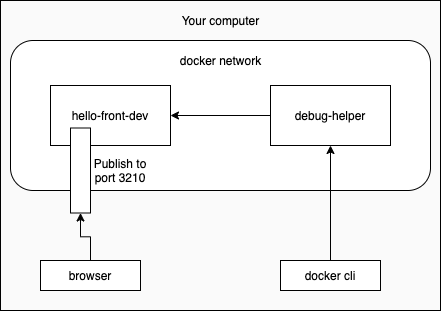
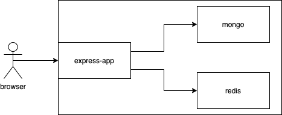
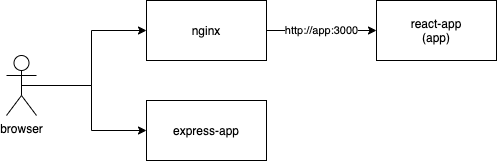
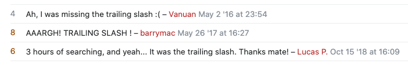
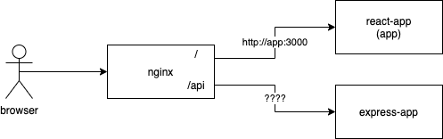

<div class="content">

### React in container

<!-- Let's create and containerize a React application next. Let us choose npm as the package manager even though create-react-app defaults to yarn.-->
 接下来让我们创建一个React应用并进行容器化。让我们选择npm作为软件包管理器，尽管create-react-app默认为yarn。

```
$ npx create-react-app hello-front --use-npm
  ...

  Happy hacking!
```

<!-- The create-react-app already installed all dependencies for us, so we did not need to run npm install here.-->
 create-react-app已经为我们安装了所有的依赖项，所以我们不需要在这里运行npm install。

<!-- The next step is to turn the JavaScript code and CSS, into production-ready static files. The create-react-app already has _build_ as an npm script so let's use that:-->
 下一步是将JavaScript代码和CSS，变成可生产的静态文件。create-react-app已经有_build_作为一个npm脚本，所以让我们使用它。

```
$ npm run build
  ...

  Creating an optimized production build...
  ...
  The build folder is ready to be deployed.
  ...
```

<!-- Great! The final step is figuring a way to use a server to serve the static files. As you may know, we could use our [express.static](https://expressjs.com/en/starter/static-files.html) with the Express server to serve the static files. I'll leave that as an exercise for you to do at home. Instead, we are going to go ahead and start writing our Dockerfile:-->
 很好!最后一步是想出一个办法，使用服务器来提供静态文件。正如你所知，我们可以使用[express.static](https://expressjs.com/en/starter/static-files.html)和Express服务器来提供静态文件。我将把这个问题留给你在家里做练习。相反，我们将继续写我们的Docker文件。

```Dockerfile
FROM node:16

WORKDIR /usr/src/app

COPY . .

RUN npm ci

RUN npm run build
```

<!-- That looks about right. Let's build it and see if we are on the right track. Our goal is to have the build succeed without errors. Then we will use bash to check inside of the container to see if the files are there.-->
 这看起来是对的。让我们来构建它，看看我们是否在正确的轨道上。我们的目标是让构建成功而不出错。然后我们将使用bash检查容器内部，看看文件是否在那里。

```bash
$ docker build . -t hello-front
  [+] Building 172.4s (10/10) FINISHED

$ docker run -it hello-front bash

root@98fa9483ee85:/usr/src/app# ls
  Dockerfile  README.md  build  node_modules  package-lock.json  package.json  public  src

root@98fa9483ee85:/usr/src/app# ls build/
  asset-manifest.json  favicon.ico  index.html  logo192.png  logo512.png  manifest.json  robots.txt  static
```

<!-- A valid option for serving static files now that we already have Node in the container is [serve](https://www.npmjs.com/package/serve). Let's try installing serve and serving the static files while we are inside the container.-->
 既然我们在容器中已经有了Node，那么为静态文件提供服务的一个有效选项是[service](https://www.npmjs.com/package/serve)。让我们试着安装serve，并在容器内提供静态文件。

```bash
root@98fa9483ee85:/usr/src/app# npm install -g serve

  added 88 packages, and audited 89 packages in 6s

root@98fa9483ee85:/usr/src/app# serve build

   ┌───────────────────────────────────┐
   │                                   │
   │   Serving!                        │
   │                                   │
   │   Local:  http://localhost:5000   │
   │                                   │
   └───────────────────────────────────┘

```

<!-- Great! Let's ctrl+c and exit out and then add those to our Dockerfile.-->
 太好了!让我们用ctrl+c退出，然后把这些添加到我们的Docker文件中。

<!-- The installation of serve turns into a RUN in the Dockerfile. This way the dependency is installed during the build process. The command to serve build directory will become the command to start the container:-->
 服务的安装在Docker文件中变成了一个RUN。这样，在构建过程中就可以安装这个依赖关系。到serve构建目录的命令将成为启动容器的命令。

```Dockerfile
FROM node:16

WORKDIR /usr/src/app

COPY . .

RUN npm ci

RUN npm run build

RUN npm install -g serve # highlight-line

CMD ["serve", "build"] # highlight-line
```

<!-- Our CMD now includes square brackets and as a result we now used the so called <i>exec form</i> of CMD. There are actually **three** different forms for the CMD out of which the exec form is preferred. Read the [documentation](https://docs.docker.com/engine/reference/builder/#cmd) for more info.-->
 我们的CMD现在包括方括号，因此我们现在使用了所谓的CMD的<i>exec形式</i>。实际上，CMD有**三种**不同的形式，其中exec形式是首选。阅读[文档](https://docs.docker.com/engine/reference/builder/#cmd)获取更多信息。

<!-- When we now build the image with _docker build . -t hello-front_ and run it with _docker run -p 5000:3000 hello-front_, the app will be available in http://localhost:5000.-->
 当我们现在用_docker build构建镜像。-t hello-front_并使用_docker run -p 5000:3000 hello-front_运行它，应用将在http://localhost:5000 

### Using multiple stages

<!-- While serve is a <i>valid</i> option we can do better. A good goal is to create Docker images so that they do not contain anything irrelevant. With a minimal number of dependencies, images are less likely to break or become vulnerable over time.-->
 虽然服务是一个<i>有效的</i>选项，我们可以做得更好。一个好的目标是创建Docker镜像，使其不包含任何无关的东西。有了最小数量的依赖，镜像就不太可能随着时间的推移而损坏或变得脆弱。

<!-- [Multi-stage builds](https://docs.docker.com/develop/develop-images/multistage-build/) are designed for splitting the build process into many separate stages, where it is possible to limit what parts of the image files are moved between the stages. That opens possibilities for limiting the size of the image since not all by-products of the build are necessary for the resulting image. Smaller images are faster to upload and download and they help reduce the number of vulnerabilities your software may have.-->
 [多阶段构建](https://docs.docker.com/develop/develop-images/multistage-build/)是为将构建过程分成许多独立的阶段而设计的，在这些阶段中可以限制镜像文件的哪些部分被移动。这为限制图像的大小提供了可能，因为并非所有的构建副产品都是所产生的图像所必需的。较小的图像在上传和下载时更快，它们有助于减少你的软件可能存在的漏洞数量。

<!-- With multi-stage builds, a tried and true solution like [Nginx](https://en.wikipedia.org/wiki/Nginx) can be used to serve static files without a lot of headaches. The Docker Hub [page for Nginx](https://hub.docker.com/_/nginx) tells us the required info to open the ports and "Hosting some simple static content".-->
 对于多阶段构建，像[Nginx](https://en.wikipedia.org/wiki/Nginx)这样久经考验的解决方案可以用来提供静态文件，而不会有很多麻烦。Docker Hub [Nginx的页面](https://hub.docker.com/_/nginx)告诉我们打开端口和 "托管一些简单的静态内容 "所需的信息。

<!-- Let's use the previous Dockerfile but change the FROM to include the name of the stage:-->
 让我们使用之前的Docker文件，但改变FROM以包括舞台的名称。

```Dockerfile
# The first FROM is now a stage called build-stage
FROM node:16 AS build-stage # highlight-line

WORKDIR /usr/src/app

COPY . .

RUN npm ci

RUN npm run build

# This is a new stage, everything before this is gone, except the files we want to COPY
FROM nginx:1.20-alpine # highlight-line

# COPY the directory build from build-stage to /usr/share/nginx/html
# The target location here was found from the docker hub page
COPY --from=build-stage /usr/src/app/build /usr/share/nginx/html # highlight-line
```

<!-- We have declared also <i>another stage</i> where only the relevant files of the first stage (the <i>build</i> directory, that contains the static content) are moved.-->
 我们还声明了<i>另一个阶段</i>，其中只移动了第一阶段的相关文件（<i>build</i>目录，包含静态内容）。

<!-- After we build it again, the image is ready to serve the static content. The default port will be 80 for Nginx, so something like _-p 8000:80_ will work, so the parameters of the run command need to be changed a bit.-->
 在我们再次构建之后，图像就可以为静态内容提供服务了。Nginx的默认端口将是80，所以像_-p 8000:80_这样的端口也可以工作，所以运行命令的参数需要改变一下。

<!-- Multi-stage builds also include some internal optimizations that may affect your builds. As an example, multi-stage builds skip stages that are not used. If we wish to use a stage to replace a part of a build pipeline, like testing or notifications, we must pass **some** data to the following stages. In some cases this is justified: copy the code from the testing stage to the build stage. This ensures that you are building the tested code.-->
 多阶段构建还包括一些内部优化，可能会影响你的构建。举个例子，多阶段构建会跳过那些不使用的阶段。如果我们想用一个阶段来代替构建管道的一部分，比如测试或通知，我们必须把**一些**数据传递给下面的阶段。在某些情况下，这是合理的：把测试阶段的代码复制到构建阶段。这可以确保你正在构建经过测试的代码。

</div>

<div class="tasks">

### Exercises 12.13 - 12.14.

#### Exercise 12.13: Todo application frontend

<!-- Finally, we get to the todo-frontend. View the todo-app/todo-frontend and read through the README.-->
 最后，我们到了todo-frontend。查看todo-app/todo-frontend并阅读README。

<!-- Start by running the frontend outside the container and ensure that it works with the backend.-->
先在容器外运行前端，确保它能与后端一起工作。

<!-- Containerize the application by creating <i>todo-app/todo-frontend/Dockerfile</i> and use [ENV](https://docs.docker.com/engine/reference/builder/#env) instruction to pass *REACT\_APP\_BACKEND\_URL* to the application and run it with the backend. The backend should still be running outside a container. Note that you need to set *REACT\_APP\_BACKEND\_URL* before the frontend is build, otherwise it does not get defined in the code!-->
 通过创建<i>todo-app/todo-frontend/Dockerfile</i>来容器化应用，并使用[ENV](https://docs.docker.com/engine/reference/builder/#env)指令将*REACT\_APP\_BACKEND\_URL*传递给应用并与后端一起运行。后台应该仍然在容器外运行。请注意，你需要在构建前端之前设置*REACT\_APP\_BACKEND\_URL*，否则它就不会在代码中被定义!

#### Exercise 12.14: Testing during the build process

<!-- One interesting possibility to utilize multi-stage builds is to use a separate build stage for [testing](https://docs.docker.com/language/nodejs/run-tests/). If the testing stage fails, the whole build process will also fail. Note that it may not be the best idea to move <i>all testing</i> to be done during the building of an image, but there may be <i>some</i> containerization-related tests when this might be a good idea.-->
 利用多阶段构建的一个有趣的可能性是为[测试](https://docs.docker.com/language/nodejs/run-tests/)使用一个单独的构建阶段。如果测试阶段失败，整个构建过程也会失败。请注意，将<i>所有的测试</i>在构建镜像的过程中完成可能不是最好的主意，但可能有<i>一些</i>与容器化相关的测试，这可能是一个好主意。

<!-- Extract a component <i>Todo</i> that represents a single todo. Write a test for the new component and add running tests into the build process.-->
 提取一个代表单一todo的组件<i>Todo</i>。为新的组件写一个测试，并在构建过程中添加运行测试。

<!-- Run the tests with _CI=true npm test_, or create-react-app will start watching for changes and your pipeline will get stuck.-->
用_CI=true npm test_运行测试，否则come-react-app会开始观察变化，你的管道会被卡住。

<!-- You can add a new build stage for the test if you wish to do so. If you do so, remember to read the last paragraph before exercise 12.13 again!-->
 如果你想这样做，你可以为测试添加一个新的构建阶段。如果你这样做，记得再读一遍练习12.13前的最后一段话

</div>

<div class="content">

### Development in containers

<!-- Let's move the whole todo application development to a container. There are a few reasons why you would want to do that:-->
 让我们把整个todo应用的开发转移到一个容器中。有几个原因可以说明你为什么要这样做。

<!-- - To keep the environment similar between development and production to avoid bugs that appear only in the production environment-->
 - 保持开发和生产环境的相似性，以避免只出现在生产环境中的bug
<!-- - To avoid differences between developers and their personal environments that lead to difficulties in application development-->
 - 避免开发人员和他们的个人环境之间的差异导致应用开发的困难
<!-- - To help new team members hop in by having them install container runtime - and requiring nothing else.-->
 - 通过让新的团队成员安装容器运行时间来帮助他们跳入，而不要求其他。

<!-- These all are great reasons. The tradeoff is that we may encounter some unconventional behavior when we aren't running the applications like we are used to. We will need to do at least two things to move the application to a container:-->
 这些都是很好的理由。权衡之下，我们可能会遇到一些非常规的行为，当我们没有像我们习惯的那样运行应用。我们至少需要做两件事来把应用移到一个容器中。

<!-- - Start the application in development mode-->
 - 以开发模式启动应用
<!-- - Access the files with VSCode-->
 - 用VSCode访问文件

<!-- Let's start with the frontend. Since the Dockerfile will be significantly different to the production Dockerfile let's create a new one called <i>dev.Dockerfile</i>.-->
 让我们从前端开始。由于Dockerfile将与生产的Dockerfile有很大的不同，让我们创建一个新的，叫做<i>dev.Dockerfile</i>。

<!-- Starting the create-react-app in development mode should be easy. Let's start with the following:-->
 在开发模式下启动create-react-app应该很容易。让我们从下面开始。

```Dockerfile
FROM node:16

WORKDIR /usr/src/app

COPY . .

# Change npm ci to npm install since we are going to be in development mode
RUN npm install

# npm start is the command to start the application in development mode
CMD ["npm", "start"]
```

<!-- During build the flag _-f_ will be used to tell which file to use, it would otherwise default to Dockerfile, so _docker build -f ./dev.Dockerfile -t hello-front-dev ._ will build the image. The create-react-app will be served in port 3000, so you can test that it works by running a container with that port published.-->
 在构建过程中，标志_-f_将被用来告诉使用哪个文件，否则它将默认为Dockerfile，所以_docker build -f ./dev.Dockerfile -t hello-front-dev ._ 将构建镜像。create-react-app将在3000端口提供服务，所以你可以通过运行一个发布了该端口的容器来测试它是否工作。

<!-- The second task, accessing the files with VSCode, is not done yet. There are at least two ways of doing this:-->
 第二个任务，用VSCode访问文件，还没有完成。至少有两种方法可以做到这一点。

<!-- - [The Visual Studio Code Remote - Containers extension](https://code.visualstudio.com/docs/remote/containers)-->
 - [Visual Studio Code Remote - Containers extension](https://code.visualstudio.com/docs/remote/containers)
<!-- - Volumes, the same thing we used to preserve data with the database-->
 - 卷，与我们用数据库保存数据的方法相同

<!-- Let's go over the latter since that will work with other editors as well. Let's do a trial run with the flag _-v_, and if that works, then we will move the configuration to a docker-compose file. To use the _-v_, we will need to tell it the current directory. The command _pwd_ should output the path to the current directory for you. Try this with _echo $(pwd)_ in your command line. We can use that as the left side for _-v_ to map the current directory to the inside of the container or you can use the full directory path.-->
 让我们来看看后者，因为它也可以在其他编辑器中使用。让我们用标志_-v_做一次试运行，如果成功了，那么我们就把配置移到docker-compose文件中。为了使用_-v_，我们将需要告诉它当前的目录。命令_pwd_应该为你输出当前目录的路径。在你的命令行中用_echo $(pwd)_试试。我们可以用它作为_-v_的左侧，将当前目录映射到容器的内部，或者你可以使用完整的目录路径。

```bash
$ docker run -p 3000:3000 -v "$(pwd):/usr/src/app/" hello-front-dev

  Compiled successfully!

  You can now view hello-front in the browser.
```

<!-- Now we can edit the file <i>src/App.js</i>, and the changes should be hot-loaded to the browser!-->
 现在我们可以编辑文件<i>src/App.js</i>，并且这些变化应该被热加载到浏览器上!

<!-- Next, let's move the config to a <i>docker-compose.yml</i>. That file should be at the root of the project as well:-->
 接下来，让我们把配置移到<i>docker-compose.yml</i>。这个文件也应该在项目的根目录下。

```yml
services:
  app:
    image: hello-front-dev
    build:
      context: . # The context will pick this directory as the "build context"
      dockerfile: dev.Dockerfile # This will simply tell which dockerfile to read
    volumes:
      - ./:/usr/src/app # The path can be relative, so ./ is enough to say "the same location as the docker-compose.yml"
    ports:
      - 3000:3000
    container_name: hello-front-dev # This will name the container hello-front-dev
```

<!-- With this configuration, _docker-compose up_ can run the application in development mode. You don't even need Node installed to develop it!-->
 有了这个配置，_docker-compose up_可以在开发模式下运行应用。你甚至不需要安装Node来开发它!

<!-- Installing new dependencies is a headache for a development setup like this. One of the better options is to install the new dependency **inside** the container. So instead of doing e.g. _npm install axios_, you have to do it in the running container e.g. _docker exec hello-front-dev npm install axios_, or add it to the package.json and run _docker build_ again.-->
 对于这样的开发设置来说，安装新的依赖项是一个令人头痛的问题。其中一个更好的选择是将新的依赖关系安装在**容器内**。因此，你必须在运行中的容器中进行安装，例如：_docker exec hello-front-dev npm install axios_，或者将其添加到package.json中并再次运行_docker build_，而不是做例如_npm install axios。

</div>
<div class="tasks">

### Exercise 12.15

#### Exercise 12.15: Set up a frontend development environment

<!-- Create <i>todo-frontend/docker-compose.dev.yml</i> and use volumes to enable the development of the todo-frontend while it is running <i>inside</i> a container.-->
 创建<i>todo-frontend/docker-compose.dev.yml</i>并使用卷来启用todo-frontend的开发，而它正在<i>容器内</i>运行。

</div>

<div class="content">

### Communication between containers in a Docker network

<!-- The docker-compose tool sets up a network between the containers and includes a DNS to easily connect two containers. Let's add a new service to the docker-compose and we shall see how the network and DNS work.-->
 docker-compose工具在容器之间建立了一个网络，并包括一个DNS来轻松连接两个容器。让我们在docker-compose中添加一个新的服务，我们将看到网络和DNS是如何工作的。

<!-- [Busybox](https://www.busybox.net/) is a small executable with multiple tools you may need. It is called "The Swiss Army Knife of Embedded Linux", and we definitely can use it to our advantage.-->
 [Busybox](https://www.busybox.net/)是一个小的可执行文件，包含了你可能需要的多种工具。它被称为 "嵌入式Linux的瑞士军刀"，而我们绝对可以利用它来发挥我们的优势。

<!-- Busybox can help us to debug our configurations. So if you get lost in the later exercises of this section, you should use Busybox to find out what works and what doesn't. Let's use it to explore what was just said. That containers are inside a network and you can easily connect between them. Busybox can be added to the mix by changing <i>docker-compose.yml</i> to:-->
 Busybox可以帮助我们调试我们的配置。因此，如果你在本节后面的练习中迷失了方向，你应该用Busybox来找出哪些工作和哪些不工作。让我们用它来探索刚才所说的内容。容器是在一个网络内，你可以很容易地在它们之间进行连接。通过改变<i>docker-compose.yml</i>，可以将Busybox加入到这个组合中。

```yml
services:
  app:
    image: hello-front-dev
    build:
      context: .
      dockerfile: dev.Dockerfile
    volumes:
      - ./:/usr/src/app
    ports:
      - 3000:3000
    container_name: hello-front-dev
  debug-helper: # highlight-line
    image: busybox # highlight-line
```

<!-- The Busybox container won't have any process running inside so that we could _exec_ in there. Because of that, the output of _docker-compose up_ will also look like this:-->
 Busybox容器不会有任何进程在里面运行，这样我们就可以在里面_exec_。正因为如此，_docker-compose up_的输出也会像这样。

```bash
$ docker-compose up
  Pulling debug-helper (busybox:)...
  latest: Pulling from library/busybox
  8ec32b265e94: Pull complete
  Digest: sha256:b37dd066f59a4961024cf4bed74cae5e68ac26b48807292bd12198afa3ecb778
  Status: Downloaded newer image for busybox:latest
  Starting hello-front-dev          ... done
  Creating react-app_debug-helper_1 ... done
  Attaching to react-app_debug-helper_1, hello-front-dev
  react-app_debug-helper_1 exited with code 0

  hello-front-dev |
  hello-front-dev | > react-app@0.1.0 start
  hello-front-dev | > react-scripts start
```

<!-- This is expected as it's just a toolbox. Let's use it to send a request to hello-front-dev and see how the DNS works. While the hello-front-dev is running, we can do the request with [wget](https://en.wikipedia.org/wiki/Wget) since it's a tool included in Busybox to send a request from the debug-helper to hello-front-dev.-->
 这是预期的，因为它只是一个工具箱。让我们用它来向hello-front-dev发送一个请求，看看DNS是如何工作的。当hello-front-dev运行时，我们可以用[wget](https://en.wikipedia.org/wiki/Wget)进行请求，因为它是Busybox中的一个工具，可以从debug-helper向hello-front-dev发送请求。

<!-- With Docker Compose we can use _docker-compose run SERVICE COMMAND_ to run a service with a specific command. Command wget requires the flag _-O_ with _-_ to output the response to the stdout:-->
 使用Docker Compose，我们可以使用_docker-compose run SERVICE COMMAND_来运行一个具有特定命令的服务。命令wget需要标志_-O_与_-_来输出响应到stdout。

```bash
$ docker-compose run debug-helper wget -O - http://app:3000

  Creating react-app_debug-helper_run ... done
  Connecting to hello-front-dev:3000 (172.26.0.2:3000)
  writing to stdout
  <!DOCTYPE html>
  <html lang="en">
    <head>
      <meta charset="utf-8" />
      ...
```

<!-- The URL is the interesting part here. We simply said to connect to the service <i>hello-front-dev</i> and to that port 3000. The <i>hello-front-dev</i> is the name of the container, which was given by us using *container\_name* in the docker-compose file. And the port used is the port from which the application is available in that container. The port does not need to be published for other services in the same network to be able to connect to it. The "ports" in the docker-compose file are only for external access.-->
 这里的URL是有趣的部分。我们只是说要连接到服务<i>hello-front-dev</i>和该端口3000。<i>hello-front-dev</i>是容器的名字，这是我们在docker-compose文件中用*container/name*给出的。而使用的端口是应用在该容器中可用的端口。该端口不需要发布，因为同一网络中的其他服务也能连接到它。docker-compose文件中的 "端口 "只用于外部访问。

<!-- Let's change the port configuration in the <i>docker-compose.yml</i> to emphasize this:-->
 让我们改变<i>docker-compose.yml</i>中的端口配置来强调这一点。

```yml
services:
  app:
    image: hello-front-dev
    build:
      context: .
      dockerfile: dev.Dockerfile
    volumes:
      - ./:/usr/src/app
    ports:
      - 3210:3000 # highlight-line
    container_name: hello-front-dev
  debug-helper:
    image: busybox
```

<!-- With _docker-compose up_ the application is available in <http://localhost:3210> at the <i>host machine</i>, but still _docker-compose run debug-helper wget -O - http://app:3000_ works since the port is still 3000 within the docker network.-->
 随着_docker-compose up_，应用在<i>主机</i>的<http://localhost:3210>中可用，但仍然_docker-compose run debug-helper wget -O - http://app:3000_ 工作，因为端口在docker网络内仍然是3000。



<!-- As the above image illustrates, _docker-compose run_ asks debug-helper to send the request within the network. While the browser in host machine sends the request from outside of the network.-->
如上图所示，_docker-compose run_要求debug-helper在网络内发送请求。而主机中的浏览器则从网络外发送请求。

<!-- Now that you know how easy it is to find other services in the <i>docker-compose.yml</i> and we have nothing to debug we can remove the debug-helper and revert the ports to 3000:3000 in our <i>docker-compose.yml</i>.-->
 现在你知道在<i>docker-compose.yml</i>中找到其他服务是多么容易，而且我们没有什么要调试的，我们可以删除debug-helper，并在我们的<i>docker-compose.yml</i>中把端口恢复到3000：3000。

</div>
<div class="tasks">

### Exercise 12.16

#### Exercise 12.16: Run todo-backend in a development container

<!-- Use volumes and Nodemon to enable the development of the todo app backend while it is running <i>inside</i> a container. Create a <i>todo-backend/dev.Dockerfile</i> and edit the <i>todo-backend/docker-compose.dev.yml</i>.-->
 使用卷轴和Nodemon来实现todo应用后端的开发，而它是在<i>容器内</i>运行。创建一个<i>todo-backend/dev.Dockerfile</i>并编辑<i>todo-backend/docker-compose.dev.yml</i>。

<!-- You will also need to rethink the connections between backend and MongoDB / Redis. Thankfully docker-compose can include environment variables that will be passed to the application:-->
 你还需要重新考虑后端和MongoDB/Redis之间的连接。值得庆幸的是docker-compose可以包括环境变量，这些变量将被传递给应用。

```yaml
services:
  server:
    image: ...
    volumes:
      - ...
    ports:
      - ...
    environment:
      - REDIS_URL=...
      - MONGO_URL=...
```

<!-- The URLs (localhost) are purposefully wrong, you will need to set the correct values. Remember to <i>look all the time what happens in console</i>. If and when things blow up, the error messages hint at what might be broken.-->
 URLs（localhost）是故意弄错的，你将需要设置正确的值。记住<i>一直看控制台发生了什么</i>。如果事情搞砸了，错误信息会暗示什么地方可能被破坏。

<!-- Here is a possibly helpful image illustrating the connections within the docker network:-->
 这是一张可能有帮助的图片，说明了docker网络中的连接。



</div>

<div class="content">

### Communications between containers in a more ambitious environment

<!-- Next, we will add a [reverse proxy](https://en.wikipedia.org/wiki/Reverse_proxy) to our docker-compose.yml. According to wikipedia-->
 接下来，我们将在我们的docker-compose.yml中添加一个[反向代理](https://en.wikipedia.org/wiki/Reverse_proxy)。根据维基百科的说法

<!-- > <i>A reverse proxy is a type of proxy server that retrieves resources on behalf of a client from one or more servers. These resources are then returned to the client, appearing as if they originated from the reverse proxy server itself.</i>-->
> <i>反向代理是一种代理服务器，它代表客户从一个或多个服务器中检索资源。这些资源然后被返回给客户，看起来就像它们来自反向代理服务器本身。</i>

<!-- So in our case, the reverse proxy will be the single point of entry to our application, and the final goal will be to set both the React frontend and the Express backend behind the reverse proxy.-->
所以在我们的案例中，反向代理将是我们应用的单一入口点，而最终的目标是将React前端和Express后端都设置在反向代理后面。

<!-- There are multiple different options for a reverse proxy implementation, such as Traefik, Caddy, Nginx, and Apache (ordered by initial release from newer to older).-->
 反向代理的实现有多种不同的选择，如Traefik、Caddy、Nginx和Apache（按初始版本从新到旧排序）。

<!-- Our pick is [Nginx](https://hub.docker.com/_/nginx).-->
我们的选择是[Nginx](https://hub.docker.com/_/nginx)。

<!-- Let us now put the <i>hello-frontend</i> behind the reverse proxy.-->
现在让我们把<i>hello-frontend</i>放在反向代理后面。

<!-- Create a file <i>nginx.conf</i> in the project root and take the following template as a starting point. We will need to do minor edits to have our application running:-->
 在项目根目录下创建一个文件<i>nginx.conf</i>，以下列模板为起点。我们将需要做一些小的编辑以使我们的应用运行。

```bash
# events is required, but defaults are ok
events { }

# A http server, listening at port 80
http {
  server {
    listen 80;

    # Requests starting with root (/) are handled
    location / {
      # The following 3 lines are required for the hot loading to work (websocket).
      proxy_http_version 1.1;
      proxy_set_header Upgrade $http_upgrade;
      proxy_set_header Connection 'upgrade';

      # Requests are directed to http://localhost:3000
      proxy_pass http://localhost:3000;
    }
  }
}
```

<!-- Next, create an Nginx service in the <i>docker-compose.yml</i> file. Add a volume as instructed in the Docker Hub page where the right side is _:/etc/nginx/nginx.conf:ro_, the final ro declares that the volume will be <i>read-only</i>:-->
 接下来，在<i>docker-compose.yml</i>文件中创建一个Nginx服务。按照Docker Hub页面的指示添加一个卷，右边是_:/etc/nginx/nginx.conf:ro_，最后的ro声明该卷将是<i>只读的</i>。

```yml
services:
  app:
    # ...
  nginx:
    image: nginx:1.20.1
    volumes:
      - ./nginx.conf:/etc/nginx/nginx.conf:ro
    ports:
      - 8080:80
    container_name: reverse-proxy
    depends_on:
      - app # wait for the frontend container to be started
```

<!-- with that added we can run _docker-compose up_ and see what happens.-->
添加了这个，我们可以运行_docker-compose up_，看看会发生什么。

```bash
$ docker container ls
CONTAINER ID   IMAGE             COMMAND                  CREATED         STATUS         PORTS                                       NAMES
a02ae58f3e8d   nginx:1.20.1      "/docker-entrypoint.…"   4 minutes ago   Up 4 minutes   0.0.0.0:8080->80/tcp, :::8080->80/tcp       reverse-proxy
5ee0284566b4   hello-front-dev   "docker-entrypoint.s…"   4 minutes ago   Up 4 minutes   0.0.0.0:3000->3000/tcp, :::3000->3000/tcp   hello-front-dev
```

<!-- Connecting to http://localhost:8080 will lead to a familiar-looking page with 502 status.-->
 连接到http://localhost:8080 将导致一个看起来很熟悉的页面，状态为502。

<!-- This is because directing requests to http://localhost:3000 leads to nowhere as the Nginx container does not have an application running in port 3000. By definition, localhost refers to the current computer used to access it. With containers localhost is unique for each container, leading to the container itself.-->
 这是因为将请求指向 http://localhost:3000 没有任何结果，因为Nginx容器没有在3000端口运行的应用。根据定义，localhost指的是当前用于访问的计算机。对于容器来说，localhost对每个容器都是唯一的，导致容器本身。

<!-- Let's test this by going inside the Nginx container and using curl to send a request to the application itself. In our usage curl is similar to wget, but won't need any flags.-->
 让我们通过进入Nginx容器内部，用curl向应用本身发送一个请求来测试一下。在我们的用法中，curl类似于wget，但不需要任何标志。

```bash
$ docker exec -it reverse-proxy bash

root@374f9e62bfa8:/# curl http://localhost:80
  <html>
  <head><title>502 Bad Gateway</title></head>
  ...
```

<!-- To help us, docker-compose set up a network when we ran _docker-compose up_. It also added all of the containers in the <i>docker-compose.yml</i> to the network. A DNS makes sure we can find the other container. The containers are each given two names: the service name and the container name.-->
 为了帮助我们，当我们运行_docker-compose up_时，docker-compose设置了一个网络。它还将<i>docker-compose.yml</i>中的所有容器添加到网络中。一个DNS确保我们可以找到另一个容器。容器被赋予两个名字：服务名和容器名。

<!-- Since we are inside the container, we can also test the DNS! Let's curl the service name (app) in port 3000-->
 由于我们在容器内，我们也可以测试DNS!让我们把服务名（app）在3000端口上卷起来

```html
root@374f9e62bfa8:/# curl http://app:3000
  <!DOCTYPE html>
  <html lang="en">
    <head>
    ...
    <meta
      name="description"
      content="Web site created using create-react-app"
    />
    ...
```

<!-- That is it! Let's replace the proxy_pass address in nginx.conf with that one.-->
 就是这样!让我们把nginx.conf中的proxy_pass地址换成这个。

<!-- If you are still encountering 502, make sure that the create-react-app has been built first. You can read the logs output from the _docker-compose up_.-->
 如果你仍然遇到502，请确保create-react-app已经被构建。你可以从_docker-compose up_读取日志输出。

<!-- One more thing: we added an option [depends_on](https://docs.docker.com/compose/compose-file/compose-file-v3/#depends_on) to the configuration that ensures that the _nginx_ container is not started before the frontend container _app_ is stared:-->
 还有一件事：我们在配置中添加了一个选项[depend_on](https://docs.docker.com/compose/compose-file/compose-file-v3/#depends_on)，确保_nginx_容器在前端容器_app_被盯上之前不会被启动。

```bash
services:
  app:
    # ...
  nginx:
    image: nginx:1.20.1
    volumes:
      - ./nginx.conf:/etc/nginx/nginx.conf:ro
    ports:
      - 8080:80
    container_name: reverse-proxy
    depends_on: // highlight-line
      - app // highlight-line
```

<!-- If we do not enforce the starting order with <i>depends\_on</i> there a risk that Nginx fails on startup since it tries to resolve all DNS names that are referred in the config file:-->
 如果我们不使用<i>depends\_on</i>强制执行启动顺序，Nginx有可能在启动时失败，因为它试图重新爱护配置文件中提到的所有DNS名称。

```bash
http {
  server {
    listen 80;

    location / {
      proxy_http_version 1.1;
      proxy_set_header Upgrade $http_upgrade;
      proxy_set_header Connection 'upgrade';

      proxy_pass http://app:3000; // highlight-line
    }
  }
}
```


<!--  Note that <i>depends\_on</i> does not guarantee that the service in the depended container is ready for action, it just ensures that the container has been started (and the corresponding entry is added to DNS). If a service needs to wait another service to become ready before the startup, [other solutions](https://docs.docker.com/compose/startup-order/) should be used.-->
 注意，<i>depends\_on</i>并不保证被依赖的容器中的服务已经准备好了，它只是确保该容器已经被启动（并且相应的条目被添加到DNS中）。如果一个服务需要等待另一个服务在启动前做好准备，应该使用[其他解决方案](https://docs.docker.com/compose/startup-order/)。

</div>

<div class="tasks">

### Exercises 12.17. - 12.19.

#### Exercise 12.17: Set up an Nginx reverse proxy server in front of todo-frontend

<!-- We are going to put the nginx server in front of both todo-frontend and todo-backend. Let's start by creating a new docker-compose file <i>todo-app/docker-compose.dev.yml</i> and <i>todo-app/nginx.conf</i>.-->
 我们要把nginx服务器放在todo-frontend和todo-backend的前面。让我们开始创建一个新的docker-compose文件<i>todo-app/docker-compose.dev.yml</i>和<i>todo-app/nginx.conf</i>。

```bash
todo-app
├── todo-frontend
├── todo-backend
├── nginx.conf // highlight-line
└── docker-compose.dev.yml // highlight-line
```

<!-- Add the services nginx and todo-frontend built with <i>todo-app/todo-frontend/dev.Dockerfile</i> into the <i>todo-app/docker-compose.dev.yml</i>.-->
 在<i>todo-app/todo-frontend/dev.Dockerfile</i>中加入用<i>todo-app/docker-compose.dev.yml</i>构建的服务nginx和todo-frontend。



#### Exercise 12.18: Configure the Nginx server to be in front of todo-backend

<!-- Add the service todo-backend to the docker-compose file <i>todo-app/docker-compose.dev.yml</i> in development mode.-->
 在开发模式下将服务todo-backend添加到docker-compose文件<i>todo-app/docker-compose.dev.yml</i>。

<!-- Add a new location to the <i>nginx.conf</i> so that requests to _/api_ are proxied to the backend. Something like this should do the trick:-->
 在<i>nginx.conf</i>中添加一个新的位置，以便对_/api_的请求被代理到后端。类似这样的东西应该能起到作用。

```conf
  server {
    listen 80;

    # Requests starting with root (/) are handled
    location / {
      # The following 3 lines are required for the hot loading to work (websocket).
      proxy_http_version 1.1;
      proxy_set_header Upgrade $http_upgrade;
      proxy_set_header Connection 'upgrade';

      # Requests are directed to http://localhost:3000
      proxy_pass http://localhost:3000;
    }

    # Requests starting with /api/ are handled
    location /api/ {
      ...
    }
  }
```

<!-- The *proxy\_pass* directive has an interesting feature with a trailing slash. As we are using the path _/api_ for location but the backend application only answers in paths _/_ or _/todos_ we will want the _/api_ to be removed from the request. In other words, even though the browser will send a GET request to _/api/todos/1_ we want the Nginx to proxy the request to _/todos/1_. Do this by adding a trailing slash _/_ to the URL at the end of *proxy\_pass*.-->
 *proxy/_pass*指令有一个有趣的功能，就是尾部的斜线。由于我们使用路径_/api_来定位，但后端应用只回答路径_/_或_/todos_，我们希望将_/api_从请求中删除。换句话说，即使浏览器会向_/api/todos/1_发送一个GET请求，我们也希望Nginx能将请求代理到_/todos/1_。为此，在*proxy/_pass*的末尾添加一个尾部斜杠_/_到URL中。

<!-- This is a [common issue](https://serverfault.com/questions/562756/how-to-remove-the-path-with-an-nginx-proxy-pass)-->
这是一个[常见的问题](https://serverfault.com/questions/562756/how-to-remove-the-path-with-an-nginx-proxy-pass)



<!-- This illustrates what we are looking for and may be helpful if you are having trouble:-->
 这说明了我们正在寻找的东西，如果你有麻烦，可能会有帮助。



#### Exercise 12.19: Connect the services, todo-frontend with todo-backend

<!-- > In this exercise, submit the entire development environment, including both Express and React applications, Dockerfiles and docker-compose.yml.-->
 > 在这个练习中，提交整个开发环境，包括Express和React应用，Dockerfiles和docker-compose.yml。

<!-- Make sure that the todo-frontend works with todo-backend. It will require changes to the *REACT\_APP\_BACKEND\_URL* environmental variable.-->
 确保todo-frontend与todo-backend一起工作。这将需要改变*REACT\_APP\_BACKEND\_URL*环境变量。

<!-- If you already got this working during a previous exercise you may skip this.-->
 如果你在之前的练习中已经得到了这个工作，你可以跳过这个。

<!-- Make sure that the development environment is now fully functional, that is:-->
 确保开发环境现在是全功能的，也就是说。
<!-- - all features of the todo app work-->
 - todo应用的所有功能都可以使用
<!-- - you can edit the source files <i>and</i> the changes take effect through hot reload in case of frontend and by reloading the app in case of backend-->
 - 你可以编辑源文件<i>和</i>，如果是前端，通过热重载，如果是后端，通过重载应用，这些变化就会生效。

</div>

<div class="content">

### Tools for Production

<!-- Containers are fun tools to use in development, but the best use case for them is in the production environment. There are many more powerful tools than docker-compose to run containers in production.-->
 容器是在开发中使用的有趣工具，但它们的最佳使用情况是在生产环境中。有很多比docker-compose更强大的工具可以在生产中运行容器。

<!-- Heavyweight container orchestration tools like [Kubernetes](https://kubernetes.io/) allow us to manage containers on a completely new level. These tools hide away the physical machines and allow us, the developers, to worry less about the infrastructure.-->
 像[Kubernetes](https://kubernetes.io/)这样的重量级容器编排工具使我们能够在一个全新的水平上管理容器。这些工具隐藏了物理机器，让我们这些开发者少担心基础设施。

<!-- If you are interested in learning more in-depth about containers come to the [DevOps with Docker](https://devopswithdocker.com) course and you can find more about Kubernetes in the advanced 5 credit [DevOps with Kubernetes](https://devopswithkubernetes.com) course. You should now have the skills to complete both of them!-->
 如果你有兴趣更深入地了解容器，请参加[DevOps with Docker](https://devopswithdocker.com)课程，你可以在高级的5学分[DevOps with Kubernetes](https://devopswithkubernetes.com)课程中找到更多关于Kubernetes的信息。你现在应该具备完成这两门课程的技能了!

</div>

<div class="tasks">

### Exercises 12.20.-12.22.
#### Exercise 12.20:

<!-- Create a production <i>todo-app/docker-compose.yml</i> with all of the services, Nginx, todo-backend, todo-frontend, MongoDB and Redis. Use Dockerfiles instead of <i>dev.Dockerfiles</i> and make sure to start the applications in production mode.-->
 创建一个带有所有服务、Nginx、todo-backend、todo-frontend、MongoDB和Redis的生产<i>todo-app/docker-compose.yml</i>。使用Dockerfiles而不是<i>dev.Dockerfiles</i>，并确保以生产模式启动应用。

<!-- Please use the following structure for this exercise:-->
 请使用以下结构进行练习。

```bash
todo-app
├── todo-frontend
├── todo-backend
├── nginx.conf
├── docker-compose.dev.yml
└── docker-compose.yml // highlight-line
```

#### Exercise 12.21:

<!-- Create a similar containerized development environment of one of <i>your own</i> full stack apps that you have created during the course or in your free time. You should structure the app in your submission repository as follows:-->
为你在课程中或空闲时间创建的一个<i>你自己的</i>全栈应用创建一个类似的容器化开发环境。你应该在你提交的仓库中对该应用进行如下结构设计。

```bash
└── my-app
    ├── frontend
    |    └── dev.Dockerfile
    ├── backend
    |    └── dev.Dockerfile
    └── docker-compose.dev.yml
```

#### Exercise 12.22:

<!-- Finish this part by creating a containerized <i>production setup</i> of your own full stack app.-->
 通过创建你自己的全栈应用的容器化<i>生产设置</i>来完成这一部分。
<!-- Structure the app in your submission repository as follows:-->
 在你提交的仓库中的应用的结构如下。

```bash
└── my-app
    ├── frontend
    |    ├── dev.Dockerfile
    |    └── Dockerfile
    ├── backend
    |    └── dev.Dockerfile
    |    └── Dockerfile
    ├── docker-compose.dev.yml
    └── docker-compose.yml
```
### Submitting exercises and getting the credits

<!-- This was the last exercise in this section. It's time to push your code to GitHub and mark all of your finished exercises to the [exercise submission system](https://studies.cs.helsinki.fi/stats/courses/fs-containers).-->
 这是本章节的最后一个练习。现在是时候将你的代码推送到GitHub，并将你所有完成的练习标记到[练习提交系统](https://studies.cs.helsinki.fi/stats/courses/fs-containers)。

<!-- Exercises of this part are submitted just like in the previous parts, but unlike parts 0 to 7, the submission goes to an own [course instance](https://studies.cs.helsinki.fi/stats/courses/fs-containers). Remember that you have to finish <i>all the exercises</i> to pass this part!-->
 这一部分的练习就像前面几部分一样提交，但与第0到7部分不同的是，提交到一个自己的[课程实例](https://studies.cs.helsinki.fi/stats/courses/fs-containers)。记住，你必须完成<i>所有的练习</i>，才能通过这部分的考试!

<!-- Once you have completed the exercises and want to get the credits, let us know through the exercise submission system that you have completed the course:-->
一旦你完成了练习并想获得学分，请通过练习提交系统让我们知道你已经完成了该课程。


<!-- Note that the "exam done in Moodle" note refers to the [Full Stack Open course's exam](/en/part0/general_info#sign-up-for-the-exam), which has to be completed before you can earn credits from this part.-->
 注意，"在Moodle中完成的考试 "说明是指[全栈开放课程的考试](/en/part0/general_info#sign-up-for-the-exam)，在你从这部分获得学分之前，必须完成考试。

<!-- **Note** that you need a registration to the corresponding course part for getting the credits registered, see [here](/en/part0/general_info#parts-and-completion) for more information.-->
 **注意**你需要对相应的课程部分进行注册，以获得注册的学分，更多信息见[这里](/en/part0/general_info#parts-and-completion)。

<!-- You can download the certificate for completing this part by clicking one of the flag icons. The flag icon corresponds to the certificate's language.-->
 你可以通过点击其中一个标志图标下载完成这部分的证书。旗帜图标与证书的语言相对应。

</div>

</div>
