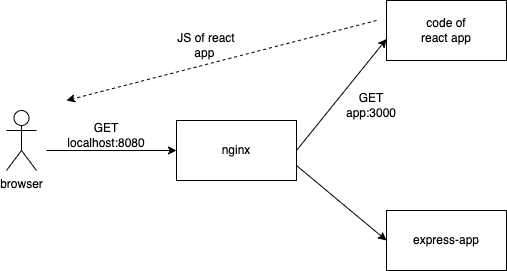

<div class="content">

### React in container

<!-- Let''s create and containerize a React application next.-->
让我们接下来创建并容器化一个React应用程序吧。

```
$ npx create-react-app hello-front
  ...

  Happy hacking!
```

<!-- The create-react-app already installed all dependencies for us, so we did not need to run npm install here.-->
create-react-app已经为我们安装了所有的依赖，因此我们不需要在这里运行npm install。

<!-- The next step is to turn the JavaScript code and CSS, into production-ready static files. The create-react-app already has _build_ as an npm script so let''s use that:-->
下一步是把JavaScript代码和CSS转换成生产准备就绪的静态文件。create-react-app已经有_build_作为npm脚本，所以让我们使用它：

```
$ npm run build
  ...

  Creating an optimized production build...
  ...
  The build folder is ready to be deployed.
  ...
```

<!-- Great! The final step is figuring a way to use a server to serve the static files. As you may know, we could use our [express.static](https://expressjs.com/en/starter/static-files.html) with the Express server to serve the static files. I''ll leave that as an exercise for you to do at home. Instead, we are going to go ahead and start writing our Dockerfile:-->
太棒了！最后一步就是想办法使用服务器来提供静态文件。正如你所知，我们可以使用Express服务器的[express.static](https://expressjs.com/en/starter/static-files.html)来提供静态文件。我把这个留给你在家自己做的练习。相反，我们现在要开始写我们的Dockerfile：

```Dockerfile
FROM node:16

WORKDIR /usr/src/app

COPY . .

RUN npm ci

RUN npm run build
```

<!-- That looks about right. Let''s build it and see if we are on the right track. Our goal is to have the build succeed without errors. Then we will use bash to check inside of the container to see if the files are there.-->
那看起来差不多了。让我们构建它，看看我们是否走上正确的轨道。我们的目标是让构建成功而不出错。然后我们将使用bash检查容器内部，看看文件是否在那里。

```bash
$ docker build . -t hello-front
  [+] Building 172.4s (10/10) FINISHED

$ docker run -it hello-front bash

root@98fa9483ee85:/usr/src/app# ls
  Dockerfile  README.md  build  node_modules  package-lock.json  package.json  public  src

root@98fa9483ee85:/usr/src/app# ls build/
  asset-manifest.json  favicon.ico  index.html  logo192.png  logo512.png  manifest.json  robots.txt  static
```

<!-- A valid option for serving static files now that we already have Node in the container is [serve](https://www.npmjs.com/package/serve). Let''s try installing serve and serving the static files while we are inside the container.-->
现在我们已经在容器中安装了Node，一个用于服务静态文件的有效选项是[serve](https://www.npmjs.com/package/serve)。让我们试着安装serve，在容器内服务静态文件。

```bash
root@98fa9483ee85:/usr/src/app# npm install -g serve

  added 88 packages, and audited 89 packages in 6s

root@98fa9483ee85:/usr/src/app# serve build

   ┌────────────────────────────────────────┐
   │                                        │
   │   Serving!                             │
   │                                        │
   │   - Local:    http://localhost:3000    │
   │   - Network:  http://172.17.0.2:3000   │
   │                                        │
   └────────────────────────────────────────┘

```

<!-- Great! Let''s ctrl+c and exit out and then add those to our Dockerfile.-->
好的！让我们按下Ctrl+C，退出，然后把它们添加到我们的Dockerfile中。

<!-- The installation of serve turns into a RUN in the Dockerfile. This way the dependency is installed during the build process. The command to serve build directory will become the command to start the container:-->
Dockerfile中的`serve`安装变成了一个`RUN`。这样，依赖性就在构建过程中安装了。`serve`构建目录的命令将成为启动容器的命令：

```Dockerfile
FROM node:16

WORKDIR /usr/src/app

COPY . .

RUN npm ci

RUN npm run build

RUN npm install -g serve # highlight-line

CMD ["serve", "build"] # highlight-line
```

<!-- Our CMD now includes square brackets and as a result we now used the so called <i>exec form</i> of CMD. There are actually **three** different forms for the CMD out of which the exec form is preferred. Read the [documentation](https://docs.docker.com/engine/reference/builder/#cmd) for more info.-->
我们的CMD现在包括方括号，因此我们现在使用所谓的<i>exec form</i> CMD。实际上，CMD有**三**种不同的形式，其中exec form最受欢迎。有关更多信息，请参阅[文档](https://docs.docker.com/engine/reference/builder/#cmd)。

<!-- When we now build the image with _docker build . -t hello-front_ and run it with _docker run -p 5001:3000 hello-front_, the app will be available in http://localhost:5001.-->
当我们现在使用`docker build . -t hello-front`构建镜像，并使用`docker run -p 5001:3000 hello-front`运行它时，应用程序将可以在http://localhost:5001访问。

### Using multiple stages

<!-- While serve is a <i>valid</i> option we can do better. A good goal is to create Docker images so that they do not contain anything irrelevant. With a minimal number of dependencies, images are less likely to break or become vulnerable over time.-->
虽然服务是一个<i>有效</i>的选择，但我们可以做得更好。一个好的目标是创建Docker镜像，以便它们不包含任何不相关的内容。减少依赖项的数量，可以减少镜像随时间演变而出现问题或漏洞的可能性。

<!-- [Multi-stage builds](https://docs.docker.com/develop/develop-images/multistage-build/) are designed for splitting the build process into many separate stages, where it is possible to limit what parts of the image files are moved between the stages. That opens possibilities for limiting the size of the image since not all by-products of the build are necessary for the resulting image. Smaller images are faster to upload and download and they help reduce the number of vulnerabilities your software may have.-->
# 多级构建
多级构建旨在将构建过程分成许多单独的阶段，在这些阶段之间可以限制图像文件的哪些部分被移动。这为限制图像的大小打开了可能性，因为构建的所有副产品都不是生成图像所必需的。较小的图像上传和下载速度更快，并有助于减少软件可能具有的漏洞数量。

<!-- With multi-stage builds, a tried and true solution like [Nginx](https://en.wikipedia.org/wiki/Nginx) can be used to serve static files without a lot of headaches. The Docker Hub [page for Nginx](https://hub.docker.com/_/nginx) tells us the required info to open the ports and "Hosting some simple static content".-->
使用多阶段构建，一个经过考验的解决方案[Nginx](https://en.wikipedia.org/wiki/Nginx)可以用来提供静态文件而不需要太多的麻烦。Docker Hub [Nginx页面](https://hub.docker.com/_/nginx)告诉我们打开端口和“托管一些简单的静态内容”所需的信息。

<!-- Let''s use the previous Dockerfile but change the FROM to include the name of the stage:-->
FROM <阶段名称>:latest

```Dockerfile
# The first FROM is now a stage called build-stage
FROM node:16 AS build-stage # highlight-line

WORKDIR /usr/src/app

COPY . .

RUN npm ci

RUN npm run build

# This is a new stage, everything before this is gone, except the files we want to COPY
FROM nginx:1.20-alpine # highlight-line

# COPY the directory build from build-stage to /usr/share/nginx/html
# The target location here was found from the Docker hub page
COPY --from=build-stage /usr/src/app/build /usr/share/nginx/html # highlight-line
```

<!-- We have declared also <i>another stage</i> where only the relevant files of the first stage (the <i>build</i> directory, that contains the static content) are moved.-->
我们还宣布了<i>另一个阶段</i>，只移动第一阶段的相关文件（包含静态内容的<i>构建</i>目录）。

<!-- After we build it again, the image is ready to serve the static content. The default port will be 80 for Nginx, so something like _-p 8000:80_ will work, so the parameters of the run command need to be changed a bit.-->
在我們重新構建它之後，圖像就準備好提供靜態內容了。Nginx的默認端口將是80，因此像_-p 8000:80_這樣的東西將會有用，因此需要對運行命令的參數進行一些更改。

<!-- Multi-stage builds also include some internal optimizations that may affect your builds. As an example, multi-stage builds skip stages that are not used. If we wish to use a stage to replace a part of a build pipeline, like testing or notifications, we must pass **some** data to the following stages. In some cases this is justified: copy the code from the testing stage to the build stage. This ensures that you are building the tested code.-->
多级构建还包括一些可能影响构建的内部优化。例如，多级构建会跳过未使用的阶段。如果我们希望使用一个阶段来替换构建流水线的一部分，比如测试或通知，我们必须将**一些**数据传递给后续阶段。在某些情况下这是合理的：从测试阶段复制代码到构建阶段。这可以确保您正在构建测试过的代码。

</div>

<div class="tasks">

### Exercises 12.13 - 12.14.

#### Exercise 12.13: Todo application frontend

<!-- Finally, we get to the todo-frontend. View the todo-app/todo-frontend and read through the README.-->
md

最后，我们来到todo-frontend。查看todo-app/todo-frontend，并阅读README.md。

<!-- Start by running the frontend outside the container and ensure that it works with the backend.-->
开始先在容器外运行前端，确保它与后端正常工作。

<!-- Containerize the application by creating <i>todo-app/todo-frontend/Dockerfile</i> and use [ENV](https://docs.docker.com/engine/reference/builder/#env) instruction to pass *REACT\_APP\_BACKEND\_URL* to the application and run it with the backend. The backend should still be running outside a container.-->
在 <i>todo-app/todo-frontend/Dockerfile</i> 创建容器化应用，并使用 [ENV](https://docs.docker.com/engine/reference/builder/#env) 指令将 *REACT\_APP\_BACKEND\_URL* 传递给应用，并使用后端运行它。 后端仍应在容器外运行。

<!-- Note that you need to set *REACT\_APP\_BACKEND\_URL* before building the frontend, otherwise it does not get defined in the code!-->
**注意，在构建前端之前，你需要设置*REACT\_APP\_BACKEND\_URL*，否则它不会在代码中定义！**

#### Exercise 12.14: Testing during the build process

<!-- One interesting possibility to utilize multi-stage builds is to use a separate build stage for [testing](https://docs.docker.com/language/nodejs/run-tests/). If the testing stage fails, the whole build process will also fail. Note that it may not be the best idea to move <i>all testing</i> to be done during the building of an image, but there may be <i>some</i> containerization-related tests where it might be worth considering.-->
一个有趣的可能性是利用多阶段构建，为[测试](https://docs.docker.com/language/nodejs/run-tests/)使用单独的构建阶段。如果测试阶段失败，整个构建过程也将失败。请注意，将<i>所有测试</i>移动到构建镜像的过程中可能不是最好的想法，但可能有<i>一些</i>与容器化相关的测试，值得考虑。

<!-- Extract a component <i>Todo</i> that represents a single todo. Write a test for the new component and add running tests into the build process.-->
提取一个表示单个todo的组件<i>Todo</i>。为新组件编写测试，并将运行测试添加到构建过程中。

<!-- Run the tests with _CI=true npm test_. Without the env _CI=true_ set, the create-react-app will start watching for changes and your pipeline will get stuck.-->
运行测试 `CI=true npm test`，如果没有设置环境变量 `CI=true`，create-react-app 将会开始监视更改，而你的管道将会卡住。

<!-- You can add a new build stage for the test if you wish to do so. If you do so, remember to read the last paragraph before exercise 12.13 again!-->
如果你想这样做，你可以为测试添加一个新的构建阶段。如果你这样做，记得再次阅读第12.13练习的最后一段！

</div>

<div class="content">

### Development in containers

<!-- Let''s move the whole todo application development to a container. There are a few reasons why you would want to do that:-->
让我们把整个待办事项应用开发移到一个容器中去吧。你想要这么做有以下几个原因：

<!-- - To keep the environment similar between development and production to avoid bugs that appear only in the production environment-->
为了保持开发和生产环境的相似性，以避免只出现在生产环境中的错误。
<!-- - To avoid differences between developers and their personal environments that lead to difficulties in application development-->
and deployment

避免开发人员和他们个人环境之间的差异导致应用开发和部署的困难。
<!-- - To help new team members hop in by having them install container runtime - and requiring nothing else.-->
帮助新团队成员快速加入，只需要安装容器运行时，而不需要其他任何东西。

<!-- These all are great reasons. The tradeoff is that we may encounter some unconventional behavior when we aren''t running the applications like we are used to. We will need to do at least two things to move the application to a container:-->
这些都是很棒的理由。权衡之下，我们可能会遇到一些不寻常的行为，当我们不像以往那样运行应用程序时。我们至少需要做两件事来将应用程序移动到容器中：

<!-- - Start the application in development mode-->
启动开发模式应用程序
<!-- - Access the files with VS Code-->
使用VS Code访问文件

<!-- Let's start with the frontend. Since the Dockerfile will be significantly different to the production Dockerfile let's create a new one called <i>dev.Dockerfile</i>.-->
让我们从前端开始。由于Dockerfile将与生产Dockerfile显着不同，让我们创建一个叫做<i>dev.Dockerfile</i>的新文件。

<!-- Starting the create-react-app in development mode should be easy. Let''s start with the following:-->
开始以开发模式使用create-react-app应该很容易。让我们从下面开始：

```Dockerfile
FROM node:16

WORKDIR /usr/src/app

COPY . .

# Change npm ci to npm install since we are going to be in development mode
RUN npm install

# npm start is the command to start the application in development mode
CMD ["npm", "start"]
```

<!-- During build the flag _-f_ will be used to tell which file to use, it would otherwise default to Dockerfile, so the following command will build the image:-->
`docker build -f <file> .`

`docker build -f <文件> .`

```bash
docker build -f ./dev.Dockerfile -t hello-front-dev .
```

<!-- The create-react-app will be served in port 3000, so you can test that it works by running a container with that port published.-->
**create-react-app 将会在端口 3000 上提供服务，因此您可以通过发布该端口来运行容器来测试它是否有效。**

<!-- The second task, accessing the files with VSCode, is not done yet. There are at least two ways of doing this:-->
第二项任务，使用VSCode访问文件，尚未完成。有至少两种方法可以做到这一点：

<!-- - [The Visual Studio Code Remote - Containers extension](https://code.visualstudio.com/docs/remote/containers)-->
# [Visual Studio Code 远程 - 容器扩展](https://code.visualstudio.com/docs/remote/containers)
<!-- - Volumes, the same thing we used to preserve data with the database-->
- 使用数据库来保存数据的**卷**

<!-- Let's go over the latter since that will work with other editors as well. Let's do a trial run with the flag _-v_, and if that works, then we will move the configuration to a docker-compose file. To use the _-v_, we will need to tell it the current directory. The command _pwd_ should output the path to the current directory for you. Try this with _echo $(pwd)_ in your command line. We can use that as the left side for _-v_ to map the current directory to the inside of the container or you can use the full directory path.-->
让我们来看看后者，因为它也可以与其他编辑器一起使用。让我们用标志_ -v_进行一次试运行，如果成功，我们将把配置移动到docker-compose文件中。要使用_ -v_，我们需要告诉它当前目录。命令_pwd_应该输出当前目录的路径给你。试试_echo $(pwd)_在你的命令行中。我们可以将其用作_ -v_的左侧，以将当前目录映射到容器内部，或者您可以使用完整的目录路径。

```bash
$ docker run -p 3000:3000 -v "$(pwd):/usr/src/app/" hello-front-dev

  Compiled successfully!

  You can now view hello-front in the browser.
```

<!-- Now we can edit the file <i>src/App.js</i>, and the changes should be hot-loaded to the browser!-->
现在我们可以编辑文件<i>src/App.js</i>，并且这些更改应该会被热加载到浏览器上！

<!-- Note that it takes some time (for me it took 50 seconds!) for the frontend to get started with _npm start_ in the development mode. The frontend has started when the following appears in the container log:-->
注意，在开发模式下使用 _npm start_ 启动前端需要一些时间（我花了50秒！）。当容器日志中出现以下内容时，前端已经启动：

```bash
You can now view hello-frontend in the browser.
```

<!-- > <i>**Editor''s note:** hot reload might work in your computer, but it is currently known to have some [issues](https://github.com/facebook/create-react-app/issues/11879). So if it does not work for you, just continue without the hot reload support, and reload the browser when you change the frontend code. You may also use use [The Visual Studio Code Containers extension](https://code.visualstudio.com/docs/remote/containers).</i>-->
> <i>**编辑者按：**热加载可能在你的电脑上可以工作，但是目前已知有一些[问题](https://github.com/facebook/create-react-app/issues/11879)。所以如果它不能为你工作，就不要使用热加载，当你改变前端代码时重新加载浏览器。你也可以使用[Visual Studio Code Containers扩展](https://code.visualstudio.com/docs/remote/containers)。</i>

<!-- Next, let''s move the config to a <i>docker-compose.yml</i>. That file should be at the root of the project as well:-->
接下来，让我们将配置移动到<i>docker-compose.yml</i>。该文件也应该位于项目的根目录中：

```yml
services:
  app:
    image: hello-front-dev
    build:
      context: . # The context will pick this directory as the "build context"
      dockerfile: dev.Dockerfile # This will simply tell which dockerfile to read
    volumes:
      - ./:/usr/src/app # The path can be relative, so ./ is enough to say "the same location as the docker-compose.yml"
    ports:
      - 3000:3000
    container_name: hello-front-dev # This will name the container hello-front-dev
```

<!-- With this configuration, _docker compose up_ can run the application in development mode. You don''t even need Node installed to develop it!-->
使用这个配置，_docker compose up_ 可以以开发模式运行应用程序。你甚至不需要安装Node来开发它！

<!-- Installing new dependencies is a headache for a development setup like this. One of the better options is to install the new dependency **inside** the container. So instead of doing e.g. _npm install axios_, you have to do it in the running container e.g. _docker exec hello-front-dev npm install axios_, or add it to the package.json and run _docker build_ again.-->
安装新的依赖项对于这样的开发设置来说是一个头疼的事情。最好的选择之一是在容器**内部**安装新的依赖项。因此，而不是做_npm install axios_，你必须在运行的容器中运行它，例如_docker exec hello-front-dev npm install axios_，或将其添加到package.json中并再次运行_docker build_。

</div>
<div class="tasks">

### Exercise 12.15

#### Exercise 12.15: Set up a frontend development environment

<!-- Create <i>todo-frontend/docker-compose.dev.yml</i> and use volumes to enable the development of the todo-frontend while it is running <i>inside</i> a container.-->
创建 <i>todo-frontend/docker-compose.dev.yml</i> 并使用卷来使 todo-frontend 在容器<i>内部</i>运行时可以进行开发。

</div>

<div class="content">

### Communication between containers in a Docker network

<!-- The Docker Compose tool sets up a network between the containers and includes a DNS to easily connect two containers. Let''s add a new service to the Docker Compose and we shall see how the network and DNS work.-->
Docker Compose 工具建立了容器之间的网络，并包括一个DNS来轻松连接两个容器。让我们向Docker Compose添加一项新服务，看看网络和DNS如何工作。

<!-- [Busybox](https://www.busybox.net/) is a small executable with multiple tools you may need. It is called "The Swiss Army Knife of Embedded Linux", and we definitely can use it to our advantage.-->
[Busybox](https://www.busybox.net/)是一个小而强大的可执行文件，里面包含多种你可能需要的工具。它被称为“嵌入式Linux的瑞士军刀”，我们肯定可以利用它来发挥优势。

<!-- Busybox can help us to debug our configurations. So if you get lost in the later exercises of this section, you should use Busybox to find out what works and what doesn't. Let's use it to explore what was just said. That containers are inside a network and you can easily connect between them. Busybox can be added to the mix by changing <i>docker-compose.yml</i> to:-->
Busybox 可以帮助我们调试配置。因此，如果您在本节的后续练习中迷失了方向，您应该使用 Busybox 来发现什么可以工作，什么不能工作。让我们使用它来探索刚才说的内容。容器在网络中，您可以在它们之间轻松连接。可以通过将 <i>docker-compose.yml</i> 更改为：将 Busybox 添加到混合中来添加 Busybox：

```yml
services:
  app:
    image: hello-front-dev
    build:
      context: .
      dockerfile: dev.Dockerfile
    volumes:
      - ./:/usr/src/app
    ports:
      - 3000:3000
    container_name: hello-front-dev
  debug-helper: # highlight-line
    image: busybox # highlight-line
```

<!-- The Busybox container won''t have any process running inside so we can not _exec_ in there. Because of that, the output of _docker compose up_ will also look like this:-->
Busybox容器里面不会有任何进程在运行，所以我们无法在里面_执行_。因此，_docker compose up_的输出也会是这样的：

```bash
$ docker compose up
  Pulling debug-helper (busybox:)...
  latest: Pulling from library/busybox
  8ec32b265e94: Pull complete
  Digest: sha256:b37dd066f59a4961024cf4bed74cae5e68ac26b48807292bd12198afa3ecb778
  Status: Downloaded newer image for busybox:latest
  Starting hello-front-dev          ... done
  Creating react-app_debug-helper_1 ... done
  Attaching to react-app_debug-helper_1, hello-front-dev
  react-app_debug-helper_1 exited with code 0

  hello-front-dev |
  hello-front-dev | > react-app@0.1.0 start
  hello-front-dev | > react-scripts start
```

<!-- This is expected as it's just a toolbox. Let's use it to send a request to hello-front-dev and see how the DNS works. While the hello-front-dev is running, we can do the request with [wget](https://en.wikipedia.org/wiki/Wget) since it''s a tool included in Busybox to send a request from the debug-helper to hello-front-dev.-->
这是预料之中的，因为它只是一个工具箱。让我们用它来向hello-front-dev发出请求，看看DNS是如何工作的。当hello-front-dev运行时，我们可以使用[wget](https://en.wikipedia.org/wiki/Wget)（它是Busybox中包含的一个工具）从debug-helper发出请求到hello-front-dev。

<!-- With Docker Compose we can use _docker compose run SERVICE COMMAND_ to run a service with a specific command. Command wget requires the flag _-O_ with _-_ to output the response to the stdout:-->
使用Docker Compose，我们可以使用`docker compose run SERVICE COMMAND`来运行一个服务，并使用特定的命令。命令wget需要使用`-O -`标记将响应输出到stdout：

```bash
$ docker compose run debug-helper wget -O - http://app:3000

  Creating react-app_debug-helper_run ... done
  Connecting to hello-front-dev:3000 (172.26.0.2:3000)
  writing to stdout
  <!DOCTYPE html>
  <html lang="en">
    <head>
      <meta charset="utf-8" />
      ...
```

<!-- The URL is the interesting part here. We simply said to connect to the port 3000 of the service <i>app</i>. The <i>app</i> is the name of the service specified in the <i>docker-compose.yml</i>:-->
URL 是有趣的部分。我们只是说连接到服务 <i>app</i> 的端口 3000 。<i>app</i> 是 <i>docker-compose.yml</i> 中指定的服务名称：

```bash
services:
  app: // highlight-line
    image: hello-front-dev
    build:
      context: .
      dockerfile: dev.Dockerfile
    volumes:
      - ./:/usr/src/app
    ports:
      - 3000:3000 // highlight-line
    container_name: hello-front-dev
```

<!-- And the port used is the port from which the application is available in that container, also specified in the <i>docker-compose.yml</i>. The port does not need to be published for other services in the same network to be able to connect to it. The "ports" in the docker-compose file are only for external access.-->
而使用的端口是容器中应用程序可用的端口，也在<i>docker-compose.yml</i>中指定。端口不需要发布给同一网络中的其他服务来连接它。docker-compose文件中的“端口”仅用于外部访问。

<!-- Let''s change the port configuration in the <i>docker-compose.yml</i> to emphasize this:-->
让我们更改<i>docker-compose.yml</i>中的端口配置来强调这一点：

```yml
services:
  app:
    image: hello-front-dev
    build:
      context: .
      dockerfile: dev.Dockerfile
    volumes:
      - ./:/usr/src/app
    ports:
      - 3210:3000 # highlight-line
    container_name: hello-front-dev
  debug-helper:
    image: busybox
```

<!-- With _docker compose up_ the application is available in <http://localhost:3210> at the <i>host machine</i>, but still _docker compose run debug-helper wget -O - http://app:3000_ works since the port is still 3000 within the docker network.-->
用`docker compose up`把应用程序部署到<http://localhost:3210> 上，但是在docker网络中，仍然可以用 `docker compose run debug-helper wget -O - http://app:3000` 来访问，因为端口仍然是3000。


<!-- As the above image illustrates, _docker compose run_ asks debug-helper to send the request within the network. While the browser in host machine sends the request from outside of the network.-->
如上图所示，_docker compose run_ 要求debug-helper在网络内发送请求。而主机机器的浏览器则从网络外发送请求。

<!-- Now that you know how easy it is to find other services in the <i>docker-compose.yml</i> and we have nothing to debug we can remove the debug-helper and revert the ports to 3000:3000 in our <i>docker-compose.yml</i>.-->
现在你知道在<i>docker-compose.yml</i>中如何轻松地找到其他服务了，我们没有要调试的东西，可以在我们的<i>docker-compose.yml</i>中移除debug-helper并把端口恢复为3000:3000。

</div>
<div class="tasks">

### Exercise 12.16

#### Exercise 12.16: Run todo-backend in a development container

<!-- Use volumes and Nodemon to enable the development of the todo app backend while it is running <i>inside</i> a container. Create a <i>todo-backend/dev.Dockerfile</i> and edit the <i>todo-backend/docker-compose.dev.yml</i>.-->
使用卷和Nodemon在容器<i>内部</i>运行todo应用后端的开发。创建一个<i>todo-backend/dev.Dockerfile</i>并编辑<i>todo-backend/docker-compose.dev.yml</i>。

<!-- You will also need to rethink the connections between backend and MongoDB / Redis. Thankfully Docker Compose can include environment variables that will be passed to the application:-->
您还需要重新思考后端和MongoDB/Redis之间的连接。值得庆幸的是，Docker Compose可以包括传递给应用程序的环境变量：

```yaml
services:
  server:
    image: ...
    volumes:
      - ...
    ports:
      - ...
    environment:
      - REDIS_URL=redisurl_here
      - MONGO_URL=mongourl_here
```

<!-- The URLs  are purposefully wrong, you will need to set the correct values. Remember to <i>look all the time what happens in console</i>. If and when things blow up, the error messages hint at what might be broken.-->
URLs均被故意设置为错误，您需要设置正确的值。记住要<i>一直看控制台发生的事情</i>。如果发生爆炸，错误消息提示可能出现了什么问题。

<!-- Here is a possibly helpful image illustrating the connections within the docker network:-->


下面是一张可能有帮助的图片，描绘了Docker网络中的连接：


</div>

<div class="content">

### Communications between containers in a more ambitious environment

<!-- Next, we will add a [reverse proxy](https://en.wikipedia.org/wiki/Reverse_proxy) to our docker-compose.yml. According to wikipedia-->
:

下一步，我们将向我们的docker-compose.yml中添加一个[反向代理](https://en.wikipedia.org/wiki/Reverse_proxy)。根据维基百科：

<!-- > <i>A reverse proxy is a type of proxy server that retrieves resources on behalf of a client from one or more servers. These resources are then returned to the client, appearing as if they originated from the reverse proxy server itself.</i>-->
> <i>反向代理是一种代理服务器，它代表客户端从一个或多个服务器检索资源。然后将这些资源返回给客户端，看起来就像它们来自反向代理服务器本身。</i>

<!-- So in our case, the reverse proxy will be the single point of entry to our application, and the final goal will be to set both the React frontend and the Express backend behind the reverse proxy.-->
所以在我们的情况下，反向代理将是我们应用程序的唯一入口，最终的目标是将React前端和Express后端设置在反向代理之后。

<!-- There are multiple different options for a reverse proxy implementation, such as Traefik, Caddy, Nginx, and Apache (ordered by initial release from newer to older).-->
有多种不同的反向代理实现选项，例如Traefik、Caddy、Nginx和Apache（按初次发布时间从新到旧排序）。

<!-- Our pick is [Nginx](https://hub.docker.com/_/nginx).-->
我们的选择是[Nginx](https://hub.docker.com/_/nginx)。

<!-- Let us now put the <i>hello-frontend</i> behind the reverse proxy.-->
让我们现在把 <i>hello-frontend</i> 放在反向代理后面。

<!-- Create a file <i>nginx.conf</i> in the project root and take the following template as a starting point. We will need to do minor edits to have our application running:-->
在项目根目录中创建一个文件<i>nginx.conf</i>，并以下面的模板作为起点。我们需要做一些小的编辑以使我们的应用程序运行：

```bash
# events is required, but defaults are ok
events { }

# A http server, listening at port 80
http {
  server {
    listen 80;

    # Requests starting with root (/) are handled
    location / {
      # The following 3 lines are required for the hot loading to work (websocket).
      proxy_http_version 1.1;
      proxy_set_header Upgrade $http_upgrade;
      proxy_set_header Connection 'upgrade';

      # Requests are directed to http://localhost:3000
      proxy_pass http://localhost:3000;
    }
  }
}
```

<!-- Next, create an Nginx service in the <i>docker-compose.yml</i> file. Add a volume as instructed in the Docker Hub page where the right side is _:/etc/nginx/nginx.conf:ro_, the final ro declares that the volume will be <i>read-only</i>:-->
接下来，在<i>docker-compose.yml</i>文件中创建一个Nginx服务。按照Docker Hub页面上的指示添加一个卷，右侧为_：/etc/nginx/nginx.conf：ro_，最后的ro声明该卷为<i>只读</i>：

```yml
services:
  app:
    # ...
  nginx:
    image: nginx:1.20.1
    volumes:
      - ./nginx.conf:/etc/nginx/nginx.conf:ro
    ports:
      - 8080:80
    container_name: reverse-proxy
    depends_on:
      - app # wait for the frontend container to be started
```

<!-- with that added we can run _docker compose up_ and see what happens.-->
随着那个添加，我们可以运行_docker compose up_ 看看会发生什么。

```bash
$ docker container ls
CONTAINER ID   IMAGE             COMMAND                  CREATED         STATUS         PORTS                                       NAMES
a02ae58f3e8d   nginx:1.20.1      "/docker-entrypoint.…"   4 minutes ago   Up 4 minutes   0.0.0.0:8080->80/tcp, :::8080->80/tcp       reverse-proxy
5ee0284566b4   hello-front-dev   "docker-entrypoint.s…"   4 minutes ago   Up 4 minutes   0.0.0.0:3000->3000/tcp, :::3000->3000/tcp   hello-front-dev
```

<!-- Connecting to http://localhost:8080 will lead to a familiar-looking page with 502 status.-->
访问`http://localhost:8080`会跳转到一个看起来熟悉的页面，但是状态码为502。

<!-- This is because directing requests to http://localhost:3000 leads to nowhere as the Nginx container does not have an application running in port 3000. By definition, localhost refers to the current computer used to access it. With containers localhost is unique for each container, leading to the container itself.-->
因为將請求導向到http://localhost:3000導致無法連接，因為Nginx容器沒有在3000端口運行應用程序。按照定義，localhost指的是當前用於訪問它的電腦。對於容器而言，localhost對於每個容器都是獨一無二的，導致容器本身。

<!-- Let's test this by going inside the Nginx container and using curl to send a request to the application itself. In our usage curl is similar to wget, but won't need any flags.-->
让我们通过进入Nginx容器并使用curl向应用程序本身发送请求来测试这一点。 在我们的用法中，curl类似于wget，但不需要任何标志。

```bash
$ docker exec -it reverse-proxy bash

root@374f9e62bfa8:/# curl http://localhost:80
  <html>
  <head><title>502 Bad Gateway</title></head>
  ...
```

<!-- To help us, Docker Compose set up a network when we ran _docker compose up_. It also added all of the containers in the <i>docker-compose.yml</i> to the network. A DNS makes sure we can find the other container. The containers are each given two names: the service name and the container name.-->
为了帮助我们，当我们运行_docker compose up_时，Docker Compose设置了一个网络。它还将<i>docker-compose.yml</i>中的所有容器添加到网络中。DNS确保我们可以找到其他容器。每个容器都有两个名称：服务名称和容器名称。

<!-- Since we are inside the container, we can also test the DNS! Let''s curl the service name (app) in port 3000-->
自從我們在容器內，我們也可以測試DNS！讓我們用curl測試服務名稱（app）在3000端口！

```html
root@374f9e62bfa8:/# curl http://app:3000
  <!DOCTYPE html>
  <html lang="en">
    <head>
    ...
    <meta
      name="description"
      content="Web site created using create-react-app"
    />
    ...
```

<!-- That is it! Let''s replace the proxy_pass address in nginx.conf with that one.-->
那就是它了！让我们用那个替换nginx.conf中的proxy_pass地址吧。

<!-- If you are still encountering 502, make sure that the create-react-app has been built first. You can read the logs output from the _docker compose up_.-->
如果你仍然遇到502，请确保首先构建了create-react-app。你可以从_docker compose up_中读取日志输出。

<!-- One more thing: we added an option [depends_on](https://docs.docker.com/compose/compose-file/compose-file-v3/#depends_on) to the configuration that ensures that the _nginx_ container is not started before the frontend container _app_ is started:-->
最后一件事：我们在配置中添加了一个[depends_on](https://docs.docker.com/compose/compose-file/compose-file-v3/#depends_on)选项，以确保_nginx_容器在前端容器_app_启动之前不会启动：

```bash
services:
  app:
    # ...
  nginx:
    image: nginx:1.20.1
    volumes:
      - ./nginx.conf:/etc/nginx/nginx.conf:ro
    ports:
      - 8080:80
    container_name: reverse-proxy
    depends_on: // highlight-line
      - app // highlight-line
```

<!-- If we do not enforce the starting order with <i>depends\_on</i> there a risk that Nginx fails on startup since it tries to resolve all DNS names that are referred in the config file:-->
如果我们不用<i>depends\_on</i>来强制启动顺序，那么Nginx在启动时有可能失败，因为它会尝试解析配置文件中引用的所有DNS名称。

```bash
http {
  server {
    listen 80;

    location / {
      proxy_http_version 1.1;
      proxy_set_header Upgrade $http_upgrade;
      proxy_set_header Connection 'upgrade';

      proxy_pass http://app:3000; // highlight-line
    }
  }
}
```


<!--  Note that <i>depends\_on</i> does not guarantee that the service in the depended container is ready for action, it just ensures that the container has been started (and the corresponding entry is added to DNS). If a service needs to wait another service to become ready before the startup, [other solutions](https://docs.docker.com/compose/startup-order/) should be used.-->
注意，<i>depends\_on</i>并不能保证依赖的容器中的服务已经准备就绪，它只是确保该容器已经启动（并且相应的条目已经添加到DNS中）。如果服务需要在启动前等待另一个服务准备就绪，应该使用[其他解决方案](https://docs.docker.com/compose/startup-order/)。

</div>

<div class="tasks">

### Exercises 12.17. - 12.19.

#### Exercise 12.17: Set up an Nginx reverse proxy server in front of todo-frontend

<!-- We are going to put the Nginx server in front of both todo-frontend and todo-backend. Let''s start by creating a new docker-compose file <i>todo-app/docker-compose.dev.yml</i> and <i>todo-app/nginx.conf</i>.-->
我们将Nginx服务器放在todo-frontend和todo-backend的前面。让我们从创建新的docker-compose文件<i>todo-app/docker-compose.dev.yml</i>和<i>todo-app/nginx.conf</i>开始。

```bash
todo-app
├── todo-frontend
├── todo-backend
├── nginx.dev.conf // highlight-line
└── docker-compose.dev.yml // highlight-line
```

<!-- Add the services Nginx and todo-frontend built with <i>todo-app/todo-frontend/dev.Dockerfile</i> into the <i>todo-app/docker-compose.dev.yml</i>.-->
在 <i>todo-app/docker-compose.dev.yml</i> 中添加以 <i>todo-app/todo-frontend/dev.Dockerfile</i> 构建的 Nginx 和 todo-frontend 服务。


<!-- In this and the following exercises you do not need to support the the build option, that is, the command-->
line options

在这个和以下的练习中，你不需要支持构建选项，也就是命令行选项。

```bash
docker compose -f docker-compose.dev.yml up --build
```

<!-- It is enough to build the frontend and backend at their own repositories.-->
它足以在自己的存储库中构建前端和后端。

#### Exercise 12.18: Configure the Nginx server to be in front of todo-backend

<!-- Add the service todo-backend to the docker-compose file <i>todo-app/docker-compose.dev.yml</i> in development mode.-->
在开发模式下，将服务todo-backend添加到 <i>todo-app/docker-compose.dev.yml</i> 中。

<!-- Add a new location to the <i>nginx.conf</i> so that requests to _/api_ are proxied to the backend. Something like this should do the trick:-->
在<i>nginx.conf</i>中添加一个新位置，以便将请求代理到后端_/api_。 像这样应该可以解决问题：

```conf
  server {
    listen 80;

    # Requests starting with root (/) are handled
    location / {
      # The following 3 lines are required for the hot loading to work (websocket).
      proxy_http_version 1.1;
      proxy_set_header Upgrade $http_upgrade;
      proxy_set_header Connection 'upgrade';

      # Requests are directed to http://localhost:3000
      proxy_pass http://localhost:3000;
    }

    # Requests starting with /api/ are handled
    location /api/ {
      ...
    }
  }
```

<!-- The *proxy\_pass* directive has an interesting feature with a trailing slash. As we are using the path _/api_ for location but the backend application only answers in paths _/_ or _/todos_ we will want the _/api_ to be removed from the request. In other words, even though the browser will send a GET request to _/api/todos/1_ we want the Nginx to proxy the request to _/todos/1_. Do this by adding a trailing slash _/_ to the URL at the end of *proxy\_pass*.-->
*proxy\_pass* 指令有一个有趣的功能，带有尾部斜杠。由于我们使用 _/api_ 作为位置，但后端应用程序只能在 _/_ 或 _/todos_ 路径中回答，我们希望从请求中删除 _/api_ 。换句话说，即使浏览器发送 GET 请求到 _/api/todos/1_，我们也希望 Nginx 将请求代理到 _/todos/1_。要做到这一点，只需在 *proxy\_pass* 的末尾添加尾部斜杠 _/_ 即可。

<!-- This is a [common issue](https://serverfault.com/questions/562756/how-to-remove-the-path-with-an-nginx-proxy-pass)-->
这是一个[常见问题](https://serverfault.com/questions/562756/how-to-remove-the-path-with-an-nginx-proxy-pass)


<!-- This illustrates what we are looking for and may be helpful if you are having trouble:-->
这说明了我们正在寻找什么，如果您有困难，可能会有所帮助：


#### Exercise 12.19: Connect the services, todo-frontend with todo-backend

<!-- > In this exercise, submit the entire development environment, including both Express and React applications, Dockerfiles and docker-compose.yml.-->
> 在本次练习中，提交整个开发环境，包括Express和React应用程序、Dockerfiles和docker-compose.yml。

<!-- Finally, it is time to put all the pieces together. Before starting, it is essential to understand <i>where</i> the React app is actually run. The above figure might give the impression that React app is run in the container but it is totally wrong.-->
最后，是时候把所有的东西放在一起了。在开始之前，最重要的是要理解React应用程序实际上是在<i>哪里</i>运行的。上图可能给人一种React应用程序是在容器中运行的印象，但这是完全错误的。

<!-- It is just the <i>React app source code</i> that is in the container. When the browser hits the address http://loclhost:8080 (assuming that you set up Nginx to be accessed in port 8080), the React source code gets downloaded from the container to the browser:-->
它只是容器中的<i>React应用程序源代码</i>。当浏览器访问http://loclhost:8080（假设您已将Nginx设置为在端口8080上访问）时，React源代码会从容器下载到浏览器：



<!-- Next, the browser starts executing the React app, and all the requests it makes to the backend should be done through the Nginx reverse proxy:-->
接下来，浏览器开始执行React应用程序，它对后端所有的请求都应该通过Nginx反向代理完成：


<!-- The frontend container is actually no more accessed beyond the first request that gets the React app source code to the browser.-->
前端容器实际上不再被访问，除了第一个请求将React应用源代码发送到浏览器之外。

<!-- Now set up your app to work as depicted in the above figure. Make sure that the todo-frontend works with todo-backend. It will require changes to the *REACT\_APP\_BACKEND\_URL* environmental variable in the frontend.-->
现在设置你的应用程序按照上图所示工作。确保todo-frontend与todo-backend一起工作。这将需要更改前端的*REACT\_APP\_BACKEND\_URL*环境变量。

<!-- Make sure that the development environment is now fully functional, that is:-->
确保开发环境现在已经完全功能化，即：
<!-- - all features of the todo app work-->
所有的待办事项应用程序的功能都能正常工作。
<!-- - you can edit the source files <i>and</i> the changes take effect by reloading the app (the hot reloading may or may not work...)-->
你可以编辑源文件<i>和</i>通过重新加载应用程序来使更改生效（热加载可能会有效，也可能无效...）
<!-- - frontend should access the backend through Nginx, so the requests should be done to http://localhost:8080/api/todos:-->
前端应该通过Nginx访问后端，因此请求应该发送到 http://localhost:8080/api/todos:


<!-- Note that your app should work even if no [exposed port](https://docs.docker.com/compose/compose-file/compose-file-v3/#ports) are defined for the backend and frontend in the docker compose file:-->
注意，即使在docker compose文件中没有为后端和前端定义[暴露端口](https://docs.docker.com/compose/compose-file/compose-file-v3/#ports)，您的应用程序也应该可以正常工作：

```yml
services:
  app:
    image: todo-front-dev
    volumes:
      - ./todo-frontend/:/usr/src/app
    # no ports here!

  server:
      image: todo-back-dev
      volumes:
        - ./todo-backend/:/usr/src/app
      environment:
        - ...
      # no ports here!

  nginx:
    image: nginx:1.20.1
    volumes:
      - ./nginx.conf:/etc/nginx/nginx.conf:ro
    ports:
      - 8080:80 # this is needed
    container_name: reverse-proxy
    depends_on:
      - app
```

<!-- We just need to expose the Nginx port to the host machine since the access to the backend and frontend is proxied to the right container port by Nginx. Because Nginx, frontend and backend are defined in the same Docker compose configuration, Docker puts those to the same [Docker network](https://docs.docker.com/compose/networking/) and thanks to that, Nginx has direct access to frontend and backend containers ports.-->
我们只需要将Nginx端口暴露给主机机器，因为后端和前端的访问都被代理到Nginx正确的容器端口。由于Nginx、前端和后端都定义在同一个Docker compose配置中，Docker将它们放到同一个[Docker网络](https://docs.docker.com/compose/networking/)中，由此，Nginx可以直接访问前端和后端容器的端口。

</div>

<div class="content">

### Tools for Production

<!-- Containers are fun tools to use in development, but the best use case for them is in the production environment. There are many more powerful tools than Docker Compose to run containers in production.-->
容器在开发中是一种有趣的工具，但最好的使用案例是在生产环境中。 在生产环境中运行容器比Docker Compose更强大的工具有很多。

<!-- Heavyweight container orchestration tools like [Kubernetes](https://kubernetes.io/) allow us to manage containers on a completely new level. These tools hide away the physical machines and allow us, the developers, to worry less about the infrastructure.-->
重量级容器编排工具像[Kubernetes](https://kubernetes.io/)让我们以完全新的水平管理容器。这些工具把物理机器藏起来，让我们开发者更少担心基础设施。

<!-- If you are interested in learning more in-depth about containers come to the [DevOps with Docker](https://devopswithdocker.com) course and you can find more about Kubernetes in the advanced 5 credit [DevOps with Kubernetes](https://devopswithkubernetes.com) course. You should now have the skills to complete both of them!-->
如果您有兴趣深入了解容器，请参加[DevOps with Docker](https://devopswithdocker.com)课程，您可以在高级5学分[DevOps with Kubernetes](https://devopswithkubernetes.com)课程中找到更多关于Kubernetes的信息。现在您应该有足够的技能来完成这两门课程！

</div>

<div class="tasks">

### Exercises 12.20.-12.22.

#### Exercise 12.20:

<!-- Create a production <i>todo-app/docker-compose.yml</i> with all of the services, Nginx, todo-backend, todo-frontend, MongoDB and Redis. Use Dockerfiles instead of <i>dev.Dockerfiles</i> and make sure to start the applications in production mode.-->
创建一个生产<i>todo-app/docker-compose.yml</i>，包含所有服务，Nginx、todo-backend、todo-frontend、MongoDB和Redis。使用Dockerfiles而不是<i>dev.Dockerfiles</i>，并确保以生产模式启动应用程序。

<!-- Please use the following structure for this exercise:-->
**English**

The world is so big.

**Chinese**

世界如此之大。

```bash
todo-app
├── todo-frontend
├── todo-backend
├── nginx.dev.conf
├── docker-compose.dev.yml
├── nginx.conf  // highlight-line
└── docker-compose.yml // highlight-line
```

#### Exercise 12.21:

<!-- Create a similar containerized development environment of one of <i>your own</i> full stack apps that you have created during the course or in your free time. You should structure the app in your submission repository as follows:-->
在本课程期间或业余时间中，创建一个类似的容器化开发环境，其中包含<i>您自己</i>创建的全栈应用之一。您应将应用程序结构化到提交存储库中，如下所示：

```bash
└── my-app
    ├── frontend
    |    └── dev.Dockerfile
    ├── backend
    |    └── dev.Dockerfile
    └── docker-compose.dev.yml
```

#### Exercise 12.22:

<!-- Finish this part by creating a containerized <i>production setup</i> of your own full stack app.-->
完成这一部分，通过创建自己的全栈应用的容器化<i>生产部署</i>。
<!-- Structure the app in your submission repository as follows:-->
在您的提交存储库中按以下方式结构化应用程序：

```bash
└── my-app
    ├── frontend
    |    ├── dev.Dockerfile
    |    └── Dockerfile
    ├── backend
    |    └── dev.Dockerfile
    |    └── Dockerfile
    ├── docker-compose.dev.yml
    └── docker-compose.yml
```
### Submitting exercises and getting the credits

<!-- This was the last exercise in this section. It''s time to push your code to GitHub and mark all of your finished exercises to the [exercise submission system](https://studies.cs.helsinki.fi/stats/courses/fs-containers).-->
这是本节中的最后一个练习。是时候将你的代码推送到GitHub，并将所有已完成的练习标记到[练习提交系统](https://studies.cs.helsinki.fi/stats/courses/fs-containers)上了。

<!-- Exercises of this part are submitted just like in the previous parts, but unlike parts 0 to 7, the submission goes to an own [course instance](https://studies.cs.helsinki.fi/stats/courses/fs-containers). Remember that you have to finish <i>all the exercises</i> to pass this part!-->
本部分的练习与之前部分一样提交，但与0到7部分不同，提交的目标是一个自己的[课程实例](https://studies.cs.helsinki.fi/stats/courses/fs-containers)。记住，你必须完成<i>所有练习</i>才能通过本部分！

<!-- Once you have completed the exercises and want to get the credits, let us know through the exercise submission system that you have completed the course:-->
一旦您完成了练习，并且想要获得学分，请通过练习提交系统告诉我们您已经完成了课程：


<!-- **Note** that you need a registration to the corresponding course part for getting the credits registered, see [here](/en/part0/general_info#parts-and-completion) for more information.-->
**注意**，您需要注册相应的课程部分才能获得注册学分，有关更多信息，请参见[此处](/en/part0/general_info#parts-and-completion)。

<!-- You can download the certificate for completing this part by clicking one of the flag icons. The flag icon corresponds to the certificate''s language.-->
你可以通过点击其中一个旗帜图标来下载完成这部分的证书。旗帜图标对应证书的语言。

</div>

</div>
