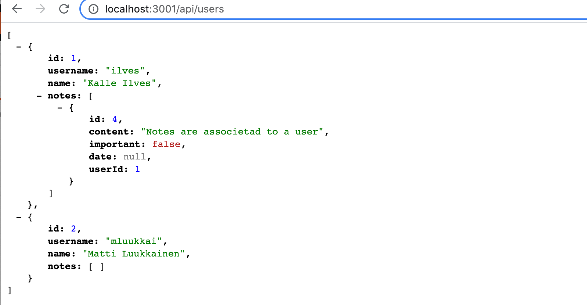

<div class="content">

### Application structuring

So far, we have written all the code in the same file. Now let's structure the application a little better. Let's create the following directory structure and files:

```
index.js
util
  config.js
  db.js
models
  index.js
  note.js
controllers
  notes.js
```

The contents of the files are as follows. The file <i>util/config.js</i> takes care of handling the environment variables:

```js
require('dotenv').config()

module.exports = {
  DATABASE_URL: process.env.DATABASE_URL,
  PORT: process.env.PORT || 3001,
}
```

The role of the file <i>index.js</i> is to configure and launch the application:

```js
const express = require('express')
const app = express()

const { PORT } = require('./util/config')
const { connectToDatabase } = require('./util/db')

const notesRouter = require('./controllers/notes')

app.use(express.json())

app.use('/api/notes', notesRouter)

const start = async () => {
  await connectToDatabase()
  app.listen(PORT, () => {
    console.log(`Server running on port ${PORT}`)
  })
}

start()
```

Starting the application is slightly different from what we have seen before, because we want to make sure that the database connection is established successfully before the actual startup.

The file <i>util/db.js</i> contains the code to initialize the database:

```js
const Sequelize = require('sequelize')
const { DATABASE_URL } = require('./config')

const sequelize = new Sequelize(DATABASE_URL)

const connectToDatabase = async () => {
  try {
    await sequelize.authenticate()
    console.log('connected to the database')
  } catch (err) {
    console.log('failed to connect to the database')
    return process.exit(1)
  }

  return null
}

module.exports = { connectToDatabase, sequelize }
```

The notes in the model corresponding to the table to be stored are saved in the file <i>models/note.js</i>

```js
const { Model, DataTypes } = require('sequelize')

const { sequelize } = require('../util/db')

class Note extends Model {}

Note.init({
  id: {
    type: DataTypes.INTEGER,
    primaryKey: true,
    autoIncrement: true
  },
  content: {
    type: DataTypes.TEXT,
    allowNull: false
  },
  important: {
    type: DataTypes.BOOLEAN
  },
  date: {
    type: DataTypes.DATE
  }
}, {
  sequelize,
  underscored: true,
  timestamps: false,
  modelName: 'note'
})

module.exports = Note
```

The file <i>models/index.js</i> is almost useless at this point, as there is only one model in the application. When we start adding other models to the application, the file will become more useful because it will eliminate the need to import files defining individual models in the rest of the application.

```js
const Note = require('./note')

Note.sync()

module.exports = {
  Note
}
```

The route handling associated with notes can be found in the file <i>controllers/notes.js</i>:

```js
const router = require('express').Router()

const { Note } = require('../models')

router.get('/', async (req, res) => {
  const notes = await Note.findAll()
  res.json(notes)
})

router.post('/', async (req, res) => {
  try {
    const note = await Note.create(req.body)
    res.json(note)
  } catch(error) {
    return res.status(400).json({ error })
  }
})

router.get('/:id', async (req, res) => {
  const note = await Note.findByPk(req.params.id)
  if (note) {
    res.json(note)
  } else {
    res.status(404).end()
  }
})

router.delete('/:id', async (req, res) => {
  const note = await Note.findByPk(req.params.id)
  if (note) {
    await note.destroy()
  }
  res.status(204).end()
})

router.put('/:id', async (req, res) => {
  const note = await Note.findByPk(req.params.id)
  if (note) {
    note.important = req.body.important
    await note.save()
    res.json(note)
  } else {
    res.status(404).end()
  }
})

module.exports = router
```

The structure of the application is good now. However, we note that the route handlers that handle a single note contain a bit of repetitive code, as all of them begin with the line that searches for the note to be handled:

```js
const note = await Note.findByPk(req.params.id)
```

Let's refactor this into our own <i>middleware</i> and implement it in the route handlers:

```js
const noteFinder = async (req, res, next) => {
  req.note = await Note.findByPk(req.params.id)
  next()
}

router.get('/:id', noteFinder, async (req, res) => {
  if (req.note) {
    res.json(req.note)
  } else {
    res.status(404).end()
  }
})

router.delete('/:id', noteFinder, async (req, res) => {
  if (req.note) {
    await req.note.destroy()
  }
  res.status(204).end()
})

router.put('/:id', noteFinder, async (req, res) => {
  if (req.note) {
    req.note.important = req.body.important
    await req.note.save()
    res.json(req.note)
  } else {
    res.status(404).end()
  }
})
```

The route handlers now receive <i>three</i> parameters, the first being a string defining the route and second being the middleware <i>noteFinder</i> we defined earlier, which retrieves the note from the database and places it in the <i>note</i> property of the <i>req</i> object. A small amount of copypaste is eliminated and we are satisfied!

The current code for the application is in its entirety on [GitHub](https://github.com/fullstack-hy/part13-notes/tree/part13-2), branch <i>part13-2</i>.

</div>

<div class="tasks">

### Tasks 13.5.-13.7.

#### Task 13.5.

Change the structure of your application to match the example above, or to follow some other similar clear convention.

#### Task 13.6.

Also, implement support for changing the number of a blog's likes in the application, i.e. the operation

_PUT /api/blogs/:id_ (modifying the like count of a blog)

The updated number of likes will be relayed with the request:

```js
{
  likes: 3
}
```

#### Task 13.7.

Centralize the application error handling in middleware as in [part 3](/en/part3/saving_data_to_mongo_db#moving-error-handling-into-middleware). You can also enable middleware [express-async-errors](https://github.com/davidbanham/express-async-errors) as we did in [part 4](/en/part4/testing_the_backend#eliminating-the-try-catch).

The data returned in the context of an error message is not very important.

At this point, the situations that require error handling by the application are creating a new blog and changing the number of likes on a blog. Make sure the error handler handles both of these appropriately.

</div>

<div class="content">

### User management

Next, let's add a database table <i>users</i> to the application, where the users of the application will be stored. In addition, we will add the ability to create users and token-based login as we implemented in [part 4](/en/part4/token_authentication). For simplicity, we will adjust the implementation so that all users will have the same password <i>secret</i>.

The model defining users in the file <i>models/user.js</i> is straightforward

```js
const { Model, DataTypes } = require('sequelize')

const { sequelize } = require('../util/db')

class User extends Model {}

User.init({
  id: {
    type: DataTypes.INTEGER,
    primaryKey: true,
    autoIncrement: true
  },
  username: {
    type: DataTypes.STRING,
    unique: true,
    allowNull: false
  },
  name: {
    type: DataTypes.STRING,
    allowNull: false
  },
}, {
  sequelize,
  underscored: true,
  timestamps: false,
  modelName: 'user'
})

module.exports = User
```

The username field is set to unique. The username could have basically been used as the primary key of the table. However, we decided to create the primary key as a separate field with integer value <i>id</i>.

The file <i>models/index.js</i> expands slightly:

```js
const Note = require('./note')
const User = require('./user') // highlight-line

Note.sync()
User.sync() // highlight-line

module.exports = {
  Note, User // highlight-line
}
```

The route handlers that take care of creating a new user in the <i>controllers/users.js</i> file and displaying all users do not contain anything dramatic

```js
const router = require('express').Router()

const { User } = require('../models')

router.get('/', async (req, res) => {
  const users = await User.findAll()
  res.json(users)
})

router.post('/', async (req, res) => {
  try {
    const user = await User.create(req.body)
    res.json(user)
  } catch(error) {
    return res.status(400).json({ error })
  }
})

router.get('/:id', async (req, res) => {
  const user = await User.findByPk(req.params.id)
  if (user) {
    res.json(user)
  } else {
    res.status(404).end()
  }
})

module.exports = router
```

The router handler that handles the login (file <i>controllers/login.js</i>) is as follows:

```js
const jwt = require('jsonwebtoken')
const router = require('express').Router()

const { SECRET } = require('../util/config')
const User = require('../models/user')

router.post('/', async (request, response) => {
  const body = request.body

  const user = await User.findOne({
    where: {
      username: body.username
    }
  })

  const passwordCorrect = body.password === 'secret'

  if (!(user && passwordCorrect)) {
    return response.status(401).json({
      error: 'invalid username or password'
    })
  }

  const userForToken = {
    username: user.username,
    id: user.id,
  }

  const token = jwt.sign(userForToken, SECRET)

  response
    .status(200)
    .send({ token, username: user.username, name: user.name })
})

module.exports = router
```

The POST request will be accompanied by a username and a password. First, the object corresponding to the username is retrieved from the database using the <i>User</i> model with the [findOne](https://sequelize.org/master/manual/model-querying-finders.html#-code-findone--code-) method:

```js
const user = await User.findOne({
  where: {
    username: body.username
  }
})
```

From the console, we can see that the SQL statement corresponds to the method call

```sql
SELECT "id", "username", "name"
FROM "users" AS "User"
WHERE "User". "username" = 'mluukkai';
```

If the user is found and the password is correct (i.e. _secret_ for all the users), A <i>jsonwebtoken</i> containing the user's information is returned in the response. To do this, we install the dependency

```js
npm install jsonwebtoken
```

The file <i>index.js</i> expands slightly

```js
const notesRouter = require('./controllers/notes')
const usersRouter = require('./controllers/users')
const loginRouter = require('./controllers/login')

app.use(express.json())

app.use('/api/notes', notesRouter)
app.use('/api/users', usersRouter)
app.use('/api/login', loginRouter)
```

The current code for the application is in its entirety on [GitHub](https://github.com/fullstack-hy/part13-notes/tree/part13-3), branch <i>part13-3</i>.

### Connection between the tables

Users can now be added to the application and users can log in, but this in itself this is not a very useful feature yet. We would like to add the features that only a logged-in user can add notes, and that each note is associated with the user who created it. To do this, we need to add a <i>foreign key</i> to the <i>notes</i> table.

When using Sequelize, a foreign key can be defined by modifying the <i>models/index.js</i> file as follows

```js
const Note = require('./note')
const User = require('./user')

// highlight-start
User.hasMany(Note)
Note.belongsTo(User)

Note.sync({ alter: true })
User.sync({ alter: true })
// highlight-end

module.exports = {
  Note, User
}
```

So this is how we [define](https://sequelize.org/master/manual/assocs.html#one-to-many-relationships) that there is a _one-to-many_ relationship connection between the <i>users</i> and <i>notes</i> entries. We also changed the options of the <i>sync</i> calls so that the tables in the database match changes made to the model definitions. The database schema looks like the following from the console:

```js
postgres=# \d users
                                     Table "public.users"
  Column | Type | Collation | Nullable | Default
----------+------------------------+-----------+----------+-----------------------------------
 id | integer | not null | nextval('users_id_seq'::regclass)
 username | character varying(255) | | not null |
 name | character varying(255) | | not null |
Indexes:
    "users_pkey" PRIMARY KEY, btree (id)
Referenced by:
    TABLE "notes" CONSTRAINT "notes_user_id_fkey" FOREIGN KEY (user_id) REFERENCES users(id) ON UPDATE CASCADE ON DELETE SET NULL

postgres=# \d notes
                                      Table "public.notes"
  Column | Type | Collation | Nullable | Default
-----------+--------------------------+-----------+----------+-----------------------------------
 id | integer | not null | nextval('notes_id_seq'::regclass)
 content | text | | not null |
 important | boolean | | | |
 date | timestamp with time zone | | | |
 user_id | integer | | | |
Indexes:
    "notes_pkey" PRIMARY KEY, btree (id)
Foreign-key constraints:
    "notes_user_id_fkey" FOREIGN KEY (user_id) REFERENCES users(id) ON UPDATE CASCADE ON DELETE SET NULL
```

The foreign key <i>user_id</i> has been created in the <i>notes</i> table, which refers to rows of the <i>users</i> table.

Now let's make every insertion of a new note be associated to a user. Before we do the proper implementation (where we associate the note with the logged-in user's token), let's hard code the note to be attached to the first user found in the database:

```js

router.post('/', async (req, res) => {
  try {
    // highlight-start
    const user = await User.findOne()
    const note = await Note.create({...req.body, userId: user.id})
    // highlight-end
    res.json(note)
  } catch(error) {
    return res.status(400).json({ error })
  }
})
```

Pay attention to how there is now a <i>user\_id</i> column in the notes at the database level. The corresponding object in each database row is referred to by Sequelize's naming convention as opposed to camel case (<i>userId</i>) as typed in the source code.

Making a join query is very easy. Let's change the route that returns all users so that each user's notes are also shown:

```js
router.get('/', async (req, res) => {
  // highlight-start
  const users = await User.findAll({
    include: {
      model: Note
    }
  })
  // highlight-end
  res.json(users)
})
```

So the join query is done using the [include](https://sequelize.org/master/manual/assocs.html#eager-loading-example) option as a query parameter.

The SQL statement generated from the query is seen on the console:

```
SELECT "User". "id", "User". "username", "User". "name", "Notes". "id" AS "Notes.id", "Notes". "content" AS "Notes.content", "Notes". "important" AS "Notes.important", "Notes". "date" AS "Notes.date", "Notes". "user_id" AS "Notes.UserId"
FROM "users" AS "User" LEFT OUTER JOIN "notes" AS "Notes" ON "User". "id" = "Notes". "user_id";
```

The end result is also as you might expect



### Proper insertion of notes

Let's change the note insertion by making it work the same as in [part 4](/en/part4), i.e. the creation of a note can only be successful if the request corresponding to the creation is accompanied by a valid token from login. The note is then stored in the list of notes created by the user identified by the token:

```js
// highlight-start
const tokenExtractor = (req, res, next) => {
  const authorization = req.get('authorization')
  if (authorization && authorization.toLowerCase().startsWith('bearer ')) {
    try {
      req.decodedToken = jwt.verify(authorization.substring(7), SECRET)
    } catch{
      return res.status(401).json({ error: 'token invalid' })
    }
  }  else {
    return res.status(401).json({ error: 'token missing' })
  }
  next()
}
// highlight-end

router.post('/', tokenExtractor, async (req, res) => {
  try {
    // highlight-start
    const user = await User.findByPk(req.decodedToken.id)
    const note = await Note.create({...req.body, userId: user.id, date: new Date()})
    // highlight-end
    res.json(note)
  } catch(error) {
    return res.status(400).json({ error })
  }
})
```

The token is retrieved from the request headers, decoded and placed in the <i>req</i> object by the <i>tokenExtractor</i> middleware. When creating a note, a <i>date</i> field is also given indicating the time it was created.

### Fine-tuning

Our backend currently works almost the same way as the Part 4 version of the same application, except for error handling. Before we make a few extensions to backend, let's change the routes for retrieving all notes and all users slightly.

We will add to each note information about the user who added it:

```js
router.get('/', async (req, res) => {
  const notes = await Note.findAll({
    attributes: { exclude: ['userId'] },
    include: {
      model: User,
      attributes: ['name']
    }
  })
  res.json(notes)
})
```

We have also [restricted](https://sequelize.org/master/manual/model-querying-basics.html#specifying-attributes-for-select-queries) the values of which fields we want. For each note, we return all fields including the <i>name</i> of the user associated with the note but excluding the <i>userId</i>.

Let's make a similar change to the route that retrieves all users, removing the unnecessary field <i>userId</i> from the notes associated with the user:

```js
router.get('/', async (req, res) => {
  const users = await User.findAll({
    include: {
      model: Note,
      attributes: { exclude: ['userId'] } // highlight-line
    }
  })
  res.json(users)
})
```

The current code for the application is in its entirety on [GitHub](https://github.com/fullstack-hy/part13-notes/tree/part13-4), branch <i>part13-4</i>.

### Attention to the definition of the models

The most perceptive will have noticed that despite the added column <i>user_id</i>, we did not make a change to the model that defines notes, but we can still add a user to note objects:

```js
const user = await User.findByPk(req.decodedToken.id)
const note = await Note.create({ ...req.body, userId: user.id, date: new Date() })
```

The reason for this is that we specified in the file <i>models/index.js</i> that there is a one-to-many connection between users and notes:

```js
const Note = require('./note')
const User = require('./user')

User.hasMany(Note)
Note.belongsTo(User)

// ...
```

Sequelize will automatically create an attribute called <i>userId</i> on the <i>Note</i> model to which, when referenced gives access to the database column <i>user_id</i>.

Keep in mind, that we could also create a note as follows using the [build](https://sequelize.org/master/class/lib/model.js~Model.html#static-method-build) method:

```js
const user = await User.findByPk(req.decodedToken.id)

// create a note without saving it yet
const note = Note.build({ ...req.body, date: new Date() })
 // put the user id in the userId property of the created note
note.userId = user.id
// store the note object in the database
await note.save()
```

This is how we explicitly see that <i>userId</i> is an attribute of the notes object.

We could define the model as follows to get the same result:

```js
Note.init({
  id: {
    type: DataTypes.INTEGER,
    primaryKey: true,
    autoIncrement: true
  },
  content: {
    type: DataTypes.TEXT,
    allowNull: false
  },
  important: {
    type: DataTypes.BOOLEAN
  },
  date: {
    type: DataTypes.DATE
  },
  // highlight-start
  userId: {
    type: DataTypes.INTEGER,
    allowNull: false,
    references: { model: 'users', key: 'id' },
  }
  // highlight-end
}, {
  sequelize,
  underscored: true,
  timestamps: false,
  modelName: 'note'
})

module.exports = Note
```

Defining at the class level of the model as above is usually unnecessary

```js
User.hasMany(Note)
Note.belongsTo(User)
```

Instead we can achieve the same with this. Using one of the two methods is necessary otherwise Sequelize does not know how at the code level to connect the tables to each other.

</div>

<div class="tasks">

### Tasks 13.8.-13.12.

#### Task 13.8.

Add support for users to the application. In addition to ID, users have the following fields:

- name (string, must not be empty)
- username (string, must not be empty)

Unlike in the material, do not prevent Sequelize from creating [timestamps](https://sequelize.org/master/manual/model-basics.html#timestamps) <i>created\_at</i> and <i>updated\_at</i> for users

All users can have the same password as the material. You can also choose to properly implement passwords as in [part 4](/en/part4/user_administration).

Implement the following routes

- _POST api/users_ (adding a new user)
- _GET api/users_ (listing all users)
- _PUT api/users/:username_ (changing a username, keep in mind that the parameter is not id but username)

Make sure that the timestamps <i>created\_at</i> and <i>updated\_at</i> automatically set by Sequelize work correctly when creating a new user and changing a username.

#### Exercise 13.9.

Sequelize provides a set of pre-defined [validations](https://sequelize.org/master/manual/validations-and-constraints.html) for the model fields, which it performs before storing the objects in the database.

It's decided to change the user creation policy so that only a valid email address is valid as a username. Implement validation that verifies this issue during the creation of a user.

Modify the error handling middleware to provide a more descriptive error message of the situation (for example, using the Sequelize error message), e.g.

```js
{
    "error": [
        "Validation isEmail on username failed"
    ]
}
```

#### Exercise 13.10.

Expand the application so that the current logged-in user identified by a token is linked to each blog added. To do this you will also need to implement a login endpoint _POST /api/login_, which returns the token.

#### Exercise 13.11.

Make deletion of a blog only possible for the user who added the blog.

#### Task 13.12.

Modify the routes for retrieving all blogs and all users so that each blog shows the user who added it and each user shows the blogs they have added.

</div>

<div class="content">

### More queries

So far our application has been very simple in terms of queries, queries have searched for either a single row based on the primary key using the method [findByPk](https://sequelize.org/master/class/lib/model.js~Model.html#static-method-findByPk) or they have searched for all rows in the table using the method [findAll](https://sequelize.org/master/class/lib/model.js~Model.html#static-method-findAll). These are sufficient for the frontend of the application made in Section 5, but let's expand the backend so that we can also practice making slightly more complex queries.

Let's first implement the possibility to retrieve only important or non-important notes. Let's implement this using the [query-parameter](http://expressjs.com/en/5x/api.html#req.query) important:

```js
router.get('/', async (req, res) => {
  const notes = await Note.findAll({
    attributes: { exclude: ['userId'] },
    include: {
      model: User,
      attributes: ['name']
    },
    // highlight-start
    where: {
      important: req.query.important === "true"
    }
    // highlight-end
  })
  res.json(notes)
})
```

Now the backend can retrieve important notes with a request to http://localhost:3001/api/notes?important=true and non-important notes with a request to http://localhost:3001/api/notes?important=false

The SQL query generated by Sequelize contains a WHERE clause that filters rows that would normally be returned:

```sql
SELECT "note". "id", "note". "content", "note". "important", "note". "date", "user". "id" AS "user.id", "user". "name" AS "user.name"
FROM "notes" AS "note" LEFT OUTER JOIN "users" AS "user" ON "note". "user_id" = "user". "id"
WHERE "note". "important" = true;
```

Unfortunately, this implementation will not work if the request is not interested in whether the note is important or not, i.e. if the request is made to http://localhost:3001/api/notes. The correction can be done in several ways. One, but perhaps not the best way to do the correction would be as follows:

```js
const { Op } = require('sequelize')

router.get('/', async (req, res) => {
  // highlight-start
  let important = {
    [Op.in]: [true, false]
  }

  if ( req.query.important ) {
    important = req.query.important === "true"
  }
  // highlight-end

  const notes = await Note.findAll({
    attributes: { exclude: ['userId'] },
    include: {
      model: User,
      attributes: ['name']
    },
    where: {
      important // highlight-line
    }
  })
  res.json(notes)
})
```

The <i>important</i> object now stores the query condition. The default query is

```js
where: {
  important: {
    [Op.in]: [true, false]
  }
}
```

i.e. the <i>important</i> column can be <i>true</i> or <i>false</i>, using one of the many Sequelize operators [Op.in](https://sequelize.org/master/manual/model-querying-basics.html#operators). If the query parameter <i>req.query.important</i> is specified, the query changes to one of the two forms

```js
where: {
  important: true
}
```

or

```js
where: {
  important: false
}
```

depending on the value of the query parameter.

The database might now contain some note rows that do not have the value for the column
<i>important</i> set. After the above changes, these notes can not be found with the queries. Let us set the missing values in the psql console and change the schema so that the column does not allow a null value:

```js
Note.init(
  {
    id: {
      type: DataTypes.INTEGER,
      primaryKey: true,
      autoIncrement: true,
    },
    content: {
      type: DataTypes.TEXT,
      allowNull: false,
    },
    important: {
      type: DataTypes.BOOLEAN,
      allowNull: false, // highlight-line
    },
    date: {
      type: DataTypes.DATE,
    },
  },
  // ...
)
```

The functionality can be further expanded by allowing the user to specify a required keyword when retrieving notes, e.g. a request to http://localhost:3001/api/notes?search=database will return all notes mentioning <i>database</i> or a request to http://localhost:3001/api/notes?search=javascript&important=true will return all notes marked as important and mentioning <i>javascript</i>. The implementation is as follows

```js
router.get('/', async (req, res) => {
  let important = {
    [Op.in]: [true, false]
  }

  if ( req.query.important ) {
    important = req.query.important === "true"
  }

  const notes = await Note.findAll({
    attributes: { exclude: ['userId'] },
    include: {
      model: User,
      attributes: ['name']
    },
    where: {
      important,
      // highlight-start
      content: {
        [Op.substring]: req.query.search ? req.query.search : ''
      }
      // highlight-end
    }
  })

  res.json(notes)
})
```

Sequelize's [Op.substring](https://sequelize.org/master/manual/model-querying-basics.html#operators) generates the query we want using the LIKE keyword in SQL. For example, if we make a query to http://localhost:3001/api/notes?search=database&important=true we will see that the SQL query it generates is exactly as we expect.

```sql
SELECT "note". "id", "note". "content", "note". "important", "note". "date", "user". "id" AS "user.id", "user". "name" AS "user.name"
FROM "notes" AS "note" LEFT OUTER JOIN "users" AS "user" ON "note". "user_id" = "user". "id"
WHERE "note". "important" = true AND "note". "content" LIKE '%database%';
```

There is still a beautiful flaw in our application that we see if we make a request to http://localhost:3001/api/notes, i.e. we want all the notes, our implementation will cause an unnecessary WHERE in the query, which may (depending on the implementation of the database engine) unnecessarily affect the query efficiency:

```sql
SELECT "note". "id", "note". "content", "note". "important", "note". "date", "user". "id" AS "user.id", "user". "name" AS "user.name"
FROM "notes" AS "note" LEFT OUTER JOIN "users" AS "user" ON "note". "user_id" = "user". "id"
WHERE "note". "important" IN (true, false) AND "note". "content" LIKE '%%';
```

Let's optimize the code so that the WHERE conditions are used only if necessary:

```js
router.get('/', async (req, res) => {
  const where = {}

  if (req.query.important) {
    where.important = req.query.important === "true"
  }

  if (req.query.search) {
    where.content = {
      [Op.substring]: req.query.search
    }
  }

  const notes = await Note.findAll({
    attributes: { exclude: ['userId'] },
    include: {
      model: User,
      attributes: ['name']
    },
    where
  })

  res.json(notes)
})
```

If the request has search conditions e.g. http://localhost:3001/api/notes?search=database&important=true, a query containing WHERE is formed

```sql
SELECT "note". "id", "note". "content", "note". "important", "note". "date", "user". "id" AS "user.id", "user". "name" AS "user.name"
FROM "notes" AS "note" LEFT OUTER JOIN "users" AS "user" ON "note". "user_id" = "user". "id"
WHERE "note". "important" = true AND "note". "content" LIKE '%database%';
```

If the request has no search conditions http://localhost:3001/api/notes, then the query does not have an unnecessary WHERE

```sql
SELECT "note". "id", "note". "content", "note". "important", "note". "date", "user". "id" AS "user.id", "user". "name" AS "user.name"
FROM "notes" AS "note" LEFT OUTER JOIN "users" AS "user" ON "note". "user_id" = "user". "id";
```

The current code for the application is in its entirety on [GitHub](https://github.com/fullstack-hy/part13-notes/tree/part13-5), branch <i>part13-5</i>.

</div>

<div class="tasks">

### Tasks 13.13.-13.16

#### Task 13.13.

Implement filtering by keyword in the application for the route returning all blogs. The filtering should work as follows
- _GET /api/blogs?search=react_ returns all blogs with the search word <i>react</i> in the <i>title</i> field, the search word is case-insensitive
- _GET /api/blogs_ returns all blogs


[This](https://sequelize.org/master/manual/model-querying-basics.html#operators) should be useful for this task and the next one.
#### Exercise 13.14.

Expand the filter to search for a keyword in either the <i>title</i> or <i>author</i> fields, i.e.

_GET /api/blogs?search=jami_ returns blogs with the search word <i>jami</i> in the <i>title</i> field or in the <i>author</i> field
#### Exercise 13.15.

Modify the blogs route so that it returns blogs based on likes in descending order. Search the [documentation](https://sequelize.org/master/manual/model-querying-basics.html) for instructions on ordering,

#### Task 13.16.

Make a route for the application _/api/authors_ that returns the number of blogs for each author and the total number of likes. Implement the operation directly at the database level. You will most likely need the [group by](https://sequelize.org/master/manual/model-querying-basics.html#grouping) functionality, and the [sequelize.fn](https://sequelize.org/master/manual/model-querying-basics.html#specifying-attributes-for-select-queries) aggregator function.

The JSON returned by the route might look like the following, for example:

```
[
  {
    author: "Jami Kousa",
    articles: "3",
    likes: "10"
  },
  {
    author: "Kalle Ilves",
    articles: "1",
    likes: "2"
  },
  {
    author: "Dan Abramov",
    articles: "1",
    likes: "4"
  }
]
```

Bonus task: order the data returned based on the number of likes, do the ordering in the database query.

</div>
