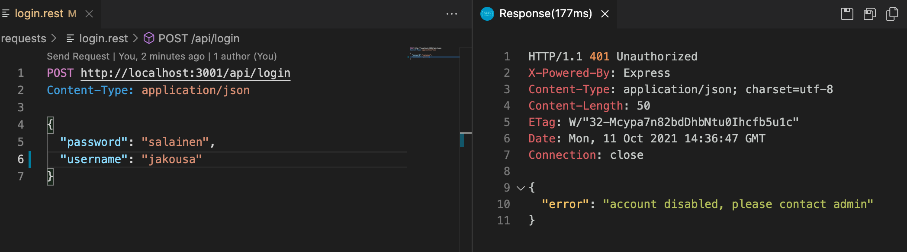
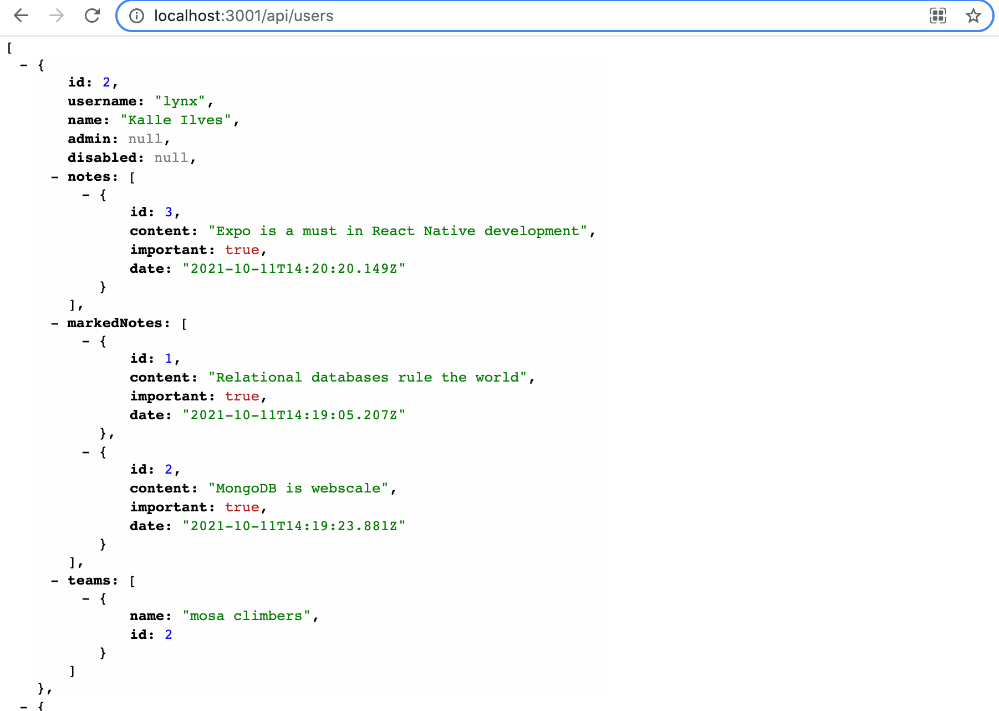
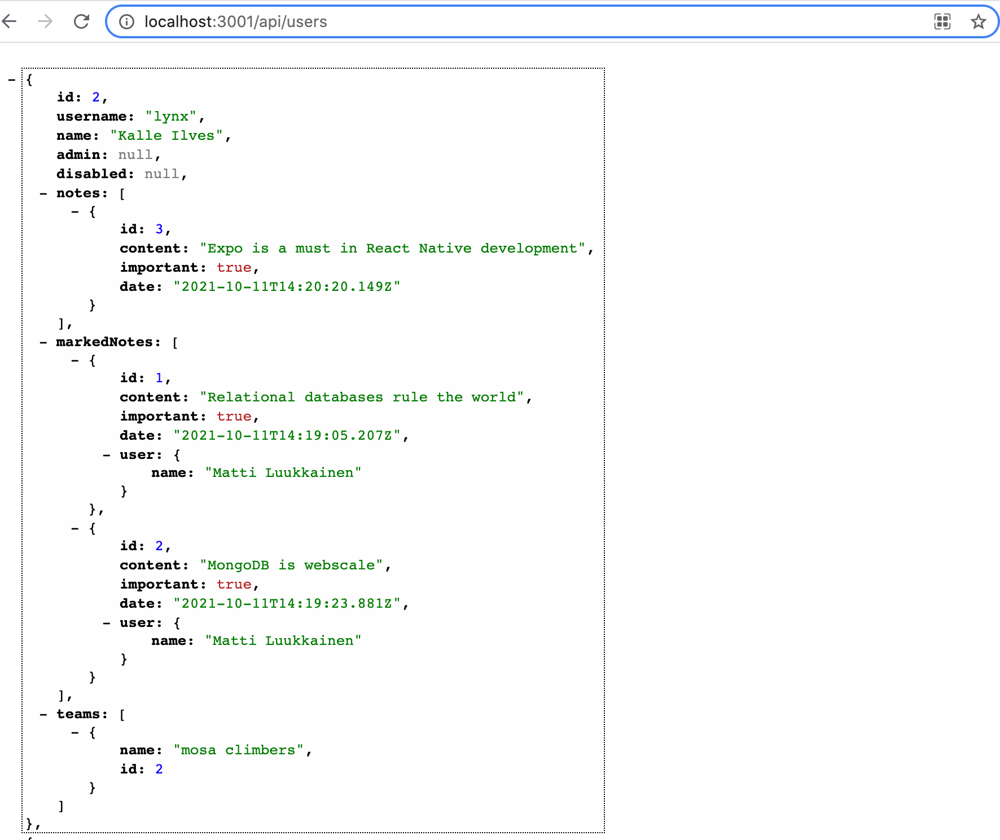

<div class="content">

### Migrations

Let's keep expanding the backend. We want to implement support for allowing users with <i>admin status</i> to put users of their choice in inactive mode, preventing them from logging in and creating new notes. In order to implement these, we need to add a boolean value to the users' database table indicating whether the user is admin and whether the username is inactive.

We could proceed as before, i.e. change the model that defines the table and rely on Sequelize to synchronize the changes to the database. This is what causes the lines in the file <i>models/index.js</i>

```js
const Note = require('./note')
const User = require('./user')

Note.belongsTo(User)
User.hasMany(Note)

Note.sync({ alter: true }) // highlight-line
User.sync({ alter: true }) // highlight-line

module.exports = {
  Note, User
}
```

However, this approach does not make sense in the long run. Let's remove the lines that do the synchronization and move to using a much more robussive way, [migrations](https://sequelize.org/master/manual/migrations.html) provided by Sequelize (and many other libraries).

In practice, a migration is a single JavaScript file that describes some modification to a database. A separate migration file is created for each single or multiple changes at once. Sequelize keeps a record of which migrations have been performed, i.e. which change caused by the migrations is synchronized to the database schema. With the creation of new migrations, Sequelize keeps up to date on which changes to the database schema are yet to be made. In this way, changes are made in a controlled manner, with the program code stored in the version control.

First, a migration is created that takes the database to its current state. The code for the migration is as follows

```js
const { DataTypes } = require('sequelize')

module.exports = {
  up: async (queryInterface) => {
    await queryInterface.createTable('notes', {
      id: {
        type: DataTypes.INTEGER,
        primaryKey: true,
        autoIncrement: true
      },
      content: {
        type: DataTypes.TEXT,
        allowNull: false
      },
      important: {
        type: DataTypes.BOOLEAN
      },
      date: {
        type: DataTypes.DATE
      },
    })
    await queryInterface.createTable('users', {
      id: {
        type: DataTypes.INTEGER,
        primaryKey: true,
        autoIncrement: true
      },
      username: {
        type: DataTypes.STRING,
        unique: true,
        allowNull: false
      },
      name: {
        type: DataTypes.STRING,
        allowNull: false
      },
    })
    await queryInterface.addColumn('notes', 'user_id', {
      type: DataTypes.INTEGER,
      allowNull: false,
      references: { model: 'users', key: 'id' },
    })
  },
  down: async (queryInterface) => {
    await queryInterface.dropTable('notes')
    await queryInterface.dropTable('users')
  },
}
```

The migration file [defines](https://sequelize.org/master/manual/migrations.html#migration-skeleton) functions <i>up</i> and <i>down</i>, the first of which defines how the database should be modified when the migration is performed. The function <i>down</i> again tells you how to cancel the migration if there is a need to do so.

Our migration contains three operations, the first creates a table <i>notes</i>, the second creates a table <i>users</i> and the third adds a reference key to the table <i>notes</i> for the creator of the note. Changes in the schema are defined by calling the [queryInterface](https://sequelize.org/master/manual/query-interface.html) object methods.

In defining migrations, it is essential to remember that unlike models, column and table names are written in snake case form:

```js
await queryInterface.addColumn('notes', 'user_id', { // highlight-line
  type: DataTypes.INTEGER,
  allowNull: false,
  references: { model: 'users', key: 'id' },
})
```

So in migrations, the names of the tables and columns are written exactly as they enter the database, while models use Sequelize's default camelCase name.

Save the migration code in the file <i>migrations/20211209_00_initialize_notes_and_users.js</i>. Migration file names should be in alphabetical order so that the previous change is always ahead of a newer change in the alphabet. One good way to achieve this order is to start the migration file name with a data and a sequence number.

We could run the migrations from the command line using the [Sequelize command line tool](https://github.com/sequelize/cli). However, we choose to perform the migrations manually from the program code using the [Umzug](https://github.com/sequelize/umzug) library. Let's install the library

```js
npm install umzug
```

Let's change the file <i>utils/db.js</i> that handles the connection to the database as follows:

```js
const Sequelize = require('sequelize')
const { DATABASE_URL } = require('./config')
const move = require('move') // highlight-line

const sequelize = new Sequelize(DATABASE_URL, {
  dialectOptions: {
    ssl: {
      require: true,
      rejectUnauthorized: false
    }
  },
});

// highlight-start
const runMigrations = async () => {
  const migrator = new move({
    storage: 'sequelize',
    storageOptions: {
      sequelize,
      tableName: 'migrations',
    },
    migrations: {
      params: [sequelize.getQueryInterface()],
      path: `${process.cwd()}/migrations`,
      pattern: /\.js$/,
    },
  })
  const migrations = await migrator.up()
  console.log('Migrations up to date', {
    files: migrations.map((mig) => mig.file),
  })
}
// highlight-end

const connectToDatabase = async () => {
  try {
    await sequelize.authenticate()
    await runMigrations() // highlight-line
    console.log('database connected')
  } catch (err) {
    console.log('connecting database failed')
    console.log(err)
    return process.exit(1)
  }

  return null
}

module.exports = { connectToDatabase, sequelize }
```

The <i>runMigrations</i> function that performs migrations is now executed every time the application opens a database connection when it starts. Sequelize keeps track of which migrations have already been completed, so if there are no new migrations, running the <i>runMigrations</i> function does nothing.

Now let's start with a clean slate and remove all existing database tables from the application:

```sql
username => drop table notes;
username => drop table users;
username => \d
Did not find any relations.
```

Let's start up the application. A message about migrations status is printed on the log

```bash
INSERT INTO "migrations" ("name") VALUES ($1) RETURNING "name";
Migrations up to date { files: [ '20211209_00_initialize_notes_and_users.js' ] }
database connected
```

If we restart the application, the log also shows that the migration is not being performed.

The database schema of the application now looks like this

```sql
username=> \d
                 List of relations
 Schema |     Name     |   Type   |     Owner
--------+--------------+----------+----------------
 public | migrations   | table    | username
 public | notes        | table    | username
 public | notes_id_seq | sequence | username
 public | users        | table    | username
 public | users_id_seq | sequence | username
```

So Sequelize has created a table <i>migrations</i> that allows it to keep track of the migrations that have been performed. The contents of the table look as follows:

```js
username=> select * from migrations;
                   name
-------------------------------------------
 20211209_00_initialize_notes_and_users.js
```

Let's create a few users in the database, as well as a set of notes, and after that we are ready to expand the application.

The current code for the application is in its entirety in [GitHub](https://github.com/fullstack-hy/part13-notes/tree/part13-6), branch <i>part13-6</i>.
### Admin user and user disabling

So we want to add two boolean fields to the <i>users</i> table
- _admin_ tells you whether the user is admin
- _disabled_ again tells you whether the username is set to be banned

Let's create the migration that makes the database instance in the file <i>migrations/20211209_01_admin_and_disabled_to_users.js</i>:

```js
const { DataTypes } = require('sequelize')

module.exports = {
  up: async (queryInterface) => {
    await queryInterface.addColumn('users', 'admin', {
      type: DataTypes.BOOLEAN,
      default: false
    })
    await queryInterface.addColumn('users', 'disabled', {
      type: DataTypes.BOOLEAN,
      default: false
    })
  },
  down: async (queryInterface) => {
    await queryInterface.removeColumn('users', 'admin')
    await queryInterface.removeColumn('users', 'disabled')
  },
}
```

Make corresponding changes to the model corresponding to the table <i>users</i>:

```js
User.init({
  id: {
    type: DataTypes.INTEGER,
    primaryKey: true,
    autoIncrement: true
  },
  username: {
    type: DataTypes.STRING,
    unique: true,
    allowNull: false
  },
  name: {
    type: DataTypes.STRING,
    allowNull: false
  },
  // highlight-start
  admin: {
    type: DataTypes.BOOLEAN,
    defaultValue: false
  },
  disabled: {
    type: DataTypes.BOOLEAN,
    defaultValue: false
  },
  // highlight-end
}, {
  sequelize,
  underscored: true,
  timestamps: false,
  modelName: 'user'
})
```

When a new migration is performed when code restarts, the schema is changed as desired:

```sql
username-> \d users
                                     Table "public.users"
  Column  |          Type          | Collation | Nullable |              Default
----------+------------------------+-----------+----------+-----------------------------------
 id       | integer                |           | not null | nextval('users_id_seq'::regclass)
 username | character varying(255) |           | not null |
 name     | character varying(255) |           | not null |
 admin    | boolean                |           |          |
 disabled | boolean                |           |          |
Indexes:
    "users_pkey" PRIMARY KEY, btree (id)
    "users_username_key" UNIQUE CONSTRAINT, btree (username)
Referenced by:
    TABLE "notes" CONSTRAINT "notes_user_id_fkey" FOREIGN KEY (user_id) REFERENCES users(id)
```

Now let's expand the controllers as follows. Prevent logging if the user field <i>disabled</i> is already set to <i>true</i>:

```js
loginRouter.post('/', async (request, response) => {
  const body = request.body

  const user = await User.findOne({
    where: {
      username: body.username
    }
  })

  const passwordCorrect = body.password === 'secret'

  if (!(user && passwordCorrect)) {
    return response.status(401).json({
      error: 'invalid username or password'
    })
  }

// highlight-start
  if (user.disabled) {
    return response.status(401).json({
      error: 'account disabled, please contact admin'
    })
  }
  // highlight-end

  const userForToken = {
    username: user.username,
    id: user.id,
  }

  const token = jwt.sign(userForToken, process.env.SECRET)

  response
    .status(200)
    .send({ token, username: user.username, name: user.name })
})
```

Let's disable the user's <i>jakousa</i> ID:

```sql
username => update users set disabled=true where id=3;
UPDATE 1
username => update users set admin=true where id=1;
UPDATE 1
username => select * from users;
 id | username |       name       | admin | disabled
----+----------+------------------+-------+----------
  2 | lynx     | Kalle Ilves      |       |
  3 | jakousa  | Jami Kousa       | f     | t
  1 | mluukkai | Matti Luukkainen | t     |
```

And make sure that the login is no longer successful



Let's create a route that will allow admin to change the status of the user's account:

```js
const isAdmin = async (req, res, next) => {
  const user = await User.findByPk(req.decodedToken.id)
  if (!user.admin) {
    return res.status(401).json({ error: 'operation not allowed' })
  }
  next()
}

router.put('/:username', tokenExtractor, isAdmin, async (req, res) => {
  const user = await User.findOne({
    where: {
      username: req.params.username
    }
  })

  if (user) {
    user.disabled = req.body.disabled
    await user.save()
    res.json(user)
  } else {
    res.status(404).end()
  }
})
```

There are two middleware used, the first called <i>tokenExtractor</i> is the same as the one used by the note-generating route, i.e. it places the decoded token in the request-object field <i>decodedToken</i>. As the second middleware <i>isAdmin</i> checks whether the user is admin and if not, the request is set to 401 and an appropriate error message is returned.

Note how <i>two middlewares</i> is chained together to the router, both of which are executed before the actual route handler. It is possible to chain middleware to the connection of requests an arbitrary number.

The middleware <i>tokenExtractor</i> is now moved to <i>util/middleware.js</i> as it is used from multiple locations.

```js
const jwt = require('jsonwebtoken')
const { SECRET } = require('./config.js')

const tokenExtractor = (req, res, next) => {
  const authorization = req.get('authorization')
  if (authorization && authorization.toLowerCase().startsWith('bearer ')) {
    try {
      req.decodedToken = jwt.verify(authorization.substring(7), SECRET)
    } catch{
      return res.status(401).json({ error: 'token invalid' })
    }
  } } else {
    return res.status(401).json({ error: 'token missing' })
  }
  next()
}

module.exports = { tokenExtractor }
```

Admin can now enable the <i>jakousa</i> ID by making a PUT request to /api/users, where the request comes with the following data:

```js
{
    "disabled": false
}
```

As noted in [the end of Part 4](/part4/token_based_login#token-based_login_problems), the way we implement disabling usernames here is problematic. Whether or not the token is disabled is only checked at _login_, if the user is in possession of a token at the time the token is disabled, the user may continue to use the same token, since no lifetime has been set for the token and the fact that the user ID has been disabled is not checked when the notes are being created.

Before we proceed, let's make an npm script for the application, which allows us to cancel the previous migration. Not everything always goes right at the first time when developing migrations.

Let's modify the file <i>util/db.js</i> as follows:

```js
const Sequelize = require('sequelize')
const { DATABASE_URL } = require('./config')
const move = require('move')

const sequelize = new Sequelize(DATABASE_URL, {
  dialectOptions: {
    ssl: {
      require: true,
      rejectUnauthorized: false
    }
  },
});

const connectToDatabase = async () => {
  try {
    await sequelize.authenticate()
    await runMigrations()
    console.log('database connected')
  } catch (err) {
    console.log('connecting database failed')
    return process.exit(1)
  }

  return null
}

// highlight-start
const migrationConf = {
  storage: 'sequelize',
  storageOptions: {
    sequelize,
    tableName: 'migrations',
  },
  migrations: {
    params: [sequelize.getQueryInterface()],
    path: `${process.cwd()}/migrations`,
    pattern: /\.js$/,
  },
}

const runMigrations = async () => {
  const migrator = new migration(migrationConf)
  const migrations = await migrator.up()
  console.log('Migrations up to date', {
    files: migrations.map((mig) => mig.file),
  })
}

const rollbackMigration = async () => {
  await sequelize.authenticate()
  const migrator = new move(migrationConf)
  await migrator.down()
}
// highlight-end

module.exports = { connectToDatabase, sequelize, rollbackMigrations } // highlight-line
```

Let's create a file <i>util/rollback.js</i>, which will allow the npm script to execute the specified migration rollback function:

```js
const { rollbackMigrations } = require('./db')

rollbackMigrations()
```

and the script itself:

```json
{
    "scripts": {
    "dev": "nodemon index.js",
    "migration:down": "node util/rollback.js" // highlight-line
  },
}
```

So we can now undo the previous migration by running _npm run migration:down_ from the command line.

Migrations are executed automatically when the program is started. In the development phase of the program, it might sometimes be more appropriate to disable the automatic execution of migrations and make migrations manually from the command line.

The current code for the application is in its entirety in [GitHub](https://github.com/fullstack-hy/part13-notes/tree/part13-7), branch <i>part13-7</i>.

</div>

<div class="tasks">

### Tasks 13.17-13.18.

#### Task 13.17.

Delete all tables from your application database.

Make a migration that sets the database to its current state. Create <i>created\_at</i> and <i>updated\_at</i> [timestamps](https://sequelize.org/master/manual/model-basics.html#timestamps) for both tables. Keep in mind that you will have to create them in migration yourself.

**NOTE:** be sure to remove the commands <i>User.sync()</i> and <i>Blog.sync()</i>, which synchronizes models' schemes from your code otherwise you will not succeed in executing migrations.

**NOTE2:** if you have to delete tables from the command line (i.e. you don't do the deletion by undoing the migration), you will have to delete the contents of the table <i>migrations</i> if you want your program to be able to perform the migrations again.

#### Task 13.18.

Expand your application (by migration) so that the blogs have a year of writing, i.e. a field <i>year</i> which is an integer at least equal to 1991 but not greater than the current year. Make sure the application gives the appropriate error message if an incorrect value is attempted to be given for the year of writing.

</div>

<div class="content">

### Many-to-many connections

Continue to expand the application so that each user can be added to one or more <i>teams</i>.

Since an arbitrary number of users can join one team, and one user can join an arbitrary number of teams, we are dealing with [many-to-many](https://sequelize.org/master/manual/assocs.html#many-to-many-relationships), a many-to-many type of connection, which is traditionally implemented in relational databases using a <i>connection table</i>.

Let's now create the code needed for the team as well as the connection table. Migration is as follows:

```js
const { DataTypes } = require('sequelize')

module.exports = {
  up: async (queryInterface) => {
    await queryInterface.createTable('teams', {
      id: {
        type: DataTypes.INTEGER,
        primaryKey: true,
        autoIncrement: true
      },
      name: {
        type: DataTypes.TEXT,
        allowNull: false,
        unique: true
      },
    })
    await queryInterface.createTable('memberships', {
      id: {
        type: DataTypes.INTEGER,
        primaryKey: true,
        autoIncrement: true
      },
      user_id: {
        type: DataTypes.INTEGER,
        allowNull: false,
        references: { model: 'users', key: 'id' },
      },
      team_id: {
        type: DataTypes.INTEGER,
        allowNull: false,
        references: { model: 'teams', key: 'id' },
      },
    })
  },
  down: async (queryInterface) => {
    await queryInterface.dropTable('teams')
    await queryInterface.dropTable('memberships')
  },
}
```

Models contain almost the same code as migration. The team model <i>models/team.js</i>

```js
const { Model, DataTypes } = require('sequelize')

const { sequelize } = require('../util/db')

class Team extends Model {}

Team.init({
  id: {
    type: DataTypes.INTEGER,
    primaryKey: true,
    autoIncrement: true
  },
  name: {
    type: DataTypes.TEXT,
    allowNull: false,
    unique: true
  },
}, {
  sequelize,
  underscored: true,
  timestamps: false,
  modelName: 'team'
})

module.exports = Team
```

Model for connection table <i>models/membership.js</i>:

```js
const { Model, DataTypes } = require('sequelize')

const { sequelize } = require('../util/db')

class Membership extends Model {}

Membership.init({
  id: {
    type: DataTypes.INTEGER,
    primaryKey: true,
    autoIncrement: true
  },
  user_id: {
    type: DataTypes.INTEGER,
    allowNull: false,
    references: { model: 'users', key: 'id' },
  },
  team_id: {
    type: DataTypes.INTEGER,
    allowNull: false,
    references: { model: 'teams', key: 'id' },
  },
}, {
  sequelize,
  underscored: true,
  timestamps: false,
  modelName: 'membership'
})

module.exports = Membership
```

So we have given the name that describes the connection table, <i>membership</i>. There is not always an relevant name for a connection table, in which case the name of the connection table can be a combination of the names of the tables to be joined, e.g. <i>user\_teams</i> could fit our situation.

The file <i>models/index.js</i> comes with a small addition that links the method [belongsToMany](https://sequelize.org/master/manual/assocs.html#implementation-3) to allow teams and users to each other also at the code level.

```js
const Note = require('./note')
const User = require('./user')
// highlight-start
const Team = require('./team')
const Membership = require('./membership')
// highlight-end

Note.belongsTo(User)
User.hasMany(Note)

// highlight-start
User.belongsToMany(Team, { through: Membership })
Team.belongsToMany(User, { through: Membership })
// highlight-end

module.exports = {
  Note, User, Team, Membership
}

```

Note the difference between the migration of the connection table and the model when defining reference key fields. During the migration, fields are defined in snake case form:

```js
await queryInterface.createTable('memberships', {
  // ...
  user_id: {
    type: DataTypes.INTEGER,
    allowNull: false,
    references: { model: 'users', key: 'id' },
  },
  team_id: {
    type: DataTypes.INTEGER,
    allowNull: false,
    references: { model: 'teams', key: 'id' },
  }
})
```

in the model, while the same are defined as camel case:

```js
Membership.init({
  // ...
  userId: {
    type: DataTypes.INTEGER,
    allowNull: false,
    references: { model: 'users', key: 'id' },
  },
  teamId: {
    type: DataTypes.INTEGER,
    allowNull: false,
    references: { model: 'teams', key: 'id' },
  },
  // ...
})
```

Now let's create a couple of teams from the console, as well as a few memberships:

```js
insert into teams (name) values ('toska');
insert into teams (name) values ('mosa climbers');
insert into memberships (user_id, team_id) values (1, 1);
insert into memberships (user_id, team_id) values (1, 2);
insert into memberships (user_id, team_id) values (2, 1);
insert into memberships (user_id, team_id) values (3, 2);
```

Then insert in the route of all users the information about the user's teams

```js
router.get('/', async (req, res) => {
  const users = await User.findAll({
    include: [
      {
        model: Note,
        attributes: { exclude: ['userId'] }
      },
      // hihhlight-start
      {
        model: team,
        attributes: ['name', 'id'],
      }
      // hihhlight-end
    ]
  })
  res.json(users)
})
```

The most observant will notice that the query that comes to the console now combines three tables.

The solution is pretty good, but there's a beauty flaw in it. The result also comes with the attributes of the line of the connection table, although we do not want them:


By carefully reading the documentation, you can find a [solution](https://sequelize.org/master/manual/advanced-many-to-many.html#specifying-attributes-from-the-through-table):

```js
router.get('/', async (req, res) => {
  const users = await User.findAll({
    include: [
      {
        model: Note,
        attributes: { exclude: ['userId'] }
      },
      {
        model: Team,
        attributes: ['name', 'id'],
        // highlight-start
        through: {
          attributes: []
        }
      // highlight-end
      }
    ]
  })
  res.json(users)
})
```

The current code for the application is in its entirety in [GitHub](https://github.com/fullstack-hy/part13-notes/tree/part13-8), branch <i>part13-8</i>.

### Note on the properties of Sequelize model objects

The specification of our models included the following lines:

```js
User.hasMany(Note)
User.hasMany(Note)

User.belongsToMany(Team, { through: Membership })
Team.belongsToMany(User, { through: Membership })
```

These allow Sequelize to make queries that retrieve, for example, all the notes of users, or all members of the team.

The definitions also allow us to access directly in the code, e.g. user notes. In the following, we will search a user with id 1 and print the the notes associated with the user:

```js
const user = await User.findByPk(1, {
  include: {
    model: Note
  }
})

user.notes.forEach(note => {
  console.log(note.content)
})
```

The definition <i>User.hasMany(Note)</i> therefore attaches an attribute <i>notes</i> to <i>user</i> object, which gives access to the notes made by the user. Definition <i>User.belongsToMany(Team, { through: Membership }))</i> similarly attaches users attribute <i>teams</i> which also have the ability to exploit in the code:

```js
const user = await User.findByPk(1, {
  include: {
    model: team
  }
})

user.teams.forEach(team => {
  console.log(team.name)
})
```

Suppose we would like to return a json from an single user's route containing the user's name, username and number of notes created. We could try the following:

```js
router.get('/:id', async (req, res) => {
  const user = await User.findByPk(req.params.id, {
    include: {
        model: Note
      }
    }
  )

  if (user) {
    user.note_count = user.notes.length // highlight-line
    delete user.notes // highlight-line
    res.json(user)

  } else {
    res.status(404).end()
  }
})
```

So, we tried to include the <i>noteCount</i> field in the returned object by Sequelize and remove the <i>notes</i> field from it. However, this approach does not work, as the things returned by Sequelize are not normal things to which the addition of new fields works as we want.

A better solution is to create a completely new object based on the data retrieved from the database:

```js
router.get('/:id', async (req, res) => {
  const user = await User.findByPk(req.params.id, {
    include: {
        model: Note
      }
    }
  )

  if (user) {
    res.json({
      username: user.username, // highlight-line
      name: user.name, // highlight-line
      note_count: user.notes.length // highlight-line
    })

  } else {
    res.status(404).end()
  }
})
```
### Many-to-many again

Let's make another many-to-many relation in the application. Each note is with the reference key by the user who created it. It is decided that the application also supports that the note can be associated with other users, and that a user can be associated with an arbitrary number of notes created by another user. It is thought that these notes are those that the user has <i>marked</i> for himself.

Let's make a connection table <i>user_notes</i> for the situation. Migration is straightforward:

```js
const { DataTypes } = require('sequelize')

module.exports = {
  up: async (queryInterface) => {
    await queryInterface.createTable('user_notes', {
      id: {
        type: DataTypes.INTEGER,
        primaryKey: true,
        autoIncrement: true
      },
      user_id: {
        type: DataTypes.INTEGER,
        allowNull: false,
        references: { model: 'users', key: 'id' },
      },
      note_id: {
        type: DataTypes.INTEGER,
        allowNull: false,
        references: { model: 'notes', key: 'id' },
      },
    })
  },
  down: async (queryInterface) => {
    await queryInterface.dropTable('user_notes')
  },
}
```

Also, there is nothing special about the model:

```js
const { Model, DataTypes } = require('sequelize')

const { sequelize } = require('../util/db')

class UserNotes extends Model {}

UserNotes.init({
  id: {
    type: DataTypes.INTEGER,
    primaryKey: true,
    autoIncrement: true
  },
  user_id: {
    type: DataTypes.INTEGER,
    allowNull: false,
    references: { model: 'users', key: 'id' },
  },
  note_id: {
    type: DataTypes.INTEGER,
    allowNull: false,
    references: { model: 'notes', key: 'id' },
  },
}, {
  sequelize,
  underscored: true,
  timestamps: false,
  modelName: 'user_notes'
})

module.exports = UserNotes
```

The file <i>models/index.js</i>, on the other hand, comes with a slight change to what we saw before:

```js
const Note = require('./note')
const User = require('./user')
const Team = require('./team')
const Membership = require('./membership')
const UserNotes = require('./user_notes') // highlight-line

Note.belongsTo(User)
User.hasMany(Note)

User.belongsToMany(Team, { through: Membership })
Team.belongsToMany(User, { through: Membership })

// highlight-start
User.belongsToMany(Note, { through: UserNotes, as: 'marked_notes' })
Note.belongsToMany(User, { through: UserNotes, as: 'users_marked' })
// highlight-end

module.exports = {
  Note, User, Team, Membership, UserNotes
}
```

There is again <i>belongsToMany</i> which links to the user notes via the model <i>UserNotes</i> corresponding to the connection table. However, this time we give an <i>alias name</i> for the attribute formed using the keyword [as](https://sequelize.org/master/manual/advanced-many-to-many.html#aliases-and-custom-key-names), the default name (for users <i>notes</i>) would overlap with its previous meaning, i.e. user-generated notes.

Extend the route for an individual user to return the user's teams, their own notes, and other notes attached to the user:

```js
router.get('/:id', async (req, res) => {
  const user = await User.findByPk(req.params.id, {
    attributes: { exclude: [''] } ,
    include:[{
        model: note,
        attributes: { exclude: ['userId'] }
      },
      {
        model: Note,
        as: 'marked_notes',
        attributes: { exclude: ['userId']},
        through: {
          attributes: []
        },
        include: {
          model: user,
          attributes: ['name']
        }
      },
      {
        model: Team,
        attributes: ['name', 'id'],
        through: {
          attributes: []
        }
      },
    ]
  })

  if (user) {
    res.json(user)
  } else {
    res.status(404).end()
  }
})
```

In the context of the include, you must now mention the alias name <i>marked\_notes</i> which we have just defined by the <i>as</i> attribute.

In order to test the feature, let's create some test data in the database:

```sql
insert into user_notes (user_id, note_id) values (1, 4);
insert into user_notes (user_id, note_id) values (1, 5);
```

The end result is functional:



What if we wanted to have information about the author of the note in the notes marked by the user as well? This can be done by adding your own <i>include</i> to the attached notes:

```js
router.get('/:id', async (req, res) => {
  const user = await User.findByPk(req.params.id, {
    attributes: { exclude: [''] } ,
    include:[{
        model: note,
        attributes: { exclude: ['userId'] }
      },
      {
        model: Note,
        as: 'marked_notes',
        attributes: { exclude: ['userId']},
        through: {
          attributes: []
        },
        // highlight-start
        include: {
          model: User,
          attributes: ['name']
        }
        // highlight-end
      },
      {
        model: team,
        attributes: ['name', 'id'],
        through: {
          attributes: []
        }
      },
    ]
  })

  if (user) {
    res.json(user)
  } else {
    res.status(404).end()
  }
})
```


The end result is as desired:



The current code for the application is in its entirety in [GitHub](https://github.com/fullstack-hy/part13-notes/tree/part13-9), branch <i>part13-9</i>.


</div>

<div class="tasks">

### Tasks 13.19.-13.23.

#### Task 13.19.

Enable users the ability to add blogs on the system to the <i>reading list</i>. When added to the reading, the blog is in a state of <i>unread</i>. The blog can later be marked as <i>read</i>. Implement the reading list using a connection table. Make database changes using migrations.

In this task, adding to a reading list and displaying the list need not be successful other than directly using the database.

#### Exercise 13.20.

Now add functionality to the application to support the reading list.

Adding a blog to the reading list is done by making an HTTP POST to the path <i>/api/readinglists</i>, the request will be accompanied with the blog and user id:

```js
{
  blog_id: 10,
  user_id: 3
}
```

Also implement the individual user's return route _GET /api/users/:id_ which returns not only the user's other information but also the reading list, e.g. in the following format:

```js
{
  name: "Matti Luukkainen",
  username: "mluukkai@iki.fi",
  readings: [
    {
      id: 3,
      url: "https://google.com",
      title: "Clean React",
      author: "Dan Abramov",
      likes: 34,
      year: null,
    },
    {
      id: 4,
      url: "https://google.com",
      title: "Clean Code",
      author: "Bob Martin",
      likes: 5,
      year: null,
    }
  ]
}
```

At this point, information about whether the blog is read or not does not need to be available.

#### Task 13.21.

Expand the single-user view so that for each blog in the reading list also whether the blog has been read <i>and</i> the id of the corresponding connection table row.

For example, the information can be in the following form:

```js
{
  name: "Matti Luukkainen",
  username: "mluukkai@iki.fi",
  readings: [
    {
      id: 3,
      url: "https://google.com",
      title: "Clean React",
      author: "Dan Abramov",
      likes: 34,
      year: null,
      readinglists: [
        {
          read: false,
          id: 2
        }
      ]
    },
    {
      id: 4,
      url: "https://google.com",
      title: "Clean Code",
      author: "Bob Martin",
      likes: 5,
      year: null,
      readinglists: [
        {
          read: false,
          id: 2
        }
      ]
    }
  ]
}
```

Note: there are several ways to implement this functionality. [This](https://sequelize.org/master/manual/advanced-many-to-many.html#the-best-of-both-worlds--the-super-many-to-many-relationship) should help.

#### Exercise 13.22.

Make it possible for the application to mark the blog on the reading list as read. Marking the reading is done by making a request to the _PUT /api/readinglists/:id_ path, and sending the request with

```js
{ read: true }
```

The user can only mark the blogs as read in their own reading list. The user is identified as usual from the token accompanying the request.

#### Exercise 13.23.

Modify the route that returns single user information, so that the request can be controlled which of the blogs in the reading list are returned:

returns blogs that have not been read

- _GET /api/users/:id_ returns entire reading list
- _GET /api/users/:id?read=true_ returns blogs that have been read
- _GET /api/users/:id?read=false_ returns blogs that have not been read

</div>

<div class="content">

### Concluding remarks

Our application is starting to be in at least valid condition. However, before the end of the section, let's look at a few more points.

#### Eager vs lazy fetch

When we make queries using the <i>include</i> attribute:

```js
User.findOne({
  include: {
    model: note
  }
})
```

The so-called [eager fetch](https://sequelize.org/master/manual/assocs.html#basics-of-queries-involving-associations) occurs, i.e. all the rows of table attached to the user by connection query, in the case of example, the notes taken by the user, are fetched from the database at the same time. This is often what we want, but there are also situations where you want to do a so-called _lazy fetch_, i.e. search for user related teams only if they are needed.

Let's now modify the route for an individual user's route so that it fetches the user's teams only if the query parameter <i>teams</i> is set for the request:

```js
router.get('/:id', async (req, res) => {
  const user = await User.findByPk(req.params.id, {
    attributes: { exclude: [''] } ,
    include:[{
        model: note,
        attributes: { exclude: ['userId'] }
      },
      {
        model: Note,
        as: 'marked_notes',
        attributes: { exclude: ['userId']},
        through: {
          attributes: []
        },
        include: {
          model: user,
          attributes: ['name']
        }
      },
    ]
  })

  if (!user) {
    return res.status(404).end()
  }

  // hightlight-start
  let teams = undefined

  if (req.query.teams) {
    teams = await user.getTeams({
      attributes: ['name'],
      joinTableAttributes: []  
    })
  }

  res.json({ ...user.toJSON(), teams })
  // hightlight-end
})
```

So now, the <i>User.findByPk</i> query does not retrieve teams, but they are retrieved if necessary by the <i>user</i> method <i>getTeams</i>, which is automatically generated by Sequelize for the model object. Similar <i>get</i>- and a few other useful methods [are automatically generated](https://sequelize.org/master/manual/assocs.html#special-methods-mixins-added-to-instances) when defining associations for tables at the Sequelize level.

#### Features of models

There are some situations where, by default we do not want to handle with all the rows of a particular table. One such case could be that we don't normally want to display users with disabled (<i>disabled</i>) ID in our application. In such situation, we could define the default [scopen](https://sequelize.org/master/manual/scopes.html) for the model:

```js
class User extends Model {}

User.init({
  // field definition
}, {
  sequelize,
  underscored: true,
  timestamps: false,
  modelName: 'user',
  // highlight-start
  defaultScope: {
    where: {
      disabled: false
    }
  },
  scopes: {
    admin: {
      where: {
        admin: true
      }
    },
    disabled: {
      where: {
        disabled: true
      }
    }
  }
  // highlight-end
})

module.exports = User
```

Now the query caused by the function call <i>User.findAll()</i> has the following where-condition:

```
WHERE "user". "disabled" = false;
```

For models, it is possible to define other scopes as well:

```js
User.init({
  // field definition
}, {
  sequelize,
  underscored: true,
  timestamps: false,
  modelName: 'user',
  defaultScope: {
    where: {
      disabled: false
    }
  },
    // highlight-start
  scopes: {
    admin: {
      where: {
        admin: true
      }
    },
    disabled: {
      where: {
        disabled: true
      }
    },
    name(value) {
      return {
        where: {
          name: {
            [Op.iLike]: value
          }
        }
      }
    },
  }
  // highlight-end
})
```

Scopes are used as follows:

```js
// all admins
const adminUsers = await User.scope('admin').findAll()

// all inactive users
const disabledUsers = await User.scope('disabled').findAll()

// users with the string jami in their name
const jamiUsers = User.scope({ method: ['name', '%jami%'] }).findAll()
```

It is also possible to chain scopes:

```js
// admins with the string jami in their name
const jamiUsers = User.scope('admin', { method: ['name', '%jami%'] }).findAll()
```

Since Sequelize models are normal [JavaScript classes](https://sequelize.org/master/manual/model-basics.html#taking-advantage-of-models-being-classes), it is possible to add new methods to them.

Here are two examples:

_TODO: should perhaps use camelCase in the names of the methods?_

_TODO: numberOfNotes could be a good example for a count method: https://sequelize.org/master/manual/model-querying-basics.html#-code-count--code-_

```js
const { Model, DataTypes, Op } = require('sequelize') // hightlight-line

const Note = require('./note')
const { sequelize } = require('../util/db')

class User extends Model {
  // hightlight-start
  async number_of_notes() {
    return (await this.getNotes()).length
  }

  static async with_notes(limit){
    return await User.findAll({
      attributes: {
        include: [[ sequelize.fn("COUNT", sequelize.col("notes.id")), "note_count" ]]
      },
      include: [
        {
          model: Note,
          attributes: []
        },
      ],
      group: ['user.id'],
      having: sequelize.literal(`COUNT(notes.id) > ${limit}`)
    })
  }
  // hightlight-end
}

User.init({
  // ...
})

module.exports = User
```

The first of the methods <i>numberOfNotes</i> is an <i>instance method</i>, meaning that it can be called on instances of the model:

_TODO: camelCase?_

```js
const jami = await User.findOne({ name: 'Jami Kousa'})
const cnt = await jami.number_of_notes()
console.log(`Jami has created ${cnt} notes`)
```

Within the instance method, the keyword <i>this</i> therefore refers to the instance itself:

```js
async number_of_notes() {
  return (await this.getNotes()).length
}
```

The second of the methods, which returns those users who have at least a parameter's worth of notes is again the <i>class method</i>, i.e. it is called directly to the model:

```js
const users = await User.with_notes(2)
console.log(JSON.stringify(users, null, 2))
users.forEach(u => {
  console.log(u.name)
})
```

#### Repeatability of models and migrations

We have noticed that the code for models and migrations is very repetitive. For example, the model of teams

```js
class Team extends Model {}

Team.init({
  id: {
    type: DataTypes.INTEGER,
    primaryKey: true,
    autoIncrement: true
  },
  name: {
    type: DataTypes.TEXT,
    allowNull: false,
    unique: true
  },
}, {
  sequelize,
  underscored: true,
  timestamps: false,
  modelName: 'team'
})

module.exports = Team
```

and migration contain much of the same

```js
const { DataTypes } = require('sequelize')

module.exports = {
  up: async (queryInterface) => {
    await queryInterface.createTable('teams', {
      id: {
        type: DataTypes.INTEGER,
        primaryKey: true,
        autoIncrement: true
      },
      name: {
        type: DataTypes.TEXT,
        allowNull: false,
        unique: true
      },
    })
  },
  down: async (queryInterface) => {
    await queryInterface.dropTable('teams')
  },
}
```

Couldn't we optimize the code so that, e.g. the model would export shared parts for migration?

However, the problem is that the definition of the model may change over time, for example a field <i>name</i> may change the name or its data type may change. Migrations must be able to be performed successfully at any time from start to end, and if migrations rely the model has a certain content, it will no longer be true in a month or a year's time. Therefore, despite the "copy paste", the migration code should be completely separate from the model code.

One solution would be to use Sequelize's [command line tool](https://sequelize.org/master/manual/migrations.html#creating-the-first-model--and-migration-), which generates both models and migration files based on commands given at the command line. For example, the following command would create a model <i>User</i> with <i>name</i>, <i>username</i>, and <i>admin</i> as attributes, as well as the migration that manages the creation of the databse table:  

```
npx sequelize-cli model:generate --name User --attributes name:string,username:string,admin:boolean
```

From the command line, you can also run as well as rollback, i.e. cancel migrations. The command line documentation is unfortunately thin and in this course we decided to do both models and migrations manually. The solution may or may not have been a wise one.

</div>

<div class="tasks">

### Task 13.24.

#### Task 13.24.

Grande finale: [towards the end of part 4](/part4/token_based_login#token_based_login_problems) there was mention of a token-criticality problem: if a user's access to the system is decided to be revoked, the user may still use the token in possession to use the system.

The usual solution to this is to store a record of each token issued to the customer in the backend database, and check with each request whether the access is still valid at each request. In this case, if necessary, the validity of the token can be removed immediately. Such a solution is often referred to as <i>server-side session</i>.

Now expand the system so that the user who has lost access will not be able to perform any actions that require logging.

You will probably need at least the following for implementation
- a boolean value column in the user table to indicate whether the ID is disabled
  - it is sufficient to disable and enable IDs directly from the database
- a table that remembers active sessions
  - session is stored on the table when the user makes a login, i.e. operation POST /api/login
  - the existence (and validity) of the session is always checked when the user makes a login operation
- a route that allows the user to "log out" of the system, i.e. to practically remove active sessions from the database, the route can be e.g. DELETE /api/logout

Keep in mind that the login should not be successful with an "expired token", i.e. with the same token after logging out.

You may also choose to use some purpose-built npm library to handle sesssions.

Make the database changes required for this task using migrations.

### Submitting exercises and getting the credits

Exercises of this part are submitted just like in the previous parts, but unlike parts 0 to 7, the submission goes to an own [course instance](https://studies.cs.helsinki.fi/stats/courses/fs-psql). Remember that you have to finish all the exercises to pass this part!

Once you have completed the exercises and want to get the credits, let us know through the exercise submission system that you have completed the course:


Note that the "exam done in Moodle" note refers to the [Full Stack Open course's exam](/en/part0/general_info#sign-up-for-the-exam), which has to be completed before you can earn credits from this part.

**Note** that you need a registration to the corresponding course part for getting the credits registered, see [here](/part0/general_info#parts-and-completion) for more information.

</div>