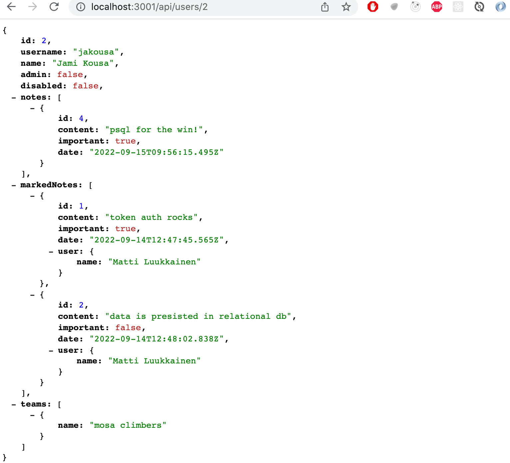

<div class="content">

### Migraatiot

Jatketaan backendin laajentamista. Haluamme toteuttaa tuen sille, että <i>admin-statuksen</i> omaavat käyttäjät voivat asettaa haluamiaan käyttäjiä epäaktiiviseen tilaan, estäen heiltä kirjautumisen ja uusien muistiinpanojen luomisen. Toteuttaaksemme nämä, meidän tulee lisätä käyttäjien tietokantatauluun boolean-arvoinen tieto siitä, onko käyttäjä admin sekä siitä onko käyttäjätunnus epäaktiivinen.

Voisimme edetä kuten aiemmin, eli muuttaa taulun määrittelevää modelia ja luottaa, että Sequelize synkronoi muutokset tietokantaan. Tämänhän saavat aikaan tiedostossa <i>models/index.js</i> olevat rivit

```js
const Note = require('./note')
const User = require('./user')

Note.belongsTo(User)
User.hasMany(Note)

Note.sync({ alter: true }) // highlight-line
User.sync({ alter: true }) // highlight-line

module.exports = {
  Note, User
}
```

Tämä toimintatapa ei kuitenkaan ole pitkässä juoksussa järkevä. Poistetaan synkronoinnin tekevät rivit ja siirrytään käyttämään paljon robustimpaa tapaa, Sequelizen (ja monien muiden kirjastojen) tarjoamia [migraatioita](https://sequelize.org/master/manual/migrations.html).

Käytännössä migraatio on yksittäinen JavaScript-tiedosto, joka kuvaa jonkin tietokantaan tehtävän muutoksen. Jokaista yksittäistä tai useampaa kerralla tapahtuvaa muutosta varten tehdään oma migraatio-tiedosto. Sequelize pitää kirjaa siitä, mitkä migraatioista on suoritettu, eli minkä migraatioiden aiheuttama muutos on synkronoitu tietokannan skeemaan. Uusien migraatioiden luomisen myötä Sequelize pysyy ajan tasalla siitä, mitkä muutokset kannan skeemaan on vielä tekemättä. Näin muutokset tehdään hallitusti, versionhallintaan talletetulla ohjelmakoodilla.

Luodaan aluksi migraatio, joka vie tietokannan sen nykyiseen tilaansa. Migraation koodi on seuraavassa:

```js
const { DataTypes } = require('sequelize')

module.exports = {
  up: async ({ context: queryInterface }) => {
    await queryInterface.createTable('notes', {
      id: {
        type: DataTypes.INTEGER,
        primaryKey: true,
        autoIncrement: true
      },
      content: {
        type: DataTypes.TEXT,
        allowNull: false
      },
      important: {
        type: DataTypes.BOOLEAN,
        allowNull: false
      },
      date: {
        type: DataTypes.DATE
      },
    })
    await queryInterface.createTable('users', {
      id: {
        type: DataTypes.INTEGER,
        primaryKey: true,
        autoIncrement: true
      },
      username: {
        type: DataTypes.STRING,
        unique: true,
        allowNull: false
      },
      name: {
        type: DataTypes.STRING,
        allowNull: false
      },
    })
    await queryInterface.addColumn('notes', 'user_id', {
      type: DataTypes.INTEGER,
      allowNull: false,
      references: { model: 'users', key: 'id' },
    })
  },
  down: async ({ context: queryInterface }) => {
    await queryInterface.dropTable('notes')
    await queryInterface.dropTable('users')
  },
}
```

Migraatiotiedostossa on [määriteltynä](https://sequelize.org/master/manual/migrations.html#migration-skeleton) funktiot <i>up</i> ja <i>down</i> joista ensimmäinen määrittelee miten tietokantaa tulee muuttaa migraatiota suorittaessa. Funktio <i>down</i> kertoo taas sen miten migraatio perutaan jos näin on tarvetta tehdä.

Migraatiomme sisältää kolme operaatiota, ensimmäinen luo taulun <i>notes</i>, toinen taulun <i>users</i> ja kolmas lisää tauluun <i>notes</i> viiteavaimen muistiinpanon luojaan. Skeeman muutokset määritellään [queryInterface](https://sequelize.org/master/manual/query-interface.html)-olion metodeja kutsumalla.

Migraatioiden määrittelyssä on oleellista muistaa, että toisin kuin modeleissa, sarakkeiden ja taulujen nimet kirjoitetaan snake case ‑muodossa:

```js
await queryInterface.addColumn('notes', 'user_id', { // highlight-line
  type: DataTypes.INTEGER,
  allowNull: false,
  references: { model: 'users', key: 'id' },
})
```

Migraatioissa siis taulujen sekä sarakkeiden nimet kirjoitetaan juuri niin kuin ne tietokantaan tulevat, kun taas modeleissa on käytössä Sequelizen oletusarvoinen camelCase-nimentä.

Talletetaan migraation koodi tiedostoon <i>migrations/20211209\_00\_initialize\_notes\_and\_users.js</i>. Migraatiotiedostojen nimien tulee olla aakkosjärjestyksessä siten, että aiempi muutos on aina aakkosissa uudempaa muutosta edellä. Eräs hyvä tapa saada tämä järjestys aikaan on aloittaa migraatiotiedoston nimi päivämäärällä sekä järjestysnumerolla.

Voisimme suorittaa migraatiot komentoriviltä käsin [Sequelizen komentorivityökalun](https://github.com/sequelize/cli) avulla. Päätämme kuitenkin suorittaa migraatiot ohjelmakoodista käsin [Umzug](https://github.com/sequelize/umzug)-kirjastoa käyttäen. Asennetaan kirjasto

```js
npm install umzug
```

Muutetaan tietokantayhteyden muodostavaa tiedostoa <i>utils/db.js</i> seuraavasti:

```js
const Sequelize = require('sequelize')
const { DATABASE_URL } = require('./config')
const { Umzug, SequelizeStorage } = require('umzug') // highlight-line

const sequelize = new Sequelize(DATABASE_URL)

 // highlight-start
const runMigrations = async () => {
  const migrator = new Umzug({ 
    migrations: {
      glob: 'migrations/*.js',
    },
    storage: new SequelizeStorage({ sequelize, tableName: 'migrations' }),
    context: sequelize.getQueryInterface(),
    logger: console,
  })

  const migrations = await migrator.up()
  console.log('Migrations up to date', {
    files: migrations.map((mig) => mig.name),
  })
}
 // highlight-end

const connectToDatabase = async () => {
  try {
    await sequelize.authenticate()
    /*  highlight-start */
    await runMigrations()
    /* highlight-end */
    console.log('database connected')
  } catch (err) {
    console.log('connecting database failed')
    console.log(err)
    return process.exit(1)
  }

  return null
}

module.exports = { connectToDatabase, sequelize }
```

Migraatiot suorittava funktio <i>runMigrations</i> suoritetaan nyt joka kerta kun sovellus käynnistyessään avaa tietokantayhteyden. Sequelize pitää kirjaa siitä mitkä migraatiot on jo suoritettu, eli jos uusia migratioita ei ole, ei funktion <i>runMigrations</i> suorittaminen tee mitään.

Aloitetaan nyt puhtaalta pöydältä ja poistetaan sovelluksesta kaikki olemassaolevat tietokantataulut:

```sql
username => drop table notes;
username => drop table users;
username => \d
Did not find any relations.
```

Käynnistetään sovellus. Lokiin tulostuu migraatioiden statuksesta kertova viesti

```bash
INSERT INTO "migrations" ("name") VALUES ($1) RETURNING "name";
Migrations up to date { files: [ '20211209_00_initialize_notes_and_users.js' ] }
database connected
```

Jos käynnistämme sovelluksen uudelleen, lokistakin on pääteltävissä että migraatiota ei suoriteta.

Sovelluksen tietokantaskeema näyttää nyt seuraavalta

```sql
postgres=# \d
                 List of relations
 Schema |     Name     |   Type   |     Owner
--------+--------------+----------+----------------
 public | migrations   | table    | username
 public | notes        | table    | username
 public | notes_id_seq | sequence | username
 public | users        | table    | username
 public | users_id_seq | sequence | username
```

Sequelize on siis luonut taulun <i>migrations</i>, jonka avulla se pitää kirjaa suoritetuista migraatiosta. Taulun sisältö näyttää seuraavalta:

```sql
postgres=# select * from migrations;
                   name
-------------------------------------------
 20211209_00_initialize_notes_and_users.js
```

Luodaan tietokantaan muutama käyttäjä sekä joukko muistiinpanoja, ja sen jälkeen olemme valmiina laajentamaan sovellusta.

Sovelluksen tämänhetkinen koodi on kokonaisuudessaan [GitHubissa](https://github.com/fullstack-hy/part13-notes/tree/part13-6), branchissa <i>part13-6</i>.
### Admin-käyttäjä ja käyttäjien disablointi

Haluamme siis lisätä tauluun <i>users</i> kaksi boolean-arvoista kenttää
- _admin_ kertoo onko käyttäjä admin
- _disabled_ taas kertoo sen onko käyttäjätunnus asetettu käyttökieltoon

Luodaan tietokantaskeeman tekevä migraatio tiedostoon <i>migrations/20211209\_01\_admin\_and\_disabled\_to\_users.js</i>:

```js
const { DataTypes } = require('sequelize')

module.exports = {
  up: async ({ context: queryInterface }) => {
    await queryInterface.addColumn('users', 'admin', {
      type: DataTypes.BOOLEAN,
      default: false
    })
    await queryInterface.addColumn('users', 'disabled', {
      type: DataTypes.BOOLEAN,
      default: false
    })
  },
  down: async ({ context: queryInterface }) => {
    await queryInterface.removeColumn('users', 'admin')
    await queryInterface.removeColumn('users', 'disabled')
  },
}
```

Tehdään vastaavat muutokset taulua <i>users</i> vastaavaan modeliin:

```js
User.init({
  id: {
    type: DataTypes.INTEGER,
    primaryKey: true,
    autoIncrement: true
  },
  username: {
    type: DataTypes.STRING,
    unique: true,
    allowNull: false
  },
  name: {
    type: DataTypes.STRING,
    allowNull: false
  },
  // highlight-start
  admin: {
    type: DataTypes.BOOLEAN,
    defaultValue: false
  },
  disabled: {
    type: DataTypes.BOOLEAN,
    defaultValue: false
  },
  // highlight-end
}, {
  sequelize,
  underscored: true,
  timestamps: false,
  modelName: 'user'
})
```

Kun uusi migraatio suoritetaan koodin uudelleenkäynnistymisen yhteydessä, muuttuu skeema halutulla tavalla:

```sql
username-> \d users
                                     Table "public.users"
  Column  |          Type          | Collation | Nullable |              Default
----------+------------------------+-----------+----------+-----------------------------------
 id       | integer                |           | not null | nextval('users_id_seq'::regclass)
 username | character varying(255) |           | not null |
 name     | character varying(255) |           | not null |
 admin    | boolean                |           |          |
 disabled | boolean                |           |          |
Indexes:
    "users_pkey" PRIMARY KEY, btree (id)
    "users_username_key" UNIQUE CONSTRAINT, btree (username)
Referenced by:
    TABLE "notes" CONSTRAINT "notes_user_id_fkey" FOREIGN KEY (user_id) REFERENCES users(id)
```

Laajennetaan nyt kontrollereita seuraavasti. Estetään kirjautuminen jos käyttäjän kentän <i>disabled</i> arvona on <i>true</i>:

```js
loginRouter.post('/', async (request, response) => {
  const body = request.body

  const user = await User.findOne({
    where: {
      username: body.username
    }
  })

  const passwordCorrect = body.password === 'salainen'

  if (!(user && passwordCorrect)) {
    return response.status(401).json({
      error: 'invalid username or password'
    })
  }

// highlight-start
  if (user.disabled) {
    return response.status(401).json({
      error: 'account disabled, please contact admin'
    })
  }
  // highlight-end

  const userForToken = {
    username: user.username,
    id: user.id,
  }

  const token = jwt.sign(userForToken, process.env.SECRET)

  response
    .status(200)
    .send({ token, username: user.username, name: user.name })
})
```

Disabloidaan käyttäjän <i>jakousa</i> tunnus:

```sql
username => update users set disabled=true where id=3;
UPDATE 1
username => update users set admin=true where id=1;
UPDATE 1
username => select * from users;
 id | username |       name       | admin | disabled
----+----------+------------------+-------+----------
  2 | lynx     | Kalle Ilves      |       |
  3 | jakousa  | Jami Kousa       | f     | t
  1 | mluukkai | Matti Luukkainen | t     |
```

Ja varmistetaan että kirjautuminen ei enää onnistu:


Tehdään vielä route, jonka avulla admin pystyy muuttamaan käyttäjän tunnuksen statusta:

```js
const isAdmin = async (req, res, next) => {
  const user = await User.findByPk(req.decodedToken.id)
  if (!user.admin) {
    return res.status(401).json({ error: 'operation not permitted' })
  }
  next()
}

router.put('/:username', tokenExtractor, isAdmin, async (req, res) => {
  const user = await User.findOne({ 
    where: {
      username: req.params.username
    }
  })

  if (user) {
    user.disabled = req.body.disabled
    await user.save()
    res.json(user)
  } else {
    res.status(404).end()
  }
})
```

Käytössä on kaksi middlewarea, ensin kutsuttu <i>tokenExtractor</i> on sama mitä myös muistiinpanoja luova route käyttää, eli se asettaa dekoodatun tokenin request-olion kenttään <i>decodedToken</i>. Toisena suoritettava middleware <i>isAdmin</i> tarkastaa onko käyttäjä admin, ja jos ei, pyynnön statukseksi asetetaan 401 ja annetaan asiaan kuuluva virheilmoitus.

Huomaa, miten reitinkäsittelijään on siis ketjutettu <i>kaksi middlewarea</i> jotka molemmat suoritetaan ennen varsinaista reitinkäsittelijää. Middlewareja on mahdollista ketjuttaa pyyntöjen yhteyteen mielivaltainen määrä.

Middleware <i>tokenExtractor</i> on nyt siirretty tiedostoon <i>util/middleware.js</i> koska sitä käytetään useasta paikasta.

```js
const jwt = require('jsonwebtoken')
const { SECRET } = require('./config.js')

const tokenExtractor = (req, res, next) => {
  const authorization = req.get('authorization')
  if (authorization && authorization.toLowerCase().startsWith('bearer ')) {
    try {
      req.decodedToken = jwt.verify(authorization.substring(7), SECRET)
    } catch{
      return res.status(401).json({ error: 'token invalid' })
    }
  } else {
    return res.status(401).json({ error: 'token missing' })
  }
  next()
}

module.exports = { tokenExtractor }
```

Admin voi nyt enabloida <i>jakousa</i>n tunnuksen tekemällä routeen /api/users/jakousa PUT-pyynnön, missä pyynnön mukana on seuraava data:

```js
{
    "disabled": false
}
```

Kuten [osan 4 loppupuolella](/osa4/token_perustainen_kirjautuminen#token-perustaisen-kirjautumisen-ongelmat) todetaan, tässä toteuttamamme tapa käyttäjätunnusten disablointiin on ongelmallinen. Se onko tunnus disabloitu tarkastetaan ainoastaan <i>kirjautumisen yhteydessä</i>. Jos käyttäjällä on token hallussaan siinä vaiheessa kun tunnus disabloidaan, voi käyttäjä jatkaa saman tokenin käyttöä, sillä tokenille ei ole asetettu elinikää eikä sitä seikkaa, että käyttäjän tunnus on disabloitu tarkasteta muistiinpanojen luomisen yhteydessä.

Ennen kuin jatkamme eteenpäin, tehdään sovellukselle npm-skripti, jonka avulla edellinen migraatio on mahdollista perua. Kaikki ei nimittäin mene aina ensimmäisellä kerralla oikein migraatioita kehitettäessä.

Muutetaan tiedostoa <i>util/db.js</i> seuraavasti:

```js
const Sequelize = require('sequelize')
const { DATABASE_URL } = require('./config')
const { Umzug, SequelizeStorage } = require('umzug')

const sequelize = new Sequelize(DATABASE_URL, {
  dialectOptions: {
    ssl: {
      require: true,
      rejectUnauthorized: false
    }
  },
});

const connectToDatabase = async () => {
  try {
    await sequelize.authenticate()
    await runMigrations()
    console.log('database connected')
  } catch (err) {
    console.log('connecting database failed')
    return process.exit(1)
  }

  return null
}

// highlight-start
const migrationConf = {
  migrations: {
    glob: 'migrations/*.js',
  },
  storage: new SequelizeStorage({ sequelize, tableName: 'migrations' }),
  context: sequelize.getQueryInterface(),
  logger: console,
}

const runMigrations = async () => {
  const migrator = new Umzug(migrationConf)
  const migrations = await migrator.up()
  console.log('Migrations up to date', {
    files: migrations.map((mig) => mig.name),
  })
}

const rollbackMigration = async () => {
  await sequelize.authenticate()
  const migrator = new Umzug(migrationConf)
  await migrator.down()
}
// highlight-end

/* highlight-start */
module.exports = { connectToDatabase, sequelize, rollbackMigration }
/* highlight-end */
```

Tehdään tiedosto <i>util/rollback.js</i>, jonka kautta npm-skripti pääsee suorittamaan määritellyn migraation peruvan funktion:

```js
const { rollbackMigration } = require('./db')

rollbackMigration()
```

ja itse skripti:

```json
{
  "scripts": {
    "dev": "nodemon index.js",
    "migration:down": "node util/rollback.js" // highlight-line
  },
}
```

Voimme nyt siis perua edellisen migraation suorittamalla komentoriviltä _npm run migration:down_.

Migraatiot suoritetaan automaattisesti kun ohjelma käynnistetään. Ohjelman kehitysvaiheessa saattaisi välillä olla tarkoituksenmukaisempaa poistaa migraatioiden automaattinen suoritus ja tehdä migraatiot komentoriviltä käsin.

Sovelluksen tämänhetkinen koodi on kokonaisuudessaan [GitHubissa](https://github.com/fullstack-hy/part13-notes/tree/part13-7), branchissa <i>part13-7</i>.

</div>

<div class="tasks">

### Tehtävät 13.17-13.18.

#### Tehtävä 13.17.

Poista sovelluksesi tietokannasta kaikki taulut.

Tee migraatio, joka asettaa tietokannan tämänhetkiseen tilaan. Luo <i>created\_at</i> ja <i>updated\_at</i> [aikaleimat](https://sequelize.org/master/manual/model-basics.html#timestamps) molemmille tauluille. Huomaa, että joudut luomaan ne migraatiossa itse.

**HUOM:** muista poistaa koodistasi modelien skeemat synkronoivat komennot <i>User.sync()</i> ja <i>Blog.sync()</i> muuten migraatioiden suorittaminen ei onnistu.

**HUOM2:** jos joudut poistamaan tauluja komentoriviltä (etkä siis tee poistoa migraation perumisen avulla), joudut poistamaan taulun <i>migrations</i> sisällön, jos haluat että ohjelmasi pystyy suorittamaan migraatiot uudelleen.

#### Tehtävä 13.18.

Laajenna sovellusta (migraation avulla) siten, että blogeille tulee kirjoitusvuosi, eli kenttä <i>year</i> joka on kokonaisluku, jonka suuruus on vähintään 1991 mutta ei suurempi kuin menossa oleva vuosi. Varmista että sovellus antaa asiaankuuluvan virheilmoituksen jos kirjoitusvuodelle yritetään antaa virheellinen arvo.

</div>

<div class="content">

### Monen suhde moneen ‑yhteydet

Jatketaan sovelluksen laajentamista siten, että jokainen käyttäjä voidaan lisätä yhteen tai useampaan <i>tiimiin</i>.

Koska yhteen tiimiin voi liittyä mielivaltainen määrä käyttäjiä, ja yksi käyttäjä voi liittyä mielivaltaiseen määrään tiimejä, on kysessä [many-to-many](https://sequelize.org/master/manual/assocs.html#many-to-many-relationships) eli monen-suhde-moneen tyyppinen yhteys, joka perinteisesti toteutetaan relaatiotietokannoissa <i>liitostaulun</i> avulla.

Luodaan nyt tiimin sekä liitostaulun tarvitsema koodi. Tiedostoon <i>20211209_02_add_teams_and_memberships.js</i> talletettava migraatio on seuraavassa:

```js
const { DataTypes } = require('sequelize')

module.exports = {
  up: async ({ context: queryInterface }) => {
    await queryInterface.createTable('teams', {
      id: {
        type: DataTypes.INTEGER,
        primaryKey: true,
        autoIncrement: true
      },
      name: {
        type: DataTypes.TEXT,
        allowNull: false,
        unique: true
      },
    })
    await queryInterface.createTable('memberships', {
      id: {
        type: DataTypes.INTEGER,
        primaryKey: true,
        autoIncrement: true
      },
      user_id: {
        type: DataTypes.INTEGER,
        allowNull: false,
        references: { model: 'users', key: 'id' },
      },
      team_id: {
        type: DataTypes.INTEGER,
        allowNull: false,
        references: { model: 'teams', key: 'id' },
      },
    })
  },
  down: async ({ context: queryInterface }) => {
    await queryInterface.dropTable('teams')
    await queryInterface.dropTable('memberships')
  },
}
```

Modelit sisältävät lähes saman koodin kuin migraatio. Tiimin modeli <i>models/team.js</i>:

```js
const { Model, DataTypes } = require('sequelize')

const { sequelize } = require('../util/db')

class Team extends Model {}

Team.init({
  id: {
    type: DataTypes.INTEGER,
    primaryKey: true,
    autoIncrement: true
  },
  name: {
    type: DataTypes.TEXT,
    allowNull: false,
    unique: true
  },
}, {
  sequelize,
  underscored: true,
  timestamps: false,
  modelName: 'team'
})

module.exports = Team
```

Liitostaulun modeli <i>models/membership.js</i>:

```js
const { Model, DataTypes } = require('sequelize')

const { sequelize } = require('../util/db')

class Membership extends Model {}

Membership.init({
  id: {
    type: DataTypes.INTEGER,
    primaryKey: true,
    autoIncrement: true
  },
  userId: {
    type: DataTypes.INTEGER,
    allowNull: false,
    references: { model: 'users', key: 'id' },
  },
  teamId: {
    type: DataTypes.INTEGER,
    allowNull: false,
    references: { model: 'teams', key: 'id' },
  },
}, {
  sequelize,
  underscored: true,
  timestamps: false,
  modelName: 'membership'
})

module.exports = Membership
```

Olemme siis antaneet liitostaululle kuvaavan nimen, <i>membership</i>. Liitostauluille ei aina löydy yhtä osuvaa nimeä, tällöin liitostaulun nimi voidaan muodostaa yhdistelmänä liitettävien taulujen nimistä esim. <i>user\_teams</i> voisi sopia tilanteeseemme.

Tiedostoon <i>models/index.js</i> tulee pieni lisäys, joka liittää metodin [belongsToMany](https://sequelize.org/master/manual/assocs.html#implementation-3) avulla tiimit ja käyttäjät toisiinsa myös koodin tasolla.

```js
const Note = require('./note')
const User = require('./user')
// highlight-start
const Team = require('./team')
const Membership = require('./membership')
// highlight-end

Note.belongsTo(User)
User.hasMany(Note)

// highlight-start
User.belongsToMany(Team, { through: Membership })
Team.belongsToMany(User, { through: Membership })
// highlight-end

module.exports = {
  Note, User, Team, Membership // highlight-line
}
```

Huomaa eroavaisuus liitostaulun migraation ja modelin välillä viiteavainkenttien määrittelyssä. Migraatiossa kentät määritellään snake case ‑muodossa:

```js
await queryInterface.createTable('memberships', {
  // ...
  user_id: {
    type: DataTypes.INTEGER,
    allowNull: false,
    references: { model: 'users', key: 'id' },
  },
  team_id: {
    type: DataTypes.INTEGER,
    allowNull: false,
    references: { model: 'teams', key: 'id' },
  }
})
```

modelissa taas samat määritellään camel casena:

```js
Membership.init({
  // ...
  userId: {
    type: DataTypes.INTEGER,
    allowNull: false,
    references: { model: 'users', key: 'id' },
  },
  teamId: {
    type: DataTypes.INTEGER,
    allowNull: false,
    references: { model: 'teams', key: 'id' },
  },
  // ...
})
```


Luodaan nyt pqql-konsolista pari tiimiä sekä muutama jäsenyys:

```js
insert into teams (name) values ('toska');
insert into teams (name) values ('mosa climbers');
insert into memberships (user_id, team_id) values (1, 1);
insert into memberships (user_id, team_id) values (1, 2);
insert into memberships (user_id, team_id) values (2, 1);
insert into memberships (user_id, team_id) values (3, 2);
```

Lisätään sitten kaikkien käyttäjien reittiin tieto käyttäjän joukkueista

```js
router.get('/', async (req, res) => {
  const users = await User.findAll({
    include: [
      {
        model: Note,
        attributes: { exclude: ['userId'] }
      },
      // highlight-start
      {
        model: Team,
        attributes: ['name', 'id'],
      }
      // highlight-end
    ]
  })
  res.json(users)
})
```

Tarkkasilmäisimmät huomaavat, että konsoliin tulostuva kysely yhdistää nyt kolme taulua.

Ratkaisu on aika hyvä, mutta siinä on eräs kauneusvirhe. Tuloksen mukana ovat myös liitostaulun rivin attribuutit vaikka emme niitä halua:


Dokumentaatiota tarkkaan lukemalla löytyy [ratkaisu](https://sequelize.org/master/manual/advanced-many-to-many.html#specifying-attributes-from-the-through-table):

```js
router.get('/', async (req, res) => {
  const users = await User.findAll({
    include: [
      {
        model: Note,
        attributes: { exclude: ['userId'] }
      },
      {
        model: Team,
        attributes: ['name', 'id'],
        // highlight-start
        through: {
          attributes: []
        }
      // highlight-end
      }
    ]
  })
  res.json(users)
})
```

Sovelluksen tämänhetkinen koodi on kokonaisuudessaan [GitHubissa](https://github.com/fullstack-hy/part13-notes/tree/part13-8), branchissa <i>part13-8</i>.

### Huomio Sequelizen model-olioiden ominaisuuksista

Modeliemme määrittely sisälsi mm. seuraavat rivit:

```js
User.hasMany(Note)
User.hasMany(Note)

User.belongsToMany(Team, { through: Membership })
Team.belongsToMany(User, { through: Membership })
```

Näiden ansiosta Sequelize osaa tehdä kyselyt, jotka hakevat esim. käyttäjien kaikki muistiinpanot, tai joukkueen kaikki jäsenet.

Määrittelyjen ansiosta pääsemme myös koodissa suoraan käsiksi esim. käyttäjän muistiinpanoihin. Seuraavassa haetaan käyttäjä, jonka id on 1 ja tulostetaan käyttäjään liittyvät muistiinpanot:

```js
const user = await User.findByPk(1, {
  include: {
    model: Note
  }
})

user.notes.forEach(note => {
  console.log(note.content)
})
```

Määrittely <i>User.hasMany(Note)</i> siis liittää <i>user</i>-olioille attribuutin <i>notes</i>, jonka kautta päästään käsiksi käyttäjän tekemiin muistiinpanoihin. Määrittely <i>User.belongsToMany(Team, { through: Membership }))</i> liittää vastaavasti käyttäjille attribuutin <i>teams</i> jota on myös mahdollisuus hyödyntää koodissa:

```js
const user = await User.findByPk(1, {
  include: {
    model: Team
  }
})

user.teams.forEach(team => {
  console.log(team.name)
})
```

Oletetaan että haluaisimme palauttaa yksittäisen käyttäjän reitiltä jsonin, joka sisältää käyttäjän nimen, käyttäjätunnuksen sekä luotujen muistiinpanojen määrän. Voisimme yrittää seuravaa:

```js
router.get('/:id', async (req, res) => {
  const user = await User.findByPk(req.params.id, {
    include: {
        model: Note
      }
    }
  )

  if (user) {
    user.noteCount = user.notes.length // highlight-line
    delete user.notes // highlight-line
    res.json(user)

  } else {
    res.status(404).end()
  }
})
```

Eli yritimme liittää Sequelizen palauttamaan olioon kentän <i>noteCount</i> sekä poistaa siitä muistiinpanot sisältävän kentän <i>notes</i>. Tämä lähestymistapa ei kuitenkaan toimi, sillä Sequelizen palauttamat oliot eivät ole normaaleja olioita, joihin uusien kenttien lisääminen toimii siten kuin haluamme.

Parempi ratkaisu onkin luoda tietokannasta haetun datan perusteella kokonaan uusi olio:

```js
router.get('/:id', async (req, res) => {
  const user = await User.findByPk(req.params.id, {
    include: {
        model: Note
      }
    }
  )

  if (user) {
    res.json({
      username: user.username, // highlight-line
      name: user.name, // highlight-line
      noteCount: user.notes.length // highlight-line
    })

  } else {
    res.status(404).end()
  }
})
```
### Monen suhde moneen uudelleen

Tehdään sovellukseen vielä toinen monesta moneen ‑yhteys. Jokaiseen muistiinpanoon liittyy sen luonut käyttäjä viiteavaimen kautta. Päätetään, että sovellus tukee myös sitä, että muistiinpanoon voidaan liittää muitakin käyttäjiä, ja että käyttäjään voi liittyä mielivaltainen määrä jonkun muun käyttäjän tekemiä muistiinpanoja. Ajatellaan että nämä muistiinpanot ovat sellaisia, jotka käyttäjä on <i>merkinnyt</i> itselleen.

Tehdään tilannetta varten liitostaulu <i>user\_notes</i>. Migraatio, joka tallennetaan tiedostoon <i>20211209\_03\_add\_user\_notes.js</i> on suoraviivainen:

```js
const { DataTypes } = require('sequelize')

module.exports = {
  up: async ({ context: queryInterface }) => {
    await queryInterface.createTable('user_notes', {
      id: {
        type: DataTypes.INTEGER,
        primaryKey: true,
        autoIncrement: true
      },
      user_id: {
        type: DataTypes.INTEGER,
        allowNull: false,
        references: { model: 'users', key: 'id' },
      },
      note_id: {
        type: DataTypes.INTEGER,
        allowNull: false,
        references: { model: 'notes', key: 'id' },
      },
    })
  },
  down: async ({ context: queryInterface }) => {
    await queryInterface.dropTable('user_notes')
  },
}
```

Myöskään modelissa ei ole mitään erikoista:

```js
const { Model, DataTypes } = require('sequelize')

const { sequelize } = require('../util/db')

class UserNotes extends Model {}

UserNotes.init({
  id: {
    type: DataTypes.INTEGER,
    primaryKey: true,
    autoIncrement: true
  },
  userId: {
    type: DataTypes.INTEGER,
    allowNull: false,
    references: { model: 'users', key: 'id' },
  },
  noteId: {
    type: DataTypes.INTEGER,
    allowNull: false,
    references: { model: 'notes', key: 'id' },
  },
}, {
  sequelize,
  underscored: true,
  timestamps: false,
  modelName: 'userNotes'
})

module.exports = UserNotes
```

Tiedostoon <i>models/index.js</i> sen sijaan tulee hienoinen muutos aiemmin näkemäämme:

```js
const Note = require('./note')
const User = require('./user')
const Team = require('./team')
const Membership = require('./membership')
const UserNotes = require('./user_notes') // highlight-line

Note.belongsTo(User)
User.hasMany(Note)

User.belongsToMany(Team, { through: Membership })
Team.belongsToMany(User, { through: Membership })

// highlight-start
User.belongsToMany(Note, { through: UserNotes, as: 'markedNotes' })
Note.belongsToMany(User, { through: UserNotes, as: 'usersMarked' })
// highlight-end

module.exports = {
  Note, User, Team, Membership, UserNotes
}
```

Käytössä on taas <i>belongsToMany</i> joka liittää käyttäjän muistiinpanoihin liitostaulua vastaavan modelin <i>UserNotes</i> kautta. Annamme kuitenkin tällä kertaa avainsanaa [as](https://sequelize.org/master/manual/advanced-many-to-many.html#aliases-and-custom-key-names) käyttäen muodostuvalle attribuutille <i>aliasnimen</i>, oletusarvoinen nimi (käyttäjillä <i>notes</i>) menisi päällekkäin sen aiemman merkityksen, eli käyttäjän luomien muistiinpanojen kanssa.

Laajennetaan yksittäisen käyttäjän routea siten, että se palauttaa käyttäjän joukkueet, omat muistiinpanot sekä käyttäjään liitetyt muut muistiinpanot:

```js
router.get('/:id', async (req, res) => {
  const user = await User.findByPk(req.params.id, { 
    attributes: { exclude: [''] } ,
    include:[{
        model: Note,
        attributes: { exclude: ['userId'] }
      },
      // highlight-start
      {
        model: Note,
        as: 'markedNotes',
        attributes: { exclude: ['userId']},
        through: {
          attributes: []
        },
      },
      // highlight-end
      {
        model: Team,
        attributes: ['name', 'id'],
        through: {
          attributes: []
        }
      },
    ]
  })

  if (user) {
    res.json(user)
  } else {
    res.status(404).end()
  }
})
```

Includen yhteydessä on nyt mainittava <i>as</i>-määrettä käyttäen äsken määrittelemämme aliasnimi <i>markedNotes</i>.

Jotta ominaisuutta päästään testaamaan, luodaan tietokantaan hieman testidataa:

```sql
insert into user_notes (user_id, note_id) values (2, 1);
insert into user_notes (user_id, note_id) values (2, 2);
```

Lopputulos on toimiva:



Entä jos haluaisimme, että käyttäjän merkitsemissä muistiinpanoissa olisi myös tieto muistiinpanon tekijästä? Tämä onnistuu lisäämällä liitetyille muistiinpanoille oma <i>include:</i>

```js
router.get('/:id', async (req, res) => {
  const user = await User.findByPk(req.params.id, { 
    attributes: { exclude: [''] } ,
    include:[{
        model: Note,
        attributes: { exclude: ['userId'] }
      },
      {
        model: Note,
        as: 'marked_notes',
        attributes: { exclude: ['userId']},
        through: {
          attributes: []
        },
        // highlight-start
        include: {
          model: User,
          attributes: ['name']
        }
        // highlight-end
      },
      {
        model: Team,
        attributes: ['name', 'id'],
        through: {
          attributes: []
        }
      },
    ]
  })

  if (user) {
    res.json(user)
  } else {
    res.status(404).end()
  }
})
```


Lopputulos on halutun kaltainen:


Sovelluksen tämänhetkinen koodi on kokonaisuudessaan [GitHubissa](https://github.com/fullstack-hy/part13-notes/tree/part13-9), branchissa <i>part13-9</i>.


</div>

<div class="tasks">

### Tehtävät 13.19.-13.23.

#### Tehtävä 13.19.

Toteuta käyttäjille mahdollisuus lisätä järjestelmässä olevia blogeja <i>lukulistalle</i>. Lisättäessä lukulistalle, blogi on tilassa <i>lukematon</i>. Blogi voidaan merkata myöhemmin <i>luetuksi</i>. Toteuta lukulista liitostaulun avulla. Tee tietokantamuutokset migraatioiden avulla.

Tässä tehtävässä lukulistalle lisäämisen ja listan näyttämisen ei tarvitse onnistua muuten kuin suoraan tietokantaa käyttämällä.

#### Tehtävä 13.20.

Lisätään nyt lukulistaa tukeva toiminnallisuus sovellukseen.

Blogin lisääminen lukulistalle tapahtuu tekemällä HTTP POST reitille _/api/readinglists_, pyynnön mukana lähetetään blogin ja käyttäjän id:

```js
{
  blog_id: 10,
  user_id: 3
}
```

Toteuta myös yksittäisen käyttäjän palauttava reitti _GET /api/users/:id_, joka palauttaa käyttäjän muiden tietojen lisäksi myös lukulistan, esim. seuraavassa muodossa:

```js
{
  name: "Matti Luukkainen",
  username: "mluukkai@iki.fi",
  readings: [
    {
      id: 3,
      url: "https://google.com",
      title: "Clean React",
      author: "Dan Abramov",
      likes: 34,
      year: null,
    },
    {
      id: 4,
      url: "https://google.com",
      title: "Clean Code",
      author: "Bob Martin",
      likes: 5,
      year: null,
    }
  ]
}
```

Tässä vaiheessa tietoa siitä onko blogi luettu vai ei, ei tarvitse olla saatavilla.

#### Tehtävä 13.21.

Laajenna yhden käyttäjän näkymää siten, että se kertoo jokaisesta lukulistan blogista myös sen, onko blogi luettu <i>sekä</i> vastaavaa liitostaulun riviä koskevan id:n.

Tieto voi olla esim. seuraavassa muodossa:

```js
{
  name: "Matti Luukkainen",
  username: "mluukkai@iki.fi",
  readings: [
    {
      id: 3,
      url: "https://google.com",
      title: "Clean React",
      author: "Dan Abramov",
      likes: 34,
      year: null,
      readinglists: [
        {
          read: false,
          id: 2
        }
      ]
    },
    {
      id: 4,
      url: "https://google.com",
      title: "Clean Code",
      author: "Bob Martin",
      likes: 5,
      year: null,
      readinglists: [
        {
          read: false,
          id: 3
        }
      ]
    }
  ]
}
```

Huom: tapoja toteuttaa tämä toiminnallisuus on useita. [Tästä](https://sequelize.org/master/manual/advanced-many-to-many.html#the-best-of-both-worlds--the-super-many-to-many-relationship) lienee apua.

#### Tehtävä 13.22.

Tee sovellukseen mahdollisuus merkata lukulistalla oleva blogi luetuksi. Luetuksi merkkaaminen tapahtuu tekemällä pyyntö _PUT /api/readinglists/:id_, ja lähettämällä pyynnön mukana

```js
{ read: true }
```

Käyttäjä voi merkata luetuksi ainoastaan omalla lukulistallaan olevia blogeja. Käyttäjä identifioidaan normaaliin tapaan pyynnön mukana olevasta tokenista.

#### Tehtävä 13.23.

Muuta yhden käyttäjän tiedot palauttavaa reittiä siten, että pyynnön mukana voidaan säädellä mitkä lukulistan blogeista palautetaan:

- _GET /api/users/:id_ palauttaa koko lukulistan
- _GET /api/users/:id?read=true_ palauttaa luetut blogit
- _GET /api/users/:id?read=false_ palauttaa lukemattomat blogit

</div>

<div class="content">

### Loppuhuomioita

Sovelluksemme alkaa olla vähintään kelvollisessa kunnossa. Ennen osan loppua tarkastellaan kuitenkin vielä muutamaa seikkaa.

#### Eager vs lazy fetch

Kun teemme kyselyt käyttäen <i>include</i>-määrettä:

```js
User.findOne({
  include: {
    model: Note
  }
})
```

tapahtuu niin sanottu [eager fetch](https://sequelize.org/master/manual/assocs.html#basics-of-queries-involving-associations) eli kaikki haettavaan käyttäjään liitoskyselyllä liitettävien taulujen rivit, esimerkin tapauksessa käyttäjän tekemät muistiinpanot, haetaan samalla tietokannasta. Tämä on usein se mitä haluamme, mutta on myös tilanteita joissa haluttaisiin tehdä ns. <i>lazy fetch</i> eli hakea vaikkapa käyttäjään liittyvät joukkueet ainoastaan jos niitä tarvitaan.

Muutetaan nyt yksittäisen käyttäjän routea siten, että se hakee kannasta käyttäjän joukkueet ainoastaan jos pyynnölle on asetettu query parametri <i>teams</i>:

```js
router.get('/:id', async (req, res) => {
  const user = await User.findByPk(req.params.id, {
    attributes: { exclude: [''] } ,
    include:[{
        model: note,
        attributes: { exclude: ['userId'] }
      },
      {
        model: Note,
        as: 'marked_notes',
        attributes: { exclude: ['userId']},
        through: {
          attributes: []
        },
        include: {
          model: user,
          attributes: ['name']
        }
      },
    ]
  })

  if (!user) {
    return res.status(404).end()
  }

  // highlight-start
  if (!user) {
    return res.status(404).end()
  }

  let teams = undefined

  if (req.query.teams) {
    teams = await user.getTeams({
      attributes: ['name'],
      joinTableAttributes: []  
    })
  }

  res.json({ ...user.toJSON(), teams })
  // highlight-end
})
```

Nyt siis <i>User.findByPk</i>-kysely ei hae joukkueita, vaan ne haetaan tarvittaessa tietokantariviä vastaavan olion <i>user</i> metodilla <i>getTeams</i>, jonka Sequelize on generoinut modelin oliolle automaattisesti. Vastaava <i>get</i>- ja muutamia muitakin hyödyllisiä metodeja [generoituu automaattisesti](https://sequelize.org/master/manual/assocs.html#special-methods-mixins-added-to-instances) kun tauluille määritellään Sequelizen tasolla assosiaatioita.

#### Modelien ominaisuuksia

On joitain tilanteita, missä emme oletusarvoisesti halua käsitellä kaikkia tietyn taulun rivejä. Eräs tällainen tapaus voisi olla se, että emme normaalisti haluasi näyttää sovelluksessamme niitä käyttäjiä joiden tunnus on suljettu (<i>disabled</i>). Tälläisessä tilanteessa voisimme määritellä modelille oletusarvoisen [scopen](https://sequelize.org/master/manual/scopes.html):

```js
class User extends Model {}

User.init({
  // kenttien määrittely
}, {
  sequelize,
  underscored: true,
  timestamps: false,
  modelName: 'user',
  // highlight-start
  defaultScope: {
    where: {
      disabled: false
    }
  },
  // highlight-end
})

module.exports = User
```

Nyt funktiokutsun <i>User.findAll()</i> aiheuttamassa kyselyssä on seuraava where-ehto:

```
WHERE "user"."disabled" = false;
```

Modeleille on mahdollista määritellä myös muita scopeja:

```js
User.init({
  // kenttien määrittely
}, {
  sequelize,
  underscored: true,
  timestamps: false,
  modelName: 'user',
  defaultScope: {
    where: {
      disabled: false
    }
  },
    // highlight-start
  scopes: {
    admin: {
      where: {
        admin: true
      }
    },
    disabled: {
      where: {
        disabled: true
      }
    },
    name(value) {
      return {
        where: {
          name: {
            [Op.iLike]: value
          }
        }
      }
    },
  }
  // highlight-end
})
```

Scopeja käytetään seuraavasti:

```js
// kaikki adminit
const adminUsers = await User.scope('admin').findAll()

// kaikki epäaktiiviset käyttäjät
const disabledUsers = await User.scope('disabled').findAll()

// käyttäjät, joiden nimessä merkkijono jami
const jamiUsers =  User.scope({ method: ['name', '%jami%'] }).findAll()
```

Scopeja on myös mahdollista ketjuttaa:

```js
// adminit, joiden nimessä merkkijono jami
const jamiUsers =  User.scope('admin', { method: ['name', '%jami%'] }).findAll()
```

Koska Sequelizen modelit ovat normaaleja [JavaScript-luokkia](https://sequelize.org/master/manual/model-basics.html#taking-advantage-of-models-being-classes), on niihin mahdollista lisätä uusia metodeja.

Seuraavassa kaksi esimerkkiä:

```js
const { Model, DataTypes, Op } = require('sequelize') // highlight-line

const Note = require('./note')
const { sequelize } = require('../util/db')

class User extends Model {
  // highlight-start
  async numberOfNotes() {
    return (await this.getNotes()).length
  }
  // highlight-end

  // highlight-start
  static async withNotes(limit){
    return await User.findAll({
      attributes: {
        include: [[ sequelize.fn("COUNT", sequelize.col("notes.id")), "note_count" ]]
      },
      include: [
        {
          model: Note,
          attributes: []
        },
      ],
      group: ['user.id'],
      having: sequelize.literal(`COUNT(notes.id) > ${limit}`)
    })
  }
  // highlight-end
}

User.init({
  // ...
})

module.exports = User
```

Ensimmäinen metodeista <i>numberOfNotes</i> on <i>instanssimetodi</i>, eli sitä voidaan kutsua modelin instansseille:

```js
const jami = await User.findOne({ name: 'Jami Kousa'})
const cnt = await jami.numberOfNotes()
console.log(`Jami has created ${cnt} notes`)
```

Instanssimetodin sisällä avainsanalla <i>this</i> siis viitataan instanssiin itseensä:

```js
async numberOfNotes() {
  return (await this.getNotes()).length
}
```

Metodeista toinen, joka palauttaa ne käyttäjät, joilla on vähintään parametrin verran muistiinpanoja, on taas <i>luokkametodi</i> eli sitä kutsutaan suoraan modelille:

```js
const users = await User.withNotes(2)
console.log(JSON.stringify(users, null, 2))
users.forEach(u => {
  console.log(u.name)
})
```

#### Modelien ja migraatioiden toisteisuus

Olemme huomanneet, että modelien ja migraatioiden koodi on hyvin toisteista. Esimerkiksi joukkueiden model

```js
class Team extends Model {}

Team.init({
  id: {
    type: DataTypes.INTEGER,
    primaryKey: true,
    autoIncrement: true
  },
  name: {
    type: DataTypes.TEXT,
    allowNull: false,
    unique: true
  },
}, {
  sequelize,
  underscored: true,
  timestamps: false,
  modelName: 'team'
})

module.exports = Team
```

ja migraatio sisältävät paljon samaa

```js
const { DataTypes } = require('sequelize')

module.exports = {
  up: async ({ context: queryInterface }) => {
    await queryInterface.createTable('teams', {
      id: {
        type: DataTypes.INTEGER,
        primaryKey: true,
        autoIncrement: true
      },
      name: {
        type: DataTypes.TEXT,
        allowNull: false,
        unique: true
      },
    })
  },
  down: async ({ context: queryInterface }) => {
    await queryInterface.dropTable('teams')
  },
}
```

Emmekö voisi optimoida koodia siten, että esim. model exporttaisi jaetut osat migraation käyttöön?

Ongelman muodostaa kuitenkin se, että modelin määritelmä voi muuttua ajan myötä, esimerkiksi kenttä <i>name</i> voi muuttaa nimeä tai sen datatyyppi voi vaihtua. Migraatiot tulee pystyä suorittamaan milloin tahansa onnistuneesti alusta loppuun, ja jos migraatiot luottavat että modelilla on tietty sisältö, ei asia enää välttämättä pidä paikkaansa kuukauden tai vuoden kuluttua. Siispä migraatioiden koodin on syytä olla "copy pastesta" huolimatta täysin erillään modelien koodista.

Eräs ratkaisu asiaan olisi Sequelizen [komentorivityökalun](https://sequelize.org/master/manual/migrations.html#creating-the-first-model--and-migration-) käyttö, joka luo sekä modelit että migratiotiedostot komentorivillä annettujen komentojen perusteella. Esim. seuraava komento loisi modelin <i>User</i>, jolla on attribuutteina <i>name</i>, <i>username</i> ja <i>admin</i> sekä tietokantataulun luomisen hoitavan migraation:

```bash
npx sequelize-cli model:generate --name User --attributes name:string,username:string,admin:boolean
```

Komentoriviltä käsin voi myös suorittaa sekä rollbackata eli perua migraatioita. Komentorivin dokumentaatio on valitettavan ohkaista ja tällä kurssilla päätimmekin tehdä sekä modelit että migratiot käsin. Ratkaisu saattoi olla viisas tai sitten ei.

</div>

<div class="tasks">

### Tehtävä 13.24.

#### Tehtävä 13.24.

Grande finale: [osan 4 loppupuolella](/osa4/token_perustainen_kirjautuminen#token-perustaisen-kirjautumisen-ongelmat) oli maininta token-kirjautumiseen liittyvistä ongelmista: <i>jos jonkin käyttäjän käyttöoikeus järjestelmään päätetään poistaa, voi käyttäjä edelleen käyttää hallussaan olevaa tokenia järjestemän käyttämiseen.</i>

Tavanomainen ratkaisu tähän on tallentaa backendin tietokantaan tieto jokaisesta asiakkaalle myönnetystä tokenista, ja tarkastaa jokaisen pyynnön yhteydessä onko käyttöoikeus edelleen voimassa. Tällöin tokenin voimassaolo voidaan tarvittaessa poistaa välittömästi. Tällaista ratkaisua kutsutaan usein <i>palvelinpuolen sessioksi</i>.

Laajenna järjestelmää nyt siten, että käyttöoikeuden menettänyt käyttäjä ei pysty tekemään mitään kirjaantumista edellyttäviä toimenpiteitä.

Tarvitset toteutukseen todennäköisesti ainakin seuraavat
- käyttäjien tauluun boolean-arvoisen sarakkeen, joka kertoo onko tunnus disabloitu
  - riittää että tunnusten disablointi ja enablointi onnistuu suoraan tietokannasta
- taulun, joka muistaa aktiiviset sessiot
  - sessio tallennetaan tauluun kun käyttäjä tekee kirjautumisen eli operaation POST /api/login
  - session olemassaolo (ja validiteetti) tarkistetaan aina käyttäjän tehdessä kirjautumista edellyttävän operaation
- reitin, jonka avulla käyttäjä voi "kirjautua ulos" järjestelmästä, eli käytännössä poistaa tietokannasta aktiiviset sessiot, reitti voi olla esim DELETE /api/logout

Huomaa, että kirjautumisen ei tule onnistua "vanhentuneella tokenilla", eli samalla tokenilla uloskirjautumisen jälkeen.

Voit myös halutessasi käyttää jotain tarkoitukseen tehtyä npm-kirjastoa sessioiden hoitamiseen.

Tee tämän tehtävän edellyttämät tietokantamuutokset migraatioiden avulla.

### Tehtävien palautus ja suoritusmerkinnän pyytäminen

Tämän osat palautetaan osista 0-7 poiketen [palautussovelluksessa](https://studies.cs.helsinki.fi/stats/courses/fs-psql) omaan kurssi-instanssiinsa. Huomaa, että tarvitset suoritusmerkintään osan kaikki tehtävät.

Jos haluat suoritusmerkinnän, merkitse kurssi suoritetuksi:


**Huomaa**, että suoritusmerkintää ei voida kirjata, ellet ole ilmoittautunut tätä osaa vastaavaan "kurssiin palaan", katso lisätietoja ilmoittautumisesta [täältä](/osa0/yleista#osat-ja-suorittaminen).

</div>
