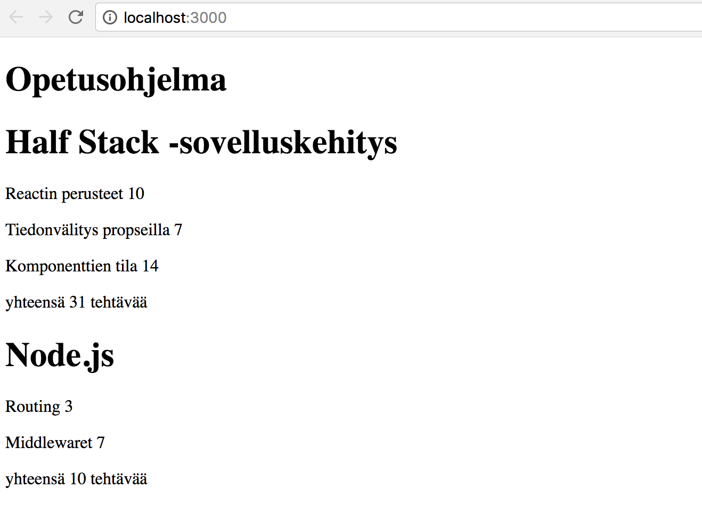

<div class="content">

Before we go into a new topic, let's go through some topics which proved difficult last year. 

### console.log

***What's the difference between experienced JavaScript programmer and a rookie? The experienced one uses 10-100 times more console.log***

Paradoxically, this seems to be true even though rookie programmers would need console.log (or any debugging method) more than experienced ones. 

When something does not work, don't just guess, but log or use some other way of debugging. 

**NB** when you use the command console.log for debugging, don't concatenate things 'the Java way' with a plus. Instead of writing 
```js
console.log('propsin arvo on' + props)
```

separate the things to be printed with a dash:

```js
console.log('propsin arvo on', props)
```

If you add an object to a string, the result is a pretty useless read. 

```js
propsin arvo on [Object object]
```

But if you use a dash you'll get the things printed to the developer-console as an object, contents of which can be read. 
If necessary, read more about debugging React-applications from [here](/osa1/monimutkaisempi_tila_reactin_debuggaus#react-sovellusten-debuggaus)

### Event handlers revisited

Based on last year's course, event handling has proven to be difficult. 
It's worth reading the revision chapter at the end of the previous part [event handlers revisited](/osa1/monimutkaisempi_tila_reactin_debuggaus#tapahtumankasittely-revisited) if it feels like your own knowledge on the topic needs some brusing up. 

Passing event handlers to the child components of the <i>App</i> component has raised some questions. Small revision on the topic [here](/osa1/monimutkaisempi_tila_reactin_debuggaus#tapahtumankasittelijan-vieminen-alikomponenttiin).


### Protip: Visual Studio Code snippets

With visual studio code it's easy to create 'snippets', shortcuts to generating the most used bits of code like 'sout' on Netbeans. 
Instructions for creating snippets [here](https://code.visualstudio.com/docs/editor/userdefinedsnippets#_creating-your-own-snippets).

Useful, ready made snippets can also be found as VS Code plugins for example  [here](https://marketplace.visualstudio.com/items?itemName=xabikos.ReactSnippets).

The most important snippet is a shortcut to adding the <em>console.log()</em> command, for example <em>clog</em>. This can be created like so: 
```js
{
  "console.log": {
    "prefix": "clog",
    "body": [
      "console.log('$1')",
    ],
    "description": "Log output to console"
  }
}
```

### JavaScript Arrays

From here on out, we will be using the functional programming methods of JavaScript [array](https://developer.mozilla.org/en-US/docs/Web/JavaScript/Reference/Global_Objects/Array), such as  _find_, _filter_  and _map_  all the time. They operate on the same general princible as streams in Java 8, which have been used last few years in ohjelmoinnin perusteet and ohjelmoinnin jatkokurssi at the department of Computer Science, and in the programming MOOC. 

If functional programming with arrays feels foreign, it is worth it to watch at least the three first parts from YouTube video series <i>Functional Programming in JavaScript</i>:

- [Higher-order functions](https://www.youtube.com/watch?v=BMUiFMZr7vk&list=PL0zVEGEvSaeEd9hlmCXrk5yUyqUag-n84)
- [Map](https://www.youtube.com/watch?v=bCqtb-Z5YGQ&list=PL0zVEGEvSaeEd9hlmCXrk5yUyqUag-n84&index=2)
- [Reduce basics](https://www.youtube.com/watch?v=Wl98eZpkp-c&t=31s)

### Rendering collections

We will now do the 'frontend', or the browser side application logic, in React for a similar application to the example application from [part 0](/osa0)

Let's start with the following:

```js
import React from 'react'
import ReactDOM from 'react-dom'

const notes = [
  {
    id: 1,
    content: 'HTML on helppoa',
    date: '2019-01-10T17:30:31.098Z',
    important: true
  },
  {
    id: 2,
    content: 'Selain pystyy suorittamaan vain javascriptiä',
    date: '2019-01-10T18:39:34.091Z',
    important: false
  },
  {
    id: 3,
    content: 'HTTP-protokollan tärkeimmät metodit ovat GET ja POST',
    date: '2019-01-10T19:20:14.298Z',
    important: true
  }
]

const App = (props) => {
  const { notes } = props

  return (
    <div>
      <h1>Muistiinpanot</h1>
      <ul>
        <li>{notes[0].content}</li>
        <li>{notes[1].content}</li>
        <li>{notes[2].content}</li>
      </ul>
    </div>
  )
}

ReactDOM.render(
  <App notes={notes} />,
  document.getElementById('root')
)
```

Every note contains its textual content and a timestamp as well as a _boolean_ value for marking wether the note has been categorized as important or not, and a unique <i>id</i>.

The code is based on there being exactly three notes in the array. 
Single note is rendered by accessing the objects in the array by referring to a hard coded index number:

```js
<li>{note[1].content}</li>
```

This is of course not practical. The solution can be generalized by generating React-elements from the array objects using the [map](https://developer.mozilla.org/en-US/docs/Web/JavaScript/Reference/Global_Objects/Array/map) function.

```js
notes.map(note => <li>{note.content}</li>)
```

The result is an array of <i>li</i> elements.

```js
[
  '<li>HTML on helppoa</li>',
  '<li>Selain pystyy suorittamaan vain javascriptiä</li>',
  '<li>HTTP-protokollan tärkeimmät metodit ovat GET ja POST</li>',
]
```

Which can then be put inside <i>ul</i> tags:

```js
const App = (props) => {
  const { notes } = props

  return (
    <div>
      <h1>Muistiinpanot</h1>
// highlight-start
      <ul>
        {notes.map(note => <li>{note.content}</li>)}
      </ul>
// highlight-end      
    </div>
  )
}
```

Because the code generating the <i>li</i> tags is JavaScript, in a JSX template it must be put inside brackets like all other JavaScript code. 

Often in similar situations the dynamically generated content is separated into its own method, which the JSX template calls: 

```js
const App = (props) => {
  const { notes } = props

// highlight-start
  const rows = () =>
    notes.map(note => <li>{note.content}</li>)
// highlight-end

  return (
    <div>
      <h1>Muistiinpanot</h1>
      <ul>
        {rows()} // highlight-line
      </ul>
    </div>
  )
}
```

### Key-attribute

Even thought the application seems to be working, there is a nasty warning on the console: 


As the [page](https://reactjs.org/docs/lists-and-keys.html#keys) linked to in the error message tells, items in an array, so the elements generated by the _map_ method, must have an unique key value:  an attribute called <i>key</i>.

Lets add the keys:

```js
const App = (props) => {
  const { notes } = props

// highlight-start
  const rows = () =>
    notes.map(note => <li key={note.id}>{note.content}</li>)
// highlight-end

  return (
    <div>
      <h1>Muistiinpanot</h1>
      <ul>
        {rows()}
      </ul>
    </div>
  )
}
```

And the error message dissappears. 

React uses the key attributes of objects in an array to determine how to update the view generated by a component when the component is rerendered. More about this [here](https://reactjs.org/docs/reconciliation.html#recursing-on-children).

### Map

Understanding how the array method [map](https://developer.mozilla.org/en-US/docs/Web/JavaScript/Reference/Global_Objects/Array/map) works is crucial for the rest of the course. 

The application contains an array called _notes_

```js
const notes = [
  {
    id: 1,
    content: 'HTML on helppoa',
    date: '2017-12-10T17:30:31.098Z',
    important: true,
  },
  {
    id: 2,
    content: 'Selain pystyy suorittamaan vain javascriptiä',
    date: '2017-12-10T18:39:34.091Z',
    important: false,
  },
  {
    id: 3,
    content: 'HTTP-protokollan tärkeimmät metodit ovat GET ja POST',
    date: '2017-12-10T19:20:14.298Z',
    important: true,
  },
]
```

Lets pause for a moment and examine how _map_ works.

If the following code is added e.g to the end of the file 

```js
const result = notes.map(note => note.id)
console.log(result)
```

<i>[1, 2, 3]</i>  will be printed to the console.
 _Map_ always creates a new array, elements of which have been created from the elements of the original array by <i>mapping</i> using the function given as a parameter to the map method. 

The function is

```js
note => note.id
```

Which is an arrow function written in a compact form. The full form would be: 

```js
(note) => {
  return note.id
}
```

The function gets a note object as a parameter, and <i>returns</i> the value of it's  <i>id</i> field.

Changing the command to:

```js
const result = notes.map(note => note.content)
```
results into an array containing the contents of the notes.

This is already pretty close to the React code we used:


```js
notes.map(note => <li key={note.id}>{note.content}</li>)
```

which generates a <i>li</i> tag containing the contents of the note from each note object. 

Because the function parameter of the _map_ method

```js
note => <li key={note.id}>{note.content}</li>
```

is used to create view elements, the value of the variable must be rendered inside of curly brackets. 
Try what happens if the brackets are removed. 

The use of curly brackets will cause some headache in the beginning, but you will get used to them soon. The visual feedback from React is immediate. 

Let's examine one source of bugs. Add the following to your code

```js
const result = notes.map(note => {note.content} )
console.log(result)
```

It will print
```js
[undefined, undefined, undefined]
```

Whats the matter? The code is exactly the same as the one that worked earlier. Except not quite. The _map_  method now has the following function as a parameter

```js
note => {
  note.content
}
```

Because the function now forms <i>a code block</i>, it's return value is undefined. Arrow functions return the value of their only statement only if the function is defined in the compact form. Without the code block: 

```js
note => note.content
```

Note that 'oneliner' arrow functions do not need to be, nor should always be, written on one line. 

Better formatting for the helper function returning the rows of notes in our application could be the following version spread over multiple lines: 


```js
const rows = () => notes.map(note =>
  <li key={note.id}>
    {note.content}
  </li>
)
```

This still is an arrow function with only one statement, the statement just happens to be a bit more complicated. 

### Antipattern: arrow indexes as keys

We could have made the error message on our console dissappear by using the array indexes as keys. The indexes can be retrieved by giving a second parameter to the map-method: 

```js
notes.map((note, i) => ...)
```

When called like this, _i_ gets the value of the index of the position in the array where the <i>Note</i> resides.

So one way to define the row generation without getting errors is

```js
const rows = () => notes.map((note, i) => 
  <li key={i}>
    {note.content}
  </li>
)
```

This is however **not recommended** and can cause bad problems even if it seems to be working just fine. 
Read more [from here](https://medium.com/@robinpokorny/index-as-a-key-is-an-anti-pattern-e0349aece318).

### Refactoring modules

Let's tidy the code up a bit. We are only interested in the field _notes_ of the props, so let's receive that straight using [destructuring](https://developer.mozilla.org/en-US/docs/Web/JavaScript/Reference/Operators/Destructuring_assignment): 

```js
const App = ({ notes }) => { // highlight-line
  // ...

  return (
    <div>
      <h1>Muistiinpanot</h1>
      <ul>
        {rows()}
      </ul>
    </div>
  )
}
```

If you have forgotten what destructuring means and how it works, revise [this](/osa1/komponentin_tila_ja_tapahtumankasittely#destrukturointi).

We'll separate displaying a single note into it's own component <i>Note</i>: 

```js
// highlight-start
const Note = ({ note }) => {
  return (
    <li>{note.content}</li>
  )
}
// highlight-end

const App = ({ notes }) => {
  const rows = () => notes.map(note =>
  // highlight-start
    <Note 
      key={note.id}
      note={note}
    />
    // highlight-end
  )

  return (
    <div>
      <h1>Muistiinpanot</h1>
      <ul>
        {rows()}
      </ul>
    </div>
  )
}
```

Note, that the <i>key</i> attribute must now be defined for the <i>Note</i> components, and not for the <i>li</i> tags like before. 

A whole React application can be written to a single file, but that is of course not very practical. Common practice is to declare each component in their own file as a <i>ES6-module</i>.

We have been using modules the whole time. The first few lines of a file

```js
import React from 'react'
import ReactDOM from 'react-dom'
```

[Import](https://developer.mozilla.org/en-US/docs/Web/JavaScript/Reference/Statements/import) two modules, enabling them to be used in the code. The <i>react</i> module is placed into a variable called _React_ and <i>react-dom</i> to variable _ReactDOM_.

Let's move our <i>Note</i> component into it's own module. 

In smaller applications components are usually placed in a directory called <i>components</i> , which is placed within the <i>src</i> directory. The convention is to name the file after the component. 

Now we'll create a directory called <i>components</i> to our application and place a file <i>Note.js</i> there. 
The contents of the Note.js file are as follows: 

```js
import React from 'react'

const Note = ({ note }) => {
  return (
    <li>{note.content}</li>
  )
}

export default Note
```

Because this is a React-component, we must import React. 

The last line of the module [exports](https://developer.mozilla.org/en-US/docs/Web/JavaScript/Reference/Statements/export) the declared module, the variable <i>Note</i>.

Now the file using the component, <i>index.js</i>, can [import](https://developer.mozilla.org/en-US/docs/Web/JavaScript/Reference/Statements/import) the module: 

```js
import React from 'react'
import ReactDOM from 'react-dom'
import Note from './components/Note' // highlight-line

const App = ({notes}) => {
  // ...
}
```

The component exported by the module is now available for use in the variable <i>Note</i> just as it was earlier. 

Note, that when importing our own components their location must be given <i>in relation to the importing file</i>:

```js
'./components/Note'
```

The period in the beginning refers to the current directory, so the module's location is a file called <i>Note.js</i> in a subdirectory of the current directory called <i>components</i>. The filename extension can be left out.

<i>App</i> is a component as well, so let's declare it in it's own module as well. Because it is the root component of the application, we'll place it in the <i>src</i> directory. The contents of the file are as follows: 

```js
import React from 'react'
import Note from './components/Note'

const App = ({ notes }) => {
  const rows = () => notes.map(note =>
    <Note
      key={note.id}
      note={note}
    />
  )

  return (
    <div>
      <h1>Muistiinpanot</h1>
      <ul>
        {rows()}
      </ul>
    </div>
  )
}

export default App // highlight-line
```

What's left in the <i>index.js</i> file is: 

```js
import React from 'react'
import ReactDOM from 'react-dom'
import App from './App'  // highlight-line

const notes = [
  // ...
]

ReactDOM.render(
  <App notes={notes} />,
  document.getElementById('root')
)
```

Modules have plenty of other uses than enabling component declarations to be separated into their own files. We will get back into them later in this course. 

The current code of the application can be found from [github](https://github.com/fullstack-hy2019/part2-notes/tree/part2-1).

Note, that the master branch of the repository contains the code for a later version of the application. The current code is in the branch [part2-1](https://github.com/fullstack-hy2019/part2-notes/tree/part2-1):


If you clone the project to yourself, run the command _npm install_ before starting the application with _npm start_.

### When the application breaks

When you start your programming career (and even after 30 years of coding like yours truly) quite often the application just breaks down completely. Especially this happens with dynamically typed languages like JavaScript, where the compiler does not check the data type of e.g function variables or return values. 

React explosion can for example look like this:


In these situations your best way out is the <em>console.log</em>.
The piece of code causing the explosion is this: 

```js
const Course = ({ course }) => (
  <div>
   <Header course={course} />
  </div>
)

const App = () => {
  const course = {
    // ...
  }

  return (
    <div>
      <Course course={course} />
    </div>
  )
}
```

We'll hone in on the reason of the breakdown by adding <em>console.log</em> commands to the code. Because the first thing to be rendered is the <i>App</i> component, it's worth putting the first console.log there: 

```js
const App = () => {
  const course = {
    // ...
  }

  console.log('App toimii...') // highlight-line

  return (
    // ..
  )
}
```

To see the printing on the console we must scroll up over the long red wall of errors.


When one thing is found to be working, it's time to log deeper. If the component has been declared as a single statement, or a function without a return, it makes printing to the console harder. 

```js
const Course = ({ course }) => (
  <div>
   <Header course={course} />
  </div>
)
```

The component should be changed to the longer form, so we can add the printing: 

```js
const Course = ({ course }) => { 
  console.log(course) // highlight-line
  return (
    <div>
    <Header course={course} />
    </div>
  )
}
```

Very often the root of the problem is, that the props are expected to be different type or called different than they actually are, and desctructuring fails. The problem often begins to solve itself when desctructuring is removed and we see what the <em>props</em> actually contains. 

```js
const Course = (props) => { // highlight-line
  console.log(props)  // highlight-line
  const { course } = props
  return (
    <div>
    <Header course={course} />
    </div>
  )
}
```

If the problem has still not been solved, doesn't help but continue tracking down the issue by writing more console.log. 

I added this chapter to the material after the model answer of the next question exploded completely (due to props of the wrong type), and I had to debug by using console.log.

</div>

<div class="tasks">

<h3>Excercises</h3>

The exercises are submitted via GitHub, and by marking the exercises as done in the [submission system](https://studies.cs.helsinki.fi/fullstackopen2019/).

You can submit all of the exercises into the same repository, or use multiple different repositories. If you submit exercises from different parts into the same repository, name your directories well.

The exercises are submitted **One part at a time**. When you have submitted the exercises for a part, you can no longer submit any missed exercises for that part.

Note, that this part has more exercises than the ones below, so <i>do not submit</i> before you have done all exercises from this part you want to submit. 

**WARNING** create-react-app makes the project automatically into a git-repository, if the project is not created inside of an already existing repository. You propably **do not** want the project to become a repository, so run the command  _rm -rf .git_ from it's root. 

<h4>2.1: course contents step6</h4>

Let's finish the code for rendering course contents from exercises 1.1 - 1.5. You can start with the code from the model answers. 

**Note that if you copy a project from one place to another, you might have to destroy the <i>node\_modules</i> directory and install the debendencies again with the command _npm install_ before you can start the application.**
It might not be good to copy a project or to put the  <i>node\_modules</i> directory into the version control per se. 

Let's change the <i>App</i> component like so: 

```js
const App = () => {
  const course = {
    name: 'Half Stack -sovelluskehitys',
    parts: [
      {
        name: 'Reactin perusteet',
        exercises: 10,
        id: 1
      },
      {
        name: 'Tiedonvälitys propseilla',
        exercises: 7,
        id: 2
      },
      {
        name: 'Komponenttien tila',
        exercises: 14,
        id: 3
      }
    ]
  }

  return (
    <div>
      <Course course={course} />
    </div>
  )
}
```

Declare a component responsible for formatting a single course called <i>Course</i>. 

The component structure of the application can be for example the following: 

<pre>
App
  Course
    Header
    Content
      Part
      Part
      ...
</pre>

So the component <i>Course</i> contains the components declared in the previous part, which are responsible for rendering the course name and it's parts. 

The rendered page can for example look as follows: 


You don't need the sum of exercises yet. 

The application must work <i>regardless of the number of parts a course has</i>, so make sure the application works if you add or remove parts of a course. 

Ensure that the console shows no errors!

<h4>2.2: Course contents step7</h4>

Show also the sum of the exercises of the course. 


<h4>2.3*: Course contents step8</h4>

If you haven't done so already, calculate the sum of exercises with the array method [reduce](https://developer.mozilla.org/en-US/docs/Web/JavaScript/Reference/Global_Objects/Array/Reduce).

**Pro tip:** when your code looks as follows

```js
const total = 
  parts.reduce( (s, p) => someMagicHere )
```

and does not work, it's worth to use console.log, which requires the arrow function to be written in it's longer form

```js
const total = parts.reduce( (s, p) => {
  console.log('what is happening', s, p)
  return someMagicHere 
})
```

**Pro tip2:** There is a plugin for VS code, [this one](https://marketplace.visualstudio.com/items?itemName=cmstead.jsrefactor), which  changes short form arrow functions into their longer form automatically, and vice versa. 


<h4>2.4: Course contents step9</h4>

Let's extend our application to allow for <i>arbituary number</i> of courses:

```js
const App = () => {
  const courses = [
    {
      name: 'Half Stack -sovelluskehitys',
      id: 1,
      parts: [
        {
          name: 'Reactin perusteet',
          exercises: 10,
          id: 1
        },
        {
          name: 'Tiedonvälitys propseilla',
          exercises: 7,
          id: 2
        },
        {
          name: 'Komponenttien tila',
          exercises: 14,
          id: 3
        }
      ]
    },
    {
      name: 'Node.js',
      id: 2,
      parts: [
        {
          name: 'Routing',
          exercises: 3,
          id: 1
        },
        {
          name: 'Middlewaret',
          exercises: 7,
          id: 2
        }
      ]
    }
  ]

  return (
    <div>
      // ...
    </div>
  )
}
```

The application can for example look like this: 



<h4>2.5: separate module</h4>

Declare the <i>Course</i> component as a separate module, which is imported by the <i>App</i> component. You can include all subcomponents of the course into the same module. 

</div>