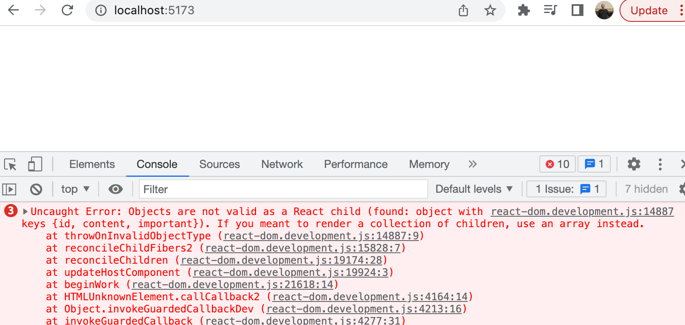

<div class="content">

Antes de comenzar una nueva parte, recapitulemos algunos de los temas que resultaron difíciles el año pasado.

### console.log

***¿Cuál es la diferencia entre un programador de JavaScript experimentado y un novato? El experimentado usa console.log de 10 a 100 veces más.***

Paradójicamente, esto parece ser cierto aunque un programador novato necesitaría _console.log_ (o cualquier método de depuración) más que uno experimentado.

Cuando algo no funciona, no adivines qué está mal. En su lugar, usa la consola o utiliza alguna otra forma de depuración.

**NB** Como se explicó en la parte 1, cuando uses el comando _console.log_ para depurar, no concatenes cosas 'al estilo Java' con un signo de sumar. En lugar de escribir:

```js
console.log('props value is' + props)
```

Separa las cosas que se van a imprimir con una coma:

```js
console.log('props value is', props)
```

Si concatenas un objeto con una cadena y lo registras en la consola (como en nuestro primer ejemplo), el resultado será bastante inútil:

```js
props value is [Object object]
```

Por el contrario, cuando pasas objetos como argumentos distintos separados por comas a _console.log_, como en nuestro segundo ejemplo anterior, el contenido del objeto se imprime en la consola del desarrollador como cadenas que nos aportan información util.
Si es necesario, lee más sobre la depuración de aplicaciones React [aquí](/es/part1/un_estado_mas_complejo_depurando_aplicaciones_react#depuracion-de-aplicaciones-react).

### Protip: fragmentos de código de Visual Studio

Con Visual Studio Code es fácil crear 'snippets', es decir, accesos directos para generar rápidamente porciones de código que se reutilizan habitualmente, muy parecido a cómo funciona 'sout' en Netbeans.

Las instrucciones para crear snippets se pueden encontrar [aquí](https://code.visualstudio.com/docs/editor/userdefinedsnippets#_creating-your-own-snippets).

También se pueden encontrar snippets útiles y listos para usar como complementos de VS Code, por ejemplo, [aquí](https://marketplace.visualstudio.com/items?itemName=xabikos.ReactSnippets).

El snippet más importante es el del comando <em>console.log()</em>, por ejemplo <em>clog</em>. Esto se puede crear así:

```js
{
  "console.log": {
    "prefix": "clog",
    "body": [
      "console.log('$1')",
    ],
    "description": "Log output to console"
  }
}
```

Depurar tu código usando _console.log()_ es tan común que Visual Studio Code tiene ese fragmento integrado. Para usarlo, escribe _log_ y presiona tabulador para autocompletar. Extensiones de snippets de _console.log()_ más completos pueden encontrarse en el [marketplace](https://marketplace.visualstudio.com/search?term=console.log&target=VSCode&category=All%20categories&sortBy=Relevance).

### Matrices JavaScript

De aquí en adelante, usaremos los métodos de programación funcional de JavaScript [array](https://developer.mozilla.org/es/docs/Web/JavaScript/Reference/Global_Objects/Array) -como _find_ , _filter_ y _map_ - todo el tiempo.

Si la programación funcional con matrices te parece ajena, vale la pena ver al menos las tres primeras partes de la serie de videos de YouTube [Programación funcional en JavaScript](https://www.youtube.com/playlist?list=PL0zVEGEvSaeEd9hlmCXrk5yUyqUag-n84):

- [Higher-order functions](https://www.youtube.com/watch?v=BMUiFMZr7vk&list=PL0zVEGEvSaeEd9hlmCXrk5yUyqUag-n84)
- [Map](https://www.youtube.com/watch?v=bCqtb-Z5YGQ&list=PL0zVEGEvSaeEd9hlmCXrk5yUyqUag-n84&index=2)
- [Reduce basics](https://www.youtube.com/watch?v=Wl98eZpkp-c&t=31s)

### Controladores de eventos revisados

Según el curso del año pasado, el manejo de eventos ha demostrado ser difícil.

Vale la pena leer el capítulo de revisión al final de la parte anterior [revisión de los controladores de eventos](/es/part1/un_estado_mas_complejo_depurando_aplicaciones_react#manejo-de-eventos-revisado), si cree que su propio conocimiento sobre el tema necesita algo de mejora.

Pasar controladores de eventos a los componentes secundarios del componente <i>App</i> ha planteado algunas preguntas. Se puede encontrar una pequeña revisión sobre el tema [aquí](/es/part1/un_estado_mas_complejo_depurando_aplicaciones_react#pasando-controladores-de-eventos-a-componentes-hijos).

### Renderizando colecciones

Ahora haremos el 'frontend', o la lógica de la aplicación del lado del navegador, en React para una aplicación que es similar a la aplicación de ejemplo de la [parte 0](/es/part0)

Comencemos con lo siguiente (en el archivo _App.jsx_):

```js
const App = (props) => {
  const { notes } = props

  return (
    <div>
      <h1>Notes</h1>
      <ul>
        <li>{notes[0].content}</li>
        <li>{notes[1].content}</li>
        <li>{notes[2].content}</li>
      </ul>
    </div>
  )
}

export default App
```

El archivo _main.jsx_ se ve de esta forma:

```js
import React from 'react'
import ReactDOM from 'react-dom/client'

import App from './App'

const notes = [
  {
    id: 1,
    content: 'HTML is easy',
    important: true
  },
  {
    id: 2,
    content: 'Browser can execute only JavaScript',
    important: false
  },
  {
    id: 3,
    content: 'GET and POST are the most important methods of HTTP protocol',
    important: true
  }
]

ReactDOM.createRoot(document.getElementById('root')).render(
  <App notes={notes} />
)
```

Cada nota contiene su contenido textual, y un valor _booleano_ para marcar si la nota ha sido categorizada como importante o no, y también un <i>id</i> único.

El ejemplo anterior funciona debido al hecho de que hay exactamente tres notas en la matriz.

Se renderiza una sola nota al acceder a los objetos de la matriz haciendo referencia a un número de índice codificado:

```js
<li>{notes[1].content}</li>
```

Esto, por supuesto, no es práctico. Podemos mejorar esto generando elementos React a partir de los objetos de la matriz usando la función [map](https://developer.mozilla.org/es/docs/Web/JavaScript/Reference/Global_Objects/Array/map).

```js
notes.map(note => <li>{note.content}</li>)
```

El resultado es una matriz de elementos <i>li</i>.

```js
[
  <li>HTML is easy</li>,
  <li>Browser can execute only JavaScript</li>,
  <li>GET and POST are the most important methods of HTTP protocol</li>,
]
```

Que luego se puede colocar dentro de las etiquetas <i>ul</i>:

```js
const App = (props) => {
  const { notes } = props

  return (
    <div>
      <h1>Notes</h1>
// highlight-start
      <ul>
        {notes.map(note => <li>{note.content}</li>)}
      </ul>
// highlight-end      
    </div>
  )
}
```

Debido a que el código que genera las etiquetas <i>li</i> es JavaScript, debe incluirse entre llaves en una plantilla JSX.

<!-- Parannetaan koodin luetteloa vielä jakamalla nuolifunktion määrittely useammalle riville: -->
También haremos que el código sea más legible separando la declaración de la función de flecha en varias líneas:

```js
const App = (props) => {
  const { notes } = props

  return (
    <div>
      <h1>Notes</h1>
      <ul>
        {notes.map(note => 
        // highlight-start
          <li>
            {note.content}
          </li>
        // highlight-end   
        )}
      </ul>
    </div>
  )
}
```

### Atributo key

Aunque la aplicación parece estar funcionando, hay una advertencia desagradable en la consola


Como la [página](https://es.react.dev/learn/rendering-lists#keeping-list-items-in-order-with-key) vinculada en el mensaje de error instruye, los elementos de la lista, es decir, los elementos generados por el método _map_, deben tener cada uno un valor de clave única: un atributo llamado <i>key</i>.

Agreguemos las keys (claves):

```js
const App = (props) => {
  const { notes } = props

  return (
    <div>
      <h1>Notes</h1>
      <ul>
        {notes.map(note => 
          <li key={note.id}> // highlight-line
            {note.content}
          </li>
        )}
      </ul>
    </div>
  )
}
```

Y el mensaje de error desaparece.

React utiliza los atributos key de los objetos en una matriz para determinar cómo actualizar la vista generada por un componente cuando el componente se vuelve a renderizar. Más sobre esto [aquí](https://es.react.dev/learn/preserving-and-resetting-state#option-2-resetting-state-with-a-key).

### Map

Comprender cómo funciona el método de matriz [map](https://developer.mozilla.org/es/docs/Web/JavaScript/Reference/Global_Objects/Array/map) es crucial para el resto del curso.

La aplicación contiene una matriz llamada _notes_:

```js
const notes = [
  {
    id: 1,
    content: 'HTML is easy',
    important: true
  },
  {
    id: 2,
    content: 'Browser can execute only JavaScript',
    important: false
  },
  {
    id: 3,
    content: 'GET and POST are the most important methods of HTTP protocol',
    important: true
  }
]
```

Hagamos una pausa por un momento y examinemos cómo funciona _map_.

Si se agrega el siguiente código, digamos, al final del archivo:

```js
const result = notes.map(note => note.id)
console.log(result)
```

<i>[1, 2, 3]</i> se imprimirá en la consola.
_map_ siempre crea una nueva matriz, cuyos elementos se han creado a partir de los elementos de la matriz original mediante <i>mapeo</i>: utilizando la función dada como parámetro al método _map_.

La función es

```js
note => note.id
```

Que es una función de flecha escrita en forma compacta. La forma completa sería:

```js
note => {
  return note.id
}
```

La función obtiene un objeto de nota como parámetro, y <i>devuelve</i> el valor de su campo <i>id</i>.

Cambiar el comando a:

```js
const result = notes.map(note => note.content)
```

resulta en una matriz que contiene el contenido de las notas.

Esto ya está bastante cerca del código de React que usamos:

```js
notes.map(note =>
  <li key={note.id}>
    {note.content}
  </li>
)
```

Que genera una etiqueta <i>li</i> que contiene el contenido de la nota de cada objeto de nota.

Porque el parámetro de función pasado al método _map_ -

```js
note => <li key={note.id}>{note.content}</li>
```

&nbsp; - se utiliza para crear elementos de vista, el valor de la variable debe representarse dentro de llaves. Intenta ver qué sucede si se quitan las llaves.

El uso de llaves te causará dolor de cabeza al principio, pero pronto te acostumbrarás. La respuesta visual de React es inmediata.

### Anti-patrón: índices de matriz como claves

Podríamos haber hecho desaparecer el mensaje de error en nuestra consola usando los índices de matriz como claves. Los índices se pueden recuperar pasando un segundo parámetro a la función de devolución de llamada del método map:

```js
notes.map((note, i) => ...)
```

Cuando se llama así, a _i_ se le asigna el valor del índice de la posición en la matriz donde reside la nota.

Como tal, una forma de definir la generación de filas sin obtener errores es:

```js
<ul>
  {notes.map((note, i) => 
    <li key={i}>
      {note.content}
    </li>
  )}
</ul>
```

Sin embargo, **no se recomienda** y puede causar problemas no deseados incluso si parece estar funcionando bien.

Lee más sobre esto en [este articulo](https://robinpokorny.medium.com/index-as-a-key-is-an-anti-pattern-e0349aece318).

### Refactorizando módulos

Ordenemos un poco el código. Solo estamos interesados ​​en el campo _notes_ de los props, así que recuperemos eso directamente usando [desestructuración](https://developer.mozilla.org/es/docs/Web/JavaScript/Reference/Operators/Destructuring_assignment):

```js
const App = ({ notes }) => { //highlight-line
  return (
    <div>
      <h1>Notes</h1>
      <ul>
        {notes.map(note => 
          <li key={note.id}>
            {note.content}
          </li>
        )}
      </ul>
    </div>
  )
}
```

Si has olvidado lo que significa la desestructuración y cómo funciona, revisa la [sección de desestructuración](/es/part1/estado_del_componente_controladores_de_eventos#desestructuracion).

Separamos la visualización de una sola nota en su propio componente <i>Note</i>:

```js
// highlight-start
const Note = ({ note }) => {
  return (
    <li>{note.content}</li>
  )
}
// highlight-end

const App = ({ notes }) => {
  return (
    <div>
      <h1>Notes</h1>
      <ul>
        // highlight-start
        {notes.map(note => 
          <Note key={note.id} note={note} />
        )}
         // highlight-end
      </ul>
    </div>
  )
}
```

Ten en cuenta que el atributo <i>key</i> ahora debe definirse para los componentes <i>Note</i>, y no para las etiquetas <i>li</i> como antes.

Se puede escribir una aplicación React completa en un solo archivo. Aunque eso, por supuesto, no es muy práctico. La práctica común es declarar cada componente en su propio archivo como un <i>módulo ES6</i>.

Hemos estado usando módulos todo el tiempo. Las primeras líneas del archivo <i>main.jsx</i>:

```js
import ReactDOM from "react-dom/client"

import App from "./App"
```

[importan](https://developer.mozilla.org/es/docs/Web/JavaScript/Reference/Statements/import) dos módulos, lo que les permite ser utilizados en ese archivo. El módulo <i>react-dom/client</i> se coloca en una variable llamada _React-DOM_, y el módulo que define el componente principal de la aplicación se coloca en la variable _App_.

Movamos nuestro componente <i>Note</i> a su propio módulo.

En aplicaciones más pequeñas, los componentes generalmente se colocan en un directorio llamado <i>components</i>, que a su vez se ubica dentro del directorio <i>src</i>. La convención es nombrar el archivo después del componente.

Ahora crearemos un directorio llamado <i>components</i> para nuestra aplicación y colocaremos un archivo llamado <i>Note.jsx</i> dentro. El contenido del archivo es el siguiente:

```js
const Note = ({ note }) => {
  return (
    <li>{note.content}</li>
  )
}

export default Note
```

La última línea del módulo [exporta](https://developer.mozilla.org/es/docs/Web/JavaScript/Reference/Statements/export) el módulo declarado, la variable <i>Note</i>.

Ahora el archivo que está usando el componente - <i>App.jsx</i> - puede [importar](https://developer.mozilla.org/es/docs/Web/JavaScript/Reference/Statements/import) el módulo:

```js
import Note from './components/Note' // highlight-line

const App = ({ notes }) => {
  // ...
}
```

El componente exportado por el módulo ahora está disponible para su uso en la variable <i>Note</i>, al igual que antes.

Ten en cuenta que al importar nuestros propios componentes, se debe dar su ubicación <i>en relación con el archivo de importación</i>:

```js
'./components/Note'
```

El punto - <i>.</i> - al principio se refiere al directorio actual, por lo que la ubicación del módulo es un archivo llamado <i>Note.jsx</i> en el subdirectorio <i>components</i> del directorio actual. La extensión del nombre de archivo _.jsx_ se puede omitir.

Los módulos tienen muchos otros usos ademas de permitir separar las declaraciones de componentes en sus archivos propios. Volveremos a este tema más adelante en el curso.

El código actual de la aplicación puede encontrarse en [GitHub](https://github.com/fullstack-hy2020/part2-notes-frontend/tree/part2-1).

Ten en cuenta que la rama _main_ del repositorio contiene el código de una version posterior de la aplicación. El código actual está en la rama [part2-1](https://github.com/fullstack-hy2020/part2-notes-frontend/tree/part2-1):


Si clonas el proyecto, ejecuta el comando _npm install_ antes de iniciar la aplicación con _npm run dev_.

### Cuando la aplicación se rompe

Al principio de tu carrera como programador (e incluso después de 30 años codeando como es mi caso), lo que sucede a menudo es que la aplicación simplemente se rompe por completo. Esto es aún más común en el caso de los lenguajes tipados dinámicamente, como JavaScript, donde el compilador no verifica el tipo de datos de, por ejemplo, variables de función o valores de retorno.

Una "explosión de React" puede, por ejemplo, verse así:



En estas situaciones, la mejor salida es el método <em>console.log</em>.

El fragmento de código que causa la explosión es este:

```js
const Course = ({ course }) => (
  <div>
    <Header course={course} />
  </div>
)

const App = () => {
  const course = {
    // ...
  }

  return (
    <div>
      <Course course={course} />
    </div>
  )
}
```

Investigaremos el motivo de la rotura agregando comandos <em>console.log</em> al código. Como lo primero que se renderiza es el componente <i>App</i>, vale la pena poner el primer <em>console.log</em> allí:

```js
const App = () => {
  const course = {
    // ...
  }

  console.log('App works...') // highlight-line

  return (
    // ..
  )
}
```

Para ver la impresión en la consola, debemos desplazarnos hacia arriba sobre la larga pared roja de errores.


Cuando se descubre que algo funciona, es hora de profundizar más. Si el componente se ha declarado como una sola declaración o una función sin retorno, hace que la impresión en la consola sea más difícil.

```js
const Course = ({ course }) => (
  <div>
    <Header course={course} />
  </div>
)
```

El componente debe cambiarse a su forma más larga para que agreguemos la impresión:

```js
const Course = ({ course }) => {
  console.log(course) // highlight-line
  return (
    <div>
      <Header course={course} />
    </div>
  )
}
```

Muy a menudo, la raíz del problema es que se espera que los props sean de un tipo diferente, o que se llamen con un nombre diferente al que realmente tienen, y la desestructuración falla como resultado. El problema a menudo comienza a resolverse por sí mismo cuando se elimina la desestructuración y vemos lo que realmente contienen los <em>props</em>.

```js
const Course = (props) => { // highlight-line
  console.log(props)  // highlight-line
  const { course } = props
  return (
    <div>
      <Header course={course} />
    </div>
  )
}
```

Si el problema aún no se ha resuelto, realmente no hay mucho que hacer aparte de continuar la búsqueda de errores esparciendo más declaraciones _console.log_ alrededor de tu código.

Agregué este capítulo al material después de que la respuesta del modelo para la siguiente pregunta explotara por completo (debido a que los props eran del tipo incorrecto), y tuve que depurarlo usando <em>console.log</em>.

### Juramento del desarrollador web

Antes de los ejercicios, permíteme recordarte lo que prometiste al final de la parte anterior.

La programación es difícil, por eso utilizaré todos los medios posibles para facilitarla:

- Mantendré abierta la consola de desarrollo de mi navegador todo el tiempo.
- Progresaré con pequeños pasos.
- Escribiré muchas declaraciones de _console.log_ para asegurarme de entender cómo se comporta el código y para ayudar a identificar problemas.
- Si mi código no funciona, no escribiré más código. En cambio, comenzaré a eliminar el código hasta que funcione o simplemente volveré a un estado en el que todo aún funcionaba.
- Cuando pida ayuda en el canal de Discord o Telegram del curso, o en cualquier otro lugar, formularé mis preguntas adecuadamente; consulta [aquí](/es/part0/informacion_general#como-obtener-ayuda-en-discord-telegram) cómo pedir ayuda.

</div>

<div class="tasks">

<h3>Ejercicios 2.1.-2.5.</h3>

Los ejercicios se envían a través de GitHub y marcando los ejercicios como completados en el [sistema de envío](https://studies.cs.helsinki.fi/stats/courses/fullstackopen).

Puedes enviar todos los ejercicios en el mismo repositorio o usar varios repositorios diferentes. Si envías ejercicios de diferentes partes al mismo repositorio, nombra bien tus directorios.

Los ejercicios se envían **una parte a la vez**. Cuando hayas enviado los ejercicios de una parte, ya no podrás enviar ejercicios faltantes para esa parte.

Ten en cuenta que esta parte tiene más ejercicios que las anteriores, así que <i>no envíes</i> hasta que hayas hecho todos los ejercicios de esta parte que deseas enviar.

<h4>2.1: Información del curso paso 6</h4>

Terminemos el código para renderizar el contenido del curso de los ejercicios 1.1 - 1.5. Puedes comenzar con el código de las respuestas modelo. Las respuestas modelo para la parte 1 se pueden encontrar yendo al [sistema de envío](https://studies.cs.helsinki.fi/stats/courses/fullstackopen), haciendo clic en <i>my submissions</i> en la parte superior, y en la fila correspondiente a la parte 1, bajo la columna <i>solutions</i>, haciendo clic en <i>show</i>. Para ver la solución al ejercicio de <i>información del curso</i>, haz clic en _index.js_ bajo <i>kurssitiedot</i> ("kurssitiedot" significa "información del curso").

**Ten en cuenta que si copias un proyecto de un lugar a otro, es posible que debas eliminar el directorio <i>node\_modules</i> e instalar las dependencias nuevamente con el comando _npm install_ antes de poder iniciar la aplicación.**

En general, no se recomienda copiar todo el contenido de un proyecto y/o agregar el directorio <i>node\_modules</i> al sistema de control de versiones.

Cambiemos el componente <i>App</i> de la siguiente manera:

```js
const App = () => {
  const course = {
    id: 1,
    name: 'Half Stack application development',
    parts: [
      {
        name: 'Fundamentals of React',
        exercises: 10,
        id: 1
      },
      {
        name: 'Using props to pass data',
        exercises: 7,
        id: 2
      },
      {
        name: 'State of a component',
        exercises: 14,
        id: 3
      }
    ]
  }

  return <Course course={course} />
}

export default App
```

Define un componente responsable de formatear un solo curso llamado <i>Course</i>.

La estructura de componentes de la aplicación puede ser, por ejemplo, la siguiente:

<pre>
App
  Course
    Header
    Content
      Part
      Part
      ...
</pre>

Por lo tanto, el componente <i>Course</i> contiene los componentes definidos en la parte anterior, que son responsables de renderizar el nombre del curso y sus partes.

La página renderizada puede verse, por ejemplo, de la siguiente manera:


Aún no necesitas la suma de los ejercicios.

La aplicación debe funcionar <i>independientemente del número de partes que tenga un curso</i>, así que asegúrate de que la aplicación funcione si agregas o quitas partes de un curso.

¡Asegúrate de que la consola no muestre errores!

<h4>2.2: Información del curso paso 7</h4>

Muestra también la suma de los ejercicios del curso.


<h4>2.3*: Información del curso paso 8</h4>

Si aún no lo has hecho, calcula la suma de los ejercicios con el método de array [reduce](https://developer.mozilla.org/es/docs/Web/JavaScript/Reference/Global_Objects/Array/Reduce).

**Consejo profesional:** cuando tu código se ve así:

```js
const total = 
  parts.reduce((s, p) => someMagicHere)
```

y no funciona, vale la pena usar <i>console.log</i>, que requiere que la función de flecha se escriba en su forma más larga:

```js
const total = parts.reduce((s, p) => {
  console.log('what is happening', s, p)
  return someMagicHere 
})
```

**¿No funciona? :** Utiliza tu motor de búsqueda para buscar cómo se utiliza _reduce_ en un **Array de Objetos**.

<h4>2.4: Información del curso paso 9</h4>

Ampliemos nuestra aplicación para permitir un <i>número arbitrario</i> de cursos:

```js
const App = () => {
  const courses = [
    {
      name: 'Half Stack application development',
      id: 1,
      parts: [
        {
          name: 'Fundamentals of React',
          exercises: 10,
          id: 1
        },
        {
          name: 'Using props to pass data',
          exercises: 7,
          id: 2
        },
        {
          name: 'State of a component',
          exercises: 14,
          id: 3
        },
        {
          name: 'Redux',
          exercises: 11,
          id: 4
        }
      ]
    }, 
    {
      name: 'Node.js',
      id: 2,
      parts: [
        {
          name: 'Routing',
          exercises: 3,
          id: 1
        },
        {
          name: 'Middlewares',
          exercises: 7,
          id: 2
        }
      ]
    }
  ]

  return (
    <div>
      // ...
    </div>
  )
}
```

La aplicación puede, por ejemplo, verse así:


<h4>2.5: Módulo separado paso 10</h4>

Declara el componente <i>Course</i> como un módulo separado, que se importa en el componente <i>App</i>. Puedes incluir todos los subcomponentes del curso en el mismo módulo.

</div>
