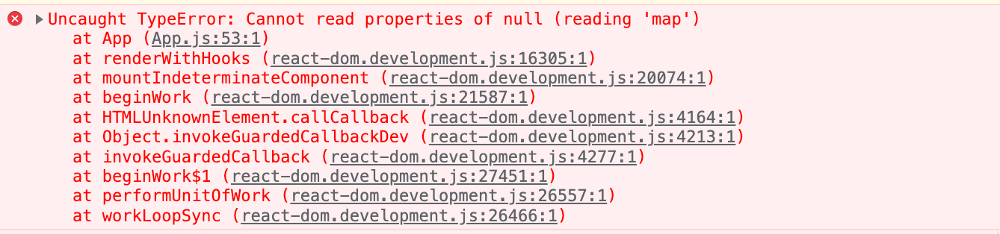
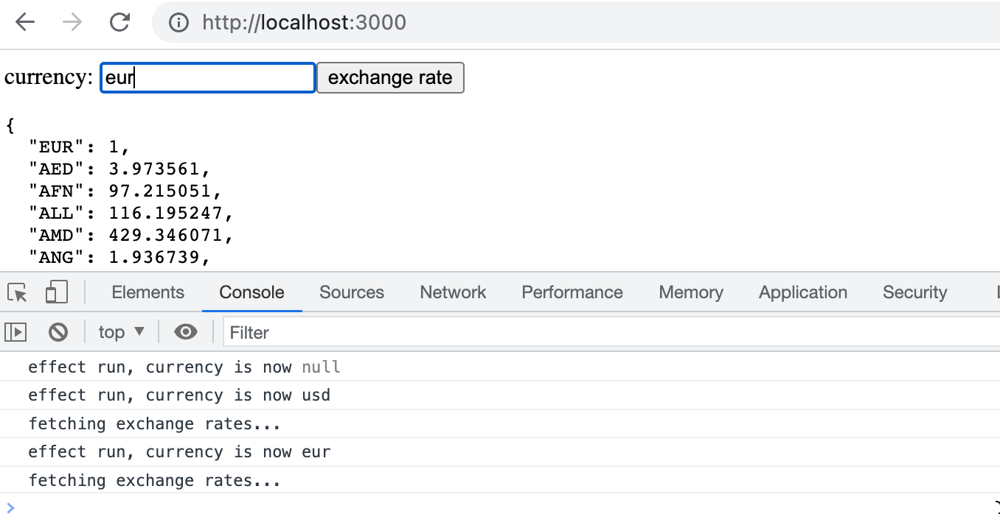
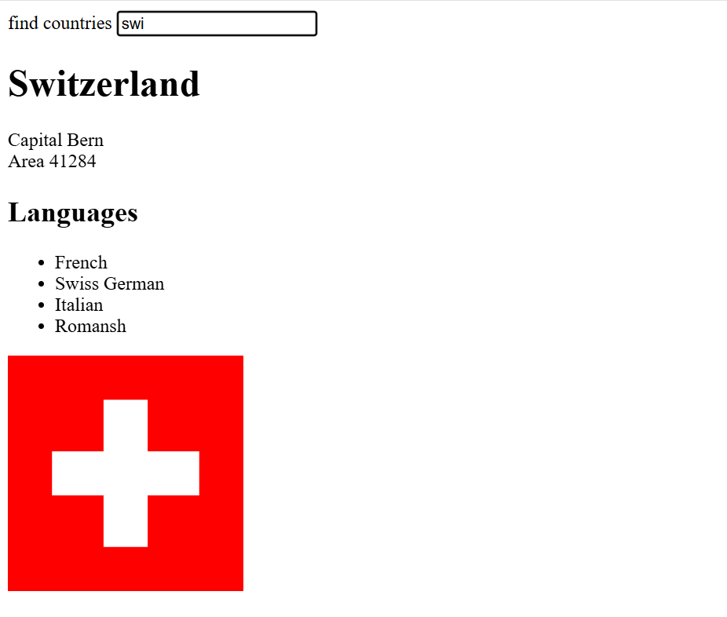

<div class="content">

La apariencia de nuestra aplicación actual es bastante modesta. En el [ejercicio 0.2](/es/part0/fundamentos_de_las_aplicaciones_web#ejercicios-0-1-0-6), la tarea era pasar por el [tutorial CSS](https://developer.mozilla.org/es/docs/Learn/Getting_started_with_the_web/CSS_basics) de Mozilla.

Antes de pasar a la siguiente parte, echemos un vistazo a cómo podemos agregar estilos a una aplicación React. Hay varias formas diferentes de hacer esto y veremos los otros métodos más adelante. Al principio, agregaremos CSS a nuestra aplicación a la vieja usanza; en un solo archivo sin usar un [preprocesador CSS](https://developer.mozilla.org/es/docs/Glossary/CSS_preprocessor) (aunque esto no es del todo cierto como veremos más adelante).

Agreguemos un nuevo archivo <i>index.css</i> bajo el directorio <i>src</i> y luego agrégalo a la aplicación importándolo en el archivo <i>main.jsx</i>:

```js
import './index.css'
```

Agreguemos la siguiente regla CSS al archivo <i>index.css</i>:

```css
h1 {
  color: green;
}
```

Las reglas CSS se componen de <i>selectores</i> y <i>declaraciones</i>. El selector define a qué elementos se debe aplicar la regla. El selector de arriba es <i>h1</i>, que coincidirá con todas las etiquetas de encabezado <i>h1</i> en nuestra aplicación.

La declaración establece la propiedad _color_ con en el valor <i>green</i>.

Una regla CSS puede contener un número arbitrario de propiedades. Modifiquemos la regla anterior para convertir el texto en cursiva, definiendo el estilo de fuente como <i>italic</i>:

```css
h1 {
  color: green;
  font-style: italic;  // highlight-line
}
```

Hay muchas formas de hacer coincidir elementos usando [diferentes tipos de selectores CSS](https://developer.mozilla.org/es/docs/Web/CSS/CSS_Selectors).

Si quisiéramos apuntar, digamos, a cada una de las notas con nuestros estilos, podríamos usar el selector <i>li</i>, ya que todas las notas están envueltas dentro de las etiquetas <i>li</i>:

```js
const Note = ({ note, toggleImportance }) => {
  const label = note.important 
    ? 'make not important' 
    : 'make important';

  return (
    <li>
      {note.content} 
      <button onClick={toggleImportance}>{label}</button>
    </li>
  )
}
```

Agreguemos la siguiente regla a nuestra hoja de estilo (ya que mi conocimiento de diseño web elegante es cercano a cero, los estilos no tienen mucho sentido):

```css
li {
  color: grey;
  padding-top: 3px;
  font-size: 15px;
}
```

El uso de tipos de elementos para definir reglas CSS es un poco problemático. Si nuestra aplicación contuviera otras etiquetas <i>li</i>, también se les aplicaría la misma regla de estilo.

Si queremos aplicar nuestro estilo específicamente a las notas, entonces es mejor usar [selectores de clase](https://developer.mozilla.org/es/docs/Web/CSS/Class_selectors).

En HTML normal, las clases se definen como el valor del atributo <i>class</i>:

```html
<li class="note">some text...</li>
```

En React tenemos para usar el atributo [className](https://es.react.dev/learn#adding-styles) en lugar del atributo class. Con esto en mente, hagamos los siguientes cambios en nuestro componente <i>Note</i>:

```js
const Note = ({ note, toggleImportance }) => {
  const label = note.important 
    ? 'make not important' 
    : 'make important';

  return (
    <li className='note'> // highlight-line
      {note.content} 
      <button onClick={toggleImportance}>{label}</button>
    </li>
  )
}
```

Los selectores de clase se definen con la sintaxis _.classname_:

```css
.note {
  color: grey;
  padding-top: 5px;
  font-size: 15px;
}
```

Si ahora agrega otros elementos <i>li</i> a la aplicación, no se verán afectados por la regla de estilo anterior.

### Mensaje de error mejorado

Anteriormente implementamos el mensaje de error que se mostraba cuando el usuario intentaba cambiar la importancia de una nota eliminada con el método <em>alert</em>. Implementemos el mensaje de error como su propio componente React.

El componente es bastante simple:

```js
const Notification = ({ message }) => {
  if (message === null) {
    return null
  }

  return (
    <div className="error">
      {message}
    </div>
  )
}
```

Si el valor del prop <em>message</em> es <em>null</em>, entonces no se muestra nada en la pantalla y, en otros casos, el mensaje se representa dentro de un elemento div.

Agreguemos un nuevo estado llamado <i>errorMessage</i> al componente <i>App</i>. Inicialicemos con algún mensaje de error para que podamos probar inmediatamente nuestro componente:

```js
const App = () => {
  const [notes, setNotes] = useState([]) 
  const [newNote, setNewNote] = useState('')
  const [showAll, setShowAll] = useState(true)
  const [errorMessage, setErrorMessage] = useState('some error happened...') // highlight-line

  // ...

  return (
    <div>
      <h1>Notes</h1>
      <Notification message={errorMessage} /> // highlight-line
      <div>
        <button onClick={() => setShowAll(!showAll)}>
          show {showAll ? 'important' : 'all' }
        </button>
      </div>      
      // ...
    </div>
  )
}
```

Entonces agreguemos una regla de estilo que se adapte a un mensaje de error:

```css
.error {
  color: red;
  background: lightgrey;
  font-size: 20px;
  border-style: solid;
  border-radius: 5px;
  padding: 10px;
  margin-bottom: 10px;
}
```

Ahora estamos listos para agregar la lógica para mostrar el mensaje de error. Cambiemos la función <em>toggleImportanceOf</em> de la siguiente manera:

```js
  const toggleImportanceOf = id => {
    const note = notes.find(n => n.id === id)
    const changedNote = { ...note, important: !note.important }

    noteService
      .update(changedNote).then(returnedNote => {
        setNotes(notes.map(note => note.id !== id ? note : returnedNote))
      })
      .catch(error => {
        // highlight-start
        setErrorMessage(
          `Note '${note.content}' was already removed from server`
        )
        setTimeout(() => {
          setErrorMessage(null)
        }, 5000)
        // highlight-end
        setNotes(notes.filter(n => n.id !== id))
      })
  }
```

Cuando ocurre el error, agregamos un mensaje de error descriptivo al estado <em>errorMessage</em>. Al mismo tiempo, iniciamos un temporizador que establecerá el estado de <em>errorMessage</em> en <em>null</em> después de cinco segundos.

El resultado se ve así:


El código para el estado actual de nuestra aplicación se puede encontrar en la rama <i>part2-7</i> en [GitHub](https://github.com/fullstack-hy2020/part2-notes-frontend/tree/part2-7).

### Estilos en línea

React también hace posible escribir estilos directamente en el código como los llamados [estilos en línea](https://react-cn.github.io/react/tips/inline-styles.html).

La idea detrás de la definición de estilos en línea es extremadamente simple. Cualquier componente o elemento de React puede recibir un conjunto de propiedades CSS como un objeto JavaScript a través del atributo [style](https://es.react.dev/reference/react-dom/components/common#applying-css-styles).

Las reglas de CSS se definen de forma ligeramente diferente en JavaScript que en los archivos CSS normales. Digamos que queremos darle a algún elemento el color verde y la fuente en cursiva que tiene un tamaño de 16 píxeles. En CSS, se vería así:

```css
{
  color: green;
  font-style: italic;
  font-size: 16px;
}
```

Pero como un objeto de estilo en línea de React se vería así:

```js
 {
  color: 'green',
  fontStyle: 'italic',
  fontSize: 16
}
```

Cada propiedad CSS se define como una propiedad separada del objeto JavaScript. Los valores numéricos de los píxeles se pueden definir simplemente como números enteros. Una de las principales diferencias en comparación con el CSS normal es que las propiedades CSS con guiones (kebab case) están escritas en camelCase.

A continuación, podríamos agregar un "bloque inferior" a nuestra aplicación creando un componente <i>Footer</i> y definir los siguientes estilos en línea para él:

```js
// highlight-start
const Footer = () => {
  const footerStyle = {
    color: 'green',
    fontStyle: 'italic',
    fontSize: 16
  }

  return (
    <div style={footerStyle}>
      <br />
      <em>Note app, Department of Computer Science, University of Helsinki 2024</em>
    </div>
  )
}
// highlight-end

const App = () => {
  // ...

  return (
    <div>
      <h1>Notes</h1>

      <Notification message={errorMessage} />

      // ...  

      <Footer /> // highlight-line
    </div>
  )
}
```

Los estilos en línea tienen ciertas limitaciones. Por ejemplo, las llamadas [pseudoclases](https://developer.mozilla.org/es/docs/Web/CSS/Pseudo-classes) no se pueden usar directamente.

Los estilos en línea y algunas de las otras formas de agregar estilos a los componentes de React van completamente en contra de las viejas convenciones. Tradicionalmente, se ha considerado la mejor práctica para separar completamente CSS del contenido (HTML) y la funcionalidad (JavaScript). Según esta vieja escuela de pensamiento, el objetivo era escribir CSS, HTML y JavaScript en sus archivos separados.

La filosofía de React es, de hecho, el polo opuesto a esto. Dado que la separación de CSS, HTML y JavaScript en archivos separados no pareció escalar bien en aplicaciones más grandes, React basa la división de la aplicación en las líneas de sus entidades funcionales lógicas.

Las unidades estructurales que componen las entidades funcionales de la aplicación son componentes de React. Un componente de React define el HTML para estructurar el contenido, las funciones de JavaScript para determinar la funcionalidad y también el estilo del componente; todo en un lugar. Esto es para crear componentes individuales que sean lo más independientes y reutilizables como sea posible.

El código de la versión final de nuestra aplicación se puede encontrar en la rama <i>part2-8</i> en [GitHub](https://github.com/fullstack-hy2020/part2-notes-frontend/tree/part2-8).

</div>

<div class="tasks">

<h3> Ejercicios 2.16-2.17 </h3>

<h4> 2.16: Agenda Telefónica paso 11 </h4>

Usa el ejemplo de [mensaje de error mejorado](/es/part2/agregar_estilos_a_la_aplicacion_react#mensaje-de-error-mejorado) de la parte 2 como guía para mostrar una notificación que dure unos segundos después de que se ejecute una operación exitosa (se agrega una persona o se cambia un número):


<h4> 2.17*: Agenda Telefónica paso 12 </h4>

Abre tu aplicación en dos navegadores. **Si eliminas a una persona en el navegador 1** poco antes de intentar <i>cambiar el número de teléfono de la persona</i> en el navegador 2, obtendrás los siguientes mensajes de error:


Soluciona el problema según el ejemplo mostrado en [promesas y errores](/es/part2/alterando_datos_en_el_servidor#promesas-y-errores) en la parte 2. Modifica el ejemplo para que se muestre un mensaje cuando la operación no tiene éxito. Los mensajes mostrados para eventos exitosos y no exitosos deben lucir diferentes:


**Nota** que incluso si manejas la excepción, el primer mensaje de error "404" todavía se imprime en la consola. Pero no deberías ver "Uncaught (in promise) Error".

</div>

<div class="content">

### Algunas observaciones importantes

Al final de esta parte, hay algunos ejercicios más desafiantes. En este momento, puedes saltarte los ejercicios si son demasiado difíciles; volveremos a los mismos temas más adelante. De todas formas, vale la pena leer el material.

Hemos hecho algo en nuestra aplicación que enmascara una fuente muy típica de errores.

Establecimos el estado _notes_ con un valor inicial de un array vacío:

```js
const App = () => {
  const [notes, setNotes] = useState([])

  // ...
}
```

Este es un valor inicial bastante natural ya que las notas son un conjunto, es decir, hay muchas notas que el estado almacenará.

Si el estado solo estuviera guardando "una cosa", un valor inicial más adecuado sería _null_, indicando que no hay <i>nada</i> en el estado al principio. Veamos qué sucede si usamos este valor inicial:

```js
const App = () => {
  const [notes, setNotes] = useState(null) // highlight-line

  // ...
}
```

La aplicación se rompe:



El mensaje de error proporciona la razón y la ubicación del error. El código que causó el problema es el siguiente:

```js
  // notesToShow obtiene el valor de notes
  const notesToShow = showAll
    ? notes
    : notes.filter(note => note.important)

  // ...

  {notesToShow.map(note =>  // highlight-line
    <Note key={note.id} note={note} />
  )}
```

El mensaje de error es

```bash
Cannot read properties of null (reading 'map')
```

La variable _notesToShow_ se asigna primero con el valor del estado _notes_ y luego el código intenta llamar al método _map_ en un objeto que no existe, es decir, en _null_.

¿Cuál es la razón de eso?

El hook de efecto utiliza la función _setNotes_ para establecer que _notes_ tenga las notas que el backend está devolviendo:

```js
  useEffect(() => {
    noteService
      .getAll()
      .then(initialNotes => {
        setNotes(initialNotes)  // highlight-line
      })
  }, [])
```

Sin embargo, el problema es que el efecto se ejecuta solo <i>después de la primera renderización</i>.
Y debido a que _notes_ tiene el valor inicial de null:

```js
const App = () => {
  const [notes, setNotes] = useState(null) // highlight-line

  // ...
```

en la primera renderización se ejecuta el siguiente código:

```js
notesToShow = notes

// ...

notesToShow.map(note => ...)
```

y esto hace que la aplicación explote porque no podemos llamar al método _map_ del valor _null_.

Cuando establecemos _notes_ para que sea inicialmente un array vacío, no hay error, ya que se permite llamar a _map_ en un array vacío.

Así que, la inicialización del estado "enmascaró" el problema causado por el hecho de que los datos aún no se han obtenido del backend.

Otra forma de evitar el problema es utilizar el <i>renderizado condicional</i> y devolver null si el estado del componente no está correctamente inicializado:

```js
const App = () => {
  const [notes, setNotes] = useState(null) // highlight-line
  // ... 

  useEffect(() => {
    noteService
      .getAll()
      .then(initialNotes => {
        setNotes(initialNotes)
      })
  }, [])

  // no renderizar nada si notes aún es null
  // highlight-start
  if (!notes) { 
    return null 
  }
  // highlight-end

  // ...
} 
```

Entonces, en la primera renderización, no se renderiza nada. Cuando las notas llegan desde el backend, el efecto utiliza la función _setNotes_ para establecer el valor del estado _notes_. Esto provoca que el componente se vuelva a renderizar y, en la segunda renderización, las notas se muestran en la pantalla.

El método basado en el renderizado condicional es adecuado en casos en los que es imposible definir el estado para que la renderización inicial sea posible.

La otra cosa que aún necesitamos analizar más de cerca es el segundo parámetro del useEffect:

```js
  useEffect(() => {
    noteService
      .getAll()
      .then(initialNotes => {
        setNotes(initialNotes)  
      })
  }, []) // highlight-line
```

El segundo parámetro de <em>useEffect</em> se utiliza para [especificar con qué frecuencia se ejecuta el efecto](https://es.react.dev/reference/react/useEffect#parameters). El principio es que el efecto siempre se ejecuta después de la primera renderización del componente <i>y</i> cuando cambia el valor del segundo parámetro.

Si el segundo parámetro es un array vacío <em>[]</em>, su contenido nunca cambia y el efecto solo se ejecuta después de la primera renderización del componente. Esto es exactamente lo que queremos cuando estamos inicializando el estado de la aplicación desde el servidor.

Sin embargo, hay situaciones en las que queremos realizar el efecto en otros momentos, por ejemplo, cuando el estado del componente cambia de una manera particular.

Considera la siguiente aplicación simple para consultar tasas de cambio de divisas desde la [API de tasas de cambio](https://www.exchangerate-api.com/):

```js
import { useState, useEffect } from 'react'
import axios from 'axios'

const App = () => {
  const [value, setValue] = useState('')
  const [rates, setRates] = useState({})
  const [currency, setCurrency] = useState(null)

  useEffect(() => {
    console.log('effect run, currency is now', currency)

    // omitir si la moneda no está definida
    if (currency) {
      console.log('fetching exchange rates...')
      axios
        .get(`https://open.er-api.com/v6/latest/${currency}`)
        .then(response => {
          setRates(response.data.rates)
        })
    }
  }, [currency])

  const handleChange = (event) => {
    setValue(event.target.value)
  }

  const onSearch = (event) => {
    event.preventDefault()
    setCurrency(value)
  }

  return (
    <div>
      <form onSubmit={onSearch}>
        currency: <input value={value} onChange={handleChange} />
        <button type="submit">exchange rate</button>
      </form>
      <pre>
        {JSON.stringify(rates, null, 2)}
      </pre>
    </div>
  )
}

export default App
```

La interfaz de usuario de la aplicación tiene un formulario, en el input del cual se escribe el nombre de la moneda deseada. Si la moneda existe, la aplicación renderiza las tasas de cambio de la moneda a otras monedas:



La aplicación establece el nombre de la moneda ingresado en el formulario al estado _currency_ en el momento en que se presiona el botón.

Cuando _currency_ obtiene un nuevo valor, la aplicación obtiene sus tasas de cambio desde la API en la función del efecto:

```js
const App = () => {
  // ...
  const [currency, setCurrency] = useState(null)

  useEffect(() => {
    console.log('effect run, currency is now', currency)

    // omitir si la moneda no está definida
    if (currency) {
      console.log('fetching exchange rates...')
      axios
        .get(`https://open.er-api.com/v6/latest/${currency}`)
        .then(response => {
          setRates(response.data.rates)
        })
    }
  }, [currency]) // highlight-line
  // ...
}
```

El hook useEffect ahora tiene _[currency]_ como segundo parámetro. Por lo tanto, la función del efecto se ejecuta después de la primera renderización y <i>siempre</i> después de la tabla, ya que su segundo parámetro _[currency]_ cambia. Es decir, cuando el estado _currency_ obtiene un nuevo valor, el contenido de la tabla cambia y se ejecuta la función del efecto.

El efecto tiene la siguiente condición:

```js
if (currency) { 
  // se obtienen las tasas de cambio
}
```

lo que evita solicitar las tasas de cambio justo después de la primera renderización cuando la variable _currency_ aún tiene el valor inicial, es decir, un valor null.

Entonces, si el usuario escribe, por ejemplo, <i>eur</i> en el campo de búsqueda, la aplicación utiliza Axios para realizar una solicitud HTTP GET a la dirección <https://open.er-api.com/v6/latest/eur> y almacena la respuesta en el estado _rates_.

Luego, cuando el usuario ingresa otro valor en el campo de búsqueda, por ejemplo, <i>usd</i>, la función del efecto se ejecuta nuevamente y se solicitan las tasas de cambio de la nueva moneda desde la API.

La forma presentada aquí para realizar solicitudes a la API podría parecer un poco incómoda.
Esta aplicación en particular podría haberse hecho completamente sin usar useEffect, realizando las solicitudes a la API directamente en la función del controlador de envío del formulario:

```js
  const onSearch = (event) => {
    event.preventDefault()
    axios
      .get(`https://open.er-api.com/v6/latest/${value}`)
      .then(response => {
        setRates(response.data.rates)
      })
  }
```

Sin embargo, hay situaciones donde esa técnica no funcionaría. Por ejemplo, <i>podrías</i> encontrarte con una de esas situaciones en el ejercicio 2.20 donde el uso de useEffect podría ofrecer una solución. Ten en cuenta que esto depende en gran medida del enfoque que hayas seleccionado; por ejemplo, la solución modelo no utiliza este truco.

</div>

<div class="tasks">

### Ejercicios 2.18.-2.20.

#### 2.18* Datos de países, paso 1

En [https://studies.cs.helsinki.fi/restcountries/](https://studies.cs.helsinki.fi/restcountries/) puedes encontrar un servicio que ofrece mucha información sobre diferentes países en un formato legible por máquinas a través de la API REST. Crea una aplicación que te permita ver información de diferentes países.

La interfaz de usuario es muy simple. El país que se mostrará se encuentra escribiendo una consulta de búsqueda en el campo de búsqueda.

Si hay demasiados países (más de 10) que coinciden con la consulta, se le pide al usuario que haga su consulta más específica:


Si hay diez o menos países, pero más de uno, se muestran todos los países que coinciden con la consulta:


Cuando solo hay un país que coincide con la consulta, se muestran los datos básicos del país (por ejemplo, capital y área), su bandera y los idiomas hablados:



**NB**: Es suficiente que tu aplicación funcione para la mayoría de los países. Algunos países, como <i>Sudán</i>, pueden ser difíciles de admitir ya que el nombre del país es parte del nombre de otro país, <i>Sudán del Sur</i>. No es necesario que te preocupes por estos casos especiales.

#### 2.19*: Datos de países, paso 2

**Todavía hay mucho por hacer en esta parte, ¡así que no te atasques en este ejercicio!**

Mejora la aplicación del ejercicio anterior, de modo que cuando se muestren los nombres de varios países en la página, haya un botón junto al nombre del país que, al presionarlo, muestra la vista de ese país:


En este ejercicio, también es suficiente que tu aplicación funcione para la mayoría de los países. Se pueden ignorar los países cuyo nombre aparece en el nombre de otro país, como <i>Sudán</i>.

#### 2.20*: Datos de países, paso 3

Agrega a la vista que muestra los datos de un solo país el informe meteorológico para la capital de ese país. Hay docenas de proveedores de datos meteorológicos. Una API sugerida es [https://openweathermap.org](https://openweathermap.org). Ten en cuenta que puede pasar algunos minutos hasta que una clave API generada sea válida.


Si usas OpenWeatherMap, [aquí](https://openweathermap.org/weather-conditions#Icon-list) tienes la descripción de cómo obtener iconos meteorológicos.

**NB**: En algunos navegadores (como Firefox), la API elegida puede enviar una respuesta de error, lo que indica que no se admite el cifrado HTTPS, aunque la URL de la solicitud comience con _http://_. Este problema se puede solucionar completando el ejercicio con Chrome.

**NB**: Necesitas una clave API para usar casi todos los servicios meteorológicos. ¡No guardes la clave API en GitHub! Ni codifiques la clave API en tu código fuente. En su lugar, utiliza una [variable de entorno](https://es.vitejs.dev/guide/env-and-mode.html) para guardar la clave.

Suponiendo que la clave API es <i>54l41n3n4v41m34rv0</i>, cuando la aplicación se inicia de la siguiente manera:

```bash
export VITE_SOME_KEY=54l41n3n4v41m34rv0 && npm run dev // Para Linux/macOS Bash
($env:VITE_SOME_KEY="54l41n3n4v41m34rv0") -and (npm run dev) // Para Windows PowerShell
set "VITE_SOME_KEY=54l41n3n4v41m34rv0" && npm run dev // Para Windows cmd.exe
```

puedes acceder al valor de la clave desde el objeto _import.meta.env_:

```js
const api_key = import.meta.env.VITE_SOME_KEY
// variable api_key ahora tiene el valor configurado
```

Ten en cuenta que deberás reiniciar el servidor para aplicar los cambios.

Este fue el último ejercicio de esta parte del curso. Es hora de subir tu código a GitHub y marcar todos tus ejercicios terminados en el [sistema de envío de ejercicios](https://studies.cs.helsinki.fi/stats/courses/fullstackopen).

</div>
