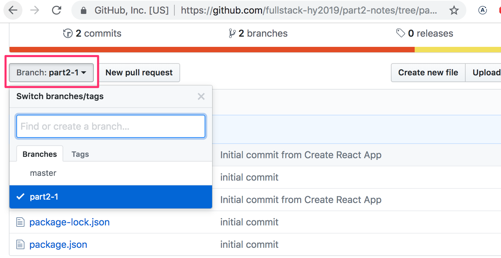

<div class="content">

Ennen kun menemme uuteen asiaan, nostetaan esiin muutama edellisen osan huomiota herättänyt seikka.

### console.log

**Mikä erottaa kokeneen ja kokemattoman Javascript-ohjelmoijan? Kokeneet käyttävät 10-100 kertaa enemmän console.logia**.

Paradoksaalista kyllä tämä näyttää olevan tilanne, vaikka kokematon ohjelmoija oikeastaan tarvitsisi console.logia (tai jotain muita debuggaustapoja) huomattavissa määrin kokenutta enemmän. 

Eli kun joku ei toimi, älä arvaile vaan logaa tai käytä jotain muita debuggauskeinoja.

**HUOM** kun käytät komentoa _console.log_ debuggaukseen, älä yhdistele asioita "javamaisesti" plussalla, eli sen sijaan että kirjoittaisit

```js
console.log('props value is' + props)
```

erottele tulostettavat asiat pilkulla:

```js
console.log('props value is', props)
```

Jos yhdistät merkkijonoon olion, tuloksena on suhteellisen hyödytön tulostusmuoto

```js
props value is [Object object]
```

kun taas pilkulla erotellessa saat tulostettavat asiat developer-konsoliin oliona, jonka sisältöä on mahdollista tarkastella.

Lue tarvittaessa lisää React-sovellusten debuggaamisesta [täältä](/osa1/monimutkaisempi_tila_reactin_debuggaus#react-sovellusten-debuggaus).

### Tapahtumankäsittely revisited

Viime vuoden kurssin alun kokemusten perusteella tapahtumien käsittely on osoittautunut haastavaksi.

Edellisen osan lopussa oleva kertaava osa [tapahtumankäsittely revisited](/osa1/monimutkaisempi_tila_reactin_debuggaus#tapahtumankasittely-revisited) kannattaa käydä läpi, jos osaaminen on vielä häilyvällä pohjalla.

Myös tapahtumankäsittelijöiden välittäminen komponentin <i>App</i> alikomponenteille on herättänyt ilmaan kysymyksiä, pieni kertaus aiheeseen [täällä](/osa1/monimutkaisempi_tila_reactin_debuggaus#tapahtumankasittelijan-vieminen-alikomponenttiin).

### Protip: Visual Studio Coden snippetit

Visual studio codeen on helppo määritellä "snippettejä", eli Netbeansin "sout":in tapaisia oikoteitä yleisesti käytettyjen koodinpätkien generointiin. Ohje snippetien luomiseen [täällä](https://code.visualstudio.com/docs/editor/userdefinedsnippets#_creating-your-own-snippets).

VS Code -plugineina löytyy myös hyödyllisiä valmiiksi määriteltyjä snippettejä, esim.
[tämä](https://marketplace.visualstudio.com/items?itemName=xabikos.ReactSnippets).

Tärkein kaikista snippeteistä on komennon <em>console.log()</em> nopeasti ruudulle tekevä snippet, esim. <em>clog</em>, jonka voi määritellä seuraavasti:

```js
{
  "console.log": {
    "prefix": "clog",
    "body": [
      "console.log('$1')",
    ],
    "description": "Log output to console"
  }
}
```

### Taulukkojen käyttö Javascriptissä

Tästä osasta lähtien käytämme runsaasti Javascriptin [taulukkojen](https://developer.mozilla.org/en-US/docs/Web/JavaScript/Reference/Global_Objects/Array) funktionaalisia käsittelymetodeja, kuten _find_, _filter_ ja _map_. Periaate niissä on täysin sama kuin Java 8:sta tutuissa streameissa, joita on käytetty jo parin vuoden ajan Tietojenkäsittelytieteen osaston Ohjelmoinnin perusteissa ja jatkokurssilla sekä Ohjelmoinnin MOOC:issa.

Jos taulukon funktionaalinen käsittely tuntuu vielä vieraalta, kannattaa katsoa Youtubessa olevasta videosarjasta <i>Functional Programming in JavaScript</i> ainakin kolme ensimmäistä osaa

- [Higher-order functions](https://www.youtube.com/watch?v=BMUiFMZr7vk&list=PL0zVEGEvSaeEd9hlmCXrk5yUyqUag-n84)
- [Map](https://www.youtube.com/watch?v=bCqtb-Z5YGQ&list=PL0zVEGEvSaeEd9hlmCXrk5yUyqUag-n84&index=2)
- [Reduce basics](https://www.youtube.com/watch?v=Wl98eZpkp-c&t=31s)

### Kokoelmien renderöiminen

Tehdään nyt Reactilla [osan 0](/osa0) alussa käytettyä esimerkkisovelluksen [Single page app -versiota](https://fullstack-exampleapp.herokuapp.com/spa) vastaavan sovelluksen 'frontend' eli selainpuolen sovelluslogiikka.

Aloitetaan seuraavasta:

```js
import React from 'react'
import ReactDOM from 'react-dom'

const notes = [
  {
    id: 1,
    content: 'HTML is easy',
    date: '2020-01-10T17:30:31.098Z',
    important: true
  },
  {
    id: 2,
    content: 'Browser can execute only Javascript',
    date: '2020-01-10T18:39:34.091Z',
    important: false
  },
  {
    id: 3,
    content: 'GET and POST are the most important methods of HTTP protocol',
    date: '2020-01-10T19:20:14.298Z',
    important: true
  }
]

const App = (props) => {
  const { notes } = props

  return (
    <div>
      <h1>Notes</h1>
      <ul>
        <li>{notes[0].content}</li>
        <li>{notes[1].content}</li>
        <li>{notes[2].content}</li>
      </ul>
    </div>
  )
}

ReactDOM.render(
  <App notes={notes} />,
  document.getElementById('root')
)
```

Jokaiseen muistiinpanoon on merkitty tekstuaalisen sisällön ja aikaleiman lisäksi myös _boolean_-arvo, joka kertoo onko muistiinpano luokiteltu tärkeäksi, sekä yksikäsitteinen tunniste <i>id</i>.

Koodin toiminta perustuu siihen, että taulukossa on tasan kolme muistiinpanoa, yksittäiset muistiinpanot renderöidään 'kovakoodatusti' viittaamalla suoraan taulukossa oleviin olioihin:

```js
<li>{notes[1].content}</li>
```

Tämä ei tietenkään ole järkevää. Ratkaisu voidaan yleistää generoimalla taulukon perusteella joukko React-elementtejä käyttäen [map](https://developer.mozilla.org/en-US/docs/Web/JavaScript/Reference/Global_Objects/Array/map)-funktiota:

```js
notes.map(note => <li>{note.content}</li>)
```

nyt tuloksena on taulukko, jonka sisältö on joukko <i>li</i>-elementtejä

```js
[
  '<li>HTML is easy</li>',
  '<li>Browser can execute only Javascript</li>',
  '<li>GET and POST are the most important methods of HTTP protocol</li>',
]
```

jotka voidaan sijoittaa <i>ul</i>-tagien sisälle:

```js
const App = (props) => {
  const { notes } = props

  return (
    <div>
      <h1>Notes</h1>
// highlight-start
      <ul>
        {notes.map(note => <li>{note.content}</li>)}
      </ul>
// highlight-end      
    </div>
  )
}
```

Koska <i>li</i>-tagit generoiva koodi on Javascriptia, tulee se sijoittaa JSX-templatessa aaltosulkujen sisälle kaiken muun Javascript-koodin tapaan.

Parannetaan koodin luetteloa vielä jakamalla nuolifunktion määrittely useammalle riville:

```js
const App = (props) => {
  const { notes } = props

  return (
    <div>
      <h1>Notes</h1>
      <ul>
        {notes.map(note => 
        // highlight-start
          <li>
            {note.content}
          </li>
        // highlight-end   
        )}
      </ul>
    </div>
  )
}
```

### Key-attribuutti

Vaikka sovellus näyttää toimivan, tulee konsoliin ikävä varoitus


Kuten virheilmoituksen linkittämä [sivu](https://reactjs.org/docs/lists-and-keys.html#keys) kertoo, tulee taulukossa olevilla, eli käytännössä _map_-metodilla muodostetuilla elementeillä olla uniikki avain, eli attribuutti nimeltään <i>key</i>.

Lisätään avaimet:

```js
const App = (props) => {
  const { notes } = props

  return (
    <div>
      <h1>Notes</h1>
      <ul>
        {notes.map(note => 
        // highlight-start
          <li key={note.id}>
            {note.content}
          </li>
          // highlight-end
        )}
      </ul>
    </div>
  )
}
```

Virheilmoitus katoaa.

React käyttää taulukossa olevien elementtien <i>key</i>-kenttiä päätellessään miten sen tulee päivittää komponentin generoimaa näkymää silloin kun komponentti uudelleenrenderöidään. Lisää aiheesta [täällä](https://reactjs.org/docs/reconciliation.html#recursing-on-children).

### Map

Taulukoiden metodin [map](https://developer.mozilla.org/en-US/docs/Web/JavaScript/Reference/Global_Objects/Array/map) toiminnan sisäistäminen on jatkon kannalta äärimmäisen tärkeää.

Sovellus siis sisältää taulukon _notes_

```js
const notes = [
  {
    id: 1,
    content: 'HTML is easy',
    date: '2020-01-10T17:30:31.098Z',
    important: true
  },
  {
    id: 2,
    content: 'Browser can execute only Javascript',
    date: '2020-01-10T18:39:34.091Z',
    important: false
  },
  {
    id: 3,
    content: 'GET and POST are the most important methods of HTTP protocol',
    date: '2020-01-10T19:20:14.298Z',
    important: true
  }
]
```

Pysähdytään hetkeksi tarkastelemaan miten _map_ toimii.

Jos esim. tiedoston loppuun lisätään seuraava koodi

```js
const result = notes.map(note => note.id)
console.log(result)
```

tulostuu konsoliin <i>[1, 2, 3]</i> eli _map_ muodostaa uuden taulukon, jonka jokainen alkio on saatu alkuperäisen taulukon _notes_ alkioista <i>mappaamalla</i> komennon parametrina olevan funktion avulla.

Funktio on

```js
note => note.id
```

eli kompaktissa muodossa kirjoitettu nuolifunktio, joka on täydelliseltä kirjoitustavaltaan seuraava

```js
(note) => {
  return note.id
}
```

eli funktio saa parametrikseen muistiinpano-olion ja <i>palauttaa</i> sen kentän <i>id</i> arvon.

Muuttamalla komento muotoon

```js
const result = notes.map(note => note.content)
```

tuloksena on taulukko, joka koostuu muistiinpanojen sisällöistä.

Tämä on jo lähellä käyttämäämme React-koodia:

```js
notes.map(note =>
  <li key={note.id}>
    {note.content}
  </li>
)
```

joka muodostaa jokaista muistiinpano-olioa vastaavan <i>li</i>-tagin, jonka sisään tulee muistiinpanon sisältö.

Koska metodin _map_ parametrina olevan funktion

```js
note => <li key={note.id}>{note.content}</li>
```

käyttötarkoitus on näkymäelementtien muodostaminen, tulee muuttujan <i>note.content arvo</i> renderöidä aaltosulkeiden sisällä. Kokeile mitä koodi tekee, jos poistat aaltosulkeet.

Aaltosulkeiden käyttö tulee varmaan aiheuttamaan alussa pientä päänvaivaa, mutta totut niihin pian. Reactin antama visuaalinen feedback on välitön.

Parempi muotoilu ohjelmamme muistiinpanorivit tuottavalle apufunktiolle saattaakin olla seuraava useille riveille jaoteltu versio:

```
note =>
  <li key={note.id}>
    {note.content}
  </li>
```

Kyse on kuitenkin edelleen yhden komennon sisältävästä nuolifunktiosta, komento vain sattuu olemaan hieman monimutkaisempi.

### Antipattern: taulukon indeksit avaimina

Olisimme saaneet konsolissa olevan varoituksen katoamaan myös käyttämällä avaimina taulukon indeksejä. Indeksit selviävät käyttämällä map-metodin callback-funktiossa myös toista parametria:

```js
notes.map((note, i) => ...)
```

näin kutsuttaessa _i_ saa arvokseen sen paikan indeksin taulukossa, missä <i>Note</i> sijaitsee.

Eli eräs konsoliin tulostuvaa virheilmoitusta aiheuttamaton tapa määritellä rivien generointi olisi

```js
<ul>
  {notes.map((note, i) => 
    <li key={i}>
      {note.content}
    </li>
  )}
</ul>
```

Tämä **ei kuitenkaan ole suositeltavaa** ja voi näennäisestä toimimisestaan aiheuttaa joissakin tilanteissa pahoja ongelmia. Lue lisää esimerkiksi [täältä](https://medium.com/@robinpokorny/index-as-a-key-is-an-anti-pattern-e0349aece318).

### Refaktorointia - moduulit

Siistitään koodia hiukan. Koska olemme kiinnostuneita ainoastaan propsien kentästä _notes_, otetaan se vastaan suoraan [destrukturointia](https://developer.mozilla.org/en-US/docs/Web/JavaScript/Reference/Operators/Destructuring_assignment) hyödyntäen:

```js
const App = ({ notes }) => { //highlight-line
  return (
    <div>
      <h1>Notes</h1>
      <ul>
        {notes.map(note => 
          <li key={note.id}>
            {note.content}
          </li>
        )}
      </ul>
    </div>
  )
}
```

Jos unohdit mitä destrukturointi tarkottaa ja miten se toimii, kertaa [täältä](/osa1/komponentin_tila_ja_tapahtumankasittely#destrukturointi).

Erotetaan yksittäisen muistiinpanon esittäminen oman komponenttinsa <i>Note</i> vastuulle:

```js
// highlight-start
const Note = ({ note }) => {
  return (
    <li>{note.content}</li>
  )
}
// highlight-end

const App = ({ notes }) => {
  return (
    <div>
      <h1>Notes</h1>
      <ul>
        // highlight-start
        {notes.map(note => 
          <Note key={note.id} note={note} />
        )}
         // highlight-end
      </ul>
    </div>
  )
}
```

Huomaa, että <i>key</i>-attribuutti täytyy nyt määritellä <i>Note</i>-komponenteille, eikä <i>li</i>-tageille kuten ennen muutosta.

Koko React-sovellus on mahdollista määritellä samassa tiedostossa, mutta se ei luonnollisesti ole järkevää. Usein käytäntönä on määritellä yksittäiset komponentit omassa tiedostossaan <i>ES6-moduuleina</i>.

Koodissamme on käytetty koko ajan moduuleja. Tiedoston ensimmäiset rivit

```js
import React from 'react'
import ReactDOM from 'react-dom'
```

[importtaavat](https://developer.mozilla.org/en-US/docs/Web/JavaScript/Reference/Statements/import) eli ottavat käyttöönsä kaksi moduulia. Moduuli <i>react</i> sijoitetaan muuttujaan _React_ ja <i>react-dom</i> muuttujaan _ReactDOM_. 

Siirretään nyt komponentti <i>Note</i> omaan moduuliinsa.

Pienissä sovelluksissa komponentit sijoitetaan yleensä <i>src</i>-hakemiston alle sijoitettavaan hakemistoon <i>components</i>. Konventiona on nimetä tiedosto komponentin mukaan. 

Tehdään nyt sovellukseen hakemisto <i>components</i> ja sinne tiedosto <i>Note.js</i> jonka sisältö on seuraava:

```js
import React from 'react'

const Note = ({ note }) => {
  return (
    <li>{note.content}</li>
  )
}

export default Note
```

Koska kyseessä on React-komponentti, tulee React importata komponentissa.

Moduulin viimeisenä rivinä [eksportataan](https://developer.mozilla.org/en-US/docs/Web/JavaScript/Reference/Statements/export) määritelty komponentti, eli muuttuja <i>Note</i>.

Nyt komponenttia käyttävä tiedosto <i>index.js</i> voi [importata](https://developer.mozilla.org/en-US/docs/Web/JavaScript/Reference/Statements/import) moduulin:

```js
import React from 'react'
import ReactDOM from 'react-dom'
import Note from './components/Note' // highlight-line

const App = ({notes}) => {
  // ...
}
```

Moduulin eksporttaama komponentti on nyt käytettävissä muuttujassa <i>Note</i> täysin samalla tavalla kuin aiemmin.

Huomaa, että itse määriteltyä komponenttia importatessa komponentin sijainti tulee ilmaista <i>suhteessa importtaavaan tiedostoon</i>:

```js
'./components/Note'
```

Piste alussa viittaa nykyiseen hakemistoon, eli kyseessä on nykyisen hakemiston alihakemisto <i>components</i> ja sen sisällä tiedosto <i>Note.js</i>. Tiedoston päätteen voi jättää pois.

Koska myös <i>App</i> on komponentti, eristetään sekin omaan moduuliinsa. Koska kyseessä on sovelluksen juurikomponentti, sijoitetaan se suoraan hakemistoon <i>src</i>. Tiedoston sisältö on seuraava:

```js
import React from 'react'
import Note from './components/Note'

const App = ({ notes }) => {
  return (
    <div>
      <h1>Notes</h1>
      <ul>
        {notes.map((note, i) => 
          <Note key={note.id} note={note} />
        )}
      </ul>
    </div>
  )
}

export default App // highlight-line
```

Tiedoston <i>index.js</i> sisällöksi jää:

```js
import React from 'react'
import ReactDOM from 'react-dom'
import App from './App'  // highlight-line

const notes = [
  // ...
]

ReactDOM.render(
  <App notes={notes} />,
  document.getElementById('root')
)
```

Moduuleilla on paljon muutakin käyttöä kuin mahdollistaa komponenttien määritteleminen omissa tiedostoissaan, palaamme moduuleihin tarkemmin myöhemmin kurssilla.

Sovelluksen tämänhetkinen koodi on kokonaisuudessaan [githubissa](https://github.com/fullstack-hy2020/part2-notes/tree/part2-1)

Huomaa, että repositorion master-haarassa on myöhemmän vaiheen koodi, tämän hetken koodi on branchissa [part2-1](https://github.com/fullstack-hy2020/part2-notes/tree/part2-1):



Jos kloonaat projektin itsellesi, suorita komento _npm install_ ennen käynnistämistä eli komentoa _npm start_.

### Kun sovellus hajoaa

Kun aloitat ohjelmoijan uraasi (ja allekirjoittaneella edelleen 30 vuoden ohjelmointikokemuksella) käy melko usein niin, että ohjelma hajoaa aivan totaalisesti. Erityisen usein näin käy dynaamisesti tyypitetyillä kielillä, kuten Javascript, missä kääntäjä ei tarkasta minkä tyyppisiä arvoja esim. funktioiden parametreina ja paluuarvoina liikkuu.

Reactissa räjähdys näyttää esim. seuraavalta


Tilanteista pelastaa yleensä parhaiten <em>console.log</em>. Pala räjähdyksen aiheuttavaa koodia seuraavassa

```js
const Course = ({ course }) => (
  <div>
   <Header course={course} />
  </div>
)

const App = () => {
  const course = {
    // ...
  }

  return (
    <div>
      <Course course={course} />
    </div>
  )
}
```

Syy toimimattomuuteen alkaa selvitä lisäilemällä koodiin <em>console.log</em>-komentoja. Koska ensimmäinen renderöitävä asia on komponentti <i>App</i> kannattaa sinne laittaa ensimmäisen tulostus: 

```js
const App = () => {
  const course = {
    // ...
  }

  console.log('App toimii...') // highlight-line

  return (
    // ..
  )
}
```

Konsoliin tulevan tulostuksen nähdäkseen on skrollattava pitkän punaisen virhematon yläpuolelle


Kun joku asia havaitaan toimivaksi, on aika logata syvemmältä. Jos komponentti on määritelty yksilausekkeisena eli returnittomana funktiona, on konsoliin tulostus haastavampaa:

```js
const Course = ({ course }) => (
  <div>
   <Header course={course} />
  </div>
)
```

Komponentti on syytä muuttaa pidemmän kaavan mukaan määritellyksi, jotta tulostus päästään lisäämään:

```js
const Course = ({ course }) => { 
  console.log(course) // highlight-line
  return (
    <div>
    <Header course={course} />
    </div>
  )
}
```

Erittäin usein ongelma aiheutuu siitä, että propsien odotetaan olevan eri muodossa tai eri nimisiä kuin ne todellisuudessa ovat ja destrukturointi epäonnistuu. Ongelma alkaa useimmiten ratketa, kun poistetaan destrukturointi ja katsotaan, mitä <em>props</em> oikeasti pitää sisällään:

```js
const Course = (props) => { // highlight-line
  console.log(props)  // highlight-line
  const { course } = props
  return (
    <div>
    <Header course={course} />
    </div>
  )
}
```

Ja jos ongelma ei vieläkään selviä, ei auta kuin jatkaa vianjäljitystä eli kirjoittaa lisää console.logeja.

Lisäsin tämän luvun materiaaliin, kun seuraavan tehtävän mallivastauksen koodi räjähti ihan totaalisesti (syynä väärässä muodossa ollut propsi), ja jouduin jälleen kerran debuggaamaan console.logaamalla.

</div>

<div class="tasks">

<h3>Tehtävät 2.1.-2.5.</h3>

Tehtävät palautetaan GitHubin kautta ja merkitsemällä tehdyt tehtävät [palautussovellukseen](https://studies.cs.helsinki.fi/stats/courses/fullstackopen).

Voit palauttaa kurssin kaikki tehtävät samaan repositorioon, tai käyttää useita repositorioita. Jos palautat eri osien tehtäviä samaan repositorioon, käytä järkevää hakemistojen nimentää.

Tehtävät palautetaan **yksi osa kerrallaan**. Kun olet palauttanut osan tehtävät, et voi enää palauttaa saman osan tekemättä jättämiäsi tehtäviä.

Huomaa, että tässä osassa on muitakin tehtäviä kuin allaolevat, eli <i>älä tee palautusta</i> ennen kun olet tehnyt osan tehtävistä kaikki mitkä haluat palauttaa.

**VAROITUS** create-react-app tekee projektista automaattisesti git-repositorion, ellei sovellusta luoda jo olemassaolevan repositorion sisälle. Todennäköisesti **et halua** että projektista tulee repositorio, joten suorita projektin juuressa komento _rm -rf .git_.

<h4>2.1: kurssitiedot step6</h4>

Viimeistellään nyt tehtävien 1.1-1.5 kurssin sisältöjä renderöivän ohjelman koodi. Voit ottaa tarvittaessa pohjaksi mallivastauksen koodin.

**Huomaa, että jos kopioit projektin paikasta toiseen, saattaa olla tarpeen ensin tuhota hakemisto <i>node\_modules</i> ja antaa sen jälkeen asentaa riippuvuudet uudelleen, eli komento _npm install_ ennen kuin saat kopioidun projektin käynnistettyä.** Lähtökohtaisesti toki kannattaa olla kokonaan kopioimatta tai laittamatta versionhallintaan hakemistoa <i>node\_modules</i>

Muutetaan komponenttia <i>App</i> seuraavasti:

```js
const App = () => {
  const course = {
    name: 'Half Stack application development',
    id: 1,
    parts: [
      {
        name: 'Fundamentals of React',
        exercises: 10,
        id: 1
      },
      {
        name: 'Using props to pass data',
        exercises: 7,
        id: 2
      },
      {
        name: 'State of a component',
        exercises: 14,
        id: 3
      }
    ]
  }

  return (
    <div>
      <Course course={course} />
    </div>
  )
}
```

Määrittele sovellukseen yksittäisen kurssin muotoilusta huolehtiva komponentti <i>Course</i>.

Sovelluksen komponenttirakenne voi olla esim. seuraava:

<pre>
App
  Course
    Header
    Content
      Part
      Part
      ...
</pre>

Eli komponentti <i>Course</i> sisältää edellisessä osassa määritellyt komponentit, joiden vastuulle tulee kurssin nimen ja osien renderöinti.

Renderöityvä sivu voi näyttää esim. seuraavalta:


Tässä vaiheessa siis tehtävien yhteenlaskettua lukumäärää ei vielä tarvita.

Sovelluksen täytyy luonnollisesti toimia <i>riippumatta kurssissa olevien osien määrästä</i>, eli varmista että sovellus toimii jos lisäät tai poistat kurssin osia.

Varmista, että konsolissa ei näy mitään virheilmoituksia!

<h4>2.2: kurssitiedot step7</h4>

Ilmoita myös kurssin yhteenlaskettu tehtävien lukumäärä:


<h4>2.3*: kurssitiedot step8</h4>

Jos et jo niin tehnyt, laske koodissasi tehtävien määrä taulukon metodilla [reduce](https://developer.mozilla.org/en-US/docs/Web/JavaScript/Reference/Global_Objects/Array/Reduce).

**Pro tip:** Kun koodisi joka näyttää esimerkisi seuraavalta 

```js
const total = 
  parts.reduce( (s, p) => someMagicHere )
```

ei toimi, kannattaa taas kerran turvautua komentoon _console.log_, joka jälleen vaatii sen, että nuolifunktio muutetaan pidempään muotoonsa

```js
const total = parts.reduce( (s, p) => {
  console.log('what is happening', s, p)
  return someMagicHere 
})
```

**Pro tip2:** VS codeen on asennettavissa laajennus, ilmeisesti [tämä](https://marketplace.visualstudio.com/items?itemName=cmstead.jsrefactor), jonka avulla nuolifunktion lyhyen muodon voi muuttaa automaattisesti pidemmäksi muodoksi ja päinvastoin:


**Pro tip3:** Mikäli console.login haluaa vain pikaisesti ujuttaa koodiin nuolifunktiota muuttamatta, voi sen tehdä näppärästi myös tällä tapaa:

```js
const total = 
  parts.reduce( (s, p) => console.log('what is happening', s, p) || someMagicHere )
```

<h4>2.4: kurssitiedot step9</h4>

Laajennetaan sovellusta siten, että kursseja voi olla <i>mielivaltainen määrä</i>:

```js
const App = () => {
  const courses = [
    {
      name: 'Half Stack application development',
      id: 1,
      parts: [
        {
          name: 'Fundamentals of React',
          exercises: 10,
          id: 1
        },
        {
          name: 'Using props to pass data',
          exercises: 7,
          id: 2
        },
        {
          name: 'State of a component',
          exercises: 14,
          id: 3
        },
        {
          name: 'Redux',
          exercises: 11,
          id: 4
        }
      ]
    }, 
    {
      name: 'Node.js',
      id: 2,
      parts: [
        {
          name: 'Routing',
          exercises: 3,
          id: 1
        },
        {
          name: 'Middlewares',
          exercises: 7,
          id: 2
        }
      ]
    }
  ]

  return (
    <div>
      // ...
    </div>
  )
}
```

Sovelluksen ulkoasu voi olla esim seuraava:


<h4>2.5: erillinen moduuli</h4>

Määrittele komponentti <i>Course</i> omana moduulinaan, jonka komponentti <i>App</i> importtaa. Voit sisällyttää kaikki kurssin alikomponentit samaan moduuliin.

</div>
