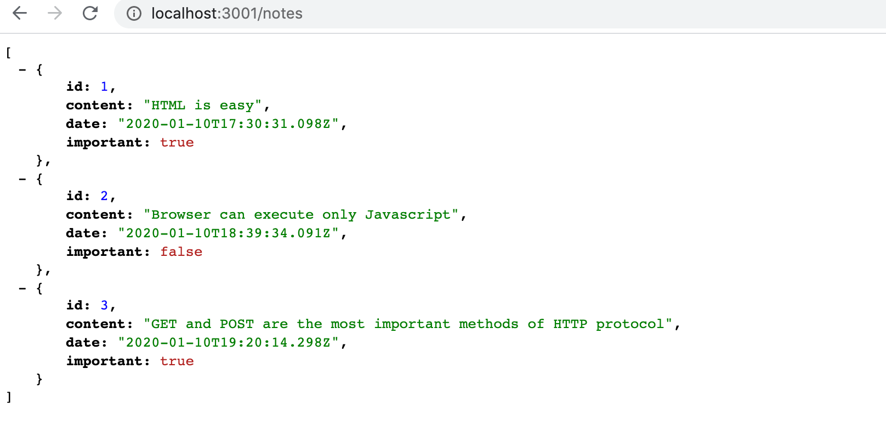

<div class="content">

Olemme nyt viipyneet tovin keskittyen pelkkään frontendiin eli selainpuolen toiminnallisuuteen. Rupeamme itse toteuttamaan backendin eli palvelinpuolen toiminnallisuutta vasta kurssin kolmannessa osassa, mutta tutustumme jo nyt siihen, miten selaimessa suoritettava koodi kommunikoi backendin kanssa.

Käytetään nyt palvelimena sovelluskehitykseen tarkoitettua [JSON Serveriä](https://github.com/typicode/json-server).

Tehdään projektin juurihakemistoon tiedosto <i>db.json</i>:

```json
{
  "notes": [
    {
      "id": 1,
      "content": "HTML is easy",
      "date": "2022-1-17T17:30:31.098Z",
      "important": true
    },
    {
      "id": 2,
      "content": "Browser can execute only JavaScript",
      "date": "2022-1-17T18:39:34.091Z",
      "important": false
    },
    {
      "id": 3,
      "content": "GET and POST are the most important methods of HTTP protocol",
      "date": "2022-1-17T19:20:14.298Z",
      "important": true
    }
  ]
}
```

JSON Server on mahdollista [asentaa](https://github.com/typicode/json-server#install) koneelle ns. globaalisti komennolla _npm install -g json-server_. Globaali asennus edellyttää kuitenkin pääkäyttäjän oikeuksia eli se ei ole mahdollista laitoksen koneilla tai uusilla fuksiläppäreillä.

Globaali asennus ei ole kuitenkaan tarpeen, sillä voimme käynnistää JSON Serverin myös _npx_-komennon avulla:

```bash
npx json-server --port=3001 --watch db.json
```

Oletusarvoisesti JSON Server käynnistyy porttiin 3000. Koska create-react-app:illa luodut projektit varaavat jo portin 3000, joudumme nyt määrittelemään JSON Serverille vaihtoehtoisen portin 3001.

Mennään selaimella osoitteeseen <http://localhost:3001/notes>. Kuten huomaamme, JSON Server tarjoaa osoitteessa tiedostoon tallentamamme muistiinpanot JSON-muodossa:



Jos selaimesi ei osaa näyttää JSON-muotoista dataa formatoituna, asenna jokin sopiva plugin, esim. [JSONView](https://chrome.google.com/webstore/detail/jsonview/chklaanhfefbnpoihckbnefhakgolnmc) helpottamaan elämääsi.

Jatkossa ideana onkin se, että muistiinpanot talletetaan palvelimelle eli tässä vaiheessa JSON Serverille. React-koodi hakee muistiinpanot palvelimelta ja renderöi ne ruudulle. Kun sovellukseen lisätään uusi muistiinpano, React-koodi lähettää sen myös palvelimelle, jotta uudet muistiinpanot jäävät pysyvästi "muistiin".

JSON Server tallettaa kaiken datan palvelimella sijaitsevaan tiedostoon <i>db.json</i>. Todellisuudessa data tullaan tallentamaan johonkin tietokantaan. JSON Server on kuitenkin käyttökelpoinen apuväline, joka mahdollistaa palvelinpuolen toiminnallisuuden käyttämisen kehitysvaiheessa ilman tarvetta itse ohjelmoida mitään.

Tutustumme palvelinpuolen toteuttamisen periaatteisiin tarkemmin kurssin [osassa 3](/osa3).

### Selain suoritusympäristönä

Ensimmäisenä tehtävänämme on siis hakea React-sovellukseen jo olemassa olevat muistiinpanot osoitteesta <http://localhost:3001/notes>.

Osan 0 [esimerkkiprojektissa](/osa0/web_sovelluksen_toimintaperiaatteita#selaimessa-suoritettava-sovelluslogiikka) nähtiin jo eräs tapa hakea palvelimella olevaa dataa. Esimerkissä data haettiin [XMLHttpRequest](https://developer.mozilla.org/en-US/docs/Web/API/XMLHttpRequest)- eli XHR-olion avulla muodostetulla HTTP-pyynnöllä. Kyseessä on vuonna 1999 lanseerattu tekniikka, jota kaikki web-selaimet ovat jo pitkään tukeneet.

Nykyään XHR:ää ei kuitenkaan kannata käyttää, ja selaimet tukevatkin jo laajasti [fetch](https://developer.mozilla.org/en-US/docs/Web/API/WindowOrWorkerGlobalScope/fetch)-metodia, joka perustuu XHR:n käyttämän tapahtumapohjaisen mallin sijaan ns. [promiseihin](https://developer.mozilla.org/en-US/docs/Web/JavaScript/Reference/Global_Objects/Promise).

Muistutuksena edellisestä osasta (oikeastaan tätä tapaa pitää lähinnä <i>muistaa olla käyttämättä</i> ilman painavaa syytä), data haettiin XHR:llä seuraavasti:

```js
const xhttp = new XMLHttpRequest()

xhttp.onreadystatechange = function() {
  if (this.readyState == 4 && this.status == 200) {
    const data = JSON.parse(this.responseText)
    // käsittele muuttujaan data sijoitettu kyselyn tulos
  }
}

xhttp.open('GET', '/data.json', true)
xhttp.send()
```

Heti alussa HTTP-pyyntöä vastaavalle <em>xhttp</em>-oliolle rekisteröidään <i>tapahtumankäsittelijä</i>, jota JavaScript Runtime kutsuu <em>xhttp</em>-olion tilan muuttuessa. Jos pyynnön vastaus on saapunut, data käsitellään halutulla tavalla.

Huomionarvoista on se, että tapahtumankäsittelijän koodi on määritelty jo ennen kuin itse pyyntö lähetetään palvelimelle. Tapahtumankäsittelijäfunktio tullaan kuitenkin suorittamaan vasta jossain myöhäisemmässä vaiheessa. Koodin suoritus ei siis etene synkronisesti "ylhäältä alas", vaan JavaScript kutsuu sille rekisteröityä tapahtumankäsittelijäfunktiota jossain vaiheessa <i>asynkronisesti</i>.

Esim. Java-ohjelmoinnista tuttu synkroninen tapa tehdä kyselyjä etenisi seuraavaan tapaan (huomaa että kyse ei ole oikeasti toimivasta Java-koodista):

```java
HTTPRequest request = new HTTPRequest();

String url = "https://fullstack-exampleapp.herokuapp.com/data.json";
List<Note> notes = request.get(url);

notes.forEach(m => {
  System.out.println(m.content);
});
```

Javassa koodi etenee nyt rivi riviltä ja koodi pysähtyy odottamaan HTTP-pyynnön eli komennon _request.get(...)_ valmistumista. Komennon palauttama data eli muistiinpanot talletetaan muuttujaan ja dataa aletaan käsittelemään halutulla tavalla.

JavaScript-enginet eli suoritusympäristöt kuitenkin noudattavat [asynkronista mallia](https://developer.mozilla.org/en-US/docs/Web/JavaScript/EventLoop), eli periaatteena on, että kaikki [IO-operaatiot](https://en.wikipedia.org/wiki/Input/output) (poislukien muutama poikkeus) suoritetaan ei-blokkaavana, eli operaatioiden tulosta ei jäädä odottamaan vaan koodin suoritusta jatketaan heti eteenpäin.

Siinä vaiheessa kun operaatio valmistuu tai tarkemmin sanoen jonain valmistumisen jälkeisenä ajanhetkenä, JavaScript-engine kutsuu operaatiolle rekisteröityjä tapahtumankäsittelijöitä.

Nykyisellään JavaScript-enginet ovat <i>yksisäikeisiä</i> eli ne eivät voi suorittaa rinnakkaista koodia. Tämän takia on käytännössä pakko käyttää ei-blokkaavaa mallia IO-operaatioiden suorittamiseen, sillä muuten selain 'jäätyisi' esim. silloin kun palvelimelta haetaan dataa.

JavaScript-engineiden yksisäikeisyydellä on myös sellainen seuraus, että jos koodin suoritus kestää pitkään, selain menee jumiin suorituksen ajaksi. Jos lisätään sovelluksen alkuun seuraava koodi:

```js
setTimeout(() => {
  console.log('loop..')
  let i = 0
  while (i < 99999999999) {
    i++
  }
  console.log('end')
}, 5000)
```

Kaikki toimii viiden sekunnin ajan normaalisti. Kun <em>setTimeout</em>:in parametrina määritelty funktio suoritetaan, menee selaimen sivu jumiin pitkän loopin suorituksen ajaksi. Ainakaan Chromessa selaimen tabia ei pysty edes sulkemaan loopin suorituksen aikana.

Eli jotta selain säilyy <i>responsiivisena</i> eli että se reagoi koko ajan riittävän nopeasti käyttäjän haluamiin toimenpiteisiin, koodin logiikan tulee olla sellainen, että yksittäinen laskenta ei kestä liian kauan.

Aiheesta löytyy paljon lisämateriaalia Internetistä. Philip Robertsin esitelmä [What the heck is the event loop anyway?](https://www.youtube.com/watch?v=8aGhZQkoFbQ) on varsin havainnollinen esitys.

Nykyään selaimissa on mahdollisuus suorittaa myös rinnakkaista koodia ns. [web workerien](https://developer.mozilla.org/en-US/docs/Web/API/Web_Workers_API/Using_web_workers) avulla. Yksittäisen selainikkunan koodin ns. event loopista huolehtii kuitenkin edelleen [vain yksi säie](https://medium.com/techtrument/multithreading-javascript-46156179cf9a).

### npm

Palaamme jälleen asiaan, eli datan hakemiseen palvelimelta.

Voisimme käyttää datan palvelimelta hakemiseen aiemmin mainittua promiseihin perustuvaa funktiota [fetch](https://developer.mozilla.org/en-US/docs/Web/API/WindowOrWorkerGlobalScope/fetch). Fetch on hyvä työkalu, se on standardoitu ja kaikkien modernien selaimien (poislukien IE) tukema.

Käytetään selaimen ja palvelimen väliseen kommunikaatioon kuitenkin [axios](https://github.com/axios/axios)-kirjastoa, joka toimii samaan tapaan kuin fetch, mutta on hieman mukavampikäyttöinen. Hyvä syy axios:in käytölle on myös se, että pääsemme tutustumaan siihen miten ulkopuolisia kirjastoja eli <i>npm-paketteja</i> liitetään React-projektiin.

Nykyään lähes kaikki JavaScript-projektit määritellään node "pakkausmanagerin" eli [npm](https://docs.npmjs.com/getting-started/what-is-npm):n avulla. Myös create-react-app:in avulla generoidut projektit ovat npm-muotoisia projekteja. Varma tuntomerkki siitä on projektin juuressa oleva tiedosto <i>package.json:</i>

```json
{
  "name": "notes",
  "version": "0.1.0",
  "private": true,
  "dependencies": {
    "@testing-library/jest-dom": "^5.16.1",
    "@testing-library/react": "^12.1.2",
    "@testing-library/user-event": "^13.5.0",
    "react": "^17.0.2",
    "react-dom": "^17.0.2",
    "react-scripts": "5.0.0",
    "web-vitals": "^2.1.3"
  },
  "scripts": {
    "start": "react-scripts start",
    "build": "react-scripts build",
    "test": "react-scripts test",
    "eject": "react-scripts eject"
  },
  "eslintConfig": {
    "extends": [
      "react-app",
      "react-app/jest"
    ]
  },
  "browserslist": {
    "production": [
      ">0.2%",
      "not dead",
      "not op_mini all"
    ],
    "development": [
      "last 1 chrome version",
      "last 1 firefox version",
      "last 1 safari version"
    ]
  }
}
```

Tässä vaiheessa meitä kiinnostaa osa <i>dependencies</i>, joka määrittelee mitä <i>riippuvuuksia</i> eli ulkoisia kirjastoja projektilla on.

Voisimme määritellä Axios-kirjaston suoraan tiedostoon <i>package.json</i>, mutta on parempi asentaa se komentoriviltä:

```bash
npm install axios
```

**Huomaa, että _npm_-komennot tulee antaa aina projektin juurihakemistossa** eli siinä, jossa tiedosto <i>package.json</i> on.

Nyt Axios on mukana riippuvuuksien joukossa:

```json
{
  "name": "notes",
  "version": "0.1.0",
  "private": true,
  "dependencies": {
    "@testing-library/jest-dom": "^5.16.1",
    "@testing-library/react": "^12.1.2",
    "@testing-library/user-event": "^13.5.0",
    "axios": "^0.24.0", // highlight-line
    "react": "^17.0.2",
    "react-dom": "^17.0.2",
    "react-scripts": "5.0.0",
    "web-vitals": "^2.1.3"
  },
  // ...
}
```

Sen lisäksi, että komento <em>npm install</em> lisäsi haluamamme kirjaston riippuvuuksien joukkoon, se myös <i>latasi</i> kirjaston koodin. Koodi löytyy muiden riippuvuuksien tapaan projektin juuren hakemistosta <i>node_modules</i>, mikä kuten huomata saattaa sisältääkin runsaasti kaikenlaista.

Tehdään toinenkin pieni lisäys. Asennetaan myös JSON Server projektin <i>sovelluskehityksen aikaiseksi</i> riippuvuudeksi komennolla

```bash
npm install json-server --save-dev
```

ja tehdään tiedoston <i>package.json</i> osaan <i>scripts</i> pieni lisäys

```json
{
  // ... 
  "scripts": {
    "start": "react-scripts start",
    "build": "react-scripts build",
    "test": "react-scripts test",
    "eject": "react-scripts eject",
    "server": "json-server -p3001 --watch db.json" // highlight-line
  },
}
```

Nyt voimme käynnistää JSON Serverin projektin hakemistosta mukavasti ilman tarvetta parametrien määrittelylle:

```bash
npm run server
```

Tutustumme _npm_-työkaluun tarkemmin kurssin [kolmannessa osassa](/osa3).

Huomaa, että aiemmin käynnistetty JSON Server tulee olla sammutettuna, muuten seuraa ongelmia:


Virheilmoituksen punaisella oleva teksti kertoo mistä on kyse:

<i>Cannot bind to the port 3001. Please specify another port number either through --port argument or through the json-server.json configuration file</i> 

Sovellus ei onnistu käynnistyessään kytkemään itseään [porttiin](https://en.wikipedia.org/wiki/Port_(computer_networking)) 3001, koska kyseinen portti on jo aiemmin käynnistetyn JSON Serverin varaama.

Käytimme komentoa _npm install_ kahteen kertaan hieman eri tavalla:

```bash
npm install axios
npm install json-server --save-dev
```

Parametrissa oli siis hienoinen ero. Axios tallennettiin sovelluksen suoritusaikaiseksi riippuvuudeksi, sillä ohjelman suoritus edellyttää kirjaston olemassaoloa. JSON Server taas asennettiin sovelluskehityksen aikaiseksi riippuvuudeksi (_--save-dev_). JSON Server on ainoastaan apuna sovelluskehityksen aikana eikä varsinainen sovelluksemme tarvitse sitä. Erilaisista riippuvuuksista kerrotaan lisää kurssin seuraavassa osassa.

### Axios ja promiset

Axios on nyt valmis käyttöömme. Jatkossa oletetaan, että JSON Server on käynnissä portissa 3001. Lisäksi varsinainen React-sovellus tulee käynnistää erikseen erilliseen komentorivi-ikkunaan:

```bash
npm start
```

Kirjaston voi ottaa käyttöön samaan tapaan kuin esim. React otetaan käyttöön eli sopivalla <em>import</em>-lauseella.

Lisätään seuraava tiedostoon <i>index.js</i>:

```js
import axios from 'axios'

const promise = axios.get('http://localhost:3001/notes')
console.log(promise)

const promise2 = axios.get('http://localhost:3001/foobar')
console.log(promise2)
```

Konsoliin tulostuu:


**Huom:** kun tiedostoon <i>index.js</i> lisätään sisältöä, React ei välttämättä havaitse muutosta automaattisesti eli joudut ehkä refreshaamaan selaimen, jotta näet muutokset! 

Axiosin metodi _get_ palauttaa [promisen](https://developer.mozilla.org/en-US/docs/Web/JavaScript/Guide/Using_promises).

Mozillan dokumentaatio kertoo promisesta seuraavaa:

> <i>A Promise is an object representing the eventual completion or failure of an asynchronous operation.</i>

Promise siis edustaa asynkronista operaatiota. Promise voi olla kolmessa eri tilassa:

- Aluksi promise on <i>pending</i>, eli promisea vastaava asynkroninen operaatio ei ole vielä tapahtunut.
- Jos operaatio päättyy onnistuneesti, promise menee tilaan <i>fulfilled</i>, josta joskus käytetään myös nimitystä <i>resolved</i>.
- Kolmas mahdollinen tila on <i>rejected</i>, ja se edustaa epäonnistunutta operaatiota.

Esimerkkimme ensimmäinen promise on <i>fulfilled</i>, eli vastaa onnistunutta <em>axios.get('http://localhost:3001/notes')</em> pyyntöä. Promiseista toinen taas on <i>rejected</i>. Syy selviää konsolista, eli yritimme tehdä HTTP GET -pyyntöä osoitteeseen, jota ei ole olemassa.

Jos ja kun haluamme tietoon promisea vastaavan operaation tuloksen, tulee promiselle rekisteröidä tapahtumankuuntelija. Tämä tapahtuu metodilla <em>then</em>:

```js
const promise = axios.get('http://localhost:3001/notes')

promise.then(response => {
  console.log(response)
})
```

Konsoliin tulostuu:


JavaScriptin suoritusympäristö kutsuu <em>then</em>-metodin avulla rekisteröityä takaisinkutsufunktiota antaen sille parametriksi olion <em>response</em>, joka sisältää kaiken oleellisen HTTP GET -pyynnön vastaukseen liittyvän, eli palautetun <i>datan</i>, <i>statuskoodin</i> ja <i>headerit</i>.

Promise-oliota ei ole yleensä tarvetta tallettaa muuttujaan, ja onkin tapana ketjuttaa metodin <em>then</em> kutsu suoraan Axiosin metodin kutsun perään:

```js
axios.get('http://localhost:3001/notes').then(response => {
  const notes = response.data
  console.log(notes)
})
```

Takaisinkutsufunktio ottaa nyt vastauksen sisällä olevan datan muuttujaan ja tulostaa muistiinpanot konsoliin.

Luettavampi tapa formatoida <i>ketjutettuja</i> metodikutsuja on sijoittaa jokainen kutsu omalle rivilleen:

```js
axios
  .get('http://localhost:3001/notes')
  .then(response => {
    const notes = response.data
    console.log(notes)
  })
```

Palvelimen palauttama data on pelkkää tekstiä, käytännössä yksi iso merkkijono. 
Axios osaa kuitenkin parsia datan JavaScript-taulukoksi, sillä palvelin on kertonut headerin <i>content-type</i> avulla että datan muoto on <i>application/json; charset=utf-8</i> (ks. edellinen kuva).

Voimme vihdoin siirtyä käyttämään sovelluksessamme palvelimelta haettavaa dataa.

Tehdään se aluksi "huonosti", eli lisätään sovellusta vastaavan komponentin <i>App</i> renderöinti takaisinkutsufunktion sisälle muuttamalla <i>index.js</i> seuraavaan muotoon:

```js
import ReactDOM from 'react-dom'
import App from './App'

import axios from 'axios'

axios.get('http://localhost:3001/notes').then(response => {
  const notes = response.data
  ReactDOM.render(
    <App notes={notes} />,
    document.getElementById('root')
  )
})
```

Joissain tilanteissa tämäkin tapa voisi olla ok, mutta se on hieman ongelmallinen ja on parempi siirtää datan hakeminen komponenttiin <i>App</i>.

Ei ole kuitenkaan ihan selvää, mihin kohtaan komponentin koodia komento <em>axios.get</em> olisi hyvä sijoittaa.

### Effect-hookit

Olemme jo käyttäneet Reactin version [16.8.0](https://www.npmjs.com/package/react/v/16.8.0) mukanaan tuomia [state hookeja](https://reactjs.org/docs/hooks-state.html) tuomaan funktioina määriteltyihin React-komponentteihin tilan. Versio 16.8.0 tarjoaa kokonaan uutena ominaisuutena myös
[effect-hookit](https://reactjs.org/docs/hooks-effect.html), joista dokumentaati kertoo:

> <i>The Effect Hook lets you perform side effects in function components.</i>
> <i><strong>Data fetching</strong>, setting up a subscription, and manually changing the DOM in React components are all examples of side effects. </i>

Eli effect-hookit ovat juuri oikea tapa hakea dataa palvelimelta.

Poistetaan nyt datan hakeminen tiedostosta <i>index.js</i>. Komponentille <i>App</i> ei ole enää tarvetta välittää dataa propseina. Eli <i>index.js</i> pelkistyy seuraavaan muotoon:

```js
ReactDOM.render(<App />, document.getElementById('root'))
```
Komponentti <i>App</i> muuttuu seuraavasti:

```js
import { useState, useEffect } from 'react' // highlight-line
import axios from 'axios' // highlight-line
import Note from './components/Note'

const App = () => {
  const [notes, setNotes] = useState([]) // highlight-line
  const [newNote, setNewNote] = useState('')
  const [showAll, setShowAll] = useState(true)

// highlight-start
  useEffect(() => {
    console.log('effect')
    axios
      .get('http://localhost:3001/notes')
      .then(response => {
        console.log('promise fulfilled')
        setNotes(response.data)
      })
  }, [])

  console.log('render', notes.length, 'notes')
// highlight-end

  // ...
}
```


Koodiin on myös lisätty muutamia aputulostuksia, jotka auttavat hahmottamaan miten suoritus etenee.

Konsoliin tulostuu:

<pre>
render 0 notes
effect
promise fulfilled
render 3 notes
</pre>

Ensin siis suoritetaan komponentin määrittelevän funktion runko ja renderöidään komponentti ensimmäistä kertaa. Tässä vaiheessa tulostuu <i>render 0 notes</i> eli dataa ei ole vielä haettu palvelimelta.

Efekti, eli funktio 

```js
() => {
  console.log('effect')
  axios
    .get('http://localhost:3001/notes')
    .then(response => {
      console.log('promise fulfilled')
      setNotes(response.data)
    })
}
```

suoritetaan heti renderöinnin jälkeen. Funktion suoritus saa aikaan sen, että konsoliin tulostuu <i>effect</i> ja että komento <em>axios.get</em> aloittaa datan hakemisen palvelimelta sekä rekisteröi operaatiolle <i>tapahtumankäsittelijäksi</i> funktion

```js
response => {
  console.log('promise fulfilled')
  setNotes(response.data)
})
```

Siinä vaiheessa kun data saapuu palvelimelta, JavaScript Runtime kutsuu rekisteröityä tapahtumankäsittelijäfunktiota, joka tulostaa konsoliin <i>promise fulfilled</i> sekä tallettaa tilaan palvelimen palauttamat muistiinpanot funktiolla <em>setNotes(response.data)</em>.

Kuten aina, <i>tilan päivittävän funktion kutsu aiheuttaa komponentin uudelleen renderöitymisen</i>. Tämän seurauksena konsoliin tulostuu <i>render 3 notes</i> ja palvelimelta haetut muistiinpanot renderöityvät ruudulle.

Tarkastellaan vielä efektihookin määrittelyä kokonaisuudessaan

```js
useEffect(() => {
  console.log('effect')
  axios
    .get('http://localhost:3001/notes').then(response => {
      console.log('promise fulfilled')
      setNotes(response.data)
    })
}, [])
```

Kirjoitetaan koodi hieman toisella tavalla:

```js
const hook = () => {
  console.log('effect')
  axios
    .get('http://localhost:3001/notes')
    .then(response => {
      console.log('promise fulfilled')
      setNotes(response.data)
    })
}

useEffect(hook, [])
```

Nyt huomaamme selvemmin, että funktiolle [useEffect](https://reactjs.org/docs/hooks-reference.html#useeffect) annetaan <i>kaksi parametria</i>. Näistä ensimmäinen on funktio eli itse <i>efekti</i>. Dokumentaation mukaan

> <i>By default, effects run after every completed render, but you can choose to fire it only when certain values have changed.</i>

Eli oletusarvoisesti efekti suoritetaan <i>aina</i> sen jälkeen, kun komponentti renderöidään. Meidän tapauksessamme haluamme suorittaa efektin vain ensimmäisen renderöinnin yhteydessä.

Funktion <em>useEffect</em> toista parametria käytetään [tarkentamaan sitä, miten usein efekti suoritetaan](https://reactjs.org/docs/hooks-reference.html#conditionally-firing-an-effect). Jos toisena parametrina on tyhjä taulukko <em>[]</em>, suoritetaan efekti ainoastaan komponentin ensimmäisen renderöinnin jälkeen.

Effect hookien avulla on mahdollisuus tehdä paljon muutakin kuin hakea dataa palvelimelta, mutta tämä riittää meille tässä vaiheessa.

Mieti vielä tarkasti äsken läpikäytyä tapahtumasarjaa eli sitä, mitä kaikkea koodista suoritetaan, missä järjetyksessä ja kuinka monta kertaa. Tapahtumien järjestyksen ymmärtäminen on erittäin tärkeää!

Huomaa, että olisimme voineet kirjoittaa efektifunktion koodin myös seuraavasti:

```js
useEffect(() => {
  console.log('effect')

  const eventHandler = response => {
    console.log('promise fulfilled')
    setNotes(response.data)
  }

  const promise = axios.get('http://localhost:3001/notes')
  promise.then(eventHandler)
}, [])
```

Muuttujaan <em>eventHandler</em> on sijoitettu viite tapahtumankäsittelijäfunktioon. Axiosin metodin <em>get</em> palauttama promise on talletettu muuttujaan <em>promise</em>. Takaisinkutsun rekisteröinti tapahtuu antamalla promisen then-metodin parametrina muuttuja <em>eventHandler</em>, joka viittaa käsittelijäfunktioon. Useimmiten funktioiden ja promisejen sijoittaminen muuttujiin ei ole tarpeen, ja ylempänä käyttämämme kompaktimpi esitystapa riittää:

```js
useEffect(() => {
  console.log('effect')
  axios
    .get('http://localhost:3001/notes')
    .then(response => {
      console.log('promise fulfilled')
      setNotes(response.data)
    })
}, [])
```

Sovelluksessa on tällä hetkellä vielä se ongelma, että jos lisäämme uusia muistiinpanoja, ne eivät tallennu palvelimelle asti. Eli kun lataamme sovelluksen uudelleen, kaikki lisäykset katoavat. Korjaus asiaan tulee pian.

Sovelluksen tämänhetkinen koodi on kokonaisuudessaan [GitHubissa](https://github.com/fullstack-hy2020/part2-notes/tree/part2-4), branchissa <i>part2-4</i>.

### Sovelluskehityksen suoritusympäristö

Sovelluksemme kokonaisuuden konfiguraatiosta on pikkuhiljaa muodostunut melko monimutkainen. Käydään vielä läpi mitä tapahtuu missäkin. Seuraava diagrammi kuvaa asetelmaa:


React-sovelluksen muodostavaa JavaScript-koodia siis suoritetaan selaimessa. Selain hakee JavaScriptin <i>React Development Serveriltä</i>, joka on se ohjelma, joka käynnistyy kun suoritetaan komento <em>npm start</em>. Development Server muokkaa sovelluksen JavaScriptin selainta varten sopivaan muotoon, se mm. yhdistelee eri tiedostoissa olevan JavaScript-koodin yhdeksi tiedostoksi. Puhumme enemmän Development Serveristä kurssin [osassa 7](/osa7).

JSON-muodossa olevan datan selaimessa pyörivä React-sovellus hakee siis koneella portissa 3001 käynnissä olevalta JSON Serveriltä, joka taas saa JSON-datan tiedostosta <i>db.json</i>.

Kaikki sovelluksen osat ovat sovelluskehitysvaiheessa siis ohjelmoijan koneella eli <i>localhostissa</i>. Tilanne muuttuu, kun sovellus viedään Internetiin. Teemme näin [osassa 3](/osa3).

</div>

<div class="tasks">

<h3>Tehtävät 2.11.-2.14.</h3>

<h4>2.11: puhelinluettelo step6</h4>

Jatketaan puhelinluettelon kehittämistä. Talleta sovelluksen alkutila projektin juureen sijoitettavaan tiedostoon <i>db.json</i>:

```json
{
  "persons":[
    { 
      "name": "Arto Hellas", 
      "number": "040-123456",
      "id": 1
    },
    { 
      "name": "Ada Lovelace", 
      "number": "39-44-5323523",
      "id": 2
    },
    { 
      "name": "Dan Abramov", 
      "number": "12-43-234345",
      "id": 3
    },
    { 
      "name": "Mary Poppendieck", 
      "number": "39-23-6423122",
      "id": 4
    }
  ]
}
```

Käynnistä JSON Server porttiin 3001 ja varmista selaimella osoitteesta <http://localhost:3001/persons>, että palvelin palauttaa henkilölistan.

Jos saat virheilmoituksen

```js
events.js:182
      throw er; // Unhandled 'error' event
      ^

Error: listen EADDRINUSE 0.0.0.0:3001
    at Object._errnoException (util.js:1019:11)
    at _exceptionWithHostPort (util.js:1041:20)
```

on portti 3001 jo jonkin muun sovelluksen, esim. jo käynnissä olevan JSON Serverin käytössä. Sulje toinen sovellus tai jos se ei onnistu, vaihda porttia.

Muuta sovellusta siten, että alkutila haetaan Axios-kirjaston avulla palvelimelta. Hoida datan hakeminen [Effect hookilla](https://reactjs.org/docs/hooks-effect.html)).

<h4>2.12* maiden tiedot, step1</h4>

RESTCountries [https://restcountries.com](https://restcountries.com) tarjoaa paljon eri maihin liittyvää tietoa koneluettavassa muodossa ns. REST API:n välityksellä.

Tee sovellus, jonka avulla voit tarkastella eri maiden tietoja. Sovelluksen kannattaa hakea tiedot endpointista [all](https://restcountries.com/#api-endpoints-v3-all).

Sovelluksen käyttöliittymä on yksinkertainen. Näytettävä maa haetaan kirjoittamalla hakuehto hakukenttään.

Jos ehdon täyttäviä maita on liikaa (yli kymmenen), kehotetaan tarkentamaan hakuehtoa:


Jos maita on kymmenen tai alle mutta enemmän kuin yksi, näytetään hakuehdon täyttävät maat:


Kun ehdon täyttäviä maita on enää yksi, näytetään maan perustiedot, lippu sekä maassa puhutut kielet:


**Huom1:** Riittää, että sovelluksesi toimii suurimmalle osalle maista. Jotkut maat kuten Sudan voivat tuottaa ongelmia, sillä maan nimi on toisen maan (South Sudan) osa. Näistä corner caseista ei tarvitse välittää.

**Huom2:** Saatat törmätä ongelmiin tässä tehtävässä, jos määrittelet komponentteja "väärässä paikassa". Nyt kannattaakin ehdottomasti kerrata edellisen osan luku [älä määrittele komponenttia komponentin sisällä](/osa1/monimutkaisempi_tila_reactin_debuggaus#ala-maarittele-komponenttia-komponentin-sisalla).

**VAROITUS** create-react-app tekee projektista automaattisesti Git-repositorion, ellei sovellusta luoda jo olemassa olevan repositorion sisälle. Todennäköisesti **et halua** että projektista tulee repositorio, joten suorita projektin juuressa komento _rm -rf .git_.

<h4>2.13*: maiden tiedot, step2</h4>

**Tässä osassa on vielä paljon tekemistä, joten älä juutu tähän tehtävään!**

Paranna edellisen tehtävän maasovellusta siten, että kun sivulla näkyy useiden maiden nimiä, tulee maan nimen viereen nappi, jota klikkaamalla pääsee suoraan maan näkymään:


Tässäkin tehtävässä riittää, että ohjelmasi toimii suurella osalla maita ja maat, joiden nimi sisältyy johonkin muuhun maahan (kuten Sudan) voit unohtaa. 

<h4>2.14*: maiden tiedot, step3</h4>

**Tässä osassa on vielä paljon tekemistä, joten älä juutu tähän tehtävään!**

Lisää yksittäisen maan näkymään pääkaupungin säätiedotus. Säätiedotuksen tarjoavia palveluita on kymmeniä. Itse käytin [https://openweathermap.org/](https://openweathermap.org/):ia. Huomaa että api-avaimen luomisen jälkeen saattaa kulua hetki ennen kuin avain alkaa toimia.


Jos käytät Open weather mapia, [täällä](https://openweathermap.org/weather-conditions#Icon-list) on ohje sääikonien generointiin.

**Huom:** Tarvitset melkein kaikkia säätietoja tarjoavia palveluja käyttääksesi API-avaimen. Älä talleta avainta versionhallintaan eli älä kirjoita avainta suoraan koodiin. Avaimen arvo kannattaa määritellä ns. [ympäristömuuttujana](https://create-react-app.dev/docs/adding-custom-environment-variables/).

Oletetaan että API-avaimen arvo on <i>54l41n3n4v41m34rv0</i>. Kun ohjelma käynnistetään seuraavasti

```bash
REACT_APP_API_KEY=54l41n3n4v41m34rv0 npm start
```

koodista päästään avaimen arvoon käsiksi olion _process.env_ kautta:

```js
const api_key = process.env.REACT_APP_API_KEY
// muuttujassa api_key on nyt käynnistyksessä annettu API-avaimen arvo
```

</div>
