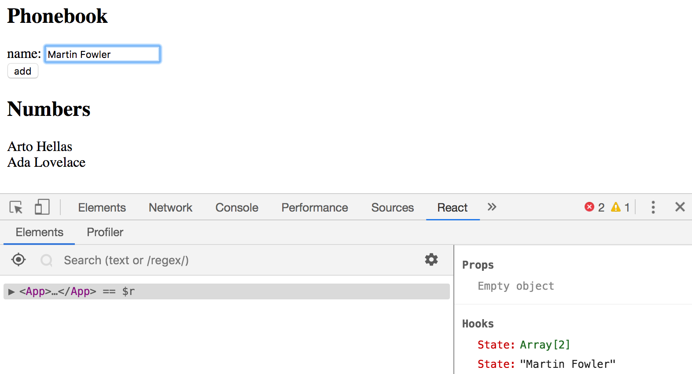
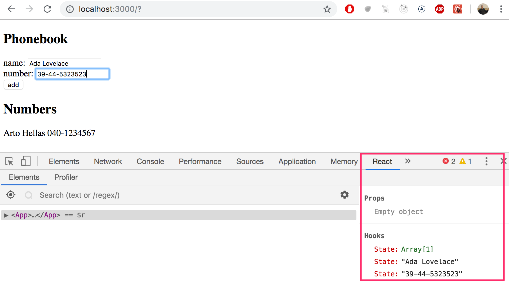

<div class="content">

Continuons à développer notre application en permettant aux utilisateurs d'ajouter de nouvelles notes. Vous pouvez trouver le code de l'application actuelle [ici](https://github.com/fullstack-hy2020/part2-notes/tree/part2-1).

Afin que notre page soit mise à jour lorsque de nouvelles notes sont ajoutées, il est préférable de stocker les notes dans l'état du composant <i>App</i>. Importons la fonction [useState](https://reactjs.org/docs/hooks-state.html) et utilisons-la pour définir un élément d'état qui est initialisé avec le tableau de notes initial transmis dans les accessoires.

```js
import { useState } from 'react' // highlight-line
import Note from './components/Note'

const App = (props) => { // highlight-line
  const [notes, setNotes] = useState(props.notes) // highlight-line

  return (
    <div>
      <h1>Notes</h1>
      <ul>
        {notes.map(note => 
          <Note key={note.id} note={note} />
        )}
      </ul>
    </div>
  )
}

export default App 
```

Le composant utilise la fonction <em>useState</em> pour initialiser l'élément d'état stocké dans <em>notes</em> avec le tableau de notes passé dans les accessoires :

```js
const App = (props) => { 
  const [notes, setNotes] = useState(props.notes) 

  // ...
}
```

Si nous voulions commencer avec une liste vide de notes, nous définirions la valeur initiale comme un tableau vide, et puisque les accessoires ne seraient pas utilisés, nous pourrions omettre le paramètre <em>props</em> de la définition de la fonction :

```js
const App = () => { 
  const [notes, setNotes] = useState([]) 

  // ...
}  
```

Restons avec la valeur initiale transmise dans les props pour le moment.

Ensuite, ajoutons un [formulaire](https://developer.mozilla.org/en-US/docs/Learn/HTML/Forms) HTML au composant qui sera utilisé pour ajouter de nouvelles notes.

```js
const App = (props) => {
  const [notes, setNotes] = useState(props.notes)

// highlight-start 
  const addNote = (event) => {
    event.preventDefault()
    console.log('button clicked', event.target)
  }
  // highlight-end   

  return (
    <div>
      <h1>Notes</h1>
      <ul>
        {notes.map(note => 
          <Note key={note.id} note={note} />
        )}
      </ul>
      // highlight-start 
      <form onSubmit={addNote}>
        <input />
        <button type="submit">save</button>
      </form>   
      // highlight-end   
    </div>
  )
}
```

Nous avons ajouté la fonction _addNote_ en tant que event handler à l'élément du formulaire qui sera appelé lors de la soumission du formulaire, le click sur le bouton Soumettre.

Nous utilisons la méthode décrite dans la [partie 1](/fr/part1/etat_des_composants_gestionnaires_devenements#gestion-des-evenements) pour définir notre gestionnaire d'événements :

```js
const addNote = (event) => {
  event.preventDefault()
  console.log('button clicked', event.target)
}
```

Le paramètre <em>event</em> est l'[évènement](https://reactjs.org/docs/handling-events.html) qui déclenche l'appel de la fonction de gestion d'événements :


Le gestionnaire d'événements appelle immédiatement la méthode <em>event.preventDefault()</em>, qui empêche l'action par défaut de soumettre un formulaire. L'action par défaut entraînerait [entre autres](https://developer.mozilla.org/en-US/docs/Web/API/HTMLFormElement/submit_event) la page à recharger.


La cible de l'événement stocké dans event.target est consignée dans la console :


La cible dans ce cas est le formulaire que nous avons défini dans notre composant.

Comment accède-t-on aux données contenues dans l'élément <i>input</i> du formulaire ?

### Composant contrôlé

Il y a plusieurs façons d'accomplir ceci; la première méthode que nous allons examiner consiste à utiliser ce que l'on appelle des [composants contrôlés](https://reactjs.org/docs/forms.html#controlled-components).

Ajoutons un nouvel élément d'état appelé <em>newNote</em> pour stocker l'entrée soumise par l'utilisateur **et** définissons-le comme la <i>valeur</i> de l'élément <i>input</i> attribut:

```js
const App = (props) => {
  const [notes, setNotes] = useState(props.notes)
  // highlight-start
  const [newNote, setNewNote] = useState(
    'a new note...'
  ) 
  // highlight-end

  const addNote = (event) => {
    event.preventDefault()
    console.log('button clicked', event.target)
  }

  return (
    <div>
      <h1>Notes</h1>
      <ul>
        {notes.map(note => 
          <Note key={note.id} note={note} />
        )}
      </ul>
      <form onSubmit={addNote}>
        <input value={newNote} /> //highlight-line
        <button type="submit">save</button>
      </form>   
    </div>
  )
}
```

Le texte d'espace réservé stocké comme valeur initiale de l'état <em>newNote</em> apparaît dans l'élément <i>input</i>, mais le texte d'entrée ne peut pas être modifié. La console affiche un avertissement qui nous donne une idée de ce qui ne va pas :


Étant donné que nous avons attribué une partie de l'état du composant <i>App</i> en tant qu'attribut <i>value</i> de l'élément d'entrée, le composant <i>App</i> [contrôle](https://reactjs.org/docs/forms.html#controlled-components) maintenant le comportement de l'élément d'entrée.

Afin de permettre l'édition de l'élément d'entrée, nous devons enregistrer un <i>gestionnaire d'événements</i> qui synchronise les modifications apportées à l'entrée avec l'état du composant :

```js
const App = (props) => {
  const [notes, setNotes] = useState(props.notes)
  const [newNote, setNewNote] = useState(
    'a new note...'
  ) 

  // ...

// highlight-start
  const handleNoteChange = (event) => {
    console.log(event.target.value)
    setNewNote(event.target.value)
  }
// highlight-end

  return (
    <div>
      <h1>Notes</h1>
      <ul>
        {notes.map(note => 
          <Note key={note.id} note={note} />
        )}
      </ul>
      <form onSubmit={addNote}>
        <input
          value={newNote}
          onChange={handleNoteChange} // highlight-line
        />
        <button type="submit">save</button>
      </form>   
    </div>
  )
}
```

Nous avons maintenant enregistré un gestionnaire d'événements pour l'attribut <i>onChange</i> de l'élément <i>input</i> du formulaire :

```js
<input
  value={newNote}
  onChange={handleNoteChange}
/>
```

Le gestionnaire d'événements est appelé chaque fois qu'<i>un changement se produit dans l'élément d'entrée</i>. La fonction de gestionnaire d'événements reçoit l'objet <em>événement</em> comme paramètre:

```js
const handleNoteChange = (event) => {
  console.log(event.target.value)
  setNewNote(event.target.value)
}
```

La propriété <em>target</em> de l'objet événement correspond maintenant à l'élément <i>input</i> contrôlé, et <em>event.target.value</em> fait référence à la valeur d'entrée de cet élément .

Notez que nous n'avons pas eu besoin d'appeler la méthode _event.preventDefault()_ comme nous l'avons fait dans le gestionnaire d'événements <i>onSubmit</i>. En effet, aucune action par défaut ne se produit lors d'un changement d'entrée, contrairement à une soumission de formulaire.

Vous pouvez suivre dans la console pour voir comment le gestionnaire d'événements est appelé :


Vous avez pensé à installer [React devtools](https://chrome.google.com/webstore/detail/react-developer-tools/fmkadmapgofadopljbjfkapdkoienihi), n'est-ce pas ? Bien. Vous pouvez voir directement comment l'état change depuis l'onglet React Devtools :


Maintenant, l'état <em>newNote</em> du composant <i>App</i> reflète la valeur actuelle de l'entrée, ce qui signifie que nous pouvons compléter la fonction <em>addNote</em> pour créer de nouvelles notes :

```js
const addNote = (event) => {
  event.preventDefault()
  const noteObject = {
    content: newNote,
    date: new Date().toISOString(),
    important: Math.random() < 0.5,
    id: notes.length + 1,
  }

  setNotes(notes.concat(noteObject))
  setNewNote('')
}
```

Tout d'abord, nous créons un nouvel objet pour la note appelée <em>noteObject</em> qui recevra son contenu de l'état <em>newNote</em> du composant. L'identifiant unique <i>id</i> est généré en fonction du nombre total de notes. Cette méthode fonctionne pour notre application puisque les notes ne sont jamais supprimées. Avec l'aide de la fonction <em>Math.random()</em>, notre note a 50 % de chances d'être marquée comme importante.

La nouvelle note est ajoutée à la liste des notes à l'aide de la méthode [concat](https://developer.mozilla.org/en-US/docs/Web/JavaScript/Reference/Global_Objects/Array/concat), introduite dans la [partie 1](/fr/part1/java_script#tableaux):

```js
setNotes(notes.concat(noteObject))
```

La méthode ne modifie pas le tableau <em>notes</em> d'origine, mais crée plutôt <i>une nouvelle copie du tableau avec le nouvel élément ajouté à la fin</i>. Ceci est important car nous ne devons [jamais muter l'état directement](https://reactjs.org/docs/state-and-lifecycle.html#using-state-correctly) dans React !

Le gestionnaire d'événements réinitialise également la valeur de l'élément d'entrée contrôlé en appelant la fonction <em>setNewNote</em> de l'état <em>newNote</em> :

```js
setNewNote('')
```

Vous pouvez trouver le code de notre application actuelle dans son intégralité sur la branche <i>part2-2</i> de [ce référentiel GitHub](https://github.com/fullstack-hy2020/part2-notes/tree/partie2-2).

### Filtrage des éléments affichés

Ajoutons quelques nouvelles fonctionnalités à notre application qui nous permettrons de visualiser uniquement les notes importantes.

Ajoutons un élément d'état au composant <i>App</i> qui garde une trace des notes à afficher :

```js
const App = (props) => {
  const [notes, setNotes] = useState(props.notes) 
  const [newNote, setNewNote] = useState('')
  const [showAll, setShowAll] = useState(true) // highlight-line
  
  // ...
}
```

Modifions le composant afin qu'il stocke une liste de toutes les notes à afficher dans la variable <em>notesToShow</em>. Les éléments de la liste dépendent de l'état du composant :

```js
import { useState } from 'react'
import Note from './components/Note'

const App = (props) => {
  const [notes, setNotes] = useState(props.notes)
  const [newNote, setNewNote] = useState('') 
  const [showAll, setShowAll] = useState(true)

  // ...

// highlight-start
  const notesToShow = showAll
    ? notes
    : notes.filter(note => note.important === true)
// highlight-end

  return (
    <div>
      <h1>Notes</h1>
      <ul>
        {notesToShow.map(note => // highlight-line
          <Note key={note.id} note={note} />
        )}
      </ul>
      // ...
    </div>
  )
}
```

La définition de la variable <em>notesToShow</em> est plutôt compacte :

```js
const notesToShow = showAll
  ? notes
  : notes.filter(note => note.important === true)
```

La définition utilise l'opérateur [conditionnel](https://developer.mozilla.org/en-US/docs/Web/JavaScript/Reference/Operators/Conditional_Operator) également présent dans de nombreux autres langages de programmation.

L'opérateur fonctionne comme suit. Si nous avons:

```js
const result = condition ? val1 : val2
```

la variable <em>résultat</em> sera définie sur la valeur de <em>val1</em> si la <em>condition</em> est vraie. Si <em>condition</em> est fausse, la variable <em>result</em> sera définie sur la valeur de <em>val2</em>.

Si la valeur de <em>showAll</em> est false, la variable <em>notesToShow</em> sera affectée à une liste qui ne contient que des notes dont la propriété <em>important</em> est définie sur true . Le filtrage est effectué à l'aide de la méthode array [filter](https://developer.mozilla.org/en-US/docs/Web/JavaScript/Reference/Global_Objects/Array/filter) :

```js
notes.filter(note => note.important === true)
```

L'opérateur de comparaison est en fait redondant, puisque la valeur de <em>note.important</em> est soit <i>true</i> soit <i>false</i>, ce qui signifie qu'on peut simplement écrire :

```js
notes.filter(note => note.important)
```

La raison pour laquelle nous avons d'abord montré l'opérateur de comparaison était de souligner un détail important : en JavaScript, <em>val1 == val2</em> ne fonctionne pas comme prévu dans toutes les situations et il est plus sûr d'utiliser <em>val1 === val2</em> exclusivement dans les comparaisons. Vous pouvez en savoir plus sur le sujet [ici](https://developer.mozilla.org/en-US/docs/Web/JavaScript/Equality_comparisons_and_sameness).

Vous pouvez tester la fonctionnalité de filtrage en modifiant la valeur initiale de l'état <em>showAll</em>.

Ensuite, ajoutons une fonctionnalité qui permet aux utilisateurs de basculer l'état <em>showAll</em> de l'application à partir de l'interface utilisateur.

Les changements pertinents sont indiqués ci-dessous :

```js
import { useState } from 'react' 
import Note from './components/Note'

const App = (props) => {
  const [notes, setNotes] = useState(props.notes) 
  const [newNote, setNewNote] = useState('')
  const [showAll, setShowAll] = useState(true)

  // ...

  return (
    <div>
      <h1>Notes</h1>
// highlight-start      
      <div>
        <button onClick={() => setShowAll(!showAll)}>
          show {showAll ? 'important' : 'all' }
        </button>
      </div>
// highlight-end            
      <ul>
        {notesToShow.map(note =>
          <Note key={note.id} note={note} />
        )}
      </ul>
      // ...    
    </div>
  )
}
```


Les notes affichées (toutes versus importantes) sont contrôlées par un bouton. Le gestionnaire d'événements pour le bouton est si simple qu'il a été défini directement dans l'attribut de l'élément bouton. Le gestionnaire d'événements fait passer la valeur de _showAll_ de true à false et vice versa :

```js
() => setShowAll(!showAll)
```

Le texte du bouton dépend de la valeur de l'état <em>showAll</em> :

```js
show {showAll ? 'important' : 'all'}
```

Vous pouvez trouver le code de l'application actuelle dans son intégralité sur la branche <i>part2-3</i> de [ce référentiel GitHub](https://github.com/fullstack-hy2020/part2-notes/tree/partie2-3).
</div>

<div class="tasks">

<h3>Exercices 2.6.-2.10.</h3>

Nous commencerons à partir du premier exercice à travailler sur une application qui sera développée plus en détail dans les exercices suivants. Dans les ensembles d'exercices connexes, il suffit de renvoyer la version finale de votre application. Vous pouvez également faire un commit séparé après avoir terminé chaque partie de l'ensemble d'exercices, mais cela n'est pas obligatoire.

**ATTENTION** create-react-app transformera automatiquement votre projet en un référentiel git à moins que vous ne créiez votre application dans un référentiel git existant. Il est probable que vous **ne vouliez pas** que votre projet soit un référentiel, alors exécutez simplement la commande _rm -rf .git_ à la racine de votre application.

<h4>2.6 : phonebook, étape1</h4>

Créons un répertoire téléphonique simple. <i>**Dans cette partie, nous n'ajouterons que des noms au répertoire.**</i>

Commençons par implémenter l'ajout d'une personne au répertoire.

Vous pouvez utiliser le code ci-dessous comme point de départ pour le composant <i>App</i> de votre application :

```js
import { useState } from 'react'

const App = () => {
  const [persons, setPersons] = useState([
    { name: 'Arto Hellas' }
  ]) 
  const [newName, setNewName] = useState('')

  return (
    <div>
      <h2>Phonebook</h2>
      <form>
        <div>
          name: <input />
        </div>
        <div>
          <button type="submit">add</button>
        </div>
      </form>
      <h2>Numbers</h2>
      ...
    </div>
  )
}

export default App
```

L'état <em>newName</em> est destiné à contrôler l'élément d'entrée du formulaire.

Parfois, il peut être utile de rendre l'état et d'autres variables sous forme de texte à des fins de débogage. Vous pouvez temporairement ajouter l'élément suivant au composant rendu :

```
<div>debug: {newName}</div>
```

Il est également important de mettre à profit ce que nous avons appris dans le chapitre [debugging React applications](/en/part1/a_more_complex_state_debugging_react_apps) de la première partie. L'extension [React developer tools](https://chrome.google.com/webstore/detail/react-developer-tools/fmkadmapgofadopljbjfkapdkoienihi) est particulièrement utile pour suivre les changements qui se produisent dans l'état de l'application.

Après avoir terminé cet exercice, votre application devrait ressembler à ceci :



Notez l'utilisation de l'extension des outils de développement React dans l'image ci-dessus !

**NB:**

- vous pouvez utiliser le nom de la personne comme valeur de la propriété <i>key</i>
- n'oubliez pas d'empêcher l'action par défaut lors de la soumission des formulaires HTML !

<h4>2.7: phonebook, étape2</h4>

Empêcher l'utilisateur d'ajouter des noms qui existent déjà dans le répertoire. Les tableaux JavaScript ont de nombreuses [méthodes](https://developer.mozilla.org/en-US/docs/Web/JavaScript/Reference/Global_Objects/Array) appropriées pour accomplir cette tâche. Gardez à l'esprit [comment fonctionne l'égalité des objets](https://www.joshbritz.co/posts/why-its-so-hard-to-check-object-equality/) en Javascript.

Émettez un avertissement avec la commande [alert](https://developer.mozilla.org/en-US/docs/Web/API/Window/alert) lorsqu'une telle action est tentée :


**Astuce :** lorsque vous formez des chaînes contenant des valeurs à partir de variables, il est recommandé d'utiliser une [chaîne de modèle](https://developer.mozilla.org/en-US/docs/Web/JavaScript/Reference/Template_literals):

```js
`${newName} is already added to phonebook`
```

Si la variable <em>newName</em> contient la valeur <i>Arto Hellas</i>, l'expression de chaîne de modèle renvoie la chaîne

```js
`Arto Hellas is already added to phonebook`
```

La même chose pourrait être faite d'une manière plus semblable à Java en utilisant l'opérateur plus :

```js
newName + ' is already added to phonebook'
```

L'utilisation de chaînes de modèle est l'option la plus idiomatique et le signe d'un vrai professionnel de JavaScript.

<h4>2.8: phonebook, étape3</h4>

Développez votre application en permettant aux utilisateurs d'ajouter des numéros de téléphone au répertoire téléphonique. Vous devrez ajouter un deuxième élément <i>input</i> au formulaire (avec son propre gestionnaire d'événements) :

```js
<form>
  <div>name: <input /></div>
  <div>number: <input /></div>
  <div><button type="submit">add</button></div>
</form>
```

À ce stade, l'application pourrait ressembler à ceci. L'image affiche également l'état de l'application à l'aide des [outils de développement React](https://chrome.google.com/webstore/detail/react-developer-tools/fmkadmapgofadopljbjfkapdkoienihi) :



<h4>2.9*: phonebook, étape4</h4>

Implémentez un champ de recherche qui peut être utilisé pour filtrer la liste des personnes par nom :


Vous pouvez implémenter le champ de recherche en tant qu'élément <i>input</i> placé en dehors du formulaire HTML. La logique de filtrage affichée dans l'image est <i>insensible à la casse</i>, ce qui signifie que le terme de recherche <i>arto</i> renvoie également des résultats contenant Arto avec un A majuscule.


**NB :** Lorsque vous travaillez sur de nouvelles fonctionnalités, il est souvent utile de "coder en dur" certaines données factices dans votre application, par ex.

```js
const App = () => {
  const [persons, setPersons] = useState([
    { name: 'Arto Hellas', number: '040-123456', id: 1 },
    { name: 'Ada Lovelace', number: '39-44-5323523', id: 2 },
    { name: 'Dan Abramov', number: '12-43-234345', id: 3 },
    { name: 'Mary Poppendieck', number: '39-23-6423122', id: 4 }
  ])

  // ...
}
```

Cela vous évite d'avoir à entrer manuellement des données dans votre application pour tester votre nouvelle fonctionnalité.

<h4>2.10: phonebook étape5</h4>

Si vous avez implémenté votre application dans un seul composant, refactorisez-le en extrayant les parties appropriées dans de nouveaux composants. Conservez l'état de l'application et tous les gestionnaires d'événements dans le composant racine <i>App</i>.

Il suffit d'extraire <i>**trois**</i> composants de l'application. De bons candidats pour des composants séparés sont, par exemple, le filtre de recherche, le formulaire d'ajout de nouvelles personnes dans l'annuaire, un composant qui affiche toutes les personnes de l'annuaire et un composant qui affiche les détails d'une seule personne.

Le composant racine de l'application pourrait ressembler à ceci après la refactorisation. Le composant racine refactorisé ci-dessous n'affiche que les titres et laisse les composants extraits s'occuper du reste.

```js
const App = () => {
  // ...

  return (
    <div>
      <h2>Phonebook</h2>

      <Filter ... />

      <h3>Add a new</h3>

      <PersonForm ... />

      <h3>Numbers</h3>

      <Persons ... />
    </div>
  )
}
```

**NB** : Vous risquez de rencontrer des problèmes dans cet exercice si vous définissez vos composants "au mauvais endroit". Ce serait le bon moment pour revoir
le chapitre de la dernière partie, [ne pas définir de composants dans des composants](/fr/part1/plongez_dans_le_debogage_dapplications_react#ne-pas-definir-de-composants-dans-les-composants).

</div>
