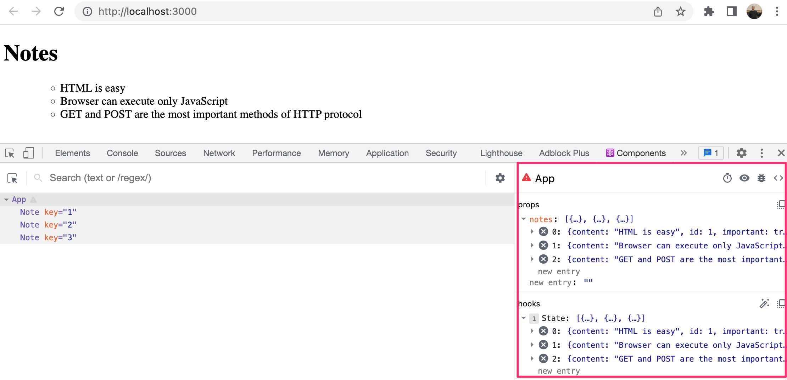

<div class="content">

Vamos continuar expandindo nossa aplicação permitindo que os usuários adicionem novas notas. Você pode encontrar o código para nossa aplicação atual [aqui](https://github.com/fullstack-hy2020/part2-notes/tree/part2-1).

Para que a página seja atualizada quando novas notas são adicionadas, armazene as notas no estado do componente <i>App</i>. Vamos importar a função [useState](https://reactjs.org/docs/hooks-state.html) e usá-la para definir um pedaço de estado que é inicializado com o array das notas iniciais passado nas props.

```js
import { useState } from 'react' // highlight-line
import Note from './components/Note'

const App = (props) => { // highlight-line
  const [notes, setNotes] = useState(props.notes) // highlight-line

  return (
    <div>
      <h1>Notes</h1>
      <ul>
        {notes.map(note => 
          <Note key={note.id} note={note} />
        )}
      </ul>
    </div>
  )
}

export default App 
```

O componente usa a função <em>useState</em> para inicializar o pedaço de estado armazenado em <em>notes</em> com o array de notas passado nas props:

```js
const App = (props) => { 
  const [notes, setNotes] = useState(props.notes) 

  // ...
}
```

Também podemos usar o "React Developer Tools" para ver o que realmente está acontecendo:



Se quiséssemos inicializá-la com uma lista vazia de notas, definiríamos o valor inicial como um array vazio e, como as props não seriam utilizadas, poderíamos omitir o parâmetro <em>props</em> da definição da função:

```js
const App = () => { 
  const [notes, setNotes] = useState([]) 

  // ...
}  
```

Vamos manter o valor inicial passado nas props por agora.

Em seguida, vamos adicionar um [formulário HTML](https://developer.mozilla.org/en-US/docs/Learn/HTML/Forms) (form) ao componente que será usado para adicionar novas notas.

```js
const App = (props) => {
  const [notes, setNotes] = useState(props.notes)

// highlight-start 
  const addNote = (event) => {
    event.preventDefault()
    console.log('button clicked', event.target)
  }
  // highlight-end   

  return (
    <div>
      <h1>Notes</h1>
      <ul>
        {notes.map(note => 
          <Note key={note.id} note={note} />
        )}
      </ul>
      // highlight-start 
      <form onSubmit={addNote}>
        <input />
        <button type="submit">save</button>
      </form>   
      // highlight-end   
    </div>
  )
}
```

Adicionamos a função _addNote_ como um gerenciador de evento ao elemento de formulário que será chamado quando o formulário for enviado, clicando no botão de envio <i>save</i>.

Usamos o método discutido na [Parte 1](/en/part1/component_state_event_handlers#event-handling) para definir nosso gerenciador de evento:

```js
const addNote = (event) => {
  event.preventDefault()
  console.log('button clicked', event.target)
}
```

O parâmetro <em>event</em> é o [evento](https://reactjs.org/docs/handling-events.html) que aciona a chamada para a função gerenciadora de evento:

O gerenciador de evento chama imediatamente o método <em>event.preventDefault()</em>, o que "impede a ação padrão" de enviar um formulário. A ação padrão causaria, [entre outras coisas](https://developer.mozilla.org/en-US/docs/Web/API/HTMLFormElement/submit_event), o recarregamento da página.

O alvo (target) do evento armazenado em _event.target_ é registrado no console:


O <i>target</i> neste caso é o formulário que definimos em nosso componente.

Como acessamos os dados armazenados no elemento <i>input</i> do formulário?

### Um componente controlado

Existem muitas maneiras de fazer isso: o primeiro método que vamos utilizar é através do uso de componentes [controlados](https://reactjs.org/docs/forms.html#controlled-components) (controlled components).

Vamos adicionar um novo pedaço de estado chamado <em>newNote</em> para armazenar a entrada fornecida pelo usuário **e** vamos defini-lo como o atributo <i>value</i> do elemento <i>input</i> (entrada):

```js
const App = (props) => {
  const [notes, setNotes] = useState(props.notes)
  // highlight-start
  const [newNote, setNewNote] = useState(
    'a new note...'
  ) 
  // highlight-end

  const addNote = (event) => {
    event.preventDefault()
    console.log('button clicked', event.target)
  }

  return (
    <div>
      <h1>Notes</h1>
      <ul>
        {notes.map(note => 
          <Note key={note.id} note={note} />
        )}
      </ul>
      <form onSubmit={addNote}>
        <input value={newNote} /> //highlight-line
        <button type="submit">save</button>
      </form>   
    </div>
  )
}
```

O texto do espaço reservado armazenado como o valor inicial do estado <em>newNote</em> aparece no elemento <i>input</i>, mas o texto de entrada (input text) não é editável. O console exibe um aviso que nos dá uma dica do que pode estar errado:


A partir do momento em que atribuímos um pedaço do estado do componente <i>App</i> como o atributo <i>value</i> do elemento de entrada (input element), o componente <i>App</i> passou a controlar o comportamento do elemento de entrada.

Para habilitar a edição do elemento de entrada, precisamos registrar um <i>gerenciador de evento</i> que sincroniza as mudanças feitas na entrada com o estado do componente:

```js
const App = (props) => {
  const [notes, setNotes] = useState(props.notes)
  const [newNote, setNewNote] = useState(
    'a new note...'
  ) 

  // ...

// highlight-start
  const handleNoteChange = (event) => { 
    console.log(event.target.value)
    setNewNote(event.target.value)
  }
// highlight-end

  return (
    <div>
      <h1>Notes</h1>
      <ul>
        {notes.map(note => 
          <Note key={note.id} note={note} />
        )}
      </ul>
      <form onSubmit={addNote}>
        <input
          value={newNote}
          onChange={handleNoteChange} // highlight-line
        />
        <button type="submit">save</button>
      </form>   
    </div>
  )
}
```

Agora registramos um gerenciador de evento para o atributo <i>onChange</i> do elemento <i>input</i> do formulário:

```js
<input
  value={newNote}
  onChange={handleNoteChange}
/>
```

O gerenciador de evento é chamado toda vez que <i>ocorre uma mudança no elemento de entrada</i>. A função do gerenciador de evento recebe o objeto de evento como seu parâmetro <em>event</em>:

```js
const handleNoteChange = (event) => {
  console.log(event.target.value)
  setNewNote(event.target.value)
}
```

A propriedade <em>target</em> do objeto "event" agora corresponde ao elemento de entrada controlado, e <em>event.target.value</em> se refere ao valor (value) de entrada desse elemento.

Observe que não precisamos chamar o método _event.preventDefault()_ como fizemos no gerenciador de evento <i>onSubmit</i>. Isso ocorre porque não há uma ação padrão em uma mudança de entrada, ao contrário do que ocorre em um envio de formulário.

É possível acompanhar no console como o gerenciador de evento é chamado:


Você se lembrou de instalar o [React devtools](https://chrome.google.com/webstore/detail/react-developer-tools/fmkadmapgofadopljbjfkapdkoienihi) (Ferramentas do Desenvolvedor React), certo? Ótimo. Você pode ver diretamente como o estado muda na guia "Componentes":


Agora, o estado <em>newNote</em> do componente <i>App</i> reflete o valor atual do elemento de entrada, o que significa que podemos completar a função <em>addNote</em> para criar novas notas:

```js
const addNote = (event) => {
  event.preventDefault()
  const noteObject = {
    content: newNote,
    important: Math.random() < 0.5,
    id: notes.length + 1,
  }

  setNotes(notes.concat(noteObject))
  setNewNote('')
}
```

Primeiramente, criamos um novo objeto para a nota (variável que cria as notas com suas propriedades) chamada <em>noteObject</em> que receberá seu conteúdo do estado <em>newNote</em> do componente. O identificador único <i>id</i> é gerado com base no número total de notas. Este método funciona para a nossa aplicação, já que as nossas notas nunca são excluídas. Com a ajuda da função <em>Math.random()</em>, a nossa nota tem 50% de chance de ser marcada como importante.

A nova nota é adicionada à lista de notas usando o método de array [concat](https://developer.mozilla.org/en-US/docs/Web/JavaScript/Reference/Global_Objects/Array/concat), apresentado na [Parte 1](/ptbr/part1/java_script#arrays):

```js
setNotes(notes.concat(noteObject))
```

O método não muda o array original <em>notes</em>, porém, cria <i>uma nova cópia do array com o novo item adicionado ao final</i>. Isso é importante, já que nós [nunca devemos mudar diretamente o estado](https://reactjs.org/docs/state-and-lifecycle.html#using-state-correctly) em React!

O gerenciador de evento também limpa o valor do elemento de entrada controlado chamando a função <em>setNewNote</em> do estado <em>newNote</em>:

```js
setNewNote('')
```

É possível encontrar o código atual completo da nossa aplicação na branch <i>part2-2</i> [neste repositório do GitHub](https://github.com/fullstack-hy2020/part2-notes/tree/part2-2).

### Filtrando os elementos exibidos

Vamos adicionar algumas novas funcionalidades à nossa aplicação que nos permitam visualizar apenas as notas importantes.

Vamos adicionar um estado ao componente <i>App</i> que vai manter o registro das notas que devem ser exibidas:

```js
const App = (props) => {
  const [notes, setNotes] = useState(props.notes) 
  const [newNote, setNewNote] = useState('')
  const [showAll, setShowAll] = useState(true) // highlight-line

  // ...
}
```

Modifiquemos o componente para que ele armazene uma lista de todas as notas a serem exibidas na variável <em>notesToShow</em>. Os itens na lista dependem do estado do componente:

```js
import { useState } from 'react'
import Note from './components/Note'

const App = (props) => {
  const [notes, setNotes] = useState(props.notes)
  const [newNote, setNewNote] = useState('') 
  const [showAll, setShowAll] = useState(true)

  // ...

// highlight-start
  const notesToShow = showAll
    ? notes
    : notes.filter(note => note.important === true)
// highlight-end

  return (
    <div>
      <h1>Notes</h1>
      <ul>
        {notesToShow.map(note => // highlight-line
          <Note key={note.id} note={note} />
        )}
      </ul>
      // ...
    </div>
  )
}
```

A definição da variável <em>notesToShow</em> é bastante compacta:

```js
const notesToShow = showAll
  ? notes
  : notes.filter(note => note.important === true)
```

A definição utiliza o operador [condicional](https://developer.mozilla.org/en-US/docs/Web/JavaScript/Reference/Operators/Conditional_Operator) (ou operador ternário) encontrado também em muitas outras linguagens de programação.

O operador funciona da seguinte maneira. Se tivermos

```js
const result = condition ? val1 : val2
```

a variável <em>result</em> será definida com o valor de <em>val1</em> se <em>condition</em> for verdadeiro. Se <em>condition</em> for falso, a variável <em>result</em> será definida com o valor de <em>val2</em>.

Se o valor de <em>showAll</em> for falso, a variável <em>notesToShow</em> será atribuída a uma lista que contém somente as notas que possuem a propriedade <em>important</em> definida como verdadeira. A filtragem é feita com a ajuda do método de array [filter](https://developer.mozilla.org/en-US/docs/Web/JavaScript/Reference/Global_Objects/Array/filter) (filtrar):

```js
notes.filter(note => note.important === true)
```

O operador ternário é redundante aqui, já que o valor de <em>note.important</em> é verdadeiro ou falso, o que significa que podemos simplesmente escrever:

```js
notes.filter(note => note.important)
```

A razão de mostrarmos o operador de comparação primeiro foi para enfatizar um detalhe importante: em JavaScript, <em>val1 == val2</em> não funciona como esperado em todas as situações e é mais seguro usar <em>val1 === val2</em> exclusivamente em comparações. Leia mais sobre o assunto [aqui](https://developer.mozilla.org/en-US/docs/Web/JavaScript/Equality_comparisons_and_sameness).

É possível testar a funcionalidade de filtragem mudando o valor inicial do estado <em>showAll</em>.

Em seguida, vamos adicionar a funcionalidade que permite aos usuários alternar o estado <em>showAll</em> da aplicação a partir da interface de usuário (GUI).

As alterações relevantes são mostradas abaixo:

```js
import { useState } from 'react' 
import Note from './components/Note'

const App = (props) => {
  const [notes, setNotes] = useState(props.notes) 
  const [newNote, setNewNote] = useState('')
  const [showAll, setShowAll] = useState(true)

  // ...

  return (
    <div>
      <h1>Notes</h1>
// highlight-start      
      <div>
        <button onClick={() => setShowAll(!showAll)}>
          show {showAll ? 'important' : 'all' }
            
        </button>
      </div>
// highlight-end            
      <ul>
        {notesToShow.map(note =>
          <Note key={note.id} note={note} />
        )}
      </ul>
      // ...    
    </div>
  )
}
```

As notas exibidas ("all" versus "important") são controladas com um botão. O gerenciador de evento do botão é tão simples que foi definido diretamente no atributo do elemento do botão. O gerenciador de evento alterna o valor de _showAll_ de verdadeiro para falso e vice-versa:

```js
() => setShowAll(!showAll)
```

O texto do botão depende do valor do estado <em>showAll</em>:

```js
show {showAll ? 'important' : 'all'}
```

Você pode encontrar o código da nossa aplicação atual na íntegra na branch <i>part2-3</i> [neste repositório GitHub](https://github.com/fullstack-hy2020/part2-notes/tree/part2-3).
</div>

<div class="tasks">

<h3>Exercícios 2.6 a 2.10</h3>

Em nosso primeiro exercício, vamos começar a trabalhar em uma aplicação que será desenvolvida mais tarde em exercícios subsequentes. Em exercícios que fazem parte de conjuntos relacionados, é mais que suficiente retornar a versão final da sua aplicação. Você também pode fazer um commit separado depois de ter terminado cada parte do conjunto de exercícios, mas isso não é obrigatório.

**AVISO**: "create-react-app" transformará automaticamente seu projeto em um repositório git, a menos que você crie sua aplicação dentro de um repositório git já existente.**Você muito provavelmente não quer que cada um de seus projetos seja um repositório separado**, então basta executar o comando _rm -rf .git_ na raiz de sua aplicação para aplicar as modificações.

<h4>2.6: The Phonebook — 1º passo</h4>

Vamos criar uma lista telefônica bem simples. <i>**Nesta parte, vamos adicionar apenas nomes à lista telefônica.**</i>

Vamos começar implementando a funcionalidade que adiciona uma pessoa à lista telefônica.

Você pode usar o código abaixo como ponto de partida para o componente <i>App</i> da sua aplicação:

```js
import { useState } from 'react'

const App = () => {
  const [persons, setPersons] = useState([
    { name: 'Arto Hellas' }
  ]) 
  const [newName, setNewName] = useState('')

  return (
    <div>
      <h2>Phonebook</h2>
      <form>
        <div>
          name: <input />
        </div>
        <div>
          <button type="submit">add</button>
        </div>
      </form>
      <h2>Numbers</h2>
      ...
    </div>
  )
}

export default App
```

O estado <em>newName</em> é destinado a controlar o elemento de entrada do formulário.

Pode ser útil renderizar o estado e outras variáveis, como texto, para fins de depuração. Você pode adicionar temporariamente o seguinte elemento ao componente renderizado:

```
<div>debug: {newName}</div>
```

Também é importante colocar em prática o que aprendemos no capítulo sobre [depuração de aplicações React](/ptbr/part1/um_estado_mais_complexo_e_depuracao_de_aplicacoes_react) da primeira parte. A extensão [React developer tools](https://chrome.google.com/webstore/detail/react-developer-tools/fmkadmapgofadopljbjfkapdkoienihi) é <i>incrivelmente</i> útil para rastrear as alterações que ocorrem no estado da aplicação.

Depois de concluir este exercício, sua aplicação deve ficar mais ou menos parecida com isto:


Atente-se ao uso da extensão "React developer tools" na imagem acima!

**Obs.:**

- Você pode usar o nome da pessoa como um valor da propriedade <i>key</i>; e
- Lembre-se de impedir a ação padrão de envio de formulários HTML (preventDefault)!

<h4>2.7: The Phonebook — 2º passo</h4>

Impeça que o usuário adicione nomes que já existam na lista telefônica. JavaScript têm inúmeros [métodos](https://developer.mozilla.org/en-US/docs/Web/JavaScript/Reference/Global_Objects/Array) adequados para realizar esta tarefa. Tenha em mente [como funciona a igualdade de objetos](https://www.joshbritz.co/posts/why-its-so-hard-to-check-object-equality/) em JavaScript.

Emita um aviso com o comando [alert](https://developer.mozilla.org/en-US/docs/Web/API/Window/alert) (alerta) quando o usuário tentar fazer isso:


<i>Tradução do alerta em tela: "Arto Hellas já foi adicionado à lista telefônica"</i>

**Dica:** ao formar strings que contêm valores de variáveis, recomenda-se usar [template strings](https://developer.mozilla.org/en-US/docs/Web/JavaScript/Reference/Template_literals):

```js
`${newName} is already added to phonebook`
```

Se a variável <em>newName</em> contiver o valor <i>Arto Hellas</i>, a expressão template string retornará a string:

```js
`Arto Hellas is already added to phonebook`
```

O mesmo pode ser feito de um "jeito mais Java" usando o operador de soma (+):

```js
newName + ' is already added to phonebook'
```

Template strings é a opção mais idiomática, além de que seu uso é o indício de um verdadeiro profissional JavaScript.

<h4>2.8: The Phonebook — 3º passo</h4>

Expanda sua aplicação permitindo que os usuários adicionem números de telefone à lista telefônica. Você precisará adicionar um segundo elemento de <i>entrada</i> (input) ao formulário (junto com seu próprio gerenciador de evento):

```js
<form>
  <div>name: <input /></div>
  <div>number: <input /></div>
  <div><button type="submit">add</button></div>
</form>
```

Neste ponto, a aplicação pode ficar mais ou menos assim. A imagem também exibe o estado da aplicação com a ajuda da ferramenta [React developer tools](https://chrome.google.com/webstore/detail/react-developer-tools/fmkadmapgofadopljbjfkapdkoienihi):


<h4>2.9*: The Phonebook — 4º passo</h4>

Implemente um campo de pesquisa que possa ser usado para filtrar a lista de pessoas por nome:


Você pode implementar o campo de pesquisa como um elemento <i>input</i> que é colocado fora do formulário HTML. A lógica de filtragem mostrada na imagem é <i>case insensitive</i>, o que significa que se você pesquisar por <i>arto</i>, também há o retorno de resultados que contêm "Arto" com o A maiúsculo.

**Obs.:** Quando se está trabalhando em uma nova funcionalidade, é útil inserir em sua aplicação um "código de teste" — como alguns dados fantasiosos de pessoas — desta forma:

```js
const App = () => {
  const [persons, setPersons] = useState([
    { name: 'Arto Hellas', number: '040-123456', id: 1 },
    { name: 'Ada Lovelace', number: '39-44-5323523', id: 2 },
    { name: 'Dan Abramov', number: '12-43-234345', id: 3 },
    { name: 'Mary Poppendieck', number: '39-23-6423122', id: 4 }
  ])

  // ...
}
```

Isso lhe economiza o trabalho de ter que ficar inserindo dados manualmente na sua aplicação para testar a nova funcionalidade.

<h4>2.10: The Phonebook — 5º passo</h4>

Se você implementou sua aplicação em um único componente, refatore-o extraindo e transformando as partes corretas do código em novos componentes. Mantenha o estado da aplicação e todos os gerenciadores de eventos no componente raiz <i>App</i>.

Já é suficiente extrair <i>**três**</i> componentes da aplicação. São boas opções para tornar em componentes separados, por exemplo, o filtro de pesquisa, o formulário para adicionar novas pessoas à lista telefônica, um componente que renderiza todas as pessoas da lista telefônica e um componente que renderiza os detalhes de uma única pessoa.

O componente raiz da aplicação após a refatoração pode ficar parecido com o do exemplo abaixo. O componente raiz refatorado abaixo renderiza apenas os títulos, enquanto que deixa os componentes extraídos cuidarem do resto.

```js
const App = () => {
  // ...

  return (
    <div>
      <h2>Phonebook</h2>

      <Filter ... />

      <h3>Add a new</h3>

      <PersonForm 
        ...
      />

      <h3>Numbers</h3>

      <Persons ... />
    </div>
  )
}
```

**Obs.:** Você pode ter problemas neste exercício se definir seus componentes "no lugar errado". Agora, é definitivamente uma boa ideia revisar o capítulo da seção anterior: [Não defina Componentes dentro de Componentes](/ptbr/part1/um_estado_mais_complexo_e_depuracao_de_aplicacoes_react#nao-defina-componentes-dentro-de-componentes).

</div>
