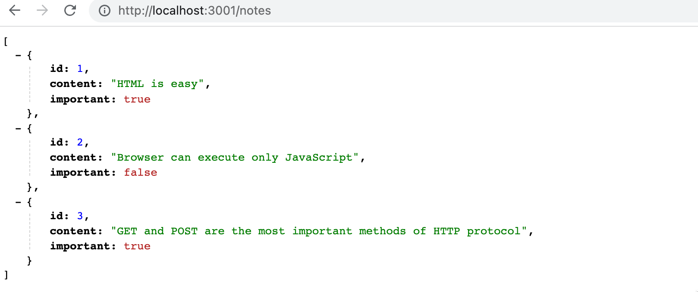
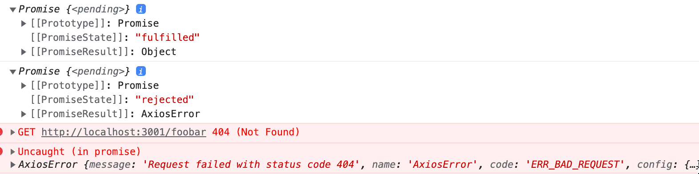
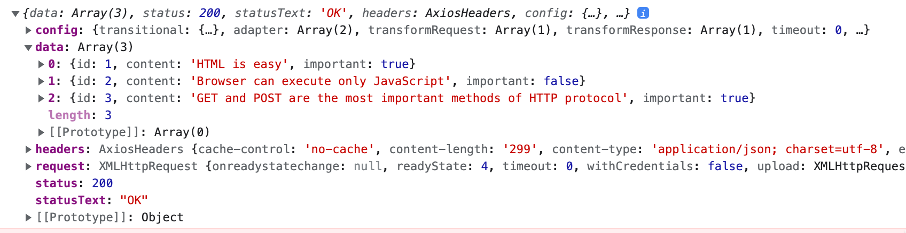

<div class="content">

Já estamos trabalhando há um tempo apenas no "front-end", ou seja, com as funcionalidades do lado do cliente (navegador). Começaremos a trabalhar no "back-end", ou seja, com as funcionalidades do lado do servidor na [Parte 3](/ptbr/part3) deste curso. Contudo, agora daremos um passo nessa direção, assim familiarizando-nos com a comunicação do código executado no navegador com o back-end.

Vamos usar uma ferramenta destinada a ser usada durante a fase de desenvolvimento de software chamada [JSON Server](https://github.com/typicode/json-server), que atuará como nosso servidor.

Crie um arquivo chamado <i>db.json</i> na raiz do diretório do projeto de notas com o seguinte conteúdo:

```json
{
  "notes": [
    {
      "id": 1,
      "content": "HTML é fácil",
      "important": true
    },
    {
      "id": 2,
      "content": "O navegador só pode executar JavaScript",
      "important": false
    },
    {
      "id": 3,
      "content": "GET e POST são os métodos mais importantes do protocolo HTTP",
      "important": true
    }
  ]
}
```

É possível [instalar](https://github.com/typicode/json-server#getting-started) globalmente um servidor JSON na sua máquina usando o comando _npm install -g json-server_. Uma instalação global requer privilégios administrativos, o que significa que não é possível fazer isso em computadores de faculdade, etc.

Após a instalação, execute o seguinte comando para executar o json-server. O <i>json-server</i> é executado na porta 3000 por padrão; porém, como projetos criados usando o "create-react-app" reservam a porta 3000 para si, devemos definir uma porta alternativa — como a porta 3001 — para o json-server. A opção <em>--watch</em> procura automaticamente por quaisquer alterações salvas no arquivo <i>db.json</i>.

```js
json-server --port 3001 --watch db.json
```

Entretanto, não é necessária uma instalação global. A partir da raiz do diretório da sua aplicação, podemos executar o <i>json-server</i> usando o comando _npx_:

```js
npx json-server --port 3001 --watch db.json
```

Vamos acessar o endereço <http://localhost:3001/notes> no navegador. Vemos que o <i>json-server</i> serve as notas que escrevemos anteriormente no arquivo em formato JSON:



Se o seu navegador não tiver um formatador para exibir os dados JSON, instale um plugin como o [JSONVue](https://chrome.google.com/webstore/detail/jsonview/chklaanhfefbnpoihckbnefhakgolnmc) para facilitar sua vida.

A partir de agora, a ideia será salvar as notas no servidor, que, neste caso, significa salvá-las no json-server. O código React busca as notas do servidor e as renderiza na tela. Sempre que uma nova nota é adicionada à aplicação, o código React também a envia ao servidor para que a nova nota persista (persist — leia mais sobre persistência de dados [aqui](https://www.take.net/blog/tecnologia/persistencia-de-dados/)) na "memória".

O json-server armazena todos os dados no arquivo <i>db.json</i>, que reside no servidor. No mundo real, os dados seriam armazenados em algum tipo de banco de dados. No entanto, o json-server é uma ferramenta muito útil que permite o uso da funcionalidade de um servidor na fase de desenvolvimento sem a necessidade de programar nenhum desses outros softwares.

Nos familiarizaremos com os princípios de implementação das funcionalidades de um servidor com mais detalhes na [parte 3](/ptbr/part3) deste curso.

### O navegador como ambiente de execução

Nossa primeira tarefa é buscar as notas já existentes em nossa aplicação React a partir do endereço <http://localhost:3001/notes>.

Na [projeto-exemplo](/ptbr/part0/fundamentos_de_aplicacoes_web#executando-a-logica-da-aplicacao-no-navegador) da Parte 0, já aprendemos uma maneira de buscar dados de um servidor usando JavaScript. O código no exemplo estava buscando os dados usando [XMLHttpRequest](https://developer.mozilla.org/en-US/docs/Web/API/XMLHttpRequest), também conhecido como uma "requisição HTTP" feita usando um objeto XHR. Esta é uma técnica introduzida em 1999, no qual todos os navegadores têm oferecido suporte a ela já faz um bom tempo.

Já não é mais recomendado o uso do objeto XHR, e a maioria dos navegadores já suportam amplamente o método [fetch](https://developer.mozilla.org/en-US/docs/Web/API/WindowOrWorkerGlobalScope/fetch) ("ir buscar" ou "buscar"), que é baseado em chamadas conhecidas como [promessas](https://developer.mozilla.org/en-US/docs/Web/JavaScript/Reference/Global_Objects/Promise) (promises), ao invés do modelo de gerenciamento de eventos utilizado pelo XHR.

Como lembrete da Parte 0 (que deve ser lembrado <i>de não ser usado</i> sem um motivo plausível), os dados foram buscados usando o XHR da seguinte maneira:

```js
const xhttp = new XMLHttpRequest()

xhttp.onreadystatechange = function () {
  if (this.readyState == 4 && this.status == 200) {
    const data = JSON.parse(this.responseText)
    // gerencia a resposta que é salva nos dados variáveis
  }
}

xhttp.open('GET', '/data.json', true)
xhttp.send()
```

Desde o início, registramos um <i>gerenciador de evento</i> ao objeto <em>xhttp</em> representando a requisição HTTP, que será chamado pelo ambiente de execução JavaScript sempre que o estado do objeto <em>xhttp</em> mudar. Se a mudança no estado significa que a resposta à requisição chegou, então os dados são lidos de acordo com o que foi estabelecido.

Vale a pena notar que o código no gerenciador de evento é definido antes da requisição ser enviada ao servidor. Mesmo assim, o código dentro do gerenciador de evento será executado em um momento posterior. Portanto, o código não executa sincronicamente "de cima para baixo", mas sim <i>assincronamente</i> (asynchronously). JavaScript chama em algum momento o gerenciador de evento que foi registrado para a requisição.

Uma forma comum de fazer requisições síncronas em Java, por exemplo, funcionaria da seguinte maneira (N.B. (Nota Bene): este código Java não funciona):

```java
HTTPRequest request = new HTTPRequest();

String url = "https://studies.cs.helsinki.fi/exampleapp/data.json";
List<Note> notes = request.get(url);

notes.forEach(m => {
  System.out.println(m.content);
});
```

Em Java, o código é executado linha a linha e é interrompido para esperar pela requisição HTTP, o que significa esperar até o comando _request.get(...)_ ser concluído. Os dados retornados pelo comando, neste caso as notas, são então armazenados em uma variável na qual podemos manipular os dados da maneira que desejarmos.

Por outro lado, os ambientes de tempo de execução JavaScript, ou "engines" (motores), seguem o [modelo assíncrono](https://developer.mozilla.org/en-US/docs/Web/JavaScript/EventLoop). Em princípio, isso requer que todas as [operações IO](https://en.wikipedia.org/wiki/Input/output) (com algumas exceções) sejam executadas como não-bloqueantes. Isso significa que a execução do código continua imediatamente após a chamada de uma função IO, sem esperar que ela termine.

Quando uma operação assíncrona é concluída, ou mais especificamente, algum tempo depois de sua conclusão, o que acontece é que o motor JavaScript chama os gerenciadores de evento registrados na operação.

Atualmente, os motores JavaScript são <i>single-threaded</i> (linha de execução única), o que significa que não podem executar código em paralelo. Como resultado, na prática, é uma exigência usar um modelo não-bloqueante para a execução de operações IO. Caso contrário, o navegador "congelaria" durante a busca de dados em um servidor, por exemplo.

Outra consequência da natureza single-threaded dos motores JavaScript é que se alguma execução de código levar muito tempo, o navegador ficará preso durante toda a execução. Se adicionássemos o seguinte código no topo de nossa aplicação...

```js
setTimeout(() => {
  console.log('loop..')
  let i = 0
  while (i < 50000000000) {
    i++
  }
  console.log('fim do loop')
}, 5000)
```

... tudo funcionaria normalmente por 5 segundos. No entanto, quando a função definida como o parâmetro para <em>setTimeout</em> é executada, o navegador fica preso durante toda a execução do longo loop. Mesmo a aba do navegador não pode ser fechada durante a execução do loop, pelo menos não no Chrome.

Para o navegador permanecer <i>responsivo</i>, ou seja, ser capaz de reagir continuamente às operações do usuário com velocidade suficiente, a lógica do código precisa ser tal que nenhuma única computação tenha de levar tanto tempo para se realizar.

Existe uma série de materiais sobre o tema disponíveis na internet. Uma apresentação particularmente clara do tópico é a palestra de Philip Roberts chamada [What the heck is the event loop anyway?](https://www.youtube.com/watch?v=8aGhZQkoFbQ) (disponível em português).

É possível executar código paralelizado nos navegadores de hoje em dia com a ajuda dos chamados [web workers](https://developer.mozilla.org/en-US/docs/Web/API/Web_Workers_API/Using_web_workers). No entanto, o loop de eventos de uma única janela do navegador ainda é realizado como [single thread](https://medium.com/techtrument/multithreading-javascript-46156179cf9a).

### npm

Vamos voltar ao assunto sobre obtenção de dados do servidor.

Poderíamos usar a função baseada em promessas [fetch](https://developer.mozilla.org/en-US/docs/Web/API/WindowOrWorkerGlobalScope/fetch), mencionada anteriormente, para puxar (pull) os dados do servidor. Fetch é uma ótima ferramenta. É padronizada e tem suporte em todos os navegadores modernos (exceto o IE [Internet Explorer]).

Dito isso, usaremos a biblioteca [axios](https://github.com/axios/axios) para fazer essa comunicação entre navegador e servidor. Ela funciona como o fetch, mas é um pouco mais agradável de se usar. Outra boa razão para usar o axios é que nos familiarizaremos com a adição de bibliotecas externas em projetos React, conhecidas como <i>pacotes npm</i> (npm packages).

Hoje em dia, praticamente todos os projetos JavaScript são definidos usando o gerenciador de pacotes do Node, conhecido como [npm](https://docs.npmjs.com/getting-started/what-is-npm) (abreviação de "Node Package Manager"). Os projetos criados usando "create-react-app" também seguem o formato npm. Um indicador claro de que um projeto usa npm é o arquivo <i>package.json</i> localizado na raiz do projeto:

```json
{
  "name": "notes-frontend",
  "version": "0.1.0",
  "private": true,
  "dependencies": {
    "@testing-library/jest-dom": "^5.16.5",
    "@testing-library/react": "^13.4.0",
    "@testing-library/user-event": "^13.5.0",
    "react": "^18.2.0",
    "react-dom": "^18.2.0",
    "react-scripts": "5.0.1",
    "web-vitals": "^2.1.4"
  },
  "scripts": {
    "start": "react-scripts start",
    "build": "react-scripts build",
    "test": "react-scripts test",
    "eject": "react-scripts eject"
  },
  "eslintConfig": {
    "extends": ["react-app", "react-app/jest"]
  },
  "browserslist": {
    "production": [">0.2%", "not dead", "not op_mini all"],
    "development": [
      "last 1 chrome version",
      "last 1 firefox version",
      "last 1 safari version"
    ]
  }
}
```

Neste ponto, o objeto <i>dependencies</i>, que é uma parte do documento <i>package.json</i>, é o que mais nos interessa agora, pois define quais são as <i>dependências</i> ou bibliotecas externas do projeto.

Agora queremos usar o axios. Teoricamente, poderíamos definir a biblioteca diretamente no arquivo <i>package.json</i>, mas é melhor instalá-la a partir da linha de comando.

```js
npm install axios
```

**N.B.: os comandos do _npm_ sempre devem ser executados no diretório raiz do projeto**, onde o arquivo <i>package.json</i> pode ser encontrado.

O axios agora está incluído entre as outras dependências:

```json
{
  "name": "notes-frontend",
  "version": "0.1.0",
  "private": true,
  "dependencies": {
    "@testing-library/jest-dom": "^5.16.5",
    "@testing-library/react": "^13.4.0",
    "@testing-library/user-event": "^13.5.0",
    "axios": "^1.2.2", // highlight-line
    "react": "^18.2.0",
    "react-dom": "^18.2.0",
    "react-scripts": "5.0.1",
    "web-vitals": "^2.1.4"
  }
  // ...
}
```

Além de adicionar o axios às dependências, o comando <em>npm install</em> também <i>baixou</i> o código da biblioteca. Como outras dependências, o código pode ser encontrado no diretório <i>node_modules</i> localizado na raiz. É possível notar que o diretório <i>node_modules</i> contém uma quantidade significativa de coisas interessantes.

Vamos fazer mais uma adição. Instale o <i>json-server</i> como uma dependência de desenvolvimento (usado apenas durante o desenvolvimento) executando o comando...

```js
npm install json-server --save-dev
```

... e fazendo uma pequena adição ao objeto <i>scripts</i> do arquivo <i>package.json</i>:

```json
{
  // ...
  "scripts": {
    "start": "react-scripts start",
    "build": "react-scripts build",
    "test": "react-scripts test",
    "eject": "react-scripts eject",
    "server": "json-server -p3001 --watch db.json" // highlight-line
  }
}
```

Agora podemos, convenientemente e sem definições de parâmetros, iniciar o json-server a partir do diretório raiz do projeto com o comando:

```js
npm run server
```

Vamos ficar mais familiarizados com a ferramenta _npm_ na [terceira parte do curso](/ptbr/part3).

**N.B.:** O json-server que foi iniciado anteriormente deve ser encerrado antes de iniciar um novo; caso contrário, haverá problemas:


A mensagem de erro em vermelho nos informa sobre o problema:

<i>Não é possível vincular-se ao número da porta 3001. Por favor, especifique outro número de porta, seja através do argumento --port ou através do arquivo de configuração json-server.json</i>

Como podemos ver, a aplicação não é capaz de se vincular à [porta](<https://en.wikipedia.org/wiki/Port_(computer_networking)>) (port). O motivo é que a porta 3001 já está ocupada pelo json-server iniciado anteriormente.

Usamos o comando _npm install_ duas vezes, mas com pequenas modificações:

```js
npm install axios
npm install json-server --save-dev
```

Há uma pequena diferença nos parâmetros. O <i>axios</i> é instalado como uma dependência de tempo de execução da aplicação, pois a execução do programa exige a existência da biblioteca. Por outro lado, o <i>json-server</i> foi instalado como uma dependência de desenvolvimento (_--save-dev_), uma vez que o próprio programa não o requer. Ele é usado para ajudar durante a fase de desenvolvimento do software. Mais há de ser dito sobre diferentes dependências na próxima parte do curso.

### Axios e promessas (promises)

Estamos prontos para usar a biblioteca axios. A partir de agora, supõe-se que o json-server esteja rodando na porta 3001.

**N.B.**: Para executar o json-server e sua aplicação React simultaneamente, é possível que seja necessário usar duas janelas do terminal. Uma para manter o json-server em execução e outra para executar a aplicação React.

A biblioteca pode ser utilizada da mesma maneira que outras bibliotecas, como React, por exemplo, através de uma declaração <em>import</em> adequada.

Adicione o seguinte ao arquivo <i>index.js</i>:

```js
import axios from 'axios'

const promise = axios.get('http://localhost:3001/notes')
console.log(promise)

const promise2 = axios.get('http://localhost:3001/foobar')
console.log(promise2)
```

Se você acessar o endereço <http://localhost:3000> no navegador, deve ser impresso isso no console:



O método _get_ do Axios retorna uma [promessa](https://developer.mozilla.org/en-US/docs/Web/JavaScript/Guide/Using_promises) (promise).

A documentação no site da Mozilla afirma o seguinte sobre "promessas":

> <i>Uma Promise (promessa) é um objeto que representa a eventual conclusão ou falha de uma operação assíncrona.</i>

Em outras palavras, uma promessa é um objeto que representa uma operação assíncrona. Uma promessa pode ter três estados distintos:

1. A promessa está <i>pendente</i> (<i>pending</i>): significa que o valor final (uma das operações seguintes) ainda não está disponível.
2. A promessa está <i>realizada</i> (<i>fulfilled</i>): significa que a operação foi concluída e o valor final está disponível, o que geralmente é uma operação bem-sucedida. Este estado às vezes também é chamado de <i>resolvido(a)</i> (<i>resolved</i>).
3. A promessa está <i>rejeitada</i> (<i>rejected</i>): significa que um erro impediu que o valor final fosse determinado, o que geralmente representa uma operação falha.

A primeira promessa em nosso exemplo foi <i>realizada</i>, representando uma requisição bem-sucedida _axios.get('http://localhost:3001/notes')_. A segunda, no entanto, foi <i>rejeitada</i> e o console nos diz o motivo. Parece que estamos tentando fazer uma requisição HTTP GET a um endereço que não existe.

Se e quando quisermos acessar o resultado da operação representada pela promessa, devemos registrar um gerenciador de evento para ela. Isso é feito utilizando o método <em>then</em>:

```js
const promise = axios.get('http://localhost:3001/notes')

promise.then((response) => {
  console.log(response)
})
```

O seguinte é impresso no console:



O ambiente de tempo de execução JavaScript chama a função callback (função de retorno de chamada) registrada pelo método <em>then</em> fornecendo-lhe um objeto <em>response</em> como parâmetro. O objeto <em>response</em> contém todos os dados essenciais relacionados à resposta de uma requisição HTTP GET, que incluiria os dados retornados <i>data</i>, o <i>código de status</i> e os <i>cabeçalhos</i>.

Em geral, armazenar o objeto de promessa em uma variável é desnecessário, e é uma prática comum encadear a chamada de método <em>then</em> à chamada de método axios, de modo que haja um seguimento lógico:

```js
axios.get('http://localhost:3001/notes').then((response) => {
  const notes = response.data
  console.log(notes)
})
```

A função callback (função de retorno de chamada) pega os dados contidos dentro da resposta, armazena-os em uma variável e imprime as notas no console.

Uma maneira mais legível de formatar chamadas de método <i>encadeadas</i> é colocar cada chamada em sua própria linha:

```js
axios.get('http://localhost:3001/notes').then((response) => {
  const notes = response.data
  console.log(notes)
})
```

Os dados retornados pelo servidor são texto simples ou texto puro (plain text), que é basicamente apenas uma string longa. A biblioteca axios ainda consegue analisar os dados em um array JavaScript, já que o servidor especificou que o formato de dados é <i>application/json; charset=utf-8</i> (veja a imagem anterior) usando o cabeçalho <i>content-type</i>.

Podemos finalmente começar a usar os dados obtidos do servidor.

Vamos tentar requisitar as notas do nosso servidor local e renderizá-las utilizando inicialmente o componente App. Por favor, note que esta abordagem tem muitos problemas, pois estamos renderizando todo o componente <i>App</i> apenas quando recebemos uma resposta de uma operação bem-sucedida:

```js
import ReactDOM from 'react-dom/client'
import axios from 'axios'
import App from './App'

axios.get('http://localhost:3001/notes').then((response) => {
  const notes = response.data
  ReactDOM.createRoot(document.getElementById('root')).render(
    <App notes={notes} />
  )
})
```

Este método poderia ser aceitável em algumas circunstâncias, mas é um tanto problemático. Em vez disso, vamos mover a busca de dados para o componente <i>App</i>.

Porém, o que não é imediatamente óbvio é onde o comando <em>axios.get</em> deve ser colocado dentro do componente.

### Effect-hooks

Já usamos [hooks de estado](https://reactjs.org/docs/hooks-state.html) que foram introduzidos juntamente com a versão do React [16.8.0](https://www.npmjs.com/package/react/v/16.8.0), que fornecem estado aos componentes React definidos como funções — os chamados <i>componentes funcionais</i>. A versão 16.8.0 também introduz [effect hooks](https://reactjs.org/docs/hooks-effect.html) (ou "ganchos de efeito" ou "hooks de efeito") como uma nova funcionalidade. De acordo com a documentação oficial:

> <i>O Effect Hook (Hook de Efeito) te permite executar efeitos colaterais em componentes funcionais</i> > <i>Buscar dados, configurar uma subscription (assinatura), e mudar o DOM manualmente dentro dos componentes React são exemplos de efeitos colaterais.</i>

Como tal, os hooks de efeito são precisamente a ferramenta certa a ser usada ao buscar dados de um servidor.

Vamos remover a busca de dados de <i>index.js</i>. Já que vamos buscar as notas do servidor, não há mais necessidade de passar dados como props para o componente <i>App</i>. Então, <i>index.js</i> pode ser simplificado desta forma:

```js
ReactDOM.createRoot(document.getElementById('root')).render(<App />)
```

O componente <i>App</i> muda da seguinte maneira:

```js
import { useState, useEffect } from 'react' // highlight-line
import axios from 'axios' // highlight-line
import Note from './components/Note'

const App = () => {
  // highlight-line
  const [notes, setNotes] = useState([]) // highlight-line
  const [newNote, setNewNote] = useState('')
  const [showAll, setShowAll] = useState(true)

  // highlight-start
  useEffect(() => {
    console.log('effect (efeito)')
    axios.get('http://localhost:3001/notes').then((response) => {
      console.log('promise fulfilled (promessa resolvida)')
      setNotes(response.data)
    })
  }, [])

  console.log('render (renderiza)', notes.length, 'notes (notas)')
  // highlight-end

  // ...
}
```

Também adicionamos algumas impressões úteis no console, que esclarecem a progressão da execução.

Isto é impresso no console:

<pre>
render (renderiza) 0 notes (notas)
effect (efeito)
promise fulfilled (promessa resolvida)
render (renderiza) 3 notes (notas)
</pre>

Assim, o corpo da função que define o componente é executado e o componente é renderizado pela primeira vez. Neste ponto, <i>render (renderiza) 0 notes (notas)</i> é impresso, o que significa que os dados ainda não foram buscados no servidor.

Em seguida, a função — ou efeito, no linguajar React — ...

```js
() => {
  console.log('effect (efeito)')
  axios.get('http://localhost:3001/notes').then((response) => {
    console.log('promise fulfilled (promessa resolvida)')
    setNotes(response.data)
  })
}
```

... é executada imediatamente após a renderização. A execução da função resulta na impressão de <i>effect (efeito)</i> no console, e o comando <em>axios.get</em> inicia a busca de dados no servidor, bem como registra a seguinte função como um <i>gerenciador de evento</i> para a operação:

```js
response => {
  console.log('promise fulfilled (promessa resolvida)')
  setNotes(response.data)
})
```

Quando os dados chegam do servidor, o ambiente de execução JavaScript chama a função registrada como o gerenciador de evento, o que imprime <i>promise fulfilled (promessa resolvida)</i> no console e armazena as notas recebidas do servidor no estado usando a função <em>setNotes(response.data)</em>.

Como sempre, uma chamada a uma função de atualização de estado gera a re-renderização do componente. Como resultado, <i>render (renderiza) 3 notes (notas)</i> é impresso no console e as notas buscadas do servidor são renderizadas na tela.

Por fim, vamos dar uma olhada na definição do hook de efeito como um todo:

```js
useEffect(() => {
  console.log('effect (efeito)')
  axios.get('http://localhost:3001/notes').then((response) => {
    console.log('promise fulfilled (promessa resolvida)')
    setNotes(response.data)
  })
}, [])
```

Vamos reescrever o código de uma maneira um pouco diferente:

```js
const hook = () => {
  console.log('effect (efeito)')
  axios.get('http://localhost:3001/notes').then((response) => {
    console.log('promise fulfilled (promessa resolvida)')
    setNotes(response.data)
  })
}

useEffect(hook, [])
```

Podemos ver claramente que a função [useEffect](https://reactjs.org/docs/hooks-reference.html#useeffect) ("usarEfeito") leva <i>dois parâmetros</i>. O primeiro é uma função, o próprio <i>effect (efeito)</i>. De acordo com a documentação:

> <i>Por padrão, useEffect roda depois da primeira renderização e depois de toda atualização, mas é possível escolher rodá-lo somente quando determinados valores tenham mudado.</i>

Portanto, por padrão, o efeito é <i>sempre</i> executado após a renderização do componente. No nosso caso, no entanto, só queremos executar o efeito junto à primeira renderização.

O segundo parâmetro de <em>useEffect</em> é usado para [especificar com que frequência o efeito é executado](https://reactjs.org/docs/hooks-reference.html#conditionally-firing-an-effect). Se o segundo parâmetro é um array vazio <em>[]</em>, então o efeito é executado junto com a primeira renderização do componente.

Existem muitos casos possíveis de uso para um hook de efeito, além de buscar dados do servidor. Contudo, este uso já é suficiente para nós, por enquanto.

Pense novamente na sequência de eventos que acabamos de discutir. Qual parte do código é executada? Em que ordem? Com qual frequência? Entender a ordem dos eventos é decisivo!

Observe que também poderíamos ter escrito o código da função de efeito (effect function) desta forma:

```js
useEffect(() => {
  console.log('effect (efeito)')

  const eventHandler = (response) => {
    console.log('promise fulfilled (promessa resolvida)')
    setNotes(response.data)
  }

  const promise = axios.get('http://localhost:3001/notes')
  promise.then(eventHandler)
}, [])
```

Uma referência à função gerenciadora de evento é atribuída à variável <em>eventHandler</em>. A promessa retornada pelo método <em>get</em> do Axios é armazenada na variável <em>promise</em>. O registro do callback (retorno de chamada) acontece dando à variável <em>eventHandler</em>, que referencia a função gerenciadora de evento, como parâmetro para o método <em>then</em> da promessa. Em geral, não é necessário atribuir funções e promessas a variáveis, e uma forma mais compacta de representação de ações já é suficiente, como a exibida acima, por exemplo.

```js
useEffect(() => {
  console.log('effect (efeito)')
  axios.get('http://localhost:3001/notes').then((response) => {
    console.log('promise fulfilled (promessa resolvida)')
    setNotes(response.data)
  })
}, [])
```

Ainda temos um problema com nossa aplicação. Ao adicionar novas anotações, elas não são armazenadas no servidor.

O código para a aplicação, como descrito até agora, pode ser encontrado na íntegra no [github](https://github.com/fullstack-hy2020/part2-notes/tree/part2-4), na branch <i>part2-4</i>.

### O Ambiente de Tempo de Execução de Desenvolvimento

Tornou-se cada vez mais complexa a configuração de toda a aplicação. Vamos revisar o que são e onde acontecem os eventos. A imagem a seguir descreve a composição da aplicação:


O código JavaScript que compõe nossa aplicação React é executado no navegador. O navegador obtém o JavaScript do <i>servidor de desenvolvimento React</i> (React dev server), que é a aplicação que é executada após a execução do comando <em>npm start</em>. O servidor de desenvolvimento transforma o JavaScript em um formato compreendido pelo navegador. Entre outras coisas, ele costura e junta o JavaScript de diferentes arquivos em um único arquivo. Discutiremos sobre o servidor de desenvolvimento React em mais detalhes na Parte 7 do curso.

A aplicação React em execução no navegador busca os dados no formato JSON do <i>json-server</i>, que está sendo executado na porta 3001 na máquina. O servidor a partir do qual requisitamos os dados — <i>json-server</i> — obtém seus dados do arquivo <i>db.json</i>.

Neste ponto do desenvolvimento, calha que todas as partes da aplicação residem na máquina do desenvolvedor, conhecido como "localhost". A situação muda quando a aplicação é implementada na internet. Faremos isso na Parte 3.

</div>

<div class="tasks">

<h3>Exercício 2.11</h3>

<h4>2.11: The Phonebook — 6º passo</h4>

Continuemos com o desenvolvimento da lista telefônica. Armazene o estado inicial da aplicação no arquivo <i>db.json</i>, que deve ser colocado na raiz do projeto.

```json
{
  "persons": [
    {
      "name": "Arto Hellas",
      "number": "040-123456",
      "id": 1
    },
    {
      "name": "Ada Lovelace",
      "number": "39-44-5323523",
      "id": 2
    },
    {
      "name": "Dan Abramov",
      "number": "12-43-234345",
      "id": 3
    },
    {
      "name": "Mary Poppendieck",
      "number": "39-23-6423122",
      "id": 4
    }
  ]
}
```

Inicie o json-server na porta 3001 e verifique se o servidor retorna a lista de pessoas acessando o endereço <http://localhost:3001/persons> no navegador.

Se você receber a seguinte mensagem de erro...

```js
events.js:182
      throw er; // Unhandled 'error' event
      ^        //* Evento de 'erro' não gerenciado

Error: listen EADDRINUSE 0.0.0.0:3001
    at Object._errnoException (util.js:1019:11)
    at _exceptionWithHostPort (util.js:1041:20)
```

... significa que a porta 3001 já está em uso por outra aplicação; alguma aplicação pode estar usando json-server nesse momento, por exemplo. Feche a outra aplicação ou altere a porta, caso a primeira opção não funcione.

Modifique a aplicação para que o estado inicial dos dados seja obtido do servidor usando a biblioteca <i>axios</i>. Conclua a busca (fetching) com um [hook de Efeito](https://reactjs.org/docs/hooks-effect.html) (Effect hook).

</div>
