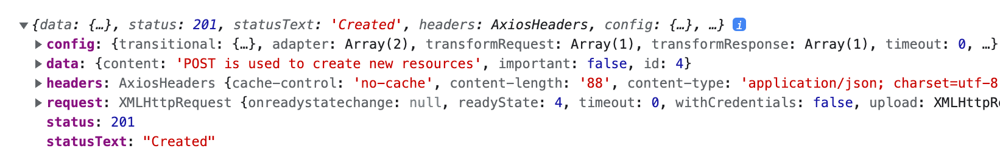
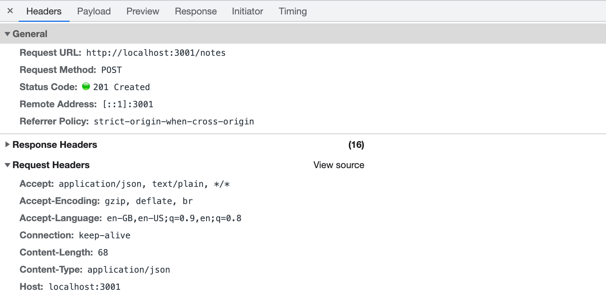
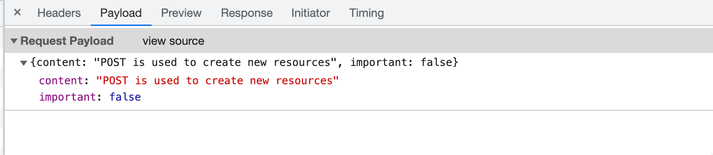
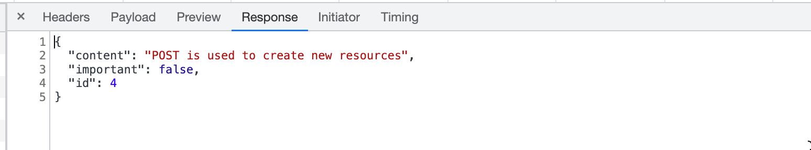

<div class="content">

Quando criamos notas em nossa aplicação, naturalmente queremos armazená-las em algum servidor back-end. O pacote [json-server](https://github.com/typicode/json-server) afirma ser uma API REST ou RESTful em sua documentação:

> <i> Use uma API REST falsa completa sem precisar programá-la em menos de 30 segundos (sério!) </i>

O json-server não corresponde exatamente à descrição fornecida pela [definição](https://en.wikipedia.org/wiki/Representational_state_transfer) do que é uma API REST, e nem mesmo a maioria das outras APIs que afirmam ser RESTful.

Vamos nos aprofundar mais em REST na [próxima parte](/ptbr/part3) do curso. Porém, é importante já nos familiarizarmos com algumas das [convenções](https://en.wikipedia.org/wiki/Representational_state_transfer#Applied_to_web_services) usadas pelo json-server e APIs REST em geral. Em particular, vamos dar uma olhada no uso convencional de [rotas](https://github.com/typicode/json-server#routes) (routes) — também conhecidas como URLs —, e os tipos de requisição HTTP em REST.

### REST

Na terminologia REST, nos referimos a objetos de dados individuais — as notas em nossa aplicação, por exemplo — como <i>recursos</i>. Cada recurso tem um endereço único associado a ele — sua URL. De acordo com uma convenção geral usada pelo json-server, poderíamos localizar uma nota individual na URL do recurso <i>notes/3</i>, onde 3 é o id do recurso. A URL <i>notes</i>, por outro lado, apontaria para uma coleção de recursos contendo todas as notas.

Os recursos são buscados do servidor com requisições HTTP GET. Por exemplo, uma requisição HTTP GET para a URL <i>notes/3</i> retornará a nota que tem o número de id 3. Uma requisição HTTP GET para a URL <i>notes</i> retornaria uma lista de todas as notas.

A criação de um novo recurso para armazenar uma nota é feita fazendo uma requisição HTTP POST para a URL <i>notes</i> de acordo com a convenção REST a qual o json-server adere. Os dados para o novo recurso de nota são enviados no <i>corpo</i> (body) da requisição.

O json-server exige que todos os dados sejam enviados no formato JSON. O que isso significa na prática é que os dados devem ser formatados como string e a requisição deve conter o cabeçalho de requisição <i>Content-Type</i> (Tipo de Conteúdo) com o valor <i>application/json</i>.

### Enviando dados ao servidor

Vamos fazer as seguintes alterações no gerenciador de evento responsável por criar uma nova nota:

```js
addNote = event => {
  event.preventDefault()
  const noteObject = {
    content: newNote,
    important: Math.random() < 0.5,
  }

// highlight-start
  axios
    .post('http://localhost:3001/notes', noteObject)
    .then(response => {
      console.log(response)
    })
// highlight-end
}
```

Criamos um novo objeto para a nota, mas omitimos a propriedade <i>id</i> já que é melhor deixar o servidor gerar os ids para nossos recursos!

O objeto é enviado ao servidor usando o método <em>post</em> do axios. O gerenciador de evento assinalado registra (logs) a resposta que é enviada de volta pelo servidor para o console.

Quando tentamos criar uma nova nota, a seguinte saída aparece no console:



O recurso de nota recém-criado é armazenado no valor da propriedade <i>data</i> do objeto _response_.

Por vezes é útil inspecionar as requisições HTTP na guia <i>Rede</i> das Ferramentas do Desenvolvedor do Chrome (ou do navegador que esteja utilizando), recurso esse que foi amplamente usado no início da [Parte 0](/ptbr/part0/fundamentos_de_aplicacoes_web#http-get).

Podemos usar o inspetor para verificar se os cabeçalhos enviados na requisição POST são os que esperávamos:



Como os dados que enviamos na requisição POST eram um objeto JavaScript, o axios sabia automaticamente definir o valor apropriado de <i>application/json</i> para o cabeçalho <i>Content-Type</i>.

A guia <i>Visualização</i> (<i>Payload</i>) pode ser usada para verificar os dados da requisição:



Também é útil a guia <i>Resposta</i> (<i>Response</i>), pois mostra qual foi os dados que o servidor respondeu:



A nova nota ainda não é renderizada na tela. Isso se deve ao fato de que não atualizamos o estado do componente <i>App</i> quando criamos a nova nota. Vamos consertar isso:

```js
addNote = event => {
  event.preventDefault()
  const noteObject = {
    content: newNote,
    important: Math.random() > 0.5,
  }

  axios
    .post('http://localhost:3001/notes', noteObject)
    .then(response => {
      // highlight-start
      setNotes(notes.concat(response.data))
      setNewNote('')
      // highlight-end
    })
}
```

A nova nota retornada pelo servidor back-end é adicionada à lista de notas no estado da nossa aplicação seguindo a forma habitual do uso da função <em>setNotes</em> e, em seguida, reinicia o formulário de criação de notas. Um [detalhe importante](/ptbr/part1/um_estado_mais_complexo_e_depuracao_de_aplicacoes_react#gerenciando-arrays) a lembrar é que o método <em>concat</em> não muda o estado original do componente, mas cria uma nova cópia da lista.

Assim que os dados retornados pelo servidor começam a ter efeito no comportamento das nossas aplicações web, somos imediatamente confrontados com um conjunto inteiro de novos desafios decorrentes como, por exemplo, a assincronicidade da comunicação. Isso necessita de novas estratégias de depuração, como o "console.log" e outros meios de depuração que se tornam cada vez mais importantes. Também devemos desenvolver uma boa compreensão dos princípios do ambiente de execução JavaScript e dos componentes React. Só ficar adivinhando não será suficiente.

Algo benéfico é inspecionar o estado do servidor back-end, por exemplo, através do navegador:


Isso torna possível verificar se todos os dados que pretendíamos enviar realmente foram recebidos pelo servidor.

Na próxima parte do curso, aprenderemos a implementar nossa própria lógica no back-end. Em seguida, daremos uma olhada mais atenta em ferramentas como [Postman](https://www.postman.com/downloads/), que nos ajuda a depurar nossas aplicações de servidor. Por ora, inspecionar o estado do json-server através do navegador é suficiente para nossas necessidades atuais.

O código para o estado atual de nossa aplicação pode ser encontrado na branch <i>part2-5</i> neste repositório no [GitHub](https://github.com/fullstack-hy2020/part2-notes/tree/part2-5).

### Alterando a importância das notas

Vamos adicionar um botão ao lado de cada nota para podermos alternar sua importância.

Façamos as seguintes alterações no componente <i>Note</i>:

```js
const Note = ({ note, toggleImportance }) => {
  const label = note.important
    ? 'make not important' : 'make important'

  return (
    <li>
      {note.content}
      <button onClick={toggleImportance}>{label}</button>
    </li>
  )
}
```

Adicionamos um botão ao componente e atribuímos o seu gerenciador de evento como a função <em>toggleImportance</em> ("alternarImportancia") passada nas props do componente.

O componente <i>App</i> define uma versão inicial da função gerenciadora de evento <em>toggleImportanceOf</em> ("alternarImportanciaDe") e passa para cada componente <i>Note</i>:

```js
const App = () => {
  const [notes, setNotes] = useState([]) 
  const [newNote, setNewNote] = useState('')
  const [showAll, setShowAll] = useState(true)

  // ...

  // highlight-start
  const toggleImportanceOf = (id) => {
    console.log('importance of ' + id + ' needs to be toggled')
  }
  // highlight-end

  // ...

  return (
    <div>
      <h1>Notes</h1>
      <div>
        <button onClick={() => setShowAll(!showAll)}>
          show {showAll ? 'important' : 'all' }
        </button>
      </div>      
      <ul>
        {notesToShow.map(note => 
          <Note
            key={note.id}
            note={note} 
            toggleImportance={() => toggleImportanceOf(note.id)} // highlight-line
          />
        )}
      </ul>
      // ...
    </div>
  )
}
```

Note como cada nota recebe o seu próprio gerenciador de evento único, uma vez que o <i>id</i> de cada nota é único.

Por exemplo, se o <i>note.id</i> for 3, a função gerenciadora de evento retornada por _toggleImportance (note.id)_ será:

```js
() => { console.log('importance of 3 needs to be toggled') }
```

Um breve lembrete: a string impressa pelo gerenciador de evento é definida de um jeito Java, isto é, adicionando strings:

```js
console.log('importance of ' + id + ' needs to be toggled')
```

A sintaxe das [template strings](https://developer.mozilla.org/en-US/docs/Web/JavaScript/Reference/Template_literals), funcionalidade essa adicionada com o ES6, pode ser usada para escrever strings similares de uma maneira muito mais agradável:

```js
console.log(`importance of ${id} needs to be toggled`)
```

Agora podemos usar a sintaxe de "dollar-bracket" (cifrão-colchete) para adicionar partes à string que avaliará expressões JavaScript como, por exemplo, o valor de uma variável. Observe que usamos crases em template strings em vez de aspas usadas em strings JavaScript regulares.

As notas individuais armazenadas no json-server do back-end podem ser modificadas de duas maneiras diferentes fazendo requisições HTTP para a URL única da nota. Podemos substituir a nota inteira com uma requisição HTTP PUT ou apenas alterar algumas das propriedades da nota com uma requisição HTTP PATCH.

A forma final da função gerenciadora de evento é a seguinte:

```js
const toggleImportanceOf = id => {
  const url = `http://localhost:3001/notes/${id}`
  const note = notes.find(n => n.id === id)
  const changedNote = { ...note, important: !note.important }

  axios.put(url, changedNote).then(response => {
    setNotes(notes.map(n => n.id !== id ? n : response.data))
  })
}
```

Quase todas as linhas de código no corpo da função contêm detalhes importantes. A primeira linha define a URL única para cada recurso de nota com base em seu id.

O método de array [find](https://developer.mozilla.org/en-US/docs/Web/JavaScript/Reference/Global_Objects/Array/find) ("achar" ou "encontrar") é usado para encontrar a nota que queremos modificar e, em seguida, atribuí-la à variável _note_.

Depois disso, criamos um <i>novo objeto</i> que é uma cópia exata da antiga nota, exceto pela propriedade "important" que tem o valor invertido (de verdadeiro para falso ou de falso para verdadeiro).

O código para criar o novo objeto que usa a sintaxe [object spread](https://developer.mozilla.org/en-US/docs/Web/JavaScript/Reference/Operators/Spread_syntax) (espalhamento de objeto) pode parecer um tanto estranho de primeira vista:

```js
const changedNote = { ...note, important: !note.important }
```

Na prática, <em>{ ...note }</em> cria um novo objeto com cópias de todas as propriedades do objeto _note_. Quando adicionamos propriedades dentro das chaves depois do objeto spread, por exemplo, <em>{ ...note, important: true }</em>, então o valor da propriedade _important_ do novo objeto será _true_. Em nosso exemplo, a propriedade <em>important</em> obtém a negação de seu valor anterior no objeto original.

Há algumas coisas a se pontuar. Por que fizemos uma cópia do objeto "note" que queríamos modificar quando o seguinte código também parece funcionar?

```js
const note = notes.find(n => n.id === id)
note.important = !note.important

axios.put(url, note).then(response => {
  // ...
```

Isso não é recomendado porque a variável <em>note</em> é uma referência a um item no array <em>notes</em> no estado do componente e, como sabemos, nunca devemos [mudar diretamente o estado](https://reactjs.org/docs/state-and-lifecycle.html#using-state-correctly) em React.

Também vale a pena notar que o novo objeto _changedNote_ é apenas uma cópia superficial, o que significa que os valores do novo objeto são os mesmos que os valores do objeto antigo. Se os valores do objeto antigo eram objetos em si, então os valores copiados no novo objeto referenciariam os mesmos objetos que estavam no objeto antigo.

A nova nota é então enviada com uma requisição PUT ao back-end, onde ela substituirá o objeto antigo.

A função callback (função de retorno de chamada) define o estado do componente <em>notes</em> como um array novo que contém todos os itens do array <em>notes</em> anterior, exceto pela nota antiga, que é substituída pela versão atualizada dela retornada pelo servidor:

```js
axios.put(url, changedNote).then(response => {
  setNotes(notes.map(note => note.id !== id ? note : response.data))
})
```

Isto é feito utilizando o método <em>map</em>:

```js
notes.map(note => note.id !== id ? note : response.data)
```

O método <i>map</i> cria um array novo mapeando cada item do array antigo em um item no array novo. Em nosso exemplo, o array novo é criado de forma condicional de modo que se <em>note.id !== id</em> for verdadeiro, simplesmente copiamos o item do array antigo para o array novo. Se a condição for falsa, então o objeto de nota retornado pelo servidor é adicionado ao array.

Esse truque do método <em>map</em> pode parecer um pouco estranho agora no início, mas vale a pena gastar algum tempo entendendo como ele funciona. Nós usaremos este método muitas vezes ao longo do curso.

### Separando a Comunicação com o Back-end em um Módulo Único

O componente <i>App</i> ficou um pouco carregado após adicionar o código para se comunicar com o servidor back-end. No espírito do [princípio da responsabilidade única](https://en.wikipedia.org/wiki/Single_responsibility_principle) (single responsibility principle), achamos sensato extrair esta comunicação em seu próprio [módulo](/ptbr/part2/renderizacao_de_uma_colecao_e_modulos#refatorando-modulos).

Vamos criar um diretório <i>src/services</i> e adicionar lá um arquivo chamado <i>notes.js</i>:

```js
import axios from 'axios'
const baseUrl = 'http://localhost:3001/notes'

const getAll = () => {
  return axios.get(baseUrl)
}

const create = newObject => {
  return axios.post(baseUrl, newObject)
}

const update = (id, newObject) => {
  return axios.put(`${baseUrl}/${id}`, newObject)
}

export default { 
  getAll: getAll, 
  create: create, 
  update: update 
}
```

O módulo retorna um objeto que tem três funções (<i>getAll</i>, <i>create</i>, e <i>update</i>) como suas propriedades que lidam com as notas. As funções retornam diretamente as promessas retornadas pelos métodos da biblioteca axios.

O componente <i>App</i> usa a declaração <em>import</em> para ter acesso ao módulo:

```js
import noteService from './services/notes' // highlight-line

const App = () => {
```

As funções do módulo podem ser usadas diretamente com a variável importada _noteService_, como a seguir:

```js
const App = () => {
  // ...

  useEffect(() => {
    // highlight-start
    noteService
      .getAll()
      .then(response => {
        setNotes(response.data)
      })
    // highlight-end
  }, [])

  const toggleImportanceOf = id => {
    const note = notes.find(n => n.id === id)
    const changedNote = { ...note, important: !note.important }

    // highlight-start
    noteService
      .update(id, changedNote)
      .then(response => {
        setNotes(notes.map(note => note.id !== id ? note : response.data))
      })
    // highlight-end
  }

  const addNote = (event) => {
    event.preventDefault()
    const noteObject = {
      content: newNote,
      important: Math.random() > 0.5
    }

// highlight-start
    noteService
      .create(noteObject)
      .then(response => {
        setNotes(notes.concat(response.data))
        setNewNote('')
      })
// highlight-end
  }

  // ...
}

export default App
```

Poderíamos levar nossa implementação um passo adiante. Quando o componente <i>App</i> usa as funções, ele recebe um objeto que contém a resposta inteira para a requisição HTTP:

```js
noteService
  .getAll()
  .then(response => {
    setNotes(response.data)
  })
```

O componente <i>App</i> usa apenas a propriedade <i>response.data</i> do objeto de resposta.

Seria muito melhor de usar o módulo se, em vez de obter a resposta HTTP inteira, só obtivéssemos os dados da resposta. Então, o uso do módulo ficaria assim:

```js
noteService
  .getAll()
  .then(initialNotes => {
    setNotes(initialNotes)
  })
```

Podemos fazer o que estamos planejando mudando o código no módulo da seguinte forma (o código atual contém um pouco de "copia e cola", mas vamos tolerar isso por enquanto):

```js
import axios from 'axios'
const baseUrl = 'http://localhost:3001/notes'

const getAll = () => {
  const request = axios.get(baseUrl)
  return request.then(response => response.data)
}

const create = newObject => {
  const request = axios.post(baseUrl, newObject)
  return request.then(response => response.data)
}

const update = (id, newObject) => {
  const request = axios.put(`${baseUrl}/${id}`, newObject)
  return request.then(response => response.data)
}

export default { 
  getAll: getAll, 
  create: create, 
  update: update 
}
```

Não retornamos mais a promessa entregue diretamente pelo axios. Em vez disso, atribuímos a promessa à variável <em>request</em> (requisição) e chamamos o seu método <em>then</em>:

```js
const getAll = () => {
  const request = axios.get(baseUrl)
  return request.then(response => response.data)
}
```

A última linha em nossa função é simplesmente uma expressão mais compacta do mesmo código mostrado abaixo:

```js
const getAll = () => {
  const request = axios.get(baseUrl)
  // highlight-start
  return request.then(response => {
    return response.data
  })
  // highlight-end
}
```

A função modificada <em>getAll</em> ainda retorna uma promessa, já que o método <em>then</em> de uma promessa também [retorna uma promessa](https://developer.mozilla.org/en-US/docs/Web/JavaScript/Reference/Global_Objects/Promise/then).

Depois de definir o parâmetro do método <em>then</em> para retornar diretamente <i>response.data</i>, conseguimos fazer com que a função <em>getAll</em> funcionasse da forma que desejávamos. Quando a requisição HTTP é bem-sucedida, a promessa retorna os dados enviados de volta na resposta do back-end.

Temos que atualizar o componente <i>App</i> para funcionar com as mudanças feitas em nosso módulo. Temos que consertar as funções callback dadas como parâmetros para os métodos do objeto <em>noteService</em> para que elas usem os dados de resposta que foram diretamente retornados:

```js
const App = () => {
  // ...

  useEffect(() => {
    noteService
      .getAll()
      // highlight-start      
      .then(initialNotes => {
        setNotes(initialNotes)
      // highlight-end
      })
  }, [])

  const toggleImportanceOf = id => {
    const note = notes.find(n => n.id === id)
    const changedNote = { ...note, important: !note.important }

    noteService
      .update(id, changedNote)
      // highlight-start      
      .then(returnedNote => {
        setNotes(notes.map(note => note.id !== id ? note : returnedNote))
      // highlight-end
      })
  }

  const addNote = (event) => {
    event.preventDefault()
    const noteObject = {
      content: newNote,
      important: Math.random() > 0.5
    }

    noteService
      .create(noteObject)
      // highlight-start      
      .then(returnedNote => {
        setNotes(notes.concat(returnedNote))
      // highlight-end
        setNewNote('')
      })
  }

  // ...
}
```

Tudo isso é bastante complicado, e tentar explicar pode deixar ainda mais difícil de entender. A internet está cheia de material sobre o tópico, como [este](https://javascript.info/promise-chaining).

O livro "Async and performance" da série de livros [You do not know JS](https://github.com/getify/You-Dont-Know-JS/tree/1st-ed) [explica bem o tópico](https://github.com/getify/You-Dont-Know-JS/blob/1st-ed/async%20%26%20performance/ch3.md), mas é uma explicação de muitas páginas.

Promessas são vitais para o desenvolvimento em JavaScript moderno, e é extremamente recomendável investir um tempo razoável para entendê-las.

### Uma sintaxe mais limpa para definir Objetos Literais (Object Literals)

O módulo que define os serviços relacionados às notas exporta atualmente um objeto com as propriedades <i>getAll</i>, <i>create</i> e <i>update</i> que são atribuídas a funções que gerenciam as notas.

A definição do módulo era:

```js
import axios from 'axios'
const baseUrl = 'http://localhost:3001/notes'

const getAll = () => {
  const request = axios.get(baseUrl)
  return request.then(response => response.data)
}

const create = newObject => {
  const request = axios.post(baseUrl, newObject)
  return request.then(response => response.data)
}

const update = (id, newObject) => {
  const request = axios.put(`${baseUrl}/${id}`, newObject)
  return request.then(response => response.data)
}

export default { 
  getAll: getAll, 
  create: create, 
  update: update 
}
```

O módulo exporta o seguinte objeto, mesmo que pareça um tanto peculiar:

```js
{
  getAll: getAll,
  create: create,
  update: update
}
```

As etiquetas (labels) à esquerda do dois-pontos na definição do objeto são as <i>chaves</i> (keys) do objeto, enquanto as à direita são as <i>variáveis</i> (variables) que são definidas dentro do módulo.

Como os nomes das chaves e das variáveis atribuídas são os mesmos, podemos escrever a definição do objeto com uma sintaxe mais compacta:

```js
{ 
  getAll, 
  create, 
  update 
}
```

Como resultado, a definição do módulo simplifica-se da seguinte forma:

```js
import axios from 'axios'
const baseUrl = 'http://localhost:3001/notes'

const getAll = () => {
  const request = axios.get(baseUrl)
  return request.then(response => response.data)
}

const create = newObject => {
  const request = axios.post(baseUrl, newObject)
  return request.then(response => response.data)
}

const update = (id, newObject) => {
  const request = axios.put(`${baseUrl}/${id}`, newObject)
  return request.then(response => response.data)
}

export default { getAll, create, update } // highlight-line
```

Ao definir o objeto usando esta notação mais curta, fazemos uso de uma [nova funcionalidade](https://developer.mozilla.org/en-US/docs/Web/JavaScript/Reference/Operators/Object_initializer#Property_definitions) que foi introduzida ao JavaScript por meio do ES6, permitindo uma maneira ligeiramente mais compacta de se definir objetos usando variáveis.

Para demonstrar essa nova funcionalidade, consideremos uma situação em que temos os seguintes valores atribuídos às variáveis:

```js
const name = 'Leevi'
const age = 0
```

Em versões mais antigas de JavaScript, tínhamos que definir um objeto assim:

```js
const person = {
  name: name,
  age: age,
}
```

No entanto, como tanto os campos de propriedades quanto os nomes de variáveis no objeto são os mesmos, basta escrever o seguinte, utilizando o padrão JavaScript ES6:

```js
const person = { name, age }
```

O resultado é idêntico para ambas as expressões. Ambos criam um objeto com uma propriedade <i>name</i> com o valor <i>Leevi</i> e uma propriedade <i>age</i> com o valor <i>0</i>.

### Promessas e Erros

Se a nossa aplicação permitisse que os usuários excluíssem notas, poderíamos acabar em uma situação em que um usuário tenta mudar a importância de uma nota que já foi excluída do sistema.

Vamos simular essa situação fazendo com que a função <em>getAll</em> do serviço de notas retorne uma "nota de exemplo" ("<i>'hardcoded' note</i> ") que na verdade não existe no servidor back-end:

```js
const getAll = () => {
  const request = axios.get(baseUrl)
  const nonExisting = {
    id: 10000,
    content: 'This note is not saved to server',
    important: true,
  }
  return request.then(response => response.data.concat(nonExisting))
}
```

Quando tentamos mudar a importância da nota, vemos no console a mensagem de erro abaixo, cujo conteúdo revela que o servidor back-end respondeu à nossa requisição HTTP PUT com um código de status 404 <i>not found</i> (não encontrado(a)).


A aplicação deve ser capaz de lidar com estes tipos de erro de forma elegante. Os usuários não serão capazes de dizer que ocorreu um erro a menos que estejam com o console aberto. A única maneira de o erro ser percebido na aplicação é a importância da nota não ser alternada quando se clica no botão.

Mencionamos [anteriormente](/ptbr/part2/obtendo_dados_do_servidor#axios-e-promessas-promises) que uma promessa pode estar em um dos três estados diferentes. Quando uma requisição HTTP falha, a promessa associada é <i>rejeitada</i>. O nosso código atual não gerencia por nenhum meio essa rejeição.

A rejeição de uma promessa é [gerenciada](https://developer.mozilla.org/en-US/docs/Web/JavaScript/Guide/Using_promises) fornecendo ao método <em>then</em> uma segunda função callback, que é chamada na situação em que a promessa é rejeitada.

A forma mais comum de adicionar um gerenciador para promessas rejeitadas é usar o método [catch](https://developer.mozilla.org/en-US/docs/Web/JavaScript/Reference/Global_Objects/Promise/catch) (grosso modo, "pegar" ou "capturar").

Na prática, o gerenciador de erro para promessas rejeitadas é definido da seguinte forma:

```js
axios
  .get('http://example.com/probably_will_fail')
  .then(response => {
    console.log('success!')
  })
  .catch(error => {
    console.log('fail')
  })
```

Se a requisição falhar, o gerenciador de evento registrado com o método <em>catch</em> é chamado.

O método <em>catch</em> é frequentemente utilizado colocando-o mais no final no encadeamento de promessas.

Quando a nossa aplicação faz uma requisição HTTP, na verdade estamos criando um [encadeamento de promessa(s)](https://javascript.info/promise-chaining) (promise chain):

```js
axios
  .put(`${baseUrl}/${id}`, newObject)
  .then(response => response.data)
  .then(changedNote => {
    // ...
  })
```

O método <em>catch</em> pode ser usado para definir uma função gerenciadora no final de um encadeamento de promessas, que é chamada/acionada uma vez que qualquer promessa no encadeamento lance uma exceção e a promessa se torne <i>rejeitada</i>.

```js
axios
  .put(`${baseUrl}/${id}`, newObject)
  .then(response => response.data)
  .then(changedNote => {
    // ...
  })
  .catch(error => {
    console.log('fail')
  })
```

Vamos usar essa funcionalidade e registrar um gerenciador de erro no componente <i>App</i>:

```js
const toggleImportanceOf = id => {
  const note = notes.find(n => n.id === id)
  const changedNote = { ...note, important: !note.important }

  noteService
    .update(id, changedNote).then(returnedNote => {
      setNotes(notes.map(note => note.id !== id ? note : returnedNote))
    })
    // highlight-start
    .catch(error => {
      alert(
        `the note '${note.content}' was already deleted from server`
      )
      setNotes(notes.filter(n => n.id !== id))
    })
    // highlight-end
}
```

A mensagem de erro é exibida ao usuário com a antiga e confiável caixa de diálogo [alert](https://developer.mozilla.org/en-US/docs/Web/API/Window/alert) (alerta), e a nota excluída é filtrada do estado.

A remoção de uma nota já excluída do estado da aplicação é feita com o método de array [filter](https://developer.mozilla.org/en-US/docs/Web/JavaScript/Reference/Global_Objects/Array/filter) (filtrar), que retorna um array novo com apenas os itens da lista para os quais a função passada como parâmetro retorna verdadeiro para:

```js
notes.filter(n => n.id !== id)
```

Não é uma boa ideia usar o "alert" em aplicações React mais sérias. Em breve aprenderemos uma maneira mais avançada de exibir mensagens e notificações aos usuários. No entanto, há situações em que um método simples e testado como o <em>alert</em> pode funcionar como um ponto de partida. Uma maneira mais avançada sempre pode ser adicionada posteriormente, desde que haja tempo e energia disponíveis para isso.

O código para o estado atual de nossa aplicação pode ser encontrado na branch <i>part2-6</i> no [GitHub](https://github.com/fullstack-hy2020/part2-notes/tree/part2-6).

### Juramento do Programador Full Stack

Chegou novamente a hora dos exercícios. A complexidade de nossa aplicação está aumentando, já que além de cuidarmos dos componentes React no front-end, também temos um back-end que persiste os dados da aplicação.

Para lidar com essa complexidade crescente, devemos estender o Juramento do Programador Web para o <i>Juramento do Programador Full Stack</i>, que nos lembrará de garantir com que a comunicação entre front e back-end aconteça como planejado.

Então aqui está o juramento atualizado:

Desenvolvimento Full Stack é algo <i>extremamente difícil</i>, e é por isso que eu usarei todos os meios possíveis para torná-lo mais fácil:

- Eu manterei meu Console do navegador sempre aberto;
- <i> Eu usarei a guia Rede das Ferramentas do Desenvolvedor do navegador para garantir que o front-end e o back-end estejam se comunicando da forma que eu planejei</i> ;
- <i> Eu ficarei de olho no estado do servidor para garantir que os dados enviados pelo front-end estejam sendo salvos da forma que eu planejei</i>;
- Eu vou progredir aos poucos, passo a passo;
- Eu escreverei muitas instruções _console.log_ para ter certeza de que estou entendendo como o código se comporta e para me ajudar a identificar os erros;
- Se meu código não funcionar, não escreverei mais nenhuma linha no código. Em vez disso, começarei a excluir o código até que funcione ou retornarei ao estado em que tudo ainda estava funcionando; e
- Quando eu pedir ajuda no canal do Discord ou Telegram do curso ou em outro lugar, formularei minhas perguntas de forma adequada. Veja [aqui](/ptbr/part0/informacoes_gerais#como-pedir-ajuda-no-discord-telegam) como pedir ajuda.

</div>

<div class="tasks">

<h3>Exercícios 2.12 a 2.15</h3>

<h4>2.12: The Phonebook — 7º passo</h4>

Vamos retornar à nossa lista telefônica.

No momento, os números adicionados à lista telefônica não são salvos em um servidor back-end. Corrija essa situação.

<h4>2.13: The Phonebook — 8º passo</h4>

Crie um módulo próprio para o código que gerencia a comunicação com o back-end, seguindo o exemplo mostrado anteriormente no conteúdo desta parte do curso.

<h4>2.14: The Phonebook — 9º passo</h4>

Faça com que os usuários possam excluir entradas de contato da lista telefônica. A exclusão pode ser feita por meio de um botão dedicado a pessoa na lista telefônica. Você pode confirmar a ação do usuário usando o método [window.confirm](https://developer.mozilla.org/en-US/docs/Web/API/Window/confirm):


O recurso associado a uma pessoa no back-end pode ser excluído fazendo uma requisição HTTP DELETE para a URL do recurso. Se estivermos excluindo, por exemplo, uma pessoa que tenha o <i>id</i> 2, teríamos que fazer uma requisição HTTP DELETE para a URL <i>localhost:3001/persons/2</i>. Nenhum dado é enviado com a requisição.

Você pode fazer uma requisição HTTP DELETE com a biblioteca [axios](https://github.com/axios/axios) da mesma forma que fazemos todas as outras requisições.

**Obs.:** Você não pode utilizar o nome <em>delete</em> para declarar uma variável, porque é uma palavra reservada em JavaScript. Por exemplo, não é possível fazer o seguinte:

```js
// use algum outro nome para sua variável
const delete = (id) => {
  // ...
}
```

<h4>2.15*: The Phonebook — 10º passo</h4>

<i>Por que há um asterisco na atividade? Entre [aqui](/ptbr/part0/informacoes_gerais#fazendo-o-curso) para saber o motivo.</i>

Altere a funcionalidade para que, caso um número seja adicionado a um usuário já existente, o novo número substitua o antigo. É recomendável usar o método HTTP PUT para atualizar o número de telefone.

Se as informações da pessoa já estiverem na lista telefônica, a aplicação pedirá a confirmação do usuário:


</div>
