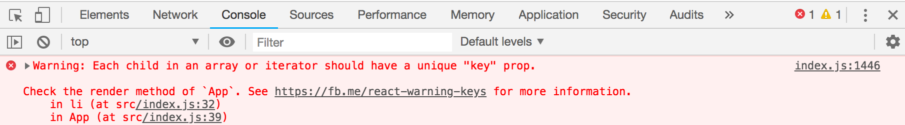
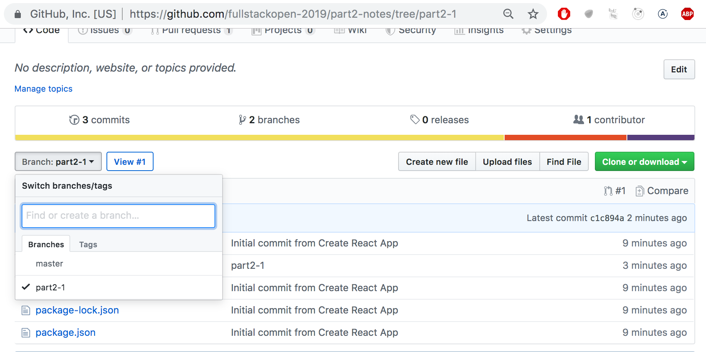
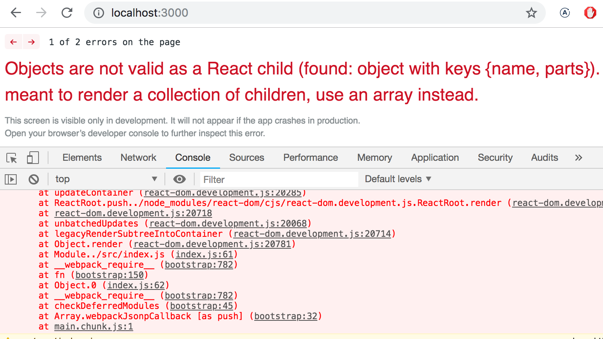
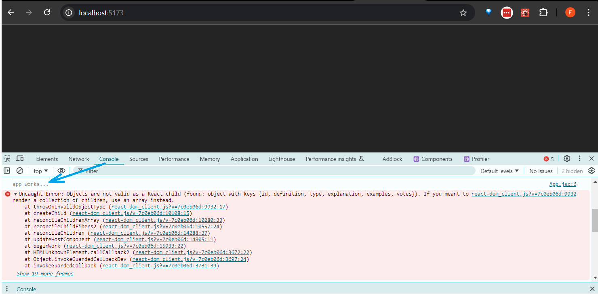
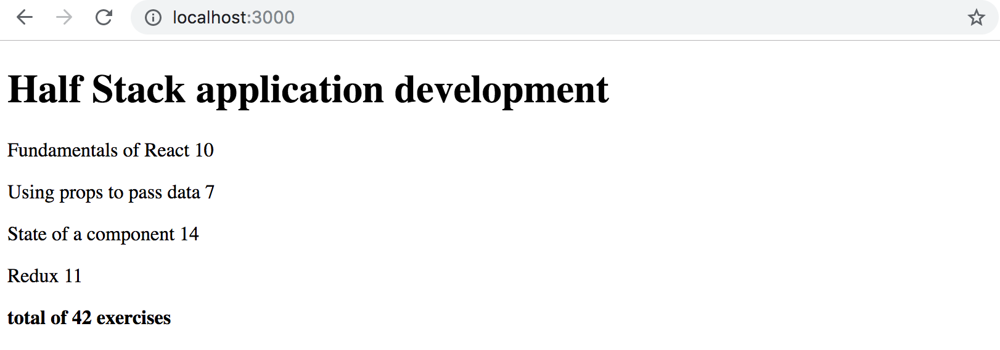
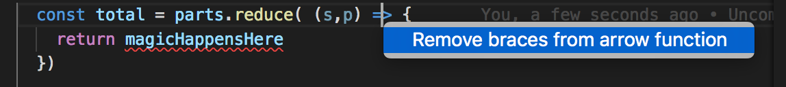
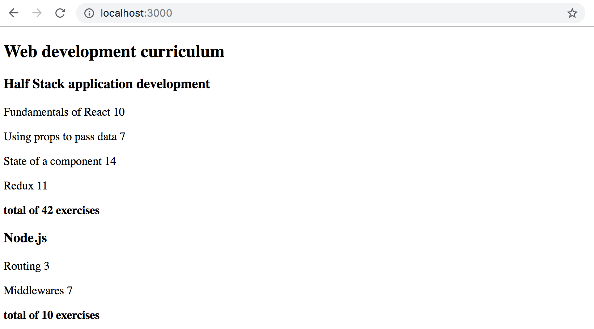

<div class="content">


<!-- Before starting a new part, let's recap some of the topics that proved difficult last year. -->
在新的章节开始之前，让我们回顾一下去年的课程中认为是难点的一些话题。

### console.log
***What's the difference between an experienced JavaScript programmer and a rookie? The experienced one uses console.log 10-100 times more.***

一个JavaScript 老鸟和菜鸟有什么区别? 老鸟使用 console.log的次数是菜鸟的数十倍甚至数百倍。

<!-- Paradoxically, this seems to be true even though a rookie programmer would need <i>console.log</i> (or any debugging method) more than an experienced one. -->

矛盾的是，实际上，菜鸟比老鸟更需要 <i>console.log</i> (或任何其他调试方法)。

<!-- When something does not work, don't just guess what's wrong. Instead, log or use some other way of debugging.  -->
当某些事情不能正常工作时，不要只是猜测错误，而应记录或使用其他调试方法。

<!-- **NB** when you use the command _console.log_ for debugging, don't concatenate things 'the Java way' with a plus. Instead of writing: -->
注意：如前一章所说的，当你使用 _console.log_ 命令进行调试时，不要用Java的方式，将所有东西用'+'连在一起。即不要这么写:
```js
console.log('props value is' + props)
```

<!-- separate the things to be printed with a comma: -->
而应该用逗号把要打印的东西分开:

```js
console.log('props value is', props)
```

<!-- If you concatenate an object with a string and log it to the console (like in our first example), the result will be pretty useless:  -->
如果你把一个对象和一个字符串（用加号）连接起来，然后把它记录到控制台上(就像上面第一个例子那样) ，结果将是相当没有用的:

```js
props value is [Object object]
```

<!-- On the contrary, when you pass objects as distinct arguments separated by commas to _console.log_, like in our second example above, the content of the object is printed to the developer console as strings that are insightful. -->

而当您将对象用逗号分隔，将不同参数传递给 console.log 时，就像在上面的第二个例子中一样，对象的内容将作为有意义的字符串打印到开发者控制台中。

<!-- If necessary, read more about [debugging React-applications](/en/part1/a_more_complex_state_debugging_react_apps#debugging-react-applications). -->
如果有必要，请阅读更多关于[React 应用调试](/zh/part1/深入_react_应用调试#debugging-react-applications)的内容。

### Protip: Visual Studio Code snippets 
【高级技巧: Visual Studio Code 的代码片段】
<!-- With  Visual Studio Code it's easy to create 'snippets', i.e. shortcuts for quickly generating commonly re-used portions of code, much like how 'sout' works in Netbeans.-->

使用 Visual Studio Code能够很容易创建“代码片段（snippets）” ，即快速生成常用代码块的快捷方式，很像 Netbeans 中的“ sout”。

<!-- Instructions for creating snippets can be found [here](https://code.visualstudio.com/docs/editor/userdefinedsnippets#_creating-your-own-snippets). -->
创建代码片段的说明可以在这里找到 [here](https://code.visualstudio.com/docs/editor/userdefinedsnippets#_creating-your-own-snippets).。

<!-- Useful, ready-made snippets can also be found as VS Code plugins, in the [marketplace](https://marketplace.visualstudio.com/items?itemName=xabikos.ReactSnippets). -->
有用的、现成的代码片段也可以在 VS 代码插件中找到，在[插件市场](https://marketplace.visualstudio.com/items?itemName=xabikos.ReactSnippets).

<!-- The most important snippet is the one for the <em>console.log()</em> command, for example <em>clog</em>. This can be created like so:  -->
最重要的片段是用于 <em>console.log()</em>  命令的片段，例如<em>clog</em>:

```js
{
  "console.log": {
    "prefix": "clog",
    "body": [
      "console.log('$1')",
    ],
    "description": "Log output to console"
  }
}
```
<!--Debugging your code using _console.log()_ is so common that Visual Studio Code has that snippet built in. To use it, type _log_ and hit tab to autocomplete. More fully featured _console.log()_ snippet extensions can be found in the [marketplace](https://marketplace.visualstudio.com/search?term=console.log&target=VSCode&category=All%20categories&sortBy=Relevance).  -->

使用  _console.log()_  来debug 你的代码十分常见， Visual Studio Code 有内置的snippet。可以使用  _log_  和tab键来自动补全。功能更全的 _console.log()_  snippet 插件可以在 [软件市场](https://marketplace.visualstudio.com/search?term=console.log&target=VSCode&category=All%20categories&sortBy=Relevance).中找到。

### JavaScript Arrays 
【JavaScript 数组】
<!-- From here on out, we will be using the functional programming methods of the JavaScript [array](https://developer.mozilla.org/en-US/docs/Web/JavaScript/Reference/Global_Objects/Array), such as  _find_, _filter_, and _map_ - all of the time. They operate on the same general principles as streams do in Java 8, which have been used during the last few years in both the 'Ohjelmoinnin perusteet' and 'Ohjelmoinnin jatkokurssi' courses at the university's department of Computer Science, and also in the programming MOOC.  -->

从现在开始，我们将一直使用 JavaScript [数组](https://developer.mozilla.org/en-US/docs/Web/JavaScript/Reference/Global_Objects/Array)的函数式编程方法，比如 _find_, _filter_, 和 _map_。 它们和 Java 8中的streams 一样遵循一般原则，这些原则在过去几年里被用在大学计算机科学系的 Ohjelmoinnin perusteet 和 Ohjelmoinnin jatkokurssi 课程，以及 MOOC 编程中。

<!-- If functional programming with arrays feels foreign to you, it is worth watching at least the first three parts of the YouTube video series [Functional Programming in JavaScript](https://www.youtube.com/playlist?list=PL0zVEGEvSaeEd9hlmCXrk5yUyqUag-n84): -->

如果使用数组的函数式编程对你来说感觉很陌生，那么至少可以看看 YouTube 视频系列的前三部分 [Functional Programming in JavaScript](https://www.youtube.com/playlist?list=PL0zVEGEvSaeEd9hlmCXrk5yUyqUag-n84)

- [高阶函数](https://www.youtube.com/watch?v=BMUiFMZr7vk&list=PL0zVEGEvSaeEd9hlmCXrk5yUyqUag-n84)
- [Map](https://www.youtube.com/watch?v=bCqtb-Z5YGQ&list=PL0zVEGEvSaeEd9hlmCXrk5yUyqUag-n84&index=2)
- [Reduce 基础](https://www.youtube.com/watch?v=Wl98eZpkp-c&t=31s)


### Event handlers revisited
【事件处理复习】

<!-- Based on last year's course, event handling has proven to be difficult.  -->
基于去年的课程，事件处理证明是一个难点内容。

<!-- It's worth reading the revision chapter at the end of the previous part [event handlers revisited](/zh/part1/深入_react_应用调试#event-handling-revisited), if it feels like your own knowledge on the topic needs some brushing up.  -->
如果你觉得自己关于这个议题的知识需要复习一下，那么应该阅读上一章节结尾的复习章节 [事件处理复习](/zh/part1/深入_react_应用调试#event-handling-revisited)。

<!-- Passing event handlers to the child components of the <i>App</i> component has raised some questions. A small revision on the topic can be found [here](/zh/part1/深入_react_应用调试#passing-event-handlers-to-child-components). -->
将事件处理传递给<i>App</i> 组件的子组件引发了一些问题。 关于这个议题的一个小复习[在这里](/zh/part1/深入_react_应用调试#passing-event-handlers-to-child-components)。

### Rendering Collections
【渲染集合】
<!-- We will now do the 'frontend', or the browser-side application logic, in React for an application that's similar to the example application from [第0章](/zh/part0) -->

现在，我们将在 React 中为类似于 [第0章](/zh/part0)中的示例应用，编写“前端”或叫浏览器端的应用逻辑。

注意：为了统一翻译上下文，从现在开始，我将按照如下约定翻译。

- Note 应用实际上是在创建一个和提醒、便笺相关的应用，因此以下的Note均翻译为便笺。

<!-- Let's start with the following: -->
让我们从如下代码开始( <i>App.js</i>):

```js
import React from 'react'

const App = (props) => {
  const { notes } = props

  return (
    <div>
      <h1>Notes</h1>
      <ul>
        <li>{notes[0].content}</li>
        <li>{notes[1].content}</li>
        <li>{notes[2].content}</li>
      </ul>
    </div>
  )
}

export default App
```

<i>index.js</i> 内容如下:

```js
import ReactDOM from 'react-dom'
import App from './App'

const notes = [
  {
    id: 1,
    content: 'HTML is easy',
    date: '2019-05-30T17:30:31.098Z',
    important: true
  },
  {
    id: 2,
    content: 'Browser can execute only JavaScript',
    date: '2019-05-30T18:39:34.091Z',
    important: false
  },
  {
    id: 3,
    content: 'GET and POST are the most important methods of HTTP protocol',
    date: '2019-05-30T19:20:14.298Z',
    important: true
  }
]

ReactDOM.render(
  <App notes={notes} />,
  document.getElementById('root')
)
```


<!-- Every note contains its textual content and a timestamp as well as a _boolean_ value for marking whether the note has been categorized as important or not, and also a unique <i>id</i>. -->
每个便笺都包含其文本内容、时间戳以及一个布尔值，用于标记该便笺是否重要，便笺还包含一个惟一的<i>id</i>。

<!-- The example above works due to the fact that there are exactly three notes in the array.  -->
由于数组中仅有三个便笺，因此代码可以运行。

<!-- A single note is rendered by accessing the objects in the array by referring to a hard-coded index number: -->
也就是可以通过引用一个硬编码的索引号来访问数组中的对象来渲染单个便笺:

```js
<li>{notes[1].content}</li>
```

<!-- This is, of course, is not practical. The solution can be made general by generating React-elements from the array objects using the [map](https://developer.mozilla.org/en-US/docs/Web/JavaScript/Reference/Global_Objects/Array/map) function. -->
数组下标这种方式当然是无法通用的。 可以使用 [map](https://developer.mozilla.org/en-US/docs/Web/JavaScript/Reference/Global_Objects/Array/map) 函数从数组对象生成 React-元素，使解决方案变得更通用。

```js
notes.map(note => <li>{note.content}</li>)
```

<!-- The result is an array of <i>li</i> elements. -->
其结果是一个 <i>li</i> 元素的数组。

```js
[
  <li>HTML is easy</li>,
  <li>Browser can execute only JavaScript</li>,
  <li>GET and POST are the most important methods of HTTP protocol</li>,
]
```

<!-- Which can then be put inside <i>ul</i> tags: -->
然后可以把这些li元素放在<i>ul</i> 标签中:

```js
const App = (props) => {
  const { notes } = props

  return (
    <div>
      <h1>Notes</h1>
// highlight-start
      <ul>
        {notes.map(note => <li>{note.content}</li>)}
      </ul>
// highlight-end      
    </div>
  )
}
```

<!-- Because the code generating the <i>li</i> tags is JavaScript, it must be wrapped in curly braces in a JSX template just like all other JavaScript code.  -->
由于生成<i>li</i> 标签的代码是 JavaScript，所以就要像所有其他 JavaScript 代码一样，在 JSX 模板中使用花括号来包装它。

<!-- We will also make the code more readable by separating the arrow function's declaration across multiple lines: -->
我们还会利用多行分隔箭头函数的定义，来提高代码的可读性:

```js
const App = (props) => {
  const { notes } = props

  return (
    <div>
      <h1>Notes</h1>
      <ul>
        {notes.map(note => 
        // highlight-start
          <li>
            {note.content}
          </li>
        // highlight-end   
        )}
      </ul>
    </div>
  )
}
```

### Key-attribute
【Key-属性】
<!-- Even though the application seems to be working, there is a nasty warning on the console:  -->
尽管该应用似乎运行良好，但在控制台上有一个烦人的警告:



<!-- As the linked [React page](https://reactjs.org/docs/lists-and-keys.html#keys) in the error message suggests, the list items, i.e. the elements generated by the _map_ method, must each have a unique key value:  an attribute called <i>key</i>. -->

正如错误消息中的链接 [React page](https://reactjs.org/docs/lists-and-keys.html#keys) 所建议的，列表项，即 map 方法生成的每个元素，都必须有一个唯一的键值: 一个名为<i>key</i> 的属性。

<!-- Let's add the keys: -->
让我们添加上key:

```js
const App = (props) => {
  const { notes } = props

  return (
    <div>
      <h1>Notes</h1>
      <ul>
        {notes.map(note => 
        // highlight-start
          <li key={note.id}>
            {note.content}
          </li>
          // highlight-end
        )}
      </ul>
    </div>
  )
}
```

<!-- And the error message disappears.  -->
错误就消失了。

<!-- React uses the key attributes of objects in an array to determine how to update the view generated by a component when the component is re-rendered. More about this in the [React documentation](https://reactjs.org/docs/reconciliation.html#recursing-on-children). -->
React 使用数组中对象的key属性来确定组件在重新渲染时，如何更新组件生成的视图。 更多的说明在[React 文档](https://reactjs.org/docs/reconciliation.html#recursing-on-children)。 

### Map
<!-- Understanding how the array method [map](https://developer.mozilla.org/en-US/docs/Web/JavaScript/Reference/Global_Objects/Array/map) works is crucial for the rest of the course.  -->
理解数组中[map](https://developer.mozilla.org/en-us/docs/web/javascript/reference/global_objects/array/map)方法的工作原理对于本课程的后面的部分是至关重要的。

<!-- The application contains an array called _notes_ -->
应用包含一个称为 notes 的数组

```js
const notes = [
  {
    id: 1,
    content: 'HTML is easy',
    date: '2019-05-30T17:30:31.098Z',
    important: true
  },
  {
    id: 2,
    content: 'Browser can execute only JavaScript',
    date: '2019-05-30T18:39:34.091Z',
    important: false
  },
  {
    id: 3,
    content: 'GET and POST are the most important methods of HTTP protocol',
    date: '2019-05-30T19:20:14.298Z',
    important: true
  }
]
```

<!-- Let's pause for a moment and examine how _map_ works. -->
让我们停一下，看看  _map_ 是如何工作的。

<!-- If the following code is added to, let's say, the end of the file: -->
如果下面的代码被添加到，比如说，文件的结尾:

```js
const result = notes.map(note => note.id)
console.log(result)
```

<!-- <i>[1, 2, 3]</i>  will be printed to the console. -->
控制台会打印出<i>[1, 2, 3]</i>。

 <!-- _map_ always creates a new array, the elements of which have been created from the elements of the original array by <i>mapping</i>, using the function given as a parameter to the map method.  -->
 _map_ 总是会创建一个新数组，其元素是从原始数组的元素通过<i>mapping映射</i>创建的，映射的逻辑是使用作为 _map_ 方法传递进去的函数。 

<!-- The function is -->
这个函数是

```js
note => note.id
```

<!-- Which is an arrow function written in compact form. The full form would be:  -->
这是一个以紧凑形式编写的箭头函数。完整形式如下:

```js
(note) => {
  return note.id
}
```

<!-- The function gets a note object as a parameter, and <i>returns</i> the value of its  <i>id</i> field. -->
该函数获取一个 note 对象作为参数，然后<i>返回</i> 其<i>id</i> 字段的值。

<!-- Changing the command to: -->
如果将命令改为:

```js
const result = notes.map(note => note.content)
```

<!-- results in an array containing the contents of the notes. -->
结果是一个包含便笺内容的数组。

<!-- This is already pretty close to the React code we used: -->
这已经非常接近我们使用的React代码:

```js
notes.map(note =>
  <li key={note.id}>{note.content}</li>
)
```

<!-- which generates an <i>li</i> tag containing the contents of the note from each note object.  -->
它生成一个<i>li</i> 标签，其中包含每个便笺对象的便笺内容。

<!-- Because the function parameter of the _map_ method -->
由于函数参数的 _map_ 方法

```js
note => <li key={note.id}>{note.content}</li>
```

<!-- The use of curly braces will cause some pain in the beginning, but you will get used to them soon enough. The visual feedback from React is immediate. -->
一开始使用花括号会让你痛苦，但是你很快就会习惯的。 因为来自 React 的图形反馈是即时的。

### Anti-pattern: Array Indexes as Keys
【反模式: 将数组的索引作为键】

<!-- We could have made the error message on our console disappear by using the array indexes as keys. The indexes can be retrieved by passing a second parameter to the callback function of the _map_ method:  -->
通过使用数组的索引作为键，我们可以使控制台上的错误消息消失。可以通过向 _map_ 方法 的回调函数传递的第二个参数来获取索引:

```js
notes.map((note, i) => ...)
```

<!-- When called like this, _i_ is assigned the value of the index of the position in the array where the <i>Note</i> resides. -->
当这样调用时，_i_ 根据便笺所在数组中的位置，分配到了索引值。

<!-- As such, one way to define the row generation without getting errors is: -->
因此，用于定义行生成而不产生错误的一种方法是:

```js
<ul>
  {notes.map((note, i) => 
    <li key={i}>
      {note.content}
    </li>
  )}
</ul>
```

<!-- This is, however, **not recommended** and can cause undesired problems even if it seems to be working just fine.  -->
然而，这是**不推荐的**，因为可能导致意想不到的问题，即使它似乎能正常工作。

<!-- Read more in [this article](https://robinpokorny.medium.com/index-as-a-key-is-an-anti-pattern-e0349aece318). -->
更多内容请阅读 [这篇文章](https://robinpokorny.medium.com/index-as-a-key-is-an-anti-pattern-e0349aece318)。

### Refactoring modules 
【重构模块】
<!-- Let's tidy the code up a bit. We are only interested in the field _notes_ of the props, so let's retrieve that directly using [destructuring](https://developer.mozilla.org/en-US/docs/Web/JavaScript/Reference/Operators/Destructuring_assignment):  -->
让我们把代码整理一下。 我们只对props的字段 _notes_ 属性感兴趣，所以让我们直接使用[解构](https://developer.mozilla.org/en-US/docs/Web/JavaScript/Reference/Operators/Destructuring_assignment)：

```js
const App = ({ notes }) => { //highlight-line
  return (
    <div>
      <h1>Notes</h1>
      <ul>
        {notes.map(note => 
          <li key={note.id}>
            {note.content}
          </li>
        )}
      </ul>
    </div>
  )
}
```

<!-- If you have forgotten what destructuring means and how it works,  please review the [section on destructuring](/en/part1/component_state_event_handlers#destructuring). -->
如果您忘记了解构的含义以及它是如何工作的，请复习 [关于解构](/zh/part1/组件状态，事件处理#destructuring)的知识。

<!-- We'll separate displaying a single note into its own component <i>Note</i>:  -->
我们将单独显示一个便笺到它自己的<i>Note</i>组件:

```js
// highlight-start
const Note = ({ note }) => {
  return (
    <li>{note.content}</li>
  )
}
// highlight-end

const App = ({ notes }) => {
  return (
    <div>
      <h1>Notes</h1>
      <ul>
        // highlight-start
        {notes.map(note => 
          <Note key={note.id} note={note} />
        )}
         // highlight-end
      </ul>
    </div>
  )
}
```

<!-- Note, that the <i>key</i> attribute must now be defined for the <i>Note</i> components, and not for the <i>li</i> tags like before.  -->
注意，现在必须为<i>Note</i> 组件定义<i>key</i> 属性，而不是像前面那样为<i>li</i> 标签定义<i>key</i> 属性。

<!-- A whole React application can be written in a single file. Although that is, of course, not very practical. Common practice is to declare each component in their own file as an <i>ES6- 模块</i>. -->
可以在单个文件中编写整个 React 应用。 虽然实践中很少这么用。 通常的做法是将每个组件在其自己的文件中，声明为一个<i>ES6-模块</i>。

<!-- We have been using modules the whole time. The first few lines of the file: -->
我们一直在使用模块。比如 <i>index.js</i>:文件的前几行:

```js
import ReactDOM from 'react-dom'
import App from './App'
```

<!-- [imports](https://developer.mozilla.org/en-US/docs/Web/JavaScript/Reference/Statements/import) two modules, enabling them to be used in the code. The <i>react</i> module is placed into a variable called _React_ and <i>react-dom</i> to variable _ReactDOM_. -->
为了让它们能够在代码中使用，就[import](https://developer.mozilla.org/en-US/docs/Web/JavaScript/Reference/Statements/import) 了两个模块： <i>React</i> 模块被放入一个名为 React 的变量中， <i>React-DOM</i> 模块放到了 ReactDOM 变量中。

<!-- [import](https://developer.mozilla.org/en-US/docs/Web/JavaScript/Reference/Statements/import) two modules, enabling them to be used in that file. The module <i>react-dom</i> is placed into the variable _ReactDOM_, and the module that defines the main component of the app is placed into the variable _App_ -->
为了让它们能够在代码中使用，就[import](https://developer.mozilla.org/en-US/docs/Web/JavaScript/Reference/Statements/import) 了两个模块：  <i>react-dom</i>  模块放到了 _ReactDOM_ 变量中，主应用的模块被放入一个名为 _App_ 的变量中。

<!-- Let's move our <i>Note</i> component into its own module.  -->
让我们将我们的<i>Note</i> 组件移动到它自己的模块中。

<!-- In smaller applications, components are usually placed in a directory called <i>components</i> , which is in turn placed within the <i>src</i> directory. The convention is to name the file after the component.  -->
在较小型的应用中，组件通常放在一个名为<i>components</i> 的目录中，而这个<i>components</i>目录又放在<i>src</i> 目录中。 约定是：按照组件的名称来命名文件。

<!-- Now, we'll create a directory called <i>components</i> for our application and place a file named <i>Note.js</i> inside.  -->
现在，我们将为应用创建一个名为<i>components</i> 的目录，并在其中放置一个名为<i>Note.js</i> 的文件。

<!-- The contents of the Note.js file are as follows:  -->
 Note.js 文件的内容如下:

```js
import React from 'react'

const Note = ({ note }) => {
  return (
    <li>{note.content}</li>
  )
}

export default Note
```

<!-- Because this is a React-component, we must import React.  -->
由于这是一个 React-组件，因此我们必须导入 React。

<!-- The last line of the module [exports](https://developer.mozilla.org/en-US/docs/Web/JavaScript/Reference/Statements/export) the declared module, the variable <i>Note</i>. -->
模块的最后一行  [exports](https://developer.mozilla.org/en-US/docs/Web/JavaScript/Reference/Statements/export) ，是在声明模块，即变量<i>Note</i>。

<!-- Now the file using the component, <i>index.js</i>, can [import](https://developer.mozilla.org/en-US/docs/Web/JavaScript/Reference/Statements/import) the module:  -->
现在使用这个组件的文件，即<i>App.js</i>，可以 [import](https://developer.mozilla.org/en-US/docs/Web/JavaScript/Reference/Statements/import) 这个模块了:

```js
import React from 'react'
import Note from './components/Note' // highlight-line

const App = ({ notes }) => {
  // ...
}
```

<!-- The component exported by the module is now available for use in the variable <i>Note</i>, just as it was earlier.  -->
模块导出的组件现在可以在变量<i>Note</i> 中使用了，就像之前一样。

<!-- Note, that when importing our own components their location must be given <i>in relation to the importing file</i>: -->
注意，当导入我们自己的组件时，它们的位置必须给出导入文件<i>相对路径</i>:

```js
'./components/Note'
```

<!-- The period in the beginning refers to the current directory, so the module's location is a file called <i>Note.js</i> in a sub-directory of the current <i>components</i>. directory.  The filename extension _.js_ can be omitted. -->
开头的 _句点_ 指的是当前工作目录，因此模块的位置是当前<i>components</i> 的子目录中的一个名为<i>Note.js</i> 的文件。 文件扩展名(_.js_)可以省略。

<!--<i>App</i> is a component as well, so let's declare it in its own module as well. Since it is the root component of the application, we'll place it in the <i>src</i> directory. The contents of the file are as follows:--> 
<!-- <i>App</i>也是一个组件，所以让我们在它自己的模块中声明它。 因为它是应用的根组件，所以我们将它放在  <i>src</i> 目录中。 文件内容如下: -->

<!-- ```js
import React from 'react'
import Note from './components/Note'

const App = ({ notes }) => {
  return (
    <div>
      <h1>Notes</h1>
      <ul>
        {notes.map((note) => 
          <Note key={note.id} note={note} />
        )}
      </ul>
    </div>
  )
}


export default App // highlight-line
``` -->

<!-- What's left in the <i>index.js</i> file is:  -->
<!-- <i>index.js</i> 文件剩下的内容是: -->

<!-- ```js
import React from 'react'
import ReactDOM from 'react-dom'
import App from './App'  // highlight-line

const notes = [
  // ...
]

ReactDOM.render(
  <App notes={notes} />,
  document.getElementById('root')
)
``` -->

<!-- Modules have plenty of other uses other than enabling component declarations to be separated into their own files. We will get back into them later in this course.  -->

除了能使组件声明能够分离到它们自己的文件中之外，模块还有许多其他用途。 我们将在本课程稍后讨论这些问题。


<!-- The current code of the application can be found on [GitHub](https://github.com/fullstack-hy/part2-notes/tree/part2-1). -->
应用的当前代码可以在 [GitHub](https://github.com/fullstack-hy/part2-notes/tree/part2-1)上找到。

<!-- Note that the master branch of the repository contains the code for a later version of the application. The current code is in the branch [part2-1](https://github.com/fullstack-hy/part2-notes/tree/part2-1): -->
注意，仓库的<i>主分支</i>包含应用的后续版本的代码。 当前的代码在分支 [part2-1](https://github.com/fullstack-hy/part2-notes/tree/part2-1)中:




<!-- If you clone the project, run the command _npm install_ before starting the application with _npm start_. -->
如果您克隆了项目，请在启动应用之前运行命令_npm install_ 。

### When the Application Breaks
【当应用挂掉了】
<!-- Early in your programming career (and even after 30 years of coding like yours truly), what often happens is that the application just completely breaks down. This is even more the case with dynamically typed languages, such as JavaScript, where the compiler does not check the data type of, for instance, function variables or return values.  -->

在您编程的早期生涯(甚至说实话，在您编写了30年代码之后) ，应用挂掉是经常发生的情况。 动态类型语言更是如此，例如 JavaScript，其编译器不检查数据类型，例如函数变量或返回值。

<!-- A "React explosion" can for example look like this: -->
例如，“React 崩掉” 可以是这种姿势:




<!-- In these situations your best way out is the <em>console.log</em>. -->
在这些情况下，你最好的方案就是  <em>console.log</em>。

<!-- The piece of code causing the explosion is this:  -->
引起崩溃的代码是长这样的:

```js
const Course = ({ course }) => (
  <div>
    <Header course={course} />
  </div>
)

const App = () => {
  const course = {
    // ...
  }

  return (
    <div>
      <Course course={course} />
    </div>
  )
}
```


<!-- We'll hone in on the reason for the breakdown by adding <em>console.log</em> commands to the code. Because the first thing to be rendered is the <i>App</i> component, it's worth putting the first console.log there:  -->

通过在代码中添加<em>console.log</em>  命令，我们将深入研究出现故障的原因。 因为要渲染的第一个东西是<i>App</i> 组件，所以值得将第一个<em>console.log</em> 放在那里:

```js
const App = () => {
  const course = {
    // ...
  }

  console.log('App works...') // highlight-line

  return (
    // ..
  )
}
```


<!-- To see the printing in the console, we must scroll up over the long red wall of errors. -->
要在控制台上看到打印结果，我们必须翻过长长的红色报错墙。




<!-- When one thing is found to be working, it's time to log deeper. If the component has been declared as a single statement, or a function without a return, it makes printing to the console harder.-->
当打印被发现是有效时，就是时候往更深入的地方打印记录了。 如果组件声明是单个语句，或者声明为了函数而没有返回，则会增加打印到控制台的难度。

```js
const Course = ({ course }) => (
  <div>
    <Header course={course} />
  </div>
)
```


<!-- The component should be changed to its longer form, in order for us to add the printing:  -->
这个组件应该更改为更长的形式，以便我们添加打印:

```js
const Course = ({ course }) => { 
  console.log(course) // highlight-line
  return (
    <div>
      <Header course={course} />
    </div>
  )
}
```


<!-- Quite often the root of the problem is that the props are expected to be of a different type, or called with a different name than they actually are, and destructuring fails as a result. The problem often begins to solve itself when destructuring is removed and we see what the <em>props</em> actually contains.  -->
通常，问题的根源在于，props的类型不同，或者使用了与实际名称不同的名称调用，导致结果解构失败。 解决问题的开始通常是去掉解构的方式，来看看 <em>props</em> 中到底包含什么。

```js
const Course = (props) => { // highlight-line
  console.log(props)  // highlight-line
  const { course } = props
  return (
    <div>
      <Header course={course} />
    </div>
  )
}
```


<!-- If the problem has still not been resolved, there really isn't much to do apart from continuing to bug-hunt by sprinkling more _console.log_ statements around your code.  -->
如果问题仍然没有得到解决，那么除了继续通过在代码周围添加更多 _console.log_ 语句来寻找 bug 之外，真的没有什么可做的了。

<!-- I added this chapter to the material after the model answer for the next question exploded completely (due to props being of the wrong type), and I had to debug it using console.log. -->

在下一个问题完全崩掉之前（由于 props 的类型错误），我不得不用 _console.log_ 来debug，于是我将这一章节加到了教材中


</div>


<div class="tasks">


<h3>Exercises 2.1.-2.5.</h3>

<!-- The exercises are submitted via GitHub, and by marking the exercises as done in the [submission system](https://studies.cs.helsinki.fi/stats/courses/fullstackopen). -->

这些练习是通过 GitHub 提交的，并在[提交系统submission system](https://studies.cs.helsinki.fi/stats/courses/fullstackopen)那样将练习标记为 done。

<!-- You can submit all of the exercises into the same repository, or use multiple different repositories. If you submit exercises from different parts into the same repository, name your directories well. -->
您可以将本课程的所有练习提交到同一个仓库，或者使用多个不同的仓库。 如果您将来自不同章节的练习提交到同一个仓库中，请使用一个合理的目录命名方案。 

<!-- The exercises are submitted **One part at a time**. When you have submitted the exercises for a part, you can no longer submit any missed exercises for that part. -->

一个章节的练习必须一次提交完。 也就是说，当你已经提交了一个章节的练习，你就不能再向这个章节提交任何其他的练习内容了。

<!-- Note that this part has more exercises than the ones before, so <i>do not submit</i> before you have done all exercises from this part you want to submit.  -->
请注意，这一章与以前相比有更多的练习，所以在做完这一章节你想要完成的所有这些练习前，不要进行提交。

<!-- **WARNING** create-react-app makes the project automatically into a git-repository, if the project is not created inside of an already existing repository. You probably **do not** want the project to become a repository, so run the command  _rm -rf .git_ from its root.  -->

**警告**： create-react-app 会自动使项目成为一个 git 仓库，除非应用是在已有仓库中创建的。 而您很可能不希望项目成为一个存储库，因此可以在项目的根目录中运行命令  *_rm -rf .git_* 。 

<h4>2.1: Course information 步骤6</h4>

<!-- Let's finish the code for rendering course contents from exercises 1.1 - 1.5. You can start with the code from the model answers.  -->
<!-- The model answers for part 1 can be found by going to the [submission system](https://studies.cs.helsinki.fi/stats/courses/fullstackopen), click on <i>my submissions</i> at the top, and in the row corresponding to part 1 under the <i>solutions</i> column click on <i>show</i>. To see the solution to the <i>course info<i/> exercise, click on _index.js_ under <i>kurssitiedot</i> ("kurssitiedot" means "course info"). -->
让我们完成练习 1.1 - 1.5中，用于渲染课程内容的代码。 您可以从模型答案的代码开始。第一章中的模型答案可以到 [提交系统](https://studies.cs.helsinki.fi/stats/courses/fullstackopen)来找到，单击顶部的<i>my submissions</i>，在对应第一章中下面<i>solutions</i>列，点击<i>show</i>。 如果要查看<i>course info</i> 练习，点击 <i>kurssitiedot</i> 下的_index.js_ ("kurssitiedot" 表示课程信息)


<!-- It might not be good to copy a project or to put the  <i>node\_modules</i> directory into the version control per se.  -->
另外，将项目副本或将 <i>node\_modules</i>目录放入版本控制系统并不推荐。


<!-- Let's change the <i>App</i> component like so:  -->
让我们像这样修改<i>App</i> 组件:

```js
const App = () => {
  const course = {
    id: 1,
    name: 'Half Stack application development',
    parts: [
      {
        name: 'Fundamentals of React',
        exercises: 10,
        id: 1
      },
      {
        name: 'Using props to pass data',
        exercises: 7,
        id: 2
      },
      {
        name: 'State of a component',
        exercises: 14,
        id: 3
      }
    ]
  }


    return <Course course={course} />
 
}
```

<!-- Define a component responsible for formatting a single course called <i>Course</i>.  -->
定义一个组件，负责格式化单门课程<i>Course</i>。

<!-- The component structure of the application can be, for example, the following:  -->
例如，应用的组件结构可以是:

<pre>
App
  Course
    Header
    Content
      Part
      Part
      ...
...
</pre>

<!-- Hence, the <i>Course</i> component contains the components defined in the previous part, which are responsible for rendering the course name and its parts.  -->
因此， <i>Course</i>  组件包含前面部分中定义的组件，它们负责渲染课程名称及它的各个章节。

<!-- The rendered page can, for example, look as follows:  -->
例如，渲染的页面可以如下所示:


<!-- You don't need the sum of the exercises yet.  -->
你还不需要显示这些练习的总和。

<!-- The application must work <i>regardless of the number of parts a course has</i>, so make sure the application works if you add or remove parts of a course.  -->
<i>无论课程有多少章节</i>，应用都必须正常工作，因此，如果您添加或删除课程的章节，请确保应用工作正常。

<!-- Ensure that the console shows no errors! -->
确保控制台没有显示任何错误！

<h4>2.2: Course information 步骤7</h4>
<!-- Show also the sum of the exercises of the course.  -->
此时显示课程练习的总和。



<h4>2.3*: Course information 步骤8</h4>

<!-- If you haven't done so already, calculate the sum of exercises with the array method [reduce](https://developer.mozilla.org/en-US/docs/Web/JavaScript/Reference/Global_Objects/Array/Reduce). -->
如果你不是用reduce做的，此时用数组的[reduce](https://developer.mozilla.org/en-us/docs/web/javascript/reference/global_objects/array/reduce)方法计算练习的总和。

<!-- **Pro tip:** when your code looks as follows: -->

专业提示: 当你的代码看起来像这样:

```js
const total = 
  parts.reduce((s, p) => someMagicHere)
```

<!-- and does not work, it's worth to use console.log, which requires the arrow function to be written in its longer form: -->
而且不起作用时，推荐使用 <i>console.log</i>，它要求箭头函数以更长的形式来写（而不能写紧凑模式）:

```js
const total = parts.reduce((s, p) => {
  console.log('what is happening', s, p)
  return someMagicHere 
})
```

<!-- **Pro tip2:** There is a [plugin for VS code](https://marketplace.visualstudio.com/items?itemName=cmstead.jsrefactor) that automatically changes short form arrow functions into their longer form, and vice versa.  -->

专业提示2：有一个[VS 代码插件](https://marketplace.visualstudio.com/items?itemname=cmstead.jsrefactor)可以自动将短格式的箭头函数更改为长格式，也可以逆操作。



<h4>2.4: Course information 步骤9</h4>

<!-- Let's extend our application to allow for an <i>arbitrary number</i> of courses: -->
让我们扩展我们的应用，允许<i>任意数量</i> 的课程:

```js
const App = () => {
  const courses = [
    {
      name: 'Half Stack application development',
      id: 1,
      parts: [
        {
          name: 'Fundamentals of React',
          exercises: 10,
          id: 1
        },
        {
          name: 'Using props to pass data',
          exercises: 7,
          id: 2
        },
        {
          name: 'State of a component',
          exercises: 14,
          id: 3
        },
        {
          name: 'Redux',
          exercises: 11,
          id: 4
        }
      ]
    }, 
    {
      name: 'Node.js',
      id: 2,
      parts: [
        {
          name: 'Routing',
          exercises: 3,
          id: 1
        },
        {
          name: 'Middlewares',
          exercises: 7,
          id: 2
        }
      ]
    }
  ]

  return (
    <div>
      // ...
    </div>
  )
}
```

<!-- The application can, for example, look like this:  -->
例如，应用看起来应该是这样的:



<h4>2.5: 独立模块</h4>

<!-- Declare the <i>Course</i> component as a separate module, which is imported by the <i>App</i> component. You can include all subcomponents of the course into the same module.  -->

将<i>Course</i> 组件声明为单独的模块，并由<i>App</i> 组件导入。 您可以将课程的所有子组件放到同一个模块中。

</div>

