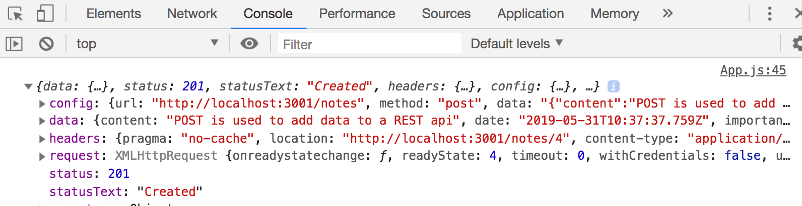
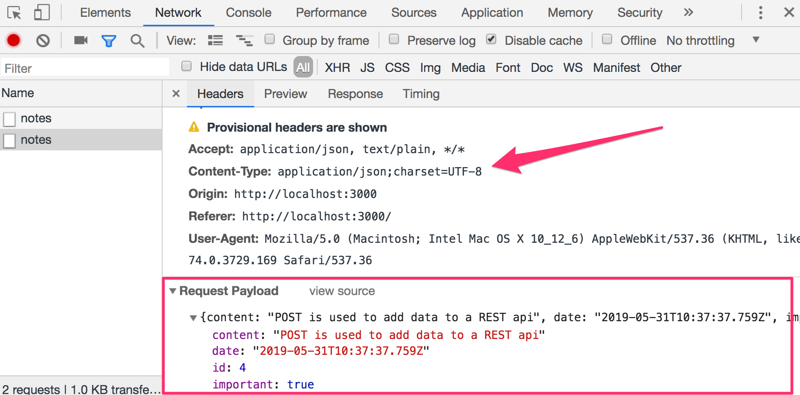
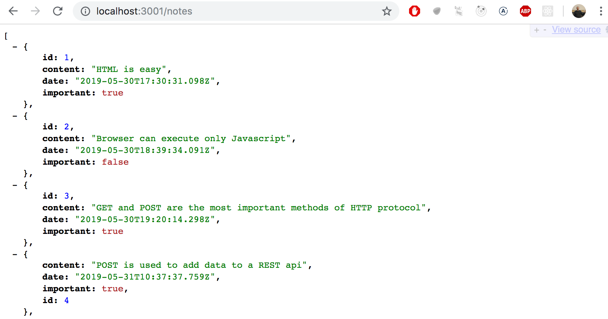
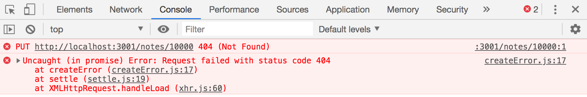
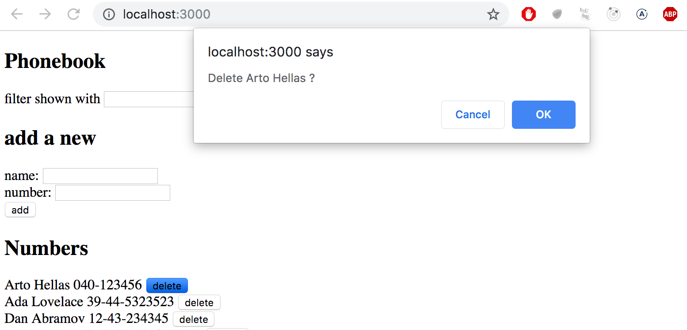

<div class="content">


<!-- When creating notes in our application, we would naturally want to store them in some backend server. The [json-server](https://github.com/typicode/json-server) package claims to be a so-called REST or RESTful API in its documentation: -->
在应用中创建便笺时，我们自然希望将它们存储在某个后端服务器中。 在文档中，[json-server](https://github.com/typicode/json-server 服务器)包提到了所谓的 REST 或 RESTful API:

> <i>Get a full fake REST API with zero coding in less than 30 seconds (seriously)</i>
在不到30秒(严肃地)的情况下得到一个完整的模拟 REST API，0编码

<!-- The json-server does not exactly match the description provided by the textbook [definition](https://en.wikipedia.org/wiki/Representational_state_transfer) of a REST API, but neither do most other APIs claiming to be RESTful. -->
Json-server 与 REST API 的教科书[定义](https://en.wikipedia.org/wiki/representational_state_transfer)提供的描述不完全匹配，但是自称是 RESTful 的大多数服务都不完全匹配。 

<!-- We will take a closer look at REST in the [next part](/zh/part3) of the course, but it's important to familiarize ourselves at this point with some of the [conventions](https://en.wikipedia.org/wiki/Representational_state_transfer#Applied_to_web_services) used by json-server and REST APIs in general. In particular, we will be taking a look at the conventional use of [routes](https://github.com/typicode/json-server#routes), aka URLs and HTTP request types, in REST. -->
我们将在本课程的[下一章节](/zh/part3)中进一步了解 REST，但是熟悉 json-server 和 REST api 经常使用的一些[约定](https://en.wikipedia.org/wiki/representational_state_transfer#applied_to_web_services)是很重要的。 特别是，我们将会看到在 REST 中常规使用[路由](https://github.com/typicode/json-server#routes) ，即 url 和 HTTP 请求类型。

### REST
<!-- In REST terminology, we refer to individual data objects, such as the notes in our application, as <i>resources</i>. Every resource has a unique address associated with it - its URL. According to a general convention used by json-server, we would be able to locate an individual note at the resource URL <i>notes/3</i>, where 3 is the id of the resource. The <i>notes</i> url, on the other hand, would point to a resource collection containing all the notes. -->
在 REST 术语中，我们将单个数据对象(如应用中的便笺)称为<i>resources</i>。 每个资源都有一个唯一的地址——它的 URL。 根据 json-server 使用的一般约定，我们将能够在资源  URL， 即<i>notes/3</i>上定位某个便笺，其中3是资源的 id。 另一方面， <i>notes</i> url 指向包含所有便笺的资源集合。

<!-- Resources are fetched from the server with HTTP GET requests. For instance, an HTTP GET request to the URL <i>notes/3</i> will return the note that has the id number 3. An HTTP GET request to the <i>notes</i> URL would return a list of all notes. -->
通过 HTTP GET 请求从服务器获取资源。 例如，对 URL<i>notes/3</i> 的 HTTP GET 请求将返回 id 为3的便笺。 对<i>notes</i> URL 的 HTTP GET 请求将返回所有便笺的列表。

<!-- Creating a new resource for storing a note is done by making an HTTP POST request to the <i>notes</i> URL according to the REST convention that the json-server adheres to. The data for the new note resource is sent in the <i>body</i> of the request. -->
根据 json 服务器遵守的 REST 约定，通过向<i>notes</i> URL 发出 HTTP POST 请求来创建、存储新的便笺。 新便笺资源的数据在请求的<i>body</i> 中发送。

<!-- json-server requires all data to be sent in JSON format. What this means in practice is that the data must be a correctly formatted string, and that the request must contain the <i>Content-Type</i> request header with the value <i>application/json</i>. -->
Json-server 要求以 JSON 格式发送所有数据。 实际上，这意味着数据必须是格式正确的字符串，并且请求必须包含值为<i>application/json</i> 的<i>Content-Type</i> 请求头。 

### Sending Data to the Server 
【发送数据到服务器】
<!-- Let's make the following changes to the event handler responsible for creating a new note: -->
让我们对负责创建新便笺的事件处理进行如下更改:

```js
addNote = event => {
  event.preventDefault()
  const noteObject = {
    content: newNote,
    date: new Date(),
    important: Math.random() < 0.5,
  }

// highlight-start
  axios
    .post('http://localhost:3001/notes', noteObject)
    .then(response => {
      console.log(response)
    })
// highlight-end
}
```


<!-- We create a new object for the note but omit the <i>id</i> property, since it's better to let the server generate ids for our resources! -->
我们为便笺创建了一个新对象，但忽略了<i>id</i> 属性，因为最好让服务器为我们的资源生成 id！

<!-- The object is sent to the server using the axios <em>post</em> method. The registered event handler logs the response that is sent back from the server to the console. -->
使用 axios <em>post</em> 方法将对象发送到服务器。 已注册的事件处理函数从服务器发送回控制台的响应记录。

<!-- When we try to create a new note, the following output pops up in the console: -->
当我们尝试创建一个新的便笺时，控制台会弹出如下输出:



<!-- The newly created note resource is stored in the value of the <i>data</i> property of the _response_ object. -->
新创建的便笺资源存储在response对象的<i>data</i> 属性值中。

<!-- Sometimes it can be useful to inspect HTTP requests in the <i>Network</i> tab of Chrome developer tools, which was used heavily at the beginning of [第0章](/zh/part0/web_应用的基础设施#http-get): -->
有时在 Chrome 开发工具的<i>Network</i> 选项卡中检查 HTTP 请求是很有用的，这个选项卡在[第 0 章](/zh/part0/web_应用的基础设施#http-get) 开始时被大量使用:




<!-- We can use the inspector to check that the headers sent in the POST request are what we expected them to be, and that their values are correct. -->
我们可以使用检查器来检查 POST 请求中发送的头文件是否符合我们的预期，以及它们的值是否正确。

<!-- Since the data we sent in the POST request was a JavaScript object, axios automatically knew to set the appropriate <i>application/json</i> value for the <i>Content-Type</i> header. -->
由于我们在 POST 请求中发送的数据是一个 JavaScript 对象，axios 自动懂得为<i>Content-Type</i> 头设置适当的<i>application/json</i> 值。

<!-- The new note is not rendered to the screen yet. This is because we did not update the state of the <i>App</i> component when we created the new note. Let's fix this: -->
新的便笺还没有渲染到屏幕上。 这是因为我们在创建新便笺时没有更新<i>App</i> 组件的状态。 让我们来解决这个问题:

```js
addNote = event => {
  event.preventDefault()
  const noteObject = {
    content: newNote,
    date: new Date(),
    important: Math.random() > 0.5,
  }

  axios
    .post('http://localhost:3001/notes', noteObject)
    .then(response => {
      // highlight-start
      setNotes(notes.concat(response.data))
      setNewNote('')
      // highlight-end
    })
}
```

<!-- The new note returned by the backend server is added to the list of notes in our application's state in the customary way of using the <em>setNotes</em> function and then resetting the note creation form. An [important detail](/zh/part1/深入_react_应用调试#handling-arrays) to remember is that the <em>concat</em> method does not change the component's original state, but instead creates a new copy of the list. -->
后端服务器返回的新便笺将按照使用 <em>setNotes</em> 函数然后重置便笺创建表单的惯例方式添加到应用状态的便笺列表中。 需要记住的一个 [重要细节important detail](/zh/part1/深入_react_应用调试#handling-arrays) 是 <em>concat</em> 方法不会改变组件的原始状态，而是创建列表的新副本。

<!-- Once the data returned by the server starts to have an effect on the behavior of our web applications, we are immediately faced with a whole new set of challenges arising from, for instance, the asynchronicity of communication. This necessitates new debugging strategies, console logging and other means of debugging become increasingly more important, and we must also develop a sufficient understanding of the principles of both the JavaScript runtime and React components. Guessing won't be enough. -->
一旦服务器返回的数据开始影响我们 web 应用的行为，我们就会立即面临一系列全新的挑战，例如，通信的异步性。 这就需要新的调试策略，控制台日志和其他调试手段变得越来越重要，我们还必须对 JavaScript 运行时和 React 组件的原理有充分的理解。 光靠猜是不够的。

<!-- It's beneficial to inspect the state of the backend server e.g. through the browser: -->
通过浏览器检查后端服务器的状态是有益的:




<!-- This makes it possible to verify that all the data we intended to send was actually received by the server. -->
这样就可以验证我们打算发送的所有数据是否实际上已经被服务器接收。

<!-- In the next part of the course we will learn to implement our own logic in the backend. We will then take a closer look at tools like [postman](https://www.postman.com/downloads/) that help us to debug our server applications. However, inspecting the state of the json-server through the browser is sufficient for our current needs. -->
在本课程的下一章节中，我们将学习如何在后端实现我们自己的逻辑。 然后，我们将进一步研究一些工具，如[Postman](https://www.postman.com/downloads/) ，这些工具可以帮助我们调试服务器应用。 但是，通过浏览器检查 json-server 的状态就足以满足我们当前的需求。

> <!--**NB:** In the current version of our application the browser adds the creation date property to the note. Since the clock of the machine running the browser can be wrongly configured, it's much wiser to let the backend server generate this timestamp for us. This is in fact what we will do in the next part of the course.-->
注意: 在当前版本的应用中，浏览器在便笺中添加了创建日期属性。 由于运行浏览器的机器的时钟可能错误地配置，所以让后端服务器为我们生成这个时间戳要明智得多。 这实际上就是我们在下一章节课程中要做的。

<!-- The code for the current state of our application can be found in the  <i>part2-5</i> branch on [github](https://github.com/fullstack-hy/part2-notes/tree/part2-5). -->
我们应用当前状态的代码可以在[github](https://github.com/fullstack-hy/part2-notes/tree/part2-5)上的<i>part2-5</i> 分支中找到。


### Changing the Importance of Notes
【改变便笺的重要性】

<!-- Let's add a button to every note that can be used for toggling its importance. -->
让我们为每个便笺添加一个按钮，用于切换它的重要性。

<!-- We make the following changes to the <i>Note</i> component: -->
我们对<i>Note</i> 组件进行如下更改:

```js
const Note = ({ note, toggleImportance }) => {
  const label = note.important
    ? 'make not important' : 'make important'

  return (
    <li>
      {note.content} 
      <button onClick={toggleImportance}>{label}</button>
    </li>
  )
}
```

<!-- We add a button to the component and assign its event handler as the <em>toggleImportance</em> function passed in the component's props. -->
我们向组件添加一个按钮，并将其事件处理作为<em>toggleImportance</em>函数的 props 传递到组件中。

<!-- The <i>App</i> component defines an initial version of the <em>toggleImportanceOf</em> event handler function and passes it to every <i>Note</i> component: -->
<i>App</i>组件定义了 <em>toggleImportanceOf</em>事件处理函数的初始版本，并将其传递给每个<i>Note</i>组件:

```js
const App = () => {
  const [notes, setNotes] = useState([]) 
  const [newNote, setNewNote] = useState('')
  const [showAll, setShowAll] = useState(true)

  // ...

  // highlight-start
  const toggleImportanceOf = (id) => {
    console.log('importance of ' + id + ' needs to be toggled')
  }
  // highlight-end

  // ...

  return (
    <div>
      <h1>Notes</h1>
      <div>
        <button onClick={() => setShowAll(!showAll)}>
          show {showAll ? 'important' : 'all' }
        </button>
      </div>      
      <ul>
        {notesToShow.map((note, i) => 
          <Note
            key={i}
            note={note} 
            toggleImportance={() => toggleImportanceOf(note.id)} // highlight-line
          />
        )}
      </ul>
      // ...
    </div>
  )
}
```

<!-- Notice how every note receives its own <i>unique</i> event handler function, since the <i>id</i> of every note is unique. -->
注意每个便笺是如何接收它自己唯一的 事件处理函数的，因为每个便笺的<i> id</i> 是唯一的。

<!-- E.g. if <i>note.id</i> is 3, the event handler function returned by _toggleImportance(note.id)_ will be: -->
例如，如果我 <i>note.id</i>  是3， _toggleImportance(note.id)_ 返回的事件处理函数将是:

```js
() => { console.log('importance of 3 needs to be toggled') }
```

<!-- A short reminder here. The string printed by the event handler is defined in Java-like manner by adding the strings: -->
这里有一个简短的提醒: 事件处理以类 java 的方式通过加号连接字符串定义字符串:

```js
console.log('importance of ' + id + ' needs to be toggled')
```

<!-- The [template string](https://developer.mozilla.org/en-US/docs/Web/JavaScript/Reference/Template_literals) syntax added in ES6 can be used to write similar strings in a much nicer way: -->
在 ES6中，添加 [template string](https://developer.mozilla.org/en-US/docs/Web/JavaScript/Reference/Template_literals) 语法可以用一种更好的方式来编写类似的字符串:

```js
console.log(`importance of ${id} needs to be toggled`)
```

<!-- We can now use the "dollar-bracket"-syntax to add parts to the string that will evaluate JavaScript expressions, e.g. the value of a variable. Note that the quotation marks used in template strings differ from the quotation marks used in regular JavaScript strings. -->
我们现在可以使用“ dollar-bracket”语法向字符串中添加内容来计算 JavaScript 表达式，例如变量的值。 注意，模板字符串中使用的反引号与常规 JavaScript 字符串中使用的引号不同。

<!-- Individual notes stored in the json-server backend can be modified in two different ways by making HTTP requests to the note's unique URL. We can either <i>replace</i> the entire note with an HTTP PUT request, or only change some of the note's properties with an HTTP PATCH request. -->
存储在 json-server 后端中的各个便笺可以通过对便笺的唯一 URL 发出 HTTP 请求，以两种不同的方式进行修改。 我们可以用 HTTP PUT 请求<i>替换</i> 整个便笺，或者只用 HTTP PATCH 请求更改便笺的一些属性。

<!-- The final form of the event handler function is the following: -->
事件处理函数的最终形式如下:

```js
const toggleImportanceOf = id => {
  const url = `http://localhost:3001/notes/${id}`
  const note = notes.find(n => n.id === id)
  const changedNote = { ...note, important: !note.important }

  axios.put(url, changedNote).then(response => {
    setNotes(notes.map(note => note.id !== id ? note : response.data))
  })
}
```


<!-- Almost every line of code in the function body contains important details. The first line defines the unique url for each note resource based on its id. -->
函数体中几乎每一行代码都包含重要的细节。 第一行根据每个便笺资源的 id 定义其唯一的 url。

<!-- The array [find method](https://developer.mozilla.org/en-US/docs/Web/JavaScript/Reference/Global_Objects/Array/find) method is used to find the note we want to modify, and we then assign it to the _note_ variable. -->
数组的 [find method](https://developer.mozilla.org/en-us/docs/web/javascript/reference/global_objects/array/find)用于查找要修改的便笺，然后将其分配给note变量。

<!-- After this we create a <i>new object</i> that is an exact copy of the old note, apart from the important property.  -->
在此之后，我们创建一个<i>新对象</i>，除了重要性属性，它完全是旧便笺的副本。

<!-- The code for creating the new object that uses the [object spread](https://developer.mozilla.org/en-US/docs/Web/JavaScript/Reference/Operators/Spread_syntax) syntax may seem a bit strange at first: -->
使用[对象展开object spread](https://developer.mozilla.org/en-US/docs/Web/JavaScript/Reference/Operators/Spread_syntax)语法创建新对象的代码可能看起来有点奇怪:


```js
const changedNote = { ...note, important: !note.important }
```

<!-- In practice <em>{ ...note }</em> creates a new object with copies of all the properties from the _note_ object. When we add properties inside the curly braces after the spreaded object, e.g. <em>{ ...note, important: true }</em>, then the value of the _important_ property of the new object will be _true_. In our example the <em>important</em> property gets the negation of its previous value in the original object. -->
实际上， <em>{ ...note }</em> 创建一个新对象，其中包含来自 note 对象的所有属性的副本。 当我们在 spreaded 对象后面的花括号中添加属性时，例如<em>{ ...note, important: true }</em>，那么新对象的重要性属性的值将为 true。 在我们的示例中，<em>important</em> 属性在原始对象中取其先前值的反值。


<!-- There's a few things to point out. Why did we make a copy of the note object we wanted to modify, when the following code also appears to work: -->
有几点需要指出。 为什么我们要复制我们想要修改的 note 对象，而下面的代码似乎也可以工作:

```js
const note = notes.find(n => n.id === id)
note.important = !note.important

axios.put(url, note).then(response => {
  // ...
```

<!-- This is not recommended because the variable <em>note</em> is a reference to an item in the <em>notes</em> array in the component's state, and as we recall we must never mutate state directly in React.  -->
不建议这样做，因为变量 <em>note</em> 是对处于组件状态 <em>notes</em> 数组中某个项的引用，而且我们记得在 React 中绝不能直接修改状态。

<!-- It's also worth noting that the new object _changedNote_ is only a so-called [shallow copy](https://en.wikipedia.org/wiki/Object_copying#Shallow_copy), meaning that the values of the new object are the same as the values of the old object. If the values of the old object were objects themselves, then the copied values in new object would reference the same objects that were in the old object. -->
值得注意的是，新对象 changedNote 只是一个所谓的[浅拷贝](https://en.wikipedia.org/wiki/object_copying#shallow_copy) ，这意味着新对象的值与旧对象的值相同。 如果旧对象的值本身就是对象，那么**新对象中复制的值将引用旧对象中的相同对象**。

<!-- The new note is then sent with a PUT request to the backend where it will replace the old object. -->
然后这个新便笺与一个 PUT 请求一起发送到后端，它将在后端替换旧对象。

<!-- The callback function sets the component's <em>notes</em> state to a new array that contains all the items from the previous <em>notes</em> array, except for the old note which is replaced by the updated version of it returned by the server: -->
回调函数将组件的 <em>notes</em> 状态设置为一个新数组，该数组包含前一个<em>notes</em>  数组中的所有条目，但旧的条目被服务器返回的更新版本所替换:

```js
axios.put(url, changedNote).then(response => {
  setNotes(notes.map(note => note.id !== id ? note : response.data))
})
```

<!-- This is accomplished with the <em>map</em> method: -->
这是通过 <em>map</em>方法实现的:

```js
notes.map(note => note.id !== id ? note : response.data)
```

<!-- The map method creates a new array by mapping every item from the old array into an item in the new array. In our example, the new array is created conditionally so that if <em>note.id !== id</em> is true, we simply copy the item from the old array into the new array. If the condition is false, then the note object returned by the server is added to the array instead. -->
Map 方法通过将旧数组中的每个项映射到新数组中的一个项来创建一个新数组。 在我们的示例中，新数组被有条件地创建，即如果<em>note.id !== id</em>为true，我们只需将项从旧数组复制到新数组中。 如果条件为 false，则将服务器返回的 note 对象添加到数组中。 

<!-- This <em>map</em> trick may seem a bit strange at first, but it's worth spending some time wrapping your head around it. We will be using this method many times throughout the course. -->
这个<em>map</em> 技巧起初可能看起来有点奇怪，但是它值得你花一些时间去理解它。 在整个课程中，我们将多次使用这种方法。

### Extracting communication with the backend into a separate module
【将与后端的通信提取到单独的模块中】

<!-- The <i>App</i> component has become somewhat bloated after adding the code for communicating with the backend server. In the spirit of the [single responsibility principle](https://en.wikipedia.org/wiki/Single_responsibility_principle), we deem it wise to extract this communication into its own [module](/zh/part2/从渲染集合到模块学习#refactoring- 模块s). -->
在添加了用于与后端服务器通信的代码之后，<i>App</i> 组件变得有些臃肿。 本着[单一职责原则](https://en.wikipedia.org/wiki/single_responsibility_principle)的精神，我们认为将这种通信提取到它自己的[模块](/zh/part2/从渲染集合到模块学习#refactoring- 模块s)是明智的。

<!-- Let's create a <i>src/services</i> directory and add a file there called <i>notes.js</i>: -->
让我们创建一个<i>src/services</i>目录，并添加一个名为<i>notes.js</i> 的文件:

```js
import axios from 'axios'
const baseUrl = 'http://localhost:3001/notes'

const getAll = () => {
  return axios.get(baseUrl)
}

const create = newObject => {
  return axios.post(baseUrl, newObject)
}

const update = (id, newObject) => {
  return axios.put(`${baseUrl}/${id}`, newObject)
}

export default { 
  getAll: getAll, 
  create: create, 
  update: update 
}
```

<!-- The module returns an object that has three functions (<i>getAll</i>, <i>create</i>, and <i>update</i>) as its properties that deal with notes. The functions directly return the promises returned by the axios methods. -->
该模块返回一个具有三个函数（<i>getAll</i>, <i>create</i>, and <i>update</i>）的对象，作为其处理便笺的属性。 函数直接返回 axios 方法返回的允诺Promise。

<!-- The <i>App</i> component uses <em>import</em> to get access to the module: -->
<i>App</i> 组件使用 <em>import</em>访问模块:

```js
import noteService from './services/notes' // highlight-line

const App = () => {
```

<!-- The functions of the module can be used directly with the imported variable _noteService_ as follows: -->
该模块的功能可以直接与导入的变量 noteService 一起使用，具体如下:

```js
const App = () => {
  // ...

  useEffect(() => {
    // highlight-start
    noteService
      .getAll()
      .then(response => {
        setNotes(response.data)
      })
    // highlight-end
  }, [])

  const toggleImportanceOf = id => {
    const note = notes.find(n => n.id === id)
    const changedNote = { ...note, important: !note.important }

    // highlight-start
    noteService
      .update(id, changedNote)
      .then(response => {
        setNotes(notes.map(note => note.id !== id ? note : response.data))
      })
    // highlight-end
  }

  const addNote = (event) => {
    event.preventDefault()
    const noteObject = {
      content: newNote,
      date: new Date().toISOString(),
      important: Math.random() > 0.5
    }

// highlight-start
    noteService
      .create(noteObject)
      .then(response => {
        setNotes(notes.concat(response.data))
        setNewNote('')
      })
// highlight-end
  }

  // ...
}

export default App
```


<!-- We could take our implementation a step further. When the <i>App</i> component uses the functions, it receives an object that contains the entire response for the HTTP request: -->
我们可以将我们的实现更进一步。 当<i>App</i> 组件使用这些函数时，它接收到一个包含 HTTP 请求的整个响应的对象:

```js
noteService
  .getAll()
  .then(response => {
    setNotes(response.data)
  })
```

<!-- The <i>App</i> component only uses the <i>response.data</i> property of the response object. -->
<i>App</i> 组件只使用response对象的  <i>response.data</i> 属性。


<!-- The module would be much nicer to use if, instead of the entire HTTP response, we would only get the response data. Using the module would then look like this: -->
如果我们只获得响应数据，而不是整个 HTTP 响应，那么使用这个模块会更好。 使用这个模块看起来是这样的:

```js
noteService
  .getAll()
  .then(initialNotes => {
    setNotes(initialNotes)
  })
```

<!-- We can achieve this by changing the code in the module as follows (the current code contains some copy-paste, but we will tolerate that for now): -->
我们可以通过如下变更模块中的代码来实现这一点(当前的代码包含一些复制粘贴，但我们暂时可以容忍这一点) :

```js
import axios from 'axios'
const baseUrl = 'http://localhost:3001/notes'

const getAll = () => {
  const request = axios.get(baseUrl)
  return request.then(response => response.data)
}

const create = newObject => {
  const request = axios.post(baseUrl, newObject)
  return request.then(response => response.data)
}

const update = (id, newObject) => {
  const request = axios.put(`${baseUrl}/${id}`, newObject)
  return request.then(response => response.data)
}

export default { 
  getAll: getAll, 
  create: create, 
  update: update 
}
```

<!-- We no longer return the promise returned by axios directly. Instead, we assign the promise to the <em>request</em> variable and call its <em>then</em> method: -->
我们不再直接回应axios 的承诺。 相反，我们将 promise 分配给 <em>request</em> 变量，并调用它的<em>then</em> 方法:

```js
const getAll = () => {
  const request = axios.get(baseUrl)
  return request.then(response => response.data)
}
```


<!-- The last row in our function is simply a more compact expression of the same code as shown below: -->
我们函数的最后一行只是相同代码的更简洁的表达式，如下所示:

```js
const getAll = () => {
  const request = axios.get(baseUrl)
  // highlight-start
  return request.then(response => {
    return response.data
  })
  // highlight-end
}
```

<!-- The modified <em>getAll</em> function still returns a promise, as the <em>then</em> method of a promise also [returns a promise](https://developer.mozilla.org/en-US/docs/Web/JavaScript/Reference/Global_Objects/Promise/then).  -->
修改后的<em>getAll</em> 函数仍然返回一个 promise，因为 promise 的 <em>then</em>  方法也[返回一个 promise](https://developer.mozilla.org/en-us/docs/web/javascript/reference/global_objects/promise/then)。

<!-- After defining the parameter of the <em>then</em> method to directly return <i>response.data</i>, we have gotten the <em>getAll</em> function to work like we wanted it to. When the HTTP request is successful, the promise returns the data sent back in the response from the backend. -->
在定义了<em>then</em> 方法的参数直接返回<i>response.data</i> 之后，我们已经让 <em>getAll</em> 函数按照我们希望的方式工作。 当 HTTP 请求成功时，承诺将返回从后端响应中发送回来的数据。

<!-- We have to update the <i>App</i> component to work with the changes made to our module.  We have to fix the callback functions given as parameters to the <em>noteService</em> object's methods, so that they use the directly returned response data: -->
我们必须更新<i>App</i> 组件来处理对模块所做的更改。 我们必须修复作为参数给予<em>noteService</em>对象方法的回调函数，以便它们使用直接返回的响应数据:

```js
const App = () => {
  // ...

  useEffect(() => {
    noteService
      .getAll()
      // highlight-start      
      .then(initialNotes => {
        setNotes(initialNotes)
      // highlight-end
      })
  }, [])

  const toggleImportanceOf = id => {
    const note = notes.find(n => n.id === id)
    const changedNote = { ...note, important: !note.important }

    noteService
      .update(id, changedNote)
      // highlight-start      
      .then(returnedNote => {
        setNotes(notes.map(note => note.id !== id ? note : returnedNote))
      // highlight-end
      })
  }

  const addNote = (event) => {
    event.preventDefault()
    const noteObject = {
      content: newNote,
      date: new Date().toISOString(),
      important: Math.random() > 0.5
    }

    noteService
      .create(noteObject)
      // highlight-start      
      .then(returnedNote => {
        setNotes(notes.concat(returnedNote))
      // highlight-end
        setNewNote('')
      })
  }

  // ...
}
```

<!-- This is all quite complicated and attempting to explain it may just make it harder to understand. The internet is full of material discussing the topic, such as [this](https://javascript.info/promise-chaining) one. -->
这一切都相当复杂，试图解释它可能只会让它更难理解。 互联网上充满了讨论这个话题的材料，比如这个[this](https://javascript.info/promise-chaining)。

<!-- The "Async and performance" book from the [You do not know JS](https://github.com/getify/You-Dont-Know-JS/tree/1st-ed) book series explains the topic [well](https://github.com/getify/You-Dont-Know-JS/blob/1st-ed/async%20%26%20performance/ch3.md), but the explanation is many pages long. -->
在[You do not know JS](https://github.com/getify/You-Dont-Know-JS/tree/1st-ed) 一书中，对[这个议题](https://github.com/getify/You-Dont-Know-JS/blob/1st-ed/async%20%26%20performance/ch3.md)进行了很好的解释，但是解释有很多页

<!-- Promises are central to modern JavaScript development and it is highly recommended to invest a reasonable amount of time into understanding them. -->
承诺Promise是现代 JavaScript 开发的核心，强烈建议投入合理的时间来理解它们。


### Cleaner syntax for defining object literals 
【用于定义对象字面量的更清晰的语法】

<!-- The module defining note related services currently exports an object with the properties <i>getAll</i>, <i>create</i> and <i>update</i> that are assigned to functions for handling notes. -->
定义便笺相关服务的模块目前导出一个具有属性<i>getAll</i>、<i>create</i> 和<i>update</i> 的对象，这些属性分配给处理便笺的函数。


<!-- The module definition was: -->
模块的定义是:

```js
import axios from 'axios'
const baseUrl = 'http://localhost:3001/notes'

const getAll = () => {
  const request = axios.get(baseUrl)
  return request.then(response => response.data)
}

const create = newObject => {
  const request = axios.post(baseUrl, newObject)
  return request.then(response => response.data)
}

const update = (id, newObject) => {
  const request = axios.put(`${baseUrl}/${id}`, newObject)
  return request.then(response => response.data)
}

export default { 
  getAll: getAll, 
  create: create, 
  update: update 
}
```

<!-- The module exports the following, rather peculiar looking, object: -->
该模块导出下面这个看起来相当奇怪的对象:

```js
{ 
  getAll: getAll, 
  create: create, 
  update: update 
}
```


<!-- The labels to the left of the semi-colon in the object definition are the <i>keys</i> of the object, whereas the ones to the right of it are <i>variables</i> that are defined inside of the module. -->
在对象定义中，冒号左侧的标签是对象的<i>键</i>，而它右侧的标签是在模块内部定义的<i>variables</i>。


<!-- Since the names of the keys and the assigned variables are the same, we can write the object definition with more compact syntax: -->
由于键和赋值变量的名称是相同的，我们可以用更简洁的语法来编写对象定义:

```js
{ 
  getAll, 
  create, 
  update 
}
```


<!-- As a result the module definition gets simplified into the following form: -->
因此，模块定义被简化为如下形式:

```js
import axios from 'axios'
const baseUrl = 'http://localhost:3001/notes'

const getAll = () => {
  const request = axios.get(baseUrl)
  return request.then(response => response.data)
}

const create = newObject => {
  const request = axios.post(baseUrl, newObject)
  return request.then(response => response.data)
}

const update = (id, newObject) => {
  const request = axios.put(`${baseUrl}/${id}`, newObject)
  return request.then(response => response.data)
}

export default { getAll, create, update } // highlight-line
```

<!-- In defining the object using this shorter notation, we make use of a [new feature](https://developer.mozilla.org/en-US/docs/Web/JavaScript/Reference/Operators/Object_initializer#Property_definitions) that was introduced to JavaScript through ES6, enabling a slightly more compact way of defining objects using variables. -->
在使用这种较短的符号定义对象时，我们利用了通过 ES6引入到 JavaScript 中的一个[新特性new feature](https://developer.mozilla.org/en-US/docs/Web/JavaScript/Reference/Operators/Object_initializer#Property_definitions)  ，使得使用变量定义对象的方法更加简洁。

<!-- To demonstrate this feature, let's consider a situation where we have the following values assigned to variables: -->
为了演示这个特性，让我们考虑这样一种情况: 我们给变量赋值如下:

```js 
const name = 'Leevi'
const age = 0
```


<!-- In older versions of JavaScript we had to define an object like this: -->
在旧版本的 JavaScript 中，我们必须这样定义一个对象:

```js 
const person = {
  name: name,
  age: age
}
```

<!-- However, since both the property fields and the variable names in the object are the same, it's enough to simply write the following in ES6 JavaScript:  -->
然而，由于对象中的属性字段和变量名称都是相同的，只需在 ES6 JavaScript 中写入如下内容就足够了:

```js 
const person = { name, age }
```


<!-- The result is identical for both expressions. They both create an object with a <i>name</i> property with the value <i>Leevi</i> and an <i>age</i> property with the value <i>0</i>. -->
两个表达式的结果是相同的。 它们都创建了一个值为<i>Leevi</i> 的<i>name</i> 属性和值为<i>0</i> 的<i>age</i> 属性的对象。


### Promises and Errors 
【承诺和错误】

<!-- If our application allowed users to delete notes, we could end up in a situation where a user tries to change the importance of a note that has already been deleted from the system. -->
如果我们的应用允许用户删除便笺，那么我们可能会出现这样的情况: 用户试图更改已经从系统中删除的便笺的重要性。

<!-- Let's simulate this situation by making the <em>getAll</em> function of the note service return a "hardcoded" note that does not actually exist in the backend server: -->
让我们通过使 note 服务的<em>getAll</em>  函数返回一个“硬编码”的便笺来模拟这种情况，这个便笺实际上并不存在于后端服务器中:

```js
const getAll = () => {
  const request = axios.get(baseUrl)
  const nonExisting = {
    id: 10000,
    content: 'This note is not saved to server',
    date: '2019-05-30T17:30:31.098Z',
    important: true,
  }
  return request.then(response => response.data.concat(nonExisting))
}
```

<!-- When we try to change the importance of the hardcoded note, we see the following error message in the console. The error says that the backend server responded to our HTTP PUT request with a status code 404 <i>not found</i>. -->
当我们试图更改硬编码说明的重要性时，我们在控制台中看到如下错误消息。 错误说明后端服务器用状态码404<i>not found</i> 响应了我们的 HTTP PUT 请求。



<!-- The application should be able to handle these types of error situations gracefully. Users won't be able to tell that an error has actually occurred unless they happen to have their console open. The only way the error can be seen  in the application is that clicking the button has no effect on the importance of the note. -->
应用应该能够很好地处理这些类型的错误情况。 除非用户碰巧打开了自己的控制台，否则他们无法判断错误确实发生了。 在应用中可以看到错误的唯一方式是单击按钮看看对便笺的重要性没有影响。

<!-- We had [previously](/zh/part2/从服务器获取数据#axios-and-promises) mentioned that a promise can be in one of three different states. When an HTTP request fails, the associated promise is <i>rejected</i>. Our current code does not handle this rejection in any way. -->
我们 [之前](/zh/part2/从服务器获取数据#axios-and-promises) 提到，一个承诺可以处于三种不同的状态之一。 当 HTTP 请求失败时，相关的承诺是<i>rejected</i>。 我们当前的代码没有以任何方式处理这种拒绝。

<!-- The rejection of a promise is [handled](https://developer.mozilla.org/en-US/docs/Web/JavaScript/Guide/Using_promises) by providing the <em>then</em> method with a second callback function, which is called in the situation where the promise is rejected. -->
拒绝承诺是通过给<em>then</em> 方法提供第二个回调函数来处理的，这个[handled](https://developer.mozilla.org/en-US/docs/Web/JavaScript/Guide/Using_promises) 在承诺被拒绝的情况下被调用。

<!-- The more common way of adding a handler for rejected promises is to use the [catch](https://developer.mozilla.org/en-US/docs/Web/JavaScript/Reference/Global_Objects/Promise/catch) method.  -->
为被拒绝的承诺添加处理程序的更常见的方法是使用[catch](https://developer.mozilla.org/en-us/docs/web/javascript/reference/global_objects/promise/catch)方法。


<!-- In practice, the error handler for rejected promises is defined like this: -->
实际上，拒绝承诺的错误处理程序的定义如下:

```js
axios
  .get('http://example.com/probably_will_fail')
  .then(response => {
    console.log('success!')
  })
  .catch(error => {
    console.log('fail')
  })
```

<!-- If the request fails, the event handler registered with the <em>catch</em> method gets called. -->
如果请求失败，则调用<em>catch</em> 方法注册的事件处理程序。

<!-- The <em>catch</em> method is often utilized by placing it deeper within the promise chain. -->
<em>catch</em> 方法通常是通过将其置于Promise链的更深处来使用的。

<!-- When our application makes an HTTP request, we are in fact creating a [promise chain](https://javascript.info/promise-chaining): -->
当我们的应用发出一个 HTTP 请求时，我们实际上是在创建一个 [promise chain](https://javascript.info/promise-chaining):

```js
axios
  .put(`${baseUrl}/${id}`, newObject)
  .then(response => response.data)
  .then(changedNote => {
    // ...
  })
```

<!-- The <em>catch</em> method can be used to define a handler function at the end of a promise chain, which is called once any promise in the chain throws an error and the promise becomes <i>rejected</i>.  -->
<em>catch</em>  方法可用于在承诺链的末尾定义一个处理程序函数，一旦承诺链中的任何承诺抛出错误，承诺就变成<i>rejected</i>，就会调用该函数。

```js
axios
  .put(`${baseUrl}/${id}`, newObject)
  .then(response => response.data)
  .then(changedNote => {
    // ...
  })
  .catch(error => {
    console.log('fail')
  })
```


<!-- Let's use this feature and register an error handler in the <i>App</i> component: -->
让我们使用这个特性并在<i>App</i> 组件中注册一个错误处理程序:

```js
const toggleImportanceOf = id => {
  const note = notes.find(n => n.id === id)
  const changedNote = { ...note, important: !note.important }

  noteService
    .update(id, changedNote).then(returnedNote => {
      setNotes(notes.map(note => note.id !== id ? note : returnedNote))
    })
    // highlight-start
    .catch(error => {
      alert(
        `the note '${note.content}' was already deleted from server`
      )
      setNotes(notes.filter(n => n.id !== id))
    })
    // highlight-end
}
```


<!-- The error message is displayed to the user with the trusty old [alert](https://developer.mozilla.org/en-US/docs/Web/API/Window/alert) dialog popup, and the deleted note gets filtered out from the state. -->
错误消息会通过弹出可靠的老式[alert](https://developer.mozilla.org/en-US/docs/Web/API/Window/alert)对话框显示给用户，并且已删除的便笺会从状态中过滤掉。

<!-- Removing an already deleted note from the application's state is done with the array [filter](https://developer.mozilla.org/en-US/docs/Web/JavaScript/Reference/Global_Objects/Array/filter) method, which returns a new array comprising only of the items from the list for which the function that was passed as a parameter returns true for: -->
从应用的状态中删除已经删除的便笺是通过数组的 [filter](https://developer.mozilla.org/en-us/docs/web/javascript/reference/global_objects/array/filter)方法完成的，该方法返回一个新的数组，其中只包含列表中的项目，作为参数传递的函数返回 true :

```js
notes.filter(n => n.id !== id)
```

<!-- It's probably not a good idea to use alert in more serious React applications. We will soon learn a more advanced way of displaying messages and notifications to users. There are situations, however, where a simple, battle-tested method like <em>alert</em> can function as a starting point. A more advanced method could always be added in later, given that there's time and energy for it. -->
在更严肃的 React 应用中使用alert可能不是一个好主意。 我们很快就会学到一种更先进的向用户显示消息和通知的方式。 然而，在某些情况下，像<em>alert</em>这样简单的、经过实战检验的方法可以作为一个起点。 如果有时间和精力的话，可以在以后添加一个更高级的方法。

<!-- The code for the current state of our application can be found in the  <i>part2-6</i> branch on [GitHub](https://github.com/fullstack-hy/part2-notes/tree/part2-6). -->
我们应用当前状态的代码可以在[GitHub](https://github.com/fullstack-hy/part2-notes/tree/part2-6)上的<i>part2-6</i> 分支中找到。

</div>


<div class="tasks">


<h3>Exercises 2.15.-2.18.</h3>
<h4>2.15: Phonebook 步骤7</h4>
<!-- Let's return to our phonebook application. -->
让我们回到我们的电话簿应用。

<!-- Currently, the numbers that are added to the phonebook are not saved to a backend server. Fix this situation. -->
目前，添加到电话簿中的号码没有保存到后端服务器中。修复这种情况

<h4>2.16: Phonebook 步骤8</h4>
<!-- Extract the code that handles the communication with the backend into its own module by following the example shown earlier in this part of the course material. -->
通过遵循课程教材本章前面所示的示例，将处理与后端的通信的代码提取到它自己的模块中。

<h4>2.17: Phonebook 步骤9</h4>
<!-- Make it possible for users to delete entries from the phonebook. The deletion can be done through a dedicated button for each person in the phonebook list. You can confirm the action from the user by using the [window.confirm](https://developer.mozilla.org/en-US/docs/Web/API/Window/confirm) method: -->
  使用户可以从电话簿中删除条目。 删除可以通过电话簿列表中每个人的专用按钮来完成。 你可以通过使用 <a href="https://developer.mozilla.org/en-US/docs/Web/API/Window/confirm">window.confirm</a> 方法来确认用户的操作:



<!-- The associated resource for a person in the backend can be deleted by making an HTTP DELETE request to the resource's URL. If we are deleting e.g. a person who has the <i>id</i> 2, we would have to make an HTTP DELETE request to the URL <i>localhost:3001/persons/2</i>. No data is sent with the request. -->
通过对资源的 URL 发出 HTTP DELETE 请求，可以删除后端中人员的关联资源。 例如，如果我们要删除一个拥有<i>id</i> 为2的人，我们必须向 <i>localhost:3001/persons/2</i>. 发出 HTTP DELETE 请求。 请求没有发送任何数据。

<!-- You can make an HTTP DELETE request with the [axios](https://github.com/axios/axios) library in the same way that we make all of the other requests. -->
您可以使用[axios](https://github.com/axios/axios)库发出 HTTP DELETE 请求，就像我们发出所有其他请求一样。

<!-- **NB:** You can't use the name <em>delete</em> for a variable because it's a reserved word in JavaScript. E.g. the following is not possible: -->

注意：不能对变量使用 <em>delete</em>  这个名称，因为它在 JavaScript 中是一个保留字。 例如，下列情况是不可能的:

```js
// use some other name for variable!
const delete = (id) => {
  // ...
}
```

<h4>2.18*: Phonebook 步骤10</h4>
<!-- Change the functionality so that if a number is added to an already existing user, the new number will replace the old number. It's recommended to use the HTTP PUT method for updating the phone number.  -->
更改功能，以便如果一个号码被添加到一个已经存在的用户，新的号码将取代旧的号码。 建议使用 HTTP PUT 方法更新电话号码。

<!-- If the person's information is already in the phonebook, the application can confirm the action from the user: -->
如果用户的信息已经在电话簿中，应用可以确认用户的操作:


</div>

