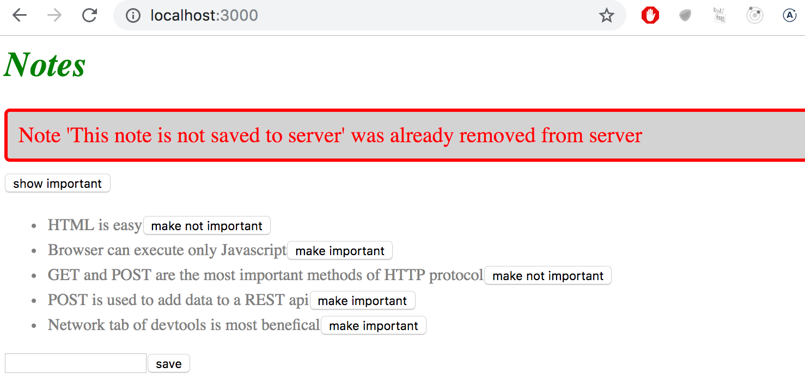
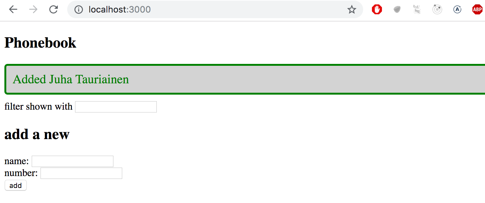
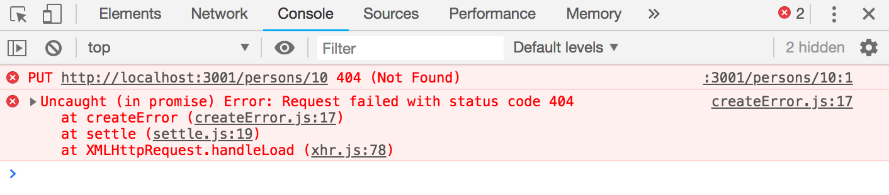
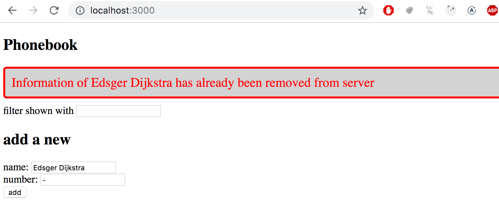

<div class="content">


<!-- The appearance of our current application is quite modest. In [exercise 0.2](/zh/part0/web_应用的基础设施#exercises-0-1-0-6), the assignment was to go through Mozilla's [CSS tutorial](https://developer.mozilla.org/en-US/docs/Learn/Getting_started_with_the_web/CSS_basics). -->

我们当前应用的外观是相当克制的。 在 [exercise 0.2](/zh/part0/web_应用的基础设施#exercises-0-1-0-6)中，作业是浏览 Mozilla 的[CSS 教程](https://developer.Mozilla.org/en-us/docs/learn/getting_started_with_the_web/css_basics)。

<!-- Before we move onto the next part, let's take a look at how we can add styles to a React application. There are several different ways of doing this and we will take a look at the other methods later on. At first, we will add CSS to our application the old-school way; in a single file without using a [CSS preprocessor](https://developer.mozilla.org/en-US/docs/Glossary/CSS_preprocessor) (although this is not entirely true as we will learn later on).  -->
在进入下一章节之前，让我们先看看如何向 React 应用添加样式。 有几种不同的方法可以做到这一点，我们将在稍后介绍其他的方法。 首先，我们将以传统的方式将 CSS 放在一个单独的文件中来添加到我们的应用中; 先不使用[CSS preprocessor](https://developer.mozilla.org/en-US/docs/Glossary/CSS_preprocessor) 尽管这并不完全正确，我们将在后面来学习)。


<!-- Let's add a new <i>index.css</i> file under the <i>src</i> directory and then add it to the application by importing it in the <i>index.js</i> file: -->
让我们在<i>src</i> 目录下添加一个新的<i>index.css</i> 文件，然后通过导入<i>index.js</i> 文件将其添加到应用中:

```js
import './index.css'
```

<!-- Let's add the following CSS rule to the <i>index.css</i> file: -->
让我们在<i>index.CSS</i> 文件中添加如下 CSS 规则:

```css
h1 {
  color: green;
}
```

<!-- CSS rules comprise of <i>selectors</i> and <i>declarations</i>. The selector defines which elements the rule should be applied to. The selector above is <i>h1</i>, which will match all of the <i>h1</i> header tags in our application. -->
CSS  规则由<i>选择器</i> 和<i>声明</i> 组成。 选择器定义规则应该应用于哪些元素。 上面的选择器是<i>h1</i>，它将匹配我们应用中的所有<i>h1</i> 头标记。 


<!-- The declaration sets the _color_ property to the value <i>green</i>. -->
声明将 color 属性设置为值<i>green</i>。

<!-- One CSS rule can contain an arbitrary number of properties. Let's modify the previous rule to make the text cursive, by defining the font style as <i>italic</i>: -->
一个 CSS 规则可以包含任意数量的属性。 让我们修改前面的规则，将字体样式定义为<i>italic</i>:

```css
h1 {
  color: green;
  font-style: italic;  // highlight-line
}
```

<!-- There are many ways of matching elements by using [different types of CSS selectors](https://developer.mozilla.org/en-US/docs/Web/CSS/CSS_Selectors). -->
使用不同类型的 CSS 选择器有许多匹配元素的方法，参考 [different types of CSS selectors](https://developer.mozilla.org/en-US/docs/Web/CSS/CSS_Selectors)。

<!-- If we wanted to target, let's say, each one of the notes with our styles, we could use the selector <i>li</i>, as all of the notes are wrapped inside <i>li</i> tags: -->
如果我们想针对每个便笺的风格，我们可以使用选择器<i>li</i>，因为所有便笺都包装在<i>li</i> 标签中:

```js
const Note = ({ note, toggleImportance }) => {
  const label = note.important 
    ? 'make not important' 
    : 'make important';

  return (
    <li>
      {note.content} 
      <button onClick={toggleImportance}>{label}</button>
    </li>
  )
}
```

<!-- Let's add the following rule to our style sheet (since my knowledge of elegant web design is close to zero, the styles don't make much sense): -->
让我们在样式表中加入如下规则(因为我对优雅网页设计的知识接近于零，所以这种样式没有多大意义) :

```css
li {
  color: grey;
  padding-top: 3px;
  font-size: 15px;
}
```


<!-- Using element types for defining CSS rules is slightly problematic. If our application contained other <i>li</i> tags, the same style rule would also be applied to them. -->
使用元素类型来定义 CSS 规则有点问题。 如果我们的应用包含其他<i>li</i> 标签，那么同样的样式规则也应用于它们。


<!-- If we want to apply our style specifically to notes, then it is better to use [class selectors](https://developer.mozilla.org/en-US/docs/Web/CSS/Class_selectors). -->
如果我们想把我们的风格特别地应用到便笺上，那么最好使用[类选择器](https://developer.mozilla.org/en-us/docs/web/css/class_selectors)。


<!-- In regular HTML, classes are defined as the value of the <i>class</i> attribute: -->
在常规 HTML 中，class 被定义为<i>class</i> 属性的值:

```html
<li class="note">some text...</li>
```

<!-- In React we have to use the [className](https://reactjs.org/docs/dom-elements.html#classname) attribute instead of the class attribute. With this in mind, let's make the following changes to our <i>Note</i> component: -->
在React中，我们必须使用[className](https://reactjs.org/docs/dom-elements.html#className)属性而不是 class 属性。 考虑到这一点，让我们对<i>Note</i> 组件进行如下更改:

```js
const Note = ({ note, toggleImportance }) => {
  const label = note.important 
    ? 'make not important' 
    : 'make important';

  return (
    <li className='note'> // highlight-line
      {note.content} 
      <button onClick={toggleImportance}>{label}</button>
    </li>
  )
}
```


<!-- Class selectors are defined with the _.classname_ syntax: -->
类选择器使用. classname 语法定义:

```css
.note {
  color: grey;
  padding-top: 5px;
  font-size: 15px;
}
```


<!-- If you now add other <i>li</i> elements to the application, they will not be affected by the style rule above. -->
如果您现在向应用添加其他<i>li</i> 元素，它们将不会受到上述样式规则的影响。


### Improved error message 
【改进错误信息】
<!-- We previously implemented the error message that was displayed when the user tried to toggle the importance of a deleted note with the <em>alert</em> method. Let's implement the error message as its own React component. -->
我们先前实现了当用户试图通过<em>alert</em>方法切换删除便笺的重要性时，显示错误消息。 让我们将错误消息实现为它自己的 React 组件。

<!-- The component is quite simple: -->
这个组件非常简单:

```js
const Notification = ({ message }) => {
  if (message === null) {
    return null
  }

  return (
    <div className="error">
      {message}
    </div>
  )
}
```


<!-- If the value of the <em>message</em> prop is <em>null</em>, then nothing is rendered to the screen, and in other cases the message gets rendered inside of a div element. -->
如果 <em>message</em> prop 的值为 <em>null</em>，则不会向屏幕渲染任何内容，在其他情况下，消息会在 div 元素中渲染。

<!-- Let's add a new piece of state called <i>errorMessage</i> to the <i>App</i> component. Let's initialize it with some error message so that we can immediately test our component: -->
让我们在<i>App</i> 组件中添加一个名为<i>errorMessage</i> 的新状态。 让我们用一些错误信息来初始化它，这样我们就可以立即测试我们的组件:

```js
const App = () => {
  const [notes, setNotes] = useState([]) 
  const [newNote, setNewNote] = useState('')
  const [showAll, setShowAll] = useState(true)
  const [errorMessage, setErrorMessage] = useState('some error happened...') // highlight-line

  // ...

  return (
    <div>
      <h1>Notes</h1>
      <Notification message={errorMessage} /> // highlight-line
      <div>
        <button onClick={() => setShowAll(!showAll)}>
          show {showAll ? 'important' : 'all' }
        </button>
      </div>      
      // ...
    </div>
  )
}
```

<!-- Then let's add a style rule that suits an error message: -->
然后让我们添加一个适合错误消息的样式规则:

```css
.error {
  color: red;
  background: lightgrey;
  font-size: 20px;
  border-style: solid;
  border-radius: 5px;
  padding: 10px;
  margin-bottom: 10px;
}
```

<!-- Now we are ready to add the logic for displaying the error message. Let's change the <em>toggleImportanceOf</em> function in the following way: -->
现在，我们准备添加显示错误消息的逻辑。 让我们用下面的方法更改 <em>toggleImportanceOf</em> 函数:

```js
  const toggleImportanceOf = id => {
    const note = notes.find(n => n.id === id)
    const changedNote = { ...note, important: !note.important }

    noteService
      .update(changedNote).then(returnedNote => {
        setNotes(notes.map(note => note.id !== id ? note : returnedNote))
      })
      .catch(error => {
        // highlight-start
        setErrorMessage(
          `Note '${note.content}' was already removed from server`
        )
        setTimeout(() => {
          setErrorMessage(null)
        }, 5000)
        // highlight-end
        setNotes(notes.filter(n => n.id !== id))
      })
  }
```

<!-- When the error occurs we add a descriptive error message to the <em>errorMessage</em> state. At the same time we start a timer, that will set the <em>errorMessage</em> state to <em>null</em> after five seconds. -->
当出现错误时，我们向 <em>errorMessage</em> 状态添加一个错误描述消息。 与此同时，我们启动一个计时器，它将在5秒后将 <em>errorMessage</em>状态设置为<em>null</em>。


<!-- The result looks like this: -->
结果如下:




<!-- The code for the current state of our application can be found in the  <i>part2-7</i> branch on [github](https://github.com/fullstack-hy2020/part2-notes/tree/part2-7). -->
我们应用当前状态的代码可以在[github](https://github.com/fullstack-hy2020/part2-notes/tree/part2-7)上的<i>part2-7</i> 分支中找到。


### Inline styles
【内嵌样式】

<!-- React also makes it possible to write styles directly in the code as so-called [inline styles](https://react-cn.github.io/react/tips/inline-styles.html). -->
React也使得直接在代码中编写样式成为可能，即所谓的[内联样式](https://react-cn.github.io/react/tips/inline-styles.html)。 

<!-- The idea behind defining inline styles is extremely simple. Any React component or element can be provided with a set of CSS properties as a JavaScript object through the [style](https://reactjs.org/docs/dom-elements.html#style) attribute. -->
定义内联样式背后的思想非常简单。 任何 React 组件或元素都可以通过[style](https://reactjs.org/docs/dom-elements.html#style)属性作为 JavaScript 对象提供一组 CSS 属性。

<!-- CSS rules are defined slightly differently in JavaScript than in normal CSS files. Let's say that we wanted to give some element the color green and italic font that's 16 pixels in size. In CSS, it would look like this: -->
CSS 规则在 JavaScript 中的定义与普通 CSS 文件中的定义稍有不同。 假设我们想给一些元素绿色和斜体字体，大小为16像素。 在 CSS 中，它看起来像这样: 

```css
{
  color: green;
  font-style: italic;
  font-size: 16px;
}
```

<!-- But as a React inline style object it would look like this: -->
但是作为一个 React inline style 内置样式对象，它看起来是这样的:

```js
 {
  color: 'green',
  fontStyle: 'italic',
  fontSize: 16
}
```

<!-- Every CSS property is defined as a separate property of the JavaScript object. Numeric values for pixels can be simply defined as integers. One of the major differences compared to regular CSS, is that hyphenated (kebab case) CSS properties are written in camelCase. -->
每个 CSS 属性都被定义为 JavaScript 对象的一个独立属性。 像素的数值可以简单地定义为整数。 与常规 CSS 相比，一个主要的区别是连字符(kebab case)的 CSS 属性是用 camelCase 编写的。


<!-- Next, we could add a "bottom block" to our application by creating a <i>Footer</i> component and define the following inline styles for it: -->
接下来，我们可以通过创建一个<i>Footer</i> 组件向应用添加一个“ bottom block” ，并为它定义如下行内样式:

```js
// highlight-start
const Footer = () => {
  const footerStyle = {
    color: 'green',
    fontStyle: 'italic',
    fontSize: 16
  }

  return (
    <div style={footerStyle}>
      <br />
      <em>Note app, Department of Computer Science, University of Helsinki 2020</em>
    </div> 
  )
}
// highlight-end

const App = () => {
  // ...

  return (
    <div>
      <h1>Notes</h1>

      <Notification message={errorMessage} />

      // ...  

      <Footer /> // highlight-line
    </div>
  )
}
```

<!-- Inline styles come with certain limitations. For instance, so-called [pseudo-classes](https://developer.mozilla.org/en-US/docs/Web/CSS/Pseudo-classes) can't be used straightforwardly. -->
内联样式有一定的限制，例如，所谓的[pseudo-classes](https://developer.mozilla.org/en-US/docs/Web/CSS/Pseudo-classes)不能直接使用。


<!-- Inline styles and some of the other ways of adding styles to React components go completely against the grain of old conventions. Traditionally, it has been considered the best practice to entirely separate CSS from the content (HTML) and functionality (JavaScript). According to this older school of thought, the goal was to write CSS, HTML, and JavaScript into their separate files. -->
内联样式和其他一些将样式添加到 React 组件的方法完全违背了旧的惯例。 传统上，将 CSS 与内容(HTML)和功能(JavaScript)解耦被认为是最佳实践。 根据这个古老的思想流派，我们的目标是将 CSS、 HTML 和 JavaScript 编写到它们各自的文件中。

<!-- The philosophy of React is, in fact, the polar opposite of this. Since the separation of CSS, HTML, and JavaScript into separate files did not seem to scale well in larger applications, React bases the division of the application along the lines of its logical functional entities. -->
React的哲学，事实上，是这个极端的对立面。 由于将 CSS、 HTML 和 JavaScript 分离成单独的文件在大型应用中似乎不利于伸缩，所以 React 将应用按照其逻辑功能实体进行划分。 

<!-- The structural units that make up the application's functional entities are React components. A React component defines the HTML for structuring the content, the JavaScript functions for determining functionality, and also the component's styling; all in one place. This is to create individual components that are as independent and reusable as possible. -->
构成应用功能实体的结构单元是 React 组件。 React 组件定义了组织内容的 HTML，确定功能的 JavaScript 函数，以及组件的样式; 所有这些都放在一个地方。 这是为了创建尽可能独立和可重用的单个组件。

<!-- The code of the final version of our application can be found in the  <i>part2-8</i> branch on [github](https://github.com/fullstack-hy2020/part2-notes/tree/part2-8). -->
我们应用最终版本的代码可以在[github](https://github.com/fullstack-hy2020/part2-notes/tree/part2-8)上的<i>part2-8</i> 分支中找到。

</div>


<div class="tasks">


<h3>Exercises 2.19.-2.20.</h3>
<h4>2.19: Phonebook 步骤11</h4>
<!-- H42.19: 电话簿步骤11 / h4 -->

<!-- Use the [improved error message](/zh/part2/给_react应用加点样式#improved-error-message) example from part 2 as a guide to show a notification that lasts for a few seconds after a successful operation is executed (a person is added or a number is changed):  -->
使用第二章节中的[improved error message](/zh/part2/给_react应用加点样式#improved-error-message)示例作为指导，显示一个在成功操作执行后持续几秒钟的通知(添加一个人或更改一个数字) :




<h4>2.20*: Phonebook 步骤12</h4>

<!-- Open your application in two browsers. **If you delete a person in browser 1** a short while before attempting to <i>change the person's phone number</i> in browser 2, you will get the following error message: -->
在两个浏览器中打开应用。 **如果你在浏览器1中删除一个人** ，尝试在浏览器2中更改该人的电话号码，你会得到如下错误消息:



<!-- Fix the issue according to the example shown in [promise and errors](/zh/part2/在服务端将数据_alert出来#promises-and-errors) in part 2. Modify the example so that the user is shown a message when the operation does not succeed. The messages shown for successful and unsuccessful events should look different: -->
根据第2章节中显示的[promise and errors](/zh/part2/在服务端将数据_alert出来#promises-and-errors) 中的示例修复该问题。 修改此示例，以便在操作不成功时向用户显示消息。 成功和不成功的事件所显示的信息应该看起来不同:




<!-- **Note** that even if you handle the exception, the error message is printed to the console. -->

注意 ：即使您捕获并处理异常，错误消息也会打印到控制台。

<!-- This was the last exercise of this part of the course. It's time to push your code to GitHub and mark all of your finished exercises to the [exercise submission system](https://studies.cs.helsinki.fi/stats/courses/fullstackopen). -->
这是本课程这一章节的最后一个练习，现在是时候把你的代码推送到 GitHub，并将所有完成的练习标记到[练习提交系统](https://studies.cs.helsinki.fi/stats/courses/fullstackopen)。

</div>

