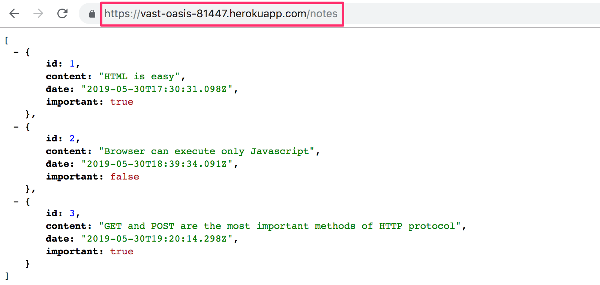
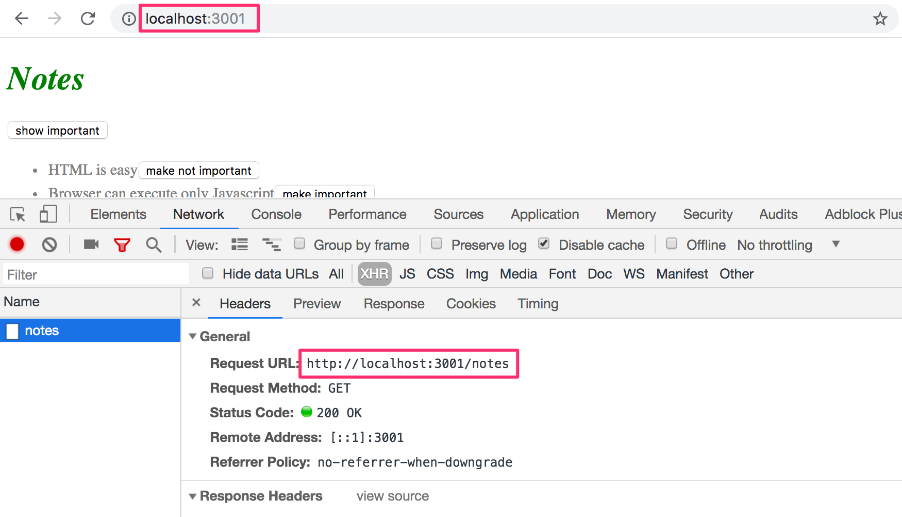
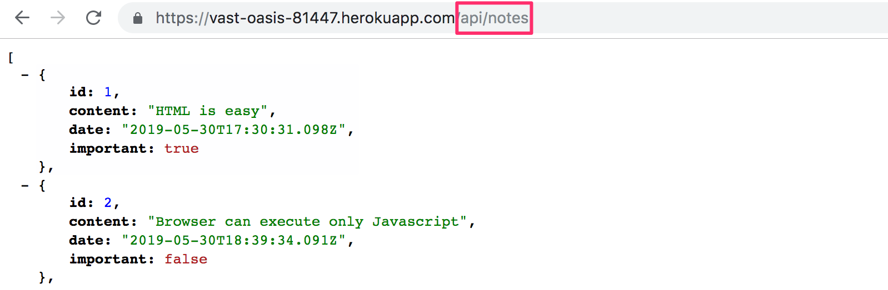
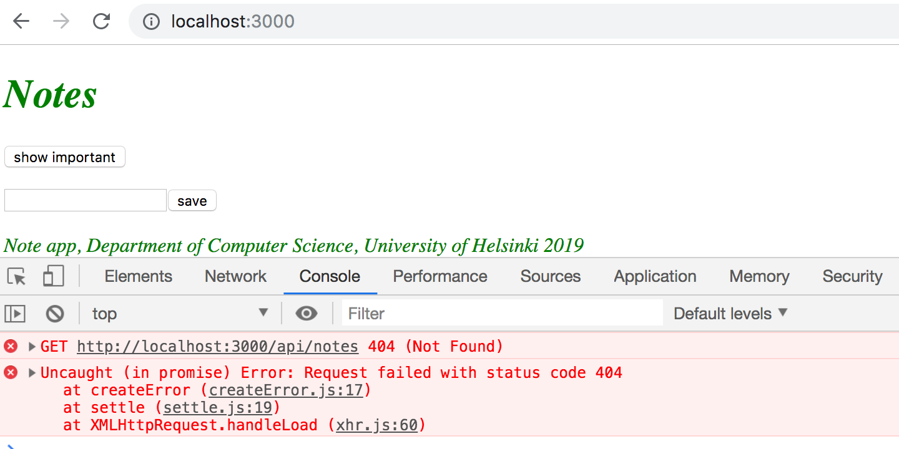

<div class="content">

Let's continue with our efforts to use the new backend with the React-frontend from [part 2](/en/part2).
Our last attempt failed with the following error message:


For some reason, the GET-request sent by the frontend to the address <http://localhost:3001/notes> is not working. Why is that? The backend works just fine in the browser and with postman. 

### Same origin policy and CORS

The issue lies with a thing called CORS, or Cross-origin resource sharing. 

According to [Wikipedia](https://en.wikipedia.org/wiki/Cross-origin_resource_sharing):

> <i>Cross-origin resource sharing (CORS) is a mechanism that allows restricted resources (e.g. fonts) on a web page to be requested from another domain outside the domain from which the first resource was served. A web page may freely embed cross-origin images, stylesheets, scripts, iframes, and videos. Certain "cross-domain" requests, notably Ajax requests, are forbidden by default by the same-origin security policy.</i>

In our context the problem is that, by default, the JavaScript code of an application that runs in a browser can only communicate with a server in the same [origin](https://developer.mozilla.org/en-US/docs/Web/Security/Same-origin_policy). 
Because our server is in localhosts port 3001, and our frontend in localhost port 3000, they do not have the same origin.

Keep in mind, that [same origin policy](https://developer.mozilla.org/en-US/docs/Web/Security/Same-origin_policy) and CORS are not specific to React or Node. They are in fact universal principles of the operation of web applications. 

We can allow for requests from other <i>origins</i> by using Nodes [cors](https://github.com/expressjs/cors)-middleware.

Install <i>cors</i> with the command

```bash
npm install cors --save
```

take the middleware to use and allow for requests from all origins: 

```js
const cors = require('cors')

app.use(cors())
```

And the frontend works! However, the functionality for changing the importance of notes has not yet been implemented to the backend. 

You can read more about CORS from [Mozillas page](https://developer.mozilla.org/en-US/docs/Web/HTTP/CORS).

### Application to the Internet

Now that the whole stack is ready, let's move our application to the internet. We'll use good old [Heroku](https://www.heroku.com) for this.

>If you have never used Heroku before, you can find instructions from [Heroku documentation](https://devcenter.heroku.com/articles/getting-started-with-nodejs) or by Googling.

Add a file called  <i>Procfile</i> to the projects root to tell Heroku how to start the application. 

```bash
web: node index.js
```

Change the definition of the port our application uses at the bottom of the <i>index.js</i> file like so: 

```js
const PORT = process.env.PORT || 3001  // highlight-line
app.listen(PORT, () => {
  console.log(`Server running on port ${PORT}`)
})
```

Now we are using the port defined in [environment variable](https://en.wikipedia.org/wiki/Environment_variable) _PORT_ or port 3001 if the environment variable _PORT_ is undefined. 
Heroku configures application port based on the environment variable. 

Create a git-repository in the project directory, and add <i>.gitignore</i> with the following contents

```bash
node_modules
```

Create an heroku-application with the command <i>heroku create</i>, create a git-repository in the application directory, commit the code and move it to Heroku with command <i>git push heroku master</i>.

If everything went well, the application works:



If not, the issue can be found by reading heroku logs with command <i>heroku logs</i>.

>**NB** At least in the beginning it's good to keep an eye on the heroku logs at all times. The best way to do this is with command <i>heroku logs -t</i> which prints the logs to console whenever something happens on the server. 

The frontend also works with the backend on Heroku. You can check this by changing the backends address on the frontend to be the backends address in Heroku instead of <i>http://localhost:3001</i>.

The next question is, how do we deploy the frontend to the Internet? We have multiple options. Let's go through one of them next. 

### Frontend production build

So far we have been running React-code in <i>development mode</i>. In development mode the application is configured to give clear error messages, immediately render code changes to the browser, and so on. 

When the application is deployed, we must create a [production build](https://reactjs.org/docs/optimizing-performance.html#use-the-production-build) or a version of the application which is optimized for production. 

A production build of applications created with <i>create-react-app</i> can be created with command [npm run build](https://github.com/facebookincubator/create-react-app#npm-run-build-or-yarn-build).

Let's run this command from the <i>root of the frontend project</i>.

This creates a directory called <i>build</i> (which contains the only html-file of our application, <i>index.html</i> ) which contains the directory <i>static</i>. [Minified](<https://en.wikipedia.org/wiki/Minification_(programming)>) version of our applications JavaScript code will be generated to the <i>static</i>  directory. Even though the application code is in multiple files, all of the JavaScript will be minified into one file. Actually all of the code from all of the applications dependencies will also be minified into this single file. 

The minified code is not very readable. The beginning of the code looks like this: 

```js
!function(e){function r(r){for(var n,f,i=r[0],l=r[1],a=r[2],c=0,s=[];c<i.length;c++)f=i[c],o[f]&&s.push(o[f][0]),o[f]=0;for(n in l)Object.prototype.hasOwnProperty.call(l,n)&&(e[n]=l[n]);for(p&&p(r);s.length;)s.shift()();return u.push.apply(u,a||[]),t()}function t(){for(var e,r=0;r<u.length;r++){for(var t=u[r],n=!0,i=1;i<t.length;i++){var l=t[i];0!==o[l]&&(n=!1)}n&&(u.splice(r--,1),e=f(f.s=t[0]))}return e}var n={},o={2:0},u=[];function f(r){if(n[r])return n[r].exports;var t=n[r]={i:r,l:!1,exports:{}};return e[r].call(t.exports,t,t.exports,f),t.l=!0,t.exports}f.m=e,f.c=n,f.d=function(e,r,t){f.o(e,r)||Object.defineProperty(e,r,{enumerable:!0,get:t})},f.r=function(e){"undefined"!==typeof Symbol&&Symbol.toStringTag&&Object.defineProperty(e,Symbol.toStringTag,{value:"Module"})
```

### Serving static files from the backend

One option for deploying the frontend is to copy the production build (the <i>build</i> directory) to the root of the backend repository and configure the backend to show the frontends <i>main page</i> (the file <i>build/index.html</i>) as its main page. 

We begin by copying the production build of the frontend to the root of the backend. With my computer the copying can be done from the frontend directory with the command

```bash
cp -r build ../../../osa3/notes-backend
```

The backend directory should now look as follows:


To make express show <i>static content</i>, the page <i>index.html</i> and the JavaScript etc. it fetches, we need built-in middleware from express called [static](http://expressjs.com/en/starter/static-files.html).

When we add the following amidst the declarations of middlewares
```js
app.use(express.static('build'))
```

whenever express gets a HTTP GET-request it will first check if the <i>build</i> directory contains a file corresponding to the requests address. If a correct file is found, express will return it. 

Now HTTP GET-request to the address <i>www.serversaddress.com/index.html</i> or <i>www.serversaddress.com</i> will show the React frontend. GET-request to the address <i>www.serversaddress.com/notes</i> will be handled by the backends code.

Because in our situation both the frontend and the backend are at the same address, we can declare _baseUrl_ as a [relative](https://www.w3.org/TR/WD-html40-970917/htmlweb.html#h-5.1.2) URL. This means we can leave out the part declaring the server. 

```js
import axios from 'axios'
const baseUrl = '/notes' // highlight-line

const getAll = () => {
  const request = axios.get(baseUrl)
  return request.then(response => response.data)
}

// ...
```

After the change we have to create a new production build and copy it to the root of the backend repository. 

The application can now be used from the <i>backend</i> address <http://localhost:3001>:


Our application now works exactly like the [Single page app](/en/part0/fundamentals_of_web_apps#single-page-app) example application we studied in part 0. 

When we use a browser to go to the address <http://localhost:3001>, the server returns the <i>index.html</i> file from the <i>build</i> repository. Summarized contents of the file are as follows: 

```html
<head>
  <meta charset="utf-8"/>
  <title>React App</title>
  <link href="/static/css/main.f9a47af2.chunk.css" rel="stylesheet">
</head>
<body>
  <div id="root"></div>
  <script src="/static/js/1.578f4ea1.chunk.js"></script>
  <script src="/static/js/main.104ca08d.chunk.js"></script>
</body>
</html>
```

The file contains instructions to fetch a CSS-stylesheet defining the styles of the application, and two <i>script</i> tags which instruct the browser to fetch the JavaScript code of the application - the actual React application. 

The React code fetches notes from the server address <http://localhost:3001/notes> and renders them to the screen. The communications between the server and the browser can be seen in the <i>Network</i> tab of the developer console:



After ensuring that the production version of the application works locally, commit the production build of the frontend to the backend repository, and push the code to heroku again. 

[The application](https://vast-oasis-81447.herokuapp.com/) works perfectly, except we haven't added the functionality for changing the importance of a note to the backend yet. 


Our application saves the notes to a variable. If the application crashes or is restarted, all of the data will disappear. 

The application needs a database. Before we introduce one, let's go through a few things. 

###  Streamlining deploying of the frontend 

To create a new production build of the frontend without extra manual work, let's add some npm-scripts to the <i>package.json</i> of the backend repository: 

```json
{
  "scripts": {
    "build:ui": "rm -rf build && cd ../../osa2/materiaali/notes-new && npm run build --prod && cp -r build ../../../osa3/notes-backend/",
    "deploy": "git push heroku master",
    "deploy:full": "npm run build:ui && git add . && git commit -m uibuild && git push && npm run deploy",    
    "logs:prod": "heroku logs --tail"
  }
}
```

The script _npm run build:ui_ builds the frontend and copies the production version under the backend repository.  _npm run deploy_ releases the current backend to heroku. 

_npm run deploy:full_ combines these two and contains the necessary <i>git</i> commands to update the backend repository. 

There is also a script _npm run logs:prod_ to show the heroku logs.

Note that the directory paths in the script <i>build:ui</i> depend on the location of repositories in the file system.

### Backend URLs

Our backends api for handling the notes is currently at the applications root URL <https://vast-oasis-81447.herokuapp.com/>. This means that <https://vast-oasis-81447.herokuapp.com/notes> is the list of all notes and so on. The role of the backend is to offer a machine readable interface, or an API, to the frontend. It might be better to name the API addresses more clearly, for example by starting all of them with the word _api_.

Let's change **all backend routes** by hand: 

```js
//...
app.get('/api/notes', (request, response) => {
  response.json(notes)
})
//...
```

Frontend code only requires the following change: 

```js
import axios from 'axios'
const baseUrl = '/api/notes'  // highlight-line

const getAll = () => {
  const request = axios.get(baseUrl)
  return request.then(response => response.data)
}

// ...
```

After these changes i.e the API endpoint for all notes is <https://vast-oasis-81447.herokuapp.com/api/notes>.



Frontend is still at the root of the application at <https://vast-oasis-81447.herokuapp.com/>. 

>Sidenote: **API versions**
>
>Sometimes APIs URLs also show the version of the API. Different versions might be needed if the API is extended over time, and the changes could break existing parts of the programs. With versioning new,  slightly different versions of the API can be used alongside of the older versions. 
>
>Not everyone thinks expressing the API version on the URL is a good idea, even though it is done quite often. The right way of versioning APIs is debated [all over the internet](https://stackoverflow.com/questions/389169/best-practices-for-api-versioning).


### Proxy

Changes on the frontend have caused it to no longer work in development mode (when started with command _npm start_), as the connection to the backend does not work. 



This is due to changing the backend address to a relative URL: 

```js
const baseUrl = '/api/notes'
```

Because in development mode the frontend is at the address <i>localhost:3000</i>, the requests to the backend go to the wrong address <i>localhost:3000/api/notes</i>. The backend is at <i>localhost:3001</i>. 

If the project was created with create-react-app, this problem is easy to solve. It is enough to add the following declaration to the <i>package.json</i> file of the frontend repository. 

```bash
{
  "dependencies": {
    // ...
  },
  "scripts": {
    // ...
  },
  "proxy": "http://localhost:3001"  // highlight-line
}
```

After a restart, the react development environment will work as a [proxy](https://github.com/facebookincubator/create-react-app/blob/master/packages/react-scripts/template/README.md#proxying-api-requests-in-development). If the React code does a HTTP-request to a server address at <i>http://localhost:3000</i> not managed by the React application itself (so when the request is not about i.e fetching the CSS or JavaScript for the application), the request will be redirected to the server at <i>http://localhost:3001</i>. 

Now the frontend is also fine, working with the server both in development- and production mode. 

A negative aspect of our approach is how complicated it is to deploy the frontend. Deploying a new version requires generating new production build of the frontend and copying it to the backend repository. This makes creating an automated [deployment pipeline](https://martinfowler.com/bliki/DeploymentPipeline.html) more difficult. Deployment pipeline means an automated and controlled way to move the code from the computer of the developer through different tests and quality checks to the production environment. 

There are multiple ways to achieve this (for example placing both backend and frontend code [to the same repository](https://github.com/mars/heroku-cra-node) ) but we will not go into those now. 

In some situations it may be sensible to deploy the frontend code as it's own application. With apps created with create-react-app it is [straightforward](https://github.com/mars/create-react-app-buildpack).

Current code of the backend can be found on [github](https://github.com/fullstackopen-2019/part3-notes-backend/tree/part3-3), in the branch <i>part3-3</i>. The changes in frontend code are in <i>part3-1</i> branch of the [frontend repository](https://github.com/fullstackopen-2019/part2-notes/tree/part3-1).

</div>

<div class="tasks">

### Exercises

The following exercises don't require many lines of code. They can however be challenging, because you must understand exactly what is happening and where, and the configurations must be just right. 

#### 3.9 phonebook backend step9

Make the backend work with the frontend from the previous part. Do not implement the functionality for making changes to the phone numbers yet, that will be implemented in exercise 3.17. 

You will probably have to do some small changes to the frontend, at least to the URL's for the backend. Remember to keep the developer console open in your browser. If some HTTP-requests fail, you should check from the <i>Network</i>-tab what is going on. Keep an eye on the backends console as well. If you did not do the previous exercise, it is worth it to print the request data or <i>request.body</i> to the console in the event handler responsible for POST-requests. 

#### 3.10 phonebook backend step10

Deploy the backend to the internet, for example to Heroku. 

**NB** the command _heroku_ works on the department's computers and the freshman laptops. If for some reason you cannot [install](https://devcenter.heroku.com/articles/heroku-cli) heroku to your computer, you can use the command [npx heroku-cli](https://www.npmjs.com/package/heroku-cli).

Test the deployed backend with a browser and postman or VS Code REST client to ensure it works. 

**PRO TIP:** When you deploy your application to heroku, it is worth it to at least in the beginning keep an eye on the logs of the heroku application **AT ALL TIMES** with the command <em>heroku logs -t</em>.

The following is a log about one typical problem. Heroku cannot find application dependency <i>express</i>:


The reason is, that the option <i>--save</i> was forgotten when <i>express</i> was installed, so information about the dependency was not saved to the file <i>package.json</i>.

Another typical problem is, that the application is not configured to use the port set to environment variable <em>PORT</em>: 


Create a README.md to the root of your repository, and add a link to your online application to it. 

#### 3.11 phonebook full stack

Generate a production build of your frontend, and add it to the internet application using the method introduced in this part. 

**NB** Make sure the directory <i>build</i> is not gitignored

Also make sure that the frontend still works locally as well. 

</div>
