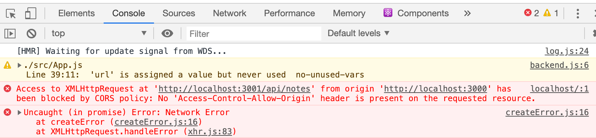
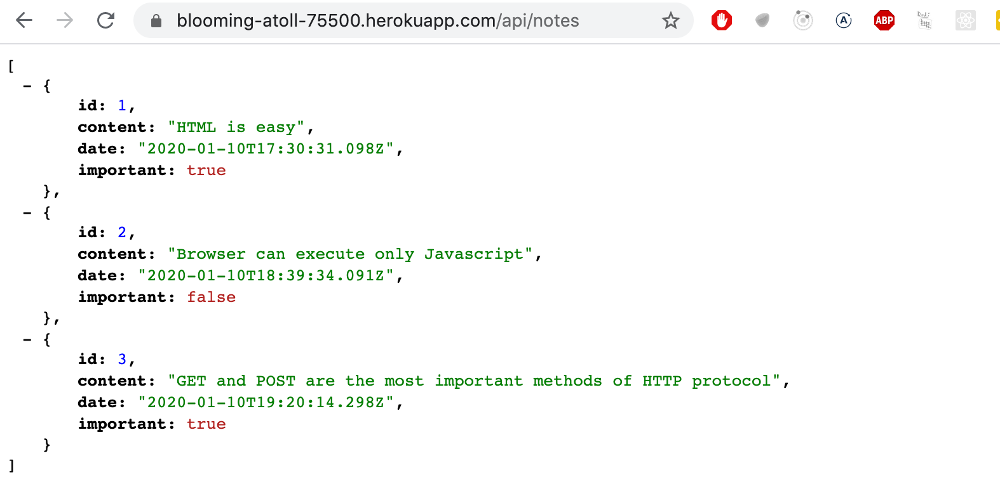
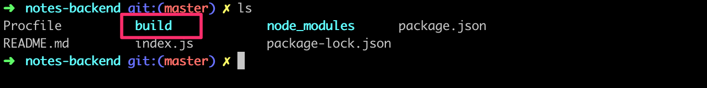
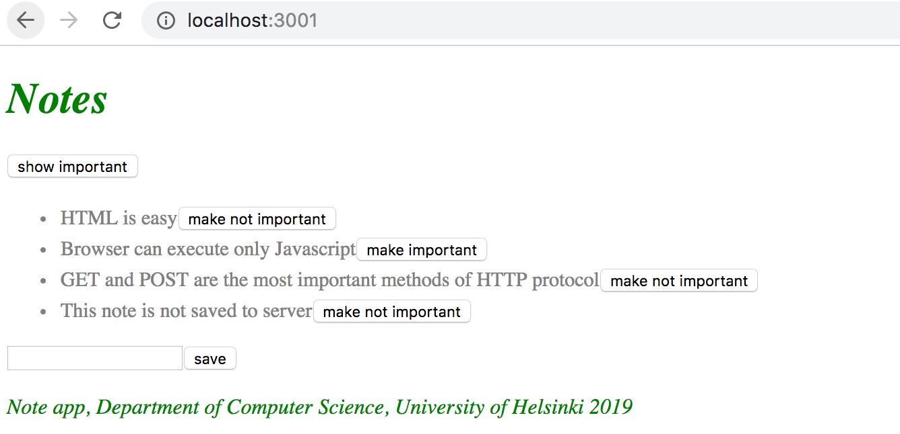
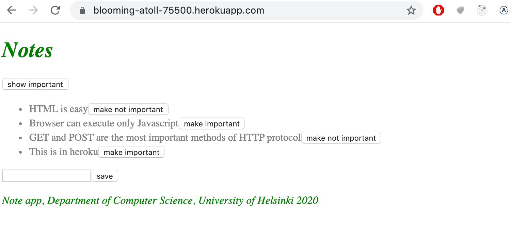
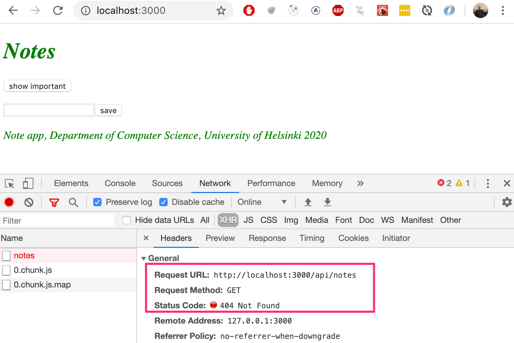

<div class="content">

A continuación, conectemos el frontend que creamos en la [parte 2](/es/part2) a nuestro propio backend.

En la parte anterior, el frontend podía pedir la lista de notas del servidor json que teníamos como backend, desde la dirección http://localhost:3001/notes. Nuestro backend tiene ahora una estructura de URL ligeramente diferente, ya que las notas se pueden encontrar en http://localhost:3001/api/notes. Cambiemos el atributo _baseUrl_ en <i>src/services/notes.js</i> así:

```js
import axios from 'axios'
const baseUrl = 'http://localhost:3001/api/notes' //highlight-line

const getAll = () => {
  const request = axios.get(baseUrl)
  return request.then(response => response.data)
}

// ...

export default { getAll, create, update }
```

Ahora la solicitud GET del frontend a <http://localhost:3001/api/notes> no funciona por alguna razón:



¿Que está pasando aqui? Podemos acceder al backend desde un navegador y desde cartero sin ningún problema.

### Política de mismo origen y CORS

El problema radica en algo llamado CORS, o intercambio de recursos de origen cruzado.

Según [Wikipedia](https://en.wikipedia.org/wiki/Cross-origin_resource_sharing):

> <i>El intercambio de recursos de origen cruzado (CORS) es un mecanismo que permite solicitar recursos restringidos (por ejemplo, fuentes) en una página web desde otro dominio fuera del dominio desde el que se sirvió el primer recurso. Una página web puede incrustar libremente imágenes, hojas de estilo, scripts, iframes y videos de origen cruzado. Ciertas solicitudes "entre dominios", en particular las solicitudes Ajax, están prohibidas de forma predeterminada por la política de seguridad del mismo origen.</i>

En nuestro contexto, el problema es que, por defecto, el código JavaScript de una aplicación que se ejecuta en un navegador solo puede comunicarse con un servidor en el mismo [origen](https://developer.mozilla.org/en-US/docs/Web/Security/Same-origin_policy). Debido a que nuestro servidor está en el puerto localhost 3001 y nuestra interfaz en el puerto localhost 3000, no tienen el mismo origen.

Tenga en cuenta que la [política de mismo origen](https://developer.mozilla.org/en-US/docs/Web/Security/Same-origin_policy) y CORS no son específicos de React o Node. De hecho, son principios universales del funcionamiento de las aplicaciones web.

Podemos permitir solicitudes de otros <i>orígenes</i> utilizando el middleware [cors](https://github.com/expressjs/cors) de Node.

Instalemos <i>cors</i> con el comando

```bash
npm install cors
```

tomemos el middleware para usar y así permitimos solicitudes de todos los orígenes:

```js
const cors = require('cors')

app.use(cors())
```

¡Y el frontend funciona! Sin embargo, la funcionalidad para cambiar la importancia de las notas aún no se ha implementado en el backend.

Puedes leer más sobre CORS en la [página de Mozilla](https://developer.mozilla.org/en-US/docs/Web/HTTP/CORS).

### Aplicación a Internet

Ahora que todo el stack está listo, muevamos nuestra aplicación a Internet. Usaremos al bueno de [Heroku](https://www.heroku.com) para esto.

> Si nunca antes ha usado Heroku, puede encontrar instrucciones en la [documentación de Heroku](https://devcenter.heroku.com/articles/getting-started-with-nodejs) o en Google.

Agregue un archivo llamado <i>Procfile</i> a la raíz del proyecto para indicarle a Heroku cómo iniciar la aplicación.

```bash
web: npm start
```

Cambie la definición del puerto que usa nuestra aplicación en la parte inferior del archivo <i>index.js</i> así:

```js
const PORT = process.env.PORT || 3001  // highlight-line
app.listen(PORT, () => {
  console.log(`Server running on port ${PORT}`)
})
```

Ahora estamos usando el puerto definido en la [variable de entorno](https://en.wikipedia.org/wiki/Environment_variable) _PORT_ o el puerto 3001 si la variable de entorno _PORT_ no está definida. Heroku configura el puerto de la aplicación según la variable de entorno.

Cree un repositorio de Git en el directorio del proyecto y agregue <i>.gitignore</i> con el siguiente contenido

```bash
node_modules
```

Cree una aplicación Heroku con el comando <i>heroku create</i>, envíe su código al repositorio y muévalo a Heroku con el comando <i>git push heroku main</i>.

Si todo salió bien, la aplicación funciona:



De lo contrario, el problema se puede encontrar leyendo los registros de heroku con el comando <i>heroku logs</i>.

>**NB** Al menos al principio, es bueno estar atento a los registros de heroku en todo momento. La mejor manera de hacer esto es con el comando <i>heroku logs -t</i> que imprime los registros en la consola cada vez que sucede algo en el servidor.

>**NB** Si está implementando desde un repositorio git donde su código no está en la rama principal (es decir, si está alterando el [repositorio de notas](https://github.com/fullstack-hy2020/part3-notes-backend/tree/part3-2) de la última lección), deberá ejecutar _git push heroku HEAD:master_. Si ya ha hecho un push a heroku, es posible que deba ejecutar _git push heroku HEAD:main --force_.

El frontend también funciona con el backend de Heroku. Puede verificar esto cambiando la dirección del backend en el frontend para que sea la dirección del backend en Heroku en lugar de <i>http://localhost:3001</i>.

La siguiente pregunta es, ¿cómo implementamos el frontend en Internet? Tenemos múltiples opciones. Repasemos uno de ellos a continuación.


### Frontend production build

Hasta ahora hemos estado ejecutando el código de React en <i>modo de desarrollo</i>. En el modo de desarrollo, la aplicación está configurada para dar mensajes de error claros, mostrar inmediatamente los cambios de código en el navegador, etc.

Cuando se implementa la aplicación, debemos crear una [compilación de producción](https://reactjs.org/docs/optimizing-performance.html#use-the-production-build) o una versión de la aplicación que esté optimizada para la producción.

Una compilación de producción de aplicaciones creadas con <i>create-react-app</i> se puede crear con el comando [npm run build](https://github.com/facebookincubator/create-react-app#npm-run-build-or-yarn-build).

Ejecutemos este comando desde la <i>raíz del proyecto frontend</i>.

Esto crea un directorio llamado <i>build</i> (que contiene el único archivo HTML de nuestra aplicación, <i>index.html</i> ) que contiene el directorio <i>static</i>. Se generará una versión [Minified](<https://en.wikipedia.org/wiki/Minification_(programming)>)(reducida) del código JavaScript de nuestra aplicación en el directorio <i>static</i>. Aunque el código de la aplicación está en varios archivos, todo el JavaScript se minificará en un solo archivo. En realidad, todo el código de todas las dependencias de la aplicación también se minificará en este único archivo.

El código minificado no es muy legible. El comienzo del código se ve así:

```js
!function(e){function r(r){for(var n,f,i=r[0],l=r[1],a=r[2],c=0,s=[];c<i.length;c++)f=i[c],o[f]&&s.push(o[f][0]),o[f]=0;for(n in l)Object.prototype.hasOwnProperty.call(l,n)&&(e[n]=l[n]);for(p&&p(r);s.length;)s.shift()();return u.push.apply(u,a||[]),t()}function t(){for(var e,r=0;r<u.length;r++){for(var t=u[r],n=!0,i=1;i<t.length;i++){var l=t[i];0!==o[l]&&(n=!1)}n&&(u.splice(r--,1),e=f(f.s=t[0]))}return e}var n={},o={2:0},u=[];function f(r){if(n[r])return n[r].exports;var t=n[r]={i:r,l:!1,exports:{}};return e[r].call(t.exports,t,t.exports,f),t.l=!0,t.exports}f.m=e,f.c=n,f.d=function(e,r,t){f.o(e,r)||Object.defineProperty(e,r,{enumerable:!0,get:t})},f.r=function(e){"undefined"!==typeof Symbol&&Symbol.toStringTag&&Object.defineProperty(e,Symbol.toStringTag,{value:"Module"})
```

### Sirviendo archivos estáticos desde el backend

Una opción para implementar el frontend es copiar la compilación de producción (el directorio <i>build</i>) a la raíz del repositorio del backend y configurar el backend para que muestre la <i>página principal</i> del frontend (el archivo <i>build/index.html</i>) como su página principal.

Comenzamos copiando la compilación de producción del frontend a la raíz del backend. Con una computadora Mac o Linux, la copia se puede hacer desde el directorio frontend con el comando

```bash
cp -r build ../../../osa3/notes-backend
```

Si está usando una computadora con Windows, puede usar el comando [copy](https://www.windows-commandline.com/windows-copy-command-syntax-examples/) o [xcopy](https://www.windows-commandline.com/xcopy-command-syntax-examples/) en su lugar. De lo contrario, simplemente copia y pega.

El directorio de backend ahora debería verse como sigue:



Para hacer que express muestre <i>contenido estático</i>, la página <i>index.html</i>  y el JavaScript, etc., necesitamos un middleware integrado de express llamado [static](http://expressjs.com/en/starter/static-files.html).

Cuando agregamos lo siguiente en medio de las declaraciones de middlewares

```js
app.use(express.static('build'))
```

siempre que express recibe una solicitud HTTP GET, primero verificará si el directorio <i>build</i> contiene un archivo correspondiente a la dirección de la solicitud. Si se encuentra un archivo correcto, express lo devolverá.

Ahora las solicitudes HTTP GET a la dirección <i>www.serversaddress.com/index.html</i> o <i>www.serversaddress.com</i> mostrarán el frontend de React. Las solicitudes GET a la dirección <i>www.serversaddress.com/api/notes</i> serán manejadas por el código del backend.

Debido a nuestra situación, tanto el frontend como el backend están en la misma dirección, podemos declarar _baseUrl_ como una URL [relativa](https://www.w3.org/TR/WD-html40-970917/htmlweb.html#h-5.1.2). Esto significa que podemos omitir la parte que declara el servidor.

```js
import axios from 'axios'
const baseUrl = '/api/notes' // highlight-line

const getAll = () => {
  const request = axios.get(baseUrl)
  return request.then(response => response.data)
}

// ...
```

Después del cambio, tenemos que crear una nueva compilación de producción y copiarla en la raíz del repositorio de backend.

La aplicación ahora se puede utilizar desde la dirección de <i>backend</i> <http://localhost:3001>:




Nuestra aplicación ahora funciona exactamente como la aplicación de ejemplo de [aplicación de una sola](/es/part0/fundamentals_of_web_apps#single-page-app) página que estudiamos en la parte 0.

Cuando usamos un navegador para ir a la dirección <http://localhost:3001>, el servidor devuelve el archivo <i>index.html</i> del repositorio de <i>compilación</i>. El contenido resumido del archivo es el siguiente:

```html
<head>
  <meta charset="utf-8"/>
  <title>React App</title>
  <link href="/static/css/main.f9a47af2.chunk.css" rel="stylesheet">
</head>
<body>
  <div id="root"></div>
  <script src="/static/js/1.578f4ea1.chunk.js"></script>
  <script src="/static/js/main.104ca08d.chunk.js"></script>
</body>
</html>
```

El archivo contiene instrucciones para obtener una hoja de estilo CSS que define los estilos de la aplicación, y dos etiquetas de <i>script</i> que indican al navegador que obtenga el código JavaScript de la aplicación: la aplicación React real.

El código de React obtiene notas de la dirección del servidor <http://localhost:3001/api/notes> y las muestra en la pantalla. Las comunicaciones entre el servidor y el navegador se pueden ver en la pestaña <i>Network</i> de la consola del desarrollador:


Después de asegurarse de que la versión de producción de la aplicación funcione localmente, haga un commit de la compilación de producción del frontend en el repositorio de backend y envíe el código a Heroku nuevamente.

[La aplicación](https://vast-oasis-81447.herokuapp.com/) funciona perfectamente, excepto que aún no hemos agregado la funcionalidad para cambiar la importancia de una nota en el backend.



Nuestra aplicación guarda las notas en una variable. Si la aplicación falla o se reinicia, todos los datos desaparecerán.

La aplicación necesita una base de datos. Antes de presentar uno, repasemos algunas cosas.


###  Optimización de la implementación del frontend

Para crear una nueva compilación de producción del frontend sin trabajo manual adicional, agreguemos algunos scripts npm al <i>package.json</i> del repositorio de backend:

```json
{
  "scripts": {
    //...
    "build:ui": "rm -rf build && cd ../../osa2/materiaali/notes-new && npm run build --prod && cp -r build ../../../osa3/notes-backend/",
    "deploy": "git push heroku main",
    "deploy:full": "npm run build:ui && git add . && git commit -m uibuild && npm run deploy",    
    "logs:prod": "heroku logs --tail"
  }
}
```

El script  _npm run build:ui_ construye el frontend y copia la versión de producción en el repositorio backend. _npm run deploy_ libera el backend actual a heroku.

_npm run deploy:full_: full combina estos dos y contiene los comandos <i>git</i> necesarios para actualizar el repositorio de backend.

También hay un script _npm run logs:prod_ para mostrar los logs de heroku.

Tenga en cuenta que las rutas de directorio en el script <i>build:ui</i> dependen de la ubicación de los repositorios en el sistema de archivos.

>**NB** En Windows, los scripts npm se ejecutan en cmd.exe como el shell predeterminado que no admite comandos bash. Para que los comandos de bash anteriores funcionen, puede cambiar el shell predeterminado a Bash (en la instalación predeterminada de Git para Windows) de la siguiente manera:

```md
npm config set script-shell "C:\\Program Files\\git\\bin\\bash.exe"
```

### Proxy

Los cambios en el frontend han hecho que ya no funcione en el modo de desarrollo (cuando se inicia con el comando _npm start_), ya que la conexión con el backend no funciona.



Esto se debe al cambio de la dirección de backend a una URL relativa:

```js
const baseUrl = '/api/notes'
```

Debido a que en el modo de desarrollo el frontend está en la dirección <i>localhost:3000</i>, las solicitudes al backend van a la dirección incorrecta <i>localhost:3000/api/notes</i>.. El backend está en <i>localhost:3001</i>.

Si el proyecto se creó con create-react-app, este problema es fácil de resolver. Es suficiente agregar la siguiente declaración al archivo <i>package.json</i> del repositorio de frontend.

```bash
{
  "dependencies": {
    // ...
  },
  "scripts": {
    // ...
  },
  "proxy": "http://localhost:3001"  // highlight-line
}
```

Después de reiniciar, el entorno de desarrollo de React funcionará como un [proxy](https://create-react-app.dev/docs/proxying-api-requests-in-development/). Si el código de React realiza una solicitud HTTP a una dirección de servidor en <i>http://localhost:3000</i> no administrada por la aplicación React en sí (es decir, cuando las solicitudes no tratan de obtener el CSS o JavaScript de la aplicación), la solicitud se redirigirá a el servidor en <i>http://localhost:3001</i>.

Ahora el frontend también está bien, trabajando con el servidor tanto en el modo de desarrollo como en el de producción.

Un aspecto negativo de nuestro enfoque es lo complicado que es implementar el frontend. La implementación de una nueva versión requiere generar una nueva compilación de producción del frontend y copiarla en el repositorio de backend. Esto dificulta la creación de una [canalización de implementación](https://martinfowler.com/bliki/DeploymentPipeline.html) automatizada. La canalización de implementación significa una forma automatizada y controlada de mover el código desde la computadora del desarrollador a través de diferentes pruebas y controles de calidad al entorno de producción.

Hay varias formas de lograr esto (por ejemplo, colocando tanto el código de backend como el de frontend [en el mismo repositorio](https://github.com/mars/heroku-cra-node) ) pero no vamos a entrar en ellos ahora.

En algunas situaciones, puede ser sensato implementar el código del frontend como su propia aplicación. Con las aplicaciones creadas con create-react-app es [sencillo](https://github.com/mars/create-react-app-buildpack) .

El código actual del backend se puede encontrar en [Github](https://github.com/fullstack-hy2020/part3-notes-backend/tree/part3-3), en la rama <i>part3-3</i>. Los cambios en el código del frontend están en la rama <i>part3-1</i> del [repositorio del frontend](https://github.com/fullstack-hy2020/part2-notes/tree/part3-1).

</div>

<div class="tasks">

### Ejercicios 3.9.-3.11.

Los siguientes ejercicios no requieren muchas líneas de código. Sin embargo, pueden ser un desafío, porque debe comprender exactamente qué está sucediendo y dónde, y las configuraciones deben ser las correctas.

#### 3.9 backend de la agenda telefónica, paso 9

Haga que el backend funcione con el frontend de la parte anterior. No implemente todavía la funcionalidad para realizar cambios en los números de teléfono, que se implementará en el ejercicio 3.17.

Probablemente tendrá que hacer algunos pequeños cambios en el frontend, al menos en las URL del backend. Recuerde mantener abierta la consola del desarrollador en su navegador. Si algunas solicitudes HTTP fallan, debe verificar en la pestaña <i>Network</i> qué está sucediendo. Vigile también la consola del backend. Si no hiciste el ejercicio anterior, vale la pena imprimir los datos de la solicitud o <i>request.body</i> en la consola en el manejador de eventos responsable de las solicitudes POST.

#### 3.10 backend de la agenda telefónica, paso 10

Implemente el backend en Internet, por ejemplo en Heroku.

Pruebe el backend implementado con un navegador y un cliente REST de Postman o VS Code para asegurarse de que funcione.

**PRO TIP:** Cuando implementes tu aplicación en Heroku, vale la pena al menos al principio estar atento a los logs de la aplicación heroku **EN TODO MOMENTO** con el comando <em>heroku logs -t</em>.

El siguiente es un log sobre un problema típico. Heroku no puede encontrar la dependencia de la aplicación <i>express</i>:


La razón es que el paquete <i>express</i> no se ha instalado con el comando <em>npm install express</em>, por lo que la información sobre la dependencia no se guardó en el archivo <i>package.json</i>.

Otro problema típico es que la aplicación no está configurada para usar el puerto configurado para la variable de entorno <em>PORT</em>:


Cree un README.md en la raíz de su repositorio y agregue un enlace a su aplicación en línea.

#### 3.11 full stack de la agenda telefónica

Genere una compilación de producción de su frontend y agréguela a la aplicación de Internet utilizando el método presentado en esta parte.

**NB** Asegúrese de que el directorio de <i>build</i> no esté ignorada en gitignore

También asegúrese de que el frontend todavía funcione localmente.

</div>
